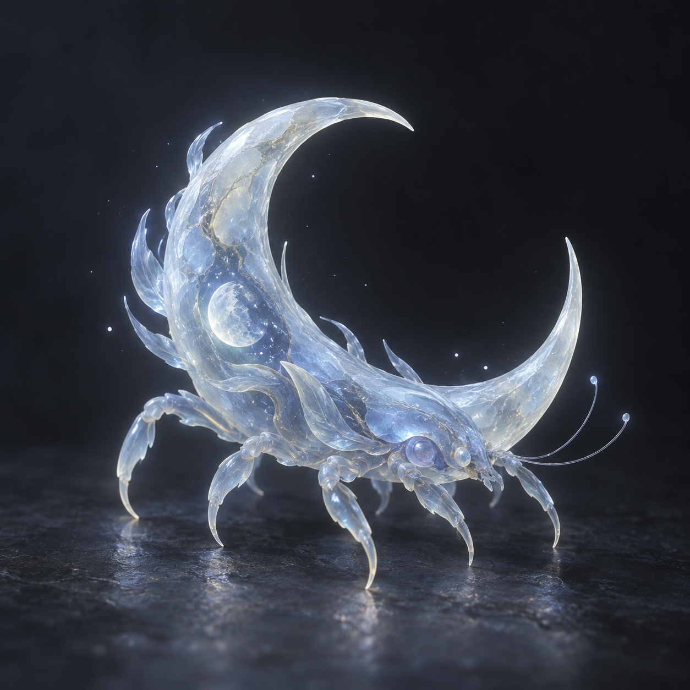
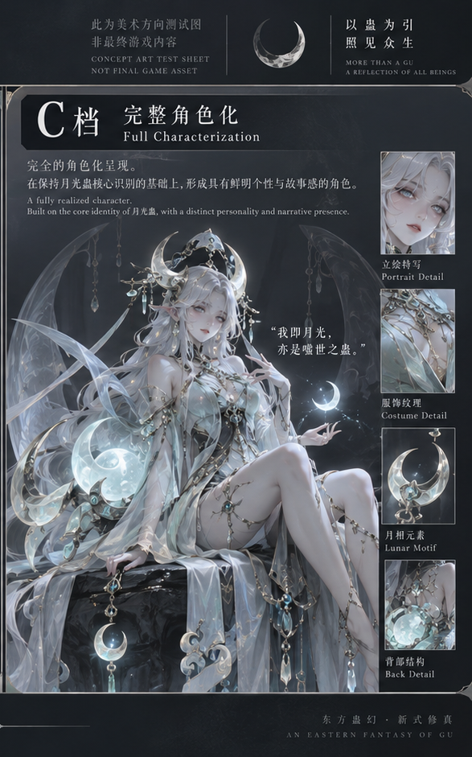

# L0 执行令 · 月光蛊视觉冻结说明

## 状态

```yaml
STATUS: FROZEN / ACTIVE
AUTHORITY: L0
DATE: 2026-09-20
SCOPE: 月光蛊本体层与收藏投影层的主线视觉参考
SUPERSEDES: 月光蛊 A / B / C 三档重选讨论
```

> 这是月光蛊当前唯一主线视觉冻结件。
> A / B 停止投入，仅保留历史探索；C 只保留为图 2 的历史面板标签，正式名称使用 `Collection Projection / Theme Skin`，不恢复 A / B / C 生产档。
>
> 本件中的图片是概念参考，不是 UI、卡牌、立绘或游戏内可直接使用的成品资产。
> 概念图只用于 Prompt 方向、来源追溯与验收对照，不得直接嵌入产品页面或替代后续原创资产。
>
> 对既有任务的关系：本件关闭“月光蛊到底采用哪张”的视觉选择前置。
> `ai-system/tasks/visual-v2-01-moonlight-poc-task.md` 中尚未执行的 Prompt 任务仍必须服从本件与统一美术对齐单，并继续经过 L1 Prompt 审查和 GPT Image 单样本门禁。

> **2026-09-25 休眠资产登记（A 档，见 [docs/dormant-registry.md](../../../docs/dormant-registry.md)）**：
> 本件与 `docs/art/standards/2026-09-20-moonlight-visual-alignment-sheet.md` 登记为**美术线重启入口**；
> 内容与 L0 2026-09-24「美术方向可以原创设计」方向一致。重启美术线时从本件与对齐单开始，
> Prompt 任务仍按上文 L1 审查与单样本门禁执行。

## 一、冻结选择

### 本体层 Canonical Form

**采用图 1。**



参考文件：

```text
docs/art/references/moonlight/canonical_form.png
```

冻结理由：

- 第一印象强；
- 一眼能看出是月光蛊；
- 符合“规则生命”的世界定位；
- 弯月、月核、冷月、玉晶生命感成立；
- 不落入普通昆虫或普通仙侠摆件套路。

### 收藏投影 Collection Projection

**采用图 2 的 C 面板。**



参考文件：

```text
docs/art/references/moonlight/collection_projection_c.png
```

冻结理由：

- 收藏价值最高；
- 吸引力最强；
- 情感锚点明确；
- 更符合主题层存在的意义；
- 不保守，具有商业传播潜力。

### 历史探索

A / B / C 三档原始对比图保留为历史参考，不再参与主线决策。

```text
docs/art/references/moonlight/anthro_tiers_abc_history.png
```

状态：

```text
A 档：历史探索 / 停止投入
B 档：历史探索 / 停止投入
C 档：仅作为图 2 历史面板标签；冻结后的正式称谓为 Collection Projection / Theme Skin
```

## 二、双层关系

```text
Canonical Form
月光蛊真实存在的规则生命形态
        ↓
Collection Projection
同一只蛊的玩家收藏表达
```

关系必须保持：

- 本体层是世界事实；
- 收藏投影是玩家表达；
- 收藏投影不是独立角色；
- 收藏投影必须能追溯回本体层；
- 主题层不得覆盖、替换或改写本体身份。

## 三、统一美术宇宙

后续重点不是重新选择方向，而是把：

```text
图 1 本体层
+
图 2C 收藏投影层
```

统一成同一个美术宇宙。

统一标准以以下文件为准：

```text
docs/art/standards/2026-09-20-moonlight-visual-alignment-sheet.md
```

## 四、后续生图门禁

后续如果继续生图，只允许走：

```text
1. L2 写任务包
2. L1 审查 Prompt
3. 仅使用 GPT Image 生图
4. 按双层一致性验收
```

禁止：

- 使用 GPT Image 以外的方式生图；
- Worker 自行写 Prompt 后直接出图；
- 一只蛊一个视觉世界观；
- 回退到旧水墨方案作为主线；
- 重新开启 A / B / C 档比较；
- 批量扩展到其他蛊虫；
- 用结构验证偷换风格验证。

## 五、当前范围

本冻结件只作用于月光蛊。

它不授权：

- 批量制作蛊虫资产；
- 扩展全部主题皮肤；
- 大规模 UI 风格扩展；
- 场景体系全面铺开；
- 修改 `game/` 数据、规则或现有资源。

后续验证与落地不预设必须走 Godot。Web 可用于快速验证，但载体必须服从验证效率，不得因为引擎偏好拖慢视觉落地。

## 六、验收问题

任何月光蛊后续资产必须先回答：

```text
1. 这是本体层还是收藏投影层？
2. 是否能看出它仍是月光蛊？
3. 是否共享弯月、月核、冷白淡蓝、玉晶材质和清冷气质？
4. 收藏投影是否明确不是世界事实？
5. 是否回退到普通仙侠、普通二游、旧水墨或独立角色换皮？
```

任一回答不成立，退回。
