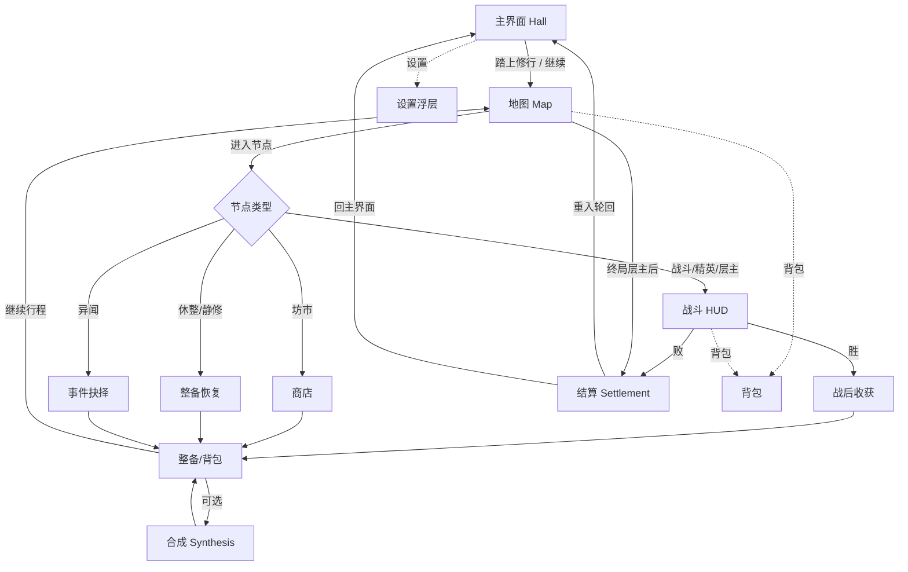
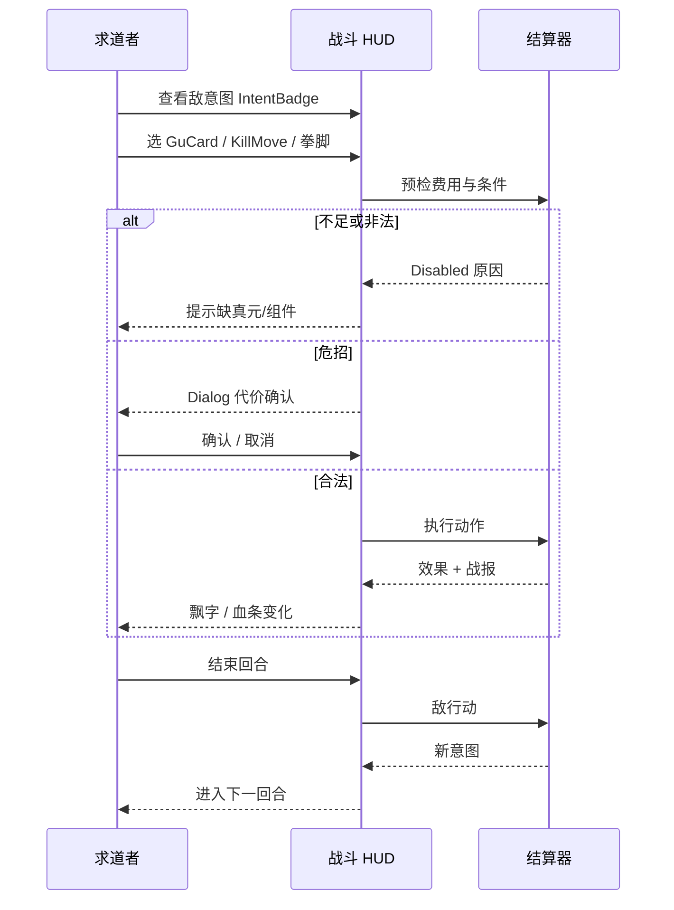
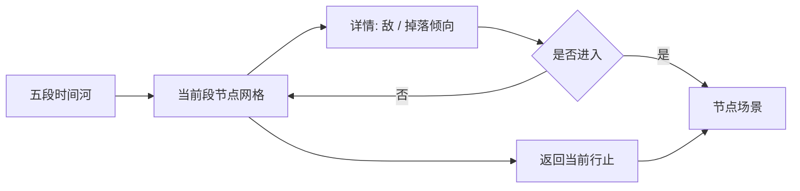
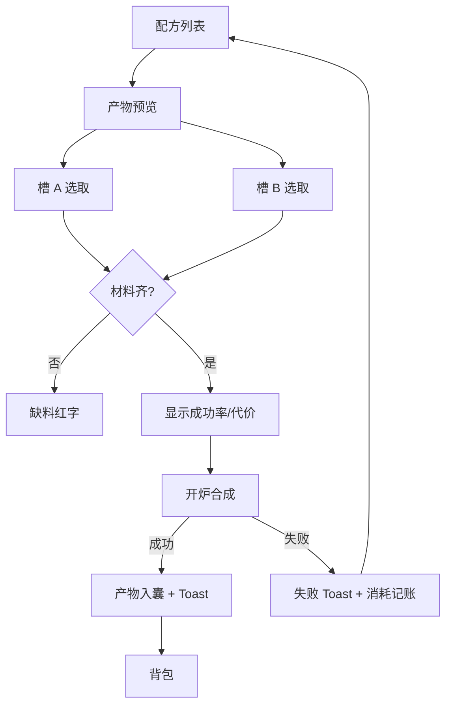
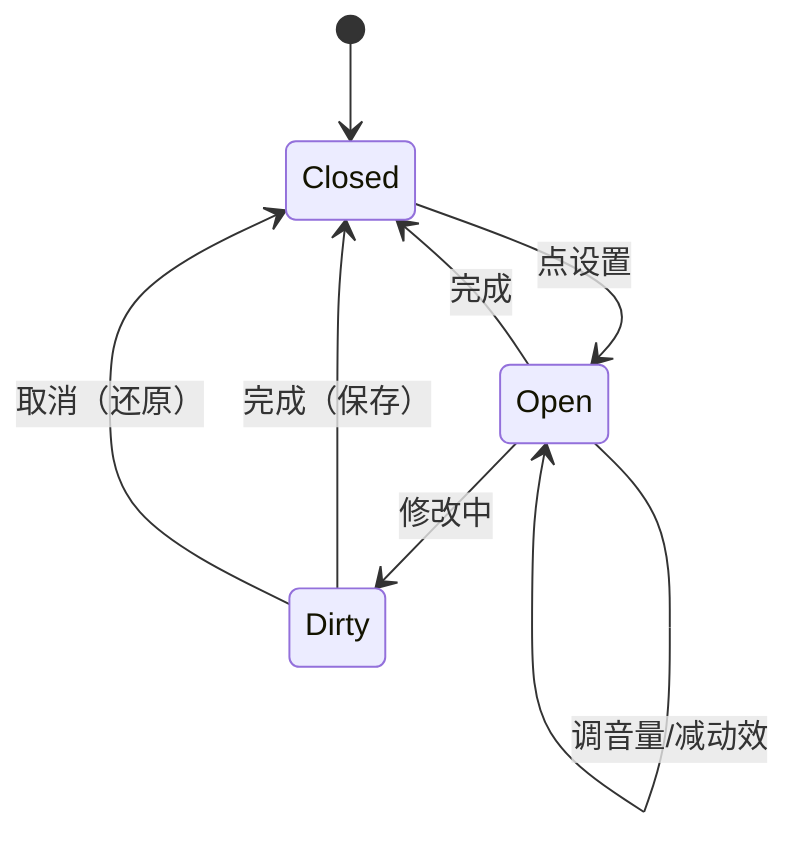
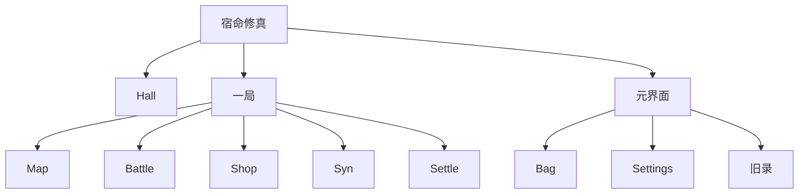

# 流程图

## 1. 总流程 · 一局修行

```mermaid
flowchart TD
  Hall[主界面 Hall] -->|踏上修行 / 继续| Map[地图 Map]
  Map -->|进入节点| Node{节点类型}
  Node -->|战斗/精英/层主| Battle[战斗 HUD]
  Node -->|坊市| Shop[商店]
  Node -->|休整/静修| Rest[整备恢复]
  Node -->|异闻| Event[事件抉择]
  Battle -->|胜| Reward[战后收获]
  Battle -->|败| Settle[结算 Settlement]
  Reward --> Prep[整备/背包]
  Shop --> Prep
  Rest --> Prep
  Event --> Prep
  Prep -->|可选| Syn[合成 Synthesis]
  Syn --> Prep
  Prep -->|继续行程| Map
  Map -->|终局层主后| Settle
  Settle -->|重入轮回| Hall
  Settle -->|回主界面| Hall
  Hall -.->|设置| Settings[设置浮层]
  Map -.->|背包| Inv[背包]
  Battle -.->|背包| Inv
```

## 2. 战斗回合

```mermaid
sequenceDiagram
  participant P as 求道者
  participant UI as 战斗 HUD
  participant R as 结算器
  P->>UI: 查看敌意图 IntentBadge
  P->>UI: 选 GuCard / KillMove / 拳脚
  UI->>R: 预检费用与条件
  alt 不足或非法
    R-->>UI: Disabled 原因
    UI-->>P: 提示缺真元/组件
  else 危招
    UI-->>P: Dialog 代价确认
    P->>UI: 确认 / 取消
  else 合法
    UI->>R: 执行动作
    R-->>UI: 效果 + 战报
    UI-->>P: 飘字 / 血条变化
  end
  P->>UI: 结束回合
  UI->>R: 敌行动
  R-->>UI: 新意图
  UI-->>P: 进入下一回合
```

## 3. 地图择路

```mermaid
flowchart LR
  S[五段时间河] --> C[当前段节点网格]
  C --> D[详情: 敌 / 掉落倾向]
  D --> E{是否进入}
  E -->|是| N[节点场景]
  E -->|否| C
  C --> B[返回当前行止]
  B --> N
```

## 4. 合成改命

```mermaid
flowchart TD
  L[配方列表] --> P[产物预览]
  P --> S1[槽 A 选取]
  P --> S2[槽 B 选取]
  S1 --> K{材料齐?}
  S2 --> K
  K -->|否| M[缺料红字]
  K -->|是| R[显示成功率/代价]
  R --> G[开炉合成]
  G -->|成功| OK[产物入囊 + Toast]
  G -->|失败| NG[失败 Toast + 消耗记账]
  OK --> Bag[背包]
  NG --> L
```

## 5. 设置浮层

```mermaid
stateDiagram-v2
  [*] --> Closed
  Closed --> Open: 点设置
  Open --> Open: 调音量/减动效
  Open --> Closed: 完成
  Open --> Dirty: 修改中
  Dirty --> Closed: 完成（保存）
  Dirty --> Closed: 取消（还原）
```

## 6. 信息架构

```mermaid
flowchart TB
  Root[宿命修真]
  Root --> Hall
  Root --> Run[一局]
  Root --> Meta[元界面]
  Run --> Map
  Run --> Battle
  Run --> Shop
  Run --> Syn
  Run --> Settle
  Meta --> Bag
  Meta --> Settings
  Meta --> Archive[旧录]
```
