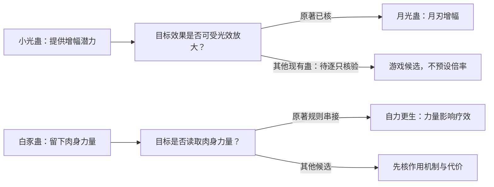
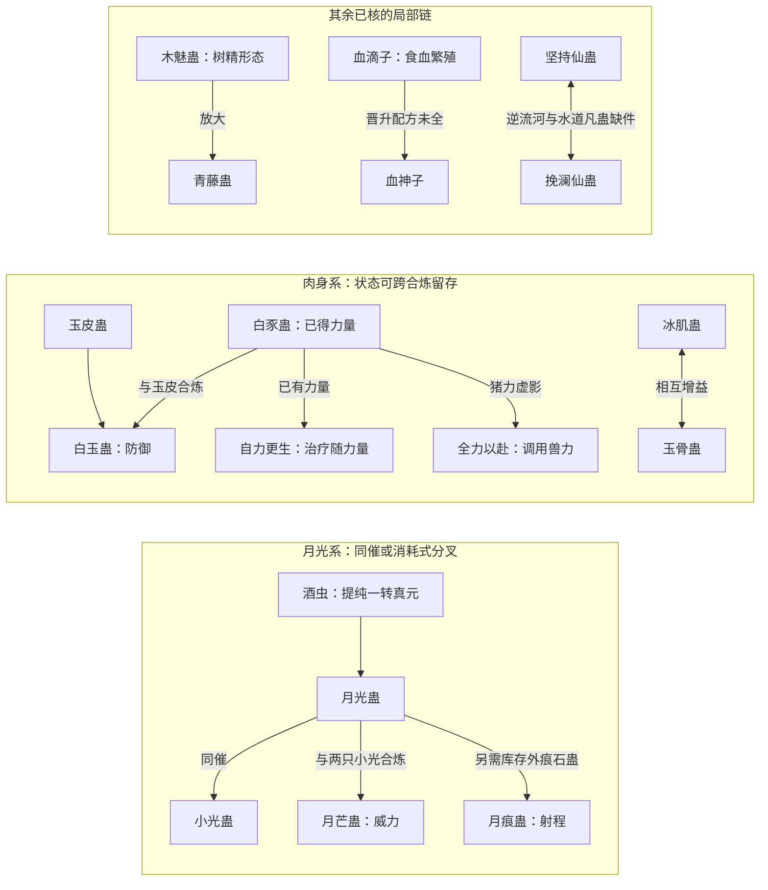

# 现有蛊库的体系搭配：先连线，不扩库存

日期：2026-09-28。状态：原著关系核验与研究模型约束，未批准接入正式战斗。对象严格限定为[现有蛊库](gu-library.json)的 69 只蛊；可机器检查的 17 条关系记录与 4 条游戏适配推导见[关系数据](inventory-relations.json)。17 条按状态分为 10 条已核关系、4 条已核但库存缺件、2 条原著规则串接推导、1 条角色计划，不能全称原著已实现搭配。原著事实以[Wiki 蛊虫关系](../../../lore/wiki/gu/gu-relations.md)、对应蛊页与本地 `蛊真人-clean.txt` 回查；游戏推导单列，不反写原著。

## 核对结果

目前 **20/69 只**出现在有证据或明确标记为角色计划的 17 条**关系记录**中；其余 **49 只尚无库存内已核实例**，不是“不相容”名单。原著中被写出的搭配也不是游戏的配对白名单。蛊虫先有自身作用，另一只蛊恰好能利用其效果时才形成搭配；合炼配方则仍按已知材料约束处理，不能由泛用适配凭空推出新蛊方。关系数据里的 `gu`、`inputs.gu`、`output` 全部引用现有库存 ID；`requiresOutsideStock` 只登记缺件，不新增蛊虫。INV-17 是角色计划，不能当已实现搭配。

## 从实例反推可复用的作用条件

**以下是游戏设计推导，不是原著事实。**原著核得的是具体作用与实例；游戏可以尝试把作用写为“提供的特性 → 目标需要的特性 → 使用条件与代价”。这样同一只蛊能与多个合适对象互动，已知组合则成为这一规则的验证样本，而不是唯一合法搭档。`affordanceHypotheses` 仅登记研究假设，不进入现有战斗公式，也不给未核目标自动增幅。

| 提供者与可复用特性 | 原著已核实例 | 游戏候选适配条件 | 当前不能推成的结论 |
|---|---|---|---|
| 小光蛊：增强某种可受光效放大的输出 | 小光＋月光同催增大月刃；见[小光蛊](../../../lore/wiki/gu/small-light-gu.md)，E:V1-010926、E:V1-017148 | 目标**实际效果**具有可放大的光性输出，且两蛊能同催；之后逐一检验是否适配、消耗与增幅 | “小光专为月光而生”或“所有光系蛊都翻倍”都没有原著依据；其他目标目前只是候选 |
| 白豕蛊：永久留在人体的力量 | 白豕已得力量留存；自力更生疗效随力量提升；全力以赴调用猪力，`9688-9692`、`53792-53806`、`53010-53014` | 目标效果明确读取**使用者已有肉身力量**，即使白豕随后被炼走仍可考虑已得力量 | 不按“力道”标签给所有蛊统一加成；需分别验证作用机制 |
| 酒虫：提纯已有一转真元的品质 | 提纯真元后催月光蛊，`5438-5516`、`10444` | 一转目标消耗这份真元，且其效果确实受真元品质影响 | 不回真元，不跨转，也不保证每一只一转蛊都得到相同战斗收益 |
| 木魅蛊：树精形态及木行增幅环境 | 青藤蛊与生机叶等木行效果被放大，`23844-23864` | 目标可在树精形态使用，且其具体木行效果能受形态增强 | 不把青藤设为唯一搭档，也不把所有木道蛊设为同倍率 |

判定时优先看**作用对象与资源流**，再看转数、催动条件、排斥、风险和养护成本；流派只帮助寻找候选，不直接触发加成。同一特性可服务多个目标，一个目标也可能接受不同来源的同类特性。未核目标可以进入设计试验，但必须保留“游戏推导”标记，不能被回写成 Wiki 事实。

以后盘点其余 69 蛊时，先为每只蛊记录**独立效果**（改变什么：真元品质、肉身状态、攻击形态、环境、目标状态等），再记录**输入条件**（读取哪种状态或资源）、**时序与代价**（常驻、同催、消耗、合炼、养护、风险）。只有这些接口相接，才生成候选组合；候选还须经转数、供给、叠加上限和反制检验。没有写出接口的蛊应标“待核”，不能靠流派名自动补全。具体合炼配方与可复用战斗协同分开建模：前者需要确切材料证据，后者可以作为明示的游戏规则试验。

| 关系类型 | 已核的现有库存关系 | 限制与原文 |
|---|---|---|
| 同催增幅 INV-01 | 月光蛊＋小光蛊：月刃体积与攻击力各增一倍 | 再加一只小光不会把该增幅叠到两倍，`10926-10940`、`17148`；见[小光蛊](../../../lore/wiki/gu/small-light-gu.md) |
| 真元介导 INV-02 | 一转酒虫精炼已有一转真元，再催月光蛊；原文战例中的月刃威力提高 | 酒虫不回真元、不能用一转酒虫提纯二转真元，`5438-5516`、`10444`；见[酒虫](../../../lore/wiki/gu/wine-insect-gu.md) |
| 合炼 INV-03 | 月光蛊×1＋小光蛊×2→二转月芒蛊 | 合炼消耗输入；成蛊攻击力三倍与同催翻倍分开，`15710`、`17144-17150`；见[月芒](../../../lore/wiki/gu/moon-glow-gu.md) |
| 缺件分叉 INV-04/05 | 同一月光蛊底子也可炼月痕蛊，取二十米射程、攻击力不变 | 需当前库存外的痕石蛊；“月芒/月痕二选一”仅指**同一只被消耗的月光蛊**，非全世界互斥，`17144-17156`；见[月痕](../../../lore/wiki/gu/moon-ray-gu.md) |
| 合炼＋状态留存 INV-06/07 | 白豕蛊先给人永久增力，再与玉皮蛊合炼白玉蛊，已得肉身力量仍保留 | 白玉蛊强化的是玉皮防御，丧失**继续**增力能力；养蛊费可能高于两蛊之和，`16076`、`16140-16148`、`16906-16912`；见[白豕](../../../lore/wiki/gu/white-boar-gu.md) |
| 功能覆盖 INV-08 | 月芒进攻＋白玉防御＋九叶生机草治疗 | 原著方源还认为缺侦查与移动；三蛊没有互相增幅明文，`17316-17342`；见[月芒](../../../lore/wiki/gu/moon-glow-gu.md) |
| 肉身复合 INV-09 | 冰肌蛊＋玉骨蛊：两种改造相互影响、叠加 | 玉骨一次性使用剧痛可致死；原文认为适合白凝冰而不适合方源，`39724-39732`、`41452-41464` |
| 形态放大 INV-10 | 木魅蛊变树精后，青藤蛊作为木行蛊得到增幅 | 木魅无节制催用有变成死树人的风险；月旋、松针、生机叶三件不在库存，`23844-23864`；见[木系总表](../../../lore/wiki/gu/roster.md) |
| 产物介导 INV-16 | 二转九叶生机草可产一转生机叶；木魅树精形态下的生机叶等木行蛊获得增幅 | 增幅对象是撕下的**生机叶**，不是草本体；这是两段原著事实串接，不是原文给出的专属配方，`16494-16498`、`23848-23864`；见[九叶生机草](../../../lore/wiki/gu/vitality-grass-gu.md) |
| 身体数值依赖 INV-11/12 | 白豕已得力量可提高自力更生蛊疗效，也能成为全力以赴调用的猪力底子 | 第一条是两条原著规则串接，无专属倍数；全力以赴早期一次仅催一影，`9688-9692`、`53010-53014`、`53792-53806` |
| 核心未成套 INV-13 | 方源把全力以赴列核心、自力更生列支点 | 另一支点苦力蛊不在 69 蛊库存；不得说这两只已完成原著力道蛊组，`52506-52512`；见[力道蛊组](strength-build-study.md) |
| 晋升＋繁殖 INV-14 | 血滴子食蛊师本命精血分化，后可晋升血神子 | 完整炼法未知；吸血没有给蛊师治疗/回元的证据，电流克制之，`28474-28498`；见[蛊虫总表](../../../lore/wiki/gu/roster.md) |
| 杀招缺件 INV-15 | 坚持仙蛊＋挽澜仙蛊：前者使河认可，后者操纵河水 | 两蛊需逆流河和足量适配水道凡蛊才能融汇；现库存不具备完整杀招，`240136-240142`、`240292-240300`；见[坚持仙蛊](../../../lore/wiki/gu/persistence-gu.md) |
| 蛊方推演计划 INV-17 | 方源预计用智慧蛊帮助完善血神子仙蛊残方 | 还需七成残方与前世积累；这是角色当时的设想，非该段证实合炼成功，更非智慧蛊直接给血神子伤害加成，`130288`；见[智慧蛊](../../../lore/wiki/gu/wisdom-gu.md) |

## 现有库存的局部组合样本

以下是**设计判断**，只使用库存中的蛊。这些是可研究的组合片段，不是四套完整流派构筑；有证据的关系也不保证供应场景下玩家一定得到。这里将“完整战斗构筑”限定为能逐项说清核心状态、主要操作与调用顺序、资源和代价、至少一种弱点或反制，并有足够具体的蛊虫支撑实际玩法。它不要求单一流派独自包办所有职能，允许蛊虫因作用特性适配而跨派组合。

| 核对范围 | 当前结论 | 证据与缺口 |
|---|---|---|
| 严格限定本库 69 蛊 | **0 套完整流派战斗构筑** | 本页 17 条是分层关系记录，20 只被连线；局部蛊组尚缺关键接口或蛊虫，三套 `burst/balanced/sustain` 只是旧模型压力测试配置，见[蛊库说明](gu-library.md) |
| 允许继续从原著核验必要蛊虫 | **1 套有把握设计的完整战斗构筑样本：方源力道** | 已核承载、兽力、调用、苦力、治疗、位移、远程及真元代价，但苦力、横冲、直撞、力气等关键蛊未进入当前库存；见[力道蛊组](strength-build-study.md) |
| 龙公的变化道与气道 | **2 套完整杀招体系的功能样本，0 套可逐蛊列出的完整蛊虫构筑** | 原著直接总结两套体系各有攻防移动与互补距离；多数杀招尚未核得具体蛊虫组成，见[龙公](../../../lore/wiki/characters/dragon-duke.md) |

1. **一至二转月光与肉身线，局部关系证据最完整。**同催月光＋小光取即时威力；酒虫通过一转真元品质改变月刃；白豕先积累力量；随后月光＋双小光炼月芒、白豕＋玉皮炼白玉，再由九叶生机草补治疗。这是**先积累再消耗输入、将效果留在身上**的时序组合。原文方源当时仍缺侦查、移动；研究库的“月道”也只是归档标签，不可据此宣布一套完整的原著独立流派构筑。
2. **三转冰肌玉骨线，关系最直接。**冰肌＋玉骨是明确相互增益，但适合人群与一次性疼痛代价决定是否值得合用。它没有从库存中已核的专属攻击链，故先做肉身防护分支，不把月蛊、剑气蛊硬拼进去。
3. **木魅青藤线，形态与代价明确。**木魅改变身体状态、获得天然元气，青藤威力因此提高；持续过度会导致死亡。原著战例还用月旋、松针和生机叶，当前库存只有两件，这套只能作为局部协同样本。
4. **高转两条“有核但缺件”线。**血滴子→血神子是养用与晋升链，不是回血流；坚持＋挽澜要逆流河与水道凡蛊，不能把两仙蛊直接堆成自动护盾。二者先保留结构关系，不投入现有通用伤害算式。

力道现有库存只连得出白豕已得力量→自力更生、全力以赴的部分链。熊力蛊页尚未核得具体增力用法，苦力蛊、力气蛊又不在这 69 只里；**本轮因此不声称已经搭出方源的完整八兽力流派**。[酒虫](../../../lore/wiki/gu/wine-insect-gu.md)也只对一转真元有用，二转所需四味酒虫不在库存，不能一路套用。

## 暂无原著关系证据的“看起来很像”

- 血月蛊、血滴子、血神子同带“血”，但当前仅血滴子→血神子的晋升被证实；血月与它们无已核搭配。
- 石皮蛊、玉皮蛊属同系，不等于可同时催动叠防；金甲、古铜皮、白玉之间也尚无共同增幅证据。
- 三气仙蛊条目虽存在，高阶气道杀招还需要特殊条件；不能把龙息蛊按名字直接接到三气归来。
- 青铜至紫晶舍利蛊改变修为阶段，酒虫改变当前转数内真元品质；不能把它们记成战斗回元组合。
- 月影蛊、黄金月、霜霖月、幻影月、月蛊等同属月华相关名字，当前没有可核的互相增益链；可按实际效果进入候选适配试验，不能只凭名字连线。
- 春秋蝉、天机蛊、天妒仙蛊、宿命蛊、智慧蛊等不因“转数高”自动成为这几套战斗蛊组的伤害核心。

现有研究库把血滴子的“吸精血繁殖”标成 `recovery/drain`，木魅蛊的形态/天然元气标成通用 `recovery/drain`，月影蛊的真元压制标成 `strike`。这些是**当前模拟器槽位与原著语义冲突**，不能拿模型中的构筑胜率证明上述关系已可玩。本文先固定关系与误读边界，不在未完成逐派数值审查前把槽位改写为另一套猜测。
