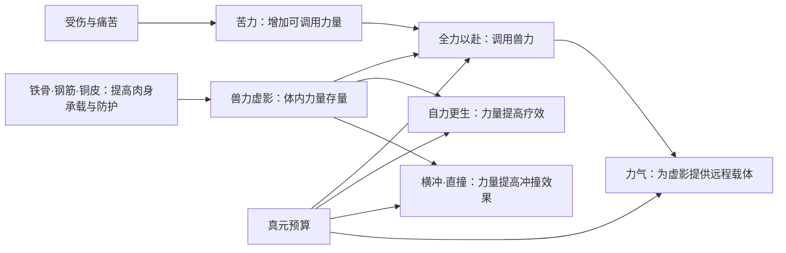

# 力道蛊组与龙公双体系：原著构筑样本

日期：2026-09-28。性质：一至九转模型的证据与设计研究，不是产品裁定。原文行号均指本地 `蛊真人-clean.txt`；原著事实和游戏判断分节记录。研究入口见[一至九转数值模型](README.md)，Wiki 关系入口见[蛊虫关系](../../../lore/wiki/gu/gu-relations.md)。本页的方源力道是**原著材料足以设计一套完整战斗构筑的样本**，不是现有 69 蛊库存已装出的构筑；龙公两道是**完整杀招体系的功能样本**，尚非逐只蛊虫清单。

## 原著事实：方源的力道蛊组

| 功能层 | 已核事实 | 原文锚点 |
|---|---|---|
| 承载 | 铁骨蛊为消耗型改骨，钢筋蛊须连续催用才形成效果。三转铜皮蛊消耗自身而永久加固皮肤；金罡蛊另生成可催动的光甲，不能与天蓬蛊同时使用。它们不是四个同类被动加伤。 | `蛊真人-clean.txt:53014-53020`、`:55814-55824`、`:55504-55512` |
| 蓄力 | 方源后来有山猪、棕熊、鳄鱼、青牛、骏马、石龟、白象、黑蟒八个兽力虚影，八个是当时肉身的承载极限。兽力虚影被叙述为留在体内的力量道纹，已有兽力本身不消耗真元。不能由此推出“八只均为三转蛊”。 | `蛊真人-clean.txt:58958-58964`、`:53860-53864`、`:53716-53720` |
| 调用 | 方源明确把全力以赴蛊列为核心、自力更生蛊与苦力蛊列为支点。全力以赴蛊在较早阶段一次只能催出一种兽力；受伤并催动四转苦力蛊后，该战例可同时催出三种。苦力蛊受伤越重、痛苦越深，力量越大，但有上限。 | `蛊真人-clean.txt:52506-52512`、`:53010-53014`、`:59286-59298` |
| 位移 | 直撞蛊无阻碍时直行五十步，有阻碍时更短；力量越强，冲撞突破效果越好。横冲蛊是横向冲锋；两蛊交替可覆盖五个呼吸的再催用间隔。原文支持的是冲撞**效果**随力量提高，不是五十步距离无限增加。 | `蛊真人-clean.txt:52974-52992`、`:53370`、`:53558` |
| 治疗 | 三转自力更生蛊须灌注真元；使用者力量越强，治疗效果越好。伤势加重会增强苦力蛊，但不是自力更生蛊疗效的直接输入。 | `蛊真人-clean.txt:53792-53806`、`:59286-59290` |
| 远程 | 三转力气蛊产生力之气，使本来虚化的兽力虚影获得离体攻击的载体。每承载一个虚影须半成雪银真元；八影同出为四成，实战还需分摊移动、防御、全力以赴等消耗。 | `蛊真人-clean.txt:59724-59730`、`:59744`、`:59762-59774` |

以下图中的箭头表示原著可核验的功能依赖，不表示每只蛊都是同时装备、同转取得，或无条件叠加。

这套蛊组的强处并非“八张伤害卡相加”。同一份兽力先解决基础攻击，再成为位移的冲撞系数、治疗的效力系数和远攻的载荷；苦力蛊在受伤时放大输出，自力更生蛊以既有力量补足续战。**这句是对上述事实的关系归纳**；原著的完整胜负仍受敌方手段、真元、时机与蛊的可得性影响。

## 原著事实：龙公的变化道与气道

原著对龙公的战斗体系有直接总结。变化道一侧有九龙纹护身、澄龙澈瞳、龙爪击、乱龙拳、回旋龙牙、憾世龙锤、龙啸波、随身闪、龙门、龙子龙孙，覆盖防护、侦查、近中远攻击、移动和群攻；气道一侧有气墙、自转游龙气墙、气呼山、潜龙气爆、气盖山河、一气大手爆、气流剪、紫金龙形气劲和逆反虫龙。叙述者明确说两套都覆盖攻防移动：变化道偏近中距离，气道偏远距离，彼此补短板。`蛊真人-clean.txt:363070-363080`。

紫金龙形气劲还会随攻击、防御、腾挪、治疗提供帮助，属于跨功能手段。`蛊真人-clean.txt:361572-361576`。原文又强调普通杀招在实战中比王牌更常用；龙公与方源激战时，没有机会使出三气归来。`蛊真人-clean.txt:363080-363084`。三气归来的本质是元始仙尊留下的手段，龙公只是钥匙，并非可随手反复出的常规卡。`蛊真人-clean.txt:365748-365750`；见[龙公](../../../lore/wiki/characters/dragon-duke.md)。

## 游戏设计判断：从蛊名卡转向功能网络

1. **以下只描述这套力道蛊组，不能外推为各流派的通用构筑法。**兽力是持久存量；全力以赴是调用算子；苦力是受伤时的调用扩容；自力更生将力量映射成治疗；横冲直撞将力量映射成位置优势；力气蛊将既有兽力映射成远程威胁。这些依赖关系只属于已核的方源力道实例。
2. **这套力道构筑有可感知的依赖链。**先有身体承载，才能安全取得更多兽力；取得兽力后，玩家再在调用、保命、位移、射程之间分配有限蛊位和真元。同一力量底子在多个功能上复用。原著没有提供游戏蛊位/费用公式，这里仅提出力道实例的模型接口。
3. **龙公个案展示两套完整杀招体系的互补，不等于两套完整蛊虫构筑。**龙公的双修不能压成“两种属性伤害加成”；变化道与气道各有独立的近中远距离及攻防移动手段，互相补缺。但多数杀招的组成蛊虫尚未逐只核实，不能据此填出两个可交付的蛊虫清单，也不能要求每一流派按同一功能清单配齐蛊虫。
4. **王牌必须有窗口。**能否拿到蛊、催动成本、敌人的打断、地形和前置条件，决定杀招是否真正可用。三气归来不能当作每回合可抽到的高伤卡。

下一次力道可玩验证可用一小套可控样本：身体承载与兽力存量、全力以赴单影输出、苦力受伤增幅、自力更生耗元治疗、横冲直撞位置变化、力气蛊高耗远程。这个实验只验证力道；其他流派须先分别建立自己的原著机制与玩法假设，见[流派机制审计](path-mechanics-audit.md)。**这里是实验建议，不是把三四转蛊直接塞入当前一二转原型的决定。**

## 当前模型已修正与未完成项

- `gu-library.json` 已把自力更生蛊的治疗效果改为已核事实，把全力以赴蛊的单影调用与苦力配合改为已核事实。现有 `poweredAction` 是旧模拟器的粗粒度槽位接口，还不能表达条件与依赖；在战斗载体改造前，不可用它声称已经复现原著构筑。
- 苦力蛊、横冲/直撞蛊、力气蛊及身体承载尚未进入同一个可执行依赖图；这些属于后续 L1 数值建模与阶段范围判断，不能从原著直接编造固定伤害或冷却系数。
- 因上述关键蛊缺席，按[现有库存盘点](inventory-combinations.md)的严格口径，本库可实际组出的完整流派战斗构筑仍为 **0**；方源力道只在允许继续核验原著蛊虫的范围内算 **1 套可设计样本**。
