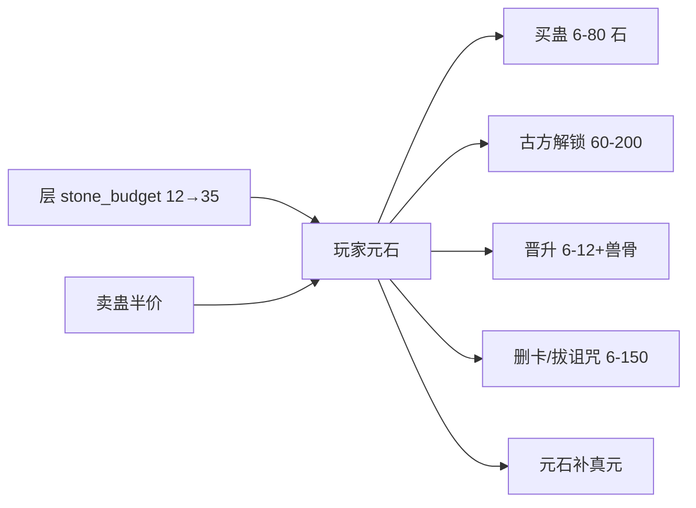

元石是唯一货币 + 真元电池（见 [资源模型](resource-model.md)）。经济全部数据驱动：全局常数在 balance.json，价格在 shops.json，层预算在 pacing.json[^1]。

## 全局常数（balance.json）

| 常数 | 值 | 含义 |
|---|---|---|
| gu_value_by_rank | 3/5/8/12/20 | 1-5 转蛊价值锚 |
| public_buyback_ratio | 0.5 | 回购半价（低流动性 0.3） |
| demand_price_tiers | 0.8/1.0/1.2 | 需求价档 |
| stone_per_t1_material | 10 | 1 转材料基准价 |
| remove_card_cost / remove_imprint_cost | 120 / 150 | 删卡/删烙印（各限 2 次/局） |
| free_pair 费用 | 20/60/150/300 | 自由配对 2-5 转（成功率 90/70/50/35%） |
| 跨流派兼修罚值 | 每额外 +1 | 剑水互斥 |

全部来自审计报告第 11 节提取[^1]。

## 玩家财富流

收入侧：层 stone_budget 预算注入（12/16/22/28/35）、商队交易、卖蛊半价、挖尸配方产出[^1]。**敌人无直接元石掉落字段**——经济注入依赖层预算，是有意设计[^1]。

## 通胀与身份定价

每层 shop_price_pct 0%→10%→20%→35%→50%；回头客每次访问 +25%（封顶 100%）；恶名每点 +10%（封顶 60%）+ 敌意 +15% + 先手 -10%；市场节点"跳过则涨价"[^1]。

## 黑市资源兑换（世界味最浓的机制）

寿元 20→魂 1；魂 1→寿元 10；气血 20→魂 1；魂 1→气血 10；气血 20→寿元 10——双向不对称 50 倍，把"透支生命"直接定价进经济[^1]。审计标记：兑换比例来源无文档裁定记录，存在套利缺口疑问，属待裁定项[^1]。

## 已登记缺口

7 种蛊材中 5 种几乎不进主流配方（兽骨 378/385 独大）；商队报价与商店标价明细见附录 B/C[^1]。

## 关联页面

- 货币的资源面 → [资源模型](resource-model.md)
- 价格数据原文 → [数据表全集](../entities/data-tables.md)
- 完整价格表 → [PROJECT_WORLD_MODEL_AUDIT.md](../../../PROJECT_WORLD_MODEL_AUDIT.md) 附录 B

[^1]: PROJECT_WORLD_MODEL_AUDIT.md, §11/§12/§13/§20
