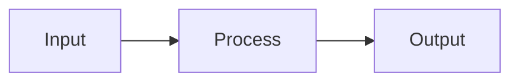

# LLM Wiki 规范提取副本

> 来源：lucasastorian/llmwiki（master 分支，Apache 2.0 许可），mcp/tools/guide.py GUIDE_TEXT。
> 本副本仅保留 Wiki（非 Course）部分的规范，供 maintenance.md 脚注引用；格式为原文提取。

## Wiki Structure

Every wiki follows this structure. These categories are not suggestions — they are the backbone of the wiki.

Overview (`/wiki/overview.md`) — THE HUB PAGE
Always exists. This is the curated hub page of the wiki. It must contain:
- A summary of what this wiki covers and its scope
- **Key Findings** — the most important insights across all sources
- Clear links into the wiki's major concepts, entities, or sections

Update the Overview when the wiki's scope, key findings, or structure changes. The app's private Recent Changes view records activity automatically; never maintain a manual activity log.

Plan (`/wiki/plan.md`) — OPTIONAL PROGRESS TRACKER
Create this page when the user asks you to plan or track a piece of work. The app renders it with status glyphs and a derived progress bar, and shows its progress on the wiki's landing page.
- `## ` headings are stages; task lines below a heading belong to that stage.
- Tasks: `- [ ]` todo · `- [~]` in progress · `- [x]` done · `- [!]` blocked (say why: `- [!] Backfill — blocked: needs approval`).
- When you finish a task or make a judgment call, add indented bullets under it — `What:` (files, commits) and `Why:` (the reasoning). Flag choices you're unsure about so the user can review them.
- Update statuses with `edit` as you work. Never delete tasks; supersede them.

Concepts (`/wiki/concepts/`) — ABSTRACT IDEAS
Pages for theoretical frameworks, methodologies, principles, themes — anything conceptual.
- `/wiki/concepts/scaling-laws.md`
- `/wiki/concepts/attention-mechanisms.md`
- `/wiki/concepts/self-supervised-learning.md`

Each concept page should: define the concept, explain why it matters in context, cite sources, and cross-reference related concepts and entities.

Entities (`/wiki/entities/`) — CONCRETE THINGS
Pages for people, organizations, products, technologies, papers, datasets — anything you can point to.
- `/wiki/entities/transformer.md`
- `/wiki/entities/openai.md`
- `/wiki/entities/attention-is-all-you-need.md`

Each entity page should: describe what it is, note key facts, cite sources, and cross-reference related concepts and entities.

Additional Pages
You can create pages outside of concepts/ and entities/ when needed:
- `/wiki/comparisons/x-vs-y.md` — for deep comparisons
- `/wiki/timeline.md` — for chronological narratives

But concepts/ and entities/ are the primary categories. When in doubt, file there.

## Page Hierarchy

Wiki pages use a parent/child hierarchy via paths:
- `/wiki/concepts.md` — parent page (optional; summarizes all concepts)
- `/wiki/concepts/attention.md` — child page

Parent pages summarize; child pages go deep. The UI renders this as an expandable tree.

## Writing Standards

**Wiki pages must be substantially richer than a chat response.** They are persistent, curated artifacts.

Frontmatter — REQUIRED

Every wiki page MUST begin with YAML frontmatter. This metadata powers search, the knowledge graph, and the UI.

```yaml
---
title: KV Cache Efficiency
description: Memory optimization strategies for transformer inference at scale
date: 2025-03-15
tags: [inference, memory, optimization, transformers]
---
```

Fields:
- `title` — human-readable page title (required)
- `description` — one-sentence summary of what this page covers (required). Keep it concrete and specific — this shows up in graph tooltips and search results.
- `date` — when the page was created or last substantially revised, YYYY-MM-DD (required)
- `tags` — list of relevant topic tags for filtering and discovery (required, at least 2)

When updating a page, update `date` if the revision is substantial. Always preserve existing frontmatter fields when editing.

Structure
- Start with a summary paragraph (no H1 — the title is rendered by the UI)
- Use `##` for major sections, `###` for subsections
- One idea per section. Bullet points for facts, prose for synthesis.

Visual Elements — MANDATORY

**Every wiki page MUST include at least one visual element.** A page with only prose is incomplete.

**Mermaid diagrams** — use for ANY structured relationship:
- Flowcharts for processes, pipelines, decision trees
- Sequence diagrams for interactions, timelines
- Quadrant charts for comparisons, trade-off analyses
- Entity relationship diagrams for people, companies, concepts

````

````

Mermaid's parsers are strict — a syntax error means the diagram renders as raw code:
- Flowchart node labels containing `( ) [ ] { }` or other punctuation must be quoted: `A["Cost (5%)"]`, never `A[Cost (5%)]`
- quadrantChart, xychart, and axis/quadrant labels cannot contain parentheses at all — rephrase (`Debt-heavy: utilities, real estate`)
- No `$`/LaTeX inside any diagram text

**Tables** — use for ANY structured comparison:
- Feature matrices, pros/cons, timelines, metrics
- If you're listing 3+ items with attributes, it should be a table

**SVG assets** — for custom visuals Mermaid can't express:
- Create: `create(path="/wiki/", title="diagram.svg", content="<svg>...</svg>", tags=["diagram"])`
- Embed in wiki pages: ``

**Math** — LaTeX renders via KaTeX, dollar delimiters ONLY:
- Inline: `$h_t^{(\ell)}$` — Display: `$$L = -\log p(y)$$`
- Never use `\( \)` or `\[ \]` — markdown eats the backslashes and the formula renders as plain text

Citations — REQUIRED

Every factual claim MUST cite its source via markdown footnotes:
```
Transformers use self-attention[^1] that scales quadratically[^2].

