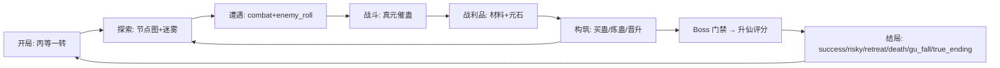

> **定位**：Roguelike 五段地图与结局枚举是《问真》原创结构，不挂原著锚点。南疆世界观背景见 [`lore/wiki` 南疆与山寨](../../../../lore/wiki/world/south-jiang.md)。

玩家扮演南疆一名新开窍散修（首版固定身份），在 5 大层节点地图中经历生存→构筑→炼蛊→布局→冲击蛊仙；单局目标 3-5 小时、200-300 有效节点[^1]。主循环全部已实现、无断链[^2]。

## 循环流程（含实现状态）

| 环节 | 状态 | 说明 |
|---|---|---|
| 开始一局 | 已实现 | 丙等一转散修：100 血/60 寿元/魂 1/12 元石/小光蛊[^3] |
| 探索 | 已实现 | 未走节点迷雾「?」+ 小光蛊/情报揭露局部[^4] |
| 遭遇敌人 | 已实现 | E6 enemy_roll 按层抽敌，Boss 只在层主位[^4] |
| 战斗 | 已实现 | 见 [战斗系统](combat-system.md) |
| 战利品 | 已实现 | 层 stone_budget + 稀有度权重；elite 强制 epic+强制代价[^5] |
| 构筑 | 已实现 | 黑市/商店/炼蛊晋升/删卡拔诅咒 |
| 死亡 | 已实现 | hp≤0 或寿元≤0 或魂≤0 → 清局，事件日志保留归因[^3] |
| 下一局 | 已实现 | 蛊方图鉴决定新局配方门禁；零永久数值[^6] |

## Roguelike 结构与地图

5 层 × 8-11 行 × 2-6 节点/行；首行 1-2 入口，末行强制 Boss，未杀 Boss 无路可走；每两行强制休整（REST_ROW_STRIDE=2）[^7]。节点模板 17 类（combat/rest/shop/market/caravan/contact/event/inheritance/hazard/earth_vein/refinement/cultivation/ledger/wild_gu/commission/pursuit/seclusion + 登仙节点）[^7]。生成细节见 [地图生成器](../entities/map-generator.md)。

结局归并六类：success / risky / retreat / death / gu_fall / true_ending（文案现源：data/journal.json ending_texts）；非死亡结局须玩家二次确认；升仙是 Boss 胜利后的五条件评分制，非一票否决[^3]。

## 关联页面

- 世界规则如何约束此循环 → [世界模型转译](world-model-translation.md)
- 循环中的货币流动 → [经济系统](economy.md)
- 死亡后保留什么 → [Meta 图鉴](meta-progression.md)

[^1]: AGENTS.md, 目标节
[^2]: PROJECT_WORLD_MODEL_AUDIT.md, §4
[^3]: PROJECT_WORLD_MODEL_AUDIT.md, §4/§10（开局 HP 按现网 data/balance.json `player_start_hp=100` 校正，RUL-2026-09-19-009；审计快照 80 已过期）
[^4]: PROJECT_WORLD_MODEL_AUDIT.md, §4（E1-E7 条目已从 AGENTS.md 当前待办移除，对应事实在审计 §4）
[^5]: PROJECT_WORLD_MODEL_AUDIT.md, §13
[^6]: AGENTS.md, 核心业务红线
[^7]: PROJECT_WORLD_MODEL_AUDIT.md, §18
