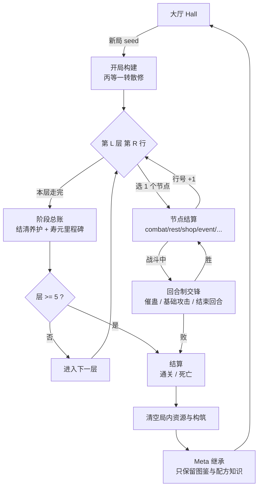

# 肉鸽运行结构

> 描述一局《問眞》从开局到结算、再到大厅轮回的完整流程。
> 所有数值都来自 `world-model/data/balance.json`，本文只引用、不重定义。

---

## 一、总览



---

## 二、开局构建

| 项 | 值 | 真源 |
| --- | --- | --- |
| 身份 | 丙等一转散修（固定，不可选种族/出身） | `balance.run.starter` |
| 资质 | `bing`（丙等），元海容量 0.44 | `balance.run.starter.aptitude` / `growth.aptitude_capacity_ratio` |
| 气血 | 80 / 80 | `balance.run.starter.hp` |
| 寿元 | 60 / 60 | `balance.run.starter.lifespan` |
| 魂 | 1 / 4 | `balance.run.starter.soul` |
| 元石 | 12 | `balance.run.starter.stone` |
| 携带蛊 | 小光蛊 ×1 | `balance.run.starter.gu` |
| 流派 | 光道 | `balance.run.starter.path` |
| 局外真元 | 20（=10 × 2 × 1） | `growth.essence_base × aptitude_factor × cultivation_factor` |
| 局外念头容量 | 3 | `growth.thought_base_capacity` |

**开局提示规则**：若 `world-model/saves/run.json` 存在进行中的存档，CLI 必须先提示
「开新局会放弃这份存档（本局资源与构筑清零，只保留图鉴）」，并等待确认；`--auto` 下视为确认。
这是 `AGENTS.md` 的存档体验约束。

固定开局的原因是 `ADP-SMALL-LIGHT-001`（小光蛊固定开局）与 `GAME-PLAYER-001`（固定主角丙等 0.44），
它保证**同种子 ⇒ 同起点**，也让「资质提升」成为一局内可感知的收获（`GAME-CULTIVATOR-005`）。

---

## 三、地图与层级推进

### 3.1 五层结构

每层是一个**行 × 节点**的网格。玩家每行只走 **1 个节点**，因此单局有效节点数 ≈ 每层行数之和。

| 参数 | 位置 | 值 |
| --- | --- | --- |
| 层数 | `balance.run.layer_count` / `regions.json` | 5 |
| 每层行数 | `region.rows_min` / `rows_max` | 8–11 |
| 每行宽度 | `region.row_nodes_min` / `row_nodes_max` | 2–6 |
| 首局节点预算 | `regions.json` 的 `map_structure.first_run_node_budget` | 13 |
| 单局节点预算区间 | `map_structure.node_budget_per_run` | 40–55 |
| 强制休整频率 | `balance.run.rows_between_forced_rest` | 每 2 行 |

### 3.2 分类权重（每层必须守恒为 100）

| 层 | battle | rest | unknown | trade |
| --- | --- | --- | --- | --- |
| 1 青茅山外圍 | 82 | 6 | 9 | 4 |
| 2 落瘴岭 | 80 | 6 | 10 | 5 |
| 3 血蟒涧 | 78 | 6 | 11 | 6 |
| 4 万蛊窟 | 76 | 6 | 12 | 7 |
| 5 瘴脉深處 | 74 | 6 | 13 | 8 |

分类 → 模板的抽取池是 `regions.json` 的 `template_pools`：
battle 6 个 / rest 5 个 / unknown 13 个 / trade 7 个模板。抽取全部走种子流
（`Stream(seed, "map", layer)`），**层号进 salt**，所以同一行在不同层是独立抽取。

### 3.3 锚点（anchors）

锚点把特定模板钉在特定行，保证每层的关键功能一定出现：

| `row` 键 | 落到第几行 | 层 1 的锚点 |
| --- | --- | --- |
| `quarter` | `max(1, 行数 // 4)` | `ridge_black_market` |
| `mid` | `行数 // 2` | `refinement_hollow`、`ridge_black_market` |
| `pre_boss` | `行数 − 2` | `yizang_ridge`、`ridge_black_market` |

同一行可以钉多个锚点；该行宽度会被撑到至少 `锚点数 + 1`，保证玩家仍有真实选择。

### 3.4 Boss 席位

每层最后一行是**只有 1 个节点的 Boss 席**：

| 层 | Boss 席位节点 | Boss 池 | 说明 |
| --- | --- | --- | --- |
| 1 | `layer_boss_stand_1` | `crag_serpent_matriarch` / `marrow_gu_adept` | 按有效强度滑动窗口，层内差 ≤ 2 |
| 2 | `layer_boss_stand_2` | `marrow_gu_adept` / `thunder_crown_sovereign` | 相邻层不重复 |
| 3 | `layer_boss_stand_3` | `thunder_crown_sovereign` / `clan_patriarch` | |
| 4 | `layer_boss_stand_4` | `clan_patriarch` / `blood_vein_bishop` / `blue_fur_jiangshi` | |
| 5 | `final_boss_stand` | **固定** `miasma_vein_lord` | L5 终局保持固定 |

Boss 抽取用独立派生流（`Stream(seed, "boss_pick", layer)`），所以「换个 Boss」不会扰动地图其余部分。
层主有**相位**：`phases[].until_hp_ratio` 递减，进入下一相位时意图组合变化；意图带 `cooldown`，
冷却期内不出手（原型口径：全部意图都在冷却时显示 `cooldown_wait`，本回合不攻击）。

> **僵局保护**：因为存在「双方都无法终结战斗」的理论可能，本模型加了 `balance.run.max_battle_rounds = 40`，
> 超限即按 `stalemate_rule: retreat_with_cost` 结算（付 `retreat_stone_cost`，不足则改付气血），
> 日志记 `battle_stalemate`。这是**原创规则**，用于保证有限收束；原型没有这条。

---

## 四、节点类型与结算

| 类型 | 玩家可做的选择 | 结算要点 |
| --- | --- | --- |
| `combat` / `pursuit` | 交锋 / 退走 | 退走付 `retreat_stone_cost`；`pursuit` 是固定精英追击 |
| `earth_vein` | 交锋 / 探查 / 离开 | 地脉争夺，敌人为兽群模板 |
| `contact` | 交涉 / 欺瞒 / 动手 / 退走 | 交涉失败 +1 恶名；欺瞒失败 +1 恶名 |
| `caravan` / `market` / `shop` | 购买 / 出售 / 离开 | 价格 = `层加价 + 恶名加价`；货架上限 `shop_max_tier` |
| `rest` | 静养（恢复 `rest_heal_pct`=30% 气血） / 就地突破 / 跳过 | 休整节点必须暴露领域命令全集，禁止软锁 |
| `refinement` | 炼蛊 / 离开 | 按 `gu.refine_as_output` 选一条可用配方 |
| `cultivation` | 冲击下一转 / 静坐 / 离开 | 走 `can_cultivate_to` 门槛（丙等被三转硬门槛拦住） |
| `event` | 接受 / 离开 | 从 `event_pool` 按种子抽一条（12 选 1） |
| `inheritance` / `seclusion` | 查探取走 / 离开 | 60% 出遗物，否则给元石 |
| `wild_gu` | 采集 / 离开 | 采得转数 ≤ `min(玩家转数+1, 本层上限)` 的蛊 |
| `hazard` | 谨慎侦察（付石） / 强行穿越（付血） / 绕行 | 强行穿越扣 `hp_max/10` |
| `ledger` | 结清总账 / 拖着 | 立即走 `settle_feeding` |
| `commission` | 接下委托 / 离开 | 元石 `3 + 层号` |
| `ascension` | 冲击升仙 /  préparer / 暂缓 | 首发只登记为终局窗口 |

**每个节点只结算一次**，结算完自动推进到下一行（一行一节点）。
任何节点动作都不允许「无限重试」——`engine/run.py:advance_row` 是唯一的推进点。

---

## 五、战斗

### 5.1 回合结构

```
回合开始：念头 = action_points(魂)；真元 += ceil(战斗真元上限 × regen_pct翼)
  ↓ 玩家行动（每次行动消耗 1 念头）
  基础攻击  ：伤害 = balance.run.fight_damage_base(1)，0 真元
  催蛊      ：真元 −= ceil(native_cost × 2^(蛊转−人转))，1 念头，效果按 gu.effect
  结束回合  ：跳到敌方回合
  ↓ 敌方回合
  按当前相位的意图轮转（cooldown 生效）
  意图种类：attack（伤害，护盾先吸收）/ seal（封蛊，上限 max_seal_turns=3）
           / soul_drain（摄魂）/ life_cost（折寿）/ essence_burn（焚真元）
  ↓ 回到回合开始
```

- 玩家每回合的**行动点数**由魂决定：`action_points_by_soul`（魂 ≥10000→6，≥1000→5，≥100→4，
  ≥10→3，否则 **2**）。这解释了「为什么开局每回合只能做 2 件事」。
- **护盾**在同一次结算内吸收伤害，回合结束不衰减（本模型口径，写在 `advance_row` 之外）。
- **封蛊**让被封印的蛊在若干回合内不可催动。
- **连携**：蛊的 `effect.support_school` 与 `support_bonus` 在玩家持有**另一只同流派存活蛊**时生效
  （如小光蛊在持有月光蛊后伤害 +2）。

### 5.2 三轴死亡

【红线】**不允许静默致死**。三条死亡轴独立判定，每次都给出精准死因：

| 轴 | 阈值 | 死因文案 |
| --- | --- | --- |
| `hp` | `stats_hp_death_threshold` = 0 | 气血耗尽而亡 |
| `lifespan` | `stats_lifespan_death_threshold` = 0 | 寿元枯竭而亡 |
| `soul` | `stats_soul_death_threshold` = 0 | 魂魄崩散而亡 |

死亡事件写入台账（`type: "death"`，含 `axis` / `cause_zh` / 三轴读数）。战斗中死亡也会补写
标准 `death` 事件（此前原型只记 `battle_enemy:death`，导致死因统计为空——本模型修掉）。

### 5.3 战斗奖励

| tier | 底石 | 蛊材数 | 出蛊概率 | 稀有度权重（层 1–5 递变） |
| --- | --- | --- | --- | --- |
| `common` | 3 | 层 1–2 = 2，层 3–4 = 3，层 5 = 4 | 6% | 90/10/0 → 50/30/20 |
| `elite` | 8 | 同上 | 30%（**强制 epic**） | 同上 |
| `boss` | 15 | 同上 | 0% | 同上 |

产石公式：`base_by_tier[tier] + base × layer_step_pct × (层−1) / 100`（`layer_step_pct = 20`）。
保底（pity）阈值 3，按 tier 独立计数，出蛊即清零；`elite` 档的强制 epic 蛊**附带绑定代价**
（`cost_pool`：蛊蚀诅咒或 +2 恶名）。

---

## 六、阶段总账与寿元里程碑

每层走完时：

1. **生命周期里程碑**：`lifespan_milestones.stage_one_ledger = 10` ⇒ 寿元 +10（封顶 `lifespan_max`）。
2. **养护总账**：`settle_feeding` 逐只蛊收 `stone_per_stage` 元石。
   - 付得起：清账。
   - 付不起：每只蛊 `feed_debt += 欠额`、`starved_stages += 1`；
     欠账达到 `feed_points_per_stage × 2` ⇒ **实例转数 −1**（降阶），并扣气血。
   **不允许静默补齐**（`AGENTS.md` 红线）。
3. **Boss 击倒**：`lifespan_milestones.boss_defeated = 10` ⇒ 寿元 +10。
4. 检查三轴死亡，然后进入下一层。

---

## 七、结算与轮回

### 7.1 结局类型

| `outcome` | 触发 | 说明 |
| --- | --- | --- |
| `ascended` | 打完第 5 层 Boss | 通关，进入结算 |
| `death` | 任一死亡轴归零 | 带精准死因 |
| `aborted` | 引擎步数预算耗尽（`max_steps=20000`） | 只在僵局等异常下出现；模拟 200 局实测 **0 例** |

### 7.2 局内清空

结算后**局内资源与构筑一律清空**：元石、蛊材、蛊虫实例、遗物、诅咒、恶名、转数、资质提升
全部不进入大厅存档。

### 7.3 Meta 继承（图鉴型，零永久数值成长）

只允许两样东西跨局：

| 继承项 | 内容 | 依据 |
| --- | --- | --- |
| 图鉴 `codex_known_gu` | 见过的蛊 id 集合 | 「蛊方图鉴是唯一明确允许的跨局内容解锁」（`AGENTS.md`） |
| 配方 `recipes_unlocked` | 用过的配方 id 集合 | 同上 |

**硬约束**：`meta.numeric_growth` 必须恒为空字典；`engine/rules.apply_ending` 发现非空即抛
`NumericOverflow`。测试 `meta_inheritance_keeps_knowledge_only` 断言：
新局的气血 / 元石 / 转数**完全等于** `balance.run.starter`，不受 Meta 影响。

> **确定性注意**：台账里的 `run_end` 记录**只写本局新增**的图鉴与配方
> （`run_codex_gu` / `run_recipes`），不写大厅累计值。否则同一 seed 的台账会随玩家已玩局数变化，
> 破坏「同种子可复现」。测试 `ledger_is_independent_of_hall_progress` 守住这条。

### 7.4 存档与恢复

| 文件 | 内容 | 可靠性 |
| --- | --- | --- |
| `world-model/saves/hall.json` | 大厅永久存档（图鉴/配方/局数/结局分布） | 原子写 + 版本 + 校验和 |
| `world-model/saves/run.json` | 进行中 Run（含地图） | 同上；结局后删除 |
| `world-model/runs/run-<seed>-<ts>.jsonl` | 本局台账（header + 逐事件行） | header 带 `content_sha256` |

- **续玩**：`--status` 或大厅会读 `run.json`，损坏时自动隔离为 `run.corrupt.json` 并提示开新局
  （不崩溃）。
- **局结束**：删除进行中存档（`AGENTS.md`：Run 结束时删除进行中 Run 存档）。

---

## 八、确定性契约

一局台账的**正文**是 `(seed, 世界模型数据指纹)` 的纯函数：

1. 所有随机都来自 `engine/rng.py` 的 Lehmer LCG；`Stream` 的 salt 内含层号。
2. 台账正文不含任何墙钟时间、字典顺序、`random` 或对象地址。
3. header 里的 `created_at` 属于元数据，不参与 `content_sha256`。
4. `run_end` 不写大厅累计值（见 §7.3）。

验收命令：`python world-model/runner/cli.py --seed 101 --auto --replay`（连跑两次，`content_sha256` 必须一致）。
