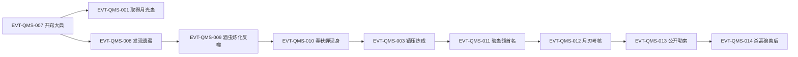

# 方源

《蛊真人》主角：重生回十五岁的古月族丙等蛊师。本页按 schema v2.1 组织——原著明确内容为批次窗口核验记录，状态与事件以 ST-/EVT-/E: ID 为骨架，可沿 Claim → Event/State → Evidence → Raw 追溯。

## 原著明确内容

以下事实由根原文 `蛊真人-clean.txt` 906–3454 行（第 4–20 节窗口）直接支持；窗口外剧情不在本批范围。

- 开窍大典上，方源行走 27 步，丙等资质；空窍元海为青铜真元，占空窍四成四（根原文 1156–1158、1190–1198、1216–1218 行）。
- 同场对照：古月漠北 36 步、乙等、元海六成六（996–1000 行）；古月赤城 36 步、乙等（1028–1034 行），方源以前世记忆判断其为丙等、由其祖父古月赤练作假（1038–1052 行）；孪生弟弟古月方正 43 步、甲等，由族长亲自栽培（1316–1330 行）。
- 重生后起点：十五岁、一转初阶；空窍呈球形、外有希望蛊炸裂凝成的白色光膜、内为青铜元海（1172–1200 行）。
- 早期目标与资源限制：方源本想以酒虫为本命蛊（酒虫比月光蛊更珍贵，1482、1502 行），连续七天买酒在山寨周边以酒香诱酒虫而未得，元石耗尽（1428–1430、1506–1524 行）；学堂考核第一个炼化本命蛊者奖二十块元石，方源自知以丙等资质无争胜希望（1440、1534 行）。
- 花酒行者遗藏：方源以后世记忆锁定酒虫引路，在竹林以青竹酒诱得酒虫、跟踪至山壁巨石缝秘洞（2394、2484–2568 行），得十五块元石与酒虫，蛊室所领月光蛊之外另有收获（2732–2758、2802–2806 行）；秘洞石壁留影存声蛊揭示四代族长暗算在先、家族叙事颠倒黑白，方源决定独吞遗藏（2692–2786 行）。
- 酒虫炼化：酒虫疑为花酒行者本命蛊、原五转跌落一转但意志顽强如磐石（2936–2946 行）；方源两天两夜耗十二块元石仅炼化十五分之一，估算单炼酒虫至少十一块、至多十六块，连同后续至少需三十块（2812–2818、2960、3150 行）。
- 春秋蝉现身：酒虫孤注一掷反噬空窍时，沉睡于方源体内的六转本命春秋蝉被惊醒，仅以气息就吞没酒虫意志并镇住青铜元海（3176–3252 行）；春秋蝉前世由方源耗时三十年炼成、逆转光阴五百年后虚弱至枯黄卷边、主人此前感应不到（3256–3280 行）；方源与春秋蝉的联系经光阴之河洗练后比前世更紧密（3308–3311 行）。
- 首名结果：方源借春秋蝉气息镇压，数分钟内先后炼成酒虫与月光蛊，月光蛊化作额头淡蓝弯月印记（3340–3382 行）；三更赴学堂验蛊，成为本届第一个炼化者，学堂家老误认其为方正（3406–3454 行）。
- 兄弟与舅父线：舅父舅母各给兄弟六块元石、欲过继方正，并以两百块元石资助方源，方源拒绝（1634–1674 行）；族规为十六岁长子有继承家产资格，遗产远超两百块元石，舅父转而谋划以色诱栽赃逐方源出门（1686–1704 行）；方源识破沈翠色诱、搬出居所，后以五块半元石将沈翠转给方正并与之断绝兄弟关系（1946–2008、3030–3062 行）。
- 覆盖度回填批（2026-09-25，窗口：根原文 111420–111450 行，弧五真阳楼阶段）：夜闯八十八角真阳楼后，方源于圣宫石桥忆及前世——湖面涟漪中浮现"深埋于记忆里的女子"，"在方源颠破流离的前世，他在最失意的时候遇到她"，"如果说，真心相爱……我怎么会想起了她？"——原文对该女子始终留白未指名（111432–111438 行 `[叙事|对话|已核]`，说话人：方源内心），前世配偶身份无据可考，不得补写（对应外部题库 Q53）。
- 系统补强批（2026-09-26，窗口：根原文 422918–423180 行，段六疯魔窟之争收束）：天庭与长生天几乎同时宣布"星宿仙尊、巨阳仙尊复活重生，而古月方源则晋升成为炼道魔尊"（422922 `[叙事|已核]`）；疯魔窟之战方源"斩获极巨，乃是当之无愧的第一赢家"（423170 `[叙事|已核]`）——"炼天魔尊"号未见于该处明文，大爱仙尊自封时点见[全书故事骨架总览](../events/story-arc-overview.md)弧十三。
- 本批窗口新增（根原文 `蛊真人-clean.txt` 3456–4757 行，第 21–29 节）：首名余波——方正耗两块元石炼成月光蛊、自以为第一，实方源半夜已面见家老领走头名奖，榜单仅方源、方正两人；同学哗然，漠北受打击停炼，漠尘与赤练均以"运气加意志薄弱之蛊"安抚子弟，赤练另许以三转蛊虫气息助赤城炼化（3460–3575 行）；月刃考核——方源首刃故意打偏约十五米越墙，后两刃衔接连发同中草人颈、斩落头颅再夺第一，得十块元石，家老本已内定方正第一（中间派、倾向族长古月博一系）（4144–4206、4240–4267 行）；资源流——资产曾达四十四块半（遗藏加方正元石加头名奖），炼蛊前期六块半、喂养十四块半、生活费半块，剩二十块；每周末学堂补贴三块；商队一月内到并收购青竹酒、致客栈缺货，方源加购五坛十块；堵门勒索全班五十七人每人一块、得五十六块，手头达七十九块；随后购二十坛青竹酒四十块、剩三十九块（3838–3876、4236–4246、4598–4602、4622–4629 行）；公开勒索——方源堵学堂大门，以拳脚（劈颈侧致昏、踢裆、戳锁骨中央喉下）放倒全班，下手有分寸、无重伤；少女以月刃相威胁时以"学堂内禁蛊斗否则开除"迫其散去真元；连方正亦须交一块；家老楼阁旁观不止，评其有战斗才情、一块在底线而两块则干涉，往届斗殴频繁、有节制斗殴受鼓励，侍卫为凡人、无权处罚学员，头领革职、半月后重考（4314–4615 行）；夜炼与计划——两成初阶青铜经酒虫凝为半成苍绿中阶，全窍四成四转完需近十八成初阶、须借元石；计划每七天补贴日继续堵门；自述不嗜杀、杀只为手段、行事不择手段（4640–4694、4714–4725 行）；权力边界——赤练告赤城小辈事师出无名、须以自立形象维系赤家支持，暗助与作弊因需继承人，令其勤练拳脚、争中阶与班头（4738–4756 行）。
- 本批窗口新增（根原文 `蛊真人-clean.txt` 4758–6013 行，第 30–38 节）：勒索余波——舅父判断斗殴无严重后果即受鼓励、侍卫最后出动即场面可控、长辈插手即坏规矩，并欲以方源抢方正一块分化兄弟（4784–4798 行）；三天平息、无长辈找麻烦、两三少年再挑战被打趴、拳脚热潮、家老称方源为转变源头、方源成公敌孤立、少年在长辈授意下苦练待找回场子（4800–4830 行）；二次补贴日再堵门，漠北、赤城单挑先后被击昏，方源自恃经验、一拥而上才算麻烦，一刻钟后携钱袋离去、侍卫收拾（4834–4856 行）；漠颜线——漠北苦练七天仍两招被击昏，漠颜二转中阶、家族侦察任务外出十几天后返回（4862–4871 行）；漠尘告漠颜：失败耻辱使人进步、对手留给漠北、以大欺小坏规矩惯例，漠颜口应而另有主意（4926–4936 行）；客栈观察——方源以行人中蛊师比例判断家族底蕴（二十人中六蛊师、一半几率出一名二转），古月为青茅山霸主但在南疆仅中下等，自判一转初阶无独闯资格、至少三转方能远游（4962–4972 行）；高碗堵人——漠家豪奴、当十几年家奴兼陪练，自恃壮年体格与初阶月刃仅巴掌血口、背后有漠家撑腰（4974–5016 行）；戏耍入局——方源以"谁告诉你我是古月方源"利用孪生难辨与画像局限，令漠颜疑其为甲等方正（族长一系）而不敢轻动，带路引入学堂；学堂门口侍卫只许本族蛊师自由出入、漠颜仅能带一名家奴（高碗），漠家虽强但忌赤家与族长一系抓把柄（5058–5110 行）；宿舍对峙——族规保护学员、不得擅闯宿舍擒拿，漠颜只想小教训、不愿担违族规及连累家里的风险（5142–5144 行）；一步距离成天堑，方源以明早缺席课堂家老必追查反制，敞开房门反令漠颜冷静不敢闯（自判关门或半掩反有一半可能被闯入），转身露背漠颜仍不动，方源自谓阻止行动的常是心灵枷锁、学规则为用规则而非被缚（5150–5182 行）；漠颜辱骂激将失败、自感如小丑泼妇，留高碗通宵看守后离去（5196–5216 行）；夜炼——青铜元海四成四温养窍壁至一成二，初阶光膜、中阶水膜、高阶石膜（前世记忆），无保温蛊十五岁身躯畏寒，取元石闭眼续修（5228–5258 行）；酒虫精炼——一成初阶投入酒虫成酒雾、再投一成缩半由翠绿转苍绿为中阶，全窍提纯，自谓效率至少两倍、月刃更强，一晚耗三块元石（5286–5326 行）；战高碗——方源戳腰被前臂挡如铁板，自判对方为凡人武艺巅峰、无辅助蛊单论拳脚非对手；古月族人才有开窍资格、外姓无论资质不得参加但可练拳脚，十五岁力量敏捷承受皆不如，高碗级武人可杀一转初阶、威胁中阶（5360–5372 行）；方源招招取要害（抠眼戳喉击下巴砍后脑顶胯戳腰）存杀机，高碗不敢杀古月族人（犯众怒、漠家先清理门户）只求生擒，方源反压着打（5390–5406 行）；月光蛊杀人——高碗以"学堂禁蛊"相压，方源答学族规非为守族规，后跃手心蓝辉、手刀虚切取脸，高碗臂盾硬抗被切开双前臂深口见筋断骨（初阶刃仅伤血肉、断骨须中阶，高碗不知酒虫精炼中阶真元），斗志消退奔逃呼救，侍卫围观不出手（家奴死无妨、方源死伤即己责），方源以"你叫吧"连发两刃斩颈、头飞身奔十米跌倒（5420–5486 行）；杀后——十五岁面无表情如吃饭喝水，踢飞头颅，自察伤口深恐暴露中阶秘密、牵连酒虫与花酒行者，真元不足一成杀不尽十多侍卫，倒拖尸索刀、曙光中拖出血路（5494–5546 行）；家老问讯——家老又惊又疑、断为以弱胜强，认傍晚已知漠颜闯学堂而未阻（培养非保护、无死伤鼓励暗斗），本想压方源两次抢劫风头、未料漠颜无功返而高碗被杀；忆自身首次杀人为二转十九岁杀白家蛊师后呕吐慌乱厌食失眠，对照方源平静与分尸肉泥，评其心态冰冷、战斗种子，忧压不住风头、苦恼如何向漠家交代（5628–5668 行）；方源避重就轻、只认首次违族规罚三十块，高碗之死推为以下犯上、自卫侥幸并疑其为他寨卧底，分尸剁碎木盒盛、天亮放漠家后门，家老大惊为挑衅、事态失控，命退下候惩（5672–5700 行）；漠家处置——漠尘拍桌训漠颜坏小辈争斗长辈不插手之规矩，漠颜陈述诓入学堂、宿舍避祸、任骂不出、杀高碗经过，漠尘忆其早智诗歌、丙等弃招揽、今觉有意思（5708–5726 行）；木盒为部分碎尸（盒小装不下全尸，血肉片块肚肠骨头指趾），漠颜首见欲吐，确为今早漠家后门所收（5742–5758 行）；漠尘解读：放正门即闹大、放后门即求和解，盒中碎尸即挑衅——不纠缠则息事宁人、纠缠则洒正门彻底闹大两败俱伤（全族知漠家先坏规矩、未来掌权人孱弱需溺爱），评其刚柔并济进退有据、捏住漠家名誉软肋（赤家发难、族长一系打击在后），五评方源临危诓骗、急中避祸、任骂隐忍、杀伐坚勇、送盒智谋，惜其仅丙等（乙等必为风云儿）（5780–5798 行）；处置为漠颜禁闭七天不再找方源、定性高碗以下犯上冒犯主子该死罪当诛、漠家管教不严赔方源三十块、高碗家人给五十块逐出府（5812–5814 行）；客栈独处——春雨中听祖孙讲人祖"规矩"故事（西北山洞一圆一方二蛊、呼名无数、寿尽前道破"矩""规"、合力捕八十年寿蛊、百岁返二十岁），方源自谓不知规矩即黑暗摸索（力量智慧希望皆不克）、知规矩即去暗得明，天地如棋盘、奴仆命贱主子命贵（沈翠攀附、高碗狗仗）、舅父贪遗产、家老重培养保位、漠尘保本脉故不动手反补偿、长辈插手扩大波及高层兼忧独苗漠北被效仿，断高碗外姓奴死不足惜、关键在其主漠家，自料送盒正被读作妥协加威胁、丙等故无威胁感（乙等则凭损名亦遭打压），弱小亦可利用，自信所通规则来自前世五百年体验而非春秋蝉秘境未来走向（5944–6010 行）。

## 状态时间线

| 状态 ID | 阶段 | 状态 | 证据 |
|---|---|---|---|
| ST-FANGYUAN-01 | 重生起点 | 十五岁、一转初阶；27 步丙等；元海青铜四成四；球形空窍外白色光膜（希望蛊炸裂所凝） | E:V1-001156（1156–1218 行） |
| ST-FANGYUAN-02 | 早期资源 | 连续七天买酒诱酒虫未得、元石耗尽 | E:V1-001428（1428–1430、1506–1524 行） |
| ST-FANGYUAN-03 | 遗藏后 | 得十五块元石与酒虫；资产一度高达四十四块半（遗藏加方正元石加头名奖） | E:V1-002732（2732–2758 行）、E:V1-003840 |
| ST-FANGYUAN-04 | 首名后资产 | 炼蛊前期六块半、喂养十四块半、生活费半块，剩二十块 | E:V1-003838（3838–3846 行） |
| ST-FANGYUAN-05 | 勒索后资产 | 堵门得五十六块、手头七十九块；购二十坛青竹酒四十块后剩三十九块 | E:V1-004598（4598–4628 行） |
| ST-FANGYUAN-06 | 窍壁温养 | 元海四成四温养至一成二；初阶光膜→中阶水膜→高阶石膜（前世记忆） | E:V1-005228（5228–5230 行） |
| ST-FANGYUAN-07 | 真元提纯 | 一转初阶青铜→苍绿中阶成分（酒虫凝练，效率自谓至少两倍；一晚耗三块元石） | E:V1-005286（5286–5326 行） |
| ST-FANGYUAN-08 | 修为边界 | 窗口内修为保持一转初阶——中阶为真元成分而非转数晋升；晋升须全窍转完（四成四需近十八成初阶） | E:V1-004656（4656–4678 行） |
| ST-FANGYUAN-09 | 弧五·冒名常山阴 | 杀真常山阴、人皮蛊换肤彻底顶替，编"夺舍游荡二十多年"谎言；其空窍八只四转奴道蛊借春秋蝉炼化 | E:V3-079864（79864–80044 行）；EVT-RTC-016 |
| ST-FANGYUAN-10 | 弧五·双空窍与修为 | 第二空窍开启（胸膛中央炸开）；第一空窍五转巅峰晶紫真元/第二空窍三转巅峰雪银；双空窍甲等九成资质；修为经舍利蛊擢五转巅峰后以敛息蛊压回四转中阶掩盖异域压制 | E:V3-090248（90248–90270）、E:V3-090838、E:V3-098420、E:V3-087528（87528–87866）；EVT-RTC-046 |
| ST-FANGYUAN-11 | 弧五·魂魄阶梯 | 百人魂极限（再增即魂爆）→狼人魂→千人魂→战后狼人魂约三成；四臂地王后遗症削至五百人魂级 | E:V3-078224（78224–78230）、E:V3-083902、E:V3-090820、E:V3-098254、E:V3-099756 |
| ST-FANGYUAN-12 | 弧五·杀招自创 | 自创四臂地王（弧五黑刘大战）→改良四臂风王（土霸王蛊换风霸王蛊）；自创六臂天尸王试验并识其蛊屋本质；机制详录见[杀招实例名录](../world/kill-move-roster.md)方源系 | E:V3-098420（98420–98964）、E:V3-100356、E:V3-105500 |
| ST-FANGYUAN-13 | 弧五·琉璃楼主令 | 炼化一角（滴血认主）→骤雨手法五墨化至五角→六角→合十角入真传秘境（达取仙尊传承最低标准） | E:V3-102894（102894–102906）、E:V3-106460、E:V3-110270 |
| ST-FANGYUAN-14 | 弧五·资产与蛊 | 捡漏五转运道蛊（真传相撞）；补贴半价得六转虚道飞熊虚像蛊；回收定仙游、和稀泥 | E:V3-111120、E:V3-107758（107758–107882）、E:V3-110212 |
| ST-FANGYUAN-15 | 弧五·身份暴露 | 巨阳意志现仙尊法相揭穿常山阴真面目；紫山真君骗局（编"座下六大弟子排行第五"）稳住太白云生 | E:V3-113540、E:V3-113996 |
| ST-FANGYUAN-16 | 弧二·三转破局 | 以人兽葬生蛊晋升三转（绑架古月药乐为原料、驱黑熊吞食）；资质后遗症降至四成二（笔记层） | E:V1-025936（25932–26010 行）；EVT-WTC-014 |
| ST-FANGYUAN-17 | 弧二·天元宝莲 | 元泉取证天元宝莲（泄露春秋蝉气息即炼化）；元泉漩涡消散成死水 | E:V1-031696（31696–31724 行）；EVT-WTC-018 |
| ST-FANGYUAN-18 | 弧二·再次重生 | 第二次动用春秋蝉：自爆修为皮肉精血催动，仅逆流微小一段短程重生；蝉再陷虚弱不堪再用；修为跌回一转（归零细节见[青茅山](../events/qing-mao-mountain.md)整理层） | E:V1-033806（33806–33912 行）、E:V1-034134；EVT-WTC-023 |
| ST-FANGYUAN-19 | 弧二·改命收割 | 借刀杀人：古月一代被抛出血罩遭天鹤上人斩杀；趁乱以春秋蝉气息慑服炼化血颅蛊与阴阳转身蛊 | E:V1-034028（33998–34050 行）、E:V1-034168（34168–34172 行）；EVT-WTC-024 |
| ST-FANGYUAN-20 | 弧三·修为重建 | 青铜舍利蛊突破一转高阶（39504）；铁骨蛊/玉骨蛊换骨后七日突破二转初阶（41268–41352）；至商家城前已达二转巅峰（46842）；弧三末经白凝冰骨肉团圆蛊真元转化灌输＋人兽葬生蛊外力再入三转 | E:V2-039504、E:V2-041268（41268–41352 行）、E:V2-046842（46842–46848 行）、E:V2-049814（49814–49842 行）；EVT-CAR 系列 |
| ST-FANGYUAN-21 | 弧三·马甲 | 商队马甲"黑土"（43546）；商家城以"方正"之名行走（节题《我名叫方正》47974） | E:V2-043546、E:V2-047974；EVT-CAR 系列 |
| ST-FANGYUAN-22 | 弧四·名号与蛊盘 | 与白凝冰以"黑白双煞"名号行走、另得"小兽王"之名（挑战薛三四）；六只四转蛊＝苦力/横冲直撞/阳蛊/九眼酒虫/费力/血颅 | E:V2-063552（63552–63576 行）、E:V2-064148（64148–64168 行）；EVT-TKF-005/006 |
| ST-FANGYUAN-23 | 弧四·第二空窍蛊 | 向霸龟取得六转第二空窍蛊秘方（耗仙元十六份之八）；炼成之际六转蛊悬于面前（73368）；凤金煌继狐仙福地后自叹"到头来功败垂成"（73920）——两口空窍格局至弧五方落地（E:V3-090248） | E:V2-070108（70108–70126 行）、E:V2-073368、E:V2-073920；EVT-TKF-023 |
| ST-FANGYUAN-24 | 弧六·碎窍升仙与仙僵 | 当场碎第二空窍升仙（本命全力以赴蛊·力道，败亦可保命）；六转仙僵之身（三八封禁后彻底六臂天尸王化、"修为再无寸进"）；八臂战损只剩三只 | E:V3-116408（116408–116662 行）、E:V3-119956、E:V4-126882；EVT-ZYL 系列 |
| ST-FANGYUAN-25 | 弧六·力道仙窍与境界 | 借太白云生仙窍以全力以赴蛊炸出力道仙窍——中等福地 518 万亩、青提 22 颗、时流 1:16；力道大师→宗师（狂蛮真意灌体） | E:V3-117410（117410–118080 行）、E:V4-127198；EVT-ZYL 系列 |
| ST-FANGYUAN-26 | 弧六·万我与马甲 | 奴力合流杀招诞生（升仙师法自然＋黑楼兰本命蛊＋六臂天尸王诸蛊＋全力以赴蛊，后名万我）；新马甲"八臂仙人"上宝黄天；封印春秋蝉支撑四年 | E:V3-120582（120582–120632 行）、E:V4-123776、E:V4-124474；EVT-ZYL 系列 |
| ST-FANGYUAN-27 | 弧六·代价与资产 | 智慧之光扫走全部仙元、损失十数年寿命貌变中年；彻底失去定仙游（118258）；破产至零仙元石后重建（石巢流水线每批稳赚 48 块） | E:V3-119174、E:V3-118258、E:V4-130454；EVT-ZYL 系列 |
| ST-FANGYUAN-28 | 弧九·马甲与潜入 | 三马甲＝盛鹰/黄沙/智多星陈道；封印仙窍化身三转蛊师混入义天寨；以见面曾相识伪装"惨死"接管惊鸿乱斗台 | E:V4-176860、E:V4-180018、E:V4-183680；EVT-YIT-018/032/041 |
| ST-FANGYUAN-29 | 弧九·身死与二次重生 | 义天山身死道消（监天塔全力一击、春秋蝉载意志入河崩碎）→鬼脸红莲红光回溯、二次重生至一年多前炼变形仙蛊时 | E:V4-177608、E:V4-177680；EVT-YIT-025/026 |
| ST-FANGYUAN-30 | 弧九·换魂与新肉身 | 与影无邪调换魂魄；魂魄入至尊仙胎蛊经九九八十一种变化、得十六岁新肉身（无父无母故可穿界壁）；九五至尊仙窍＝十层约五亿亩、时流约 1:60、无本命蛊成因未明 | E:V4-187356、E:V4-187780、E:V5-189086；EVT-YIT-066/068/072 |
| ST-FANGYUAN-31 | 弧九·主修变化道与重获肉身 | 宣布"从今以后我就是变化道蛊仙"（推演舍命血印/血愈湖/血漂流）；与影宗交易被拖成十次、重获原肉身与春秋蝉（两者皆有隐患） | E:V5-196464、E:V5-199122；EVT-YIT-080/083 |
| ST-FANGYUAN-32 | 弧十一~十二·Run2 公开八转 | 降临天庭修为被公开为八转（气海无量破元始气墙、一拳击飞龙公）；狂蛮三血皮·自由残缺变得亚仙尊战力；人中豪杰改按五域人意辨阵营 | E:V5-360618、E:V5-365076、E:V5-365380；EVT-FMK-003/005/007 |
| ST-FANGYUAN-33 | 弧十三·炼道成尊 | 疯魔窟之争以炼道成尊（晋升炼道魔尊）、"当之无愧的第一赢家"；拒绝"炼天魔尊"号、自封大爱仙尊并创天地一家大爱盟 | E:V6-422102、E:V6-422922、E:V6-423170、E:V6-423868；EVT-FMK-115/119/121 |
| ST-FANGYUAN-34 | 弧十三·天道道痕与断点 | 天道道痕 24 万余→120 多万（天道大师，律道智道）；断点＝追逐野生九转光蛊（全文止 437060） | E:V6-427376–427581、E:V6-436846–436848；EVT-FMK-135/170 |
| ST-FANGYUAN-35 | 弧七·仙僵入中洲 | 僵盟马甲"沙黄"（见面不相识伪装孱弱仙僵、入盟阴流巨城）；拍场碧玉歌一役沙黄身份暴露；东方长凡夺舍线——四次搜魂榨取智道传承；梦境线开启（首只梦道凡蛊、解梦救黑楼兰） | E:V4-135202、140434、147376、140700、141492；EVT-ZGM-001/008/022/009/013 |
| ST-FANGYUAN-36 | 弧八·炼蛊大会 | 化名参赛连夺多场第一、胜火工龙头并当众擒方正（夺舍备用）；大会第二名印刻一道成功道痕（无法夺取转移）；星象福地认主得第二福地 | E:V4-153000、155836、154506；EVT-CPR-018/032/027 |
| ST-FANGYUAN-37 | 弧九五·余波域前段 | 变化道宗师确认（203246）；结盟楚度（206374）；尽诛黑凡洞天罪仙继承八转宙道真传（209262）；黑凡四珍寿蛊 720 年＋度日如年/似水流年（209364/209798）——灾劫困局根本破解；搬空洞天交楚度（210466） | E:V5-203246、206374、209262、209364、209798、210466；余波域补录段 |
| ST-FANGYUAN-38 | 弧九五·余波域后段 | 东海杀刘青玉夺青玉福地（214286）；楚门创立任二长老、疯魔之约缔结（220124/221318）；度日如年确立吞并仙窍跳灾劫新法（221108）；血原武斗阵斩耶律群星（224376）；成就七转（225038） | E:V5-214286、220124、221108、224376、225038；余波域补录段 |
| ST-FANGYUAN-39 | 弧十·武家潜伏与逆流河 | 冒名武遗海入武家（血本伪造血脉宗祠认祖 227630）；逆流河炼成七转坚持仙蛊成第二代河主（239744）；影宗由敌对转议和（240694）；石莲岛首获红莲真传、影宗易主详见弧十页 | E:V5-226834、239744、240694；EVT-RFR 系列 |
| ST-FANGYUAN-40 | 弧十·阵道宗师 | 探梦图家寨切入近古阵道语境（"阵道是以一道内涵万道"）；池曲由赠图元地水风火四元阵真传后阵道达宗师级 | E:V5-246682、E:V5-248096；EVT-RFR-045/046 |
| ST-FANGYUAN-41 | 弧十·马甲全面失效 | 星宿棋盘渗透蛊阵、紫薇直呼"方源"揭破武遗海（254168）；逆流护身印暴露、武庸认出柳贯一（259624）；入西漠登记四大损失（武遗海身份、柳贯一曝光、暗渡仙蛊落入天庭、上极天鹰） | E:V5-254168、E:V5-259624、E:V5-261058；EVT-RFR-063/078/084 |
| ST-FANGYUAN-42 | 弧十·影宗之主 | 紫山真君传位"从今以后你就是影宗之主"后接任；紫陨战死、影宗五核参见 | E:V5-256334、E:V5-256782；EVT-RFR-070/071 |
| ST-FANGYUAN-43 | 弧十·脱离武家 | 以「洁身自好」清除武家盟约、彻底脱离武家；武庸手中方源的命牌蛊与魂灯蛊自毁 | E:V5-264186、E:V5-264336；EVT-RFR-095 |
| ST-FANGYUAN-44 | 弧十·宙道转修 | 光阴长河行军前变化道道痕悉转宙道、野生宙道凡蛊主动来投 | E:V5-268584；EVT-RFR-113 |
| ST-FANGYUAN-45 | 弧十三·分身网与本体示弱 | 外界所见"吴帅与气海老祖鏖战"实为方源本体与分身在龙宫中品酒议事，吴帅把"不完全的人海"交予本体；本体对气海气墙的声势很大程度靠气海老祖暗中配合、"本身真正的战力根本拿不出手"，局面"比宿命大战还有超出"；为防盟约被反向推算，不再以本体直接关联下属、改用吴帅分身顶替；吴帅（龙人）在夏家仪式大厅当众承认"我本就是方源的分身" | E:V6-371246、E:V6-378424、E:V6-386262、E:V6-392812；EVT-FMK-015/027/047 |
| ST-FANGYUAN-46 | 弧十三·首捕天道道痕与炼化进度 | 放弃蛊仙层次、改从凡道杀招突破，以意志施展天人感应、继以天工人代，遂"捕捉"到一段天道道痕——"化为己用只是时间问题"；炼化进度线：3 道→20 余道→破半百→破百→破两百→三千多道全部炼化 | E:V6-378348、E:V6-380012、E:V6-385142、E:V6-385146；EVT-FMK-026/028/044 |
| ST-FANGYUAN-47 | 弧十三·地下联盟与真传清单 | 与气绝魔仙结成极其松散、无盟约约束的地下联盟：方源提供各大流派真传，气绝交出道气重生奥秘并在宝黄天贩卖气道仙材、收购传承；幽魂随后也联络气绝但出价远逊——幽魂只是魂道一家之长、仅藏掖一份食道真传，影宗多年所获尊者传承皆残缺；真传清单（原文完整列举）：九部尊者真传为红莲、盗天、巨阳、幽魂、狂蛮、元始、元莲、乐土、无极，另有琅琊真传、龙人种族真传、食道真传、薄青剑道真传等，原文称方源是"天意、十尊的关键棋子" | E:V6-383044、E:V6-383096；EVT-FMK-034 |
| ST-FANGYUAN-48 | 弧十三·追杀战得失 | 损失清单：至尊仙窍小南疆沦为荒山废墟、仙蛊损失为有生以来最大、龙宫与万年斗飞车两座八转仙蛊屋被毁（核心仙蛊如梦令、似水流年保住但各有损伤）、为挡自爆独损七只土道仙蛊、八转仙元近干涸；最大收获为保全性命＋三千多道天道道痕＋气海分身 | E:V6-385384、E:V6-385400；EVT-FMK-042 |
| ST-FANGYUAN-49 | 弧十三·气海分身道痕线 | 气海分身诞生时即有 80 余万气道道痕，吸三颗气功果即破百万；方源本体的百万气道道痕主要来自吞并"气相洞天"；分身半月不到将依附的两天洞天气功果吞吸殆尽、气道道痕突破两百万大关 | E:V6-386306、E:V6-393666；EVT-FMK-048 |
| ST-FANGYUAN-50 | 弧十三·经营期基建 | 首设兑换榜（榜列六至七转仙蛊、仙招仙蛊方、海量仙材与六至九转仙道杀招）；以自在天痕＋天人感应＋天工人代＋贼巢＋吞食天地把「弥天黄尘云」整场炼成九道天道道痕，悟出"助蛊仙渡劫可换天道道痕"；天道道痕突破二十万、炼道道痕六百多万、至尊仙窍发展度八成；盘点天地秘境：荡魂山、落魄谷、逆流河、市井、乎地、炼海（雏形）、人海（雏形）、乾坤晶壁（雏形） | E:V6-405072、E:V6-405238、E:V6-405336、E:V6-405812；EVT-FMK-069/072 |
| ST-FANGYUAN-51 | 弧十三·境界与察运 | 察运见纯银光柱（细小修长高耸笔直冲天）、底层黄气拱卫、上方三片云团（漆黑如墨／金霞烂漫／星光璀璨）；晋升梦道大师——大师境界特征是产生"专有直觉"；炼道境界达"无上大宗师"、改良蛊方一蹴而就、成功率近百分之百、凌驾于四元方悔血炼池之上；判明巨阳仙尊曾以运道手段伪装自身气运、"金霞气运"显示有误 [推断] | E:V6-394880、E:V6-396390、E:V6-424762、E:V6-426386；EVT-FMK-052/056/124/130 |
| ST-FANGYUAN-52 | 弧十三·乐土线与梦道 | 乐土仙尊传承关照："古月方源将是五域乐土传人，乐土势力皆要辅助他，全力助他成就蛊尊"；南疆乐土真传三部分：土道真传（核心杀招"一方乐土"）、道德真传（核心仙蛊积德蛊）、梦道真传（核心杀招"三世梦渡有缘人"）；梦道升仙劫命名"迷梦幻景劫"、真假掺和且会悄然影响方源本体的思维与意识 | E:V6-384016、E:V6-396234、E:V6-396866；EVT-FMK-038/055/056 |
| ST-FANGYUAN-53 | 弧十三·底牌与前世记忆 | 为规避魂灯蛊侦查未杀房睇长、只分离其肉身与魂魄，房睇长魂魄长期为俘虏；五百年前世记忆载万兽混彩天情报、马鸿运曾入其天路并获定力蛊；自在天痕突破一万、每吞并一个洞天即有大批天道道痕炼为自在天痕；前世南疆曾有超级家族"土家"、专擅挖掘地道；前世记忆载天地秘境人海为东海夏家所用、柴家仿造人山秘境；盗天真传阐述盗天魔尊如何造假乾坤晶壁、造假仙蛊（"炼造假蛊"）、为炼道版图之外的另一块 | E:V6-399056、E:V6-402168、E:V6-402854、E:V6-407828、E:V6-412538、E:V6-414902；EVT-FMK-059/065/066/075/088 |
| ST-FANGYUAN-54 | 弧十三·疯魔窟底牌 | 以八转定力蛊应对事实浮冰的情绪冲击，且是万兽混彩天中暗算黑楼兰的幕后最大黑手（取走定力蛊与能力蛊）；一战释放积累的数百个八转图腾杀招、耗仙元三成、事后仅余十二头残破图腾；疯魔窟之争之前就已备有以荡魂山、落魄谷、逆流河三座天地秘境为核心的"生路"杀招，却始终拿荡魂落魄印搪塞巨阳仙尊等人；源源不断的新颖复合杀招与图腾杀招来源连陆畏因、沈伤都表示不知 | E:V6-417002、E:V6-418884、E:V6-422436、E:V6-423318；EVT-FMK-081/103/117/120 |
| ST-FANGYUAN-55 | 弧十三·杀乐土与成尊 | 以"分享浮冰"为名与乐土交易后，借双尊全力扑杀之机一掌贯穿乐土胸膛致死、随即宣布"很简单，我成尊不就是了"显露九转修为；巨阳以运道手段窥破煮运锅、见真实气运：银光气柱顶天立地、根基土坟（乐土气运）几乎消散、三尊霞云不能遮盖；星宿推断成尊路径：元境之争故意留手示弱→借"祸兮福所倚"灾劫与气息混淆→冲击天道封锁、瞒天过海渡劫成尊；成尊渡黑火灾难后道痕已略凌驾幽魂、一击荡魂落魄印打断幽魂上千条手臂夺得最后一块事实浮冰 | E:V6-421986、E:V6-422140、E:V6-422226、E:V6-422452；EVT-FMK-115/116/117 |
| ST-FANGYUAN-56 | 弧十三·大爱仙尊与大爱盟 | 成尊后独得黄杏仙元、以江山如故令至尊仙窍恢复四成底蕴、八转仙元储备仅剩一成多、凌云城等七座仙蛊屋全失；疯魔窟之争最大赢家（混乱道痕仙材、第八层九转仙材、元境、乐土真传与天道成果、情报、尊者修为）；为蛊修世界第十一位尊者、宣传称号"炼天魔尊"；拒受称号自称"大爱仙尊"、称乐土为星宿巨阳合谋致死；宝黄天公开炼蛊清单、宣布不分恩怨为天下人炼蛊并点名房家、武家、百足天君、鹤风扬；正气盟与异族大联盟双双并入天地一家大爱盟、两方首脑实为同一人；完成第一笔公开交易：七转移动仙蛊「兜风蛊」交予武庸 | E:V6-423022、E:V6-423168、E:V6-423204、E:V6-423384、E:V6-423848、E:V6-423876、E:V6-424542；EVT-FMK-119/120/121/124 |
| ST-FANGYUAN-57 | 弧十三·九转仙蛊线 | 以天相核心（太古白天天灵）为天道仙材发动天机混淆、主动牺牲天相杀招；九转天元宝皇莲升炼成功（元莲仙尊本命蛊、仙蛊排行榜第六、每轮盛放产八十一颗黄杏仙元、首次盛放激增九十九颗）；九转升炼蛊炼成（第二只九转仙蛊）、四元方悔血炼池将升为九转仙蛊屋；血本仙蛊已升至八转、为四元之一；前世记忆知血颅仙蛊真传已因天地异变毁灭 | E:V6-426756、E:V6-426978、E:V6-430450、E:V6-430544、E:V6-430618；EVT-FMK-132/133/142/145 |
| ST-FANGYUAN-58 | 弧十三·至尊仙窍经营 | 人海复活蛊仙但刻意令其修为散尽、沦为凡人重修；鲛人王庭献六位女仙入至尊仙窍、为此拆散两对仙侣；至尊三榜：贡献榜第一为毛六（异人占前十多数）、兑换内榜资源远丰于外榜、肝命大阵已改良为肝命仙蛊屋、每名蛊仙配五只凡蛊；古月方想＝古月方正之子、毛民与人族混血、被毛民奉为"最具资格的蛊仙种子"暗中栽培；房家以地脉资源点＋数百万毛民奴隶换七转仙蛊、公开宣称加入天地一家大爱盟；"盐水肝"方案可打造带水道＋食道道痕的新肝；复活蛊仙的手段与此前交易中抽取的"人气"有关、以人海为载体、加价可升七转乃至八转；拥有第二只九转仙蛊后，天机混淆杀招的天道道痕消耗速度几乎翻倍 | E:V6-412520、E:V6-428246、E:V6-428458、E:V6-428780、E:V6-429152、E:V6-430656、E:V6-431656、E:V6-433078；EVT-FMK-138/139/142/146/148/153/158 |
| ST-FANGYUAN-59 | 弧十三·九转屋与杀招取舍 | 四元方悔血炼池建成——四核为八转仙蛊升炼、水炼、悔与七转仙蛊血本；但它仅在至尊仙窍内成立，拿到仙窍外会因异种道痕排斥剧烈而自发崩溃；房家新增三座七转仙蛊屋（烟波楼、念去亭等）系方源（炼天魔尊）支援；四元方悔血炼池为货真价实九转仙蛊屋、血本仙蛊已达极限无法升九转；推演出"天纲地常"式道痕排斥杀招、因会丧失"道痕不互斥、全流派通修"优势而放弃、转想人道方向 | E:V6-394300、E:V6-427412、E:V6-431960、E:V6-433552；EVT-FMK-048/150/156 |
| ST-FANGYUAN-60 | 弧十三·前世判断与断点 | 前世宿命蛊仍在、天意故意安排、虽两世成尊却无安身立命之所；乐土留下八转天道仙窍作"预备食粮"；对野生九转光蛊的优先级：首选毁灭该蛊、其次让星宿得手、最次让巨阳得手；天机蛊升炼占用几乎全部念头、断点处对星宿"有苦难言"；升炼天机蛊最难的步骤顺利通过（毛民蛊仙欢呼） | E:V6-430720、E:V6-430776、E:V6-436604、E:V6-436712、E:V6-436832；EVT-FMK-146/166/169/170 |
| ST-FANGYUAN-61 | 弧八·星象福地认主 | 星象福地认主实力膨胀整整一倍、继承万象星君渠道、仙元石收入当下四倍（六大经济支柱）；仍令星象地灵在宝黄天散发认主要求、伪造未认主假象 | E:V4-154826、154734、154830；EVT-CPR-028 |

## 事件链

| 事件 ID | 事件 | 参与者 | 证据 | 因果关系 |
|---|---|---|---|---|
| EVT-QMS-007 | 开窍大典：27 步丙等、元海四成四；同场方正 43 步甲等 | 方源、方正、古月一族 | E:V1-001156（1156–1330 行） | enables EVT-QMS-001、EVT-QMS-005（蛊室选蛊，定义见蛊虫页） |
| EVT-QMS-008 | 发现花酒行者遗藏：酒虫引路入秘洞，留影蛊揭真相后决定独吞 | 方源、酒虫 | E:V1-002394、E:V1-002692（2394、2484–2786 行） | causes ST-FANGYUAN-03；enables EVT-QMS-009 |
| EVT-QMS-009 | 酒虫炼化：两天两夜耗十二块仅炼化十五分之一；意志孤注一掷反噬空窍 | 方源、酒虫 | E:V1-002812、E:V1-003160（2812–3170 行） | 前置 EVT-QMS-008；触发 EVT-QMS-010 |
| EVT-QMS-010 | 春秋蝉现身：反噬之际被惊醒，气息吞没酒虫意志、镇住青铜元海 | 方源、春秋蝉、酒虫 | E:V1-003176（3176–3252 行） | enables EVT-QMS-003（镇压炼成两蛊，定义见月光蛊页） |
| EVT-QMS-011 | 三更验蛊：本届第一个炼化本命蛊者，领头名奖；家老误认方正 | 方源、学堂家老 | E:V1-003406（3406–3454 行） | 前置 EVT-QMS-003；causes ST-FANGYUAN-03 |
| EVT-QMS-012 | 月刃考核：首刃故意打偏、后两刃连发斩首再夺第一，得十块 | 方源 | E:V1-004144（4144–4206 行） | 前置 ST-MOONLIGHT-04；enables EVT-QMS-013 |
| EVT-QMS-013 | 公开勒索：堵学堂大门放倒全班五十七人得五十六块；家老旁观定底线 | 方源、学堂家老 | E:V1-004314（4314–4615 行） | causes ST-FANGYUAN-05；引出漠颜线 |
| EVT-QMS-014 | 杀高碗与送盒善后：中阶月刃断骨斩首、分尸木盒放漠家后门；漠家赔三十块 | 方源、高碗、漠家 | E:V1-005420、E:V1-005484（5420–5814 行） | 前置 EVT-QMS-013 与 ST-FANGYUAN-07 |

叙事顺序主干（EVT-QMS-001/003/005 定义于蛊虫页，此处只引用）：

## 资料整理

以下条目来自读书笔记/记忆整理，尚未完成逐段原文核验，不得当作原著原文事实。Run 1 / Run 2 仍然分开。

- 现有读书笔记记录：方源前世来自地球，经历约五百年后成为六转魔道巨擘、血翼魔教教主；他炼成[春秋蝉](../gu/spring-autumn-cicada.md)后遭到正道围杀并自爆。对应笔记锚点为 A2a 的 252–310、3648–3650、4298 行。
- 故事开端，方源通过春秋蝉回到过去；重生后春秋蝉寄居体内并沉睡，重生机制和信息优势是理解其早期行动的前提。
- 早期资质测试中，方源走了 27 步，属于丙等；整理笔记记录其真元海约为四成四。分级与数值锚点为 A2a 的 1156、1358、14458–14460 行。
- 重生初期的明确目标包括尽快修炼到三转离开青茅山、夺回双亲遗产，以及取得花酒行者遗藏；对应笔记锚点为 A2a 的 644–670、1736–1738、2724–2786 行。
- 早期重要节点包括[青茅山](../events/qing-mao-mountain.md)、[三王山](../events/three-kings-mountain.md)和商队、白骨山等南疆行动；[逆流河](../events/reverse-flow-river.md)属于后续关键事件节点。
- 青茅中后段状态变迁（A2b 补读 15501–31008、A 主笔记 31008–34590，笔记层级）：二转初阶→合炼白玉蛊/月芒蛊→赤铁舍利蛊升中阶→四味酒虫伪高阶→二转高阶/巅峰→以人兽葬生蛊晋升三转（资质后遗症四成二）→家老与西面战区首脑→覆灭后跌回一转初阶（甲等资质加天元宝莲补偿，A 主笔记 34608–34700 行附近）。
- 青茅中后段资源线（笔记层级）：卖酒肆竹楼换赤铁舍利蛊；商队以高出约二十块中标酒虫、购黑豕蛊；赤铁舍利蛊竞标与贾富令牌（斗蛊大会入场券）；九叶生机草换奖赐令得兜率花；借赤练三千元石与净水蛊（勒索为名、借条为实）；同窗送礼近万块、体制剥削论；四万元石与生铁蛊/往生草蛊的漠脉谈判；计划钱到即摘天元宝莲即走。
- 青茅中后段关键选择（笔记层级）：会盟斗蛊当众认输；引豪电狼灭蛮石小组回收蛊虫换战功；杀熊姜借影殇蛊反噬重创白凝冰；割右耳种地听肉耳草；绑架药乐、以人兽葬生蛊破境；雷冠头狼战后与白凝冰狼烟联手并决定离山；血湖墓地策反白凝冰、夺血颅蛊与阴阳转身蛊、屠族收血。
- 青茅终局约束（笔记层级）：春秋蝉恢复过快、空窍将崩的死亡倒计时；铁血冷父女查贾金生案已推断到酒虫与遗藏传承；古月博识破古月阴荒体；三转修为在覆灭中跌回一转，蛊虫盘损失（地听肉耳草被毁等，A 主笔记 40428 起盘点）。

## 阶段索引

本节只做导航与章节定位，不引入新事实；事实转述见本页《资料整理》，跨事实归纳见本页《分析与解读》，缺口见本页《待核对》。

### 前世末期

- 前世末期的整理入口见本页《资料整理》第一条（五百年经历、六转修为、魔道身份、春秋蝉退路等整理转述，未经逐段原文核验）；本节不作事实断言。
- "经验和信息不等于同等修为、须重新计算"是跨事实归纳，解读见本页《分析与解读》；不要当作单句原文事实。

### 重生初期

- 重生初期的整理入口见本页《资料整理》（重生与春秋蝉沉睡、早期目标等整理转述，未经逐段原文核验）；"以较低修为重建资源与掩护"只是导航概括，不是事实结论。
- "利用前世信息抢占时间窗口、避免过早暴露"是行动层面的归纳，解读见本页《分析与解读》。

### 青茅山阶段

- 这一阶段的章节入口为开窍、资质分级、花酒行者遗藏、家族资源争夺和兄弟关系断裂等节点；事实转述见本页《资料整理》，本节只保留章节名与入口。
- "弱小时利用弱小身份、先取得资源再扩大行动"是对行动路线的归纳，解读见本页《分析与解读》；不要当作原著中的单句定义。

### 南疆外出早期

- 南疆外出早期的整理入口见本页《资料整理》第五条（商队、白骨山、白凝冰合作线等整理转述，未经逐段原文核验）；"把前世信息转换为路线选择"只是导航概括，不是因果结论。
- "通过准备、伪装和借势降低正面冲突成本"是跨案例归纳，解读见本页《分析与解读》。

### 后期阶段

- 逆流河、宿命大战以及后期"魔尊"阶段需要单独建立原文锚点后再写入本页。
- 目前只保留事件入口，不把后期称号、最终目标或剧情断点后的内容提前写成定论。

## 关系网络

本节只做导航与关系定位，不引入新事实；每条关系的依据见括号内的本页区块、笔记锚点或链接页。

### 出身与早期舞台

- [青茅山](../events/qing-mao-mountain.md)：重生起点（见本页《阶段索引·青茅山阶段》）
- [三王山](../events/three-kings-mountain.md)：早期传承争夺（见本页《资料整理》）
- [南疆与山寨](../world/south-jiang.md)：早期活动区域
- [空窍与资质](../world/aptitude-and-aperture.md)：开窍与资质相关导航入口（见本页《资料整理》第三条；本节不作事实断言）
- [真元](../world/primeval-essence.md)：真元海规模相关导航入口（见本页《资料整理》第三条；本节不作事实断言）
- [修炼体系](../world/cultivation-system.md)：修为与转阶框架

### 关键人物

- [白凝冰](../characters/bai-ning-bing.md)：南疆合作线（见本页《阶段索引·南疆外出早期》）
- [红莲魔尊](../characters/red-lotus.md)：红莲真传相关的导航入口（依据见链接页与本页《分析与解读》；本节不作取得与继承的事实断言）
- [龙公](../characters/dragon-duke.md)：后期宿命冲突相关的导航入口（缺口见本页《待核对》）
- [星宿仙尊](../characters/star-constellation.md)：天庭智道相关的导航入口（合道等表述未经逐段原文核验，见本页《待核对》）
- [元莲仙尊](../characters/yuan-lian-xian-zun.md)：坚持仙蛊相关的导航入口（依据见链接页；本节不作持有代际的事实断言）

### 关键蛊虫

- [春秋蝉](../gu/spring-autumn-cicada.md)：重生机制相关的导航入口（见本页《资料整理》；本节不作机制的事实断言）
- [宿命蛊](../gu/fate-gu.md)：后期冲突相关的导航入口（缺口见本页《待核对》）
- [坚持仙蛊](../gu/persistence-gu.md)：逆流河与代际相关的导航入口（依据见链接页；本节不作炼成与代际的事实断言）
- [小光蛊](../gu/small-light-gu.md)、[月光蛊](../gu/moonlight-gu.md)：早期蛊虫
- [养蛊与炼蛊](../world/gu-care-and-refinement.md)：炼蛊与合炼规则

### 关键事件

- [逆流河](../events/reverse-flow-river.md)：坚持主题相关的事件入口（解读见本页《分析与解读》）
- [宿命大战](../events/fate-war.md)：后期终局冲突相关的事件入口（缺口见本页《待核对》）
- [中洲炼蛊大会](../events/central-plain-refinement-conference.md)
- [石莲岛与红莲真传争夺](../events/stone-lotus-island-contest.md)
- [天庭入侵琅琊福地](../events/langya-blessed-land-invasion.md)

### 主题与终局

- [宿命](../themes/fate.md)、[自由](../themes/freedom.md)、[坚持](../themes/persistence.md)、[人祖传](../themes/ren-zu-zhuan.md)
- 永生：方源路线相关的终局导航入口，**暂无独立页面**（缺口见本页《待核对》，不要当作已确认的事实目标）

## 分析与解读

- 方源的核心行动逻辑可以暂时归纳为四点：信息优先、资源优先、多手准备、收益与代价同时计算。这是对剧情证据的归纳，不是原著中的单句定义。
- "弱小时期的保护"不是软弱，而是有意保留身份、信息和行动空间；因此方源常常选择隐藏能力、借用规则或让别人承担第一层风险。
- 方源的冷酷不能简化成无目的的嗜杀。现有笔记显示，他会把杀戮、交易、伪装和帮助都视为达到目标的手段，区别在于成本、收益、暴露概率和后续影响。
- 讨论方源时必须分开三类信息：前世记忆带来的先验知识、当前修为与蛊虫、当下可支配的资源。前世知道某条路线，不代表重生后有能力直接复制结果。
- 青茅弧行为逻辑（本弧 grounded 归纳）：低调积累期（拒入组、独行、卖产买蛊）→规则套利期（堵门勒索、认输避战、引狼换战功、割耳换侦察）→强势破局期（杀高碗立威、绑架药乐破境、逼药姬下台）→弃子离场期（自承躲角落自毁前程、放弃天元宝莲时机、联手白凝冰后即走）；每一期切换都由资源/修为/调查压力三者之一触发，不是由单一性格标签驱动。

### 代表性场景的叙事意义

- 开窍与资质测试：把"重新开始"具体化为有限资质、有限资源和有限时间，而不是无代价的第二次人生。
- 花酒行者遗藏：展示方源如何把前世知识变成路线优势，也展示传承条件、身份伪装和家族利益如何共同构成门槛。
- 王老汉、角三和兽潮等早期杀局：把"自然没有无辜"的观念落到行动后果上，同时让方源承担因果链条，而不是只停留在口号。
- 商队与白骨山：展示信息差、交易、伪装和多手准备如何替代单纯的战力碾压。
- 逆流河与宿命大战：目前只作为待深化的主题入口；需要回读完整材料后，才能判断"坚持""自由"和"宿命"的具体叙事对应。

## 待核对

- 全部前世经历、重生机制的细节、后期身份称号和完整时间线尚未逐章建档。
- 27 步、丙等和四成四的数值已由本批根原文 906–3454 行窗口核验（见本页《原著明确内容》）；丙等内部分细分（四成至五成九）仍为笔记整理层级，待回原文。
- "魔尊阶段""永生阶段"和宿命大战后的状态不能只依据角色台账补全，需要建立对应的原文和章节来源。
- 本页的行为模式、叙事意义和人物阶段归纳属于分析层；不得直接当作游戏数值、技能设计或原著明文。
- 「关系网络」是导航层，不构成新的事实主张；其中「永生」等暂无独立页面的节点，需在后续批次确认是否建页或并入既有主题页。

关联页面：[春秋蝉](../gu/spring-autumn-cicada.md)、[宿命蛊](../gu/fate-gu.md)、[坚持仙蛊](../gu/persistence-gu.md)、[元莲仙尊](yuan-lian-xian-zun.md)、[红莲魔尊](red-lotus.md)、[星宿仙尊](star-constellation.md)、[龙公](dragon-duke.md)、[天庭](../world/heavenly-court.md)、[宿命大战](../events/fate-war.md)、[中洲炼蛊大会](../events/central-plain-refinement-conference.md)、[石莲岛与红莲真传争夺](../events/stone-lotus-island-contest.md)、[天庭入侵琅琊福地](../events/langya-blessed-land-invasion.md)、[青茅山](../events/qing-mao-mountain.md)、[三王山](../events/three-kings-mountain.md)、[逆流河](../events/reverse-flow-river.md)、[宿命](../themes/fate.md)、[自由](../themes/freedom.md)、[坚持](../themes/persistence.md)、[修炼体系](../world/cultivation-system.md)。
