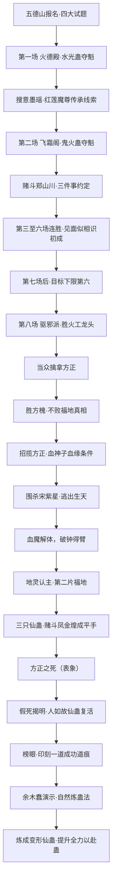

# 中洲炼蛊大会

## 核心定义

中洲炼蛊大会是**中洲十大古派主办、天庭幕后推动的百年一届炼道盛会**：表面是炼道竞技，实质是为不败传承积累失败凡蛊、再由天庭提取**成功道痕**用于修复**宿命蛊**的长期工程（E:V4-152338、153602）。大会制度是跨轮次不变项（百年一届、四大试题、上届免试、前六名当场印刻成功道痕、正魔不限），故本页按"制度层／事件链"分离登记：制度与外移状态归《资料整理·制度与规则明文》，L2 事件链收录**段四·弧八预选赛（E:V4-150642–156775，第178–215节）**——即方源以"前辈"身份参赛、自报散修并夺得榜眼的一轮。

另两轮（笔记记作 Run 1／Run 2，段五~段六）目前**只有读书笔记转述、无逐段原文证据**，统一留在《资料整理·笔记转述》并列入《待核对》，不得与本轮合并。本页不含弧七线（雪胡老祖、羽圣城、琅琊攻防），该线按分工归弧七页。

## 投影索引

| 层级 | 内容 | 承接页／状态 |
| --- | --- | --- |
| 规则·道痕 | 成功道痕（当场印刻、不可夺取转移、只排除失败概率） | **已外移** [道痕体系](../rules/dao-marks.md) DM-007；**口径冲突见《待核对》** |
| 规则·炼蛊 | 蛊方＝工艺路线、逐步递进与一步到位的权衡 | **已外移** [炼蛊](../rules/refinement.md) REF-018 |
| 规则·炼蛊 | 失败归因（分神／外力／工序冒进＝自找死路） | **已外移** [炼蛊](../rules/refinement.md) REF-015（锚点 E:V4-151696 即本页赌斗场面） |
| 规则·境界 | 流派境界四等、炼道三老、炼道准宗师 | **已外移** [流派境界](../rules/path-realms.md) PR-002、PR-004（原文另存"无上大宗师"双口径） |
| 规则·大会 | 百年一届、四大试题、上届免试、正魔不限、赌斗规程、赛制 | **待外移** rules 页（大会制度；本页只留整理登记） |
| 世界·机制 | 自然炼蛊法（养／用／炼三义、借天地之力、蛊仙门槛） | **待外移** rules 页或 [蛊的饲养与炼化](../world/gu-care-and-refinement.md) |
| 世界·机制 | 血胎（血神子残方＋北原血道方法＋血魔解体） | **待外移** rules 页（新增条目） |
| 世界·地理 | 五德山、星象福地、帝君城 | [中洲](../world/central-plain.md)、[地图总表](../world/map-roster.md) |
| 势力 | 十大古派＝天庭内部派系的地上代理人；天庭接手大会 | [天庭](../world/heavenly-court.md)、[十大古派](../world/ten-ancient-sects.md) |
| 人物 | 方源、红莲魔尊、宋紫星、凤金煌、古月方正、鹤风扬、余木蠢等 | 按名录检索：[方源](../characters/fang-yuan.md)、[红莲魔尊](../characters/red-lotus.md)、[角色总表](../characters/roster.md)、[角色总表二期](../characters/roster-2.md)、[敌方名录](../characters/enemy-roster.md) |
| 蛊 | 春秋蝉、宿命蛊、智慧蛊、血神子 | [春秋蝉](../gu/spring-autumn-cicada.md)、[宿命蛊](../gu/fate-gu.md)、[智慧蛊](../gu/wisdom-gu.md)、[蛊虫总表](../gu/roster.md) |
| 杀招 | 见面似相识、血魔解体、墨化、曝光蛊等 | [杀招名录](../rules/killer-moves.md)、[杀招总表](../world/kill-move-roster.md) |
| 后续轮次 | Run 1／Run 2 大会与帝君城大战（含五域界壁缩减） | **未核验**（笔记转述），见《待核对》；轮次对照见[宿命大战](fate-war.md) |

## 事件链（段四·弧八 预选赛）

编号按**叙事顺序**（行号升序）连续；每条主锚点均已回 `source:source/蛊真人-clean.txt` 逐行核验。

| 事件ID | 事件 | 前因 | 参与者 | 后果 | 因果指向 | 主锚点 |
| --- | --- | --- | --- | --- | --- | --- |
| EVT-CPR-001 | §175–179 飞鹤山学艺与"利益联姻"的劝告 | 方正随天鹤上人学艺 | 方正、天鹤上人 | 天鹤上人授"纷纷手"等炼蛊手法，并劝方正不要拒绝炎堂长老的联姻（"这个世界里哪个组织，不是用利益维系的？"） | 为第八场"炎堂长老被当弃子"埋线 | E:V4-150660、150690 |
| EVT-CPR-002 | §179 五德山五德门·报名与四大试题通关 | 大会开办，报名者数十万 | 方源、五德门 | 方源领"六十三"号牌，按序完成全部试题，得令牌；无令牌不得参赛，往火德殿参加第一场炼蛊大比 | 取得第一场参赛资格 | E:V4-150722、150834、150846、150920 |
| EVT-CPR-003 | §180 第一场炼蛊·火德殿水光蛊夺魁 | 一炷香内须炼出至少一百只水光蛊 | 方源、五德门 | 方源炼出一百七十七只，比第一名标准多一只，名列第一并得四转绿曜蛊 | 绿曜蛊成为后文赌斗赌注 | E:V4-150964、151004、151006 |
| EVT-CPR-004 | §181 搜意墨瑶·得红莲魔尊传承线索 | 方源搜意灵缘斋墨瑶的意念 | 方源、墨瑶（意念） | 得红莲魔尊传承线索：传承设于光阴长河，首要条件是拥有春秋蝉；须蛊仙自爆后以春秋蝉载意志入河、寻到石莲岛才能见红莲意志 | 指向[石莲岛与红莲真传争夺](stone-lotus-island-contest.md) | E:V4-151082、151114、151118、151120、151122 |
| EVT-CPR-005 | §182 依旧第一·第二场飞霜阁鬼火蛊夺魁 | 第二场改以时间为标准 | 方源、飞霜阁 | 方源以魂道炎道相互结合的手法焚烧幽魂、以假鬼火炼真鬼火，一只鬼火蛊自爆仍以少于一炷香的时间夺第一 | 声名与赌斗压力累积 | E:V4-151198、151208、151226、151254、151302 |
| EVT-CPR-006 | §183 少年挑战·赌斗郑山川（起） | 方源在飞霜阁场中夺魁 | 方源、郑山川 | 郑山川以一张五转蛊方为赌注，赌方源赢得的四转绿曜蛊；大会可提赌斗但无"必须应战"之规，方源有权拒绝 | 赌斗被推为公开"大比试"规格 | E:V4-151352、151378、151390、151410、151412 |
| EVT-CPR-007 | §184–185 金钟形炼道杀招·捏碎绿曜蛊 | 赌斗被推至公开大比试，飞霜阁大供奉安寒让出场地 | 方源、郑山川、安寒、岐山老人 | 郑山川施展其炼道杀招（金钟形：金芒幻化小型金钟、只持续六个呼吸、吞吸六份材料）；方源以血道手法取胜，并当众捏碎绿曜蛊 | 赌局转入"放过他"的条件谈判 | E:V4-151510、151576、151672、151678、151686、151722、151728、151754 |
| EVT-CPR-008 | §186 三件事情的约定与血道信物 | 方源当众捏碎绿曜蛊 | 方源、郑山川、岐山老人、飞霜阁 | 方源改口"放过他"，转交另一只血道蛊虫（郑山川才知绿曜蛊未被真毁），约定其替己做三件事；作证方是飞霜阁与整个炼蛊大会；此后郑山川为岐山老人治伤、八十八岁成炼道宗师、晚年开"山川堂" | 收束赌斗线；血道炼蛊法曝光 | E:V4-151796、151822、151850、151864、151866、151870、151884 |
| EVT-CPR-009 | §187 再搜意墨瑶·得炼蛊手法与一记炼道杀招 | 赌斗事了 | 方源、墨瑶（意念） | 获墨瑶掌握的不少炼蛊手法、甚至一记炼道杀招（墨瑶为炼道宗师，方源当时只是炼道准宗师） | 炼道手段补强 | E:V4-151902、151906 |
| EVT-CPR-010 | §188 第三至六场连胜·「见面似相识」初成 | 前两场皆第一 | 方源 | 准宗师境界五场连取第一；第六场前一天推算「见面似相识」仙道杀招得第一阶段成果，第六场再取第一 | 杀招与战绩互为支撑 | E:V4-151966、151970、152008、152024 |
| EVT-CPR-011 | §189 生意做到西漠去·萧家长恨蛛贸易 | 方源需资源与交易通道 | 方源、西漠萧家 | 以三万多头潜沙蛛群与萧家谈长久贸易，令其以万里丝廊节点令牌每月三十日收货付款 | 建立跨域长线贸易 | E:V4-152036、152086、152120、152154 |
| EVT-CPR-012 | §190 前世人杰名单与"下限第六"目标 | 七场之后只剩八千多人，四百人进入下一阶段 | 方源 | 方源名列第一；从头世记忆认出火工龙头、方槐、天泯灭、凤金煌、余木蠢、吕品田、都平滩、曲文；自定"要从不败传承中获益，至少得是决赛第六" | 确定必须进前六的硬目标 | E:V4-152200、152272、152282、152298、152332 |
| EVT-CPR-013 | §189 大会由来（旁白追述） | — | 中洲十大古派、天庭 | 大会起初只是十大古派为争夺不败传承而设的"瓜分利益的形式"，后因牵涉利益太大、对修复宿命蛊有帮助，天庭主动接手；十大古派皆是天庭内部组织派系的地上代理人 | 解释天庭为何是幕后老大 | E:V4-152334、152336、152338 |
| EVT-CPR-014 | §190–191 第八场驱邪派·方正入场与炎堂长老被弃 | 第八场及其后每场只有一人可晋级；火工龙头请求回归万龙坞 | 方正、仙鹤门炎堂长老、火工龙头、驱邪派 | 仙鹤门高层把炎堂长老当弃子，用以试探火工龙头的能力；方正郁愤，盼有人击败火工龙头 | 方源出场前的局势与动机 | E:V4-152356、152460、152484、152520 |
| EVT-CPR-015 | §192 方源的公然挑衅 | 方正心底的呼唤与噩梦 | 方源、火工龙头、方正 | 方源现身当众宣战，指名要其使出最强手段"疯神烈焰"；前世记忆中火工龙头是此届第二名、第十场曾力压三位准宗师，故须提前打击；方正察觉亲兄身份并当众切割 | 由竞技转为对前世人杰的私人打击 | E:V4-152522、152540、152570、152680、152698、152732 |
| EVT-CPR-016 | §192 第八场题面与方源抢先动手 | 第八场试题为五转音道缄默蛊、速度最快者晋级 | 方源、参赛蛊师、天庭 | 试题蛊虫为天庭手笔的信道五转凡蛊（保密能力非凡）；须逆炼冷漠蛊／三缄其口蛊／沉没蛊取料再加工；方源凭前世记忆抢先开炼 | 抢占胜负手 | E:V4-152764、152770、152782、152826、152872、152876、152900、152920 |
| EVT-CPR-017 | §193 胜火工龙头·第八场夺魁 | 方源采用前世这一届之后无数炼道蛊师总结出的最优方案 | 方源、火工龙头、驱邪派 | 方源以极大优势取胜，接过驱邪派胜者奖励（一大批种类繁多的稀量仙材） | 除一大患；获取仙材 | E:V4-152932、152950、152988 |
| EVT-CPR-018 | §193 当众擒拿方正 | 方源离场时仙鹤门两位长老（含炎堂长老）在外等候，方正出列但不主动招呼 | 方源、方正、仙鹤门长老、各派代表 | 方源以来自东方长凡的智道杀招隔距禁锢方正（此前已切断方正与自身空窍的联系），当众将其擒走 | 方正线转折；擒拿实为夺舍备用 | E:V4-153000、153034、153044、153048、153054 |
| EVT-CPR-019 | §194 仙蛊变形·擒方正的真意与搜魂 | 方正已被擒 | 方源、方正、天鹤上人（魂） | 旁白点明擒拿方正"不过是为了夺舍做个有备无患的准备"；方源以魂道杀招对其搜魂 | 取天鹤上人所知；留方正作备用体 | E:V4-153130、153158 |
| EVT-CPR-020 | §195 两方之争·胜方槐 | 方槐有杀手锏 | 方源、方槐 | 方源凭前世记忆知其杀手锏而取胜（"进入前六问题不大了"） | 前六之争推进 | E:V4-153404 |
| EVT-CPR-021 | §196 失败是有价值的·不败福地真相 | 决赛之前 | 天庭（监天塔主）、方源 | 不败福地为毛民头领之物、毛脚山是其旧落脚地；天庭攻略数千年只提取到三十道不败道痕，传承每次积满共三十六道，余六道"只能留给那些参加大会的比试之人，就算是想要去夺，也夺不去"；真目的是以提取的成功道痕修复宿命仙蛊 | 揭示整场大会的机制 | E:V4-153504、153596、153602 |
| EVT-CPR-022 | §197 招揽方正与血神子的血缘条件 | 方正被擒并被搜魂 | 方源、方正、血神子仙蛊 | 方源修复血神子时发现：即便炼成，催动仍须血缘亲人——杀得一位亲人，方能在血神子仙蛊的力量下得到一位血神子 | 解释方源为何留方正之命 | E:V4-153606、153742 |
| EVT-CPR-023 | §198 血道魔威·凤金煌探梦与成功道痕印刻 | 凤金煌败于方源 | 凤金煌、方源 | 凤金煌因败反而提前知晓梦翼仙蛊的真正用法，探梦使炼道境界达准宗师；同段给出奖励规则：前六名当场印刻成功道痕、外人无法抢夺，而成功道痕只排除失败概率、并非"肯定成功"，一道最多用于六转仙蛊 | 对手升级；奖励机制明文 | E:V4-153786、153812、153814、153816、153842 |
| EVT-CPR-024 | §199 围杀宋紫星（一）：十六仙现身·智道诱饵 | 天庭命令，中洲十大古派联手 | 宋紫星、二十位蛊仙（含凶雷恶人、烈魔仙丹乔）、古魂门／天妒楼／灵蝶谷 | 十六位蛊仙陡然现身；以凶雷恶人的雷神子（脱胎于血神子，正投宋紫星所觊觎）为饵，三家智道蛊仙联手干扰宋紫星的仙道杀招「心血来潮」以遮蔽预警；连同二人共二十位蛊仙围杀 | 伏杀未能一战竟功 | E:V4-154050、154068、154074、154136 |
| EVT-CPR-025 | §200 逃出生天·戾血龙蝠自爆破幻景园 | 围杀未果 | 宋紫星、十七位追兵（一名万龙坞蛊仙留下照看凶雷恶人） | 宋紫星预先布置在外的戾血龙蝠撞上仙蛊屋「幻景园」后主动自爆，里应外合打出缝隙，得以突围 | 转入血道对血道的单线冲突 | E:V4-154254、154262 |
| EVT-CPR-026 | §201 血魔解体，破钟得臂 | 宋紫星被逼入绝境 | 宋紫星、方源 | 宋紫星以仙道杀招「血魔解体」弃身，最后仅剩一个头颅和半个胸膛；其一条断臂被金钟虚影裹住遗落，方源以力道大手印捏爆金钟、镇压并封印断臂 | 方源得宋紫星断臂；血道后文伏笔 | E:V4-154298、154302、154342、154490、154492 |
| EVT-CPR-027 | §202 地灵认主，第二片福地 | 万象星君（星象地灵前身）已死于星宿仙尊梦境、只余肉身 | 方源、星象地灵 | 星象地灵心悦诚服认主，方源得第二片福地；星象福地是巨大盆地，含箭竹林（福地中规模最大的豢养地）、陨石群坑、碎星湖、星屑草场；对外伪造"未认主"假象 | 方源获得第二片福地 | E:V4-154506、154534、154542、154586、154648、154830 |
| EVT-CPR-028 | §203 三只仙蛊，皆有大用 | 星象福地认主 | 方源 | 得星痕（六转，可令肉身暂时增添六百道星道道痕）、星光（炼制智道星念蛊的必须蛊材）、星芽；万象星君原有四只仙蛊，第四只毁于与宋紫星之战；方源手头已有十四只仙蛊（不计新得三只），其中含九转仙蛊智慧 | 家底跃升 | E:V4-154690、154710、154718、154762、154778 |
| EVT-CPR-029 | §204–207 赌斗凤金煌（终）：墨化·曝光蛊·自爆成平手 | 赌斗只准用大会提供的炼蛊材料，可动攻伐手段与炼道杀招，禁一切魂魄心神（提神养魂）手段 | 方源、凤金煌 | 凤金煌施炼道杀招「墨化」，方源以曝光蛊应对；方源将成之际蛊虫雏形自爆，双方以平手告终；按平手规则凤金煌选择"双方交换赌注"，交出记载仙僵重获新生法门的信道蛊虫（法门与灵缘斋上代仙子怜香仙子有关）；方源实为故意打成平局以示好 | 方源获新生法门；凤金煌线收束 | E:V4-155170、155468、155478、155492、155506、155524、155530、155536、155602、155746 |
| EVT-CPR-030 | §208 方正之死（**表象**） | 天庭下令铲除方正 | 鹤风扬、方正、方源、天鹤上人（魂） | 鹤风扬明言"要铲除方正，是天庭下的命令"；方正经搜魂七八遍仍怒斥方源是屠杀舅父舅母的真凶、拒绝原谅；可见伤情为皮开肉绽、一条手臂被切断改装狗的前肢且仍能感知操纵；鹤风扬以火焰灼烧将其"当众杀死"、连一丝渣滓都不留 | 方正线**表面**终结，实为假死（见下条） | E:V4-155576、155640、155672、155680、155684 |
| EVT-CPR-031 | §209 假死揭明：断臂留密室·「人如故」仙蛊复活 | 鹤风扬不知世间有「人如故」这类仙蛊，确信方正已彻底灭亡 | 方源、太白云生、古月方正 | 方源早先故意切断方正一条手臂并安装狗肢作出拷打假象，把断臂留在密室；鹤风扬离去后，被方源唤回的太白云生以「人如故」仙蛊、耗一笔颇为可观的仙元，针对断臂将方正复活——**实体古月方正仍然存活** | 方正"死亡"是方源呈交的假象，其人留作夺舍备用体 | E:V4-155770、155776、155778 |
| EVT-CPR-032 | §209 榜眼：败于余木蠢·获第二·印刻一道成功道痕 | 方源进入最终决赛 | 方源、余木蠢、凤金煌 | 凤金煌取得第六名；方源败于余木蠢获第二名（榜眼），达到原本目的，身上印刻下一道成功道痕；该道痕无法夺取和转移，连天庭多次努力都无一次成功 | 完成"进前六"目标并拿到成功道痕 | E:V4-155808、155836、155840 |
| EVT-CPR-033 | §210（＋标题缺失的 §211）余木蠢当众炼仙蛊 | 大赛结束 | 余木蠢、方源、各派蛊仙 | 余木蠢（毛民、"逃脱宿命之人"，几年前只是随手指点本多一）以龟壳盛毒血当众炼仙蛊，并称这是本多一的"最后一课" | 引出自然炼蛊法 | E:V4-155910、155946、155992 |
| EVT-CPR-034 | §212 自然炼蛊法明文 | 余木蠢当众炼蛊 | 余木蠢 | 以毛民一脉的自然炼蛊法演示炼蛊：置身大自然、借天地间道痕之力，成功率远高于人族之法 | 方源改以自然炼蛊法为本 | E:V4-156138、156142、156152 |
| EVT-CPR-035 | §212–213 地极天罡·肉身血炼法·变形仙蛊炼成 | 方源已备齐成功道痕与几乎全部仙材、仙元石 | 方源、星象地灵 | 星象地灵选律道道痕最集中之处炼蛊，天地交感、群山震动、乌云闷雷；方源以自创的「肉身血炼法」耗三天三夜将地极天罡融入毒血；地灵抛入毛民、石人、雪人、墨人、蛋人、羽民、鲛人等异人；变形仙蛊炼成 | 大会收益转为实力 | E:V4-156226、156268、156322、156348、156400、156428、156442、156498 |
| EVT-CPR-036 | §214 炼蛊之后·星念流水线与宋紫星血池 | 变形仙蛊炼成 | 方源、余木蠢、宋紫星 | 方源以星光仙蛊建星念流水线；此役耗去成功道痕与几乎全部仙材、仙元石；余木蠢到访血池，只见仅剩头颅和大半胸膛的宋紫星，宋紫星淡然称"无非是舍弃这身性命和修为罢了"并反问律道仙蛊是否炼出 | 方源资源见底；宋紫星线转入血胎 | E:V4-156458、156498、156610、156614 |
| EVT-CPR-037 | §214 宋紫星血胎·宿命仙蛊未毁 | 宋紫星只剩头颅与大半胸膛 | 宋紫星、余木蠢 | 血池底部浮出一个血胎（小马驹大小，胎膜中隐约有人形、宛若婴儿蜷缩沉眠）；余木蠢震惊并请求研究；余木蠢另言宿命仙蛊"既然没有彻底毁去"，发生变故很正常 | 「第二个宋紫星」的后手（机制见《资料整理》） | E:V4-156628、156686、156692、156694、156698、156700 |
| EVT-CPR-038 | §215 提升全力以赴蛊 | 方源处于虚弱期 | 方源、灵缘斋 | 与灵缘斋首笔交易达成（气囊蛊装载胆识蛊交付，收获一百八十块仙元石，半数转为青提仙元，渡过虚弱期）；变形仙蛊完美融入「见面似相识」，并凭力道宗师境界推算五转全力以赴蛊蛊方，失败一次后提至五转；推算小家子气蛊蛊方惨败（气道只是普通） | 战力与家底重整 | E:V4-156712、156720、156758、156762、156766、156770、156774 |

## 原著明确内容

核验窗口：E:V4-150642–156775（第178–215节），原文行域取自 `source:source/蛊真人-clean.txt`。本区只登记**口径裁定与表外单点事实**；完整事件链见上表，制度与机制见《资料整理》。

### 关键口径（三条，最高优先）

1. **方正之死＝假死，不得写成死亡终结。** 表面事实：鹤风扬以火焰灼烧将方正"当众杀死"、连一丝渣滓都不留（E:V4-155680、155684）。真实事实：方源**预先**故意切断其一条手臂并安装狗肢作出拷打假象、把断臂留在密室，鹤风扬离去后被唤回的太白云生以「人如故」仙蛊、耗一笔颇为可观的仙元，**针对断臂将方正复活**——实体古月方正仍然存活（E:V4-155770、155776、155778）。鹤风扬不知世间有「人如故」这类仙蛊，故确信方正已彻底灭亡（E:V4-155778）。当事在场者只有方源、鹤风扬与方正（方正身上另载天鹤上人之魂，以寄魂蚤形式在场）。任何"方正已死"的写法都须按此修正。
2. **成功道痕分配＝不败传承共余六道、前六名各一道，不是每人六道。** 依据链：不败传承每次积满共三十六道，天庭已提前取走三十道，"还剩下六道道痕，只能留给那些参加大会的比试之人，就算是想要去夺，也夺不去"（E:V4-153504）；方源获第二名，**身上印刻下的是"一道"成功道痕**（E:V4-155836）。153812 字面作"前六名，将会被奖励六道成功道痕"，可被误读为"各六道"，属原文表述歧义，已在《待核对》登记。
3. **郑山川的炼道杀招没有正式招式名。** 原文只作形态描写：金光流转幻化为一座小型金钟，金钟只持续六个呼吸（E:V4-151672、151678）；叙述者评"郑山川年纪轻轻，却是已经掌握了炼道杀招"（E:V4-151686）；第185节标题作《炼道杀招转金钟》（E:V4-151548）。本页一律写作"郑山川的炼道杀招（金钟形）"，**不得生造招式名**。

### 表外单点事实

- `[叙事|已核]` 第一场方源炼出一百七十七只水光蛊，恰好比第一名标准多一只，据此夺魁并得四转绿曜蛊（E:V4-151004、151006）。
- `[对话|已核]` 红莲魔尊传承的首要条件是拥有春秋蝉；还须蛊仙自爆后以春秋蝉载着意志进入光阴长河，在长河中寻到一座石莲岛，才能见到留存在那里的红莲意志（E:V4-151118、151120、151122；说话人：叙述转述墨瑶所知）。
- `[叙事|已核]` 安寒身为飞霜阁大供奉、名门正派，明知郑山川吃亏也只能"心里偷着乐，表面上则是唏嘘不已"（E:V4-151760）。
- `[叙事|已核]` 血道炼蛊法曝光时，飞霜阁高层"脸色铁青"（E:V4-151850）。
- `[叙事|已核]` 潜沙蛛群足有三万多头（E:V4-152036）；萧家蛊仙刚要含愤出手，风沙中又探出另外七只力道巨手（E:V4-152086）。
- `[叙事|已核]` 围杀宋紫星共二十位蛊仙，其中十六位陡然现身（E:V4-154050、154136）；宋紫星当场判断"能让中洲十大派，都一起出手，看来应当是天庭的命令了"（E:V4-154068，`[对话|已核]`）。
- `[叙事|已核]` 追兵共十七位，其中一名万龙坞蛊仙留下照看凶雷恶人（E:V4-154262）。
- `[叙事|已核]` 星象福地整体是一个巨大的盆地；箭竹林是福地中规模最大的豢养地（E:V4-154542、154586）。
- `[叙事|已核]` 方源得第二片福地后仍令星象地灵在宝黄天持续散发认主要求，伪造福地未认主的假象（E:V4-154830）。
- `[信念|已核]` 方源自述是**故意**打成平局，为的是给灵缘斋展现温和态度（E:V4-155746）。

## 资料整理

本节含两块：①**已回原文核验的制度与机制明文**（按协调方要求统一归口于此，并为外移 rules 页作登记——条目本身不是笔记转述）；②**读书笔记转述**（不作为原著事实）。

### 制度与规则明文（原文已核；机制待外移 rules 页）

| 制度项 | 明文要点 | 原文锚点 | 外移状态 |
| --- | --- | --- | --- |
| 周期与一生一次 | 中洲一百年才有一场的盛会；除延寿者外，一生只能参加一次 | E:V4-150694 | 待外移 rules 页（大会制度） |
| 入场资格＝四大试题 | 通过四大试题才等于拿到入场资格 | E:V4-150706 | 待外移 rules 页 |
| 上届名次免试 | 门派或个人在前一届取得名次者可得免试名额（例：众生书院百年前取得靠后名次，本届得三个免试名额） | E:V4-150936、150940 | 待外移 rules 页 |
| 倾向中洲本土 | 由中洲十大古派举办，因而倾向于中洲本土；方正身为仙鹤门长老不能与弟子争名额，自身炼道低微也抢不过长老 | E:V4-150944、150950 | 待外移 rules 页 |
| 组织层级 | 表面由十大古派联合举办，实由天庭幕后；十大古派皆是天庭内部组织派系的地上代理人，天庭是幕后老大 | E:V4-150926、152338 | [天庭](../world/heavenly-court.md)、[十大古派](../world/ten-ancient-sects.md) |
| 正魔不限 | 参加大会除不能动手打杀外，蛊师是正是魔都无所谓，并不禁止排斥魔道蛊师参加 | E:V4-151216 | 待外移 rules 页 |
| 通缉犯可公开报名 | 大会期间连魔道都可以公开参加，哪怕是通缉犯也能堂而皇之报名，正道不会追捕 | E:V4-152876 | 待外移 rules 页 |
| 正魔不限的动因 | 不明内情者赞叹十大古派胸襟，只有方源这种人才明白这与不败传承有关——传承的隐秘需求是参加的蛊师越多越好 | E:V4-151220 | 待外移 rules 页 |
| 进入前六的硬门槛 | 要从不败传承中获益，至少得是决赛第六 | E:V4-152332 | 待外移 rules 页 |
| 成功道痕分配 | 天庭已提前取走三十道，不败传承积满共三十六道，余六道只能留给比试之人且夺不去；前六名当场被印刻成功道痕、外人无法抢夺；方源获第二名实得一道 | E:V4-153504、153812、155836 | **已外移** [道痕体系](../rules/dao-marks.md) DM-007（**口径冲突见《待核对》**） |
| 成功道痕作用 | 只排除炼蛊过程中的失败概率，"并非肯定成功"；一道成功道痕最多用于六转仙蛊，七八转所需绝不止一道 | E:V4-153814、153816、153842 | 已外移 DM-007 |
| 道痕不可夺取性 | 成功道痕无法夺取和转移，天庭多次努力无一次成功；十大古派只谈交易 | E:V4-155840 | 已外移 DM-007 |
| 流派境界四等 | 普通、大师、宗师、大宗师；炼道大宗师史上只有三位，号称炼道三老（长毛老祖、天难老怪、空绝老仙）；炼道准大宗师北原公认四人（药皇、慕容雪祥、万寿娘子、妙狸夫人，合称北原炼道四能） | E:V4-153298 | **已外移** [流派境界](../rules/path-realms.md) PR-002、PR-004（原文另存"无上大宗师"双口径，见 E:V4-170740，不在本页范围） |
| 赌斗规程 | 赌斗只准用大会提供的炼蛊材料；可用攻伐手段与炼道杀招，但禁一切魂魄心神（提神养魂）手段；受方有权拒绝应战；平手可"各自拿回赌注"或"双方交换赌注"二选一 | E:V4-151410、151412、155170、155530 | 待外移 rules 页 |
| 赛制·场地 | 第八场及其以后，每一场的比试地点都只有一位蛊师可以晋级 | E:V4-152540 | 待外移 rules 页 |
| 试题保密 | 装载试题的蛊虫是信道五转凡蛊，为天庭手笔，有非凡的保密能力 | E:V4-152764 | 待外移 rules 页 |

### 大会机制明文（原文已核；待外移 rules 页）

- **自然炼蛊法**（余木蠢演示；机制待外移 rules 页）：
  - 起源：毛民一出生身上就有炼道道痕，"甚至，炼道的产生就起源于毛民"，其炼蛊底蕴积淀是人族的数十倍（E:V4-156138）。
  - 养／用／炼三义：养蛊＝熟悉材料与蛊虫之间的联系（蛊虫和食料之间蕴藏无数蛊方）；用蛊＝体会蛊虫身上的道痕；**炼蛊＝对道痕的处理**（E:V4-156142）。
  - 借天地之力：炼蛊更应置身大自然，因为大天地才是拥有道痕最多的地方，"若是能利用天地间的道痕，就能在某种意义上，借助天地之力帮助我们炼蛊"（E:V4-156142）。
  - 履历与成功率（余木蠢自述）：三岁起喂养蛊虫、十岁触摸即知陌生蛊虫的食料、二十二岁决意重起炉灶、一百三十八岁自然炼蛊法小成、二百四十六岁大成（可感悟自然、选最适合之地）；自述"炼六转仙蛊，成功十中有四。炼七转，二十有一。八转仙蛊，碍于修为，至今也未尝试"（E:V4-156152）。**原文异常**：该行"十六岁，用人族之法炼出五转蛊，成功十之。"被 `.` 省略号截断，后半句内容原文未显示，引用时须注明不完整。
  - 风险约束条款：自然炼蛊法可学，但**若不成蛊仙，万万不可动用此法炼蛊，因为这会招来天灾地劫**（E:V4-156442）。
- **血胎**（宋紫星的后手；机制待外移 rules 页新增）：
  - 形成：宋紫星自述"这个血胎就是我依照血神子残方，还有北原那边的血道方法，再结合我的仙道杀招血魔解体形成的"（E:V4-156692）。
  - 与「血魔解体」假身之别：解体假身需时刻耗费仙元维持、有时间限制；**血胎孕育出来的假身不耗费仙元、至少能维持两三百年**，本身能够修行、有独立的思维、可一步步提升并最终升仙，容貌与本尊一模一样（E:V4-156694）。
  - 意图原话："就算我牺牲了，血胎中还会孕育出第二个宋紫星来的"（E:V4-156698）；余木蠢请求研究血胎以获取全新灵感（E:V4-156700）。
  - 尺寸形态：血胎有一匹小马驹大小，胎膜中隐约有人形模样、宛若婴儿蜷缩沉眠（E:V4-156686）。

### 笔记转述（不作为原著事实）

以下条目来自读书笔记的整理转述，尚未完成逐段原文核验，不得当作原著事实；Run 1 与 Run 2 条目并列记录，不得合并。

- 冰塞川言宿命蛊就要修复完成，此届炼蛊大会应当是最后一场。对应笔记锚点：G 的 312030。
- Run 1 炼蛊大会阶段（「炼蛊大会与杀戮开始」区间 312998–313356，第 682–683 节内）：原文行 313034 记地脉震荡不定导致五域界壁不断缩减，原文行 313036 记蛊师穿越两域界壁耗时不足之前一半。「地脉合一」为该进程的概括性表述，原文同进程另见 314938、319442，Run 2 回望见 324794。对应笔记锚点：G 的 313034–313036。
- 龙公誓言不许任何人破坏大会。对应笔记锚点：G 的 313168。
- 天庭修复宿命蛊需要炼蛊大会产生的成功道痕。对应笔记锚点：G 的 313180；对应笔记锚点：H1 的 316294–316296、318812–318816。
- 方源袭击报名点，笔记记录十五处袭击、杀蛊师上万。对应笔记锚点：G 的 313228–313300。
- 「炼蛊大会与杀戮开始」区间覆盖大会开场与袭击。对应笔记锚点：G 的 312998–313356。
- 「天庭危局／帝君城大战」区间覆盖决赛前后的大战。对应笔记锚点：G 的 314766–315138。
- 决赛在帝君城，帝君城为天下第一凡蛊屋。对应笔记锚点：G 的 314878–314884。
- 帝君城大战中有十多位八转战力激战。对应笔记锚点：G 的 315012–315014。
- Run 2 中洲炼蛊大会开启。对应笔记锚点：H2 的 357518–357682。
- Run 2 方源发表公开宣言。对应笔记锚点：H2 的 357582。
- Run 2 白凝冰等破坏报名点。对应笔记锚点：H2 的 357638–357642。

## 分析与解读

- **大会是三层结构叠在一起的一台机器**：竞技层产出失败凡蛊→传承层提取成功道痕→宿命层修复宿命蛊（E:V4-153602）。参赛者以为在争名次，实际在替天庭的修复工程做功；方源明知机制而照旧参赛，是把这台机器当成自己的资源入口。
- **"正魔不限／通缉犯可公开报名"不是宽容，而是需求端的暴露**：制度的开放度与宿命工程的胃口同向——"参加的蛊师越多越好"才是真正的立法理由（E:V4-151220、152876）。这解释了为何一份人道以外的秩序会容纳魔道公开报名。
- **成功道痕的"不可夺取转移"锁死了天庭的路径**（E:V4-155840）：天庭无法直接抢取，只能维持"公开竞技＋当场印刻"这一形式来量产，于是大会的公开性成了宿命修复的必要条件而非装饰。
- **方源对同一大会的两种用法形成对照**：本轮他以参赛者身份在秩序内夺榜眼、拿到一道成功道痕；Run 1／Run 2 中他转为秩序外的破坏者（袭击报名点、公开宣言）。两种用法指向同一目的——把大会的能力转成自己的资本。
- **方正线的"假死"是一次三方交付**：当众擒拿满足私愿、火焰处死服从天庭命令（E:V4-155576）、断臂复活保住备用体（E:V4-155778）。鹤风扬的"确信"与太白云生的"复活"共同构成了这场骗局的完整性，也说明本页必须把"死亡"写成表象。

## 待核对

- **Run 1／Run 2 两轮大会仍无逐段原文证据**（段五~六，笔记锚点 312998–313356、357518–357682）：本页**不为其立 EVT 行**，只保留《资料整理·笔记转述》。轮次划分、龙公誓言文本与约束范围、十五处袭击完整清单、帝君城决赛与大战胜负细节均待回原文核验；Run 2 的决赛地点、归属与最终胜负在现有资料中未给出，不得补写。
- **跨页口径冲突（待协调方裁定，本页不改 rules 页）**：`rules/dao-marks.md` DM-007 现记"炼蛊大会前六名**各**奖励六道成功道痕"，与本页口径（不败传承共余六道、前六名各一道）不符。本页依据：不败传承积满共三十六道、天庭已取三十道（E:V4-153504，算术上"各六道"将超出总数），以及方源获第二名实得"一道"（E:V4-155836）。建议 A 线按"各一道"修正 DM-007。
- **原文歧义登记·153812**："前六名，将会被奖励六道成功道痕"字面可读作"各六道"；已按"共六道、前六名各一道"口径处理（见上条），原文表述本身存歧义，待改或加注。
- **原文异常·第211节标题缺失**：第210节《炼仙蛊》标题在 155862、第212节《自然炼蛊法》标题在 156054，之间无第211节标题行；`source/section-index.md` 同样 210→212 直连（缺 211 行）。判断为**仅丢失标题行、正文连续**，但 §210／§211 的正文边界在本窗口内不可区分（本页 §210 相关事件行已按合并口径登记）。
- **原文异常·洞天名异文**：本页范围内的 154640 记万象星君奇遇之地为「繁星洞天」；窗口外的 158776（弧七·琅琊线，**不在本页范围**）作「星象洞天」。二者不一致，疑为原文笔误，未改原文，待回其他版本核对后统一。
- **原文异常·截断句**：156152 余木蠢自述"十六岁，用人族之法炼出五转蛊，成功十之。"被 `.` 省略号截断，后半句成功率原文不可见；引用成功率时须注明该句不完整。
- **机制外移未完成**：自然炼蛊法、血胎、赌斗规程、大会制度（周期／试题／免试／正魔不限）目前**只在本页登记**，rules 页承接条目尚未建立；外移后本页应改为指针。
- **本窗口外未结**：方正于 155770–155861 复活后的下落与后续用途本窗口内未见再提（属弧七线）；159001 起进入琅琊攻防线，不在本页范围。
- **边界（非缺口）**：本页只改 `events/central-plain-refinement-conference.md` 一个文件，未触碰共享页（`events/index.md`、`events/story-arc-overview.md`、`log.md`、`COORDINATION.md`）；既有入口路径与标题未变，各页回链无需改动。

关联页面：[宿命大战](fate-war.md)、[十三弧事件链总览](story-arc-overview.md)、[义天山大战与二次重生](yitian-mountain.md)、[石莲岛与红莲真传争夺](stone-lotus-island-contest.md)、[天庭入侵琅琊福地](langya-blessed-land-invasion.md)、[天庭](../world/heavenly-court.md)、[十大古派](../world/ten-ancient-sects.md)、[中洲](../world/central-plain.md)、[道痕体系](../rules/dao-marks.md)、[炼蛊](../rules/refinement.md)、[流派境界](../rules/path-realms.md)、[杀招体系](../rules/killer-moves.md)、[蛊的饲养与炼化](../world/gu-care-and-refinement.md)、[红莲魔尊](../characters/red-lotus.md)、[方源](../characters/fang-yuan.md)、[角色总表二期](../characters/roster-2.md)、[宿命蛊](../gu/fate-gu.md)、[春秋蝉](../gu/spring-autumn-cicada.md)、[宿命](../themes/fate.md)。
