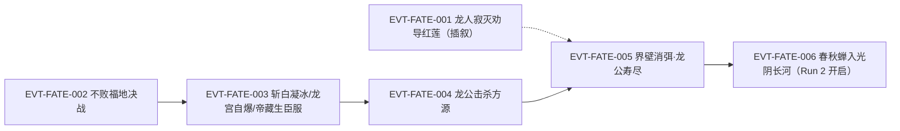

# 宿命大战

围绕宿命蛊、天庭秩序和改变终局可能性展开的多方大战。本页按 schema v2.1 组织：Run 1 收尾（第 732 节《龙公的牺牲》）与 Run 2 开启（第 733 节《分身重生》）已逐段原文核验并以 E-/EVT- ID 挂链；Run 1/Run 2 并列记录、不得合并。

## 核心定义

宿命大战不是一场孤立战役，而是围绕宿命蛊、天庭秩序和改变终局的可能性展开的多方冲突。现有资料明确包含两次轮回记录；本页首先负责防止时间线混淆，再补充战场和主题入口。

## 时间线边界

### 上一轮轮回（Run 1）

- 五域势力进攻中洲和天庭，方源与各方联军共同参与对天庭防线的冲击。
- 天庭依靠九九连环不绝阵、仙墓、人道手段和炼道大阵推进宿命蛊修复；资料记录宿命蛊最终修复完成。
- 龙公击杀方源本体，方源以春秋蝉重生；五域界壁在这场大战收尾阶段彻底消弭（原文行 323400，序列为方源本体被击杀后、龙公遗言 323406 与寿尽 323412 前）；龙公随后寿尽而亡。
- 这条轮回的结局是当前重生轮回行动的历史参照，不是当前轮回已经发生的结果。

### 当前重生轮回（Run 2）

- 方源更早取得红莲真传，改变了天庭对光阴长河、琅琊福地和宿命蛊修复的部署。
- 天庭、长生天、方源和四域势力在中洲炼蛊大会、天庭本营、帝君城、藏龙窟和光阴长河等多处同时交战。
- 现有 H2 资料停在天庭战场持续变化的阶段，不能据此补写宿命大战的最终胜负或断点之后的剧情。

## 参与者

- **天庭**：维护、修复和利用宿命蛊的一方，依靠组织底蕴、阵法、人道和仙墓作战。
- **方源**：把摧毁宿命蛊与永生可能性联系起来，并利用重生信息、红莲真传和多线布局改变战局。
- **红莲魔尊**：不以当前战场直接参战，而通过石莲岛、前有古人、未来身和春秋蝉等遗产影响后世。
- **长生天与四域联军**：各自拥有反制天庭的目标和资源，但并不共享同一套价值观。
- **龙公与星宿仙尊**：分别以护道人、核心战力和智道/合道意志承担天庭立场。

## 关键转折

- 天庭以[中洲炼蛊大会](central-plain-refinement-conference.md)的成功道痕修复宿命蛊，使战争从多方争夺升级为"是否允许宿命继续作为世界旗帜"的终局冲突。
- [红莲真传和石莲岛](stone-lotus-island-contest.md)成为两轮战局的关键差异：上一轮天庭能够围绕它布置，当前轮回中方源更早取得并利用了这份遗产。
- 春秋蝉把上一轮失败转化为当前轮回的情报和行动起点；因此两轮事件必须并列比较，而不是简单相加。
- 天庭的牺牲、人道动员、龙公行动和方源的多线布局（含[天庭入侵琅琊福地](langya-blessed-land-invasion.md)中的守卫与反制）共同决定战局，不能归因于某一个蛊虫或某一名角色。

## 主题冲突

- 宿命规则与个人选择
- 人族整体延续与个体生命
- 组织秩序与不确定的自由
- 失败、重生与改变代价
- 继承前人遗产与走出自己的道路

## 原著明确内容

以下事实由根原文 `蛊真人-clean.txt` 323,100–323,446 行（第 732 节《龙公的牺牲》全节 + 第 733 节开篇，2026-09-25 逐段核验）直接支持；均为 Run 1 记录（除末条 Run 2 开启），不得并入 Run 2。

- 红莲并非天外之魔、不能完全摧毁宿命蛊；其重生无数次也找寻不到彻底摧毁宿命蛊的方法，这一次重生本是来劝说龙公一同出力（323110–323112 行）。
- 龙公以仙道杀招"龙人寂灭"杀尽世间龙人——含自己的儿孙血脉——以此向潜入天庭劝反的红莲（洪亭）展示牺牲精神，劝其"遵从宿命的安排"（323120–323174 行）。
- 龙灵的存在早被紫薇仙子推算出来，天庭将计就计设下藏龙窟陷阱，同时谋算龙灵与帝藏生；紫薇仙子借来仁蛊，下一步打算针对方源的春秋蝉（323212–323226 行）。
- 龙公以龙人寂灭斩杀受龙灵守护的白凝冰，白凝冰死亡于龙宫之中（323192–323202 行）。
- 监天塔诱敌之计成功后催动九转仙道杀招"命败"，方源一方蛊仙瞬间折损大半，惟方源完全免疫（323232–323282 行）；方源当承认"这一战我们输了"（323236 行）。
- 龙灵自爆龙宫（323306 行）；帝藏生向龙公主动低头臣服（323316 行）。
- 龙公击杀方源本体——一击打爆，血肉骨渣四溅，魂魄当场彻底崩解消散；随后冰塞川等残部尽数身亡，南北诸仙死的死、降的降，大战落幕（323318–323342 行）。
- 陆畏因借出仁蛊弃暗投明；龙公留其性命以安投效者之心，并透露针对方源重生的杀招"不过是一层保险"（323348–323358 行）。
- 紫薇仙子自述谋算：借宿命蛊修复吸引四域蛊仙入侵、激发中洲同仇敌忾、剔除内部敌人，使天庭命令得到衷心贯彻（323360 行）。
- 五域界壁彻底消弭——地脉勾连、五域统合一体，天地二气差异将逐渐消弭、五域一统再无客观障碍（323400–323402 行）。
- 龙公遗言"啊……大时代，来临了。"为其最后一句，随后龙御上宾、寿尽而亡（323404–323412 行）。
- 龙公临终暗传音凤金煌：令其成就仙尊、带领天庭征服统一人族、建立霸业（323374–323378 行）。
- 第 733 节《分身重生》开篇即春秋蝉（分身）扎入光阴长河、逆流而上追溯过往——Run 2 叙事自此开启（323438–323446 行）。

## 事件链

| 事件 ID | 事件 | 参与者 | 证据 | 因果关系 |
|---|---|---|---|---|
| EVT-FATE-001 | 龙人寂灭·劝导红莲（插叙过去）：龙公杀尽世间龙人向红莲展示牺牲 | 龙公、红莲 | E:V5-323120（323120–323174 行） | 动机线：铺垫 EVT-FATE-005 的牺牲主题 |
| EVT-FATE-002 | 不败福地决战：监天塔诱敌成功，九转杀招"命败"重创联军，方源一方败势已定 | 方源、监天塔天庭蛊仙、冰塞川 | E:V5-323232（323232–323294 行） | enables EVT-FATE-004 |
| EVT-FATE-003 | 龙公斩白凝冰；龙灵自爆龙宫；帝藏生臣服 | 龙公、白凝冰、龙灵、帝藏生 | E:V5-323192、E:V5-323306、E:V5-323316 | enables EVT-FATE-004 |
| EVT-FATE-004 | 龙公击杀方源本体，联军溃灭，大战落幕 | 龙公、方源 | E:V5-323318（323318–323342 行） | causes Run 1 终局；enables EVT-FATE-005 |
| EVT-FATE-005 | 界壁彻底消弭；龙公遗言"大时代，来临了。"后寿尽而亡 | 龙公、五域 | E:V5-323400（323400–323412 行） | Run 1 终局三连（消弭→遗言→寿尽） |
| EVT-FATE-006 | 春秋蝉入光阴长河逆流——Run 2 开启 | 春秋蝉、方源 | E:V5-323438（323438–323446 行） | causes Run 2；对应 EVT-QMS-010 前世线的时间后继 |

追溯示例："龙公怎么死的？" → EVT-FATE-005 → E:V5-323400 → 原文 323404–323412 行（遗言与寿尽）。

## 资料整理

以下条目来自读书笔记的整理转述，尚未完成逐段原文核验，不得当作原著原文事实；Run 1 与 Run 2 条目并列记录，不得合并。

- H1 笔记把 315001–323421 区间整理为上一轮五域大战，并明确记录宿命蛊修复、方源战死和春秋蝉重生的连续关系。
- H1 323422 之后进入方源重生后的第二轮回；方源更早获得红莲真传，后续天庭入侵琅琊福地、光阴长河交战和中洲炼蛊大会均与上一轮存在差异。
- G、H1、H2 的资料共同记录了天庭修复宿命蛊的组织准备、红莲真传争夺、炼蛊大会和天庭本营战场；这些是当前事件页的主要导航锚点。
- Run 1 大战收尾的界壁消弭→龙公遗言→寿尽链条已于 2026-09-25 经第 732 节逐段核验升入《原著明确内容》与事件链（EVT-FATE-005）；原资料整理条目随之收编，Run 2 回望行 324794 仍在笔记层级待核验。

## 分析与解读

- 宿命大战的叙事重点不只是"哪一方赢得战斗"，而是不同阵营如何回答同一个问题：为了未来的整体秩序，是否可以牺牲当下的人和自由。
- 两次轮回使这场战争天然适合做对照阅读：Run 1 展示既有轨迹如何收束，Run 2 展示信息、遗产和选择如何改变过程，但变化不自动等于自由，也不保证改变者得到理想终局。
- 事件页应把"原著发生了什么""不同轮回有什么差异""这些差异意味着什么"分开，避免 AI 把一次轮回的死亡、修复和战果错配给另一轮。
- 游戏转化时，重生、情报、阵营和代价可以作为设计输入；具体周目规则、胜负条件和结局分支必须留在 `design/`。
- 界壁两阶段的先后关系（解读，非新增事实）：「缩减」（Run 1 炼蛊大会阶段，原文行 313034、313036）早于「彻底消弭」（Run 1 大战收尾，原文行 323400），两者均为 Run 1 记录，不得并入 Run 2；Run 2 范围内（H2）无界壁变化证据，断点之后不补写。

## 待核对

- 两次轮回的完整章节时间线、所有战场的先后关系和参战者状态尚未逐事件拆分。
- 宿命蛊修复的精确时点、红莲真传对战局的全部影响，以及 H2 断点之后的剧情不能只依据读书笔记推测。
- "宿命大战"与一般"五域大战"的边界、不同资料中的命名和章节划分仍需回原文统一。
- 宿命大战的资料范围在当前整理断点处尚未给出完整终局，因此本页不把 H2 末段之后的结局写成事实。
- 本页 2026-09-25 核验窗口止于第 733 节开篇（323446 行）；Run 2 回望行 324794 与宿命蛊修复完成的原文时点仍未逐段核验。

关联页面：[宿命蛊](../gu/fate-gu.md)、[红莲魔尊](../characters/red-lotus.md)、[星宿仙尊](../characters/star-constellation.md)、[龙公](../characters/dragon-duke.md)、[天庭](../world/heavenly-court.md)、[方源](../characters/fang-yuan.md)、[春秋蝉](../gu/spring-autumn-cicada.md)、[宿命](../themes/fate.md)、[自由](../themes/freedom.md)。
