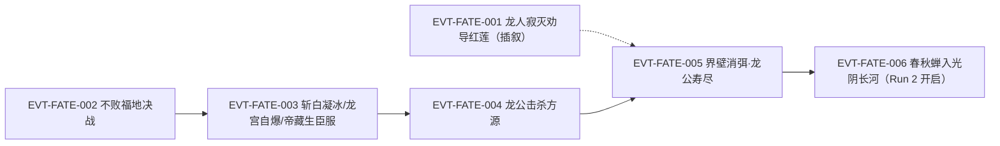

# 宿命大战

围绕宿命蛊、天庭秩序和改变终局可能性展开的多方大战。本页按 schema v2.1 组织：Run 1 主时间序 270001–323421（卷四后段至卷五末）、Run 2 主时间序 323422–360000（卷五末至卷六窗口末）已逐段原文核验，并以 E:V5- 锚点与 EVT-FATE- ID 挂链；Run 1 与 Run 2 并列分节记录、不得合并。

## 核心定义

宿命大战不是一场孤立战役，而是围绕宿命蛊、天庭秩序和改变终局的可能性展开的多方冲突。现有资料明确包含两次轮回记录：

- **Run 1（上一轮轮回，270001–323421）**：从龙公宣告"宿命仙蛊十年后彻底修复"起算，中经方源经营琅琊福地、西漠豆神宫争夺、两次琅琊福地攻防、南疆梦境收网、东海乐土与红莲真传、龙宫争夺、中洲炼蛊大会、帝君城与天庭本营战场，终于宿命蛊修复完成、龙公击杀方源本体、春秋蝉入光阴长河。
- **Run 2（当前重生轮回，323422–360000）**：方源以宙道分身携数年后的意志重生，更早取得红莲真传与偷生仙蛊，改变天庭在光阴长河、琅琊福地与龙宫三处的部署，战局在藏龙窟与帝君城继续，止于本页窗口 360000 行。

本页首先负责防止时间线混淆，再补充战场和主题入口。

## 时间线边界

### 上一轮轮回（Run 1）——270001–323421

- 起点是龙公收凤金煌为徒并宣告"宿命仙蛊十年后彻底修复"（270258–270452 行）；此前 270070–270170 行为方源回归琅琊福地、毛六承认其为影宗宗主。
- 主体是方源与天庭、长生天、南疆、西漠、东海各方的长期拉锯：琅琊福地两次攻防、南疆阎罗战场与梦境收网、东海乐土与红莲真传、龙宫争夺战、中洲炼蛊大会、帝君城与天庭本营战场（270070–323326 行）。
- 天庭依靠九九连环不绝阵、仙墓、人道手段和炼道大阵推进宿命蛊修复；资料记录宿命蛊最终修复完成（321644–321684 行）。
- 龙公击杀方源本体，方源以春秋蝉重生；五域界壁在这场大战收尾阶段彻底消弭（原文行 323400，序列为方源本体被击杀后、龙公遗言 323406 与寿尽 323412 前）；龙公随后寿尽而亡。
- 这条轮回的结局是当前重生轮回行动的历史参照，不是当前轮回已经发生的结果。

### 当前重生轮回（Run 2）——323422–360000

- 第 733 节《分身重生》为其开端：春秋蝉携数年后的意志回到宙道分身（323422–323588 行）；方源更早取得红莲真传与偷生仙蛊，改变了天庭对光阴长河、琅琊福地和宿命蛊修复的部署。
- 天庭、长生天、方源和四域势力在中洲炼蛊大会、天庭本营、帝君城、藏龙窟和光阴长河等多处同时交战；本页逐段核验至 360000 行（帝君城仙蛊屋大战）。
- 两轮的分差不是"谁赢谁输"，而是若干具体条件被提前改写：龙公未在东海龙宫争夺战中受重伤、龙宫核心资产先被方源搬空、劫运坛受气墙所困、宿命蛊修复尚在预防阶段。

### 边界说明（不得越界写入本页）

- 本页 Run 2 的口径止于 **360000 行**（帝君城仙蛊屋大战进行中）。宿命蛊被拆分分发天下（367440 / 367452 行）与龙公寿尽冲锋途死（367468 行）在该行号之后，属弧十三疯魔窟事件页（`events/feng-mo-ku.md`），本页只作接口桥接，不写成事实。
- 原文 323110–323174 行是百万年前龙人寂灭劝导红莲的**插叙回忆**，不是 Run 1 收尾的现时事件；本页保留既有 EVT-FATE-001 的插叙定性。

## 参与者

- **天庭**：维护、修复和利用宿命蛊的一方，依靠组织底蕴、阵法、人道和仙墓作战；Run 1 中紫薇仙子主导推算与谋算，龙公承担核心战力。
- **方源**：把摧毁宿命蛊与永生可能性联系起来，并利用重生信息、红莲真传和多线布局改变战局；Run 1 末年本体被击杀，Run 2 改以分身、马甲与联盟推进。
- **红莲魔尊（洪亭）**：不以当前战场直接参战，而通过石莲岛、前有古人、未来身和春秋蝉等遗产影响后世。
- **长生天与四域联军**：各自拥有反制天庭的目标和资源，但并不共享同一套价值观；Run 1 中冰塞川由敌转盟方源，Run 2 由劫运坛与"前有古人"承担主攻。
- **龙公与星宿仙尊**：分别以护道人、核心战力和智道/合道意志承担天庭立场。
- **乐土一系**：陆畏因（Run 1/2）与乐土功德碑体系（Run 2）构成独立的第三方，其"仁厚无杀伐"的路线在两轮中都成为变量。

## 关键转折

- 天庭以[中洲炼蛊大会](central-plain-refinement-conference.md)的成功道痕修复宿命蛊，使战争从多方争夺升级为"是否允许宿命继续作为世界旗帜"的终局冲突。
- [红莲真传和石莲岛](stone-lotus-island-contest.md)成为两轮战局的关键差异：Run 1 中天庭能够围绕它布置，且凤九歌以"大同风"摧毁第二座石莲岛；Run 2 中方源更早取得真传，并把石莲岛改造成诱杀天庭仙蛊屋的陷阱。
- 春秋蝉把上一轮失败转化为当前轮回的情报和行动起点；因此两轮事件必须并列比较，而不是简单相加。
- 龙宫是两轮分岔最集中的资产：Run 1 中龙公在东海混战后身负重伤取得龙宫，其后只能以"龙御上宾"燃寿苦战；Run 2 中方源提前搜空龙宫，龙公反而状态完整，但元始真传归方源、龙灵认主。
- 天庭的牺牲、人道动员、龙公行动和方源的多线布局（含[天庭入侵琅琊福地](langya-blessed-land-invasion.md)中的守卫与反制）共同决定战局，不能归因于某一个蛊虫或某一名角色。

## 主题冲突

- 宿命规则与个人选择
- 人族整体延续与个体生命
- 组织秩序与不确定的自由
- 失败、重生与改变代价
- 继承前人遗产与走出自己的道路

## 投影索引

本页只记录"宿命大战"这一事件链的时序与因果；与之相关的实体状态、机制说明和设定细节按以下方向外移，避免重复维护：

- **实体状态**（方源、龙公、紫薇仙子、冰塞川、白凝冰、陆畏因、凤九歌、沈伤等的境界、生死与位置变化）→ `characters/` 目录；本页只保留与战局直接相关的节点。
- **红莲真传、石莲岛分座与岛岛相联的杀招机制** → [石莲岛争夺](stone-lotus-island-contest.md)。
- **琅琊福地攻防机制**（大同风、定真枝丫变、福地并入）→ [天庭入侵琅琊福地](langya-blessed-land-invasion.md)。
- **中洲炼蛊大会的赛制与道痕产出** → [中洲炼蛊大会](central-plain-refinement-conference.md)。
- **宿命蛊本体与春秋蝉的设定、状态** → [宿命蛊](../gu/fate-gu.md)、[春秋蝉](../gu/spring-autumn-cicada.md)。
- **超出本页口径的收束**（疯魔窟第八层后续、宿命蛊被拆分分发天下 367440 / 367452 行、龙公寿尽 367468 行）→ 弧十三疯魔窟事件页（`events/feng-mo-ku.md`，在制）；本页不予重复。
- **游戏周目、胜负条件与改编裁定** → `design/`，不进本页。

## 原著明确内容

本节事实分别由根原文 `蛊真人-clean.txt` 的 Run 1 与 Run 2 行段直接支持；每轮各自独立核验、不得互相外推。锚点格式为 `E:V5-行号`，本页所引行段全部属卷五（V5）。

### Run 1 主线（270001–323421，2026-09-26 逐段核验）

- 龙公收凤金煌为徒，并当众宣告"宿命仙蛊十年后彻底修复"（270258–270452 行，E:V5-270422）——Run 1 的倒计时起点；方源此前已回归琅琊福地，毛六承认其为影宗宗主（270070–270170 行，E:V5-270144）。`[叙事|已核]`
- 天庭栽赃线：酝良遇害并自曝"方源"（271014–271246 行，E:V5-271170）——方源自此举世皆敌。`[叙事|已核]`
- 净魂仙蛊炼成，仙僵魂道陷阱解除，智慧光晕复得，方源与琅琊地灵互换传承（270764–271520 行，E:V5-270900、E:V5-271290、E:V5-271416、E:V5-271488）。`[叙事|已核]`
- 年蛊商战：似水流年横扫宝黄天，方源获利 1200 万仙元石（271698–273064 行，E:V5-271990、E:V5-272186、E:V5-273040）。`[叙事|已核]`
- 春秋蝉平炼成功、再无天意；方源分魂渡劫成"春秋福地"（276681–277348 行，E:V5-277270、E:V5-277334）。这是 EVT-FATE-006 得以发生的前提。`[叙事|已核]`
- 东海鲜血：方源突袭斩尤婵、秦百合，"东海六大仙子只剩四位"（278300–278400 行，E:V5-278354）。`[叙事|已核]`
- 盗天梦境三幕：偷道宗师→偷道准大宗师（得偷袭蛊）→偷道大宗师（278888–282680 行，E:V5-278888、E:V5-280674、E:V5-282622）；其间方源在青鬼沙漠奴役魂兽军团（281150–281250 行，E:V5-281196）。`[叙事|已核]`
- 西漠豆神宫争夺战：房家夺屋、房睇长登场（283345–284200 行，E:V5-283368、E:V5-284146）；方源窃取八转仙蛊魂兽令（285400–285500 行，E:V5-285494）。`[叙事|已核]`
- 南疆线：上极天鹰归位（286200–286320 行，E:V5-286280）；陆畏因以"胎土迷宫·三生三世"登台（287100–287200 行，E:V5-287150）。`[叙事|已核]`
- 第二次琅琊福地攻防战：凤九歌催动风道杀招引出"大同风"——天下第一风、人族史上第一个能用者；因方源事前提醒，琅琊地灵早有准备（287286–288813 行，E:V5-288640）。`[叙事|已核]`
- 凤九歌俘虏古月方正、收取荡魂山，并发现九转野生仙蛊"智慧蛊"（288780–288813 行，E:V5-288800）。`[叙事|已核]`
- 陆畏因自承乐土真传传人（288814–288975 行，E:V5-288960）——乐土路线正式进入战局。`[对话|已核]`
- 荡魂山自爆，毁八转仙蛊屋镇魂殿（289520–289600 行，E:V5-289570）。`[叙事|已核]`
- 紫薇借因果神树算破"阎罗"，方源位置暴露（289700–289781 行，E:V5-289764）；方源消化长毛老祖炼道真意，晋升炼道准无上大宗师，阎罗升级为"阎帝"（290600–291000 行，E:V5-290638、E:V5-290976）；万我仙蛊炼成（292100–292200 行，E:V5-292152）。`[叙事|已核]`
- 天庭"星投"启用：跨域投送主力（292460–292747 行，E:V5-292638）。`[叙事|已核]`
- 阎罗战场单挑凤九歌：太古阎罗子魂爆，命甲仙蛊救回凤九歌（293130–293517 行，E:V5-293282、E:V5-293406）。`[叙事|已核]`
- 长生天援军（毛里球＋牛魔＋花子＋五行大法师＋劫运坛）至，方源以定仙游撤离（293942–294111 行，E:V5-293942、E:V5-293956）。`[叙事|已核]`
- 年流伏诛阵三阵合一，方源以身作饵困住南疆群仙（296386–296640 行，E:V5-296512）；梦境收网时白兔姑娘阵亡（296834–297010 行，E:V5-296934）；方源夺夏槎春夏秋冬四蛊并勒索百万仙元石（297600–298027 行，E:V5-297760）。`[叙事|已核]`
- 年华池建成（298652–298750 行，E:V5-298696）；南联成立（299990–300080 行，E:V5-300036）。`[叙事|已核]`
- 宿命命题的两面：梦境寓言"你信命吗"与凤金煌的"我不信命！"（299586–299965 行，E:V5-299720、E:V5-299946）。`[对话|已核]`
- 五界山脉确认"方源已成八转"（300760–300800 行，E:V5-300784）；紫薇从幽魂遗存搜出"至尊仙胎蛊／至尊仙窍"，推断方源重生受天意操纵（301212–301367 行，E:V5-301254）。`[叙事|已核]`
- 光阴长河首战：毁今古亭，石岛陷阱实为超级宙道仙阵（301496–301960 行，E:V5-301624、E:V5-301930）；方源以五指拳心剑破阵（302140–302259 行，E:V5-302188）。`[叙事|已核]`
- 五相赌斗门"作弊"（302860–303051 行，E:V5-302916）；白凝冰"白叛"（第 623 节，303241–303400 行，E:V5-303330）；气海洞天易主（303588–303950 行，E:V5-303932）；春秋蝉升炼至七转（304072–304218 行，E:V5-304146）。`[叙事|已核]`
- 天庭＋武庸经济封锁，方源决意赴东海乐土（304492–304807 行，E:V5-304548、E:V5-304742）。`[叙事|已核]`
- 苍蓝龙鲸洞天（乐土）：功德碑机制成立，功德＝行善（305094–306171 行，E:V5-305136、E:V5-306140）；夏琳线（308314–308990 行，E:V5-308578）。`[叙事|已核]`
- 镇魔悔哭海·悔蛊异变将方源送出乐土；红莲魔尊本名洪亭在此揭底（308987–309782 行，E:V5-309122、E:V5-309210、E:V5-309682）。`[叙事|已核]`
- 方源以"没有这个必要"一把抓住悔蛊、顷刻炼化，吞红莲真意晋升宙道准无上大宗师（309786–310044 行，E:V5-309800、E:V5-309838）——Run 1 战力跃升的根因。`[叙事|已核]`
- 天庭觅得龙宫（310046–310110 行区间，E:V5-310060）；紫薇搜出纯梦求真体（E:V5-310240）；凤金煌将其改良成"第十一绝体"（E:V5-310718）。`[叙事|已核]`
- 兽劫洞天·万物大同变（310826–310880 行，E:V5-310850）；冰塞川转向结盟方源（311990–312100 行，E:V5-312032）。`[叙事|已核]`
- 龙宫收取与红莲真传争夺战：凤九歌施"大同风"摧毁第二座石莲岛（施放 312822–312850 行，E:V5-312846；原文自陈"凤九歌催发大风歌时会引出狂风呼啸的声音，而真正的大同风刮起时非常平静、没有一点声音"），结论"不胜不负"——方源未得真传、天庭亦未得手（312978 行）；龙公在东海混战之后镇压龙宫反抗并将其收取，自身负重伤（312982–312998 行）。`[叙事|已核]`
- 方源四处袭击中洲炼蛊大会、屠戮凡人蛊师（313000–313300 行，E:V5-313172）；以"流言笼"困局并斩八转周雄信（313304–313900 行，E:V5-313331、E:V5-313794）。`[叙事|已核]`
- 天庭推出人道三招；万众一心甄别内敌；影宗三人血洗大比场地（313796–314566 行，E:V5-314499、E:V5-314176）。`[叙事|已核]`
- 帝君城战场自 314878 行起（E:V5-314905）；藏龙窟之战由帝藏生暴动引爆（314770–314876 行，E:V5-314815）。`[叙事|已核]`
- 长生天攻天庭左路：劫运坛现于天庭上空（315360–315440 行，E:V5-315372、E:V5-315428）；破中天门、花子牺牲（315600–315712 行，E:V5-315609、E:V5-315696）；五行大法师真传实为巨阳仙尊暗布（315900–315958 行，E:V5-315910），历代尊者隔空交手。`[叙事|已核]`
- 无极于"一缺抱憾亭"弹棋，棋子化作九转仙道杀招束缚龙公并同时保护他（316004–316266 行，E:V5-316004、E:V5-316064、E:V5-316244、E:V5-316257）；宿命蛊修复至少还需三个时辰（E:V5-316297）。`[叙事|已核]`
- 红莲以"前有古人"召出历代北原八转参战；顾六如成为天庭首位牺牲者（316822–317208 行，E:V5-316832、E:V5-317184）。`[叙事|已核]`
- 龙公借元莲仙尊三十万年前的竹林图得"穿枝拂叶"脱困（317300–317412 行，E:V5-317408）；"龙御上宾"：寿元越少增幅越恐怖（317418–317638 行，E:V5-317632）。`[叙事|已核]`
- 人道三招全面启用，含"家破人亡"（318094–318240 行，E:V5-318158）；张阴等四人即"四大龙将"（E:V5-318466）；凤九歌新创"命运歌"破解武庸的送友风、救下陈衣（318524–318650 行，E:V5-318580）。`[叙事|已核]`
- 地沟吞没帝君城，方源屠戮近百万人口并杀叶凡、洪易（318654–318796 行，E:V5-318714）。`[叙事|已核]`
- 方源伪装凤仙太子混入九九连环不绝阵核心（320420–320496 行，E:V5-320448）；巨阳仙僵以光柱轰击天庭，遭星宿星芒巨网拦截后炸裂为增益北原的气流（320496–320590 行，E:V5-320510、E:V5-320558）。`[叙事|已核]`
- 袁琼都殉，宿命蛊修复完成；龙公宣告"一百多万年！我天庭终于再次掌握了完整的九转宿命蛊"（321616–321700 行，E:V5-321644、E:V5-321684）。`[叙事|已核]`
- 陆畏因以"我徒叶凡死在你的手中"为由叛变（322696–322728 行，E:V5-322700）；龙灵称"宿命蛊早有启示：人族当败、龙人当兴"（322842–322972 行，E:V5-322920）。`[叙事|已核]`
- 龙公击杀方源本体真位（323318–323326 行，E:V5-323318，323324 一击打爆、323326"他死了"）；323110–323174 行是百万年前龙人寂灭劝红莲的插叙回忆，不是现时。`[叙事|已核]`

### Run 2 已逐段核验事实（323422–360000，2026-09-26 逐段核验）

- 第 733 节《分身重生》开篇即春秋蝉携数年后的意志回到宙道分身，首轮尝试以失败告终（323422–323588 行，E:V5-323568）；323426 行入光阴长河，323438 行春秋蝉逆流。`[叙事|已核]`
- 方源本世改取偷生仙蛊与五只宙道仙蛊（二七转：时隐、时针；三六转：昨日、一旬、累年），并看破偷生蛊"只有三次使用机会"的隐匿限制（323760–323977 行，E:V5-323780、E:V5-323876）。`[叙事|已核]`
- 本世提前入光阴长河尽收红莲真传主体（含未来身），唯一缺悔蛊（324166–324481 行，E:V5-324352）。`[叙事|已核]`
- 墨水效应（324360–324410 行，E:V5-324394）：重生＝下游未来意志经春秋蝉遁入上游、与某一时间的"我"融合；世界唯一、无平行空间；"天外之魔＝大团墨水"（宿命蛊约束不住），本土蛊仙重生只是水波。`[叙事|已核]`
- 方源以"阵中之阵"镇压黑白双地灵，整个琅琊福地成其私产；七转万我仙蛊炼成（324906–325269 行，E:V5-324954、E:V5-325176）。`[叙事|已核]`
- 星投来袭：方源以落魄印粉碎雷鬼真君井斓的魂甲，再借琅琊地灵之仙元施偷生杀招，井斓迅速衰老、寿元耗尽而死（325270–325539 行，E:V5-325312、E:V5-325398）。`[叙事|已核]`
- 方源提前摧毁黑暗漩涡，紫薇未能进入，星光巨柱自爆（325540–325669 行，E:V5-325598）。`[叙事|已核]`
- 围困凤九歌时方源连用大盗鬼手十余次，以镇宇仙蛊压住宇道，终偷得七转定仙游（325638–325827 行，E:V5-325826）。`[叙事|已核]`
- 陈衣以元莲后手"来因去果"送走凤九歌，自己留下断后被杀（325882–326111 行，E:V5-326052、E:V5-326080）。`[叙事|已核]`
- 吞并琅琊福地后，紫薇的推算对象被扭曲成"推算方源"，被阎帝（借盗天魔尊九转杀招）挡住（326112–326443 行，E:V5-326198、E:V5-326320）。`[叙事|已核]`
- 琅琊本源解封并被吞并后，方源成为真正的八转蛊仙（327058–327236 行，E:V5-327198）。`[叙事|已核]`
- 方源与池曲由达成梦道交易：以"未来的梦道成果"换池曲由从义天山暗道偷运梦境出来（328034–328292 行，E:V5-328254）。`[对话|已核]`
- 方源由人道与奴道之别起念晋升人道大师，并悟出万我杀招已不是奴力合流、而是人道杀招（328294–328618 行，E:V5-328470；328474–328618 行记其达成过程）。`[信念|已核]`
- 南疆第二次埋伏战：方源改良年流伏诛阵反算——巴十八被照定沉入梦境、夏槎"夏扇"被完全破解、追缉队伍尽数被俘（330284–330900 行，E:V5-330660、E:V5-330704、E:V5-330794、E:V5-330864）。`[叙事|已核]`
- 方源收取陶铸真传（五界大限阵、五禁玄光气、界与限两只律道仙蛊），律道晋升大宗师（330904–331455 行，E:V5-330924、E:V5-331378）。`[叙事|已核]`
- 龙公过问战局，紫薇提出三策；龙公转述红莲当年之言：石莲岛岛岛互不关联却组成一记仙道杀招，能间接影响天下万物轨迹（331688–331804 行，E:V5-331716、E:V5-331778）。`[对话|已核]`
- 方源以智炼大阵吞窍、建成年华池、炼出八转仙蛊"加"（331888–332223 行，E:V5-331966、E:V5-332134）。`[叙事|已核]`
- 方源修复荡魂山并以销魂万胆大阵收魂，魂魄先达一亿人魂（人的极限）再突破为荒魂（蓝墨色蛋形、具荒兽级战力）；人魂突破荒魂后彻底无法飞行（332320–334798 行，E:V5-332330、E:V5-332394、E:V5-334584、E:V5-334708）。`[叙事|已核]`
- 方源公开爆料星投杀招与陈衣、雷鬼真君之死，天下蛊仙公认其"小魔尊"称号（332324–332620 行，E:V5-332488、E:V5-332596）。`[传闻|已核]`
- 方源炼成第一座仙蛊屋——八转宙道仙蛊屋"万年斗飞车"；又以"蛊如故"大阵夺下天庭定空蛊，使定仙游的最大克星落入其手（332902–333112 行，E:V5-333010、E:V5-333070）。`[叙事|已核]`
- 光阴长河第一战：破今古亭（四旬子被全歼）、撞沉恒舟、杀清夜；紫薇由此确信方源重生归来并公开宣布（334918–335559 行，E:V5-335172、E:V5-335376、E:V5-335456）。`[叙事|已核]`
- 顾六如因墨水效应提前苏醒；方源以气道梦境晋升气道宗师；宙锚仙蛊（六转）可与春秋蝉配合定点重生，但与"春秋必成"不可叠加，根源是宿命蛊虽伤而不灭（335614–336240 行，E:V5-335616、E:V5-336068、E:V5-336154）。`[叙事|已核]`
- 光阴长河第二战：破晓剑首露、镇河锁莲大阵伏击，厉煌阵亡（336242–336699 行，E:V5-336316、E:V5-336542、E:V5-336670、E:V5-336698）。`[叙事|已核]`
- 方源吞并气海洞天：气道一步登天，得气海无量杀招、增添上百万气道道痕；由此确认"至尊仙窍可以以小吞大"且道痕不互斥（337114–337656 行，E:V5-337146、E:V5-337302、E:V5-337620、E:V5-337628）。`[叙事|已核]`
- 天道不容至尊仙窍：为阻止魔尊幽魂，天意不惜栽培方源这个天外之魔，布局把他送回五百年前破坏影宗大计（337614–337656 行，E:V5-337628）。`[叙事|已核]`
- 方源与龙公在东海气道战场正面交手，自称"老夫气海老祖"，龙公与紫薇乃至天下都辨不出其真身；方源气道道痕突破百万、龙公仅其约三成；方源打出"偷生"命中龙公却毫无效果——龙公因催使"龙御上宾"而寿元不断衰减、实力不断上涨（340672–341460 行，E:V5-340776、E:V5-340830、E:V5-340944、E:V5-341460）。`[叙事|已核]`
- Run 2 的时空分叉：因龙宫被方源提前搜空，龙公未受重伤、状态完整；劫运坛距"一缺抱憾亭"太远，无法如 Run 1 那样请无极转身束缚龙公（359118–359210 行，E:V5-359132）。`[推断|已核]`
- 天庭以星宿棋盘催动"白日星现"大规模星投，成为可随意调动主力的群体传送战略杀器（358210–358262 行，E:V5-358262）；五域合一推进（358170–358172 行）。`[叙事|已核]`
- 冰塞川以"前有古人"自光阴长河上段召出北原历代强者参战；龙公自认破解不了，一如当年面对红莲魔尊的"后有来者"（358858–359002 行，E:V5-358892、E:V5-359002）。`[对话|已核]`
- 冰塞川决意请"捣毁八十八角真阳楼者"这位关键人物支援；方源应援并推算大规模星投之阵在天庭、核心为星宿棋盘（359118–359210 行，E:V5-359132、E:V5-359164）。`[叙事|已核]`
- 石莲岛埋伏战：石莲岛本是方源以牺牲一座岛来构陷天庭的陷阱，灰石巨人＝十二生肖上古战阵，天庭六座仙蛊屋皆没、仅少数人逃脱（349914–350497 行，E:V5-350140、E:V5-350142、E:V5-350318）。`[叙事|已核]`
- 气海老祖一招败张阴，而张阴本身即四大龙将之一、与方源配合演戏（350198–350434 行，E:V5-350206、E:V5-350430）。`[叙事|已核]`
- 龙鲸乐土规则：接引岛立于幻境（在幻境中死亡不会真正死亡）、岛上禁止彼此出手；乐土真传须接取功德碑任务、以功德兑换，三百天后全员被传送出去（351432–352065 行，E:V5-351438、E:V5-351594、E:V5-351640）。`[叙事|已核]`
- 悔蛊未发动之因：方源提前损毁了石莲岛，悔蛊上的仙尊手段失去目的地，故毫无动静；他须亲自出手夺蛊（354198–354248 行，E:V5-354232）。`[叙事|已核]`
- 沈伤身世：被誉为"百年东仙首，才情是半尊"，堕入魔道后被乐土仙尊秘密镇压，沈家谎称其渡劫而亡；脱困后疯魔并燃烧黑火，人道手段可克制黑火（354774–356480 行，E:V5-354786、E:V5-355296、E:V5-355388）。`[叙事|已核]`
- 方源对沈家开出的唯一硬条件是——沈从声、沈伤必须动手与天庭为敌、阻止天庭修复宿命蛊（356484–356532 行，E:V5-356500）。`[对话|已核]`
- 凤金煌以自创碎梦杀招意外改良出毫无弊端的纯梦求真体，龙公称其为命中注定的大梦仙尊（357160–357206 行，E:V5-357182）。`[叙事|已核]`
- 冰塞川以"西荒仙人"身份苏醒，据情报断言捣毁八十八角真阳楼者即巨阳仙尊所说的关键人物；紫薇已能施展"一视同仁杀招"却不见效果（357206–357316 行，E:V5-357216、E:V5-357294）。`[叙事|已核]`
- 中洲炼蛊大会开启，方源命异人蛊仙在四域截杀参会队伍，并在宝黄天公开声明参加者即其仇敌；影宗屠戮中洲报名点（357528–357878 行，E:V5-357534、E:V5-357754）。`[叙事|已核]`
- 冰塞川率劫运坛借炼蛊大会之机突袭天庭，被秦鼎菱拼力偏转、送入元始仙尊留下的气墙中动弹不得（358072–358132 行，E:V5-358108）。`[叙事|已核]`
- 藏龙窟之围：悲风老人催起大阵将双方一并卷入，四大龙将因无方源命令而不撤（358264–358434 行，E:V5-358304）。`[叙事|已核]`
- 秦松旧伤：紫薇推判其最多再施展四次移动杀招，超过则肉身魂魄崩解（358732–358794 行，E:V5-358764）。`[推断|已核]`
- 本页窗口止于 360000 行：帝君城仙蛊屋大战中两记星宿仙尊手段生效，中洲蛊仙各方面增幅达一倍（359884–360000 行，E:V5-359944）。`[叙事|已核]`

## 事件链

事件链按 Run 1、Run 2 分区列出。编号连续但不跨轮承接：EVT-FATE-001…066 属 Run 1，EVT-FATE-067…158 属 Run 2。既有 001…006 六条（2026-09-25 核验批次）原样保留。

### Run 1（270001–323421）

| 事件 ID | 事件 | 参与者 | 证据 | 因果关系 |
|---|---|---|---|---|
| EVT-FATE-001 | 龙人寂灭·劝导红莲（插叙过去）：龙公杀尽世间龙人向红莲展示牺牲 | 龙公、红莲 | E:V5-323120（323120–323174 行） | 动机线：铺垫 EVT-FATE-005 的牺牲主题 |
| EVT-FATE-002 | 不败福地决战：监天塔诱敌成功，九转杀招"命败"重创联军，方源一方败势已定 | 方源、监天塔天庭蛊仙、冰塞川 | E:V5-323232（323232–323294 行） | enables EVT-FATE-004 |
| EVT-FATE-003 | 龙公斩白凝冰；龙灵自爆龙宫；帝藏生臣服 | 龙公、白凝冰、龙灵、帝藏生 | E:V5-323192、E:V5-323306、E:V5-323316 | enables EVT-FATE-004 |
| EVT-FATE-004 | 龙公击杀方源本体，联军溃灭，大战落幕 | 龙公、方源 | E:V5-323318（323318–323342 行） | causes Run 1 终局；enables EVT-FATE-005 |
| EVT-FATE-005 | 界壁彻底消弭；龙公遗言"大时代，来临了。"后寿尽而亡 | 龙公、五域 | E:V5-323400（323400–323412 行） | Run 1 终局三连（消弭→遗言→寿尽） |
| EVT-FATE-006 | 春秋蝉入光阴长河逆流——Run 2 开启 | 春秋蝉、方源 | E:V5-323438（323438–323446 行） | causes Run 2；对应 EVT-QMS-010 前世线的时间后继 |
| EVT-FATE-007 | 方源回归琅琊福地，毛六承认其为影宗宗主 | 方源、毛六、琅琊福地 | E:V5-270144（270070–270170 行） | 开启 Run 1 琅琊经营线；为影宗复活埋线 |
| EVT-FATE-008 | 龙公收凤金煌为徒，当众宣告"宿命仙蛊十年后彻底修复" | 龙公、凤金煌、天庭 | E:V5-270422（270258–270452 行） | Run 1 倒计时起点；causes 宿命修复主线 |
| EVT-FATE-009 | 天庭栽赃：酝良遇害并自曝"方源" | 天庭、酝良、方源 | E:V5-271170（271014–271246 行） | causes 方源举世皆敌、转入暗处 |
| EVT-FATE-010 | 净魂仙蛊炼成，仙僵魂道陷阱解除，智慧光晕复得，与琅琊地灵互换传承 | 方源、琅琊地灵 | E:V5-270900、E:V5-271290、E:V5-271416、E:V5-271488（270764–271520 行） | enables 其后福地攻防与炼道线 |
| EVT-FATE-011 | 年蛊商战：似水流年横扫宝黄天，获利 1200 万仙元石 | 方源、宝黄天各商队 | E:V5-271990、E:V5-272186、E:V5-273040（271698–273064 行） | enables 后续大规模炼蛊与布阵资源 |
| EVT-FATE-012 | 春秋蝉平炼成功、再无天意；分魂渡劫成"春秋福地" | 方源 | E:V5-277270、E:V5-277334（276681–277348 行） | enables EVT-FATE-006 的重生条件 |
| EVT-FATE-013 | 突袭东海斩尤婵、秦百合——"东海六大仙子只剩四位" | 方源、尤婵、秦百合 | E:V5-278354（278300–278400 行） | 削弱东海正道；引出其后东海各线 |
| EVT-FATE-014 | 盗天梦境：偷道宗师→偷道准大宗师（得偷袭蛊） | 方源、盗天（梦境） | E:V5-278888、E:V5-280674（278888–280700 行） | enables 偷道手段与盗天真传线 |
| EVT-FATE-015 | 青鬼沙漠奴役魂兽军团 | 方源、青鬼沙漠散修 | E:V5-281196（281150–281250 行） | enables 西漠线兵力 |
| EVT-FATE-016 | 盗天梦境第三幕：偷道大宗师 | 方源、盗天（梦境） | E:V5-282622（282560–282680 行） | 境界链闭环；enables 其后偷仙蛊系列 |
| EVT-FATE-017 | 西漠豆神宫争夺战：房家夺屋，房睇长登场 | 方源、房家、房睇长 | E:V5-283368、E:V5-284146（283345–284200 行） | 引入房睇长；causes 西漠长期对抗 |
| EVT-FATE-018 | 方源窃取八转仙蛊魂兽令 | 方源 | E:V5-285494（285400–285500 行） | enables 魂兽军团与兽灾线 |
| EVT-FATE-019 | 上极天鹰归位 | 方源、上极天鹰 | E:V5-286280（286200–286320 行） | enables 南疆线兵力与侦查 |
| EVT-FATE-020 | 陆畏因以"胎土迷宫·三生三世"登台 | 陆畏因、方源 | E:V5-287150（287100–287200 行） | enables EVT-FATE-023 乐土传人揭底 |
| EVT-FATE-021 | 第二次琅琊福地攻防战：凤九歌引出"大同风"（天下第一风），琅琊因方源事前提醒早有准备 | 凤九歌、琅琊地灵、方源 | E:V5-288640（287286–288813 行） | 战局反转：凤九歌未能破局 |
| EVT-FATE-022 | 凤九歌俘古月方正、取荡魂山、发现九转野生智慧蛊 | 凤九歌、古月方正、琅琊福地 | E:V5-288800（288780–288813 行） | causes EVT-FATE-024 荡魂山自爆 |
| EVT-FATE-023 | 陆畏因自承乐土真传传人 | 陆畏因、铁面神 | E:V5-288960（288814–288975 行） | enables 其后乐土/南联线 |
| EVT-FATE-024 | 荡魂山自爆，毁八转仙蛊屋镇魂殿 | 琅琊福地、天庭 | E:V5-289570（289520–289600 行） | 双方损失；引出紫薇推算 |
| EVT-FATE-025 | 紫薇借因果神树算破"阎罗"，方源位置暴露 | 紫薇仙子、天庭、方源 | E:V5-289764（289700–289781 行） | causes 阎罗战场正面交战 |
| EVT-FATE-026 | 方源消化长毛老祖炼道真意晋升炼道准无上大宗师；阎罗升级为"阎帝" | 方源、长毛老祖（真意） | E:V5-290638、E:V5-290976（290600–291000 行） | enables 阎罗战场优势 |
| EVT-FATE-027 | 万我仙蛊炼成 | 方源 | E:V5-292152（292100–292200 行） | enables 混战中游刃有余 |
| EVT-FATE-028 | 天庭启用"星投"跨域投送 | 天庭、紫薇仙子 | E:V5-292638（292460–292747 行） | enables 天庭在各战场的快速增援 |
| EVT-FATE-029 | 阎罗战场单挑凤九歌：太古阎罗子魂爆；命甲仙蛊救回凤九歌 | 方源、凤九歌、天庭 | E:V5-293282、E:V5-293406（293130–293517 行） | 凤九歌首度濒死；causes 其后命运歌线 |
| EVT-FATE-030 | 长生天援军至（毛里球＋牛魔＋花子＋五行大法师＋劫运坛）；方源以定仙游撤离 | 长生天、方源 | E:V5-293942、E:V5-293956（293942–294111 行） | 引入长生天主力；causes 劫运坛线 |
| EVT-FATE-031 | 年流伏诛阵三阵合一，方源以身作饵困南疆群仙 | 方源、南疆群仙 | E:V5-296512（296386–296640 行） | causes EVT-FATE-032 梦境收网 |
| EVT-FATE-032 | 梦境收网：白兔姑娘阵亡 | 方源、白兔姑娘 | E:V5-296934（296834–297010 行） | 阶段代价 |
| EVT-FATE-033 | 夺夏槎春夏秋冬四蛊，勒索百万仙元石 | 方源、夏槎、南疆各派 | E:V5-297760（297600–298027 行） | enables 其后炼蛊资源 |
| EVT-FATE-034 | 年华池建成 | 方源 | E:V5-298696（298652–298750 行） | enables 宙道与其后光阴长河行动 |
| EVT-FATE-035 | 南联成立 | 南疆正道各派、陆畏因 | E:V5-300036（299990–300080 行） | 南疆格局重排；enables 赌斗线 |
| EVT-FATE-036 | 宿命命题：梦境寓言"你信命吗"／凤金煌"我不信命！" | 方源（梦境）、凤金煌 | E:V5-299720、E:V5-299946（299586–299965 行） | 主题对照：宿命与自由 |
| EVT-FATE-037 | 五界山脉确认"方源已成八转" | 天庭、紫薇仙子 | E:V5-300784（300760–300800 行） | causes 天庭加码围剿 |
| EVT-FATE-038 | 紫薇从幽魂遗存搜出"至尊仙胎蛊／至尊仙窍" | 紫薇仙子、幽魂魔尊（遗存） | E:V5-301254（301212–301367 行） | causes 天庭判定方源重生受天意操纵 |
| EVT-FATE-039 | 光阴长河首战：毁今古亭；石岛陷阱实为超级宙道仙阵 | 方源、天庭 | E:V5-301624、E:V5-301930（301496–301960 行） | 天庭设局失败 |
| EVT-FATE-040 | 五指拳心剑破阵 | 方源 | E:V5-302188（302140–302259 行） | 收束 EVT-FATE-039 |
| EVT-FATE-041 | 五相赌斗门"作弊" | 方源、五相 | E:V5-302916（302860–303051 行） | 揭示方源手段 |
| EVT-FATE-042 | 白凝冰"白叛"（第 623 节，假叛） | 白凝冰、方源 | E:V5-303330（303241–303400 行） | enables 天庭内部布局 |
| EVT-FATE-043 | 气海洞天易主 | 方源、气海洞天 | E:V5-303932（303588–303950 行） | enables 气道线 |
| EVT-FATE-044 | 春秋蝉升炼至七转 | 方源 | E:V5-304146（304072–304218 行） | enables 其后的重生与光阴长河行动 |
| EVT-FATE-045 | 天庭＋武庸经济封锁；方源决意赴东海乐土 | 天庭、武庸、方源 | E:V5-304548、E:V5-304742（304492–304807 行） | causes 乐土线开启 |
| EVT-FATE-046 | 乐土·功德碑机制确立：功德＝行善 | 方源、乐土 | E:V5-305136、E:V5-306140（305094–306171 行） | 设定入口；enables 乐土攻略 |
| EVT-FATE-047 | 夏琳线 | 方源、夏琳 | E:V5-308578（308314–308990 行） | enables 乐土人脉 |
| EVT-FATE-048 | 镇魔悔哭海·悔蛊异变将方源送出乐土；红莲魔尊本名洪亭揭底 | 方源、乐土、红莲（洪亭） | E:V5-309122、E:V5-309210、E:V5-309682（308987–309782 行） | causes 悔蛊入手 |
| EVT-FATE-049 | "没有这个必要"：一把抓住悔蛊、顷刻炼化；吞红莲真意→宙道准无上大宗师 | 方源、悔蛊、红莲真意 | E:V5-309800、E:V5-309838（309786–310044 行） | Run 1 战力跃升；enables 长河与石莲岛线 |
| EVT-FATE-050 | 天庭觅得龙宫；紫薇搜出纯梦求真体；凤金煌改良成"第十一绝体" | 天庭、紫薇仙子、凤金煌 | E:V5-310060、E:V5-310240、E:V5-310718（310046–310806 行） | causes 龙宫争夺战 |
| EVT-FATE-051 | 兽劫洞天·万物大同变 | 方源、兽劫洞天 | E:V5-310850（310826–310880 行） | enables 方源修为推进 |
| EVT-FATE-052 | 冰塞川转向结盟方源 | 长生天、冰塞川、方源 | E:V5-312032（311990–312100 行） | causes 反天庭同盟成形 |
| EVT-FATE-053 | 龙宫收取与红莲真传争夺战：凤九歌施"大同风"摧毁第二座石莲岛——"不胜不负"；龙公得龙宫但身负重伤 | 凤九歌、方源、龙公、天庭 | E:V5-312846（施放 312822–312850 行；"不胜不负"312978 行；龙公得手 312982–312998 行） | 龙宫与石莲岛两线同时定局；龙公负伤埋因 |
| EVT-FATE-054 | 方源四处袭击中洲炼蛊大会、屠戮凡人蛊师 | 方源、中洲炼蛊大会 | E:V5-313172（313000–313300 行） | causes 天庭推出反制手段 |
| EVT-FATE-055 | 以"流言笼"困局并斩八转周雄信 | 方源、周雄信、天庭 | E:V5-313331、E:V5-313794（313304–313900 行） | 天庭折损八转 |
| EVT-FATE-056 | 天庭推出人道三招；万众一心甄别内敌；影宗三人血洗大比场地 | 天庭、正元老人、影宗 | E:V5-314499、E:V5-314176（313796–314566 行） | 中洲进入内战与甄别阶段 |
| EVT-FATE-057 | 帝君城战场自 314878 行起；藏龙窟之战由帝藏生暴动引爆 | 天庭、帝藏生、方源 | E:V5-314905、E:V5-314815（314770–314905 行） | Run 1 中洲总战场开启 |
| EVT-FATE-058 | 长生天攻天庭左路：劫运坛现于天庭上空；破中天门、花子牺牲；五行大法师真传实为巨阳暗布、历代尊者隔空交手 | 长生天、劫运坛、天庭、巨阳仙尊（遗策） | E:V5-315372、E:V5-315428、E:V5-315609、E:V5-315696、E:V5-315910、E:V5-315933（315360–315958 行） | 天庭本营首次被正面攻入 |
| EVT-FATE-059 | 无极于"一缺抱憾亭"弹棋，棋化九转杀招束缚龙公并同时保护他；宿命蛊修复至少还需三个时辰 | 无极魔尊、龙公、天庭 | E:V5-316004、E:V5-316064、E:V5-316244、E:V5-316257、E:V5-316297（316004–316328 行） | 天庭最强战力被冻结；修复进度被读出 |
| EVT-FATE-060 | 红莲以"前有古人"召出历代北原八转；顾六如成天庭首位牺牲者 | 红莲、北原历代八转、顾六如 | E:V5-316832、E:V5-317184（316822–317208 行） | 北原历史战力入场；天庭出现首个阵亡者 |
| EVT-FATE-061 | 龙公借元莲三十万年前竹林图得"穿枝拂叶"脱困；"龙御上宾"以寿元换战力 | 龙公、元莲仙尊（遗图） | E:V5-317408、E:V5-317632（317300–317638 行） | 龙公脱困并进入无敌期 |
| EVT-FATE-062 | 人道三招全面启用（含"家破人亡"）；张阴等四人即"四大龙将"；凤九歌新创"命运歌"破送友风救陈衣 | 天庭、张阴、凤九歌、武庸、陈衣 | E:V5-318158、E:V5-318466、E:V5-318580（318094–318650 行） | 天庭手段齐出；历史上首次正面破解送友风 |
| EVT-FATE-063 | 地沟吞没帝君城：屠戮近百万人口并杀叶凡、洪易 | 方源、天庭、叶凡、洪易 | E:V5-318714（318654–318796 行） | causes EVT-FATE-066 陆畏因叛变 |
| EVT-FATE-064 | 方源伪装凤仙太子混入九九连环不绝阵核心；巨阳仙僵光柱轰天庭→星宿星芒巨网→炸裂为增益北原的气流 | 方源、巨阳仙僵、星宿仙尊 | E:V5-320448、E:V5-320510、E:V5-320558（320420–320590 行） | 天庭护山大阵被从内部与外部同时攻击 |
| EVT-FATE-065 | 袁琼都殉，宿命蛊修复完成；龙公宣告重掌完整九转宿命蛊 | 袁琼都、龙公、天庭 | E:V5-321644、E:V5-321684（321616–321700 行） | Run 1 战局根本转折；enables 龙御上宾无敌期 |
| EVT-FATE-066 | 陆畏因以"我徒叶凡死在你的手中"为由叛变；龙灵称"宿命蛊早有启示：人族当败、龙人当兴" | 陆畏因、方源、龙灵 | E:V5-322700、E:V5-322920（322696–322972 行） | 天庭内部分裂；causes 龙灵线收束 |

Run 1 收尾窗口原图（EVT-FATE-001…006，2026-09-25 批次，原样保留）

Run 1 主线（EVT-FATE-007…066）：

```mermaid
graph LR
    R01["007–012 琅琊经营·渡劫成春秋福地"] --> R02["013–016 东海突袭·盗天梦境三幕"]
    R02 --> R03["017–019 西漠豆神宫争夺战·窃魂兽令"]
    R03 --> R04["020–024 第二次琅琊福地攻防战（大同风）·陆畏因自承乐土传人"]
    R04 --> R05["025–030 阎罗战场·星投·长生天援军"]
    R05 --> R06["031–036 南疆年流伏诛阵·梦境收网·夺四蛊"]
    R06 --> R07["037–044 天庭加码·光阴长河首战·气海洞天易主"]
    R07 --> R08["045–049 东海乐土·悔蛊·吞红莲真意"]
    R08 --> R09["050–053 龙宫争夺战·大同风毁第二座石莲岛"]
    R09 --> R10["054–057 中洲炼蛊大会·人道三招·帝君城战场"]
    R10 --> R11["058–061 长生天攻天庭·无极弹棋·龙御上宾"]
    R11 --> R12["062–066 地沟屠城·宿命蛊修复完成·陆畏因叛变"]
    R12 --> R13["001–006 龙公击杀方源本体·界壁消弭·春秋蝉入长河"]
```

追溯示例：

- "宿命蛊什么时候修好的？" → EVT-FATE-065 → E:V5-321684 → 原文 321616–321700 行（袁琼都殉与龙公宣告）。
- "凤九歌怎么毁掉石莲岛的？" → EVT-FATE-053 → E:V5-312846 → 原文 312822–312850 行（大同风施放）与 312978 行（"不胜不负"结论）。
- "方源第一次进龙鲸乐土是第几轮？" → EVT-FATE-045…049 → E:V5-305136 → Run 1 主线；Run 2 的乐土线见 EVT-FATE-127…145。

### Run 2（323422–360000）

| 事件 ID | 事件 | 参与者 | 证据 | 因果关系 |
|---|---|---|---|---|
| EVT-FATE-067 | Run 2 开启：春秋蝉携数年后的意志回到宙道分身，首轮尝试失败 | 方源、春秋蝉 | E:V5-323568（323422–323588 行） | 承接 EVT-FATE-006；causes 本页全部后续 |
| EVT-FATE-068 | 返琅琊取偷生仙蛊与五只宙道仙蛊，看破偷生蛊的三次限制 | 方源、琅琊地灵 | E:V5-323780、E:V5-323876（323590–323977 行） | enables 本世战斗与重生预案 |
| EVT-FATE-069 | 提前入光阴长河尽收红莲真传（唯一缺悔蛊） | 方源、红莲真传 | E:V5-324352（323978–324481 行） | 两轮最大差异之一；enables 其后全部真传手段 |
| EVT-FATE-070 | 墨水效应揭底：天外之魔＝大团墨水，本土蛊仙重生＝水波 | 方源、陆畏因（对话） | E:V5-324394（324360–324410 行） | 解释两轮差异的机制根因 |
| EVT-FATE-071 | 以"阵中之阵"镇压黑白双地灵，琅琊福地成其私产；炼成七转万我仙蛊 | 方源、琅琊双地灵 | E:V5-324954、E:V5-325176（324906–325269 行） | enables EVT-FATE-072 反杀 |
| EVT-FATE-072 | 星投来袭：方源碎井斓魂甲，借地灵仙元施偷生杀招使井斓老死 | 方源、雷鬼真君井斓 | E:V5-325312、E:V5-325398（325270–325539 行） | 天庭再失一名八转 |
| EVT-FATE-073 | 提前摧毁黑暗漩涡，紫薇未能进入，星光巨柱自爆 | 方源、紫薇仙子 | E:V5-325598（325540–325669 行） | 中断天庭星投首轮部署 |
| EVT-FATE-074 | 围困凤九歌并以大盗鬼手偷得七转定仙游；陈衣以"来因去果"送走凤九歌后战死 | 方源、凤九歌、陈衣 | E:V5-325826、E:V5-326052、E:V5-326080（325638–326111 行） | 天庭失去陈衣与定仙游 |
| EVT-FATE-075 | 吞并琅琊福地后炼化不利道痕，使紫薇的推算变成"推算方源" | 方源、紫薇仙子 | E:V5-326198、E:V5-326320（326112–326443 行） | 天庭推算手段被扭曲 |
| EVT-FATE-076 | 琅琊本源解封并被吞并，方源成为真正的八转蛊仙 | 方源 | E:V5-327198（326444–327236 行） | Run 2 修为分水岭 |
| EVT-FATE-077 | 破掠影地沟大阵（刻意照旧，以掩藏差异） | 方源、天庭 | E:V5-327236（327236–327307 行） | 掩盖重生痕迹 |
| EVT-FATE-078 | 池家流言与劫掠；与池曲由达成梦道交易，从义天山暗道偷运梦境 | 方源、池家、池曲由 | E:V5-328254（327308–328292 行） | enables 梦道暴涨 |
| EVT-FATE-079 | 方源由人道与奴道之别晋升人道大师，并确认万我杀招即人道杀招 | 方源 | E:V5-328470（328294–328618 行） | enables 其后人道手段与沈伤线 |
| EVT-FATE-080 | 天露绿洲遇袭，房家被竖为标靶；影无邪奉命潜入青鬼沙漠 | 方源、房家、影无邪 | E:V5-329336、E:V5-329378、E:V5-329412（329232–329427 行） | causes 西漠格局变化 |
| EVT-FATE-081 | 宝月绿洲以"偷道"手段除名；燎萤戈壁凶案 | 方源、宝月绿洲各家族 | E:V5-329650、E:V5-329782（329620–329978 行） | 西漠链条延伸 |
| EVT-FATE-082 | 南疆第二次埋伏战：巴十八被照定入梦、夏槎"夏扇"被破、追缉队尽俘 | 方源、巴十八、夏槎、南疆各派 | E:V5-330660、E:V5-330704、E:V5-330794、E:V5-330864（330284–330900 行） | 南疆战力再损 |
| EVT-FATE-083 | 收取陶铸真传（五界大限阵、五禁玄光气），律道晋升大宗师 | 方源、陶铸（真传） | E:V5-330924、E:V5-331378（330904–331455 行） | enables 其后破阵系列 |
| EVT-FATE-084 | 龙公过问战局，紫薇提三策；龙公转述红莲之言：石莲岛岛岛互不关联却组成一记仙道杀招 | 龙公、紫薇仙子 | E:V5-331716、E:V5-331778（331688–331804 行） | enables 天庭对石莲岛的部署 |
| EVT-FATE-085 | 智炼大阵吞窍，年华池建成，炼出八转仙蛊"加" | 方源 | E:V5-331966、E:V5-332134（331888–332223 行） | 资源与产能跃升 |
| EVT-FATE-086 | 修复荡魂山并以销魂万胆大阵收魂，魂魄由一亿人魂突破为荒魂 | 方源、荡魂山 | E:V5-332330、E:V5-332394、E:V5-334584、E:V5-334708（332320–334798 行） | Run 2 魂道跃迁；代价是再不能飞 |
| EVT-FATE-087 | 公开撕逼天庭，爆料星投与陈衣、井斓之死，被公认"小魔尊" | 方源、天下蛊仙 | E:V5-332488、E:V5-332596（332324–332620 行） | 声名线：为气海老祖马甲铺垫 |
| EVT-FATE-088 | 计划五座宙道仙蛊屋，炼成"万年斗飞车"，并以"蛊如故"大阵夺天庭定空蛊 | 方源、天庭 | E:V5-333010、E:V5-333070（332902–333112 行） | 夺走定仙游的最大克星 |
| EVT-FATE-089 | 分魂与纯梦分身升仙受挫 | 方源 | E:V5-333114、E:V5-333201、E:V5-333280（333114–333331 行） | 分身路线延期 |
| EVT-FATE-090 | 龙人分身炼成 | 方源 | E:V5-334560、E:V5-334610（334488–334691 行） | enables 免伤龙人寂灭 |
| EVT-FATE-091 | 光阴长河第一战：破今古亭、撞沉恒舟、杀清夜；紫薇公布方源重生 | 方源、天庭、紫薇仙子 | E:V5-335172、E:V5-335376、E:V5-335456（334918–335559 行） | 两轮关系被天庭首次公开承认 |
| EVT-FATE-092 | 顾六如因墨水效应提前苏醒；方源晋升气道宗师；宙锚仙蛊与"春秋必成"不可叠加 | 方源、顾六如 | E:V5-335616、E:V5-336068、E:V5-336154（335614–336240 行） | "宿命蛊虽伤而不灭"这一结论落地 |
| EVT-FATE-093 | 光阴长河第二战：镇河锁莲大阵伏击，厉煌阵亡 | 方源、天庭、厉煌 | E:V5-336316、E:V5-336542、E:V5-336670、E:V5-336698（336242–336699 行） | 天庭再折八转 |
| EVT-FATE-094 | 兽潮收场，戚家归降，五相赌斗门开放 | 方源、戚家、五相 | E:V5-336914、E:V5-337026、E:V5-337072（336700–337113 行） | 西漠与赌斗线合流 |
| EVT-FATE-095 | 入五相洞天并吞并气海洞天，气道一步登天 | 方源、五相、气海洞天 | E:V5-337146、E:V5-337162、E:V5-337302（337114–337305 行） | causes EVT-FATE-102 气海老祖线 |
| EVT-FATE-096 | 成尊推算：至尊仙窍可小吞大、道痕不互斥；天道为阻幽魂不惜栽培方源 | 方源、天道 | E:V5-337540、E:V5-337598、E:V5-337628（337414–337656 行） | 全书级机制揭示；解释方源的"被选中" |
| EVT-FATE-097 | 秦鼎菱苏醒，天庭议定"以方正为主" | 秦鼎菱、天庭、古月方正 | E:V5-337814、E:V5-337916（337700–338500 行） | enables 其后秦鼎菱余力线 |
| EVT-FATE-098 | 方源剑道与人道宗师达成的理念自陈："天地从来就没有什么正义，只有人间有正义" | 方源 | E:V5-337958、E:V5-338354、E:V5-338400（337920–338400 行） | 主题线：人道立场 |
| EVT-FATE-099 | 魂穿两天，得煮运锅与运气七色 | 方源、两天 | E:V5-338664、E:V5-338674、E:V5-338876（338558–338972 行） | enables 运道线与龙宫线 |
| EVT-FATE-100 | 龙宫线：方源秘密出手，四大龙将现身，吴帅梦境打成平局 | 方源、四大龙将、吴帅 | E:V5-339326、E:V5-339560、E:V5-340476（339322–341098 行） | enables 龙宫归属反转 |
| EVT-FATE-101 | 天庭循线索察觉龙宫所在；秦鼎菱察运判断龙公已现败相 | 天庭、秦鼎菱、龙公 | E:V5-340392、E:V5-340400、E:V5-340544（340252–340568 行） | 天庭内部开始怀疑龙公能否取胜 |
| EVT-FATE-102 | 气海老祖力战龙公：自称"老夫气海老祖"，气道道痕破百万，打出"偷生"却对龙公毫无效果 | 方源（气海老祖）、龙公 | E:V5-340776、E:V5-340944、E:V5-341460（340672–341709 行） | 马甲成功；龙御上宾代价被读出 |
| EVT-FATE-103 | 龙公与气海老祖谈判，以武林大会式赎买换龙宫归属 | 龙公、方源（气海老祖）、紫薇仙子 | E:V5-341716、E:V5-341790、E:V5-342868、E:V5-342898（341710–343124 行） | Run 2 龙宫线关键回合 |
| EVT-FATE-104 | 龙宫入门：龙灵认主，元始真传归方源 | 方源、龙灵 | E:V5-342920、E:V5-342932、E:V5-343046、E:V5-343094（342910–343124 行） | 天庭彻底失去龙宫 |
| EVT-FATE-105 | 解析如梦令，梦道暴涨，奴道达准无上大宗师 | 方源、龙灵 | E:V5-343200、E:V5-343288、E:V5-343430（343126–343432 行） | 境界跃升 |
| EVT-FATE-106 | 重炼龙人分身，使其免疫"龙人寂灭" | 方源 | E:V5-343516、E:V5-343568（343434–343600 行） | 抵消第三次龙人寂灭的可能 |
| EVT-FATE-107 | 东海布局与古族盟约重启 | 方源、东海古族 | E:V5-343670、E:V5-343818（343602–343846 行） | enables 其后东海战线 |
| EVT-FATE-108 | 以第二空窍蛊系列化方式敲诈西漠诸家，运道仙蛊抢炼 | 方源、西漠诸家 | E:V5-343932、E:V5-344052、E:V5-344136（343848–344170 行） | 资源与运道积累 |
| EVT-FATE-109 | 兽灾洞天十二生肖战阵动用，方源获称"小救星" | 方源、十二生肖、天下蛊仙 | E:V5-344192、E:V5-344448、E:V5-344616、E:V5-344662（344172–344664 行） | 声名线延续 |
| EVT-FATE-110 | 华文洞天评估五大分身；算不尽入房家，盗天真传入手 | 方源、算不尽、房家 | E:V5-344718、E:V5-344804、E:V5-344918（344666–344962 行） | 分身与真传双线 |
| EVT-FATE-111 | 豆神宫遇瓶颈转修木道，提出"全知全能"论 | 方源 | E:V5-345040、E:V5-345066（344964–345152 行） | 路线调整 |
| EVT-FATE-112 | 抽魂占用房睇长之身，方源取得房家分身 | 方源、房睇长 | E:V5-345502、E:V5-345604（345340–345762 行） | 西漠最高代理落地 |
| EVT-FATE-113 | 八转蚁穴蛊出土（蚁穴＋信封），古族与鲛人线深化 | 方源、古族、鲛人 | E:V5-345820、E:V5-347070、E:V5-347110（345764–347116 行） | enables 其后盟约线 |
| EVT-FATE-114 | 第三次进入疯魔窟：第七层再探，得全新道痕，形成"贼巢"设想 | 方源、疯魔窟 | E:V5-346342、E:V5-346402（345920–346452 行） | enables 其后贼巢与六转仙元线 |
| EVT-FATE-115 | 疯魔窟第八层：虚无与万千世界生灭，天道道痕现世，无极魔尊的永生追求被揭开 | 方源、无极魔尊（遗存）、天道道痕 | E:V5-346624、E:V5-346718（346484–346752 行） | 与弧十三疯魔窟页接驳的关键节点 |
| EVT-FATE-116 | 云人与尊者道场（黄土/狂蛮）可流动征伐；食道传承互换与联姻 | 方源、云人、黄土/狂蛮道场 | E:V5-346786、E:V5-347700（346756–347770 行） | enables 东海古族与食道线 |
| EVT-FATE-117 | 疯魔三怪撤返，方源现身；其"必毁宿命"之说实为胡诌 | 方源、疯魔三怪 | E:V5-347774、E:V5-347812、E:V5-347820（347772–347821 行） | 对外话术与真实意图分离 |
| EVT-FATE-118 | 万里变通大阵与千变老祖登场；天庭"天翻地覆"计划，卫风陨落 | 方源、千变老祖、天庭、卫风 | E:V5-347838、E:V5-348136、E:V5-348282、E:V5-348438（347822–348611 行） | 天庭折损八转 |
| EVT-FATE-119 | 房睇长率西漠五族联军败退天庭 | 房睇长（方源代理）、西漠五族、天庭 | E:V5-348642、E:V5-348710（348612–348761 行） | 西漠攻势受挫 |
| EVT-FATE-120 | 李小白入十大才子，小渡继承初代战兽王之力；吴帅喂军团蚁与鲛人邀宴，房家聚会遇冷 | 李小白、小渡、吴帅、鲛人 | E:V5-348868、E:V5-349020、E:V5-349174、E:V5-349270（348774–349315 行） | 支线与主线人物接续 |
| EVT-FATE-121 | 天庭议事提及红莲石岛现世；气海大宴开场，华彩云献九转天气 | 天庭、紫薇仙子、气海老祖、华彩云 | E:V5-349408、E:V5-349464、E:V5-349570、E:V5-349608（349316–349645 行） | causes EVT-FATE-122 石莲岛埋伏战 |
| EVT-FATE-122 | 五座仙蛊屋集结石莲岛，方源定"攻敌必救" | 方源、天庭五屋 | E:V5-349706、E:V5-349898（349646–349913 行） | 陷阱开始收口 |
| EVT-FATE-123 | 石莲岛埋伏战反转：灰石巨人＝十二生肖上古战阵，天庭六屋覆灭 | 方源、天庭仙蛊屋、凤九歌 | E:V5-350140、E:V5-350142、E:V5-350318（349914–350197 行） | 天庭本营战力大损 |
| EVT-FATE-124 | 气海老祖一招败张阴；张阴即四大龙将之一，配合演戏 | 方源（气海老祖）、张阴、四大龙将 | E:V5-350206、E:V5-350430（350198–350434 行） | 龙宫线为气海声威让路 |
| EVT-FATE-125 | 天庭大败复盘，气海声威暴涨；大宴交易与心血仙蛊；方正继任诛魔榜榜主 | 天庭、气海老祖、古月方正 | E:V5-350354、E:V5-350430、E:V5-350644、E:V5-350724（350292–350875 行） | 天庭内部人事重构 |
| EVT-FATE-126 | 庙明神遇追杀，苍蓝龙鲸线索浮出，气海大宴收场 | 庙明神、方源 | E:V5-350912、E:V5-351018（350876–351053 行） | causes EVT-FATE-127 乐土线 |
| EVT-FATE-127 | 八人赴龙鲸，沈从声截杀，方源寻死入乐土幻境 | 方源、沈从声、乐土 | E:V5-351122、E:V5-351380（351054–351431 行） | Run 2 乐土线开启 |
| EVT-FATE-128 | 接引岛规则与功德碑现世 | 方源、乐土 | E:V5-351438、E:V5-351594（351432–351603 行） | 设定入口 |
| EVT-FATE-129 | 功德碑排行榜与任务体系；以"滚"退沈从声 | 方源、沈从声 | E:V5-351640、E:V5-351760（351604–352065 行） | 乐土攻略起点 |
| EVT-FATE-130 | 再救夏琳，重塑乐土攻略计划 | 方源、夏琳 | E:V5-352096、E:V5-352226（352066–352247 行） | enables 其后势力扶植 |
| EVT-FATE-131 | 栽培夏琳，获"好人"名号，虎王鲵现身 | 方源、夏琳、虎王鲵 | E:V5-352294、E:V5-352428（352248–352467 行） | 声名与功德累积 |
| EVT-FATE-132 | 中型任务开启（涛声依旧），大型任务须协作 | 方源、乐土群仙 | E:V5-352540、E:V5-352598（352468–352655 行） | causes 组队线 |
| EVT-FATE-133 | 金玉屋黑店与海市仙阵；分身入梦，土道梦境使其晋升土道宗师 | 方源、乐土 | E:V5-352764、E:V5-352878、E:V5-353060、E:V5-353224（352656–353283 行） | 境界与情报双线 |
| EVT-FATE-134 | 大型任务开启，获称"大好人"；以海市仙阵扶植夏琳 | 方源、夏琳、乐土 | E:V5-353364、E:V5-353514（353284–353517 行） | 功德第一梯队酝酿 |
| EVT-FATE-135 | 蜂将中型任务，获"老好人"之称；组队接大型任务 | 方源、乐土群仙 | E:V5-353628、E:V5-353690（353518–353751 行） | 组队成型 |
| EVT-FATE-136 | 阵平海域以空隐岛布阵固定五岛；五岛海链撞击海流、转害为利 | 方源、乐土 | E:V5-353830、E:V5-353870、E:V5-353968、E:V5-354028（353752–354193 行） | 功德跃居第一梯队 |
| EVT-FATE-137 | 悔哭海剿魔任务；悔蛊未发动之因是石莲岛已被提前损毁 | 方源、悔蛊 | E:V5-354222、E:V5-354232（354180–354252 行） | causes EVT-FATE-139 拆阵取蛊 |
| EVT-FATE-138 | 庙明神让贤、沈从声献仙材；辅阵渗透与"炼阵雨"变阵破关 | 庙明神、沈从声、方源 | E:V5-354342、E:V5-354352、E:V5-354512、E:V5-354602（354278–354620 行） | 破阵条件成熟 |
| EVT-FATE-139 | 拆阵取蛊，沈伤脱困；沈伤身世与沈家双八转背景揭开 | 方源、沈伤 | E:V5-354766、E:V5-354836（354624–354840 行） | enables 沈家线入局 |
| EVT-FATE-140 | 方源露真容；沈伤人道连击与破解 | 方源、沈伤 | E:V5-355116、E:V5-355228（354942–355296 行） | 人道手段互验 |
| EVT-FATE-141 | 黑火爆发、沈伤疯魔；沈从声为赎祖而结盟 | 沈伤、沈从声、方源 | E:V5-355408、E:V5-355718（355298–355776 行） | causes EVT-FATE-143 唯一硬条件 |
| EVT-FATE-142 | 献仙材、剿魔任务失败被扣功德、土道仙蛊回收任务；悔蛊入长毛炼道大阵，狗屎运升炼 | 方源、乐土 | E:V5-355900、E:V5-355976、E:V5-356128、E:V5-356316（355804–356360 行） | 悔蛊与炼道线合流 |
| EVT-FATE-143 | 沈伤请重新封印；八转人道仙蛊"扶伤"炼成；方源开出唯一硬条件 | 沈伤、沈从声、方源 | E:V5-356426、E:V5-356500（356382–356532 行） | "反宿命蛊修复"条件成立 |
| EVT-FATE-144 | 天穹脊背黑火；沈伤传授人道传承 | 沈伤、方源 | E:V5-356598、E:V5-356722（356548–356728 行） | enables 其后人道手段 |
| EVT-FATE-145 | 紫薇借仁蛊、终极任务、众仙离乐土；兽灾洞天吞并，凤金煌成完美纯梦求真体 | 紫薇仙子、方源、凤金煌 | E:V5-356808、E:V5-356906、E:V5-357090、E:V5-357182（356730–357206 行） | 乐土线收束；天庭得到大梦仙尊苗子 |
| EVT-FATE-146 | 一视同仁杀招之谜；冰塞川苏醒并认定关键人物 | 紫薇仙子、冰塞川 | E:V5-357274、E:V5-357294（357206–357316 行） | causes EVT-FATE-147 联手 |
| EVT-FATE-147 | 长生天与方源联手；凤九歌借得八转"应运" | 长生天、方源、凤九歌 | E:V5-357476、E:V5-357510（357458–357516 行） | 联盟落地 |
| EVT-FATE-148 | 炼蛊大会开启，四域阻击；影宗屠戮中洲报名点 | 方源、影宗、四域、中洲 | E:V5-357534、E:V5-357754（357528–357878 行） | 中洲战力被牵制 |
| EVT-FATE-149 | 破义天山梦境大阵；池曲由连破九九连环不绝阵 | 方源、池曲由、天庭 | E:V5-357970、E:V5-358036（357878–358078 行） | 天庭大阵被从内部破解 |
| EVT-FATE-150 | 劫运坛攻入天庭却被困气墙；东海八仙赴藏龙窟 | 冰塞川、秦鼎菱、东海八仙 | E:V5-358108、E:V5-358148（358072–358166 行） | 长生天主攻被冻结 |
| EVT-FATE-151 | 西漠联军穿界壁；"白日星现"大规模星投；藏龙窟之围 | 西漠联军、天庭、四大龙将 | E:V5-358262、E:V5-358304（358168–358434 行） | 五域战场合一推进 |
| EVT-FATE-152 | 帝君城战场·豆神宫与坐吃山空·秦松旧伤；紫薇定策先铲长生天，龙公独压劫运坛并召"前有古人" | 天庭、方源、龙公、冰塞川 | E:V5-358654、E:V5-358764、E:V5-358846、E:V5-358892（358436–359002 行） | 天庭转为先打长生天 |
| EVT-FATE-153 | 冰塞川决意请援；方源应援并推算星投之秘在星宿棋盘 | 冰塞川、方源 | E:V5-359132、E:V5-359164（359118–359210 行） | enables EVT-FATE-154 |
| EVT-FATE-154 | 五界大限阵登场，克制九九连环不绝阵 | 方源、天庭 | E:V5-359306（359262–359306 行） | 天庭大阵被针对 |
| EVT-FATE-155 | 龙宫封印悲风老人，帝藏生脱困；东海八仙决意破坏星辰 | 方源、悲风老人、帝藏生、东海八仙 | E:V5-359486、E:V5-359530（359438–359550 行） | causes 帝藏生入场 |
| EVT-FATE-156 | 龙公杀玉阳子，诱杀刘流溜 | 龙公、玉阳子、刘流溜 | E:V5-359636、E:V5-359642（359610–359666 行） | 长生天折损八转 |
| EVT-FATE-157 | 七皇子现身补坛 | 七皇子、劫运坛 | E:V5-359688（359668–359696 行） | 劫运坛恢复战力 |
| EVT-FATE-158 | 沈伤潜入帝君城，破解失败反触发人道杀招；帝君城仙蛊屋大战（本页截窗 360000 行） | 沈伤、天庭、方源 | E:V5-359762、E:V5-359944（359744–360000 行） | 窗口末态；后续见弧十三疯魔窟页 |

Run 2 主线（EVT-FATE-067…158）：

追溯示例：

- "方源什么时候成的八转？" → EVT-FATE-076 → E:V5-327198 → 原文 326444–327236 行；注意 Run 1 的八转时点在五界山脉被天庭确认（EVT-FATE-037，E:V5-300784），两轮时点不同。
- "天外之魔重生和本土蛊仙重生有什么区别？" → EVT-FATE-070 → E:V5-324394 → 原文 324360–324410 行（墨水效应）。
- "悔蛊为什么没发动？" → EVT-FATE-137 → E:V5-354232 → 原文 354198–354248 行（石莲岛已被提前损毁，仙尊手段失去目的地）。

## 资料整理

以下条目来自读书笔记与分段整理的转述，尚未全部完成逐段原文核验，不得当作原著原文事实；Run 1 与 Run 2 条目并列记录，不得合并。

- H1 笔记把 315001–323421 区间整理为上一轮五域大战，并明确记录宿命蛊修复、方源战死和春秋蝉重生的连续关系；本批逐段核验与其一致。
- G-270001-315000 覆盖 Run 1 前半（经营与商战、琅琊福地两次攻防、南疆阎罗战场与梦境收网、东海乐土与龙宫争夺）；本页 Run 1 事件链 EVT-FATE-007…053 与之对应。
- H2-337501-360000 覆盖 Run 2 中后段（气海老祖线、乐土线、炼蛊大会与藏龙窟/帝君城战场），其 358170–358172 行"五域合一推进"与本批逐段核验的战场时间线一致。
- H1 323422 之后进入方源重生后的第二轮回；方源更早获得红莲真传，后续天庭入侵琅琊福地、光阴长河交战和中洲炼蛊大会均与上一轮存在差异。
- Run 2 的 341710–347805 段（龙宫谈判、如梦令、疯魔窟三探、道场与食道线）在本批中由分段整理提供，属笔记层转述，尚未与 G/H1/H2 逐条对账（登记为后续批次）。
- Run 1 与 Run 2 各有一次完整的"苍蓝龙鲸乐土→悔蛊"流程（Run 1：305094–310044 行；Run 2：351054–356910 行），资料整理不得合并为同一次；Run 2 的悔蛊因石莲岛被提前损毁而未发动（354232 行）。
- 分段整理中"大风歌"与"大同风"是两物：前者是凤九歌催发大同风时引出的响声（原文 312846 行自陈），后者是天下第一风本身；Run 1 第二座石莲岛被后者摧毁。
- Run 1 大战收尾的界壁消弭→龙公遗言→寿尽链条已于 2026-09-25 经第 732 节逐段核验升入《原著明确内容》与事件链（EVT-FATE-005）；原资料整理条目随之收编，Run 2 回望行 324794 仍在笔记层级待核验。

## 分析与解读

- 宿命大战的叙事重点不只是"哪一方赢得战斗"，而是不同阵营如何回答同一个问题：为了未来的整体秩序，是否可以牺牲当下的人和自由。
- 两次轮回使这场战争天然适合做对照阅读：Run 1 展示既有轨迹如何收束，Run 2 展示信息、遗产和选择如何改变过程，但变化不自动等于自由，也不保证改变者得到理想终局。
- 事件页应把"原著发生了什么""不同轮回有什么差异""这些差异意味着什么"分开，避免 AI 把一次轮回的死亡、修复和战果错配给另一轮。
- 两轮的差异集中在四处可核差（解读，非新增事实）：①龙公状态——Run 1 在东海混战后负重伤，Run 2 状态完整；②龙宫资产顺序——Run 1 龙公得宫但重伤，Run 2 方源先得元始真传与龙灵认主；③劫运坛用法——Run 1 受"一缺抱憾亭"的相对位置限制，Run 2 被送入气墙；④宿命蛊修复进度——Run 1 已完成并成为"龙御上宾"无敌期的起点，Run 2 仍只是方源要阻止的目标。
- 墨水效应是理解两轮机制差异的关键：天外之魔的重生是在整池墨水中注入新墨团，本土蛊仙的重生只是水波；因此宿命蛊约束不住方源，也因此 Run 2 中顾六如等人会"提前苏醒"（335616 行）。
- 石莲岛在本页范围内有三种身份，必须区分：Run 1 第一座（方源得手）、Run 1 第二座（312822–312850 行被大同风摧毁）、Run 2 的石莲岛（349914 行起，方源故意牺牲以构陷天庭的陷阱）。把三者混为一事，会同时误判"红莲真传获取次数"与"悔蛊是否发动"两个问题。
- 本页对 323110–323174 行的处理保留既有 EVT-FATE-001 的"插叙"定性，不得与 Run 1 收尾的现时战斗混排；这是本页最容易被误读的时间线陷阱。
- 游戏转化时，重生、情报、阵营和代价可以作为设计输入；具体周目规则、胜负条件和结局分支必须留在 `design/`。
- 界壁两阶段的先后关系（解读，非新增事实）：「缩减」（Run 1 炼蛊大会阶段，原文行 313034、313036）早于「彻底消弭」（Run 1 大战收尾，原文行 323400），两者均为 Run 1 记录，不得并入 Run 2；本页 Run 2 范围内无界壁彻底变化的证据，断点之后不补写。

## 待核对

- 两次轮回的完整章节时间线、所有战场的先后关系和参战者状态尚未逐事件拆分；本批已把 Run 1 60 条、Run 2 92 条事件行挂链，仍待逐条回原文复核区间精度。
- 宿命蛊修复的精确时点、红莲真传对战局的全部影响，以及 360000 行之后的剧情不能只依据读书笔记推测。
- "宿命大战"与一般"五域大战"的边界、不同资料中的命名和章节划分仍需回原文统一。
- 宿命大战的资料范围在当前整理断点处尚未给出完整终局，因此本页不把 360000 行之后的结局写成事实。
- 本页 2026-09-26 核验窗口扩至 360000 行；Run 2 回望行 324794 与宿命蛊修复完成在 Run 2 的原文时点仍未逐段核验。
- **边界桥接（不写入事实）**：宿命蛊被拆分分发天下（367440 / 367452 行）与龙公寿尽冲锋途死（367468 行）在本页口径之外，属弧十三疯魔窟事件页；本页只登记接口。
- **两条"气海"线索必须区分**：303932 行前后的"气海洞天易主"是方源吞并洞天（EVT-FATE-043），340776 行的"老夫气海老祖"是伪装身份（EVT-FATE-102），二者不是同一事件。
- **石莲岛计数与命名**：Run 1 第一座（得手）、Run 1 第二座（312822–312850 行被大同风摧毁）、Run 2 的陷阱（349914 行起）三者的正式命名与归属页面（`stone-lotus-island-contest.md`）需统一后回填。
- **陈衣门派名**：分段整理中并存"元莲派"（284292 行）与"天莲派"（285102 行），须回原文定名。
- **Run 2 的 341710–347805 段**（龙宫谈判、如梦令、疯魔窟三探、道场与食道线）目前以分段整理的笔记层转述入页，待与 G/H1/H2 笔记对账后再定正式锚点区间。
- **疯魔窟段与行段交错**：EVT-FATE-112/113（345340–345912 行）与 EVT-FATE-114（345920–346452 行）在原文中属同一区段的不同支线，叙述先后需回原文核定，本页暂按行号排列。
- **盲测题集**：benchmark-* 盲测题集本批次未生成，登记为后续待办。

关联页面：[宿命蛊](../gu/fate-gu.md)、[红莲魔尊](../characters/red-lotus.md)、[星宿仙尊](../characters/star-constellation.md)、[龙公](../characters/dragon-duke.md)、[天庭](../world/heavenly-court.md)、[方源](../characters/fang-yuan.md)、[春秋蝉](../gu/spring-autumn-cicada.md)、[宿命](../themes/fate.md)、[自由](../themes/freedom.md)。
