# 疯魔窟终局

弧十三「三尊博弈与断点」的事件枢纽页，覆盖原著 `蛊真人-clean.txt` 第 360001–437061 行（卷五末章至卷六）。本弧上承[宿命大战](fate-war.md)终局——宿命蛊被拆分分发天下、五域界壁消弭、龙公寿尽，下止于断点：方源在三尊气运反扑中追逐一只野生九转光蛊（436846–436848）。

核心链条：天庭战败后的尊者重生格局解密（陆畏因、成尊四条件、元境道主）→ 疯魔窟永生之争 → 方源悄然成九转尊者、自封大爱仙尊 → 双尊重生（星宿三相合一、巨阳血道复活）→ 生死门 → 幽魂灭日 → 方源杀乐土 → 事实浮冰 → 大爱盟炼蛊阳谋 → 九转天机蛊升炼 → 三尊气运反扑与断点。

段号规则（据 [section-index](../source/section-index.md) 六段表）：360001–367184 记 `E:V5-`，367634 起记 `E:V6-`；367185–367633 为卷五末章《大时代》与作者单章交界的段界带，本页按卷五内容统一记 `E:V5-`。卷四/卷五界在 188002。

本页为**簇枢纽页**，只保留 L2（谁、何时、何地、因果）；实体传记与机制细节按 v2 三分流规则外移（见下）。Run 1 与 Run 2 的宿命大战记录见 [宿命大战](fate-war.md)，本页不合并、不复述。

## 投影索引

本页只保留事件序列与因果关系。以下内容已外移，避免"一切都定义在事件页"：

| 外移内容 | 落点 |
|---|---|
| 方源、星宿仙尊、巨阳仙尊、魔尊幽魂、乐土仙尊、陆畏因、黑楼兰、赵怜云等实体的状态变化（转数、形态、持有蛊、归属、关系） | `characters/` 各实体页的 `状态时间线`，以 `EVT-FMK-*` 引用本页，不复制叙事 |
| 疯魔窟（第八层、元境）、元境道主、十地（藏地/乎地/兮地）、气绝洞天、神帝城壁画世界等地志与秘境机制 | `world/`（疯魔窟为北原之地，本页只引用该条，不向在制的 `world/north-plain.md` 回链） |
| 宿命蛊 / 命运蛊 / 运道三真传 / 天道道痕与天意 / 事实浮冰 / 红线与道痕体系等规则命题 | `rules/` 与 `game/docs/lore/canon-index.md` 的 `CAN-*` 条目 |
| 方源复合杀招清单、四元方悔血炼池构造、九转天机蛊升炼步骤等机制细节 | `rules/`、`gu/`（本页只保留"何时何地发生"句） |
| 《问真》数值与改编裁定 | 游戏项目资料（L6），不进本目录 |

## 事件链

```mermaid
flowchart TD
  A["EVT-FMK-001–007｜宿命大战终局：天庭仙墓被毁、龙公三气归来、方源捏碎宿命蛊、红莲现身"] --> B["EVT-FMK-008–012｜红莲真传与红莲之死、大时代决战、宿命蛊拆分分发天下、龙公寿尽、五域界壁消弭"]
  B --> C["EVT-FMK-013–017｜卷六开篇：幽魂重建影宗并通缉方源、天庭强攻两天洞天、气绝洞天现世"]
  C --> D["EVT-FMK-018–027｜气绝魔仙重生、气海老祖与天庭结盟、方源捕捉天道道痕、目标转向疯魔窟"]
  D --> E["EVT-FMK-028–032｜万灭雷森、冥幽创「吃苦」「吃亏」、陆畏因赠自在天痕"]
  E --> F["EVT-FMK-033–038｜幽魂「吃心」、气绝反叛、青仇诞生、幽魂自爆身亡、飞地脱困"]
  F --> G["EVT-FMK-039–043｜诛魔榜榜首换人、神帝城活捉气绝魔仙、武庸立吞天下之志"]
  G --> H["EVT-FMK-044–049｜平定万劫、剿凶峡七鬼、收服异族大联盟、正气盟成立"]
  H --> I["EVT-FMK-050–057｜黑楼兰入镇运天宫、陆畏因揭秘生死门与元境、乐土结盟、梦求真升仙"]
  I --> J["EVT-FMK-058–068｜武家发现乎地、遗毒蚁祸、天难真传与自在天痕溯源、天妒仙蛊、元境线索"]
  J --> K["EVT-FMK-069–082｜石宗渡劫换道痕、强买乎地、人造地脉、三方备战疯魔窟、第八层开幕"]
  K --> L["EVT-FMK-083–088｜学无止境、人蛊合一、盗天空间与盗天史源"]
  L --> M["EVT-FMK-089–094｜元境现世与三家抢夺、星宿三相合一重生、元境被星宿摧毁"]
  M --> N["EVT-FMK-095–098｜第九层事实浮冰大阵、疯魔三怪、星宿以半个阵主执掌大阵"]
  N --> O["EVT-FMK-099–104｜生死门：幽魂苏醒、星宿一统三大世界、乐土重生、荡魂落魄印脱困"]
  O --> P["EVT-FMK-105–110｜星宿棋盘、秦鼎菱赌运、巨阳彻底复活、黑火灾劫与战部渡战死"]
  P --> Q["EVT-FMK-111–114｜无极重生、「永生从来就不存在」、抢夺无极成果"]
  Q --> R["EVT-FMK-115–122｜方源杀乐土并成尊、三尊共世公告、自封大爱仙尊、两天融合"]
  R --> S["EVT-FMK-123–129｜经营期开幕、兜风蛊公开交易、双尊封锁默契、恒蛊交割"]
  S --> T["EVT-FMK-130–137｜牺牲白天天灵、天元宝皇莲升炼成功、天道大师、万物为一"]
  T --> U["EVT-FMK-138–145｜鲛人迁徙与至尊三榜、毛六即幽魂分身、西漠战事、九转升炼蛊炼成"]
  U --> V["EVT-FMK-146–151｜讨房联盟与万古愁复活、天庭排他条款"]
  V --> W["EVT-FMK-152–157｜财富凡蛊线、复活房家二仙、星宿定策反华文洞天"]
  W --> X["EVT-FMK-158–164｜天堑天籁与凤九歌、闪光洞天覆灭、两天人族洞天尽叛、武庸入盟"]
  X --> Y["EVT-FMK-165–170｜衍化大阵与血海复活光帝君、零门槛入盟、幽魂灭日、争夺野生九转光蛊（断点）"]
  classDef tail fill:#fde8e8,stroke:#b02a37,stroke-width:1px;
  class Y tail;
```

| 事件 ID | 事件 | 前因 | 参与者 | 后果 | 因果指向 |
|---|---|---|---|---|---|
| EVT-FMK-001 | 宿命大战终局三线拉锯：池曲由阵亡、帝藏生现身毛脚山、千变老祖以万像宫殿救帝君城（E:V5-360086、360302、360258） | 四域蛊仙分攻帝君城、毛脚山、天庭三处战场 | 周雄信、吴帅、武庸、千变老祖、帝藏生、战部渡 | 三线由溃败转为僵持 | 为方源降临天庭铺路；直接延续宿命大战 Run 2 战场 |
| EVT-FMK-002 | 双尊对弈浮现，且棋局暗通疯魔窟（E:V5-360342、360840） | — | 星宿仙尊虚影、无极魔尊虚影 | 天庭／长生天之外的第三条博弈线浮出；历代尊者在疯魔窟第八层留道场 | 直通本弧终局的疯魔窟之争 |
| EVT-FMK-003 | 方源降临天庭：气海无量破元始气墙，万物大同变化力道一拳击飞龙公（E:V5-360372、360618） | 方源以天相杀招并宙道「缩时」突入天庭 | 方源、万年斗飞车、龙公、秦鼎菱、紫薇仙子 | 天庭攻守之势颠倒；方源修为被公开为八转 | 引向破传送大阵、毁仙墓 |
| EVT-FMK-004 | 方源以光阴飞刃重创苍玄子、以剑浪三叠彻底摧毁天庭仙墓（E:V5-362668、362832） | 方源放弃近身，转为最强攻伐姿态 | 方源、龙公、苍玄子 | 天庭数百万年积累的仙墓被毁，苍天藤藤躯被消融 | 天庭失去物质与精神支柱；引向龙公「毁了又如何」之争 |
| EVT-FMK-005 | 紫薇仙子被幽魂夺舍、正元老人被收服；完整人意被释放（众目睽睽／人中豪杰）（E:V5-363188、363580、365380） | 龙公催促紫薇施「一视同仁」；沈伤改「削减人意」为「增添四域人意」 | 紫薇仙子、魔尊幽魂、正元老人、沈伤、房睇长 | 幽魂重获自由并掌握催动人道手段的钥匙；人中豪杰改为按五域人意辨阵营 | 天庭内部瓦解；为宿命蛊被毁清场 |
| EVT-FMK-006 | 龙公被枭首后以「三气归来」复活；袁琼都殉而宿命蛊修复完成（E:V5-363840、364356） | 方源剑光重创龙公腰腹；意火代炼续接 | 方源、龙公、袁琼都、从严、车尾 | 监天塔重回巅峰、以命败清场，三域蛊仙溃退 | 迫使方源转向绣楼狂蛮魔尊遗留手段 |
| EVT-FMK-007 | 方源倒下触发狂蛮三血皮（自由残缺变，得亚仙尊战力），摧毁宿命蛊，红莲魔尊现身（E:V5-365076、366108、366396） | 龙公以撼世龙锤击碎方源的逆流护身印 | 方源、龙公、狂蛮意志、红莲魔尊、五域民众 | 宿命蛊被捏碎、监天塔破碎；红莲自光阴长河虚影中走出 | 开启红莲真传主线；上承弧九义天山之战 |
| EVT-FMK-008 | 凤九歌受红莲真传；红莲百年循环揭底（悔蛊→柳淑仙之死→与天庭决裂→上百次重生）；红莲之死（E:V5-366496、366572、366912、366966） | 方源在光阴长河中提点石莲岛留有红莲真传 | 凤九歌、红莲魔尊、柳淑仙、龙公 | 红莲尝试捏碎宿命蛊而不能，被龙公击杀；遗言"爱情蛊可以损坏宿命" | 确立"唯有完整的天外之魔才能真正摧毁宿命蛊"这一核心设定 |
| EVT-FMK-009 | 红莲意志交托八转杀招「未来身」与命运蛊残方；凤九歌定下「命运歌」并公开归属魔道（E:V5-366986、367010、367182） | 护道人身份崩塌，须重塑自我理由 | 红莲意志、凤九歌、凤金煌、帝藏生、方源 | 凤九歌获得对抗天庭的战力与身份 | 指向卷六末的命运蛊线 |
| EVT-FMK-010 | 大时代决战：龙公对凤九歌、吴帅操龙宫护住炼蛊中的方源；幽魂追述与巨阳的旧约（智慧蛊伏笔）（E:V5-367224、367284、367296） | 方源炼命运蛊遭遇念头枯竭危机 | 龙公、凤九歌、吴帅、方源、巨阳仙尊（仙僵）、魔尊幽魂 | 智慧蛊在关键时刻自行飞出成为蛊材，化解危机 | 解释巨阳为何始终留后手；指向卷六巨阳血道复活 |
| EVT-FMK-011 | 巨阳仙僵启动镇云天宫，巨阳光柱与方源"人为意"火海交汇，迸发天道道痕加身天下（E:V5-367332、367372、367408、367440） | 红莲死前与巨阳有约定 | 巨阳仙僵、方源、红莲魔尊 | 亿万生灵受害——凡人痛昏、部分自杀，蛊仙沾染道痕后战力大降 | 提供卷六"五域乱战"的物理前提；方源成最大获利者 |
| EVT-FMK-012 | 宿命蛊被拆分与"运"结合分发天下；龙公冲破红莲意志后寿尽死于冲锋途中；五域界壁彻底消弭、统合一体（E:V5-367440、367452、367468、367508） | 红莲真意现身宣告；龙公曾以半份元始真传给"气海老祖"延命 | 红莲真意、天下众生、龙公、方源、天庭蛊仙 | "宿命仍在，天下再无宿命"；龙公比五百年前世更早阵亡；五域进入大时代 | 弧十一~十二收束；开启卷六五域乱战与尊者重生格局 |
| EVT-FMK-013 | 卷六开篇：彭达借西漠狼漠一具刚死的二转蛊师身体苏醒（新天外之魔）（E:V6-367666、367728） | — | 彭达（灵魂穿越者）、原身二转蛊师、莫利、沙狼群 | 商队遭气潮灾劫全军覆没，唯他幸存 | 与方源"天外之魔"身份构成对照 |
| EVT-FMK-014 | 幽魂携紫薇、正元潜行黑天，公布至尊仙胎蛊与至尊仙窍秘密、通缉方源、开启库藏重建影宗；收服安逊（E:V6-367890、367952、368896、369102） | 影宗于宿命大战覆灭，只剩紫薇与影无邪逃脱 | 魔尊幽魂、紫薇仙子、正元老人、安逊、安崇、寒灰仙姑 | 方源成天下公敌；影宗复起为卷六贯穿性组织线 | 引出天庭与两天阵营的"釜底抽薪"方略 |
| EVT-FMK-015 | 天庭以方正为诛魔榜主突袭两天洞天；冰晶仙王以镇族杀招「极冰晶光镇仙棺」封镇诛魔榜（E:V6-371270、371294、372284、372326） | 秦鼎菱决定直取两天洞天、以方正牵制方源 | 古月方正、秦鼎菱、冰晶仙王、安逊、魔尊幽魂、凤仙太子、白沧水 | 大智洞天被屠、暴雪冰原近千万雪民惨死；冰晶仙王虽胜但暴露杀招、折损寿元 | 幽魂借安逊接近吴帅、图谋龙宫的伏笔成形 |
| EVT-FMK-016 | 至尊仙窍天道道痕自演生出「天意」，刻意摧毁资源点；方源定下帝君城与疯魔窟两条出路；光阴长河狂暴致春秋蝉停用（E:V6-371992、371996、372014、372018、372048、372052） | 方源本体主持炼蛊时获三千多道天道道痕 | 方源、石狮诚 | 治本之法缺失，只能"用人道压制天道" | 本弧终局（疯魔窟）最强的一次前置指向 |
| EVT-FMK-017 | 气绝洞天争夺开启：罗家三仙先发现、萧荷尖伏击；罗家求助武庸、萧荷尖求助吴帅，两座八转仙蛊屋入内争抢（E:V6-372592、372678、372770、372826） | 气潮冲击使气绝洞天暴露，其最中心有一颗九转层次的气功果 | 罗足、罗然、萧荷尖、武庸、吴帅、冰晶仙王、龙宫 | 气绝洞天成为南联与两天联盟的争夺焦点 | 承接弧十三中段的资源战争 |
| EVT-FMK-018 | 气绝魔仙自气绝洞天的气功果中重生，自陈来历；其以"下气／上气／上气不接下气"横扫三座八转仙蛊屋（E:V6-373110、373182、373312） | 气绝洞天现世、其核心藏气绝真传，龙宫（两天联盟）、玉清滴风小竹楼（南联）、诛魔榜（天庭）三方竞夺 | 气绝魔仙、孽龙帝藏生、吴帅、方正、武庸、秦鼎菱 | 气绝魔仙吹散龙宫、卷飞小竹楼、悬停诛魔榜，临去留言方源、气海老祖、凤九歌"我都要会一会" | 引生"历代尊者没道理不会重生"之议，为本弧尊者重生母题立据 |
| EVT-FMK-019 | 气潮—气功果机理公开：天地二气交融生气潮、气潮生气道仙材、气功果为其精华；两天洞天与天庭气功果灾情浮现（E:V6-373468、373478） | 气绝魔仙重生之事传遍蛊仙界，两天联盟重心转向洞天气功果 | 冰晶仙王、夜天狼君、秦鼎菱、方正、天庭群仙 | 天庭推论迁离天脉可止气功果生长，但其仙窍为基石、无法搬迁 | 天庭决意先尝试与气海老祖合作 |
| EVT-FMK-020 | 方源将"五界大限阵"改良为律道大阵，仿造气潮冲刷天地二气、清除至尊仙窍内的天意；旁白点明"五域界壁的本质也就是气潮"（E:V6-373706、373740、373750、373760） | 至尊仙窍内天意绵绵不绝、越演越多 | 方源（气海老祖身份） | 试验半个时辰即剿净预置天意，方源自评"心头如山般的压力骤减一半" | 为"以人道压制天道"之外的第三条路径埋线；天道道痕炼化仍搁置 |
| EVT-FMK-021 | 气绝魔仙上门"借蛊"压气海老祖，秦鼎菱以运道血光金剪专削其气数解围；随后天庭与气海老祖结盟（E:V6-373790、373894、374044、374094） | 气绝魔仙苦无仙蛊傍身，闻气海老祖为当世仅存八转巅峰气道强者 | 气绝魔仙、方源（气海老祖）、秦鼎菱、东海夏家诸仙 | 方源获龙公当年扣留的另一半元始真传（含"三气归来"）；天庭与方源互埋暗手 | 气海一脉成天庭外围棋子；方源气道战力补齐 |
| EVT-FMK-022 | 影宗正统线重启：白凝冰归附紫薇仙子；魔尊幽魂顶替寒灰仙姑肉身；紫薇以智道大阵推算"方源就在天庭"（E:V6-374316、374326、374354、375984、376092） | 宿命大战后影宗残余与幽魂各自图存 | 白凝冰、紫薇仙子、正元老人、安逊、寒灰仙姑、魔尊幽魂、影无邪 | 幽魂入场并判定方源受天道道痕所困是擒拿良机；方源自观气运"仅有一线希望" | 杀劫合围成形，逼方源孤注一掷赴天庭 |
| EVT-FMK-023 | 华文洞天被两天联盟屠灭（气功果试验）；气海老祖现身逼退吴帅并收服五个洞天势力；房睇长自爆陨落（E:V6-374602、374682、374830、375312） | 两天联盟需拿未入联盟的洞天做气功果试验 | 吴帅、孽龙、龙宫、华语老仙、方源（气海老祖）、房睇长、元莲意志 | 华语老仙与吴帅结死仇并转投气海老祖；方源分身房睇长陨落，天庭失去追踪线索 | 方源势力与声望暴涨，为"气海一脉"与成尊线铺垫 |
| EVT-FMK-024 | 青仇被擒（本命仙蛊为八转仇恨蛊）；方源据《人祖传》推想"仇恨蛊＋雷电蛊可克制天道"（E:V6-376162、376226、376700） | 森雷洞天叛乱泄出野生八转雷电蛊；赤心行者、九灵仙姑追踪青仇 | 赤心行者、九灵仙姑、青仇、莫利、彭达魂魄、方源 | 仇恨蛊由八转迈向九转；雷电蛊被幽魂当众抢走；森雷洞天被吴帅下令摧毁 | 成为方源解决天道道痕困境的候选途径之一 |
| EVT-FMK-025 | 天庭求战：气海老祖入天庭、吴帅三路突袭、天庭危局（气功果受创、窍壁崩裂）；方源索得"天道成果"（E:V6-377246、377500、377628、377758） | 秦鼎菱决意先除天庭气功果隐患，凤仙太子献"拖延气道仙阵、任吴帅突袭"的毒计 | 秦鼎菱、凤仙太子、吴帅、帝藏生、方源（气海老祖）、九灵仙姑、车尾 | 方源得一只信道仙蛊，内含「天人感应」与「天工人代」；天庭气功果成其"七寸" | 直通方源改制凡道杀招、首次捕捉天道道痕 |
| EVT-FMK-026 | 方源放弃蛊仙层次、改从凡道杀招突破，以意志施展天人感应、天工人代，"捕捉"到一段天道道痕（E:V6-378348、378364、378370） | 方源缺两记杀招所需蛊虫、仙蛊唯一，改从宝黄天筹凡道蛊虫 | 方源 | 天道道痕首次置于其掌控之下 | 直接铺垫成尊线；与"仇恨蛊＋雷电蛊"并列为两条克天道候选途径 |
| EVT-FMK-027 | 方源决策"目标疯魔窟"，龙宫转折北向；幽魂追击；秦鼎菱与幽魂、长生天三方合流围杀方源（E:V6-378446、378470、378892、378918） | 方源真实战力因天道道痕干扰严重、最大底牌春秋蝉已失效 | 方源、吴帅、魔尊幽魂、青仇、紫薇仙子、冰塞川（劫运坛）、秦鼎菱 | 方源赌"疯魔窟底下某层可借至尊仙体进入下一层、其他追兵都被挡下"；三方暂时合流 | 本弧终局舞台（疯魔窟）正式成为叙事目标 |
| EVT-FMK-028 | 万灭雷森：方源在至尊仙窍中以"自在天痕"炼化天道道痕，炼成三道即彻底触怒天意，散落道痕骤然聚拢、引发覆盖万里的雷霆森林——八转蛊仙才有资格渡的万劫（E:V6-380012） | 龙宫被幽魂以黑烟涡流、荡魂山镇压；方源本体受天道道痕束缚难以出手 | 方源本体、吴帅、魔尊幽魂、气绝魔仙 | 方源从此一心二用（外战幽魂＋内渡万劫），成为本战最大内患 | 绑定"半百→两百→三千多道"的炼化进度线，直通成尊线 |
| EVT-FMK-029 | 冥幽由《人祖传》启发创出食道杀招"吃苦""吃亏"，令青爪鬼翼狮心火焚身、自剖肚腹而死；后幽魂故意中青仇"青口"杀招，立于其背以五指汲取其力（E:V6-380640、380648、380466） | 青年冥幽败于青爪鬼翼狮、只剩魂魄在狮腹中被胃液腐蚀 | 冥幽（青年幽魂）、青爪鬼翼狮、青仇、吴帅 | 幽魂立誓"这是我人生最后一次垂死挣扎！从今往后，只有我让他人垂死挣扎"；青仇成为幽魂的"及时雨" | 为"吃心"与陆畏因的反制杀招埋线 |
| EVT-FMK-030 | "幽魂尊位"：方源由万灭雷森推知一切灾劫本质皆为天道道痕之变；气海老祖入场，龙宫＋青仇＋气海三打一仍未能扳回局面（E:V6-380670、380672、380674） | 方源需同时应对万劫与幽魂 | 方源本体、气海老祖（气道分身）、战兽王老者、魔尊幽魂、青仇 | 确立"灾劫＝天道道痕"的底层设定；幽魂被评"历代尊者中杀性第一" | 为自在天痕炼化与复合杀招内耗减少提供因果链 |
| EVT-FMK-031 | 龙宫脱困→幽魂中计破敌→龙宫被击碎，方源与吴帅遭三方追杀、万年斗飞车坠入地渊黑蝠层（E:V6-380952、381470、381646） | 气绝魔仙参战压制气海老祖，与幽魂合力破龙宫 | 气绝魔仙、魔尊幽魂、龙宫、万年斗飞车、方源、吴帅、凤金煌、秦鼎菱 | 方源弃船，笑称"是你中计了，幽魂"；追杀战由天空转入地渊 | 方源以舍弃仙蛊屋作诱饵的布局浮出水面 |
| EVT-FMK-032 | "幻沙转影"战场现身：乐土势力正式入局，陆畏因赏识方源并赠八转杀招「自在天痕」（E:V6-381800、381890） | 三方追兵追入黑蝠层扑空，紫薇仙子推算出"一记土道战场杀招卷席了他们" | 紫薇仙子、冰塞川、秦鼎菱、魔尊幽魂、陆畏因、方源、气海老祖、青仇 | 方源与陆畏因的联盟结构公开；方源坦言并不信任陆畏因、逃跑首要目标本是疯魔窟 | "自在天痕"成为方源炼化天道道痕的关键工具 |
| EVT-FMK-033 | 无量气海镇杀万劫所化肉球巨怪（炼化天道道痕破两百）；幽魂借破洞看到方源脸色不佳，遂动用晚年食道杀招「吃心」（E:V6-382578、382580、382646） | 万劫浓缩为一头有吸摄与成长能力的肉球巨怪；安土重山堡被幽魂打出破洞 | 方源、天意、雪儿、魔尊幽魂、陆畏因、气海老祖、青仇、吴帅 | 方源念头耗损超出脑海承受极限（后文"脑海干涸"由此而来）；吃心成为全战最致命一击 | 直接引出下一事件的战局反转 |
| EVT-FMK-034 | "幽魂你个穷逼！"：气绝魔仙反叛重创幽魂；方源与气绝的地下联盟全盘交代（方源提供各大流派真传，气绝交出道气重生奥秘）（E:V6-383044、383080、383084、383096） | 方源中吃心后天道道痕竟主动停止演化、全数扩散束缚其全身；方源大喝"你此时不出手，还待何时？气绝！" | 方源、陆畏因、气绝魔仙、魔尊幽魂、气海老祖、吴帅 | 幽魂趔趄、魂气外泄；至尊仙窍万劫转为"万劫星火吹灰风"、资源折损过半（383128） | 本窗口信息密度最高的事件：尊者真传分布与"各方投资方源"的关键证据链 |
| EVT-FMK-035 | 陆畏因打出「众生皆苦」「吃亏是福」——乐土仙尊毕生针对幽魂食道所创的两记杀招，破其吃苦、吃亏并致剧烈反噬（E:V6-383286、383290） | 幽魂巨人魂气外泄有隐患；气绝以兮地吸摄其魂气 | 幽魂巨人、气绝魔仙、陆畏因、青仇、方源 | 幽魂食道只余三招且吃心为一次性底牌，无力再出 | 确立"杀招一旦被针对、下场糟糕"的规则 |
| EVT-FMK-036 | 青仇诞生真相：青家杀招「青家之仇」与豆神宫共鸣，碧绿奇光吞噬青家群仙与大本营、青州尽成荒漠废墟；八转仇恨蛊晋升九转仙蛊，青仇化人形巨人重创幽魂巨人（E:V6-383426、383520、383526、383530） | 青家以"青仇"杀招配合豆神宫炼化，欲逆转危局 | 青家太上大长老与二长老、青家群仙、冥幽、青仇、幽魂巨人、陆畏因、气海老祖、吴帅 | 幽魂战败并决定自爆；青仇以元莲仙尊"因果神树"杀招挡下浓烟、长枪贯穿幽魂巨人 | "九转仙蛊"与"因果神树杀招"两条设定线索的核心出处 |
| EVT-FMK-037 | 幽魂之死：紫薇仙子被幽魂改造过魂魄、对幽魂忠心耿耿；紫薇携影宗诸仙突袭撤离坑了长生天与天庭；幽魂自爆炸碎战场（E:V6-383626、383692、383722、383748） | 青仇与陆畏因联手破去幽魂食道；幽魂巨人败势已成 | 幽魂、紫薇仙子、正元老人、白凝冰、秦鼎菱、冰塞川、方正、气绝魔仙、青仇、方源、陆畏因、吴帅 | 劫运坛与诛魔榜重创、数十万黑蝠尽灭、青仇身躯炸成三段、兮地只剩三成；唯安土重山堡挡下自爆 | 卷六格局最大变量；影宗由盛转衰的时间点锁定于此 |
| EVT-FMK-038 | "金牌逃生"：方源三人借十地之"飞地"脱困；陆畏因转述乐土仙尊传承——"乐土势力皆要辅助方源，全力助他成就蛊尊"；方源判定资助者已转为清算（E:V6-383972、384016、384096、384100） | 三方追兵投鼠忌器；方源伪装气势完好吓退众仙后化剑虹遁走 | 方源、吴帅、陆畏因、气绝魔仙、秦鼎菱、冰塞川 | 方源给出全书级判断："宿命蛊已经毁了，方源已经没有利用价值了……他之前得到多少帮助，此刻就要遭受多大的反噬" | 正面回答"三尊博弈"第一层：尊者资助方源只为毁宿命蛊，事后转为清算 |
| EVT-FMK-039 | 诛魔榜榜首换人：魔尊幽魂之名消除，方源顶替第一位，旁注"败天庭，毁宿命，杀幽魂！五域两天第一魔头！！"（E:V6-384740、384742） | 方正操纵诛魔榜追杀影宗弃子；气绝魔仙故技重施想拉天庭打劫运坛 | 方正、白凝冰、黑菟、妙音仙子、秦鼎菱、气绝魔仙、冰塞川 | 方源成为天下第一魔头（由舆论层升为制度层）；白凝冰位列榜单第 27 位 | 为卷六方源以魔头身份继续被追杀定调 |
| EVT-FMK-040 | "活捉"：神帝城（豆神宫＋帝君城组并）以螺旋青风将亚仙尊战力的气绝魔仙直接吸摄镇压；毛里球为掩护五行师脱身同被吸入（E:V6-384920、384934、385048） | 劫运坛与神帝城对峙；秦鼎菱亲自出仙蛊屋以运道杀招克制劫运坛 | 秦鼎菱、气绝魔仙、冰塞川、劫运坛、毛里球、五行师、黑楼兰、方源、吴帅 | 气绝魔仙被囚、毛里球被镇压，为战报与武庸"大势分析"提供事实基础 | 神帝城作为"仙蛊屋第一"首次亮相并立威 |
| EVT-FMK-041 | "复合杀招"：方源施展「万念剑瀑」（智道＋剑道）验证——因道痕互斥导致的复合杀招内耗被天道道痕大幅削减、威能暴涨数倍（E:V6-385306、385310、385318） | 方源已炼化三千多道天道道痕 | 方源、吴帅、叶凡、洪易、沈伤、房睇长、人道十子 | 方源自此"看不上眼单一流派杀招" | 弧十三后续"方源成尊／杀招体系质变"的技术铺垫 |
| EVT-FMK-042 | 追杀战复盘：天庭为最大赢家；南疆武家大厅武庸立下吞天下之志，吟诗"非到末路不甘休"（E:V6-385328、385384、385464、385484） | 方源读信道战报（天庭大胜、幽魂阵亡、方源逃窜、气绝与毛里球被镇压） | 方源、武庸、武八重、秦鼎菱、天庭 | 方源最大收获为性命＋三千多道天道道痕＋气海分身；武庸定"先南疆→东海→西漠→中洲北原"路线 | 卷六"乱世／群雄争锋"格局的开幕宣言 |
| EVT-FMK-043 | 武庸剿凶峡七鬼：以"雪风无归"两息冻死二鬼，七鬼身上尽冒绿叶、生长枝条（E:V6-385628、385692） | 尸皇芋顶天（八转仙僵战死后尸体在江边灵气滋养下长成的尸山）因气潮现出"尸皇真传" | 武庸、武八重、武镇、凶峡七鬼 | 战果未定（窗口截断）；武庸带走玉清滴风小竹楼 | 与 EVT-FMK-042 同属"武家崛起"线 |
<!--EVT05：本槽位经缝合核对后为空。fmk-05（385693–392115）全程落在 copy B，其内容与上游 EVT-FMK-028–043（A 侧 379550–385489）及下游 EVT-FMK-044–057（392456+ 正规落点 392482–393470）重复，不另立事件条；其新增的设定类事实收入《原著明确内容》FACT05 与《待核对》。-->
| EVT-FMK-044 | 方源平定万劫后秘密休整，复合杀招威能暴涨（E:V6-392248） | 平定万劫；赴约前寻地休整 | 方源 | 天道道痕使复合杀招内耗大减、威能暴涨数倍 | 铺垫方源以天道自在天痕降内耗的整套战力升级路径 |
| EVT-FMK-045 | 天庭战报宣称大胜；武庸论天下大势定武家扩张大略（E:V6-392290、392400） | 方源追杀战结束 | 秦鼎菱、天庭、方源、武庸、武八重 | 天下势力据战报重新排布；武庸定"先南疆、再东海、其次西漠"的路线 | 武家在全弧十三行动的总纲 |
| EVT-FMK-046 | 武庸设局剿灭凶峡七鬼，七七玄魂鸟现世（E:V6-392548、392670） | 尸皇芋顶天因气潮现出尸皇真传 | 武庸、武镇、凶峡七鬼 | 七鬼被全歼，真传化为七七玄魂鸟被镇压 | 了结武独秀三大憾事之首；成为讨伐乐土的借口 |
| EVT-FMK-047 | 两天联盟分崩，方源与吴帅收服异族大联盟；东海联军来攻，方源以亚仙尊战力大胜（E:V6-392798、392812、392910、393026） | 追杀战中异人蛊仙被方源抛弃，逃回东海后联盟濒临分裂 | 冰晶仙王、萧荷尖、夏瑞之、沈从声、方源、吴帅、气海老祖 | 异族大联盟全员归附；方源战力定性升至亚仙尊级别 | 逼东海正道抱团，为正气盟成立铺路 |
| EVT-FMK-048 | 方源进入洞天经营期：吞并三洞天、气海分身气道道痕破两百万、创复合杀招风火轮、建年华分池（E:V6-393244、393400、393454、393564、393666） | 仙元储备滑落至警戒线以下，须休养生息 | 方源、气海分身 | 至尊仙窍发展度回升至二成五；仙元危机未发作即渡过 | 为四元方悔血炼池与批量升炼腾出空间 |
| EVT-FMK-049 | 东海正气盟成立（气海老祖任盟主）；武庸放弃讨伐菇人乐土、改行三策（E:V6-393796、393902） | 方源强征联盟成员仙蛊引人心暗怒；南疆多家超级家族暗中联络陆畏因 | 气海老祖、东海群仙、武庸、武八重 | 东海进入"异族大联盟 vs 正气盟"两大联盟对峙；武家由外扩转为蓄势 | 武庸"鼓吹方源与天庭之争"的策略与本弧后续合流 |
| EVT-FMK-050 | 紫薇仙子与影无邪流亡；黑楼兰入镇运天宫拜见巨阳仙僵（E:V6-393994、394052） | 追杀战后影宗覆灭，仅紫薇与影无邪逃脱 | 紫薇仙子、影无邪、安逊、冰塞川、黑楼兰、巨阳仙僵 | 紫薇判方源很可能仙元匮乏、并提出尊者重生可能；黑楼兰得镇运天宫修行之机 | 尊者重生议题与方源自陆畏因处获证的结论互为印证 |
| EVT-FMK-051 | 方源接回白兔姑娘与妙音仙子、整座收走藏地；建成四元方悔血炼池；狗屎运仙蛊升八转（E:V6-394146、394300、394442、394644） | 方源炼道、宙道境界达准无上；已炼化三洞天带来的天道道痕 | 方源、白凝冰、妙音仙子、黑菟姑娘、宙道分身 | 八转煮运锅使方源得以观测完整气运；白凝冰趁隙脱走 | 指向察运三云团与后续三尊博弈 |
| EVT-FMK-052 | 方源察运见纯银光柱与三片云团（黑／金／星），并发现房睇长分身未死（E:V6-394880、395012） | 煮运锅升八转，可容纳方源全部气运 | 方源 | 三片云团被方源对应为幽魂、巨阳、星宿，与陆畏因所述互为印证 | 指向生死门揭秘与疯魔窟之争 |
| EVT-FMK-053 | 神帝城壁画世界：毛里球自弃道痕引发狂暴兽潮，人道十子大军溃败；房睇长与沈伤据兽潮推断深处镇压着天庭大敌（E:V6-395190、395296） | 元莲意志在兽吼壁画最深处抽取被镇压者毛里球的道痕并劝降 | 元莲意志、毛里球、人道十子、豆神兵卒、沈伤、房睇长 | 十一座行营尽毁、队伍十不存一；壁画世界短期内无力再组大军 | 承接弧十三后段神帝城线 |
| EVT-FMK-054 | 陆畏因揭秘：幽魂真正本体一直藏在生死门；疯魔窟最底层藏「元境」；星宿仙尊十之八九已重生潜于第八层（E:V6-395526、395978、396070） | 方源自陈幽魂未死的两大证据 | 方源、陆畏因 | 方源据此刻定"成尊的四个条件已全部获悉"，决意以炼道成尊 | 直接决定疯魔窟之行与三尊博弈 |
| EVT-FMK-055 | 方源与乐土结盟，获南疆乐土真传（土道／道德／梦道三部分）；随后晋升梦道大师（E:V6-396204、396234、396390） | 陆畏因以利诱加威逼劝说，先交绝密情报再谈条件 | 方源、陆畏因 | 乐土真传带来梦甲蛊等资源 | 乐土动机被方源判为"助我成尊以换自己顺利复活" |
| EVT-FMK-056 | 纯梦分身碎窍升仙、渡「迷梦幻景劫」而成为梦求真；梦道特等福地与梦真仙窍成形（E:V6-396660、396866、396918、398240） | 方源得梦甲蛊与三世梦渡有缘人，外部环境前所未有安定 | 方源、纯梦分身（梦求真） | 方源梦道仙蛊达四只，自评梦道"天下第一人" | 梦求真成为替代本体探索梦境的主力 |
| EVT-FMK-057 | 王小二失忆、中洲四大淫贼奉其为仙人并被爱情蛊幻境留下诅咒；孔升天意志带众人入乎地（E:V6-397196、397456、398416、398520） | 方源追杀战余波令悲风山脉山峦崩溃；赵怜云发任务追剿 | 王小二、四大淫贼、赵怜云、秦娟、孔日天、武姬 | 四人困局延续；乎地本体留给外面的武家蛊仙 | 与方源所收"藏地"形成对照；承接南疆武家线 |
| EVT-FMK-058 | 武家蛊仙在腐臭烂泥山发现气道天地秘境「乎地」并上报武庸；武庸定策秘密取地（E:V6-398582、398672）；同期武家以血脉大义夺火雷真传、收火雷神君血裔钟义（E:V6-398784、398850） | 气潮揭出火雷神君真传于赤龙江火雷河段；孔升天以遮息手段催动乎地使人四散 | 武庸、武八重、巴德、夏兆、乔丝柳、钟义、孔升天 | 乎地进入武庸视野、成为其霸业根基；武家夺得八转真传、南疆声望再涨 | 直接引出后续"武家取走乎地""房家以乎地情报补偿方源"两条线 |
| EVT-FMK-059 | 方源赴西漠房家，当面变作"算不尽"与"房睇长"自曝双重身份；双方成交——方源索贼巢（仙蛊屋）与房家驻青鬼沙漠供应海量魂核，交割物为房睇长魂魄（E:V6-399024、399088） | 房家曾在中洲关押"房睇长"，房功等参与牺牲算不尽、炼化豆神宫 | 方源、房功、房云、房睇长 | 形成"房家—方源"秘密供货链；房功并劝方源创建家族以由魔转正 | 后文令狐虚盗魂核直接冲击此链 |
| EVT-FMK-060 | 蚁灾「遗毒蚁祸」：吴帅以毒道、奴道、炼道、木道、食道复合杀招引动蚁灾，横扫两天洞天与宋家、若来、蔡家（E:V6-399442、399482）；随后气海老祖以贡献榜逼缴真传，宋家交出天难真传（E:V6-399760） | 梦求真升仙后梦道效率大增；方源食道、毒道境界升宗师，吴帅借准无上炼道＋奴道＋木道宗师引发质变 | 吴帅、火原洞主、骷髅姥姥、华语老仙、宋启元、宋亦诗、气海老祖、沈从声 | 正气盟实力被持续削弱；方源取得天难真传及多份炼道、部分食道传承 | 方源真正目的即取炼道传承以谋炼道成尊 |
| EVT-FMK-061 | 天难真传与自在天痕溯源：天难老怪妄图炼化天空（天道）而身败陨落；无极魔尊成功炼化天道；乐土仙尊入疯魔窟得无极之法（即自在天痕，乐土只是改良）（E:V6-399836、399852） | 方源得读天难真传中狂蛮魔尊的笔录 | 方源（读）、天难老怪（史料）、无极魔尊、乐土仙尊、狂蛮魔尊 | 方源据此上推自在天痕源流与狂蛮与兽人余孽的旧案 | 疯魔窟与"炼化天道"两条线的关键史料接口 |
| EVT-FMK-062 | 方源入侵火原洞天、屠尽洞天中上亿纯正人族铸人海；至尊仙窍发展度达八成、炎道等道痕暴涨引发动荡（E:V6-400250、400452、400468、400588） | 方源新复合战场杀招（智道、偷道、炼道、宙道）逼死火原洞主 | 方源、妙音仙子、白兔姑娘、冰媛、石宗、墨坦桑、金毛仙王、毛怪洞主、可信鸿 | 至尊仙窍资源库爆满、发展度暴涨并体悟"天道平衡"；方源自评八成已近推算极限 | 构成至尊仙窍长期隐患主线 |
| EVT-FMK-063 | 秦鼎菱战略宣示：迎回星宿仙尊为主，人道为天庭大战略；并倾力于疯魔窟一战、敷衍东海正气盟（E:V6-400862） | 天庭缺八转巅峰战力、宿命蛊被毁后声望大跌 | 秦鼎菱、方正 | 天庭把赌注押在疯魔窟与星宿仙尊重生 | 与"三尊博弈"格局直接对接；原文措辞存疑（见《待核对》） |
| EVT-FMK-064 | 方源确立"突破天道封锁"路径（成尊四条件之一），并锁定神帝城人道精华；神帝城壁画世界自然生出"驯兽师蛊"（职业蛊）（E:V6-400904、400952） | 方源得知广传传承可削弱天道制衡之力 | 方源、沈伤、房睇长（方源意志）、元莲仙尊（遗泽） | 方源拟向宝黄天散传并谋夺神帝城人道精华；沈伤归纳人道蛊三类（职业蛊、组织职位蛊、人情人品蛊） | 直通方源成尊线 |
| EVT-FMK-065 | 黑楼兰入万兽混彩天修图腾杀招、拜荒极子鲁桐兰门下；万族祭典与"万生路"开启；方源安插的战部渡夺取八转定力蛊、能力蛊并献予方源（E:V6-401022、401142、401660、402186、402188） | 巨阳仙僵以"超越古月方源的机会"为由遣黑楼兰入万兽混彩天 | 巨阳仙僵、黑楼兰、鲁桐兰、焦火、战部渡、方源 | 方源得两只八转仙蛊；黑楼兰投长生天而方源无力铲除 | 方源重申关键一直在疯魔窟与尊者之争 |
| EVT-FMK-066 | 方源智道晋升大宗师；李小白渡劫成信道蛊仙、得号"诗仙"；方源以自炼七转诗壁仙蛊换得天妒仙蛊，因自在天痕破万而能炼化催动之、不损寿元（E:V6-402364、402706、402804、402852、402854） | 梦求真以梦蝶破八幕梦境；杜志晓以灰烟增幅灾劫、气绝身亡 | 梦求真、方源、李小白、苏尚书、杜志晓、苏琪涵 | 方源触及天道蛊虫，并推断"是否亦能炼化宿命蛊、掌控宿命" | 为其对抗三尊与疯魔窟之行埋下关键构想 |
| EVT-FMK-067 | 方源察运见三尊云团变化与银柱阴影：星光云霞（星宿）在上、幽魂黑气如根茎穿透银柱、巨阳金霞变厚蓄势，银柱愈散并现"凸起小丘似的若隐若现阴影"（E:V6-404284）；同期以六千万荒魂挡下陨石火雨救倪家（E:V6-404242） | 至尊仙窍炎道道痕暴涨致火鸟山濒临喷发、陨石火雨穿透小赤天层层增幅至八转 | 方源、石狮诚、石宗、前代战兽王、倪家当代族长 | 银色光柱愈发松散、有分崩离析之象；方源魂道底牌成形 | 阴影所指未决；直通三尊气运反扑 |
| EVT-FMK-068 | 房家以"搜王小二魂魄所得的乎地情报"补偿方源；方源得知乎地（E:V6-404884、404918）；同期武庸命驱山老怪（秦静升）主持五十余名精选蛊师渡劫升仙（E:V6-404948） | 令狐虚盗走房东西所收魂核，房家无法按期交货 | 房功、房睇长、房东西、房化生、令狐虚、方源、武庸、驱山老怪、卫神经 | 乎地进入方源视野；武家开始批量栽培蛊仙 | 乎地线与倪家血脉凝聚线可能交汇 |
| EVT-FMK-069 | 方源首设兑换榜；石宗渡劫升八转——方源以自在天痕＋天人感应＋天工人代＋贼巢＋吞食天地把「弥天黄尘云」整场炼成九道天道道痕（E:V6-405072、405238、405296、405352） | 石宗公开接下任务榜第一任务（请方源护持渡劫）；何春秋为其经营仙窍、故意养大浩劫 | 方源、石宗、何春秋、琅琊地灵 | 方源悟出"助蛊仙渡劫可换天道道痕"，渡劫风潮形成，天道道痕持续增长（破二十万） | 开启"以渡劫换道痕"的资源循环，直通方源天道修行 |
| EVT-FMK-070 | 可信鸿出使武家强买「乎地」；武庸先起杀意，终以"代炼三只八转仙蛊"为价交出乎地（搭七转扇风蛊）；武庸立誓"方源，你给我等着！"（E:V6-405460、405506、405532） | 方源以强制任务令可信鸿出使；乎地对至尊仙体与气道蛊仙意义非凡 | 可信鸿、武庸、武八重 | 武家痛失乎地、武庸定为奇耻大辱；方源将乎地转交气海老祖（E:V6-405730） | 乎地归入方源天地秘境清单；武家怨气成为后续线头 |
| EVT-FMK-071 | 方源彻底炼化七转天妒仙蛊，自谓古往今来第一个完整炼化天妒者，正式踏上天道修行之路（E:V6-405548、405566、405578） | 屡助蛊仙渡劫积累大批天道道痕，自在天痕破万 | 方源 | 证明"自在天痕多到一定程度即可炼化天道仙蛊"；因天道境界仅普通级（独推八转仙蛊方需两三年）而另辟蹊径 | 直通方源成尊四条件之"突破天道封锁" |
| EVT-FMK-072 | 方源盘点天地秘境：荡魂山、落魄谷、逆流河、市井、乎地、炼海（雏形）、人海（雏形）、乾坤晶壁（雏形）；并揭示元境原置于乾坤晶壁、被无极魔尊取走布置于疯魔窟（E:V6-405812、405836、405844） | 井井有条（九转、影宗真传、以市井为核心）因缺核心仙蛊无法掌握 | 方源、异族蛊仙、大智仙母（遗泽） | 方源为补人道短板发布"屠戮人族，收集资源"任务，异族蛊仙出动屠东海渔村城镇 | "元境在疯魔窟"成为方源启程的直接动因之一 |
| EVT-FMK-073 | 柴家动摇与人烟山被卖：异人三仙按盟约挖山屠民、以外力伪造"兽灾"，柴家只保自家族人；三仙带走人道成果（贤才入瓮、人烟山及柴家豢养凡人）（E:V6-406346、406412、406460、406464） | 方源派冰媛、金毛仙王、石宗赴南疆人烟山；柴可卿怒斥"方源该死" | 冰媛、金毛仙王、石宗、柴干、柴可卿、柴堆山 | 柴可卿两度被自家封印、人烟山几成巨坑；方源留柴家一份炎道真传与三只八转仙蛊 | 方源"收名山、建地脉"计划的第一步 |
| EVT-FMK-074 | 陆畏因回信授人造地脉之法：地脉节点由名山或十地担任；并确认至尊仙窍混乱根源在"道痕不互斥"、至尊仙胎蛊升十转需让道痕互斥；乐土仙尊曾暗助影宗炼成至尊仙胎蛊（E:V6-406612、406662、406702、406710） | 方源诊断至尊仙体"攻强守弱"之弊与至尊仙窍长期隐患 | 方源、陆畏因（书信） | 明确至尊仙胎蛊升十转的技术路线；列出十转仙蛊候选三只（命运蛊、永生蛊、至尊仙胎蛊） | 成尊线与疯魔窟终局的技术底座 |
| EVT-FMK-075 | 乐土梦境攻略（虎毒蛊→拔蘑菇／打酱油／劫狱→乐土→疯娘）：黄婉当年因与土家寨主私情被逐、为混血儿子取名"乐土"；"青兽"即乐土仙尊（E:V6-408258、408262、408798、408800） | 梦求真受方源指派攻略梦境；吴魈强行搜魂致黄婉疯癫 | 梦求真、黄婉、土家寨主、吴魈、黄小米、乐土 | 方源土道、毒道双双跃升大宗师 | 揭示乐土仙尊身世，为"乐土重生／乐土遗命"线作铺垫 |
| EVT-FMK-076 | 长生天地极子甘泥献四只八转仙蛊（含仿伪蛊，奇蛊榜第八位）；天庭人道十子自元莲壁画世界脱离，神帝城载天庭诸仙自中洲直指疯魔窟（E:V6-408956、408972、408986、409002、409010） | 宿命蛊被毁后三方各自备战疯魔窟 | 巨阳仙僵、地极子甘泥、人道十子、秦鼎菱、元莲意志 | 长生天炼蛊致气运大衰（巨阳以"有得有失"待之）；秦鼎菱嘱留守者一力扶持人道十子 | 三方（天庭／长生天／方源）在疯魔窟正面相撞的起点 |
| EVT-FMK-077 | 至尊仙窍人造地脉成形（贯穿小南疆、小中洲、小东海、小西漠、小北原）；方源察运见银光气柱缩小一分而变凝实、星宿云团开始侵吞幽魂云团、银柱下端萦绕黄褐色飞尘（E:V6-409130、409162、409174、409184） | 南疆寂静岭、广寒峰等名山被搬入至尊仙窍；多族蛊仙协作搬山 | 方源、异族／石人蛊仙搬山队 | 气运形态自"松散欲崩"转为"缩小凝实"；"万物大同变"本体因有地脉而不能再使用 | 气运走向直通三尊气运反扑（EVT-FMK-146–170） |
| EVT-FMK-078 | 陆畏因急报"星宿仙尊极可能已经重生"，方源启程，与陆畏因同入疯魔窟、洗劫至第七层（E:V6-409390、409490、409618、409688） | 神帝城载天庭诸仙自中洲直奔北原疯魔窟 | 方源、陆畏因、异族蛊仙 | 雾都鬼城被收走；第七层九转仙材被大量取走 | 弧十三终局段正式开场 |
| EVT-FMK-079 | 疯魔窟第八层开幕：虚无（虚道奥义）中青莲（元莲）、黄土（乐土）、蛮荒（狂蛮）三大世界已相互合并并附着许多小世界；黄土大世界中央巨丘为十地之"墓地"，巨碑刻"乐土仙尊之墓"（乐土圣墓）（E:V6-409804、409824、409832、409858、409864） | 第八层入口三条道路（巨阳运道／幽魂魂道／乐土之路）被贼巢啃噬一空 | 方源、陆畏因、秦鼎菱、明皓仙子、木叉郎、青蒿子 | 方源虚道已宗师级，可于虚无中行动；乐土圣墓感应二人而放光，黄土士气大振 | 疯魔窟终局"世界互相吞并"的主战场 |
| EVT-FMK-080 | 方源不采"死守圣墓"之策，放出五十余位蛊仙（八转十八人）强攻；随后严令不收取此处的仙窍／仙躯／仙蛊，并悟出"无极魔尊并非炼制仙蛊，而是在炼制整个世界"（E:V6-410214、410414、410586、410596） | 陆畏因言此级战力冒然出手会干扰无极魔尊的最后推演、引发反制 | 方源、陆畏因、冰晶仙王、萧荷尖、冰塞川 | 三大世界之争被外力加速；统一成形的大世界或即永生之法，蛊修厮杀为其燃料祭品 | 方源对疯魔窟本质的关键认知，直通 EVT-FMK-099–122"永生从来就不存在" |
| EVT-FMK-081 | 明皓仙子以书山信息推演、全然还原他人杀招（含变招），以「谦谦有礼」等智道手段压制；方源一方折损九位蛊仙（含三位八转），明皓被识为"逍遥智心体"（E:V6-410668、410752、410804、410842、410912） | 方源麾下绕开明皓强攻圣山，被圣山玄光击溃 | 明皓仙子、可信鸿、冰晶仙王、萧荷尖、陆畏因、方源 | 尸首被青莲大世界吸收、不产生地灵天灵；损失的三只八转仙蛊后由何春秋以四元方悔血炼池重炼回来（E:V6-411180） | 引出明皓与星宿仙尊关系的悬念（见《待核对》） |
| EVT-FMK-082 | 冰塞川上门求联合并揭底：书山本位于疯魔窟第九层、被天庭提前抽出；天庭另有三位亚仙尊女仙（明皓、毓秀、丰雅）与转移来的部分仙墓（关键时刻历史强者会苏醒）（E:V6-411246、411266、411270、411272、411276） | 三方僵持、天庭已占先手 | 冰塞川、方源、陆畏因、毓秀仙子、秦鼎菱、房睇长、沈伤 | 方源允联合；提议以尊者真传交换、九转运道仙材交易均遭冰塞川坚决拒绝；毓秀定三日后书山开坛授道 | 疯魔窟第八层三方格局成形的收束节 |
| EVT-FMK-083 | 毓秀仙子以学习蛊＋书山＋自身境界组并人道战略级杀招「学无止境」，连办三次传道招揽各小世界蛊仙，元莲大世界声望大涨（E:V6-411470、411520、411702） | 三大世界相互消耗，天庭需扩张战力 | 毓秀仙子、秦鼎菱、车尾、古月方正、白沧水、周雄信、君神光、步天空、聂狂风、断虎 | 元莲大世界获大量投靠；观望小世界以"投靠谁"为筹码讨价还价 | 三方争人的正面开端 |
| EVT-FMK-084 | 遗毒蚁祸再现致天庭异类蛊仙大溃，毓秀以三天改良旧法；天庭"连消带打"宣扬方源阴狠、无偿缓解蚁祸并暗施智道影响情绪；方源回以「天妒英才」增幅天地灾劫专打才情出众者（E:V6-411776、411886、411914、412232、412290） | 方源早已悄然施招；气运暗示时机已到 | 方源、陆畏因、金毛仙王、冰晶仙王；毓秀、秦鼎菱、明皓、醉仙翁；巨阳仙僵、焦火 | 天庭收拢大量异类蛊仙；长生天以镇运天宫吸摄绝大多数小世界入蛮荒大世界；方源一方最为弱势 | 毓秀点明遗毒蚁祸"甚至蕴含天道奥妙"；巨阳亲自接招以洞察无极布置 |
| EVT-FMK-085 | 人海复活阵亡蛊仙，方源借机顿悟「人蛊合一」——以蛊炼人与以人炼蛊本质互通；并将炼道无上大宗师版图归纳为四块（E:V6-412520、412556、412574、412578、412614、412624） | 天地秘境人海在入疯魔窟前已彻底完善（代价是屠戮无数人族） | 方源、石宗、接引蛊仙 | 方源令复活者修为散尽、沦为凡人重修；自陈已洞悉人蛊炼法并跨过"以蛊炼天地"门槛 | 为"炼道成尊"路线奠基；与盗天真传"炼造假蛊"构成同一版图的补齐 |
| EVT-FMK-086 | 盗天空间现世：方源察运见银光巨柱三朵云霞间现出璀璨明星，于三大世界交界最中央发现流露盗天气息的小世界（E:V6-412958、413480） | 方源察运；盗天空间四方四正、棱角分明，灾劫磨炼亦岿然不动 | 方源、巨阳仙僵、天庭 | 巨阳早将盗天真传一部分拆解破坏（得"成双入对"杀招与"仿伪蛊"），决意坐看方源与天庭交锋 | 盗天真传空间成三方必争之地 |
| EVT-FMK-087 | 【插叙·三十万年前】盗天魔尊为寻"空门"回家闯疯魔窟，遭无极意志发现而大战；无极意志引其入第九层确认无空门；其护道人"沙枭"借其身打破世界胎壁，世间最恐怖灾劫降临（E:V6-413128、413244、413256、413334、413370、413376） | 盗天以雷电巨人杀招几乎轰穿蛮荒、青莲两大世界，为免成血腥屠夫掉转炮口遭反噬；无极意志因"关键时刻，可见本性"放行 | 盗天魔尊、沙枭、无极魔尊意志、狂蛮魔尊意志、元莲仙尊意志 | 三尊意志合力补天而不成，盗天以天外宇道道痕凝造空间堵漏，此即盗天空间；元莲意志、狂蛮意志事后陷眠，巨阳仙尊趁机剿灭狂蛮意志、夺得蛮荒大世界所有权 | 弧十三"尊者格局"的关键史源；事实浮冰首次出现于盗天在第九层的见闻 |
| EVT-FMK-088 | 三方齐赴盗天真传空间：方源布"五界大限阵"压制天庭大军，以战部渡牵制毓秀、明皓，巨阳以画道巨手自神帝城壁画世界救出气绝魔仙与毛里球；方源取走剩余盗天真传，空间崩解（E:V6-413870、414302、414332、414338） | 空间黑色裂纹遍布、濒临毁灭 | 方源、陆畏因、战部渡、气海老祖、气绝魔仙；毓秀、明皓、古月方正、白沧水；巨阳仙僵、冰塞川 | 方源得盗天真传（阐述盗天如何造假乾坤晶壁、造假仙蛊，即"炼造假蛊"）（E:V6-414902）；天庭达成"引诱巨阳出手"的算计 | 三方僵持未解，直接引出元境之争 |
| EVT-FMK-089 | 元境现世：书山之巅显出远比书山浩大的洁白球形光影，众仙辨认为元境；丰雅已"触摸到第九层的另一核心元境"（E:V6-414394、414556、414592） | 盗天真传空间被破，阻碍无极推演与丰雅推算的障碍消失 | 丰雅仙子、毓秀、明皓、秦鼎菱、车尾、方源、陆畏因、巨阳仙僵、冰塞川 | 尊者到达元境即补足境界、再达道主一层；先入元境者可把优势转成胜势、很可能主导五域乱战 | 天庭优势巨大，逼方源与长生天全力狂攻 |
| EVT-FMK-090 | 狂攻书山：方源出动七座新造八转仙蛊屋（凌云城、寒霜屋、金钢堡、龙魄阴宅、红江亭、赤霄坛、嫣红宫）连破天庭"四周星阵"、救出冰晶仙王与萧荷尖；长生天亦出五座后宫仙蛊屋（E:V6-414836、414842、414854） | 天庭以星道四子阵护书山 | 方源方（毛里球、盖槑、萧荷尖、冰晶仙王、白兔姑娘、陆畏因）；天庭（车尾、万紫红、九灵仙姑、凤仙太子、周雄信、君神光）；长生天（焦火、冰塞川） | 天庭仙蛊屋仅六座，守势压力剧增；巨阳与毓秀均判断方源"是想炼道成尊" | 弧十三炼道成尊线的第一次公开亮相 |
| EVT-FMK-091 | 气海老祖以天地秘境「乎地」施仙道杀招「乎昂」——一招之下败毓秀、毁仙屋、杀青仇；随后无极布置发动，锁链将气海老祖五花大绑（E:V6-415690、415742、415748） | 战部渡被星宿棋盘反复传送，冲不上山巅，气海老祖改猛攻山顶 | 气海老祖、毓秀仙子、白沧水、青仇、陆畏因、明皓仙子 | 气海老祖仙元暴降三成、气道道痕折损上万；青仇尸躯被神帝城重新吸纳 | 确立"尊者级／超限杀招会被无极反制"这一疯魔窟机制，后文星宿、巨阳据此避战 |
| EVT-FMK-092 | 星宿三相合一重生：明皓、毓秀、丰雅原为星宿仙尊留下的三个星影，三位合一即化身星宿仙尊，吟"一生不利己，忧济在元元……丹心唯一一，三相挽天倾"（E:V6-416052、416060、416110、416136） | 宿命蛊已毁，尊者重生成为可能 | 星宿仙尊（明皓＋毓秀＋丰雅）、元始仙尊（回忆）、战部渡 | 星宿为十大尊者中唯一女性（开创智道、继承元始仙尊遗志、与天意同化、抵御后代三位魔尊） | 三尊博弈的第一尊正式登场 |
| EVT-FMK-093 | 星宿、巨阳先后入元境：星宿径直飞入（战部渡追之不及，星宿身影如影像、穿体而过）；巨阳以劫运坛"转运金光大道"叠加镇运天宫光辉真正身入元境（E:V6-416194、416208、416224、416242） | 尊者不能随意出手（否则如气海老祖般被无极手段压制） | 星宿仙尊、巨阳仙僵、战部渡、陆畏因、冰塞川 | 两位尊者均获入元境之机、将补足本道境界并重获道主；方源一方士气急降；巨阳公然抛弃方源独自赴元境 | 直通抢夺元境 |
| EVT-FMK-094 | 方源以气海分身的乎地＋气绝魔仙的兮地相互辉映、精准定位元境（据《人祖传》第五章第三十七节），率众入元境；三方抢夺元境，方源以"七杀虹光""舌剑龙魂"对抗星宿，逼巨阳答应五五分账；星宿见收取效率远逊，果断全数摧毁元境（E:V6-416274、416278、416426、416528、416584、416786、416834；419882 巨阳复盘「联手特意破坏元境」为同事件另一视角，2026-09-26 裁定并存） | 元境脆弱、方源身上道痕太多，其所到之处元境分崩离析 | 方源、星宿仙尊、巨阳仙僵、气绝魔仙、陆畏因、战部渡、气海老祖 | 方源入元境各流派境界暴升（律道最多、炼道亦升），但星宿与巨阳在炼道要害处交手、令其炼道提升戛然而止 | 炼道欠缺成为方源本次疯魔窟之争的既定短板；"一半元境入宝黄天"回扣北原线 |
| EVT-FMK-095 | 进入疯魔窟第九层：中心是无数蓝白色事实浮冰构成的九转大阵（无极疯魔大阵）——"无极塑造整个疯魔窟的基石"；书山、元境是天庭从此大阵抽取的核心，第八层陨落的蛊仙与消失的仙窍是推动大阵的燃料与推演线索（E:V6-416850、416866、416868、416880、416902） | 元境被星宿全数摧毁，众仙未跌落回第八层而置身虚空 | 方源、巨阳仙僵、星宿仙尊、陆畏因 | 事实浮冰是唯一安全落脚点（阵眼），其余处遭大阵碾磨；星宿以幻象脱身先入大阵 | 疯魔窟终局的机制核心 |
| EVT-FMK-096 | 大阵中心：疯魔三怪（律道不是仙、智道秘谋人、土道胖山）现身，自陈被无极意志安排在此操纵「实践蛊」雕琢中心事实浮冰，须待第八层所有世界融汇为一、尽化为线索威能方能雕琢成功、寻得永生之法（E:V6-417490、417492、417518、417558） | 巨阳最先到达中心前却突然驻足犹豫；方源赶上，两人首次交流 | 不是仙、秘谋人、胖山、方源、巨阳仙僵、星宿三相、陆畏因 | 明确"永生成果"的位置与获取条件；踏足中心浮冰便再不能出去，除非推演完毕、大阵摧毁。三怪情报仍停留在宿命大战之前 | 直通 EVT-FMK-099–122"永生从来就不存在"之论 |
| EVT-FMK-097 | 星宿以"半个阵主"之身轻吟"起"，令事实浮冰加速飞旋围困方源、巨阳；巨阳以金霞浸染浮冰、令镇运天宫伪装成事实浮冰飞入大阵，二人遂得撤离（E:V6-417582、417604、417644、417648） | 星宿意志与无极意志长期在天庭下棋、共同推演天道成果；天庭对疯魔大阵渗透极深 | 星宿仙尊、方源、巨阳仙僵、秘谋人、不是仙、陆畏因 | 星宿飘然退出大阵、直取第八层大世界；镇运天宫自此无法抽身，成后续固定变量 | 星宿算计"层层递进、扣准敌方情报弱点"；若其一统第八层，疯魔大阵甚至可能易主 |
| EVT-FMK-098 | 天庭大胜：长生天八极子只剩一半、冰塞川重伤；方源麾下萧荷尖、冰晶仙王陨落；方源、巨阳回转后三方再战，气绝魔仙以残缺兮地对煞狴九十五，战部渡杀眉公（眉公虚窍投入仙墓）、擒住铜公（E:V6-417660、417664、417724、417782、417806） | 方源、巨阳被困大阵期间第八层战局失衡 | 方源、巨阳仙僵、星宿仙尊、战部渡、气海老祖、气绝魔仙、古月方正、眉公、铜公、七煞元君、煞狴九十五 | 三方皆束手束脚（破坏大世界会引无极反制）；本节在战部渡抓铜公手臂处截止 | 第八层三方格局的白热化 |
| EVT-FMK-099 | 方源弃星宿直冲天庭仙墓；眉公、铜公等在仙墓内复活且修为道痕不减；天庭以"白云压城似如非"（元莲所创、天庭补全的画道掺人道大阵）守墓，后因神帝城震荡、沈伤自壁画世界脱出倒戈而破阵；星宿收拢全体天庭成员投入仙墓深处的天地秘境——生死门（E:V6-417886、417918、418020、418042、418052） | 三方争疯魔大阵推演成果；书山已被星宿收入仙窍，唯仙墓在外 | 方源、陆畏因、战部渡、气海、沈伤、气绝、星宿仙尊、巨阳仙僵、眉公、铜公 | 战场由"攻仙墓"转为"追入生死门"；埋下"天庭蛊仙杀之不死"的隐患 | 依《人祖传》：进出之路名"命途"，活人从死路入门、出须走活路 |
| EVT-FMK-100 | 追入生死门：门内魂兽上亿、魂道道痕极多；巨阳以金芒清场数千里显出安魂湖；星宿立于漆黑山脉之巅唤"幽魂魔尊，你该醒了"——山脉即幽魂本体（三颗头颅、失忆般认不出方源与巨阳）；幽魂随即碾压众亚仙尊（E:V6-418136、418174、418200、418208、418276、418356） | 方源察运见星云与黑云几乎融汇（疑幽魂与星宿联手[推断]）；门内魂道道痕压制使亚仙尊杀招效用不足五成 | 幽魂魔尊、星宿仙尊、方源、巨阳仙僵、气绝魔仙、战部渡、气海老祖、陆畏因 | 亚仙尊被压至两成、方源与巨阳仅剩五成战力；幽魂与生死门融为一体（魂道无上大宗师、完整九转尊者） | 生死门成为幽魂主场，直接逼出"必须尽快脱离"
| EVT-FMK-101 | 星宿当众道别后离门、幽魂毫无反应（实为星宿操控的傀儡）；星宿以母阵＋子阵令青莲大世界扩张吞并蛮荒、黄土，三大世界终归一统，并预见将成"大同风"；继而以子阵裂地＋流星暴雨将乐土巨墓轰为平地废墟（E:V6-418402、418410、418460、418490、418514、418530） | 无极魔尊晚年攻上天庭与星宿对弈，实为借智道推演天道成果；星宿对乐土不待见（乐土护异人、本身是异人混血） | 星宿仙尊、天庭诸仙、幽魂魔尊（傀儡）、蛮荒大世界、黄土大世界 | 疯魔大阵天道成果近半归星宿之功，天庭"扣住线索和燃料"奠定胜势 | 毁墓反成全乐土"破而后立"的重生方式 |
| EVT-FMK-102 | 乐土重生：黄光自乐土巨墓废墟冲霄，乐土以"沉沦黄土十万年，今再扬尘拂行衣。只愿苍生共平等，万千生灵竞相揖"现身，唤幽魂开门入内；星宿事后判明其竟改修天道、以"破而后立"重生，因墓被提前破坏仅得亚仙尊修为（E:V6-418708、418712、418786、418790） | 乐土巨墓被毁；生死门前已无可以扭转战局的力量 | 乐土仙尊、幽魂魔尊、星宿仙尊、方源、巨阳仙僵 | 天道手段在生死门内受压制最轻；乐土成为对抗双尊的潜在希望 | 为其后"方源杀乐土"埋线 |
| EVT-FMK-103 | 幽魂vs乐土：乐土以天道巨网挡幽魂攻势，方源一战释放积累的数百个八转图腾杀招（耗仙元三成、事后仅剩十二头残破图腾）为其争取二十二息；乐土催出"天地无情"几近成功，却被幽魂腹中光辉身影一句"天地无情，这话不错，可是人有情啊"彻底击破（E:V6-418802、418884、418934、418978、418984、418990） | 乐土提出"天地无情"可驱散万情、需人掩护；巨阳以"飞来横祸"抛洒自身霉运攻敌、幽魂以"燃魂爆运"抵消 | 乐土、方源、巨阳仙僵、幽魂魔尊、众亚仙尊 | 暴露方源图腾底牌；众人放弃"唤醒幽魂"路线、转向"脱离生死门" | 该身影疑为太日阳莽魂魄（方源推断）；战局末其在幽魂腹中向星宿道"我已尽力了" |
| EVT-FMK-104 | 沈伤当众向乐土索取天道成果、乐土毫不犹豫当场传授"天地无情"；沈伤以"天无绝人之路"化羊肠小道贯穿生死门，方源以荡魂山＋落魄谷为核心创出"荡魂落魄印"，众仙脱困、幽魂追不出门（E:V6-419026、419050、419116、419132、419224、419250） | 生死门生路的三道难关正对应方源手中的荡魂山、落魄谷与逆流河三座天地秘境 | 沈伤、乐土仙尊、方源、幽魂魔尊、巨阳、气绝魔仙 | 荡魂落魄印对神志不清的幽魂是杀手锏、其造成的创伤难以速复；战场回到疯魔大阵 | 幽魂被留在门内，后于 422442 由星宿放出 |
| EVT-FMK-105 | 星宿棋盘：星宿重成道主后改良的仙蛊屋兼仙阵，史无记载；双尊首次真正交手；方源借气海老祖施"乎昂"引无极反制，星宿却以星路包裹无极锁链化为己用；方源改以"五禁玄光气"逼其承受反噬，星宿抛书山拦巨阳（周雄信拼死操纵、化为肉酱），并以智道星道模拟宇道、将数百条星路编成蔚蓝线球，把五禁玄光气连同方源一并封印（E:V6-419296、419344、419346、419376、419458、419504、419612、419636） | 众仙返场时疯魔大阵只剩三成不到、事实浮冰大量消散；天庭蛊仙以性命拖延联军冲势 | 星宿仙尊、巨阳仙僵、方源、气海老祖、周雄信、天庭诸仙 | 星宿以阵统合天庭成员，参战人越多天庭优势越大；方源被困、巨阳独木难支 | 双尊随后各自布置杀手锏 |
| EVT-FMK-106 | 秦鼎菱施"赌运"掘巨阳根基：金箍仙王消解一身修为与性命催出金箍箍住巨阳额头，秦鼎菱以黑白骰子状的赌博蛊首掷巨阳三点、自己五点，巨阳磅礴气运输予秦鼎菱（E:V6-419646、419660、419662、419676） | 巨阳战斗体系根植于"正面强盛的气运"；星宿早备此杀手锏、只欠机会，方源施五禁玄光气恰给了机会 | 秦鼎菱、金箍仙王、星宿仙尊、巨阳仙僵、方源 | 赌博蛊随机、不受气运干扰；秦鼎菱以小博大且坏运居多，故输赢皆赚，巨阳陷入消耗与污染气运的两难 | 巨阳战力下滑；秦鼎菱后于 419970 被方源扑杀 |
| EVT-FMK-107 | 巨阳仙尊彻底复活：长生天以警钟为号，五行师启动血道八转仙阵、抽取阵眼蛊仙气血修为凝聚血道神威传至疯魔窟；巨阳仙僵仙窍内以亲情蛊为第一核心、仿伪蛊（化为血缘骨）为第二核心接引，黑血转金黄、拔高为九尺壮汉（E:V6-420226、420238、420240、420246、420260） | 巨阳濒死、星宿趁隙重创之；长生天预设的血道大阵已备 | 巨阳仙尊、星宿仙尊、方源、乐土、药皇、五行师 | 星宿点破"血海老祖便是你的分身"；巨阳战力恢复至与星宿相仿佛 | 天庭曾因察觉血海老祖蹊跷而建诛魔榜打压血道，致血道始终未成主流 |
| EVT-FMK-108 | 双尊前一刻生死相搏、此刻为免旁人捡便宜而联手：巨阳以万道金芒攻方源并两次以金色巨手摘其气运（被煮运锅弹开）；星宿借元莲意志施画道"对景挂画""引绳切墨""笔伐"，绕开逆流护身印在方源脸/身上切出流墨伤口；巨阳再以"祸兮福所倚"转福为祸，令至尊仙窍天雷滚滚、灾云汇聚（E:V6-420294、420452、420466、420510、420544、420550） | 双尊怕被第三方捡便宜 | 巨阳仙尊、星宿仙尊、方源、乐土、沈伤、陆畏因、战部渡、气海老祖、元莲意志 | 方源遭重生以来最艰苦之战；被迫放弃腐毒阴烬；至尊仙窍爆发黑火灾劫 | 方源自述画道境界空白，是其逆流护身印的漏洞 |
| EVT-FMK-109 | 至尊仙窍黑火灾劫：末代战兽王、吴帅、何春秋等应战，智道蛊仙推演出"以灾劫斗灾劫"；劫云深处燃起黑火（混沌大难残留，可变形为黑水黑电），何春秋以人道大阵（千愿树＋人海）压制不敌；方源抽身施"人间烟火"，战部渡以肉身替方源挡下巨阳杀招、四分五裂战死（E:V6-420716、420732、420736、420798、420832、420836） | 巨阳"祸兮福所倚"引发运道灾劫；方源至尊仙窍资源丰厚故灾劫巨大 | 末代战兽王、吴帅、何春秋、方源、战部渡、气海老祖、巨阳仙尊 | 方源痛失主力分身（其仙蛊经意志操纵送入宝黄天）；至尊仙窍濒临毁灭，成为此后长期自救的负担 | 死于黑火者（如末代战兽王）无法经人海复活 |
| EVT-FMK-110 | 争夺永生：第八层彻底消散、最后一统大世界化为乌有，疯魔大阵只剩最后一块事实浮冰；秦鼎菱、金箍仙王再攻巨阳，巨阳发动早先安插的镇运天宫牵动大阵，使无极锁链挣脱星路、星宿棋盘阵整个崩溃，星宿吐血遭反噬；星宿取出提灯形神秘天地秘境以无穷情绪干扰巨阳（E:V6-420878、420924、420940、420948、420966） | 疯魔三怪以实践蛊对最后一块事实浮冰作最后雕琢 | 星宿仙尊、巨阳仙尊、秦鼎菱、金箍仙王、方源、疯魔三怪 | 双尊几乎同时抵达最后一块事实浮冰却同时止步（入浮冰易出难，需贡献自身力量） | 直接引出事实浮冰被毁与无极重生 |
| EVT-FMK-111 | 无极重生：双尊杀招相撞的残余威能击中事实浮冰致其碎裂，三怪重创（胖山当场阵亡）；浮冰彻底崩碎、只余人形冰块，几个呼吸间化为蛊仙，长吟"从来是疯魔道痴……待今朝无极永生"；星宿失声否定其可能（E:V6-421170、421178、421270、421276、421292） | 双尊恶斗失控、互相攀比提升杀招威能，无极锁链激增数倍 | 无极魔尊、星宿仙尊、巨阳仙尊、方源、乐土、疯魔三怪 | 疯魔窟之争性质由"夺成果"转为"面对无极本人"；星宿渗透调查（千万次排查未见重生布置）被推翻 | 直通"永生从来就不存在" |
| EVT-FMK-112 | 无极只守不攻、双尊伤不到其毫毛；他侧身露出世界胎壁小漏洞、徒手伸入混沌（手臂化为乌黑似炭，握拳一震黑炭成灰、手臂安然）；自述为"保险"特意拉天庭入局——一旦漏洞扩大，天庭必不情愿也要拼命补漏（E:V6-421326、421350、421388、421398、421408、421412） | 无极称百万年成果集于一身但尚未验证，验证标准即混沌 | 无极魔尊、星宿仙尊、巨阳仙尊、乐土、方源、不是仙、秘谋人 | 解释无极当年为何攻上天庭与星宿对弈（一为智道推演天道成果，二为补漏保险）；星宿由此自知被利用 | 疯魔大阵最深处即打穿世界胎壁的小漏洞；百万年来世界处在毁灭边缘 |
| EVT-FMK-113 | 无极之死：气绝以实践蛊相助（此蛊本为气绝所备、等了他一百多万年），无极膨胀至一丈多高、再试混沌仍安然；乐土断言"这并非彻底的永生"，无极吞吸大量混沌冲刺真正的永生、失败，鼻耳喷出黑火，留下"上百万年积累，仍旧失败。你还不明白吗？永生——从来就不存在啊"，随即破碎还原为无数事实浮冰碎块；气绝因与无极牵扯太深被混沌找上门，三个呼吸内烟消云散（E:V6-421450、421466、421476、421482、421498、421592、421608、421614、421618） | 无极推断"唯护道人亲手相助，尊者才能突破尊者层次达到永生境地"，故以实践蛊交气绝 | 无极魔尊、气绝魔仙、乐土、星宿仙尊、巨阳仙尊、方源 | 疯魔窟百万年推演的最终结论为"永生不存在"（本弧核心论点）；留下可抢的永生成果碎块 | 无极旧事：其曾自封修为与护道人气绝死战九天九夜，只为弄清尊者与护道人的关系 |
| EVT-FMK-114 | 抢夺无极成果（事实浮冰碎块）：方源率先抢得一块（约占碎片总量一成、体积很大）；双尊互相阻止对方夺取最大一块，同时一致霸道阻止亚仙尊分润；方源扬言先撤，双尊齐声拦住索要其手中浮冰，方源被迫再度动用逆流护身印（E:V6-421666、421696、421714、421770） | 无极碎裂后多数浮冰在混沌中泯灭，仍有一小部分存留、混沌一时奈何不得 | 方源、星宿仙尊、巨阳仙尊、陆畏因、乐土、不是仙、秘谋人 | 事实浮冰成为终局唯一战利品；不是仙、秘谋人被余波杀死 | 直接引出"乐土借浮冰冲尊者"与"方源杀乐土" |
| EVT-FMK-115 | 乐土之死·方源成尊：方源以"分享浮冰"为名与乐土交易（换得乐土真传、天道杀招与修行心得、盟约），乐土气息直逼尊者；方源故意高声宣布交易完成以刺激双尊全力扑杀乐土，双尊第三次联手专攻之，乐土杀招诡异失误反噬、修为卡在最后半步；方源借救援之姿一掌贯穿乐土胸膛致死，说"乐土仙友请走好"，随后宣布"很简单，我成尊不就是了"，显露九转修为、硬挡双尊试探（E:V6-421892、421910、421924、421954、421986、421992、422026、422046） | 事实浮冰与天道关系极紧，乐土可从中汲取力量提升修为；双尊绝不容第三位尊者出现 | 方源、乐土、陆畏因、沈伤、气海老祖、巨阳仙尊、星宿仙尊 | 方源自陈早已从乐土处获得消化事实浮冰/天道成果之法；乐土之死成为陆畏因、沈伤此后心结 | 弧十三的核心转折：方源成第九转尊者（炼道） |
| EVT-FMK-116 | 双尊揭破方源成尊的谋算：巨阳以运道手段窥破煮运锅，见方源银光气柱顶天立地、三尊霞云不再遮盖（乐土气运即土坟根基已散）；方源以"炼己"（源自旧杀招洁身自好）将飞星留下的道痕尽化为己用、破解星宿飞星连招；星宿推出全部真相——方源在元境之争故意留手示敌以弱，借双尊之手"破坏"其成尊表象，利用"祸兮福所倚"引发的气息混淆突破天道封锁、灾上添灾、瞒天过海而成尊（E:V6-422140、422158、422196、422202、422226、422244、422334） | 双尊见方源九转修为，疑其"何时成尊" | 巨阳仙尊、星宿仙尊、方源、陆畏因、沈伤、气海老祖 | 双尊共识——不可再容第三尊；方源被两名尊者合攻仍占上风 | 复盘元境送手之局，回扣 EVT-FMK-094 |
| EVT-FMK-117 | 终局收束：星宿见生死门困不住方源，索性大开生死门放出幽魂；幽魂神智混乱、不对星宿下手而猛攻方源与巨阳，星宿趁隙抢浮冰；方源（成尊渡黑火灾难后道痕已略凌驾幽魂）一击荡魂落魄印打断其上千条手臂、夺得最后一块事实浮冰；幽魂腹中之影向星宿道"我已尽力了"，幽魂目光转为苍茫、舍下方源巨阳冲向漏洞、以身堵住（E:V6-422436、422442、422452、422454、422458、422460、422464） | 方源早已备有以三座天地秘境为核心的"生路"杀招，却一直拿荡魂落魄印搪塞巨阳等人 | 方源、星宿仙尊、巨阳仙尊、幽魂魔尊、太日阳莽（幽魂腹中） | 三尊由此罢手（状态皆虚、漏洞有人处理）；幽魂自此滞留疯魔窟第九层虚空 | 幽魂堵漏的动机窗口内无解（沈伤、陆畏因明言"至多是一些猜测"） |
| EVT-FMK-118 | 楚度vs黑楼兰：黑楼兰（黑月仙子）以"幽都力彪"图腾、人图腾合一一度碾压并失控失智；楚度不顾性命贴近，以震荡之力将黑楼兰与力彪分离、救她免于杀招反噬，代价是左胸被贯穿，随后显露八转修为击退力彪；黑楼兰以治疗杀招回报并认输，留话"楚度，这一战，是你赢了"（E:V6-422656、422714、422842、422866、422902） | 黑楼兰连败北原强者后挑战楚度；长生天药皇判断楚度必败（且黑楼兰持有长生天暗中借予的七转费力仙蛊与"七分费力"杀招） | 楚度、黑楼兰、幽都力彪、百足天君分身、药皇、陈诚、殷无缺、吴广 | 楚度一跃成为高阶蛊仙、楚家声威大振，但他否决庆功、低调处理 | 北原散修魔仙阵营（黑月）与正道阵营的象征战收场 |
| EVT-FMK-119 | 三尊共世公告：天庭与长生天几乎同时宣布"星宿仙尊、巨阳仙尊复活重生，而古月方源则晋升成为炼道魔尊"，天下哗然；方源落东海无名荒岛，以五界大限阵护身，依次以炼己炼化伤口中双尊道痕、以人如故疗伤、以江山如故恢复至尊仙窍（由两成不到恢复到四成多），并确认宣传称号"炼天魔尊"——蛊修世界第十一位尊者、以炼道成尊的魔修（E:V6-422920、422922、423036、423070、423082、423100、423168、423204、423212） | 方源虽成尊但底子虚弱 | 天庭、长生天、方源 | 方源八转仙元储备仅剩一成多、九转黄杏仙元开始产出；凌云城等七座仙蛊屋全失 | 三尊共世格局正式成立 |
| EVT-FMK-120 | 战后各方态势：沈从声以制六声茶、落泪陈情斡旋，沈家决定领头串联东海超级势力投靠方源（陆畏因因乐土之死心绪难平，以乐土遗命与沈伤疗伤人情为由应允）；夏家蛊仙趁醉仙翁"醉酒"放行逃往中洲——醉仙翁实为天庭内间，奉命故意放走他们（E:V6-423340、423366、423404、423408、423452、423526、423546） | 三尊共世的公告；气海老祖实为方源分身已被捅破 | 沈从声、沈伤、陆畏因、夏旋、夏佳、醉仙翁 | 东海正气盟与异族大联盟双双并入天地一家大爱盟；陆畏因、沈伤成为方源麾下亚仙尊表率 | 东海格局自此转向 |
| EVT-FMK-121 | 方源拒受"炼天魔尊"名号，自称"我非魔道，而是正道"，宣布"我古月方源乃是大爱仙尊"，创建"天地一家大爱盟"，并称受乐土临终托付、乐土非其所杀而是星宿巨阳合谋致死；随后在宝黄天抛出炼蛊清单，宣布为天下人炼制蛊虫（含八转仙蛊、不计恩怨），并公开点名房家、武家（武庸）、百足天君、鹤风扬与其早有交易（E:V6-423844、423852、423868、423876、423908、423924） | 东海正道（沈伤、陆畏因为首）向方源纳头臣服 | 方源、沈伤、陆畏因、东海正道诸家、房家、武庸、百足天君、鹤风扬、罗家群仙 | 以"炼蛊阳谋"混淆黑白、分化各方；房睇长的"低调潜伏"主张当场破功 | 大爱盟成为后续三尊博弈的势力土壤 |
| EVT-FMK-122 | 两天融合：五域界壁消散、气潮卷席天下，太古两天（白天/黑天）天罡气墙多半消散、道痕剧烈互耗；华语老仙率众以信道杀招误导天残犬/吞天犬群、歼灭落单者（李小白随行学习），并须在方源/天庭/长生天之间择主；巨阳仙尊回长生天伤愈，计划炼化五域两天运道道痕恢复道主之威（E:V6-424018、424038、424052、424084、424124、424176、424208） | 巨阳兼修血道、运道道痕数量已近极限，暂不能融合长生天，且已被迫撤销镇运天宫 | 李小白、华语老仙、骷髅姥姥、巨阳仙尊、药皇 | 巨阳自认最大优势为仙元储备（一千多颗黄杏仙元，三尊中最多），并有紧迫感（"错过前期就麻烦了"） | 直接引出三尊博弈升级（气运反扑、争野生九转光蛊） |
| EVT-FMK-123 | 三尊互忌的"经营期"开幕：巨阳仙尊防备星宿暗中复活其他天庭仙尊、预感方源炼道成尊之力将剧变蛊仙界；星宿在天庭疗伤、精算仙元储备（黄杏仙元尚存 671 颗），判定方源仙元最薄弱却"绝不可小看"，并评"大爱仙尊"只是方源的手段、其"无原则、无底线"（E:V6-424236、424268、424318） | 疯魔窟之争结束后方源三尊共世、自封大爱仙尊 | 巨阳仙尊、星宿仙尊 | 三尊比拼由决战转为"经营"（炼化自然道痕、产仙元、炼九转仙蛊） | 直接指向双尊封锁方源炼九转 |
| EVT-FMK-124 | 方源在宝黄天完成第一笔公开交易——当众将七转移动仙蛊「兜风蛊」抛交武庸，天下哗然；武庸当众绞碎所有谴责信道凡蛊，宣示"时代已经变了""尊者的对手只有尊者"，令武家放弃正魔执念；西漠万家号召讨伐房家而拉不动联军（E:V6-424542、424654、424700） | 方源传讯强令武庸完成第一笔公开交易以宣扬"大爱炼蛊"；南疆巴家、铁家、罗家、侯家以"退南联、换盟主"相逼武庸 | 方源意志、武庸意志、武八重、武樵、石忠、万追青、万逍、唐方明 | 仙蛊诱惑见效；万家游说失败（因房家紧靠"猛兽"方源），太上大长老佝偻失意 | 定调"三尊对峙＝实力即规则"，导向西漠战事 |
| EVT-FMK-125 | 双尊形成"封锁方源炼制九转仙蛊"的秘密默契：巨阳命八极子不表态、暗令超级黄金部族全力招揽北原散修，并来信提议双尊联手（核心是以运道监测东海、一旦方源炼九转即趁机强攻）；星宿应允，同时派鹤风扬公开与方源交易（索价土道资源点九央石林）（E:V6-424762、425046、425070、425126） | 方源自省炼道已达"无上大宗师"，能亲手炼六、七转仙蛊十余只；他推演双尊四种反应 | 巨阳仙尊、星宿仙尊、八极子、鹤风扬、秦鼎菱、武庸、方源 | 方源升炼九转必须"瞒过双尊"，由此催生天机混淆手段 | 三尊"一边敌对一边合作"的格局成形 |
| EVT-FMK-126 | 天相杀招濒危：太古黑天与太古白天交融合并，天相白鹤不断崩解、自燃、中毒、膨胀，方源以信道杀招改良的「爱的劝慰」（实为炼道）与"铁棒＋冰刺"镇压；同时炼成八转天道仙蛊「天网」（乐土所有），并计划炼天生蛊，志在"天机混淆"以蒙蔽双尊（E:V6-425306、425348、425486） | 天相杀招根基（白天天灵）随两天融合而动荡；天道是突破困境捷径，天相不可弃 | 方源 | 乐土仙窍的天道遗产（天网蛊、天生蛊、天机混淆）被方源吞并 | 为升炼天元宝皇莲提供遮掩手段 |
| EVT-FMK-127 | 天庭停发仙元石：施正义透露天庭自宿命大战后逐步减少、现已停止派发仙元石，仙界底层六转蛊仙受损最重、各方抢购（一颗黄杏仙元＝一百万块仙元石）；逆流河一战结谊的赵怜云、施正义、余艺冶子三仙重聚猎上古云兽（赵怜云身怀九转杀招"神不知"致无法渡劫、修为难进）（E:V6-425638、425672、425710） | 宿命大战后 | 赵怜云、施正义、余艺冶子、方源 | 设下"仙元石稀缺"的全局背景 | 指向舆论指责天庭与天庭干预时的代价交换 |
| EVT-FMK-128 | 巨阳来攻东海、停在冰流海域炼化东海天然运道道痕（在方源大本营竖"箭塔"）；星宿判断其战力未增且在防她，遂联络方源提出交易，索要星念蛊、星眸蛊、恒蛊三只，并当即化身星虹扑向北原以表"诚意"（E:V6-425878、425900、426040、426120） | 方源守天相被困两天；至尊仙窍暴露两大内忧（异常事态频发、人手匮乏，战兽王已彻底陨落） | 巨阳仙尊、星宿仙尊、方源、何春秋、吴帅、苏晨、苏冥顽 | 巨阳以东海运道道痕为据；星宿转而炼北原智道道痕 | 三尊各自"换方式比拼"成形 |
| EVT-FMK-129 | 恒蛊交割与至尊仙窍提速：星宿深入北原王庭福地旧址炼化智道道痕（刻意不碰长生天／黄金部族以避巨阳底线）；方源交付原天庭之物「恒蛊」，随即令何春秋给至尊仙窍提速（代价：混沌大难或由百年缩短到七八十年）；本节末方源正式催动天机混淆、开炼九转天元宝皇莲（E:V6-426246、426282、426310） | 星宿赴北原以表诚意；方源劝巨阳转去中洲未果 | 星宿仙尊、方源、巨阳仙尊、何春秋 | 混沌大难提前埋下后患 | 直接引出首次升炼失败与终成 |
| EVT-FMK-130 | 火炉气运与首次升炼失败：方源以八转煮运锅察自身"火炉"气运（天相＝仙鹤云雾、升炼＝青莲云雾），并判明巨阳仙尊曾以运道手段伪装自身气运（"金霞气运"是错的）；首次升炼因木道仙材处理瑕疵于中后期失败，方源凭炼道直觉主动停手减损，八转天元宝皇莲完好（E:V6-426386、426396、426428、426536） | 方源开炼九转天元宝皇莲，气运剧烈波动 | 方源、何春秋、吴帅、辅助蛊仙 | 方源更急切，令何春秋耗尽宙道道痕强行再提速 → 何春秋宙道分身作废 | 方源自觉"只有一次机会" |
| EVT-FMK-131 | 黑天天灵真相与幽魂来袭：星宿赴疯魔窟第九层虚空将幽魂魔尊引上太古两天，并向方源揭示——当年幽魂为开创杀道，以食道手段吞食了一只太古黑天天灵（由此催生魂道），故其对天相（白天天灵）有强烈感应；黑天天灵、白天天灵分别掌太古两天权柄，两天融合则两灵有相互吞并之势；幽魂遵本能扑向方源（E:V6-426670、426678、426692、426696） | 方源连败三次；星宿要挟其取舍 | 星宿仙尊、幽魂魔尊、方源、巨阳仙尊 | 直接逼迫方源在"保天相"与"升炼"之间取舍 | 引出牺牲白天天灵 |
| EVT-FMK-132 | 牺牲白天天灵·天元宝皇莲升炼成功：方源将天机混淆的天道仙材选为天相核心（太古白天天灵），主动毁掉天相；星宿提议三尊联手围杀幽魂，方源为不露破绽答应并故意"失误"为幽魂疗伤；在幽魂持续强攻中他第七窍溢血、魂魄剧震，硬撑到最后一刻——四元方悔血炼池爆发，天元宝皇莲升炼成功（九转气息如海啸）（E:V6-426756、426776、426978） | 幽魂紧追，方源仙元告警、无处可逃 | 方源、幽魂魔尊、星宿仙尊、巨阳仙尊 | 方源以九转杀招（天相）换第二只九转仙蛊，仙元困境将解；天机混淆因白天天灵而短期内效果最强 | 方源第一只自炼九转仙蛊落袋 |
| EVT-FMK-133 | 九转天元宝皇莲机理与围杀幽魂流产：该蛊为元莲仙尊本命蛊、仙蛊排行榜第六，白莲苞吸露→红→绽开翡翠莲蓬，每轮九九八十一颗黄杏仙元；方源判定第六被低估——元莲时代"尊者无敌、双尊不共世"仙元多无用武之地，而宿命蛊被毁、三尊共世后此蛊价值暴涨；围杀中幽魂专盯方源，方源不断放太古魂兽、熔岩流星"搅局"，反令幽魂吞食恢复、逼双尊付出代价（E:V6-427012、427016、427022） | 双尊各怀戒心、彼此不信 | 方源、星宿仙尊、巨阳仙尊、幽魂魔尊 | 确立方源仙元优势的物质基础；围杀因三方互不信任而流产 | 幽魂魔尊被留在两天中，成为后续变数 |
| EVT-FMK-134 | 宝皇莲首次盛放与暗解事实浮冰：双尊先后罢战撤离，幽魂独守方源消失处；天元宝皇莲第一次盛放，方源黄杏仙元瞬间激增九十九颗；他随即以天道手段消解从疯魔窟夺得的事实浮冰（E:V6-427352、427356、427366、427376） | 双尊各怀戒心、且都怕方源对中洲／北原下狠手 | 方源、星宿仙尊、巨阳仙尊 | 方源仙元收支转向正循环，并开始以天道手段消解事实浮冰；幽魂魔尊被留在两天中 | 直通天道境界暴涨 |
| EVT-FMK-135 | 天道大师：消解事实浮冰使方源天道道痕从 24 万余增至 120 多万、境界突破至大师级（律道、智道、变化道、力道、土道、木道等亦缓升）；他推演出"天纲地常"式道痕排斥杀招，却因会丧失"道痕不互斥、全流派通修"优势而放弃，转想人道方向（沈伤／神帝城分身）（E:V6-427394、427412、427462、427478） | 事实浮冰与天道关系极紧 | 方源、星宿仙尊、巨阳仙尊、甘泥 | 双尊皆因仙元告警暂停炼化道痕（巨阳黄杏仙元剩 500 多颗）；方源暗藏天道底蕴 | 指向"炼道为正、天道为奇"与人道线 |
| EVT-FMK-136 | 「万物为一」：方源反复强炼／归还太古沉鱼身上的炼道道痕，验证"炼道感应顺着炼道道痕延伸"（感应只及于所炼化道痕范围、道痕被毁处成"黑洞"）；由此在该道痕范围内可助人炼蛊、也可暗中破坏，"没有我的允许，谁都别想炼成一只仙蛊"（唯仙窍内自成天地者除外）；最终顿悟仙阵、自然演变的道痕布局、神不知／鬼不觉／无间道、鸿运齐天蛊、炼海雏形、天地秘境本质皆是"杀招"的一面（E:V6-427716、427886、427936、427974） | 方源已炼化覆盖大半个宋家地盘、西北抵诗情海域的东海炼道道痕 | 方源、宋亦诗、太古沉鱼 | 为方源经营至尊仙窍提供通用方法论 | 宋亦诗线另起（宋启元信中试探"献女"之意） |
| EVT-FMK-137 | 「炼道为正，天道为奇」：方源系统总结炼道道痕—资源—感应关系，点明自己为至尊仙体、道痕不互斥、可全流派通修（其余尊者"顶多一正一奇"，此为幽魂打造至尊仙胎蛊之意）；决定放慢炼化道痕速度以示弱、避免双尊联手；察运见火炉裂缝减少并出现莲花荷叶＋莲藕图案（天元宝皇莲）、柴火＝仙元、蓝白冰块＝事实浮冰、红褐沙尘＝炼化自然道痕（E:V6-428070、428074、428114、428140、428172） | 方源欲长期经营仙窍、避免三尊提前摊牌 | 方源 | 确立全窗口修行主线的纲领 | 指向九转升炼蛊与星宿的"智道为正星道为奇"对照 |
| EVT-FMK-138 | 鲛人迁徙与至尊三榜：鲛人王庭紧急商议一天一夜，献上两位当家（鱼姿、连可心，皆七转）与四位容貌最出众的女仙，为此拆散两对仙侣（一对已谈婚论嫁）；星罗城广场三榜中贡献榜第一为毛六（异人占前十多数）；兑换内榜资源远丰于外榜；肝命大阵已改良为肝命仙蛊屋；每名蛊仙配五只凡蛊（含定位监控蛊）；任务榜列小紫天混天鹰莫名成太古荒兽、小北原天降狗屎、龙鳞海域倒灌、墨坦桑莫名怀孕求助打胎等异常事态（E:V6-428246、428272、428458、428572） | 方源下令从鲛人王庭抽调蛊仙入驻至尊仙窍 | 方源、鱼姿、连可心、谢凝思、汤琼、毛十二、妙音仙子、墨坦桑 | 至尊仙窍"异人聚居、一视同仁"印象形成 | 鱼姿"依附方源"的谋算，指向连可心下场布局古月方想 |
| EVT-FMK-139 | 古月方想：毛十二受命暗中栽培"当前毛民蛊师中最具资格的蛊仙种子"——古月方想＝古月方正之子、毛民与人族混血（母为铁丝城主）；毛十二放走追兵、助其一次炼成四转土炼蛊；连可心亲自下场假扮被白玉封印的鲛人女仙，赠近十只凡蛊与一份修仙传承，为其种下"成仙再遇"之志（E:V6-428780、428784、428884） | 方源对古月家血脉的长期布局（该线为 V6 段新角色线索） | 古月方想、毛十二、连可心 | 连可心据其特殊身份判断其"将来必受方源重用"，遂不计贡献亲涉 | 方源与古月家渊源在新一代延续 |
| EVT-FMK-140 | 毛六身份与"大爱炼蛊"实益：毛十二透露毛六真实身份是幽魂魔尊的分身，被方源以手段幽禁于"幽谷禁地"，终日炼蛊不休、神智不清（自认在为"方源宗主／影宗"效力），并炼成奴道仙蛊「主仆蛊」（失败 33 次）；方源以主仆蛊向鹤风扬换得九央石林，又以七转仙蛊向西漠房家换地脉资源点＋数百万毛民奴隶，房家遂公开宣称加入天地一家大爱盟（E:V6-429050、429054、429084、429152、429158） | 三榜提示"毛六"贡献第一；蛊仙舆论转向指责天庭（房睇长认出背后是巨阳与方源推波助澜） | 毛十二、连可心、毛六、方源意志、鹤风扬、房睇长、房家 | 坐实"大爱炼蛊阳谋"的三条实益：换资源点、换奴隶、扩盟 | 毛六／幽魂分身线可与弧十三"幽魂灭日"主链交叉 |
| EVT-FMK-141 | 三尊的仙元困局与星宿的"衍化蛊"计划：巨阳炼化北原腹心运道道痕完成（覆盖星宿所炼智道道痕范围、抵消其主场优势），但黄杏仙元只剩 100 多颗；其血道境界已无上大宗师却缺合适血道仙蛊，决定让百足天君出面收购；星宿亦因仙元告警暂停炼化天庭智道道痕，定计先遮蔽巨阳侦查、破开事实浮冰取出「衍化蛊」助人道（她持有九转衍化仙蛊，视为超越二尊的起点）（E:V6-429224、429246、429278、429288、429360） | 此前星宿黄杏仙元 671 颗、巨阳 500 多颗 | 巨阳仙尊、甘泥、百足天君、星宿仙尊 | 双尊同样被仙元所困，三尊重回均势 | 星宿"衍化蛊→人道"与方源"转想人道方向"呼应 |
| EVT-FMK-142 | 方源定第二只九转＝升炼蛊；西漠战事开启：方源判定此时仙元已非拖累反成优势（天元宝皇莲＋仙窍宙道提速＋仙窍底蕴三者合力，产量远高于双尊），遂决定炼升炼蛊（两大优势：本有八转升炼蛊、升炼蛊为炼道仙蛊）；同期西漠房家以鸡笼犬舍＋土道仙蛊屋突袭万家第二大资源点高松绿洲，精准破坏其守护仙阵阵基（E:V6-429514、429556、429584、429602） | 房家入盟换蛊、实力暴涨；万逍惊怒质问"房家不宣而战" | 方源、房睇长、房功、万逍、万追青、万家太上大长老 | 战事重心从"资源点"转向"仙蛊屋"（万家太上大长老亲驾七转光道仙蛊屋弯光台驰援） | 西漠乱局成为方源向五域示范"入盟红利"的样板 |
| EVT-FMK-143 | 西漠战事升级与方源的阴谋：房功现身施展「上房揭瓦」，掌击透防使弯光台崩溃、万家太上大长老死（房家本意只拆弯光台、"闹大了"）；房睇长以智道推算见房家凄惨未来，遂定"一条路走到黑"，突袭万家大本营（已提前撤空）并四处扫荡资源点；真凶实为潜伏地底、奉方源之命的唐方明（梦道杀招）；方源一边推波助澜助房家暴涨，一边对唐家下令传授唐方明梦道杀招、租借梦道仙蛊，使房家成"西漠动乱之源"、唐家把柄落入其手，并拒绝房家"请大爱仙尊亲赴西漠"之请（E:V6-429898、429940、429986、430060、430072、430138） | 房家与方源交易后实力暴涨、原有情报大幅过期（万追青推断） | 万家太上大长老、房功、房睇长、万追青、唐方明、方源 | 万家必全力复仇、西漠正道将组讨伐大军；方源只重实利、绝不为房家亲自出手 | 指向天庭干预 |
| EVT-FMK-144 | 天庭干预西漠：星宿见微知著识破方源毒计（立房家为榜样、以仙蛊贸易撬动五域势力平衡、终可驱使南疆／西漠／东海三域蛊仙围攻中洲），遂派周雄信、万紫红赴西漠；天庭二仙表态"绝不亲自插手讨伐房家之战"，但一旦方源或其麾下参战即出动星宿与天庭诸仙；仙蛊只租不卖，且天庭对万家另有一项"最重要资助"（本窗口未揭晓）；同时方源与百足天君开始血道仙蛊谈判（其挑拨百足家与黄金部族之计已奏效，巨阳命百足为中间人）（E:V6-430222、430316、430326、430334、430366） | 万家游说孙家（最胆小怕事）未获实质承诺 | 星宿仙尊、周雄信、万紫红、万豪光、万逍、孙家太上大家老、方源、百足天君 | 西漠战事升级为"方源／房家 vs 天庭／万家"的代理对抗 | 直通窗口末的谈判与九转升炼蛊 |
| EVT-FMK-145 | 九转升炼蛊炼成：方源盘点手中血道仙蛊（血脉蛊＜骗自武家＞、血本仙蛊＜前任琅琊地灵独创、已升至八转、四元之一＞、血颅仙蛊＜借"师法自然"问出残方后推算＞、血气仙蛊、血迹／血誓蛊）；他索要"元境提取之法"（实则不需要，纯戏耍百足天君），巨阳拒绝赠送，方源转而要求"拿更多元境来换"；在数十条水炼长河合并中，九转升炼蛊炼成（E:V6-430450、430544、430618） | 方源以仙元优势支撑连续升炼；巨阳派百足天君收购血道仙蛊 | 方源、百足天君、巨阳仙尊 | 方源第二只九转仙蛊落袋，四元方悔血炼池将升为九转仙蛊屋（稳压神帝城） | 窗口截断于"改良四元方悔血炼池以匹配九转升炼蛊" |
| EVT-FMK-146 | 方源盘点内忧外患、斟酌第三只九转仙蛊：拥有升炼蛊后，天机混淆杀招的天道道痕消耗速度几乎翻倍，他因此权衡是否开炼第三只、炼哪一只；自陈三大内忧——至尊仙窍因道痕不互斥而不稳且人手奇缺、灾劫（此前两次加速仙窍光阴流速使何春秋宙道底蕴几近全废，需先建第一圈宙道道脉）、至尊仙体需吞食九转仙窍为食；两大外患为双尊本体及其大本营；他自认情报不足、信道薄弱（E:V6-430656、430674、430712、430742、430776、430794） | 疯魔窟之争后已成炼道尊者，且刚炼成第二只九转仙蛊；乐土尸首留下八转天道仙窍作"预备食粮" | 方源、何春秋 | 确立本窗口"以慢换快"的底层处境；何春秋宙道分身作废 | 直接解释补人手（复活/栽培）与炼天机蛊以加固天机混淆 |
| EVT-FMK-147 | 万家—萧家结盟、讨房联盟成形：万家割让观想绿洲、香风飞岛、玄黄地池等资源点，萧家出动萧夜壶等数位强者配合收复失地；天庭出资补仙元石，并担保"炼天魔尊"若亲自出手、星宿仙尊必定出面抵挡（E:V6-430826、430830、430832、430834） | 房家侵占万家领地、房家太上大家老陨落 | 万逍、万豪光、孙望、万紫红、周雄信、萧夜壶 | 讨房联盟成形 | 天庭"只出钱担保、不直接插手"的口径贯穿全场 |
| EVT-FMK-148 | 至尊仙窍经营与"污染型异常事态"：吴帅铺设飞沙地洞仙阵、至尊仙窍地脉完成第二圈（规模远超疯魔窟之争前）；鱼姿被异常道痕"污染"（异常事态早已后继无力，她反成潜在源头），被梦道分身梦求真激发后胸、鼻、腋处长毛并发霉、遭暂时封印；鱼姿为治污染接取贡献最高的"安置玄黄地池"任务而爆肝重伤，方源推荐"盐水肝"——打造带水道＋食道道痕的新肝，可支撑更久更多次肝命加持，绝境时还能吃肝果腹（E:V6-430906、430992、431472、431482、431516、431656） | 方源抽走数位石人蛊仙，至尊仙窍人手紧张；道痕不互斥致异常事态频发 | 鱼姿、石三百、吴帅、梦求真、连可心、方源本体意志 | 确认"以资源点堆道脉维稳"的路线；梦求真首次以梦道手段处理异常事态 | 指向方源决意补充人手、建治疗大殿 |
| EVT-FMK-149 | 房家定计"公开卖地"：房睇长提议把玄黄地池等三大资源点拿出来交易，且玄黄地池"一定要和方源公开交易"，以舆论战拖慢联盟出兵；陆畏因受方源之命出使西漠（专修土道、可拆超级资源点）；交易在宝黄天完成并由方源搬入至尊仙窍，众仙查出其为原属万家的玄黄地池，万家震怒、萧家上门重谈（撤销玄黄地池、增添数座巨型资源点）；唐家七转宙道蛊仙唐烂柯暗地向方源通报萧夜壶密谈（E:V6-431090、431204、431222、431304、431316、431362、431390） | 万家已联络萧、秦、孙、石、弓、唐诸家；西漠超级势力十四家＋隐世羿家共十五家 | 房功、房睇长、房化生、房棱、房云、陆畏因、石挂壁、白凝冰、方源意志、万追青、万逍、万豪光、萧夜壶、唐烂柯 | 房家成功以"卖自家劫来的地"换取方源支援并拖慢联盟出兵 | 造成联盟"临战还在改交易"的松散；唐烂柯暗线是本窗口唯一明确的西漠内应线索 |
| EVT-FMK-150 | 第一次讨房大战：房家出动三座仙蛊屋并放出数十头上古荒兽，联盟隐藏的底牌田大鸡（七转奴道、专克鸡类）当场策反全部鸡类荒兽、反攻犬类，危机立解；房功（八转力道）以"上房揭瓦"连破万岁楼防御、轰碎赤河车、震碎萧夜壶的漆黑光团；房家亮出方源支援的三座新七转仙蛊屋（烟波楼、智道念去亭）；房家六座仙蛊屋合围万岁楼劝降之际，万岁楼内传出陌生女声吟诗现身、八转气息洋溢——万古愁复活，其杀招令万物生哀愁、抽走房功近百年寿元，房家仓皇而退，落英馆被毁、房东西与房安蕾战死（E:V6-431758、431784、431960、431988、432044、432126、432286、432404、432434） | 房睇长屡以公开交易搅乱联盟、拖延其进攻；巨阳仙尊在旁以运道侦查，只能看出"房家看似占优、实有变数" | 房睇长、房化生、房功、房芝、房东西、房棱、房云、万逍、万豪光、萧夜壶、田大鸡、莫沙塔、董明、董珠、弓焦车、秦朗、拓跋乘风、左丘散沙、石抗、习熟铜、万古愁、陆畏因 | 房家由盛转衰；万古愁复活是天庭第一次公开"复活非天庭成员" | 是方源"卖仙蛊支持房家"阳谋的收网 |
| EVT-FMK-151 | 讨房新盟与天庭的排他条件：萧夜壶趁乱进入房东西、房安蕾的无主福地搜刮，并俘获襁褓中的王小二；万古愁以"付不出报酬、但可乘胜彻底铲除房家分战利"逼联盟续战；周雄信提出天庭继续资助的前提是严禁在场诸家加入天地一家大爱盟，并当场逼各家族请示，新盟建立（E:V6-432480、432522、432570、432584、432640） | 房家败退、联盟劳而少获、万家无力支付报酬 | 万古愁、萧夜壶、王小二、周雄信、万紫红、西漠诸家 | 天庭把自己从"担保人"升为"西漠新盟实际操盘者"，与方源争夺人心 | 该排他条款正是方源后以"零门槛入盟"正面拆解的对象 |
| EVT-FMK-152 | 石忠卖财富凡蛊→萧七星谋正义仙蛊；铁家点题：石忠为筹炼仙蛊仙材，在宝黄天卖十几只"财富凡蛊"（一次性、可转变为任意五转蛊材），买家实为萧白虹、转交五转蛊师萧七星（人道十子之一）；萧七星据此改良残缺真传中的正义仙蛊方，意在提前以备成为本命蛊、晋升人道蛊仙并掌握人道杀招"正义之师"；铁区中、铁若男议论西漠战报，铁若男收束出主题句——天庭以仙元石、仙蛊、复活作价，"有利可图的正义，才能广为传播"（E:V6-432700、432794、432806、432840、432862） | 财富蛊线自 fmk-11（石忠身怀财富蛊残方）延续而来 | 石忠、努尔图、萧白虹、萧七星、铁区中、铁若男 | 与天庭扶持"正义"的路线互为注解 | 作者借配角点出天庭与方源争夺人心的方式差异 |
| EVT-FMK-153 | 陆畏因再访房家：送来方源特意炼制的七转智道仙蛊与配套杀招，治愈万古愁杀招残留（价一份超级资源点）；又提出方源可复活房东西、房安蕾（加价可升七转乃至八转），因为此前交易中已要求房家抽取自身人气作货；他建议房家抛弃全部资源点换取仙蛊仙材，房睇长拍板"卖"（E:V6-433058、433068、433108、433126） | 房家战败，万古愁杀招残留情绪难消 | 陆畏因、房功、房睇长、房化生、房沉、房云 | 完成"方源把房家变成为自己劫掠西漠的先锋"的闭环 | 陆畏因是方源在西漠的唯一代理人（亚仙尊防御、专修土道） |
| EVT-FMK-154 | 房睇长的觉悟与沈伤夺天幕：房睇长推断方源早知万古愁存在却隐瞒、并隐瞒了自己能复活蛊仙的手段，使房家只余"继续依赖方源"一条路；房功以"我们没有春秋蝉可以回去"劝止；两人以房家先祖放弃走石裂缝的旧事收束，认定家园不是资源点而是人自身（"有人的地方，就有希望"）；另线幽魂魔尊撞碎天庭以天幕收拢的数以十万计星辰，沈伤现身逼退君神光、车尾，尽收破碎天幕（E:V6-433172、433196、433300、433306、433322、433340、433360） | 房家卖尽资源点、只余依赖方源 | 房睇长、房功、幽魂魔尊、君神光、车尾、沈伤 | 房家从"受害者"转为"主动出击的流浪势力"；沈伤收集天道仙材 | 为方源升炼天机蛊备料 |
| EVT-FMK-155 | 华文洞天遭星辰冲击与长生天血海显露：两天混淆使所有寄托两天的洞天被迫显露形迹（皆为天脉节点），华文洞天遭数百星辰激射，华语老仙以"冷言冷语""闲言碎语"独挡、吐血重伤；第二波来临之际君神光出现布下天幕，华语老仙始终袖手旁观、任由天庭回收星辰。长生天剧烈震动、大地几乎被劈开，地下露出规模骇人的血海（E:V6-433396、433412、433440、433518、433524） | 幽魂毁天幕在前；两天混淆致天脉节点暴露 | 华语老仙、华文洞天诸仙、君神光、八极子、冰塞川、星宿仙尊 | 华语老仙"未干扰"成为星宿推定华文洞天可策反的关键证据 | 血海显露为巨阳以血海复活光帝君埋笔 |
| EVT-FMK-156 | 方源在四元方悔血炼池泡魂识破魂道弊端：该池为货真价实九转仙蛊屋，四核为升炼仙蛊（九转）、水炼仙蛊、仙级悔蛊、血本仙蛊（后三只八转，血本仙蛊已达极限无法升九转）；他借此削减魂道弊端，确认幽魂真传"亿荒魂／三尊千臂魔魂"的代价是人性稀薄、天性占据绝大多数，并对照沈伤贡献的人道成果加以确认（E:V6-433552、433556、433560、433578、433586、433592、433598） | 方源需削减自身魂道弊端；幽魂魔尊神智散尽、遵循天性 | 方源、沈伤、秦鼎菱、赤心行者、九灵仙姑、凤仙太子、煞狴九十五、阮丹、青仇、八极子、冰塞川 | 该判断同时服务方源自身修行与对幽魂行为的解释 | 幽魂当初想开创杀道、吞并黑天天灵未成，转而开创了魂道 |
| EVT-FMK-157 | 星宿仙尊炼化天庭全部智道道痕并定策反华文洞天：天庭作为天下第一天脉节点受灾最重、元始仙尊遗留防御已瓦解；星宿彻底炼化天庭所有智道道痕后出手、紫光弥合天地，其在天庭的实力已超过巨阳仙尊与幽魂魔尊；她据君神光汇报推算"华文洞天有策反的可能"，判定方源至尊仙窍濒危、吞不下诸洞天，驳回招揽房家的建议，派君神光、秦鼎菱秘密策反华语老仙，并安排人手搜寻紫薇仙子（E:V6-433622、433676、433686、433720、433734、433766、433826） | 两次被入侵后天庭防御手段瓦解或威能暴降 | 星宿仙尊、君神光、秦鼎菱、万紫红（意志）、铜公、周雄信 | 本窗口天庭一方所有动作的总纲 | 直接产出策反链条 |
| EVT-FMK-158 | 方源复活房家二仙与战部渡·讨房联盟扑空：方源再次瞒过星宿侦查；至尊仙窍土道道脉已建第三圈、风道炎道将成第一圈，但已有数位蛊仙爆肝、人手只够勉强维稳；他判断三尊对峙期需大量蛊仙下属，而引进外来蛊仙有内应之虞、栽培升仙又因天意混乱失去"师法自然"之机，遂转向复活与人道；人海中复活出房东西、房安蕾（七转）与战部渡（八转），代价是人海大耗（只余再复活三位八转之力）、炼海亦将干涸。联盟破开最后一座仙阵后发现房家连大本营都已转移、只留会爆炸的阴损仙阵；萧夜壶决定把房家族人当奴隶卖掉（E:V6-433846、433860、433876、434004、434038、434052、434098、434148、434248） | 房家卖尽资源点；联盟劳而少获 | 方源、房东西、房安蕾、战部渡、莫沙塔、萧夜壶、万古愁、周雄信、万紫红 | 解释方源为何敢在夺蛊战场"不出力"；战部渡获变化道仙蛊可在战时成亚仙尊 | 房家转入"举族来攻"的流浪形态 |
| EVT-FMK-159 | 房家族人在宝黄天被贩卖（含混在其中的王小二）；讨房联盟被拖在分账与追捕中（E:V6-434276、434292、434296、434316） | 萧夜壶决定贩卖房家族人 | 萧夜壶（意志）、王小二、房家族人、石抗等买家 | 人族奴隶越来越稀少、已百年无如此大规模贩卖；王小二最怕被房家蛊仙买回（房东西曾对其严刑拷打） | 王小二买家未明（435358 提及"已被人买走"），乎地线悬置 |
| EVT-FMK-160 | 天堑·天籁·凤九歌现身：紫薇仙子与影无邪绕"天堑"（九转天道仙材、无形无质不能通行）时被"天籁"（纯由风雨雷鸟声构成，令人神智消散成高空活尸）困住，濒死之际凤九歌现身收取天籁，并以两团玄白光辉在二人体内种下某种手段后离去；紫薇仙子判断凤九歌同是魔道、背叛天庭；随后两人感应到幽魂魔尊，幽魂却对分身凶恶暴击天堑（E:V6-434078、434408、434436、434474、434486、434504、434526） | 两天混淆；凤九歌自宿命一战后一直潜伏两天潜修命运歌 | 紫薇仙子、影无邪、凤九歌、幽魂魔尊 | 凤九歌种下的手段成为全窗口最干净的未解之谜 | 影宗二人线与天庭通缉线交汇 |
| EVT-FMK-161 | 秦鼎菱运道杀招得"天地响应"；影无邪中招；天庭三仙反救影宗二仙、幽魂被卷走：秦鼎菱本应十几呼吸的催发持续半个时辰，自述"天地都在响应我"，君神光联想到"道主之威"却参悟不透；幽魂洞穿天堑，影无邪以新开创的"换魂**"与一头魂兽换位逃生；紫薇仙子以"紫意凭生"化紫烟携其遁走；眉公、七煞元君、金箍大仙奉星宿之命截住二人，其杀招竟转向抵御魂球、主动替影宗二仙防御；魂球暴涨令五仙同陷绝境时，一股运道力量介入（"源头似乎是人为的"），引动太古黑天碎片撞击白天碎片，洪流将幽魂魔尊卷走，紫薇仙子趁隙带影无邪逃入太古黑天（E:V6-434592、434600、434614、434688、434708、434740、434810、434830、434868、434890） | 方源分身——幽魂本体境界因分身炼至尊仙胎蛊而跌落（境界共享的弊端） | 秦鼎菱、君神光、幽魂魔尊、紫薇仙子、影无邪、眉公、七煞元君、金箍大仙、凤九歌 | 运道力量来源窗口内只被指向"人为"与秦鼎菱相关 | 本弧最大的机制悬案之一 |
| EVT-FMK-162 | 闪光洞天覆灭·方源见死不救·得九转天机蛊仙蛊方：幽魂转向闪光洞天，梁晶晶求救并愿上缴"光天"（人造另一天的成果）；方源自估光道仅大师级、与尊者交战会暴露天机混淆，遂果断判定"闪光洞天不能救"，任其覆灭；梁晶晶死前诅咒他"见死不救，你不配盟主之位"；同一时刻方源消解事实浮冰取得质变——天道境界达宗师、获得九转天机蛊仙蛊方，随即决定升炼第三只九转仙蛊（E:V6-434912、434940、434952、434970、434974、434980、434996） | 两天混淆使闪光洞天作为天脉节点被迫显露；方源升炼天机蛊需仙蛊方 | 幽魂魔尊、梁晶晶、方源 | 全窗口最重要的因果反转——"见死不救"直接换来第三只九转仙蛊的机会 | 是两天洞天集体叛离的直接导火索 |
| EVT-FMK-163 | 秦鼎菱释疑运道增幅·天庭二仙拼死救闪光洞天·梁晶晶投诚：彼时正逢幽魂肆虐，二人拼死相助使闪光洞天残部突围成功（自己一轻伤一重伤，洞天只剩三位蛊仙）；梁晶晶大礼参拜、痛斥方源，主动投诚，并随秦鼎菱去劝降华语老仙（E:V6-435010、435020、435086、435114、435142） | 秦鼎菱归因于巨阳将镇运天宫置于北原黑天三十多万年、运道道痕几乎蔓延整个太古黑天，两天混淆后扩散且已还原为自然道痕 | 秦鼎菱、君神光、梁晶晶、闪光洞天诸仙、华语老仙 | 天庭以"救援表演"完成对闪光洞天的转化，与方源的"见死不救"形成对照 | 星宿仙尊仍"打算抽时间推算"该运道增幅成因 |
| EVT-FMK-164 | 两天人族洞天尽叛·武庸入盟·房家连袭西漠：秦鼎菱据星宿推算（幽魂只破坏支撑太古白天的支柱，如天堑、天柱、白天洞天）说服华语老仙；华语老仙回洞天召集朝议三天三夜后决定转投天庭，李小白混迹其中表态投靠、内心惴惴不安；数日后两天洞天中的人族势力几乎全部背叛方源、五域震动；武庸却反其道而行，判定方源不会为叛徒出手、且三尊中巨阳最占上风，遂决意举家加入天地一家大爱盟；房家则选定董家第一资源点"地炎树林"（界壁消散致地脉迁移、董家旧仙阵已成窗户纸），全族偷袭得手并将地炎树林连同大片土地搬入宝黄天，连续袭击其他超级势力资源点，五域震荡（E:V6-435172、435190、435200、435218、435256、435282、435328、435364、435372、435384） | 房家卖尽资源点、复活房东西与房安蕾、补足并改良仙蛊屋 | 秦鼎菱、梁晶晶、华语老仙、李小白、两天各洞天之主、武庸、房功、房睇长、房化生、房棱、房沉、房安蕾、房东西、败军老鬼 | 房家与武家连续动作被称作"打天庭的两大巴掌"；西漠诸家转向天庭求援 | 方源始终未追究叛离的两天洞天 |
| EVT-FMK-165 | 星宿仙尊建成衍化大阵；巨阳仙尊血海复活光帝君：星宿炼化天庭智道道痕后争分夺秒建成衍化大阵，核心是九转衍化仙蛊（《人祖传》记载的传奇仙蛊，无极魔尊曾用作疯魔大阵核心），由疯魔窟之争夺取的事实浮冰中取出；大阵取疯魔大阵精髓、专推人道发展；配套智道杀招在天庭智道道痕增幅下即便尊者猛攻也能支撑一段时间。长生天地底血海为巨阳旧分身血海老祖所制（意在打造血道天地秘境、留九道真传），本身具复活重生之能；巨阳以运道杀招"应运而生"结合血海复活出亚仙尊光帝君（其长子），并告知其机缘在太古两天（E:V6-435398、435410、435414、435422、435496、435508、435558、435578） | 星宿的"衍化蛊→人道"计划；血海成熟 | 星宿仙尊、秦鼎菱、君神光、巨阳仙尊、药皇、光帝君 | 天庭在"智道＋人道"上的基建与方源以炼道拉人形成路线对撞 | 直接产出夺蛊混战 |
| EVT-FMK-166 | 方源"再次宣称"零门槛入盟·揭天机蛊本质·升炼天机蛊·邀星宿入盟：投靠天庭的洞天被强行转移、损失惨重并被安置为漫天繁星精算阵阵眼（战起即首当其冲）；方源借两天洞天尽叛之机再度宣称废除一切约束性盟约、自由加入退出、入盟只需一笔换算为贡献的加盟费、盟员炼蛊一律八折；他披露天机蛊本质为天道蛊虫（曾被误认智道）、原为乐土仙尊所创、后被幽魂分魂砚石老人炼成并损毁于义天山一战、最终由他以天光轮转炼道杀招炼成，催动需仙元＋天道仙材、否则反噬损寿元十至七十年，随即正式升炼天机蛊；南疆商家边缘人物商讨饭成为首位明确入盟者，方源又主动联络星宿仙尊、邀其"加入大爱盟享八折"（E:V6-435606、435618、435684、435696、435710、435736、435758、435944、435954、435994） | 两天洞天尽叛；天庭开出"禁入大爱盟"排他条款 | 华语老仙、梁晶晶、骷髅姥姥、秦鼎菱、星宿仙尊、方源、商讨饭、商家、鹤风扬 | 以纯利诱对冲天庭的排他条款；天机蛊升炼过程占用方源几乎全部念头 | 解释断点处方源在夺蛊战场"不能出力"的真实原因 |
| EVT-FMK-167 | 三尊谈判·幽魂灭日：星宿承认方源"零门槛入盟"是妙棋，也识破其联络她的真正目的是威胁而非交易；三尊围绕漫天繁星精算阵互相试探，星宿以元境为筹码与方源交易、并放弃部分利益暂时摆平二人（该阵正是她精挑细选的"在双尊可接受底线之上"的方案）；幽魂冲入太阳——因白天天灵曾被方源消耗，它只剩黑天天灵、只能代表太古黑天吞并太古白天，而两天白天洞天与天庭、长生天都已无隙可乘，故其剩余目标只有太阳；太阳中藏着一头太古传奇荒兽与两只九转仙蛊，幽魂吞下野生火蛊、左头颅烧成火炬，太阳随即自爆消失（E:V6-436126、436136、436140、436196、436206、436212） | 幽魂灭日彻底打破三尊原定"坐等两败俱伤再下手"的计划 | 星宿仙尊、方源、巨阳仙尊、幽魂魔尊 | 产出三尊追击战 | 太阳可视作一场自世界之初积累至今的灾劫 |
| EVT-FMK-168 | 三尊追击佑天光·两只九转仙蛊现世：太阳底蕴远超估算，藏身其中的太古传奇荒兽被吓走并带走一只九转仙蛊，太阳因此失去核心而率先崩溃；火蛊为《人祖传》所载九转传奇仙蛊、被幽魂吞下；太阳崩解使大量炎道仙材（含九转的"光明华轮火"＝天下三火之一天火）落向五域、西漠最多，方源借机发布"以炎道仙材换入盟贡献"的新活动；星宿推算出该荒兽是佑天光——史载已由乐土仙尊平定杀死，因而怀疑是乐土诈死的布局（佑天光本人否认）；方源则发现佑天光带走的是一只野生未炼化的九转光蛊（E:V6-436240、436250、436262、436280、436376、436380、436418、436434） | 幽魂灭日；两只九转仙蛊（火蛊、光蛊）同时现世 | 星宿仙尊、方源、巨阳仙尊、佑天光、光帝君、沈伤、白晴仙子、彩蝶仙妃、石磊、武庸 | 九转仙蛊是打破三尊平衡的量级变量 | 产出气运反扑与断点 |
| EVT-FMK-169 | 三尊气运反扑·方源以七杀虹光抢夺：方源以"舌剑龙魂"围困佑天光（恶龙死去反生龙魂、越战越强）；野生九转光蛊屡次带佑天光化光而逃，星宿以星芒牵扯破之（参照：星宿成尊后炼化野生九转智慧蛊耗百年，巨阳尝试炼化九转爱情蛊始终失败）；方源顿悟这是四尊共存、三尊气运纠缠后对自身的反扑，升炼天机蛊"完全可以说是三尊对峙的转折点"；他以"七杀虹光"轰击佑天光（意图连蛊一并毁灭），被星宿的星尘光纱拦下；其优先级为首选毁灭九转光蛊、其次让星宿得手、最次让巨阳得手（E:V6-436488、436536、436548、436564、436588、436604） | 方源在断点处念头几乎干涸；三尊一旦知情并合作，其气运总和将迅速凌驾方源 | 方源、星宿仙尊、佑天光、光帝君、巨阳仙尊 | 把"气运"引入为三尊博弈的显性机制 | 产出多主混战与断点 |
| EVT-FMK-170 | 光帝君抢走佑天光·方源的冒险（全文断点）：光帝君因主修光道且只显八转气息而成为野生光蛊的首选宿主，只得回转抓住佑天光、带蛊逃向巨阳仙尊；星宿抛星宿棋盘、巨阳以镇运天宫相迎；星宿怒斥方源袖手，方源"有苦难言"——天机蛊升炼已到最难关口、牵扯巨量念头；他只能以移动手段逼近巨阳制造压力、回避巨阳新出的运道杀招"蹇运银勾"，并惊险催出"逆流护身印"俯冲光帝君，被白光与金光击中飞坠、护身印几近不稳；关键时刻至尊仙窍中传出毛民蛊仙欢呼——升炼天机蛊最难的步骤顺利通过，方源念头回充后再次扑上，喊出"绝不能让巨阳获得九转光道仙蛊"（E:V6-436648、436684、436712、436744、436788、436834、436846） | 光帝君看破机缘即在此蛊、出手将星雾打出缺口；巨阳意图把光帝君、昏死的佑天光与九转野生光蛊一并塞入自己的九转仙窍，但未敢冒动 | 光帝君、巨阳仙尊、星宿仙尊、方源、佑天光 | 全窗口断点：九转光蛊的归属、巨阳是否得手、方源是否暴露均悬置 | 「4501.第三百一十五章 加更」（436850）正文 436856–437060 与 436644–436848 逐行完全相同，无新情节；文件末行 437060 与 436848 同为星宿仙尊质问方源"若大爱仙尊你动用全力，怎可能落到如今这等地步？" |

## 原著明确内容

以下为已完成逐段原文核验的事实，均给出 `E:V*` 主锚点与行号区间。认知标记按 v2 双维（谁说的 × 真假状态）写在行内。

- [叙事|已核] 双尊对弈者为星宿仙尊与无极魔尊；棋局暗通无极魔尊晚年道场疯魔窟——无极赢面越多，获取的天庭天道底蕴越多，对疯魔窟演化越有利，此为阳谋（E:V5-360342、360840；360336–360348、360840–360848 行）。
- [叙事|已核] 无极魔尊本体早已寿尽不存；疯魔窟得天独厚，无极之后的历代尊者几乎都先后造访、不忍毁去，其中几位留下道场（E:V5-360844、360846；360844–360848 行）。
- [对话|已核] 紫薇仙子自述被魔尊幽魂掌控：历次搜魂其实都是对她魂魄的改造，中洲炼蛊大会之前的种种决断亦有幽魂暗中参与，方才的「一视同仁」并未真正施展（E:V5-363188；363172–363204 行）。
- [对话|已核] 正元老人是"一柄钥匙"，掌握权柄、专门催动天庭历代尊者留下的人道手段（E:V5-365270；363566–363582、365268–365300 行）。
- [叙事|已核] 三气归来分人气归来、地气归来、天气归来三式；其本质是元始仙尊留下的伏笔，龙公不过是钥匙（E:V5-363938、365366；363826–363930 行）。龙公在天庭内施展三气归来是抽取天庭各处天地人三气为己用，离开天庭则丧失此威能（E:V5-364056；364056–364062 行）。
- [叙事|已核] 命败杀招以完整九转宿命蛊为核心、敌我不分；方源因是"完整的天外之魔"而天然免疫（E:V5-364428、364444；364428–364444 行）。
- [叙事|已核] 狂蛮魔尊三记变化道仙招为奔雷黄鸟变（态度蛊）、囫囵蓝豹变（变异蛊）、内息绿鱼变（变通蛊），并招名「自由残缺变」；只有天外之魔才能继承其真传，成功后可使三怪手段化为天赋本能、成为"人形暴龙"、获得亚仙尊战力（E:V5-365040、365058、365076；365028–365106 行）。
- [叙事|已核] 宿命蛊被方源捏成碎片摧毁，监天塔随之破碎（E:V5-366108、366124；365876–366124 行）；红莲魔尊自「前有古人」凝成的光阴长河虚影中走出，径直称龙公"师父"（E:V5-366396；366360–366405 行）。
- [叙事|已核] 唯有完整的天外之魔才能真正摧毁宿命蛊——红莲、无极魔尊、狂蛮魔尊等上古强者都做不到，红莲只能"损坏"它（E:V5-366912；366900–366977 行）。
- [叙事|已核] 红莲魔尊杀妻柳淑仙的动机是「悔蛊」；其摧毁宿命的执念源于妻子之死与"命运可改"的信念，百年循环中上百次重生（E:V5-366810、366840、366862；366544–366894 行）。
- [对话|已核] 红莲交给凤九歌的两样真传是八转杀招"未来身"与命运蛊仙蛊残方（九转命运蛊方）（E:V5-366986、367010；366982–367030 行）。
- [叙事|已核] 宿命蛊被拆分成无数份、与"运"结合分发给天下众人；宿命蛊本体仍在，但天下再无宿命（E:V5-367440、367452；367436–367452 行）。
- [叙事|已核] 龙公冲破红莲意志阻挡杀到方源面前，因寿元已尽死于冲锋途中，比五百年前世更早；原因是东海"气海老祖"的偷生杀招生效（龙公曾以半份元始真传瞒天过海为其延命）（E:V5-367468、367474；367446–367490 行）。
- [叙事|已核] 宿命蛊被毁后五域界壁彻底消弭、五域统合为一体（E:V5-367508；367502–367520 行）。
- [叙事|已核] 天道道痕加身天下，来源是巨阳仙僵启动镇云天宫后的巨阳光柱与方源"人为意"火海交汇所成的金色光球；凡人承受不住剧痛大批痛昏、部分自杀，蛊仙沾染道痕后战力大幅下降（E:V5-367372、367408、367440；367314–367444 行）。
- [对话|已核] 幽魂自陈三大关键：生死门、梦境、至尊仙窍；他发现生死门已被秘密转移（E:V6-367890；367828–367968 行）。
- [传闻|已核] 天下通缉令公开至尊仙胎蛊与至尊仙窍秘密，称方源能吞窍避灾且当前虚弱；发布者实为受幽魂之命的紫薇仙子与正元老人（E:V6-368896、368898；368890–368930 行）。
- [叙事|已核] 天道道痕自行演变使至尊仙窍环境趋于平衡稳定（长远利大于弊）；演变到一定程度便产生「天意」，更灵活且会特意摧毁仙窍资源点（E:V6-371992、371996；371916–372008 行）。
- [叙事|已核] 宿命蛊被毁后万事万物不再有固定轨迹，光阴长河因此狂暴浑浊，春秋蝉暂时不能使用（发动必被拍碎），除非另研保护杀招（E:V6-372048、372052；372042–372056 行）。
- [叙事|已核] 疯魔窟为无极魔尊晚年布置，其第八层包含天道演变；疯魔三怪原本答应参加宿命大战却全程未现身、现已彻底失联（E:V6-372018、372034；372010–372040 行）。
- [叙事|已核] 气绝洞天内部为浑白气流构成的管道迷宫；越近中心，气流甬道中怪物与资源品阶越高，最中心的气功果高达九转层次（E:V6-372592、372832；372464–372846 行）。
- [叙事|已核] 外界所见"吴帅与气海老祖鏖战"实为方源本体与分身在龙宫中品酒议事，吴帅把"不完全的人海"交予本体（E:V6-371246、371248；371230–371250 行）。
- [叙事|已核] 五域界壁消失后差异二气交融形成气潮，"五域界壁的本质也就是气潮"；陶铸毕生研究者即此，其"五禁玄光气"与气道相关（E:V6-373750、373760、373762；373750–373766 行）。
- [叙事|已核] 气潮机理（天庭结论）：天地人皆有脉，两天洞天多坐天脉之上故受害；天地二气交融激发气潮，气潮生气道仙材、气功果为其精华。迁离天脉可止其生长，但天庭以元始仙尊及历代仙王仙窍为基石、无法搬迁（E:V6-373468、373478、373486；373394–373512 行）。
- [叙事|已核] 方源将"五界大限阵"改良为律道大阵（置于小蓝天、覆地十余里、以八转仙元驱动），仿造气潮冲刷天地二气，试验半个时辰即剿净预置天意（E:V6-373706、373708、373740；373684–373778 行）。
- [叙事|已核] 气绝魔仙为当年与无极魔尊大战不分上下者，属亚仙尊战力，一招"一气大擒拿"；因被帝藏生横冲而提前复活，身躯定型为童子、潜力有限（E:V6-373182、373228、373590；373094–373676 行）。
- [叙事|已核] 天庭与方源以"气海老祖"身份结盟；秦鼎菱将龙公当年扣留的另一半元始真传送出，方源由此获得垂涎已久的"三气归来"（E:V6-374044、374094；373968–374104 行）。
- [叙事|已核] 三气仙蛊（人气、地气、天气三只八转气道仙蛊）为"三气归来"杀招核心，是"三气归来"三式的基础；天庭重宝、暂借气海老祖并可随时回收（E:V6-377144、377164、377198；377108–377240 行）。
- [叙事|已核] 影无邪本身就是魔尊幽魂的分身，始终以救出本体为己任；得紫薇仙子出示证据后知本体已自行脱困，遂舍弃方源归队（E:V6-375830–375844）。
- [叙事|已核] 寒灰仙姑被魔尊幽魂顶替（安魂洞天安逊献"魂核"禁锢其魂魄），幽魂欲借其身份接近吴帅（E:V6-374326、374354；374210–374434 行）。
- [叙事|已核] 紫薇仙子以与方源签过盟约者为阵眼设智道大阵，推算成功——"他的确就在天庭当中"（E:V6-375984、375996、377340；375970–376100 行）。
- [叙事|已核] 青仇本命仙蛊为八转仇恨蛊；仇恨蛊由幽魂魔尊屠戮的冤魂纠集而成，与青仇互为温养祭炼，"仇恨蛊开始从八转迈向九转"（E:V6-376162、376226、378038、378042；376116–376298、378034–378044 行）。"仇恨无梦"——仇恨蛊可令青仇直闯梦境而不被困，语出《人祖传》（E:V6-378646、378652；378570–378704 行）。
- [叙事|已核] 方源据《人祖传》推想"仇恨蛊与雷电蛊"叠加可组成一记恐怖杀招、摧毁太古蓝天，由此认为两蛊可以克制天道——天道道痕最集中于太古九天、其次即他自身身躯（E:V6-376700、376704、376708；376696–376712 行）。
- [叙事|已核] 雷电蛊属天道自然炼蛊：雷电森林由资源点渐转，源头野生雷电蛊随之升上八转；森雷洞主刻意不炼化它，欲以"大自然在炼蛊"推其至九转（E:V6-376428、376440、376448；376300–376516 行）。
- [叙事|已核] 《人祖传》第四章第三十节插叙（内嵌神话，须与正文区分）：仇恨是杀不死的——炎煌雷泽捏死仇恨蛊，它自鲜血中复活且更大；雷电蛊得仇恨蛊之力轰塌天罡气墙，连整片太古蓝天一并轰碎（E:V6-376572、376642；376518–376644 行）。
- [叙事|已核] 天庭从无"天道真意"一说，因天道无人可修行（否则不必架监天塔利用宿命蛊）；秦鼎菱将一只信道仙蛊送予气海老祖，方源由其中读到"天人感应"与"天工人代"（E:V6-377714、377718、377758；377714–377760 行）。
- [对话|已核] 天人感应、天工人代两记杀招为星宿仙尊所创：前者令蛊仙意志与天意接触交融，后者在此基础上取代天意；正因此星宿意志才能干扰、替代天意驾驭宿命蛊（E:V6-377782、377784、377786；377762–377846 行）。
- [信念|已核]（主体：方源）方源五百年前世魔尊幽魂秘密潜入天庭，很大部分缘由是为图谋这份天道成果；无极魔尊与星宿意志对赌设棋盘赌局，亦为借天庭天道成果提升其疯魔窟（E:V6-377772、377774；377762–377846 行）。
- [叙事|已核] 方源放弃蛊仙层次、改从凡道杀招突破，以意志施展天人感应、继以天工人代，遂"捕捉"到一段天道道痕——"化为己用只是时间问题"（E:V6-378348、378364、378370、378374；378346–378376 行）。
- [叙事|已核] 疯魔窟择地逻辑：疯魔窟底下某层可借至尊仙体顺利进入下一层、其他追兵都会被挡下；方源赌幽魂并非至尊仙体、亦非生前完整状态而无法通过（E:V6-378446、378448；378380–378468 行）。
- [叙事|已核] 幽魂被旁白定位为"虽然不再是九转，但也绝对是龙公层次的战斗力"；其真正目标是夺回至尊仙体与方源搜刮的梦境（"重夺梦境，就能全面地恢复境界"）（E:V6-378470、378504；378470–378568 行）。
- [叙事|已核] 秦鼎菱应允与魔尊幽魂、长生天联手除方源；冰塞川代传巨阳仙尊之语"这世间下棋的人不需要太多"（E:V6-378892–378920；378892–378922 行）。
- [叙事|已核] 方源本体此前对气海气墙的声势很大程度靠气海老祖暗中配合，"本身真正的战力根本拿不出手"；且局面"比宿命大战还有超出，毕竟宿命大战时，方源还可运用春秋蝉"（E:V6-378424、378426、378430；378380–378468 行）。
- [未决] 源文 377732 写作"长毛老祖（方源）沉重叹息，对秦鼎菱传音道"，与同段 377736 明写气功果靠气海老祖（方源分身）缩小不合，属源文异名或笔误；377714–377760 区间主锚点取 E:V6-377714。同类夹注另有 378082"气海老祖（方源）"。
- [叙事|已核] 「万灭雷森」是八转蛊仙才有资格渡的万劫，由三千多道天道道痕演变而成；方源在至尊仙窍中以"自在天痕"炼成第 3 道天道道痕即彻底触怒天意，散落的天道道痕骤然聚拢而成（E:V6-380012，379862–380043 行）。
- [推断]（方源推论）一切灾劫本质皆为天道道痕之变化（飞霜跳雷劫、四炎云盖劫、龙吟劫、天鼓雷音劫、风花劫、雪月劫、玄白飞盐劫等）；仙劫锻窍、运道手段（狗屎运、鸿运齐天）、万物大同变、石洞天机皆从此根出发（E:V6-380670、380672、380674；380670–380700 行）。
- [叙事|已核] 冥幽（青年幽魂）败于太古荒兽青爪鬼翼狮、只剩魂魄在狮腹中被胃液腐蚀之际，由《人祖传》启发创出食道杀招「吃苦」「吃亏」，令青爪鬼翼狮心火焚身、自剖肚腹而死；他仰望苍穹立誓"这是我人生最后一次垂死挣扎！从今往后，只有我让他人垂死挣扎。五域两天于此见证！"（E:V6-380640、380644、380648；380612–380668 行）。
- [对话|已核] 幽魂自述"我是故意中了青口杀招"，牵出其年轻时与青爪鬼翼狮的一段败亡往事（E:V6-380466；380216–380439 行）。
- [叙事|已核] 「吃心」是幽魂晚年从《人祖传》悟出的食道杀招，属一次性底牌——须损毁多只魂道仙蛊、耗海量食道凡蛊强行催动（E:V6-382580、383246；382556–382743、383174–383363 行）。
- [叙事|已核] 方源「无量气海」以八转仙蛊大气为核心、近十只气道仙蛊辅佐、数十万凡蛊奠基，可耗仙材气流助威；曾两次破解元始气墙并吞吸其仙材气流，加之气绝洞天的储备，威能达到连方源自己都感到恐怖的程度（E:V6-382578、382580；382556–382743 行）。
- [叙事|已核] 方源炼化天道道痕的进度线：3 道（380012）→ 20 余道（381952）→ 破半百（382146）→ 破百（382644）→ 破两百（382646）→ 三千多道全部炼化（385142、385146）。
- [叙事|已核] 方源与气绝魔仙结成极其松散、无盟约约束的地下联盟：方源提供各大流派真传，气绝交出道气重生奥秘并在宝黄天贩卖气道仙材、收购传承；幽魂随后也联络气绝但出价远逊——幽魂只是魂道一家之长、仅藏掖一份食道真传，影宗多年所获尊者传承皆残缺（E:V6-383044、383080、383084；383012–383173 行）。
- [叙事|已核] 方源真传清单（383096 原文完整列举）：九部尊者真传为红莲、盗天、巨阳、幽魂、狂蛮、元始、元莲、乐土、无极；另有琅琊真传、龙人种族真传、食道真传、薄青剑道真传等。原文称方源是"天意、十尊的关键棋子"（"十尊"的确切所指见《待核对》）。
- [叙事|已核] 陆畏因打出的「众生皆苦」「吃亏是福」是乐土仙尊毕生针对幽魂食道所创的两记杀招，幽魂的吃苦、吃亏俱被破解而遭剧烈反噬（E:V6-383286、383290；383174–383363 行）。
- [叙事|已核] 青仇＝青家杀招「青家之仇」与豆神宫神秘共鸣的产物：碧绿奇光吞噬青家群仙与大本营，青州尽成荒漠废墟，只余一座八转木道仙蛊屋中由无数冤魂凝聚、以仇恨蛊为核心的魂兽；八转仇恨蛊同期突破为九转仙蛊，青仇化人形巨人（龟壳化盾、长枪在手），以满头乱发化为大树（元莲仙尊的因果神树杀招）挡下幽魂浓烟（E:V6-383426、383520、383526、383530、383544；383364–383617 行）。
- [叙事|已核] 紫薇仙子被幽魂改造过魂魄、对幽魂忠心耿耿（E:V6-383626；同义复述见 E:V6-383782）。
- [叙事|已核] 幽魂自爆炸碎战场：劫运坛与诛魔榜重创、数十万黑蝠尽灭、青仇身躯炸成三段、兮地只剩三成，唯安土重山堡挡下自爆；气绝魔仙当场宣布幽魂已自爆而亡（E:V6-383692、383708、383722、383748；383618–383819 行）。
- [信念|已核]（主体：方源）五域一统后形成「十地」——地渊、地沟、地道、地穴、地牢、产地、飞地、阵地、藏地、墓地；均系方源前世记忆叙述（E:V6-383972、383974；383820–384219 行）。
- [叙事|已核] 乐土仙尊传承中的关照："古月方源将是五域乐土传人，乐土势力皆要辅助他，全力助他成就蛊尊"（E:V6-384016、384018；383820–384219 行）。
- [信念|已核]（主体：方源）方源给出全书级判断："宿命蛊已经毁了，方源已经没有利用价值了。他之前得到多少帮助，此刻就要遭受多大的反噬"——曾经资助方源的尊者们已经抛弃了方源，并且杀心坚决（E:V6-384096、384100）。
- [对话|已核] 方源试探"三尊说"（下一代尊者为大梦仙尊），陆畏因回以"宿命蛊已毁，一切做不得数"（E:V6-384112；383820–384219 行）。
- [叙事|已核] 诛魔榜榜首更替：魔尊幽魂之名已消除，榜首之位由原第二名"古月方源"顶替，旁注"败天庭，毁宿命，杀幽魂！五域两天第一魔头！！"；白凝冰位列榜单第 27 位（E:V6-384740、384742；384592–384771 行）。
- [叙事|已核] 神帝城＝豆神宫＋帝君城组并（元莲仙尊手笔），能搬迁人脉集点；以螺旋青风将亚尊仙战力的气绝魔仙直接吸摄镇压（E:V6-384920、384934、385048；384772–385149 行）。
- [叙事|已核] 方源施展「万念剑瀑」（智道＋剑道复合杀招）验证：因道痕互斥导致的复合杀招内耗被天道道痕大幅削减，威能暴涨数倍；方源并推想将来可创造涵盖所有流派的"全流派杀招"（E:V6-385306、385310、385318；385150–385323 行）——"全流派杀招"为方源设想[推断]。
- [叙事|已核] 神帝城被方源判定为仙蛊屋第一，由豆神宫、帝君城组合而出，无九转仙蛊、非九转仙蛊屋，内藏元莲仙尊施展九转层次杀招"安居乐业"（人道杀招、画道效果）形成的众生图，可算半座九转仙蛊屋（E:V6-385332、385344、385346；385325–385489 行）。
- [叙事|已核] 方源此战损失清单：至尊仙窍小南疆沦为荒山废墟、仙蛊损失为自己有生以来最大、龙宫与万年斗飞车两座八转仙蛊屋被毁（核心仙蛊如梦令、似水流年保住但各有损伤）、为挡自爆独损七只土道仙蛊、八转仙元近干涸（E:V6-385384、385390、385392、385396、385398）；最大收获为保全性命＋三千多道天道道痕＋气海分身（E:V6-385400、385402、385404、385408）。
- [推断]（武庸论断）"尊者不生"时天下大势系于四人——魔尊幽魂、古月方源、气绝魔仙、气海老祖；仙蛊屋缺陷为手段固定单一、被摸清即可针对且难以改良，不如亚仙尊灵活（E:V6-385438、385440、385446；385325–385489 行）。
- [叙事|已核] 武庸身份为武家第一太上家老、八转风道蛊仙；其扩张路线为先整合南疆蛊仙界→再收东海→其次西漠→囊括三域资源助其渡劫成为亚仙尊（E:V6-385432、385458、385464、385472）。其未出口的心念为"风道从未有过尊者，若有可能，我或许可以弥补这份空缺"（E:V6-385472）。
- [对话|已核] 武庸唱诗（章节标题"非到末路不甘休"即出自末句）："永生缥缈非我求，长生无为老愧羞。／界壁消散乱世起，宿命一去竞自由。／鹰击长空鲸霸海，不试怎知龙与蚯？／凡夫俗子岂识我，非到末路不甘休！"（E:V6-385478–385484；385325–385489 行）。
- [叙事|已核] 少年乖线：灰石城主以爱女"怪病"为由推诿有熊氏；乖实为血液带香气（香饵蛊所致）的人族凡人，以"能治大小姐的病"入府并索取衣食身份；城主父女合意对外宣称怪病已为其治好，并约定日后一旦有人揭破便将此人族小子舍弃（E:V6-379492、379542、379544、379546；379270–379549 行）。
- [叙事|已核] 王小二线：作者在原文明言"王小二是个重要配角，大家往下看就知道了"；本章内他只是被坠落的太古年兽尸躯砸毁居所村落、被碎石击昏（E:V6-382940、380166、380210；380044–380215 行）。
- [未决] fmk-04 指出窗口内 379270–385324 与 385490–385692 落在两段重复文本声明内，其 §2/§4 锚点原按"不立锚点"处置；本页依协调方判定改按第一序列实际行号立锚（详见《待核对》"重复文本归属"条）。
本段（fmk-05，385693–392115）为 copy B 的第二段，其叙事与 TODO-04 段重复；以下只收录该段独有的设定类事实，行号按该段实测记，属 [副本行号]。

- [叙事|已核] 「万灭雷森」属"万劫"，凌驾于地灾、天劫、浩劫之上，唯八转蛊仙才有资格渡；本方此劫的成因为方源"连续跳过了两场"万劫 ＋ 身怀三千多道天道道痕的猛烈演变（E:V6-387004、387006、387652；386984–387008、387640–387796 行）。
- [推断]（方源彻悟）一切灾劫本质上都是天道道痕的变化——天道道痕可变作任何流派（飞霜跳雷劫、四炎云盖劫、龙吟劫、天鼓雷音劫、风花劫、雪月劫、玄白飞盐劫等），甚至仿效尊者手段（如盗天魔尊的无相手）；修为越高道痕越多、与环境越不平衡，引出的天道道痕越多、灾劫越强；世间无人能修天道，渡劫成功后天道道痕转化为其他流派道痕留存（E:V6-387660、387664、387668、387676；387640–387796 行）。
- [叙事|已核] 「自在天痕」专克天道道痕，但八转仙元剧烈消耗；方源的炼化链条为「天人感应／天工人代／自在天痕」（E:V6-386962、386964、386980；386956–386980 行）。
- [叙事|已核] 道痕规模与战力换算体系：1000 道痕＝一倍增幅；六转为 0–9 千道痕，七转 1 万–3 万，八转 10 万–30 万；七转与八转的差距远大于六转与七转；九转蛊尊个人即可无敌天下（E:V6-386316、386318、386320；386316–386320 行）。
- [叙事|已核] 「气绝逢生」是方源借鉴气绝魔仙"气功果重生之法"改良而成的气道杀招；气海分身（气海老祖）即由此招打造（E:V6-386288、386290；386272–386372 行）。
- [叙事|已核] 单颗气功果可增约 6 万气道道痕；一场寻常浩劫≈7000 道痕，一场普通万劫≈8 万余道痕；气道蛊仙需渡八九场浩劫才积累 6 万气道道痕（E:V6-386294、386298、386302；386294–386302 行）。
- [叙事|已核] 气海分身诞生时即有 80 余万气道道痕，吸三颗即破百万；方源本体的百万气道道痕主要来自吞并"气相洞天"（E:V6-386306、386308；386306–386308 行）。
- [叙事|已核] 至尊仙胎蛊的"食谱"名单大扩——因方源已能炼化天道道痕，今后融入九天碎片的洞天亦可被吞食（只要境界足够）。豪豨洞天为变化道八转洞天，因融并九天碎片纳入天道道痕致天灵被天意侵蚀而蠢笨，故过去不吞（E:V6-386362、386368、386370；386362–386370 行）。
- [叙事|已核] 为防盟约被反向推算，方源不再以本体直接关联下属，改用吴帅分身顶替（E:V6-386262、386264；386262–386264 行）。
- [叙事|已核] 方源复合杀招实例：五色虹（金木水火土五流派）、光蝶（变化道＋炼道，可渗透仙蛊屋强炼对方蛊虫）、痛心泣血（血道＋智道）、雷韵丝流（炼道＋雷道＋气道）（E:V6-386046、386062、386106、386114；386046–386120 行）。
- [叙事|已核] "天地秘境"的完整形态即九转层次仙材；以兮地为核心的气道杀招威能恐怖，魔尊幽魂亦难撄锋；气绝魔仙的亚仙尊战力支柱＝道痕＋兮地，兮地重创后其战力随之滑落（E:V6-386336、386338、386344；386336–386344 行）。
- [叙事|已核] 肠廊＝悲风山脉北出口，为上古兽人强者身陨后结合大地山峦所化，由中洲十大古派之一黑天寺掌控（E:V6-387092；387092 行）。
- [叙事|已核] 悲风老人（原风云府七转，在此潜修突破八转；宿命大战被方源俘虏、被龙宫奴役）此战战陨；四大龙将尽皆牺牲，帝藏生被天庭留守蛊仙擒拿镇压（E:V6-387074、387102、387104、387106；387074–387106 行）。
- [叙事|已核] 北原黑家已被攻破、大本营被百足天君占据并经营百足家，部分黑家蛊仙成为百足家成员；冰塞川赐黑楼兰七转律道仙蛊「强蛊」，指其为"大力真武体"、身怀黄金血脉、天生是北原长生天的人（E:V6-386746、386748、386756、386766；386746–386766 行）。
- [叙事|已核] 衍化万劫的天道道痕可随意转移，故割舍仙窍也无法摆脱万劫（E:V6-387212；387210–387212 行）。
- [未决] 该段判定：本窗口内无任何一段是全文独有文本；同源副本为 copy A（377902–385489）、copy B（385490–392451）与 392456+ 块（其正规落点：385693–386372 → 392482–393470；386512–392115 → copy A 379550–385489）。故本条所有 `E:V6-` 主锚点均为 [副本行号]。
- [叙事|已核] 方源能炼化天道道痕，使至尊仙胎蛊的"食谱"范围扩张——既往因融入九天碎片而不可吞的洞天也能被吞食（E:V6-393328；393228–393330 行）。
- [叙事|已核] 吴帅（龙人）实质是方源分身，其在夏家仪式大厅当众承认"我本就是方源的分身"（E:V6-392812；392730–392840 行）。
- [对话|已核] 武庸"四人论"：尊者不生时天下大势系于魔尊幽魂、古月方源、气绝魔仙、气海老祖四人，仙蛊屋因手段固定单一而排在其下（E:V6-392400；392386–392448 行）。
- [叙事|已核] 凶峡七鬼真传即幽魂魔尊当年企图打造传奇太古魂兽的半成品——七七玄魂鸟（形如飞鸟、通体漆黑、七只鸟头）（E:V6-392670；392512–392676 行）。
- [叙事|已核] 风火轮＝风道＋炎道复合杀招；在方源手中属七转优秀层次，落到其他蛊仙手中单因风炎内耗即跌至六转威能（E:V6-393400、393408；393336–393412 行）。
- [叙事|已核] 气海分身半月不到即将依附的两天洞天气功果吞吸殆尽，气道道痕突破两百万大关（E:V6-393666；393228–393666 行）。
- [对话|已核] 紫薇仙子判断"尊者不是那么好成就的，古往今来也不过十位而已"，如何成尊是巨大秘密，资助方源的尊者不可能告知他（E:V6-393994；393914–394040 行）。
- [叙事|已核] 四元方悔血炼池建成——四核为八转仙蛊升炼、水炼、悔与七转仙蛊血本；但它仅在至尊仙窍内成立，拿到仙窍外会因异种道痕排斥剧烈而自发崩溃（E:V6-394300、394372；394258–394388 行）。
- [叙事|已核] 狗屎运仙蛊是煮运锅的核心仙蛊，升炼至八转后煮运锅升为八转仙蛊屋；巨阳仙尊开创运道，留下己运／众生运／天地运三大真传（E:V6-394644、394646；394558–394698 行）。
- [叙事|已核] 方源自身气运景象：纯银光柱（细小但修长高耸、笔直冲天），底层有一团黄气包裹如尘土拱卫，上方有三片云团（漆黑如墨／金霞烂漫／星光璀璨）（E:V6-394880；394762–395052 行）。
- [对话|已核] 陆畏因称魔尊幽魂"可以说是死，也可以说是活着，因为他真正的本体，一直都藏在生死门中"（E:V6-395526；395498–395528 行）——单源断言，证据链[未决]。
- [对话|已核] 元境在疯魔窟最底层，是"既是起始也是终极"之物；无极魔尊以元境与九转衍化仙蛊为核心推演天地世界、产生新的天道道痕（E:V6-395978；395956–396106 行）。
- [对话|已核] 龙公在宿命大战前夕秘密将生死门与天庭仙墓的一部分挪移到疯魔窟中；此后幽魂控制紫薇仙子挖掘天庭库藏，始终未找到生死门（E:V6-396056、396060；396056–396060 行）。
- [对话|已核] 陆畏因判断星宿意志已久未显形，星宿仙尊"十之八九"已重生潜藏第八层、图谋第九层元境；一旦进入元境，她将重回智道无上大宗师、令天地元气为己用，成为"真正完整的道主"（E:V6-396070；396070 行）——星宿已重生为陆畏因判断[推断]。
- [对话|已核] 南疆乐土真传三部分：土道真传（核心杀招"一方乐土"，令仙窍无灾无劫）、与人道相联的道德真传（核心仙蛊积德蛊，可改善资质至"正道善德身"）、梦道真传（核心杀招"三世梦渡有缘人"，须以胎土迷宫为基石）（E:V6-396234；396108–396284 行）。
- [叙事|已核] 方源晋升梦道大师；大师境界的特征是产生"专有直觉"，对该流派蛊虫的认知与杀招设想化为本能（E:V6-396390；396286–396406 行）。
- [叙事|已核] 梦道升仙劫被方源命名为"迷梦幻景劫"；其凶险在于真假掺和，且会悄然影响方源本体的思维与意识（E:V6-396866；396656–396866 行）。
- [叙事|已核] 武姬等人原本死在义天山中，能轻松复活的主因是宿命蛊被毁，其次为武家"死海钓命阵"立功（E:V6-398068；398048–398184 行）。
- [叙事|已核] 孔升天意志称腐臭烂泥山地底大厅即《人祖传》所载天地秘境"乎地"，与兮地齐名、为气道绝世秘境，当年本体费上百年追查所得（E:V6-398416；398310–398538 行）。原文 398430 行内星号脱敏处「在我****」原样保留，未作还原。
- [叙事|已核] 巨阳仙僵盘踞镇运天宫太久，五域两天的运势都在他眼底；他屡见东海夏家大本营方位运势层层勃发（E:V6-394748；394700–394756 行）。
（fmk-07 行域 398539–404961）
- [叙事|已核] 武家蛊仙在腐臭烂泥山发现乎地（气道天地秘境）并上报武庸（E:V6-398582；398539–398700 行）。
- [叙事|已核] 《人祖传》记载的天地秘境谱系：宙道光阴长河、宇道空门（空穴）、气道兮地与乎地、律道逆炼河／成败山／方寸山、信道乾坤晶壁／细语密林、魂道荡魂山／落魄谷；另有跨流派者如市井、生命蓝海、平凡深渊（E:V6-398598）。
- [叙事|已核] 火雷真传布置者火雷神君为西漠散修，主炎道兼雷道，重伤后布置于赤龙江火雷河段（E:V6-398718）。
- [叙事|已核] 可信鸿为菇人乐土蛊仙，因陆畏因携菇人乐土投靠方源而成为方源麾下；出使武家为其首个任务（E:V6-398924）。
- [叙事|已核] 方源为规避魂灯蛊侦查未杀房睇长，只分离其肉身与魂魄，房睇长魂魄长期为方源俘虏之一（E:V6-399056）。
- [叙事|已核] 天难老怪为历史记载中第一位炼道无上大宗师，与空绝老仙、长毛老祖齐名（E:V6-399192）；其妄图炼化天空（天道）而身败陨落（E:V6-399836）。
- [叙事|已核] 自在天痕源头为无极魔尊（乐土仙尊入疯魔窟得此手段并加以改良）（E:V6-399852）；狂蛮魔尊曾在登天野得天难真传，未破坏反而加固，晚年又增补炼道心得（E:V6-399858）。
- [叙事|已核] 吴帅的蚂蚁手段原源自绿蚁居士，此番参考青仇杀招做出突破，令蚂蚁能吞食道痕自我升炼（E:V6-399478）。
- [叙事|已核] 「遗毒蚁祸」为复合杀招：毒道、奴道、炼道、木道、食道参与，并消耗自在天痕（E:V6-399482）；其另含天道奥妙、因历史上无人修行天道而未被正气盟查出（E:V6-399650）；其涵盖炼道奥妙，为毛民自然炼蛊法的巅峰，造诣已全面超越长毛老祖（E:V6-400414）。
- [叙事|已核] 方源新战场杀招涵盖智道、偷道、炼道、宙道（E:V6-400056）；复合杀招只适用于常规杀招与战场杀招——上古战阵、蛊阵、仙蛊屋因蛊虫离开自在天痕环境而无实用价值（E:V6-400128）。
- [叙事|已核] 天地人三火：天火光明华轮火、地火青神石炉火、人火惊涛升龙火（E:V6-400342）。
- [叙事|已核] 「金樽醉酒」为绿蚁居士、易酒仙姑所创的食道杀招，可令军团蚁混乱、反噬其主（"金樽沉绿蚁，醉酒龙气稀"）（E:V6-400716）。
- [叙事|已核] 秦鼎菱不订盟约即纵醉仙翁离开（判断订盟反成破绽）（E:V6-400794）；酒徒蛊为人道仙蛊方（与大使蛊、书生蛊、匠人蛊、农人蛊同类，但达仙级）（E:V6-400846）。
- [对话|已核] 秦鼎菱称星宿仙尊已重生、天庭首要之事为自疯魔窟迎回星尊（原文作"已经成功俘获"，措辞存疑，见《待核对》）（E:V6-400862）。
- [叙事|已核] 成尊四个条件之一为突破天道封锁；传承流传越广，天道制衡消耗越大，突破时封锁之力随之下降（E:V6-400904）。
- [叙事|已核] 万兽混彩天为狂蛮魔尊仙窍，被其种入贪食太魔蛙体内，因而具备食道环境（E:V6-401148）。
- [传闻|未决] 万兽混彩天传闻狂蛮魔尊为大力真武体（鲁桐兰自称无法确认）（E:V6-401302）。
- [叙事|已核] 万兽混彩天中吃人可助长图腾，但属魔道行径，公然吃人者为魔道部族、饱受抵制（E:V6-401356）。
- [叙事|已核] 万生路每转取八人、共八十八人（原文作"最多只推举出了八十八人"）（E:V6-401660）。
- [叙事|已核] 困境可视为天然战场杀招；开创战场杀招的先贤据传即研究困境获灵感（E:V6-401752）。
- [叙事|已核] 《人祖传》第五章第三十四节：人祖遇最强困境→产第七子大力真武；大力真武走上坡路获努力蛊、权力蛊、定力蛊、能力蛊，另有谦虚蛊、原谅蛊主动相随（E:V6-402034）。
- [信念|已核]（主体：方源）方源五百年前世记忆载有万兽混彩天情报，马鸿运曾入其天路并获定力蛊（E:V6-402168）。
- [叙事|已核] 天妒仙蛊属天道蛊虫（同类有天怒仙蛊、天悲仙蛊），九转蛊尊亦难催动；其靠嫉妒情感共鸣自行发动，代价为折损寿元（E:V6-402752）。
- [叙事|已核] 方源自在天痕已突破一万；每吞并一个洞天即有大批天道道痕增添入至尊仙窍并被其全数炼为自在天痕（E:V6-402854）。
- [叙事|已核] 商燕飞因宿命蛊被毁而被商家蛊仙动用手段重生，其后升仙成血道蛊仙（E:V6-402892）。
- [叙事|已核] 方源摧毁宿命蛊的方式为"用炼道的方式"，故宿命蛊无法重现（风天语转述并获叙述认可）（E:V6-403356）。
- [叙事|已核] 倪家蛊师偶发血脉凝聚现象，熬过者体内陆续形成仙蛊（E:V6-403896）；此血脉凝聚仙蛊出自倪家蛊仙倪仁的人道炼蛊之法，与红莲魔尊毁灭宿命蛊、防其再现的方法非常相像（E:V6-404356）。
- [叙事|已核] 影宗真传含魂道至高法门：第一层人魂（十人魂→亿人魂），第二层荒魂；红莲魔尊打坏宿命蛊后，幽魂魔尊因此寻得突破人魂极限之法（E:V6-404236）。方源魂魄达六千万荒魂；亿荒魂即"三尊千臂魔魂"、准九转战力（E:V6-404242）。
- [叙事|已核] 沙包福地（猪头）地灵认主条件为"谁是最能挨揍的人"（E:V6-404698）。
- [叙事|已核] 西漠存在隐世超级家族羿家（"上古长存"之说仅流传于西漠超级势力之间，此前无明确证据）（E:V6-404812）。
- [叙事|已核] 武家此批精选蛊师含卫神经、圣手神医、武神通（后二人由死海钓命阵复活）、钟义（火雷真传继承者）（E:V6-404936）；驱山老怪即秦静升，原为散仙，因螺母山之事与方源（伪装武遗海）结盟，后遭武庸施压成为武家客卿太上长老（E:V6-404948）。
- [叙事|已核] 泥怪自称倪健，原为山寨少族长，山寨遭魔道屠戮后由一位气道蛊仙复活，原具半仙战力、日久滑落（E:V6-403884）。
- [推断]（方源）黑楼兰在万兽混彩天所得无形八转仙蛊疑即努力蛊（402026–402064 未点名，仅与《人祖传》努力蛊段落并置；402186 只清点战部渡交回的定力蛊与能力蛊）。

<!--FACT07-->

- [叙事|已核] 方源首次在至尊仙窍开设「兑换榜」（此前只有贡献榜、任务榜）；榜列六至七转仙蛊、仙招仙蛊方、海量仙材与六至九转仙道杀招（含图腾杀招）（E:V6-405072、405084；405068–405112 行）。
- [叙事|已核] 石宗所渡第三场浩劫为「弥天黄尘云」，其吸力会不断吸入仙窍中的土道资源强化自身，属最令人痛恨的浩劫之一；方源以自在天痕＋天人感应＋天工人代＋贼巢（偷道）＋吞食天地并举，把整场浩劫炼成九道天道道痕，由此悟出"助蛊仙渡劫可换天道道痕"之法（E:V6-405238、405290、405292、405294、405296、405304；405114–405408 行）。
- [叙事|已核] 方源天道道痕突破二十万、炼道道痕六百多万；至尊仙窍发展度八成（E:V6-405336、405338、405340；405336–405340 行）。
- [叙事|已核] 天道涵盖万道、包容一切；天道蛊虫有寿蛊、宿命蛊、天妒（天怒、天悲）等类；自在天痕数量足够即可炼化天道仙蛊——此前"无可炼化天道蛊虫之法门"的认知障碍由此破解（E:V6-405560、405566；405536–405628 行）。
- [叙事|已核] 蛊师渡升仙劫时有"师法自然"的询问天地良机，可借之索问仙蛊方／杀招方（方源计划借此取天妒仙蛊方）（E:V6-405584；405628–405692 行）。
- [叙事|已核] 「肝命大阵」以八转「硬肝仙蛊」为蛊阵核心；硬肝蛊原为结石勇士（兽灾洞天人族蛊仙、专修变化道）的残方，方源改良为六至八转完整一套（E:V6-405630、405640、405644；405628–405692 行）。
- [叙事|已核] 江山如故仙蛊为天地秘境级仙蛊，方源两个月前升炼至八转（已达其极限）；「井井有条」为九转杀招、影宗真传、以天地秘境「市井」为核心，方源因缺核心仙蛊而无法掌握（E:V6-405748、405770；405740–405918 行）。
- [叙事|已核] 方源现有天地秘境：荡魂山、落魄谷、逆流河、市井、乎地、炼海（雏形）、人海（雏形）、乾坤晶壁（雏形）；乾坤晶壁雏形实为灰白石板，大智仙母所赠那批可构成五成乾坤晶壁（E:V6-405812、405836；405740–405918 行）。
- [叙事|已核] 元境原置于乾坤晶壁之中，被无极魔尊取走、布置在疯魔窟（E:V6-405844；405740–405918 行）——本弧疯魔窟线的关键前引。
- [叙事|已核] 至尊仙窍混乱的根源在"道痕不互斥"，至尊仙胎蛊九转之根本亦然；若升十转需让道痕互斥（可随心自由交融／稳定互斥），可解至尊仙体"攻强守弱"之弊。乐土仙尊曾暗助影宗炼成至尊仙胎蛊（E:V6-406612、406662、406702、406710；406530–406762 行）。
- [叙事|已核] 传闻中的十转仙蛊有二：命运蛊（主材含九转宿命蛊）、永生蛊（源自《人祖传》）；至尊仙胎蛊被列为第三只候选（E:V6-406726；406530–406762 行）。
- [叙事|已核] 「十地」为地渊、地沟、地道、地穴、地牢、产地、飞地、阵地、藏地、墓地；方源目前只能造其中五种（地渊、地沟、地道、产地、阵地）。地脉节点可由名山或十地担任；墓地能令蛊仙重生，墓碑具信道威能，似从光阴长河汲取蛊仙一生讯息（E:V6-407032、407036、407042、407048、407052；406972–407182 行）。
- [叙事|已核] 「贤才入瓮」为人道仙招，最初由柴家先祖柴夫（数千年前八转散修）构思，目的为在死后把族中蛊仙"接管"传承（E:V6-406206；406102–406248 行）。
- [信念|已核]（主体：方源）方源前世（五百年前）南疆曾有超级家族"土家"，专擅挖掘地道（E:V6-407828；407380–408038 行）。
- [叙事|已核] 乐土仙尊为菇人（母黄婉）与土家寨（父）的混血之子；"乐土"之名由母亲所取，寄望其快乐、不纠结仇恨（E:V6-408258、408262；408210–408406 行）。吴魈为南疆六大医师之一、专修魂道（E:V6-408548）。
- [叙事|已核] 地极子甘泥为长生天炼道担当；其献上的「仿伪蛊」为当今奇蛊榜第八位、源自盗天魔尊之手，可短暂转变成接触过的任一仙蛊（威能不及正品）（E:V6-408956、408972；408954–408982 行）。
- [叙事|已核] 疯魔窟第七层为仙材层；第八层为"虚无"（虚道奥义），入口有三条道路：巨阳运道、幽魂魂道、乐土之路（E:V6-409736、409772、409804；409490–409926 行）。
- [叙事|已核] 青莲（元莲）、黄土（乐土）、蛮荒（狂蛮）三大世界已相互合并并附着许多小世界；黄土大世界中央的巨型土丘为十地之"墓地"，巨碑刻"乐土仙尊之墓"（乐土圣墓）（E:V6-409832、409858；409720–409926 行）。
- [叙事|已核] 明皓仙子为女童外貌、主修智道兼星道；秦鼎菱在青莲道场只坐第四位，明皓坐第三位（E:V6-409898；409720–409926 行）。
- [叙事|已核] 无极魔尊把疯魔窟布置成推演之所，目标是通过推衍天道寻得永生之法；第八层虚空收缩、各世界融汇吞并，最终只剩唯一大世界（蕴含永生答案）（E:V6-410150、410152；410142–410374 行）。
- [叙事|已核] 方源悟：无极魔尊并非在炼制仙蛊，而是在炼制整个世界；最终统一成形的大世界或即其推演出的永生之法，而蛊修厮杀都是燃料、祭品；故方源严令不收取此处的仙窍／仙躯／仙蛊（E:V6-410414、410586、410596；410376–410644 行）。
- [叙事|已核] 明皓的杀招「谦谦有礼」以谦虚蛊为核心、判为人道杀招；其体为"逍遥智心体"；另有核心仙蛊「骄傲蛊」（陆畏因推测、方源推算同答）；明皓能借书山信息推演还原他人杀招（含变招）（E:V6-410752、410804、410842、410964；410646–411228 行）。
- [叙事|已核] 方源一方在第八层此役折损九位蛊仙（含三位八转）；尸首落地即被青莲大世界吸收、仙蛊消化，且不产生地灵天灵（E:V6-410912、410916；410846–411038 行）。
- [叙事|已核] 逍遥智心由人祖脑海中的记忆／思想蛊知识撑爆而诞生，自称人祖之女（E:V6-411126；411040–411228 行）。
- [叙事|已核] 书山本是位于疯魔窟第九层的天地秘境（疑即《人祖传》书山），被天庭凭深厚智道实力提前从第九层抽出、参悟奥妙（E:V6-411246、410972；410846–411038、411230–411384 行）。
- [叙事|已核] 天庭有三位亚仙尊女仙：明皓、毓秀、丰雅，皆主修智道兼星道；书山为丰雅（最强、从未出手、闭关推算疯魔窟第九层奥秘）的成果，毓秀只强不弱（E:V6-411266、411270、411272；411230–411384 行）。
- [叙事|已核] 天庭还转移了一部分仙墓（由采集的墓地布置而成），关键时刻历史强者会苏醒；另有诛魔榜、监天塔等仙蛊屋（E:V6-411276；411230–411384 行）。
- [叙事|已核] 中洲地沟极深处的坟堆土丘（黄褐与鲜红光辉、有墓碑、密布土道炎道道痕）能令蛊仙重生——"熔岩魔君"方焕由此复活（原专修土道、后兼修炎道，继承心火真传，曾为宝黄天火怪生意巨头之一）（E:V6-406844、406888、406892；406764–406970 行）。

<!--FACT08-->
- [叙事|已核] 「学无止境」＝毓秀仙子境界＋书山（天地秘境）＋学习蛊组并的人道战略级杀招；不损耗施招者境界，而是在中招者心底制造真意、令其流派境界迅速提升（E:V6-411520、411526；411418–411738 行）。
- [叙事|已核] 学习蛊为人道仙蛊，"恐怕是当今最高转的人道仙蛊"，深藏于神帝城（E:V6-411444、411446、411450；411418–411738 行）。
- [叙事|已核] 「天妒英才」以天妒仙蛊为核心，可增幅天地灾劫、专打天资卓越之辈（毓秀推算出）（E:V6-412232、412290、412292；412038–412292 行）。
- [叙事|已核] 天地秘境人海可复活蛊仙，但方源刻意令其修为散尽、沦为凡人重修（E:V6-412520、412556；412502–412624 行）。
- [叙事|已核] "以蛊炼人"与"以人炼蛊"本质互通，核心为"人蛊合一"；炼道无上大宗师的境界版图被方源归纳为四块：毛民自然炼蛊流／无极以蛊炼天地；倪家隔绝流（以人炼蛊）／至尊仙胎·人海重生·生命蓝海（以蛊炼人）（E:V6-412574、412578、412614、412624；412502–412624 行）。
- [信念|已核]（主体：方源）方源五百年前世：天地秘境人海为东海夏家所用，柴家仿造人山秘境（E:V6-412538–412544；412502–412624 行）。
- [叙事|已核] 三十万年前盗天魔尊为寻"空门"回家闯入疯魔窟（第九层），被无极魔尊意志发现而大战，后被放行入内确认"这里并没有你想要寻找的空门"（E:V6-413128、413130、413262、413264；412974–413173 行）。
- [叙事|已核] "事实浮冰"首次出现于盗天在第九层的见闻（原文以盗天之问点出：难怪在光阴长河探索时没有发现它们，原来是被你搜尽、藏在了这里）（E:V6-413256、413258；413174–413381 行）。
- [叙事|已核] 盗天被其护道人「沙枭」借其身打破世界胎壁，世间最恐怖灾劫降临；无极、狂蛮、元莲三尊意志合力补天仍不能填补；盗天以自身"天外宇道道痕"凝造空间堵漏，此即盗天空间（E:V6-413334、413352、413370、413374、413376、413492；413174–413381 行）。
- [叙事|已核] 盗天真传留有"留给三十万年后的关键人物古月方源"的深层图谋；巨阳仙僵当年成尊时入第八层得知四尊补天内情，早将盗天真传一部分拆解破坏，得"成双入对"杀招与"仿伪蛊"（E:V6-413498、413500、413502；413476–413518 行）。
- [叙事|已核] 方源所得盗天真传内容牵扯炼道，阐述盗天魔尊如何造假乾坤晶壁、造假仙蛊，即"炼造假蛊"——为方源炼道版图之外的另一块（E:V6-414902、414904、414906；413840–414338 行）。
- [叙事|已核] 元境是疯魔窟第九层核心之一，比拟书山"更加重要也更加关键"；尊者到达元境即补足境界、再次达到道主一层（E:V6-414592、414594；414290–414489 行）。
- [叙事|已核] 疯魔窟第九层虚空远比第八层小；由事实浮冰构成的九转大阵是"无极塑造整个疯魔窟的基石"，书山、元境是天庭从此大阵抽取的核心；事实浮冰是阵眼、也是最安全处，其余处会被大阵碾磨；同一事实在不同人眼中大小不一、情绪不同（E:V6-416868、416880、416902、417320、417322；416844–416908 行）。
- [叙事|已核] 星宿仙尊为十大尊者中唯一的女性，开创智道、继承元始仙尊遗志、与天意同化、抵御后代三位魔尊（E:V6-416136；415858–416120 行）。
- [叙事|已核] 星宿早留三相星影（明皓／毓秀／丰雅），三相合而为一即化身星宿；然其复活并不完全、只能临时复活（E:V6-416052、416110、416166、417374、417376；415858–416120、417360–417382 行）。
- [叙事|已核] 星宿仙尊对疯魔大阵渗透极深、"堪称半个阵主"，可催动大阵而与推演不冲突；一旦她掌握第八层，对疯魔大阵的掌控势必暴涨、甚至可能易主（E:V6-417604、417618、417620；417572–417624 行）。
- [叙事|已核] 疯魔三怪＝智道秘谋人、土道胖山、律道不是仙，驻守疯魔窟、志在打通至最底层获得永生秘密；被无极意志安排配合大阵、操纵「实践蛊」雕琢中心事实浮冰（E:V6-417492、417494、417516、417518）；踏足中心事实浮冰后便再不能出去，除非推演完毕、大阵摧毁（E:V6-417558）。
- [叙事|已核] 尊者不能随意出手——气海老祖施"乎昂"后被无极布置的锁链束缚，仙元、念头、仙窍皆被封（E:V6-415748、415758、416208；415612–415760 行）。
- [叙事|已核] 方源以八转定力蛊（得自万兽混彩天）应对事实浮冰的情绪冲击；方源是万兽混彩天中暗算黑楼兰的幕后最大黑手，取走定力蛊与能力蛊（E:V6-417002、417010、417014；416908–417026 行）。「镇定自若」两大核心为定蛊、镇蛊；镇蛊是方源宿命大战前摧毁镇河锁莲大阵缴获的八转仙蛊（E:V6-417402、417410、417420）。
- [叙事|已核] 巨阳以镇运天宫伪装成事实浮冰参与大阵运转，从而能影响大阵，代价是大阵停歇前无法抽身而退（E:V6-417644、417648；417624–417656 行）。
- [叙事|已核] 长生天八极的"上古战阵"特殊之处在于把获取的力量分派给各蛊仙（非常规的凝聚为一），使八极子战力从七转升至八转精英层次，并可共享杀招手段与视野（E:V6-417770、417772、417816；417658–417807 行）。
- [叙事|已核] 盗天空间外形特异：平常小世界如浑圆／椭圆气泡，盗天空间却是"四四方方、棱角分明的大方块"，灾劫磨炼亦保持原状（E:V6-413480、413482；413476–413518 行）。
- [叙事|已核] 黑月仙子（黑楼兰）在北原公开挑战、代表散仙阵营，刘长代表北原正道；此战被叙述定性为带政治意义的象征战（E:V6-417134、417146、417152；417028–417294 行）。
- [未决] 同一杀招在窗口内两名并存：`幽都力虎`（E:V6-412470，图腾杀招，化黑虎纹身）与 `幽都力彪`（E:V6-417184、417276）；是书写差异还是改良前后两种命名，窗口内无法判定，页内双名并列。
- [未决] 黑楼兰周边情绪异变：刘长战败后刘萝、刘家蛊仙长者、正道众仙先后莫名感到欢喜、悲伤、爱意（E:V6-417230–417288），黑楼兰本人亦感到欢喜、悲伤（E:V6-417250–417252）；成因窗口内未说明，疑与幽都力虎／幽都力彪相关。

<!--FACT09-->
- [叙事|已核] 天庭蛊仙战死后在仙墓重生，修为道痕不缺、仙蛊随虚窍飞回仙墓，几乎没有缺陷（E:V6-417918；417886–418070 行）。
- [叙事|已核] 天庭守仙墓之阵名"白云压城似如非"，为元莲仙尊所创、未完整，天庭后以人道探索补全；以神帝城为核心、星宿仙尊为主阵眼；沈伤自神帝城壁画世界脱出倒戈是天庭大阵告破的关键（E:V6-417974、418020、418042；417886–418070 行）。
- [叙事|已核] 仙墓深处的天地秘境为「生死门」；依《人祖传》，进出之路名"命途"，活人从死路入门、出须走活路；死路充斥忧患蛊，生路有荡魂山、落魄谷、逆流河三道难关；门内有安魂湖、公平蛊等（E:V6-418052、418054、418060；418076–418212 行）。
- [叙事|已核] 生死门内魂兽"岂止上亿"、魂道道痕极多；幽魂苏醒后亚仙尊被压至两成、方源与巨阳仅剩五成（E:V6-418136、418138、418356、418358；418076–418310 行）。
- [叙事|已核] 幽魂魔尊已是魂道无上大宗师、完整的九转尊者，几乎与生死门融为一体（道主之威）（E:V6-418360、418364、418416、418420；418214–418310 行）。
- [叙事|已核] 星宿仙尊在幽魂头顶立足、从容退走而幽魂毫无反应——幽魂成为其傀儡；控制幽魂被视为天道成果的体现，但星宿更多是"因势利导"，幽魂本体本身有破绽（E:V6-418402、418410、418486、418488；418402–418500 行）。
- [叙事|已核] 星宿以母阵＋子阵令青莲大世界扩张覆盖蛮荒、黄土两大世界，三大世界一统；她预示大风将转为"大同风"（E:V6-418446、418460、418468；418402–418500 行）。
- [叙事|已核] 疯魔大阵的天道成果将近一半出自星宿仙尊；无极魔尊晚年攻上天庭与她博弈，是为借智道推演崭新天道成果（E:V6-418472、418484；418402–418500 行）。
- [叙事|已核] 乐土以"沉沦黄土十万年，今再扬尘拂行衣。只愿苍生共平等，万千生灵竞相揖"现身，唤幽魂开门；其实为转修天道、以"破而后立"方式重生，因巨墓被提前破坏，重生后仅亚仙尊修为（E:V6-418708、418712、418720、418782、418790；418702–418794 行）。
- [叙事|已核] 方源一战释放数百个八转图腾杀招，共消耗仙元三成，事后仅余十二头残破图腾，为乐土争取二十二息（E:V6-418884、418934；418728–418962 行）。
- [叙事|已核] 乐土"天地无情"几近成功，因幽魂腹中身影一句"人有情啊"而彻底失效（E:V6-418978、418984、418990；418978–419006 行）。
- [叙事|已核] 沈伤曾受乐土指点入苍蓝龙鲸修人道，先后开创救死扶伤、轻伤、重伤、致命伤、感伤、五劳七伤、伤痕累累等杀招并炼成伤痕仙蛊为本命蛊；乐土当场将"天地无情"成果传授沈伤（E:V6-419026、419038、419050、419054；419014–419058 行）。
- [叙事|已核] 「荡魂落魄印」以荡魂山、落魄谷为核心，根基是方源旧杀招落魄印；对神志不清的幽魂是杀手锏，其造成的创伤难以迅速复原。沈伤"天无绝人之路"化作羊肠小道贯穿生死门，众仙得以脱出；幽魂追不出生死门（E:V6-419132、419144、419224、419250；419110–419256 行）。
- [叙事|已核] 「星宿棋盘」既是仙蛊屋又是仙阵，为星宿重成道主后改良，历史上无记载；星宿将无极锁链以星路包裹并化为己用，使星宿棋盘阵更坚韧（E:V6-419344、419346、419458、419464；419296–419630 行）。
- [叙事|已核] 「赌博蛊」为盗天魔尊所炼，来自其身上异世偷道道痕（如同盗天空间来自异世宇道道痕）；秦鼎菱为对付巨阳放弃金道、封印于金棺埋于地脉闭死关三十多万年，悟运道并得此蛊。赌运点数完全随机、不受人为或气运影响（E:V6-419678、419756、419764、419768；419640–419758 行）。
- [叙事|已核] 巨阳仙僵的战斗体系根植于"正面强盛的气运"；秦鼎菱以小博大（气运规模远小于对手）且坏运居多，故输赢皆赚——纵输亦会污染对方气运（E:V6-419684、419692、419788、419808；419640–419758 行）。
- [叙事|已核] 巨阳彻底复活由长生天血道八转仙阵＋亲情蛊（第一核心）与仿伪蛊（化为血缘骨，第二核心）接引血道神威完成；星宿点破"血海老祖便是你的分身"，巨阳自述血道是其选择的"奇"道，血海分身开创血道（E:V6-420226、420246、420260、420264、420268；419920–420298 行）。
- [叙事|已核] 天庭因察觉血海老祖蹊跷而建诛魔榜打压血道，致血道始终未成主流（巨阳原计划借天下人之力完善血道）（E:V6-420270、420276；419920–420298 行）。
- [叙事|已核] 尊者兼修常为"一正一奇"：星宿智道正／星道奇，元莲木道正／画道奇，巨阳血道正／运道奇（其计划），乐土土道正／天道奇（后专修天道）（E:V6-420492、420506；420356–420554 行）。
- [信念|已核]（主体：方源）方源自述其五百年前世时，幽魂魔尊拥有至尊仙体、成为五域乱战的最大黑手、潜伏天庭并架空天庭（E:V6-418628；418534–418722 行）。
- [叙事|已核] 至尊仙窍中的黑火即混沌大难残留，可变形为黑水、黑电；死于黑火者（如末代战兽王）无法经人海复活（E:V6-420716、420732、423104、423152；420582–420836 行）。
- [叙事|已核] 战部渡替方源挡杀招阵亡；其仙蛊经其意志及时送入宝黄天（E:V6-420836、420852；420582–420836 行）。
- [叙事|已核] 镇运天宫早先被巨阳安插在疯魔大阵中（他借此脱困），此时发动牵动大阵致无极锁链挣脱星路、星宿棋盘阵崩溃（E:V6-420924、420940；420876–420964 行）。
- [叙事|已核] 星宿持提灯形（又似鸟笼）的天地秘境，对准巨阳后背一晃即令其遭受无穷情绪干扰、速度骤降；其后又提灯对战场所有蛊仙照了一遍（E:V6-420948、420954、421828；420876–420964 行）。
- [叙事|已核] 无极魔尊当面重生，双尊与乐土皆震撼；无极重生后单纯防御，双尊连其毫毛都伤不到（E:V6-421276、421292、421326、421336；421072–421296 行）。
- [叙事|已核] 疯魔大阵最深处即打穿世界胎壁的小漏洞；盗天魔尊当年差点毁世即因漏洞过大，百万年来世界处在毁灭边缘（E:V6-421398、421406；421324–421428 行）。
- [叙事|已核] 无极徒手伸入混沌无损；尊者若被混沌碰触点滴即会被抹杀，除非及时壮士断腕（E:V6-421382、421388、421392；421324–421428 行）。
- [叙事|已核] 无极旧事：气绝是其护道人；无极曾自封修为与气绝死战九天九夜，只为在濒死状态下弄清尊者和护道人之间的关系；并推断"唯护道人亲手相助，尊者才能突破尊者层次达到永生境地"，故以实践蛊交气绝（E:V6-421450、421466、421476；421430–421640 行）。
- [叙事|已核] 无极吞吸混沌冲刺永生失败，鼻耳喷出黑火，自称"我失败了"；核心论点：「上百万年积累，仍旧失败。你还不明白吗？永生——从来就不存在啊」，随即破碎还原成无数事实浮冰碎块；气绝魔仙因与无极牵扯太深被混沌冲刷，三个呼吸内烟消云散（E:V6-421592、421596、421608、421614、421618、421622；421430–421640 行）。
- [叙事|已核] 无极死后多数浮冰在混沌中泯灭，少数存留；混沌与尊者杀招都奈何不得这些浮冰（E:V6-421670、421696；421662–421796 行）。
- [叙事|已核] 事实浮冰与天道关系极紧密，乐土可从中汲取力量提升修为，故双尊第三度联手专攻乐土；乐土为换关键浮冰送出的代价包括北原乐土真传、天道种种杀招与修行心得、以及盟约（E:V6-421892、421910、421928、421934；421802–422050 行）。
- [叙事|已核] 方源一掌贯穿乐土胸膛致死，称"乐土仙友请走好"；随后宣布"很简单，我成尊不就是了"，显露九转修为、硬挡双尊试探（E:V6-421986、421992、421996、422026、422046；421802–422050 行）。
- [叙事|已核] 巨阳以运道手段窥破煮运锅后见方源真实气运：银光气柱顶天立地，根基土坟（乐土气运）几乎消散，三尊霞云只围绕其上端而不能遮盖（E:V6-422140、422146、422158；422102–422260 行）。
- [叙事|已核] 方源「炼己」（源自旧杀招洁身自好）可将飞星留下的道痕化为己用，直接破解星宿飞星连招（E:V6-422196、422220、423068、423070；422102–422260 行）。
- [叙事|已核] 星宿推断方源成尊路径：元境之争故意留手示弱 → 借"祸兮福所倚"灾劫与气息混淆 → 冲击天道封锁、灾上添灾、瞒天过海渡劫成尊（E:V6-422226、422244、422334、422338；422102–422260 行）。
- [叙事|已核] 方源在疯魔窟之争**之前**就已备有以荡魂山、落魄谷、逆流河三座天地秘境为核心的"生路"杀招，却始终拿荡魂落魄印搪塞巨阳仙尊等人（E:V6-422436、422438；422430–422466 行）。
- [叙事|已核] 幽魂魔尊由星宿大开生死门放出；其跳出后情绪暴躁、神智混乱，不对星宿下手而猛攻方源与巨阳，星宿乘机抢浮冰（E:V6-422440、422446；422430–422466 行）。
- [叙事|已核] 方源成尊、渡过黑火灾难后，道痕已略凌驾于幽魂魔尊之上；一击荡魂落魄印打断幽魂上千条手臂，夺得最后一块事实浮冰（E:V6-422452、422454、422456；422430–422466 行）。
- [叙事|已核] 幽魂腹中之影在战局末向星宿道"星宿，我已尽力了"；幽魂随即目光转为苍茫、咆哮怒恨戛然而止，舍弃方源巨阳、面无表情冲向漏洞，以身躯堵住（E:V6-422458、422460、422464；422430–422466 行）。
- [叙事|已核] 三尊共世公告：天庭与长生天几乎同时宣布"星宿仙尊、巨阳仙尊复活重生，而古月方源则晋升成为炼道魔尊"，天下哗然（E:V6-422920、422922、422924；422920–423216 行）。
- [叙事|已核] 方源成尊后独得黄杏仙元（九转仙元，橙黄如杏子）；以江山如故令至尊仙窍恢复四成底蕴；八转仙元储备仅剩一成多；凌云城等七座仙蛊屋全失（E:V6-423022、423026、423082、423100、423110、423140；422920–423216 行）。
- [叙事|已核] 疯魔窟之争方源为最大赢家，收获含混乱道痕仙材、第八层九转仙材（借贼巢攫取）、元境、乐土真传与天道成果（含如何消化事实浮冰）、详尽情报、尊者修为（E:V6-423168、423194；422920–423216 行）。
- [叙事|已核] 方源为蛊修世界第十一位尊者、以炼道成尊的魔修；天庭与长生天宣传的称号为"炼天魔尊"（E:V6-423204、423212；422920–423216 行）。
- [叙事|已核] 方源拒受"炼天魔尊"名号，自称"大爱仙尊"，创建"天地一家大爱盟"，并称乐土为星宿、巨阳合谋致死（E:V6-423848、423852、423868、423924；423702–423930 行）。
- [叙事|已核] 方源在宝黄天公开炼蛊清单，宣布不分恩怨为天下人炼制蛊虫（含八转仙蛊），并点名房家、武家（武庸）、百足天君、鹤风扬与其早有交易（E:V6-423876、423908；423702–423930 行）。
- [叙事|已核] 正气盟与异族大联盟双双并入天地一家大爱盟；东海正道此前拥护气海老祖、组建正气盟以抗衡方源的异族大联盟——两方首脑实为同一人（E:V6-423384、423386、424052、424054；423218–423930 行）。
- [叙事|已核] 醉仙翁为天庭内间，奉命故意放走夏家蛊仙（E:V6-423546、423548；423218–423556 行）。
- [叙事|已核] 尊者的灾劫周期：每十年一场浩劫、每五十年一场万劫、每百年一场混沌大难；混沌大难即世界胎壁之外的混沌（E:V6-421512、421516、423126；421504–421796、423218–423556 行）。
- [叙事|已核] 巨阳仙尊自述优势为仙元最丰（一千多颗黄杏仙元），但兼修血道致道痕互斥，暂不能融合长生天；镇运天宫因两天合并道痕错乱已被迫撤销（E:V6-424166、424176、424206、424214；423932–424230 行）。
- [叙事|已核] 无极魔尊复活后"并非活生生的蛊仙"：死亡后无血肉、无仙窍落下，而是还原成诸多事实浮冰；其仓促弄险是因为那种状态难以持久，且他矢志求道、不经检验不甘心（沈伤、陆畏因答沈从声第一问）（E:V6-423300、423302；423296–423330 行）。
- [叙事|已核] 幽魂魔尊被星宿放出生死门后主动镇压世界胎壁漏洞，出乎众人意料；其并未恢复记忆与理智，情绪无起伏、漠然无情、视胎壁漏洞为最大目标，状态古怪"宛若……魂兽"；三尊罢手的原因是三方皆状态虚弱而漏洞有人处理，但幽魂为何变成这种样子，诸位尊者"至多是一些猜测"（陆畏因答第二问）（E:V6-423306、423308、423310、423312；423296–423330 行）。
- [叙事|已核] 幽魂嗜杀未复理智，只能待在疯魔窟第九层虚空中、无法突围；但若恢复理智，"恐怕五域两天难以安宁"（E:V6-423316；423296–423330 行）。
- [叙事|已核] 方源源源不断的新颖复合杀招、图腾杀招，尤其以三座天地秘境为核心并成功仿造生路的杀招，其来源连陆畏因、沈伤都表示不知（沈从声第三问）（E:V6-423318、423324；423296–423330 行）。
- [叙事|已核] 黑楼兰得先祖栽培，并有"努力蛊"辅助修行，故修为、杀招进步迅猛；药皇据此断定楚度必败，且此胜将使黑楼兰成为北原蛊仙界的头面人物、散修与魔仙的风向标（E:V6-420212；419984–420158 行）。
- [叙事|已核] 「沈家六声茶」为一套六小杯，炼制工序、茶水温度、茶杯种类、喝茶顺序与具体喝法都有极详细讲究，需消耗八转仙材；第一杯秋桐音、第二杯云流声、第三杯江娥泣（E:V6-423340、423352；423218–423556 行）。
- [叙事|已核] 乐土以"沉沦黄土十万年"四句现身；幽魂对其印象极深，其余两颗头颅苏醒（E:V6-418712、418746、418750；418702–418794 行）。乐土的天道巨网能挡幽魂攻势，但其本身修为不足、网会摇晃（E:V6-418802、418828）。
- [叙事|已核] 巨阳"飞来横祸"以自身霉运为攻势；幽魂以"燃魂爆运"抵消（E:V6-418944、418958；418728–418962 行）。
- [叙事|已核] 巨阳命冰塞川操纵劫运坛冲入事实浮冰；冰塞川忽然捂住心口、垂泪自责（认为自己是害死众多牺牲者的凶手），竟催动杀招欲自裁，两次被巨阳以金霞救下（E:V6-421032、421060；420840–421070 行）。
- [推论|推断] 无极以其"复活后并非活生生蛊仙"的特殊状态仓促弄险，盖因那种状态难以持久（E:V6-423300、423302）。

<!--FACT10-->
- [叙事|已核] 方源在宝黄天完成第一笔公开交易：七转移动仙蛊「兜风蛊」交予南疆武庸，五域两天皆知；此后"公开交易"成为常态（E:V6-424542；424340–424555 行）。
- [叙事|已核] 武庸公开宣告"三尊对峙、五域两天进入前所未有的大时代"，正魔观念作废（E:V6-424654；424556–424739 行）。
- [叙事|已核] 方源炼道境界已达"无上大宗师"，改良蛊方一蹴而就，炼道仙蛊成功率近百分之百，已凌驾于四元方悔血炼池之上（E:V6-424762、424864；424740–424931 行）。
- [叙事|已核] 巨阳来信提议双尊联手；双尊就"封锁方源炼制九转仙蛊"形成秘密默契（以运道／智道监测东海，一旦方源炼九转即趁机强攻）（E:V6-425046、425070；424932–425149 行）。
- [叙事|已核] 天相杀招＝盗天魔尊于太古白天发现自然天灵后强行凝炼而成，以白天天灵为根基，故其根基即太古白天（E:V6-425306；425150–425327 行）。
- [叙事|已核] 方源的炼道杀招「爱的劝慰」由信道杀招改良、实为炼道，可劝慰仙蛊雏形；他又炼成八转天道仙蛊「天网」（乐土所有，可组"天网恢恢"杀招）（E:V6-425348、425486；425150–425551 行）。
- [叙事|已核] 赵怜云因身怀盗天魔尊九转杀招「神不知」而无法渡劫、修为难进（E:V6-425638；425552–425727 行）。
- [叙事|已核] 天庭（十大古派的仙元石源头）自宿命大战后逐步减少并已停止派发仙元石，仙界底层六转蛊仙受损最重；一颗黄杏仙元＝一百万块仙元石（E:V6-425672、425710；425552–425727 行）。
- [叙事|已核] 巨阳仙尊停留在冰流海域，炼化东海的天然运道道痕（E:V6-426040；425912–426127 行）。
- [叙事|已核] 星宿仙尊向方源索要星念蛊、星眸蛊、恒蛊三只仙蛊；恒蛊原为天庭之物（方源在光阴长河击溃恒舟所获战利品），经此次交易回到星宿手中（E:V6-426120、426246；425912–426339 行）。
- [叙事|已核] 方源判明巨阳仙尊曾以运道手段伪装自身气运，"金霞气运"显示有误（E:V6-426386、426396；426340–426543 行）——方源推断口吻，记 [推断]。
- [叙事|已核] 幽魂魔尊当年为开创杀道，用食道手段吞食了一只太古黑天天灵（故黑天天灵不在太古黑天，此亦其魂道之源）；黑天天灵与白天天灵分别照应太古黑天、太古白天、掌两天权柄，两天融合则两灵有相互吞并之势（E:V6-426670、426678、426692、426696；426544–426771 行）。
- [叙事|已核] 方源以天相核心（太古白天天灵）为天道仙材发动天机混淆，主动牺牲天相杀招，天相彻底消散（E:V6-426756、426760；426772–426983 行）。
- [叙事|已核] 九转天元宝皇莲升炼成功（九转气息如海啸）；此蛊为元莲仙尊本命蛊、仙蛊排行榜第六，白莲苞吸露→红→绽开翡翠莲蓬，每轮盛放产出九九八十一颗黄杏仙元；其第一次盛放令方源黄杏仙元瞬间激增九十九颗（E:V6-426978、427012、427016、427352、427356；426772–427361 行）。
- [叙事|已核] 消解事实浮冰使方源天道道痕由 24 万余增至 120 多万、天道境界突破至大师级（律道、智道、变化道、力道、土道、木道等亦缓升，对应无极、星宿、狂蛮、乐土、元莲等尊者投入）（E:V6-427376、427394；427362–427581 行）。
- [叙事|已核] 方源推演出"天纲地常"式道痕排斥杀招，但因其代价是丧失"道痕不互斥、全流派通修"优势而放弃，转想人道方向（沈伤／神帝城分身）（E:V6-427412、427462、427478；427362–427581 行）。
- [叙事|已核] 方源的炼道感应顺着所炼化的炼道道痕延伸，不及于道痕被毁的"黑洞"；据此在该道痕范围内可助人炼蛊、也可暗中破坏——"没有我的允许，谁都别想炼成一只仙蛊"（唯仙窍内自成天地者除外）（E:V6-427716、427886、427936；427582–427981 行）。
- [叙事|已核] 方源顿悟「万物为一」：仙阵、自然演变的道痕布局、神不知／鬼不觉／无间道、鸿运齐天蛊、炼海雏形、天地秘境，本质皆是"杀招"的一面（E:V6-427974、427978；427788–427981 行）。
- [叙事|已核] 方源为至尊仙体、道痕不互斥、可全流派通修（其余尊者"顶多一正一奇"）；此即幽魂魔尊打造至尊仙胎蛊（人道九转仙蛊）之目的所在（E:V6-428070、428072、428074；427982–428195 行）。
- [叙事|已核] 鲛人王庭献六位最美貌女仙入至尊仙窍（两位当家鱼姿、连可心皆七转），为此拆散两对仙侣（一对已谈婚论嫁）（E:V6-428246、428272；428196–428361 行）。
- [叙事|已核] 至尊仙窍"至尊三榜"：贡献榜第一为毛六（异人占前十多数）；兑换内榜资源远丰于外榜；肝命大阵已改良为肝命仙蛊屋；每名蛊仙配五只凡蛊（三榜各一、一只沟通宝黄天、一只定位监控）（E:V6-428458、428572；428446–428611 行）。
- [叙事|已核] 古月方想为古月方正之子、毛民与人族混血（母为铁丝城主），被毛民奉为"最具资格的蛊仙种子"暗中栽培（E:V6-428780、428784、428884；428612–429005 行）。
- [叙事|已核] 毛六真实身份是幽魂魔尊的分身，被方源以手段幽禁于至尊仙窍"幽谷禁地"，终日炼蛊不休、神智不清（自认在为"方源宗主／影宗"效力）；其炼成奴道仙蛊「主仆蛊」（失败 33 次），方源以此向鹤风扬换得九央石林（E:V6-429050、429054、429084；429006–429191 行）。
- [叙事|已核] 房家以地脉资源点＋数百万毛民奴隶换七转仙蛊，并公开宣称加入天地一家大爱盟（E:V6-429152、429158；429006–429191 行）。
- [叙事|已核] 巨阳仙尊仙元告警，黄杏仙元仅剩 100 多颗（此前 500 多颗）；血海老祖即巨阳仙尊的分身；巨阳曾以仿伪蛊暂变血缘蛊、搭出血道大阵助己在疯魔窟之争中复活；其血道境界已无上大宗师，却缺合适的血道仙蛊（血颅、血汗、血战真传已毁，九道真传散落五域）（E:V6-429224、429246、429278、429288；429192–429373 行）。
- [叙事|已核] 星宿仙尊持有九转衍化仙蛊，计划破开事实浮冰取出衍化蛊以助推人道发展，视为超越二尊的起点（E:V6-429360、429362；429192–429373 行）。
- [叙事|已核] 万家太上大长老在弯光台崩溃后当场身死；真凶为潜伏地底、奉方源之命的唐方明（梦道杀招），房家并不知情（E:V6-429940、429976、429986；429742–429991 行）。
- [叙事|已核] 天庭承诺不亲自插手讨伐房家之战，但一旦方源或其麾下参战，星宿仙尊与天庭诸仙即出动；天庭对西漠战事"仙蛊只租不卖"（E:V6-430316、430326、430334；430206–430403 行）。
- [叙事|已核] 九转升炼蛊炼成（方源第二只九转仙蛊），在数十条水炼长河合并中完成；四元方悔血炼池将升为九转仙蛊屋（超越神帝城）（E:V6-430618、430634、430646；430424–430653 行）。
- [叙事|已核] 血本仙蛊（原前任琅琊地灵独创）已升至八转，为四元方悔血炼池"四元"之一（E:V6-430450；430424–430653 行）。
- [信念|已核]（主体：方源）方源凭五百年前世记忆知道血颅仙蛊真传已因天地异变毁灭（E:V6-430544 附近；430424–430653 行）。

<!--FACT11-->
- [叙事|已核] 拥有第二只九转仙蛊后，方源天机混淆杀招的天道道痕消耗速度几乎翻倍（E:V6-430656；430654–430821 行）。
- [叙事|已核] 至尊仙体由至尊仙胎蛊所化，需定期吞食相应层次仙窍；方源修为升至九转后需吞食九转仙窍，故巨阳、星宿在食物层面即其"粮食"（E:V6-430710、430712；430654–430821 行）。
- [叙事|已核] 乐土被方源暗算身亡后留下八转天道仙窍，稳定自成一体，可作准九转、是方源的"预备食粮"，或用于分魂打造天尊分身（E:V6-430720、430728、430730；430654–430821 行）。
- [叙事|已核] 巨阳仙尊炼化的道痕规模居三尊第一，在其地盘内可"以一敌二"；星宿仙尊炼化的智道道痕也明显超出方源（E:V6-430742、430748；430654–430821 行）。
- [叙事|已核] 星宿仙尊曾以身合道、能影响乃至窜改天意（方源据此推断其复活后天道底蕴可能并未继承）（E:V6-430850；430822–430905 行）。
- [信念|已核]（主体：方源）方源自述五百年前世时宿命蛊仍在、天意故意安排、各大尊者布局，他连八转蛊仙都不是、无力逆天，故虽两世成尊却无安身立命之所（E:V6-430776、430778；430654–430821 行）。
- [叙事|已核] 万家以萧家为首结盟的代价：割让观想绿洲、香风飞岛、玄黄地池等资源点；天庭出资补仙元石并担保星宿仙尊出面抵挡炼天魔尊（E:V6-430830、430832；430822–430905 行）。
- [叙事|已核] 资源点档次：微型／小型／中型＝产出一至五转资源；大型＝稳定六转、偶尔七转；巨型＝稳定七转；超级＝八转层次；终极＝天地秘境。天庭、长生天严格意义上属"终极势力"，方源的势力也够格称终极势力、其至尊仙窍超级资源点远超十个（E:V6-431566、431572、431580、431582；431532–431674 行）。
- [叙事|已核] 肝命大殿原为肝命大阵，被方源改良为仙蛊屋；仙阵与环境联系紧密、仙蛊屋则是独立个体，故在异常事态频发的至尊仙窍中仙蛊屋更可靠（E:V6-431596、431598；431532–431674 行）。
- [叙事|已核] 方源提供的"盐水肝"方案：修成后可打造出带水道＋食道道痕的新肝，能支撑更久更多次肝命大殿加持，绝境断粮时还可吃肝果腹（E:V6-431656、431658；431532–431674 行）。
- [叙事|已核] 西漠超级势力十四家（习、萧、田、房、董、万、孙、莫、唐、秦、石、弓、左丘、拓跋），加隐世羿家共十五家（E:V6-431090、431092；431058–431244 行）。
- [叙事|已核] 房家有八转蛊仙房功，掌控三座仙蛊屋并新增土道仙蛊屋（若得豆神宫则成西漠霸主，未成功）（E:V6-431112、431114；431058–431244 行）。
- [叙事|已核] 田大鸡为七转奴道，其传承只能奴役鸡类但效果奇佳；其身份是万家特意与田家沟通后隐藏的底牌，连房家都不知（E:V6-431758、431770、431784；431676–431939 行）。
- [叙事|已核] 房家新增的三座七转仙蛊屋（烟波楼、念去亭等）系方源（炼天魔尊）支援（E:V6-431960、431988；431940–432203 行）。
- [叙事|已核] 万古愁＝万家历史上最强大的八转巅峰女仙，活了一万年，万岁楼为其所创，兼修宙道与智道；同名杀招"万古愁"是宙道＋智道的复合杀招（情绪被影响即损寿，损寿又增强杀招，斗志降至谷底）（E:V6-432404、432414、433042；432204–432437 行）。
- [叙事|已核] 万古愁由天庭动用手段复活，其多只宙道八转仙蛊系天庭租借，其万古愁杀招经星宿仙尊亲手改良（E:V6-432570、432574；432438–432659 行）。
- [叙事|已核] 房功先后摧毁弯光台、赤河车与萧家夜壶三座七转仙蛊屋（皆可匹敌八转战力），并不受夜壶克制（E:V6-432296、432298；432204–432437 行）。
- [叙事|已核] 第一次讨房之战的房家损失：最优秀的仙蛊屋落英馆毁灭，房东西、房安蕾两位七转精英战死；房家最终带残破的三座仙蛊屋逃离（E:V6-432434、432436；432204–432437 行）。
- [叙事|已核] 人族历史上仅有十一位尊者，每位都有寿命限制；九转存在（无论蛊仙还是仙蛊）都遭天妒、难以保存，故现存九转仙蛊极少（E:V6-432208、432210、432212；432204–432437 行）。
- [叙事|已核] 石忠所卖的"财富凡蛊"为一次性、可转变为任意五转蛊材（E:V6-432720、432724；432660–432826 行）。
- [叙事|已核] 铁区中自陈曾参与追杀方源被俘、仙级刃蛊被盗、仙窍被夺，只能重修（E:V6-432852；432828–432862 行）。
- [叙事|已核] 天庭继续资助西漠诸家的前提是严禁在场诸家加入天地一家大爱盟（周雄信当场逼各家族请示），讨房新盟由此建立（E:V6-432584、432616、432640；432438–432659 行）。
- [叙事|已核] 方源复活蛊仙的手段：与此前交易中要求对方抽取的"人气"有关，且以人海为载体；复活后可为原修为，加价可升至七转乃至八转（E:V6-433078、433080；432922–433137 行）。
- [叙事|已核] 宿命蛊被摧毁后数十年，八转修为的地位一贬再贬，甚至成为可买卖的货物（E:V6-433088、433090；432922–433137 行）。
- [叙事|已核] 两天混淆使所有寄托两天的洞天被迫显露形迹——因为它们都是天脉节点（E:V6-433396、433398、433464；433362–433599 行）。
- [叙事|已核] 四元方悔血炼池为货真价实九转仙蛊屋，四核心仙蛊为升炼仙蛊（九转）、水炼仙蛊、仙级悔蛊、血本仙蛊（后三只八转）；其中血本仙蛊已达极限无法升九转，天庭在压制血道发展方面"功不可没"；方源将升炼蛊提升到九转后才改良该池（E:V6-433552、433554、433556、433558、433560、433562；433502–433599 行）。
- [叙事|已核] 幽魂真传的终点是亿荒魂，可形成"三尊**千臂魔魂"（原文星号脱敏，原样保留），准九转战力、可直接力抗灾劫；弊端是人性所占极少、天然野性占绝大多数（E:V6-433576、433578、433586；433502–433599 行）。
- [叙事|已核] 方源借沈伤贡献的人道修行成果两相对比，确认魂道修行的弊端（E:V6-433592；433502–433599 行）。
- [叙事|已核] 幽魂魔尊当初想开创杀道、吞并黑天天灵未成，转而开创了魂道（E:V6-433598；433502–433599 行）。
- [叙事|已核] 两天混淆期间，天庭作为天下第一天脉节点受影响最大；其原有防御因遭受两次入侵，元始仙尊等人留下的手段不是彻底瓦解就是威能暴降（E:V6-433622、433624；433600–433831 行）。
- [叙事|已核] 天庭、长生天都在试图培养出第二位尊者；宿命蛊被毁后完全可能诞生新尊者，而巨阳仙尊、星宿仙尊因道痕互斥本身不可能成为第二尊（E:V6-433934、433936；433832–434062 行）。
- [叙事|已核] 至尊仙窍不排除宙道、故光阴流速容易改变，其光阴流速几乎肯定是所有尊者仙窍中最快的；但天意混乱时蛊师升仙会失去"师法自然"的机会（该机会一生几乎只有一次）（E:V6-433940、433960、433966；433832–434062 行）。
- [叙事|已核] 天柱、天堑皆为九转天道仙材；中洲天梯山因有一根天柱而联通天庭；天堑无形无质、不能通行，且规模远超八转蛊仙的侦查范围（E:V6-434078、434408、434416；434064–434545 行）。
- [叙事|已核] 天籁为九转天道仙材，纯由风声雨声雷声鸟鸣构成，被吸引者沉浸后神智消散、化为高空活尸；凤九歌能以神秘手段收取（E:V6-434436、434474；434322–434545 行）。
- [信念|已核]（主体：凤九歌）凤九歌以命运歌断言紫薇仙子与影无邪的命运"正滑入深渊"（E:V6-434792；434768–434900 行）。
- [叙事|已核] 分身手段的弊端之一是"境界共享"：幽魂魔尊的分身炼制至尊仙胎蛊消耗海量境界形成梦境，导致本体境界随之跌落（E:V6-434830、434834、434836；434768–434900 行）。
- [叙事|已核] 紫薇仙子的仙窍曾奉献给天庭，因此成了星宿仙尊推算她的明显线索（E:V6-434748；434678–434767 行）。
- [叙事|已核] 镇运天宫曾被巨阳仙尊安置在北原黑天三十多万年、缓缓铺垫运道道痕，几乎蔓延整个太古黑天（曾致中洲攻北原夺鸿运齐天蛊一役在行军半途遭重创）；两天混淆后道痕扩散，且已还原为自然道痕（非巨阳仙尊之物）（E:V6-435010、435014、435020、435024；434998–435168 行）。
- [叙事|已核] 衍化大阵以九转衍化仙蛊为核心——该蛊为《人祖传》记载的传奇仙蛊，无极魔尊得手后曾用作疯魔大阵核心；星宿仙尊从疯魔窟之争夺取的事实浮冰中取出它，围绕它建阵、取疯魔大阵精髓，专用于助推人道发展（E:V6-435410、435414、435422；435386–435450 行）。
- [叙事|已核] 长生天地底血海为巨阳仙尊旧分身血海老祖所制，意在打造一份血道的天地秘境、留九道真传；血海本身具复活重生之威能，与运道杀招"应运而生"结合即可复活蛊仙（E:V6-435496、435498、435500、435510、435522；435488–435584 行）。
- [叙事|已核] 天机蛊本质是天道蛊虫（曾被误认为智道）：原为乐土仙尊所创，后被幽魂魔尊分魂之一的砚石老人炼成、损毁于义天山一战，最终由方源以天光轮转炼道杀招炼成；催动需仙元＋定量天道仙材，否则反噬损寿元十年至七十年，因为寿蛊隶属天道、寿元即天道道痕（E:V6-435684、435686、435688、435690、435696、435702、435710；435662–436008 行）。
- [叙事|已核] 漫漫漫天繁星精算阵是星宿仙尊"精挑细选"的方案——在双尊所能接受的底线之上，故双尊宁愿让她布阵、以换取利益（E:V6-436126；436010–436216 行）。
- [叙事|已核] 太阳是全天下最大的天脉节点，也是两天中最大的光脉、炎脉节点；它可视作一场自世界之初积累至今的灾劫（E:V6-436154、436180；436010–436216 行）。
- [叙事|已核] 太阳中藏有两只九转仙蛊与一头神秘太古传奇荒兽；被幽魂吞下的"火蛊"是《人祖传》记载的传奇仙蛊、高达九转（E:V6-436196、436240、436262；436010–436441 行）。
- [叙事|已核] 幽魂魔尊只剩黑天天灵（白天天灵曾被方源消耗），故只能代表太古黑天吞并太古白天，无法直接掌控太古白天（E:V6-436140；436010–436216 行）。
- [叙事|已核] 那头太古传奇是"佑天光"：佑天光与左夜灰曾为祸五域、时常联手，每逢魔尊仙尊出世便蛰伏；按史载最终被乐土仙尊平定杀死（E:V6-436376、436378、436380；436220–436441 行）。
- [叙事|已核] 星宿仙尊成尊后炼化野生九转智慧蛊耗百年光阴；巨阳仙尊尝试炼化九转爱情蛊始终失败（E:V6-436488、436490；436442–436636 行）。
- [叙事|已核] "光明华轮火"是天下三火之一的天火、九转炎道仙材（E:V6-436280；436220–436441 行）。
- [叙事|已核] 方源对野生九转光蛊的优先级：首选毁灭该蛊，其次让星宿仙尊得手，最次让巨阳仙尊得手（因巨阳得之则气运规模暴涨）（E:V6-436604、436606、436608；436442–436636 行）。
- [叙事|已核] 全文（本 clean 文本）止于 437060；「4501.第三百一十五章 加更」正文 436856–437060 与 436644–436848 逐行相同（E:V6-436850、437060；436850–437060 行）。
- [叙事|已核] 天机蛊升炼占用方源几乎全部念头：断点处星宿怒斥其袖手，方源"有苦难言"，只能以移动手段逼近巨阳制造压力、回避巨阳新出的运道杀招"蹇运银勾"（E:V6-436712、436744、436776；436638–436849 行）。
- [叙事|已核] 升炼天机蛊最难的步骤顺利通过（至尊仙窍中传出毛民蛊仙欢呼）（E:V6-436832、436834；436638–436849 行）。
- [叙事|已核] 光帝君因主修光道且只显八转气息而成为野生光蛊的首选宿主（E:V6-436648、436684；436638–436849 行）。

<!--FACT12-->

## 资料整理

本页资料链：原著 `蛊真人-clean.txt`（1 基行号，360001–437061）→ 12 份分段蒸馏 scratch（`fmk-01`…`fmk-12`，逐段含 §2 候选事件、§3 状态变化、§4 已核事实要点、§5 未决、§6 段际接口）→ 本页缝合。scratch 合计 5248 行（逐份 232–680 行）；本页 EVT 表与《原著明确内容》即由其 §2／§4 归并、去重、重排序号而来。

**笔记域（仅作行域索引，正文不引述其表述）**：`lore/research/分支：六卷精编版/读书笔记/` 下 `I2a-360001-382500-补读.md`、`I2b-382501-405000-补读.md`、`J2a-405001-421000-补读.md`、`J2b-421001-437061-补读.md` 覆盖本弧全域，另有全域笔记 `I-360001-405000.md`、`J-405001-437061.md`。本页只把上述路径写入 frontmatter 的 `sources`；`lore/research/` 属创作资料，不作为原著事实使用。

**逐段状态变化（转述分段报告，未升为原著事实）**
- 段 360001–366423（E:V5）：方源战力由八转→狂蛮三血皮亚仙尊层次；宿命蛊由完整→被捏碎；天庭仙墓由存在→被毁；紫薇仙子→被幽魂夺舍改造；龙公→枭首后以三气归来复活；红莲魔尊由光阴长河虚影→身死。
- 段 366424–372846：宿命蛊由破碎→拆分成无数份与"运"结合分发天下；龙公→寿尽阵亡；五域界壁→彻底消弭、五域统合；两天洞天由安稳→连遭屠灭；影宗由覆灭→借安逊线重建于黑天；春秋蝉→因光阴长河狂暴停用；至尊仙窍内→天意自演生并专毁资源点。
- 段 372847–379269：气绝洞天由隐没→现世并被三方竞夺；气绝魔仙→提前复活（童子身躯、潜力受限）；天庭与方源（气海老祖身份）→结盟并交割另一半元始真传；方源→首次"捕捉"到一段天道道痕。
- 段 379270–385692（其行域与 385490 起为重复文本声明范围，见《待核对》）：方源天道道痕 3→20 余→破半百→破百→破两百→三千余道全部炼化；龙宫→被击碎；幽魂→自爆身亡；气绝魔仙与毛里球→被神帝城吸摄镇压；诛魔榜榜首由幽魂→方源。
- 段 385693–392115（copy B，判定为重复段）：不另立事件条，只收其独有设定类事实（万灭雷森属"万劫"、道痕规模与战力换算、气绝逢生、肠廊与悲风老人等）。
- 段 392116–398538：气海分身气道道痕→破两百万；四元方悔血炼池→建成；狗屎运仙蛊与煮运锅→升八转仙蛊屋；白凝冰→趁隙脱走；南疆乐土真传→入手；纯梦分身→碎窍升仙为梦求真。
- 段 398539–404961：房家与方源→形成秘密供货链（魂核换贼巢＋房睇长魂魄）；天难真传→入方源手，自在天痕源流锁定为无极魔尊；至尊仙窍发展度→八成；遗毒蚁祸→成型并横扫两天洞天。
- 段 404962–411384：方源天道道痕→破二十万；天妒仙蛊→被彻底炼化，正式踏上天道修行；元境→确认被无极布置于疯魔窟；三方（天庭／长生天／方源）→齐赴疯魔窟并进入第八层。
- 段 411385–417807：书山→被天庭自第九层提前抽出并交丰雅推演；星宿三相（明皓／毓秀／丰雅）→合而为一重生；星宿、巨阳→先后入元境；元境→被星宿全数摧毁；方源→随大阵进入第九层事实浮冰之阵。
- 段 417808–424230：幽魂→苏醒、被星宿操控；星宿→一统青莲／蛮荒／黄土三大世界；乐土→破而后立重生（仅亚仙尊修为）；巨阳→彻底复活；无极魔尊→重生后自证"永生从来就不存在"并破碎还原；方源→杀乐土、显露九转、成蛊修世界第十一位尊者；太古两天→融合。
- 段 424231–430653：天元宝皇莲→升炼成功（方源自炼第一只九转仙蛊）；九转升炼蛊→炼成（第二只）；毛六→确认为幽魂分身；血海老祖→确认为巨阳分身；古月方想→确认为古月方正之子；西漠战事→开启并升级为方源／房家与天庭／万家的代理对抗。
- 段 430654–437061：房家→由受害者转为流浪势力并连袭西漠；两天人族洞天→几乎全部背叛方源；武庸→举家加入大爱盟；星宿→建成衍化大阵；巨阳→以血海复活光帝君；幽魂→灭日（太阳自爆）；火蛊、光蛊两只九转仙蛊→现世；末段断点→方源追逐野生九转光蛊。

**噪声与缺陷处置（转述）**：作者现实行与站点噪声行已剔除；行尾站点噪声（"8)"）不计入引用；星号脱敏处原样保留、不还原（清单见《待核对》）；重复文本区按第一序列实际行号立锚并登记降级风险。

## 分析与解读

以下为跨事实归纳，不含新的原著事实；每条尽量标注其所依据的 EVT 条目或主锚点。

- **三尊博弈的三段结构**：决战期（疯魔窟，EVT-FMK-069–122）→经营期（EVT-FMK-123–145，比炼化自然道痕、产仙元、炼九转仙蛊）→气运反扑与断点（EVT-FMK-146–170）。判定胜负的标尺从"谁更能打"转为"谁的仙元与道痕积累更快"，这也解释了巨阳"仙元最丰"与方源"天元宝皇莲产杏"两条线为何能压制战力优势（EVT-FMK-132/145/141）。
- **方源成尊的两条前置链**：其一，自在天痕→炼化天道道痕→"突破天道封锁"（EVT-FMK-058、069、124）；其二，元境之争故意留手示弱，借巨阳"祸兮福所倚"引发的气息混淆与灾上添灾，瞒天过海渡劫（EVT-FMK-116）。两链在"乐土之死"处合流（EVT-FMK-115），即成尊不是单点爆发，而是"炼道基建＋装弱骗过双尊"的并联结果。
- **疯魔窟＝把成本外部化的推演装置**：蛊修厮杀是燃料与祭品、陨落蛊仙与其仙窍是推演线索（EVT-FMK-080、095）。由此，"第八层世界互相吞并"与"第九层三家抢推演成果"是同一台机器的内外两面，争夺的对象始终是"无极未完成的推演"。
- **永生命题的两端**：无极"永生——从来就不存在啊"（EVT-FMK-113）是推演内部的结论；乐土"人有情啊"令"天地无情"失效（EVT-FMK-103）是推演之外的变量。方源成尊的时点恰落在乐土之死（EVT-FMK-115），即整弧在命题层给出的第三条路——不以永生为目标，而以炼道成尊为落点。
- **气运由背景升为显性机制**：银柱与三片云团（EVT-FMK-052、077）→秦鼎菱赌运（EVT-FMK-106）→三尊气运反扑（EVT-FMK-169）→九转光蛊归属（EVT-FMK-170）。全弧的收束点不是战力对决而是气运总和之争。
- **天机混淆是隐性主线**：方源炼九转必须瞒过双尊（EVT-FMK-125），而天机混淆占用其巨量念头，直接造成窗口内两次"不能出力"——任闪光洞天覆灭（EVT-FMK-162）与断点处对星宿质问"有苦难言"（EVT-FMK-170）。这构成一条因果反讽：为升炼而牺牲盟友，又因升炼而不能出力。
- **联盟的金融化**：影宗（EVT-FMK-014/015）、正气盟与异族大联盟（EVT-FMK-049/121）、两天人族洞天（EVT-FMK-164）、房家（EVT-FMK-146–158）、武家（EVT-FMK-164）——每次翻面都对应一次"资源—仙蛊"交换，说明大时代下忠诚被定价。
- **证据强度分层**：生死门藏幽魂本体（EVT-FMK-054）、星宿已重生（EVT-FMK-054）、幽魂堵漏动机（EVT-FMK-117）均属单源或判断性主张，页内按 [未决] 处理；秦鼎菱运道增幅成因三说并存（EVT-FMK-161/163）。不要把《分析与解读》里的归纳反向当作已核事实。
- **与前后弧的接线**：上承宿命蛊被毁（EVT-FMK-012）→五域界壁消弭（EVT-FMK-012）→两天混淆（EVT-FMK-122/155）→天脉节点被迫显露（EVT-FMK-155）这条物质链；下启（登记于《待核对》）野生九转光蛊归属与天机蛊升炼完成。
- **前世对照（[信念|已核]，主体：方源）**：本弧多处以前世为参照系——龙公比五百年前世更早阵亡（E:V5-367468）、前世幽魂拥有至尊仙体并架空天庭（E:V6-418628）、前世宿命蛊仍在（E:V6-430776）。这些差异本身即"宿命蛊被毁"的因果产物。
- **断点结构**：末段三线并发（气运反扑／九转光蛊争夺／天机蛊升炼成败）同时抵达临界点，是天然的收束位；其"未解"部分是刻意的，不应由本页代原作者补齐。

## 待核对

**A. 证据缺口（本页按 [未决]/[推断] 处理，未升为已核）**
- 成尊四条件：本页只核到"突破天道封锁"一条（E:V6-400904），其余三条在 12 段窗口内均无条目化表述。
- 生死门藏幽魂本体：陆畏因单源断言（E:V6-395526），无第二来源印证。
- 星宿已重生：陆畏因判断，原文作"十之八九"（E:V6-396070）。
- 幽魂堵漏动机：沈伤、陆畏因明言"至多是一些猜测"（E:V6-423306–423316）。
- 幽魂腹中光辉身影＝太日阳莽魂魄：方源推断，未获叙述确认（E:V6-418978–419006 段）。
- 秦鼎菱运道"天地都在响应我"成因三说并存：巨阳镇运天宫运道道痕扩散（E:V6-435010/435020）、"源头似乎是人为的"（E:V6-434890）、星宿"打算抽时间推算"（E:V6-435142 段）。
- 秦鼎菱生死存疑：EVT-FMK-106 后果列记其"后于 419970 被方源扑杀"，但 EVT-FMK-144/163/167 等条目中其持续出场；是否属天庭仙墓复活或其他机制，需回原文 419940–420020 复核。
- 佑天光：史载已被乐土仙尊平定杀死（E:V6-436380），却于本段现身；星宿疑为乐土后手、佑天光本人否认，本页双记。
- 黑楼兰在万兽混彩天所得无形八转仙蛊是否即努力蛊（402026–402064、402186）：本页按 [推断] 处理。
- 泥怪倪健与红莲秘辛的关联：E:V6-404356 仅为方源类比；倪仁其人、倪家血脉凝聚机制的来源均未展开。
- 神秘老者（赠行善蛊者，403312–403376）身份与势力归属未明。
- 银柱下端"凸起小丘似有似无的若隐若现阴影"（E:V6-404296、404386）所指不明。
- 王小二：买家未明（435358"已被人买走"）；其护身手段与真实来历亦悬置（398558、404660、404844）。

**B. 文本与版本问题**
- 重复文本归属：原文 377902–385489 与 385490–392451 为同一段剧情的重复（仅第 69 节／379550 后近重复）；63–68 节位于 fmk-03、为该段独有正文；392482 起**不是**"独有正文"。本页按第一序列实际行号立锚，fmk-05 的 [副本行号] 降级风险一并登记于此。
- 末段逐行重复：436644–436848 与 436856–437060 逐行相同（436850 与 437060 同为"4501.第三百一十五章 加更"的正文说明），主锚取 436638–436848；属抓取缺陷或原书如此未定。
- 原文明文缺陷：第七十二节标题缺失（379862→380044，387012 同）；节号 46→49 跳空；章节号前缀"4477."–"4501."自 431716 起出现，与其他卷次编号规则是否一致未核。
- 段界带 367185–367633 无正文归属说明；本页按卷五内容统一记 `E:V5-`，需与六段段表复核。
- fmk-12 窗口首行 430654 所在章节标题在窗口之外，该节节号未确认；398539 属"第一百三十三节"（标题在窗口之前），节边界表可能缺项。
- 源文异名／夹注：377732"长毛老祖（方源）沉重叹息"与同段 377736 明写气功果靠气海老祖（方源分身）缩小不合；378082 另有"气海老祖（方源）"。是否按作者自注处理未定，区间主锚取 E:V6-377714。
- 同一杀招双名：幽都力虎（E:V6-412470，图腾杀招）与幽都力彪（E:V6-417184、417276）；是书写差异还是改良前后两种命名，窗口内无法判定，本页双名并列。
- 黑楼兰周边情绪异变：刘长战败后刘萝、刘家蛊仙长者、正道众仙先后莫名感到欢喜、悲伤、爱意（E:V6-417230–417288），黑楼兰本人亦然（E:V6-417250–417252）；成因未说明，疑与幽都力虎／力彪相关。
- 尊者计数口径：E:V6-393994 作"古往今来也不过十位"、E:V6-432208 作"人族历史上仅有十一位尊者"、E:V6-423204 称方源为"第十一位尊者"，三者口径需统一；"十尊"（E:V6-383096）与"其余九大尊者"（E:V6-383044）的所指亦无定义性语句。
- 400862 秦鼎菱原话"星宿仙尊已经在疯魔窟成功俘获"与同段 400866"迎回星尊""倾力在疯魔窟战上一场"语义不合，疑原文笔误，建议回原文复核 400830–400876。
- 星号脱敏处（原样保留、未还原）：398430「在我****」、401144「绽**芒」、411586「四处\*\*跳」、432938、433504、433578「三尊**千臂魔魂」、434640／434644／434646「换魂**」、433766／434554／434584／435056／435168／435220「策**语老仙／策**文洞天」、436204。
- 疯魔窟方位：本弧窗口内只写"北方"；"属北原"来自系统补强批订正。`world/north-plain.md` 在制不可改，本页只引其条、不回链，故方位表述未与地志页对齐。
- 「藏地」口径：本页记方源"整座收走藏地"（EVT-FMK-051），而方源自评十地中只能自造五种（地渊、地沟、地道、产地、阵地，E:V6-407032）；"收走"与"自造"是否需分列待核。
- fmk-05（385693–392115）的 CHUNK-RAW 逐块细节未逐条落入本页（只收独有设定类事实），若需完整镜像段内容须另起批次。

**C. 悬置钩子（本弧未回收，供后续批次）**
- 幽谷禁地（毛六幽禁处）无任何地志页建条，本页只作行内提及。
- 天庭对万家"最重要的资助"（E:V6-430340）本窗口未揭晓。
- 唐烂柯（唐家七转宙道蛊仙）向方源通报萧夜壶密谈（E:V6-431390 段），此后未再出现。
- 凤九歌在紫薇仙子、影无邪体内"种下的手段"（E:V6-434486 段）全窗口未揭；其命运歌断言二人命运"正滑入深渊"（E:V6-434792）的兑现情况未核。
- 石忠—萧七星正义仙蛊线与"正义之师"杀招（432700–432862）后续未展开。
- 光帝君：本页只记其为巨阳长子（E:V6-435578 段），其与旧称、其他分身的关系需另页核对。
- 明皓／毓秀／丰雅作为星宿"三相星影"（E:V6-416052 段）与其各自的独立身份（明皓为逍遥智心体、毓秀持"学无止境"境界）之间的关系，宜在 `characters/` 另立条目核对。

**D. 本页边界与后续批次**
- 本页未向任何 `characters/`、`world/`、`rules/`、`gu/` 页回链或补写（含 10 份在制未提交文件）；实体状态时间线接线登记为后续批次（check.ps1 只校验出链可解析，不要求回链）。
- 《投影索引》所列外移落点尚无任何目标页实际写入。
- 本页 `EVT-FMK-001…170` 顺序号为本轮缝合新排（分段期临时编号 T01-1…T12-25 已废弃）；若他页曾引用旧编号需同步。
- benchmark 盲测题集本轮未做，登记为后续待办。
- Run 1 与 Run 2 的宿命大战记录不并入本页；本页只在概述层提及，未复述。
