# 青茅山

青茅山弧（卷一前段）枢纽页，覆盖段一 **426–15500 行**——自第一节《纵身亡魔心仍不悔》正文起，至第九十七节正文中段（内务堂侦讯）。行号口径为 1-based 含空行（空行占号）；证据锚点一律写作 `E:V1-六位行号`，段一范围为 426–34,410（段表见[六段表](../source/section-index.md)）。本批由两条逐行蒸馏稿（窗口 426–10000 与 10001–15500，共 114 个事件单元）缝合而成，缝合后不再保留窗口边界。

**核心定义**：青茅山是全书开局的局部舞台，山中**古月、白家、熊家**三寨分据（`E:V1-010116`）。家族以**学堂**（补贴／考核赏格／班头制）与**内务堂任务**分配资源，以**商队**对接外寨与南疆商路；蛊师十五岁开窍入堂、十六岁毕业组队，家产继承与分家皆以修为与族规为门槛。方源在此重生归来，以**丙等资质（空窍四成四、二十七步开窍）**与**前世五百年记忆**这组矛盾推进——其行为主线不是修炼，而是**用规则、信息差与人命官司榨取资源**：堵门勒索全班、变卖花酒行者遗藏、斩高碗后分尸送礼、斩杀商队贾金生后嫁祸贾家内斗、年中考核借野猪牙夺魁、年末擂台踩碎亲弟、小兽潮中放猪害死同组并闷死组长，止于 15500 行的内务堂侦讯。

**本页只承载 L2（谁／何时／何地／因果）**。实体状态线、机制与规则细节已按三分流出页规则外移，导航入口见下节《投影索引》。

**结构事实（读本页前须知）**：

1. **两端均为越界承接区**：426 是第一节标题行本身（正文自 427 起）；15500 为第九十七节正文中段，15501 起的小兽潮收尾与伤亡对账属下游窗口——凡引用承接区行号者，一律标注「越界·承接区」，不入事件链。
2. **开篇存在 +178 行重复**：427–603 与 249–425 逐行同文（前世自爆 → 春雨青茅山 → 祭祀大典 → 族长与家老议开窍大典），第一节标题 426 恰插在两份副本之间；本页只以 426 之后的副本作锚点（重复区细节见《待核对》）。
3. **事件编号已按原文时间序整体重排**：编号连续 `EVT-QMS-001…114`、一号一事件。旧号 `EVT-QMS-001…015` 原分散定义于[方源](../characters/fang-yuan.md)、[月光蛊](../gu/moonlight-gu.md)、[小光蛊](../gu/small-light-gu.md)与本页，与时间序冲突；按「以时间序为准、冲突合并去重」重排，旧号→新号对照表见《资料整理》，跨页引用同步债务见《待核对》。
4. **机制类明文不在本页展开**：资质与元海占比、真元色阶与换算、养蛊成本与食性、本命蛊与炼化、蛊虫遗产制度、兽潮／狼潮节律等，本页只留「事件发生句」并标注**机制待外移规则页**。
5. **星号脱敏原样保留**：本窗口多处 `**` 为源文件脱敏标记（含疑为数字者），本页一律不补字、不反推。

## 投影索引

本页是 QMS 簇（青茅山弧）的事件定义页；实体状态、机制与规则细节外移如下，本页不复述：

- 方源本窗口状态线（凡人 → 开窍丙等 → 一转初阶／中阶／高阶／巅峰 → 二转初阶；资产与伪装姿态）→ [方源](../characters/fang-yuan.md)（ST-FANGYUAN 系列）
- 月光蛊（本命蛊、月刃、印记）→ [月光蛊](../gu/moonlight-gu.md)；小光蛊（第二只蛊、双蛊合击）→ [小光蛊](../gu/small-light-gu.md)；春秋蝉（六转本命、气息镇压）→ [春秋蝉](../gu/spring-autumn-cicada.md)
- 酒虫、白豕蛊、玉皮蛊、癞土蛤蟆、幽影随行蛊、爱别离、闪光蛊、大肚蛙、蛐蛐蛊、红岩蟒、玉眼石猴等本窗口出场蛊虫的属性与用法 → [蛊虫总表](../gu/index.md)、[蛊虫总表（续）](../gu/roster-2.md)；**机制待外移规则页**（E:V1-004678 精炼比率、E:V1-013508 玉皮蛊护体、E:V1-011742 幽影随行蛊）
- 开窍步数分级、资质比例、空窍探查与元海占比 → [资质与空窍](../world/aptitude-and-aperture.md)；**机制待外移规则页**（E:V1-001196、E:V1-001818）
- 真元色阶（青铜／赤铁／白银）、跨阶换算比、元海圆满四成四、冲击二转门槛 → [真元](../world/primeval-essence.md)、[修炼体系](../world/cultivation-system.md)；**机制待外移规则页**（E:V1-012604、E:V1-012616、E:V1-014458、E:V1-014356）
- 养蛊食性与消耗、炼化规则、用元石强推修为、蛊虫遗产与喂养上限 → [蛊的饲养与炼化](../world/gu-care-and-refinement.md)；**机制待外移规则页**（E:V1-006178、E:V1-014474、E:V1-010874、E:V1-015446）
- 元石单一本位、学堂补贴与考核赏格、商队定价与赔款（500 块癞土蛤蟆／2000 块影壁／30 块使者赔款）→ [经济与资源总表](../world/economy-roster.md)
- 家族制度（族规、刑堂、内务堂任务、腰带等级、分家与继承、自愿退出）→ [南疆](../world/south-jiang.md)、[世界操作系统](../world/world-operating-system.md)；**机制待外移规则页**（E:V1-004952、E:V1-014238、E:V1-015446）
- 三寨格局与地理（山寨与村庄、驻村蛊师、山外矿脉）→ [南疆](../world/south-jiang.md)、[全书地点总表](../world/map-roster.md)、[视觉素材·青茅山](../world/visual-qing-mao.md)
- 兽潮与狼潮（兽群连锁迁移、狼巢、雷冠头狼、电狼群、落单蛊师合并规则）→ [兽潮](../world/beast-tide.md)、[青茅山狼潮](wolf-tide.md)（WTC 簇，前情引用本页 EVT-QMS-039、EVT-QMS-109）
- 人祖故事与规矩／态度／希望三蛊 → [人祖传](../themes/ren-zu-zhuan.md)；「唯有实力才是一切」「一手大棒、一手萝卜」→ [实力与利益](../themes/power-and-interest.md)
- 弧位与分段 → [十三弧事件链总览](story-arc-overview.md)；本弧后段（大狼潮至覆灭）→ [青茅山狼潮](wolf-tide.md)

段际钩子（不在本页展开）：本页止于 15500（第九十七节正文中段），15501 起为下游窗口承接区；小兽潮 → 大狼潮 → 鹤灾 → 覆灭与第二次动用春秋蝉整条线见 [青茅山狼潮](wolf-tide.md)。

## 事件链

编号连续 `EVT-QMS-001…114`，按原文行号推进；**一行一事件**，只承载 L2（谁／何时／何地／因果），详叙事不复制。主锚点取主张主行，区间与校验见各事件对应行号段。

```mermaid
graph TD
    Q001["EVT-QMS-001 前世陨落·弃蝉自爆"] --> Q002["EVT-QMS-002 重生归来·春雨青茅山"]
    Q002 --> Q005["EVT-QMS-005 身世与遗产被占"]
    Q005 --> Q007["EVT-QMS-007 开窍大典"]
    Q007 --> Q009["EVT-QMS-009 二十七步开窍"]
    Q009 --> Q010["EVT-QMS-010 丙等四成四·方正甲等"]
    Q010 --> Q012["EVT-QMS-012 蛊室得月光蛊"]
    Q012 --> Q017["EVT-QMS-017 初炼受阻·真元三成"]
    Q017 --> Q018["EVT-QMS-018 识破色诱·搬入客栈"]
    Q018 --> Q021["EVT-QMS-021 山缝秘洞·白骨"]
    Q021 --> Q022["EVT-QMS-022 影壁揭史·花酒行者"]
    Q022 --> Q024["EVT-QMS-024 得酒虫·本命蛊"]
    Q024 --> Q027["EVT-QMS-027 春秋蝉显现"]
    Q027 --> Q028["EVT-QMS-028 五分钟炼成月光蛊"]
    Q028 --> Q033["EVT-QMS-033 月刃考核斩草人头颅"]
    Q033 --> Q034["EVT-QMS-034 班头悬赏·堵门"]
    Q034 --> Q035["EVT-QMS-035 公开勒索全班"]
    Q035 --> Q039["EVT-QMS-039 狼情侦察·狼巢将满"]
    Q039 --> Q041["EVT-QMS-041 族规压制·漠颜堵门"]
    Q041 --> Q043["EVT-QMS-043 两记月刃斩首高碗"]
    Q043 --> Q044["EVT-QMS-044 分尸送礼·家老恶寒"]
    Q044 --> Q045["EVT-QMS-045 漠尘处置·禁闭七天"]
    Q045 --> Q047["EVT-QMS-047 蛤蟆商队抵达"]
    Q047 --> Q048["EVT-QMS-048 赌石买下紫金化石"]
    Q048 --> Q049["EVT-QMS-049 解石开出癞土蛤蟆"]
    Q049 --> Q051["EVT-QMS-051 主动暴露酒虫"]
    Q051 --> Q054["EVT-QMS-054 兜售影壁谈成两千"]
    Q054 --> Q056["EVT-QMS-056 影壁异变·斩贾金生"]
    Q056 --> Q057["EVT-QMS-057 血字提示·计划变更"]
    Q057 --> Q061["EVT-QMS-061 一夜晋升中阶"]
    Q061 --> Q063["EVT-QMS-063 拒任班头"]
    Q063 --> Q065["EVT-QMS-065 贾富找上门"]
    Q065 --> Q066["EVT-QMS-066 家主阁受审"]
    Q066 --> Q068["EVT-QMS-068 竹君子测谎·春秋蝉镇压"]
    Q068 --> Q070["EVT-QMS-070 贾富认定贾贵·态度自陈"]
    Q070 --> Q071["EVT-QMS-071 影灭壁破现甬道"]
    Q071 --> Q074["EVT-QMS-074 第一道考验·巨石"]
    Q074 --> Q075["EVT-QMS-075 处境清算与资源账"]
    Q075 --> Q076["EVT-QMS-076 陷坑得猪·猎手喝退"]
    Q076 --> Q079["EVT-QMS-079 灭门取图·王大未死伏笔"]
    Q079 --> Q081["EVT-QMS-081 白豕蛊猎猪·双蛊合击"]
    Q081 --> Q083["EVT-QMS-083 方正首升高阶·年中考核令"]
    Q083 --> Q085["EVT-QMS-085 年中考核·红圈树屋"]
    Q085 --> Q086["EVT-QMS-086 匕首肖像·王大未死"]
    Q086 --> Q089["EVT-QMS-089 闪光蛊破影·王大伏诛"]
    Q089 --> Q090["EVT-QMS-090 借野猪牙夺魁"]
    Q090 --> Q093["EVT-QMS-093 推石入密室·得玉皮蛊"]
    Q093 --> Q095["EVT-QMS-095 年末擂台与修为检测"]
    Q095 --> Q098["EVT-QMS-098 兄弟决战·三度踩踏"]
    Q098 --> Q100["EVT-QMS-100 家老疗伤·暗探空窍"]
    Q100 --> Q101["EVT-QMS-101 族长赐选组·病蛇解围"]
    Q101 --> Q105["EVT-QMS-105 舅父舅母谋产·分家枷锁"]
    Q105 --> Q107["EVT-QMS-107 闭门强推二转"]
    Q107 --> Q109["EVT-QMS-109 小兽潮起·并入赤山组"]
    Q109 --> Q110["EVT-QMS-110 放猪害死华欣"]
    Q110 --> Q112["EVT-QMS-112 谋诛未决·电狼群突至"]
    Q112 --> Q113["EVT-QMS-113 出猪腹·闷死角三"]
    Q113 --> Q114["EVT-QMS-114 内务堂侦讯"]
    Q008["EVT-QMS-008 赤城作假成乙等"] --> Q060["EVT-QMS-060 三方冲刺与赤城后遗症"]
    Q016["EVT-QMS-016 沈翠转向方正"] --> Q025["EVT-QMS-025 断亲与『卖』沈翠"]
    Q025 --> Q038["EVT-QMS-038 舅父断生活费·定挑拨之计"]
    Q039 --> Q109
    Q050["EVT-QMS-050 第六块紫金石·洗白伏笔"] --> Q066
    Q080["EVT-QMS-080 驻村蛊师江鹤·结盟"] --> Q092["EVT-QMS-092 王大死讯·江鹤五折"]
    Q090 --> Q091["EVT-QMS-091 家主阁议刺·三十元石试探"]
    Q103["EVT-QMS-103 病蛇组下马威"] --> Q104["EVT-QMS-104 组规说教·沈嬷嬷现身"]
```

| 事件 ID | 事件 | 前因 | 参与者 | 后果 | 因果指向 | 主锚点 |
|---|---|---|---|---|---|---|
| EVT-QMS-001 | 前世陨落·弃蝉自爆 | 前世方源为群雄所逼、被索本命蛊春秋蝉 | 方源；围杀群雄 | 拒绝交出春秋蝉，悍然自爆，真元血肉俱毁 | EVT-QMS-002 | E:V1-000488 |
| EVT-QMS-002 | 重生归来·春雨青茅山 | 春秋蝉的逆流光阴之力生效 | 方源 | 苏醒于春雨中的青茅山，认出五百年前古月山寨地界 | EVT-QMS-003 | E:V1-000492 |
| EVT-QMS-003 | 祭祀大典·家老议开窍大殿 | 开窍大典在即 | 族长古月博、诸位家老、方源（旁观） | 族长祈愿本届多出优秀少年，家老议及邻寨天才（白家寨白凝冰等），令众人早休 | EVT-QMS-007 | E:V1-000554 |
| EVT-QMS-004 | 五百年记忆与修为困局 | 重生后只余五百年记忆与经验 | 方源 | 以「光阴之河」自解重生之理，断定此刻元海未开、仍是凡人 | EVT-QMS-007 | E:V1-000656 |
| EVT-QMS-005 | 孪生弟弟·双亲陨落与遗产被占 | 双亲因家族任务双双陨落 | 方源、孪生弟弟古月方正、舅父古月冻土、舅母 | 三岁起兄弟由舅父舅母收留、方家遗产被侵占 | EVT-QMS-006 | E:V1-000704 |
| EVT-QMS-006 | 沈翠与不均·木秀于林 | 沈翠奉命监视方源 | 方源、沈翠、方正 | 沈翠对两位主子的态度截然不同；方源自道木秀于林、决意顺势藏拙 | EVT-QMS-007 | E:V1-000872 |
| EVT-QMS-007 | 开窍大典·溶洞灵泉与月兰花海 | 开窍大典开殿 | 学堂家老、众少年（方源、方正、漠北、赤城等） | 自族长阁经地道入地下溶洞；灵泉产元石、月兰花为蛊材；众少年依次过河测资质 | EVT-QMS-008 | E:V1-000918 |
| EVT-QMS-008 | 漠北乙等·赤城作弊·资质四等 | 众少年依次渡河定资质 | 学堂家老、古月漠北、古月赤城、古月赤练 | 资质分甲乙丙丁四等；漠北三十六步得乙等；赤城本为丙等，由祖父赤练作假改为乙等 | EVT-QMS-060 | E:V1-001002 |
| EVT-QMS-009 | 人祖三蛊·二十七步开窍 | 方源渡过地下河 | 方源（人祖传说） | 述人祖三蛊（力量／智慧／希望）；方源只行二十七步便开窍成功 | EVT-QMS-010 | E:V1-001158 |
| EVT-QMS-010 | 空窍丙等四成四·方正甲等·族长亲培 | 方源开窍成功 | 方源、方正、族长古月博、古月赤练、古月漠尘、学堂家老 | 方源空窍丙等、元海占四成四；方正四十三步得甲等；赤练与漠尘争相收养，族长宣布亲自栽培 | EVT-QMS-013 | E:V1-001182 |
| EVT-QMS-011 | 蛊师九转·花酒行者遗藏伏笔 | 学堂开讲修行常识 | 学堂家老、众少年 | 讲蛊师九转、各等资质元海占比与晋升上限（一处数值原文脱敏），并及族史五转强者花酒行者及其遗藏 | EVT-QMS-012 | E:V1-001392 |
| EVT-QMS-012 | 蛊室选蛊·月光蛊为本命 | 开窍成功者皆需炼化第一只蛊 | 学堂家老、方源、蛊室执事江牙 | 交代本命蛊性命交修之规；方源选定镇族蛊虫月光蛊 | EVT-QMS-017 | E:V1-001480 |
| EVT-QMS-013 | 物是人非·兄弟分野 | 开窍大典一周后 | 方源、方正 | 一周之间兄弟迥然不同——方正意气风发，方源沉静如古潭 | EVT-QMS-014 | E:V1-001548 |
| EVT-QMS-014 | 舅父提过继与两百元石 | 舅父舅母觊觎方家遗产 | 舅父古月冻土、舅母、方源、方正 | 舅父以年满十五、该自立门户提过继并许两百块元石；予方正六块元石，对方源不提资助 | EVT-QMS-015 | E:V1-001660 |
| EVT-QMS-015 | 舅父舅母密谋·沈翠色诱栽赃 | 方源若十六岁自立便不符继承家产之规 | 舅父、舅母、沈翠、方正 | 定计在方源自立前抓住大错将其逐出家门，以剥夺继承资格，命沈翠行事；另将方正领入单间收拢 | EVT-QMS-016 | E:V1-001708 |
| EVT-QMS-016 | 阴云渐重·沈翠转向方正 | 沈翠受命诱惑方源 | 沈翠、方正、方源 | 夜色阴沉如雨将至，沈翠反先向甲等资质的方正投怀送抱 | EVT-QMS-025 | E:V1-001776 |
| EVT-QMS-017 | 初炼月光蛊·真元三成与恢复速率 | 方源得月光蛊 | 方源 | 闭关炼化耗真元三成仅成一少部分；交代真元恢复两途与丙等空窍局限（约半小时即止） | EVT-QMS-027 | E:V1-001870 |
| EVT-QMS-018 | 色诱被识破·搬入客栈 | 沈翠设计勾引、欲以非礼栽赃 | 方源、沈翠 | 方源识破「不过是色诱罢了」并掐颈警告，随后搬出舅父家、住进山寨唯一客栈 | EVT-QMS-019 | E:V1-001968 |
| EVT-QMS-019 | 青竹酒·江牙逞威 | 方源住进客栈 | 方源、一转蛊师江牙 | 江牙以铜片刻字的一转丁等身份逞威；青竹酒开坛满堂香 | EVT-QMS-020 | E:V1-002114 |
| EVT-QMS-020 | 月下竹林·一点珠雪 | 引酒虫需合宜的酒与环境 | 方源 | 自估三点把握（雨后空气纯净、七日买酒排除法、青竹酒为山寨第一好酒）；月下竹林终见一点雪影 | EVT-QMS-021 | E:V1-002284 |
| EVT-QMS-021 | 山缝秘洞·酒囊花饭袋草与白骨 | 酒虫出没于山缝 | 方源 | 挤入山缝秘洞，见浅河滩、红光与枯死藤蔓，认出酒囊花蛊与饭袋草蛊，另见一具白骨（花酒行者） | EVT-QMS-022 | E:V1-002490 |
| EVT-QMS-022 | 影壁揭史·花酒行者与四代族长 | 秘洞中另有影壁 | 方源；影像中的花酒行者与古月一族四代族长 | 影壁以留影存声蛊留声显影：四代族长以月影蛊偷袭索贡，花酒行者一拳轰死四代族长后中蛊遁走 | EVT-QMS-023 | E:V1-002644 |
| EVT-QMS-023 | 留影存声蛊·尽收囊中 | 影壁内容已被看全 | 方源 | 判断影像为真、价值在于可卖给其他山寨，顺带取走洞中十五块元石 | EVT-QMS-054 | E:V1-002702 |
| EVT-QMS-024 | 初炼酒虫·花酒行者本命蛊 | 方源得酒虫 | 方源 | 酒虫可提升资质、精炼真元、产苍绿中阶真元；方源推断其为花酒行者本命蛊（原五转、因缺食降一转） | EVT-QMS-027 | E:V1-002878 |
| EVT-QMS-025 | 方正质问·断亲与卖沈翠 | 方正因沈翠之事质问方源 | 方源、方正、沈翠、舅父 | 方源两巴掌回应、当众断绝兄弟关系，并把沈翠卖予方正索六块元石（实收五块半）；舅父视方正为对付方源的利器 | EVT-QMS-026 | E:V1-003016 |
| EVT-QMS-026 | 舅父训诫·色诱失败复盘 | 沈翠的色诱栽赃失败 | 舅父、舅母 | 舅父重估方源太精明、太狡诈，转而盘算以方正对付他 | EVT-QMS-038 | E:V1-003134 |
| EVT-QMS-027 | 春秋蝉显现·六转本命 | 酒虫躁动、方源元海受压 | 方源 | 春秋蝉现身以六转本命蛊品级压服酒虫；确认其随己重生、可重复利用，但虚弱至极、一动用即死 | EVT-QMS-028 | E:V1-003208 |
| EVT-QMS-028 | 五分钟炼化月光蛊·家老认错人 | 方源以酒虫精炼的中阶真元重炼月光蛊 | 方源、学堂家老 | 炼化时间由半时缩短到五分钟、额中现淡蓝弯月印记；家老远观时把方源错叫成古月方正 | EVT-QMS-029 | E:V1-003386 |
| EVT-QMS-029 | 头名之争·方正败于丙等哥哥 | 学堂以率先晋升一转中阶为奖励目标 | 方源、方正、漠北、赤城、学堂家老 | 榜单只列方源与方正；漠尘与赤练判方源靠运气；方正争头名而落败 | EVT-QMS-033 | E:V1-003500 |
| EVT-QMS-030 | 月刃飞舞·草人傀儡自愈 | 学堂以月刃做实战考核 | 学堂家老、众少年、方源 | 草人傀儡颈部被月刃切断后仍能自愈；本节给出真元色泽设定 | EVT-QMS-033 | E:V1-003636 |
| EVT-QMS-031 | 养蛊账目·元石经济 | 养蛊成本高企 | 方源、江牙 | 核算养蛊账目并回忆资产峰值四十四块半，随后又去客栈购青竹酒 | EVT-QMS-034 | E:V1-003840 |
| EVT-QMS-032 | 近战蛊师·拳脚教头与铜皮蛊 | 学堂开拳脚课 | 拳脚教头（二转、铜皮蛊）、方源、众少年 | 教头强调近战蛊师路数；并交代月刃有效距离十米、属中远程手段 | EVT-QMS-033 | E:V1-004018 |
| EVT-QMS-033 | 春光正明媚·斩落草人头颅 | 月刃考核比试进行中 | 方源、方正、众少年、学堂家老 | 方正自认胜券在握之际，方源两记月刃连斩落草人头颅，夺魁 | EVT-QMS-034 | E:V1-004184 |
| EVT-QMS-034 | 一切组织的本质·班头悬赏与堵门 | 考核后家老宣布新规则 | 学堂家老、方源、漠北、赤城、方正 | 宣布三个月内率先晋一转中阶者得三十块元石与第二头蛊优先挑选权，并设班头一名、副班头两名；方源随即堵在学堂大门 | EVT-QMS-035 | E:V1-004258 |
| EVT-QMS-035 | 公然勒索全班 | 方源堵住学堂大门这条必经之路 | 方源、全班少年（含漠北） | 以五百年战斗经验逐个击倒围攻者、每人取一块元石，漠北被一指点昏；下手有分寸、无人重伤 | EVT-QMS-036 | E:V1-004338 |
| EVT-QMS-036 | 无本生意·家老革侍卫头目 | 勒索事件震动学堂 | 学堂家老、方源、众侍卫 | 家老登楼远观，评方源是天生的战斗蛊师、可惜资质只有丙等，并阐述一手大棒、一手萝卜的驭下之道 | EVT-QMS-037 | E:V1-004506 |
| EVT-QMS-037 | 不择手段·真元精炼比率 | 方源需持续精炼中阶真元 | 方源 | 酒虫把两成初阶真元精炼为半成中阶真元；方源评估现有元海能转换出的中阶真元总量 | EVT-QMS-043 | E:V1-004678 |
| EVT-QMS-038 | 舅父断生活费·定挑拨之计 | 舅父舅母视方源为敌 | 舅父、舅母 | 断了方源的生活费；判学堂不会开除方源（大错之说落空），改为利用此事分化挑拨方正 | EVT-QMS-059 | E:V1-004832 |
| EVT-QMS-039 | 漠颜归来·狼巢与狼潮 | 漠家二转中阶的古月漠颜完成侦察归来 | 古月漠颜、古月漠尘、漠北 | 报来年必有狼潮、狼群约有三只雷冠头狼；漠尘训斥她不许插手，自己在书房练字 | EVT-QMS-040 | E:V1-004890 |
| EVT-QMS-040 | 高碗上门·引去学堂 | 漠颜要替漠北出头 | 漠颜、家奴高碗、方源、客栈与学堂侍卫 | 漠颜带高碗到客栈寻方源；方源以谁告诉你我是古月方源的反问把人引到学堂门口，侍卫以族规只许漠颜带一名家奴进入 | EVT-QMS-041 | E:V1-005036 |
| EVT-QMS-041 | 族规压制·漠颜堵门 | 方源把漠颜引到学堂宿舍 | 方源、漠颜、高碗、学堂侍卫 | 方源敞开房门、背对漠颜趺坐修炼，靠规则把二转的漠颜挡在门外；漠颜命高碗通宵看守后离去 | EVT-QMS-043 | E:V1-005142 |
| EVT-QMS-042 | 压着你打·窍壁与中阶真元 | 高碗夜守、方源照计划推进修行 | 方源、高碗（门外） | 堵门期间照常修炼、推进窍壁，并持续以酒虫精炼中阶真元 | EVT-QMS-043 | E:V1-005334 |
| EVT-QMS-043 | 你叫吧·两记月刃斩首高碗 | 高碗与方源正面交锋 | 方源、高碗、学堂侍卫 | 高碗号称凡人武艺的巅峰；方源以中阶真元催动月刃切骨、追杀至学堂内，侍卫旁观不救，两记月刃斩下其头颅 | EVT-QMS-044 | E:V1-005486 |
| EVT-QMS-044 | 分尸送礼·家老恶寒 | 伤口过深会暴露中阶真元秘密、牵连酒虫与花酒行者 | 方源、学堂家老 | 将高碗分尸剁碎装入木盒放在漠家后门（既是妥协又是威胁）；学堂家老召见方源问讯 | EVT-QMS-045 | E:V1-005622 |
| EVT-QMS-045 | 既是妥协又是威胁·漠尘处置 | 高碗碎尸被送到漠家后门 | 古月漠尘、漠颜、方源 | 漠尘解读碎尸之意并考较漠颜；最终罚漠颜禁闭七天、令漠家吃下哑巴亏 | EVT-QMS-046 | E:V1-005760 |
| EVT-QMS-046 | 魔头在光明中行走·人祖规矩二蛊 | 方源连胜之后复盘自身处境 | 方源（人祖故事） | 以人祖与规矩二蛊的故事引出「规矩＝天地棋局」；方源总结强大可以凭借、弱小也可以利用 | EVT-QMS-047 | E:V1-005936 |
| EVT-QMS-047 | 蛤蟆商队抵达 | 山寨与外界有贸易需求（五月春末） | 蛤蟆商队（头领贾富，四转）、方源 | 宝气黄铜蟾打头，商队开进山寨驻扎三天；叫卖蓝海云茶砖、蛮力天牛蛊、知心草等 | EVT-QMS-048 | E:V1-006064 |
| EVT-QMS-048 | 紫金石中蟾蛊眠 | 方源进商队赌石场 | 方源、赌石场女蛊师、掌柜贾金生 | 交代蛊食专一与赌石机制；方源以五百年经验判赌石极难，仍买下六块紫金化石 | EVT-QMS-049 | E:V1-006178 |
| EVT-QMS-049 | 解石·开出癞土蛤蟆 | 六块紫金化石到手 | 方源、贾金生、女蛊师、围观人群 | 连开五块、前四块为空，第五块开出二转癞土蛤蟆（市价五百块元石），方源却无意培养 | EVT-QMS-050 | E:V1-006444 |
| EVT-QMS-050 | 最后一块紫金石·为酒虫打掩护 | 第六块紫金化石未当众解开 | 方源 | 私下解开第六块、无蛊；方源反喜——从此可托辞酒虫即从这块紫金化石中唤醒收服，为将来暴露埋洗白伏笔 | EVT-QMS-066 | E:V1-006630 |
| EVT-QMS-051 | 猴儿酒·主动暴露酒虫 | 次日知心草已售罄 | 方源、酒铺一转蛊师 | 在酒铺点一杯猴儿酒唤酒虫吞尽；蛊师认出酒虫当场求购，方源坚拒离场——目的就是主动暴露 | EVT-QMS-066 | E:V1-006760 |
| EVT-QMS-052 | 假蛊纠纷·贾富登场 | 商队中有商铺卖假蛊 | 二转青年蛊师、贾金生、商队头领贾富、方源 | 青年指控贾金生卖假蛊，贾金生以兄长之名压人；贾富现身处理纠纷 | EVT-QMS-053 | E:V1-006820 |
| EVT-QMS-053 | 贾富双倍赔偿·贾金生受辱 | 贾富出面处理假蛊纠纷 | 贾富、青年蛊师、贾金生、方源 | 贾富认错并双倍赔偿，贾金生当众受辱，兄弟矛盾激化 | EVT-QMS-054 | E:V1-006876 |
| EVT-QMS-054 | 借酒消愁·兜售影壁谈成两千 | 贾金生受辱后到酒铺喝闷酒 | 方源、贾金生 | 方源抛出帮他对付兄长的提议并端出影壁，谈成两千块元石、先看货；牵出贾家以商队成绩分割家产 | EVT-QMS-055 | E:V1-006972 |
| EVT-QMS-055 | 秘洞看货·影壁真相与定价 | 双方约定先看货 | 方源、贾金生 | 两人挤入石缝秘洞，方源以古月一族需要一个英雄解释影壁来历；贾金生提及花酒行者的千里地狼蛛 | EVT-QMS-056 | E:V1-007062 |
| EVT-QMS-056 | 影壁异变·留影现身·斩贾金生 | 贾金生看货时心生杀意 | 方源、贾金生；影像中的花酒行者 | 影壁异变，花酒行者留影现身要求继承者覆灭古月一族；方源先发制人斩杀贾金生 | EVT-QMS-057 | E:V1-007114 |
| EVT-QMS-057 | 商队启程·血字与计划变更 | 贾金生失踪，商队在大雨中启程 | 方源、贾富、商队 | 方源山坡目送并自陈不想杀你；影壁再生异变（血字提示打破影壁有洞口、下行可得力量传承），方源决定近期冲击中阶 | EVT-QMS-058 | E:V1-007304 |
| EVT-QMS-058 | 连胜三十三场·拒教头二十块元石 | 方源在演武场全力出手 | 方源、拳脚教头、漠北、众少年 | 连胜三十三场，一脚把漠北踢出内出血；拒绝教头的二十块元石 | EVT-QMS-059 | E:V1-007456 |
| EVT-QMS-059 | 家老决意镇压·等三方先晋中阶 | 方源的傲慢触怒学堂家老 | 学堂家老、方正、赤城、漠北 | 家老意识到心中生厌，判不对家族产生敬畏的人不能为家族所用，决意镇压并等方正、赤城、漠北率先晋中阶 | EVT-QMS-060 | E:V1-007578 |
| EVT-QMS-060 | 三方冲刺·漠北赤城与方正 | 家族资源向三方倾斜 | 古月赤练、古月赤城、古月漠北、方正、方源 | 赤练以白银真元温养赤城窍壁（有后遗症）并四处寻购净水蛊与酒虫；漠北、方正各自抢时间冲击中阶 | EVT-QMS-061 | E:V1-007770 |
| EVT-QMS-061 | 方源一夜晋升中阶 | 方源避开明面竞争、连续旷课 | 方源、学堂家老、众学员 | 一夜冲刺，窍壁由光膜化为水膜、晋升一转中阶；课堂上众人只看到空座位与铁青着脸的家老 | EVT-QMS-062 | E:V1-007946 |
| EVT-QMS-062 | 拖来断臂侍卫·反咬自证 | 方源缺席两日，家老派侍卫查看 | 方源、学堂家老、两名侍卫、全体学员 | 方源推门拖来被斩断左臂的两名侍卫、反咬其包藏祸心并当众自证已升中阶；酒虫藏于宿舍酒坛、春秋蝉隐藏不露 | EVT-QMS-063 | E:V1-008110 |
| EVT-QMS-063 | 任命班头被拒·晋升顺序追记 | 方源率先晋升一转中阶 | 学堂家老、方源、漠北、方正、赤城 | 家老发三十块元石补贴并任命方源为班头，方源当众拒绝；晋升顺序为漠北第二、方正第三（差三小时）、赤城第四，漠北任班头 | EVT-QMS-064 | E:V1-008308 |
| EVT-QMS-064 | 班头风波·新规勒索 | 漠北就任班头 | 方源、漠北、方正、赤城、众学员 | 方源继续勒索、只认老规矩，并公布新规（副班头三块、班头八块）；出手收拾漠北、方正与赤城 | EVT-QMS-065 | E:V1-008376 |
| EVT-QMS-065 | 贾富归来找上门 | 贾金生失踪，贾富回头追查 | 贾富、族长古月博、学堂家老、方源 | 族长在家主阁议事堂召方源；贾富让女蛊师当场验人，审问开始 | EVT-QMS-066 | E:V1-008560 |
| EVT-QMS-066 | 家主阁受审·两蛊师作证 | 贾富要查贾金生之死 | 古月博、贾富、赌场女蛊师、酒铺男蛊师、方源 | 两名蛊师相继作证、牵出酒虫；古月博追问开出来的，贾富随后逼问方源的不在场证明 | EVT-QMS-067 | E:V1-008704 |
| EVT-QMS-067 | 半真半假·引导贾家内斗 | 方源必须解释酒虫与行踪 | 方源、古月博、贾富、学堂家老 | 方源半真半假辩称酒虫出自第六块紫金石，并抛出也许贾金生是你干掉的，把怀疑引向贾家内斗；学堂家老出面作证 | EVT-QMS-068 | E:V1-008840 |
| EVT-QMS-068 | 竹君子测谎·春秋蝉镇压 | 学堂家老作证仍不足 | 贾富、方源、古月博、众人 | 贾富先以足迹蛊验行、再以四转竹君子测谎；方源以春秋蝉气息镇压竹君子、通过测谎；贾富扬言重金聘用捕神铁血冷 | EVT-QMS-069 | E:V1-009020 |
| EVT-QMS-069 | 族长讲人祖故事·劝家老放手 | 学堂家老与方源已势同水火 | 古月博、学堂家老 | 古月博以人祖故事作喻劝其放手，称家族不是只有规矩而已、还有血脉之情 | EVT-QMS-070 | E:V1-009140 |
| EVT-QMS-070 | 贾富自陈态度·认定贾贵 | 贾富查案无果 | 贾富、方源 | 贾富讲人祖故事另一结局（态度蛊／相信蛊／怀疑蛊），自陈只表明态度、不再找替罪羊，转而认定贾贵；方源复盘整个祸水东引布局 | EVT-QMS-071 | E:V1-009262 |
| EVT-QMS-071 | 影灭壁破现甬道 | 方源日夜以真元磨蚀影壁 | 方源 | 磨去赤红土壁三寸、连磨六天破开小洞，露出斜向下的笔直甬道；方源以系铃野兔加草绳探路 | EVT-QMS-074 | E:V1-009452 |
| EVT-QMS-072 | 蛊室再选蛊·小光蛊 | 中阶蛊师可炼第二只蛊 | 方源、漠北、方正、赤城、学堂家老 | 蛊室陈列皮蛊、天牛与豕蛊系列；方源选小光蛊，漠北取黄骆天牛蛊、方正取铜皮蛊、赤城取龙丸蛐蛐蛊 | EVT-QMS-073 | E:V1-009612 |
| EVT-QMS-073 | 月下赠玉皮·地花藏白豕 | 族长更看重方正 | 古月博、方正、方源 | 族长赠方正玉皮蛊并要求他率先突破二转；方源则挖出地藏花蛊、得白豕蛊 | EVT-QMS-074 | E:V1-009772 |
| EVT-QMS-074 | 暗事好做明事难成·第一道考验 | 方源判断巨石是花酒行者设下的关卡 | 方源 | 判断巨石乃传承第一道考验、花酒行者很有诚意，打算借传承游离体制之外、暗暗积蓄实力 | EVT-QMS-075 | E:V1-009970 |
| EVT-QMS-075 | 处境清算与资源账 | 甬道巨石未破、修行需资源支撑 | 方源 | 自省弱小反成保护伞，确认传承为隐形资源与最大底牌；核算日常开销一日至少五块元石，决定亲自出寨猎猪 | EVT-QMS-076 | E:V1-010002 |
| EVT-QMS-076 | 出寨猎猪·陷坑得猪·猎手喝退 | 学堂放假数日、白豕蛊需整头猪 | 方源、四名年轻猎手（为首王二） | 交代三转方可独行野外与青茅山三寨格局；方源以月刃杀死陷坑中困住的野猪，四名猎手赶到喝令留下猎物 | EVT-QMS-077 | E:V1-010102 |
| EVT-QMS-077 | 杀王二 | 猎手喝令留下猎物 | 方源、王二、众猎手 | 先斩断一名猎手右小臂；王二弯弓反击、近身肉搏，方源借阳光角度遮蔽其视线、第三道月刃削去其半个脑壳 | EVT-QMS-078 | E:V1-010424 |
| EVT-QMS-078 | 闯入王家木屋·索要地图 | 王二死、尸身与断臂在手 | 方源、王老汉、王家妹子 | 踹开木屋、以尸身相胁逼王老汉下跪并亲口答应画出陷阱分布与兽群出没图；少女持柴刀偷袭被拨开 | EVT-QMS-079 | E:V1-010516 |
| EVT-QMS-079 | 灭门取图·竹筒藏炭 | 王老汉交出竹纸图 | 方源、王老汉、王家妹子、两名年轻猎手 | 令猎手复核竹纸图后仍以月刃杀死王老汉与少女以斩草除根；从壁炉木炭中翻出藏竹筒的假炭、取出真图（两小两中一大型野猪群、大型群中央标红叉） | EVT-QMS-080 | E:V1-010686 |
| EVT-QMS-080 | 驻村蛊师江鹤 | 村中死了数名凡人 | 方源、驻村蛊师江鹤 | 江鹤认出月光蛊与方源身份；先以年末考核评价相胁，得知其江牙之兄后欲息事宁人，自称江鹤担了、将上报为野兽侵袭 | EVT-QMS-081 | E:V1-010798 |
| EVT-QMS-081 | 白豕蛊猎猪·小光蛊增幅 | 方源需以整头猪喂养白豕蛊 | 方源 | 夜赴地图标注点猎猪，先以月刃刺伤、遭侧翻扑击后改用月光蛊与小光蛊合击（月刃体积与攻击力各翻倍）击毙；取獠牙藏于石缝秘洞 | EVT-QMS-082 | E:V1-010940 |
| EVT-QMS-082 | 一猪之力·推石未成·不争第一 | 白豕蛊炼体有每日约一刻钟上限 | 方源 | 六月中旬已能扛起整头野猪、力量上限即一猪之力；推巨石未成（估五六头野猪重）；自定不争高阶第一人奖励以维持低调 | EVT-QMS-083 | E:V1-011066 |
| EVT-QMS-083 | 方正首升高阶·年中考核令 | 学堂以晋升竞争驱动 | 方正、学堂家老、方源 | 六月末期方正第一个晋升高阶并获三十块元石；家老宣布年中考核（猎杀野猪、以野猪牙兑元石、允许团队狩猎）；方源察觉蝴蝶效应并定计塑造低头忠诚的新形象 | EVT-QMS-085 | E:V1-011182 |
| EVT-QMS-084 | 放过三家·长老误读为低头 | 年中考核前的人情往来 | 学堂长老、方源、方正、赤城、漠北 | 长老闻报方源此次未勒索三人，自行解读为方源主动向三大势力示好、向家族低头并乐见 | EVT-QMS-085 | E:V1-011306 |
| EVT-QMS-085 | 年中考核·红圈树屋 | 年中考核开启 | 方源、赤城、漠北、方正、众学员 | 各方小组战法各异、斩获有限；方源以八头领先并已猎至第二十三头、另备第二袋野猪牙；借考核之便独自离队趋近最近的红圈，发现藏在巨树繁叶中的树屋 | EVT-QMS-086 | E:V1-011466 |
| EVT-QMS-086 | 匕首肖像·王大未死 | 红圈树屋已入 | 方源 | 树屋竹纸上画着方源面目、中央插匕首；方源串联线索推出王大并没有死、已成魔道蛊师，三红圈即狡兔三窟 | EVT-QMS-087 | E:V1-011576 |
| EVT-QMS-087 | 估敌定策·逃 | 树屋出现刺杀自己的标记 | 方源 | 自估不敌（王大二转、必有潜行匿迹之蛊），定策逃并明确为理想而苟且偷生的魔道觉悟；撤退路线反其道而行、故意往野猪王方向绕行 | EVT-QMS-088 | E:V1-011708 |
| EVT-QMS-088 | 王大杀三监考蛊师 | 王大以幽影随行蛊潜行袭杀 | 王大、三名监考二转蛊师 | 以幽影随行蛊先后毒杀三名监考蛊师（每杀一人耗一成真元）；第三名临死以月刃射穿王大左肩 | EVT-QMS-089 | E:V1-011742 |
| EVT-QMS-089 | 闪光蛊破影·王大伏诛 | 黑影袭至考场 | 古月叟、王大、方正、中年蛊师 | 三道月刃击伤王大左腿，古月叟以闪光蛊破去黑影；王大扑向方正（误认其为方源），方正催玉皮蛊硬挡，王大被古月叟穿身而死；方正中毒倒地 | EVT-QMS-090 | E:V1-011832 |
| EVT-QMS-090 | 绕行野猪王·借野猪牙夺魁 | 考场刺杀案发，方源须避战 | 方源、学堂家老、赤城、漠北 | 绕行野猪王栖息地返回；成绩播报赤城十六颗、漠北十四颗、方正十颗，方源倒出数十獠牙声称意外发现了一个袋子，一举夺第一 | EVT-QMS-091 | E:V1-012018 |
| EVT-QMS-091 | 家主阁议刺·三十元石试探 | 王大刺杀与中毒引家族高层议事 | 古月博、古月药姬、刑堂家老、古月赤练、家老们 | 报方正无性命之忧、刺客疑为魔道蛊师；家老推演认定方源背后必有一位家老级人物提前招揽；族长以个人名义奖方源三十块元石作试探 | EVT-QMS-092 | E:V1-012144 |
| EVT-QMS-092 | 王大死讯·江鹤结盟 | 刺杀案收束 | 方源、江鹤 | 王大死讯公布，两名年轻猎手失踪、断手猎手自杀；江鹤压下真相并向方源许诺江牙店铺一律五折，方源由此得半个盟友与并不存在的靠山这第二层保护伞 | EVT-QMS-093 | E:V1-012300 |
| EVT-QMS-093 | 推石入密室·得玉皮蛊·地下石林 | 方源已具一猪之力 | 方源 | 推动圆石落入第二密室、取第二朵地藏花炼成玉皮蛊（第六只蛊虫）；开启石门见地下石林与玉眼石猴，杀猴得翠玉圆珠 | EVT-QMS-094 | E:V1-012394 |
| EVT-QMS-094 | 战力大涨·真元换算法 | 玉皮蛊加固身体、石林探索拖慢修行 | 方源、方正 | 徒手肘击砸碎野猪头骨；自陈真元账并明列一转真元色阶与一成墨绿＝两成深绿＝四成苍绿＝八成翠绿；方正昏迷七日后转刻苦、成首位一转巅峰 | EVT-QMS-095 | E:V1-012616 |
| EVT-QMS-095 | 赤山初现·年末擂台与修为检测 | 年关将至、年末考核为擂台战 | 古月赤山、方源、赤城、漠北、方正、学堂家老 | 赤山登场（二转高阶、赤脉代表）；方源核算年末擂台第一的一百五十块赏格与选蛊优先权；修为检测报出方正为二转初阶、赤城为一转巅峰第一人 | EVT-QMS-096 | E:V1-012722 |
| EVT-QMS-096 | 年末擂台开锣 | 年末擂台开战、各方蛊师到场挑选苗子 | 族长古月博、古月青书、古月药红、古月赤山、古月漠颜、方正、漠北、赤城 | 药红点出两个古月方正；族长特意关照各组长不要招纳方源；金珠负于漠北、赤城仗蛐蛐蛊周旋；末场公布为方正对战（原文一处人名作漠尘） | EVT-QMS-097 | E:V1-012956 |
| EVT-QMS-097 | 方正连胜漠北、赤城 | 擂台进入方正场次 | 方正、漠北、赤城、众学员 | 方正以玉皮蛊硬抗漠北、由二十米压至六米近身制胜；再以二转赤铁真元胜赤城；台下惊闻方正已晋升二转 | EVT-QMS-098 | E:V1-013148 |
| EVT-QMS-098 | 兄弟决战·三度踩踏 | 下一战定为方正对方源 | 方源、方正 | 方正先声夺人却被近身，腹部与耳部连遭重拳倒地；方源当众抬脚踏其头部三次；方正欲动月光蛊反击，右掌被月刃射穿、掌中月光蛊濒临死亡 | EVT-QMS-099 | E:V1-013354 |
| EVT-QMS-099 | 玉皮蛊起·两拳碎玉 | 全场为方正呐喊、方正重整站起 | 方源、方正 | 方正身上浮现翠绿玉光（玉皮蛊）并站起；方源改以双拳连续轰击、两拳轰碎防护（双拳血肉模糊至见指骨），方正昏死、全场死寂 | EVT-QMS-100 | E:V1-013508 |
| EVT-QMS-100 | 学堂家老疗伤·暗探空窍 | 方正昏死、方源亦伤 | 学堂家老、方源、方正 | 家老借疗伤之机分出一丝心神探其空窍，只见墨绿青铜真元、酒虫、白色晶壁、右掌中的月光蛊与小光蛊，未发现藏入第二秘洞的白豕蛊与玉皮蛊；随即宣布方源为年末考核第一 | EVT-QMS-101 | E:V1-013668 |
| EVT-QMS-101 | 族长赐选组·病蛇解围 | 族长以可任选一个小组加入加赏、实为试探 | 古月博、方源、古月角三、青书、赤山、漠颜 | 方源识破三组即三股势力（族长系青书组／赤脉赤山组／漠脉漠颜组），顺势接受病蛇古月角三的邀请加入杂组；族长与家老皆失望 | EVT-QMS-102 | E:V1-013756 |
| EVT-QMS-102 | 出学堂·入病蛇组 | 擂台战后须搬出学堂宿舍 | 方源、古月角三、组员 | 三日后落雪，方源以家族蛊师行头出学堂、加入五人小组雪地奔行；作者借人祖与态度蛊点出其伪装姿态的用意 | EVT-QMS-103 | E:V1-013876 |
| EVT-QMS-103 | 下马威·刁难·打压 | 病蛇组首任务为采集腐泥冻土 | 方源、古月角三、古月空井、组员 | 小组出北门雪地疾行，方源跟得上而三名组员相继落后；空井以二转大肚蛙取出采集工具，方源独辟一路采得满盒；回程分发元石时角三取二、余者各一即打压 | EVT-QMS-104 | E:V1-013922 |
| EVT-QMS-104 | 组规说教·沈嬷嬷现身 | 组内规矩与评价权握于组长 | 古月角三、方源、古月空井、沈嬷嬷 | 角三讲家族任务规则（含一转不得弃任务、二转每年可弃一次、组长评写评价等，刻意略去关键条款）；看房时沈嬷嬷现身请方源回家，方源判定幕后黑手就是舅父舅母、并识破角三是其枷锁 | EVT-QMS-105 | E:V1-014110 |
| EVT-QMS-105 | 舅父舅母谋产·分家两步 | 分家须先有一转中阶修为，再经内务堂审批并完成一件家产任务 | 舅父、舅母、沈嬷嬷、方源 | 摊牌分家门槛与流程；因内务堂任务皆针对小组发布，只要角三的小组连续把任务排在方源前面即可无限期拖延其申请；方源窥破此局但判杀角三风险过高 | EVT-QMS-106 | E:V1-014232 |
| EVT-QMS-106 | 退租旧楼·冲击二转未成 | 分家被枷锁卡住 | 方源 | 按前世记忆租下可按天结算的破旧竹楼；楼内冲击二转失败（真元仅四成四，冲破晶膜一般至少需五成五墨绿真元）；遂定新策——直接晋升二转即可无视分家门槛 | EVT-QMS-107 | E:V1-014356 |
| EVT-QMS-107 | 采办·闭门强推二转 | 方源元石将尽、只能以笨办法强推 | 方源、古月角三 | 采办被褥、油灯、桌柜、火炉与七日干粮；讲明用元石强推的要点（中断最多停一刻钟、晶膜即复原，须一气四至五天）；门上贴请假条，角三踹飞房门 | EVT-QMS-108 | E:V1-014438 |
| EVT-QMS-108 | 空屋·房东煤石之说·江鹤处成二转 | 角三踹门见空屋 | 方源、古月角三、房东老蛊师、江鹤 | 房东证实方源问过挖煤石的去处；实情是方源在山脚村中江鹤处闭门冲击，第四日突破二转（白色光膜、二转初阶赤铁真元），因狼巢动向急返山寨 | EVT-QMS-109 | E:V1-014604 |
| EVT-QMS-109 | 小兽潮起·并入赤山组 | 狼群壮大引发兽群连锁迁移 | 古月赤山、古月赤城、古月赤舌、方源 | 夜间各五人小组急赴村边；赤城告知村子附近已形成小型兽潮；方源引族规（落单蛊师将合并到临近小组）获赤山允准跟进，赤山一拳击毙被蛛网罩住的白虎 | EVT-QMS-110 | E:V1-014774 |
| EVT-QMS-110 | 野猪王·忽然收力害死华欣 | 病蛇组正以红岩蟒缠斗一头已受重伤的野猪王 | 古月角三、方源、华欣、赤山、空井 | 赤山让利将野猪王让给病蛇组；方源奉命以力气压住獠牙拖延时间，突施冷手收力，野猪王獠牙将补位的女蛊师华欣拦腰折成两段、当场惨死 | EVT-QMS-111 | E:V1-014986 |
| EVT-QMS-111 | 猪的队友·刀鳞网被割 | 方源放猪致华欣惨死 | 古月角三、方源、古月空井 | 角三怒斥你是猪的队友；空井取出刀鳞网再罩野猪王，方源以月刃割碎刀鳞网再度放猪；角三动用底牌，毒气自鼻孔喷涌成黄色毒云毒死野猪王 | EVT-QMS-112 | E:V1-015154 |
| EVT-QMS-112 | 谋诛未决·电狼群突至 | 毒死野猪王后战场未清 | 方源、角三、空井、病蛇组女蛊师 | 方源一度动念铲除病蛇组、止于杀害族人的重罪风险；电狼群（带电流）突然出现、与狼潮时序不符，角三与空井弃组逃窜；方源手刀击昏身旁女蛊师作肉盾、拽其挤进野猪尸体内部藏身 | EVT-QMS-113 | E:V1-015186 |
| EVT-QMS-113 | 出猪腹·闷死角三 | 三位家老带蛊师队伍平定小兽潮 | 方源、病蛇组女蛊师、治疗蛊师、众家老 | 方源踢开女蛊师尸体自猪腹钻出；女蛊师真正死因为心脏麻痹（电狼电流），治疗蛊师指其拿人挡灾被方源一脚踹飞，方源援引地球典故与紧急避难自辩；见角三未死，遂以血衣覆面将其闷死、佯作沉痛 | EVT-QMS-114 | E:V1-015292 |
| EVT-QMS-114 | 内务堂侦讯 | 小兽潮伤亡须逐一对账 | 内务堂三位家老、方源 | 侦讯室内三位家老轮番审问，已持续一小时、已听方源叙述第五遍；家老追问为何割网、为何躲入猪腹，方源以二转是主动暴露、同组四位蛊师都死只他活着应对，家老抓不到把柄 | （线外）越界·承接区 15501 起：小兽潮伤亡对账与家族高层反应 | E:V1-015470 |

## 原著明确内容

以下条目均完成逐段原文核验（两条蒸馏稿的 §4 已核要点，并吸收 §3 状态表中同源同锚点的设定条目），锚点为原文行号。认知标记两维行内并用：类型 `[叙事]`/`[对话]`/`[信念]`/`[传闻]`，状态 `[已核]`/`[推断]`/`[未决]`/`[已修正]`。标注**机制待外移规则页**者，本页不再展开其内部构成。

### 一、开窍大典·资质·空窍与家族底色（426–1,600）

1. [叙事|已核] 春秋蝉之力可逆流光阴（「传说中，这个世界存在着一条光阴之河，支撑着这个世界的流转。」）（E:V1-000608）。
2. [叙事|已核] 方源前世为群雄所逼，以自爆了结（E:V1-000488）。
3. [叙事|已核] 重生后元海未开、仍是凡人（E:V1-000656）。
4. [叙事|已核] 双亲因一次家族任务双双陨落，方源三岁起与弟弟由舅父舅母收留、方家遗产被侵占（E:V1-000704）。
5. [叙事|已核] 方源自道「木秀于林风必催之」（E:V1-000872）。
6. [叙事|已核] 开窍大典由学堂家老带领、在地下溶洞举行（E:V1-000918）。
7. [叙事|已核] 资质分甲乙丙丁四等（E:V1-001002）。
8. [叙事|已核] 方源二十七步开窍成功（E:V1-001158）。
9. [叙事|已核] 空窍寄托体内却不与五脏六腑同处一个空间（E:V1-001182）。
10. [叙事|已核] 族史上有五转强者「花酒行者」（E:V1-001392）。
11. [叙事|已核] 白家寨白凝冰是甲等天才、「天资真是恐怖」，众家老闻之生忧（E:V1-000530、E:V1-000532）。
12. [叙事|已核] 丙等元海只占空窍四成四、约半小时恢复到四成四即止；甲等空窍每小时补八分真元（E:V1-001196、E:V1-001818、E:V1-001882、E:V1-001890）。**机制待外移规则页**。
13. [叙事|已核] 方源前世是地球上的华夏学子、机缘巧合穿越而来（E:V1-000468、E:V1-000470）。

### 二、蛊室选蛊·舅父线·色诱与客栈（1,448–2,300）

14. [叙事|已核] 本命蛊＝蛊师炼化的第一只蛊，性命交修，一旦灭亡蛊师必定遭受重创（E:V1-001480）。**机制待外移规则页**。
15. [叙事|已核] 蛊师补充消耗掉的真元，通常有两种方法（E:V1-001870）。**机制待外移规则页**。
16. [叙事|已核] 沈翠色诱被识破，方源掐其脖颈警告「你觉得我能不能杀你？」；「原来不过是色诱罢了」（E:V1-001968）。
17. [叙事|已核] 元石是单一本位货币，兼具货币与商品属性（E:V1-001518、E:V1-001520）。
18. [叙事|已核] 古月山寨有三家酒肆售卖寻常酒水，方源连续买酒七天以摸清行情（含青竹酒）（E:V1-002114）。

### 三、花酒行者遗藏·酒虫与春秋蝉（2,396–3,326）

19. [叙事|已核] 秘洞内是一片浅浅的河滩（E:V1-002490）。
20. [叙事|已核] 影壁的影像「应该是真的」（E:V1-002702）。
21. [叙事|已核] 得到酒虫「比月光蛊还要珍贵」（E:V1-002878）。
22. [对话|已核] 舅父评方源「这个方源实在太精明了，太狡诈了」（说话人：舅父古月冻土）（E:V1-003134）。
23. [叙事|已核] 春秋蝉现身（「这是一头蝉。」）（E:V1-003208）。

### 四、兄弟断亲·学堂竞争·高碗事件（2,978–5,816）

24. [对话|已核] 兄弟彻底断亲（「天真的蠢货，你还记得什么！」）（说话人：方源）（E:V1-003016）。
25. [叙事|已核] 月光蛊炼化「不仅速度快，真元的消耗也极少」（E:V1-003386）。
26. [叙事|已核] 月刃考核中家老原打算选方正为第一（E:V1-003500）。
27. [叙事|已核] 真元色泽：一转青铜、二转赤铁、三转白银（E:V1-003612）。**机制待外移规则页**。
28. [叙事|已核] 月刃可切断草人傀儡厚达三十厘米的颈部，傀儡随即自愈（E:V1-003636）。
29. [叙事|已核] 一坛青竹酒能支撑酒虫四天（E:V1-003812、E:V1-003834）。
30. [叙事|已核] 方源元石资产曾高达四十四块半（E:V1-003840）。
31. [叙事|已核] 学堂每周末向学员发三块元石补贴；月刃考核第一有十块元石奖励（E:V1-003852）。
32. [叙事|已核] 月刃有效距离十米、属中远程手段（E:V1-004018）。
33. [叙事|已核] 兄弟相貌难分（「他是方源，还是方正？」）（E:V1-004084）。
34. [叙事|已核] 三个月内率先晋升一转中阶者得三十块元石奖励与第二头蛊优先挑选权（E:V1-004260）。
35. [对话|已核] 「一切的组织，只要有统属关系，都是为上位者服务的」（说话人：方源）（E:V1-004290）。
36. [对话|已核] 「最根本的本质……那就是——资源再分配」；「任何组织都不过只是表象，真正的根本只有两个字——资源」（说话人：方源）（E:V1-004296、E:V1-004300）。
37. [对话|已核] 方源堵门勒索的台词「都乖乖地给我交出一块元石」（说话人：方源）（E:V1-004380）。
38. [对话|已核] 学堂家老评方源「此子是天生的战斗蛊师啊。可惜，资质只有丙等」（说话人：学堂家老）（E:V1-004450）。
39. [叙事|已核] 家老的驭下之道：「一手大棒，一手萝卜」（E:V1-004504；后文复述 E:V1-007702）。
40. [叙事|已核] 南疆比七八个地球的总面积还要广阔（E:V1-004706）。
41. [叙事|已核] 腰带制度：一转青带镶铜片刻「一」、二转赤带镶铁片刻「二」（E:V1-004952、E:V1-004954；实例 E:V1-002148、E:V1-005028）。
42. [叙事|已核] 真元精炼比率：凝练半成中阶真元需消耗两成初阶真元（E:V1-004678）。**机制待外移规则页**。
43. [叙事|已核] 漠家之外有赤家分庭抗礼，再外有族长一系（E:V1-005106）。
44. [叙事|已核] 族规：学员在学堂中受保护，任何人不得擅自闯入宿舍、擒拿学员（E:V1-005142）。
45. [叙事|已核] 高碗被两记月刃斩首（E:V1-005486）。
46. [叙事|已核] 古月漠尘为漠家尊长，漠颜称其「爷爷」（E:V1-005810）。
47. [叙事|已核] 漠尘考较漠颜如何处置高碗事件（E:V1-005804）。
48. [叙事|已核] 漠尘罚漠颜禁闭七天、令其不得再找方源麻烦（E:V1-005812）。
49. [对话|已核] 学堂家老召见方源问讯高碗一事（「方源，知道我召见你，是为了什么事情么？」）（说话人：学堂家老）（E:V1-005670）。

### 五、商队·赌石·贾金生命案（5,818–9,000）

50. [对话|已核] 「黑暗是规矩的黑暗，光明是规矩的光明」（说话人：人祖故事中的老人）（E:V1-006008）。
51. [叙事|已核] 蛤蟆商队以宝气黄铜蟾打头开进山寨（E:V1-006064）。
52. [叙事|已核] 蛊虫食性专一，没有食物则难以存活（E:V1-006178）。**机制待外移规则页**。
53. [叙事|已核] 癞土蛤蟆为二转蛊虫、市价五百块元石、是炼宝气黄铜蟾的必须主蛊（E:V1-006542）。
54. [叙事|已核] 方源财产由插石后的三十八块变为五百三十八块（E:V1-006566）。
55. [叙事|已核] 赌石十赌八输，赢面中还分死蛊与活蛊（E:V1-006630）。
56. [叙事|已核] 猴儿酒被酒虫几个呼吸饮尽（E:V1-006760）。
57. [叙事|已核] 贾金生卖假蛊被青年蛊师当街指控（E:V1-006820）。
58. [叙事|已核] 贾富认错并双倍赔偿（E:V1-006876）。
59. [叙事|已核] 影壁记录的是古月一族四代族长的丑态（留影存声蛊）（E:V1-006910）。
60. [对话|已核] 方源以「想要对付你的哥哥吗？我可以帮你」兜售影壁（说话人：方源）（E:V1-006972）。
61. [叙事|已核] 影壁异变，贾金生呆立当场、满脸震惊（E:V1-007114）。
62. [叙事|已核] 方源山坡目送商队、神色凝重（E:V1-007304）。
63. [叙事|已核] 方源连胜三十三场（E:V1-007386）；一脚把漠北踢出内出血（E:V1-007390）。
64. [叙事|已核] 学堂家老心生厌恶并决意镇压（E:V1-007578）。
65. [叙事|已核] 赤练以白银真元温养赤城窍壁、此有后遗症（E:V1-007770）。**机制待外移规则页**。
66. [叙事|已核] 方源旷课，课堂上只见空座位与家老铁青的脸（E:V1-007946）。
67. [叙事|已核] 方源当众自证已晋升一转中阶（E:V1-008110）。
68. [对话|已核] 家老从牙缝里挤出「好小子」（说话人：学堂家老）（E:V1-008296）。
69. [对话|已核] 方源新规勒索「老规矩，每人一块元石」（说话人：方源）（E:V1-008376）。
70. [叙事|已核] 族长古月博为学堂之事苦恼（「事情不多说了，家族的学……」）（E:V1-008560）。
71. [叙事|已核] 方源以「就说酒虫就是从这紫金化石中唤醒收服的」为托辞，洗白伏笔落地（E:V1-006646、E:V1-008704）。
72. [对话|已核] 贾富逼问不在场证明「若没有的话，你就是凶手！」（说话人：贾富）（E:V1-008840）。
73. [对话|已核] 贾富扬言「我会重金聘用捕神铁血冷」查贾金生之案（说话人：贾富）（E:V1-008968；自陈态度时重提 E:V1-009150）。
74. [叙事|已核] 青茅山势力格局正在改变（家族高层指望方正将来抗衡白凝冰）（E:V1-007024、E:V1-008620）。

### 六、影灭壁破·蛊室再选·第二只蛊（9,000–9,900）

75. [叙事|已核] 人祖的规矩网中只剩五只蛊虫（E:V1-009020）。
76. [对话|已核] 贾富以「态度」自陈、不再找替罪羊（说话人：贾富）（E:V1-009140）。
77. [叙事|已核] 影壁异变与血字提示的追述（E:V1-009262）。
78. [叙事|已核] 方源探甬道前先查地面（撒石粉布防）（E:V1-009452）。
79. [叙事|已核] 蛊室中皮蛊系列（铁皮／铜皮／石皮／玉皮蛊）与方源的取向（E:V1-009612）。
80. [叙事|已核] 方正追问「我哥哥选的是什么蛊？」（E:V1-009772）。

### 七、出寨猎猪·命案线·年中考核（9,926–12,330，第 64–77 节）

81. [信念|已核] 修行第一要义是资源——方源自省「答案只有两个字——资源」（E:V1-010002）。
82. [叙事|已核] 弱小即保护伞——丙等资质、对家族没有投资价值，反而不被重视（E:V1-010014）。
83. [叙事|已核] 三寨与村庄结构——青茅山三大山寨瓜分附近村庄并为其幕后掌控者；熊家寨在前山、古月山寨在山腰、白家寨在后山瀑布（E:V1-010116、E:V1-010120）。
84. [叙事|已核] 血脉亲情为家族纽带——将力量掌握在亲族手中才是家族稳固的政策根本（E:V1-010126）。
85. [叙事|已核] 野外独行门槛——至少要三转修为，且三转乃至四转蛊师亦有死于野外者（同处含星号脱敏「猛兽、毒虫、**」）（E:V1-010102）。
86. [叙事|已核] 一转期的优异凡人武者仍是威胁——王二强于此前被杀的漠家豪奴高碗，曾致方源月刃只削其半个脑壳（E:V1-010422、E:V1-010446）。
87. [叙事|已核] 月刃攻击距离仅十米，不及弓箭（E:V1-010436）。
88. [叙事|已核] 以高阶真元催发的月刃可直接断骨乃至斩铁（E:V1-010642）。
89. [叙事|已核] 杀人以兽皮地图为唯一动机（叙述层自陈）（E:V1-010708）。
90. [叙事|已核] 驻村蛊师制度——为控边与防渗透，家族向下属村庄派驻蛊师，江鹤即其一（同句「都会像下属村庄派遣蛊师驻扎在那里」，「像」疑为「向」，原样保留）（E:V1-010792）。
91. [对话|已核] 凡人农奴的地位——「命贱如草，死了就死了」，族中并不在意（E:V1-010830）。
92. [叙事|已核] 蛊虫喂养上限——一般蛊师只能喂养同转蛊虫四五只，故多以五人小组行动（E:V1-010874）。
93. [叙事|已核] 月光蛊＋小光蛊合击——月刃体积与攻击力各扩大一倍（E:V1-010940）。
94. [叙事|已核] 五百年战斗经验——可一部分心神沉浸在战斗中、另一部分时刻警惕周围动静（E:V1-011034）。
95. [叙事|已核] 无储物蛊时，兽皮地图只能强记于脑（E:V1-011108）。
96. [信念|已核] 年中考核内容与前世记忆不符（前世为采集野生蜂蜜），方源以「蝴蝶效应」自解（E:V1-011242）。
97. [叙事|已核] 蛐蛐蛊（本处作赤丸）提供弹跳与敏捷（E:V1-011366，异名见《待核对》A6）。
98. [叙事|已核] 幽影随行蛊——可化黑影潜行；二转版用后须修养三小时方可再用（E:V1-011742、E:V1-011840）。
99. [叙事|已核] 爱别离——号称二转蛊虫第一毒，须一转生息草、寡妇蛛、红针蝎与一颗爱人之心方成（E:V1-011800）。
100. [叙事|已核] 闪光蛊——一转消耗型，可用以破去黑影（E:V1-011832）。
101. [叙事|已核] 石皮蛊——防御类蛊虫（E:V1-011886）。
102. [叙事|已核] 二转为赤铁真元，突破时晶膜转为白色光膜，体表由黄色转为灰白（E:V1-011888）。
103. [信念|已核] 暗事原则——「暗事好做，明事难成」，借隐形资源暗自修行以避打压（E:V1-010044）。
104. [信念|已核] 魔道觉悟——为理想而苟且偷生地活着才是勇士（E:V1-011708）。

### 八、年末擂台·选组入组·分家枷锁（12,334–14,600，第 79–92 节）

105. [叙事|已核] 一转真元色阶——初阶翠绿、中阶苍绿、高阶深绿、巅峰墨绿（E:V1-012604、E:V1-012606、E:V1-012608、E:V1-012610）。
106. [叙事|已核] 真元换算率——一成墨绿＝两成深绿＝四成苍绿＝八成翠绿（E:V1-012616）。
107. [叙事|已核] 元海圆满占空窍四成四的体积（E:V1-012600）。
108. [叙事|已核] 丙等真元区间为四成至五成九；方源只有四成四，属丙等中下（E:V1-014458、E:V1-012620）。
109. [信念|已核] 冲击二转的门槛——一般至少需五成五的墨绿真元（E:V1-014356）。
110. [叙事|已核] 元石强推法——最笨但可行，须连续数日冲击，中断最多一刻钟，否则晶膜全部复原（E:V1-014474、E:V1-014494）。
111. [对话|已核] 二转赤铁真元比一转青铜真元耐用三倍（E:V1-013156）。
112. [叙事|已核] 蛊师成长路径——十五岁开窍入堂、十六岁毕业组五人小组承接家族任务，同时取得继承家产／分家的资格（E:V1-012736，同句含星号脱敏「分家**的资格」）。
113. [信念|已核] 年末考核为擂台战；擂台战后不能再住学堂宿舍，必须搬出（E:V1-012742）。
114. [叙事|已核] 家族任务（含家产任务）均针对小组发布，故方源无法单靠自己完成分家家产任务（E:V1-014238）。
115. [对话|已核] 组员评价有一部分由组长评写，组长可定优劣（E:V1-014110）。
116. [叙事|已核] 空窍可被顺手臂分出一丝心神探入（学堂家老为方源疗伤时为之）（E:V1-013668）。
117. [叙事|已核] 射穿手掌可重创掌中之蛊——方正掌中月光蛊受创濒临死亡（E:V1-013388）。
118. [叙事|已核] 玉皮蛊——覆体成翠绿的晶莹玉光护罩；以双拳可破，但拳手血肉模糊、可见指骨（E:V1-013508、E:V1-012412）。
119. [叙事|已核] 大肚蛙——二转后勤／存储类蛊虫，可吞吐采集工具（E:V1-013992）。
120. [叙事|已核] 玉眼石猴——死则石化碎裂，留两颗翠玉圆珠（各逾一两）供玉皮蛊食用；近十米即触发；方源自估最多周旋十二头（E:V1-012468、E:V1-012476、E:V1-012498）。
121. [信念|已核] 态度即面具——借人祖与态度蛊神话点出「你没有心，怎么能戴得上我呢」，点明方源伪装姿态的用意（E:V1-013902）。

### 九、小兽潮与内务堂侦讯（14,604–15,500，第 92–97 节）

122. [叙事|已核] 兽潮成因链——狼群壮大压缩周边兽群生存空间，越过极限即发生兽群迁移，最终形成兽潮（E:V1-014774、E:V1-014786）。
123. [叙事|已核] 狼潮周期——每隔三年有一股大型狼潮冲击各大山寨；真正的狼潮爆发应在明年（E:V1-014784、E:V1-014786）。
124. [叙事|已核] 电狼群特性——啃咬带电，电流可致心脏麻痹；异动狼群多为被狼王驱逐的老弱病残（E:V1-015326、E:V1-015292）。
125. [对话|已核] 落单蛊师须合并到临近小组，并有继续战斗的义务（E:V1-014806）。
126. [叙事|已核] 蛇信蛊——二转侦察类蛊虫，能感应热量（E:V1-014884）。
127. [叙事|已核] 红岩蟒——石块身躯、高温，可与野猪王缠斗（E:V1-014962）。
128. [叙事|已核] 杀害族人是最不可饶恕的重罪——处死之外还须当众以酷刑折磨七天七夜（E:V1-015186）。
129. [叙事|已核] 蛊虫遗产制度——每个蛊师的蛊虫都有明文记录，死后作为遗产留给继承者，私自拿取违反族规（E:V1-015446）。
130. [对话|已核] 紧急避难论——以地球「木板事件」与刑法紧急避难为「以人挡灾」自辩，并称此界亦有相近族规（E:V1-015356、E:V1-015358）。

### 十、补录：前批核验要点（906–6013，qms-01 §4 未单列者）

以下条目锚点为**本次回原文逐行复核**所确认的行号（原批仅记裸行号区间），可作 E:V1- 锚点引用。

131. [叙事|已核] 古月一族数百年前自中土迁徙到南疆、驻青茅山，即看中此地地下溶洞的一口灵泉；灵泉产出大量元石，是古月山寨的根基（E:V1-000926）。
132. [叙事|已核] 家主阁在山寨正中央，高达五层、飞檐翘角、重兵把守，供古月先人牌位，历代族长起居其间；重大典礼或突发大事在此召集家老，为整个山寨的权利中枢（E:V1-000916）。
133. [叙事|已核] 地下溶洞与地下河（钟乳石七色光华、宽三丈有余的地下河、幽蓝河水）；河对岸花海栽培月兰花，月兰花是很多蛊虫的食材，为家族最大的培养基地（E:V1-000924、E:V1-000930、E:V1-000938、E:V1-000944）。
134. [叙事|已核] 山寨中唯一的一间客栈——平时冷清，商队来贸易时才充满人气（E:V1-002010，明细区间为前批登记 2010–2014）。
135. [叙事|已核] 学堂资源流——周末向学员分发补贴；课堂作业考核第一奖十块元石；蛊室供挑选本命蛊并可再入（E:V1-004236、E:V1-003726、E:V1-003764，补贴三块、三月内首个晋升一转中阶奖三十块并得第二蛊优先挑选权、班头与副班头补贴等明细为前批登记 4236–4260、3764–3784）。
136. [叙事|已核] 公开勒索案量化——方源堵门勒索，每人交出一块元石才可离开；全班共五十七人，方源手中就有了五十六块（E:V1-004314、E:V1-004598，家老楼阁旁观默许、事后请治疗蛊师为前批登记 4314–4615）。
137. [叙事|已核] 杀高碗与善后——高碗死；方源分尸剁碎、以木盒盛之置于漠家后门口；漠家处置为罚漠颜禁闭七天、高碗以下犯上该死、漠家赔偿方源三十块元石、高碗家人给五十块元石并逐出府（E:V1-005484、E:V1-005688、E:V1-005812）。
138. [对话|已核] 狼情前哨——漠颜侦察回报狼巢差不多要满，今年不会有狼潮而来年必定有狼潮冲击山寨（E:V1-004906）。
139. [叙事|已核] 学堂保护边界——家族明文规定学员在学堂中受保护，任何人不得擅自闯入宿舍、擒拿学员，漠颜因此不敢违族规强来（E:V1-005142）。
140. [叙事|已核] 山寨客栈售青竹酒（方源持月兰花瓣往客栈购买青竹酒）（E:V1-003820，两块一坛、商队一月内到并致缺货等明细为前批登记 3820–3823，本次未逐条复核）。

## 资料整理

以下条目为读书笔记整理层的转述，**非原著事实**，含前批 A2b／A-1 笔记条目与本批缝合记录；未完成逐段原文核验，不得当作原著原文事实引用。

### 一、本批缝合记录（非原著事实）

- 本页缝入两段逐行蒸馏记录：qms-01（426–10000，74 条候选事件）与 qms-02（10001–15500，40 条候选事件），共 114 条；《事件链》即由这 114 条按原文时间序重排为 `EVT-QMS-001…114`，一号一事件。
- 旧号归并对照（以时间序为准，冲突合并去重）：旧 001→新 012、002→017、003→028、004→033、005→072、006→081、007→010、008→021、009→024、010→027、011→028、012→033、013→035、014→043、015→039。旧 003／011 合为新 028、旧 004／012 合为新 033，为本批去重结果。
- 引号口径——两稿相反（qms-01 以「」标原文、以“”标转述；qms-02 以“”标原文、以「」标转述）。**本页统一以「」包裹原文片段、复述不加引号**，故个别字符与外稿字面不同。
- 窗口与越界——426 为第一节标题行（正文自 427 起）；15500 为第九十七节正文中段，15501 起属下游承接区，凡引 15501 以后者均标「越界·承接区」，不入事件链。
- 重复与噪声——qms-01 开篇 249–425 与 427–603 逐行完全相同（+178 偏移，177 行 mismatch=0），只取一份；qms-02 一侧登记孤立 `C` 节界行 33 个、广告插页 2 组 4 行、星号脱敏 11 行，另有拟声、省略号与单句段若干（qms-01 一侧的对应清单以该稿 §1 为准，本页未复算），均非原文叙事。
- 星号脱敏——本页对所有 `**` 一律原样保留、不补字、不反推；qms-02 侧的 11 行已逐行登记入《待核对》（含数字占位 E:V1-012092）。
- frontmatter 收束——按本批口径，`sources` 只保留 source 与三条笔记（A2a／A2b／A-1）；原页 frontmatter 中的 5 条 `canon-index:`（CAN-NANJIANG-001…004、CAN-BEAST-TIDE-002）未在本版保留，其导航职能由《投影索引》承接；如需恢复，请在本项下登记。

### 二、青茅社会／资源循环（非原著事实，前批笔记层）

- 三族（古月、白家、熊家）分据山地：平时争夺资源地盘（石林猎场、狼巢侦察、村庄供奉），战时靠会盟坡三条款（法令／战功榜／禁内杀）临时统合；战功为紧急货币，一颗狼眼十战功，回收蛊虫上缴战功远高于猎狼本身（A2b 的 21080–21084、22252–22264、22350 行附近）。
- 外部物资入口只有商队：三月商队提前到、树屋暗标竞拍、贾富招揽与斗蛊大会入场令牌；交通不便故拍卖不兴、物价随行商周期波动（A2b 的 17736–17770、17910–18036、18544 行附近）。
- 家族内部分配靠学堂（补贴／考核奖／班头制）与任务体系（分家任务、小组任务）；方源拒绝入组坚持独行，体制内外两条路的代价在本弧反复兑现（A2b 的 15546–15662 行附近）。
- 周期性狼潮是最大生存压力：小兽潮→电狼群反常提前→一年后大狼潮；残狼潮屠村、会盟、狼潮爆发日、数千电狼围寨、狂电狼破门、三头雷冠头狼分担、狡电狈伪装第四头；熊家寨被灭（实为主动撤退隐踪，A 主笔记 30434–30456 行）。狼潮年份伤亡明细仍待核对。

### 三、弧线阶段（非原著事实，前批笔记层；闭环：重生开局→青茅覆灭→南下）

- 学堂与家产之争（冬→夏）：方源合炼白玉蛊／月芒蛊、卖酒肆竹楼换赤铁舍利蛊、商队竞得酒虫与黑豕蛊、石林斩猴王得隐石蛊、晋升二转中阶；舅父古月冻土阻挠→和解（三百元石孝心）；九叶生机草换奖赐令得兜率花（A2b 的 15501–19158、18236–18382、27008–27090、27546–27570 行附近）。
- 会盟坡斗蛊大会（一月冬末）：方源当众认输避战、青书以木魅蛊败熊力；会盟三条款与战功榜确立狼潮动员框架（A2b 的 20604–21084 行附近）。
- 狼潮爆发与白凝冰线：方源引狼灭蛮石小组回收蛊虫→白凝冰追杀→祸水东引熊力→杀熊姜借影殇蛊反噬重创白凝冰→白凝冰自爆右臂→青书木魅完全体战白凝冰、双方同归于尽式收场（青书木化将亡、白凝冰濒死被救）；方源暗中回收蛊虫、强取蛊连夺赤铁舍利蛊／石窍蛊／水罩蛊（A2b 的 22300–24270 行附近）。
- 三转破局：药堂通告逼缴九叶生机草→方源以人兽葬生蛊（绑架药乐为原料）晋升三转、资质后遗症降至四成二；撕破脸逼药姬下台、借赤练三千元石与净水蛊、成家老与西面战区首脑（A2b 的 25108–27244 行附近）。
- 雷冠头狼与狡电狈：血滴子降世绞杀群狼、族长率家老追杀；方源二战白凝冰后在狼烟中联手突围，白凝冰寻得“见证世间精彩”之路；方源决定即刻离开青茅山（A2b 的 28418–29518 行附近）。
- 血湖墓地与覆灭（A 主笔记 31008–34590 行）：白凝冰北冥冰魄体大成、白相仙蛇战狂电狼；三族大比武定赔偿；古月博识破方源为古月阴荒体；血湖墓地（百余刀翅血蝠、一代飞僵、血鬼尸蛊）；天鹤上人鸟翅箭雨屠寨；白凝冰以冰川封住古月一代；方源策反白凝冰、夺血颅蛊与阴阳转身蛊、屠族收血；方源三转跌回一转、白凝冰转女身；铁血冷父女查贾金生案逼近遗藏真相。覆灭确切伤亡与传承细节仍待核对。
- 南下出口：方源携天元宝莲（元泉深处、暂不摘取、计划钱到即取即走）与四万元石线索离山；铁若男已推断酒虫来源为遗藏传承（A2b 的 28000–28156、30742–31008 行附近；A 主笔记 34608 起为黄龙江逃生，不属本弧）。

## 分析与解读

以下归纳中括号内的数字指《原著明确内容》的条目序号，`Q` 开头者指《事件链》的事件号。

- 青茅山不是单一“新手村”，而是一个把修炼规则、家族政治、贸易和灾害压缩在一起的局部社会。
- 早期人物之间的冲突，常常同时包含个人竞争和三族结构性矛盾。
- 本批窗口把舞台补全为四层：①三寨与村庄的势力结构（83、131）；②学堂—蛊室—任务体系的资源分配（112、114、135）；③野外与兽潮的生存压力（85、122–124）；④家族高层的政治试探（89、116、137）。方源的全部操作都在这四层之间套利。
- 身份经营是本弧最可复用的机制（归纳，非原文单句）：方源先以「弱小即保护伞」隐于丙等资质（82），再刻意放过三族子弟营造「低头、忠诚」的假象，被高层反推为「背后必有一位家老」（见《事件链》Q028、Q039）；这层并不存在的靠山在他压制王大案的真相后被江鹤确认（Q043），化为「半个盟友＋第二层保护伞」，并一路覆盖到年末「任选小组」的试探（Q072、Q081）。
- 规则边界的使用与代价（归纳）：学堂内斗殴被默许、长辈不插手，但对学员的族规保护、杀害族人的重罪、蛊虫遗产归属又都写死在族规里（114、128、129、139）；方源每次越界都精确停在这些明文之外，因此在年末擂台与病蛇组覆灭两案中均于制度上「无可指摘」。
- 以器物与数值推进的长线（归纳）：真元色阶与换算率、元海圆满四成四、冲击二转五成五门槛，共同构成本弧的「资源—修为」硬约束；分家枷锁正是压在这组约束上的政治杠杆（106、107、109、110、114、115）。
- 不可逆变化清单（本批窗口）：王老汉与王家妹子、王二、王大、三名监考蛊师、华欣、病蛇组治疗蛊师、角三共十人死亡，另有两名年轻猎手失踪、断手猎手自杀；方源由一转中阶升至二转初阶（赤铁真元）；蛊虫由四只增至六只（叙述中另作七只，见《待核对》A3）；病蛇组四人全灭，方源包揽「第一」与「唯一的幸存者」双重身份，成为内务堂侦讯对象（Q114）。
- 不可逆变化清单（弧线级，前批笔记层）：青书死、白凝冰断臂与冰魄体大成、方源三转（资质四成二后遗症）后又跌回一转、药乐死、熊家寨名义上灭、古月一代现身、青茅三寨覆灭、方正被天鹤上人带走方向已定（以 A 主笔记为准，细节待核对）。
- 因果链（归纳，非原文单句）：学堂勒索／堵门证明「规则内斗殴被鼓励、长辈不插手」→方源把该边界用到极限（引狼、认输、绑架药乐）；商队周期与战功货币决定何时变现（卖产买蛊、生机叶通胀、战功换蛊）；狼潮把平时积压的矛盾一次性结算（青书之死、药姬下台、赤脉绝境）；铁家查案与春秋蝉恢复过快构成双重倒计时，逼方源放弃天元宝莲时机、即刻离山。

## 待核对

**既有项（未核销）**

- 三族地理边界、历次狼潮的精确年份和伤亡、主要人物的完整事件顺序需要继续按章节补齐。
- 前批 A2b／A-1 整理条目均为笔记层级：合炼序列与蛊虫盘、战功数值、雷冠头狼／狡电狈／血滴子机制、天元宝莲与花酒行者复仇关系、血湖墓地传承细节、覆灭伤亡、铁案推断链，均须回原文逐段核验后才能升级为原著事实。
- 前批登记的「客栈青竹酒两块一坛、商队一月内到并致缺货」（3820–3823）、「学堂补贴明细与班头／副班头补贴」（4236–4260）、「蛊室免费领蛊与草人傀儡三块」（3764–3784）、「白家山寨位于后山瀑布分支」（2494–2496）等明细，本次仅复核其起始行，明细未逐条复核。

**本批新增（源自 qms-01 §5）**

- 人名疑误三处：E:V1-004250、E:V1-009566、E:V1-009722 所涉人名待回原文审读。
- 行尾口径更正：qms-01 源自 CRLF 文件，本页统一按 LF 输出（行内容与行号不受影响）。
- 重复扫描局限：426 行域前存在 +178 行大段重复，重复区内的行号歧义未被完全枚举；全书另见 149673–149677→149851–149855、289783–289845→289961–290023、289847–289959→290025–290137、372753–372757→372931–372935 四处同偏移重复，均需在引用这些行号时注意。
- 未定位的数字细节：qms-01 段内的元石／行数等具体数字凡未单列锚点者，尚未逐条定位。
- 星号不反推：E:V1-004250 等三处星号脱敏内容不作还原，其确切用字不可知。
- 作者注机械识别缺口：426–10000 段内 18 行作者注仅按句式机械识别，可能漏判。
- `C` 行来源未明：孤立 `C` 行的生成来源（清洗残留或页界标记）未确认。
- 第 46 节落刀行号未定：斩贾金生的确切落刀行号尚未单独定位。
- 行号区间为近似：本页各小节标题所标行域为按阅读划分的近似边界，主锚点为逐行核验过的精确行。
- 引号字符偏差：两稿引号口径相反，本页统一以「」标原文；若需逐字比对请回两稿原件。

**本批新增（源自 qms-02 §5 A1–A14）**

- A1／A2 同窗名单冲突：E:V1-011128 作「古月漠尘」，同段后文与全书余处均作「古月漠北」；年末擂台对阵亦同源（E:V1-013066、E:V1-013074、E:V1-013076），疑「漠尘」（家老名）误用。
- A3 第七只蛊虫来历存疑：E:V1-014438 称年末第一后「又免费选取了一只小光蛊」、E:V1-014442 因之得「已经多达七只」，但小光蛊早已见于 E:V1-010048、E:V1-010868 的五蛊清单，属重复计数或原文笔误待核。
- A4 年末第一赏格两说：E:V1-012792「一百五十块元石」 vs E:V1-013756「一百块元石的奖励」（E:V1-014106 亦作一百块）。
- A5 幽影蛊两种称法：E:V1-011742「幽影随行蛊」 vs E:V1-012144「一只幽影虫」。
- A6 蛐蛐蛊两种称法：E:V1-013030、E:V1-014836 作「赤丸蛐蛐蛊」，E:V1-013148 作「龙丸蛐蛐蛊」。
- A7 豕蛊称法混用：E:V1-010070 作「黑白豕蛊」，E:V1-010868、E:V1-010960 作「白豕蛊」，E:V1-015302 亦作「黑白豕蛊」。
- A8 舅父之名：E:V1-015028 首次具名作「舅父古月冻土」，与资源名「腐泥冻土」（E:V1-014046）构词相同，是否巧合待核。
- A9 星号脱敏词的原文不可知：涉 qms-02 的 11 行（E:V1-010040、010102、011512、011514、012092、012714、012736、012748、014632、014812、015340）；其中 E:V1-012092 为**数字占位**，直接影响该处成绩区间的可引用性。
- A10 「村边受伤野猪王」与「红叉区野猪王」是否同一头：E:V1-012016 记野猪王栖息于红叉禁地，E:V1-014932 记村边一头已受重伤的野猪王，二者关系与其「受伤」来由原文未明言。
- A11 病蛇小组编制与伤亡口径：场上明写角三、空井、华欣、治疗蛊师四人加方源共五人，但 E:V1-015490 称「和他一组的其他四位蛊师都死了」，空井去向与死者对账待核。
- A12 小兽潮结束节点与方源处境：E:V1-015528 述「距离小兽潮，已经过去了三天」，方源是否已解除战斗义务、其「二转」身份是否已公开入册，本窗口未明。
- A13 疑为录入错误的用字（原样保留）：E:V1-010792「都会像下属村庄派遣蛊师」、E:V1-011792「然而从他的后背穿射而出」、E:V1-014864「嘴中不时像外吐出舌头」，三处「像／然而」疑为「向／然后」。
- A14 江鹤人设一致性：E:V1-010818 自称「江牙」之兄，E:V1-012312 又称江牙为「我表弟」，兄／表兄之谓前后不一。

**本批新增（跨页引用同步债务，不得在本批修改）**

- 旧号 `EVT-QMS-001…015` 重排为连续 `001…114` 后，`../characters/fang-yuan.md`、`../gu/moonlight-gu.md`、`../gu/small-light-gu.md`、`../gu/spring-autumn-cicada.md`、`wolf-tide.md`、`fate-war.md`、`../tools/benchmark-qms.md`、`../tools/benchmark-wtc.md`、`../log.md` 中的既有 QMS 编号引用全部失配，须由后续批次按本页《资料整理》的旧→新对照逐一同步。
- `wolf-tide.md` 的 `EVT-WTC-001…003` 与本页 Q105／Q106／Q109 同指一段剧程（小兽潮／野猪王围猎／家军救援），两页事件的归属分工须在下次缝合时裁定。

关联页面：[南疆](../world/south-jiang.md)、[狼潮](wolf-tide.md)、[兽潮](../world/beast-tide.md)、[方源](../characters/fang-yuan.md)、[白凝冰](../characters/bai-ning-bing.md)、[月光蛊](../gu/moonlight-gu.md)、[修炼体系](../world/cultivation-system.md)。
