# 逆流河与琅琊（弧十）

弧十的枢纽事件页，覆盖原文 225001–270000 行（段五前中段）。本页按 schema v2.1 组织：以 8 个逐段实读窗口（225001–231000、231001–237000、237001–243000、243001–249000、249001–255000、255001–261000、261001–266000、266001–270000）缝合而成，事实区以 `E:V5-` 锚点与 `EVT-RFR-` 事件 ID 挂链，机制明文与实体状态按「三分流出页规则」外移。

本弧的真实主线不是"一场渡河战斗"，而是四线并行：①方源以"武遗海"马甲潜入南疆武家、又以外号"柳贯一"行走；②北原大雪山福地的逆命祭炼大阵与逆流河现世；③影宗"与天意同化"方针、幽魂本体被擒与影宗易主方源；④凤九歌受天意安排登场、一曲离歌退武庸、方源入光阴长河斩黄史上人并承接幽魂真传。**旧页对"逆流河"的单点骨架描述与本节口径严重不符，凡与本页冲突处一律以本页逐段实读为准**。

## 核心定义

弧十是方源由"天庭通缉的七转魔道贼子"转为"影宗之主、天庭必须正视的对手"的转变期，也是宿命大战（弧十一）之前最后一次大规模情报与传承积累。

- **地理与舞台**：南疆（武家、义天山遗址超级蛊阵与超级梦境、掠影地沟、赤龙江／三江）、北原（大雪山福地、藏龙窟、长生天、黑天）、西漠（尸地城僵盟遗藏、万像沙漠、绝音戈壁、小沙丘、田家／弓家／唐家光阴支流）、光阴长河（突泉、阴织蛛网巢、刀剑河段、石莲岛），以及琅琊福地（炼蛊基地，见《投影索引》）。
- **本弧两座"天地秘境级"要物**：逆流河（被逆命祭炼大阵从雪胡老祖手中牵引现世，最终归方源）与超级蛊阵（义天山遗址上由南疆正道十三家共建、池曲由主持，本弧内两度易手）。
- **本弧的两条身份线**：方源的"武遗海"马甲在 254168–254216 行被星宿棋盘揭破，宣告失效；另一条"柳贯一"外号在 259624–259873 行被武庸通过逆流护身印识破。此后方源转入公开对抗。
- **本弧的时间落点**：结束于天庭公告擒获幽魂魔尊（269952–269984 行）与北原长生天以天庭为首敌（269998 行）；「大时代的征兆」在 264364 行已现，270001 行起进入宿命大战 Run 1。

## 时间线边界

- **本页口径**：225001–270000 行。225001 行前方源已在北原完成群星福地吞并与七转跃升（225038 行），本弧自其穿越苍水、瘴气界壁踏足南疆（226036 行）起算。
- **不得越界写入本页的下游**：270001 行起为弧十一宿命大战 Run 1（龙公收凤金煌为徒、宣告"宿命仙蛊十年后彻底修复"，270258–270452 行），归 [宿命大战](fate-war.md)，本页只作接口桥接。
- **琅琊福地主线不在本页展开**：弧十范围内方源经琅琊派炼蛊（毛六炼净魂、自爱仙蛊等）的事实写入本页事件链表，而"天庭入侵琅琊福地"的攻防叙事已归宿命大战域，见 [天庭入侵琅琊福地](langya-blessed-land-invasion.md)；本页对该页只挂链接、不重复叙事。
- **弧线分组本身是整理标签**：[全书故事骨架总览](story-arc-overview.md) 把弧十写作"225001–315000 前段"并把星投入侵琅琊划入弧十，与本文所据的逐段实读口径（弧十止于 270000、Run 1 起于 270001）存在差异，登记见《待核对》。

## 参与者

- **方源**（对外身份：武遗海／柳贯一）：本弧唯一贯穿全线的行动者。以武家私生子身份取得南疆立足与超级蛊阵部分支配权，探梦晋升阵道宗师，接任影宗之主，最终放弃马甲转入西漠与光阴长河。
- **南疆武家**：武庸（太上大长老、八转）、武独秀（已故太上大长老）、武碑、武八重、武樵、武雨伯等。武庸是全弧最强的追猎者，也是"被天意当作棋子"的一方。
- **影宗**：紫山真君（幽魂魔尊第一代分魂，本弧战死并传位）、影无邪、白凝冰、黑楼兰、妙音仙子、黑菟（白兔姑娘异变）、毛六（琅琊派炼蛊者）。方针为"与天意同化"与"救出本体"。
- **天庭**：龙公（藏龙窟借寿后恢复八转巅峰）、紫薇仙子（智道推算）、星宿天意（显化并安排凤九歌）、黄史上人（八转宙道，本弧阵亡）。
- **凤九歌**：中洲灵缘斋台柱子，音道七转可力战八转；本弧两度为天庭驱策，并以一曲离歌退武庸、立誓终生追杀方源。
- **北原与西漠诸方**：巨阳仙僵、雪胡老祖与万寿娘子（大雪山）、长生天南荒仙人与药皇、千变老祖一系（千变意志、红云舞娘、夜煞女、青岚仙妃）、唐家（唐方明、唐烂柯）、田家、弓家；陆畏因与叶凡为独立第三方。
- **已阵亡者**：石奴、赵大牛、赵普、笑飞飞、太白云生、沐凌澜、马鸿运、紫山真君、黄史上人、韩立。

## 关键转折

- [逆流河](../world/map-roster.md)（天地秘境）被玄极子以子母逆命祭炼大阵从雪胡老祖手中牵引现世，大雪山福地随之崩溃；方源在河中炼成坚持仙蛊并成为第二代河主，逆流护身印由此成为其后长期赖以自保的手段（EVT-RFR-025…035）。
- **影宗易主**：紫山真君战死前传位方源，影宗五核参见；随后方源在石莲岛承接最完整的幽魂真传与红莲真传（EVT-RFR-072、EVT-RFR-117）。
- **幽魂本体被擒**：龙公以"三气归来"逼紫山真君自弃仙窍，再以八转之身活捉九转魔尊幽魂本体并塞入虚窍——这是弧十一宿命大战的核心压力源（EVT-RFR-070）。
- **一曲离歌退武庸**：凤九歌受天意安排登场，先助方源退武庸，随即立誓终生追杀方源；"救我一次"与"追杀终生"在同一天意谋划下同时成立（EVT-RFR-081…084）。
- **方源斩黄史上人**：八转宙道天庭蛊仙死于石莲岛设局，天庭"头尾齐攻"之计因最强一环先失而瓦解（EVT-RFR-115、EVT-RFR-116）。
- **马甲全面失效**：星宿棋盘揭破"武遗海"、逆流护身印暴露"柳贯一"，方源在南疆的正道身份与全部伪装在本弧内清空（EVT-RFR-066、EVT-RFR-080）。

## 主题冲突

- 坚持与耗竭：逆流河把"意志"变成可计量、可耗尽的过程性代价。
- 伪装与身份：马甲能取得资源、也能在暴露的一刻把既有关系全部作废。
- 天意作为棋手：龙公苏醒、凤九歌登场、方源被选，均被叙事明确指为天意的安排。
- 传承与继承者：红莲真传、幽魂真传、影宗之主三重继承在本弧同时落地。
- 与天作对：方源自用至尊仙胎蛊的既有事实，在本弧被他自己确认为"别无选择"。

## 投影索引

本页只记录"弧十"这一事件链的时序与因果（谁、何时、何地、因果）；相关实体状态、机制说明与设定细节按以下方向外移，避免重复维护：

- **实体状态**（方源、武庸、白凝冰、影无邪、黑楼兰、紫山真君、凤九歌、龙公、紫薇仙子、赵怜云等的境界、生死与位置变化）→ `characters/` 目录与 [全书主要人物总表](../characters/roster.md)、[人物总表二](../characters/roster-2.md)；本页只保留与主线因果直接相关的节点。
- **影宗组织、分魂谱系与"与天意同化"方针** → [影宗](../world/shadow-sect.md)；本页保留事件发生句，不重复制度说明。
- **逆流河禁蛊与九转豁免、九转仙蛊＝大道碎片、道痕组织度** → [道痕规则](../rules/dao-marks.md)（DM-018 已承接本弧 E:V5-239406 等证据）；**机制待外移规则页**。
- **坚持仙蛊的品阶、形态与河主认主** → [坚持仙蛊](../gu/persistence-gu.md)、[元莲仙尊](../characters/yuan-lian-xian-zun.md)。
- **杀招构成与机制**（逆流护身印、刚背／刚念、三气归来、离歌、泄洪逐流阵、四清四变风等）→ [杀招规则](../rules/killer-moves.md)、[杀招实例名录](../world/kill-move-roster.md)；**机制待外移规则页**。
- **宿命蛊／十转仙蛊"命运"与爱情蛊的设定** → [宿命蛊](../gu/fate-gu.md)、[尊者](../rules/venerables.md)；**机制待外移规则页**。
- **境界三阶（宗师／大宗师／无上大宗师）与修行体系** → [境界规则](../rules/path-realms.md)、[修炼体系](../world/cultivation-system.md)。
- **梦境与纯梦求真体** → [梦道规则](../rules/dream-path.md)；**机制待外移规则页**。
- **琅琊福地攻防（大同风、福地并入、星投入侵）** → [天庭入侵琅琊福地](langya-blessed-land-invasion.md)；本页不重复。
- **石莲岛与红莲真传的分座机制** → [石莲岛与红莲真传争夺](stone-lotus-island-contest.md)。
- **本弧下游（270001 起宿命大战 Run 1）** → [宿命大战](fate-war.md)；本页不予重复。
- **游戏周目、胜负条件与改编裁定** → `design/`，不进本页。

## 原著明确内容

本节事实由根原文 `蛊真人-clean.txt` 的 225001–270000 行段逐段实读支持，锚点格式为 `E:V5-行号`（本页所引行段全部属卷五）。同一事实的完整参与者与因果见下方《事件链》表。

- 方源穿越苍水、瘴气界壁踏足南疆（225906–226036 行，E:V5-226036）；此前已吞并群星福地晋升七转（225038 行，E:V5-225038）。`[叙事|已核]`
- 南疆正道十三家以池曲由「三曲九池阵」为核心的超级蛊阵布防义天山（226132–226140 行，E:V5-226132）；该超级蛊阵牵连整个南疆正道，各家联合起来铁板一块、利益分配合理，方源无法看破阵中情景（226130–226150 行，E:V5-226132）。`[叙事|已核]`
- 影无邪对马鸿运施「焚魂爆运」（章题作"燃魂爆运"），并与连运仙蛊勾连白凝冰运气（226096、226262–226272 行，E:V5-226262）。`[叙事|已核]`
- 真武遗海被击碎头颅，方源冒名顶替并潜入武家（226834、226902–226908 行，E:V5-226834）。`[叙事|已核]`
- 武独秀逝世身化光萤、无遗体，武庸继任太上大长老；乔家对外宣布"武遗海未死"（227136、227164、227194 行，E:V5-227136）。`[叙事|已核]`
- 武家规矩为新六转领六转仙蛊、七转领七转仙蛊；方源以血本仙蛊掺入"见面曾相识"伪装血脉并认祖归宗（227526、227566、227630 行，E:V5-227630）。`[叙事|已核]`
- 方源向武家索得超级蛊阵两只仙蛊（六转＋七转，蛊阵运转最紧要部分）；武庸留下白纸五字"可借，不可靠"与"卿不负我，我不负君"（227716、227750、246448 行，E:V5-227716）。`[叙事|已核]`
- 九转爱情蛊主动认可赵怜云，赵怜云被立为灵缘斋当代仙子（227838、229164 行，E:V5-229164）；爱情蛊力量可抗衡命和运（230238 行，E:V5-230238）。`[叙事|已核]`
- 龙公苏醒的直接触发因是白凝冰运用「人人如龙炼蛊法」：龙公自陈"感知到有人，在某处运用人人如龙炼蛊法，我嗅到了命运的味道"（228896–229100 行，E:V5-229100）。`[对话|已核]`（说话人：龙公）
- 白凝冰自炼成功却转为龙女之身（淡蓝竖眸龙瞳），须找转身蛊另一半升炼为仙蛊方可转回男身（230774、230794 行，E:V5-230774）。`[叙事|已核]`
- 龙公提出合练路线：「将运道仙蛊和宿命蛊一起合练，甚至能炼出传说中的十转仙蛊命运」；并转述乐土仙尊亲口断言"十转仙蛊，我想应该是有的"（230276、230290 行，E:V5-230276）。`[对话|已核]`（说话人：龙公）
- 爱情仙蛊属九转（230238 行，E:V5-230238）；真正入主天庭的仙尊只有元始、星宿、元莲三位（230294–230296 行，E:V5-230294）。`[叙事|已核]`
- 镇运天宫为据天地运真传所造的八转仙蛊屋，镇压该天域三十余万年，最大弱点是必须镇守原地；巨阳仙僵现身并自陈"我要还一个人情"（231900、231924、236310 行，E:V5-231900）。`[对话|已核]`（说话人：巨阳仙僵）
- 大雪山福地共十五座雪峰，万寿娘子于阵中炼化马鸿运（233114、233482 行，E:V5-233114）。`[叙事|已核]`
- 阵名与阵眼明文：该超级蛊阵"叫做逆命祭炼大阵"，"乃是由孙名录所立，采取仙蛊十多只，更关键的是，灌输了逆流河的河水"；其以十五座雪峰为阵眼（233438、233468 行，E:V5-233438）。`[对话|已核]`
- 玄极子自曝冒名：「我之前受命，以孙名录的身份，接近万寿娘子。最终创建了逆命祭炼大阵，灌溉逆流河。雪胡老祖虽是北原当今第一人物，但却不通宵阵道，没有看出我的隐藏暗门」（236818 行，E:V5-236818）。**"孙名录"是玄极子的冒名，不是独立实体，勿建两个实体页**。`[对话|已核]`（说话人：玄极子）
- 第二百三十五节章题「赵怜云之死？」为悬念误导：赵怜云未死，随后由爱情仙蛊迸发的蓝光救愈（233934、234252 行，E:V5-234252）。`[叙事|已核]`
- 本弧战死者：赵大牛（受施正义所杀，234276 行）、石奴（235226 行，遗言"影宗不败，幽魂万岁"）、赵普（第十峰主血道魔仙，235724 行）、笑飞飞（第八峰主，236188 行）、太白云生（238354–238414 行）、沐凌澜（238322–238352 行）、马鸿运（239332–239420 行）、紫山真君（256350–256780 行）、黄史上人（269326 行）、韩立（魂魄俱灭，265120–265520 行）。`[叙事|已核]`
- 子母逆命祭炼大阵明文：母阵为大雪山、子阵设于千里之外由玄极子所布；催动子阵即令母阵崩溃并"把逆流河牵引过来"；逆流河现世后大雪山福地天崩地裂，雪胡老祖被冲走、角连营解体、方源亦被卷走（236716–236970 行，E:V5-236716）。`[叙事|已核]`
- 逆流河的真正杀伤是持续耗竭而非激流："在看似平静缓和的逆流河中潜游，比在湍流中要费力无数"，一旦停下即被冲刷下去（237976、238002 行，E:V5-238002）。`[叙事|已核]`
- 逆流河的规则威慑：河外虽可动用蛊虫，但对逆流河无法下手——"任何的仙道手段都会被逆流河逆反到自己身上"（238564 行，E:V5-238564）。`[对话|已核]`（说话人：毛里球）
- 河内除九转仙蛊外蛊虫失灵，因九转仙蛊是大道碎片、非逆流河零散道痕所能压制（239404–239406 行，E:V5-239406）。`[叙事|已核]`
- 马鸿运死于方源擒获过程中（自榨精气神）；九转爱情仙蛊显威救走赵怜云（239316、239332–239420 行，E:V5-239332）。`[叙事|已核]`
- 坚持仙蛊的谱系明文：元莲仙尊闯进逆流河、长期跋涉导致体内炼出坚持仙蛊，"从此之后，他就征服了逆流河，成为了历史上，逆流河的第一代主人"；方源为其第二代主人（239600–239744 行，E:V5-239624）。`[对话|已核]`
- 逆流护身印的实战效果明文："它每一次攻击，都被逆反，相当于自己打自己"；方源凭此毫发无伤（240488–240608 行，E:V5-240578）。`[叙事|已核]`
- 龙公进入藏龙窟向孽龙帝藏生借十年寿命，恢复八转巅峰；藏龙窟超绝蛊阵为龙公亲手所布，帝藏生系龙公一手镇压（241146–241162、242568–242698 行，E:V5-242568）。`[叙事|已核]`
- 紫山真君自光阴长河归来、借红莲真传观望过去未来，并判定"方源重生改变了一切"：影宗原本已经延缓大时代整整五百年、剿灭了尚未成长起来的大梦仙尊，方源重生是撬动这一切的唯一变量（242726 行，E:V5-242726）。`[对话|已核]`（说话人：紫山真君）
- 方源以"江山如故"培育逆流河效率极低，原因是影宗掌握改造天地秘境的秘方（荡魂山、落魄谷已被改造），而逆流河因未被影宗得手故未改造（242900、242928–242936 行，E:V5-242900）。`[叙事|已核]`
- 武遗海与武庸的身份关系明文："他和武庸可是同母异父的兄弟"（245266 行，E:V5-245266）。`[叙事|已核]`
- 仙道杀招「刚背」首次登场，核心为六转金刚念仙蛊＋大量凡蛊；后文另作「刚念」——同一杀招的两种写法（244170、244508 行，E:V5-244170）。`[叙事|已核]`
- 探梦图家寨：方源以梦境人物图事成之子身份切入近古阵道语境，"阵道是以一道内涵万道"，当世阵道境界分五级（普通／大师／宗师／大宗师／无上大宗师）（246622、246682、247258 行，E:V5-246682）。`[叙事|已核]`
- 超级蛊阵由池家太上大长老池曲由（阵道大宗师）主持；池曲由向池伤赠图元地水风火四元阵真传（247384、248096 行，E:V5-247384）。`[叙事|已核]`
- 影宗方针明文：设计武家、集中武庸，武家一倒则南疆大动荡，趁势打破超级蛊阵救出本体；并采"与天意同化"（假意投降打入天意内部、借天意接近关键棋子后策反，成功案例为太白云生）（248728、248764–248812 行，E:V5-248728）。`[叙事|已核]`
- 天庭北原营救马鸿运惨败：威灵仰、万海龙流、碧晨天三八转两死一失踪，杀者为巨阳坐骑狗尾续命貂，赵怜云等逃脱（248900–248910 行，E:V5-248900）。`[叙事|已核]`
- 龙公以「三气归来」（元始仙尊所创气道杀招）逼紫山真君自弃仙窍、战力暴降，再以八转之身活捉九转魔尊幽魂本体并塞入自身的虚窍（255538–255947、255998 行，E:V5-255538、E:V5-255738）。`[叙事|已核]`
- 紫山真君传位："从今以后你就是影宗之主"；随后战死（"紫陨"）——其为魔尊幽魂第一代分魂，修行近十万年，因不断分割魂魄制造纯梦求真体而持续削弱（254292–254302、256334–256402、256350–256780 行，E:V5-256334）。`[对话|已核]`
- 天庭已掌握方源身份：紫薇仙子以星宿棋盘渗透蛊阵并直呼"方源"（254168–254216 行，E:V5-254168）。`[叙事|已核]`
- 武庸的杀意来源：紫薇以信蛊交出"真正的武遗海早已死亡，混入武家的武遗海真身正是天外魔头方源"（258588–258815 行，E:V5-258588）。`[叙事|已核]`
- 逆流护身印的战场定性："逆流护身印让天庭蛊仙、长生天、紫山真君都没有办法，武庸也束手无策"（266590 行，E:V5-266590）。`[叙事|已核]`
- 凤九歌登场（第二百六十八节「这便是凤九歌！」，中洲灵缘斋台柱子），为还方源旧恩出手；随后受中洲两位八转要求，发誓终生追杀方源，答"我愿意"（259874–260093、261032–261040 行，E:V5-259874、E:V5-261040）。`[对话|已核]`
- 一曲离歌退武庸：章371题名即在行内（第 371 节「一曲离歌退武庸！」，260592 行，E:V5-260592）；杀招名"离歌"首次明示在 260950 行（E:V5-260950）。离歌无杀伤力，令蛊虫不受控、相互分离，致四清四变风瓦解、玉清滴风小竹楼分解（260592–260825 行）。`[叙事|已核]`
- 方源与凤九歌的相遇是天意安排：凤九歌"偶遇"方源系星宿天意所谋（260826–261041 行，E:V5-260826）。`[叙事|已核]`
- 泄洪逐流阵将凤九歌卷入光阴长河，方源道"凤九歌，永别了"（263192–263308 行，E:V5-263308）。`[对话|已核]`
- 毛六于琅琊福地炼成七转仙蛊「自爱」（263310、263980、264158–264184 行，E:V5-264184）；方源凭"洁身自好"清除武家盟约、彻底脱离武家，武庸手中方源的命牌蛊与魂灯蛊自毁（264186–264340 行，E:V5-264186）。`[叙事|已核]`
- 南疆地脉全面震动，"大时代的征兆，出现了"；五域界壁消散的前提是五域地脉融合，南疆最烈（土道道痕最浓）（264342–264442 行，E:V5-264364、E:V5-264396）。`[叙事|已核]`
- 不灭星标为星宿仙尊亲创，洁身自好每次消约一成、约三个时辰恢复，彻底清除需持续半个月，不切实际；并给出宗师＝触类旁通、大宗师＝运用自然道痕、无上大宗师＝道痕自行生长运转的对应（264456–264572 行，E:V5-264504）。`[叙事|已核]`
- 陆畏因现身救走上极天鹰并交予叶凡，自陈"凡人畏果，我畏因"；上极天鹰自此转手叶凡（264658–264812 行，E:V5-264808）。`[对话|已核]`（说话人：陆畏因）
- 红云舞娘杀韩立（魂魄俱灭）并骗夺震源子阵道真传，获三只仙蛊含两只七转阵道仙蛊与阵旗蛊；随后识破方源＝柳贯一（264934–265520、265654–265844 行，E:V5-265494）。`[叙事|已核]`
- 绝音戈壁系盗天魔尊亲自偷走之地，与南疆寂静岭同为音道禁地（266484–266494 行，E:V5-266494）。`[叙事|已核]`
- 万蛟＝`上古剑蛟变`并招`万我`；方源经此役登顶七转杀招极限（266792–266810 行，E:V5-266796）。`[叙事|已核]`
- 一曲阳关有固定时限，到时效用瞬间消失，且须隔七个时辰方能再催（266884–266890 行，E:V5-266890）。`[叙事|已核]`
- 一击之威的明文对比："在看似平静缓和的逆流河中潜游，比在湍流中要费力无数"，且"逆流护身印让天庭蛊仙、长生天、紫山真君都没有办法，武庸也束手无策"（分别见上引 238002、266590）。`[叙事|已核]`
- 净魂仙蛊再炼失败（累计近十次），毛六遭反噬重伤；方源采人族隔绝流炼蛊法以防天意作祟（267264、267286–267384 行，E:V5-267286）。`[叙事|已核]`
- 二次战凤九歌：方源以逆流护身印全额逆反＋自身攻势叠加，凤九歌吐血并主动撤离；龙公同日出关并确认幽魂已被彻底镇压、红莲真传共七道（267386–267924 行，E:V5-267822、E:V5-267904、E:V5-267916）。`[叙事|已核]`
- 钓年兽：太古年兽钓来阵源出黑凡真传，以七转年蛊为核心、八转似水流年仙蛊为辅；方源连催百八十奴三次收服太古年猴，"继失去上极天鹰之后，方源终于再添八转战力"（267996–268378 行，E:V5-268008、E:V5-268376）。`[叙事|已核]`
- 光阴长河行军：方源变化道道痕悉转宙道、野生宙道凡蛊主动来投，随后连闯突泉河段、阴织蛛「岁月静好丝」网巢、刀剑河段（268552–268962 行，E:V5-268584、E:V5-268618、E:V5-268688、E:V5-268864）。`[叙事|已核]`
- 石莲岛＝红莲真传载体，被幽魂魔尊改造为影宗最大情报渠道，且红莲真传可操纵附近河域；方源以之设局诱黄史上人（269134、269156、269360 行，E:V5-269134、E:V5-269156）。`[叙事|已核]`
- 黄史上人阵亡："八转宙道，天庭蛊仙，黄史上人阵亡！"——死于石莲岛设局，由幽魂意志勾动刀九郎「九九轮回刀锋」与习渊「剑葬渊」合击，方源下令"杀了他"（269186–269326 行，E:V5-269326）。`[叙事|已核]`
- 幽魂真传授业：方源获最完整的幽魂真传＋红莲真传（含春秋蝉六至九转仙蛊方全套：六转17–18道、七转86道、八转43道、九转3道；并证实春秋蝉是红莲魔尊本命仙蛊）＋无极魔尊亲布律道真传、乐土仙尊一脉阵道真传（269328–269494 行，E:V5-269412、E:V5-269442、E:V5-269460、E:V5-269472）。`[叙事|已核]`
- 红莲真意落空：方源只继承红莲真传七分之一，"虽然内容完整，但是红莲真意却已是被幽魂魔尊吸收去了"——其"红莲真意→宙道宗师"的原本目的在本弧内落空（269426 行，E:V5-269426）。`[叙事|已核]`
- 出河与唐家盟约：方源早在十天前已借唐家光阴支流出河，甩掉凤九歌与两位天庭八转的守候；所得加时间手段可保三个月，既抗推算又避天意（269496–269684 行，E:V5-269516、E:V5-269644、E:V5-269650）。`[叙事|已核]`
- 唐方明对唐烂柯的私下评语："已可断定盛名之下无虚士"、"他……可是一位和天作对的男人"（269686–269766 行，E:V5-269762）。`[对话|已核]`（说话人：唐方明）
- 方源的自我确认："要如何摧毁宿命仙蛊，他毫无设想"，但当年自用至尊仙胎蛊"注定了我将与天作对，别无其他选择"（269766–269866 行，E:V5-269846、E:V5-269856）。`[信念|已核]`
- 天庭公告擒获幽魂魔尊残魂，列出僵盟、影宗、义天山大战、梦境大战等证据，五域震动、质疑声迅速平息；北原长生天南荒仙人寿元仅剩数日，嘱药皇（三秋）接位并判断天庭必为长生天最大敌人（269868–269999 行，E:V5-269952、E:V5-269998）。`[叙事|已核]`

## 事件链

事件按叙事顺序编号，编号连续；每条事件在其承载页定义一次，其他页面只引用同一 ID。证据列为主锚点（主张主行），跨行区间写在事件列内。

| 事件 ID | 事件 | 参与者 | 证据 | 因果关系 |
|---|---|---|---|---|
| EVT-RFR-001 | 方源吞并群星福地晋升七转，穿越苍水、瘴气界壁踏足南疆 | 方源 | E:V5-226036（225038–226036 行） | 弧十地域切换起点；enables 其后全部南疆动作 |
| EVT-RFR-002 | 南疆正道十三家联合铁板一块，以池曲由「三曲九池阵」风格的超级蛊阵封锁义天山超级梦境 | 南疆正道十三家、池曲由、方源 | E:V5-226132（226132–226150 行） | 设定入口；方源的重生优势被削弱 |
| EVT-RFR-003 | 影无邪施「焚魂爆运」勾连白凝冰运气；马鸿运电炼反复失败的根因是鸿运齐天蛊吞吸相关者运势 | 影无邪、白凝冰、马鸿运 | E:V5-226262（226074–226272 行） | enables 大雪山炼化马鸿运线 |
| EVT-RFR-004 | 真武遗海被击碎头颅，方源冒名顶替潜入武家 | 方源、真武遗海 | E:V5-226834（226834–226908 行） | 开启武家潜伏线；enables 恩 EVT-RFR-006…007 |
| EVT-RFR-005 | 武独秀逝世，武庸继任太上大长老；乔家对外宣布"武遗海未死" | 武独秀、武庸、乔家 | E:V5-227136（227136–227194 行） | 武家权力交接；马甲的合法化压力上升 |
| EVT-RFR-006 | 方源以血本仙蛊伪造血脉、走武家宗祠认祖归宗，按规矩领六转与七转仙蛊份额 | 方源、武樵、武家 | E:V5-227630（227526–227630 行） | 马甲落地；enables 其后索蛊与面壁 |
| EVT-RFR-007 | 方源索得超级蛊阵两只仙蛊（六转＋七转）；武庸留"可借，不可靠"并言"卿不负我，我不负君" | 方源、武庸 | E:V5-227716（227716–227750 行） | 方源取得蛊阵运转最紧要部分 |
| EVT-RFR-008 | 九转爱情蛊主动认可赵怜云，赵怜云被立为灵缘斋当代仙子 | 爱情蛊、赵怜云、灵缘斋 | E:V5-229164（227838–229434 行） | enables 逆流河救赵怜云与天庭立仙子线 |
| EVT-RFR-009 | 白凝冰以「人人如龙炼蛊法」自炼成功、转为龙女之身 | 白凝冰 | E:V5-230774（228896–230794 行） | 直接触发龙公苏醒 |
| EVT-RFR-010 | 龙公苏醒并接掌天庭领袖，命十大古派赴北原救马鸿运 | 龙公、天庭 | E:V5-229100（229100–229466 行） | 天庭介入本弧；enables 北原营救线 |
| EVT-RFR-011 | 龙公提出合练路线「运道仙蛊×宿命蛊→十转仙蛊命运」，并转述乐土仙尊断言十转仙蛊应有 | 龙公 | E:V5-230276（230276–230290 行） | 天庭长期目标设定；牵动宿命蛊线 |
| EVT-RFR-012 | 长生天定策夺爱情仙蛊；中洲三仙蛊屋＋三八转破天罡气墙入黑天 | 长生天、不真子、赵怜云、威灵仰、碧晨天、万海龙流、方源 | E:V5-231016（231016–231270 行） | 北原多方争夺格局成形 |
| EVT-RFR-013 | 镇运天宫现身（巨阳仙僵），自陈"我要还一个人情"；三仙蛊屋出处与三十余万年镇压揭底 | 巨阳仙僵、方源、中洲群仙 | E:V5-231900（231656–231938 行） | 巨阳遗产入局；enables 天地运真传线 |
| EVT-RFR-014 | 义天山战后天地仙僵几乎全灭，宿命蛊炼制阻力下降无数倍 | 天庭 | E:V5-232022（232022 行） | 天庭修复宿命蛊的可行性上升 |
| EVT-RFR-015 | 仙道杀招「无间道」被巨大鬼脸堵塞后崩塌（盗天魔尊杀招＋幽魂手段合力） | 方源、盗天（杀招）、幽魂（手段） | E:V5-232980（232474–233008 行） | 影宗撤退路径被打通 |
| EVT-RFR-016 | 大雪山福地共十五座雪峰，万寿娘子于阵中炼化马鸿运 | 万寿娘子、马鸿运、雪胡老祖 | E:V5-233114（233114–233482 行） | 大雪山线核心场景 |
| EVT-RFR-017 | 阵名揭底：逆命祭炼大阵由孙名录所立、灌输逆流河河水，以十五座雪峰为阵眼 | 武家／北原各方、孙名录（冒名） | E:V5-233438（233438–233468 行） | 逆流河灌溉之谜起点 |
| EVT-RFR-018 | 章题「赵怜云之死？」为悬念误导；爱情仙蛊蓝光救愈，赵怜云未死 | 赵怜云、爱情蛊 | E:V5-234252（233934–234252 行） | 纠正误读；赵怜云线延续 |
| EVT-RFR-019 | 方源一打五（影无邪、白凝冰、黑楼兰、太白云生、石奴），界壁为其主场 | 方源、影宗五人 | E:V5-234290（234290–234976 行） | 方源以环境压制影宗主力 |
| EVT-RFR-020 | 赵大牛被施正义所杀 | 赵大牛、施正义 | E:V5-234276（234252–234284 行） | 大雪山阵内阵亡者其一 |
| EVT-RFR-021 | 石奴战死，遗言"影宗不败，幽魂万岁" | 石奴、方源 | E:V5-235226（235226 行） | 影宗折损要员 |
| EVT-RFR-022 | 赵普、笑飞飞相继阵亡；赵怜云为爱情蛊付出失声、耗寿变老妇、几乎尽忘马鸿运三重代价 | 赵普、笑飞飞、赵怜云、沐凌澜 | E:V5-235724、E:V5-236188、E:V5-236206（235302–236206 行） | 爱情蛊代价机制落地 |
| EVT-RFR-023 | 八转小人（紫山真君）被炼化放出 | 紫山真君、雪胡老祖 | E:V5-236550（236550–236714 行） | enables 子母双阵与影宗南疆线 |
| EVT-RFR-024 | 子母逆命祭炼大阵成形：母阵为大雪山、子阵千里外由玄极子所布，催子阵即牵逆流河 | 玄极子、雪胡老祖、万寿娘子 | E:V5-236716（236716–236856 行） | 直接成因之链；enables EVT-RFR-026 |
| EVT-RFR-025 | 玄极子自曝以「孙名录」身份接近万寿娘子、创建逆命祭炼大阵并灌溉逆流河 | 玄极子、万寿娘子 | E:V5-236818（236818 行） | 身份归一：孙名录＝玄极子冒名 |
| EVT-RFR-026 | 逆流河现世：大雪山福地天崩地裂，雪胡老祖被冲走、角连营解体、方源被卷走 | 逆流河、雪胡老祖、中洲群仙、方源 | E:V5-236858、E:V5-236938、E:V5-236946、E:V5-236958（236858–236970 行） | 弧十同名事件开场；enables EVT-RFR-027…037 |
| EVT-RFR-027 | 方源以至尊仙体入河不受道痕压制；水战重创碧晨天 | 方源、碧晨天 | E:V5-237010、E:V5-237546（237010–237606 行） | 方源在河中取得主动 |
| EVT-RFR-028 | 玄极子以子母大阵"挖河道"引逆流河，马鸿运与赵怜云被置最前端 | 玄极子、马鸿运、赵怜云 | E:V5-237680、E:V5-237920（237666–237922 行） | 马鸿运之死的直接战术成因 |
| EVT-RFR-029 | 逆流河真正杀伤＝持续耗竭而非激流；方源悟得"坚持"命题 | 方源、中洲群仙、毛里球 | E:V5-237976、E:V5-238002（237976–238654 行） | 机制核心；enables 坚持仙蛊 |
| EVT-RFR-030 | 狗尾续命貂毛里球毁子阵；沐凌澜抱雪胡老祖坠流；太白云生战死 | 毛里球、沐凌澜、雪胡老祖、太白云生 | E:V5-238162、E:V5-238352、E:V5-238414（238116–238482 行） | 子阵被毁；影宗／北原双方折损 |
| EVT-RFR-031 | 逆流河规则明文：河外仙道手段被逆反回施术者自身 | 毛里球、方源、中洲群仙 | E:V5-238564（238564 行） | 机制核心；解释全弧无人能破逆流河 |
| EVT-RFR-032 | 方源擒马鸿运与赵怜云；马鸿运猝死；九转爱情仙蛊显威救走赵怜云 | 方源、马鸿运、赵怜云、爱情蛊 | E:V5-239316、E:V5-239332、E:V5-239400（239142–239420 行） | 众生运真传落方源手；赵怜云线延续 |
| EVT-RFR-033 | 坚持仙蛊炼成：元莲仙尊为逆流河第一代主人，方源为第二代主人 | 方源、坚持仙蛊、元莲仙尊（谱系） | E:V5-239624、E:V5-239744（239600–239744 行） | 方源成为河主；enables EVT-RFR-037 |
| EVT-RFR-034 | 方源智劝雪胡老祖；开创万我第二式并试演 | 方源、雪胡老祖 | E:V5-239930、E:V5-240186（239824–240382 行） | 万我谱系扩展；enables EVT-RFR-037 |
| EVT-RFR-035 | 逆流护身印首次成功催动（敌方每一次攻击都被逆反＝自己打自己），毛里球借此带方源脱身东海；影宗定策与方源和谈 | 方源、毛里球、影宗 | E:V5-240578、E:V5-240608、E:V5-240694（240488–240728 行） | 影宗与方源由敌对转议和 |
| EVT-RFR-036 | 龙公入藏龙窟向孽龙帝藏生借十年寿命，恢复八转巅峰并言"大时代就要来临了" | 龙公、帝藏生 | E:V5-242568、E:V5-242658、E:V5-242698（241146–242698 行） | 天庭最强战力回满；causes 其后南疆决战 |
| EVT-RFR-037 | 紫山真君自光阴长河归来、借红莲真传观过去未来；判定方源重生＝撬动影宗五百年大计的唯一变量 | 紫山真君、方源 | E:V5-242726（242700–242748 行） | 影宗对"变量"的认知落地 |
| EVT-RFR-038 | 方源独立炼化八转态度蛊；坚持仙蛊首次河外实战取胜 | 方源、态度蛊、葛温 | E:V5-242350、E:V5-241562（241490–242536 行） | 战力与蛊库提升 |
| EVT-RFR-039 | 方源以"江山如故"培育逆流河效率极低——影宗掌握了改造天地秘境的秘方，而逆流河未被改造 | 方源、影宗 | E:V5-242900（242900–242936 行） | 解释逆流河状态；登记为机制缺口 |
| EVT-RFR-040 | 方源在武家认输、拜月碗归夏家、被武庸罚面壁 | 方源、武庸、夏家 | E:V5-243124（243124–243184 行） | 马甲以退让换取潜伏时间 |
| EVT-RFR-041 | 搜魂马鸿运得众生运真传残篇；己运／众生运／天地运三大真传位置揭底 | 方源、马鸿运（尸首） | E:V5-243262、E:V5-243264（243262–243276 行） | enables 其后运道与琅琊线 |
| EVT-RFR-042 | 仙道杀招「刚背」首次登场（核六转金刚念＋七转坚持仙蛊＋大量凡蛊） | 方源 | E:V5-244170（244170 行） | 五域首次；后文作「刚念」 |
| EVT-RFR-043 | 广寒峰交涉与切磋赌约；方源保留金刚念仙蛊、拒换七转名缰 | 方源、广寒峰、武庸 | E:V5-243954、E:V5-243524（243504–244034 行） | 蛊库定盘；enables EVT-RFR-042 |
| EVT-RFR-044 | 武遗海与武庸的同母异父关系明文 | 方源（武遗海）、武庸 | E:V5-245266（245266 行） | 马甲血缘合法性依据 |
| EVT-RFR-045 | 探梦图家寨：方源以图事成之子身份切入近古阵道，明"阵道是以一道内涵万道" | 方源、图事成（梦境） | E:V5-246622、E:V5-246682（246622–246996 行） | 阵道跃升之始 |
| EVT-RFR-046 | 超级蛊阵由池家太上大长老池曲由（阵道大宗师）主持；池曲由赠四元阵真传 | 池曲由、池伤、方源 | E:V5-247384、E:V5-248096（247384–248306 行） | 方源阵道达宗师级 |
| EVT-RFR-047 | 影宗四人潜回南疆掠影地沟，"紫"改称紫山真君 | 影宗四人、紫山真君 | E:V5-248688、E:V5-248714（248688–248714 行） | 影宗南疆行动启动 |
| EVT-RFR-048 | 影宗方针确立：与天意同化＋设计武家、集中武庸，趁南疆大动荡打破超级蛊阵救出本体 | 紫山真君、影宗 | E:V5-248728、E:V5-248764（248728–248812 行） | 全弧影宗行动纲领 |
| EVT-RFR-049 | 天庭北原营救马鸿运惨败：三八转两死一失踪，赵怜云等逃脱 | 天庭、威灵仰、万海龙流、碧晨天、毛里球、赵怜云 | E:V5-248900（248900–248910 行） | 天庭折损；causes 龙公南疆方略 |
| EVT-RFR-050 | 沙婆婆修好九转监天塔后寿尽；龙公定先除方源／影无邪／紫山真君的南疆方略 | 沙婆婆、龙公、天庭 | E:V5-249098、E:V5-249146（249052–249160 行） | 天庭转攻南疆；enables 超级蛊阵决战 |
| EVT-RFR-051 | 紫山真君唤醒太古传奇荒兽左夜灰 | 紫山真君、左夜灰 | E:V5-249396（249396–249438 行） | 影宗增添战略兵器 |
| EVT-RFR-052 | 武庸八转一击灭数百六转与十数七转血兽，血潮天坑永久消失 | 武庸、血兽 | E:V5-250306（250274–250330 行） | 展示武庸八转战力 |
| EVT-RFR-053 | 紫血先河阵困武庸三人；命牌蛊、魂灯蛊碎灭造出"武庸已死"假象 | 紫山真君、武庸、姚耕 | E:V5-250408、E:V5-250448（250408–250482 行） | 南疆政局动荡成功 |
| EVT-RFR-054 | 武家第四座仙蛊屋「玉清滴风小竹楼」现身；尸皇芋顶天 | 武家、方源 | E:V5-250996、E:V5-251134（250994–251134 行） | enables EVT-RFR-083 离歌分解仙蛊屋 |
| EVT-RFR-055 | 影宗突袭：白兔姑娘异变为「黑菟」杀武安 | 白兔姑娘／黑菟、武安、影宗 | E:V5-251830（251781–251830 行） | 影宗突击效果 |
| EVT-RFR-056 | 左夜灰破超级蛊阵三层，施杀招「夜灰」 | 左夜灰、池规 | E:V5-251946（251946–252142 行） | 蛊阵第一层防线被撕开 |
| EVT-RFR-057 | 方源战黑菟，试出「菟舔」 | 方源、黑菟 | E:V5-252368（252368–252746 行） | 方源对影宗新形态的应对 |
| EVT-RFR-058 | 律道仙蛊「防备」须十息后起效、实际第十一息才生效，致方源杀招崩溃 | 方源、天牛形防备仙蛊 | E:V5-251396、E:V5-251458（251396–251458 行） | 机制细节；登记为异常 |
| EVT-RFR-059 | 武庸破紫血先河阵；巴圈风内应偷袭池规 | 武庸、巴圈风、池规 | E:V5-253044、E:V5-253182（253044–253244 行） | 武庸脱困；内应线收口 |
| EVT-RFR-060 | 方源以「暗渡」补四元蛊阵救场，随后清场夺权、独坐蛊阵 | 方源、南疆正道各派 | E:V5-253246、E:V5-253464（253246–253680 行） | 方源掌握超级蛊阵主导权 |
| EVT-RFR-061 | 紫山真君造「纯梦求真再现」＝纯梦求真体，图打通梦境中心救幽魂本体 | 紫山真君、幽魂本体 | E:V5-253558、E:V5-253724（253558–253878 行） | enables EVT-RFR-068…070 |
| EVT-RFR-062 | 天庭插手：监天塔降临，龙公定"宁杀错，不放过"；命败为九转宿命蛊威能、不能频繁催动 | 天庭、龙公、左夜灰 | E:V5-253882、E:V5-254006（253882–254056 行） | 天庭直接入场 |
| EVT-RFR-063 | 紫薇以星宿棋盘渗透蛊阵并直呼"方源"——天庭已知其身份，马甲失效 | 紫薇仙子、方源 | E:V5-254168、E:V5-254216（254142–254216 行） | 武遗海马甲作废 |
| EVT-RFR-064 | 紫山真君战龙公；紫山真君＝魔尊幽魂第一代分魂，修行近十万年，因分割魂魄制纯梦求真体而持续削弱 | 紫山真君、龙公 | E:V5-254292、E:V5-254302（254284–255000 行） | 影宗最强战力被牵制 |
| EVT-RFR-065 | 方源与影宗"暂且合作"（经毛六，未签信道盟约） | 方源、影宗、毛六 | E:V5-254450（254450–254994 行） | enables 其后幽魂线合作 |
| EVT-RFR-066 | 影无邪换七转梦道仙躯并施「引魂入梦」令龙公堕梦；星宿天意显化 | 影无邪、龙公、星宿天意 | E:V5-255080、E:V5-255136（255080–255321 行） | 天意直接干预战局 |
| EVT-RFR-067 | 龙公苏醒反噬并亮出气道底牌；「三气归来」逼紫山真君自弃仙窍、战力暴降 | 龙公、紫山真君 | E:V5-255322、E:V5-255538（255322–255737 行） | causes EVT-RFR-068 |
| EVT-RFR-068 | 龙公以八转之身活捉九转魔尊幽魂本体，塞入自身虚窍 | 龙公、幽魂本体 | E:V5-255738、E:V5-255998（255738–255947 行） | 全弧最大后果；弧十一核心压力源 |
| EVT-RFR-069 | 方源借武家仙蛊与十万仙元石投入逆流河镇压 | 方源、武家 | E:V5-256106（256106–256216 行） | 资源代价 |
| EVT-RFR-070 | 紫山真君传位方源："从今以后你就是影宗之主" | 紫山真君、方源 | E:V5-256334（256334–256402 行） | causes EVT-RFR-071 |
| EVT-RFR-071 | 紫陨：紫山真君战死；影宗五核（影无邪、黑楼兰、白凝冰、妙音仙子、黑菟）参见方源 | 紫山真君、方源、影宗五核 | E:V5-256350、E:V5-256782（256350–256981 行） | 影宗易主落地 |
| EVT-RFR-072 | 百八十奴驭上极天鹰脱出（鸿飞冥冥） | 百八十奴、上极天鹰、方源 | E:V5-256982（256982–257207 行） | 方源获得八转级侦查与机动 |
| EVT-RFR-073 | 战罢：紫薇夺超级蛊阵；龙公被幽魂残魂借生死门噬魂返回天庭；天庭拆分蛊阵并卷走南疆各家仙蛊 | 紫薇仙子、龙公、天庭、南疆各派 | E:V5-257208、E:V5-257412（257208–257429 行） | 超级蛊阵归属落定；天庭收战利品 |
| EVT-RFR-074 | 群仙战海角阁，方源以纯梦求真体作梦境炸弹 | 方源、影宗、群仙 | E:V5-257620（257620–257847 行） | 验证"梦境可侵蚀仙蛊屋" |
| EVT-RFR-075 | 武庸整军追击；紫薇以信蛊交出"混入武家的武遗海真身正是天外魔头方源" | 武庸、紫薇仙子、方源 | E:V5-258034、E:V5-258588（258034–258815 行） | causes EVT-RFR-076 的追杀 |
| EVT-RFR-076 | 武庸偷袭遭逆流护身印反噬吐血 | 武庸、方源 | E:V5-258816（258816–259005 行） | 逆流护身印的威慑兑现 |
| EVT-RFR-077 | 龙公入天庭仙墓镇压幽魂；天庭要接引第四位仙尊"大梦仙尊" | 龙公、紫薇仙子、天庭 | E:V5-259006、E:V5-259058、E:V5-259060（259006–259219 行） | 后段大伏笔（承弧十二） |
| EVT-RFR-078 | 武庸以「锁风」封杀四通八达；逆流护身印暴露，武庸认出柳贯一＝方源；上极天鹰失控逃逸 | 武庸、方源、上极天鹰 | E:V5-259422、E:V5-259624（259422–259873 行） | 柳贯一外号失效；方源失天鹰 |
| EVT-RFR-079 | 凤九歌登场（中洲灵缘斋台柱子，音道七转可力战八转），为还方源旧恩出手 | 凤九歌、方源 | E:V5-259874（259874–260093 行） | enables EVT-RFR-080…083 |
| EVT-RFR-080 | 方凤战武庸：四清四变风（少清／正清／玉清／玄清）登场 | 方源、凤九歌、武庸 | E:V5-260094、E:V5-260374（260094–260591 行） | 战场态势反转之前提 |
| EVT-RFR-081 | 一曲离歌退武庸：歌声令蛊虫分离不受控，四清四变风瓦解、武庸重创撤走 | 凤九歌、武庸、方源 | E:V5-260592、E:V5-260816（260592–260825 行） | 武庸追杀被终止；杀招名首示见 EVT-RFR-082 |
| EVT-RFR-082 | 杀招名"离歌"首次明示：无杀伤力，令蛊虫不受控、相互分离 | 凤九歌 | E:V5-260950（260950 行） | 机制明文；登记为待外移 |
| EVT-RFR-083 | 原是天意谋划：中洲两位八转要求凤九歌发誓终生追杀方源，凤九歌答"我愿意" | 凤九歌、中洲两位八转、星宿天意 | E:V5-260826、E:V5-261040（260826–261041 行） | 恩义与追杀同源；causes 其后长河追击 |
| EVT-RFR-084 | 方源入西漠，登记四大损失：武遗海身份、柳贯一曝光、暗渡仙蛊落入天庭、上极天鹰 | 方源 | E:V5-261058（261058–261082 行） | 战略处境重估 |
| EVT-RFR-085 | 方源收取西漠僵盟遗藏（尸地城） | 方源、西漠僵盟（遗藏） | E:V5-261400（261400–261510 行） | 资源回补；影宗最大一笔遗财 |
| EVT-RFR-086 | 方源炼成「斗志昂扬」唤醒影无邪；影无邪认可方源为影宗之主 | 方源、影无邪 | E:V5-261682（261682–261864 行） | 影宗易主的第二重承认 |
| EVT-RFR-087 | 影无邪以换魂仙蛊夺翠波仙子肉身；换魂仙蛊全史回溯 | 影无邪、翠波仙子、换魂仙蛊 | E:V5-261928（261928–262062 行） | enables 暗算千变一方 |
| EVT-RFR-088 | 天庭方针：以红莲真传为饵，迫方源追寻，然后把方源与红莲真传一同摧毁 | 天庭 | E:V5-262088（262088–262124 行） | 天庭战略；直接塑造其后光阴长河线 |
| EVT-RFR-089 | 千变老祖渡第一次宙道万劫、割肉变生年兽，渡后道痕净亏损、战力反低于渡劫前 | 千变老祖 | E:V5-262130（262130–262356 行） | 渡劫代价个案 |
| EVT-RFR-090 | 年兽军团对凤九歌；凤九歌以碧玉歌、俯歌应对 | 方源、凤九歌、年兽 | E:V5-262816（262816–263230 行） | enables EVT-RFR-091 |
| EVT-RFR-091 | 泄洪逐流阵将凤九歌卷入光阴长河，方源道"凤九歌，永别了" | 方源、凤九歌 | E:V5-263308（263192–263308 行） | 凤九歌暂时退场；enables EVT-RFR-092 |
| EVT-RFR-092 | 凤九歌落光阴长河，黄史上人（八转宙道）奉命救援；紫薇布局 | 凤九歌、黄史上人、紫薇仙子 | E:V5-263494（263494–263690 行） | causes 黄史上人入局致死 |
| EVT-RFR-093 | 武庸布超级仙阵，反致南疆地脉震动、阵毁且武碑重伤昏死 | 武庸、武碑 | E:V5-264046（264046–264156 行） | 武庸手段被地脉反噬 |
| EVT-RFR-094 | 毛六于琅琊福地炼成七转仙蛊「自爱」 | 毛六、琅琊地灵、方源 | E:V5-264184（263310–264184 行） | enables EVT-RFR-095 与洁身自好线 |
| EVT-RFR-095 | 方源以「洁身自好」清除武家盟约、彻底脱离武家；武庸手中方源的命牌蛊与魂灯蛊自毁 | 方源、武家 | E:V5-264186、E:V5-264336（264186–264340 行） | 武家线收束；马甲彻底弃用 |
| EVT-RFR-096 | 南疆地脉全面震动，"大时代的征兆，出现了"；五域界壁消散前提＝五域地脉融合 | 南疆、方源、五域 | E:V5-264364、E:V5-264396（264342–264442 行） | 全书级时间表推进；enables 弧十一 |
| EVT-RFR-097 | 不灭星标机制（星宿仙尊亲创）与宗师／大宗师／无上大宗师三阶明文 | 方源、星宿仙尊（遗法） | E:V5-264456、E:V5-264504（264456–264572 行） | 机制明文；登记为待外移 |
| EVT-RFR-098 | 陆畏因现身救走上极天鹰并交予叶凡，自陈"凡人畏果，我畏因" | 陆畏因、上极天鹰、叶凡 | E:V5-264658、E:V5-264808（264658–264812 行） | 上极天鹰转手；陆畏因线再入局 |
| EVT-RFR-099 | 红云舞娘杀韩立（魂魄俱灭）并骗夺震源子阵道真传 | 红云舞娘、韩立 | E:V5-265120、E:V5-265494（264934–265520 行） | 真传易主；后为方源暗算千变一方之因 |
| EVT-RFR-100 | 方源改造「洁身自好」为仙道蛊阵（坚持为第二核心）；固运改良 | 方源 | E:V5-265616、E:V5-265522（265522–265652 行） | enables 万我升阶与侦查屏蔽 |
| EVT-RFR-101 | 千变意志以阵道残阵换仙材，方源得七转阵旗仙蛊 | 方源、千变意志、红云舞娘 | E:V5-266002、E:V5-266048（266002–266090 行） | 免去与琅琊地灵谈阵盘仙蛊；enables EVT-RFR-100 |
| EVT-RFR-102 | 纯梦求真体自爆暗算千变意志与红云舞娘（影无邪主谋） | 影无邪、方源、千变意志、红云舞娘 | E:V5-266142、E:V5-266194（266094–266196 行） | 千变一方最强来者被困梦境 |
| EVT-RFR-103 | 绝音戈壁首战：影宗群仙战九歌，方源以逆流护身印硬顶天地歌 | 方源、影宗群仙、凤九歌 | E:V5-266382、E:V5-266476、E:V5-266564（266382–266598 行） | 凤九歌转入群攻战术 |
| EVT-RFR-104 | 一曲之士对万蛟：方源以「上古剑蛟变」并招「万我」成万蛟，蛟群淹没四大曲士 | 方源、凤九歌 | E:V5-266684、E:V5-266796（266598–266810 行） | 方源登顶七转杀招极限 |
| EVT-RFR-105 | 战后成果：探明一曲阳关时限（须隔七个时辰）、布成洁身自好仙道蛊阵 | 方源、凤九歌 | E:V5-266890、E:V5-266978（266812–267034 行） | 双方底牌互知；屏蔽侦查生效 |
| EVT-RFR-106 | 全新万我：并阵取阵灵＋我意催化，仙窍增一万位万我分身 | 方源 | E:V5-267196、E:V5-267234（267176–267236 行） | enables EVT-RFR-108 多杀招同发 |
| EVT-RFR-107 | 再炼净魂仙蛊失败（累计近十次），毛六遭反噬重伤 | 毛六、琅琊地灵、方源 | E:V5-267286、E:V5-267332（267238–267384 行） | 智慧蛊线延期（待核对） |
| EVT-RFR-108 | 二次战凤九歌：打得凤九歌吐血，凤九歌主动撤离 | 方源、凤九歌 | E:V5-267572、E:V5-267822（267386–267822 行） | 方源战力与凤九歌分庭抗礼 |
| EVT-RFR-109 | 龙公出关：确认幽魂已被彻底镇压、红莲真传共七道，并授权紫薇在光阴长河设局 | 龙公、紫薇仙子 | E:V5-267904、E:V5-267916（267824–267924 行） | 天庭战略转向红莲真传 |
| EVT-RFR-110 | 血红仙元阵补仙元（武家十万仙元石就此耗尽）；锁定西漠最后一道光阴支流 | 方源、武家（血脉仙蛊） | E:V5-267936、E:V5-267964（267926–267980 行） | 入河准备之资源面 |
| EVT-RFR-111 | 钓年兽、收服太古年猴，"继失去上极天鹰之后终于再添八转战力" | 方源、影宗群仙、太古年猴 | E:V5-268008、E:V5-268376（267996–268378 行） | 补上八转战力缺口 |
| EVT-RFR-112 | 入河准备：梦境转纯梦求真体成防线＋燃魂爆运 | 方源、影无邪、白凝冰 | E:V5-268468、E:V5-268508（268380–268552 行） | enables EVT-RFR-113 |
| EVT-RFR-113 | 光阴长河行军：野蛊来投、突泉、阴织蛛、刀剑河段 | 方源、太古年猴、黄史上人 | E:V5-268584、E:V5-268618、E:V5-268688、E:V5-268864（268552–268962 行） | 方源以肉身首次入河 |
| EVT-RFR-114 | 石莲岛设局，黄史上人误入（引魂入梦被紫薇所赐防御杀招屏蔽） | 方源、幽魂意志、影宗群仙、黄史上人 | E:V5-269048、E:V5-269134（268964–269184 行） | enables EVT-RFR-115 |
| EVT-RFR-115 | 黄史上人阵亡：幽魂意志勾动「九九轮回刀锋」与「剑葬渊」合击，方源下令"杀了他" | 黄史上人、幽魂意志、方源 | E:V5-269254、E:V5-269292、E:V5-269308、E:V5-269326（269186–269326 行） | 天庭"头尾齐攻"之计瓦解 |
| EVT-RFR-116 | 石莲岛授业：方源获最完整的幽魂真传＋红莲真传（春秋蝉六至九转仙蛊方全套）＋无极律道与乐土阵道真传 | 方源、幽魂意志、影宗群仙 | E:V5-269376、E:V5-269412、E:V5-269442、E:V5-269460、E:V5-269472（269328–269494 行） | 影宗易主的实质授权 |
| EVT-RFR-117 | 红莲真意早被幽魂汲取——方源"红莲真意→宙道宗师"的目标落空 | 方源、幽魂魔尊（汲取者） | E:V5-269426（269426 行） | 纠正"真传＝境界跃升"的误读 |
| EVT-RFR-118 | 方源借唐家光阴支流出河、甩掉凤九歌与两位天庭八转的守候；获保三个月手段 | 方源、唐方明、唐烂柯、凤九歌、天庭 | E:V5-269516、E:V5-269644、E:V5-269650（269496–269684 行） | 甩脱伏兵并抗推算、避天意 |
| EVT-RFR-119 | 与唐家交割：唐家抛出唐方明与唐烂柯当挡箭牌，唐方明私下评"他……可是一位和天作对的男人" | 方源、唐方明、唐烂柯 | E:V5-269738、E:V5-269762（269686–269766 行） | 唐家与影宗结隐患式盟约 |
| EVT-RFR-120 | 方源复盘决意：要如何摧毁宿命仙蛊他毫无设想，但自用至尊仙胎蛊注定"与天作对" | 方源 | E:V5-269846、E:V5-269856、E:V5-269866（269766–269866 行） | 弧十心态落点；承 EVT-FATE-008 |
| EVT-RFR-121 | 天庭震撼五域：以镇魂殿搜魂并公告擒获幽魂魔尊残魂 | 紫薇仙子、幽魂本体、天庭、五域蛊仙界 | E:V5-269880、E:V5-269916、E:V5-269952（269868–269980 行） | 天庭声望登顶 |
| EVT-RFR-122 | 北原长生天：南荒仙人寿元仅剩数日，嘱药皇（三秋）接位，判断天庭必为长生天最大敌人 | 南荒仙人、药皇（三秋）、长生天 | E:V5-269986、E:V5-269998（269986–269999 行） | 弧十收束；接向 270001 起宿命大战 |

主线时序（按阶段聚合，编号同表中 EVT-RFR 事件）：

```mermaid
graph LR
    R01["001–011 南疆登陆·武家冒名·龙公苏醒与命运构想"] --> R02["012–026 北原大雪山·逆命祭炼大阵·逆流河现世"]
    R02 --> R03["027–039 逆流河内·坚持仙蛊·逆流护身印·龙公借寿"]
    R03 --> R04["040–048 武家潜伏·探梦图家寨·影宗与天意同化方针"]
    R04 --> R05["049–064 义天山超级蛊阵·纯梦求真再现·星宿棋盘破马甲"]
    R05 --> R06["065–078 三气归来·活捉幽魂·影宗易主·武庸追杀"]
    R06 --> R07["079–083 凤九歌登场·一曲离歌退武庸·原是天意谋划"]
    R07 --> R08["084–100 西漠僵盟遗藏·泄洪逐流·自爱仙蛊·脱离武家·大时代征兆"]
    R08 --> R09["101–108 暗算千变·绝音戈壁·万蛟·万我升阶·二次战凤九歌"]
    R09 --> R10["109–112 龙公出关·钓年兽·收服太古年猴·入河准备"]
    R10 --> R11["113–117 光阴长河行军·石莲岛设局·斩黄史上人·幽魂真传"]
    R11 --> R12["118–122 唐家盟约·宿命难题·天庭震撼五域"]
```

追溯示例：

- "方源为什么会被天庭认出是武遗海？" → EVT-RFR-063 → E:V5-254168 → 原文 254142–254216 行（紫薇以星宿棋盘渗透蛊阵并直呼"方源"）。
- "逆流河怎么会从大雪山里冲出来？" → EVT-RFR-024 → E:V5-236716 → 原文 236716–236856 行（子母逆命祭炼大阵：催子阵→母阵崩溃→牵引逆流河），身份源头见 EVT-RFR-025（E:V5-236818，孙名录＝玄极子冒名）。
- "凤九歌退武庸用的是什么？" → EVT-RFR-081 → E:V5-260592（章题在行内）与 E:V5-260950（杀招名"离歌"首示）；机制见《资料整理·机制明文》。
- "方源拿到红莲真传后宙道涨了吗？" → 没有。EVT-RFR-116 取得真传内容，但 EVT-RFR-117（E:V5-269426）明确红莲真意已被幽魂汲取，宙道跃升目标在本弧落空。

## 资料整理

以下条目来自读书笔记与分段整理的转述，尚未全部完成逐段原文核验，不得当作原著原文事实。

- 逆流河被笔记整理为生死门后三关之一（另两关为荡魂山、落魄谷）。对应笔记锚点：F2a 的 233448–233454。本页逐段实读在该行段未取得同名直述，故保留在笔记层级；跨页旁证见 [人祖传](../themes/ren-zu-zhuan.md) 与《疯魔窟终局》。
- 逆流河"没有尽头、越向上游越艰难"与"攻击逆流河会被逆反并损耗河水"的记录，原页锚点为 F2a 的 239190–239220、239926；本页已用逐段实读的 E:V5-237976、E:V5-238002、E:V5-238564 承接其内容，笔记锚点保留作交叉索引。
- 方源通过炼化坚持仙蛊成为逆流河之主、前任何主为元莲仙尊的记录，原页锚点为 F2a 的 239600–239630、239614–239630、237890–237896；本页已用 E:V5-239624、E:V5-239744 承接，笔记层保留（参见 [元莲仙尊](../characters/yuan-lian-xian-zun.md) 与 [坚持仙蛊](../gu/persistence-gu.md) 的同类登记）。
- 弧十区间笔记主体为 `F-225001-270000.md`，另以 `F2a`（225001–240000）、`F2b`（240001–256650）补读分工；本页事实区以 8 个逐段实读窗口的蒸馏产物为准，笔记仅作交叉索引。

### 机制明文（机制待外移规则页）

以下为逐段实读取得的机制级明文，按三分流出页规则应从本事件页外移；此处保留发生句与主锚点，**机制待外移规则页**。

- **逆流河禁蛊与九转豁免**：河内蛊虫普遍失灵，九转仙蛊因是大道碎片、非逆流河零散道痕所能压制而仍可动用（E:V5-239406、E:V5-239404）。**机制待外移规则页** → [道痕规则](../rules/dao-marks.md)。
- **逆流河的持续耗竭机制**：真正杀伤不在激流，而在"停下即被冲走"与潜游的长期消耗（E:V5-238002）。**机制待外移规则页** → [修炼体系](../world/cultivation-system.md)。
- **河外手段逆反**：河外可动用蛊虫，但任何仙道手段都会被逆流河逆反回施术者自身（E:V5-238564）。**机制待外移规则页**。
- **逆流护身印**：敌方每一次攻击都被逆反，相当于自己打自己；天庭、长生天、紫山真君、武庸皆无解（E:V5-240578、E:V5-266590）。**机制待外移规则页** → [杀招规则](../rules/killer-moves.md)。
- **逆命祭炼大阵与子母双阵**：阵由"孙名录"（实为玄极子冒名）所立、灌输逆流河河水、以十五座雪峰为阵眼；母阵为大雪山、子阵千里外，催子阵则母阵崩溃并牵引逆流河（E:V5-233438、E:V5-233468、E:V5-236716）。**机制待外移规则页**。
- **坚持仙蛊与河主认主**：坚持仙蛊为元莲仙尊在逆流河中长期跋涉所炼，认主即成为河主；方源为第二代主人（E:V5-239624、E:V5-239744）。**机制待外移规则页** → [坚持仙蛊](../gu/persistence-gu.md)。
- **仙道杀招「刚背」／「刚念」**：核心为六转金刚念仙蛊＋七转坚持仙蛊＋大量凡蛊，五域首次（E:V5-244170、E:V5-244508）。**机制待外移规则页** → [杀招规则](../rules/killer-moves.md)。
- **洁身自好（洁身自爱）仙道蛊阵与自爱仙蛊**：以七转自爱仙蛊为核心的仙道蛊阵，可清除盟约类手段并短距挪移；方源以此彻底脱离武家（E:V5-264184、E:V5-264186、E:V5-266978、E:V5-269516）。**机制待外移规则页**。
- **十转仙蛊「命运」与九转爱情蛊**：十转仙蛊＝运道仙蛊与宿命蛊合练的产物，为龙公转述、乐土仙尊亲口断言其应有；爱情仙蛊为九转，可迸发多样威能、并可抗衡命与运（E:V5-230276、E:V5-230290、E:V5-230238）。**机制待外移规则页** → [宿命蛊](../gu/fate-gu.md)、[尊者](../rules/venerables.md)。
- **三气归来**：元始仙尊所创气道杀招，以人气／地气／天气归来直攻仙窍根本，难练且风险大；本弧内逼紫山真君自弃仙窍（E:V5-255538）。**机制待外移规则页** → [杀招规则](../rules/killer-moves.md)。
- **纯梦求真体**：由砚石老人所创，属"十一绝体"计划的半成品、人造梦道十绝体，可出入梦境保护魂魄但有时间限制，到时自爆成梦境（E:V5-253558、E:V5-253724、E:V5-266232）。**机制待外移规则页** → [梦道规则](../rules/dream-path.md)。
- **泄洪逐流阵**：原型出自黑凡真传，可将目标卷入光阴长河（E:V5-263308，区间 263192–263308 行）。**机制待外移规则页**。
- **不灭星标与境界三阶**：不灭星标为星宿仙尊亲创，洁身自好每次只消约一成、约三个时辰恢复；宗师＝触类旁通、大宗师＝运用自然道痕、无上大宗师＝道痕自行生长运转（E:V5-264456、E:V5-264504）。**机制待外移规则页** → [境界规则](../rules/path-realms.md)。
- **音道与禁地**：绝音戈壁系盗天魔尊亲自偷走之地，与南疆寂静岭同为音道禁地；音道"利于传播、道痕互斥效果小"，不利环境中同威能杀伤仅削两三成（E:V5-266494、E:V5-267494）。**机制待外移规则页**。
- **离歌**：无杀伤力，效果为令敌方蛊虫不受控、相互分离（E:V5-260950）。**机制待外移规则页** → [杀招规则](../rules/killer-moves.md)。

## 分析与解读

- 本弧的叙事重心不是"逆流河之战"本身，而是**四线在义天山交汇**：武家马甲线（提供合法身份与蛊阵权限）、大雪山逆流河线（提供坚持仙蛊与逆流护身印）、影宗线（提供组织与真传）、天庭线（提供对手与倒计时）。把本弧读成单一渡河战斗，会同时误判"方源为何能长期南疆立足"与"影宗为何易主"两个问题。
- **马甲的收益与代价同源**：武遗海身份给方源带来南疆正道立足、超级蛊阵支配权与武家仙蛊、十万仙元石；代价是全部关系在暴露同一刻作废（EVT-RFR-063、EVT-RFR-084、EVT-RFR-095）。本弧可视为"伪装型资源积累"的一次完整样本。
- **天意在本弧由背景转为在场**：龙公苏醒（被白凝冰的炼蛊行为触发）、星宿天意显化并限定出战人数、凤九歌"偶遇"、天庭选中方源为破坏影宗大计的棋子——四处都由叙事明确指认（解读，非新增事实）。"方源重生＝唯一变量"（E:V5-242726）与"与天作对"（E:V5-269856）在本弧构成同一命题的正面与背面。
- **逆流河的主题功能**：它把"坚持"从抽象美德改写为可计量、可耗尽的过程性代价，因此本弧同时是 arc 级主题页（[坚持](../themes/persistence.md)、[自由](../themes/freedom.md)、[宿命](../themes/fate.md)、[人祖传](../themes/ren-zu-zhuan.md)）的共同证据来源。
- **一处易被误记的落差**：方源入光阴长河的原本目的是取红莲真意以跃升宙道宗师，最终取得的是"真传内容（春秋蝉六至九转仙蛊方等）"，而真意早被幽魂汲取；本页因此在事件链中单列 EVT-RFR-117，不把"得真传"写成"得真意"。
- **赵怜云线的标题陷阱**：第 235 节章题「赵怜云之死？」是悬念误导，赵怜云在本弧未死且随后成为九转爱情蛊持有者与灵缘斋当代仙子。任何以章题为准的转述都会误报一次死亡。
- **游戏转化时**，马甲身份的经营与暴露、天地秘境的持续耗竭规则、盟约清除手段可作设计输入；具体周目规则、数值与胜负条件必须留在 `design/`。

## 待核对

- **事件区间精度**：本页事件链的跨行区间来自 8 个逐段实读窗口的蒸馏产物，尚未逐条回原文复核端点；本批只对 35 处高风险主锚点做了原文行实读抽查（十转仙蛊、逆流护身印、孙名录冒名、同母异父、龙公苏醒、离歌、黄史阵亡等）并全部通过。
- **一条已撤回的主张（留痕）**：初稿把"义天山超级梦境为方源前世所不曾出现"挂在 E:V5-226150。原文行实读显示该行内容是"这道难题已牵扯整个南疆正道、各家联合铁板一块"，并不支持前者，该主张已从事实区与事件链表移除；若确有此说，须重新定位锚点后再写入。
- **原文异常登记（须与源站章目录对账）**：
  - 武家线缺**第 193 节**（226292→226468）与**第 211 节**（229484→229710）。
  - 第 **320 节**（250024）之后直接记为 **323**（250242「紫血先河陷武庸」），其后 250470 又作 **322**（「兄去弟继掌权柄」）、250660 再作 **323**（「未动身已掌武家权」）——**缺 321 且 323 重号**；`source/section-index.md` 亦照录该跳号与重号。
  - 第 **411 节**标题行在源档中不存在（268380「第四百一十节：入河」→ 268552「第四百一十二节：野来投」之间，已核 268536–268556 正文无缝，判定为标题行丢失而非内容缺失）。
  - **雪峰数冲突**：233114「大雪山福地中，共有十五座雪峰」与 236340「大雪山福地中的十二个雪峰」并存；233468 亦作"以十五座雪峰为阵眼"。本页取十五座为主口径，十二座列为异文。
  - **黑菟／黑莬**：原文混用，作者在 252780–252782 行自注"黑莬是错误的……统一改为黑菟"，本页统一作"黑菟"。
  - **刚背／刚念**：244170 行作「刚背」、244508 行作「刚念」，指同一仙道杀招，为同名异写。
  - **洁身自好／洁身自爱**：266978 行作"洁身自好"、267180／269516 行作"洁身自爱"，同一仙道蛊阵。
  - **逆流护身印／逆流河护身印**：266412 行与 267396 行异写并存。
  - **洪极子／玄极子**：238180 行原文作"洪极子、洪极子二人"，就上下文应为玄极子，登记为笔误。
  - **万寿娘子／万寿仙子**、**威灵仰／灵威仰**：人名异写待统一。
  - **原文用字可疑但保持原样引用**：236818 玄极子原文作"不通宵阵道"，就上下文应为"不通晓"，本页引用时未改动原文；226134 处池曲由作"池家的太上长老"，后文与其身份（太上大长老级）口径不一，登记待核。
  - **站点噪声污染正文行**：266816（句中插入站点串）、267142（`6畏因`＝陆畏因，字符替换）、269690（含站方串）等；267982–267986 为作者场外名单、266198 为作者通知，均非正文。
- **口径裁决记录（本批已裁）**：①十转仙蛊＝「命运」（运道仙蛊×宿命蛊合练），**不是**爱情蛊；爱情蛊为九转。②"孙名录"是玄极子的冒名，**不建两个实体**。③逆命祭炼大阵的主持者是玄极子、"由孙名录所立"即指他本人。④赵怜云在本弧**未死**。⑤方源在本弧所得为"红莲真传内容"，**不含红莲真意**。
- **与下游事件页的边界**：`story-arc-overview.md` 将弧十记为"225001–315000 前段"并把星投入侵琅琊划入弧十，与本页逐段实读口径（弧十止于 270000，270001 起归 [宿命大战](fate-war.md)）不一致；本页按实读口径执行，弧线分组差异登记待与总览页协调。
- **悬置线索**（本弧内未见结果，留待下游页）：净魂仙蛊累计失败近十次、毛六重伤，"解力道仙僵之躯魂道陷阱→得智慧蛊认可"路线在本弧未落地；千变意志、红云舞娘与八转仙蛊"变异"仍困梦境；方源"接手西漠仅剩那道光阴支流取红莲真传"的计划被红莲真意落空所改变；神秘音道传音者身份未坐实；"新一代大梦仙尊"（259060）与天庭接引计划须与弧十二对照。
- **本节未做**：未改动 `events/index.md`、`story-arc-overview.md`、`log.md`、`COORDINATION.md` 等共享页；未为本页新建 benchmark 题集；未运行 `git` 操作。

关联页面：[宿命大战](fate-war.md)、[石莲岛与红莲真传争夺](stone-lotus-island-contest.md)、[天庭入侵琅琊福地](langya-blessed-land-invasion.md)、[义天山大战](yitian-mountain.md)、[全书故事骨架总览](story-arc-overview.md)、[方源](../characters/fang-yuan.md)、[白凝冰](../characters/bai-ning-bing.md)、[黑楼兰](../characters/he-lou-lan.md)、[龙公](../characters/dragon-duke.md)、[影宗](../world/shadow-sect.md)、[元莲仙尊](../characters/yuan-lian-xian-zun.md)、[星宿仙尊](../characters/star-constellation.md)、[红莲魔尊](../characters/red-lotus.md)、[坚持仙蛊](../gu/persistence-gu.md)、[春秋蝉](../gu/spring-autumn-cicada.md)、[宿命蛊](../gu/fate-gu.md)、[智慧蛊](../gu/wisdom-gu.md)、[南疆](../world/south-jiang.md)、[北原](../world/north-plain.md)、[西漠](../world/west-desert.md)、[东海](../world/east-sea.md)、[天庭](../world/heavenly-court.md)、[长生天](../world/longevity-heaven.md)、[僵盟](../world/zangmeng.md)、[杀招实例名录](../world/kill-move-roster.md)、[道痕规则](../rules/dao-marks.md)、[杀招规则](../rules/killer-moves.md)、[梦道规则](../rules/dream-path.md)、[境界规则](../rules/path-realms.md)、[修炼体系](../world/cultivation-system.md)、[宿命](../themes/fate.md)、[自由](../themes/freedom.md)、[坚持](../themes/persistence.md)、[人祖传](../themes/ren-zu-zhuan.md)。
