# 逆流河与琅琊（弧十）

弧十的枢纽事件页，覆盖原文 225001–270000 行（段五前中段）。本页按 schema v2.1 组织：以 8 个逐段实读窗口（225001–231000、231001–237000、237001–243000、243001–249000、249001–255000、255001–261000、261001–266000、266001–270000）缝合而成，事实区以 `E:V5-` 锚点与 `EVT-RFR-` 事件 ID 挂链，机制明文与实体状态按「三分流出页规则」外移。

本弧的真实主线不是"一场渡河战斗"，而是四线并行：①方源以"武遗海"马甲潜入南疆武家、又以外号"柳贯一"行走；②北原大雪山福地的逆命祭炼大阵与逆流河现世；③影宗"与天意同化"方针、幽魂本体被擒与影宗易主方源；④凤九歌受天意安排登场、一曲离歌退武庸、方源入光阴长河斩黄史上人并承接幽魂真传。**旧页对"逆流河"的单点骨架描述与本节口径严重不符，凡与本页冲突处一律以本页逐段实读为准**。

## 核心定义

弧十是方源由"天庭通缉的七转魔道贼子"转为"影宗之主、天庭必须正视的对手"的转变期，也是宿命大战（弧十一）之前最后一次大规模情报与传承积累。

- **地理与舞台**：南疆（武家、义天山遗址超级蛊阵与超级梦境、掠影地沟、赤龙江／三江）、北原（大雪山福地、藏龙窟、长生天、黑天）、西漠（尸地城僵盟遗藏、万像沙漠、绝音戈壁、小沙丘、田家／弓家／唐家光阴支流）、光阴长河（突泉、阴织蛛网巢、刀剑河段、石莲岛），以及琅琊福地（炼蛊基地，见《投影索引》）。
- **本弧两座"天地秘境级"要物**：逆流河（被逆命祭炼大阵从雪胡老祖手中牵引现世，最终归方源）与超级蛊阵（义天山遗址上由南疆正道十三家共建、池曲由主持，本弧内两度易手）。
- **本弧的两条身份线**：方源的"武遗海"马甲在 254168–254216 行被星宿棋盘揭破，宣告失效；另一条"柳贯一"外号在 259624–259873 行被武庸通过逆流护身印识破。此后方源转入公开对抗。
- **本弧的时间落点**：结束于天庭公告擒获幽魂魔尊（269952–269984 行）与北原长生天以天庭为首敌（269998 行）；「大时代的征兆」在 264364 行已现，270001 行起进入宿命大战 Run 1。

## 时间线边界

- **本页口径**：225001–270000 行。225001 行前方源已在北原完成群星福地吞并与七转跃升（225038 行），本弧自其穿越苍水、瘴气界壁踏足南疆（226036 行）起算。
- **不得越界写入本页的下游**：270001 行起为弧十一宿命大战 Run 1（龙公收凤金煌为徒、宣告"宿命仙蛊十年后彻底修复"，270258–270452 行），归 [宿命大战](fate-war.md)，本页只作接口桥接。
- **琅琊福地主线不在本页展开**：弧十范围内方源经琅琊派炼蛊（毛六炼净魂、自爱仙蛊等）的事实写入本页事件链表，而"天庭入侵琅琊福地"的攻防叙事已归宿命大战域，见 [天庭入侵琅琊福地](langya-blessed-land-invasion.md)；本页对该页只挂链接、不重复叙事。
- **弧线分组本身是整理标签**：[全书故事骨架总览](story-arc-overview.md) 把弧十写作"225001–315000 前段"并把星投入侵琅琊划入弧十，与本文所据的逐段实读口径（弧十止于 270000、Run 1 起于 270001）存在差异，登记见《待核对》。

## 参与者

- **方源**（对外身份：武遗海／柳贯一）：本弧唯一贯穿全线的行动者。以武家私生子身份取得南疆立足与超级蛊阵部分支配权，探梦晋升阵道宗师，接任影宗之主，最终放弃马甲转入西漠与光阴长河。
- **南疆武家**：武庸（太上大长老、八转）、武独秀（已故太上大长老）、武碑、武八重、武樵、武雨伯等。武庸是全弧最强的追猎者，也是"被天意当作棋子"的一方。
- **影宗**：紫山真君（幽魂魔尊第一代分魂，本弧战死并传位）、影无邪、白凝冰、黑楼兰、妙音仙子、黑菟（白兔姑娘异变）、毛六（琅琊派炼蛊者）。方针为"与天意同化"与"救出本体"。
- **天庭**：龙公（藏龙窟借寿后恢复八转巅峰）、紫薇仙子（智道推算）、星宿天意（显化并安排凤九歌）、黄史上人（八转宙道，本弧阵亡）。
- **凤九歌**：中洲灵缘斋台柱子，音道七转可力战八转；本弧两度为天庭驱策，并以一曲离歌退武庸、立誓终生追杀方源。
- **北原与西漠诸方**：巨阳仙僵、雪胡老祖与万寿娘子（大雪山）、长生天南荒仙人与药皇、千变老祖一系（千变意志、红云舞娘、夜煞女、青岚仙妃）、唐家（唐方明、唐烂柯）、田家、弓家；陆畏因与叶凡为独立第三方。
- **已阵亡者**：石奴、赵大牛、赵普、笑飞飞、太白云生、沐凌澜、马鸿运、紫山真君、黄史上人、韩立。

## 关键转折

- [逆流河](../world/map-roster.md)（天地秘境）被玄极子以子母逆命祭炼大阵从雪胡老祖手中牵引现世，大雪山福地随之崩溃；方源在河中炼成坚持仙蛊并成为第二代河主，逆流护身印由此成为其后长期赖以自保的手段（EVT-RFR-025…035）。
- **影宗易主**：紫山真君战死前传位方源，影宗五核参见；随后方源在石莲岛承接最完整的幽魂真传与红莲真传（EVT-RFR-072、EVT-RFR-117）。
- **幽魂本体被擒**：龙公以"三气归来"逼紫山真君自弃仙窍，再以八转之身活捉九转魔尊幽魂本体并塞入虚窍——这是弧十一宿命大战的核心压力源（EVT-RFR-070）。
- **一曲离歌退武庸**：凤九歌受天意安排登场，先助方源退武庸，随即立誓终生追杀方源；"救我一次"与"追杀终生"在同一天意谋划下同时成立（EVT-RFR-081…084）。
- **方源斩黄史上人**：八转宙道天庭蛊仙死于石莲岛设局，天庭"头尾齐攻"之计因最强一环先失而瓦解（EVT-RFR-115、EVT-RFR-116）。
- **马甲全面失效**：星宿棋盘揭破"武遗海"、逆流护身印暴露"柳贯一"，方源在南疆的正道身份与全部伪装在本弧内清空（EVT-RFR-066、EVT-RFR-080）。

## 主题冲突

- 坚持与耗竭：逆流河把"意志"变成可计量、可耗尽的过程性代价。
- 伪装与身份：马甲能取得资源、也能在暴露的一刻把既有关系全部作废。
- 天意作为棋手：龙公苏醒、凤九歌登场、方源被选，均被叙事明确指为天意的安排。
- 传承与继承者：红莲真传、幽魂真传、影宗之主三重继承在本弧同时落地。
- 与天作对：方源自用至尊仙胎蛊的既有事实，在本弧被他自己确认为"别无选择"。

## 投影索引

本页只记录"弧十"这一事件链的时序与因果（谁、何时、何地、因果）；相关实体状态、机制说明与设定细节按以下方向外移，避免重复维护：

- **实体状态**（方源、武庸、白凝冰、影无邪、黑楼兰、紫山真君、凤九歌、龙公、紫薇仙子、赵怜云等的境界、生死与位置变化）→ `characters/` 目录与 [全书主要人物总表](../characters/roster.md)、[人物总表二](../characters/roster-2.md)；本页只保留与主线因果直接相关的节点。
- **影宗组织、分魂谱系与"与天意同化"方针** → [影宗](../world/shadow-sect.md)；本页保留事件发生句，不重复制度说明。
- **逆流河禁蛊与九转豁免、九转仙蛊＝大道碎片、道痕组织度** → [道痕规则](../rules/dao-marks.md)（DM-018 已承接本弧 E:V5-239406 等证据）；**机制待外移规则页**。
- **坚持仙蛊的品阶、形态与河主认主** → [坚持仙蛊](../gu/persistence-gu.md)、[元莲仙尊](../characters/yuan-lian-xian-zun.md)；河主传承规则已外移（2026-09-26 T6）。
- **度日如年／似水流年吞并仙窍跳灾劫** → [灾劫体系](../rules/tribulation.md)（TRIB-022/023，2026-09-26 T6 外移）。
- **杀招构成与机制**（逆流护身印、刚背／刚念、三气归来、离歌、泄洪逐流阵、四清四变风等）→ [杀招规则](../rules/killer-moves.md)、[杀招实例名录](../world/kill-move-roster.md)；逆流护身印、刚背／刚念、三气归来、离歌、泄洪逐流阵已外移（2026-09-26 T6），四清四变风等仍待外移。
- **宿命蛊／十转仙蛊"命运"与爱情蛊的设定** → [宿命蛊](../gu/fate-gu.md)、[尊者](../rules/venerables.md)；**机制待外移规则页**。
- **境界三阶（宗师／大宗师／无上大宗师）与修行体系** → [境界规则](../rules/path-realms.md)、[修炼体系](../world/cultivation-system.md)。
- **梦境与纯梦求真体** → [梦道规则](../rules/dream-path.md)；**机制待外移规则页**。
- **琅琊福地攻防（大同风、福地并入、星投入侵）** → [天庭入侵琅琊福地](langya-blessed-land-invasion.md)；本页不重复。
- **石莲岛与红莲真传的分座机制** → [石莲岛与红莲真传争夺](stone-lotus-island-contest.md)。
- **本弧下游（270001 起宿命大战 Run 1）** → [宿命大战](fate-war.md)；本页不予重复。
- **游戏周目、胜负条件与改编裁定** → `design/`，不进本页。

## 原著明确内容

本节事实由根原文 `蛊真人-clean.txt` 的 225001–270000 行段逐段实读支持，锚点格式为 `E:V5-行号`（本页所引行段全部属卷五）。同一事实的完整参与者与因果见下方《事件链》表。

**三分流回抽范围说明（2026-09-26 T6）**：机制／设定／实体状态类条目按三分流出页规则迁出，逐字迁移（含认知标记与 E:V5 锚点），逐目标指针如下——

- 逆流河河主规则、坚持仙蛊传承规则 → [坚持仙蛊](../gu/persistence-gu.md)（原著明确内容）。
- 度日如年／似水流年吞并仙窍跳灾劫 → [灾劫体系](../rules/tribulation.md)（TRIB-022/023）。
- 逆流护身印、刚背／刚念、三气归来、离歌、泄洪逐流阵、一曲阳关、剑蛟变／龙息（血原武斗阵）等杀招 → [杀招连招并招体系](../rules/killer-moves.md)「弧十补录个案」节（万蛟已由 KM-011 承接）。
- 方源状态（河主二代、七转、武遗海／柳贯一马甲、阵道宗师、影宗之主、脱离武家、宙道转修） → [方源](../characters/fang-yuan.md) 状态时间线（ST-FANGYUAN-37…39 既有、40…44 本次续号）。
- 白凝冰状态（龙女之身转回条件、收冰魄仙蛊） → [白凝冰](../characters/bai-ning-bing.md) 状态时间线（ST-BAI-13/14）。
- 耶律群星、刘青玉身份条目 → [全书主要人物总表](../characters/roster.md)。
- 本节余下条目为事件发生与叙述性事实，按规则留在事件页。

- 方源穿越苍水、瘴气界壁踏足南疆（225906–226036 行，E:V5-226036）；此前已吞并群星福地晋升七转（225038 行，E:V5-225038）。`[叙事|已核]`
- 南疆正道十三家以池曲由「三曲九池阵」为核心的超级蛊阵布防义天山（226132–226140 行，E:V5-226132）；该超级蛊阵牵连整个南疆正道，各家联合起来铁板一块、利益分配合理，方源无法看破阵中情景（226130–226150 行，E:V5-226132）。`[叙事|已核]`
- 影无邪对马鸿运施「焚魂爆运」（章题作"燃魂爆运"），并与连运仙蛊勾连白凝冰运气（226096、226262–226272 行，E:V5-226262）。`[叙事|已核]`
- 真武遗海被击碎头颅，方源冒名顶替并潜入武家（226834、226902–226908 行，E:V5-226834）。`[叙事|已核]`
- 武独秀逝世身化光萤、无遗体，武庸继任太上大长老；乔家对外宣布"武遗海未死"（227136、227164、227194 行，E:V5-227136）。`[叙事|已核]`
- 武家规矩为新六转领六转仙蛊、七转领七转仙蛊；方源以血本仙蛊掺入"见面曾相识"伪装血脉并认祖归宗（227526、227566、227630 行，E:V5-227630）。`[叙事|已核]`
- 方源向武家索得超级蛊阵两只仙蛊（六转＋七转，蛊阵运转最紧要部分）；武庸留下白纸五字"可借，不可靠"与"卿不负我，我不负君"（227716、227750、246448 行，E:V5-227716）。`[叙事|已核]`
- 九转爱情蛊主动认可赵怜云，赵怜云被立为灵缘斋当代仙子（227838、229164 行，E:V5-229164）；爱情蛊力量可抗衡命和运（230238 行，E:V5-230238）。`[叙事|已核]`
- 龙公苏醒的直接触发因是白凝冰运用「人人如龙炼蛊法」：龙公自陈"感知到有人，在某处运用人人如龙炼蛊法，我嗅到了命运的味道"（228896–229100 行，E:V5-229100）。`[对话|已核]`（说话人：龙公）
- 白凝冰自炼成功却转为龙女之身（淡蓝竖眸龙瞳），须找转身蛊另一半升炼为仙蛊方可转回男身（230774、230794 行，E:V5-230774）。`[叙事|已核]`
- 龙公提出合练路线：「将运道仙蛊和宿命蛊一起合练，甚至能炼出传说中的十转仙蛊命运」；并转述乐土仙尊亲口断言"十转仙蛊，我想应该是有的"（230276、230290 行，E:V5-230276）。`[对话|已核]`（说话人：龙公）
- 爱情仙蛊属九转（230238 行，E:V5-230238）；真正入主天庭的仙尊只有元始、星宿、元莲三位（230294–230296 行，E:V5-230294）。`[叙事|已核]`
- 镇运天宫为据天地运真传所造的八转仙蛊屋，镇压该天域三十余万年，最大弱点是必须镇守原地；巨阳仙僵现身并自陈"我要还一个人情"（231900、231924、236310 行，E:V5-231900）。`[对话|已核]`（说话人：巨阳仙僵）
- 大雪山福地共十五座雪峰，万寿娘子于阵中炼化马鸿运（233114、233482 行，E:V5-233114）。`[叙事|已核]`
- 阵名与阵眼明文：该超级蛊阵"叫做逆命祭炼大阵"，"乃是由孙名录所立，采取仙蛊十多只，更关键的是，灌输了逆流河的河水"；其以十五座雪峰为阵眼（233438、233468 行，E:V5-233438）。`[对话|已核]`
- 玄极子自曝冒名：「我之前受命，以孙名录的身份，接近万寿娘子。最终创建了逆命祭炼大阵，灌溉逆流河。雪胡老祖虽是北原当今第一人物，但却不通宵阵道，没有看出我的隐藏暗门」（236818 行，E:V5-236818）。**"孙名录"是玄极子的冒名，不是独立实体，勿建两个实体页**。`[对话|已核]`（说话人：玄极子）
- 第二百三十五节章题「赵怜云之死？」为悬念误导：赵怜云未死，随后由爱情仙蛊迸发的蓝光救愈（233934、234252 行，E:V5-234252）。`[叙事|已核]`
- 本弧战死者：赵大牛（受施正义所杀，234276 行）、石奴（235226 行，遗言"影宗不败，幽魂万岁"）、赵普（第十峰主血道魔仙，235724 行）、笑飞飞（第八峰主，236188 行）、太白云生（238354–238414 行）、沐凌澜（238322–238352 行）、马鸿运（239332–239420 行）、紫山真君（256350–256780 行）、黄史上人（269326 行）、韩立（魂魄俱灭，265120–265520 行）。`[叙事|已核]`
- 子母逆命祭炼大阵明文：母阵为大雪山、子阵设于千里之外由玄极子所布；催动子阵即令母阵崩溃并"把逆流河牵引过来"；逆流河现世后大雪山福地天崩地裂，雪胡老祖被冲走、角连营解体、方源亦被卷走（236716–236970 行，E:V5-236716）。`[叙事|已核]`
- 逆流河的真正杀伤是持续耗竭而非激流："在看似平静缓和的逆流河中潜游，比在湍流中要费力无数"，一旦停下即被冲刷下去（237976、238002 行，E:V5-238002）。`[叙事|已核]`
- 逆流河的规则威慑：河外虽可动用蛊虫，但对逆流河无法下手——"任何的仙道手段都会被逆流河逆反到自己身上"（238564 行，E:V5-238564）。`[对话|已核]`（说话人：毛里球）
- 河内除九转仙蛊外蛊虫失灵，因九转仙蛊是大道碎片、非逆流河零散道痕所能压制（239404–239406 行，E:V5-239406）。`[叙事|已核]`
- 马鸿运死于方源擒获过程中（自榨精气神）；九转爱情仙蛊显威救走赵怜云（239316、239332–239420 行，E:V5-239332）。`[叙事|已核]`
- 龙公进入藏龙窟向孽龙帝藏生借十年寿命，恢复八转巅峰；藏龙窟超绝蛊阵为龙公亲手所布，帝藏生系龙公一手镇压（241146–241162、242568–242698 行，E:V5-242568）。`[叙事|已核]`
- 紫山真君自光阴长河归来、借红莲真传观望过去未来，并判定"方源重生改变了一切"：影宗原本已经延缓大时代整整五百年、剿灭了尚未成长起来的大梦仙尊，方源重生是撬动这一切的唯一变量（242726 行，E:V5-242726）。`[对话|已核]`（说话人：紫山真君）
- 方源以"江山如故"培育逆流河效率极低，原因是影宗掌握改造天地秘境的秘方（荡魂山、落魄谷已被改造），而逆流河因未被影宗得手故未改造（242900、242928–242936 行，E:V5-242900）。`[叙事|已核]`
- 武遗海与武庸的身份关系明文："他和武庸可是同母异父的兄弟"（245266 行，E:V5-245266）。`[叙事|已核]`
- 探梦图家寨：方源以梦境人物图事成之子身份切入近古阵道语境，"阵道是以一道内涵万道"，当世阵道境界分五级（普通／大师／宗师／大宗师／无上大宗师）（246622、246682、247258 行，E:V5-246682）。`[叙事|已核]`
- 超级蛊阵由池家太上大长老池曲由（阵道大宗师）主持；池曲由向池伤赠图元地水风火四元阵真传（247384、248096 行，E:V5-247384）。`[叙事|已核]`
- 影宗方针明文：设计武家、集中武庸，武家一倒则南疆大动荡，趁势打破超级蛊阵救出本体；并采"与天意同化"（假意投降打入天意内部、借天意接近关键棋子后策反，成功案例为太白云生）（248728、248764–248812 行，E:V5-248728）。`[叙事|已核]`
- 天庭北原营救马鸿运惨败：威灵仰、万海龙流、碧晨天三八转两死一失踪，杀者为巨阳坐骑狗尾续命貂，赵怜云等逃脱（248900–248910 行，E:V5-248900）。`[叙事|已核]`
- 紫山真君传位："从今以后你就是影宗之主"；随后战死（"紫陨"）——其为魔尊幽魂第一代分魂，修行近十万年，因不断分割魂魄制造纯梦求真体而持续削弱（254292–254302、256334–256402、256350–256780 行，E:V5-256334）。`[对话|已核]`
- 天庭已掌握方源身份：紫薇仙子以星宿棋盘渗透蛊阵并直呼"方源"（254168–254216 行，E:V5-254168）。`[叙事|已核]`
- 武庸的杀意来源：紫薇以信蛊交出"真正的武遗海早已死亡，混入武家的武遗海真身正是天外魔头方源"（258588–258815 行，E:V5-258588）。`[叙事|已核]`
- 凤九歌登场（第二百六十八节「这便是凤九歌！」，中洲灵缘斋台柱子），为还方源旧恩出手；随后受中洲两位八转要求，发誓终生追杀方源，答"我愿意"（259874–260093、261032–261040 行，E:V5-259874、E:V5-261040）。`[对话|已核]`
- 方源与凤九歌的相遇是天意安排：凤九歌"偶遇"方源系星宿天意所谋（260826–261041 行，E:V5-260826）。`[叙事|已核]`
- 泄洪逐流阵将凤九歌卷入光阴长河，方源道"凤九歌，永别了"（263192–263308 行，E:V5-263308）。`[对话|已核]`
- 毛六于琅琊福地炼成七转仙蛊「自爱」（263310、263980、264158–264184 行，E:V5-264184）；方源凭"洁身自好"清除武家盟约、彻底脱离武家，武庸手中方源的命牌蛊与魂灯蛊自毁（264186–264340 行，E:V5-264186）。`[叙事|已核]`
- 南疆地脉全面震动，"大时代的征兆，出现了"；五域界壁消散的前提是五域地脉融合，南疆最烈（土道道痕最浓）（264342–264442 行，E:V5-264364、E:V5-264396）。`[叙事|已核]`
- 不灭星标为星宿仙尊亲创，洁身自好每次消约一成、约三个时辰恢复，彻底清除需持续半个月，不切实际；并给出宗师＝触类旁通、大宗师＝运用自然道痕、无上大宗师＝道痕自行生长运转的对应（264456–264572 行，E:V5-264504）。`[叙事|已核]`
- 陆畏因现身救走上极天鹰并交予叶凡，自陈"凡人畏果，我畏因"；上极天鹰自此转手叶凡（264658–264812 行，E:V5-264808）。`[对话|已核]`（说话人：陆畏因）
- 红云舞娘杀韩立（魂魄俱灭）并骗夺震源子阵道真传，获三只仙蛊含两只七转阵道仙蛊与阵旗蛊；随后识破方源＝柳贯一（264934–265520、265654–265844 行，E:V5-265494）。`[叙事|已核]`
- 绝音戈壁系盗天魔尊亲自偷走之地，与南疆寂静岭同为音道禁地（266484–266494 行，E:V5-266494）。`[叙事|已核]`
- 一击之威的明文对比："在看似平静缓和的逆流河中潜游，比在湍流中要费力无数"，且"逆流护身印让天庭蛊仙、长生天、紫山真君都没有办法，武庸也束手无策"（分别见上引 238002、266590）。`[叙事|已核]`
- 净魂仙蛊再炼失败（累计近十次），毛六遭反噬重伤；方源采人族隔绝流炼蛊法以防天意作祟（267264、267286–267384 行，E:V5-267286）。`[叙事|已核]`
- 二次战凤九歌：方源以逆流护身印全额逆反＋自身攻势叠加，凤九歌吐血并主动撤离；龙公同日出关并确认幽魂已被彻底镇压、红莲真传共七道（267386–267924 行，E:V5-267822、E:V5-267904、E:V5-267916）。`[叙事|已核]`
- 钓年兽：太古年兽钓来阵源出黑凡真传，以七转年蛊为核心、八转似水流年仙蛊为辅；方源连催百八十奴三次收服太古年猴，"继失去上极天鹰之后，方源终于再添八转战力"（267996–268378 行，E:V5-268008、E:V5-268376）。`[叙事|已核]`
- 光阴长河行军：方源变化道道痕悉转宙道、野生宙道凡蛊主动来投，随后连闯突泉河段、阴织蛛「岁月静好丝」网巢、刀剑河段（268552–268962 行，E:V5-268584、E:V5-268618、E:V5-268688、E:V5-268864）。`[叙事|已核]`
- 石莲岛＝红莲真传载体，被幽魂魔尊改造为影宗最大情报渠道，且红莲真传可操纵附近河域；方源以之设局诱黄史上人（269134、269156、269360 行，E:V5-269134、E:V5-269156）。`[叙事|已核]`
- 黄史上人阵亡："八转宙道，天庭蛊仙，黄史上人阵亡！"——死于石莲岛设局，由幽魂意志勾动刀九郎「九九轮回刀锋」与习渊「剑葬渊」合击，方源下令"杀了他"（269186–269326 行，E:V5-269326）。`[叙事|已核]`
- 幽魂真传授业：方源获最完整的幽魂真传＋红莲真传（含春秋蝉六至九转仙蛊方全套：六转17–18道、七转86道、八转43道、九转3道；并证实春秋蝉是红莲魔尊本命仙蛊）＋无极魔尊亲布律道真传、乐土仙尊一脉阵道真传（269328–269494 行，E:V5-269412、E:V5-269442、E:V5-269460、E:V5-269472）。`[叙事|已核]`
- 红莲真意落空：方源只继承红莲真传七分之一，"虽然内容完整，但是红莲真意却已是被幽魂魔尊吸收去了"——其"红莲真意→宙道宗师"的原本目的在本弧内落空（269426 行，E:V5-269426）。`[叙事|已核]`
- 出河与唐家盟约：方源早在十天前已借唐家光阴支流出河，甩掉凤九歌与两位天庭八转的守候；所得加时间手段可保三个月，既抗推算又避天意（269496–269684 行，E:V5-269516、E:V5-269644、E:V5-269650）。`[叙事|已核]`
- 唐方明对唐烂柯的私下评语："已可断定盛名之下无虚士"、"他……可是一位和天作对的男人"（269686–269766 行，E:V5-269762）。`[对话|已核]`（说话人：唐方明）
- 方源的自我确认："要如何摧毁宿命仙蛊，他毫无设想"，但当年自用至尊仙胎蛊"注定了我将与天作对，别无其他选择"（269766–269866 行，E:V5-269846、E:V5-269856）。`[信念|已核]`
- 天庭公告擒获幽魂魔尊残魂，列出僵盟、影宗、义天山大战、梦境大战等证据，五域震动、质疑声迅速平息；北原长生天南荒仙人寿元仅剩数日，嘱药皇（三秋）接位并判断天庭必为长生天最大敌人（269868–269999 行，E:V5-269952、E:V5-269998）。`[叙事|已核]`

## 事件链

事件按叙事顺序编号，编号连续；每条事件在其承载页定义一次，其他页面只引用同一 ID。证据列为主锚点（主张主行），跨行区间写在事件列内。

### 标段〇：大战后余波域（200,001–206,000＋S01…S12 转折授号，2026-09-26 补录蒸馏；双代理分段通读）

补录段以原文行号为锚；弧线级转折 12 处授予 EVT-RFR-S01…S12。本段起于千里超级梦境（188178）后的余波，止于方源成就七转（225038），与 EVT-RFR-001 无缝衔接。

本表原为 200,001–225,037 的锚行粗目，与下方《标段前：弧十前段／序章》L2 细链在 206,001–225,037 区间粒度重叠。**2026-09-26 T6 体积治理裁定：粗目表收窄至 200,001–206,000＋S01…S12（弧级转折授号不与细链重复，全部保留）；206,001 起以 EVT-RFR-PRE 细链为准**，已删 20 行重叠粗行；210126 行含细链没有的独有事实，保留（独有事实保留行）。

| 锚行 | 事件 | 结果/因果 |
|---|---|---|
| 200130 | 方源意志揭穿黑毛国主暗算方正 | 助方正夺魁、调教加深结怨毛民 |
| 200258 | 琅琊地灵定太丘布传送阵派方源探路 | 僵盟死绝、阴流巨城沉地沟（背景） |
| 201052 | 天意酝酿兽潮围杀方源 | 悟仙窍内天意与外界呼应 |
| 201414 | 影无邪地渊诱杀古魂门三仙 | 超级蛊阵碾杀、以战养战 |
| 201622 | 方源剿仙窍内雪怪群、我意蛊量产冲刷天意 | 清除天意内应 |
| 202134 | 方源拒绝讨伐落星犬任务 | 与琅琊地灵生隙；避太丘天意陷阱 |
| 202456 | 春秋蝉封印自行解除 | 以我意蛊阵封印蝉中天意 |
| 202618 | 第二次地灾风花劫超规格 | 识破假天劫、险渡收狂蛮真意 |
| 203246 | 方源确认变化道宗师 | 第五个宗师境界 EVT-RFR-S01 |
| 203354 | 毛六挑唆琅琊派孤立方源 | 幽魂分魂内奸压制 |
| 203732 | 田下心解飞剑仙蛊印记 | 东海信道真传钥匙曝光 |
| 204034 | 影无邪入驻东海悔池营地 | 双派法门加控石奴/黑楼兰/太白云生 |
| 204362–205452 | 黑家大战与覆灭：黄地破铁鹰福地、黑铁生死战（205046）、百足天君受降改姓百足（205452） | 北原格局剧变 EVT-RFR-S02 |
| 205748 | 南疆正道共掌义天山超级梦境 | 幽魂本体困梦境遭瓜分在即 |
| 206374 | 方源化名柳贯一结盟楚度 | 联手渡三灾、定两道真传交易 EVT-RFR-S03 |
| 209262 | 继承黑凡真传（血液测验险过） | 成黑凡洞天之主 EVT-RFR-S04 |
| 209364 | 黑凡四珍：寿蛊 720 年、以后蛊、年蛊＋似水流年、真传信蛊 | EVT-RFR-S05 |
| 210126 | 雪胡老祖盗尸炼鸿运齐天蛊 | 大雪山被搅扰；药皇同炼起死回生蛊（独有事实保留行：雪胡盗僵盟仙僵尸躯并抢黑家库藏筹材，PRE 细链无载） |
| 210466 | 搬空黑凡洞天交楚度 | 资源直逼八转家底 EVT-RFR-S06 |
| 213694–214286 | 赴东海明取信道传承实捣影无邪；乱流海战互识底牌；杀刘青玉夺青玉福地 | 五光山拔入仙窍 EVT-RFR-S07 |
| 217186 | 影无邪救活叶凡、赠白相仙蛇招揽白凝冰 | 白凝冰正式入影宗 EVT-RFR-S08 |
| 219156 | 楚度揭疯魔窟即无极魔尊永生之秘 | 疯魔之约缔结（221318 正式）EVT-RFR-S09 |
| 220016–220124 | 长生令下黄金家族围攻百足→楚度与百足化敌为盟当日开创楚门 | 方源任楚门二长老 EVT-RFR-S10 |
| 221108 | 施度日如年确立吞并仙窍跨灾劫新法 | 连吞多福地修为暴涨 EVT-RFR-S11 |
| 224376 | 无赖骂阵佯弱诱敌、一息冲刺阵斩耶律群星 | 方源名震北原 EVT-RFR-S12 |

### 标段前：弧十前段／序章（206,001–225,000，2026-09-26 补录）

本段补出 206,001–225,000 的 L2 细链，接在《标段〇》之后、EVT-RFR-001（225001 起）之前，故编号以 EVT-RFR-PRE- 前缀置于 001 之前，避免与既有编号冲突。三段来源：PRE-001…024 出自 a9b-02（206001–212000）、PRE-025…090 出自 a9b-03（212001–218000）、PRE-091…138 出自 a9b-04（218001–225000）；参与者、主锚点与因果关系照抄各段蒸馏产物，未回原文重核。归属提示：a9b-02 把 206,001–206,590 判为「弧九战后余波」、206,596 起才进入弧十前段主干；a9b-04 把 218,001–221,682 判为独立小页、221,682–225,000（血原武斗大会）判为独立小页（另有「弧十前段铺垫」读法），且「逆流河」「龙公」在该段零命中。本批切分线仍取 206,001，边界差异与跨表重叠登记见《待核对》。

| 事件 ID | 事件 | 参与者 | 证据 | 因果关系 |
|---|---|---|---|---|
| EVT-RFR-PRE-001 | 第三次地灾收束：劫名「巨祸焚木」生成于至尊仙窍内，方源以力道大手印合拔山仙蛊举荡魂山镇压，楚度以七转「招灾」仙蛊把春晓翠鹂与巨祸焚木摄出福地掷往外海 | 方源、天意、楚度、春晓翠鹂 | E:V5-206172（205904–206374 行） | 第三次地灾终结；腾空仙窍，并与楚度确立合作暗盟 |
| EVT-RFR-PRE-002 | 与楚度交割：以飞剑仙蛊上刻录的东海信道真传换取第十三座鹰巢，约定该真传收益方源占三成、楚度得狂蛮真意 | 方源、楚度 | E:V5-206558（206524–206590 行） | 方源重得飞剑仙蛊与鹰巢，为开启天晶鹰巢铺路；楚度成为黑凡洞天接盘人 |
| EVT-RFR-PRE-003 | 南疆商心慈捧黑煞（方正／古月方源）通缉令独坐自语，叶凡门外听闻「黑煞哥哥」后沉默离去（独立小页） | 商心慈、叶凡 | E:V5-206330（206288–206340 行） | 南疆商氏线与方源线并行、本段无交汇，留作独立小页待并 |
| EVT-RFR-PRE-004 | 宝黄天购料：以通天蛊入宝黄天，付近万仙元石买尽女仙「刚意」的丹青香，并把重心从八转／七转仙蛊转向六转仙蛊食料配置 | 方源、宝黄天女仙刚意 | E:V5-206430（206376–206594 行） | 换魂仙蛊食料充足、仙窍经营转入正轨；为仙劫锻窍资源线埋线 |
| EVT-RFR-PRE-005 | 开启天晶鹰巢：操纵黑城仙僵以炼道杀招＋态度蛊气息解门，巢内天晶九色，揭示其源出太古九天碎片 | 方源、力道仙僵黑城（被操纵）、琅琊地灵（远程） | E:V5-206712（206596–206792 行） | 得以入巢取物，并确认黑凡真传未被他人取走 |
| EVT-RFR-PRE-006 | 一颗死蛋：以一百点贡献借阅藏书比对天灵名录，认定巢中不孵之蛋为「上极天鹰」，并推断正因蛋未孵故黑凡真传一直留在洞天 | 方源、琅琊地灵 | E:V5-206806（206794–207000 行） | 锁定「孵化此蛋＝取黑凡真传」的路径 |
| EVT-RFR-PRE-007 | 逼黑城以血脉认证书配合，以血炼之法催孵鸟蛋，幼鹰破壳并认方源为主 | 方源、黑城、上极天鹰蛋 | E:V5-207166（207002–207340 行） | 得一头可成长至八转的战力，兼作进入黑凡洞天的钥匙 |
| EVT-RFR-PRE-008 | 入黑凡洞天：上极天鹰载方源穿越虚空进入洞天，黄铜天灵连响十声，三仙洞密议以「血光镇灵」对抗天灵 | 方源、上极天鹰、冯军、郑驮、周敏（三仙洞） | E:V5-207426（207358–207534 行） | 方源以「黑城」身份进入洞天体系，该伪装成为后续一切行动的掩护 |
| EVT-RFR-PRE-009 | 群仙来拜：四位自称「罪仙」者前来拜见，陈尺讲述黑风月失踪、态度蛊不翼而飞、罪仙后裔被镇压旧事；方源亮出上极天鹰震慑群仙 | 方源（黑城）、陈尺一脉四仙 | E:V5-207582（207536–207726 行） | 坐实「黑城」身份并摸清洞天权力格局 |
| EVT-RFR-PRE-010 | 继仙山石碑现黑凡留字，显化最后一重考验：须得洞天过半蛊仙认可，限期洞天自身时间三年；群仙态度随即转冷 | 方源、陈尺、黑凡（遗留石碑） | E:V5-207846（207728–207880 行） | 主线由「夺宝」转为「争人心」，引出价码谈判与灭门 |
| EVT-RFR-PRE-011 | 与陈尺一脉价码谈判：开出炼道藏书、铁冠鹰、寿蛊一百五十年、一只七转剑道仙蛊等筹码，并口头承诺娶陈乐 | 方源、陈尺、陈立志、陈婉芸、陈乐 | E:V5-208100（208000–208300 行） | 方源本无意兑现，谈判只为把四仙凑到一处便于一网打尽 |
| EVT-RFR-PRE-012 | 暗歧杀连斩：递蛊瞬间以剑道杀招「暗歧杀」斩杀七转律道蛊仙陈尺，再假其手杀陈立志、陈婉芸；陈乐以杀招「小隐」隐身目睹 | 方源、陈尺、陈立志、陈婉芸、陈乐 | E:V5-208296（208304–208532 行） | 陈尺一脉只剩陈乐，灭门已成但陈乐逃生埋下警讯 |
| EVT-RFR-PRE-013 | 华光示警后，方源变作「陈乐」迎上三仙洞，一记暗歧杀将七转血道蛊仙郑驮斩成两半，被冯军识破并现出黑城真面目 | 方源、陈乐、冯军、郑驮、周敏 | E:V5-208598（208534–208740 行） | 暗歧杀首战立威；三仙洞与方源彻底翻脸，转入正面围杀 |
| EVT-RFR-PRE-014 | 周敏施光道「远目兵光」、冯军施运道「运往来动」，方源以血道「血染征袍」硬抗近身 | 方源、冯军、周敏 | E:V5-208894（208750–208930 行） | 方源确认速胜不可得，改用消耗战，为「以杀定局」铺垫 |
| EVT-RFR-PRE-015 | 青城战阵（雎鸠／青鸟／九尾狐／三足乌／望天吼）与继仙山呼应，被「万我」大军耗破损毁；方源继斩陈乐、蒋基、高米、周敏，冯军降后仍被杀、魂魄被留 | 方源、陈乐、蒋基、高米、周敏、冯军 | E:V5-209160（208928–209260 行） | 黑凡洞天九位蛊仙尽数伏诛，「人群票」障碍被武力清除 |
| EVT-RFR-PRE-016 | 光壁血液测验通过，取得黑凡四珍：寿蛊四份共增七百二十阳寿、七转「以后」仙蛊、冰封「年」仙蛊与八转「似水流年」、五转信道凡蛊 | 方源、继仙山光壁（黑凡遗留） | E:V5-209380（209262–209520 行） | 阳寿＋八转仙蛊＋信道传承入手，资源与实力跃升 |
| EVT-RFR-PRE-017 | 黑凡真传内容：三十余仙道杀招（丰年、度日如年／度月如年／度年如月／度年如日、年富力强、百年好合、流年不利、后患无穷等）与近百条以宙道为主体的仙蛊方 | 方源、黑凡（遗留典籍） | E:V5-209760（209736–210140 行） | 方源掌握成体系的宙道杀招与炼蛊方，成为后续战力核心储备 |
| EVT-RFR-PRE-018 | 接管并搬空黑凡洞天：接收继仙山传承（含骨刺仙蛊），搬迁天晶蓄养池、芙蓉石钟乳洞窟、走肉树，带走三头天残犬；杀尽剩余蛊师凡人收魂 | 方源、黑凡洞天残众、天残犬 | E:V5-210426（210142–210466 行） | 洞天被掏空；方源估算自建此等洞天需六百年 |
| EVT-RFR-PRE-019 | 把已荒凉的黑凡洞天让与楚度接手，黄钟天灵不愿被一掌拍碎；临别二人以「百年好合」再订盟约 | 方源、楚度、黄钟天灵 | E:V5-210518（210468–210554 行） | 换得楚度长期人情，并为返回琅琊派铺路 |
| EVT-RFR-PRE-020 | 回琅琊派主动领剿灭落星犬任务，约定由毛十二先行出手，八日后随毛民至太丘（独立支线页） | 方源、琅琊地灵、毛十二、毛六、毛民队伍 | E:V5-210594（210542–210740 行） | 修补与琅琊派关系并换取借阅仙蛊的贡献额度 |
| EVT-RFR-PRE-021 | 鹰犬群（五头地面、三头空中，两头上古）突袭压制毛民与落星犬；方源以力道大手印＋剑遁连拍死上古鹰犬并接管战局，「三息后现」杀招预警第三头上古鹰犬埋伏 | 方源、毛民、落星犬、鹰犬群 | E:V5-211036（210742–211180 行） | 支线任务意外转为战力与食料来源 |
| EVT-RFR-PRE-022 | 第三头上古鹰犬实为「变不回来的变化道蛊仙」，藏野生仙蛊、能催仙道杀招；方源召来鸡年兽助战、擒捉鹰犬八只 | 方源、变化道蛊仙、鸡年兽、鹰犬群 | E:V5-211188（211182–211650 行） | 方源补齐鹰犬群，得变化道杀招残部与食料 |
| EVT-RFR-PRE-023 | 战罢收尾：交付落星犬与鹰犬任务得千余贡献、借得仙劫锻窍所需蛊虫；第四次地灾「玄白飞盐劫」异常轻松渡过并独享狂蛮真意 | 方源、琅琊地灵 | E:V5-211794（211652–211866 行） | 实力与资源再上一层，随即踏入人劫 |
| EVT-RFR-PRE-024 | 人劫伏杀：仙道战场杀招内现九位面貌模糊的蛊仙与一头龙形太古荒兽；剑痕索命被冰镜折射、冰枪破掉力道大手印并重创方源，「万我」被龙卷风绞碎（跨窗口未完） | 方源、九位隐藏面容的蛊仙、龙形太古荒兽 | E:V5-211892（211866–212000 行） | 战局在未决处收束，构成下一窗口主钩子；伏杀主体未明 |
| EVT-RFR-PRE-025 | 灰云战傀战场杀招内续战：方源以「万我」补量，与雪人石人战傀缠斗并寻生路 | 方源、雪人石人战傀 | E:V5-212002（211982–212088 行） | 承接左邻界未完之战，战场杀招跨窗连续 |
| EVT-RFR-PRE-026 | 认定唯一生机在上极天鹰：以黑凡真传中的宙道仙级杀招加速其时间催熟；且上极天鹰为宇道太古荒兽，可穿透战场杀招 | 方源、上极天鹰 | E:V5-212082（212076–212086 行） | 催熟法与宙道杀招的组合成为脱身关键 |
| EVT-RFR-PRE-027 | 交代速成之法弊端：力量暴涨致野性难控、成长过快无法熟练，实用出力往往不足 | 方源 | E:V5-212112（212112 行） | 说明催熟战力不能等量视作八转 |
| EVT-RFR-PRE-028 | 灰云战傀圈封战场；雪儿凭方源每次变出力道虚影都泄露杀招气息锁定其伪装 | 雪儿、方源、灰云战傀 | E:V5-212174（212138–212174 行） | 伪装被局部识破，逼方源改用身份话术 |
| EVT-RFR-PRE-029 | 双枪蛊仙（近战）压制方源：打爆其脑袋后灰云重聚复原；方源接连催动「血漂流」「人如故」「暗歧杀」 | 方源、双枪蛊仙（冰卓） | E:V5-212186（212184–212272 行） | 硬拼无效，转向诈唬与谈判 |
| EVT-RFR-PRE-030 | 点明灰云战傀的仙道战场杀招为「地母大人所创」 | 方源、地母（黑风月） | E:V5-212284（212284 行） | 战场杀招作者与黑家线勾连 |
| EVT-RFR-PRE-031 | 上极天鹰已长成太古荒兽却濒死（天晶吃尽、将饿死）；方源反以真身微笑自曝「琅琊福地的太上长老，异人阵营中的一员」 | 方源、上极天鹰、雪人石人战傀 | E:V5-212312（212286–212312 行） | 首次以北原异人阵营身份公开表态 |
| EVT-RFR-PRE-032 | 放出已达太古级别的上极天鹰诈唬；确认其为「八转级数」战力，同时揭示灰云龙兽只是花架子、无八转战力 | 方源、上极天鹰、灰云龙兽 | E:V5-212350（212330–212400 行） | 诈唬成立，双方转入政治谈判 |
| EVT-RFR-PRE-033 | 机制补全：雪人石人本体在地下深处投放蛊虫仙元生成战傀；上极天鹰实已垂死，靠血道手段伪装气血强盛，一经攻击即露馅 | 方源、雪人石人蛊仙（本体）、上极天鹰 | E:V5-212406（212406–212432 行） | 战傀生成机制与天鹰真实状态一并交底 |
| EVT-RFR-PRE-034 | 身份顾忌：雪人石人身份若暴露于北原蛊仙界，将立即招致正道、魔道、散修三方联合围剿 | 方源、雪人石人蛊仙 | E:V5-212446（212446 行） | 异人阵营与北原人族的对立格局定性 |
| EVT-RFR-PRE-035 | 方源以「见面曾相识」变毛民，自称变化道蛊仙、继承部分人王真传，自证同一阵营并自陈为琅琊派一员（琅琊福地源头为长毛老祖） | 方源、雪人石人蛊仙 | E:V5-212468（212468–212478 行） | 伪装转为身份同盟，获得入坛资格 |
| EVT-RFR-PRE-036 | 诈唬成功，方源令散灰云战傀；石人蛊仙邀其「往地下一行」做客 | 方源、石人蛊仙 | E:V5-212498（212498–212520 行） | 由敌对转入客位，引出地母坛与石人族 |
| EVT-RFR-PRE-037 | 入地母坛议事、以唇鱼酒宴客；石宗为石人族群太上大族老、未参与剿杀方源；补述石人以金银铜铁为美 | 方源、石宗、石狮诚、毛十二、毛六 | E:V5-212538（212538–212568 行） | 摸清石人族结构，并与琅琊派旧交线接上 |
| EVT-RFR-PRE-038 | 点明毛六乃影宗安插在琅琊派的内奸，必会给方源找麻烦 | 毛六、方源 | E:V5-212590（212590 行） | 影宗渗透线浮出，属义天山战后余波 |
| EVT-RFR-PRE-039 | 双枪蛊仙具名「冰卓」；冰狼酒「冰火两重天」描写 | 冰卓、方源 | E:V5-212610（212610–212622 行） | 冰卓成为雪人一族后续通信与联姻线经办人 |
| EVT-RFR-PRE-040 | 毛六动机说明：影宗救下幽魂本体后下一个目标必然是方源，故毛六不会害其性命 | 毛六、方源、影无邪 | E:V5-212634（212634 行） | 解释内奸不杀之因，绑定影宗与方源 |
| EVT-RFR-PRE-041 | 方源向雪人石人自述与楚度联手攻取黑凡洞天、尽夺黑凡真传，太古上极天鹰为收获之一 | 方源、雪人石人蛊仙 | E:V5-212724（212724 行） | 抬高身价，为四族大联盟铺垫 |
| EVT-RFR-PRE-042 | 雪胡老祖、万寿娘子开始正式炼制鸿运齐天仙蛊；大雪山福地华光冲天、不遮不掩 | 雪胡老祖、万寿娘子 | E:V5-212796（212796–212802 行） | 并行副线：北原八转开始争雄 |
| EVT-RFR-PRE-043 | 凤仙太子接讯：天庭经推算已确认方源身在北原，当前任务为拘拿方源 | 凤仙太子、天庭（紫薇仙子） | E:V5-212812（212808–212812 行） | 天庭追击线正式落到北原 |
| EVT-RFR-PRE-044 | 各家八转反应：百足天君决定先强攻黑凡洞天；药皇打算炼成自身「起死回生仙蛊」 | 百足天君、药皇 | E:V5-212824（212824–212842 行） | 北原八转格局被黑凡遗产牵动 |
| EVT-RFR-PRE-045 | 长生天为巨阳仙尊本身洞天；为何独缺某一家——「因为一个人五行**师」 | 方源、五行**师（长生天） | E:V5-212850（212850–212858 行） | 长生天与黄金家族格局设定铺垫 |
| EVT-RFR-PRE-046 | 入石人圣地「地母坛」：地母为纯正人族蛊仙、石牧（第二十七代太上大长老）之妻，感石人无土可居而于石牧死后殉情，一身道痕与福地化为地下土地；地母即黑家失踪的黑风月、黑凡老祖最疼爱的孙女儿 | 方源、石人蛊仙、地母（黑风月）、石牧 | E:V5-212910（212862–212910 行） | 黑家线（黑凡真传线的延伸）与石人族合流，亦为黑凡洞天钟鸣资格伏笔 |
| EVT-RFR-PRE-047 | 北部大冰原成因：先前纯是冰霜，地母收聚地气凝造土地；蛊仙一旦在此渡劫即牵动天地二气、削弱地气、缩减该族生存土地 | 地母、雪人石人蛊仙、方源 | E:V5-212940（212940–212942 行） | 构成异人仇视方源渡劫的族本逻辑 |
| EVT-RFR-PRE-048 | 雪儿直问：方源是否是有春秋蝉的重生之人、天外之魔、亲手捣毁八十八角真阳楼者；并追问未来雪胡老祖究竟有没有炼成鸿运齐天仙蛊 | 雪儿、方源 | E:V5-212960（212960 行） | 异人部族借未来信息谋利，方源以隐瞒应对 |
| EVT-RFR-PRE-049 | 补述方源三重身份（春秋蝉前持有者／重生之人、天外之魔、八十八角真阳楼倒塌与王庭福地覆灭主要凶犯）；该部族曾为此欢庆三天三夜 | 方源、雪人石人蛊仙 | E:V5-212986（212986–212994 行） | 属义天山战后余波：真阳楼倒塌的连锁影响 |
| EVT-RFR-PRE-050 | 方源坦白「重生之前八十八角真阳楼从未倒塌」，并列出被其改变的关键事件：真阳楼倒塌、马鸿运被生擒、鸿运齐天秘密提前曝光并被雪胡老祖买走 | 方源、雪儿 | E:V5-213028（213028–213032 行） | 重生差异清单再增条目（与义天山页《待核对》同族） |
| EVT-RFR-PRE-051 | 联盟拥有太古石龙（货真价实八转战力）；异人不会插手北原人族内争 | 方源、石人族 | E:V5-213044（213044–213050 行） | 划定异人阵营的介入边界 |
| EVT-RFR-PRE-052 | 上极天鹰「回光返照」：入仙窍后几乎下一刻即咽气；妙处是死后产蛋、孵化可再活一世；方源得鸟蛋＋太古荒兽尸躯 | 方源、上极天鹰 | E:V5-213092（213086–213112 行） | 八转战力折算为一颗可再孵的蛋，成为后续长期资产 |
| EVT-RFR-PRE-053 | 炼道蛊阵光辉直冲九霄、灼灼七日七夜后收敛；百足天君、药皇、五行大法师、凤仙太子均未积极反应 | 雪胡老祖、百足天君、药皇 | E:V5-213114（213114–213124 行） | 各八转按兵不动，北原暂成僵局 |
| EVT-RFR-PRE-054 | 四族大联盟成立：石宗率先立誓加入、以四族为同胞；仪式带信道道痕加持气息 | 石宗、方源、雪人、毛民、墨人 | E:V5-213150（213136–213156 行） | 方源成为四异族同盟中人，获得土道／信道道痕来源 |
| EVT-RFR-PRE-055 | 毛民主动提议拉墨人城入盟（长毛老祖与一言仙为知己、一言仙创建墨人城），遂成三方会谈、牵扯四个异人种族 | 毛民、方源、墨人城、雪人、石人 | E:V5-213164（213160–213168 行） | 联盟由三族扩为四族，北原异人格局成型 |
| EVT-RFR-PRE-056 | 方源识破：联盟的「信道」实为以土道塑造烟灰、旁敲侧击达到信道效果，一如自己的宙道仙级杀招百年好合 | 方源、四族联盟 | E:V5-213180（213180 行） | 再次确认「异种流派触类旁通」的通用逻辑 |
| EVT-RFR-PRE-057 | 落星犬一事解决＋方源掌太古上极天鹰，令毛民态度由轻慢转为敬畏；方源已在盘算如何破解身上各种盟约 | 方源、毛民、毛十二 | E:V5-213188（213188–213196 行） | 盟约成为方源下一步行动的核心约束 |
| EVT-RFR-PRE-058 | 五百年前世对照：四族是否联合未知；琅琊福地始终未建帮派、最终被天庭所灭；墨人一族却混得风生水起，墨坦桑（六转、气道）为求生主动投靠刘家、行奴仆之礼 | 方源、墨坦桑、刘家 | E:V5-213208（213208–213234 行） | 前世差异再增一例：琅琊派存亡被改写 |
| EVT-RFR-PRE-059 | 联盟不可小觑（太古石龙＋方源上极天鹰）；方源定下今后不在北部冰原渡劫；对石人以胆识蛊，并将黑凡洞天资源转卖三族牟利 | 方源、石人、毛六 | E:V5-213262（213262–213290 行） | 渡劫选址与资源变现路线同时改写 |
| EVT-RFR-PRE-060 | 雪儿赠「泪冰」作分别之礼；方源明知其为雪人定情信物；补述雪人分男女两性、石人只有纯粹雄性 | 雪儿、方源 | E:V5-213318（213318–213344 行） | 埋下雪人联姻线（悬置） |
| EVT-RFR-PRE-061 | 雪人内部盘算：若雪儿与方源结合，雪人一族亦得太古荒兽为依靠，可与石人分庭抗礼；冰卓看出雪儿脸皮薄而吞话，事后决定书信说明泪冰意义 | 雪父、冰卓、雪儿、方源 | E:V5-213376（213376–213400 行） | 联盟内部因联姻而生裂隙 |
| EVT-RFR-PRE-062 | 方源返琅琊福地，取出上极天鹰尸体；琅琊地灵索买鸟蛋，开出运道真传／盗天真传／长毛真传、落魄谷、天元宝皇莲＋残缺仙蛊屋炼炉等条件均被拒 | 方源、琅琊地灵 | E:V5-213408（213402–213458 行） | 地灵与方源的利益博弈升级 |
| EVT-RFR-PRE-063 | 方源琅琊派贡献史无前例突破两千；琅琊地灵交下新任务——策反楚度，另给上千门派贡献 | 方源、琅琊地灵、楚度（目标） | E:V5-213478（213478–213482 行） | 引出贯穿前段的「策反楚度」悬线 |
| EVT-RFR-PRE-064 | 于宝黄天向韩玉买尽滑土（五转蛊材，共两百零二块仙元石）；点明方源为智道宗师；吞下黑凡洞天资源后身家暴涨 | 方源、韩玉 | E:V5-213496（213496–213536 行） | 仙窍土道建设与资源量级跃升 |
| EVT-RFR-PRE-065 | 土道道痕稀少只能治标，根治唯有渡劫或吸纳土道蛊仙道痕；第五次地灾不可再去北部冰原；列举已渡四次地灾（雪怪成灾／风花雪月劫／春晓翠鹂·巨祸焚木劫／玄白飞盐劫） | 方源 | E:V5-213608（213596–213626 行） | 四次地灾清单成为全弧对照基准；资源已与七转巅峰相当 |
| EVT-RFR-PRE-066 | 搜魂黑凡洞天九位蛊仙（得冯军运道真传、陈乐隐身手段）；凭落魄谷、荡魂山令魂魄底蕴增至数十倍；用大半门派贡献换琅琊天晶并自发布炼蛊任务 | 方源、琅琊地灵 | E:V5-213634（213634–213690 行） | 灭门收益全面变现，炼蛊与贡献体系并入个人发展 |
| EVT-RFR-PRE-067 | 离琅琊福地赴东海；冰卓来信说明泪冰为定情信物，方源冷笑捏碎信道凡蛊 | 方源、冰卓 | E:V5-213694（213694–213710 行） | 方源主动拒绝联姻，转向东海线路 |
| EVT-RFR-PRE-068 | 方源自陈身上束缚：与琅琊派的门约、与楚度的盟约、四大异族联合的条约；若再添婚约则自由尽失 | 方源 | E:V5-213740（213740–213756 行） | 三重盟约成为「不自由」这一弧级母题的前段显影 |
| EVT-RFR-PRE-069 | 方源离北原赴东海以主动避开蛊仙、提前避祸；对「策反楚度」决意能拖就拖；真正目的是东海信道传承 | 方源、琅琊地灵 | E:V5-213792（213792–213804 行） | 东海线动机端出：为解魂道陷阱而求完整信传承 |
| EVT-RFR-PRE-070 | 影宗在东海收伏刘青玉（七转散仙）订盟约；影无邪以魂道手段达到信道效果；黑楼兰旁观察觉 | 影无邪、刘青玉、黑楼兰 | E:V5-213818（213818–213854 行） | 影宗线重启，与方源在东海对撞 |
| EVT-RFR-PRE-071 | 刘青玉供称乱流海域发现信道真传线索，方源嫌疑最大；影无邪据「见面曾相识不能遮蔽仙蛊／仙道杀招」＋飞剑仙蛊、剑遁仙蛊＋时间吻合，判定对手即方源 | 影无邪、刘青玉、方源（被推） | E:V5-213866（213866–213904 行） | 双方身份互认，乱流海域之战不可避免 |
| EVT-RFR-PRE-072 | 天意一箭双雕（方源与魔尊幽魂同为打压对象）；黑楼兰身负影宗盟约、身不由己只能与影无邪密谋；二人认定刘青玉事件即「天意对我们的提醒」 | 影无邪、黑楼兰、天意 | E:V5-213912（213912–213964 行） | 天意作为隐藏对手的格局再确认 |
| EVT-RFR-PRE-073 | 黑楼兰欲趁机夺回至尊仙体，影无邪承诺「这次活捉方源就还你自由」；因太古上极天鹰难对付且需活捉保存蛊材新鲜，否决利用天地秘境，决定撤离东海、留下布置 | 影无邪、黑楼兰 | E:V5-213972（213972–214010 行） | 影宗转为潜伏，东海线暂由方源占先 |
| EVT-RFR-PRE-074 | 方源抵乱流海域；交代「气运交感」得自冯军传承、以气运仙蛊为核心；随即感知对手已出乱流海域 | 方源 | E:V5-214014（214014–214052 行） | 侦查手段与反侦查对耗开局 |
| EVT-RFR-PRE-075 | 乱流海战（下）：方源现身；影无邪以察运仙蛊＋连运仙蛊认出；黑楼兰早与方源连运；四仙以上古战阵「四通八达」遁走、独留刘青玉 | 方源、影无邪、黑楼兰、石奴、太白云生、刘青玉 | E:V5-214056（214056–214184 行） | 影宗第二次逃脱，方源受盟约反噬约束 |
| EVT-RFR-PRE-076 | 补述影无邪一行不知上极天鹰已挂（方源嘱琅琊地灵保密）；方源碾压刘青玉、以「年兽召来」击杀，其仙窍坠海卷席天地二气化为福地 | 方源、刘青玉、琅琊地灵 | E:V5-214208（214208–214300 行） | 方源斩影宗成员、并获光道福地入口 |
| EVT-RFR-PRE-077 | 取五光山：鸭子地灵（刘青玉执念＋天地伟力）；信道传承线索刻在飞剑仙蛊上；方源因光道境界不足无法吞并，改以拔山仙蛊将五光山挪入至尊仙窍 | 方源、鸭子地灵、影无邪（缺取山手段） | E:V5-214332（214324–214434 行） | 仙窍再增光道福地，拔山仙蛊的战术价值确立 |
| EVT-RFR-PRE-078 | 影宗四人盘点（石奴七转石人土道、黑楼兰力火兼修、太白云生失宙道仙蛊掌云道仙蛊、影无邪）；因至尊仙胎蛊矛盾完全不可调和；智慧蛊暂存琅琊福地 | 影无邪、石奴、黑楼兰、太白云生、方源 | E:V5-214466（214466–214524 行） | 阵营结构与不可调和性明示，影无邪成方源主要目标 |
| EVT-RFR-PRE-079 | 苍水界壁隔绝；影无邪向太白云生有选择性透露方源实际有八转战力，并断言上极天鹰为北原物种、受界壁限制 | 影无邪、太白云生 | E:V5-214532（214532–214560 行） | 双方战力判断错位，延续后续误判 |
| EVT-RFR-PRE-080 | 隔空交锋：影无邪循运道—连运仙蛊推断方源隔界壁侦查的手段；遂以连运把自己的运气勾连黑楼兰，并钻入石奴仙窍结合魂道手段屏蔽气运交感；方源感应中两点消失，形成对耗 | 影无邪、黑楼兰、石奴、方源 | E:V5-214646（214646–214748 行） | 形成长期气运对耗格局，方源失去目标定位 |
| EVT-RFR-PRE-081 | 化名「楚瀛」结识花蝶女仙，与庙明神团伙结善缘；于乱流海域收获黄泉水、千幻水、火浆乱流、碎金流、雷水流等，横生夺藏娇蚌事件、得罪任修平（奴道七转巅峰） | 方源、花蝶女仙、庙明神、任修平 | E:V5-214764（214756–215250 行） | 东海人脉与仙材收获齐增，亦结新仇 |
| EVT-RFR-PRE-082 | 获得信道仙蛊「道可道」（数道痕数目与种类）；骸骨为准八转仙材；丁齐（血道魔仙、血海老祖一脉、与弟丁言共创血誓／血迹两只血道仙蛊）追弟仇冲入气泡；方源借天地秘境「市井」（影宗所设陷阱，方源反用，E:V5-215562）放大巨手印歼灭群仙，丁齐自爆；欲收市井未果 | 方源、丁齐、庙明神团伙 | E:V5-215298（215298–215752 行） | 血道福地可吞并、市井被确认为不可轻取的秘境 |
| EVT-RFR-PRE-083 | 试用道可道仙蛊，评为「鸡肋」：只能数清目标身上道痕数目与种类，对大道碎片无能为力 | 方源 | E:V5-216340 | 信道侦查手段到手但未改变战力结构 |
| EVT-RFR-PRE-084 | 封天山仙僵肉身内藏影无邪所布魂道陷阱：使进入的魂魄无法离体、被剧烈消解，消解后反增益自身、魂道道痕上涨两千多 | 方源、影无邪（布置者） | E:V5-216508 | 方源据此推断完整信道真传或可对付道痕，但真传入手过晚、多数信道手段已失传 |
| EVT-RFR-PRE-085 | 方源决定保楚度并列出四点理由：招灾仙蛊为其最大投资、有盟约不可见死不救、招灾可分担灾劫压力、护卫黑凡洞天可移栽天晶蓄养池以备再孵上极天鹰 | 方源、楚度、百足天君 | E:V5-217012 | 解释方源为何为盟友投入战力，黑凡洞天双线战场成局 |
| EVT-RFR-PRE-086 | 楚度 vs 百足天君：黑凡洞天攻防僵持；八转天君真身钻入洞天至少需二十呼吸，足够楚度断其施法 | 楚度、百足天君、方源 | E:V5-216834 | 攻防拖成消耗战，为楚门与百足家和解伏笔 |
| EVT-RFR-PRE-087 | 第五次地灾（暗道地灾）渡劫成功：暗道道痕暴涨至接近一万（增约九千）；因是完整天外之魔、行动迅猛而未遇人劫 | 方源、天意 | E:V5-216978 | 四场地灾的道痕收益即超七转平均三倍，方源成北原明面最强六转 |
| EVT-RFR-PRE-088 | 成龙丘被整座拔走：该处藏丰富变化道痕、曾大量产出各类龙蛊，百足家倾斜资源重建后仍被方源以拔山仙蛊整座搬入至尊仙窍 | 方源、百足家 | E:V5-217348 | 楚门突袭「雷声大、雨点小」，百足家最大损失即成龙丘 |
| EVT-RFR-PRE-089 | 万寿娘子第三次电炼马鸿运失败；所用炼道蛊阵为孙名录模仿悔池而建，时限只有一日 | 万寿娘子、马鸿运、雪胡老祖 | E:V5-217672（217672–217726 行） | 马鸿运修为不降反升一转；雪胡老祖须重头再来 |
| EVT-RFR-PRE-090 | 铁鹰福地突袭战（上／下）：方源、昊震、仇老五、李四春、汪大仙五人突袭百足家第一基地；方源以「见面曾相识」克制百足天君亲创的侦查杀招，并临场歪诗激怒百足卫 | 方源、昊震、仇老五、李四春、汪大仙、百足卫 | E:V5-217890 | 方源掠鹰巢逾八十座；百足卫怒急攻心吐血，战事交下一段 |
| EVT-RFR-PRE-091 | 铁鹰福地偷袭战收尾：百足卫被方源气到当场吐血；楚度明令「百足家的这些蛊仙，是不能害了性命的」；方源已收取八十多座鹰巢 | 方源、百足卫、楚度 | E:V5-218182（218001–218206 行） | 与百足家的仇怨加深但未至死斗，为后文埋汪大仙结怨线 |
| EVT-RFR-PRE-092 | 百足家首摆上古战阵「青城纵横」（历史排行第三，仅弱于金范天圣、天婆梭罗），方源被风刃重创（胸骨断折、脊椎几断），靠「人如故」复原 | 方源、百足家 | E:V5-218090（218090–218316 行） | 百足家倾力反击，双方战事升级 |
| EVT-RFR-PRE-093 | 方源引「青城纵横」轰向汪大仙，昊震、仇老五以双人仙道杀招「风雷吼」（七转巅峰战力）死拼青色巨人；方源与汪大仙事前有盟约，故杀人受限 | 方源、汪大仙、昊震、仇老五 | E:V5-218316（218210–218316 行） | 战阵崩溃点落定；盟约对杀手的约束首次显影 |
| EVT-RFR-PRE-094 | 青色巨人崩溃、百足家蛊仙反噬吐血，百足卫（百足天君之下第一人、主阵关键）当场身死；方源率先撇清、汪大仙与李四春各自溜走；昊震、仇老五商定倒向楚度 | 方源、百足卫、昊震、仇老五、汪大仙、李四春 | E:V5-218320（218316–218396 行） | 死局成型：百足家元气大伤、铁鹰战共犯转投楚度 |
| EVT-RFR-PRE-095 | 方源回琅琊福地谋策反楚度／退走北原：自省「身负盟约，这令他身不由己」，对信道传承的渴望更强烈；保底方案＝直接离开北原 | 方源、琅琊地灵 | E:V5-218398（218398–218468 行） | 「不自由」母题与东海信传承动机在此并行 |
| EVT-RFR-PRE-096 | 南疆超级梦境线插入：超级蛊阵由池曲由主持布置、三长老疯、五人潜伏；影无邪「有引魂入梦，却没有解梦的手段」，黑楼兰传音「方源就有」 | 影无邪、黑楼兰、池曲由 | E:V5-218498（218470–218510 行） | 梦境线明确了「解梦」为方源独占资源，为南疆修行契机伏笔 |
| EVT-RFR-PRE-097 | 黑凡洞天：楚度以「内力自爆」一次灭尽百足天君数万分身，天君改以酿海啸式强攻 | 楚度、百足天君 | E:V5-218522（218518–218572 行） | 逼降失败，攻防转入长期消耗 |
| EVT-RFR-PRE-098 | 昊震、仇老五潜入黑凡洞天，见楚度当面强硬回绝招降后「疑虑尽去」，转为敬佩；楚度许出六成洞天（每人各三成） | 昊震、仇老五、楚度 | E:V5-218584（218576–218626 行） | 铁鹰战共犯正式归附楚度 |
| EVT-RFR-PRE-099 | 楚度求援疯魔窟（北原十大凶地之一、无极魔尊所造、魔音致疯）；其共九层，第三层白雾凝结为冤魂所化的「雾都」 | 楚度、方源 | E:V5-218722（218680–218814 行） | 引出疯魔三怪与「疯魔之约」支线 |
| EVT-RFR-PRE-100 | 疯魔三怪齐现：「不是仙」（七转白袍、持楚度信物）、「胖山」（身高十数丈）、「秘谋人」（智道蛊仙、身高只及方源膝盖）；三怪隐居数百年，本体不离疯魔窟 | 方源、楚度、不是仙、胖山、秘谋人 | E:V5-218892（218814–219096、221486–221520 行） | 楚度／方源各得外援意志，本体仍不出山 |
| EVT-RFR-PRE-101 | 奇蛊榜与《人祖传》第四章第二十四节引文：榜中「第六位斗转蛊，源自乐土仙尊」；「在乎」为奇蛊榜高阶，乃无极魔尊据《人祖传》所载「乎」炼制；引文含爱****等蛊及「乎」的寓言 | 无极魔尊（遗留）、方源 | E:V5-218976（218952–219058 行） | 设定陈述：奇蛊榜与《人祖传》高价值蛊材谱系 |
| EVT-RFR-PRE-102 | 借出「不」「在乎」两只律道仙蛊：方源未暗害两股意志之因＝身负盟约动手即反噬、仙蛊内外皆充意志「只要些微时间，就能让这两只仙蛊自爆」；胖山意志由楚度直收入仙窍，不是仙意志被要求依附方源 | 方源、楚度、不是仙、胖山 | E:V5-219150（219060–219152 行） | 律道两蛊成为后续违逆盟约而不受伤的关键装备 |
| EVT-RFR-PRE-103 | 疯魔窟真相：无极魔尊晚年求永生、炼成「衍化蛊」，魔音之真意＝使生灵道痕变化、创造全新道痕；《人祖传》末尾人祖取十子尸并牺牲自身投入衍化蛊，蛊爆而生命之光落地成第一批凡人 | 无极魔尊（溯源）、人祖（《人祖传》） | E:V5-219174（219154–219192 行） | 设定陈述：人道造人与衍化蛊的源流 |
| EVT-RFR-PRE-104 | 方源被楚度看重之因：变化道七转伪装六转毫无破绽、所渡灾劫浩大；方源自省全靠「见面曾相识」令对方误判修为 | 方源、楚度 | E:V5-219194（219194–219266 行） | 「见面曾相识」的欺骗性成为方源一切身份的底层依赖 |
| EVT-RFR-PRE-105 | 黑凡洞天之争（上／中／下）：方源守斑斓胆地沟，以「飞熊变」活捉荒兽无影马（「这已经是第三头荒兽了」）；万我大军「只能充当遮掩方源真身的幌子」，靠「万我大手印」挽回；上古荒兽香巫阴雕狼隐形突袭盲眼七转蛊仙魏明 | 方源、无影马、香巫阴雕狼、魏明 | E:V5-219404（219268–219780 行） | 万我体系在北原战场首次显露量足质弱的局限 |
| EVT-RFR-PRE-106 | 桑轻取战死、方源重伤：偷道女蛊仙桑轻取被百足天君数分身暗算身亡；方源左肺被冰刺洞穿、下肢冻坏；至尊仙体「道痕间没有掣肘」同时是巨大劣势——中招即受完完全全的伤害，防御杀招薄弱 | 桑轻取、方源、百足天君 | E:V5-219672（219672–219710 行） | 至尊仙体的双刃性首次被明确写出 |
| EVT-RFR-PRE-107 | 万寿娘子第三次电炼马鸿运失败（大雪山福地第一高峰） | 万寿娘子、马鸿运、雪胡老祖 | E:V5-219450（219450–219478 行） | 并行支线；马鸿运修为不降反升一转（与 217672 同事件，两段各记一次） |
| EVT-RFR-PRE-108 | 琅琊地灵拒绝求援并警告保密：「面对八转蛊仙，果断怂了」；并警告「方源若是出事，必须对琅琊派的事情万分保密，若有丝毫透露，身上的盟约就会直接索命」；楚度萌生退意 | 方源、琅琊地灵、楚度 | E:V5-219858（219848–219860 行） | 盟约索命机制被具体化，楚门／琅琊派均被约束 |
| EVT-RFR-PRE-109 | 长生天劫运坛困「五行**师」：长生天＝巨阳仙尊九转洞天，八转仙蛊屋「劫运坛」由八极子（首领天极子）操纵；劫运互转＝「天道损有余而补不足」；五行**师主张「人定胜天」「人道胜天道」，劝八极子接纳散修魔道 | 五行**师、八极子（天极子）、巨阳仙尊（遗留） | E:V5-219898（219872–220012 行） | 长生天改向联合黄金部族，直接改写黑凡洞天之战走向 |
| EVT-RFR-PRE-110 | 长生令下、刘家承压，黑凡洞天之争意外和解：刘家接「长生令」（信道仙蛊、形似令牌）；楚度与刘家有旧仇 | 长生天、刘家、楚度、百足天君 | E:V5-220014（220014–220124 行） | 外部压力促成楚度与百足天君和解 |
| EVT-RFR-PRE-111 | 和解结盟、楚门创立、方源任太上二长老：楚度当日开创「楚门」（北原蛊仙界第一个蛊仙门派）、昊震仇老五仅受象征性惩罚；「不」＋「在乎」融合使方源违逆盟约亦不受丝毫伤害，但须时刻催动、「治标不治本」；黑凡洞天大部分归楚门、小部分归百足家 | 楚度、百足天君、方源、昊震、仇老五 | E:V5-220192（220126–220336 行） | 北原格局重组；盟约问题获得临时解而非根治 |
| EVT-RFR-PRE-112 | 方源离开黑凡洞天；南疆玉壶山取冰魄仙蛊：玉壶山外表玉质、内里冰天雪地，有凡俗玉家寨，影宗以蛊阵将其造成天然养蛊孕蛊之地；白凝冰徒手按冰壁至双手冻死、濒死，野生六转「冰魄仙蛊」主动飞入其虚窍 | 方源、白凝冰、影无邪、玉家寨凡俗 | E:V5-220962（220356–221044 行） | 方源北线暂收，影宗南疆线（玉壶山）显形 |
| EVT-RFR-PRE-113 | 上极天鹰二次孵化：以自身鲜血孵化（无须再靠「见面曾相识」伪装）；小鹰连吃六根天晶成「小胖墩」；鹰巢数百里外围遍布（得自铁鹰福地） | 方源、上极天鹰 | E:V5-220404（220404–220486 行） | 八转级战力的长期资产进入第二轮 |
| EVT-RFR-PRE-114 | 吞并韩东福地：骗地灵认主。韩东＝「游地三英」之一（变化道六转），因东方长凡夺舍东方余亮而战死；地灵粉红灵蛇只认陆青冥或苏光，方源变作陆青冥骗其认主后翻脸接管 | 方源、韩东（已亡）、粉红灵蛇地灵、陆青冥 | E:V5-220688（220538–220696 行） | 首述仙窍吞并三要点（不能以小吞大／不能吞死窍／须相应境界）与三大好处 |
| EVT-RFR-PRE-115 | 吞并韩东福地的两桩意外与主要收获：意外一＝地灵未灭（「到了方源的至尊仙窍，这个常识却被打破了」）；意外二＝道痕全数吸纳、直接「包圆」（常理为损失很多） | 方源 | E:V5-220884（220740–220902 行） | 第六次地灾消弭＋灾劫降临时间重算＋向前跳四次，由「渡五次地灾」变「渡九次地灾、面临第一次天劫」 |
| EVT-RFR-PRE-116 | 黑楼兰吞力道仙窍：道痕收益不足三成、灾劫前跳十几次；对十绝体（大力真武体）是无法估量的损失，黑楼兰「深陷囚笼，身不由己」 | 黑楼兰、影无邪（主使） | E:V5-220908（220904–220928 行） | 与方源同法不同命，坐实黑楼兰受制于影宗 |
| EVT-RFR-PRE-117 | 方源确立新修行法：吞并仙窍跨灾劫迅速提升修为→斩杀他人再吞仙窍；以「度日如年」延缓至尊仙窍时间流速、拉长灾劫间隔；逐一排除中洲狐仙福地／星象福地／落魄谷原址／东海「市井」；新弊端＝境界，醒悟「我方源的修行契机，就在南疆啊」 | 方源、凤仙太子（暗中主持中洲仙窍回收） | E:V5-221104（221046–221308 行） | 全弧修行路线定型，并把南疆超级梦境抬为关键目标 |
| EVT-RFR-PRE-118 | 疯魔之约二行：倒数第三层五彩道痕光晕（唯准九转仙材方能绽放）；须靠拢自身流派道痕行走——不是仙 42 步，楚度走出三十八九步并吐血，方源专择变化道痕如履平地仍伪装劳累走到二十步即停，被楚度断言「柳兄是藏拙了」 | 方源、楚度、不是仙 | E:V5-221310（221310–221484 行） | 楚度对「柳贯一」实力的判断再被抬高，封锁线转为相互试探 |
| EVT-RFR-PRE-119 | 修为暴涨：其后一个多月四处吞并福地，第一次天劫早被跨越；回琅琊福地时已是渡过二次天劫、距第三次天劫仅剩三次地灾的六转蛊仙；楚度猜其变化道境界已是大宗师 | 方源、楚度、不是仙 | E:V5-221680（221486–221680 行） | 修行新法的兑现；楚度与方源半途分别 |
| EVT-RFR-PRE-120 | 修为暴涨的交换：楚度含蓄探问仙劫锻窍杀招（他只用「招灾仙蛊」蹭到便宜）；方源仅答「原来如此」四字＝明确拒绝交易；楚度遗憾但理智，选择加深合作而非交恶 | 方源、楚度 | E:V5-221620（221586–221622 行） | 双方合作与提防的边界被划定 |
| EVT-RFR-PRE-121 | 凤仙太子推算方源屡败、受命缉拿：八颗火球模拟智道推算屡败（方源深居未融九天碎片的福地洞天，连紫薇仙子也推算不出，另有「见面曾相识」＋「暗渡仙蛊」＋暗道道痕）；判断长生天绝不会命他动手，药皇才是唯一选择 | 凤仙太子、紫薇仙子（提及）、方源 | E:V5-221726（221682–221748 行） | 天庭追捕线被转手给药皇，引出武斗大会 |
| EVT-RFR-PRE-122 | 长生令落药皇、药皇与百足天君定血原武斗大会：药皇本忙于炼制「起死回生仙蛊」，与百足天君交情深厚；定下「武斗大会」、选址血战平原 | 药皇、百足天君、长生天 | E:V5-221860（221748–221858 行） | 全弧前段末段的大事件正式开局 |
| EVT-RFR-PRE-123 | 天庭令石磊攻星象福地：中洲地渊深处，古魂门杨峰宴请「仙猴王」石磊（土道兼变化道、七转巅峰、战仙宗太上长老），饮「赤帝酒」；石磊接令——紫薇仙子推算出星象福地坐落于地渊，久候方源不回、该福地又临灾劫而方源狠心不管，遂令直接攻陷 | 石磊、杨峰、紫薇仙子（下令）、方源（被夺） | E:V5-221934（221860–221954 行） | 方源滞留北原的代价：一处备选福地被天庭拔除 |
| EVT-RFR-PRE-124 | 灵缘斋赵怜云跪求凤金煌救马鸿运：赵怜云＝天外之魔、继承盗天魔尊真传，一直是凤金煌争夺当代仙子之位的对手；凤九歌判断其背后有徐浩（智道）、李君影（幻灭仙子）夫妻指点，目的是借「被拒」引发恻隐、颠覆其「天外之魔」的夺位阻碍形象 | 赵怜云、凤金煌、凤九歌、白晴仙子、秦娟、孙瑶 | E:V5-222058（221956–222204 行） | 马鸿运成为灵缘斋内斗的筹码，其归宿悬置 |
| EVT-RFR-PRE-125 | 前世梦境四连（压缩插叙）：（a）古月山寨向舅父母讨元石被拒、冬夜立誓「就算丙等资质又怎样」；（b）族长要求次日比试向方正放水，方源答「我答应你！」（族长随即决定先动手脚）；（c）商队青年蛊师令其跪下当凳子——「我不跪！」；（d）大胡子疗伤时方源申明「男儿膝下有黄金……就算是死，我也不跪！」 | 方源（前世）、舅父母、族长、方正、商队蛊师 | E:V5-222010（222010–222204、222588–222660、222852–222870 行） | 插叙；「不跪」母题与「愚行」之说呼应 |
| EVT-RFR-PRE-126 | 血战平原开局：三家仙蛊屋＝努尔家「吒雷殿」、宫家「金晓大殿」、药家「神光堂」；宫婉婷（凤仙太子正妻）主位；努尔倩主张努尔家不做「出头鸟」；到场黄金家族十一家（刘、耶律、单于、蒙、袁、廿二、慕容、关、宫、药、努尔），东方家已毁、黑家除名；座次＝药家左手第一、廿二家排最后 | 药皇、宫婉婷、努尔倩、廿二平之、十一家黄金家族 | E:V5-222380（222206–222384 行） | 北原黄金家族格局与座次矛盾一并摊开 |
| EVT-RFR-PRE-127 | 首战：楚度暗许身旁白眉白发蛊仙（即雪无痕）「此战之后……名扬天下」；雪无痕以夺自对手的「灰石月」（中者浑身石化）反用护身，雪花浪潮淹没刘灰——刘灰战死；雪无痕率先三战三胜 | 雪无痕、刘灰、楚度 | E:V5-222390（222390–222730 行） | 楚门首胜；刘灰的仙窍成为方源的下一步目标 |
| EVT-RFR-PRE-128 | 廿二平之以「剑心通明」斩阴婆：阴婆＝老字辈魔道蛊仙、修魂道、拥有仙蛊**、施展「仙道杀招**术」；其术对廿二平之失效，反被一道剑光劈成两半；「剑心通明」为剑圣真传中专门克制智道等手段的仙道杀招 | 廿二平之、阴婆 | E:V5-222958（222746–222978 行） | 六转斩七转成例，廿二家座次被挪至中央 |
| EVT-RFR-PRE-129 | 方源求购刘灰仙窍——刘转身抢换、新增互换规矩：方源真正图谋是雪无痕手中刘灰（六转土道）的仙窍福地；刘家「刘转身」以向廿二家让利换得阴婆尸躯，向楚度提出「用阴婆的尸首，换取刘灰长老的尸首和魂魄」；楚度忍痛答应，宫婉婷顺势新增「血战武斗中关于尸首、俘虏互换的规矩」 | 方源、刘转身、楚度、宫婉婷 | E:V5-223094（223022–223176 行） | 方源图谋落空，自忖「还须我亲自动手」才能夺仙窍晋升七转 |
| EVT-RFR-PRE-130 | 「剑蛟变」：以荒兽「银色蛟龙」（纯粹剑道荒兽「剑蛟」）为原料，需蛟鳞蛊、蛟角蛊、蛟爪蛊、蛟睛蛊等；因持「变形仙蛊」，只需炼五转凡蛊即可组招，并以智道宗师境界推算改良；实测龙爪扫百年玄冰如豆腐、龙尾胜于龙爪、由静及动不下于「血漂流」，最强手段＝龙息（连吐十六次到极限） | 方源 | E:V5-223276（223190–223438 行） | 结论：仅六转变形仙蛊为核心的剑蛟变「面对七转蛊仙还不够看」，逼出换装「龙息」 |
| EVT-RFR-PRE-131 | 大甩卖：方源把蛊仙魂魄投「荡魂山」化胆识蛊换门派贡献（首个估值两百一十），贡献峰值九万多，以七万多换得七转变化道仙蛊「龙息」，余一万余仍居榜首；毛十二连炼十一次我意蛊九死一生，见贡献榜剧变而晕死；毛六决定上告影无邪 | 方源、毛十二、毛六、琅琊地灵 | E:V5-223726（223440–223862 行） | 龙息融入剑蛟变化「上古荒兽级别的剑蛟」；毛六成影宗情报源 |
| EVT-RFR-PRE-132 | 「天元宝皇莲」为非卖品：奴兽仙蛊是琅琊地灵留给毛十二的；天元宝皇莲原为元莲仙尊仙蛊，经长毛老祖提炼至八转并融入八转仙蛊屋炼炉，影宗突袭破坏炼炉后受创、从八转跌落七转；方源判断修为升七转后产出红枣仙元已够用，故不值 | 方源、琅琊地灵（提及）、长毛老祖／元莲仙尊（溯源） | E:V5-223764（223760–223774 行） | 设定陈述：明确放弃天元宝皇莲，锁定尸体换仙窍路线 |
| EVT-RFR-PRE-133 | 耶律群星连败四人、汪大仙败退：耶律群星（七转星道，学自东方长凡「万星飞萤」）连败四人；汪大仙变「吞天犬」败退，楚度认输；其杀招源流＝东方长凡之计；楚度陷入无将可用窘境 | 耶律群星、汪大仙、楚度、耶律恢弘 | E:V5-223998（223864–224040 行） | 楚门战力见底，逼出方源下场 |
| EVT-RFR-PRE-134 | 方源到场、拒战、指百足家蛊仙下场：楚度亲迎；暗中递一只记录方才交手全程的信道凡蛊（成为破敌关键情报）；方源开口「我不打」，汪大仙冷笑挑衅（因铁鹰福地战被当炮灰垫背而结怨），方源以「杀鸡焉用牛刀」「你资格不够」回绝，并反手指定原黑家太上长老（今百足家蛊仙）下场 | 方源、楚度、汪大仙、宫婉婷、百足家蛊仙 | E:V5-224206（224042–224340 行） | 方源借场立威，兼暴露出他并不受楚度支配 |
| EVT-RFR-PRE-135 | 「无赖无耻」：方源当众辱骂耶律群星及耶律家祖先，群仙心中大叫「风度呢？风度呢？」，楚度斥其「一颗老鼠屎，坏了一锅汤」；但激将奏效——正道看重家族、血脉与祖先名誉；耶律恢弘一度要亲自下场，耶律群星反被激住 | 方源、耶律群星、耶律恢弘、楚度 | E:V5-224424（224342–224444 行） | 激将成功，为斩杀耶律群星铺路 |
| EVT-RFR-PRE-136 | 方源以「剑遁」十倍增幅＋龙息斩杀耶律群星：变化成上古剑蛟后变化道道痕转为剑道道痕，剑道道痕上万道（一千道痕增幅一倍→十倍）；因坚持拍碎星辰碎片而速度减缓、一度被上百颗星辰碎片包围，最终吐息削首立死 | 方源、耶律群星、耶律恢弘、汪大仙 | E:V5-224690（224448–224740 行） | 方源斩七转立威；尸身与受创魂魄落入其手 |
| EVT-RFR-PRE-137 | 战后定评与「我有大用」：耶律恢弘失手洒酒、雪无痕「彻底服了」、努尔鼓定论「这个柳贯一非常的狡诈」；方源回信仅两句——「耶律群星的尸体，我有大用！楚兄，实在不行，就把我开除出楚门罢。」 | 耶律恢弘、雪无痕、努尔鼓、廿二一方、楚度、方源、宫婉婷 | E:V5-224856（224744–224858 行） | 尸身交换价码成为悬置线，交下一段 |
| EVT-RFR-PRE-138 | 群星福地认主（万星飞萤）→ 吞并成功：方源经太丘超级蛊阵回琅琊福地中转、择远地落窍（保鲜手段＝焚天魔女取窍之法＋空绝老仙研究成果＋五百年前世手段）；福地天空黑暗、地面星辰碎屑铺成、星磁束缚不能飞；地灵为脸盆大小湛蓝星核，认主条件＝出示完整的仙道杀招「万星飞萤」，方源因搜魂东方长凡而持有全部内容，当场达成 | 方源、上极天鹰、耶律群星（魂魄）、毛六 | E:V5-225000（224862–225000 行） | 七转星道仙窍入手；决定性收束（225002–225040「成为福地主人」至「七转蛊仙！」）属 a10-01 行域，不计入本段 |

| 事件 ID | 事件 | 参与者 | 证据 | 因果关系 |
|---|---|---|---|---|
| EVT-RFR-001 | 方源吞并群星福地晋升七转，穿越苍水、瘴气界壁踏足南疆 | 方源 | E:V5-226036（225038–226036 行） | 弧十地域切换起点；enables 其后全部南疆动作 |
| EVT-RFR-002 | 南疆正道十三家联合铁板一块，以池曲由「三曲九池阵」风格的超级蛊阵封锁义天山超级梦境 | 南疆正道十三家、池曲由、方源 | E:V5-226132（226132–226150 行） | 设定入口；方源的重生优势被削弱 |
| EVT-RFR-003 | 影无邪施「焚魂爆运」勾连白凝冰运气；马鸿运电炼反复失败的根因是鸿运齐天蛊吞吸相关者运势 | 影无邪、白凝冰、马鸿运 | E:V5-226262（226074–226272 行） | enables 大雪山炼化马鸿运线 |
| EVT-RFR-004 | 真武遗海被击碎头颅，方源冒名顶替潜入武家 | 方源、真武遗海 | E:V5-226834（226834–226908 行） | 开启武家潜伏线；enables 恩 EVT-RFR-006…007 |
| EVT-RFR-005 | 武独秀逝世，武庸继任太上大长老；乔家对外宣布"武遗海未死" | 武独秀、武庸、乔家 | E:V5-227136（227136–227194 行） | 武家权力交接；马甲的合法化压力上升 |
| EVT-RFR-006 | 方源以血本仙蛊伪造血脉、走武家宗祠认祖归宗，按规矩领六转与七转仙蛊份额 | 方源、武樵、武家 | E:V5-227630（227526–227630 行） | 马甲落地；enables 其后索蛊与面壁 |
| EVT-RFR-007 | 方源索得超级蛊阵两只仙蛊（六转＋七转）；武庸留"可借，不可靠"并言"卿不负我，我不负君" | 方源、武庸 | E:V5-227716（227716–227750 行） | 方源取得蛊阵运转最紧要部分 |
| EVT-RFR-008 | 九转爱情蛊主动认可赵怜云，赵怜云被立为灵缘斋当代仙子 | 爱情蛊、赵怜云、灵缘斋 | E:V5-229164（227838–229434 行） | enables 逆流河救赵怜云与天庭立仙子线 |
| EVT-RFR-009 | 白凝冰以「人人如龙炼蛊法」自炼成功、转为龙女之身 | 白凝冰 | E:V5-230774（228896–230794 行） | 直接触发龙公苏醒 |
| EVT-RFR-010 | 龙公苏醒并接掌天庭领袖，命十大古派赴北原救马鸿运 | 龙公、天庭 | E:V5-229100（229100–229466 行） | 天庭介入本弧；enables 北原营救线 |
| EVT-RFR-011 | 龙公提出合练路线「运道仙蛊×宿命蛊→十转仙蛊命运」，并转述乐土仙尊断言十转仙蛊应有 | 龙公 | E:V5-230276（230276–230290 行） | 天庭长期目标设定；牵动宿命蛊线 |
| EVT-RFR-012 | 长生天定策夺爱情仙蛊；中洲三仙蛊屋＋三八转破天罡气墙入黑天 | 长生天、不真子、赵怜云、威灵仰、碧晨天、万海龙流、方源 | E:V5-231016（231016–231270 行） | 北原多方争夺格局成形 |
| EVT-RFR-013 | 镇运天宫现身（巨阳仙僵），自陈"我要还一个人情"；三仙蛊屋出处与三十余万年镇压揭底 | 巨阳仙僵、方源、中洲群仙 | E:V5-231900（231656–231938 行） | 巨阳遗产入局；enables 天地运真传线 |
| EVT-RFR-014 | 义天山战后天地仙僵几乎全灭，宿命蛊炼制阻力下降无数倍 | 天庭 | E:V5-232022（232022 行） | 天庭修复宿命蛊的可行性上升 |
| EVT-RFR-015 | 仙道杀招「无间道」被巨大鬼脸堵塞后崩塌（盗天魔尊杀招＋幽魂手段合力） | 方源、盗天（杀招）、幽魂（手段） | E:V5-232980（232474–233008 行） | 影宗撤退路径被打通 |
| EVT-RFR-016 | 大雪山福地共十五座雪峰，万寿娘子于阵中炼化马鸿运 | 万寿娘子、马鸿运、雪胡老祖 | E:V5-233114（233114–233482 行） | 大雪山线核心场景 |
| EVT-RFR-017 | 阵名揭底：逆命祭炼大阵由孙名录所立、灌输逆流河河水，以十五座雪峰为阵眼 | 武家／北原各方、孙名录（冒名） | E:V5-233438（233438–233468 行） | 逆流河灌溉之谜起点 |
| EVT-RFR-018 | 章题「赵怜云之死？」为悬念误导；爱情仙蛊蓝光救愈，赵怜云未死 | 赵怜云、爱情蛊 | E:V5-234252（233934–234252 行） | 纠正误读；赵怜云线延续 |
| EVT-RFR-019 | 方源一打五（影无邪、白凝冰、黑楼兰、太白云生、石奴），界壁为其主场 | 方源、影宗五人 | E:V5-234290（234290–234976 行） | 方源以环境压制影宗主力 |
| EVT-RFR-020 | 赵大牛被施正义所杀 | 赵大牛、施正义 | E:V5-234276（234252–234284 行） | 大雪山阵内阵亡者其一 |
| EVT-RFR-021 | 石奴战死，遗言"影宗不败，幽魂万岁" | 石奴、方源 | E:V5-235226（235226 行） | 影宗折损要员 |
| EVT-RFR-022 | 赵普、笑飞飞相继阵亡；赵怜云为爱情蛊付出失声、耗寿变老妇、几乎尽忘马鸿运三重代价 | 赵普、笑飞飞、赵怜云、沐凌澜 | E:V5-235724、E:V5-236188、E:V5-236206（235302–236206 行） | 爱情蛊代价机制落地 |
| EVT-RFR-023 | 八转小人（紫山真君）被炼化放出 | 紫山真君、雪胡老祖 | E:V5-236550（236550–236714 行） | enables 子母双阵与影宗南疆线 |
| EVT-RFR-024 | 子母逆命祭炼大阵成形：母阵为大雪山、子阵千里外由玄极子所布，催子阵即牵逆流河 | 玄极子、雪胡老祖、万寿娘子 | E:V5-236716（236716–236856 行） | 直接成因之链；enables EVT-RFR-026 |
| EVT-RFR-025 | 玄极子自曝以「孙名录」身份接近万寿娘子、创建逆命祭炼大阵并灌溉逆流河 | 玄极子、万寿娘子 | E:V5-236818（236818 行） | 身份归一：孙名录＝玄极子冒名 |
| EVT-RFR-026 | 逆流河现世：大雪山福地天崩地裂，雪胡老祖被冲走、角连营解体、方源被卷走 | 逆流河、雪胡老祖、中洲群仙、方源 | E:V5-236858、E:V5-236938、E:V5-236946、E:V5-236958（236858–236970 行） | 弧十同名事件开场；enables EVT-RFR-027…037 |
| EVT-RFR-027 | 方源以至尊仙体入河不受道痕压制；水战重创碧晨天 | 方源、碧晨天 | E:V5-237010、E:V5-237546（237010–237606 行） | 方源在河中取得主动 |
| EVT-RFR-028 | 玄极子以子母大阵"挖河道"引逆流河，马鸿运与赵怜云被置最前端 | 玄极子、马鸿运、赵怜云 | E:V5-237680、E:V5-237920（237666–237922 行） | 马鸿运之死的直接战术成因 |
| EVT-RFR-029 | 逆流河真正杀伤＝持续耗竭而非激流；方源悟得"坚持"命题 | 方源、中洲群仙、毛里球 | E:V5-237976、E:V5-238002（237976–238654 行） | 机制核心；enables 坚持仙蛊 |
| EVT-RFR-030 | 狗尾续命貂毛里球毁子阵；沐凌澜抱雪胡老祖坠流；太白云生战死 | 毛里球、沐凌澜、雪胡老祖、太白云生 | E:V5-238162、E:V5-238352、E:V5-238414（238116–238482 行） | 子阵被毁；影宗／北原双方折损 |
| EVT-RFR-031 | 逆流河规则明文：河外仙道手段被逆反回施术者自身 | 毛里球、方源、中洲群仙 | E:V5-238564（238564 行） | 机制核心；解释全弧无人能破逆流河 |
| EVT-RFR-032 | 方源擒马鸿运与赵怜云；马鸿运猝死；九转爱情仙蛊显威救走赵怜云 | 方源、马鸿运、赵怜云、爱情蛊 | E:V5-239316、E:V5-239332、E:V5-239400（239142–239420 行） | 众生运真传落方源手；赵怜云线延续 |
| EVT-RFR-033 | 坚持仙蛊炼成：元莲仙尊为逆流河第一代主人，方源为第二代主人 | 方源、坚持仙蛊、元莲仙尊（谱系） | E:V5-239624、E:V5-239744（239600–239744 行） | 方源成为河主；enables EVT-RFR-037 |
| EVT-RFR-034 | 方源智劝雪胡老祖；开创万我第二式并试演 | 方源、雪胡老祖 | E:V5-239930、E:V5-240186（239824–240382 行） | 万我谱系扩展；enables EVT-RFR-037 |
| EVT-RFR-035 | 逆流护身印首次成功催动（敌方每一次攻击都被逆反＝自己打自己），毛里球借此带方源脱身东海；影宗定策与方源和谈 | 方源、毛里球、影宗 | E:V5-240578、E:V5-240608、E:V5-240694（240488–240728 行） | 影宗与方源由敌对转议和 |
| EVT-RFR-036 | 龙公入藏龙窟向孽龙帝藏生借十年寿命，恢复八转巅峰并言"大时代就要来临了" | 龙公、帝藏生 | E:V5-242568、E:V5-242658、E:V5-242698（241146–242698 行） | 天庭最强战力回满；causes 其后南疆决战 |
| EVT-RFR-037 | 紫山真君自光阴长河归来、借红莲真传观过去未来；判定方源重生＝撬动影宗五百年大计的唯一变量 | 紫山真君、方源 | E:V5-242726（242700–242748 行） | 影宗对"变量"的认知落地 |
| EVT-RFR-038 | 方源独立炼化八转态度蛊；坚持仙蛊首次河外实战取胜 | 方源、态度蛊、葛温 | E:V5-242350、E:V5-241562（241490–242536 行） | 战力与蛊库提升 |
| EVT-RFR-039 | 方源以"江山如故"培育逆流河效率极低——影宗掌握了改造天地秘境的秘方，而逆流河未被改造 | 方源、影宗 | E:V5-242900（242900–242936 行） | 解释逆流河状态；登记为机制缺口 |
| EVT-RFR-040 | 方源在武家认输、拜月碗归夏家、被武庸罚面壁 | 方源、武庸、夏家 | E:V5-243124（243124–243184 行） | 马甲以退让换取潜伏时间 |
| EVT-RFR-041 | 搜魂马鸿运得众生运真传残篇；己运／众生运／天地运三大真传位置揭底 | 方源、马鸿运（尸首） | E:V5-243262、E:V5-243264（243262–243276 行） | enables 其后运道与琅琊线 |
| EVT-RFR-042 | 仙道杀招「刚背」首次登场（核六转金刚念＋七转坚持仙蛊＋大量凡蛊） | 方源 | E:V5-244170（244170 行） | 五域首次；后文作「刚念」 |
| EVT-RFR-043 | 广寒峰交涉与切磋赌约；方源保留金刚念仙蛊、拒换七转名缰 | 方源、广寒峰、武庸 | E:V5-243954、E:V5-243524（243504–244034 行） | 蛊库定盘；enables EVT-RFR-042 |
| EVT-RFR-044 | 武遗海与武庸的同母异父关系明文 | 方源（武遗海）、武庸 | E:V5-245266（245266 行） | 马甲血缘合法性依据 |
| EVT-RFR-045 | 探梦图家寨：方源以图事成之子身份切入近古阵道，明"阵道是以一道内涵万道" | 方源、图事成（梦境） | E:V5-246622、E:V5-246682（246622–246996 行） | 阵道跃升之始 |
| EVT-RFR-046 | 超级蛊阵由池家太上大长老池曲由（阵道大宗师）主持；池曲由赠四元阵真传 | 池曲由、池伤、方源 | E:V5-247384、E:V5-248096（247384–248306 行） | 方源阵道达宗师级 |
| EVT-RFR-047 | 影宗四人潜回南疆掠影地沟，"紫"改称紫山真君 | 影宗四人、紫山真君 | E:V5-248688、E:V5-248714（248688–248714 行） | 影宗南疆行动启动 |
| EVT-RFR-048 | 影宗方针确立：与天意同化＋设计武家、集中武庸，趁南疆大动荡打破超级蛊阵救出本体 | 紫山真君、影宗 | E:V5-248728、E:V5-248764（248728–248812 行） | 全弧影宗行动纲领 |
| EVT-RFR-049 | 天庭北原营救马鸿运惨败：三八转两死一失踪，赵怜云等逃脱 | 天庭、威灵仰、万海龙流、碧晨天、毛里球、赵怜云 | E:V5-248900（248900–248910 行） | 天庭折损；causes 龙公南疆方略 |
| EVT-RFR-050 | 沙婆婆修好九转监天塔后寿尽；龙公定先除方源／影无邪／紫山真君的南疆方略 | 沙婆婆、龙公、天庭 | E:V5-249098、E:V5-249146（249052–249160 行） | 天庭转攻南疆；enables 超级蛊阵决战 |
| EVT-RFR-051 | 紫山真君唤醒太古传奇荒兽左夜灰 | 紫山真君、左夜灰 | E:V5-249396（249396–249438 行） | 影宗增添战略兵器 |
| EVT-RFR-052 | 武庸八转一击灭数百六转与十数七转血兽，血潮天坑永久消失 | 武庸、血兽 | E:V5-250306（250274–250330 行） | 展示武庸八转战力 |
| EVT-RFR-053 | 紫血先河阵困武庸三人；命牌蛊、魂灯蛊碎灭造出"武庸已死"假象 | 紫山真君、武庸、姚耕 | E:V5-250408、E:V5-250448（250408–250482 行） | 南疆政局动荡成功 |
| EVT-RFR-054 | 武家第四座仙蛊屋「玉清滴风小竹楼」现身；尸皇芋顶天 | 武家、方源 | E:V5-250996、E:V5-251134（250994–251134 行） | enables EVT-RFR-081 离歌分解仙蛊屋 |
| EVT-RFR-055 | 影宗突袭：白兔姑娘异变为「黑菟」杀武安 | 白兔姑娘／黑菟、武安、影宗 | E:V5-251830（251781–251830 行） | 影宗突击效果 |
| EVT-RFR-056 | 左夜灰破超级蛊阵三层，施杀招「夜灰」 | 左夜灰、池规 | E:V5-251946（251946–252142 行） | 蛊阵第一层防线被撕开 |
| EVT-RFR-057 | 方源战黑菟，试出「菟舔」 | 方源、黑菟 | E:V5-252368（252368–252746 行） | 方源对影宗新形态的应对 |
| EVT-RFR-058 | 律道仙蛊「防备」须十息后起效、实际第十一息才生效，致方源杀招崩溃 | 方源、天牛形防备仙蛊 | E:V5-251396、E:V5-251458（251396–251458 行） | 机制细节；登记为异常 |
| EVT-RFR-059 | 武庸破紫血先河阵；巴圈风内应偷袭池规 | 武庸、巴圈风、池规 | E:V5-253044、E:V5-253182（253044–253244 行） | 武庸脱困；内应线收口 |
| EVT-RFR-060 | 方源以「暗渡」补四元蛊阵救场，随后清场夺权、独坐蛊阵 | 方源、南疆正道各派 | E:V5-253246、E:V5-253464（253246–253680 行） | 方源掌握超级蛊阵主导权 |
| EVT-RFR-061 | 紫山真君造「纯梦求真再现」＝纯梦求真体，图打通梦境中心救幽魂本体 | 紫山真君、幽魂本体 | E:V5-253558、E:V5-253724（253558–253878 行） | enables EVT-RFR-068…070 |
| EVT-RFR-062 | 天庭插手：监天塔降临，龙公定"宁杀错，不放过"；命败为九转宿命蛊威能、不能频繁催动 | 天庭、龙公、左夜灰 | E:V5-253882、E:V5-254006（253882–254056 行） | 天庭直接入场 |
| EVT-RFR-063 | 紫薇以星宿棋盘渗透蛊阵并直呼"方源"——天庭已知其身份，马甲失效 | 紫薇仙子、方源 | E:V5-254168、E:V5-254216（254142–254216 行） | 武遗海马甲作废 |
| EVT-RFR-064 | 紫山真君战龙公；紫山真君＝魔尊幽魂第一代分魂，修行近十万年，因分割魂魄制纯梦求真体而持续削弱 | 紫山真君、龙公 | E:V5-254292、E:V5-254302（254284–255000 行） | 影宗最强战力被牵制 |
| EVT-RFR-065 | 方源与影宗"暂且合作"（经毛六，未签信道盟约） | 方源、影宗、毛六 | E:V5-254450（254450–254994 行） | enables 其后幽魂线合作 |
| EVT-RFR-066 | 影无邪换七转梦道仙躯并施「引魂入梦」令龙公堕梦；星宿天意显化 | 影无邪、龙公、星宿天意 | E:V5-255080、E:V5-255136（255080–255321 行） | 天意直接干预战局 |
| EVT-RFR-067 | 龙公苏醒反噬并亮出气道底牌；「三气归来」逼紫山真君自弃仙窍、战力暴降 | 龙公、紫山真君 | E:V5-255322、E:V5-255538（255322–255737 行） | causes EVT-RFR-068 |
| EVT-RFR-068 | 龙公以八转之身活捉九转魔尊幽魂本体，塞入自身虚窍 | 龙公、幽魂本体 | E:V5-255738、E:V5-255998（255738–255947 行） | 全弧最大后果；弧十一核心压力源 |
| EVT-RFR-069 | 方源借武家仙蛊与十万仙元石投入逆流河镇压 | 方源、武家 | E:V5-256106（256106–256216 行） | 资源代价 |
| EVT-RFR-070 | 紫山真君传位方源："从今以后你就是影宗之主" | 紫山真君、方源 | E:V5-256334（256334–256402 行） | causes EVT-RFR-071 |
| EVT-RFR-071 | 紫陨：紫山真君战死；影宗五核（影无邪、黑楼兰、白凝冰、妙音仙子、黑菟）参见方源 | 紫山真君、方源、影宗五核 | E:V5-256350、E:V5-256782（256350–256981 行） | 影宗易主落地 |
| EVT-RFR-072 | 百八十奴驭上极天鹰脱出（鸿飞冥冥） | 百八十奴、上极天鹰、方源 | E:V5-256982（256982–257207 行） | 方源获得八转级侦查与机动 |
| EVT-RFR-073 | 战罢：紫薇夺超级蛊阵；龙公被幽魂残魂借生死门噬魂返回天庭；天庭拆分蛊阵并卷走南疆各家仙蛊 | 紫薇仙子、龙公、天庭、南疆各派 | E:V5-257208、E:V5-257412（257208–257429 行） | 超级蛊阵归属落定；天庭收战利品 |
| EVT-RFR-074 | 群仙战海角阁，方源以纯梦求真体作梦境炸弹 | 方源、影宗、群仙 | E:V5-257620（257620–257847 行） | 验证"梦境可侵蚀仙蛊屋" |
| EVT-RFR-075 | 武庸整军追击；紫薇以信蛊交出"混入武家的武遗海真身正是天外魔头方源" | 武庸、紫薇仙子、方源 | E:V5-258034、E:V5-258588（258034–258815 行） | causes EVT-RFR-076 的追杀 |
| EVT-RFR-076 | 武庸偷袭遭逆流护身印反噬吐血 | 武庸、方源 | E:V5-258816（258816–259005 行） | 逆流护身印的威慑兑现 |
| EVT-RFR-077 | 龙公入天庭仙墓镇压幽魂；天庭要接引第四位仙尊"大梦仙尊" | 龙公、紫薇仙子、天庭 | E:V5-259006、E:V5-259058、E:V5-259060（259006–259219 行） | 后段大伏笔（承弧十二） |
| EVT-RFR-078 | 武庸以「锁风」封杀四通八达；逆流护身印暴露，武庸认出柳贯一＝方源；上极天鹰失控逃逸 | 武庸、方源、上极天鹰 | E:V5-259422、E:V5-259624（259422–259873 行） | 柳贯一外号失效；方源失天鹰 |
| EVT-RFR-079 | 凤九歌登场（中洲灵缘斋台柱子，音道七转可力战八转），为还方源旧恩出手 | 凤九歌、方源 | E:V5-259874（259874–260093 行） | enables EVT-RFR-080…083 |
| EVT-RFR-080 | 方凤战武庸：四清四变风（少清／正清／玉清／玄清）登场 | 方源、凤九歌、武庸 | E:V5-260094、E:V5-260374（260094–260591 行） | 战场态势反转之前提 |
| EVT-RFR-081 | 一曲离歌退武庸：歌声令蛊虫分离不受控，四清四变风瓦解、武庸重创撤走 | 凤九歌、武庸、方源 | E:V5-260592、E:V5-260816（260592–260825 行） | 武庸追杀被终止；杀招名首示见 EVT-RFR-082 |
| EVT-RFR-082 | 杀招名"离歌"首次明示：无杀伤力，令蛊虫不受控、相互分离 | 凤九歌 | E:V5-260950（260950 行） | 机制明文；登记为待外移 |
| EVT-RFR-083 | 原是天意谋划：中洲两位八转要求凤九歌发誓终生追杀方源，凤九歌答"我愿意" | 凤九歌、中洲两位八转、星宿天意 | E:V5-260826、E:V5-261040（260826–261041 行） | 恩义与追杀同源；causes 其后长河追击 |
| EVT-RFR-084 | 方源入西漠，登记四大损失：武遗海身份、柳贯一曝光、暗渡仙蛊落入天庭、上极天鹰 | 方源 | E:V5-261058（261058–261082 行） | 战略处境重估 |
| EVT-RFR-085 | 方源收取西漠僵盟遗藏（尸地城） | 方源、西漠僵盟（遗藏） | E:V5-261400（261400–261510 行） | 资源回补；影宗最大一笔遗财 |
| EVT-RFR-086 | 方源炼成「斗志昂扬」唤醒影无邪；影无邪认可方源为影宗之主 | 方源、影无邪 | E:V5-261682（261682–261864 行） | 影宗易主的第二重承认 |
| EVT-RFR-087 | 影无邪以换魂仙蛊夺翠波仙子肉身；换魂仙蛊全史回溯 | 影无邪、翠波仙子、换魂仙蛊 | E:V5-261928（261928–262062 行） | enables 暗算千变一方 |
| EVT-RFR-088 | 天庭方针：以红莲真传为饵，迫方源追寻，然后把方源与红莲真传一同摧毁 | 天庭 | E:V5-262088（262088–262124 行） | 天庭战略；直接塑造其后光阴长河线 |
| EVT-RFR-089 | 千变老祖渡第一次宙道万劫、割肉变生年兽，渡后道痕净亏损、战力反低于渡劫前 | 千变老祖 | E:V5-262130（262130–262356 行） | 渡劫代价个案 |
| EVT-RFR-090 | 年兽军团对凤九歌；凤九歌以碧玉歌、俯歌应对 | 方源、凤九歌、年兽 | E:V5-262816（262816–263230 行） | enables EVT-RFR-091 |
| EVT-RFR-091 | 泄洪逐流阵将凤九歌卷入光阴长河，方源道"凤九歌，永别了" | 方源、凤九歌 | E:V5-263308（263192–263308 行） | 凤九歌暂时退场；enables EVT-RFR-092 |
| EVT-RFR-092 | 凤九歌落光阴长河，黄史上人（八转宙道）奉命救援；紫薇布局 | 凤九歌、黄史上人、紫薇仙子 | E:V5-263494（263494–263690 行） | causes 黄史上人入局致死 |
| EVT-RFR-093 | 武庸布超级仙阵，反致南疆地脉震动、阵毁且武碑重伤昏死 | 武庸、武碑 | E:V5-264046（264046–264156 行） | 武庸手段被地脉反噬 |
| EVT-RFR-094 | 毛六于琅琊福地炼成七转仙蛊「自爱」 | 毛六、琅琊地灵、方源 | E:V5-264184（263310–264184 行） | enables EVT-RFR-095 与洁身自好线 |
| EVT-RFR-095 | 方源以「洁身自好」清除武家盟约、彻底脱离武家；武庸手中方源的命牌蛊与魂灯蛊自毁 | 方源、武家 | E:V5-264186、E:V5-264336（264186–264340 行） | 武家线收束；马甲彻底弃用 |
| EVT-RFR-096 | 南疆地脉全面震动，"大时代的征兆，出现了"；五域界壁消散前提＝五域地脉融合 | 南疆、方源、五域 | E:V5-264364、E:V5-264396（264342–264442 行） | 全书级时间表推进；enables 弧十一 |
| EVT-RFR-097 | 不灭星标机制（星宿仙尊亲创）与宗师／大宗师／无上大宗师三阶明文 | 方源、星宿仙尊（遗法） | E:V5-264456、E:V5-264504（264456–264572 行） | 机制明文；登记为待外移 |
| EVT-RFR-098 | 陆畏因现身救走上极天鹰并交予叶凡，自陈"凡人畏果，我畏因" | 陆畏因、上极天鹰、叶凡 | E:V5-264658、E:V5-264808（264658–264812 行） | 上极天鹰转手；陆畏因线再入局 |
| EVT-RFR-099 | 红云舞娘杀韩立（魂魄俱灭）并骗夺震源子阵道真传 | 红云舞娘、韩立 | E:V5-265120、E:V5-265494（264934–265520 行） | 真传易主；后为方源暗算千变一方之因 |
| EVT-RFR-100 | 方源改造「洁身自好」为仙道蛊阵（坚持为第二核心）；固运改良 | 方源 | E:V5-265616、E:V5-265522（265522–265652 行） | enables 万我升阶与侦查屏蔽 |
| EVT-RFR-101 | 千变意志以阵道残阵换仙材，方源得七转阵旗仙蛊 | 方源、千变意志、红云舞娘 | E:V5-266002、E:V5-266048（266002–266090 行） | 免去与琅琊地灵谈阵盘仙蛊；enables EVT-RFR-100 |
| EVT-RFR-102 | 纯梦求真体自爆暗算千变意志与红云舞娘（影无邪主谋） | 影无邪、方源、千变意志、红云舞娘 | E:V5-266142、E:V5-266194（266094–266196 行） | 千变一方最强来者被困梦境 |
| EVT-RFR-103 | 绝音戈壁首战：影宗群仙战九歌，方源以逆流护身印硬顶天地歌 | 方源、影宗群仙、凤九歌 | E:V5-266382、E:V5-266476、E:V5-266564（266382–266598 行） | 凤九歌转入群攻战术 |
| EVT-RFR-104 | 一曲之士对万蛟：方源以「上古剑蛟变」并招「万我」成万蛟，蛟群淹没四大曲士 | 方源、凤九歌 | E:V5-266684、E:V5-266796（266598–266810 行） | 方源登顶七转杀招极限 |
| EVT-RFR-105 | 战后成果：探明一曲阳关时限（须隔七个时辰）、布成洁身自好仙道蛊阵 | 方源、凤九歌 | E:V5-266890、E:V5-266978（266812–267034 行） | 双方底牌互知；屏蔽侦查生效 |
| EVT-RFR-106 | 全新万我：并阵取阵灵＋我意催化，仙窍增一万位万我分身 | 方源 | E:V5-267196、E:V5-267234（267176–267236 行） | enables EVT-RFR-108 多杀招同发 |
| EVT-RFR-107 | 再炼净魂仙蛊失败（累计近十次），毛六遭反噬重伤 | 毛六、琅琊地灵、方源 | E:V5-267286、E:V5-267332（267238–267384 行） | 智慧蛊线延期（待核对） |
| EVT-RFR-108 | 二次战凤九歌：打得凤九歌吐血，凤九歌主动撤离 | 方源、凤九歌 | E:V5-267572、E:V5-267822（267386–267822 行） | 方源战力与凤九歌分庭抗礼 |
| EVT-RFR-109 | 龙公出关：确认幽魂已被彻底镇压、红莲真传共七道，并授权紫薇在光阴长河设局 | 龙公、紫薇仙子 | E:V5-267904、E:V5-267916（267824–267924 行） | 天庭战略转向红莲真传 |
| EVT-RFR-110 | 血红仙元阵补仙元（武家十万仙元石就此耗尽）；锁定西漠最后一道光阴支流 | 方源、武家（血脉仙蛊） | E:V5-267936、E:V5-267964（267926–267980 行） | 入河准备之资源面 |
| EVT-RFR-111 | 钓年兽、收服太古年猴，"继失去上极天鹰之后终于再添八转战力" | 方源、影宗群仙、太古年猴 | E:V5-268008、E:V5-268376（267996–268378 行） | 补上八转战力缺口 |
| EVT-RFR-112 | 入河准备：梦境转纯梦求真体成防线＋燃魂爆运 | 方源、影无邪、白凝冰 | E:V5-268468、E:V5-268508（268380–268552 行） | enables EVT-RFR-113 |
| EVT-RFR-113 | 光阴长河行军：野蛊来投、突泉、阴织蛛、刀剑河段 | 方源、太古年猴、黄史上人 | E:V5-268584、E:V5-268618、E:V5-268688、E:V5-268864（268552–268962 行） | 方源以肉身首次入河 |
| EVT-RFR-114 | 石莲岛设局，黄史上人误入（引魂入梦被紫薇所赐防御杀招屏蔽） | 方源、幽魂意志、影宗群仙、黄史上人 | E:V5-269048、E:V5-269134（268964–269184 行） | enables EVT-RFR-115 |
| EVT-RFR-115 | 黄史上人阵亡：幽魂意志勾动「九九轮回刀锋」与「剑葬渊」合击，方源下令"杀了他" | 黄史上人、幽魂意志、方源 | E:V5-269254、E:V5-269292、E:V5-269308、E:V5-269326（269186–269326 行） | 天庭"头尾齐攻"之计瓦解 |
| EVT-RFR-116 | 石莲岛授业：方源获最完整的幽魂真传＋红莲真传（春秋蝉六至九转仙蛊方全套）＋无极律道与乐土阵道真传 | 方源、幽魂意志、影宗群仙 | E:V5-269376、E:V5-269412、E:V5-269442、E:V5-269460、E:V5-269472（269328–269494 行） | 影宗易主的实质授权 |
| EVT-RFR-117 | 红莲真意早被幽魂汲取——方源"红莲真意→宙道宗师"的目标落空 | 方源、幽魂魔尊（汲取者） | E:V5-269426（269426 行） | 纠正"真传＝境界跃升"的误读 |
| EVT-RFR-118 | 方源借唐家光阴支流出河、甩掉凤九歌与两位天庭八转的守候；获保三个月手段 | 方源、唐方明、唐烂柯、凤九歌、天庭 | E:V5-269516、E:V5-269644、E:V5-269650（269496–269684 行） | 甩脱伏兵并抗推算、避天意 |
| EVT-RFR-119 | 与唐家交割：唐家抛出唐方明与唐烂柯当挡箭牌，唐方明私下评"他……可是一位和天作对的男人" | 方源、唐方明、唐烂柯 | E:V5-269738、E:V5-269762（269686–269766 行） | 唐家与影宗结隐患式盟约 |
| EVT-RFR-120 | 方源复盘决意：要如何摧毁宿命仙蛊他毫无设想，但自用至尊仙胎蛊注定"与天作对" | 方源 | E:V5-269846、E:V5-269856、E:V5-269866（269766–269866 行） | 弧十心态落点；承 EVT-FATE-008 |
| EVT-RFR-121 | 天庭震撼五域：以镇魂殿搜魂并公告擒获幽魂魔尊残魂 | 紫薇仙子、幽魂本体、天庭、五域蛊仙界 | E:V5-269880、E:V5-269916、E:V5-269952（269868–269980 行） | 天庭声望登顶 |
| EVT-RFR-122 | 北原长生天：南荒仙人寿元仅剩数日，嘱药皇（三秋）接位，判断天庭必为长生天最大敌人 | 南荒仙人、药皇（三秋）、长生天 | E:V5-269986、E:V5-269998（269986–269999 行） | 弧十收束；接向 270001 起宿命大战 |

主线时序（按阶段聚合，编号同表中 EVT-RFR 事件）：

```mermaid
graph LR
    R01["001–011 南疆登陆·武家冒名·龙公苏醒与命运构想"] --> R02["012–026 北原大雪山·逆命祭炼大阵·逆流河现世"]
    R02 --> R03["027–039 逆流河内·坚持仙蛊·逆流护身印·龙公借寿"]
    R03 --> R04["040–048 武家潜伏·探梦图家寨·影宗与天意同化方针"]
    R04 --> R05["049–064 义天山超级蛊阵·纯梦求真再现·星宿棋盘破马甲"]
    R05 --> R06["065–078 三气归来·活捉幽魂·影宗易主·武庸追杀"]
    R06 --> R07["079–083 凤九歌登场·一曲离歌退武庸·原是天意谋划"]
    R07 --> R08["084–100 西漠僵盟遗藏·泄洪逐流·自爱仙蛊·脱离武家·大时代征兆"]
    R08 --> R09["101–108 暗算千变·绝音戈壁·万蛟·万我升阶·二次战凤九歌"]
    R09 --> R10["109–112 龙公出关·钓年兽·收服太古年猴·入河准备"]
    R10 --> R11["113–117 光阴长河行军·石莲岛设局·斩黄史上人·幽魂真传"]
    R11 --> R12["118–122 唐家盟约·宿命难题·天庭震撼五域"]
```

追溯示例：

- "方源为什么会被天庭认出是武遗海？" → EVT-RFR-063 → E:V5-254168 → 原文 254142–254216 行（紫薇以星宿棋盘渗透蛊阵并直呼"方源"）。
- "逆流河怎么会从大雪山里冲出来？" → EVT-RFR-024 → E:V5-236716 → 原文 236716–236856 行（子母逆命祭炼大阵：催子阵→母阵崩溃→牵引逆流河），身份源头见 EVT-RFR-025（E:V5-236818，孙名录＝玄极子冒名）。
- "凤九歌退武庸用的是什么？" → EVT-RFR-081 → E:V5-260592（章题在行内）与 E:V5-260950（杀招名"离歌"首示）；机制已外移 [杀招规则](../rules/killer-moves.md)（发生句仍见《资料整理·机制明文》）。
- "方源拿到红莲真传后宙道涨了吗？" → 没有。EVT-RFR-116 取得真传内容，但 EVT-RFR-117（E:V5-269426）明确红莲真意已被幽魂汲取，宙道跃升目标在本弧落空。

## 资料整理

以下条目来自读书笔记与分段整理的转述，尚未全部完成逐段原文核验，不得当作原著原文事实。

- 逆流河被笔记整理为生死门后三关之一（另两关为荡魂山、落魄谷）。对应笔记锚点：F2a 的 233448–233454。本页逐段实读在该行段未取得同名直述，故保留在笔记层级；跨页旁证见 [人祖传](../themes/ren-zu-zhuan.md) 与《疯魔窟终局》。
- 逆流河"没有尽头、越向上游越艰难"与"攻击逆流河会被逆反并损耗河水"的记录，原页锚点为 F2a 的 239190–239220、239926；本页已用逐段实读的 E:V5-237976、E:V5-238002、E:V5-238564 承接其内容，笔记锚点保留作交叉索引。
- 方源通过炼化坚持仙蛊成为逆流河之主、前任何主为元莲仙尊的记录，原页锚点为 F2a 的 239600–239630、239614–239630、237890–237896；本页已用 E:V5-239624、E:V5-239744 承接，笔记层保留（参见 [元莲仙尊](../characters/yuan-lian-xian-zun.md) 与 [坚持仙蛊](../gu/persistence-gu.md) 的同类登记）。
- 弧十区间笔记主体为 `F-225001-270000.md`，另以 `F2a`（225001–240000）、`F2b`（240001–256650）补读分工；本页事实区以 8 个逐段实读窗口的蒸馏产物为准，笔记仅作交叉索引。

### 机制明文（机制待外移规则页）

以下为逐段实读取得的机制级明文，按三分流出页规则应从本事件页外移；此处保留发生句与主锚点，**机制待外移规则页**。

- **逆流河禁蛊与九转豁免**：河内蛊虫普遍失灵，九转仙蛊因是大道碎片、非逆流河零散道痕所能压制而仍可动用（E:V5-239406、E:V5-239404）。**机制待外移规则页** → [道痕规则](../rules/dao-marks.md)。
- **逆流河的持续耗竭机制**：真正杀伤不在激流，而在"停下即被冲走"与潜游的长期消耗（E:V5-238002）。**机制待外移规则页** → [修炼体系](../world/cultivation-system.md)。
- **河外手段逆反**：河外可动用蛊虫，但任何仙道手段都会被逆流河逆反回施术者自身（E:V5-238564）。**机制待外移规则页**。
- **逆流护身印**：敌方每一次攻击都被逆反，相当于自己打自己；天庭、长生天、紫山真君、武庸皆无解（E:V5-240578、E:V5-266590）。**已外移（2026-09-26 T6）** → [杀招规则](../rules/killer-moves.md)。
- **逆命祭炼大阵与子母双阵**：阵由"孙名录"（实为玄极子冒名）所立、灌输逆流河河水、以十五座雪峰为阵眼；母阵为大雪山、子阵千里外，催子阵则母阵崩溃并牵引逆流河（E:V5-233438、E:V5-233468、E:V5-236716）。**机制待外移规则页**。
- **坚持仙蛊与河主认主**：坚持仙蛊为元莲仙尊在逆流河中长期跋涉所炼，认主即成为河主；方源为第二代主人（E:V5-239624、E:V5-239744）。**已外移（2026-09-26 T6）** → [坚持仙蛊](../gu/persistence-gu.md)。
- **仙道杀招「刚背」／「刚念」**：核心为六转金刚念仙蛊＋七转坚持仙蛊＋大量凡蛊，五域首次（E:V5-244170、E:V5-244508）。**已外移（2026-09-26 T6）** → [杀招规则](../rules/killer-moves.md)。
- **洁身自好（洁身自爱）仙道蛊阵与自爱仙蛊**：以七转自爱仙蛊为核心的仙道蛊阵，可清除盟约类手段并短距挪移；方源以此彻底脱离武家（E:V5-264184、E:V5-264186、E:V5-266978、E:V5-269516）。**机制待外移规则页**。
- **十转仙蛊「命运」与九转爱情蛊**：十转仙蛊＝运道仙蛊与宿命蛊合练的产物，为龙公转述、乐土仙尊亲口断言其应有；爱情仙蛊为九转，可迸发多样威能、并可抗衡命与运（E:V5-230276、E:V5-230290、E:V5-230238）。**机制待外移规则页** → [宿命蛊](../gu/fate-gu.md)、[尊者](../rules/venerables.md)。
- **三气归来**：元始仙尊所创气道杀招，以人气／地气／天气归来直攻仙窍根本，难练且风险大；本弧内逼紫山真君自弃仙窍（E:V5-255538）。**已外移（2026-09-26 T6）** → [杀招规则](../rules/killer-moves.md)。
- **纯梦求真体**：由砚石老人所创，属"十一绝体"计划的半成品、人造梦道十绝体，可出入梦境保护魂魄但有时间限制，到时自爆成梦境（E:V5-253558、E:V5-253724、E:V5-266232）。**机制待外移规则页** → [梦道规则](../rules/dream-path.md)。
- **泄洪逐流阵**：原型出自黑凡真传，可将目标卷入光阴长河（E:V5-263308，区间 263192–263308 行）。**已外移（2026-09-26 T6）** → [杀招规则](../rules/killer-moves.md)。
- **不灭星标与境界三阶**：不灭星标为星宿仙尊亲创，洁身自好每次只消约一成、约三个时辰恢复；宗师＝触类旁通、大宗师＝运用自然道痕、无上大宗师＝道痕自行生长运转（E:V5-264456、E:V5-264504）。**机制待外移规则页** → [境界规则](../rules/path-realms.md)。
- **音道与禁地**：绝音戈壁系盗天魔尊亲自偷走之地，与南疆寂静岭同为音道禁地；音道"利于传播、道痕互斥效果小"，不利环境中同威能杀伤仅削两三成（E:V5-266494、E:V5-267494）。**机制待外移规则页**。
- **离歌**：无杀伤力，效果为令敌方蛊虫不受控、相互分离（E:V5-260950）。**已外移（2026-09-26 T6）** → [杀招规则](../rules/killer-moves.md)。

## 分析与解读

- 本弧的叙事重心不是"逆流河之战"本身，而是**四线在义天山交汇**：武家马甲线（提供合法身份与蛊阵权限）、大雪山逆流河线（提供坚持仙蛊与逆流护身印）、影宗线（提供组织与真传）、天庭线（提供对手与倒计时）。把本弧读成单一渡河战斗，会同时误判"方源为何能长期南疆立足"与"影宗为何易主"两个问题。
- **马甲的收益与代价同源**：武遗海身份给方源带来南疆正道立足、超级蛊阵支配权与武家仙蛊、十万仙元石；代价是全部关系在暴露同一刻作废（EVT-RFR-063、EVT-RFR-084、EVT-RFR-095）。本弧可视为"伪装型资源积累"的一次完整样本。
- **天意在本弧由背景转为在场**：龙公苏醒（被白凝冰的炼蛊行为触发）、星宿天意显化并限定出战人数、凤九歌"偶遇"、天庭选中方源为破坏影宗大计的棋子——四处都由叙事明确指认（解读，非新增事实）。"方源重生＝唯一变量"（E:V5-242726）与"与天作对"（E:V5-269856）在本弧构成同一命题的正面与背面。
- **逆流河的主题功能**：它把"坚持"从抽象美德改写为可计量、可耗尽的过程性代价，因此本弧同时是 arc 级主题页（[坚持](../themes/persistence.md)、[自由](../themes/freedom.md)、[宿命](../themes/fate.md)、[人祖传](../themes/ren-zu-zhuan.md)）的共同证据来源。
- **一处易被误记的落差**：方源入光阴长河的原本目的是取红莲真意以跃升宙道宗师，最终取得的是"真传内容（春秋蝉六至九转仙蛊方等）"，而真意早被幽魂汲取；本页因此在事件链中单列 EVT-RFR-117，不把"得真传"写成"得真意"。
- **赵怜云线的标题陷阱**：第 235 节章题「赵怜云之死？」是悬念误导，赵怜云在本弧未死且随后成为九转爱情蛊持有者与灵缘斋当代仙子。任何以章题为准的转述都会误报一次死亡。
- **游戏转化时**，马甲身份的经营与暴露、天地秘境的持续耗竭规则、盟约清除手段可作设计输入；具体周目规则、数值与胜负条件必须留在 `design/`。

## 待核对

- **事件区间精度**：本页事件链的跨行区间来自 8 个逐段实读窗口的蒸馏产物，尚未逐条回原文复核端点；本批只对 35 处高风险主锚点做了原文行实读抽查（十转仙蛊、逆流护身印、孙名录冒名、同母异父、龙公苏醒、离歌、黄史阵亡等）并全部通过。
- **一条已撤回的主张（留痕）**：初稿把"义天山超级梦境为方源前世所不曾出现"挂在 E:V5-226150。原文行实读显示该行内容是"这道难题已牵扯整个南疆正道、各家联合铁板一块"，并不支持前者，该主张已从事实区与事件链表移除；若确有此说，须重新定位锚点后再写入。
- **原文异常登记（须与源站章目录对账）**：
  - 武家线缺**第 193 节**（226292→226468）与**第 211 节**（229484→229710）。
  - 第 **320 节**（250024）之后直接记为 **323**（250242「紫血先河陷武庸」），其后 250470 又作 **322**（「兄去弟继掌权柄」）、250660 再作 **323**（「未动身已掌武家权」）——**缺 321 且 323 重号**；`source/section-index.md` 亦照录该跳号与重号。
  - 第 **411 节**标题行在源档中不存在（268380「第四百一十节：入河」→ 268552「第四百一十二节：野来投」之间，已核 268536–268556 正文无缝，判定为标题行丢失而非内容缺失）。
  - **雪峰数冲突**：233114「大雪山福地中，共有十五座雪峰」与 236340「大雪山福地中的十二个雪峰」并存；233468 亦作"以十五座雪峰为阵眼"。本页取十五座为主口径，十二座列为异文。
  - **黑菟／黑莬**：原文混用，作者在 252780–252782 行自注"黑莬是错误的……统一改为黑菟"，本页统一作"黑菟"。
  - **刚背／刚念**：244170 行作「刚背」、244508 行作「刚念」，指同一仙道杀招，为同名异写。
  - **洁身自好／洁身自爱**：266978 行作"洁身自好"、267180／269516 行作"洁身自爱"，同一仙道蛊阵。
  - **逆流护身印／逆流河护身印**：266412 行与 267396 行异写并存。
  - **洪极子／玄极子**：238180 行原文作"洪极子、洪极子二人"，就上下文应为玄极子，登记为笔误。
  - **万寿娘子／万寿仙子**、**威灵仰／灵威仰**：人名异写待统一。
  - **原文用字可疑但保持原样引用**：236818 玄极子原文作"不通宵阵道"，就上下文应为"不通晓"，本页引用时未改动原文；226134 处池曲由作"池家的太上长老"，后文与其身份（太上大长老级）口径不一，登记待核。
  - **站点噪声污染正文行**：266816（句中插入站点串）、267142（`6畏因`＝陆畏因，字符替换）、269690（含站方串）等；267982–267986 为作者场外名单、266198 为作者通知，均非正文。
- **口径裁决记录（本批已裁）**：①十转仙蛊＝「命运」（运道仙蛊×宿命蛊合练），**不是**爱情蛊；爱情蛊为九转。②"孙名录"是玄极子的冒名，**不建两个实体**。③逆命祭炼大阵的主持者是玄极子、"由孙名录所立"即指他本人。④赵怜云在本弧**未死**。⑤方源在本弧所得为"红莲真传内容"，**不含红莲真意**。
- **与下游事件页的边界**：`story-arc-overview.md` 将弧十记为"225001–315000 前段"并把星投入侵琅琊划入弧十，与本页逐段实读口径（弧十止于 270000，270001 起归 [宿命大战](fate-war.md)）不一致；本页按实读口径执行，弧线分组差异登记待与总览页协调。
- **悬置线索**（本弧内未见结果，留待下游页）：净魂仙蛊累计失败近十次、毛六重伤，"解力道仙僵之躯魂道陷阱→得智慧蛊认可"路线在本弧未落地；千变意志、红云舞娘与八转仙蛊"变异"仍困梦境；方源"接手西漠仅剩那道光阴支流取红莲真传"的计划被红莲真意落空所改变；神秘音道传音者身份未坐实；"新一代大梦仙尊"（259060）与天庭接引计划须与弧十二对照。
- **《标段前》归属系外推（前段／序章口径）**：206,001–225,000 段内无任何「卷／幕／弧」级标记，任务口径固定在 206,001（本页前段切分线）；各段工的实读归属与之并不一致——a9b-02 自评 206,001–206,590 属**弧九战后余波**、206,288–206,340（南疆商心慈／叶凡）与 210,542–211,650（落星犬—鹰犬支线）为**独立小页／支线页**，唯 206,596–210,554 被判为「弧十前段主干」；a9b-03 自评 A9B-03-14／16／22／25／46／54 六条属**弧九余波**，另列 5 项独立小页（南疆日冠山 217028–217236；电炼马鸿运 217672–217726；琅琊福地三大陆内战·方正 217466–217528；强运之人三则 216030–216140；北原成龙丘—铁鹰福地战 217238–218020）；a9b-04 自评 218,001–221,682 与 221,682–225,000（血原武斗大会）皆为**独立小页**，后者另有「弧十前段铺垫」读法。故《标段前》的切分线与命名均为上层口径，是否拆立独立过渡页／独立小页待裁。
- **与《标段〇》双向重叠（已裁，2026-09-26 T6 体积治理）**：原《标段〇》以 3 列粗目锚行表覆盖 200,001–225,037，与《标段前》5 列 L2 细链在 206,001–225,037 粒度重叠。T6 裁定：粗目表收窄至 200,001–206,000＋S01…S12，206,001 起以 PRE 细链为准。已删 20 行重叠粗行（206596–207358、207932、208296–209158、209798、211870–212330、212796、213174×2、213404、214654、215450、216422、216884、217262–218542、220524、220712、221934、222010、222244–223180、224990–225038，均经逐行抽查确认细链已覆盖）；210126 行（雪胡老祖盗取僵盟仙僵尸躯并抢黑家库藏筹措八转仙材、大雪山被搅扰、药皇同炼起死回生蛊）含细链没有的独有事实，保留；215450 行「影宗市井陷阱」归因已并入 EVT-RFR-PRE-082（E:V5-215562）。
- **「逆流河」「龙公」在本期零命中**：脚本全量检索确认两支关键词在 217,981–225,040 内 **0 命中**（与 a10-01 所列「第二百零七节：龙公（228910）」一致，即龙公线此时尚未起笔）；本页以「逆流河」命名，但本段正文并无逆流河 foreshadowing 可引。
- **人劫伏杀主体未明（跨窗口未完，段工列为下一窗口优先承接项）**：211,892–211,934 方源被九位面貌模糊的蛊仙与一头龙形太古荒兽困于战场杀招内；方源先疑其为幻象（211892、211934），后疑源自中洲十大古派或天庭，又因行事风格（正大光明）而自我否定，并排除北原正道势力——至今无定论。
- **第三次地灾的记法需与义天山页对齐**：同一场「第三次地灾」在本页记作「春晓翠鹂·巨祸焚木」（a9b-02 主记）、《yitian-mountain》侧另有余波段记法；四次地灾清单（雪怪成灾／风花雪月劫／春晓翠鹂·巨祸焚木劫／玄白飞盐劫）与两页灾劫编号须统一后再引用。
- **被屠蛊仙名册需跨段核对**：陈尺、陈立志、陈婉芸、郑驮、陈乐、周敏、冯军，另两位散修蒋基、高米（E:V5-209194 处只作「两位蛊仙」未点名），须与 E:V5-209268「九具」对齐验证；陈尺一脉「四位蛊仙」的第四次点名校核亦悬。
- **未展开的收尾**：冯军等九人魂魄的用途（E:V5-209268 仅记「蛊仙魂魄也有相应的九人」）未交代；黄钟天灵被拍碎及洞天让渡后是否引发其他天灵反噬，段内无内容；商心慈／叶凡线（206,288–206,340）为孤立断点，需前后窗补接。
- **人名／用字冲突（一律原样保留，待协调方给口径）**：柳贯一（206374、210518）vs 柳贯之（206524）；「五族大联盟」（216290）vs「四族大联盟」（213136、213150、213168、213952）；「五相**师」（219930）vs 同段其余 29 处「五行**师」；「贴鹰福地」（224114，疑为铁鹰福地）；「也为彻底炼化成功」（223950，疑为「也没」）；E:V5-219142「不好 2≡2≡，抢掠」为不可复原的乱码；E:V5-215372 段末「︾樂」、E:V5-217280 尾「(~^~)」、E:V5-221484／221680 行尾附加符均为转录残留。
- **脱敏不一致（不还原）**：同一实体「连运仙蛊」在 214658、214664 未遮，在 214672、214674、217978 被遮为「****运仙蛊」；「五行*师」单星（219834）与「五行**师」双星并存；E:V5-214570「湛蓝潮水一*」为单星。
- **元文本勘误与正文冲突**：222388 作者自述「凤仙太子主修变化道，之前的『炎道』已经修改」，但 221686–221726 段仍以炎道描述其火球推算手段——引用该人物流派时应按「变化道（正文残留作炎道）」双记；同条勘误所称「同一章节缺少一个『不』字」无法定位（疑指 E:V5-220192 律道仙蛊「不」，存疑）。a9b-04 的元文本条目（A9B-04-37）未入事件表，仅存此注。
- **一条规则缺精确锚点**：「六转蛊仙十年一地灾、百年一天劫、三百年三次天劫成七转」段工读于 221060–221100 段内但未定位到行；引用前须回原文逐行核对（a9b-04 §5 U8 自记为未完成核验项）。
- **梦境线接口（本页未展开）**：218,498 影无邪自陈「有引魂入梦，却没有解梦的手段」，黑楼兰传音「方源就有」；南疆超级梦境线与方源「我方源的修行契机，就在南疆」（221104）互为伏笔，须与南疆线页面互通。
- **交 a10-01／后续页的悬置线**：①耶律群星尸首与魂魄的交换价码未定（224856 楚度「还需要贵方拿出代价来」）；②七转龙息＋上古剑蛟变的实战极限尚未在至尊仙窍测试（223814「接下来，是最重要的部分」）；③玉壶山／白相洞天之行（影无邪一石二鸟，222476–222478）；④星象福地即将被石磊攻陷（221934）；⑤赵怜云跪求未决（222832 段仍雨中死撑）；⑥上极天鹰层级须区分——标题「未来的八转战力」为成长预期，现值为幼鹰（207322），引用时勿混同。
- **本批未做**：未回原文重核锚点（一律照抄各段蒸馏产物）；未改动 `events/index.md`、`lore/wiki/overview.md`、`COORDINATION` 等任何其他文件；未运行 `git` 操作。
- **本节未做**：未改动 `events/index.md`、`story-arc-overview.md`、`log.md`、`COORDINATION.md` 等共享页；未为本页新建 benchmark 题集；未运行 `git` 操作。

关联页面：[宿命大战](fate-war.md)、[石莲岛与红莲真传争夺](stone-lotus-island-contest.md)、[天庭入侵琅琊福地](langya-blessed-land-invasion.md)、[义天山大战](yitian-mountain.md)、[全书故事骨架总览](story-arc-overview.md)、[方源](../characters/fang-yuan.md)、[白凝冰](../characters/bai-ning-bing.md)、[黑楼兰](../characters/he-lou-lan.md)、[龙公](../characters/dragon-duke.md)、[影宗](../world/shadow-sect.md)、[元莲仙尊](../characters/yuan-lian-xian-zun.md)、[星宿仙尊](../characters/star-constellation.md)、[红莲魔尊](../characters/red-lotus.md)、[坚持仙蛊](../gu/persistence-gu.md)、[春秋蝉](../gu/spring-autumn-cicada.md)、[宿命蛊](../gu/fate-gu.md)、[智慧蛊](../gu/wisdom-gu.md)、[南疆](../world/south-jiang.md)、[北原](../world/north-plain.md)、[西漠](../world/west-desert.md)、[东海](../world/east-sea.md)、[天庭](../world/heavenly-court.md)、[长生天](../world/longevity-heaven.md)、[僵盟](../world/zangmeng.md)、[杀招实例名录](../world/kill-move-roster.md)、[道痕规则](../rules/dao-marks.md)、[杀招规则](../rules/killer-moves.md)、[梦道规则](../rules/dream-path.md)、[境界规则](../rules/path-realms.md)、[修炼体系](../world/cultivation-system.md)、[宿命](../themes/fate.md)、[自由](../themes/freedom.md)、[坚持](../themes/persistence.md)、[人祖传](../themes/ren-zu-zhuan.md)。
