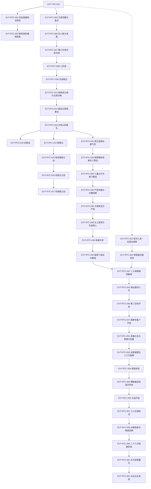

# 王庭之争

弧五枢纽页：狐仙福地收尾（第六次地灾、方正交易、和稀泥之祸）→ 定仙游赴北原 → 冒名常山阴立足葛家与狼群滚雪球 → 琅琊福地三蛊之约与星门重连狐仙福地 → 影宗暗流、两仙蛊入手与英雄大会 → 草府大战东方部族覆灭、太白云生来投；王庭福地、黑楼兰结盟与八十八角真阳楼随标段三之后核验。本页按 schema v2.1 组织 RTC 簇事件链，前情承接 EVT-TKF-032（定义于[三王福地](three-kings-mountain.md)）。本批核验标段一至二＝段三 75384–96400 行（第一节《凤九歌》至第一百一十九节《威望隆重功第一》中段）。支线缺口见《待核对》。

## 原著明确内容

### 标段一（上）：狐仙福地与第六次地灾（段三 75384–78806 行，第一节至第二十节）

- 凤金煌暴怒与仙鹤门赔偿：凤金煌静修失败暴怒，几息间摧毁整座山谷、誓要方源生不如死（75384–75447）；凤九歌致信仙鹤门索赔一只仙蛊（75448–75487），太上大长老命鹤风扬赔出我素蛊、负责到底（75658）[叙事|已核]。
- 鹤风扬的福地图谋：等第六次地灾（外界仅剩三个月）造成福地漏洞，先以方正"以情动之"劝方源交易（"奴隶蛊就是一个好方法"），最终目标夺取定仙游——"这些东西，再增上三倍，也不及一个狐仙福地啊。更何况还有一只定仙游蛊呢？"（75528–75592）[对话|已核]（说话人：鹤风扬）。
- 方源苏醒与福地盘点：荡魂行宫昏睡七天七夜、伤了魂（75734）；福地六百万亩、时间流速外界五倍、狐群四百七十万、南部地下石人部落（75810、75970）；青提仙元七十八颗半（75992）；[信念|已核]（主体：方源）前世伙同近十位魔道蛊仙攻打此福地惨胜、只剩他与宋钟，动念杀宋紫星使宋钟不出生（75750–75758）。
- 荡魂山胆石与人祖传生死门：定仙游每次服用一颗仙元、六年免喂（76022）；胆识蛊治愈魂伤、魂魄至少比原先增强五倍（76240）；《人祖传》人祖闯生死门三关——荡魂山（胆识）、落魄谷（信念）、逆流河（不可停步）（76100–76235）[叙事|已核]。
- 未来大计：定力、奴双道；第二空窍蛊还需神游蛊——喝四种极品美酒可凝成（南疆飞家壮思飞、东海醉仙翁酒海、北原王庭长生酒）（76288–76300）；春秋蝉不能赌第三次重生、须寻一举成功蛊/马到成功蛊/水到渠成蛊（76304）[叙事|已核]。
- 石人族大发展：方源强令开凿运河——"你们住在这里，就是我的奴隶！"（76410）；借岩勇假戏使其成八部领袖、两度假托白石老族长遗言（76506–76582，998 岁白石老族长实已被杀魂炼成胆石 76746–76754）；葬魂蟾收集战场亡魂培育胆石、魂魄达常人六倍（76644–76656）；方源自白"仇恨和恐惧的力量，会比感恩更庞大呢"（76776）[对话|已核]（说话人：方源）。
- 第六次地灾·泥沼蟹与弃北域：荒兽泥沼蟹自白光圆门降临、喷吐泥沼瞬成上百万蟹军（77092–77144）；地灵每颗青提仙元挪移一次（77188）；方源弃整个北部地域一百万亩（77380），魅蓝电影差十里被困北域、随弃地落到中洲（77406）；泥沼蟹死、地灾撑过（77442）[叙事|已核]。
- 有失有得与三封信：丧失一百多万亩地、仙元余七十一颗、狐群剩三十一万、蛊虫损失七十多万（77464）；三天后收到地灾日塞入的三封信——凤九歌替女约战（"赌上灵缘斋和仙鹤门的荣耀"77570）、剑一生咒骂挑战（77592）、电文纸鹤蛊告知"方正他还活着？"（77612）[叙事|已核]。
- 兄弟相见：方源割弃整整一百万亩福地抛出，天梯山群蛊仙哄抢（77804–77818）；方正被挪移入福地怒骂屠族，方源自称"我可是你的救命恩人呢"、拒绝长老之位只谈交易（77876）；"元石我没有，不过我却有荒兽泥沼蟹的尸体可以代替元石交易"（77890）[对话|已核]（说话人：方源）。
- 仙鹤门交易一：五百万块元石（77952）、泉蛋蛊三只（77956–78064）、紫晶舍利蛊一只先给（78000–78010）、羽化酒一坛（78020）；三只泉蛋蛊种下后石人人口一天扩大十倍、第三天傍晚达三十万（78110–78114）[叙事|已核]。
- 百人魂与石人奴役：炼 159 只银盏蛊、155 只金杯蛊、合炼三只四转金杯银盏蛊（78168–78280）；借胆识蛊将魂魄推至一百倍"百人魂"极限——再增即魂爆身亡（78224–78230）；一个月后凭九眼酒虫晋升四转巅峰（78274）；石人分裂三部各约十万，三转奴隶蛊控制岩勇等三族长（78294–78306）[叙事|已核]。
- 洞地蛊斗智与卖六万石人：方源谎称改良洞地蛊秘方要求自炼，鹤风扬反复削减材料后拿到子蛊反推三天，狂怒发现"这明明就是寻常的洞地蛊秘方！"（78466）；方源借石人"地母信仰"、由地灵变声假冒大地母亲，诱三族联军六万石人跳入地裂大嘴直传飞鹤山卖给仙鹤门（78560–78604），净落一百六十多万元石（78614）[叙事|已核]。
- 和稀泥仙蛊之祸与北原决策：泥沼蟹生前用一次性消耗仙蛊和稀泥蛊（六转、全天下唯一）侵蚀荡魂山，山腰以下胆石十颗有六颗是黄泥（78680–78694）；三案——西漠孙醋化石蛊、东海海市福地"东山再起"、北原太白云生（宙道六转仙蛊江山如故之主、此蛊还未诞生），选定混乱的北原（78722–78752）；合炼五转推杯换盏蛊（78796）[叙事|已核]。

### 标段一（中）：踏足北原与冒名常山阴（段三 78808–82400 行，第二十一节至第四十一节开头）

- 踏足北原救葛谣：腐毒草原少女葛谣被数百毒须狼群围困，方源裸身传送抵达、四转金龙蛊两击杀百兽狼王（78814–78890）；化名"你就叫我常山阴好了"（78910）；跨域压制——四转巅峰真元在北原只相当于三转巅峰效用（78970）[叙事|已核]。
- 荒原同行：葛谣自述逃婚（被许配蛮家三子蛮多）（79046–79056）；方源欲擒故纵诱其同行（78984–78988）；鬼脸葵海草傀开道、影鸦空战、地刺鼠区（79290–79566）；皓珠蛊封印定仙游（79402–79408）[叙事|已核]。
- 白骨车轮收服：踏入二十多年前战场，葛谣认出"常山阴？你是狼王常山阴！"（79658）；哈突骨遗五转蛊战骨车轮袭来，缠斗两个多时辰后收服到手（79676–79728）[叙事|已核]。
- 常山阴身世：常山阴与哈突骨玩伴变死敌、哈突骨毒杀其母、决战两败俱伤后以狼胎地葬蛊入地沉眠；本应三十多年后被马鸿运救活，成四大将"天狼将"、七转蛊仙，抗中洲战死后由后人做传——这也是方源知情之由（79778–79828）[叙事|已核]。
- 杀常山阴冒名顶替：方源拔出狼尾放出真身常山阴、趁机捏死这个"未来七转的蛊仙"（79864）；其空窍内龟息蛊封存八只四转奴道珍稀蛊，借春秋蝉全部炼化（79870–79884）；黑蚁剥皮种花炼出人皮蛊、生生剥换全身皮肤彻底变成常山阴（79896–79996）；编造"魂魄夺舍游荡二十多年"谎言（80044）[叙事|已核]。
- 埋藏定仙游与狼群滚雪球：采得三只雪洗蛊（80132）；铁柜蛊隔绝仙蛊气息、五转地藏花王埋入地底深处——"才算真正彻底的，将仙蛊定仙游隐藏起来"（80142–80166）；一路收服百兽狼王，狼群达两千多头、四头百兽狼王（80216）[叙事|已核]。
- 推杯换盏蛊验证：两只一套经空穴交换物资书信（福地内过去一个月，草原才五六天），南疆中洲蛊虫元石尽数送回福地（80252–80344、80846–80848）[叙事|已核]。
- 杀葛谣：葛谣受"常山阴传说"感动正式求婚（80422），方源许诺"独自斩杀千兽王就娶你"，葛谣浴血斩杀千狼王归来（80570）；方源拥抱后一匕首刺入心口，以《人祖传》石人故事作答——"石人啊，我本来不想杀你。但是你阻挡我通往成功的路啊。"（80608）；动机："她知道的东西太多了，在方源的心中，早就是必杀的目标"（80764，知定仙游、埋蛊、推杯换盏）；魂魄由葬魂蟾吞下送福地荡碎（80796）[叙事|已核]。
- 救葛光与首只千狼王：葛家少族长葛光被三千多头风狼围困（80956）；方源以四转狼嚎蛊（方圆八百步狼群战力暴涨两倍）碾压战局、最后一支三转驭狼蛊收服风狼王——"方源得到了第一只千狼王"（81068–81158）；顺势受邀往葛家做客（81184）[叙事|已核]。
- 葛家认亲与市集采购：五天后抵葛家营地，自报常家元风一脉山字辈、父常胜纯母常翠，老族长确认英雄身份并赠一百万元石（81360–81412）；方源建议北迁依附黄金家族被拒——"距离大风雪，只剩下一年多的时间"（81464）；市集十三天：奴隶市场（女奴三两元石）、力道蛊价目（斤力 220／十钧之力 36000 元石）、狼魂蛊 7700 元石×8、驭狼蛊秘方与存货（81554–81838）；马鸿运前世发迹史、"现在恐怕已有十三岁"（81630）；北原七转蛊仙楚度（霸仙）——研发斤力/钧力蛊、炼六转仙蛊"力贯千钧"、后战死于凤九歌之手（81762–81778）[叙事|已核]。
- 蛮家挑战与示好：葛谣死讯传回（搜寻队只找到衣服碎片、判定死于毒须狼群 81892），老族长一病不起、葛光代理族长（81902–81904）；蛮多带石武上门，方源拒五十万收买、接十万元石赌战击倒石武不杀——"通过战斗得来的十万元石，我却觉得沉甸可贵"（82058–82070）；蛮图震动"但如果是真的，那北原就又多出一个人物了"（82200）；蛮家赠上百只骨竹蛊示好，方源修复战骨车轮最深裂痕（82232–82294）；野外夜宴疑云——乌云来去蹊跷"恐怕是蛊师出行，而自己埋下定仙游蛊，还不到一个月"（82382）[叙事|已核]。

### 标段一（下）：鬼王追踪、葛家保卫战与琅琊福地三蛊之约（段三 82401–86000 行，第四十一节至第六十一节开头）

- 鬼王追踪仙蛊气息：阴云向南急行五千里至无名山丘、红光如太阳绽放（82388–82400）；六转魂道蛊仙鬼王向红玉散人交割三百五十万只熔岩蝙蝠、约定共闯琅琊福地（82420–82457）；北归途中循定仙游气息追踪至雪柳线索中断（82536–82548）——实为方源铁棺蛊分段封印制造思维惯性、令其钻进"毒蝎娘子夺蛊"死胡同（82736–82742）[叙事|已核]。
- 酒宴验烟危机：蛮多当众以追烟蛊显形试探，方源主动催验并以"毒须狼吞食葛谣、狼体沾烟"解释——"狼群当中的几头毒须狼，身上染着比方源还要更加浓郁的追烟"（82690）；葛光提议五转蛛丝马迹蛊验证、毫无异变洗清嫌疑，老族长当场赠蛊赔礼（82714–82817）[叙事|已核]。
- 老族长密谈与蛮家阴谋：密室训子"当我们力量不足时，就要用智慧来弥补"（82898）；方源以市价加两成高价求购信令蛮家反白送（83034–83052）；蛮家三万担粮草内藏引狼蛊、前方三支万狼群埋伏——"给葛家造成更多的损失吧"（83096、84656）[对话|已核]（说话人：蛮豪、蛮图）。
- 龟背狼群之战与狼人魂：三万八千多只龟背狼来袭（83218），方源献策引水成渠克制不能泅水者（83222–83226）；连收百狼王与千狼王（83314–83776）；八头千狼王围耗万狼王致死、尸出四转驭狼蛊转赠方源（83734–83848）；狼魂蛊用尽——"百人魂彻底转为狼人魂"（83902），收服上限扩至三倍多（83914）[叙事|已核]。
- 夜袭、老族长之死与夜狼王收服：蛮家家老石武屠葛家侦察蛊师，上万夜狼夜袭营地（83940–84000）；方源热血演说激醒众家老——葛光"其他人怕死，但我葛光愿意随你赴死！！"（84184）；老族长吞火蛊战夜狼王重伤，方源借天青狼皮蛊假装"昏迷"避战（84452–84478）；方源"苏醒"以四转驭狼蛊收服夜狼王（84538–84558）；老族长伤重不治——"三十八岁上位，八十七岁战死沙场的葛家族长"（84600）[叙事|已核]。
- 风狼群之战与葛家代价：蛮图仍放第三波风狼群（84656）；方源主动迎战大胜、斩风狼万兽王，狼群膨胀至三万五（84664）；葛家代价：凡人死上万、家老折半、老族长阵亡（84670）；"毕竟现在的方源，已经有能力屠戮整个葛家了"（84702）；新族长葛光送四转无常骨致谢（84672）[叙事|已核]。
- 奴道喂养困境与琅琊福地方向：方源盘点——四转巅峰但北原异域压制真金真元只当淡金初阶（82916–82920）、狼人魂、三十钧力量；洞地蛊出不了中洲、星门蛊成功率百中无一、狐仙福地开门引星光会放进魅蓝电影——寄望琅琊福地（84822–84870）[叙事|已核]。
- 琅琊福地攻潮与地灵设局：鬼王、红玉散人、花海三仙齐聚月牙湖，趁地灾"万雷电雨"撕开的漏洞轮流投入青提仙元对耗（上百轮＋五十轮＋三十轮）骗得福地"仙元耗尽"、五仙入内（84872–85063）；实为琅琊地灵故意示弱设局——天元宝皇莲白荔仙元从未枯竭（85600），五仙兵败被俘为仆（85592–85610）[叙事|已核]。
- 长毛老祖与三尊说：琅琊福地故主为"古往炼道第一仙"长毛老祖——八转、横跨盗天巨阳两代、一生至少炼成三十八只仙蛊、死后化琅琊地灵（84916–85008）；挚友一言仙（八转智道）耗五十载阳寿测出三尊说：幽魂魔尊、乐土仙尊之后将出大梦仙尊，遁空蛊难题将在其手中解决（85120–85135）[叙事|已核]。
- 方源入琅琊福地：[信念|已核]（主体：方源）按前世记忆找到组成"盗"字的石林、坐上马鸿运当年的石凳、血涂紫柱说出"想要"二字入内（85096–85142）；琅琊地灵一眼看穿人皮蛊伪装（人皮、愧梅子、秋声草、丹火蛊、药力蛊），方源亮明"魔尊当年约定的暗号么？哈，那就是没有暗号"、以盗天魔尊继承人身份压制（85186–85221）[对话|已核]（说话人：方源）。
- 换蛊与三蛊之约：领先时代的五转秘方换通天蛊、星门蛊秘方换神念蛊（85224–85354）；天元宝皇莲不换（地灵命根）；三蛊之约细则——"你有三次机会，让我给你炼蛊。但是炼制仙蛊，不管成功还是失败，都算一次。若是炼制凡蛊，我一定会将炼成的蛊交到你的手中"（85522）；方源拍板耗一次机会炼星门蛊（85570）[对话|已核]（说话人：琅琊地灵）。
- 星门重连狐仙福地：地灵以通天蛊＋神念蛊联宝黄天购二十份材料，第三次炼成一对星门蛊（85754–85784）；琅琊福地时间流速为外界三十六倍（85664）；用八只涸泽蛊把推杯换盏蛊从四转顶到五转，将通天蛊、神念蛊、一只星门蛊传回狐仙福地（85820–85874）；久候星门不亮之际方源心境澄明——"今夜的星空，真是美丽啊"（85920）；跨星门重返狐仙福地与小狐仙团聚（85942–85958）；狐仙福地星光仅靠五百余只三转星萤蛊群、开门耗三十二只、维持时三呼吸死一只（85972–85976）[叙事|已核]。

### 标段二（上）：影宗暗流与狼群军备（段三 86001–89400 行，第六十一节尾至第八十节）

- 宝黄天星萤虫交易：方源以三张仙蛊残方换十万只星萤虫（万象星君、摇光仙子、帝渊三家各出三万三千多只）——"有了这些，我就能成为曰后最大的星萤蛊的卖家"（86178）；随后以一块仙元石购三份星屑草培育文书（86142–86178）[叙事|已核]。
- 砚石老人现世：神游蛊突现宝黄天、卖家砚石老人点名索第二空窍蛊秘方——方源判定"这蛊仙的流派恐怕是太古智道，擅长推演测算"、神游蛊是鱼饵，放弃竞买（86246）[对话|已核]（说话人：方源，内心）。
- 影宗入局：南疆生死福地七转智道蛊仙砚石老人（影宗）在仇九的奴隶蛊上动手脚、命其卧底——"我算定方源必定会参与义天山正魔大战，届时你可卧底在他身边"（86302）；白凝冰北冥冰魄体复原、以"杀方源、谋定仙游、恢复男身"为条件暂入影宗，与砚石老人、仇九用海誓蛊定约（86320–86370）[对话|已核]（说话人：砚石老人）；琅琊地灵手中的第二空窍蛊正是砚石老人暗中安排流落的（86398），其换走神游蛊正中下怀（86382–86398）[叙事|已核]。
- 琅琊福地七波攻潮之悟：方源识破众多蛊仙向地灵抛售炼蛊材料是陷阱——[信念|已核]（主体：方源）"前世五百年，琅琊福地先后，承受了七波攻潮，最终陨灭"，幕后有黑手、第七波由天庭出手（86434–86456）。
- 方源军备：卖光残方后手握二十八块仙元石（86532）；以和稀泥换和稀泥仙蛊秘方并造势抬价（86566–86614）；买三只紫晶舍利蛊、马到成功蛊（86524）[叙事|已核]。
- 严家求援与水魔劫案：水魔浩激流（四转高阶）掳走严翠儿勒索一千万元石加五转背水一战蛊（86802）；严家族长严天寂求援——"我们严家愿意先支付三千块元石"（86746）；方源以藏于元石中的四转定身蛊偷袭定住水魔（86860）[叙事|已核]。
- 方源倒戈灭严家：方源突然倒戈、狼群转攻严家——"你们都安心的去吧，将来我会送常家的族人们给你们做伴的"（86986）；水魔带严翠儿逃走、按原计划投黑楼兰（87256）；围攻两时辰后严家投降被灭（87384），葛光估葛家实力可膨胀三倍（87402）[叙事|已核]。
- 五转巅峰与狼群六万：葬魂蟾放出严家战场魂魄灌溉荡魂山（87432）；方源晋五转初阶、两颗紫晶舍利蛊至五转高阶、再两颗至五转巅峰——"两颗舍利蛊合力，终于将其修为擢升到五转巅峰！"（87528–87596）；宝黄天大采购（三万龟背狼含万狼王、风狼一万八千、夜狼两万、毒须狼五千、水狼六千，共两块半仙元石 87718–87724），狼群扩张到六万（87850）；就地炼成五转敛息蛊压回四转中阶掩盖异域压制（87866）[叙事|已核]。
- 气泡鱼押注：一块仙元石抢下两万多颗气泡鱼鱼籽——[信念|已核]（主体：方源）"如果我记忆不差，就是在今年年底，气泡海上两位蛊仙相斗，剧毒侵蚀整个气泡海……到那时，气泡鱼的价格就要暴涨十倍有余了"（87760）。
- 太上家老与先发制人：应葛光恳请出任葛家太上家老（87936）；贝、郑、裴三家联盟制裁葛家，汪家定计"就让他们狗咬狗，我们坐山观虎斗"（88046）；方源力排众议——"既然对方想要杀我们，那我们就先发制人，直接杀过去！须知最好的防守，就是进攻！"（88120）[对话|已核]（说话人：汪德道、方源）。
- 夜袭贝郑两家：两头万狼王撞塌贝家营地（88246）；郑家五百八十根电矛齐射毙狼五百多头、夜狼万兽王被刺瞎双眼仍死战、电矛军团十不存一（88298–88472）；"死吧，死吧，死得越多，我得到的魂魄就越多啊"（88482）[对话|已核]（说话人：方源）。
- 裴燕飞金虹与安然撤退：裴家四转巅峰金道猛将裴燕飞以金虹一击洞穿龟背万狼王龟壳（88812）；[信念|已核]（主体：方源）前世其有五转釜底抽薪蛊（88844），方源主动撤退；裴燕飞以破釜沉舟蛊爆发追击（89020），方源放白眼狼伪造"还有一头万兽王级异兽"假象、葛家安然撤军（89020–89044）；此战六万狼群死伤过半、万兽王尽损（89162）——正名之战，"原本以为是只花猫，没想到竟然是头豹子！"（89198）[叙事|已核]。
- 二入琅琊福地：小狐仙情报——琅琊老仙在宝黄天大量收购第二空窍蛊材料（89330）；方源经石林盗天魔尊布置再入、请地灵用第二次无偿炼蛊机会炼第二空窍蛊——"当然是请你出手，炼制第二空窍蛊了"（89386）；[信念|已核]（主体：方源）前世此机缘本属马鸿运，今生截胡（89394）[叙事|已核]。

### 标段二（中）：琅琊福地两仙蛊与英雄大会（段三 89401–92900 行，第八十一节至第九十九节）

- 两仙蛊同入手：地字丙号炼蛊大厅方圆十里、数千毛民齐炼、进度快十多倍（89442–89506）；方源连灌至少十四种极品美酒护持心神，地灵以神游蛊合材料炼成第二空窍蛊——成形刹那方源体内酒意凝结："冥冥中，玄机降下，道纹凝结，使得这点微微一爆，化成一蛊——神游蛊！"（89578）[叙事|已核]。
- 拜师被拒与和稀泥换购：地灵交出第二空窍蛊（89622）；"老夫已经收了十八个毛民徒弟。今后也只会收毛民做徒弟！"（89612）；方源以神游蛊＋第二空窍蛊半成品换六转和稀泥仙蛊——"害得荡魂山渐渐枯死的罪魁祸首，不想被琅琊地灵又炼制了出来"（89712）[对话|已核]（说话人：琅琊地灵）。
- 真阳楼情报交易：方源卖"我何时用掉第二空窍蛊"的消息，换八十八角真阳楼的一切信息（89764）[叙事|已核]。
- 马家灭费家：费家内乱（费长毒害费清、托孤费才）——"你身上流淌着巨阳仙尊的血脉，你是黄金家族的成员"（89828）；马家不宣而战灭黄金家族费家（89928），马英杰离间计立头功、获二十多万头恐爪马（89950）；费才（蠢笨路痴遗孤）被马英杰收为贴身奴仆（90114–90132）[叙事|已核]。
- 第二空窍开启：方源谎称智道蛊师（90166）；地灵强求当场用掉——"第二空窍，对你修行大有裨益，成就蛊仙时，更有天大的好处"（90252）；灌注仙元催动，绿豆绿光于胸膛中央炸开成第二空窍（90248–90270）[对话|已核]（说话人：琅琊地灵）。
- 狼群军备十万级：和稀泥残方换泥脚仙三千多老毛民＋七千多小毛民（90392）；宝黄天购老迈夜狼皇（两块仙元石）＋一万八千夜狼、三万龟背狼、一万风狼、八万朱炎狼等——"他手中的狼群规模已经激增到十万"（90444）；异兽狼全数买下（血森狼一、鱼翅狼三、狂狼二、白眼狼五，90530）[叙事|已核]。
- 砚石老人天机推算与狙击：其本命蛊天机十次至少八次失败、失败削寿十年至七十年（90594–90608）；推算误得方源"豢养经营谋利"（90542），改为在宝黄天狙击方源收购驭狼蛊材料（90638）；方源识破狙击者多为前世攻打琅琊福地之人——[信念|已核]（主体：方源）前世完全不知此神秘势力存在（90670–90680）[叙事|已核]。
- 千人魂与双空窍格局：仙元石耗至两块备用（90808）；荡魂山采胆识蛊、魂魄达成千人魂（90820）；第一空窍五转巅峰晶紫真元、第二空窍三转巅峰雪银真元（90838）；定三转全力以赴蛊为第二本命蛊（90898）[叙事|已核]。
- 地丘传承线索：柴家物资中的灰白石板（乾坤晶壁碎片）在真元灌注下显现"地丘"地形图与四句谜语——"土中蕴光，芒高万丈，百里天游，咏梅雪香"（91252，画意蛊种入记忆）[叙事|已核]。
- 玉田英雄大会与黑楼兰结盟：斗台赛水魔以水像蛊替身反杀火浪子柴明（91440–91520）；墨狮狂（墨人、四转巅峰气道）一掌拍爆毒蛇郎君（91616）；方源当众宣布与黑楼兰联手，汪、房、叶等摇摆大型部族随即投黑（91880）；以葱谷放养说辞圆狼群来历之谎（91982–91992）；黑楼兰赠五转龟玉狼皮蛊（92006）[叙事|已核]。
- 血誓建盟与五十三万狼群：黑家建盟毒誓、方源凭言而无信蛊蛊方无所惧——"此蛊两百年后，才被一位西漠酋长研发出来"（92160）；收编夜狼大战一夜得七万野生夜狼——"方源手中的狼群数目，激增到五十三万之巨！"（92294）；黑楼兰对五十万狼群暗生忌惮（92322–92344）[叙事|已核]。
- 赵怜云虎狼羊之劝：五六岁女童赵怜云（穿越者）自残入书房劝父——"羊不管帮哪一边，到最后虎、狼都不会放过羊的"（92476）；赵家连夜拔营远赴天川投马家（92504）；[信念|已核]（主体：方源）《赵怜云传》所载此劝——"像马鸿运、赵怜云，这种人物我迟早要扼杀在摇篮里"（92580）[对话|已核]（说话人：赵怜云、方源内心）。
- 雨夜刺杀：东方余亮为救妹东方晴雨（与蛊仙老祖有密约）决意刺杀——"狼王常山阴，你就先给我死在这战前的雨夜里吧"（92680）；方源借两空窍真元互用一夜突破五转初阶（92770）；女刺客袭来、代催驭狼蛊的土波当场毙命、丝线长虫钻耳（92860–92900）[叙事|已核]。

### 标段二（下）：草府大战与太白云生来投（段三 92901–96400 行，第一百节至第一百一十九节）

- 爆脑蛊逆炼与盗天传承：女刺客自报"无影剑边丝轩"、承认种下爆脑蛊（急速思索即撑爆头脑，92916）；东方余亮复盘——五转魂爆蛊种于鱼翅狼、雇影剑客（92968）；方源以五转空念蛊侵蚀爆脑蛊、逆炼分解出两只三转蛊与一颗空念——"盗天魔尊的这处传承，居然指向落魄谷？！"（93468）；[信念|已核]（主体：方源）前世马鸿运因此蛊获盗天传承（92950–92958）[叙事|已核]。
- 三心合魂与呕心婴泣：东方余亮召鄂玄铭（鳄群五万）、姜婉姗、魏鑫练三心合魂（93242–93276）；方源炼呕心婴泣蛊十多次皆失败（93310）——[信念|已核]（主体：方源）前世黑楼兰被三心合魂搞得灰头土脸、马鸿运与圣灵儿炼成此蛊克之、中洲改良后马鸿运公开秘方再破（93310–93330）[叙事|已核]。
- 大战开启：黑盟大军开赴草府、两军相距三千里（93390）；唐妙鸣当阵指名挑战狼王，方源当阵——"时间不早了，就赶紧开战吧。打完了，我还要吃午饭呢"——五十万狼群齐嚎全军冲锋、破挑将惯例（93672–93678）[对话|已核]（说话人：方源）。
- 三心合魂启动：三魂合一达一千四百人魂、威压方圆两百里（94038–94042）；方源九百人魂不及（94044）；点破"破三心合魂则混编兽群不战自溃"（94018–94118）[叙事|已核]。
- 水像假身与暗漩自爆：黑楼兰暗漩被东方余亮云涡吞住（94174–94182）、东破空与边丝轩扑袭王帐（94192）；边丝轩叠影一剑洞穿"常山阴"心口——"常山阴"化为一滩流水、水像蛊假身（94352）；方源战前与黑楼兰密谋仅三人知情、真身藏战场角落以狼顾蛊观战（94360）；黑楼兰改良暗漩自爆清场方圆十里（94418）、三心合魂三人被杀、混编兽群崩溃（94450）[叙事|已核]。
- 七星灯与狼王冷眼：东方余亮七星灯加持数万星念追杀黑楼兰（94470–94482）；星云屠葛家部族逼狼王出手——方源狼顾蛊冷眼旁观见死不救，"死的人越多，战后得到的魂魄就越多"（94556），东方余亮为之生寒（94560）[叙事|已核]。
- 逆雨福地密谈：东方长凡（东方家唯一智道蛊仙、七转、寿元将尽）与谭碧雅（刘家外姓太上家老）议事——东方长凡"透露"大雪山福地魔道蛊仙已秘密支持马家、觊觎八十八角真阳楼，实为算计谭碧雅之局（94646–94710）[叙事|已核]。
- 二十八万狼破防线：方源第二次出手、立军令状"一刻破防线"——"短短功夫，就死了二十八万的野狼！"（94826）；东方军两成死于大战、五成死于追杀（94790）；东方余亮焦雷土豆蛊地雷阵后手（94862–94876），将方源列为头号大敌——"虽然只是四转巅峰，但比黑楼兰要难对付得多"（94894）[对话|已核]（说话人：东方余亮，内心）。
- 东方部族覆灭：黑楼兰总攻破最后防线、东方余亮认输（95500–95514）；夜空开二十多丈光门接引东方部族入福地避祸（95560）；黑家收战争赔款、军力再壮五成（95570）；方源感叹——"实质上是掠食者们合伙猎食的一场游戏"（95586）[叙事|已核]。
- 战功榜与潜魂兽衣：战功榜常山阴十万多居首、黑楼兰八万多（95016–95026）；四转全力以赴蛊第四次炼成（94964）；黑楼兰私授潜魂兽衣蛊蛊方（一转直达五转、掩盖魂魄波动），方源战功赊至负五十万垫底（95188–95218）；力量突破百钧大关（95236）；"能做到无敌的境界，整个历史中，也不过只有区区九位罢了"（95284）[叙事|已核]。
- 马家线与偷鞋案：马家军力六十万对宋家联军（95614）；费才偷鞋遭构陷——赵怜云教其"为少族长暖鞋"翻盘、升奴仆长（95640–95886）；赵怜云内心"老娘我可不是这个世界的人"（95934）[叙事|已核]。
- 功倍蛊与五域格局：战后大采购——四转自力更生蛊、炼精化神蛊及蛊方、五转功倍蛊（增幅蛊虫效果五倍）（95956–96026）；五域实力中洲第一、北原第二（96004）；蛊道纪年（太古→近古）与巨阳赔款机制促进交流（95994–96000）[叙事|已核]。
- 太白云生来投：各处首战落幕（玉田刘家胜罗家降 96136；猛丘努尔图"豹突"胜江暴牙"鼠疫" 96170–96198）；黑家攻关西古家久攻不下（96234–96258）；太白云生持黑柏书信来助——"老夫太白云生，受恩人书信所托，前来助你一臂之力"（96262）；其宙道手段"山如故"银光普照化山石为虚无（96316），古家十多万人出降（96396–96398）；[信念|已核]（主体：方源）前世本知太白云生此时加入黑家、后在王庭福地晋升蛊仙（96360–96364）[叙事|已核]。

## 事件链（RTC 簇·标段一）

| 事件 ID | 事件 | 前因 | 参与者 | 后果/因果指向 | 证据 |
|---|---|---|---|---|---|
| EVT-TKF-032 | 卷二终：天瀑光河人祖传之景 | EVT-TKF-030 | 方源、全场蛊师 | 弧五开启 | E:V2-075012（定义页：[三王福地](three-kings-mountain.md)） |
| EVT-RTC-001 | 凤金煌暴怒与仙鹤门赔偿 | EVT-TKF-032 | 凤金煌、凤九歌、鹤风扬 | 索赔我素蛊落定；鹤风扬主责方源事务 | E:V3-075436、075658 |
| EVT-RTC-002 | 鹤风扬的福地图谋 | EVT-RTC-001 | 鹤风扬、方正 | 等第六次地灾漏洞、以方正劝降、目标定仙游 | E:V3-075586 |
| EVT-RTC-003 | 方源苏醒与福地盘点 | EVT-TKF-032 | 方源、地灵小狐仙 | 昏睡七日伤魂；家底锚定；杀宋紫星之念 | E:V3-075734、075766 |
| EVT-RTC-004 | 荡魂山胆石与人祖传生死门 | EVT-RTC-003 | 方源 | 魂伤痊愈增五倍；定仙游一颗仙元六年免喂 | E:V3-076022、076240 |
| EVT-RTC-005 | 未来大计与神游蛊四酒 | EVT-RTC-004 | 方源 | 力奴双道；第二空窍需神游蛊；北原王庭长生酒 | E:V3-076288 |
| EVT-RTC-006 | 石人族大发展（假戏与运河） | EVT-RTC-003 | 方源、岩勇、地灵 | 岩勇傀儡领袖；运河；葬魂蟾育胆石 | E:V3-076410、076656 |
| EVT-RTC-007 | 第六次地灾·泥沼蟹与弃北域 | EVT-RTC-006 | 方源、地灵、泥沼蟹、魅蓝电影 | 泥沼蟹死；魅蓝电影落中洲 | E:V3-077380、077406 |
| EVT-RTC-008 | 有失有得与三封信 | EVT-RTC-007 | 凤九歌、剑一生、方源 | 约战/挑战/方正还活着三线入局 | E:V3-077464、077570 |
| EVT-RTC-009 | 兄弟相见 | EVT-RTC-008 | 方源、方正、鹤风扬 | 割弃百万亩；拒长老之位；泥沼蟹尸体代元石 | E:V3-077804、077890 |
| EVT-RTC-010 | 仙鹤门交易一 | EVT-RTC-009 | 方源、鹤风扬 | 500 万元石/泉蛋蛊 3/紫晶舍利 1 | E:V3-077952 |
| EVT-RTC-011 | 百人魂与石人奴役 | EVT-RTC-010 | 方源、岩勇 | 魂魄百倍极限；四转巅峰；三部奴隶蛊 | E:V3-078224、078274 |
| EVT-RTC-012 | 洞地蛊斗智与卖六万石人 | EVT-RTC-011 | 方源、鹤风扬、岩勇 | 净落 160 多万元石；鹤风扬反推失败狂怒 | E:V3-078466、078604 |
| EVT-RTC-013 | 和稀泥仙蛊之祸与北原决策 | EVT-RTC-007 | 方源 | 荡魂山侵蚀；三案选北原；推杯换盏合炼 | E:V3-078694、078726 |
| EVT-RTC-014 | 踏足北原救葛谣 | EVT-RTC-013 | 方源、葛谣 | 化名常山阴；跨域压制三转巅峰效用 | E:V3-078910、078970 |
| EVT-RTC-015 | 荒原同行与白骨车轮收服 | EVT-RTC-014 | 方源、葛谣 | 五转战骨车轮到手 | E:V3-079658、079726 |
| EVT-RTC-016 | 杀常山阴冒名顶替 | EVT-RTC-015 | 方源、常山阴 | 捏死未来"天狼将"；八只四转奴道蛊；人皮换皮 | E:V3-079864、079996 |
| EVT-RTC-017 | 埋藏定仙游与狼群滚雪球 | EVT-RTC-016 | 方源 | 铁柜+地藏花王藏蛊；狼群两千余 | E:V3-080166、080216 |
| EVT-RTC-018 | 杀葛谣 | EVT-RTC-015 | 方源、葛谣 | 斩千狼王后遇刺；葬魂蟾送魂 | E:V3-080608、080764 |
| EVT-RTC-019 | 救葛光与首只千狼王 | EVT-RTC-017 | 方源、葛光、风狼王 | 千狼王到手；受邀葛家 | E:V3-081158 |
| EVT-RTC-020 | 葛家认亲与市集采购 | EVT-RTC-019 | 方源、葛家老族长 | 认亲；百万谢礼；力道价目；马鸿运/楚度情报 | E:V3-081362、081762 |
| EVT-RTC-021 | 蛮家挑战与示好 | EVT-RTC-020 | 方源、石武、蛮多、蛮图 | 十万元石赌战胜；骨竹蛊百只示好 | E:V3-082070、082232 |
| EVT-RTC-022 | 鬼王追踪仙蛊气息 | EVT-RTC-021 | 鬼王、红玉散人 | 熔岩蝙蝠交割；追踪至雪柳中断；铁棺骗过 | E:V3-082420、082736 |
| EVT-RTC-023 | 酒宴验烟与蛛丝马迹 | EVT-RTC-021 | 蛮多、方源、葛光 | 毒须狼烟洗清嫌疑；获赠蛛丝马迹蛊 | E:V3-082690、082812 |
| EVT-RTC-024 | 老族长密谈与蛮家阴谋 | EVT-RTC-023 | 葛家老族长、蛮图 | 引狼蛊粮草＋三支万狼群埋伏 | E:V3-082898、083096 |
| EVT-RTC-025 | 龟背狼群之战与狼人魂 | EVT-RTC-024 | 方源、葛家 | 3.8 万龟背狼；收千狼王；狼人魂转化 | E:V3-083218、083902 |
| EVT-RTC-026 | 夜袭、老族长之死与夜狼王收服 | EVT-RTC-025 | 石武、方源、葛光、老族长 | 老族长战死；夜狼王到手 | E:V3-084184、084600 |
| EVT-RTC-027 | 风狼群之战与葛家代价 | EVT-RTC-026 | 方源、蛮图、葛光 | 狼群三万五；葛家重创；可屠葛家 | E:V3-084664、084702 |
| EVT-RTC-028 | 琅琊福地攻潮与三尊说 | EVT-RTC-022 | 鬼王、红玉散人、花海三仙、琅琊地灵 | 五仙被俘；长毛老祖/一言仙三尊说 | E:V3-084916、085120 |
| EVT-RTC-029 | 三蛊之约与星门重连狐仙福地 | EVT-RTC-028 | 方源、琅琊地灵、小狐仙 | 通天/神念入手；星门炼成；重返狐仙福地 | E:V3-085522、085920 |
| EVT-RTC-030 | 宝黄天星萤虫交易 | EVT-RTC-029 | 方源、万象星君、摇光仙子、帝渊 | 十万只星萤虫入手；星门布局 | E:V3-086178 |
| EVT-RTC-031 | 影宗入局：白凝冰海誓 | EVT-TKF-030 | 砚石老人、白凝冰、仇九 | 白凝冰暂入影宗；杀方源之约 | E:V3-086302、086370 |
| EVT-RTC-032 | 神游蛊流落地灵 | EVT-RTC-031 | 砚石老人、琅琊地灵 | 第二空窍蛊系暗中安排；神游蛊换走 | E:V3-086398 |
| EVT-RTC-033 | 琅琊福地七波攻潮之悟 | EVT-RTC-029 | 方源 | 识破材料陷阱；幕后黑手认知 | E:V3-086434 |
| EVT-RTC-034 | 严家求援与水魔劫案 | EVT-RTC-029 | 严天寂、浩激流、方源 | 定身蛊偷袭水魔 | E:V3-086746、086860 |
| EVT-RTC-035 | 方源倒戈灭严家 | EVT-RTC-034 | 方源、严天寂、浩激流 | 严家灭；水魔投黑楼兰 | E:V3-086986、087384 |
| EVT-RTC-036 | 五转巅峰与狼群六万 | EVT-RTC-035 | 方源 | 舍利蛊推至五转巅峰；敛息蛊伪装 | E:V3-087596、087850 |
| EVT-RTC-037 | 气泡鱼押注 | EVT-RTC-036 | 方源 | 两万多颗鱼籽；年底暴涨预言 | E:V3-087760 |
| EVT-RTC-038 | 太上家老与先发制人 | EVT-RTC-036 | 方源、葛光、汪德道 | 就任太上家老；夜袭三盟决策 | E:V3-087936、088120 |
| EVT-RTC-039 | 夜袭贝郑与魂魄收割 | EVT-RTC-038 | 方源、贝家族长、郑家族长 | 两家破灭；存储蛊收魂 | E:V3-088482 |
| EVT-RTC-040 | 裴燕飞金虹与安然撤退 | EVT-RTC-039 | 裴燕飞、方源、贝草川 | 金虹破龟背万狼王；白眼狼疑阵撤军 | E:V3-088812、089020 |
| EVT-RTC-041 | 二入琅琊福地截胡第二空窍 | EVT-RTC-040 | 方源、琅琊地灵 | 第二次炼蛊机会启动；截胡马鸿运机缘 | E:V3-089386 |
| EVT-RTC-042 | 两仙蛊同入手 | EVT-RTC-041 | 方源、琅琊地灵 | 第二空窍蛊炼成；神游蛊凝成 | E:V3-089578 |
| EVT-RTC-043 | 和稀泥换购与拜师被拒 | EVT-RTC-042 | 方源、琅琊地灵 | 和稀泥仙蛊到手；只收毛民徒 | E:V3-089712 |
| EVT-RTC-044 | 真阳楼情报交易 | EVT-RTC-043 | 方源、琅琊地灵 | 八十八角真阳楼情报到手 | E:V3-089764 |
| EVT-RTC-045 | 马家灭费家 | — | 马英杰、费家、费才 | 黄金家族费家灭；费才入马家 | E:V3-089928 |
| EVT-RTC-046 | 第二空窍开启 | EVT-RTC-042 | 方源、琅琊地灵 | 第二空窍成；智道谎言 | E:V3-090252 |
| EVT-RTC-047 | 狼群军备十万级 | EVT-RTC-046 | 方源、小狐仙 | 夜狼皇入手；毛民入手；十万狼群 | E:V3-090444 |
| EVT-RTC-048 | 砚石老人天机推算与狙击 | EVT-RTC-047 | 砚石老人 | 推算失误；宝黄天狙击启动 | E:V3-090580 |
| EVT-RTC-049 | 千人魂与双空窍 | EVT-RTC-046 | 方源 | 千人魂；全力以赴蛊定第二本命 | E:V3-090838 |
| EVT-RTC-050 | 地丘传承线索 | — | 方源 | 灰白石板地丘地形图与谜语 | E:V3-091252 |
| EVT-RTC-051 | 玉田英雄大会与黑楼兰结盟 | EVT-RTC-040 | 方源、黑楼兰、刘文武、墨狮狂 | 当众结盟；龟玉狼皮蛊入手 | E:V3-091880、092006 |
| EVT-RTC-052 | 血誓建盟与五十三万狼群 | EVT-RTC-051 | 方源、黑楼兰、桑易 | 毒誓建盟；一夜七万夜狼 | E:V3-092160、092294 |
| EVT-RTC-053 | 赵怜云虎狼羊之劝 | EVT-RTC-051 | 赵怜云、赵家族长 | 赵家投马家；方源摇篮杀机 | E:V3-092476 |
| EVT-RTC-054 | 雨夜刺杀 | EVT-RTC-051 | 东方余亮、边丝轩、方源 | 爆脑蛊入耳；土波代死 | E:V3-092680、092900 |
| EVT-RTC-055 | 爆脑蛊逆炼与盗天传承指向落魄谷 | EVT-RTC-054 | 方源、边丝轩 | 空念逆炼；传承指向落魄谷 | E:V3-092916、093468 |
| EVT-RTC-056 | 大战开启：五十万狼群冲锋 | EVT-RTC-052 | 方源、黑楼兰、唐妙鸣 | 破挑将惯例全军突击 | E:V3-093672 |
| EVT-RTC-057 | 三心合魂启动 | EVT-RTC-056 | 鄂玄铭、姜婉姗、魏鑫、方源 | 一千四百人魂威压两百里 | E:V3-094020 |
| EVT-RTC-058 | 水像假身与暗漩自爆 | EVT-RTC-057 | 方源、边丝轩、东破空、黑楼兰 | 假身骗刺杀；暗漩清场十里 | E:V3-094352、094418 |
| EVT-RTC-059 | 七星灯与狼王冷眼 | EVT-RTC-058 | 东方余亮、方源 | 星念追杀；见死不救寒敌胆 | E:V3-094556 |
| EVT-RTC-060 | 二十八万狼破防线 | EVT-RTC-059 | 方源、东方余亮 | 一刻破防线；头号大敌 | E:V3-094826 |
| EVT-RTC-061 | 东方部族覆灭 | EVT-RTC-060 | 黑楼兰、东方余亮 | 认输入福地；黑家军力再壮五成 | E:V3-095560 |
| EVT-RTC-062 | 太白云生来投 | EVT-RTC-061 | 太白云生、古国龙、黑楼兰 | 山如故破垒；古家归降 | E:V3-096262 |

## 资料整理

以下条目来自读书笔记整理转述，尚未完成逐段原文核验，不得当作原著原文事实。

- 笔记 C（90,001–135,000 行）头部总览对本弧后续的覆盖线索：北原王庭之争尾声→真阳楼攻略→方源升仙（仙僵）→北原夺运道真传→回狐仙福地立威→胆识蛊贸易→繁星洞天探险→星象福地到手（notes:game/分支：六卷精编版/读书笔记/C-90001-135000.md）。英雄大会与王庭之争主战场、八十八角真阳楼、巨阳意志、太白云生升仙等随标段二至四核验。
- 弧线切分口径（笔记层级）：弧五≈常山阴入局至八十八角真阳楼炼化，弧六≈碎第二空窍升仙起——story-arc-overview 自注为粗切分，多线并行先后未逐事件拆分。
- 笔记 B（45,001–90,000）覆盖本标段原文域 75,384–90,000；本批已逐窗回读原文取代笔记层级表述，笔记仅保留指向。

## 待核对

- 标段二窗口止于 96,400 行：节 119《威望隆重功第一》主体随标段三核验。
- 原文屏蔽词无法核出：78454"磨了\*\*天"天数、76168 生死门湖名（疑"迷魂湖"，76170 又称"安魂酒"）、77826 剑一生咒骂、78034"十之八九"数字。
- 名称不一致：粉梦仙子（84908）vs 梦粉仙子（85014、85054）；天青狼皮蛊（84446）vs 天青狼毛蛊（84788）；摇光仙子（86102）vs 瑶光仙子（86620）；釜底抽薪蛊（88844，方源记忆）vs 破釜沉舟蛊（89020，实际催动）。
- 修为口径注记（已厘清）：方源第一空窍五转巅峰晶紫真元（90838、92708），在北原修为可达五转中阶、以敛息蛊对外压为四转巅峰（92722–92724）；第二空窍借真元互冲一夜突破五转初阶（92770）；93530"五转巅峰修为"指第一空窍晶壁级别；94894 外界认知"四转巅峰"系敛息蛊伪装口径。引用时注明口径。
- 口径注记：地灾倒计时外界"三个月"（75586）与福地内"一年零三个月"（75766）按五倍流速换算一致，引用需注明口径；魂魄增幅"五倍"（76240）与"常人六倍"（76656）基数口径未明说；常山阴沉眠时长两说（79820"三十多年后"被马鸿运发现／79864"续命二十多年，本来再等十年"）可拼合但叙述错位，引用以行号为准。
- 狐仙福地光阴流速口径并存：85958（外界五倍）与 87434（六倍于北原）——可能以中洲/北原为不同基准，回核后归一。
- 狼魂蛊转数矛盾：90788"五转狼魂蛊统共十八只"与 92316"手中没有五转的狼魂蛊，用的只是四转"——待回核（疑 18 只为四转）。
- 90894"至于定仙游，远在腐毒草原"指代不明（定仙游实藏于方源处或已易手，回核上下文）；94214"黑楼兰安排了影剑客"疑为笔误（刺杀系东方余亮安排）。
- 91002 估算狼群数量的"有人"未指名；96204–96218 独角获胜火道蛊师未报姓名；96170 努尔图身份仅见豹群环绕。
- 蛮方情报口径（83116–83118 风狼/毒须狼/水狼各一千多只）系蛮家说法，与方源实际兵力未必吻合。
- 白凝冰暂入影宗后的行动线（86370 海誓之约）与仇九卧底线随标段三核验；地丘传承与落魄谷线随标段三之后核验。
- 次要支线未单列：驼狼伏击、水狼群幼年异兽、葛谣搜寻队视角、蛮轰/葛参等配角线；汪家坐观、唐家支线（唐妙鸣被擒/唐方、唐幽）、潘平单刀蛊、黑柏访东方长凡、费才偷鞋后续。

关联页面：[三王福地](three-kings-mountain.md)、[南疆商队与商家城](south-caravan.md)、[方源](../characters/fang-yuan.md)、[黑楼兰](../characters/he-lou-lan.md)、[北原](../world/north-plain.md)、[修炼体系](../world/cultivation-system.md)。
