# 王庭之争

弧五枢纽页：狐仙福地收尾（第六次地灾、方正交易、和稀泥之祸）→ 定仙游赴北原 → 冒名常山阴立足葛家与狼群滚雪球 → 琅琊福地三蛊之约与星门重连狐仙福地 → 影宗暗流、两仙蛊入手与英雄大会 → 草府大战、马家覆灭与王庭福地 → 八十八角真阳楼攻略、太白云生升仙与巨阳意志对决——弧五全程核验收束于节 220《还有后手》（方源牌尽悬念）；下一弧六（真阳楼崩塌与仙僵升仙）自节 221《升仙！》起另开新簇。本页按 schema v2.1 组织 RTC 簇事件链，前情承接 EVT-TKF-032（定义于[三王福地](three-kings-mountain.md)）。本批核验标段一至四＝段三 75384–116326 行（第一节《凤九歌》至第二百二十节《还有后手》）。支线缺口见《待核对》。

## 原著明确内容

### 标段一（上）：狐仙福地与第六次地灾（段三 75384–78806 行，第一节至第二十节）

- 凤金煌暴怒与仙鹤门赔偿：凤金煌静修失败暴怒，几息间摧毁整座山谷、誓要方源生不如死（75384–75447）；凤九歌致信仙鹤门索赔一只仙蛊（75448–75487），太上大长老命鹤风扬赔出我素蛊、负责到底（75658）[叙事|已核]。
- 鹤风扬的福地图谋：等第六次地灾（外界仅剩三个月）造成福地漏洞，先以方正"以情动之"劝方源交易（"奴隶蛊就是一个好方法"），最终目标夺取定仙游——"这些东西，再增上三倍，也不及一个狐仙福地啊。更何况还有一只定仙游蛊呢？"（75528–75592）[对话|已核]（说话人：鹤风扬）。
- 方源苏醒与福地盘点：荡魂行宫昏睡七天七夜、伤了魂（75734）；福地六百万亩、时间流速外界五倍、狐群四百七十万、南部地下石人部落（75810、75970）；青提仙元七十八颗半（75992）；[信念|已核]（主体：方源）前世伙同近十位魔道蛊仙攻打此福地惨胜、只剩他与宋钟，动念杀宋紫星使宋钟不出生（75750–75758）。
- 荡魂山胆石与人祖传生死门：定仙游每次服用一颗仙元、六年免喂（76022）；胆识蛊治愈魂伤、魂魄至少比原先增强五倍（76240）；《人祖传》人祖闯生死门三关——荡魂山（胆识）、落魄谷（信念）、逆流河（不可停步）（76100–76235）[叙事|已核]。
- 未来大计：定力、奴双道；第二空窍蛊还需神游蛊——喝四种极品美酒可凝成（南疆飞家壮思飞、东海醉仙翁酒海、北原王庭长生酒）（76288–76300）；春秋蝉不能赌第三次重生、须寻一举成功蛊/马到成功蛊/水到渠成蛊（76304）[叙事|已核]。
- 石人族大发展：方源强令开凿运河——"你们住在这里，就是我的奴隶！"（76410）；借岩勇假戏使其成八部领袖、两度假托白石老族长遗言（76506–76582，998 岁白石老族长实已被杀魂炼成胆石 76746–76754）；葬魂蟾收集战场亡魂培育胆石、魂魄达常人六倍（76644–76656）；方源自白"仇恨和恐惧的力量，会比感恩更庞大呢"（76776）[对话|已核]（说话人：方源）。
- 第六次地灾·泥沼蟹与弃北域：荒兽泥沼蟹自白光圆门降临、喷吐泥沼瞬成上百万蟹军（77092–77144）；地灵每颗青提仙元挪移一次（77188）；方源弃整个北部地域一百万亩（77380），魅蓝电影差十里被困北域、随弃地落到中洲（77406）；泥沼蟹死、地灾撑过（77442）[叙事|已核]。
- 有失有得与三封信：丧失一百多万亩地、仙元余七十一颗、狐群剩三十一万、蛊虫损失七十多万（77464）；三天后收到地灾日塞入的三封信——凤九歌替女约战（"赌上灵缘斋和仙鹤门的荣耀"77570）、剑一生咒骂挑战（77592）、电文纸鹤蛊告知"方正他还活着？"（77612）[叙事|已核]。
- 兄弟相见：方源割弃整整一百万亩福地抛出，天梯山群蛊仙哄抢（77804–77818）；方正被挪移入福地怒骂屠族，方源自称"我可是你的救命恩人呢"、拒绝长老之位只谈交易（77876）；"元石我没有，不过我却有荒兽泥沼蟹的尸体可以代替元石交易"（77890）[对话|已核]（说话人：方源）。
- 仙鹤门交易一：五百万块元石（77952）、泉蛋蛊三只（77956–78064）、紫晶舍利蛊一只先给（78000–78010）、羽化酒一坛（78020）；三只泉蛋蛊种下后石人人口一天扩大十倍、第三天傍晚达三十万（78110–78114）[叙事|已核]。
- 百人魂与石人奴役：炼 159 只银盏蛊、155 只金杯蛊、合炼三只四转金杯银盏蛊（78168–78280）；借胆识蛊将魂魄推至一百倍"百人魂"极限——再增即魂爆身亡（78224–78230）；一个月后凭九眼酒虫晋升四转巅峰（78274）；石人分裂三部各约十万，三转奴隶蛊控制岩勇等三族长（78294–78306）[叙事|已核]。
- 洞地蛊斗智与卖六万石人：方源谎称改良洞地蛊秘方要求自炼，鹤风扬反复削减材料后拿到子蛊反推三天，狂怒发现"这明明就是寻常的洞地蛊秘方！"（78466）；方源借石人"地母信仰"、由地灵变声假冒大地母亲，诱三族联军六万石人跳入地裂大嘴直传飞鹤山卖给仙鹤门（78560–78604），净落一百六十多万元石（78614）[叙事|已核]。
- 和稀泥仙蛊之祸与北原决策：泥沼蟹生前用一次性消耗仙蛊和稀泥蛊（六转、全天下唯一）侵蚀荡魂山，山腰以下胆石十颗有六颗是黄泥（78680–78694）；三案——西漠孙醋化石蛊、东海海市福地"东山再起"、北原太白云生（宙道六转仙蛊江山如故之主、此蛊还未诞生），选定混乱的北原（78722–78752）；合炼五转推杯换盏蛊（78796）[叙事|已核]。

### 标段一（中）：踏足北原与冒名常山阴（段三 78808–82400 行，第二十一节至第四十一节开头）

- 踏足北原救葛谣：腐毒草原少女葛谣被数百毒须狼群围困，方源裸身传送抵达、四转金龙蛊两击杀百兽狼王（78814–78890）；化名"你就叫我常山阴好了"（78910）；跨域压制——四转巅峰真元在北原只相当于三转巅峰效用（78970）[叙事|已核]。
- 荒原同行：葛谣自述逃婚（被许配蛮家三子蛮多）（79046–79056）；方源欲擒故纵诱其同行（78984–78988）；鬼脸葵海草傀开道、影鸦空战、地刺鼠区（79290–79566）；皓珠蛊封印定仙游（79402–79408）[叙事|已核]。
- 白骨车轮收服：踏入二十多年前战场，葛谣认出"常山阴？你是狼王常山阴！"（79658）；哈突骨遗五转蛊战骨车轮袭来，缠斗两个多时辰后收服到手（79676–79728）[叙事|已核]。
- 常山阴身世：常山阴与哈突骨玩伴变死敌、哈突骨毒杀其母、决战两败俱伤后以狼胎地葬蛊入地沉眠；本应三十多年后被马鸿运救活，成四大将"天狼将"、七转蛊仙，抗中洲战死后由后人做传——这也是方源知情之由（79778–79828）[叙事|已核]。
- 杀常山阴冒名顶替：方源拔出狼尾放出真身常山阴、趁机捏死这个"未来七转的蛊仙"（79864）；其空窍内龟息蛊封存八只四转奴道珍稀蛊，借春秋蝉全部炼化（79870–79884）；黑蚁剥皮种花炼出人皮蛊、生生剥换全身皮肤彻底变成常山阴（79896–79996）；编造"魂魄夺舍游荡二十多年"谎言（80044）[叙事|已核]。
- 埋藏定仙游与狼群滚雪球：采得三只雪洗蛊（80132）；铁柜蛊隔绝仙蛊气息、五转地藏花王埋入地底深处——"才算真正彻底的，将仙蛊定仙游隐藏起来"（80142–80166）；一路收服百兽狼王，狼群达两千多头、四头百兽狼王（80216）[叙事|已核]。
- 推杯换盏蛊验证：两只一套经空穴交换物资书信（福地内过去一个月，草原才五六天），南疆中洲蛊虫元石尽数送回福地（80252–80344、80846–80848）[叙事|已核]。
- 杀葛谣：葛谣受"常山阴传说"感动正式求婚（80422），方源许诺"独自斩杀千兽王就娶你"，葛谣浴血斩杀千狼王归来（80570）；方源拥抱后一匕首刺入心口，以《人祖传》石人故事作答——"石人啊，我本来不想杀你。但是你阻挡我通往成功的路啊。"（80608）；动机："她知道的东西太多了，在方源的心中，早就是必杀的目标"（80764，知定仙游、埋蛊、推杯换盏）；魂魄由葬魂蟾吞下送福地荡碎（80796）[叙事|已核]。
- 救葛光与首只千狼王：葛家少族长葛光被三千多头风狼围困（80956）；方源以四转狼嚎蛊（方圆八百步狼群战力暴涨两倍）碾压战局、最后一支三转驭狼蛊收服风狼王——"方源得到了第一只千狼王"（81068–81158）；顺势受邀往葛家做客（81184）[叙事|已核]。
- 葛家认亲与市集采购：五天后抵葛家营地，自报常家元风一脉山字辈、父常胜纯母常翠，老族长确认英雄身份并赠一百万元石（81360–81412）；方源建议北迁依附黄金家族被拒——"距离大风雪，只剩下一年多的时间"（81464）；市集十三天：奴隶市场（女奴三两元石）、力道蛊价目（斤力 220／十钧之力 36000 元石）、狼魂蛊 7700 元石×8、驭狼蛊秘方与存货（81554–81838）；马鸿运前世发迹史、"现在恐怕已有十三岁"（81630）；北原七转蛊仙楚度（霸仙）——研发斤力/钧力蛊、炼六转仙蛊"力贯千钧"、后战死于凤九歌之手（81762–81778）[叙事|已核]。
- 蛮家挑战与示好：葛谣死讯传回（搜寻队只找到衣服碎片、判定死于毒须狼群 81892），老族长一病不起、葛光代理族长（81902–81904）；蛮多带石武上门，方源拒五十万收买、接十万元石赌战击倒石武不杀——"通过战斗得来的十万元石，我却觉得沉甸可贵"（82058–82070）；蛮图震动"但如果是真的，那北原就又多出一个人物了"（82200）；蛮家赠上百只骨竹蛊示好，方源修复战骨车轮最深裂痕（82232–82294）；野外夜宴疑云——乌云来去蹊跷"恐怕是蛊师出行，而自己埋下定仙游蛊，还不到一个月"（82382）[叙事|已核]。

### 标段一（下）：鬼王追踪、葛家保卫战与琅琊福地三蛊之约（段三 82401–86000 行，第四十一节至第六十一节开头）

- 鬼王追踪仙蛊气息：阴云向南急行五千里至无名山丘、红光如太阳绽放（82388–82400）；六转魂道蛊仙鬼王向红玉散人交割三百五十万只熔岩蝙蝠、约定共闯琅琊福地（82420–82457）；北归途中循定仙游气息追踪至雪柳线索中断（82536–82548）——实为方源铁棺蛊分段封印制造思维惯性、令其钻进"毒蝎娘子夺蛊"死胡同（82736–82742）[叙事|已核]。
- 酒宴验烟危机：蛮多当众以追烟蛊显形试探，方源主动催验并以"毒须狼吞食葛谣、狼体沾烟"解释——"狼群当中的几头毒须狼，身上染着比方源还要更加浓郁的追烟"（82690）；葛光提议五转蛛丝马迹蛊验证、毫无异变洗清嫌疑，老族长当场赠蛊赔礼（82714–82817）[叙事|已核]。
- 老族长密谈与蛮家阴谋：密室训子"当我们力量不足时，就要用智慧来弥补"（82898）；方源以市价加两成高价求购信令蛮家反白送（83034–83052）；蛮家三万担粮草内藏引狼蛊、前方三支万狼群埋伏——"给葛家造成更多的损失吧"（83096、84656）[对话|已核]（说话人：蛮豪、蛮图）。
- 龟背狼群之战与狼人魂：三万八千多只龟背狼来袭（83218），方源献策引水成渠克制不能泅水者（83222–83226）；连收百狼王与千狼王（83314–83776）；八头千狼王围耗万狼王致死、尸出四转驭狼蛊转赠方源（83734–83848）；狼魂蛊用尽——"百人魂彻底转为狼人魂"（83902），收服上限扩至三倍多（83914）[叙事|已核]。
- 夜袭、老族长之死与夜狼王收服：蛮家家老石武屠葛家侦察蛊师，上万夜狼夜袭营地（83940–84000）；方源热血演说激醒众家老——葛光"其他人怕死，但我葛光愿意随你赴死！！"（84184）；老族长吞火蛊战夜狼王重伤，方源借天青狼皮蛊假装"昏迷"避战（84452–84478）；方源"苏醒"以四转驭狼蛊收服夜狼王（84538–84558）；老族长伤重不治——"三十八岁上位，八十七岁战死沙场的葛家族长"（84600）[叙事|已核]。
- 风狼群之战与葛家代价：蛮图仍放第三波风狼群（84656）；方源主动迎战大胜、斩风狼万兽王，狼群膨胀至三万五（84664）；葛家代价：凡人死上万、家老折半、老族长阵亡（84670）；"毕竟现在的方源，已经有能力屠戮整个葛家了"（84702）；新族长葛光送四转无常骨致谢（84672）[叙事|已核]。
- 奴道喂养困境与琅琊福地方向：方源盘点——四转巅峰但北原异域压制真金真元只当淡金初阶（82916–82920）、狼人魂、三十钧力量；洞地蛊出不了中洲、星门蛊成功率百中无一、狐仙福地开门引星光会放进魅蓝电影——寄望琅琊福地（84822–84870）[叙事|已核]。
- 琅琊福地攻潮与地灵设局：鬼王、红玉散人、花海三仙齐聚月牙湖，趁地灾"万雷电雨"撕开的漏洞轮流投入青提仙元对耗（上百轮＋五十轮＋三十轮）骗得福地"仙元耗尽"、五仙入内（84872–85063）；实为琅琊地灵故意示弱设局——天元宝皇莲白荔仙元从未枯竭（85600），五仙兵败被俘为仆（85592–85610）[叙事|已核]。
- 长毛老祖与三尊说：琅琊福地故主为"古往炼道第一仙"长毛老祖——八转、横跨盗天巨阳两代、一生至少炼成三十八只仙蛊、死后化琅琊地灵（84916–85008）；挚友一言仙（八转智道）耗五十载阳寿测出三尊说：幽魂魔尊、乐土仙尊之后将出大梦仙尊，遁空蛊难题将在其手中解决（85120–85135）[叙事|已核]。
- 方源入琅琊福地：[信念|已核]（主体：方源）按前世记忆找到组成"盗"字的石林、坐上马鸿运当年的石凳、血涂紫柱说出"想要"二字入内（85096–85142）；琅琊地灵一眼看穿人皮蛊伪装（人皮、愧梅子、秋声草、丹火蛊、药力蛊），方源亮明"魔尊当年约定的暗号么？哈，那就是没有暗号"、以盗天魔尊继承人身份压制（85186–85221）[对话|已核]（说话人：方源）。
- 换蛊与三蛊之约：领先时代的五转秘方换通天蛊、星门蛊秘方换神念蛊（85224–85354）；天元宝皇莲不换（地灵命根）；三蛊之约细则——"你有三次机会，让我给你炼蛊。但是炼制仙蛊，不管成功还是失败，都算一次。若是炼制凡蛊，我一定会将炼成的蛊交到你的手中"（85522）；方源拍板耗一次机会炼星门蛊（85570）[对话|已核]（说话人：琅琊地灵）。
- 星门重连狐仙福地：地灵以通天蛊＋神念蛊联宝黄天购二十份材料，第三次炼成一对星门蛊（85754–85784）；琅琊福地时间流速为外界三十六倍（85664）；用八只涸泽蛊把推杯换盏蛊从四转顶到五转，将通天蛊、神念蛊、一只星门蛊传回狐仙福地（85820–85874）；久候星门不亮之际方源心境澄明——"今夜的星空，真是美丽啊"（85920）；跨星门重返狐仙福地与小狐仙团聚（85942–85958）；狐仙福地星光仅靠五百余只三转星萤蛊群、开门耗三十二只、维持时三呼吸死一只（85972–85976）[叙事|已核]。

### 标段二（上）：影宗暗流与狼群军备（段三 86001–89400 行，第六十一节尾至第八十节）

- 宝黄天星萤虫交易：方源以三张仙蛊残方换十万只星萤虫（万象星君、摇光仙子、帝渊三家各出三万三千多只）——"有了这些，我就能成为曰后最大的星萤蛊的卖家"（86178）；随后以一块仙元石购三份星屑草培育文书（86142–86178）[叙事|已核]。
- 砚石老人现世：神游蛊突现宝黄天、卖家砚石老人点名索第二空窍蛊秘方——方源判定"这蛊仙的流派恐怕是太古智道，擅长推演测算"、神游蛊是鱼饵，放弃竞买（86246）[对话|已核]（说话人：方源，内心）。
- 影宗入局：南疆生死福地七转智道蛊仙砚石老人（影宗）在仇九的奴隶蛊上动手脚、命其卧底——"我算定方源必定会参与义天山正魔大战，届时你可卧底在他身边"（86302）；白凝冰北冥冰魄体复原、以"杀方源、谋定仙游、恢复男身"为条件暂入影宗，与砚石老人、仇九用海誓蛊定约（86320–86370）[对话|已核]（说话人：砚石老人）；琅琊地灵手中的第二空窍蛊正是砚石老人暗中安排流落的（86398），其换走神游蛊正中下怀（86382–86398）[叙事|已核]。
- 琅琊福地七波攻潮之悟：方源识破众多蛊仙向地灵抛售炼蛊材料是陷阱——[信念|已核]（主体：方源）"前世五百年，琅琊福地先后，承受了七波攻潮，最终陨灭"，幕后有黑手、第七波由天庭出手（86434–86456）。
- 方源军备：卖光残方后手握二十八块仙元石（86532）；以和稀泥换和稀泥仙蛊秘方并造势抬价（86566–86614）；买三只紫晶舍利蛊、马到成功蛊（86524）[叙事|已核]。
- 严家求援与水魔劫案：水魔浩激流（四转高阶）掳走严翠儿勒索一千万元石加五转背水一战蛊（86802）；严家族长严天寂求援——"我们严家愿意先支付三千块元石"（86746）；方源以藏于元石中的四转定身蛊偷袭定住水魔（86860）[叙事|已核]。
- 方源倒戈灭严家：方源突然倒戈、狼群转攻严家——"你们都安心的去吧，将来我会送常家的族人们给你们做伴的"（86986）；水魔带严翠儿逃走、按原计划投黑楼兰（87256）；围攻两时辰后严家投降被灭（87384），葛光估葛家实力可膨胀三倍（87402）[叙事|已核]。
- 五转巅峰与狼群六万：葬魂蟾放出严家战场魂魄灌溉荡魂山（87432）；方源晋五转初阶、两颗紫晶舍利蛊至五转高阶、再两颗至五转巅峰——"两颗舍利蛊合力，终于将其修为擢升到五转巅峰！"（87528–87596）；宝黄天大采购（三万龟背狼含万狼王、风狼一万八千、夜狼两万、毒须狼五千、水狼六千，共两块半仙元石 87718–87724），狼群扩张到六万（87850）；就地炼成五转敛息蛊压回四转中阶掩盖异域压制（87866）[叙事|已核]。
- 气泡鱼押注：一块仙元石抢下两万多颗气泡鱼鱼籽——[信念|已核]（主体：方源）"如果我记忆不差，就是在今年年底，气泡海上两位蛊仙相斗，剧毒侵蚀整个气泡海……到那时，气泡鱼的价格就要暴涨十倍有余了"（87760）。
- 太上家老与先发制人：应葛光恳请出任葛家太上家老（87936）；贝、郑、裴三家联盟制裁葛家，汪家定计"就让他们狗咬狗，我们坐山观虎斗"（88046）；方源力排众议——"既然对方想要杀我们，那我们就先发制人，直接杀过去！须知最好的防守，就是进攻！"（88120）[对话|已核]（说话人：汪德道、方源）。
- 夜袭贝郑两家：两头万狼王撞塌贝家营地（88246）；郑家五百八十根电矛齐射毙狼五百多头、夜狼万兽王被刺瞎双眼仍死战、电矛军团十不存一（88298–88472）；"死吧，死吧，死得越多，我得到的魂魄就越多啊"（88482）[对话|已核]（说话人：方源）。
- 裴燕飞金虹与安然撤退：裴家四转巅峰金道猛将裴燕飞以金虹一击洞穿龟背万狼王龟壳（88812）；[信念|已核]（主体：方源）前世其有五转釜底抽薪蛊（88844），方源主动撤退；裴燕飞以破釜沉舟蛊爆发追击（89020），方源放白眼狼伪造"还有一头万兽王级异兽"假象、葛家安然撤军（89020–89044）；此战六万狼群死伤过半、万兽王尽损（89162）——正名之战，"原本以为是只花猫，没想到竟然是头豹子！"（89198）[叙事|已核]。
- 二入琅琊福地：小狐仙情报——琅琊老仙在宝黄天大量收购第二空窍蛊材料（89330）；方源经石林盗天魔尊布置再入、请地灵用第二次无偿炼蛊机会炼第二空窍蛊——"当然是请你出手，炼制第二空窍蛊了"（89386）；[信念|已核]（主体：方源）前世此机缘本属马鸿运，今生截胡（89394）[叙事|已核]。

### 标段二（中）：琅琊福地两仙蛊与英雄大会（段三 89401–92900 行，第八十一节至第九十九节）

- 两仙蛊同入手：地字丙号炼蛊大厅方圆十里、数千毛民齐炼、进度快十多倍（89442–89506）；方源连灌至少十四种极品美酒护持心神，地灵以神游蛊合材料炼成第二空窍蛊——成形刹那方源体内酒意凝结："冥冥中，玄机降下，道纹凝结，使得这点微微一爆，化成一蛊——神游蛊！"（89578）[叙事|已核]。
- 拜师被拒与和稀泥换购：地灵交出第二空窍蛊（89622）；"老夫已经收了十八个毛民徒弟。今后也只会收毛民做徒弟！"（89612）；方源以神游蛊＋第二空窍蛊半成品换六转和稀泥仙蛊——"害得荡魂山渐渐枯死的罪魁祸首，不想被琅琊地灵又炼制了出来"（89712）[对话|已核]（说话人：琅琊地灵）。
- 真阳楼情报交易：方源卖"我何时用掉第二空窍蛊"的消息，换八十八角真阳楼的一切信息（89764）[叙事|已核]。
- 马家灭费家：费家内乱（费长毒害费清、托孤费才）——"你身上流淌着巨阳仙尊的血脉，你是黄金家族的成员"（89828）；马家不宣而战灭黄金家族费家（89928），马英杰离间计立头功、获二十多万头恐爪马（89950）；费才（蠢笨路痴遗孤）被马英杰收为贴身奴仆（90114–90132）[叙事|已核]。
- 第二空窍开启：方源谎称智道蛊师（90166）；地灵强求当场用掉——"第二空窍，对你修行大有裨益，成就蛊仙时，更有天大的好处"（90252）；灌注仙元催动，绿豆绿光于胸膛中央炸开成第二空窍（90248–90270）[对话|已核]（说话人：琅琊地灵）。
- 狼群军备十万级：和稀泥残方换泥脚仙三千多老毛民＋七千多小毛民（90392）；宝黄天购老迈夜狼皇（两块仙元石）＋一万八千夜狼、三万龟背狼、一万风狼、八万朱炎狼等——"他手中的狼群规模已经激增到十万"（90444）；异兽狼全数买下（血森狼一、鱼翅狼三、狂狼二、白眼狼五，90530）[叙事|已核]。
- 砚石老人天机推算与狙击：其本命蛊天机十次至少八次失败、失败削寿十年至七十年（90594–90608）；推算误得方源"豢养经营谋利"（90542），改为在宝黄天狙击方源收购驭狼蛊材料（90638）；方源识破狙击者多为前世攻打琅琊福地之人——[信念|已核]（主体：方源）前世完全不知此神秘势力存在（90670–90680）[叙事|已核]。
- 千人魂与双空窍格局：仙元石耗至两块备用（90808）；荡魂山采胆识蛊、魂魄达成千人魂（90820）；第一空窍的本命蛊是春秋蝉（92706）——五转巅峰晶紫真元、第二空窍三转巅峰雪银真元（90838）；定三转全力以赴蛊为第二本命蛊（90898）；回北原后于月牙湖畔一句"都给我滚，不要碍我的事"吓退争夺物资的柴仲两家（91044）[叙事|已核]。
- 地丘传承线索：柴家物资中的灰白石板（乾坤晶壁碎片）在真元灌注下显现"地丘"地形图与四句谜语——"土中蕴光，芒高万丈，百里天游，咏梅雪香"（91252，画意蛊种入记忆）[叙事|已核]。
- 玉田英雄大会与黑楼兰结盟：斗台赛水魔以水像蛊替身反杀火浪子柴明（91440–91520）；墨狮狂（墨人、四转巅峰气道）一掌拍爆毒蛇郎君（91616）；方源当众宣布与黑楼兰联手，汪、房、叶等摇摆大型部族随即投黑（91880）；以葱谷放养说辞圆狼群来历之谎（91982–91992）；黑楼兰赠五转龟玉狼皮蛊（92006）[叙事|已核]。
- 血誓建盟与五十三万狼群：黑家建盟毒誓、方源凭言而无信蛊蛊方无所惧——"此蛊两百年后，才被一位西漠酋长研发出来"（92160）；收编夜狼大战一夜得七万野生夜狼——"方源手中的狼群数目，激增到五十三万之巨！"（92294）；黑楼兰对五十万狼群暗生忌惮（92322–92344）[叙事|已核]。
- 赵怜云虎狼羊之劝：五六岁女童赵怜云（穿越者）自残入书房劝父——"羊不管帮哪一边，到最后虎、狼都不会放过羊的"（92476）；赵家连夜拔营远赴天川投马家（92504）；[信念|已核]（主体：方源）《赵怜云传》所载此劝——"像马鸿运、赵怜云，这种人物我迟早要扼杀在摇篮里"（92580）[对话|已核]（说话人：赵怜云、方源内心）。
- 雨夜刺杀：东方余亮为救妹东方晴雨（与蛊仙老祖有密约）决意刺杀——"狼王常山阴，你就先给我死在这战前的雨夜里吧"（92680）；方源借两空窍真元互用一夜突破五转初阶（92770）；女刺客袭来、代催驭狼蛊的土波当场毙命、丝线长虫钻耳（92860–92900）[叙事|已核]。

### 标段二（下）：草府大战与太白云生来投（段三 92901–96400 行，第一百节至第一百一十九节）

- 爆脑蛊逆炼与盗天传承：女刺客自报"无影剑边丝轩"、承认种下爆脑蛊（急速思索即撑爆头脑，92916）；东方余亮复盘——五转魂爆蛊种于鱼翅狼、雇影剑客（92968）；方源以五转空念蛊侵蚀爆脑蛊、逆炼分解出两只三转蛊与一颗空念——"盗天魔尊的这处传承，居然指向落魄谷？！"（93468）；[信念|已核]（主体：方源）前世马鸿运因此蛊获盗天传承（92950–92958）[叙事|已核]。
- 三心合魂与呕心婴泣：东方余亮召鄂玄铭（鳄群五万）、姜婉姗、魏鑫练三心合魂（93242–93276）；方源炼呕心婴泣蛊十多次皆失败（93310）——[信念|已核]（主体：方源）前世黑楼兰被三心合魂搞得灰头土脸、马鸿运与圣灵儿炼成此蛊克之、中洲改良后马鸿运公开秘方再破（93310–93330）[叙事|已核]。
- 大战开启：黑盟大军开赴草府、两军相距三千里（93390）；唐妙鸣当阵指名挑战狼王，方源当阵——"时间不早了，就赶紧开战吧。打完了，我还要吃午饭呢"——五十万狼群齐嚎全军冲锋、破挑将惯例（93672–93678）[对话|已核]（说话人：方源）。
- 三心合魂启动：三魂合一达一千四百人魂、威压方圆两百里（94038–94042）；方源九百人魂不及（94044）；点破"破三心合魂则混编兽群不战自溃"（94018–94118）[叙事|已核]。
- 水像假身与暗漩自爆：黑楼兰暗漩被东方余亮云涡吞住（94174–94182）、东破空与边丝轩扑袭王帐（94192）；边丝轩叠影一剑洞穿"常山阴"心口——"常山阴"化为一滩流水、水像蛊假身（94352）；方源战前与黑楼兰密谋仅三人知情、真身藏战场角落以狼顾蛊观战（94360）；黑楼兰改良暗漩自爆清场方圆十里（94418）、三心合魂三人被杀、混编兽群崩溃（94450）[叙事|已核]。
- 七星灯与狼王冷眼：东方余亮七星灯加持数万星念追杀黑楼兰（94470–94482）；星云屠葛家部族逼狼王出手——方源狼顾蛊冷眼旁观见死不救，"死的人越多，战后得到的魂魄就越多"（94556），东方余亮为之生寒（94560）[叙事|已核]。
- 逆雨福地密谈：东方长凡（东方家唯一智道蛊仙、七转、寿元将尽）与谭碧雅（刘家外姓太上家老）议事——东方长凡"透露"大雪山福地魔道蛊仙已秘密支持马家、觊觎八十八角真阳楼，实为算计谭碧雅之局（94646–94710）[叙事|已核]。
- 二十八万狼破防线：方源第二次出手、立军令状"一刻破防线"——"短短功夫，就死了二十八万的野狼！"（94826）；东方军两成死于大战、五成死于追杀（94790）；东方余亮焦雷土豆蛊地雷阵后手（94862–94876），将方源列为头号大敌——"虽然只是四转巅峰，但比黑楼兰要难对付得多"（94894）[对话|已核]（说话人：东方余亮，内心）。
- 东方部族覆灭：黑楼兰总攻破最后防线、东方余亮认输（95500–95514）；夜空开二十多丈光门接引东方部族入福地避祸（95560）；黑家收战争赔款、军力再壮五成（95570）；方源感叹——"实质上是掠食者们合伙猎食的一场游戏"（95586）[叙事|已核]。
- 战功榜与潜魂兽衣：战功榜常山阴十万多居首、黑楼兰八万多（95016–95026）；四转全力以赴蛊第四次炼成（94964）；黑楼兰私授潜魂兽衣蛊蛊方（一转直达五转、掩盖魂魄波动），方源战功赊至负五十万垫底（95188–95218）；力量突破百钧大关（95236）；"能做到无敌的境界，整个历史中，也不过只有区区九位罢了"（95284）[叙事|已核]。
- 马家线与偷鞋案：马家军力六十万对宋家联军（95614）；费才偷鞋遭构陷——赵怜云教其"为少族长暖鞋"翻盘、升奴仆长（95640–95886）；赵怜云内心"老娘我可不是这个世界的人"（95934）[叙事|已核]。
- 功倍蛊与五域格局：战后大采购——四转自力更生蛊、炼精化神蛊及蛊方、五转功倍蛊（增幅蛊虫效果五倍）（95956–96026）；五域实力中洲第一、北原第二（96004）；蛊道纪年（太古→近古）与巨阳赔款机制促进交流（95994–96000）[叙事|已核]。
- 太白云生来投：各处首战落幕（玉田刘家胜罗家降 96136；猛丘努尔图"豹突"胜江暴牙"鼠疫" 96170–96198）；黑家攻关西古家久攻不下（96234–96258）；太白云生持黑柏书信来助——"老夫太白云生，受恩人书信所托，前来助你一臂之力"（96262）；其宙道手段"山如故"银光普照化山石为虚无（96316），古家十多万人出降（96396–96398）；[信念|已核]（主体：方源）前世本知太白云生此时加入黑家、后在王庭福地晋升蛊仙（96360–96364）[叙事|已核]。

### 标段三（上）：黑刘大战与马家覆灭（段三 96401–99800 行，第一百一十九节尾至第一百三十九节）

- 太白云生立功与战局总览：太白云生以山如故、江如故二蛊复原古家山川元泉、破尽防线，到军首日即登战功榜首位（96404）；北原历六月中旬——马尊天马群空中围杀水仙宋清吟、宋盟军崩散（96446），江暴牙六十多万鼠群只剩三万不到（96460），耶律桑身怀仙蛊遭七路大军围攻（96466）[叙事|已核]。
- 黑刘大战开打：刘文武大军来攻，黑家边打边建四道防线（96508）；挑将——浩激流水像替身小胜裴燕飞金虹一击（96544）；刘文武二弟欧阳碧桑（变化道四转巅峰）以五转修罗尸蛊硬捏爆边丝轩叠影蛊剑影、催动修罗变成三头六臂一丈巨人，黑家三位四转一死一残（96638–96728）[叙事|已核]。
- 王帐议事与离间计：黑家四转几乎折半、方源前后赊战功一百三十万（96816、96886）；贝草川向刘文武献离间计——借常山阴妻儿（常飚、常极右）做文章（96910）[对话|已核]（说话人：贝草川）。
- 黑家蛊仙线与黑楼兰身世：黑柏报东方长凡寿元无多只余两三年、一心培养东方余亮（96954）；黑城斥其"实实在在的小人"，指二十多年前其妻苏仙儿的死是东方长凡策划（96956）；黑楼兰身世——生母苏仙儿产他亏败早逝，被过继给二十七房姜钰仙子、靠仙蛊暗度吊命，是十绝大力真武体，唯有晋升蛊仙（需力道仙蛊）方可祭拜生母（97004–97022）[对话|已核]（说话人：黑柏、黑城）；黑柏高价收购异兽狼——卖方正是方源授意的小狐仙（97042）[叙事|已核]。
- 马英杰棋盘论："北原就像个偌大的棋盘，而蛊仙便是下棋的棋手"（97078）；点破马家与觊觎八十八角真阳楼的魔道蛊仙勾结、七路围攻耶律背后疑有大雪山影子；巨阳规矩"只要仙蛊在王庭之争中被凡人夺走，蛊仙也不得反悔"（97078–97086）[对话|已核]（说话人：马英杰）。
- 赵怜云线："北原女子只能依附男子，不能拒绝男子的强娶。这是巨阳仙尊定下的规矩"（97172）；其父战死、被定亲，心灰三日后想通"靠人不如靠自己"，婚约十六岁才实行（97172–97198）[对话|已核]。
- 父子相见真相：常飚密室对倪雪彤揭底——常极右根本不是常山阴骨肉，而是常飚与倪雪彤私通之子；当年常山阴成婚日抢走倪雪彤、常飚"只好暗中和你来晚"，为防血脉检测败露与哈突骨合谋陷害常山阴（97228–97258）[对话|已核]（说话人：常飚）。
- 暴揍孙湿寒：盟军诸将借离间信要求狼王"大义灭亲以释清白"，方源徒手暴揍孙湿寒（不催蛊虫不违毒誓）——"把他揍了一顿，为他整理了容貌，果然我觉得好看多了"，按规矩赔一万战功（97306–97416）[对话|已核]（说话人：方源）。
- 大战（上·中）：魔道双煞高扬、朱宰来投（97470）；高扬以五转波云诡谲蛊困住欧阳碧桑（97576）；方源放八百多头异兽狼直冲刘家中军，刘文武对策为贝草川一体两魂——贝草绳主动牺牲寄魂、短暂获奴道大师级造诣生成草兵军团（97750）；黑旗军战念蛊加持"一百分爆到一百二十分"（97772）[叙事|已核]。
- 三头六臂与黑刘终局：刘文武三兄弟合体杀招三头六臂——"是单人的至少六倍，速度至少是九倍"（98016）；方源以鹰扬蛊＋五转攻倍蛊（五倍速度）大师级飞行术戏耍三人（98148–98162）；三兄弟杀招后遗症记忆混乱、打爆自家蛊师后士气崩溃、真元耗尽被擒（98124–98226）；黑楼兰不杀刘文武——"杀了他，就触犯了这场王庭之争的游戏底线"，以其换海量赔款（98226）[叙事|已核]。
- 方源战后盘点：每天耗四转狼魂蛊淬魂、"大约有三成的狼人魂了"（98254）；荡魂山被和稀泥侵蚀只剩一小半、当务之急救活荡魂山（98274）[叙事|已核]。
- 处置常家：常家成黑刘赔款交易牺牲品交由方源处置；方源晾常飚三人半夜三更后召见——"从今曰起，我便是常家唯一的太上家老"，常极右任族长、常飚任第一家老、"倪雪彤，你我缘分已尽"（98362）；常飚隐忍杀机"十几年后我要将你真正陷于死地"（98882）[对话|已核]（说话人：方源、常飚内心）。
- 四臂地王自创：第一空窍完全适应北原可动用五转巅峰真元、第二空窍五转中阶、双空窍甲等九成资质（98420）；从东窗蛊所存三头六臂杀招信息获灵感，自创杀招四臂地王——身侧长出新臂、战力媲美三头六臂、须脚踩大地（98420–98964）[对话|已核]（说话人：方源）。
- 雪松子援马：大雪山福地六转蛊仙雪松子（雪松阁主人、豢养雪人贩奴、六转数十年无仙蛊）收到马家求援，派雪瓦、雪秘、雪明三位雪人蛊师率丁字战部下山（98590–98620）；黑城黑柏早有预料，将收买的五十万余野狼、三百头异兽狼、两只狼皇、数千只蛊虫支援黑楼兰（98638）[对话|已核]（说话人：黑城）。
- 大决战挑将：休整十日后黑马决战，三十多个战圈近七十位四转对战（98844）；马家握江暴牙、杨破缨、马尊三位奴道大师（98932）；方源评巨阳仙尊以王庭之争行肃清、战功经济、赔款交流、筛选蛊仙种子之实（98944–98953）[叙事|已核]。
- 以一对三·五转巅峰揭底：马尊、江暴牙、杨破缨三路兽群齐出，方源当众揭开敛息蛊——"狼王常山阴，竟然是五转巅峰的奴道大师！"（99070）；放出全部狼群一百五十六万之巨（99126）；江暴牙掉头逃窜，方源推数十万狼群直压马家王帐（99126–99264）[叙事|已核]。
- 四臂地王显威：成虎扑杀方源抢功，方源催动四臂地王（十四只蛊虫、防御四倍有余、力道八百钧）撕成两半；一飞冲天撞爆雷鹰群捏爆鹰王杨破缨头颅（99422）、撞碎飞行大师邬夜半边身躯、一击夺成龙龙角（99366–99482）[叙事|已核]。
- 三拳毙马尊：马尊催动龙马精神（马群放血生成七彩变异马魂、可自爆），方源以狼群送死消耗马魂、狼群尖锥突破拉散阵线——"第一拳将其防御击爆，第二拳令其重伤失去逃跑能力，第三拳将这位声名远播的奴道大师，毙于掌下"（99692）；众军惊觉狼王奴力双修、不惧斩首战术（99702）[叙事|已核]。
- 胜局已定：江暴牙宁受毒誓反噬也要逃（七窍喷血）、马尚峰吐血昏死（99720–99736）；方源四臂地王后遗症远超预期——"内脏大出血，魂魄被削弱到五百人魂级数"（99756）；太白云生山如故蛊破马家防线，潘平单刀蛊取得马尚峰人头（99794）；杀手无名全程无机会、悄然撤退（99798）[叙事|已核]。

### 标段三（中）：入主王庭福地（段三 99801–103200 行，第一百三十九节至第一百五十六节）

- 马英杰自立与费鸿运：马英杰得凡人费才、赵怜云相救，自立为族长——"那么，从今天起，我就是马家的族长！"（99964）；回暖沼谷后费才摔跤撞出超甲字号新元泉，被赐名费鸿运、解除奴隶身份（100164–100198）；七天后黑家围谷、三口元泉同夜被污染，马英杰被迫将所有外人赐姓马（100200–100230）[对话|已核]（说话人：马英杰）。
- 七成之功：黑城评估——"黑家能够大胜马家，奠定胜局，七成之功都在方源的身上"，计划将其收为黑家蛊仙种子（99992）[对话|已核]（说话人：黑城）。
- 救荡魂山三案：方源权衡化石蛊、东山再起、江山如故三只仙蛊——"谋夺江山如故仙蛊的可能，就有了两成！"（100092）[对话|已核]（说话人：方源，内心）；[信念|已核]江山如故是太白云生成仙时两蛊自发合并而成（100066）。
- 百万盟军入王庭：北原历十二月末盟军抵达王庭福地入口、已锐减一半有余（100572）；"开启王庭福地的信物，便是黑楼兰本身"（100578）；历代王庭之主潜规则——"趁着风雪，故意牺牲大批无用的凡人"（100266）[叙事|已核]。
- 四臂风王与战功换杀招：方源将四臂地王改良为四臂风王（土霸王蛊换风霸王蛊）（100356）；用战功换得龙马精神、三心合魂等杀招、数十套力道小传承与四位奴道大师心得（100402）；叮嘱葛家暗中照拂马鸿运、赵怜云（100414）[叙事|已核]。
- 成败山寓言：《人祖传》古月阴荒上成败山寻成功蛊——"人最大的失败，就是失去自我"（100558）[叙事|已核]。
- 幽火龙蟒与火正君传承：方源入福地遭异兽王幽火龙蟒挑衅，四臂风王首战一炷香击杀；于其地洞得六只蛇蛋与炎道蛊师火正君传承（100758）[叙事|已核]。
- 天青狼群收服：连飞三天未达圣宫；趁极乐雪蝠群与天青狼群大战后天青狼战意下降，以五转驭狼蛊连收服两头天青万狼王（100956），狼群扩至三头天青万狼王、三十八头千兽王、两百五十六头百兽王（100980–100992）[叙事|已核]。
- 星鹫峰诗仙传承与勒索潘平：星鹫峰传承每七天开启一次（101048）；方源全盘接收北原诗仙都敏俊（百年前自杀）传承——诗情蛊、齐全星道蛊虫与自创星蛊秘方一星半点蛊至五星连珠蛊（101158–101168）；以教育后辈为名放狼群围攻潘平，"当众勒索了潘平所知的蛊方，以及几只蛊虫"（101308）[叙事|已核]。
- 圣宫与真阳楼显化：圣宫八层八百余丈（101534）；黑楼兰对潘平控告"惩罚？可笑！"——闯真阳楼还要用方源（101492）；大半个月后"八十八角真阳楼！"初形显现（101696）；首层显化后黑楼兰带族人闯关，"带进去的蛊师，也只有六成的人成功回来"（102050）[对话|已核]（说话人：黑楼兰）。
- 地丘破绽：方源以遛狼狩猎为幌子反复勘察——"地丘附近，并没有这样的小塔楼！"（102008）；判定布置者是蛊仙、地丘传承为蛊仙传承（102174）[叙事|已核]。
- 五十四关上等：第五十四关考奴道（刺猬鱼对水蛇狮群），方源故意拖延先训鱼侦查，最后总攻十几个呼吸全歼狮群——"上等评价！"（102446）[叙事|已核]。
- 琉璃楼主令：秘藏阁以泉蛋蛊换五转天元宝王莲、借力蛊（102560、102856）；炼化来客止步碑（双九成真元、两个时辰）；依前世影像找到中洲蛊仙近千年前借仙蛊篡改埋下的楼主令——"一枚楼主令，被封印在晶壁当中"（102894），滴血认主成琉璃楼主令，沙盘中枢室定位真阳楼漏洞恰是地丘传承之地（102894–102906）[叙事|已核]。
- 三气合一使凡成仙：方源参透真阳楼每十年借小塔楼沉没与三气重炼——"三气合一，使凡成仙"（103128）；巨阳仙尊直言"八十八角真阳楼本身就是凡人成就蛊仙之秘！"（103110）[叙事|已核]。

### 标段三（下）：真阳楼攻略与墨瑶意志（段三 103201–106500 行，第一百五十七节至第一百七十四节中段）

- 地丘传承复盘：[信念|已核]（主体：方源）"在方源五百年前世，中洲蛊仙谋划并利用了这个漏洞，攻破了八十八角真阳楼"，方源所得只是后段密语（103204）；炼此仙蛊需蛊虫两百余只、四五转二十八只、须三倍准备（103232）[叙事|已核]。
- 真阳楼开放外援：黑楼兰卡在七十八关金白虎虚像、开放真阳楼——"每天只有八百位进楼名额，且缴纳的进楼费用，依照排位顺序递增"，毒誓上缴奖赏五成（103246–103350）[对话|已核]（说话人：黑沛）。
- 地丘炼蛊与仙蛊雏形：方源分步投蛊（36 小光蛊＋13 光栅蛊＋3 五转光道蛊；芒刺在背 2、高瞻远瞩 3、万箭穿心 1、火冒三丈 9）；伟力逆流、真阳楼第一层裂痕崩散——"一道道的裂痕出现在八十八角真阳楼的第一层楼上"（103624）；仙蛊出世感应，方源空窍中秋春蝉同颤（103674–103688）；霞光重凝后仙蛊雏形如蚕茧穿脱而出、向东南疾驰（103966）[叙事|已核]。
- 近水楼台：方源追至无名山谷水潭，以第 57 种侦察法发现失传仙蛊屋近水楼台——"难不成这是失传多年的仙蛊屋——近水楼台？"（104030）；碗壁墨人文字解译确认为墨瑶所立传承；墨瑶（灵缘斋 36 代仙子、墨人、七转、炼道宗师）为助剑魔薄青（八转巅峰）冲九转背叛门派、毁地丘小塔楼炼成雏形后与薄青一同殉命（104030–104188）；其潜入福地的通道即排难缝隙——排难蛊（七转、巨阳运道精髓）将福地天劫地灾排遣外界形成十年暴风雪灾，排难时缝隙令禁制失效（104176）[叙事|已核]。
- 招灾蛊收服：仙蛊雏形为七转招灾蛊（替蛊仙将天劫地劫勾连己身，与排难蛊一体两面）；方源"伸出右手，没有丝毫犹豫，伸入巨碗，将里面的招灾蛊直接拈了出来"（104466）；凡人无仙元炼化不了、留碗中（104554）[叙事|已核]。
- 墨瑶意志入侵与同盟：墨瑶意志悄然潜入方源脑海——"这是墨瑶仙子的意志，什么时候潜入到我的脑海里面？！"（104650）；方源空念蛊遮掩、进攻 28 次换 19 种手法均失败（104764）；认清清除不了后一天即妥协——"我接受你的提议，我会将近水楼台送还到灵缘斋"，换墨瑶全力助其成仙与攻略真阳楼（104912）[对话|已核]（说话人：方源）。
- 六臂天尸王与意志弱点：墨瑶以杀招念头回赠（藏最后一步）（104764）；方源自创六臂天尸王试验——"这六臂天尸王，其本质难道是一座蛊屋？"（105500）；探得意志核心弱点——"意志越思考，便越是损耗自身，越会孱弱下去"（105590），定打持久战之策（105586–105600）[对话|已核]（说话人：方源、墨瑶意志）。
- 蒋冻之死与地魁尸蛊：方源纵狼三重目的（引地魁兽群、屠戮收魂、试探墨瑶）；猎队首领蒋冻抛下马鸿运挡灾反被追杀——"狼群奔腾而来，不减其速，宛若浪潮，眨眼睛就将蒋冻撕碎吞没"（105170）；墨瑶责其杀性太重，方源答"挡我兵锋，死不足惜"（105174）；以墨瑶改良蛊方炼地魁尸蛊"三天三夜，大功告成"（105314）；马鸿运从血森狼腹中生还（105316）[叙事|已核]。
- 人肉试验：葛光、常极右押来一百八十多名偷盗俘虏，方源当场格杀两人立威，按墨瑶指挥布蛊——近两百俘虏长出鳞甲怪臂惨死（105426–105532）[叙事|已核]。
- 楼主令升级与调包暗扣：中枢室沙盘上墨液消失、地丘漏洞已被还原；墨瑶揭示当初墨液正是墨化杀招，令方源自造漏洞（105690–105772）；方源以八百多只蛊虫施展墨化、琉璃楼主令炼成一角楼主令（105808）；后以"骤雨"手法五次墨化得五角楼主令（106460）；借一角楼主令权限查得第八十九关奖励实为仙元石五颗——"皆因这第八十九道关卡的奖励，实为仙元石五颗！"（106478），潜入第七层暗扣仙元石、以霸王蛊替代核心发放篡改版六臂天尸王杀招（106478–106488）；楼主令制度——打通一层升一角、掌控该层并可入秘藏阁直取一件珍宝，十角可从秘藏阁取走一道巨阳真传，楼主令之间可相互吞并（105816）[叙事|已核]。
- 联姻计与杀狼同盟：潘平、常飚试验篡改版杀招（威力绝伦副作用各异）、常飚猜想原版在常山阴手中（106020–106054）；潘平、常飚结成杀狼同盟，拉拢马英杰结拜（105934、106368）；常家设局"公子，救我"引马鸿运英雄救美、三更定下马鸿运与常丽婚约（106202–106412）；常飚真实图谋是扶植马鸿运、将来宣战时逼马英杰下水（106426 附近）[叙事|已核]。

### 标段四（上）：真阳楼暗手与常家清算（段三 106501–109800 行，第一百七十四节尾至第一百八十九节）

- 常潘死于九十关：五角楼主令压来客令、常飚潘平被困九十关迷宫"宛若笼中之鸟"（106568）；方源故意留元石小山诱其反复催动六臂天尸王积尸斑——第两千三百一十一次催动后潘平先死、常飚累死（106668）；常飚临死"真想听一听，他叫我一声父亲啊……"（106666，常极右实为其亲子）[叙事|已核]。
- 楼主令六角与杀招完善：方源花光仙元石购智道传承分析墨瑶意志（106694）；借潘常心意蛊心得，六臂天尸王完善到极致——一炷香内不积尸斑、威力翻番（106740）；六角令规划夺黑楼兰令合十角——"有了十角楼主令，就能继承一道巨阳仙尊的真传！"（106810）[叙事|已核]。
- 飞熊关与会盟：黑楼兰首攻第五层第百关飞熊虚像失利、广招强者（106842–106876）；会盟方源战力公认第一——"奖励你独占五成"（106902）；总攻中飞熊触发五转宇道斗空蛊将浩激流拉入异空间——"原来浩激流竟被飞熊咀嚼，吞吃了！"（107458）[对话|已核]（说话人：黑楼兰）。
- 毒计通关与飞熊虚像蛊：方源献策远战避斗空范围（107520）、以黑家二转死士近战自杀断飞熊喘息（107656）；飞熊濒死即通关，黑楼兰得一角楼主令（107738），奖励即六转虚道仙蛊飞熊虚像蛊——方源当众索蛊、补贴一半价值得手（107758–107882）[叙事|已核]。
- 虚道与近水楼台僵局：墨瑶讲虚道——"单说一只弄虚蛊，就能令飞熊虚像蛊由实化虚"（107932）；方源以三处虚道传承诱其还近水楼台被拒（107860–107940）[对话|已核]（说话人：墨瑶意志）。
- 黑楼兰叛家联雪松子：北原十年暴风雪灾、黑柏黑城猎雪人贩卖报复雪松子（107952–108006）；黑楼兰向雪松子交出最大秘密＋关键蛊虫为质换合作——"他这样做，等若背叛了黑家"（108280）；积年噩梦缠身（108256）[叙事|已核]。
- 常极右之死：方源扮"父亲"赐黄金紫晶舍利蛊提资质——"现在足足有九成六分！！"（108400，其血颅蛊之血来自暗杀常家族人 108380）；复原试验屡败，常极右第 307 次痛晕后魂飞魄散——"是我害死了他……也算死得其所了"（108658）[对话|已核]（说话人：方源）。
- 太白云生得寿蛊与搜魂：确认[信念|已核]"记忆中，前世太白云生是冒险升仙的"，方源决定阻其得寿蛊逼其升仙（108718）；五十五层血道皇宫攻坚、高扬朱宰牺牲，太白云生独入得下等通关＋十五年寿蛊——"但寿蛊到手了啊！"（109126）；方源搜魂其一生未得江山如故仙方——"江山如故蛊，的确是太白云生在成仙之际，天地交感而得"（109242）[叙事|已核]。
- 影子深黑：太白云生醒后自省关头不假思索弃朱宰高扬独活、背弃"穿越生死扶助苍生"信条、道心崩解——"影子深黑……"（109440）[叙事|已核]。
- 飞熊之力蛊与木鸡仙蛊：68 层凝聚六接力道仙蛊飞熊之力蛊（黑楼兰成仙所需）（109462）；黑楼兰联雪松子后攻破三十九层——"成功攻破关卡，取得六转仙蛊木鸡"（109746），楼主令升二角（109764）；68 层成形即攻、灰芒巨刺震散关卡跳关（109752–109794）[叙事|已核]。

### 标段四（中）：真传秘境与太白云生升仙（段三 109801–113100 行，第一百八十九节至第二百零六节）

- 计划发动：墨瑶解析灰融原理（109812）；方源趁联军攻第二关以六角琉璃令掌控此层——"筹谋良久，终于到了计划发动的时候"（109838）[对话|已核]（说话人：方源，内心）。
- 青藤锁关与夺令：第二关雨林方源调动青藤群设伏——"爆发出上百倍的恐怖战力"（109948）；黑楼兰结阵施灰融，方源挪移走其二角楼主令、杀招崩溃——"我的楼主令！"（110042）；放开生路放联军撤出以保太白云生（110074–110080）[叙事|已核]。
- 定仙游与和稀泥回收：夜入秘藏阁取数十蛊方上百蛊虫（110132）；照前世影像布下中洲埋藏近千年的改良灰融阵（110162）；打通 21 层 17 关取回六转仙蛊定仙游、破 34 层 12 关得"仙蛊和稀泥！"（110212）——皆其早年深埋地下、被真阳楼收刮为层奖者[叙事|已核]。
- 十角楼主令入真传秘境：六角琉璃令＋夺来的四角令合成十角——"十角，这就意味着方源达到了能够取得仙尊传承的最低标准"（110270）；真传逐道放弃——狂蛮魔尊地元苍枭变、空绝老仙升仙秘要、已被取走的巨阳夺舍延寿法（110302–110700）[叙事|已核]。
- 九转智慧蛊与三道无上真传：诚仁大小光团气息令念头狂涌、损寿两年余——"正是传说中的九转智慧蛊！"（111020）；尊者寿数"巨阳仙尊活了八千岁余，最终还是陨落了"（111042）；墨瑶吐露另两道无上真传（运道传承、真阳楼控制权），真传相撞撞出五转运道蛊被方源捡漏（111120）[对话|已核]（说话人：墨瑶意志）。
- 霜玉孔雀与真爱条件：方源见到王庭福地地灵——"这竟然是霜玉孔雀，王庭福地的地灵！！"（111184）；其被七转地牢蛊＋地网蛊封印十余万年（111246）；认主条件为"真爱"——一对真心相爱的男女蛊师情侣，方源自认"这要换做前世，我能够达到。但今生么……"（111420）[对话|已核]（说话人：墨瑶意志、方源）。
- 推太白云生一把：方源暗箱把宙道心得发给太白云生推其成仙（111636–111660）；察运蛊观运——黑楼兰青云巨柱、自身漆黑棺椁死运"我的运气看来不容乐观"（111690）；黑楼兰以"借一只蛊虫，免一个名额"收缴蛊虫后把借蛊各族株连九族尽戮、当众点破太白云生是帮凶——"就让我推你一把罢"（111766–111884）[对话|已核]（说话人：方源，内心）。
- 太白云生升仙：碎窍一往无回、纳气"宛若悬崖上走钢丝"（112142）；巨阳意志强抽仙元催排难蛊保其渡劫——"小麻雀，你还嫩得很呢"（112612）；太白云生投本命蛊人如故炸开凡窍——"凡窍已碎，仙窍生成"（112690）；方源识破巨阳意志本质——"原来巨阳意志，乃是特意！"（112256）；成仙三气须天气地气与人气相互持平、接纳越多成就越高（110862）[叙事|已核]。
- 霜玉孔雀宁死自灭：巨阳意志宣称让真阳楼"再矗立十万年"，霜玉孔雀宁死自我消亡抽取福地根本——"我就算是死，也不会让你得逞！！！"（112818）；方源观运太白云生气运只剩"原先的三分之一"（113100）[叙事|已核]。

### 标段四（下）：身份暴露与炼化真阳楼（段三 113101–116326 行，第二百零六节至第二百二十节）

- 江山如故炼成：太白云生仙窍中炼成仙蛊江山如故与人如故——"成了，仙蛊人如故！"（113214）；削仙窍天空排劫云（113260）；十年大雪灾倒灌揭晓——"每隔十年肆虐整个北原的大雪灾，其实就是王庭福地的灾劫"（113426）[叙事|已核]。
- 蒙蔽地灵与身份暴露：巨阳意志以虚情假意蛊蒙蔽地灵、选黑楼兰与马鸿运两个"巨阳血脉"认主（113440–113493）；现仙尊法相揭穿常山阴真面目——"这才是此人的真面目"（113540）；黑楼兰悟出"圣后就是王庭福地的女主"（113560）[对话|已核]（说话人：巨阳意志）。
- 天外之魔：巨阳意志翻看二女记忆、揭穿英雄救美"也不过是一场戏罢了"（113724）；识破赵怜云是天外之魔（穿越者）、本尊设定"发现天外之魔时不管任何情况，都以斩杀为首要任务"（113756–113780）；赵怜云直面——"想要取老娘的命，尽管来拿吧"（113780）[对话|已核]（说话人：巨阳意志、赵怜云）。
- 第三手段：方源发动中洲第三手段将巨阳意志抽出楼外、遭颠乱雷球与羁绊狼烟大量消解（113794）；真阳楼成空楼、马赵逃过一劫[叙事|已核]。
- 紫山真君骗局：方源以楼主令解封冰中太白云生——"这是琉璃楼主令本就有的威能"（113852）；编造师门——"恩师的名号为紫山真君，座下有六大弟子，我方源排行第五"（113996，九真一假、核心伪证为搜魂所得老乞丐三选一真传秘密）；赠十五年寿蛊被拒用反增信任（114044）[对话|已核]（说话人：方源）。
- 复原荡魂山：太白云生耗六颗青提仙元复原荡魂山十成——"真不愧是荡魂山，足足耗费了我六颗青提仙元"（114188）；方源北原首要目标达成；噬魂蟾交小狐仙（114218）[对话|已核]（说话人：太白云生）。
- 地灵认主截胡：马鸿运舍命护赵怜云、两人真心相爱——"两人真心相爱，让地灵主动认主"（114320）；虚情假意蛊作废、常丽惨死树人手（114324）[叙事|已核]。
- 鸿运齐天蛊：墨瑶认出马鸿运身上鸿运齐天蛊气息（八转一次性消耗蛊、其生前谋夺失败的遗恨）——"这是鸿运齐天蛊的气息啊！"（114390）；五转察运蛊看不到八转气运（114502）[对话|已核]（说话人：墨瑶意志）。
- 黑楼兰十绝体：黑楼兰暴露十绝体大力真武体（濒自爆、被暗渡仙蛊封过气息）——"十绝体。"（114590）；[信念|已核]（主体：方源）悟前世黑楼兰暴毙之谜（114694）[叙事|已核]。
- 三杀马鸿运未遂：方源二杀遭真传抽调的神秘巨阳意志插入、意念大军对拼两败俱伤——脑海削减三成（114872）；三杀之际运道无上真传金色巨蛋从天而降护住马赵——"想不到这第三次出手，我最终还是被自己阻止了！"（115232）；巨阳意志→运道真传无主→野生意念投靠气运之子全链贯通[叙事|已核]。
- 六臂天尸王首战：黑楼兰三道人力虚影攻方源，方源首用六臂天尸王硬抗——"来吧，六臂天尸王！"（115316）打爆三虚影、黑楼兰评其拳脚大师级（115316–115410）[对话|已核]（说话人：方源）。
- 运道真传孤本：巨阳意志叫停黑楼兰——"这是孤本，天地内只留下这一份运道真传。就算是长生天，也没有留下运道的任何内容"（115436）；开启真传秘境通道送回（115444）[对话|已核]（说话人：巨阳意志）。
- 第三道无上真传：方源决策进真传秘境（巨阳意志已抽调一空、真传无主）——"第三道无上真传，则是八十八角真阳楼本身！"（115666）；借太白云生仙窍＋定仙游进入（115610–115682）[叙事|已核]。
- 炼化真阳楼对决：运道真传主体意志回归发现炼化——"尔等找死！竟然要炼我八十八角真阳楼！"（115888）；方源军力不继落败势，毒计令被己掌控的真阳楼停止运转引天劫地灾毁楼、逼巨阳意志主力出楼护楼——"八十八角真阳楼既然不能到手，就干脆毁了它罢"（115998）[对话|已核]（说话人：巨阳意志、方源）。
- 还有后手：方源抛出飞熊虚像蛊（意念驱动无须仙元）挡住长河巨阳意志并僵持——"正是飞熊虚像蛊"（116066）；巨阳意志念头自爆战力暴涨一半仍被挡下、黑楼兰率援兵挪移进场堵路（116216）；金芒占光团三分之一，方源宣布"若不是局势所逼，我是不会动用这一招的！"（116312）——弧五收束于牌尽悬念，下一簇自节 221《升仙！》续[叙事|已核]。

## 事件链（RTC 簇·标段一至四）

```mermaid
graph TD
    A["EVT-TKF-032 卷二终：天瀑光河"] --> B["EVT-RTC-001 凤金煌暴怒与赔偿"]
    B --> C["EVT-RTC-002 鹤风扬的福地图谋"]
    A --> D["EVT-RTC-003 方源苏醒与盘点"]
    D --> E["EVT-RTC-006 石人族大发展"]
    E --> F["EVT-RTC-007 第六次地灾弃北域"]
    F --> G["EVT-RTC-008 三封信"]
    G --> H["EVT-RTC-009 兄弟相见"]
    H --> I["EVT-RTC-013 和稀泥之祸与北原决策"]
    I --> J["EVT-RTC-014 踏足北原救葛谣"]
    J --> K["EVT-RTC-016 杀常山阴冒名"]
    K --> L["EVT-RTC-018 杀葛谣"]
    K --> M["EVT-RTC-019 救葛光"]
    M --> N["EVT-RTC-025 龟背狼群之战"]
    N --> O["EVT-RTC-026 老族长之死"]
    O --> P["EVT-RTC-027 风狼群之战"]
    K --> Q["EVT-RTC-022 鬼王追踪仙蛊气息"]
    Q --> R["EVT-RTC-028 琅琊福地攻潮与三尊说"]
    R --> S["EVT-RTC-029 三蛊之约与星门重连"]
    S --> T["EVT-RTC-034 严家求援与水魔劫案"]
    T --> U["EVT-RTC-035 方源倒戈灭严家"]
    U --> V["EVT-RTC-038 太上家老与先发制人"]
    V --> W["EVT-RTC-039 夜袭贝郑"]
    W --> X["EVT-RTC-040 裴燕飞金虹与撤退"]
    X --> Y["EVT-RTC-041 二入琅琊福地截胡"]
    Y --> Z["EVT-RTC-042 两仙蛊同入手"]
    Z --> AA["EVT-RTC-046 第二空窍开启"]
    AA --> AB["EVT-RTC-047 狼群军备十万级"]
    AB --> AC["EVT-RTC-051 英雄大会与黑楼兰结盟"]
    AC --> AD["EVT-RTC-052 血誓建盟五十三万狼群"]
    AD --> AE["EVT-RTC-054 雨夜刺杀"]
    AE --> AF["EVT-RTC-055 爆脑蛊逆炼盗天传承"]
    AF --> AG["EVT-RTC-056 大战开启"]
    AG --> AH["EVT-RTC-057 三心合魂启动"]
    AH --> AI["EVT-RTC-058 水像假身与暗漩自爆"]
    AI --> AJ["EVT-RTC-060 二十八万狼破防线"]
    AJ --> AK["EVT-RTC-061 东方部族覆灭"]
    AK --> AL["EVT-RTC-062 太白云生来投"]
    AL --> AM["EVT-RTC-063 黑刘大战开打"]
    AM --> AN["EVT-RTC-068 三头六臂与黑刘终局"]
    AN --> AO["EVT-RTC-072 大决战挑将"]
    AO --> AP["EVT-RTC-073 五转巅峰揭底"]
    AP --> AQ["EVT-RTC-075 三拳毙马尊"]
    AQ --> AR["EVT-RTC-078 百万盟军入王庭"]
    AR --> AS["EVT-RTC-081 真阳楼显化与地丘破绽"]
    AS --> AT["EVT-RTC-084 三气合一使凡成仙"]
    AT --> AU["EVT-RTC-085 地丘炼蛊与仙蛊雏形"]
    AU --> AV["EVT-RTC-086 近水楼台与招灾蛊"]
    AV --> AW["EVT-RTC-087 墨瑶意志同盟"]
    AW --> AX["EVT-RTC-090 楼主令升级与调包"]
    A["EVT-TKF-032"] -.-> AM2["EVT-RTC-065 黑楼兰身世与黑家蛊仙线"]
    AM2 --> AN2["EVT-RTC-066 常家父子相见真相"]
    AN2 --> AO2["EVT-RTC-091 联姻计与杀狼同盟"]
    AM2 --> AO
    AX --> AZ["EVT-RTC-092 常潘死于九十关"]
    AZ --> BA["EVT-RTC-093 楼主令六角与杀招完善"]
    BA --> BB["EVT-RTC-095 飞熊虚像蛊到手"]
    BB --> BC["EVT-RTC-097 常极右之死"]
    BC --> BD["EVT-RTC-098 太白云生得寿蛊与搜魂"]
    BD --> BE["EVT-RTC-100 计划发动"]
    BE --> BF["EVT-RTC-101 青藤锁关与夺令"]
    BF --> BG["EVT-RTC-103 十角令入真传秘境"]
    BG --> BH["EVT-RTC-105 霜玉孔雀与真爱条件"]
    BH --> BI["EVT-RTC-107 太白云生升仙"]
    BI --> BJ["EVT-RTC-110 身份暴露"]
    BJ --> BK["EVT-RTC-113 紫山真君骗局"]
    BK --> BL["EVT-RTC-114 复原荡魂山"]
    BL --> BM["EVT-RTC-118 三杀马鸿运未遂"]
    BM --> BN["EVT-RTC-119 炼化真阳楼对决"]
    BN --> BO["EVT-RTC-120 还有后手（弧五收束）"]
    AM --> AN["EVT-RTC-032 神游蛊流落地灵"]
    AN --> Y
```

| 事件 ID | 事件 | 前因 | 参与者 | 后果/因果指向 | 证据 |
|---|---|---|---|---|---|
| EVT-TKF-032 | 卷二终：天瀑光河人祖传之景 | EVT-TKF-030 | 方源、全场蛊师 | 弧五开启 | E:V2-075012（定义页：[三王福地](three-kings-mountain.md)） |
| EVT-RTC-001 | 凤金煌暴怒与仙鹤门赔偿 | EVT-TKF-032 | 凤金煌、凤九歌、鹤风扬 | 索赔我素蛊落定；鹤风扬主责方源事务 | E:V3-075436、075658 |
| EVT-RTC-002 | 鹤风扬的福地图谋 | EVT-RTC-001 | 鹤风扬、方正 | 等第六次地灾漏洞、以方正劝降、目标定仙游 | E:V3-075586 |
| EVT-RTC-003 | 方源苏醒与福地盘点 | EVT-TKF-032 | 方源、地灵小狐仙 | 昏睡七日伤魂；家底锚定；杀宋紫星之念 | E:V3-075734、075766 |
| EVT-RTC-004 | 荡魂山胆石与人祖传生死门 | EVT-RTC-003 | 方源 | 魂伤痊愈增五倍；定仙游一颗仙元六年免喂 | E:V3-076022、076240 |
| EVT-RTC-005 | 未来大计与神游蛊四酒 | EVT-RTC-004 | 方源 | 力奴双道；第二空窍需神游蛊；北原王庭长生酒 | E:V3-076288 |
| EVT-RTC-006 | 石人族大发展（假戏与运河） | EVT-RTC-003 | 方源、岩勇、地灵 | 岩勇傀儡领袖；运河；葬魂蟾育胆石 | E:V3-076410、076656 |
| EVT-RTC-007 | 第六次地灾·泥沼蟹与弃北域 | EVT-RTC-006 | 方源、地灵、泥沼蟹、魅蓝电影 | 泥沼蟹死；魅蓝电影落中洲 | E:V3-077380、077406 |
| EVT-RTC-008 | 有失有得与三封信 | EVT-RTC-007 | 凤九歌、剑一生、方源 | 约战/挑战/方正还活着三线入局 | E:V3-077464、077570 |
| EVT-RTC-009 | 兄弟相见 | EVT-RTC-008 | 方源、方正、鹤风扬 | 割弃百万亩；拒长老之位；泥沼蟹尸体代元石 | E:V3-077804、077890 |
| EVT-RTC-010 | 仙鹤门交易一 | EVT-RTC-009 | 方源、鹤风扬 | 500 万元石/泉蛋蛊 3/紫晶舍利 1 | E:V3-077952 |
| EVT-RTC-011 | 百人魂与石人奴役 | EVT-RTC-010 | 方源、岩勇 | 魂魄百倍极限；四转巅峰；三部奴隶蛊 | E:V3-078224、078274 |
| EVT-RTC-012 | 洞地蛊斗智与卖六万石人 | EVT-RTC-011 | 方源、鹤风扬、岩勇 | 净落 160 多万元石；鹤风扬反推失败狂怒 | E:V3-078466、078604 |
| EVT-RTC-013 | 和稀泥仙蛊之祸与北原决策 | EVT-RTC-007 | 方源 | 荡魂山侵蚀；三案选北原；推杯换盏合炼 | E:V3-078694、078726 |
| EVT-RTC-014 | 踏足北原救葛谣 | EVT-RTC-013 | 方源、葛谣 | 化名常山阴；跨域压制三转巅峰效用 | E:V3-078910、078970 |
| EVT-RTC-015 | 荒原同行与白骨车轮收服 | EVT-RTC-014 | 方源、葛谣 | 五转战骨车轮到手 | E:V3-079658、079726 |
| EVT-RTC-016 | 杀常山阴冒名顶替 | EVT-RTC-015 | 方源、常山阴 | 捏死未来"天狼将"；八只四转奴道蛊；人皮换皮 | E:V3-079864、079996 |
| EVT-RTC-017 | 埋藏定仙游与狼群滚雪球 | EVT-RTC-016 | 方源 | 铁柜+地藏花王藏蛊；狼群两千余 | E:V3-080166、080216 |
| EVT-RTC-018 | 杀葛谣 | EVT-RTC-015 | 方源、葛谣 | 斩千狼王后遇刺；葬魂蟾送魂 | E:V3-080608、080764 |
| EVT-RTC-019 | 救葛光与首只千狼王 | EVT-RTC-017 | 方源、葛光、风狼王 | 千狼王到手；受邀葛家 | E:V3-081158 |
| EVT-RTC-020 | 葛家认亲与市集采购 | EVT-RTC-019 | 方源、葛家老族长 | 认亲；百万谢礼；力道价目；马鸿运/楚度情报 | E:V3-081362、081762 |
| EVT-RTC-021 | 蛮家挑战与示好 | EVT-RTC-020 | 方源、石武、蛮多、蛮图 | 十万元石赌战胜；骨竹蛊百只示好 | E:V3-082070、082232 |
| EVT-RTC-022 | 鬼王追踪仙蛊气息 | EVT-RTC-021 | 鬼王、红玉散人 | 熔岩蝙蝠交割；追踪至雪柳中断；铁棺骗过 | E:V3-082420、082736 |
| EVT-RTC-023 | 酒宴验烟与蛛丝马迹 | EVT-RTC-021 | 蛮多、方源、葛光 | 毒须狼烟洗清嫌疑；获赠蛛丝马迹蛊 | E:V3-082690、082812 |
| EVT-RTC-024 | 老族长密谈与蛮家阴谋 | EVT-RTC-023 | 葛家老族长、蛮图 | 引狼蛊粮草＋三支万狼群埋伏 | E:V3-082898、083096 |
| EVT-RTC-025 | 龟背狼群之战与狼人魂 | EVT-RTC-024 | 方源、葛家 | 3.8 万龟背狼；收千狼王；狼人魂转化 | E:V3-083218、083902 |
| EVT-RTC-026 | 夜袭、老族长之死与夜狼王收服 | EVT-RTC-025 | 石武、方源、葛光、老族长 | 老族长战死；夜狼王到手 | E:V3-084184、084600 |
| EVT-RTC-027 | 风狼群之战与葛家代价 | EVT-RTC-026 | 方源、蛮图、葛光 | 狼群三万五；葛家重创；可屠葛家 | E:V3-084664、084702 |
| EVT-RTC-028 | 琅琊福地攻潮与三尊说 | EVT-RTC-022 | 鬼王、红玉散人、花海三仙、琅琊地灵 | 五仙被俘；长毛老祖/一言仙三尊说 | E:V3-084916、085120 |
| EVT-RTC-029 | 三蛊之约与星门重连狐仙福地 | EVT-RTC-028 | 方源、琅琊地灵、小狐仙 | 通天/神念入手；星门炼成；重返狐仙福地 | E:V3-085522、085920 |
| EVT-RTC-030 | 宝黄天星萤虫交易 | EVT-RTC-029 | 方源、万象星君、摇光仙子、帝渊 | 十万只星萤虫入手；星门布局 | E:V3-086178 |
| EVT-RTC-031 | 影宗入局：白凝冰海誓 | EVT-TKF-030 | 砚石老人、白凝冰、仇九 | 白凝冰暂入影宗；杀方源之约 | E:V3-086302、086370 |
| EVT-RTC-032 | 神游蛊流落地灵 | EVT-RTC-031 | 砚石老人、琅琊地灵 | 第二空窍蛊系暗中安排；神游蛊换走 | E:V3-086398 |
| EVT-RTC-033 | 琅琊福地七波攻潮之悟 | EVT-RTC-029 | 方源 | 识破材料陷阱；幕后黑手认知 | E:V3-086434 |
| EVT-RTC-034 | 严家求援与水魔劫案 | EVT-RTC-029 | 严天寂、浩激流、方源 | 定身蛊偷袭水魔 | E:V3-086746、086860 |
| EVT-RTC-035 | 方源倒戈灭严家 | EVT-RTC-034 | 方源、严天寂、浩激流 | 严家灭；水魔投黑楼兰 | E:V3-086986、087384 |
| EVT-RTC-036 | 五转巅峰与狼群六万 | EVT-RTC-035 | 方源 | 舍利蛊推至五转巅峰；敛息蛊伪装 | E:V3-087596、087850 |
| EVT-RTC-037 | 气泡鱼押注 | EVT-RTC-036 | 方源 | 两万多颗鱼籽；年底暴涨预言 | E:V3-087760 |
| EVT-RTC-038 | 太上家老与先发制人 | EVT-RTC-036 | 方源、葛光、汪德道 | 就任太上家老；夜袭三盟决策 | E:V3-087936、088120 |
| EVT-RTC-039 | 夜袭贝郑与魂魄收割 | EVT-RTC-038 | 方源、贝家族长、郑家族长 | 两家破灭；存储蛊收魂 | E:V3-088482 |
| EVT-RTC-040 | 裴燕飞金虹与安然撤退 | EVT-RTC-039 | 裴燕飞、方源、贝草川 | 金虹破龟背万狼王；白眼狼疑阵撤军 | E:V3-088812、089020 |
| EVT-RTC-041 | 二入琅琊福地截胡第二空窍 | EVT-RTC-040 | 方源、琅琊地灵 | 第二次炼蛊机会启动；截胡马鸿运机缘 | E:V3-089386 |
| EVT-RTC-042 | 两仙蛊同入手 | EVT-RTC-041 | 方源、琅琊地灵 | 第二空窍蛊炼成；神游蛊凝成 | E:V3-089578 |
| EVT-RTC-043 | 和稀泥换购与拜师被拒 | EVT-RTC-042 | 方源、琅琊地灵 | 和稀泥仙蛊到手；只收毛民徒 | E:V3-089712 |
| EVT-RTC-044 | 真阳楼情报交易 | EVT-RTC-043 | 方源、琅琊地灵 | 八十八角真阳楼情报到手 | E:V3-089764 |
| EVT-RTC-045 | 马家灭费家 | — | 马英杰、费家、费才 | 黄金家族费家灭；费才入马家 | E:V3-089928 |
| EVT-RTC-046 | 第二空窍开启 | EVT-RTC-042 | 方源、琅琊地灵 | 第二空窍成；智道谎言 | E:V3-090252 |
| EVT-RTC-047 | 狼群军备十万级 | EVT-RTC-046 | 方源、小狐仙 | 夜狼皇入手；毛民入手；十万狼群 | E:V3-090444 |
| EVT-RTC-048 | 砚石老人天机推算与狙击 | EVT-RTC-047 | 砚石老人 | 推算失误；宝黄天狙击启动 | E:V3-090580 |
| EVT-RTC-049 | 千人魂与双空窍 | EVT-RTC-046 | 方源 | 千人魂；全力以赴蛊定第二本命 | E:V3-090838 |
| EVT-RTC-050 | 地丘传承线索 | — | 方源 | 灰白石板地丘地形图与谜语 | E:V3-091252 |
| EVT-RTC-051 | 玉田英雄大会与黑楼兰结盟 | EVT-RTC-040 | 方源、黑楼兰、刘文武、墨狮狂 | 当众结盟；龟玉狼皮蛊入手 | E:V3-091880、092006 |
| EVT-RTC-052 | 血誓建盟与五十三万狼群 | EVT-RTC-051 | 方源、黑楼兰、桑易 | 毒誓建盟；一夜七万夜狼 | E:V3-092160、092294 |
| EVT-RTC-053 | 赵怜云虎狼羊之劝 | EVT-RTC-051 | 赵怜云、赵家族长 | 赵家投马家；方源摇篮杀机 | E:V3-092476 |
| EVT-RTC-054 | 雨夜刺杀 | EVT-RTC-051 | 东方余亮、边丝轩、方源 | 爆脑蛊入耳；土波代死 | E:V3-092680、092900 |
| EVT-RTC-055 | 爆脑蛊逆炼与盗天传承指向落魄谷 | EVT-RTC-054 | 方源、边丝轩 | 空念逆炼；传承指向落魄谷 | E:V3-092916、093468 |
| EVT-RTC-056 | 大战开启：五十万狼群冲锋 | EVT-RTC-052 | 方源、黑楼兰、唐妙鸣 | 破挑将惯例全军突击 | E:V3-093672 |
| EVT-RTC-057 | 三心合魂启动 | EVT-RTC-056 | 鄂玄铭、姜婉姗、魏鑫、方源 | 一千四百人魂威压两百里 | E:V3-094020 |
| EVT-RTC-058 | 水像假身与暗漩自爆 | EVT-RTC-057 | 方源、边丝轩、东破空、黑楼兰 | 假身骗刺杀；暗漩清场十里 | E:V3-094352、094418 |
| EVT-RTC-059 | 七星灯与狼王冷眼 | EVT-RTC-058 | 东方余亮、方源 | 星念追杀；见死不救寒敌胆 | E:V3-094556 |
| EVT-RTC-060 | 二十八万狼破防线 | EVT-RTC-059 | 方源、东方余亮 | 一刻破防线；头号大敌 | E:V3-094826 |
| EVT-RTC-061 | 东方部族覆灭 | EVT-RTC-060 | 黑楼兰、东方余亮 | 认输入福地；黑家军力再壮五成 | E:V3-095560 |
| EVT-RTC-062 | 太白云生来投 | EVT-RTC-061 | 太白云生、古国龙、黑楼兰 | 山如故破垒；古家归降 | E:V3-096262 |
| EVT-RTC-063 | 黑刘大战开打 | EVT-RTC-062 | 黑楼兰、刘文武、欧阳碧桑 | 修罗变屠戮黑家；四道防线 | E:V3-096638 |
| EVT-RTC-064 | 黑家蛊仙线：黑楼兰身世 | EVT-RTC-062 | 黑城、黑柏、姜钰仙子 | 十绝真武体；仙蛊暗度吊命 | E:V3-097008 |
| EVT-RTC-065 | 常家父子相见真相 | EVT-RTC-063 | 常飚、倪雪彤、常极右 | 常极右非常山阴骨肉；陷害真相 | E:V3-097258 |
| EVT-RTC-066 | 暴揍孙湿寒 | EVT-RTC-065 | 方源、孙湿寒 | 不违毒誓的立威；赔一万战功 | E:V3-097416 |
| EVT-RTC-067 | 贝草川寄魂草兵军团 | EVT-RTC-063 | 贝草川、贝草绳 | 一体两魂对抗异兽狼群 | E:V3-097750 |
| EVT-RTC-068 | 三头六臂与黑刘终局 | EVT-RTC-067 | 刘文武三兄弟、方源 | 六倍战力；记忆混乱自溃；刘文武被擒换赔款 | E:V3-098016、098226 |
| EVT-RTC-069 | 处置常家 | EVT-RTC-068 | 方源、常飚、常极右、倪雪彤 | 常家太上家老；常飚隐忍杀机 | E:V3-098362 |
| EVT-RTC-070 | 四臂地王自创 | EVT-RTC-068 | 方源 | 新臂杀招；须脚踩大地 | E:V3-098964 |
| EVT-RTC-071 | 雪松子援马 | EVT-RTC-068 | 雪松子、马家、黑城 | 雪人战部下山；黑家获百万野狼 | E:V3-098638 |
| EVT-RTC-072 | 大决战挑将 | EVT-RTC-071 | 双方大军 | 近七十位四转对战 | E:V3-098844 |
| EVT-RTC-073 | 五转巅峰揭底 | EVT-RTC-072 | 方源、马尊、江暴牙、杨破缨 | 敛息蛊揭开；狼群一百五十六万 | E:V3-099070、099126 |
| EVT-RTC-074 | 四臂地王显威 | EVT-RTC-073 | 方源、成虎、杨破缨、邬夜、成龙 | 八百钧巨力；连杀三强 | E:V3-099366、099422 |
| EVT-RTC-075 | 三拳毙马尊 | EVT-RTC-074 | 方源、马尊 | 奴力双修不惧斩首；龙马精神被耗 | E:V3-099692 |
| EVT-RTC-076 | 马家覆灭 | EVT-RTC-075 | 江暴牙、马尚峰、潘平 | 毒誓反噬；马尚峰人头 | E:V3-099794 |
| EVT-RTC-077 | 费鸿运与新元泉 | EVT-RTC-076 | 马英杰、费鸿运 | 撞出新元泉；赐姓保族 | E:V3-100198 |
| EVT-RTC-078 | 百万盟军入王庭 | EVT-RTC-073 | 黑楼兰、方源 | 黑楼兰即信物；牺牲凡人潜规则 | E:V3-100578 |
| EVT-RTC-079 | 火正君传承与天青狼群 | EVT-RTC-078 | 方源 | 幽火龙蟒击杀；天青万狼王收服 | E:V3-100758、100956 |
| EVT-RTC-080 | 星鹫峰诗仙传承 | EVT-RTC-078 | 方源、潘平、朱宰 | 都敏俊传承全收；勒索潘平 | E:V3-101048、101308 |
| EVT-RTC-081 | 真阳楼显化与地丘破绽 | EVT-RTC-078 | 方源、黑楼兰 | 八十八角真阳楼现；地丘无塔楼 | E:V3-101696、102008 |
| EVT-RTC-082 | 五十四关上等评价 | EVT-RTC-081 | 方源 | 入秘藏阁资格 | E:V3-102446 |
| EVT-RTC-083 | 琉璃楼主令 | EVT-RTC-082 | 方源 | 中洲千年伏笔认主；漏洞定位地丘 | E:V3-102894 |
| EVT-RTC-084 | 三气合一使凡成仙 | EVT-RTC-083 | 方源 | 真阳楼凡人成仙之秘破译 | E:V3-103110 |
| EVT-RTC-085 | 地丘炼蛊与仙蛊雏形 | EVT-RTC-084 | 方源 | 第一层崩散重凝；雏形东南飞 | E:V3-103624、103966 |
| EVT-RTC-086 | 近水楼台与招灾蛊 | EVT-RTC-085 | 方源、墨瑶 | 七转仙蛊屋现世；招灾蛊收服 | E:V3-104030、104466 |
| EVT-RTC-087 | 墨瑶意志同盟 | EVT-RTC-086 | 方源、墨瑶意志 | 意志入侵；送还换协助 | E:V3-104650、104912 |
| EVT-RTC-088 | 六臂天尸王与意志弱点 | EVT-RTC-087 | 方源、墨瑶意志 | 蛊屋本质；意志损耗律 | E:V3-105500、105590 |
| EVT-RTC-089 | 蒋冻之死与地魁尸蛊 | EVT-RTC-087 | 方源、蒋冻、马鸿运 | 纵狼收魂；改良地魁尸蛊 | E:V3-105170、105314 |
| EVT-RTC-090 | 楼主令升级与调包暗扣 | EVT-RTC-088 | 方源、墨瑶意志 | 一角→五角；暗扣五颗仙元石 | E:V3-105808、106478 |
| EVT-RTC-091 | 联姻计与杀狼同盟 | EVT-RTC-065 | 常飚、潘平、马英杰、马鸿运 | 马鸿运常丽定亲；杀狼同盟 | E:V3-106020 |
| EVT-RTC-092 | 常潘死于九十关 | EVT-RTC-090 | 方源、常飚、潘平 | 篡改杀招诱其催动积尸斑 | E:V3-106568、106668 |
| EVT-RTC-093 | 楼主令六角与杀招完善 | EVT-RTC-092 | 方源、墨瑶意志 | 六臂天尸王极致；十角图谋 | E:V3-106740、106810 |
| EVT-RTC-094 | 飞熊关总攻与浩激流陨落 | EVT-RTC-093 | 黑楼兰、方源、浩激流 | 斗空蛊吞食水魔 | E:V3-107458 |
| EVT-RTC-095 | 飞熊虚像蛊到手 | EVT-RTC-094 | 方源、黑楼兰 | 死士毒计通关；六转虚道仙蛊 | E:V3-107758 |
| EVT-RTC-096 | 黑楼兰叛家联雪松子 | EVT-RTC-064 | 黑楼兰、雪松子 | 秘密+蛊虫为质；噩梦缠身 | E:V3-108280 |
| EVT-RTC-097 | 常极右之死 | EVT-RTC-093 | 方源、常极右、墨瑶意志 | 血颅蛊提资质；307 次试验致死 | E:V3-108400、108658 |
| EVT-RTC-098 | 太白云生得寿蛊与搜魂 | EVT-RTC-013 | 方源、太白云生、高扬、朱宰 | 阻寿蛊逼升仙；搜魂证江山如故 | E:V3-109126、109242 |
| EVT-RTC-099 | 飞熊之力蛊与木鸡仙蛊 | EVT-RTC-096 | 黑楼兰 | 六接力道仙蛊凝聚；木鸡到手 | E:V3-109462、109746 |
| EVT-RTC-100 | 计划发动：掌控第二关 | EVT-RTC-093 | 方源、墨瑶意志 | 六角琉璃令掌控此层 | E:V3-109838 |
| EVT-RTC-101 | 青藤锁关与夺令 | EVT-RTC-100 | 方源、黑楼兰 | 青藤设伏；夺二角令 | E:V3-110042 |
| EVT-RTC-102 | 定仙游与和稀泥回收 | EVT-RTC-101 | 方源 | 21 层 17 关/34 层 12 关 | E:V3-110212 |
| EVT-RTC-103 | 十角楼主令入真传秘境 | EVT-RTC-102 | 方源 | 六角+四角合十角；逐道放弃 | E:V3-110270 |
| EVT-RTC-104 | 九转智慧蛊与三道无上真传 | EVT-RTC-103 | 方源、墨瑶意志 | 损寿两年余；运道蛊捡漏 | E:V3-111020、111120 |
| EVT-RTC-105 | 霜玉孔雀与真爱条件 | EVT-RTC-104 | 方源、霜玉孔雀 | 地灵现世；认主条件真爱 | E:V3-111184、111420 |
| EVT-RTC-106 | 推太白云生一把 | EVT-RTC-105 | 方源、黑楼兰、太白云生 | 株连九族刺激；道心崩解 | E:V3-111884 |
| EVT-RTC-107 | 太白云生升仙 | EVT-RTC-106 | 太白云生、巨阳意志 | 碎窍纳气放蛊；仙窍生成 | E:V3-112142、112690 |
| EVT-RTC-108 | 霜玉孔雀宁死自灭 | EVT-RTC-107 | 霜玉孔雀、巨阳意志 | 抽福地根本；大雪灾倒灌 | E:V3-112818 |
| EVT-RTC-109 | 江山如故炼成 | EVT-RTC-107 | 太白云生 | 江山如故+人如故两仙蛊 | E:V3-113214 |
| EVT-RTC-110 | 身份暴露 | EVT-RTC-108 | 巨阳意志、黑楼兰、马鸿运 | 常山阴马甲被揭穿；虚情假意认主局 | E:V3-113540 |
| EVT-RTC-111 | 天外之魔赵怜云 | EVT-RTC-110 | 巨阳意志、赵怜云、马鸿运 | 穿越者身份识破；必斩设定 | E:V3-113780 |
| EVT-RTC-112 | 第三手段抽离巨阳意志 | EVT-RTC-111 | 方源、巨阳意志 | 意志出楼遭天灾消解 | E:V3-113794 |
| EVT-RTC-113 | 紫山真君骗局 | EVT-RTC-112 | 方源、太白云生 | 虚构师门六弟子；寿蛊赠而未用 | E:V3-113996 |
| EVT-RTC-114 | 复原荡魂山 | EVT-RTC-113 | 太白云生 | 六颗青提仙元复原十成 | E:V3-114188 |
| EVT-RTC-115 | 地灵认主截胡 | EVT-RTC-110 | 马鸿运、赵怜云、霜玉孔雀 | 真爱认主；虚情假意作废 | E:V3-114320 |
| EVT-RTC-116 | 鸿运齐天蛊 | EVT-RTC-115 | 墨瑶意志、马鸿运 | 八转运道蛊气息；察运不可见 | E:V3-114390 |
| EVT-RTC-117 | 黑楼兰十绝体 | EVT-RTC-107 | 黑楼兰、太白云生 | 大力真武体暴露；前世暴毙解谜 | E:V3-114590 |
| EVT-RTC-118 | 三杀马鸿运未遂 | EVT-RTC-116 | 方源、巨阳意志、马鸿运 | 意念对拼损三成；运道真传护体 | E:V3-115232 |
| EVT-RTC-119 | 炼化真阳楼对决 | EVT-RTC-118 | 方源、太白云生、巨阳意志 | 第三道无上真传；毁楼要挟 | E:V3-115888、115998 |
| EVT-RTC-120 | 还有后手（弧五收束） | EVT-RTC-119 | 方源、巨阳意志、黑楼兰 | 飞熊虚像僵持；后手悬念 | E:V3-116312 |

## 资料整理

以下条目来自读书笔记整理转述，尚未完成逐段原文核验，不得当作原著原文事实。

- 笔记 C（90,001–135,000 行）头部总览对本弧后续的覆盖线索：北原王庭之争尾声→真阳楼攻略→方源升仙（仙僵）→北原夺运道真传→回狐仙福地立威→胆识蛊贸易→繁星洞天探险→星象福地到手（notes:game/分支：六卷精编版/读书笔记/C-90001-135000.md）。英雄大会与王庭之争主战场、八十八角真阳楼、巨阳意志、太白云生升仙等随标段二至四核验。
- 弧线切分口径（笔记层级）：弧五≈常山阴入局至八十八角真阳楼炼化，弧六≈碎第二空窍升仙起——story-arc-overview 自注为粗切分，多线并行先后未逐事件拆分。
- 笔记 B（45,001–90,000）覆盖本标段原文域 75,384–90,000；本批已逐窗回读原文取代笔记层级表述，笔记仅保留指向。

## 待核对

- RTC 簇核验收束于段三 116,326 行（节 220《还有后手》）；方源未动用的"后手"与碎第二空窍升仙（节 221 起）属弧六新簇，不在本页展开。
- 悬念与动机留白（原文未揭示，登记不推断）：巨阳意志的"预设动作"内容（112272）；黑楼兰对马英杰开出的条件（108186–108190 留白）与其交给雪松子的"最大秘密"（108276）；方源发动第三手段的即时动机自述"其实完全是无意的"（114488）；方源前世"真心相爱"对象未指名（111432）；常丽之死仅一句带过（114324）；鸿运齐天蛊本体状态（一次性消耗蛊却持续显威，116266）；太白云生少年时"墨人城被墨人选中"伏笔无下文（109192）。
- 源文本章节错乱：97796 重复出现"第一百二十四节：穿越而已仍自奋"且 97798–97966 与 97054–97222 逐字重复、第一百二十八节标记缺失（段内编号突降疑源文本错误，引用一律以行号为准）。
- 名称/表述不一（标段三新增）：赵怜云婚约对象潘家大公子（97148、97152）vs 魏家大公子（97182）；六臂天尸王辅助蛊数量 36 只（104836）vs 其余辅助 18 只（105656）；方源诈称 17 处缺陷实见 7 处（105552–105560，剧情内刻意为之非矛盾）；黑家福地真名被和谐（96930、98624）、"气吞\*\*"杀招名缺字（98070）。
- 四臂地王后遗症机制：五转土霸王蛊"立足大地越久后遗症越小"，方源几乎全程飞行故内脏大出血、魂魄跌至五百人魂级数（99756）；后续改良为四臂风王（100356）。方源何时新得五转修罗尸蛊（98960）窗口内未展开展示，待回核。
- 原文屏蔽词无法核出：78454"磨了\*\*天"天数、76168 生死门湖名（疑"迷魂湖"，76170 又称"安魂酒"）、77826 剑一生咒骂、78034"十之八九"数字。
- 名称不一致：粉梦仙子（84908）vs 梦粉仙子（85014、85054）；天青狼皮蛊（84446）vs 天青狼毛蛊（84788）；摇光仙子（86102）vs 瑶光仙子（86620）；釜底抽薪蛊（88844，方源记忆）vs 破釜沉舟蛊（89020，实际催动）。
- 修为口径注记（已厘清）：方源第一空窍五转巅峰晶紫真元（90838、92708），在北原修为可达五转中阶、以敛息蛊对外压为四转巅峰（92722–92724）；第二空窍借真元互冲一夜突破五转初阶（92770）；93530"五转巅峰修为"指第一空窍晶壁级别；94894 外界认知"四转巅峰"系敛息蛊伪装口径。引用时注明口径。
- 口径注记：地灾倒计时外界"三个月"（75586）与福地内"一年零三个月"（75766）按五倍流速换算一致，引用需注明口径；魂魄增幅"五倍"（76240）与"常人六倍"（76656）基数口径未明说；常山阴沉眠时长两说（79820"三十多年后"被马鸿运发现／79864"续命二十多年，本来再等十年"）可拼合但叙述错位，引用以行号为准。
- 狐仙福地光阴流速口径并存：85958（外界五倍）与 87434（六倍于北原）——可能以中洲/北原为不同基准，回核后归一。
- 狼魂蛊转数矛盾：90788"五转狼魂蛊统共十八只"与 92316"手中没有五转的狼魂蛊，用的只是四转"——待回核（疑 18 只为四转）。
- 90894"至于定仙游，远在腐毒草原"指代不明（定仙游实藏于方源处或已易手，回核上下文）；94214"黑楼兰安排了影剑客"疑为笔误（刺杀系东方余亮安排）。
- 91002 估算狼群数量的"有人"未指名；96204–96218 独角获胜火道蛊师未报姓名；96170 努尔图身份仅见豹群环绕。
- 蛮方情报口径（83116–83118 风狼/毒须狼/水狼各一千多只）系蛮家说法，与方源实际兵力未必吻合。
- 白凝冰影宗线（86370 海誓之约）与仇九卧底线在 RTC 簇窗口内未再推进，随白凝冰实体页批次或弧七僵盟簇核验；落魄谷探索线（盗天传承）随弧五之后。
- 次要支线未单列：驼狼伏击、水狼群幼年异兽、葛谣搜寻队视角、蛮轰/葛参等配角线；汪家坐观、唐家支线（唐妙鸣破关/唐方、唐幽）、潘平单刀蛊来历、黑柏访东方长凡、费才偷鞋后续、努尔图/江暴牙去向、耶律桑投黑后动向。

关联页面：[三王福地](three-kings-mountain.md)、[南疆商队与商家城](south-caravan.md)、[方源](../characters/fang-yuan.md)、[黑楼兰](../characters/he-lou-lan.md)、[北原](../world/north-plain.md)、[修炼体系](../world/cultivation-system.md)。
