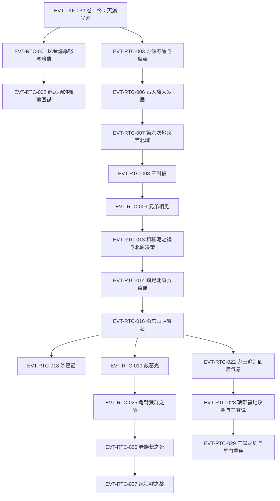

# 王庭之争

弧五枢纽页：狐仙福地收尾（第六次地灾、方正交易、和稀泥之祸）→ 定仙游赴北原 → 冒名常山阴立足葛家与狼群滚雪球 → 琅琊福地三蛊之约与星门重连狐仙福地；英雄大会、王庭之争、黑楼兰结盟与八十八角真阳楼随标段二之后核验。本页按 schema v2.1 组织 RTC 簇事件链，前情承接 EVT-TKF-032（定义于[三王福地](three-kings-mountain.md)）。本批核验标段一＝段三 75384–86000 行（第一节《凤九歌》至第六十一节《没有什么不能出卖的》开头，节 61 主体随标段二）。支线缺口见《待核对》。

## 原著明确内容

### 标段一（上）：狐仙福地与第六次地灾（段三 75384–78806 行，第一节至第二十节）

- 凤金煌暴怒与仙鹤门赔偿：凤金煌静修失败暴怒，几息间摧毁整座山谷、誓要方源生不如死（75384–75447）；凤九歌致信仙鹤门索赔一只仙蛊（75448–75487），太上大长老命鹤风扬赔出我素蛊、负责到底（75658）[叙事|已核]。
- 鹤风扬的福地图谋：等第六次地灾（外界仅剩三个月）造成福地漏洞，先以方正"以情动之"劝方源交易（"奴隶蛊就是一个好方法"），最终目标夺取定仙游——"这些东西，再增上三倍，也不及一个狐仙福地啊。更何况还有一只定仙游蛊呢？"（75528–75592）[对话|已核]（说话人：鹤风扬）。
- 方源苏醒与福地盘点：荡魂行宫昏睡七天七夜、伤了魂（75734）；福地六百万亩、时间流速外界五倍、狐群四百七十万、南部地下石人部落（75810、75970）；青提仙元七十八颗半（75992）；[信念|已核]（主体：方源）前世伙同近十位魔道蛊仙攻打此福地惨胜、只剩他与宋钟，动念杀宋紫星使宋钟不出生（75750–75758）。
- 荡魂山胆石与人祖传生死门：定仙游每次服用一颗仙元、六年免喂（76022）；胆识蛊治愈魂伤、魂魄至少比原先增强五倍（76240）；《人祖传》人祖闯生死门三关——荡魂山（胆识）、落魄谷（信念）、逆流河（不可停步）（76100–76235）[叙事|已核]。
- 未来大计：定力、奴双道；第二空窍蛊还需神游蛊——喝四种极品美酒可凝成（南疆飞家壮思飞、东海醉仙翁酒海、北原王庭长生酒）（76288–76300）；春秋蝉不能赌第三次重生、须寻一举成功蛊/马到成功蛊/水到渠成蛊（76304）[叙事|已核]。
- 石人族大发展：方源强令开凿运河——"你们住在这里，就是我的奴隶！"（76410）；借岩勇假戏使其成八部领袖、两度假托白石老族长遗言（76506–76582，998 岁白石老族长实已被杀魂炼成胆石 76746–76754）；葬魂蟾收集战场亡魂培育胆石、魂魄达常人六倍（76644–76656）；方源自白"仇恨和恐惧的力量，会比感恩更庞大呢"（76776）[对话|已核]（说话人：方源）。
- 第六次地灾·泥沼蟹与弃北域：荒兽泥沼蟹自白光圆门降临、喷吐泥沼瞬成上百万蟹军（77092–77144）；地灵每颗青提仙元挪移一次（77188）；方源弃整个北部地域一百万亩（77380），魅蓝电影差十里被困北域、随弃地落到中洲（77406）；泥沼蟹死、地灾撑过（77442）[叙事|已核]。
- 有失有得与三封信：丧失一百多万亩地、仙元余七十一颗、狐群剩三十一万、蛊虫损失七十多万（77464）；三天后收到地灾日塞入的三封信——凤九歌替女约战（"赌上灵缘斋和仙鹤门的荣耀"77570）、剑一生咒骂挑战（77592）、电文纸鹤蛊告知"方正他还活着？"（77612）[叙事|已核]。
- 兄弟相见：方源割弃整整一百万亩福地抛出，天梯山群蛊仙哄抢（77804–77818）；方正被挪移入福地怒骂屠族，方源自称"我可是你的救命恩人呢"、拒绝长老之位只谈交易（77876）；"元石我没有，不过我却有荒兽泥沼蟹的尸体可以代替元石交易"（77890）[对话|已核]（说话人：方源）。
- 仙鹤门交易一：五百万块元石（77952）、泉蛋蛊三只（77956–78064）、紫晶舍利蛊一只先给（78000–78010）、羽化酒一坛（78020）；三只泉蛋蛊种下后石人人口一天扩大十倍、第三天傍晚达三十万（78110–78114）[叙事|已核]。
- 百人魂与石人奴役：炼 159 只银盏蛊、155 只金杯蛊、合炼三只四转金杯银盏蛊（78168–78280）；借胆识蛊将魂魄推至一百倍"百人魂"极限——再增即魂爆身亡（78224–78230）；一个月后凭九眼酒虫晋升四转巅峰（78274）；石人分裂三部各约十万，三转奴隶蛊控制岩勇等三族长（78294–78306）[叙事|已核]。
- 洞地蛊斗智与卖六万石人：方源谎称改良洞地蛊秘方要求自炼，鹤风扬反复削减材料后拿到子蛊反推三天，狂怒发现"这明明就是寻常的洞地蛊秘方！"（78466）；方源借石人"地母信仰"、由地灵变声假冒大地母亲，诱三族联军六万石人跳入地裂大嘴直传飞鹤山卖给仙鹤门（78560–78604），净落一百六十多万元石（78614）[叙事|已核]。
- 和稀泥仙蛊之祸与北原决策：泥沼蟹生前用一次性消耗仙蛊和稀泥蛊（六转、全天下唯一）侵蚀荡魂山，山腰以下胆石十颗有六颗是黄泥（78680–78694）；三案——西漠孙醋化石蛊、东海海市福地"东山再起"、北原太白云生（宙道六转仙蛊江山如故之主、此蛊还未诞生），选定混乱的北原（78722–78752）；合炼五转推杯换盏蛊（78796）[叙事|已核]。

### 标段一（中）：踏足北原与冒名常山阴（段三 78808–82400 行，第二十一节至第四十一节开头）

- 踏足北原救葛谣：腐毒草原少女葛谣被数百毒须狼群围困，方源裸身传送抵达、四转金龙蛊两击杀百兽狼王（78814–78890）；化名"你就叫我常山阴好了"（78910）；跨域压制——四转巅峰真元在北原只相当于三转巅峰效用（78970）[叙事|已核]。
- 荒原同行：葛谣自述逃婚（被许配蛮家三子蛮多）（79046–79056）；方源欲擒故纵诱其同行（78984–78988）；鬼脸葵海草傀开道、影鸦空战、地刺鼠区（79290–79566）；皓珠蛊封印定仙游（79402–79408）[叙事|已核]。
- 白骨车轮收服：踏入二十多年前战场，葛谣认出"常山阴？你是狼王常山阴！"（79658）；哈突骨遗五转蛊战骨车轮袭来，缠斗两个多时辰后收服到手（79676–79728）[叙事|已核]。
- 常山阴身世：常山阴与哈突骨玩伴变死敌、哈突骨毒杀其母、决战两败俱伤后以狼胎地葬蛊入地沉眠；本应三十多年后被马鸿运救活，成四大将"天狼将"、七转蛊仙，抗中洲战死后由后人做传——这也是方源知情之由（79778–79828）[叙事|已核]。
- 杀常山阴冒名顶替：方源拔出狼尾放出真身常山阴、趁机捏死这个"未来七转的蛊仙"（79864）；其空窍内龟息蛊封存八只四转奴道珍稀蛊，借春秋蝉全部炼化（79870–79884）；黑蚁剥皮种花炼出人皮蛊、生生剥换全身皮肤彻底变成常山阴（79896–79996）；编造"魂魄夺舍游荡二十多年"谎言（80044）[叙事|已核]。
- 埋藏定仙游与狼群滚雪球：采得三只雪洗蛊（80132）；铁柜蛊隔绝仙蛊气息、五转地藏花王埋入地底深处——"才算真正彻底的，将仙蛊定仙游隐藏起来"（80142–80166）；一路收服百兽狼王，狼群达两千多头、四头百兽狼王（80216）[叙事|已核]。
- 推杯换盏蛊验证：两只一套经空穴交换物资书信（福地内过去一个月，草原才五六天），南疆中洲蛊虫元石尽数送回福地（80252–80344、80846–80848）[叙事|已核]。
- 杀葛谣：葛谣受"常山阴传说"感动正式求婚（80422），方源许诺"独自斩杀千兽王就娶你"，葛谣浴血斩杀千狼王归来（80570）；方源拥抱后一匕首刺入心口，以《人祖传》石人故事作答——"石人啊，我本来不想杀你。但是你阻挡我通往成功的路啊。"（80608）；动机："她知道的东西太多了，在方源的心中，早就是必杀的目标"（80764，知定仙游、埋蛊、推杯换盏）；魂魄由葬魂蟾吞下送福地荡碎（80796）[叙事|已核]。
- 救葛光与首只千狼王：葛家少族长葛光被三千多头风狼围困（80956）；方源以四转狼嚎蛊（方圆八百步狼群战力暴涨两倍）碾压战局、最后一支三转驭狼蛊收服风狼王——"方源得到了第一只千狼王"（81068–81158）；顺势受邀往葛家做客（81184）[叙事|已核]。
- 葛家认亲与市集采购：五天后抵葛家营地，自报常家元风一脉山字辈、父常胜纯母常翠，老族长确认英雄身份并赠一百万元石（81360–81412）；方源建议北迁依附黄金家族被拒——"距离大风雪，只剩下一年多的时间"（81464）；市集十三天：奴隶市场（女奴三两元石）、力道蛊价目（斤力 220／十钧之力 36000 元石）、狼魂蛊 7700 元石×8、驭狼蛊秘方与存货（81554–81838）；马鸿运前世发迹史、"现在恐怕已有十三岁"（81630）；北原七转蛊仙楚度（霸仙）——研发斤力/钧力蛊、炼六转仙蛊"力贯千钧"、后战死于凤九歌之手（81762–81778）[叙事|已核]。
- 蛮家挑战与示好：葛谣死讯传回（搜寻队只找到衣服碎片、判定死于毒须狼群 81892），老族长一病不起、葛光代理族长（81902–81904）；蛮多带石武上门，方源拒五十万收买、接十万元石赌战击倒石武不杀——"通过战斗得来的十万元石，我却觉得沉甸可贵"（82058–82070）；蛮图震动"但如果是真的，那北原就又多出一个人物了"（82200）；蛮家赠上百只骨竹蛊示好，方源修复战骨车轮最深裂痕（82232–82294）；野外夜宴疑云——乌云来去蹊跷"恐怕是蛊师出行，而自己埋下定仙游蛊，还不到一个月"（82382）[叙事|已核]。

### 标段一（下）：鬼王追踪、葛家保卫战与琅琊福地三蛊之约（段三 82401–86000 行，第四十一节至第六十一节开头）

- 鬼王追踪仙蛊气息：阴云向南急行五千里至无名山丘、红光如太阳绽放（82388–82400）；六转魂道蛊仙鬼王向红玉散人交割三百五十万只熔岩蝙蝠、约定共闯琅琊福地（82420–82457）；北归途中循定仙游气息追踪至雪柳线索中断（82536–82548）——实为方源铁棺蛊分段封印制造思维惯性、令其钻进"毒蝎娘子夺蛊"死胡同（82736–82742）[叙事|已核]。
- 酒宴验烟危机：蛮多当众以追烟蛊显形试探，方源主动催验并以"毒须狼吞食葛谣、狼体沾烟"解释——"狼群当中的几头毒须狼，身上染着比方源还要更加浓郁的追烟"（82690）；葛光提议五转蛛丝马迹蛊验证、毫无异变洗清嫌疑，老族长当场赠蛊赔礼（82714–82817）[叙事|已核]。
- 老族长密谈与蛮家阴谋：密室训子"当我们力量不足时，就要用智慧来弥补"（82898）；方源以市价加两成高价求购信令蛮家反白送（83034–83052）；蛮家三万担粮草内藏引狼蛊、前方三支万狼群埋伏——"给葛家造成更多的损失吧"（83096、84656）[对话|已核]（说话人：蛮豪、蛮图）。
- 龟背狼群之战与狼人魂：三万八千多只龟背狼来袭（83218），方源献策引水成渠克制不能泅水者（83222–83226）；连收百狼王与千狼王（83314–83776）；八头千狼王围耗万狼王致死、尸出四转驭狼蛊转赠方源（83734–83848）；狼魂蛊用尽——"百人魂彻底转为狼人魂"（83902），收服上限扩至三倍多（83914）[叙事|已核]。
- 夜袭、老族长之死与夜狼王收服：蛮家家老石武屠葛家侦察蛊师，上万夜狼夜袭营地（83940–84000）；方源热血演说激醒众家老——葛光"其他人怕死，但我葛光愿意随你赴死！！"（84184）；老族长吞火蛊战夜狼王重伤，方源借天青狼皮蛊假装"昏迷"避战（84452–84478）；方源"苏醒"以四转驭狼蛊收服夜狼王（84538–84558）；老族长伤重不治——"三十八岁上位，八十七岁战死沙场的葛家族长"（84600）[叙事|已核]。
- 风狼群之战与葛家代价：蛮图仍放第三波风狼群（84656）；方源主动迎战大胜、斩风狼万兽王，狼群膨胀至三万五（84664）；葛家代价：凡人死上万、家老折半、老族长阵亡（84670）；"毕竟现在的方源，已经有能力屠戮整个葛家了"（84702）；新族长葛光送四转无常骨致谢（84672）[叙事|已核]。
- 奴道喂养困境与琅琊福地方向：方源盘点——四转巅峰但北原异域压制真金真元只当淡金初阶（82916–82920）、狼人魂、三十钧力量；洞地蛊出不了中洲、星门蛊成功率百中无一、狐仙福地开门引星光会放进魅蓝电影——寄望琅琊福地（84822–84870）[叙事|已核]。
- 琅琊福地攻潮与地灵设局：鬼王、红玉散人、花海三仙齐聚月牙湖，趁地灾"万雷电雨"撕开的漏洞轮流投入青提仙元对耗（上百轮＋五十轮＋三十轮）骗得福地"仙元耗尽"、五仙入内（84872–85063）；实为琅琊地灵故意示弱设局——天元宝皇莲白荔仙元从未枯竭（85600），五仙兵败被俘为仆（85592–85610）[叙事|已核]。
- 长毛老祖与三尊说：琅琊福地故主为"古往炼道第一仙"长毛老祖——八转、横跨盗天巨阳两代、一生至少炼成三十八只仙蛊、死后化琅琊地灵（84916–85008）；挚友一言仙（八转智道）耗五十载阳寿测出三尊说：幽魂魔尊、乐土仙尊之后将出大梦仙尊，遁空蛊难题将在其手中解决（85120–85135）[叙事|已核]。
- 方源入琅琊福地：[信念|已核]（主体：方源）按前世记忆找到组成"盗"字的石林、坐上马鸿运当年的石凳、血涂紫柱说出"想要"二字入内（85096–85142）；琅琊地灵一眼看穿人皮蛊伪装（人皮、愧梅子、秋声草、丹火蛊、药力蛊），方源亮明"魔尊当年约定的暗号么？哈，那就是没有暗号"、以盗天魔尊继承人身份压制（85186–85221）[对话|已核]（说话人：方源）。
- 换蛊与三蛊之约：领先时代的五转秘方换通天蛊、星门蛊秘方换神念蛊（85224–85354）；天元宝皇莲不换（地灵命根）；三蛊之约细则——"你有三次机会，让我给你炼蛊。但是炼制仙蛊，不管成功还是失败，都算一次。若是炼制凡蛊，我一定会将炼成的蛊交到你的手中"（85522）；方源拍板耗一次机会炼星门蛊（85570）[对话|已核]（说话人：琅琊地灵）。
- 星门重连狐仙福地：地灵以通天蛊＋神念蛊联宝黄天购二十份材料，第三次炼成一对星门蛊（85754–85784）；琅琊福地时间流速为外界三十六倍（85664）；用八只涸泽蛊把推杯换盏蛊从四转顶到五转，将通天蛊、神念蛊、一只星门蛊传回狐仙福地（85820–85874）；久候星门不亮之际方源心境澄明——"今夜的星空，真是美丽啊"（85920）；跨星门重返狐仙福地与小狐仙团聚（85942–85958）；狐仙福地星光仅靠五百余只三转星萤蛊群、开门耗三十二只、维持时三呼吸死一只（85972–85976）[叙事|已核]。

## 事件链（RTC 簇·标段一）

| 事件 ID | 事件 | 前因 | 参与者 | 后果/因果指向 | 证据 |
|---|---|---|---|---|---|
| EVT-TKF-032 | 卷二终：天瀑光河人祖传之景 | EVT-TKF-030 | 方源、全场蛊师 | 弧五开启 | E:V2-075012（定义页：[三王福地](three-kings-mountain.md)） |
| EVT-RTC-001 | 凤金煌暴怒与仙鹤门赔偿 | EVT-TKF-032 | 凤金煌、凤九歌、鹤风扬 | 索赔我素蛊落定；鹤风扬主责方源事务 | E:V3-075436、075658 |
| EVT-RTC-002 | 鹤风扬的福地图谋 | EVT-RTC-001 | 鹤风扬、方正 | 等第六次地灾漏洞、以方正劝降、目标定仙游 | E:V3-075586 |
| EVT-RTC-003 | 方源苏醒与福地盘点 | EVT-TKF-032 | 方源、地灵小狐仙 | 昏睡七日伤魂；家底锚定；杀宋紫星之念 | E:V3-075734、075766 |
| EVT-RTC-004 | 荡魂山胆石与人祖传生死门 | EVT-RTC-003 | 方源 | 魂伤痊愈增五倍；定仙游一颗仙元六年免喂 | E:V3-076022、076240 |
| EVT-RTC-005 | 未来大计与神游蛊四酒 | EVT-RTC-004 | 方源 | 力奴双道；第二空窍需神游蛊；北原王庭长生酒 | E:V3-076288 |
| EVT-RTC-006 | 石人族大发展（假戏与运河） | EVT-RTC-003 | 方源、岩勇、地灵 | 岩勇傀儡领袖；运河；葬魂蟾育胆石 | E:V3-076410、076656 |
| EVT-RTC-007 | 第六次地灾·泥沼蟹与弃北域 | EVT-RTC-006 | 方源、地灵、泥沼蟹、魅蓝电影 | 泥沼蟹死；魅蓝电影落中洲 | E:V3-077380、077406 |
| EVT-RTC-008 | 有失有得与三封信 | EVT-RTC-007 | 凤九歌、剑一生、方源 | 约战/挑战/方正还活着三线入局 | E:V3-077464、077570 |
| EVT-RTC-009 | 兄弟相见 | EVT-RTC-008 | 方源、方正、鹤风扬 | 割弃百万亩；拒长老之位；泥沼蟹尸体代元石 | E:V3-077804、077890 |
| EVT-RTC-010 | 仙鹤门交易一 | EVT-RTC-009 | 方源、鹤风扬 | 500 万元石/泉蛋蛊 3/紫晶舍利 1 | E:V3-077952 |
| EVT-RTC-011 | 百人魂与石人奴役 | EVT-RTC-010 | 方源、岩勇 | 魂魄百倍极限；四转巅峰；三部奴隶蛊 | E:V3-078224、078274 |
| EVT-RTC-012 | 洞地蛊斗智与卖六万石人 | EVT-RTC-011 | 方源、鹤风扬、岩勇 | 净落 160 多万元石；鹤风扬反推失败狂怒 | E:V3-078466、078604 |
| EVT-RTC-013 | 和稀泥仙蛊之祸与北原决策 | EVT-RTC-007 | 方源 | 荡魂山侵蚀；三案选北原；推杯换盏合炼 | E:V3-078694、078726 |
| EVT-RTC-014 | 踏足北原救葛谣 | EVT-RTC-013 | 方源、葛谣 | 化名常山阴；跨域压制三转巅峰效用 | E:V3-078910、078970 |
| EVT-RTC-015 | 荒原同行与白骨车轮收服 | EVT-RTC-014 | 方源、葛谣 | 五转战骨车轮到手 | E:V3-079658、079726 |
| EVT-RTC-016 | 杀常山阴冒名顶替 | EVT-RTC-015 | 方源、常山阴 | 捏死未来"天狼将"；八只四转奴道蛊；人皮换皮 | E:V3-079864、079996 |
| EVT-RTC-017 | 埋藏定仙游与狼群滚雪球 | EVT-RTC-016 | 方源 | 铁柜+地藏花王藏蛊；狼群两千余 | E:V3-080166、080216 |
| EVT-RTC-018 | 杀葛谣 | EVT-RTC-015 | 方源、葛谣 | 斩千狼王后遇刺；葬魂蟾送魂 | E:V3-080608、080764 |
| EVT-RTC-019 | 救葛光与首只千狼王 | EVT-RTC-017 | 方源、葛光、风狼王 | 千狼王到手；受邀葛家 | E:V3-081158 |
| EVT-RTC-020 | 葛家认亲与市集采购 | EVT-RTC-019 | 方源、葛家老族长 | 认亲；百万谢礼；力道价目；马鸿运/楚度情报 | E:V3-081362、081762 |
| EVT-RTC-021 | 蛮家挑战与示好 | EVT-RTC-020 | 方源、石武、蛮多、蛮图 | 十万元石赌战胜；骨竹蛊百只示好 | E:V3-082070、082232 |
| EVT-RTC-022 | 鬼王追踪仙蛊气息 | EVT-RTC-021 | 鬼王、红玉散人 | 熔岩蝙蝠交割；追踪至雪柳中断；铁棺骗过 | E:V3-082420、082736 |
| EVT-RTC-023 | 酒宴验烟与蛛丝马迹 | EVT-RTC-021 | 蛮多、方源、葛光 | 毒须狼烟洗清嫌疑；获赠蛛丝马迹蛊 | E:V3-082690、082812 |
| EVT-RTC-024 | 老族长密谈与蛮家阴谋 | EVT-RTC-023 | 葛家老族长、蛮图 | 引狼蛊粮草＋三支万狼群埋伏 | E:V3-082898、083096 |
| EVT-RTC-025 | 龟背狼群之战与狼人魂 | EVT-RTC-024 | 方源、葛家 | 3.8 万龟背狼；收千狼王；狼人魂转化 | E:V3-083218、083902 |
| EVT-RTC-026 | 夜袭、老族长之死与夜狼王收服 | EVT-RTC-025 | 石武、方源、葛光、老族长 | 老族长战死；夜狼王到手 | E:V3-084184、084600 |
| EVT-RTC-027 | 风狼群之战与葛家代价 | EVT-RTC-026 | 方源、蛮图、葛光 | 狼群三万五；葛家重创；可屠葛家 | E:V3-084664、084702 |
| EVT-RTC-028 | 琅琊福地攻潮与三尊说 | EVT-RTC-022 | 鬼王、红玉散人、花海三仙、琅琊地灵 | 五仙被俘；长毛老祖/一言仙三尊说 | E:V3-084916、085120 |
| EVT-RTC-029 | 三蛊之约与星门重连狐仙福地 | EVT-RTC-028 | 方源、琅琊地灵、小狐仙 | 通天/神念入手；星门炼成；重返狐仙福地 | E:V3-085522、085920 |

## 资料整理

以下条目来自读书笔记整理转述，尚未完成逐段原文核验，不得当作原著原文事实。

- 笔记 C（90,001–135,000 行）头部总览对本弧后续的覆盖线索：北原王庭之争尾声→真阳楼攻略→方源升仙（仙僵）→北原夺运道真传→回狐仙福地立威→胆识蛊贸易→繁星洞天探险→星象福地到手（notes:game/分支：六卷精编版/读书笔记/C-90001-135000.md）。英雄大会与王庭之争主战场、八十八角真阳楼、巨阳意志、太白云生升仙等随标段二至四核验。
- 弧线切分口径（笔记层级）：弧五≈常山阴入局至八十八角真阳楼炼化，弧六≈碎第二空窍升仙起——story-arc-overview 自注为粗切分，多线并行先后未逐事件拆分。
- 笔记 B（45,001–90,000）覆盖本标段原文域 75,384–90,000；本批已逐窗回读原文取代笔记层级表述，笔记仅保留指向。

## 待核对

- 标段一窗口止于 86,000 行：节 61《没有什么不能出卖的》（85,952 起）主体内容随标段二核验。
- 原文屏蔽词无法核出：78454"磨了\*\*天"天数、76168 生死门湖名（疑"迷魂湖"，76170 又称"安魂酒"）、77826 剑一生咒骂、78034"十之八九"数字。
- 名称不一致：粉梦仙子（84908）vs 梦粉仙子（85014、85054）；天青狼皮蛊（84446）vs 天青狼毛蛊（84788）。
- 口径注记：地灾倒计时外界"三个月"（75586）与福地内"一年零三个月"（75766）按五倍流速换算一致，引用需注明口径；魂魄增幅"五倍"（76240）与"常人六倍"（76656）基数口径未明说。
- 常山阴沉眠时长两说（79820"三十多年后"被马鸿运发现／79864"续命二十多年，本来再等十年"）——可拼合但叙述错位，引用以行号为准。
- 蛮方情报口径（83116–83118 风狼/毒须狼/水狼各一千多只）系蛮家说法，与方源实际兵力未必吻合。
- 白凝冰本标段未登场，决裂后去向随后续标段核验；定仙游何时从北原取回随其后行程核验。
- 次要支线未单列：驼狼伏击、水狼群幼年异兽、葛谣搜寻队视角、蛮轰/葛参等配角线。

关联页面：[三王福地](three-kings-mountain.md)、[南疆商队与商家城](south-caravan.md)、[方源](../characters/fang-yuan.md)、[黑楼兰](../characters/he-lou-lan.md)、[北原](../world/north-plain.md)、[修炼体系](../world/cultivation-system.md)。
