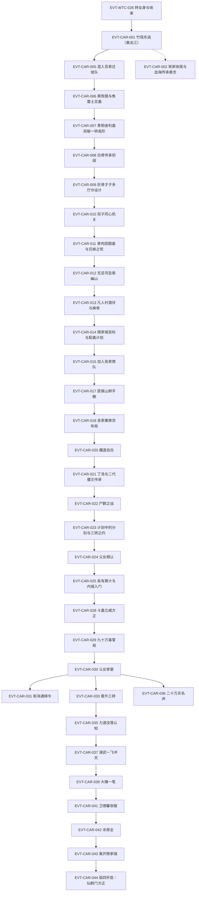

# 南疆商队与商家城

弧三主线：方源与白凝冰自青茅山覆灭南下（黄龙江竹筏→白骨山传承→随张家商队→商家城立足与演武扬名→离开商家城）。本页按 schema v2.1 组织 CAR 簇事件链，前情承接 EVT-WTC-026（定义于[狼潮](wolf-tide.md)）。本批核验标段一至收束段（段二 34590–62164 行，第一节至第一百三十五节《仙鹤门，方正》），弧三主体打穿；支线缺口见《待核对》，弧四（仙鹤门/白狐蛊仙/三王福地）自 EVT-CAR-044 起另行开簇。

## 原著明确内容

### 黄龙江逃生（段二 34590–38320 行，第一节至第十九节）

- 黄龙江地理：南疆第三江，全长八千多公里，发源于黄果山，流经玄冥山、龟背山、青茅山、白骨山、雷磁山等，最后入海；鸟瞰如几字形，贯穿南疆一半有余的面积（34596–34598 行）[叙事|已核]。
- 竹筏东逃：青茅山一战后白凝冰自爆北冥冰魄体暂时困住天鹤上人，二人斩青矛竹扎竹筏、从黄龙江支流汇入主河道顺江而下，一日千里有余（34616–34624 行）[叙事|已核]；方源的千里地狼蛛已死、白凝冰的白相仙蛇此前主动飞走无音讯，二人无蛊虫代步（34618–34620 行）；方源推断铁喙飞鹤王极可能已死（天鹤上人斩古月一代后独自归来），五天水路后接近白骨山（34626–34638 行）[信念|已核]（主体：方源，前世记忆与推断）。
- 铁家收尾：铁血冷战死——铁家清理战场的人称"神捕大人乃是战死，这是铁家男儿荣耀的归属"（35146 行 [对话|已核]）；铁血冷来信提及血海传承，铁家担心生还者中有继承血海传承的魔道蛊师（35150 行 [对话|已核]）；铁若男立誓追查杀父之仇，被同族以药迷倒、命鬼一小组护送回寨（35154–35174 行）[叙事|已核]。
- 捕兽树规则：对任何脱困的猎物，捕兽树都不会再进攻——能脱困的猛兽已非它所能对付，这是无智慧生物进化出的生存本能（35744–35746 行 [对话|已核]（说话人：方源））。
- 正魔道旅行生态：家族蛊师至少五人成行，正道行事顾及身边人看法、更接近平常社会规范；魔道蛊师通常独自行走、警惕性强，凡事首先确定自身安全（36328–36338 行）[叙事|已核]；方源以地听肉耳草侦察，发现半月前独行者篝火遗迹，判定为魔道蛊师（36318–36328 行）[叙事|已核]。
- 混入百家迁徙队：百家元泉已有枯竭迹象、若寻不到新元泉恐步古月后尘（37806 行 [叙事|已核]）；方源在百家宴上以"青茅山覆灭残众"身份装哀戚，借青竹酒落泪引百家共鸣（37790–37804 行 [叙事|已核]）；百陌行试探"何时与族人汇合"，方源以懵懂应答，百陌行与女族长对视起疑，私下议"先下手为强"，女族长却轻笑（37810–37822 行）[叙事|已核]。
- 黑熊猎与焦雷土豆蛊：百家族长以青铜舍利蛊为饵，许"猎到一头成年黑熊即得奖励"（37946 行 [对话|已核]（说话人：百家族长））；方源算准黑熊撤退方向，预挖深坑埋下至少五只焦雷土豆蛊将其坑杀（37980–37990 行）[叙事|已核]；焦雷土豆蛊为二转一次性消耗品，埋地吸取地力成长、受震荡引爆，而白骨山无泥土（山石皆白骨）、此蛊本应被极大削弱（38004 行 [对话|已核]（说话人：百陌行））；百家观察点：方源被其认作古月家少主"方正"，弃用三转护卫、每埋一颗即以元石恢复真元、坚持自己动手（38006 行 [对话|已核]（说话人：百家族长））；方源判读"青铜舍利蛊是个好兆头——百家忌惮那支不存在的古月大部队，不想硬来、想用计谋诓骗"（38074 行 [叙事|已核]）。
- 青铜舍利蛊突破：方源用青铜舍利蛊后修为一下子突破到一转高阶（39504 行）[叙事|已核]（覆灭跌落后修为重建阶段）。

### 白骨山传承（段二 38320–41546 行，第二十节至第三十四节）

- 白骨传承初探：传承大厅皆以骨制成，中央大缸盛满如奶的白色液体——奶泉，白骨山特产，泉水如奶、清甜可口、营养丰富（38944–38958 行）[叙事|已核]；前世百家迁徙至此开发五个奶泉眼，奶泉成为百家特产与商品、每年吸引商队贸易（38960 行 [信念|已核]（主体：方源，前世记忆））；缸中盛满一转骨枪蛊——微型长枪状、通体白，类比古月山寨的月刃蛊，是白骨传承的基础之物，前世曾成百家蛊师装备特征，缸中另有二转蛊（38972–38984 行）[叙事|已核]。
- 灰骨才子的多厅诈设计：传承内多条路线格局相同——各有骸骨与骨书，令闯入者误以为已得全传承；"真正的密藏还隐藏在某个支线上"（39566–39574 行 [对话|已核]（说话人：铁刀苦））；百家（女族长、铁刀苦等）尾随追入，勘探八条路线，凭"骸骨被踏碎、颅骨蛊虫被取走"锁定方白二人路线（39564–39586 行）[叙事|已核]。
- 双子同心机关：狮虎头骨雕像密语"双子同心，三灵合一。有缘无缘，切莫强求"（39778 行 [对话|已核]（说话人：白凝冰诵读））；双子指必须两人合力，三灵指人的心、掌、目（39780–39784 行 [对话|已核]（说话人：方源））；方白二人手贴红宝石瞳孔不动——方源悟出开启者须同心同德，而二人"貌合神离，各有算计"做不到（39790–39802 行）[叙事|已核]；方源转而踢醒俘虏百生、百花兄妹，借这对真正同心的骨肉开启机关（39804–39808 行）[叙事|已核]。
- 骨肉团圆蛊与兄妹之死：方源得偿所愿获得骨肉团圆蛊，得益于百生、百花的情报与牺牲（40058 行 [叙事|已核]）；百家兄妹最终被烧死，白凝冰冷漠旁观——"百家注定是他们的敌人"，但她对有恩之人下不了手（41368 行）[叙事|已核]。
- 无足鸟坠紫幽山：二人经密道逃向白骨山悬崖出口（40050–40056 行），遭百家族长率众追杀（40062–40084 行，白凝冰以血月蛊射出血刃阻敌 [叙事|已核]）；无足鸟载二人飞行大半天、承受爆炸后浑身裂纹坠落紫色山林——方源按行程推断为紫幽山附近，紫幽山白天安全、夜晚极危险（40434–40452 行）[叙事|已核]。
- 凡人村潜伏与换骨：二人以敛息蛊收敛蛊师气息伪装凡人（蛊师之间可感受气息，敛息蛊藏于耳内连一转村长也看不破，41188 行 [叙事|已核]）；商队对外来蛊师很有戒备、对凡人则警惕性弱（41254 行 [叙事|已核]）；铁骨蛊为三转蛊，形如一根骨头、两端圆头中段细长、通体乌黑如钢铁，催用须瞬间消耗大量真元，融化成铁汁融入骨骼、剧痛难忍（41280–41296 行）[叙事|已核]；方源与白凝冰先后承受铁骨蛊、玉骨蛊换骨（41272、41352 行）；同行者预计七日后突破二转初阶（41268 行 [对话|已核]）。

### 标段二：张家商队（段二 40786–47024 行，第三十节至第六十一节）

- 商家城设定与配蛊计划：商家以贸易威名南疆、南疆首富，天下有识者皆知商家是贸易的中心；商家虽是正道领袖之一，商家城却是不折不扣的自由之地、魔道中人最大的销赃处——"如果整个南疆，只剩下两个地方能容得下我们，那商家城必是其中之一"；连武家在这方面都望尘莫及（40786–40790 行 [对话|已核]（说话人：方源））；方源现阶段目标：城中商铺众多，把"相互不搭调"的蛊虫搭配成套，才能发挥更强战力、甚至越级挑战（40802 行 [对话|已核]（说话人：方源））。
- 加入张家商队：随商队者须是蛊师大人的家奴，凡人不得随意跟随（41566 行 [对话|已核]（说话人：老村长））；方源、白凝冰以凡人身份经老村长说情加入商队（41570 行）；方源马甲"黑土"（43546 行）。
- 商队随行集市：商队傍晚宿营时自发形成小集市（兽肉、酪浆、衣物等摊贩）——"有消耗就会有交易，有消费就会刺激市场"（41756–41768 行 [对话|已核]（说话人：方源））；方白二人摆摊出售紫幽山紫枫叶（41550、41772 行）。
- 匪猴山掰手腕：商队遭上千只匪猴围困——成年匪猴高达一丈、上臂比下肢粗壮两倍有余、猴尾如铁棍，猴王坐石凳旁置灰石酒坛（42804–42824 行）[叙事|已核]；"猴、狐、狈这类野兽，都有智慧"（42832 行）[叙事|已核]；过山规矩是与猴王掰手腕，只能凭自身气力、动用蛊虫即属作弊、会引来猴群攻杀，此前多名蛊师（一熊之力、一马之力者）皆告骨折（42950 行 [对话|已核]）；方源出战，猴王称其为"有史以来力量最强的人类"——双猪之力＋半鳄之力＋自身之力，且洞见掰手腕只看臂腕力量、匪猴自幼训练上肢占优，方源稳胜不败（43022–43048 行）[叙事|已核]。
- 金家寨换货布局：商队途经金家寨临时集市，方源（黑土）大肆换货，换进三车卖不出去的金簪草，小蝶、张柱斥为胡闹，商心慈部分辩护（43538–43564 行 [叙事|已核]）；张柱言"将来到了商家城也能少奋斗一些"（43558 行 [对话|已核]）。
- 商心慈身世：无修行资质的凡人、私生子出身、在张家受排挤，身边唯有一位忠心耿耿的三转蛊师护卫，美貌反成招祸之源（44102–44106 行 [叙事|已核]）；白凝冰百思不解方源为何如此大费周章地投资于她（44098–44110 行）。
- 魔道自白：方源向商心慈明言"我和白云，皆是魔道中人"、"都有命案在身"，商心慈早有预料（张柱亦有猜测）而接受——她早熟、对世界本质有深刻认知、别无选择（44742–44750 行 [对话|已核]（说话人：方源））；方源约定以张家蛊师身份出现、请她圆此身份，并承诺"还清恩情即悄然离去"（44756 行）。
- 丁浩与二代僵王传承：山野村夫丁浩原为商队劳力，其队经墓碑山遭大批僵尸围杀、他被舍弃当炮灰；逃入山洞得魔道传承——魔道蛊师屠家族立碑留下隐秘传承，非凡人不能继承；丁浩开窍修行八年余至三转，资质由丙等提升至乙等；最后考验为斩杀千人攒僵尸大军（白毛/黑毛/青毛各有数量标准，蓝毛僵尸一个即达标），之后可赴沼泽山拜二代僵王为师（45578–45600 行 [叙事|已核]）。
- 尸群之战与方源操控：丁浩率僵尸群围攻商队；方源当众喊出"丁浩"之名破其心防——丁浩八年从未露马脚，闻之名"脑海中炸雷"、青僵黑僵俱静止；方源假称"恩师二代僵王所述"（45982–46002 行 [对话|已核]（说话人：方源，诈语））；丁浩按方源吩咐加大冲势冲垮商队阵线，商队只剩三十余人，突围中众人欲弃凡人，方源只护商心慈与小蝶（46140–46154 行）[叙事|已核]。
- 计划中的分别与三转之约：抵商家城前方源按计划"失踪"（46438–46454 行）；白凝冰真正在意的是方源手中的阳蛊（46454 行 [叙事|已核]）；方源修为已达二转巅峰，当初与白凝冰所设三转之约已到最后关口，但方源不会守约——"诚信这种东西，不过是无可奈何之下的妥协……一张逼真的面具"，白凝冰也清楚，故而焦躁（46842–46848 行 [叙事|已核]）。
- 父女相认：商燕飞（黑袍血发英俊男子）以血焰瞬移现身商家外城，循血脉感应找到正在摊前选购的商心慈——离别方源后她心情低落（46624–46652 行）[叙事|已核]。
- 商家内城入门：入内城每人需一百块元石，方源缴纳两百块元石带白凝冰入城；内城街道宽阔可十辆马车并行，蛊师随处可见（一转满地走、二转掺杂、偶尔三转），凡人稀少；照明用燃烧长久无烟雾的火炭石，建筑统一为耐热红色岩石，街道每五百步立巨柱（47008–47032 行）[叙事|已核]。

### 标段三：商家内城（段二 47008–60102 行，第六十二节至第一百二十三节）

- 骨枪蛊变现与价格表：方源在通幽商铺出售骨枪蛊——市价参照：酒虫五百八十、书虫约六百、黑白豕蛊六百（皆一转珍稀蛊），普通一转蛊约二百五十，生机叶五十一片；骨枪蛊从三百一十讨价至三百二十成交、一次出手五十六只（47242–47266 行）[叙事|已核]。
- 商睚眦冲突：商睚眦已尝少主权位滋味，视方白为大敌，但方白住第三内城楠秋苑，"给商睚眦一百个胆子也不敢在这里动粗"，只能等待考评后另图（47540–47564 行）[叙事|已核]。
- 斗蛊立威"我名叫方正"：方源与白凝冰合力战魏央——方源以螺旋骨枪（二转、钻劲擅破防）牵制，白凝冰观其"力气未经蛊虫永久性改造、只是常人气力"以拳脚制敌（47974–48002 行）[叙事|已核]；方源以"方正"之名行走商家城（节题第一百零七节《我名叫方正》，47974 行）。
- 九十万毒誓局：方源与商睚眦达成九十万元石的交易，以毒誓蛊立誓——该蛊为三转消耗蛊、紫红色小虫、口器狰狞、吸食心血（48372–48390 行）[叙事|已核]；节题《大大低估了方源的无耻》（48152 行）埋其毁约伏笔，"毒誓漏洞"的后文兑现待核验。
- 认女家宴：商燕飞当众宣布商心慈为其女——"如今她已经不姓张，而姓商"，方白以救女之恩受商家一家敬酒；商睚眦由此得知方白底细，怀恨而藏（"待我渡过这次考评，再来慢慢对付你们"）（48712–48736 行）[对话|已核]（说话人：商燕飞、商睚眦内心）。
- 拒消通缉令：商燕飞提出由商家出面消除百家通缉令，方源拒绝——被打上商家标签将阻碍"接近魔道中人、靠拢义天山的大事"，短期有益、长远有害；他前世通缉令足有上百张，血翼魔教立教后许多家族反而主动撤销——"终究一切还得是实力说了算"；计划在商家城待两三年（48922–48946 行）[叙事|已核]。
- 紫荆令牌与少主格局：方源、白凝冰皆得紫荆令牌；大家族少主明争暗斗（有底蕴可供折腾），普通家族（古月寨、白家寨）则主动避免少主内斗、专心培养一人（49622–49634 行）[叙事|已核]；方源自称"曾经是古月家的少族长"拉近少主关系（49632 行）[对话|已核]。
- 晋升三转：白凝冰以骨肉团圆蛊将自身真元转化灌输方源（经蛊转化后只能由方源调用），助其冲破二转巅峰晶膜窍壁——方源资质有限，须借人兽葬生蛊外力冲刺三转（49814–49842 行）[叙事|已核]。
- 三转职业分化讲堂：魏央授业——养用炼为蛊师修行三大方面；三转在山寨必为家老，须确定发展方向并打造蛊虫组合体系；职业划分：治疗蛊师（医师，地位崇高）、存储（后勤）、侦察、合炼推衍、谋略、移动（魏央核心蛊光虹蛊）、代练、捕虫等（50192–50224 行）[对话|已核]（说话人：魏央）。
- 力道没落时代与自力更生蛊：自力更生蛊为三转治疗蛊、力修绝配——力量越强疗效越强（方源双猪一熊一鳄之力下疗效与肉白骨持平且持续提升），弊端是只能自用、且为珍稀蛊高达四万五千块元石（比剑影蛊贵）；"这是个力道没落的时代"——力道蛊师多在底层干苦力，傲立巅峰者纵观南疆唯武姬娘娘一人（凭上古力道传承）（53796–53820 行）[叙事|已核]。
- 二十万买名声：商燕飞以元老蛊当众取出二十万元石酬谢方源——"十万元石不能抵消这份情，给你二十万元石，我心才安"，满座瞠目（52714–52722 行）[对话|已核]（说话人：商燕飞）。
- 演武场连胜与一飞冲天：方源以李然（潜伏八年的卧底）为情报盟友备战演武场（53270–53294 行）[叙事|已核]；李好曾为力修、因"力道前期强中后期孱弱、积弊难返"弃力道改辅助流（53286 行 [对话|已核]（说话人：魏央））；最终方源（方正）以三转巅峰堂堂正正击败四转巨开碑——巨开碑施展杀招巨灵变（三龙象力）仍被"八大兽影"攻势压制、主动认输，近千人观战、无取巧；方源故意散布假消息，将力气蛊来历引向古月家族珍藏（59590–59812 行）[叙事|已核]。

### 标段四：弧三收束（段二 60102–62164 行，第一百二十四节至第一百三十五节）

- 演武情报生意与三王传承投机：商心慈提出收集演武场蛊师资料贩卖、请名流战前预测战后点评——方源前世在武家用过此创举、轰动一时后被武家打压半年而败（60106–60118 行 [对话|已核]（说话人：商心慈；前世部分为 [信念|已核]））；方源令其"先不忙"，商心慈以性命相托式信任回应（60124–60128 行）；方源依靠三王传承的确切情报（前世记忆）投机囤积、大赚一笔（60500–60504 行 [叙事|已核]）。
- 大赚一笔：十天平均日赚两万——商心慈十万本金翻至三十万，在少主竞争中领袖群伦；方源资产上涨到两百四十多万、元老蛊添至三个；白凝冰亦获利，并疑惑方源的情报来源（60486–60506 行）[叙事|已核]。
- 少主派系与战力估值：商囚牛为当今少主中第一大派系；商囚牛主动邀商心慈——只因"商心慈身边有方白两大四转战力"，为众少主不具备、羡慕嫉妒（60814–60822 行）[叙事|已核]（"四转战力"为战力评估口径，与方源三转巅峰修为的精确关系待核验）。
- 卫德馨收服：方源一语道破卫德馨怀孕之秘，以前世记忆压制——前世卫德馨助商蒲牢胜商囚牛成少族长热门，后正魔大战中与卫神经秘密接洽助武家谋算商家、卫家山寨被一举铲除（报杀夫之仇），商蒲牢受牵连被贬流放——"成也卫德馨，败也卫德馨"；方源令其辅佐商心慈、许诺助其培养腹中之子，并点破卫神经已被武家招揽、处在监视中（61528–61548 行）[对话|已核]（说话人：方源，前世记忆部分 [信念|已核]）。
- 杀周全：前周家族长周全（周家灭亡后重伤独活）拒绝臣服商心慈、自恃高傲"怎么可能屈居于一个黄毛丫头"；方源竟愿付出紫荆令牌的昂贵代价取其性命——周全悔恨"早知道如此，我从了那女娃也就算了"（61906–61926 行）[叙事|已核]。
- 离开商家城：节题锚定（61902 行），出发细节待核验。
- 弧四开启：叙事切至五域总述（东海、西漠、北原、南疆包拢中洲——中洲幅员辽阔绵延亿里、元气最充裕、门派林立、整体实力最强）；中洲南部群山之上三万丈、云海之巅悬空着飞鹤山（仙鹤门所在）——方正线开启（62108–62126 行）[叙事|已核]。

## 事件链（CAR 簇·标段一）

| 事件 ID | 事件 | 前因 | 参与者 | 后果/因果指向 | 证据 |
|---|---|---|---|---|---|
| EVT-WTC-026 | 转女身与收束 | — | 白凝冰、方源、天鹤上人 | 弧二终点，二人逃离青茅山 | E:V1-034508（定义页：[狼潮](wolf-tide.md)） |
| EVT-CAR-001 | 竹筏东逃（黄龙江） | EVT-WTC-026 | 方源、白凝冰 | 顺江一日千里，五日近白骨山 | E:V2-034596 |
| EVT-CAR-002 | 铁家收尾与血海传承悬念 | EVT-WTC-026 | 铁若男、铁家蛊师 | 铁血冷战死确认；血海传承下落成追查线 | E:V2-035146 |
| EVT-CAR-003 | 捕兽树与主导权 | EVT-CAR-001 | 方源、白凝冰 | 白凝冰脱困；捕兽树规则揭示 | E:V2-035744 |
| EVT-CAR-004 | 魔道独行痕迹 | EVT-CAR-001 | 方源、白凝冰 | 正魔道旅行生态规则呈现 | E:V2-036328 |
| EVT-CAR-005 | 混入百家迁徙队 | EVT-CAR-004 | 方源、白凝冰、百家女族长、百陌行 | 以青茅残众身份渗透；起疑未破 | E:V2-037806 |
| EVT-CAR-006 | 黑熊猎与焦雷土豆蛊 | EVT-CAR-005 | 方源、黑熊、百陌行、百家族长 | 坑杀黑熊；青铜舍利蛊饵局被识破 | E:V2-037946 |
| EVT-CAR-007 | 青铜舍利蛊突破一转高阶 | EVT-CAR-006 | 方源 | 修为重建至一转高阶 | E:V2-039504 |
| EVT-CAR-008 | 白骨传承初探 | EVT-CAR-007 | 方源、白凝冰 | 奶泉与骨枪蛊入手 | E:V2-038944 |
| EVT-CAR-009 | 灰骨才子多厅诈设计 | EVT-CAR-008 | 百家（女族长、铁刀苦）、方白二人 | 八路勘探锁定二人路线 | E:V2-039574 |
| EVT-CAR-010 | 双子同心机关 | EVT-CAR-009 | 方源、白凝冰、百生、百花 | 方白不同心开不了；转借兄妹 | E:V2-039778 |
| EVT-CAR-011 | 骨肉团圆蛊与兄妹之死 | EVT-CAR-010 | 百生、百花、方源 | 骨肉团圆蛊得手；兄妹被烧死 | E:V2-040058 |
| EVT-CAR-012 | 无足鸟坠紫幽山 | EVT-CAR-011 | 方源、白凝冰、百家追兵 | 脱离白骨山，坠落紫幽山 | E:V2-040434 |
| EVT-CAR-013 | 凡人村潜伏与换骨 | EVT-CAR-012 | 方源、白凝冰 | 敛息伪装；铁骨/玉骨换骨剧痛 | E:V2-041272 |
| EVT-CAR-014 | 商家城目标与配蛊计划 | EVT-CAR-013 | 方源、白凝冰 | 锁定商家城为容身地；确立配蛊成套目标 | E:V2-040790 |
| EVT-CAR-015 | 加入张家商队 | EVT-CAR-014 | 方源、白凝冰、老村长 | 以凡人身份随队；黑土马甲启用 | E:V2-041570 |
| EVT-CAR-016 | 商队随行集市 | EVT-CAR-015 | 商队众人 | 紫枫叶出售；随队市场生态呈现 | E:V2-041768 |
| EVT-CAR-017 | 匪猴山掰手腕 | EVT-CAR-016 | 方源、猴王、商队 | 方源稳胜过山；气力规则揭示 | E:V2-043022 |
| EVT-CAR-018 | 金家寨换货布局 | EVT-CAR-017 | 方源、商心慈、小蝶、张柱 | 大肆换货（金簪草）布局商家城 | E:V2-043546 |
| EVT-CAR-019 | 商心慈身世核验 | EVT-CAR-018 | 白凝冰、方源 | 凡人、私生子、张家受排挤等身世锚定 | E:V2-044102 |
| EVT-CAR-020 | 魔道自白 | EVT-CAR-019 | 方源、商心慈 | 张家蛊师身份约定成立 | E:V2-044742 |
| EVT-CAR-021 | 丁浩与二代僵王传承 | EVT-CAR-018 | 丁浩 | 墓碑山传承背景；斩千人考验揭示 | E:V2-045578 |
| EVT-CAR-022 | 尸群之战与方源操控 | EVT-CAR-021 | 丁浩、僵尸群、商队、方源 | 喊名破胆＋假称师门；商队仅三十余人突围 | E:V2-045982 |
| EVT-CAR-023 | 计划中的分别与三转之约 | EVT-CAR-022 | 方源、白凝冰 | 方源二转巅峰；三转之约临期、阳蛊为筹码 | E:V2-046842 |
| EVT-CAR-024 | 父女相认 | EVT-CAR-023 | 商燕飞、商心慈 | 商家血脉相认于外城 | E:V2-046638 |
| EVT-CAR-025 | 各有算计与内城入门 | EVT-CAR-024 | 方源、白凝冰 | 二人入商家内城；商家城标段收束 | E:V2-047012 |
| EVT-CAR-026 | 骨枪蛊变现与价格表 | EVT-CAR-025 | 方源、通幽商铺老者 | 内城立足资金（320 元石×56 只） | E:V2-047242 |
| EVT-CAR-027 | 商睚眦冲突 | EVT-CAR-025 | 商睚眦、方白 | 第三内城制约；考评后报复伏笔 | E:V2-047540 |
| EVT-CAR-028 | 斗蛊立威"我名叫方正" | EVT-CAR-026 | 方源、白凝冰、魏央 | 方正之名立威；螺旋骨枪亮相 | E:V2-047974 |
| EVT-CAR-029 | 九十万毒誓局 | EVT-CAR-028 | 方源、商睚眦 | 九十万元石交易；毒誓毁约伏笔 | E:V2-048372 |
| EVT-CAR-030 | 认女家宴 | EVT-CAR-024 | 商燕飞、商心慈、方白、众少主 | 商家恩人身份；商睚眦知底细怀恨 | E:V2-048712 |
| EVT-CAR-031 | 拒消通缉令 | EVT-CAR-030 | 方源、商燕飞 | 义天山远志；拒打商家标签 | E:V2-048922 |
| EVT-CAR-032 | 紫荆令牌与少主格局 | EVT-CAR-030 | 方源、白凝冰、众少主 | 内城通行；少主内斗规则呈现 | E:V2-049622 |
| EVT-CAR-033 | 晋升三转 | EVT-CAR-032 | 方源、白凝冰（骨肉团圆蛊输真元） | 二转巅峰破入三转，三转之约兑现 | E:V2-049814 |
| EVT-CAR-034 | 三转职业分化讲堂 | EVT-CAR-033 | 魏央 | 发展方向与蛊虫成套框架确立 | E:V2-050192 |
| EVT-CAR-035 | 力道没落时代认知 | EVT-CAR-034 | 方源 | 自力更生蛊配置；力道 niche 确认 | E:V2-053816 |
| EVT-CAR-036 | 二十万买名声 | EVT-CAR-030 | 商燕飞、方源 | 名声资本公开化 | E:V2-052714 |
| EVT-CAR-037 | 演武一飞冲天 | EVT-CAR-035 | 方源（方正）、巨开碑 | 三转巅峰胜四转；商家城扬名 | E:V2-059590 |
| EVT-CAR-038 | 演武情报生意与三王传承开启 | EVT-CAR-037 | 商心慈、方源、白凝冰 | 商业创举；三王传承情报投机 | E:V2-060106 |
| EVT-CAR-039 | 大赚一笔 | EVT-CAR-038 | 商心慈、方源、白凝冰 | 少主竞争资本领袖群伦；方源资产二百四十余万 | E:V2-060486 |
| EVT-CAR-040 | 少主派系拉拢 | EVT-CAR-039 | 商囚牛、商心慈 | 方白"两大四转战力"成最大筹码 | E:V2-060822 |
| EVT-CAR-041 | 卫德馨收服 | EVT-CAR-039 | 方源、卫德馨 | 前世记忆胁迫辅佐商心慈 | E:V2-061536 |
| EVT-CAR-042 | 杀周全 | EVT-CAR-041 | 方源、周全 | 紫荆令牌代价取不臣者性命 | E:V2-061906 |
| EVT-CAR-043 | 离开商家城 | EVT-CAR-042 | 方源、白凝冰、商心慈 | 弧三收束（节题锚定，细节待核） | E:V2-061902 |
| EVT-CAR-044 | 弧四开启：仙鹤门方正 | EVT-CAR-043 | 方正、天鹤上人 | 叙事切中洲飞鹤山；方正线开启 | E:V2-062102 |

## 待核对

- 血海传承的最终下落（铁家追查线的目标）、无足鸟的来历与品阶、离开商家城的出发细节：待后续批次核验。
- "被发现""滴水之恩""唯有实力""白羽飞象"诸节（43876、44540、45182、44092 行起）细节未逐窗核验；三转之约的确切原始条款须回读节 30–34 与节 59–61 上下文确认。
- 标段三未核验支线：法则碎片/大道之痕（节 93）、拍卖会四节（106–109）、心慈之志（110）、白凝冰vs炎突与胜和败（114–115）、硬气蛊与必胜魔心（116–117）、巨开碑战全程（118–120）、毒誓漏洞兑现的后文位置。
- 方白"两大四转战力"（60822 行）与节 132《晋升四转》（61524 行）的精确归属和修为时间线待核验（方源节 122 仍为三转巅峰）。
- 弧四自 EVT-CAR-044 起（仙鹤门方正线、白狐蛊仙传承、三王福地犬王传承等，节 135–147+）；[三王福地](three-kings-mountain.md) 旧页届时随弧四簇 refactor。

关联页面：[狼潮](wolf-tide.md)、[三王福地](three-kings-mountain.md)、[南疆](../world/south-jiang.md)、[方源](../characters/fang-yuan.md)、[白凝冰](../characters/bai-ning-bing.md)、[故事骨架总览](story-arc-overview.md)。
