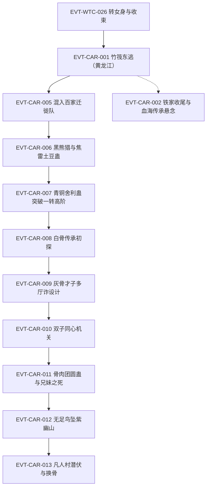

# 南疆商队与商家城

弧三主线：方源与白凝冰自青茅山覆灭南下（黄龙江竹筏→白骨山传承→凡人村换骨），随后进入商队与商家城格局。本页按 schema v2.1 组织 CAR 簇事件链，前情承接 EVT-WTC-026（定义于[狼潮](wolf-tide.md)）。本批核验标段一（段二 34590–41546 行，第一节《黄龙江上竹筏倾》至第三十四节《深深的误会》）；商队与商家城段（节 35 起）待下一标段，全书弧线笔记见[故事骨架总览](story-arc-overview.md)。

## 原著明确内容

### 黄龙江逃生（段二 34590–38320 行，第一节至第十九节）

- 黄龙江地理：南疆第三江，全长八千多公里，发源于黄果山，流经玄冥山、龟背山、青茅山、白骨山、雷磁山等，最后入海；鸟瞰如几字形，贯穿南疆一半有余的面积（34596–34598 行）[叙事|已核]。
- 竹筏东逃：青茅山一战后白凝冰自爆北冥冰魄体暂时困住天鹤上人，二人斩青矛竹扎竹筏、从黄龙江支流汇入主河道顺江而下，一日千里有余（34616–34624 行）[叙事|已核]；方源的千里地狼蛛已死、白凝冰的白相仙蛇此前主动飞走无音讯，二人无蛊虫代步（34618–34620 行）；方源推断铁喙飞鹤王极可能已死（天鹤上人斩古月一代后独自归来），五天水路后接近白骨山（34626–34638 行）[信念|已核]（主体：方源，前世记忆与推断）。
- 铁家收尾：铁血冷战死——铁家清理战场的人称"神捕大人乃是战死，这是铁家男儿荣耀的归属"（35146 行 [对话|已核]）；铁血冷来信提及血海传承，铁家担心生还者中有继承血海传承的魔道蛊师（35150 行 [对话|已核]）；铁若男立誓追查杀父之仇，被同族以药迷倒、命鬼一小组护送回寨（35154–35174 行）[叙事|已核]。
- 捕兽树规则：对任何脱困的猎物，捕兽树都不会再进攻——能脱困的猛兽已非它所能对付，这是无智慧生物进化出的生存本能（35744–35746 行 [对话|已核]（说话人：方源））。
- 正魔道旅行生态：家族蛊师至少五人成行，正道行事顾及身边人看法、更接近平常社会规范；魔道蛊师通常独自行走、警惕性强，凡事首先确定自身安全（36328–36338 行）[叙事|已核]；方源以地听肉耳草侦察，发现半月前独行者篝火遗迹，判定为魔道蛊师（36318–36328 行）[叙事|已核]。
- 混入百家迁徙队：百家元泉已有枯竭迹象、若寻不到新元泉恐步古月后尘（37806 行 [叙事|已核]）；方源在百家宴上以"青茅山覆灭残众"身份装哀戚，借青竹酒落泪引百家共鸣（37790–37804 行 [叙事|已核]）；百陌行试探"何时与族人汇合"，方源以懵懂应答，百陌行与女族长对视起疑，私下议"先下手为强"，女族长却轻笑（37810–37822 行）[叙事|已核]。
- 黑熊猎与焦雷土豆蛊：百家族长以青铜舍利蛊为饵，许"猎到一头成年黑熊即得奖励"（37946 行 [对话|已核]（说话人：百家族长））；方源算准黑熊撤退方向，预挖深坑埋下至少五只焦雷土豆蛊将其坑杀（37980–37990 行）[叙事|已核]；焦雷土豆蛊为二转一次性消耗品，埋地吸取地力成长、受震荡引爆，而白骨山无泥土（山石皆白骨）、此蛊本应被极大削弱（38004 行 [对话|已核]（说话人：百陌行））；百家观察点：方源被其认作古月家少主"方正"，弃用三转护卫、每埋一颗即以元石恢复真元、坚持自己动手（38006 行 [对话|已核]（说话人：百家族长））；方源判读"青铜舍利蛊是个好兆头——百家忌惮那支不存在的古月大部队，不想硬来、想用计谋诓骗"（38074 行 [叙事|已核]）。
- 青铜舍利蛊突破：方源用青铜舍利蛊后修为一下子突破到一转高阶（39504 行）[叙事|已核]（覆灭跌落后修为重建阶段）。

### 白骨山传承（段二 38320–41546 行，第二十节至第三十四节）

- 白骨传承初探：传承大厅皆以骨制成，中央大缸盛满如奶的白色液体——奶泉，白骨山特产，泉水如奶、清甜可口、营养丰富（38944–38958 行）[叙事|已核]；前世百家迁徙至此开发五个奶泉眼，奶泉成为百家特产与商品、每年吸引商队贸易（38960 行 [信念|已核]（主体：方源，前世记忆））；缸中盛满一转骨枪蛊——微型长枪状、通体白，类比古月山寨的月刃蛊，是白骨传承的基础之物，前世曾成百家蛊师装备特征，缸中另有二转蛊（38972–38984 行）[叙事|已核]。
- 灰骨才子的多厅诈设计：传承内多条路线格局相同——各有骸骨与骨书，令闯入者误以为已得全传承；"真正的密藏还隐藏在某个支线上"（39566–39574 行 [对话|已核]（说话人：铁刀苦））；百家（女族长、铁刀苦等）尾随追入，勘探八条路线，凭"骸骨被踏碎、颅骨蛊虫被取走"锁定方白二人路线（39564–39586 行）[叙事|已核]。
- 双子同心机关：狮虎头骨雕像密语"双子同心，三灵合一。有缘无缘，切莫强求"（39778 行 [对话|已核]（说话人：白凝冰诵读））；双子指必须两人合力，三灵指人的心、掌、目（39780–39784 行 [对话|已核]（说话人：方源））；方白二人手贴红宝石瞳孔不动——方源悟出开启者须同心同德，而二人"貌合神离，各有算计"做不到（39790–39802 行）[叙事|已核]；方源转而踢醒俘虏百生、百花兄妹，借这对真正同心的骨肉开启机关（39804–39808 行）[叙事|已核]。
- 骨肉团圆蛊与兄妹之死：方源得偿所愿获得骨肉团圆蛊，得益于百生、百花的情报与牺牲（40058 行 [叙事|已核]）；百家兄妹最终被烧死，白凝冰冷漠旁观——"百家注定是他们的敌人"，但她对有恩之人下不了手（41368 行）[叙事|已核]。
- 无足鸟坠紫幽山：二人经密道逃向白骨山悬崖出口（40050–40056 行），遭百家族长率众追杀（40062–40084 行，白凝冰以血月蛊射出血刃阻敌 [叙事|已核]）；无足鸟载二人飞行大半天、承受爆炸后浑身裂纹坠落紫色山林——方源按行程推断为紫幽山附近，紫幽山白天安全、夜晚极危险（40434–40452 行）[叙事|已核]。
- 凡人村潜伏与换骨：二人以敛息蛊收敛蛊师气息伪装凡人（蛊师之间可感受气息，敛息蛊藏于耳内连一转村长也看不破，41188 行 [叙事|已核]）；商队对外来蛊师很有戒备、对凡人则警惕性弱（41254 行 [叙事|已核]）；铁骨蛊为三转蛊，形如一根骨头、两端圆头中段细长、通体乌黑如钢铁，催用须瞬间消耗大量真元，融化成铁汁融入骨骼、剧痛难忍（41280–41296 行）[叙事|已核]；方源与白凝冰先后承受铁骨蛊、玉骨蛊换骨（41272、41352 行）；同行者预计七日后突破二转初阶（41268 行 [对话|已核]）。

## 事件链（CAR 簇·标段一）

| 事件 ID | 事件 | 前因 | 参与者 | 后果/因果指向 | 证据 |
|---|---|---|---|---|---|
| EVT-WTC-026 | 转女身与收束 | — | 白凝冰、方源、天鹤上人 | 弧二终点，二人逃离青茅山 | E:V1-034508（定义页：[狼潮](wolf-tide.md)） |
| EVT-CAR-001 | 竹筏东逃（黄龙江） | EVT-WTC-026 | 方源、白凝冰 | 顺江一日千里，五日近白骨山 | E:V2-034596 |
| EVT-CAR-002 | 铁家收尾与血海传承悬念 | EVT-WTC-026 | 铁若男、铁家蛊师 | 铁血冷战死确认；血海传承下落成追查线 | E:V2-035146 |
| EVT-CAR-003 | 捕兽树与主导权 | EVT-CAR-001 | 方源、白凝冰 | 白凝冰脱困；捕兽树规则揭示 | E:V2-035744 |
| EVT-CAR-004 | 魔道独行痕迹 | EVT-CAR-001 | 方源、白凝冰 | 正魔道旅行生态规则呈现 | E:V2-036328 |
| EVT-CAR-005 | 混入百家迁徙队 | EVT-CAR-004 | 方源、白凝冰、百家女族长、百陌行 | 以青茅残众身份渗透；起疑未破 | E:V2-037806 |
| EVT-CAR-006 | 黑熊猎与焦雷土豆蛊 | EVT-CAR-005 | 方源、黑熊、百陌行、百家族长 | 坑杀黑熊；青铜舍利蛊饵局被识破 | E:V2-037946 |
| EVT-CAR-007 | 青铜舍利蛊突破一转高阶 | EVT-CAR-006 | 方源 | 修为重建至一转高阶 | E:V2-039504 |
| EVT-CAR-008 | 白骨传承初探 | EVT-CAR-007 | 方源、白凝冰 | 奶泉与骨枪蛊入手 | E:V2-038944 |
| EVT-CAR-009 | 灰骨才子多厅诈设计 | EVT-CAR-008 | 百家（女族长、铁刀苦）、方白二人 | 八路勘探锁定二人路线 | E:V2-039574 |
| EVT-CAR-010 | 双子同心机关 | EVT-CAR-009 | 方源、白凝冰、百生、百花 | 方白不同心开不了；转借兄妹 | E:V2-039778 |
| EVT-CAR-011 | 骨肉团圆蛊与兄妹之死 | EVT-CAR-010 | 百生、百花、方源 | 骨肉团圆蛊得手；兄妹被烧死 | E:V2-040058 |
| EVT-CAR-012 | 无足鸟坠紫幽山 | EVT-CAR-011 | 方源、白凝冰、百家追兵 | 脱离白骨山，坠落紫幽山 | E:V2-040434 |
| EVT-CAR-013 | 凡人村潜伏与换骨 | EVT-CAR-012 | 方源、白凝冰 | 敛息伪装；铁骨/玉骨换骨剧痛 | E:V2-041272 |

## 待核对

- 血海传承的最终下落（铁家追查线的目标）、无足鸟的来历与品阶、紫幽山至商队段的行程细节：待标段二核验。
- 方源被百家认作"古月家少主方正"是有意冒名还是口误混称（38006 行），以及双胞胎身份在此段的用途，需回读节 20–22 确认。
- 商队与商家城段（节 35 起：通缉令、商心慈、匪猴山、尸群、丁浩、父女相认等）全部待下一标段核验后建立 EVT-CAR-014 起。
- CAR 簇 benchmark 与蒸馏率基线随弧三打穿批落地，本批不建、不跑盲测。

关联页面：[狼潮](wolf-tide.md)、[三王福地](three-kings-mountain.md)、[南疆](../world/south-jiang.md)、[方源](../characters/fang-yuan.md)、[白凝冰](../characters/bai-ning-bing.md)、[故事骨架总览](story-arc-overview.md)。
