# 全书故事骨架总览

本页是全书级的叙事中枢（2026-09-26 结构化升级）：让 AI 不重读约九百万字原文也能定位人物、事件与世界阶段。结构分四层——①覆盖度看板（每弧蒸馏层级与承载页）、②全书叙事主链（弧级 mermaid）、③十三弧分节（六维条目＋弧级事件链＋覆盖状态标记，弧间因果经"主题与因果桥"衔接）、④后期剧情锚点节。逐事件细节归各事件页（EVT-ID 事件链）；本页与实体页（characters/gu/world）互为引用，人物与蛊虫的弧内行踪以实体页状态时间线为准。

边界：以下弧线分组来自 `lore/research/分支：六卷精编版/全书总纲.md` 六卷骨架与 `lore/wiki/source/chapter-index.md` 笔记区间；章节范围均为约数，精确定位见各事件页与读书笔记。

## 覆盖度看板（2026-09-26 叙事中枢结构化批）

| 弧 | 原文行域（约） | 蒸馏层级 | 承载页 |
|---|---|---|---|
| 一 重生与青茅学堂 | 426–15,500 | 事件页（C 线 QMS 投影） | [青茅山](qing-mao-mountain.md) |
| 二 狼潮与青茅覆灭 | 15,501–45,000 | ✅ 精蒸馏（盲测 50/50，EVT-WTC-001…026） | [狼潮](wolf-tide.md) |
| 三 商队与商家城 | 45,001–75,383 前段 | ✅ 精蒸馏（49.5/50，EVT-CAR-001…044） | [南疆商队与商家城](south-caravan.md) |
| 四 三王福地与定仙游 | 45,001–75,383 后段 | ✅ 精蒸馏（50/50，EVT-TKF-001…032） | [三王福地](three-kings-mountain.md) |
| 五 王庭之争 | 75,384–116,326 | ✅ 精蒸馏（48/50，EVT-RTC-001…120） | [王庭之争](royal-court.md) |
| 六 真阳楼崩塌与仙僵 | 116,326–135,000 | ✅ 精蒸馏（48.5/50，EVT-ZYL-001…060） | [真阳楼崩塌](true-yang-collapse.md) |
| 七 僵盟潜伏与梦境三层 | 135,001–180,000 | 骨架＋锚点（C 线弧七簇未开） | 本页＋[影宗](../world/shadow-sect.md)、[僵盟](../world/zangmeng.md) |
| 八 中洲炼蛊大会 | ~150,694–156,000（嵌于弧七行域内） | 骨架＋制度锚点 | [中洲炼蛊大会](central-plain-refinement-conference.md) |
| 九 义天山大战与二次重生 | 172,000–200,000（实读锚定；225,001–240,000 为大战后余波域） | ✅ 精蒸馏（EVT-YIT-001…084） | [义天山大战](yitian-mountain.md) |
| 十 逆流河与琅琊 | 225,001–315,000 前段 | 骨架＋事件页 | [逆流河](reverse-flow-river.md)、[天庭入侵琅琊福地](langya-blessed-land-invasion.md) |
| 十一 宿命大战 Run 1 | 270,001–323,421 | ✅ 精蒸馏（EVT-FATE-001…066） | [宿命大战](fate-war.md) |
| 十二 Run 2 与宿命毁灭 | 323,422–360,000 | ✅ 精蒸馏（EVT-FATE-067…158） | [宿命大战](fate-war.md) |
| 十三 三尊博弈与断点 | 360,001–437,061 | ✅ 精蒸馏（EVT-FMK-001…170） | [疯魔窟终局](feng-mo-ku.md) |

精蒸馏＝C 线逐事件核验页（EVT-ID＋因果表＋mermaid 事件链）；骨架＋锚点＝本页六维条目＋已核行号锚点，逐事件拆分待 C 线按序推进。

## 全书叙事主链（弧级）

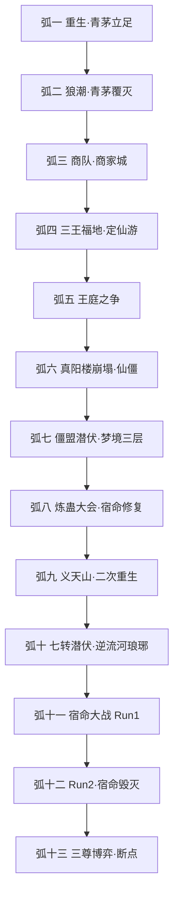

## 原著明确内容

本页当前没有可单独升级的逐段原文事实；相关条目见《资料整理》。

## 资料整理

以下条目来自读书笔记与六卷总纲的整理转述，尚未完成逐段原文核验，不得当作原著原文事实；Run 1 与 Run 2 条目并列记录，不得合并。

### 弧一 · 重生与青茅学堂（约 A2a 00001–15500 区间，卷一前段）

- 范围定位：方源借春秋蝉重生回少年，开窍大典至炼化月光蛊夺学堂首名。笔记定位见 A2a 补读。
- 状态与人物：方源丙等资质、弟弟方正甲等；舅父一家谋划遗产；古月漠北、赤城等同届对照。
- 事件与转折：酒虫反噬唤醒沉睡的春秋蝉；花酒行者遗藏线索出现；学堂勒索与月刃考核确立方源早期资源逻辑。
- 势力与地域：南疆青茅山古月一族；白家、熊家三族格局；商队为外部物资入口。详见[青茅山](qing-mao-mountain.md)。
- 蛊与规则资源：月光蛊、酒虫、春秋蝉（沉睡现身）；资质步数与真元海是早期分层标尺。
- 主题与因果桥：算计能否摆脱出身与血缘；遗产、遗藏与春秋蝉三条线为全书起点。

弧级事件链（导航用，整理层）：

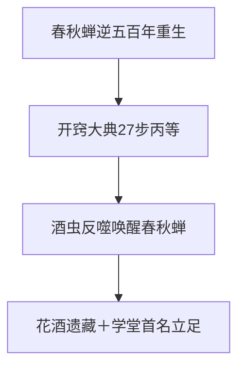

### 弧二 · 狼潮与青茅覆灭（约 A2b 15501–31008 与 A 31008–45000 区间，卷一后段）

- 范围定位：小兽潮至大狼潮，三族会盟斗蛊，青茅山覆灭，方正被天鹤上人带走，方源与白凝冰南下。笔记定位见 A2b 补读与 A 主笔记已读段。本弧已按原文核验建页：小兽潮至爆发日序幕及覆灭段全程见[狼潮](wolf-tide.md)（WTC 簇 EVT-WTC-001…026）。
- 状态与人物：方源以人兽葬生蛊合炼破境三转；古月青书死战白凝冰而亡；白凝冰北冥冰魄体总揭晓；方正走上与兄长相反的路。
- 事件与转折：血湖墓地与血海传承；铁家神捕查案逼近遗藏；白凝冰自爆右臂后与方源狼烟联手突围。
- 势力与地域：青茅山三寨；天元宝莲藏于元泉深处；商心慈所在商道首次作为传闻出现。
- 蛊与规则资源：血道传承、木魅蛊、北冥冰魄体（十绝体）；狼潮是周期性生存压力机制。
- 主题与因果桥：卷末不可逆变化是青茅山覆灭与旧身份丢失；方正线从此成为全书对照线。

弧级事件链（逐事件版见[狼潮](wolf-tide.md) EVT-WTC 事件链）：

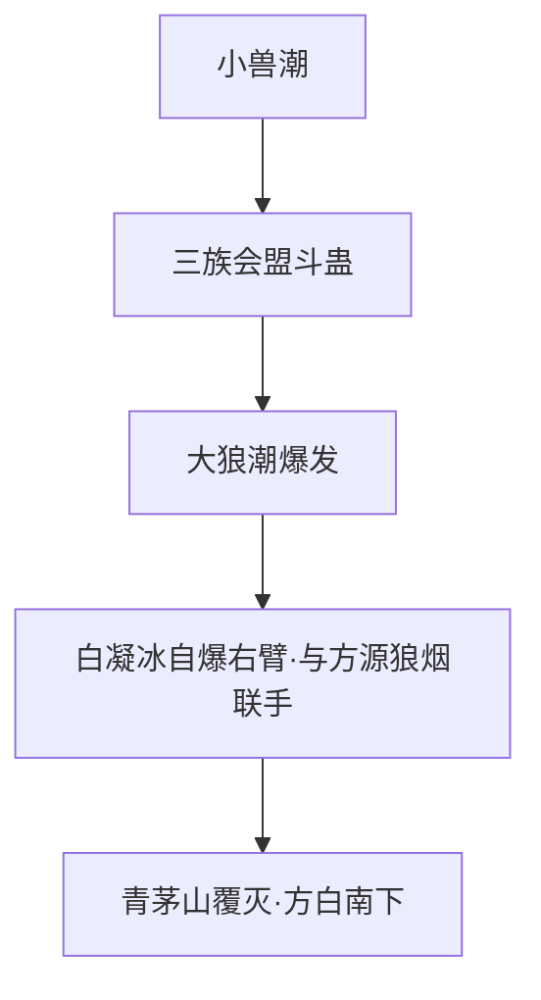

### 弧三 · 南疆商队与商家城（约 A 尾段至 B 前段，卷二前段）

- 范围定位：黄龙江逃生、白骨山双人传承，张家商队至少年方源进入商家城经营名声、推商心慈登少主。笔记定位见 A 主笔记与 B2 补读。黄龙江逃生至白骨山换骨段已按原文核验建页：[南疆商队与商家城](south-caravan.md)（CAR 簇标段一，EVT-CAR-001…013）。
- 状态与人物：方源与白凝冰互不服从的同盟；商心慈从被保护者转为少主竞争者；方正线在中洲仙鹤门开启。
- 事件与转折：墓碑山灭全商队；毒誓漏洞扳倒商睚眦；二十万买名声；力道流四件套成型（小兽王）。
- 势力与地域：南疆商家城；铁家与商家对峙；商队贸易网络。
- 蛊与规则资源：名声蛊（人祖传第 7 节互文）；奴道、力道积累；三王福地背后的巨阳遗产传闻。
- 主题与因果桥：当一切能交易，善意与信任还有没有价值；商心慈与白凝冰不再只是工具，为卷末决裂铺垫。

弧级事件链（逐事件版见[南疆商队与商家城](south-caravan.md) EVT-CAR 事件链）：

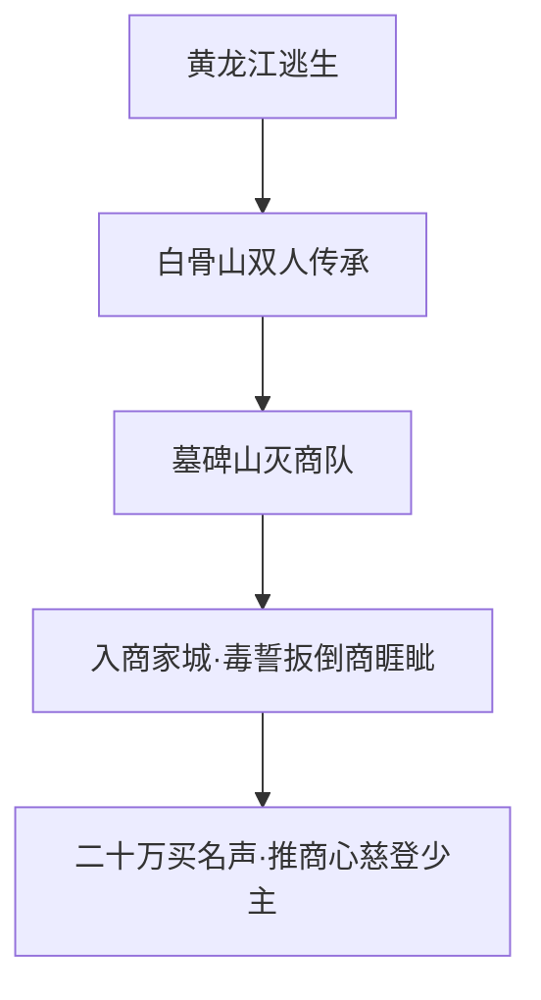

### 弧四 · 三王福地与定仙游决裂（约 B2/B 45001–90000 区间，卷二后段）

- 范围定位：三王福地犬王传承，神游蛊与定仙游炼成，白凝冰冰刃刺穿方源心脏后背叛，狐仙福地之争。详见[三王福地](three-kings-mountain.md)。仙鹤门方正线与黑白双煞/白狐蛊仙传承段已按原文核验建页（TKF 簇标段一，EVT-TKF-001…006）。
- 状态与人物：方源得定仙游、踏入仙途前夜；白凝冰裂痕总爆发；凤金煌登场（梦翼仙蛊）。
- 事件与转折：福地三倍时间流速、每关限用一转驭犬蛊；方源向地灵霸龟暴露春秋蝉借杀招炼蛊；天梯山传承之争夺自凤金煌。
- 势力与地域：三王福地；狐仙福地；中洲方正线（寄魂蚤、君子之争）并行。
- 蛊与规则资源：定仙游蛊（代价线）；荡魂山伏笔；血海真传（宋紫星、戾血龙蝠）传闻。
- 主题与因果桥：传承、身份、同伴三选一的被迫选择；定仙游代价与人祖传自由责任互文转入北原。

弧级事件链（逐事件版见[三王福地](three-kings-mountain.md) EVT-TKF 事件链）：

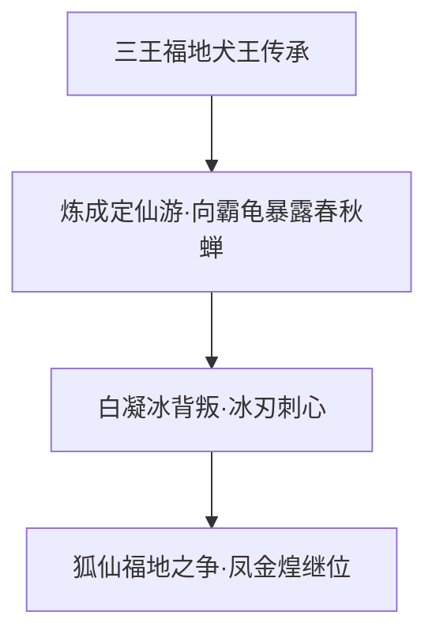

### 弧五 · 北原入局与王庭之争（约 C 90001–135000 区间，卷三前段）

- 范围定位：方源以常山阴身份入北原，葛家与狼群立足，英雄大会与王庭之争，黑楼兰结盟，八十八角真阳楼。笔记定位见 C 主笔记。本弧已按原文核验建页：[王庭之争](royal-court.md)（RTC 簇，EVT-RTC-001…120，段三 75,384–116,326 行弧五全程核验，收束于节 220《还有后手》；弧六自节 221《升仙！》起）。
- 状态与人物：四转巅峰（跨域压制为三转巅峰战力）；黑楼兰、太白云生结盟；方源定位为火中取栗的投机者。
- 事件与转折：太白云生升仙（霜玉孔雀抽王庭福地天地二气）；巨阳意志现身；凤金煌入梦邀斗。
- 势力与地域：北原王庭福地；黑家；凤九歌率中洲群仙入北原；影宗提前入局（鹤风扬遇伏）。
- 蛊与规则资源：运道真传线索；梦境实景展开（起源、三尊说、梦道仙蛊）；星宿仙尊名字首次出现。
- 主题与因果桥：信任与权力能否被定价；宿命蛊（已坏）与天意正式入局，红莲遗留意志上线。

弧级事件链（逐事件版见[王庭之争](royal-court.md) EVT-RTC 事件链）：

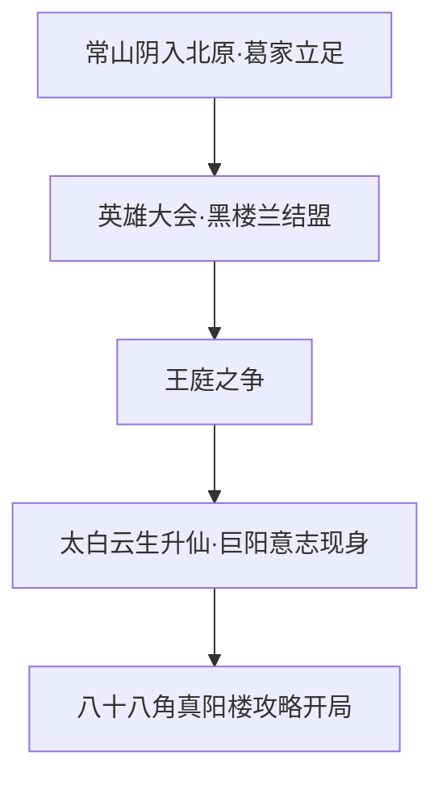

### 弧六 · 真阳楼崩塌与仙僵升仙（约 C 尾至 D1 135001–157500 区间，卷三后段）

- 范围定位：方源碎第二空窍正式升仙，真阳楼崩塌，夺运道真传部分归秦百胜，琅琊福地胆识蛊贸易落地，繁星洞天与星象福地。笔记定位见 C 尾与 D1 主笔记。本弧已按原文核验建页：[真阳楼崩塌](true-yang-collapse.md)（ZYL 簇，EVT-ZYL-001…060，段三 116,326–135,000 行弧六主线全程核验，收束于段四节 86《终于有了智道传承》繁星洞天探底）。
- 状态与人物：升仙代价为仙僵化（八臂仙僵）与万我杀招；方源、黑楼兰分道扬镳；七星子星宿仙僵、万象星君之死成星象福地。
- 事件与转折：王庭福地崩塌；北原拍卖大会筹办；仙鹤门攻防琅琊。
- 势力与地域：真阳楼遗址；琅琊福地；星象福地；方正线（寄魂蚤洗脑、五转奴道准大师、夺舍转向）并行。
- 蛊与规则资源：仙僵代价体系（无自产仙元、魂魄渐枯萎、修行停滞）；胆识蛊贸易；宋紫星人头认主条件。
- 主题与因果桥：卷末不可逆变化是王庭崩塌与分道扬镳；仙僵身份是卷四全部行动的前提。

弧级事件链（逐事件版见[真阳楼崩塌](true-yang-collapse.md) EVT-ZYL 事件链）：

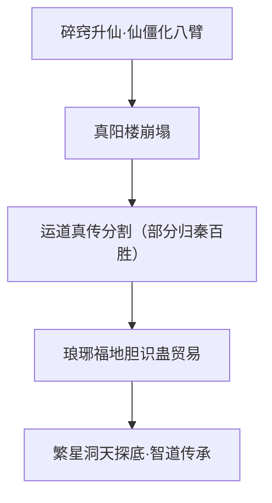

### 弧七 · 僵盟潜伏与梦境三层（约 D1/D2/E 135001–225000 区间，卷四前中段）

- 范围定位：方源以仙僵身份入中洲，北原僵盟沙黄、东海总部星象子，僵盟拍卖大会，东方长凡夺舍，方寸山，三层梦境探索。笔记定位见 D1/D2/E 主笔记。
- 状态与人物：仙窍破败、资源不足；影无邪、砚石老人代表影宗；白凝冰被监天塔锁定为逃脱宿命制裁者。
- 事件与转折：僵盟背后是影宗台面布置；黑凡洞天与吞并仙窍方针确立（弃按部就班渡劫）；薄青之乱剑斩监天塔。
- 势力与地域：五域僵盟（总部东海）；天庭与影宗对峙成形；南疆超级梦境（幽魂残魂）伏笔。
- 蛊与规则资源：梦境实景机制；度日如年类宙道杀招；生死仙窍重生法线索。
- 主题与因果桥：知道未来的人是否仍拥有自由意志；方源第一次预测失败，承认自己也是棋子。

覆盖状态：骨架＋锚点——C 线弧七簇未开，本弧逐事件拆分缺位（已知最大空洞之一，原文约 4.5 万行）。

弧级事件链（导航用，整理层；关键事实散见[影宗](../world/shadow-sect.md)、[僵盟](../world/zangmeng.md)）：

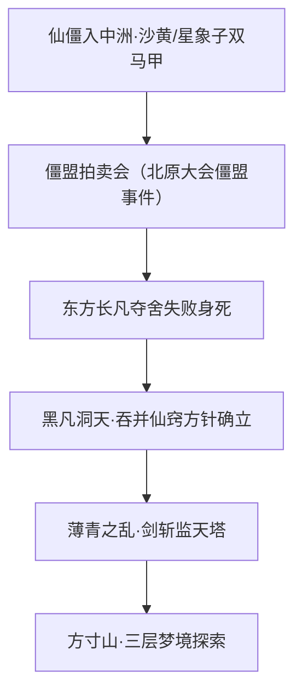

### 弧八 · 中洲炼蛊大会与宿命修复（约 E/F 区间，卷四中段）

- 范围定位：中洲炼蛊大会实为天庭修复宿命的机器，宿命修复成功恢复五成威能、拨乱反正，五域界壁在 Run 1 进入缩减阶段。详见[中洲炼蛊大会](central-plain-refinement-conference.md)。
- 状态与人物：方源并不知道天庭有宿命仙蛊（卷四仅间接认知）；紫薇接班监天塔；凤金煌赌斗。
- 事件与转折：成功道痕收集机制；监天塔接引天意；影宗被迫提前启动；五相赌约。
- 势力与地域：中洲天庭本营；帝君城；藏龙窟（龙公十年谋命运蛊）。
- 蛊与规则资源：九转宿命仙蛊（监天塔核心）；炼道大阵；命运蛊大计线索。
- 主题与因果桥：修复成功是义天山决战的直接压力源；界壁缩减（原文行 313034–313036，Run 1）早于大战收尾的彻底消弭，不得合并。

覆盖状态：骨架＋制度锚点（大会制度明文已核，见事件页《原著明确内容》）。

弧级事件链（导航用，整理层）：

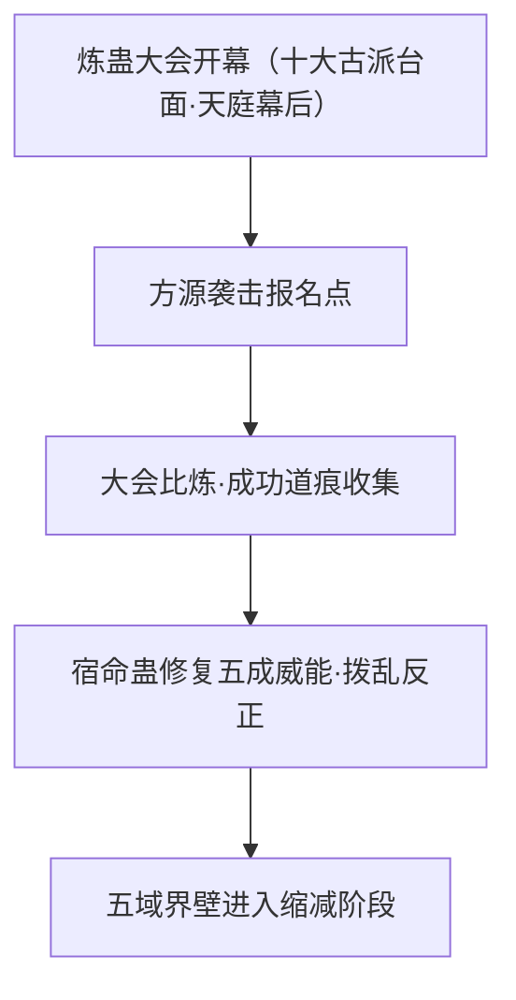

### 弧九 · 义天山大战与二次重生（约 F/F2a 225001–240000 区间，卷四后段）

- 范围定位：义天山大战，影宗设局献祭，砚石老人临终预言，方源身死，鬼脸红莲二次重生，夺至尊仙胎蛊，影宗易主线开启。
- 状态与人物：春秋蝉可靠性崩塌；太白云生换魂事件被蒙骗带走；黑楼兰弑父入影宗；白凝冰成仙入影宗。
- 事件与转折：十绝仙僵无生大阵；幽魂意志寄生红莲真传、影无邪经红莲重生；方源魂魄入蛊重生、旧八臂仙僵肉身留存。
- 势力与地域：义天山；异人联盟；疯魔之约；楚度与楚门。
- 蛊与规则资源：至尊仙体；幽魂之眼初现；红莲遗产全面激活（鬼脸红莲）。
- 主题与因果桥：卷末不可逆变化是春秋蝉失效与至尊仙体入手；天外之魔身份曝光、全五域通缉转入卷五。

覆盖状态：✅ 已核事件链——[义天山大战](yitian-mountain.md)（YIT 簇，EVT-YIT-001…084，卷四后段 172,000–200,000 实读锚定）；大战本体逐事件已拆分；砚石老人遗言已核为"小心自己人"（E:V4-183880），"紫山真君被献祭"已修正为不成立；"影无邪劫持春秋蝉"仍见[春秋蝉](../gu/spring-autumn-cicada.md) ST-CICADA-07…09 转引，本页按段际接口桥接。

弧级事件链（导航用，整理层）：

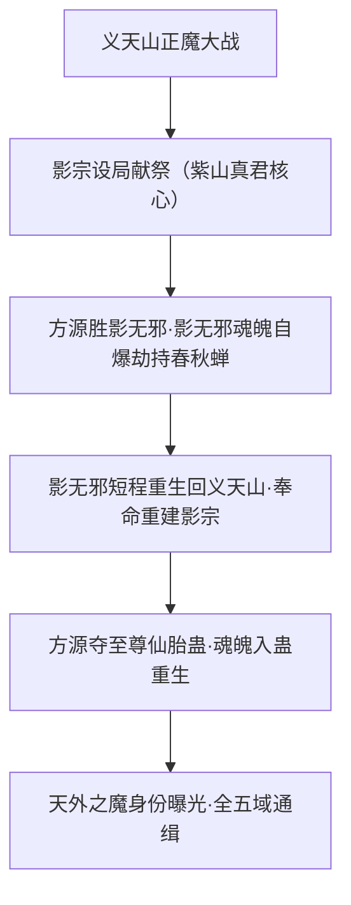

### 弧十 · 七转潜伏与逆流河琅琊（约 F2a/F2b/G 前段 225001–315000 区间，卷五前段）

- 范围定位：方源冒名武遗海潜伏武家，龙公苏醒紫薇让位，大雪山福地毁灭与逆流河，影宗易主（方源接任），梦境大战，幽魂被擒，石莲岛首获红莲真传，星投入侵琅琊。详见[逆流河](reverse-flow-river.md)与[天庭入侵琅琊福地](langya-blessed-land-invasion.md)。
- 状态与人物：七转；紫薇道破武遗海即方源、天意决裂；太白云生在逆流河被杀；紫山真君战死。
- 事件与转折：炼成七转坚持仙蛊、成逆流河主；天机仙蛊七转首炼；智慧蛊在琅琊易主。
- 势力与地域：南疆武家；大雪山福地；琅琊福地；石莲岛。详见[石莲岛与红莲真传争夺](stone-lotus-island-contest.md)。
- 蛊与规则资源：坚持仙蛊（元莲所炼）；天机仙蛊；智慧蛊；众生运真传（马鸿运尸首）。
- 主题与因果桥：方源成为棋手的前夜；红莲真传早取是 Run 2 与 Run 1 的关键差异。

覆盖状态：骨架＋事件页（逆流河、琅琊入侵两页承载局部）。

弧级事件链（导航用，整理层）：

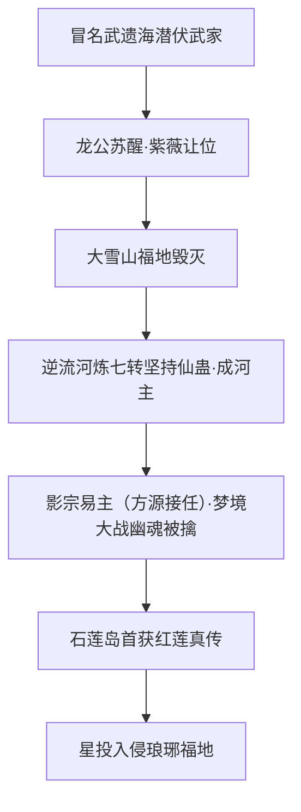

### 弧十一 · 宿命大战 Run 1 前世轮回（约 G/H1 270001–323421 区间，卷五中段）

- 范围定位：上一轮完整战争：龙宫争夺、石莲岛、中洲炼蛊大会、五域大战（帝君城屠城百万），宿命蛊修复完成，方源本体被龙公所杀、分身持春秋蝉重生。详见[宿命大战](fate-war.md)。
- 状态与人物：龙公龙人寂灭、寿尽而亡；星宿合道历史揭秘；元莲后手、元始创天庭揭秘；陆畏因叛变；白凝冰入龙宫。
- 事件与转折：宿命蛊修复完成（袁琼都牺牲）；五域界壁在大战收尾彻底消弭（原文行 323400）、五域合一；巨阳仙僵对星宿与真阳楼之谜。
- 势力与地域：中洲天庭本营；帝君城；龙宫；光阴长河；长生天与四域联军。
- 蛊与规则资源：宿命蛊完整形态；命运蛊大计；爱情蛊克命克运（宿命战钥匙）。
- 主题与因果桥：Run 1 是 Run 2 行动的情报起点；打碎宿命是解放众生还是交给更强者，本轮只提出问题不给出答案。

覆盖状态：✅ 已核事件链——[宿命大战](fate-war.md)（FATE 簇，Run 1 EVT-FATE-001…066，270,001–323,421 逐段核验）；龙公杀方源本体真位 E:V5-323318–323326，323,110–323,174 为百万年前龙人寂灭劝红莲插叙；凤九歌"大同风"毁石莲岛 E:V5-312822–312850、"不胜不负"312978。

弧级事件链（导航用，整理层）：

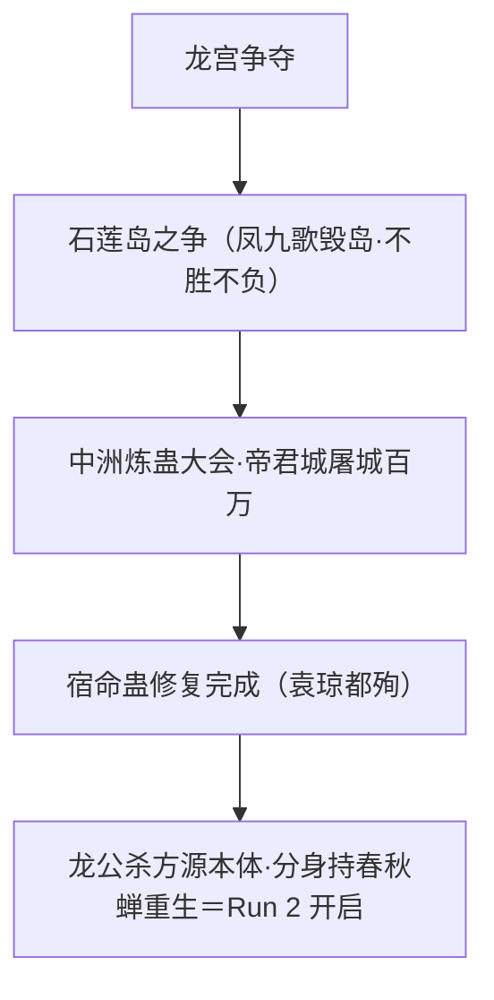

### 弧十二 · 重生轮回 Run 2 与宿命毁灭（约 H1/H2 323422–360000 区间，卷五后段）

- 范围定位：分身重生后的第二轮回：墨水效应揭底，琅琊守卫战翻盘、吞并晋升八转，气海老祖马甲线，龙宫归方源，石莲岛天庭六屋覆灭，乐土线（悔蛊、沈伤），疯魔窟第八层，宿命蛊被红莲拆分，五域合一。
- 状态与人物：天意栽培方源真相揭底；星宿与天意彻底同化；紫山真君与天意同化；方源成尊线开启（大爱仙尊自封属卷六）。
- 事件与转折：重生机制（墨水效应）与栽培真相；人祖传即人道真传；宿命蛊为天道碎片；龙公寿尽。
- 势力与地域：琅琊福地守卫战；龙宫；疯魔窟；乐土线地域。
- 蛊与规则资源：九转天机蛊升炼线；悔蛊；宿命蛊拆分（红莲）；至尊仙窍建设。
- 主题与因果桥：卷末不可逆变化是宿命蛊名存实亡、五域壁垒消失、方源成为棋手；尊者格局与三尊博弈转入卷六。

覆盖状态：✅ 已核事件链——[宿命大战](fate-war.md)（FATE 簇，Run 2 EVT-FATE-067…158，323,422–360,000 逐段核验）；墨水效应揭底 E:V5-324394、气海老祖马甲 340776、乐土线 351054 起、五域合一 358170–358172；宿命蛊被拆分（367440/367452）、龙公寿尽（367468）已越界入[疯魔窟终局](feng-mo-ku.md)。

弧级事件链（导航用，整理层）：

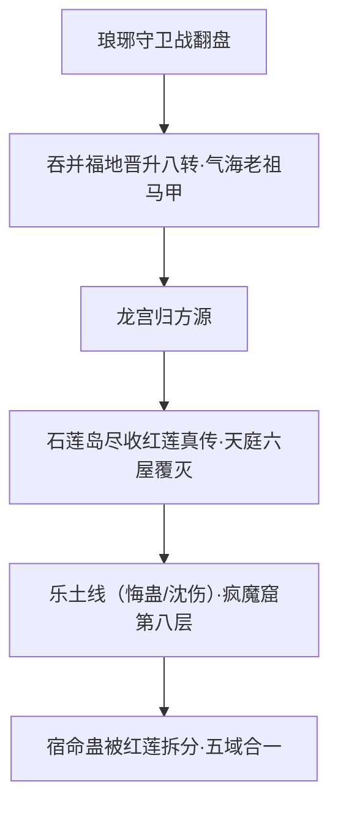

### 弧十三 · 天外三尊博弈与断点留白（约 I2/J2 360001–437061 区间，卷六）

- 范围定位：尊者重生格局解密，疯魔窟永生之争，方源悄然成九转尊者自封大爱仙尊，双尊重生（星宿三相合一、巨阳血道复活），生死门，方源杀乐土，事实浮冰，大爱盟炼蛊阳谋，止于三尊争夺野生九转光蛊、方源暗中升炼九转天机蛊。之后留白，不续写。
- 状态与人物：无极魔尊永生冲锋失败（永生从来就不存在）；乐土转修天道重生后被方源背刺杀死；光帝君复活；幽魂灭日、太阳自爆。
- 事件与转折：成尊四条件与元境道主；盗天真传炼道真意加天妒仙蛊为成尊根基；见死不救闪光洞天、九转天机蛊仙蛊方入手。
- 势力与地域：疯魔窟；生死门；事实浮冰海域；大爱盟。
- 蛊与规则资源：九转光蛊（野生现世）；九转天机蛊（升炼中）；佑天光疑云；永生蛊判定条件只作主题方向、不进入正文。
- 主题与因果桥：永生若必须牺牲一切关系与世界是否仍值得追求；三尊气运反扑机制；所有人物止于断点。

覆盖状态：✅ 已核事件链——[疯魔窟终局](feng-mo-ku.md)（FMK 簇，EVT-FMK-001…170，360,001–437,061 逐段核验）；无极"永生从来就不存在"421608–421614、方源杀乐土 421986–421994、自封大爱仙尊 423868（422102 为节标题"方源成尊！"）、断点＝追逐野生九转光蛊 436846–436848；疯魔窟方位只写"北方"，未回链[北原](../world/north-plain.md)（在制）。

弧级事件链（导航用，整理层；锚点版见下方系统补强批节）：

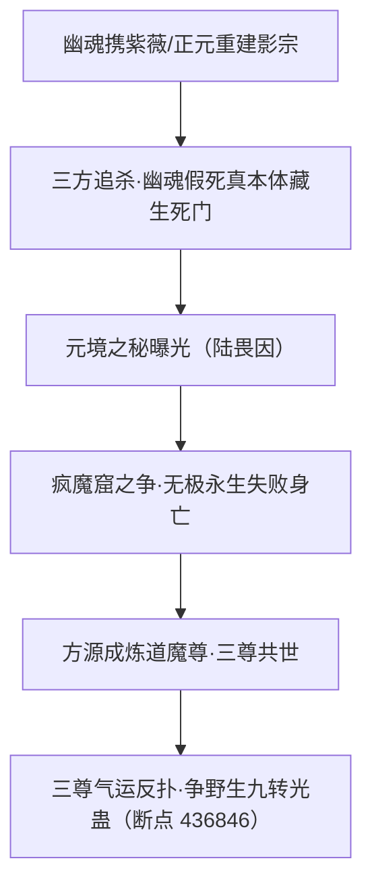

#### 2026-09-26 系统补强批（后期剧情热点锚定，宿命大战收尾至断点）

- **宿命大战收尾与天庭走向**：宿命蛊修复成功（364404）当日被方源捏碎（366108"宿命蛊被他直接捏成碎片"）；天庭战败（367628 卷末语"天庭的战败带来不一样的五域乱战"）；龙公死于冲锋路上（368200）；秦鼎菱暂代天庭首领（368220）；"名存实亡"（379690）与段六末"天庭进击"（434546）并存——**断点前天庭未被终结**。
- **影宗卧底线（结局）**：紫薇仙子被幽魂历次搜魂改造而不自知（363188、383782）；正元老人宿命大战中被魂球收服（363580"老奴拜见主上！"、365380），成幽魂催动天庭人道手段的钥匙（365270）；幽魂携二人潜行、命"重建影宗，为我招兵买马"（367836–367952）；结局＝正元老人被秦鼎菱等俘虏、紫薇仙子与影无邪在逃遭天庭通缉（385330、433826），二人赴两天不断接近幽魂（434392），途中中天籁濒死、被叛庭的凤九歌所救（434438）。组织侧详见[影宗](../world/shadow-sect.md)。
- **红莲真传数量**：共七道（267916"红莲设下的真传，似乎有七道"），幽魂魔尊获其中一道（267918）、方源继承其七分之一（269426）；内容含春秋蝉六至九转全套仙蛊方（269444）；石莲岛争夺战为第二座石莲岛（312220），Run 2 方源再上石莲岛"尽收红莲真传"（324434）、未来身系红莲特意留下的手段（324420）；此前凤九歌催动大风歌毁岛、双方无所得（324436）。
- **疯魔窟终局锚点**：详见[北原](../world/north-plain.md)疯魔窟条——无极永生失败"永生——从来就不存在"（421608–421614）、元境被巨阳联手方源破坏（419882）、方源成炼道魔尊（422102/422922）、"当之无愧的第一赢家"（423170）、三尊共世（423606）、天机蛊升炼最难步骤通过（436834）、"三尊气运反扑"（436442 节题）、断点＝追逐野生九转光蛊战团中（436846）。
- **数据问题登记**：原文 377902–385324 与 385490–392286 为同一段剧情（章节 63–100）的重复文本；该区间引用以重复段之后的独有正文（392482 行起）为准，C 线后续弧段蒸馏须先去重（2026-09-26 系统补强批发现，同步 log.md）。

## 分析与解读

- 本页的 Run 1 / Run 2 并列对照集中在卷五：Run 1（约 270001–323421）与 Run 2（323422 起）并列记录、对照阅读；此前此后的回忆、倒叙与回溯性时间线在本页不展开但不否认，AI 不得把本页的卷五对照结构泛化为全书唯一的双线模型。
- 因果主链可压缩为：春秋蝉重生 → 遗藏与学堂资源逻辑 → 狼潮覆灭 → 交易伦理 → 定仙游 → 王庭投机 → 仙僵 → 僵盟梦境 → 宿命修复 → 义天山换体 → 棋手潜伏 → 两轮宿命大战 → 三尊断点。每一步的卷末不可逆变化见各弧。
- 势力主链可压缩为：三族山寨 → 商家城 → 王庭福地 → 僵盟 → 天庭 → 五域联军 → 三尊。跨弧观察到的倾向是方源在多站更常表现为因势投机而非改易制度，此为本页整理出的行动倾向、有明确边界，不是对方源的绝对定义；各站具体取舍见各弧与人物页。
- 蛊虫主链可压缩为：春秋蝉（重生）→ 定仙游（机动）→ 智慧蛊（推算代价）→ 宿命蛊（世界剧本）→ 爱情蛊（剧本钥匙）→ 天机蛊（升炼目标）→ 光蛊（断点争夺）。宿命与天意的对抗强度逐卷升级，卷五为峰值。
- 游戏转化时，弧线、代价与阵营立场可作设计输入；周目规则、数值、胜负条件与结局分支必须留在游戏项目资料中，不得写入本页。

## 待核对

- 各弧章节起止均为约数：笔记区间存在重叠与补读勘误（以各补读文件内部说明为准），不得当作精确章节号引用。
- 卷二至卷四中段的弧线边界（商队/商家/福地、王庭/真阳楼、僵盟/梦境/炼蛊大会）仍是粗切分，多线并行的时间先后尚未逐事件拆分。
- Run 2 后段与卷六断点后的任何剧情均不在本页记录范围内；H2 末段之后的结局不得补写。
- 本页弧线名是整理用标签，不是原著卷名或官方分卷；引用时应同时给出笔记区间定位。

关联页面：[青茅山](qing-mao-mountain.md)、[三王福地](three-kings-mountain.md)、[逆流河](reverse-flow-river.md)、[义天山大战](yitian-mountain.md)、[宿命大战](fate-war.md)、[疯魔窟终局](feng-mo-ku.md)、[中洲炼蛊大会](central-plain-refinement-conference.md)、[石莲岛与红莲真传争夺](stone-lotus-island-contest.md)、[天庭入侵琅琊福地](langya-blessed-land-invasion.md)、[方源](../characters/fang-yuan.md)、[宿命](../themes/fate.md)、[自由](../themes/freedom.md)。
