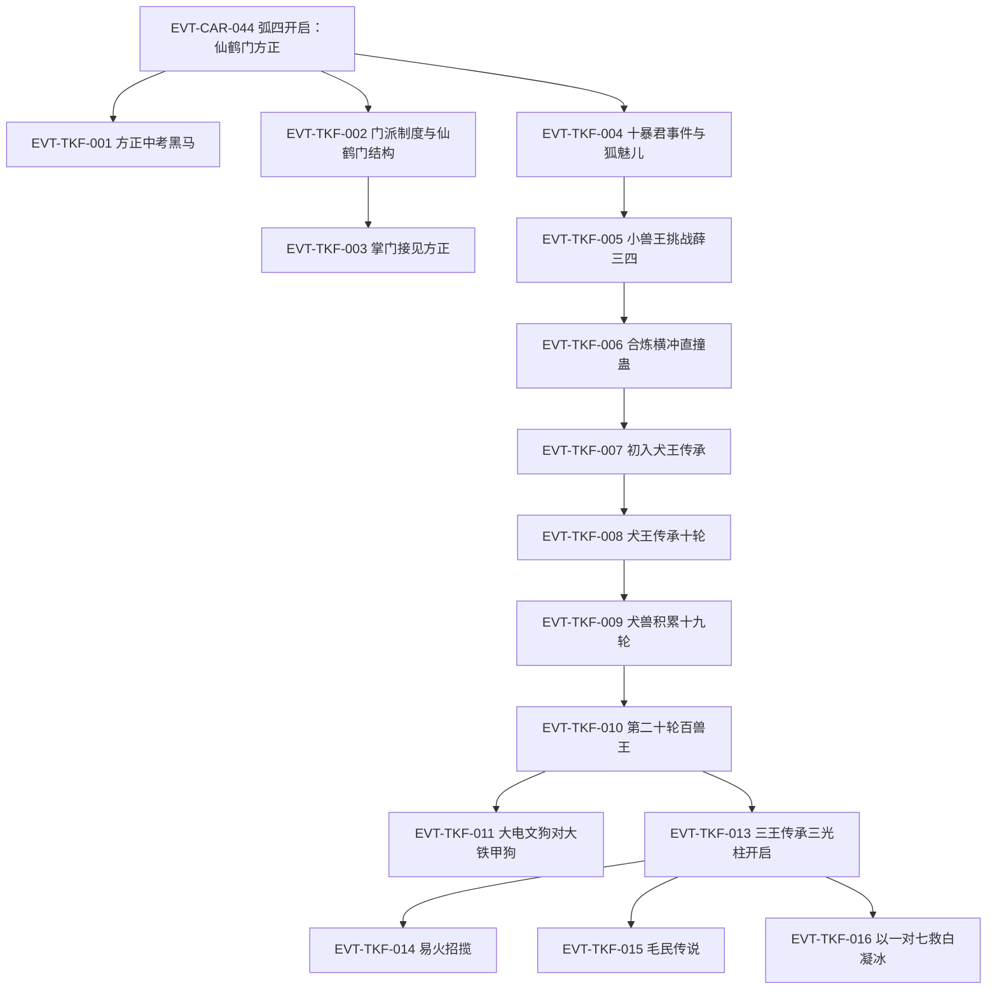

# 三王山

弧四枢纽页：仙鹤门方正线（中洲并行线）、白狐蛊仙传承 hunt（黑白双煞时期）、三王福地犬王传承与定仙游炼成、白凝冰决裂与狐仙福地之争。本页按 schema v2.1 组织 TKF 簇事件链，前情承接 EVT-CAR-044（定义于[南疆商队与商家城](south-caravan.md)）。本批核验标段一＋标段二（段二 62102–67006 行，第一百三十五节至第一百六十一节《以一对七(上)》）；狐仙福地与定仙游、白凝冰决裂（节 166 起）待后续标段，旧笔记整理降入《资料整理》。

## 原著明确内容

### 标段一：仙鹤门方正线与黑白双煞（段二 62102–64206 行，第一百三十五节至第一百四十六节）

- 仙鹤门与飞鹤山：中洲南部群山之上三万丈、云海之巅悬空着飞鹤山——山上数万种飞鹤（铁喙飞鹤、丹火鹤、凤尾鹤、云烟飘渺鹤、星辰极光鹤等）闻名中洲，山上蛊师名传天下；仙鹤门为中洲十大门派之一、占据中洲的巅峰势力（62108–62136 行）[叙事|已核]。
- 方正中考黑马：仙鹤门门派比武场上方正与老牌强者孙元化激战——三年小考第一的孙元化实力不足奇，方正却是八年中考最大黑马、默默无闻如普通山石却一飞冲天打入决赛（62140–62156 行）[叙事|已核]。
- 门派制度对家族制度：中洲门派林立，与南疆家族制度不同——门派以师徒关系取代血脉亲情，广收门徒、只看资质品性；方正因此被吸收入仙鹤门（62302–62306 行）[叙事|已核]。
- 仙鹤门结构与考核：层级自下而上为外门弟子、内门弟子、精英弟子、真传弟子、门派长老、掌门、太上长老；三年小考取得内门身份、八年中考获胜成精英弟子、十五年大考晋升真传；门派长老至少四转，掌门必为五转，太上长老皆六转蛊仙甚至七转（62308–62314 行）[叙事|已核]。
- 仙鹤门生源与方正当下面貌：门派选徒不问出身、择优选取，门中几乎没有丙等资质——乙等最常见、甲等不少；方正的甲等天资在此类巅峰势力中并不稀少（62316–62322 行）[叙事|已核]；掌门接见：方正已有四转中阶修为、够格任门派长老，但入门时间短、须完成大量门派任务考核忠心，掌门勉其大考优胜成为真传弟子（62324–62326 行）[对话|已核]（说话人：仙鹤门掌门）。
- 十暴君事件与狐魅儿：魔道聚会中十暴君当众施暴于一名女蛊师（狐魅儿），在场正道慑于十暴君与黑白双煞之势不敢出手；白凝冰面无表情、方源冷眼旁观（62832–62856 行）[叙事|已核]。
- 黑白双煞与小兽王：方源、白凝冰以"黑白双煞"名号行走，被公认为最近的魔道新星、名声越传越盛；方源另得"小兽王"之名——在三王传承即将开启之际，主动挑战同修力道的薛三四（三叉山），被其判定为"不能用常理推断的疯子"（63552–63576 行）[叙事|已核]。
- 合炼横冲直撞蛊：横冲蛊、直撞蛊（两只三转蛊）为主体合炼出横冲直撞蛊——冲锋距离由一百步扩至两百步、连续催动间隔减半、真元损耗略增；方源持九眼酒虫与天元宝莲，损耗不算什么；此时方源已有六只四转蛊：苦力蛊、横冲直撞蛊、阴阳转身蛊之阳蛊、九眼酒虫、费力蛊、血颅蛊（64148–64168 行）[叙事|已核]。

### 标段二：犬王传承与三光柱开启（段二 64334–67006 行，第一百四十七节至第一百六十一节）

- 初入犬王传承：投身光柱后失重，置身灰白荒野小世界——天白、地灰、枯草黄三原色，死寂无风声鸟鸣，孤独恐慌情绪蔓延；方源与白凝冰同时进入传承、入内后即只身一人；三王传承与寻常五转传承有重大不同（寻常五转传承皆布于大世界中）（64338–64366 行）[叙事|已核]。
- 犬王传承机制与方源表现：传承考验为指挥野狗群作战；方源第十轮以二十七只野狗牺牲九只、抗住近六十头野狗围攻——每十轮难度大涨数倍；"三王都是魔道蛊师，魔道传承向来酷烈，崇尚优胜劣汰的冰冷竞争法则"；三叉山每次开启都涌入大量正魔蛊师碰运气（64542–64570 行）[叙事|已核]。
- 犬兽积累：方源一路闯至第十九轮结束积累八十多头犬兽——四十多头菊花秋田犬、二十多头电文犬、十九头刺猬犬；期间斩杀一名水道三转巅峰蛊师、得六只蛊；始终未遇白凝冰（64936–64942 行）[叙事|已核]。
- 第二十轮百兽王：每过十轮难度暴涨；第二十轮起出现百兽王、规模上百近千的犬兽大战；迷雾中现三团光影奖励（橘黄栲栳大、幽蓝电芒磨盘大、青白似有似无最小）（64946–64956 行）[叙事|已核]。
- 百兽王对决：方源的犬兽群（电文狗＋刺猬犬＋菊花秋田犬）对阵铁甲狗群——大电文狗与铁甲狗群的大铁甲狗皆为百兽王，"到底还是百兽王，才能遏制住百兽王"（65330–65348 行）[叙事|已核]。
- 李闲与东海情报：东海流魄而来的李闲以四转苍空蛊（东海才有、三转空仓蛊合炼、容量广阔取用方便）待客——方源当场道破其来历与晋升方案（与天井蛊合炼五转苍空井蛊、天井蛊为东海天井岛天然蛊、南疆唯翼家可能有），令李闲惊疑（65728–65740 行）[对话|已核]（说话人：方源）；翼家为与商家、武家、铁家并称的超级家族、与东海联系紧密，贸易仅次于商家，飞天蓝鲸商队专走空路（65740 行）[叙事|已核]。
- 三王传承开启：五天后三叉山三道光柱直插云霄——红色灼热为爆王传承、黄色璀璨为犬王传承、蓝色魅艳为信王传承；时隔数月再度开启（66214–66220 行）[叙事|已核]。
- 易火招揽：易火为商家五大家老之一，欲投靠商家改姓商、在三叉山立功；因方源知晓三王传承隐秘（曾据之大赚）、战力出众（四转中阶战斗力）、白凝冰同进同退，遂以十足诚意招揽、屡次被拒仍迁就（66224–66238 行）[对话|已核]（说话人：易火，内心）。
- 毛民传说：有关毛民的记载最早见于《人祖传》——人祖挖下双眼化为一儿一女：儿子太日阳莽、女儿古月阴荒；太日阳莽好酒被困平凡深渊、因祸得福得菊花状名声蛊逃生；斑虎蜜蜂（花豹般大小、黄金打底黑斑点缀）送蜜酒相迫（66438–66458 行）[叙事|已核]。
- 以一对七救白凝冰：白凝冰被铁家所擒，方源上门营救——铁家七人（含已为铁家少主的铁若男）先入为主认为其四转初阶，动手后方源爆发四转中阶气息、众人惊呼"超越了我家若男少主"；铁霸修以"与铁家决裂"劝退，方源冷答"如果真救不了白凝冰，那就只能怪她运气不好了。反正我已经尽力而为了"（66978–67006 行）[对话|已核]（说话人：铁家众人、铁霸修、方源）。

## 事件链（TKF 簇·标段一）

| 事件 ID | 事件 | 前因 | 参与者 | 后果/因果指向 | 证据 |
|---|---|---|---|---|---|
| EVT-CAR-044 | 弧四开启：仙鹤门方正 | — | 方正、天鹤上人 | 叙事切中洲飞鹤山 | E:V2-062102（定义页：[南疆商队与商家城](south-caravan.md)） |
| EVT-TKF-001 | 方正中考黑马 | EVT-CAR-044 | 方正、孙元化 | 名传仙鹤门上下 | E:V2-062148 |
| EVT-TKF-002 | 门派制度与仙鹤门结构 | EVT-CAR-044 | — | 师徒制/考核阶梯/转数结构确立 | E:V2-062302 |
| EVT-TKF-003 | 掌门接见方正 | EVT-TKF-001 | 方正、仙鹤门掌门 | 四转中阶；须任务考核忠心 | E:V2-062324 |
| EVT-TKF-004 | 十暴君事件与狐魅儿 | EVT-CAR-043 | 十暴君、黑白双煞、狐魅儿、方白 | 方白冷眼旁观；狐魅儿线埋钩 | E:V2-062846 |
| EVT-TKF-005 | 小兽王挑战薛三四 | EVT-TKF-004 | 方源、薛三四 | 魔道新星名号立；三王传承开启在即 | E:V2-063552 |
| EVT-TKF-006 | 合炼横冲直撞蛊 | EVT-TKF-005 | 方源 | 六只四转蛊清单锚定 | E:V2-064148 |
| EVT-TKF-007 | 初入犬王传承 | EVT-TKF-006 | 方源、白凝冰（入内分离） | 灰白荒野小世界；与寻常传承之别 | E:V2-064338 |
| EVT-TKF-008 | 犬王传承十轮 | EVT-TKF-007 | 方源 | 指挥野狗作战；每十轮难度暴涨 | E:V2-064554 |
| EVT-TKF-009 | 犬兽积累十九轮 | EVT-TKF-008 | 方源 | 八十余头犬兽；斩水道三转巅峰得六蛊 | E:V2-064936 |
| EVT-TKF-010 | 第二十轮百兽王 | EVT-TKF-009 | 方源 | 百兽王现；三团光影奖励 | E:V2-064948 |
| EVT-TKF-011 | 大电文狗对大铁甲狗 | EVT-TKF-010 | 方源犬兽群、铁甲狗群 | 百兽王级对决 | E:V2-065348 |
| EVT-TKF-012 | 李闲与苍空蛊情报 | EVT-TKF-009 | 方源、李闲 | 东海蛊知识震慑；翼家情报带出 | E:V2-065728 |
| EVT-TKF-013 | 三王传承三光柱开启 | EVT-TKF-012 | 三叉山众蛊师 | 爆王（红）/犬王（黄）/信王（蓝）同启 | E:V2-066216 |
| EVT-TKF-014 | 易火招揽 | EVT-TKF-013 | 易火、方源 | 商家家老招揽被拒仍迁就 | E:V2-066224 |
| EVT-TKF-015 | 毛民传说 | EVT-TKF-013 | 太日阳莽（寓言）、斑虎蜜蜂 | 人祖传寓言线；毛民来历 | E:V2-066438 |
| EVT-TKF-016 | 以一对七救白凝冰 | EVT-TKF-013 | 方源、铁家七人、铁若男、铁霸修 | 方源四转中阶亮明；冷语震铁家 | E:V2-066982 |

## 资料整理

以下条目来自读书笔记整理转述（B2 补读 45001–66138 行），尚未完成逐段原文核验，不得当作原著原文事实。

- 三王传承规则（笔记层级）：犬王、信王、爆王各自留下传承体系，传承入口位于独立小世界；小世界时间流速为外界三倍；每轮只允许使用指定蛊虫，对手选择、奖励与退出方式受规则约束；普通挑战随轮次推进提高难度，六转仙蛊为特殊例外（春秋蝉被单独列出）。
- 弧四后续（笔记层级，待核验）：三王福地犬王传承（节 147 起）、神游蛊与定仙游炼成、白凝冰冰刃刺穿方源心脏的背叛、狐仙福地开启与地灵蛊仙之殇（节 166 起）、凤金煌登场、方源向地灵霸龟暴露春秋蝉借杀招炼蛊、天梯山传承争夺；中洲方正线并行（寄魂蚤、君子之争）。

## 待核对

- 白狐蛊仙传承的具体内容与本标段的关系（节 136 节题所指的传承物、白狐蛊本体）：须回读节 137–142。
- 节 127《九眼酒虫》的获取过程（CAR 簇时间线内，60628 行）尚未核验；费力蛊、血颅蛊的来源细节亦待核。
- 标段二未核验支线：狗胆蛊（节 151）、随手杀了（节 153）、一心多用蛊得名（节 152）、雷猪、岩鳄后文（节 154）、易火招揽结局（节 156）、毛民传说全篇（节 158–159）、节 160《拦截》（白凝冰被铁家所擒的经过）、以一对七(中/下)与声名大噪（节 162–165）。
- 犬王传承的完整轮次奖励表、三团光影对应奖励、信王/爆王传承内容，随后续标段核验建立。
- 狐仙福地与定仙游（节 166–206：地灵蛊仙之殇、炼仙蛊、凤金煌、白凝冰决裂、春秋蝉再动、登仙笞凤凰）为 TKF 簇后续标段；三王身份、每轮奖励与限制的逐轮表格随核验建立。
- 狐魅儿与"干爹"线（节 168）、童子（节 169）等人物事件待核验。

关联页面：[南疆商队与商家城](south-caravan.md)、[方源](../characters/fang-yuan.md)、[白凝冰](../characters/bai-ning-bing.md)、[黑楼兰](../characters/he-lou-lan.md)、[修炼体系](../world/cultivation-system.md)。
