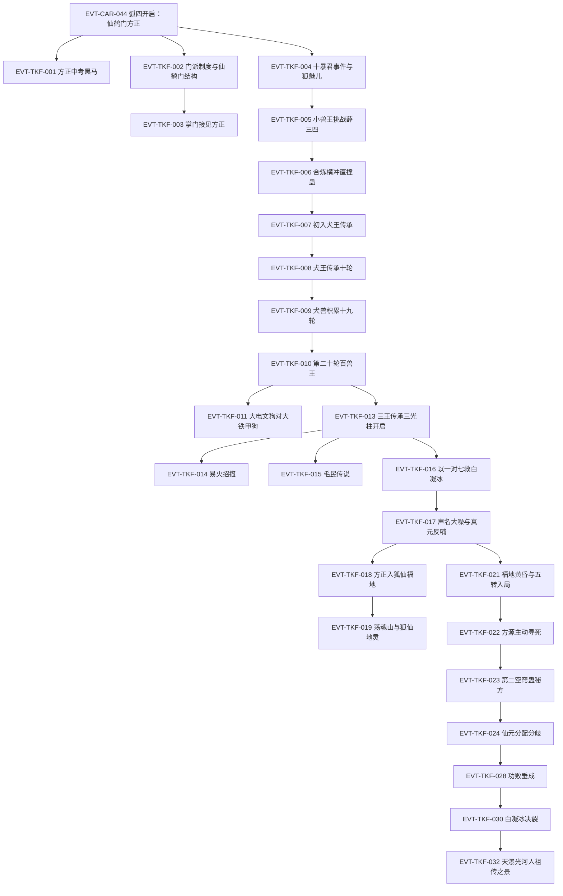

# 三王山

弧四枢纽页：仙鹤门方正线（中洲并行线）、白狐蛊仙传承 hunt（黑白双煞时期）、三王福地犬王传承与定仙游阴谋、白凝冰决裂与狐仙福地之争。本页按 schema v2.1 组织 TKF 簇事件链，前情承接 EVT-CAR-044（定义于[南疆商队与商家城](south-caravan.md)）。本批核验标段一至三（下）＝弧四全程（段二 62102–75032 行，第一百三十五节至第二百零六节《今日暂且展翼去，明朝登仙笞凤凰！》）；支线缺口见《待核对》，下一弧（王庭之争，段三起）另开新簇。

## 原著明确内容

### 标段一：仙鹤门方正线与黑白双煞（段二 62102–64206 行，第一百三十五节至第一百四十六节）

- 仙鹤门与飞鹤山：中洲南部群山之上三万丈、云海之巅悬空着飞鹤山——山上数万种飞鹤（铁喙飞鹤、丹火鹤、凤尾鹤、云烟飘渺鹤、星辰极光鹤等）闻名中洲，山上蛊师名传天下；仙鹤门为中洲十大门派之一、占据中洲的巅峰势力（62108–62136 行）[叙事|已核]。
- 方正中考黑马：仙鹤门门派比武场上方正与老牌强者孙元化激战——三年小考第一的孙元化实力不足奇，方正却是八年中考最大黑马、默默无闻如普通山石却一飞冲天打入决赛（62140–62156 行）[叙事|已核]。
- 门派制度对家族制度：中洲门派林立，与南疆家族制度不同——门派以师徒关系取代血脉亲情，广收门徒、只看资质品性；方正因此被吸收入仙鹤门（62302–62306 行）[叙事|已核]。
- 仙鹤门结构与考核：层级自下而上为外门弟子、内门弟子、精英弟子、真传弟子、门派长老、掌门、太上长老；三年小考取得内门身份、八年中考获胜成精英弟子、十五年大考晋升真传；门派长老至少四转，掌门必为五转，太上长老皆六转蛊仙甚至七转（62308–62314 行）[叙事|已核]。
- 仙鹤门生源与方正当下面貌：门派选徒不问出身、择优选取，门中几乎没有丙等资质——乙等最常见、甲等不少；方正的甲等天资在此类巅峰势力中并不稀少（62316–62322 行）[叙事|已核]；掌门接见：方正已有四转中阶修为、够格任门派长老，但入门时间短、须完成大量门派任务考核忠心，掌门勉其大考优胜成为真传弟子（62324–62326 行）[对话|已核]（说话人：仙鹤门掌门）。
- 十暴君事件与狐魅儿：魔道聚会中十暴君当众施暴于一名女蛊师（狐魅儿），在场正道慑于十暴君与黑白双煞之势不敢出手；白凝冰面无表情、方源冷眼旁观（62832–62856 行）[叙事|已核]。
- 黑白双煞与小兽王：方源、白凝冰以"黑白双煞"名号行走，被公认为最近的魔道新星、名声越传越盛；方源另得"小兽王"之名——在三王传承即将开启之际，主动挑战同修力道的薛三四（三叉山），被其判定为"不能用常理推断的疯子"（63552–63576 行）[叙事|已核]。
- 合炼横冲直撞蛊：横冲蛊、直撞蛊（两只三转蛊）为主体合炼出横冲直撞蛊——冲锋距离由一百步扩至两百步、连续催动间隔减半、真元损耗略增；方源持九眼酒虫与天元宝莲，损耗不算什么；此时方源已有六只四转蛊：苦力蛊、横冲直撞蛊、阴阳转身蛊之阳蛊、九眼酒虫、费力蛊、血颅蛊（64148–64168 行）[叙事|已核]。

### 标段二：犬王传承与三光柱开启（段二 64334–67006 行，第一百四十七节至第一百六十一节）

- 初入犬王传承：投身光柱后失重，置身灰白荒野小世界——天白、地灰、枯草黄三原色，死寂无风声鸟鸣，孤独恐慌情绪蔓延；方源与白凝冰同时进入传承、入内后即只身一人；三王传承与寻常五转传承有重大不同（寻常五转传承皆布于大世界中）（64338–64366 行）[叙事|已核]。
- 犬王传承机制与方源表现：传承考验为指挥野狗群作战；方源第十轮以二十七只野狗牺牲九只、抗住近六十头野狗围攻——每十轮难度大涨数倍；"三王都是魔道蛊师，魔道传承向来酷烈，崇尚优胜劣汰的冰冷竞争法则"；三叉山每次开启都涌入大量正魔蛊师碰运气（64542–64570 行）[叙事|已核]。
- 犬兽积累：方源一路闯至第十九轮结束积累八十多头犬兽——四十多头菊花秋田犬、二十多头电文犬、十九头刺猬犬；期间斩杀一名水道三转巅峰蛊师、得六只蛊；始终未遇白凝冰（64936–64942 行）[叙事|已核]。
- 第二十轮百兽王：每过十轮难度暴涨；第二十轮起出现百兽王、规模上百近千的犬兽大战；迷雾中现三团光影奖励（橘黄栲栳大、幽蓝电芒磨盘大、青白似有似无最小）（64946–64956 行）[叙事|已核]。
- 百兽王对决：方源的犬兽群（电文狗＋刺猬犬＋菊花秋田犬）对阵铁甲狗群——大电文狗与铁甲狗群的大铁甲狗皆为百兽王，"到底还是百兽王，才能遏制住百兽王"（65330–65348 行）[叙事|已核]。
- 李闲与东海情报：东海流魄而来的李闲以四转苍空蛊（东海才有、三转空仓蛊合炼、容量广阔取用方便）待客——方源当场道破其来历与晋升方案（与天井蛊合炼五转苍空井蛊、天井蛊为东海天井岛天然蛊、南疆唯翼家可能有），令李闲惊疑（65728–65740 行）[对话|已核]（说话人：方源）；翼家为与商家、武家、铁家并称的超级家族、与东海联系紧密，贸易仅次于商家，飞天蓝鲸商队专走空路（65740 行）[叙事|已核]。
- 三王传承开启：五天后三叉山三道光柱直插云霄——红色灼热为爆王传承、黄色璀璨为犬王传承、蓝色魅艳为信王传承；时隔数月再度开启（66214–66220 行）[叙事|已核]。
- 易火招揽：易火为商家五大家老之一，欲投靠商家改姓商、在三叉山立功；因方源知晓三王传承隐秘（曾据之大赚）、战力出众（四转中阶战斗力）、白凝冰同进同退，遂以十足诚意招揽、屡次被拒仍迁就（66224–66238 行）[对话|已核]（说话人：易火，内心）。
- 毛民传说：有关毛民的记载最早见于《人祖传》——人祖挖下双眼化为一儿一女：儿子太日阳莽、女儿古月阴荒；太日阳莽好酒被困平凡深渊、因祸得福得菊花状名声蛊逃生；斑虎蜜蜂（花豹般大小、黄金打底黑斑点缀）送蜜酒相迫（66438–66458 行）[叙事|已核]。
- 以一对七救白凝冰：白凝冰被铁家所擒，方源上门营救——铁家七人（含已为铁家少主的铁若男）先入为主认为其四转初阶，动手后方源爆发四转中阶气息、众人惊呼"超越了我家若男少主"；铁霸修以"与铁家决裂"劝退，方源冷答"如果真救不了白凝冰，那就只能怪她运气不好了。反正我已经尽力而为了"（66978–67006 行）[对话|已核]（说话人：铁家众人、铁霸修、方源）。

### 标段三（上）：狐仙福地开启（段二 67920–69972 行，第一百六十六节至第一百七十八节）

- 声名大噪与真元反哺：铁霸修一战后方源名传南疆、成为人所共知的魔道天才——百岁童子避退、李闲与狐魅儿暗中推波助澜、有人扬言挑战（67924–67932 行）[叙事|已核]；方源（四转中阶、亮金真元经九眼酒虫提纯为精金真元）通过骨肉团圆蛊反向灌注白凝冰、助其温养窍壁增长底蕴（67944 行）[叙事|已核]。
- 方正入狐仙福地：方正坠入一片青草茵茵的草原，远处矗立粉红半透明的水晶山峰——"第一个攀上巅峰的人，就能获得狐仙传承"（神秘小女孩语，68090–68118 行）[叙事|已核]。
- 荡魂山与狐仙地灵：狐仙福地中央的水晶山川名为荡魂山（通体粉红、梦幻色彩）——万物生灵身处其附近魂魄就要受到震荡之苦，越往上攀登越头晕眼花；十派精英弟子如蚂蚁般攀登（69046–69052 行）[叙事|已核]；狐仙地灵形如小女童、肌肤若雪透着粉嫩、乌黑大眼、身后雪白狐尾，坐在虚空中看戏打趣、调皮地劝方正放弃（69056–69064 行）[对话|已核]（说话人：狐仙地灵）。
- 金针蛊配合体系：金针蛊为二转蛊、铁家蛊师合炼所得——配毒液蛊成毒针、配僵滞蛊令敌人动弹不得、配乱神蛊令敌我不分、配生机蛊可救治（铁若男以此清扫近千山猿又救活它们）（69384–69398 行）[叙事|已核]。
- 福地黄昏与五转入局：三叉山三道光柱暗淡缩减不足原先一半——这道上古蛊仙福地被三王改造后，已渐渐难以承受无数蛊师的勘探掠夺，"就如一艘正在沉没的船"（69712–69718 行）[叙事|已核]；铁慕白为三叉山五转第一人（南疆五转一流，骷魔、巫鬼亦公认），率先走入信王传承；骷魔、巫鬼为避其锋芒另选传承；武阑珊在场合礼（69720–69736 行）[叙事|已核]。
- 方源主动寻死：方源在传承中遭红蛋人群围攻、濒死昏迷不动，被一股无形力量骤然卷走——现身于玄青色铜砖大殿中央（69908–69932 行）[叙事|已核]（"炼仙蛊"的谋划与交易随下批核验展开）。

### 标段三（下）：定仙游阴谋与白凝冰决裂（段二 70102–75032 行，第一百七十九节至第二百零六节）

- 第二空窍蛊秘方：方源向地灵霸龟索取六转仙蛊第二空窍蛊的炼制秘方——炼制必耗大部分仙元、福地将大幅衰弱无法抗衡地灾天劫而必须舍弃，故此蛊为方源此行最大收获；霸龟授予近万字秘方（"腐土血粉，地中藏花。玉骨成瓣，冰肌化茎，花心金舍利……添三更，再三更，三更得九。九为极。大功告成"）（70108–70126 行）[对话|已核]（说话人：地灵霸龟）。
- 仙元十六份分配与地灵分歧：方源将仙元分作十六份——八份炼蛊、四份支撑三王传承、三份多斩杀蛊师、不到一份备用；地灵主张八成三、警告炼蛊失败风险，方源坚持九成计划；彼时方源尚未通过考验、不是福地之主，无法直接命令地灵（71060–71070 行）[对话|已核]（说话人：方源、地灵）。
- 犬王滚雪球法则：五转魔道大蛊师骷魔在犬王传承第十八关已拥碧眼犬王（百兽王、身怀野生蛊克制阴犬）与大批铁甲狗（前五十关防御最卓越犬兽）——"犬王传承在三王传承中最需要运气，运气好前期积累深厚犹如滚雪球，中后期越容易闯关"（70518–70536 行）[叙事|已核]。
- 龙青天破界未遂：龙青天寻得传承薄弱地域（天地压制虚弱、可用一只蛊），欲以碧空蛊毒烂福地勾通外界形成通道、摆脱三王规则；方源以骨刺远攻袭杀，因碧空蛊毒领域无法近战（71832–71852 行）[叙事|已核]。
- 凤金煌继狐仙福地：申时三刻凤金煌继承狐仙福地——前世方源伙同魔道蛊仙进攻狐仙福地、攻占荡魂山、斩杀凤金煌险死还生；凤金煌死后正道作《凤金煌传》载其三大奇遇：三岁睡梦中获仙蛊梦翼、狐仙传承（今日申时两刻登顶）等（73910–73918 行）[信念|已核]（主体：方源，前世记忆与《凤金煌传》）。
- 第二空窍蛊功败垂成："凤金煌有仙蛊梦翼，狐仙传承必是她的囊中之物。要不被她落下太远，就得拥有第二空窍。可惜啊，到头来功败垂成！"——方源并未输得彻底，尚有翻盘希望（73920–73924 行）[对话|已核]（说话人：方源，内心）。
- 五岳犬阵总攻：正魔两道联军总攻犬阵——白凝冰在暗处调动狗群、地灵辅佐渐渐稳住局面；重泰、青华、烟嵩、恒光、星衡五大犬种结成五岳犬阵圆阵如大坝，挡住潮水般蛊师（72966–72972 行）[叙事|已核]。
- 白凝冰决裂：方源炼制仙蛊大功告成、六转第二空窍蛊悬于面前之际，已用阳蛊恢复男儿身的白凝冰手持冰刃立其身后，铁若男同场——白凝冰宣言："从在青茅山上复活的那一刻，我就开始思考着，如何回复男儿身""我被你牢牢控制，只能成为你的棋子任你摆布……你越控制我，压榨我，利用我，我无时无刻不想着如何脱离、翻盘、逆袭！"（73368–73388 行）[对话|已核]（说话人：白凝冰）。
- 仇九奴役与总攻破坏：方源以五转奴隶蛊奴役仇九（五转）；总攻中仇九刻意拖慢魔道队伍速度、渔翁得利削弱正道，与魔无天的急进主张激烈冲突（74646–74660 行）[对话|已核]（说话人：魔无天、仇九）。
- 天瀑光河人祖传之景（卷二终）：太古荣耀之光照射蚕茧，方源浑身金黄、在天瀑光河中逆流飞翔——金汤蛊防御渐被冲刷、骨翼露出黑色，顶着五转蛊师杀招艰难前行；全场蛊师停步仰望，皆觉似曾相识——"这样的情形，在人祖传中记载过"（75008–75032 行）[叙事|已核]。

## 事件链（TKF 簇·标段一）

| 事件 ID | 事件 | 前因 | 参与者 | 后果/因果指向 | 证据 |
|---|---|---|---|---|---|
| EVT-CAR-044 | 弧四开启：仙鹤门方正 | — | 方正、天鹤上人 | 叙事切中洲飞鹤山 | E:V2-062102（定义页：[南疆商队与商家城](south-caravan.md)） |
| EVT-TKF-001 | 方正中考黑马 | EVT-CAR-044 | 方正、孙元化 | 名传仙鹤门上下 | E:V2-062148 |
| EVT-TKF-002 | 门派制度与仙鹤门结构 | EVT-CAR-044 | — | 师徒制/考核阶梯/转数结构确立 | E:V2-062302 |
| EVT-TKF-003 | 掌门接见方正 | EVT-TKF-001 | 方正、仙鹤门掌门 | 四转中阶；须任务考核忠心 | E:V2-062324 |
| EVT-TKF-004 | 十暴君事件与狐魅儿 | EVT-CAR-043 | 十暴君、黑白双煞、狐魅儿、方白 | 方白冷眼旁观；狐魅儿线埋钩 | E:V2-062846 |
| EVT-TKF-005 | 小兽王挑战薛三四 | EVT-TKF-004 | 方源、薛三四 | 魔道新星名号立；三王传承开启在即 | E:V2-063552 |
| EVT-TKF-006 | 合炼横冲直撞蛊 | EVT-TKF-005 | 方源 | 六只四转蛊清单锚定 | E:V2-064148 |
| EVT-TKF-007 | 初入犬王传承 | EVT-TKF-006 | 方源、白凝冰（入内分离） | 灰白荒野小世界；与寻常传承之别 | E:V2-064338 |
| EVT-TKF-008 | 犬王传承十轮 | EVT-TKF-007 | 方源 | 指挥野狗作战；每十轮难度暴涨 | E:V2-064554 |
| EVT-TKF-009 | 犬兽积累十九轮 | EVT-TKF-008 | 方源 | 八十余头犬兽；斩水道三转巅峰得六蛊 | E:V2-064936 |
| EVT-TKF-010 | 第二十轮百兽王 | EVT-TKF-009 | 方源 | 百兽王现；三团光影奖励 | E:V2-064948 |
| EVT-TKF-011 | 大电文狗对大铁甲狗 | EVT-TKF-010 | 方源犬兽群、铁甲狗群 | 百兽王级对决 | E:V2-065348 |
| EVT-TKF-012 | 李闲与苍空蛊情报 | EVT-TKF-009 | 方源、李闲 | 东海蛊知识震慑；翼家情报带出 | E:V2-065728 |
| EVT-TKF-013 | 三王传承三光柱开启 | EVT-TKF-012 | 三叉山众蛊师 | 爆王（红）/犬王（黄）/信王（蓝）同启 | E:V2-066216 |
| EVT-TKF-014 | 易火招揽 | EVT-TKF-013 | 易火、方源 | 商家家老招揽被拒仍迁就 | E:V2-066224 |
| EVT-TKF-015 | 毛民传说 | EVT-TKF-013 | 太日阳莽（寓言）、斑虎蜜蜂 | 人祖传寓言线；毛民来历 | E:V2-066438 |
| EVT-TKF-016 | 以一对七救白凝冰 | EVT-TKF-013 | 方源、铁家七人、铁若男、铁霸修 | 方源四转中阶亮明；冷语震铁家 | E:V2-066982 |
| EVT-TKF-017 | 声名大噪与真元反哺 | EVT-TKF-016 | 方源、白凝冰 | 精金真元经骨肉团圆蛊反哺白凝冰 | E:V2-067944 |
| EVT-TKF-018 | 方正入狐仙福地 | EVT-TKF-003 | 方正、十派精英弟子 | 攀登水晶山峰夺狐仙传承 | E:V2-068106 |
| EVT-TKF-019 | 荡魂山与狐仙地灵 | EVT-TKF-018 | 狐仙地灵、方正 | 地灵小女童形象；魂魄震荡机制 | E:V2-069058 |
| EVT-TKF-020 | 金针蛊配合体系 | EVT-TKF-016 | 铁若男 | 四种蛊配组合规则（毒/僵滞/乱神/生机） | E:V2-069398 |
| EVT-TKF-021 | 福地黄昏与五转入局 | EVT-TKF-013 | 铁慕白、骷魔、巫鬼、武阑珊 | 铁慕白入信王传承 | E:V2-069714 |
| EVT-TKF-022 | 方源主动寻死 | EVT-TKF-021 | 方源、红蛋人 | 濒死被无形力量卷入传承核心大殿 | E:V2-069922 |
| EVT-TKF-023 | 第二空窍蛊秘方授予 | EVT-TKF-022 | 方源、地灵霸龟 | 六转仙蛊秘方到手；福地必弃 | E:V2-070122 |
| EVT-TKF-024 | 仙元十六份分配分歧 | EVT-TKF-023 | 方源、地灵 | 八炼四支三杀一备；地灵主保守 | E:V2-070488 |
| EVT-TKF-025 | 犬王滚雪球法则 | EVT-TKF-010 | 骷魔 | 运气与前期积累决定中后期 | E:V2-070536 |
| EVT-TKF-026 | 龙青天破界未遂 | EVT-TKF-021 | 龙青天、方源 | 碧空蛊毒腐蚀福地图谋被阻 | E:V2-071838 |
| EVT-TKF-027 | 凤金煌继狐仙福地 | EVT-TKF-019 | 凤金煌 | 梦翼仙蛊+登顶；前世攻占记忆 | E:V2-073910 |
| EVT-TKF-028 | 第二空窍蛊功败垂成 | EVT-TKF-024 | 方源 | 炼蛊失败；翻盘希望尚存 | E:V2-073920 |
| EVT-TKF-029 | 五岳犬阵总攻 | EVT-TKF-021 | 白凝冰、地灵、正魔联军 | 五大犬种圆阵如坝；双方伤亡惨重 | E:V2-072970 |
| EVT-TKF-030 | 白凝冰决裂 | EVT-TKF-028 | 白凝冰、方源、铁若男 | 阳蛊复男身；冰刃背刺； independence 宣言 | E:V2-073384 |
| EVT-TKF-031 | 仇九奴役与总攻破坏 | EVT-TKF-029 | 仇九、魔无天 | 五转奴隶蛊操控；渔翁削弱正道 | E:V2-074650 |
| EVT-TKF-032 | 天瀑光河人祖传之景 | EVT-TKF-030 | 方源、全场蛊师 | 逆光河飞翔映照人祖传；卷二终 | E:V2-075012 |

## 资料整理

以下条目来自读书笔记整理转述（B2 补读 45001–66138 行），尚未完成逐段原文核验，不得当作原著原文事实。

- 三王传承规则（笔记层级）：犬王、信王、爆王各自留下传承体系，传承入口位于独立小世界；小世界时间流速为外界三倍；每轮只允许使用指定蛊虫，对手选择、奖励与退出方式受规则约束；普通挑战随轮次推进提高难度，六转仙蛊为特殊例外（春秋蝉被单独列出）。
- 弧四后续（笔记层级，待核验）：三王福地犬王传承（节 147 起）、神游蛊与定仙游炼成、白凝冰冰刃刺穿方源心脏的背叛、狐仙福地开启与地灵蛊仙之殇（节 166 起）、凤金煌登场、方源向地灵霸龟暴露春秋蝉借杀招炼蛊、天梯山传承争夺；中洲方正线并行（寄魂蚤、君子之争）。

## 待核对

- 白狐蛊仙传承的具体内容（节 136 节题所指传承物、白狐蛊本体）：须回读节 137–142。
- 节 127《九眼酒虫》获取过程（CAR 时间线，60628 行）、费力蛊与血颅蛊来源、节 179《他死了》所指对象、节 183《继续杀》与节 185《狡诈鬼医，生死秘门》细节、"宇宙奥义"（节 184）在本节语境中的具体所指。
- 标段三（下）未核验支线：恩怨情仇（节 186）、五转奴隶蛊炼制全程（节 188）、只差最后一步（节 190）、魔无天与魔道联军（节 191–194）、正魔齐攻与群攻（节 193–194）、"白凝冰，你演够了吗"的完整对白与决裂真伪定性（节 204）、再炼仙蛊结局（节 205）、蚕茧转变细节（节 206）。
- 白凝冰的境界归属（CAR 页"两大四转战力"另一半）与其决裂—合流线的后续走向，随白凝冰实体页批次统一核验。
- 弧五已开簇：[王庭之争](royal-court.md)（RTC 簇，段三 75384 行起）。原"定仙游炼成的最终结果与方源离福地的衔接"待核对已清偿：定仙游为方源持有的六转仙蛊、一颗仙元六年免喂（E:V3-076022），携入北原后经皓珠蛊封印、铁柜蛊隔绝加地藏花王埋藏（E:V3-080166），方源以定仙游传送赴北原（E:V3-078804–078808）。

关联页面：[南疆商队与商家城](south-caravan.md)、[方源](../characters/fang-yuan.md)、[白凝冰](../characters/bai-ning-bing.md)、[黑楼兰](../characters/he-lou-lan.md)、[修炼体系](../world/cultivation-system.md)。
