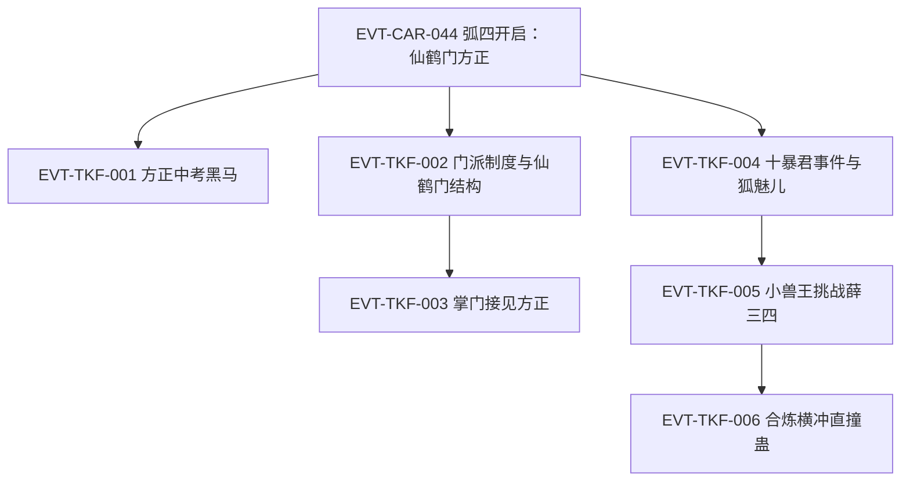

# 三王山

弧四枢纽页：仙鹤门方正线（中洲并行线）、白狐蛊仙传承 hunt（黑白双煞时期）、三王福地犬王传承与定仙游炼成、白凝冰决裂与狐仙福地之争。本页按 schema v2.1 组织 TKF 簇事件链，前情承接 EVT-CAR-044（定义于[南疆商队与商家城](south-caravan.md)）。本批核验标段一（段二 62102–64206 行，第一百三十五节至第一百四十六节）；三王福地本体（节 147 起）与狐仙福地（节 166 起）待后续标段，旧笔记整理降入《资料整理》。

## 原著明确内容

### 标段一：仙鹤门方正线与黑白双煞（段二 62102–64206 行，第一百三十五节至第一百四十六节）

- 仙鹤门与飞鹤山：中洲南部群山之上三万丈、云海之巅悬空着飞鹤山——山上数万种飞鹤（铁喙飞鹤、丹火鹤、凤尾鹤、云烟飘渺鹤、星辰极光鹤等）闻名中洲，山上蛊师名传天下；仙鹤门为中洲十大门派之一、占据中洲的巅峰势力（62108–62136 行）[叙事|已核]。
- 方正中考黑马：仙鹤门门派比武场上方正与老牌强者孙元化激战——三年小考第一的孙元化实力不足奇，方正却是八年中考最大黑马、默默无闻如普通山石却一飞冲天打入决赛（62140–62156 行）[叙事|已核]。
- 门派制度对家族制度：中洲门派林立，与南疆家族制度不同——门派以师徒关系取代血脉亲情，广收门徒、只看资质品性；方正因此被吸收入仙鹤门（62302–62306 行）[叙事|已核]。
- 仙鹤门结构与考核：层级自下而上为外门弟子、内门弟子、精英弟子、真传弟子、门派长老、掌门、太上长老；三年小考取得内门身份、八年中考获胜成精英弟子、十五年大考晋升真传；门派长老至少四转，掌门必为五转，太上长老皆六转蛊仙甚至七转（62308–62314 行）[叙事|已核]。
- 仙鹤门生源与方正当下面貌：门派选徒不问出身、择优选取，门中几乎没有丙等资质——乙等最常见、甲等不少；方正的甲等天资在此类巅峰势力中并不稀少（62316–62322 行）[叙事|已核]；掌门接见：方正已有四转中阶修为、够格任门派长老，但入门时间短、须完成大量门派任务考核忠心，掌门勉其大考优胜成为真传弟子（62324–62326 行）[对话|已核]（说话人：仙鹤门掌门）。
- 十暴君事件与狐魅儿：魔道聚会中十暴君当众施暴于一名女蛊师（狐魅儿），在场正道慑于十暴君与黑白双煞之势不敢出手；白凝冰面无表情、方源冷眼旁观（62832–62856 行）[叙事|已核]。
- 黑白双煞与小兽王：方源、白凝冰以"黑白双煞"名号行走，被公认为最近的魔道新星、名声越传越盛；方源另得"小兽王"之名——在三王传承即将开启之际，主动挑战同修力道的薛三四（三叉山），被其判定为"不能用常理推断的疯子"（63552–63576 行）[叙事|已核]。
- 合炼横冲直撞蛊：横冲蛊、直撞蛊（两只三转蛊）为主体合炼出横冲直撞蛊——冲锋距离由一百步扩至两百步、连续催动间隔减半、真元损耗略增；方源持九眼酒虫与天元宝莲，损耗不算什么；此时方源已有六只四转蛊：苦力蛊、横冲直撞蛊、阴阳转身蛊之阳蛊、九眼酒虫、费力蛊、血颅蛊（64148–64168 行）[叙事|已核]。

## 事件链（TKF 簇·标段一）

| 事件 ID | 事件 | 前因 | 参与者 | 后果/因果指向 | 证据 |
|---|---|---|---|---|---|
| EVT-CAR-044 | 弧四开启：仙鹤门方正 | — | 方正、天鹤上人 | 叙事切中洲飞鹤山 | E:V2-062102（定义页：[南疆商队与商家城](south-caravan.md)） |
| EVT-TKF-001 | 方正中考黑马 | EVT-CAR-044 | 方正、孙元化 | 名传仙鹤门上下 | E:V2-062148 |
| EVT-TKF-002 | 门派制度与仙鹤门结构 | EVT-CAR-044 | — | 师徒制/考核阶梯/转数结构确立 | E:V2-062302 |
| EVT-TKF-003 | 掌门接见方正 | EVT-TKF-001 | 方正、仙鹤门掌门 | 四转中阶；须任务考核忠心 | E:V2-062324 |
| EVT-TKF-004 | 十暴君事件与狐魅儿 | EVT-CAR-043 | 十暴君、黑白双煞、狐魅儿、方白 | 方白冷眼旁观；狐魅儿线埋钩 | E:V2-062846 |
| EVT-TKF-005 | 小兽王挑战薛三四 | EVT-TKF-004 | 方源、薛三四 | 魔道新星名号立；三王传承开启在即 | E:V2-063552 |
| EVT-TKF-006 | 合炼横冲直撞蛊 | EVT-TKF-005 | 方源 | 六只四转蛊清单锚定 | E:V2-064148 |

## 资料整理

以下条目来自读书笔记整理转述（B2 补读 45001–66138 行），尚未完成逐段原文核验，不得当作原著原文事实。

- 三王传承规则（笔记层级）：犬王、信王、爆王各自留下传承体系，传承入口位于独立小世界；小世界时间流速为外界三倍；每轮只允许使用指定蛊虫，对手选择、奖励与退出方式受规则约束；普通挑战随轮次推进提高难度，六转仙蛊为特殊例外（春秋蝉被单独列出）。
- 弧四后续（笔记层级，待核验）：三王福地犬王传承（节 147 起）、神游蛊与定仙游炼成、白凝冰冰刃刺穿方源心脏的背叛、狐仙福地开启与地灵蛊仙之殇（节 166 起）、凤金煌登场、方源向地灵霸龟暴露春秋蝉借杀招炼蛊、天梯山传承争夺；中洲方正线并行（寄魂蚤、君子之争）。

## 待核对

- 白狐蛊仙传承的具体内容与本标段的关系（节 136 节题所指的传承物、白狐蛊本体）：本批窗口未覆盖，须回读节 137–142。
- 节 127《九眼酒虫》的获取过程（CAR 簇时间线内，60628 行）尚未核验；方源六只四转蛊中费力蛊、血颅蛊的来源细节亦待核。
- "方白两大四转战力"（CAR 簇 60822 行）与本页方正四转中阶（62324 行）的修为口径比对，及方源三转巅峰持六只四转蛊的可行性边界，待实体页批次统一核验。
- 三王福地本体（节 147–165）、狐仙福地（节 166–206：地灵蛊仙之殇、炼仙蛊、凤金煌、白凝冰决裂、春秋蝉再动、登仙笞凤凰）为 TKF 簇后续标段；三王身份、每轮奖励与限制的逐轮表格随核验建立。
- 狐魅儿与"干爹"线（节 168《这年头干爹不好当》）、童子（节 169）等人物事件待核验。

关联页面：[南疆商队与商家城](south-caravan.md)、[方源](../characters/fang-yuan.md)、[白凝冰](../characters/bai-ning-bing.md)、[黑楼兰](../characters/he-lou-lan.md)、[修炼体系](../world/cultivation-system.md)。
