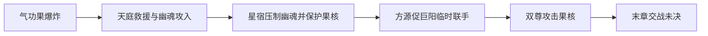

# 三尊齐攻天庭

发生于元始复活布置遭到破坏后，现有 EPUB `chapter_2360`–`chapter_2364` 的末章战场。前因见[疯魔窟终局与三尊博弈](feng-mo-ku.md)的 EVT-FMK-175–178。本页承接爆炸后的行动与交战，是这些末章事件的主要落点；原著停在攻防继续之中，没有给出此战胜者。

## 原著明确内容

### 参与者与目标

- **星宿仙尊**守护残存气功果核；天庭智道道痕使她在主场强大，但保护果核使她不能只按歼敌目标行动。`chapter_2364` `para_006`、`para_017`、`para_047`–`para_070`。
- **巨阳仙尊**最担心元始成功复活，他同意与方源联手，目标是摧毁气功果核后撤退，不是无条件帮助方源。`chapter_2363` `para_103`–`para_111`；`chapter_2364` `para_064`–`para_068`。
- **方源**以图腾引来幽魂，再用黄金部族的安全威胁促使巨阳入场；到场后先试星宿防御，再转攻果核，末段威胁杀死在场天庭蛊仙。`chapter_2362` `para_086`–`para_104`；`chapter_2363` `para_103`–`para_113`；`chapter_2364` `para_025`、`para_057`–`para_090`。
- **幽魂魔尊**神志不清，被引至天庭后主动闯入，随后困于星雾。标题中的“三尊”是三位进攻者；不能把他与方源、巨阳写成已经达成战略盟约。`chapter_2362` `para_090`–`para_104`；`chapter_2364` `para_004`–`para_009`。

## 事件链

| 事件 | 前提与实际发生 | 后果与限制 | 证据 |
|---|---|---|---|
| EVT-HCA-001 | 元始复活过程中气功果爆炸；大量中洲蛊仙遭受重创，气道白气阻碍探察。星宿先前召入天庭的十大古派精锐也被殃及。 | 天庭处于重创与信息不明的状态；不能把“元始复活进行中”记成元始已成功加入战场。 | EPUB `chapter_2360` `para_014`–`para_026`、`para_089`–`para_097`；`chapter_2361` `para_060` |
| EVT-HCA-002 | 秦鼎菱接掌救援调度：眉公等进入白气中心寻找星宿，其他人守卫、救援；方源图腾引诱幽魂逼近，防守者难以阻止其攻入。 | 幽魂先到场；秦鼎菱等拼死抵抗不等于能够挡住尊者。 | EPUB `chapter_2362` `para_056`–`para_064`、`para_086`–`para_104` |
| EVT-HCA-003 | 星宿尚在，压下白气；气功果炸毁后核仍存在。星宿以星雾压制失去神智的幽魂。 | 元始复活仍有被星宿保护的残存布置；幽魂被困，不是已被斩杀。 | EPUB `chapter_2363` `para_008`–`para_020`、`para_085`–`para_102`；短引文：“气功果虽然炸毁了，但是气功果核还在！” |
| EVT-HCA-004 | 方源催促巨阳共同攻庭；巨阳起初观望，方源以屠戮黄金部族相威胁，巨阳最终同意联手摧毁果核。 | 这是利益与威胁促成的临时协作；巨阳的犹豫不能替换成他早已与星宿暗中结盟。 | EPUB `chapter_2363` `para_103`–`para_113`；短引文：“也罢，就和你联手一次，务必要摧毁了气功果核！” |
| EVT-HCA-005 | 方源与巨阳试攻星雾失败后转攻气功果核，迫使星宿集中防守；方源随后威胁杀光在场天庭蛊仙。 | 原著末章仍在交战；果核是否被毁、元始最终是否复活、此战伤亡与胜负没有在现有末章写出。 | EPUB `chapter_2364` `para_025`–`para_070`、`para_087`–`para_090`；末句：“星宿仙尊，接下来我要杀光在场的天庭蛊仙。你若有能耐，就来阻止我吧！” |

### 责任认知与证据边界

星宿此时没有明确证据，判断方源嫌疑最重（`chapter_2364` `para_011`）；同章叙事又写方源“自知自己乃是元凶”（`para_025`）。两者分别说明星宿知道什么和方源知道什么，不能把角色缺少证据写成叙事也完全未知，更不能把星宿的怀疑当作她已经取得确证。

## 资料整理

- 本页使用当前 Canon 的章内非空段落编号，从 `para_001` 起，与[来源与回查](../source/README.md)的章节段落索引一致。
- 旧源止于光蛊争夺的历史断点，不是 EPUB 正文的终点。当前 `chapter_2364` 是《方源、巨阳战星宿》；末段仍为交战与威胁。[故事骨架总览](story-arc-overview.md)与[事件索引](index.md)据此导航。

## 分析与解读

天庭主场加持和气功果核形成相反作用：道痕使星宿有能力挡下双尊的试攻；必须护住果核，又让方源和巨阳能够以攻击目标的选择逼她防守。这是由事件推导的战术解释，不是“主场一定无敌”或“保护资源一定落败”的普遍规则。

## 待核对

- 末章之后的胜负、元始复活结局及幸存者去向属于现有 Canon 没有提供的后续，不用推测补完。
- 爆炸全部布置的前置过程和具体杀招配方，需要另核更早章节；本页只记录末章已经说明的责任认知与后果，不补造完整暗手技术。
- 本页未穷举全部中洲幸存者与伤势；群体伤亡不能据此转为每个具名人物已经死亡。
