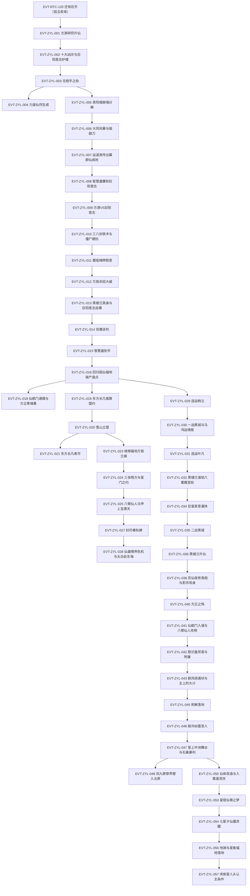

# 真阳楼崩塌

弧六枢纽页：方源碎第二空窍升仙（仙僵）→ 十大凶灾与无相手之劫 → 真阳楼崩塌、大同风幕与插翅刀 → 智慧蛊腰斩巨阳意志、双魔谈判 → 回归狐仙福地破产经营、八臂仙人马甲 → 雪山立盟、连运布局 → 黑楼兰升仙与二战黑城 → 仙鹤门之战、胆识蛊贸易与影宗入局 → 繁星洞天探险与星象福地落地。本页按 schema v2.1 组织 ZYL 簇事件链，前情承接 EVT-RTC-120（定义于[王庭之争](royal-court.md)）。本批核验标段一至二＝段三 116326–121057 行＋段四 121058–135000 行（节 221《升仙！》至段四节 86《终于有了智道传承》中段）；繁星洞天收官（星殿三重防护余波）与北原拍卖大会随下一簇。

## 原著明确内容

### 标段一（上）：碎窍升仙与真阳楼崩塌（段三 116326–119500 行，节 221–236）

- 方源碎窍升仙："竟然在这一刻碎窍，勾动天劫地灾！！"（116408）——弧五末"还有后手"即当场碎第二空窍升仙（"方源碎的是第二空窍"116620，本命全力以赴蛊·力道，败亦可保命）；升仙勾动天劫地灾，巨阳意志为保真阳楼被迫硬抗——"它却是成了方源渡劫时的保姆了"（116662）[叙事|已核]。
- 三气与力道境界：方源纳气人气浓盛超太白云生，回顾一生领悟大道——力道"跨越力道大师的门槛，突破大师级。向宗师级进发"（116832）[叙事|已核]。
- 十大凶灾与无相手之劫：大雪灾与太白遗留颠乱雷球、羁绊狼烟融成雪殇劫电，乱歧牙三波叠加至三十六道漩涡，巨阳意志险死还生"意念只剩下百分之一不到"（117094）；天劫尽化为盗天魔尊杀招无相手——"这是盗天魔尊的杀招——无相手啊"（117130），成千上万（六指 16、七指 9、八指 3），"就算收到空窍，蛊虫也照样会被抢夺"（117304），黑楼兰本命蛊与虚情假意、木鸡两大仙蛊皆失（117368）[叙事|已核]。
- 力道仙窍生成：方源借定仙游钻入太白云生仙窍避追，在太白仙窍内放全力以赴蛊炸出力道仙窍——"破而后立，生仙窍！"（117410）；仙窍狂吸二气生长定型——"这就是中等福地了……"（118078，518 万亩、青提仙元 22 颗、时流 1:16 因春秋蝉截流压低）[叙事|已核]。
- 趁乱"发财"与失定仙游：方源击碎无相拳缴获凡蛊仙蛊、寻获运道真传抢得十余只运道蛊虫含一只六转仙蛊（117602–118060）；旋被六指无相手捉住——"被夺走的……偏偏是那定仙游"（118054）；真阳楼被洞穿、秘境爆开倒塌分解成海量蛊虫——"方源彻底失去了定仙游！"（118258）[叙事|已核]。
- 大同风幕与插翅刀：王庭福地毁灭定局，大同风幕（仙窍毁灭之风、天下第一风）包裹遗址"足有百丈之距"（118328）；北原二十余蛊仙聚于幕外，单于三仙联合十多蛊仙提前催动"仙道杀招——插翅刀！"砍破风幕（118692），真阳楼所化野蛊涌出近半被无相手截走（118676–118788）[叙事|已核]。
- 运道真传出幕与群仙疯抢：运道真传野生意志载马鸿运赵怜云暴起冲出风幕，巨阳意志倾尽仙元誓杀"天外之魔"——"这是巨阳仙尊赋予特意的第一要务！"（118834）；运道真传飞出风幕即遭正魔群仙撕约疯抢——"真是出了狼窝，又入虎穴！"（119034）；雪胡老祖（八转、"北原魔道蛊仙第一人！"119044）率大雪山魔道杀入（118844–119070）[叙事|已核]。
- 智慧蛊腰斩巨阳意志：九转智慧蛊引而不发后暴起——"智慧蛊正克巨阳意志！"（118912，仙尊已死则意志是无源之水），将其拦腰切断、十多只仙蛊哑火（118894–118912）[叙事|已核]。
- 方源硬顶智慧之光：巨阳意志强行拍飞智慧蛊撞向方源，方源硬顶智慧之光扫走全部仙元——"损失了十数年寿命"（119174）、貌变中年；遭巨阳意志连环重击折臂断腿碎脏、脑海被入侵，黄金大剑悬顶——"这是货真价实的致命一击！"（119266）；墨瑶意志催近水楼台护体——"有我在，休想要他的性命！"（119272）[叙事|已核]。
- 方源 VS 巨阳意志：意志对战"将意志对战的特长、精髓，都尽数彰显"（119386），方源全程下风；黑楼兰组织幸存蛊师报蛊合作收编（119318–119500）[叙事|已核]。

### 标段一（中）：巨阳意志覆灭与双魔结盟（段三 119501–121057 行，节 237–244）

- 近水楼台殉难：墨瑶意志驾近水楼台替方源挡无相拳，核心七转水乳交融蛊被夺——"被无相手抓去，近水楼台立即崩溃解散！"（119608）；方源催浪迹天涯首次甩开巨阳意志（119674）[叙事|已核]。
- 三八封禁术：巨阳意志给每名蛊师 38 只炼化凡蛊传授杀招——"姑且就称之为三八封禁术罢"（119808，紫气循气逆源封禁使用中凡蛊、转数越高封禁越短、仙蛊不可封）；方源躯体现死僵黑斑仍不肯撤杀招，彻底变成六臂天尸王——"从此，修为再无寸进！"（119956）；索性停用一切蛊虫令封禁失效、以僵尸躯硬抗（119968–120032）[对话|已核]（说话人：巨阳意志）。
- 墨瑶摊牌（假意）：方源对墨瑶意志全面对质——其图谋是夺舍春秋蝉回到过去（"毁灭掉蛊师的意志，从而取而代之，回到过去"120142）；墨瑶坦白灵缘斋三十六代仙子身份、"我这股意志，叫做假意"（120234）——伪造交还近水楼台、伪装成方源自身念头暗改思考、招灾仙蛊里埋意志[对话|已核]（说话人：墨瑶意志）。
- 人祖传与万我：方源引《人祖传》"人祖啊，只要你想走，路就在你的脚下"（120408）；以夺自黑楼兰的本命蛊复制其杀招——"眨眼睛，已有近千位力道虚影！"（120542），可协同、可自爆、残气重凝——墨瑶惊呼"解开了千古难题，做到了奴力合流！！！"（120596）；杀招即奴力合流（后名万我），源于升仙师法自然＋黑楼兰本命蛊＋六臂天尸王诸蛊＋全力以赴蛊（120582–120632）[对话|已核]。
- 黑楼兰真身与反噬：方源卖破绽一拳轰碎巨阳意志——"体积足足缩减了五分之一"（120690）；黑楼兰解暗渡封印现十绝体真容——竟是女子，"苏仙夜奔。和黑家太上家老黑城诞下一位千金小姐……"（120728）；以"你对我用了什么蛊"暗语与方源合谋，一击吞下巨阳意志最后三仙蛊（奴隶、排难、定仙游）、虚影自爆围杀——"只逃脱了四五颗黄金念头！"（120864）；巨阳意志自恨"说到底，我是败给了运气啊！"、警告真阳楼布置将重建，随即自爆灰飞烟灭（120912）[对话|已核]。
- 双魔谈判：黑楼兰借定仙游脱身，开价——"护我成仙，同时帮助我，让我亲手杀了我的父亲！"（120992），另含还定仙游、赠力道杀招、留太白云生一命；方源记下杀招名"万我"；智慧蛊求生本能主动飞来——"九转，智慧蛊！"（121042）[对话|已核]（说话人：黑楼兰）。

### 标段一（下）：回归狐仙福地与双魔布局（段四 121058–125700 行，节 1–29）

- 回归与破产盘点：方源回狐仙福地昏睡两天三夜（福地五天=外界一天）；内视两窍皆死不产真元，仙窍存仙蛊——"方源手中的仙蛊已经达到九只"（121154，含借给黑楼兰的定仙游与春秋蝉）；破产——"现在他手中一块仙元石都没有，甚至狐仙福地也变得贫瘠不堪"（121640，狐狼群卖光、毛民只留两千、仙鹤门终止石人贸易）[叙事|已核]。
- 紫山真君伪信第二弹：方源伪造师傅书信指点太白云生——"这个飞鸽传书蛊中的内容，就是方源一人伪造的。紫山真君的名号，也是他随口编的"（121678）；命太白云生自解难题、确认其排第五、指点加入僵盟（总部东海、三十万年前起；仙僵入盟只需亮身份）；太白云生长生天起誓要救"师傅"（121296–121712）[叙事|已核]。
- 冷算太白云生：杀之可得双仙蛊＋宙道六转仙窍但非最优——留其治疗大师/六转宙道/飞行大师之用，且愧疚＋补偿心理使其好控；[信念|已核]（主体：方源）"方源前世也在为一只春秋蝉挣扎，辛苦炼成后，就被围剿自爆"（121482）[叙事|已核]。
- 仙鹤门通牒与方正寄魂蚤：仙鹤门措辞强硬——"要求方源即日开放胆识蛊贸易，否则仙鹤门将宣布方源为门派叛徒，调动蛊仙攻打狐仙福地！"（121818）；方正已成五转蛊师、奴道准大师（舍利蛊速成、折寿八年），被天鹤上人寄魂蚤操控立誓大义灭亲——"再过不久，方源就要灭亡了"（122178）；门中将出三位太上长老回收狐仙福地（122044–122190）[叙事|已核]。
- 东方长凡推算盟约：北原第一智道蛊仙东方长凡寿元将尽，宴请近十位正道蛊仙——"老夫为你们每一家推算一次，老夫死后，请诸位同道（保东方家五十年太平）"（122304）；方寸山起誓、黎山仙子见证；其推算已得方源非北原本土蛊师、有北原同谋（122196–122348）[对话|已核]（说话人：东方长凡）。
- 雪山立盟：黑楼兰以死士布局威胁泄露智慧蛊消息逼新约（定仙游归还原主、战利品四六分），交代黑城用阴阳延寿法吸干苏仙儿寿命——"为了活得更久，居然向身边最爱他的人下毒手！"（122600）；三人赴大雪山，黎山仙子出山盟——"只要这座高山健存，所发的誓言便不可违背"（122710）[对话|已核]（说话人：黑楼兰、黎山仙子）。
- 东方长凡寿尽与雪灾终结：北原第一智道蛊仙死——正道默契禁售寿蛊算死他，"东方长凡算计了他人，也终被他人算计"（122780）；方源破坏巨阳布置致雪灾灌入王庭福地遗址——"北原再无十年大雪灾之说"（122790）[叙事|已核]。
- 琅琊福地万我立威：方源经月牙湖石林再入琅琊福地（地灵被十八层气道封印所缚、墨人王助解封）；耗一青提仙元催万我打瘫泥沼蟹——"杀招万我，不愧是奴道合流"（123028）；地灵口快点破"整个北原的蛊仙都在找你这个罪魁祸首"（123048）；墨人王（墨坦桑）示好邀访墨人城——"也算是帮助我们墨人报了仇"（123100）[对话|已核]。
- 三张残方与星门之约：方源以仙蛊残方换仙元石为约，智慧光晕下连出招灾、净魂、平步青云、妇人心、连运五蛊考校——地灵讲述连运"能令蛊师的运气和其他人的运气，链接在一起"（123276）；连推三张残方（九成九/九成七/九成六）令地灵改评万年一遇智道天才（123470–123614）；地灵出星门蛊结两福地之盟——"关键时刻我可以通过星门，及时地来保护你"（123648）；[信念|已核]（主体：方源）连运方略——"链接运气之后，占便宜的总会是我"（123420）[对话|已核]。
- 八臂仙人马甲上宝黄天：方源换新马甲——"你可以称呼我为八臂仙人"（123776）；识破万象星君以星芽蛊独家垄断绑售春星雨的算计——"万象星君将一次性的杀招交易，变成了一场持续不断的买卖"（123852，2 块购春星雨加十次用量）；3 块购 1200 星萤蛊、半块购寒纱＋添头六九星尘（123770–124008）[对话|已核]（说话人：方源）。
- 冰钻星尘独创与僵尸之弊：方源推成独创杀招冰钻星尘（寒纱＋六九星尘＋都敏俊传承星蛊），切磋中未用五成威力即压过太白九云环——"已经远超大多数的凡道杀招了"（124284）；确认僵尸之弊：魂魄易疲惫须长睡安魂，"若非有红莲仙尊打破宿命蛊，我们人死后，魂魄就会被生死门吸走……哪里会弥留在世上，形成僵尸呢！"（124330）[对话|已核]（说话人：太白云生）。
- 封印春秋蝉：七天七夜以凡蛊封印春秋蝉（抗空窍压力、篡改外泄气息、不妨碍使用）——"这封印足可以支撑四年时光"（124474）；经济账：两笔进账六十、花二十——"现在方源手中，还余下三十块半的仙元石"（124508）[叙事|已核]。
- 仙蛊喂养危机与太白赴东海：九只仙蛊食料多为蛊仙级稀缺资源、招灾已虚弱——"毕竟仙蛊的存活，比被人怀疑要重要得多！"（124596）；问得食道（巨阳保密的隐秘流派，专研喂养难题 124414）；遣太白云生赴东海海市福地（五大交易市场第二）接触气泡海倪裘巴三家揽生意兼办食料清单（124618–124684）[对话|已核]（说话人：方源、琅琊地灵）。
- 连运韩立（磐石气运）：方源锁定前世五域大战七转传奇韩立（西漠沙井绿洲韩家村凡人孩童），察运蛊见"磐石气运"（124902）；仙僵之躯"查看不了自己的气运了，除非得到六转察运蛊"（124908）；催动连运后韩立气运暴跌——吃饭噎死"他，死了"（125194），旋被驻村二转墨大夫救活；方源识破墨大夫炼人药蛊阴谋（三转蛊、以人类孩童为主料历时数年，125262）而不阻止、密布三张护身符——"小子，我给了你三张护身符"（125292）[叙事|已核]。
- 洪易入列：连运第二目标锁定洪易（中洲众生书院少年、五域大战七转传奇，力道魂道兼修）——"这洪易运气不输给韩立，也是五域大战时期，涌现出来的七转传奇"（125320）；连运未成即接黎山仙子求救信（推杯换盏）——黑楼兰被黑城与雪松子追杀"只有两位。一位是黑城，一位是雪松子"（125374），碍于雪山之盟赶赴北原（125321–125376）[叙事|已核]。
- 一战黑城：黑城（北原著名美男子、七转）携雪松子（大雪山第七支峰魔道蛊仙）劝降黑楼兰——"你是大力真武体，晋升蛊仙要比寻常人难上十倍。没有我的帮忙，你也成不了力道蛊仙"（125410）；方源以发甲护体定仙游赶到（125454–125458），遭仙蛊暗箭追杀——"我的暗箭仙蛊，还只是六转，只能同时发三道暗箭"（125532），直指仙僵唯一要害头脑；催浪迹天涯携黑楼兰脱身（125536–125564）[对话|已核]（说话人：黑城）。
- 追踪手段与马鸿运情报：黑城在黑楼兰身上种下凡道杀招巅峰级追踪手段——"只要她再次出现在北原，必定能被我感知"（125572）；黑城判断幕后有神秘人（定仙游、浪迹天涯皆与中洲有关）；黑楼兰坦白此行是为查马鸿运下落——被秦百胜（七转散修蛊仙、木道强者）捉走、福地坐落绯红芦苇荡，情报七成可信；雪山盟约协议"盟友之间可以保留，但不可欺骗"（125614）；黑楼兰谋借正魔蛊仙围攻绯红芦苇荡浑水摸鱼运道真传、趁黑城深陷战局升仙（125600–125700）[对话|已核]（说话人：黑城、黑楼兰）。

### 标段二（上）：连运布局与黑楼兰升仙（段四 125701–129000 行，节 31–50）

- 渡劫前战备：方源得毒气吐纳杀招、上古群力蛊蛊方（125714）；[信念|已核]（主体：方源）前世黑楼兰暴毙疑是黑城动手（125740）；连运洪易成功（125848）；依《叶凡传》赴南疆寻叶凡——其以兽医手段救饿病犬形兽皇嘤鸣（126052）；连运叶凡成功、九龙护棺气运减半——"方源总算解决了春秋蝉带来的第二弊端"（126156）[叙事|已核]。
- 战力标定与军备：黑城战力七转中等（126094）；三天三夜炼成 45 只五转群力蛊并入万我（126310）；太白云生以身中七转律道仙蛊"死期"取信七转仙僵鲨魔、换玉露福地探索资格（126370）；向黎山借 30 块、琅琊借 15 块——青提仙元九十一颗（126400）[叙事|已核]。
- 黑楼兰渡劫·八重魔音劫：冰绝战场渡劫，上古气道五转小家子气蛊控制灾劫规模（126420）；天灾为十大凶灾之一——"八重魔音劫，八音齐发，浩荡八百八十里"（126670）；黑楼兰以排难仙蛊连灭八音磬——"黑楼兰彻底失明！"（126726）[叙事|已核]。
- 冰瀑神猿与群力加持：地劫为七转级上古荒兽冰瀑神猿，方源万我八万虚影对峙——"来吧，群力加持！"（126838）一拳轰爆猿首；无头神猿无声反击重创方源（八臂只剩三只 126882）[对话|已核]（说话人：方源）。
- 狂蛮真意灌体：方源识破神猿与上古天马皆狂蛮魔尊力道/变化道真意外显——"完全击碎这些外显之物，蕴藏的小段真意就会勃发，主动灌体！"（127016）；屠杀天马群吸真意、境界暴涨（127127）[叙事|已核]。
- 二战黑城：黑城亮六转宙道仙蛊瞬不转——"能停止目标时间六个瞬间"（127242）；黎山仙子七转真修为曝光、遭仙蛊暗箭贯颅，太白云生"仙蛊人如故！"救回（127450）；战局变成"两大蛊仙被方源一人撵着追杀"（127526）[叙事|已核]。
- 黑楼兰升仙：渡劫成功——"如今成为了绝仙之体，拥有特等福地"（127594，占地千万余亩、时光流速外界三十八倍 128082）；确定四仙蛊：飞熊之力（本命）、我力、力气、奴隶[叙事|已核]。
- 秦百胜掳马赵与黑家重组：北原最大事——"秦百胜俘虏了马鸿运、赵怜云二人，掌握了运道真传中最精华的部分"（127670）；黑城归还黑牢、奉命半月重组黑家（127760）；认定仙僵与中洲同伙——"他们极有可能就是同一伙人！"（127818）[对话|已核]（说话人：黑城）。
- 苏仙夜奔真相与影宗现身：黑城爆料"苏仙儿就是你们大雪山的棋子……所谓苏仙夜奔，不过是一场阴谋"（127856）；姜钰仙子现身自曝——"我所代表的势力，广布五域，名为——影宗"（127938），促成黑城雪松子合作[对话|已核]（说话人：黑城、姜钰仙子）。
- 经济警钟与屠绿洲：万我催动近五十次、青提仙元剩 28 颗——"否则越打越穷，虽胜犹败"（128050）；勒索妇人心脏六千颗被拒后屠兰家绿洲（128308）；得天地沙鸥死蛋炼沙鸥土喂饱连运[对话|已核]（说话人：方源）。

### 标段二（中）：仙鹤门之战与和解（段四 129001–131368 行，节 51–65 开头）

- 方正之殇：天鹤上人动用底牌，血池强催败血妖花吞噬方正——"臭小子，师傅我……对不起你啊！"（129100）；方正残留意识经六转信道仙蛊同感被方源感知，方源洞察全局设伏（129074–129152）[对话|已核]（说话人：天鹤上人）。
- 仙鹤门入侵与八臂仙人亮明：鹤风扬以仙道杀招破门而入、魅蓝电影"第一袭杀的对象，就是福地主人"（129214）；方源现六转仙僵之身，太白云生等两仙一妖与借琅琊七转驭兽蛊驱使的八头荒兽合围——"这是一个陷阱！"（129340）；方源亮明身份"在下方源，欢迎二位来我福地做客"（129410）[对话|已核]（说话人：方源）。
- 胆识蛊贸易与附庸：方源出示三转气囊蛊破"胆识蛊不能离开荡魂山，一旦离开荡魂山，就要消失"之局（129458）；开价"一百二十只胆识蛊卖一块仙元石"（129536，宝黄天公价 100 只/石），换仙鹤门承认附庸[对话|已核]（说话人：方源）。
- 鹤风扬遇伏与主上的大计：鹤风扬归途遭风/毒/情三道蒙面蛊仙战场杀招伏杀——魂狩战场（幽魂魔尊年轻时所创）、奴道杀招八面埋伏（129688）、"这才是真正的杀招，局中之局！"（129832）；九宫鹤小九以身挡情道蛊仙匕首被宙道仙蛊逆生长成幼年；"万万不能因小失大，暴露身份，影响主上的大计。我们撤！"（129936）[对话|已核]（说话人：情道蛊仙）。
- 屠仙计与天庭拒绝：仙鹤门三股太上长老意志议事，虎魔上人主屠仙——"进行一场大范围的屠仙计划！"（130034）；大长老披露石磊旧年上书天庭被拒（"不得随意屠杀"严词警告）[对话|已核]。
- 和解落地：鹤风扬再入福地——"我派已答应，承认贵方为我派附庸，附庸关系无期限，随时可以脱离"（130062）；方源让利四成绑定盟友——"不是我和仙鹤门合作，而是我们和仙鹤门合作"（130124，胆识蛊收益黑楼兰/黎山方四成、己方六成）[对话|已核]（说话人：鹤风扬、方源）。
- 敲诈凶雷恶人：方源揭穿魅蓝电影系万龙坞凶雷恶人分身杀招（130178），黑楼兰、太白云生接力构陷其暗杀鹤风扬；敲诈成交——七成完善度血神子仙蛊残方赎回分身（130242）；[信念|已核]（主体：方源）"前世苦苦谋算而不得之物"（130288）[对话|已核]。
- 登上中洲舞台与石巢暴利：仙鹤门公开宣布承认方源为福地之主兼附庸——"方源终于登上中洲舞台"（130340）；建成方源石巢流水线炼气囊蛊——"将前世的他人发明占为己有"（130410）；首批三批净赚 43/46/47 仙元石、五个月后稳定每批 48 块——"这是货真价实的暴利！"（130454）[叙事|已核]。
- 琅琊归还与荒兽：方源归还八头荒兽、依山盟索回江山如故人如故——"想都别想。拿来！"（130500）；应托活捉荒兽补十二云阁，得盗天魔尊一脉凡道杀招见面不相识；"这白莲巨蚕蛊乃是幽魂魔尊所创"（130588，净魂仙蛊食料无线索）[对话|已核]（说话人：方源、琅琊地灵）。
- 凤九歌穿界壁入北原：凤九歌率十大古派蛊仙群凿穿圣贤界壁、甘草界壁闯入北原——五域"皆笼罩一层胎膜，形成天地极限，相互隔绝"（130782），修为越高穿越越难、仙窍震荡生灵惨死[叙事|已核]。
- 天鹤放弃夺舍：天鹤上人自陈愧疚——"我愿意放弃夺舍的机会，请您出手，救活方正罢"（130914）；鹤风扬治愈方正肉身、稳住魂魄[对话|已核]（说话人：天鹤上人）。
- 仙体改造与入繁星洞天：蹭智慧光晕逆推星芽蛊首次受伤（吐碧绿尸血、念头变慢）；境界盘点——"血道蛊仙人人喊打"（131014）排除血道力道、选变化道；防御杀招升级"就叫狮毛甲罢"（131086）；蝠尸竞购遭仙猴王石磊搅局抬到 9.5 仙元石（131148）；移动杀招"不如就叫做返实蝠翼"（131244）；"碧光一闪，下一刻，他出现在繁星洞天里面"（131368）[叙事|已核]。

### 标段二（下）：繁星洞天与星象福地（段四 131369–135000 行，节 65–86）

- 七子星空间与偷尸：方源推断"这个繁星洞天地貌特殊，共分布七个空间……外人只能凭借星殿中的六口井"进入（132150）；识破五转侦察蛊星辉假眼蛊（132222）；以线迹蛊显化道痕断定六转星道蛊仙旁观——"将前世他人的创作，无耻地安在自己身上"（132324）；万我因核心仙蛊饥饿不能动用（132428）；沿途偷尸近十头——"我们捡取这些荒兽尸体，根本就是不劳而获"（132510）[对话|已核]（说话人：方源）。
- 石磊万象合作与偷尸骗局：石磊盘算"帮助他的同时，也是钳制他"（132108）；万象星君被刻印力道道痕重伤五脏六腑（132638）；方源以蛊虫模拟飞天猪影像偷尸——"你留下的蛊虫，成功骗过了对方！"（132658）[对话|已核]（说话人：黑楼兰）。
- 人祖传走肉树与尸龙：走肉树是黑天中的生命（132856）；"尸龙就是飞天的长龙死后，魂魄不离体，从而尸变，形成的龙僵"（132886，生前八转、死后七转巅峰战力）[叙事|已核]。
- 星宿仙尊之梦：第八星殿内现深蓝长袍女子——"两个小辈，胆大包天，冒犯吾星宿仙尊，还不速速跪下！"（133072）；方源识破是梦境一角、自爆返实蝠翼借剧痛脱梦——"一个仙僵，却也有趣"（133250）；旋坠七星子梦中梦（133262），以保留痛觉凝冰钻星尘砸碎背影破梦[对话|已核]（说话人：星宿仙尊、方源）。
- 七星子仙僵苏醒："是谁？是谁惊扰我的沉睡！"（133340）——洞天之主七星子未死、化仙僵沉睡王座；一脚踏爆万象星君胸膛、"魂魄却已经被吸入梦境"（133456）；石磊掀底牌"土道、变化道——双仙道杀招——王垒山仙猴变化！"（133562）仍不敌；七星子"把七个空间中的荒兽，都挪移了进来"（133594）；石磊战利品尽失——"这都是我的东西，我的战利品"（133684）、突围失败动用求救蛊溃逃；"小猴子，你以为本大人的七子星空间，是那么简单的吗？"（133770）[对话|已核]。
- 地渊与星象福地落地：二人撤至中洲极西地渊——古魂门所知三十六层、[信念|已核]（主体：方源）前世亲历"只是发现的，就有一百零七层"（133866）；万象星君福地于四十层处落地——门匾"上书四个大字——星象福地"（133952），星光汲地气引发地震致十数万生命陨落[对话|已核]（说话人：方源）。
- 宋紫星人头认主条件：地灵星象童子（源自万象星君执念）现身——"就得将宋紫星的人头带过来给我！"（134012）；外人停留不得超半刻钟；分赃兽尸总值七百九十块仙元石、四六分方源得四百七十四块（134100）；双方约定星象福地公平竞争、互不干扰、合力御第三方[对话|已核]（说话人：星象童子）。
- 凤金煌炼道战书：凤金煌苏醒悟梦翼仙蛊真正作用——"它竟然能带我进入梦境！"（133100）；决定"我就用炼道，在众目睽睽之下，将他击败！"（134258）；凤九歌已入北原（134196）[对话|已核]（说话人：凤金煌）。
- 琅琊交易与谈判破裂：黄玉狮子救活交琅琊换 88 块仙元石＋盗天杀招见面不相识——"见面不相识，见面似相识，见面曾相识，这三个杀招是一个系列的"（134310）；琅琊地灵求方源代卖俘虏蛊仙的福地，方源反口——"你理解错了，地灵，我说的意思是我六你四！"（134396）谈判破裂[对话|已核]（说话人：琅琊地灵、方源）。
- 以物易物与平凡泥潭：星魔蝠翼修复失败——"失败了"（134560）；宝黄天张榜六类以物易物（仙僵转人法、白莲巨蚕蛊方、荒兽蝠翼、顶级凡道杀招、骨道蛊、智道传承）；《人祖传》平凡泥潭寓言——"原来在平凡的泥潭中，踏着前者的脚步走，速度比一个人摸索要更快啊"（134692）[对话|已核]（说话人：方源）。
- 梦翼之疑与残缺智道传承：凤金煌邀斗引方源疑其已悟梦翼真正用途（134724）；卖飞天猪得残缺智道传承（恶念蛊、恶意蛊方＋包藏祸心）；悟智道正道——"一个普通的恶念，能相当数个，甚至十多个的乐念、星念、空念"（134916）；大买毛民预判琅琊地灵必回头（134972–135000）[叙事|已核]。

## 事件链（ZYL 簇·标段一至二）

| 事件 ID | 事件 | 前因 | 参与者 | 后果/因果指向 | 证据 |
|---|---|---|---|---|---|
| EVT-RTC-120 | 还有后手（弧五收束） | EVT-RTC-119 | 方源、巨阳意志、黑楼兰 | 弧六开启 | E:V3-116312（定义页：[王庭之争](royal-court.md)） |
| EVT-ZYL-001 | 方源碎窍升仙 | EVT-RTC-120 | 方源、巨阳意志 | 碎第二空窍；勾动天劫地灾 | E:V3-116408、116620 |
| EVT-ZYL-002 | 十大凶灾与巨阳意志护楼 | EVT-ZYL-001 | 巨阳意志 | 雪殇劫电＋乱歧牙；护楼成"保姆" | E:V3-116662 |
| EVT-ZYL-003 | 无相手之劫 | EVT-ZYL-002 | 众蛊师、黑楼兰 | 盗天杀招成灾；黑楼兰两大仙蛊失 | E:V3-117130、117368 |
| EVT-ZYL-004 | 力道仙窍生成 | EVT-ZYL-001 | 方源、太白云生 | 518 万亩中等福地；时流 1:16 | E:V3-117410、118078 |
| EVT-ZYL-005 | 真阳楼崩塌分解 | EVT-ZYL-003 | 方源、巨阳意志 | 定仙游失去；海量蛊虫涌出 | E:V3-118054、118258 |
| EVT-ZYL-006 | 大同风幕与插翅刀 | EVT-ZYL-005 | 单于三仙、北原蛊仙 | 风幕被砍破；野蛊遭疯抢 | E:V3-118328、118692 |
| EVT-ZYL-007 | 运道真传出幕群仙疯抢 | EVT-ZYL-006 | 马鸿运、赵怜云、雪胡老祖 | 真传几易其手；马赵危局 | E:V3-118834、119034 |
| EVT-ZYL-008 | 智慧蛊腰斩巨阳意志 | EVT-ZYL-007 | 智慧蛊、巨阳意志 | 无源之水被克；仙元被扫 | E:V3-118912 |
| EVT-ZYL-009 | 方源 VS 巨阳意志 | EVT-ZYL-008 | 方源、墨瑶意志 | 损寿十数年；近水楼台护体 | E:V3-119174、119272 |
| EVT-ZYL-010 | 三八封禁术与僵尸硬抗 | EVT-ZYL-009 | 巨阳意志、方源 | 方源彻底天尸化；修为不得寸进 | E:V3-119808、119956 |
| EVT-ZYL-011 | 墨瑶摊牌（假意） | EVT-ZYL-010 | 方源、墨瑶意志 | 夺舍春秋蝉图谋败露 | E:V3-120142、120234 |
| EVT-ZYL-012 | 万我杀招大威 | EVT-ZYL-011 | 方源、黑楼兰本命蛊 | 奴力合流千古难题解开 | E:V3-120542、120596 |
| EVT-ZYL-013 | 黑楼兰真身与巨阳意志自爆 | EVT-ZYL-012 | 黑楼兰、方源、巨阳意志 | 十绝体女儿身；四五颗黄金念头自爆 | E:V3-120728、120912 |
| EVT-ZYL-014 | 双魔谈判 | EVT-ZYL-013 | 方源、黑楼兰 | 护其成仙＋助杀父之盟 | E:V3-120992 |
| EVT-ZYL-015 | 智慧蛊到手 | EVT-ZYL-014 | 智慧蛊、方源 | 九转智慧蛊入手 | E:V3-121042 |
| EVT-ZYL-016 | 回归狐仙福地破产盘点 | EVT-ZYL-015 | 方源、小狐仙 | 仙蛊九只；仙元石归零 | E:V4-121154、121640 |
| EVT-ZYL-017 | 紫山真君伪信第二弹 | EVT-ZYL-016 | 方源、太白云生 | 僵盟方向与太白控制加深 | E:V4-121678 |
| EVT-ZYL-018 | 仙鹤门通牒与方正寄魂蚤 | EVT-ZYL-016 | 仙鹤门、方正、天鹤上人 | 胆识蛊贸易通牒；三位太上长老将出 | E:V4-121818、122178 |
| EVT-ZYL-019 | 东方长凡推算盟约 | EVT-ZYL-016 | 东方长凡、北原正道 | 推算换五十年太平；方源底细被推知 | E:V4-122304 |
| EVT-ZYL-020 | 雪山立盟 | EVT-ZYL-014 | 方源、黑楼兰、黎山仙子 | 大雪山山盟；战利品四六分 | E:V4-122600、122710 |
| EVT-ZYL-021 | 东方长凡寿尽 | EVT-ZYL-019 | 东方长凡、东方余亮 | 禁售寿蛊反噬；遗蛊引夺 | E:V4-122780 |
| EVT-ZYL-022 | 北原雪灾终结 | EVT-ZYL-005 | 方源 | 巨阳布置破坏；十年雪灾不再 | E:V4-122790 |
| EVT-ZYL-023 | 琅琊福地万我立威 | EVT-ZYL-020 | 方源、琅琊地灵、墨人王 | 泥沼蟹打瘫；罪魁身份被点破 | E:V4-123028、123048 |
| EVT-ZYL-024 | 三张残方与星门之约 | EVT-ZYL-023 | 方源、琅琊地灵 | 智道天才之名；两福地星门盟 | E:V4-123276、123648 |
| EVT-ZYL-025 | 八臂仙人马甲上宝黄天 | EVT-ZYL-024 | 方源、万象星君 | 春星雨长期买卖；星萤蛊入手 | E:V4-123776、123852 |
| EVT-ZYL-026 | 冰钻星尘独创 | EVT-ZYL-025 | 方源、太白云生 | 独创杀招压九云环 | E:V4-124284 |
| EVT-ZYL-027 | 封印春秋蝉 | EVT-ZYL-016 | 方源 | 凡蛊封印支撑四年 | E:V4-124474 |
| EVT-ZYL-028 | 仙蛊喂养危机与太白赴东海 | EVT-ZYL-027 | 方源、太白云生 | 海市福地揽生意；食道情报 | E:V4-124596、124654 |
| EVT-ZYL-029 | 连运韩立（磐石气运） | EVT-ZYL-016 | 方源、韩立、墨大夫 | 磐石气运被连运压垮；人药蛊局 | E:V4-124902、125262 |
| EVT-ZYL-030 | 一战黑城与马鸿运情报 | EVT-ZYL-020 | 方源、黑城、雪松子、黑楼兰 | 暗箭退敌；秦百胜绯红芦苇荡情报 | E:V4-125532、125624 |
| EVT-ZYL-031 | 连运叶凡 | EVT-ZYL-029 | 方源、叶凡 | 春秋蝉第二弊端解决 | E:V4-126052、126156 |
| EVT-ZYL-032 | 黑楼兰渡劫八重魔音劫 | EVT-ZYL-020 | 黑楼兰、方源 | 排难蛊灭八音磬；失明 | E:V4-126670、126726 |
| EVT-ZYL-033 | 冰瀑神猿与群力加持 | EVT-ZYL-032 | 方源、冰瀑神猿 | 一拳轰爆猿首；方源重伤 | E:V4-126838 |
| EVT-ZYL-034 | 狂蛮真意灌体 | EVT-ZYL-033 | 方源 | 屠天马吸真意；境界暴涨 | E:V4-127016、127127 |
| EVT-ZYL-035 | 二战黑城 | EVT-ZYL-034 | 方源、黑城、雪松子、黎山仙子 | 两大蛊仙被一人撵杀 | E:V4-127450、127526 |
| EVT-ZYL-036 | 黑楼兰升仙 | EVT-ZYL-035 | 黑楼兰 | 力道绝仙；特等福地 38 倍流速 | E:V4-127594 |
| EVT-ZYL-037 | 秦百胜掳马赵与黑家重组 | EVT-ZYL-030 | 秦百胜、黑城 | 运道真传精华易手；黑家半月重组 | E:V4-127670、127760 |
| EVT-ZYL-038 | 苏仙夜奔真相与影宗现身 | EVT-ZYL-037 | 黑城、姜钰仙子、雪松子 | 大雪山设局爆料；影宗浮出 | E:V4-127856、127938 |
| EVT-ZYL-039 | 屠兰家喂妇人心 | EVT-ZYL-036 | 方源 | 六千颗心脏勒索；沙鸥土喂连运 | E:V4-128308 |
| EVT-ZYL-040 | 方正之殇 | EVT-ZYL-018 | 天鹤上人、方正、方源 | 败血妖花吞噬；同感连方源 | E:V4-129100 |
| EVT-ZYL-041 | 仙鹤门入侵与八臂仙人亮明 | EVT-ZYL-018 | 鹤风扬、苍郁仙子、方源 | 陷阱合围；身份亮明 | E:V4-129410 |
| EVT-ZYL-042 | 胆识蛊贸易与附庸 | EVT-ZYL-041 | 方源、鹤风扬 | 气囊蛊破局；120 只/石换附庸 | E:V4-129536 |
| EVT-ZYL-043 | 鹤风扬遇伏与主上的大计 | EVT-ZYL-042 | 三神秘蛊仙、鹤风扬 | 魂狩战场；影宗暗线浮现 | E:V4-129832、129936 |
| EVT-ZYL-044 | 屠仙计与天庭拒绝 | EVT-ZYL-043 | 虎魔上人、仙鹤门 | 屠仙计划提出；天庭不许 | E:V4-130034 |
| EVT-ZYL-045 | 和解落地 | EVT-ZYL-044 | 方源、仙鹤门 | 附庸承认；四成让利绑盟友 | E:V4-130062、130124 |
| EVT-ZYL-046 | 敲诈凶雷恶人血神子残方 | EVT-ZYL-045 | 方源、凶雷恶人 | 分身杀招被揭；七成残方到手 | E:V4-130242 |
| EVT-ZYL-047 | 登上中洲舞台与石巢暴利 | EVT-ZYL-045 | 方源 | 附庸公开；每批 48 仙元石 | E:V4-130340、130454 |
| EVT-ZYL-048 | 凤九歌穿界壁入北原 | EVT-ZYL-045 | 凤九歌、十大古派 | 双界壁凿穿；中洲势力入北原 | E:V4-130782 |
| EVT-ZYL-049 | 天鹤放弃夺舍 | EVT-ZYL-040 | 天鹤上人、鹤风扬、方正 | 方正肉身治愈 | E:V4-130914 |
| EVT-ZYL-050 | 仙体改造与入繁星洞天 | EVT-ZYL-047 | 方源 | 狮毛甲/返实蝠翼；进洞天 | E:V4-131244、131368 |
| EVT-ZYL-051 | 七子星空间与偷尸 | EVT-ZYL-050 | 方源、黑楼兰 | 七空间格局；偷尸近十头 | E:V4-132150、132510 |
| EVT-ZYL-052 | 石磊万象合作与偷尸骗局 | EVT-ZYL-051 | 石磊、万象星君、方源 | 影像骗局偷走飞天猪 | E:V4-132108、132658 |
| EVT-ZYL-053 | 星宿仙尊之梦 | EVT-ZYL-051 | 方源、星宿仙尊（梦） | 梦境一角；自爆脱梦 | E:V4-133072、133262 |
| EVT-ZYL-054 | 七星子仙僵苏醒 | EVT-ZYL-053 | 七星子仙僵、万象星君、石磊 | 万象身死魂入梦；荒兽大军 | E:V4-133340、133456 |
| EVT-ZYL-055 | 石磊被困七子星空间 | EVT-ZYL-054 | 石磊、七星子仙僵 | 战利品尽失；求救蛊溃逃 | E:V4-133684、133770 |
| EVT-ZYL-056 | 地渊与星象福地落地 | EVT-ZYL-054 | 方源、黑楼兰 | 地渊 107 层；星象福地成 | E:V4-133866、133952 |
| EVT-ZYL-057 | 宋紫星人头认主条件 | EVT-ZYL-056 | 星象童子、方源 | 认主条件；四六分赃 474 块 | E:V4-134012、134100 |
| EVT-ZYL-058 | 凤金煌炼道战书 | EVT-ZYL-048 | 凤金煌、方源 | 炼道大会当众斗 | E:V4-134258 |
| EVT-ZYL-059 | 琅琊谈判破裂我六你四 | EVT-ZYL-024 | 方源、琅琊地灵 | 代卖福地谈判破裂 | E:V4-134396 |
| EVT-ZYL-060 | 残缺智道传承与恶念蛊 | EVT-ZYL-058 | 方源 | 卖飞天猪得传承；恶念效率倍增 | E:V4-134916 |

## 资料整理

以下条目来自读书笔记整理转述，尚未完成逐段原文核验，不得当作原著原文事实。

- 笔记 C 头部总览对本弧后续的覆盖线索：方源升仙（仙僵）→北原夺运道真传→回狐仙福地立威→胆识蛊贸易→繁星洞天探险→星象福地到手（notes:game/分支：六卷精编版/读书笔记/C-90001-135000.md）。运道真传最终下落（秦百胜）、胆识蛊贸易落地、鹤风扬遇伏（影宗入局）、凤九歌穿界壁入北原、繁星洞天开探等随标段二核验。
- 弧线切分口径（笔记层级）：弧六≈碎第二空窍升仙起，弧七≈僵盟潜伏与梦境三层——story-arc-overview 自注为粗切分；本簇以笔记 C 覆盖终点（135,000 行）为界，繁星洞天深探与星象福地（约 134,400–148,000 行）随下一簇核验。

## 待核对

- ZYL 簇核验收束于段四 135,000 行（笔记 C 覆盖终点）；繁星洞天收官（第八星殿余波、石磊求救）与北原拍卖大会（秦百胜，约 155,000 行）随下一簇核验。
- 悬念与动机留白（原文未揭示，登记不推断）：方源"后手"是否预判无相手之劫（116354）；无相手规模异常成因（117156）；黑楼兰本命蛊具体为何蛊（117694）；伏杀鹤风扬的三名蛊仙身份与"主上"所指（129936）；魅蓝电影构陷案仙鹤门彻查结果未交代（130210）；星殿六井吞蛊机制（131890）；万象星君常年进出洞天的手段（132112 与 133694 张力）；走肉树两截随石磊被困（133604）。
- 口径与名称不一：骊山仙子（122682）vs 黎山仙子（122335 等）；万我核心仙蛊"饥饿"是蛊名还是状态（132428 vs 134522 净魂仙蛊）；黑楼兰仙体称谓力绝仙体（131484）vs 大力真武体力道绝仙（131740）；妇人心喂养 4000 颗与勒索 6000 颗换算（128172/128308）；恶念蛊/恶意蛊名称摇摆（134898/134952）；"宝皇天"疑为"宝黄天"之误（134972）。
- 方源战损复原口径：仙僵断肢速生（126882 八臂剩三 vs 后续复原）；仙僵之躯查看不了自己气运、需六转察运蛊（124908）。
- 原文屏蔽词无法核出：120432"这对翅膀叫做\*\*"、121224、132150、133456、134716 等"**"打码；行尾残留"="（132554、134866）。
- 方源何时新得五转修罗尸蛊（RTC 遗留 98960）、狼魂蛊转数矛盾（90788 vs 92316）、狐仙福地流速口径（85958 五倍 vs 87434 六倍于北原）——随对应簇回核。
- 次要支线未单列：袁白范医夜探芝林、凤玄机停大比、东方长凡遗蛊引东方余亮取密藏、秦百胜合纵连横细节、凤金煌梦遇空绝老仙细节、石磊与万象星君二八分成歧义（131858）。

关联页面：[王庭之争](royal-court.md)、[三王福地](three-kings-mountain.md)、[方源](../characters/fang-yuan.md)、[黑楼兰](../characters/he-lou-lan.md)、[北原](../world/north-plain.md)、[春秋蝉](../gu/spring-autumn-cicada.md)。
