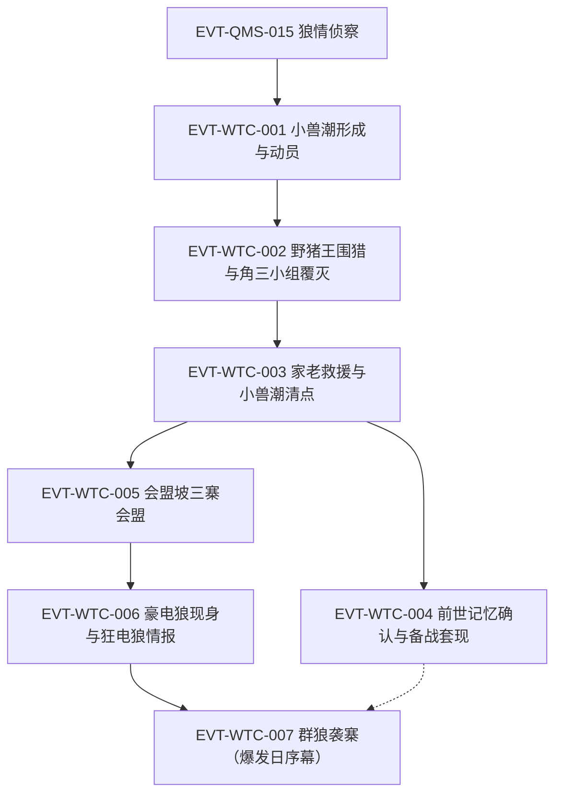

# 青茅山狼潮

青茅山弧的生存压力主线：小兽潮反常提前（电狼群意外出现）→ 一年备战期 → 大狼潮爆发。本页按 schema v2.1 组织 WTC 簇事件链，事件 ID 在本页定义、跨页只引用不复述；前情狼情侦察沿用 EVT-QMS-015（定义于[青茅山](qing-mao-mountain.md)）。形成机制、兽王等级与防御战术等世界规则见[兽潮](../world/beast-tide.md)。雷冠头狼现身、血滴子、狡电狈与青茅覆灭段尚未逐窗核验，见《资料整理》与《待核对》。

## 原著明确内容

（本页核验窗口：根原文 `蛊真人-clean.txt` 段一 14738–25358 行，第九十三节《小兽潮》至第一百四十九节《群狼袭寨》。）

- 小兽潮形成与动员：山寨附近已有一股小型兽潮形成，放着不管会渐渐形成大型兽潮、冲毁山脚村庄（14774 行，古月赤城语 [对话|已核]）；五人小组纷纷驰援，方源五百米内遇到十三波小组；内务堂和外事堂已下达动员令、颁布紧急任务（14750–14752、14792 行）[叙事|已核]。
- 电狼群反常提前：第一次兽潮中就出现电狼群属于意外——若放在先前，至少得三波小兽潮之后才会出现电狼群（15248、15532 行）[叙事|已核]；围攻野猪王战场的五头电狼皆老弱病残、狼巢底层（15290 行）[叙事|已核]。
- 野猪王围猎与角三小组覆灭：方源随组围猎野猪王（原文称该组为病蛇小组，组长角三，组员含空井，15190、15224–15232 行）；电狼群突现后角三舍队逃窜、空井跟上，二人被追杀（15230–15234 行）；方源自判无增速蛊逃不掉，切昏身边女蛊师、藏身野猪王剖开的腹中幸存（15236–15242 行）[叙事|已核]。
- 高层救援：电狼群的出现被古月高层视为小意外，三位家老亲自带队迅速稳住场面，五头电狼很快被歼（15274–15276、15296 行）[叙事|已核]。
- 小兽潮清点：三天后伤亡统计，家族高层脸色普遍难看——损失远超以往小兽潮，原因就在电狼群；小兽潮只是前奏，真正可怕的是一年之后的大型狼潮：成千上万的电狼冲击山寨，还有实力恐怖的雷冠头狼（15528–15540 行）[叙事|已核]。
- 前世记忆与备战套现：方源记忆中，狼群围攻下古月山寨几次摇摇欲坠，最凶险一次连大门都被破开，族长和一众家老牵制雷冠头狼、古月青书用自己的生命堵住大门才稳住局面；狼潮将造成三大家族严重减员，至少去五成人口（18240–18242 行）[信念|已核]（主体：方源，前世记忆）；他判定家族中许多人大大低估狼潮严重程度，据此抛售酒肆与竹楼套现、竞得赤铁舍利蛊（18236–18246 行）[叙事|已核]。
- 会盟坡三寨会盟：会盟坡是古月二代族长促成首次三寨联盟之地，此后历代联盟皆在此举行，历经改造比原貌大数十倍，成百上千蛊师汇聚（20606–20614 行）[叙事|已核]。
- 狼潮序幕：百兽王级豪电狼现身咬杀古月鹏（21858–21862 行）；情报传出狼潮中隐现千兽王级狂电狼，遇狂电狼须至少三只小组通力合作，三大家族派出三转家老应付危局（22018–22024 行）[叙事|已核]。
- 爆发日（群狼袭寨）：警报声起，山寨外漫山遍野数千头电狼，大多饥肠辘辘；三十多头豪电狼随群；狼群后方树林阴影里有三头狂电狼压阵，没有雷冠头狼的身影（25286–25350 行）[叙事|已核]；这是今年古月山寨第二次遭受狼群围攻，规模比上次强两倍不止（25332 行）[叙事|已核]；此次狼潮规模在过往历史中属罕见庞大，豪电狼群已沦为配角，上千头的狂电狼群出没山寨周围，人类生存空间被压缩到极低程度（24584–24588 行）[叙事|已核]。
- 雷冠头狼时刻表：方源记忆中雷冠头狼在八月末期出现，给古月一族造成巨大伤亡——若非族长和家老联手拼死抵挡、古月青书不惜生命爆发战力，古月山寨就灭亡了；重生以来古月青书已提前牺牲，方源警惕雷冠头狼提前出现（25354–25356 行）[信念|已核]（主体：方源，前世记忆）。

## 事件链（WTC 簇）

| 事件 ID | 事件 | 前因 | 参与者 | 后果/因果指向 | 证据 |
|---|---|---|---|---|---|
| EVT-QMS-015 | 狼情侦察：狼巢将满、来年必有狼潮、三只雷冠头狼三寨分摊 | — | 漠颜、古月漠尘 | 为三寨备战提供情报基准 | E:V1-004906（定义页：[青茅山](qing-mao-mountain.md)） |
| EVT-WTC-001 | 小兽潮形成与全寨动员 | 狼巢外溢机制（见[兽潮](../world/beast-tide.md)） | 古月山寨、五人小组 | 小组出寨作战，方源随组参战 | E:V1-014750 |
| EVT-WTC-002 | 野猪王围猎与角三小组覆灭 | EVT-WTC-001 | 方源、角三、空井 | 方源藏猪腹幸存；组长组员溃逃被猎杀 | E:V1-015236 |
| EVT-WTC-003 | 家老救援与小兽潮清点 | EVT-WTC-002 | 三位家老、古月高层 | 伤亡远超以往；确认一年后大狼潮 | E:V1-015528 |
| EVT-WTC-004 | 前世记忆确认与备战套现 | EVT-WTC-003 | 方源 | 抛售酒肆竹楼、竞得赤铁舍利蛊 | E:V1-018240 |
| EVT-WTC-005 | 会盟坡三寨会盟 | EVT-WTC-003 | 三寨蛊师 | 战时统合框架（条款细节见笔记层级） | E:V1-020612 |
| EVT-WTC-006 | 豪电狼现身与狂电狼情报确认 | EVT-WTC-005 | 古月鹏、三大家族 | 三转家老出动应付危局 | E:V1-021860 |
| EVT-WTC-007 | 群狼袭寨（爆发日序幕） | EVT-WTC-006 | 古月山寨、数千电狼、豪电狼、狂电狼 | 爆发日围寨；雷冠头狼未现身 | E:V1-025308 |

## 资料整理

以下条目来自读书笔记整理转述（A2b 补读 15501–31008 行、A 主笔记 31008–34590 行），尚未完成逐段原文核验，不得当作原著原文事实。

- 雷冠头狼段（爆发日后）：血滴子降世绞杀群狼、族长率家老追杀；方源二战白凝冰后在狼烟中联手突围（A2b 的 28418–29518 行附近）。节题已核：第一百六十五节《血滴子》（段一 28418 行）、第一百六十八节《狡电狈》（段一 29058 行），正文未逐窗核验。
- 覆灭段：血湖墓地（百余刀翅血蝠、一代飞僵、血鬼尸蛊）、天鹤上人鸟翅箭雨屠寨、白凝冰冰川封古月一代、方源屠族收血、三转跌回一转等（A 主笔记 31008–34590 行）；覆灭伤亡与传承细节待核对。

## 待核对

- 狼潮年份精确伤亡数字、三寨各自战损、雷冠头狼/血滴子/狡电狈机制与覆灭全程：须回原文逐窗核验（段一 25358 行之后至段一末），后续批次升级。
- 病蛇小组的完整编制与得名（15190 行仅见"病蛇小组伤亡惨重"）、被切昏女蛊师的后续下落，本批窗口未完整覆盖。
- "今年第二次遭狼群围攻"（25332 行）中第一次围攻对应的具体节段，本批未回溯定位。
- 方源引狼灭蛮石小组回收蛊虫、白凝冰追杀线（A2b 笔记 22300–24270 行附近）属备战期独立事件，本批未核验，不在本页事件链中。

关联页面：[兽潮](../world/beast-tide.md)、[青茅山](qing-mao-mountain.md)、[方源](../characters/fang-yuan.md)、[白凝冰](../characters/bai-ning-bing.md)、[南疆](../world/south-jiang.md)。
