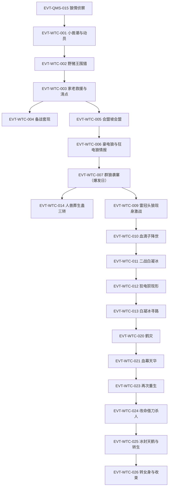

# 青茅山狼潮

青茅山弧的生存压力主线与覆灭终局：小兽潮反常提前 → 一年备战 → 大狼潮爆发（狡电狈压阵）→ 鹤灾 → 覆灭与方源第二次动用春秋蝉。本页按 schema v2.1 组织 WTC 簇事件链，事件 ID 在本页定义、跨页只引用不复述；前情狼情侦察沿用 EVT-QMS-015（定义于[青茅山](qing-mao-mountain.md)）。形成机制、兽王等级与防御战术等世界规则见[兽潮](../world/beast-tide.md)。

### 投影索引（2026-09-26 全量解耦）

- 方源弧二状态线（三转破局/天元宝莲/再次重生/改命收割）→ [方源](../characters/fang-yuan.md) ST-FANGYUAN-16…19
- 白凝冰弧二状态线（冰刃风暴/寻路/十绝体/白家大仙/自爆封天鹤/转女身）→ [白凝冰](../characters/bai-ning-bing.md) ST-BAI-01…06
- 血滴子机制（五转养用合一/裂变/血神子晋升）→ [蛊虫总表](../gu/roster.md) 血系
- 天元宝皇莲（元莲创方/十大仙蛊第六/移动元泉）→ [蛊虫总表](../gu/roster.md) 元泉系
- 狡电狈兽类规则（狼属军师/类人智慧/万兽王）→ [兽潮](../world/beast-tide.md)

## 原著明确内容

### 标段一：小兽潮与备战期（段一 14738–25358 行，第九十三节《小兽潮》至第一百四十九节《群狼袭寨》）

- 小兽潮形成与动员：山寨附近已有一股小型兽潮形成，放着不管会渐渐形成大型兽潮、冲毁山脚村庄（14774 行，古月赤城语 [对话|已核]）；五人小组纷纷驰援，方源五百米内遇到十三波小组；内务堂和外事堂已下达动员令、颁布紧急任务（14750–14752、14792 行）[叙事|已核]。
- 电狼群反常提前：第一次兽潮中就出现电狼群属于意外——若放在先前，至少得三波小兽潮之后才会出现电狼群（15248、15532 行）[叙事|已核]；围攻野猪王战场的五头电狼皆老弱病残、狼巢底层（15290 行）[叙事|已核]。
- 野猪王围猎与角三小组覆灭：方源随组围猎野猪王（原文称该组为病蛇小组，组长角三，组员含空井，15190、15224–15232 行）；电狼群突现后角三舍队逃窜、空井跟上，二人被追杀（15230–15234 行）；方源自判无增速蛊逃不掉，切昏身边女蛊师、藏身野猪王剖开的腹中幸存（15236–15242 行）[叙事|已核]。
- 高层救援：电狼群的出现被古月高层视为小意外，三位家老亲自带队迅速稳住场面，五头电狼很快被歼（15274–15276、15296 行）[叙事|已核]。
- 小兽潮清点：三天后伤亡统计，家族高层脸色普遍难看——损失远超以往小兽潮，原因就在电狼群；小兽潮只是前奏，真正可怕的是一年之后的大型狼潮：成千上万的电狼冲击山寨，还有实力恐怖的雷冠头狼（15528–15540 行）[叙事|已核]。
- 前世记忆与备战套现：方源记忆中，狼群围攻下古月山寨几次摇摇欲坠，最凶险一次连大门都被破开，族长和一众家老牵制雷冠头狼、古月青书用自己的生命堵住大门才稳住局面；狼潮将造成三大家族严重减员，至少去五成人口（18240–18242 行）[信念|已核]（主体：方源，前世记忆）；他判定家族中许多人大大低估狼潮严重程度，据此抛售酒肆与竹楼套现、竞得赤铁舍利蛊（18236–18246 行）[叙事|已核]。
- 会盟坡三寨会盟：会盟坡是古月二代族长促成首次三寨联盟之地，此后历代联盟皆在此举行，历经改造比原貌大数十倍，成百上千蛊师汇聚（20606–20614 行）[叙事|已核]。
- 狼潮序幕：百兽王级豪电狼现身咬杀古月鹏（21858–21862 行）；情报传出狼潮中隐现千兽王级狂电狼，遇狂电狼须至少三只小组通力合作，三大家族派出三转家老应付危局（22018–22024 行）[叙事|已核]。
- 爆发日（群狼袭寨）：熊骄嫚一行人被狼潮逼回山寨（"运气不好，赶上狼潮了"），提醒电狼群很快冲击山寨，话音刚落警报声响彻整个山寨（25278–25286 行）[对话|已核]（说话人：熊骄嫚）；山寨外漫山遍野数千头电狼，大多饥肠辘辘；三十多头豪电狼随群；狼群后方树林阴影里有三头狂电狼压阵，没有雷冠头狼的身影（25286–25350 行）[叙事|已核]；这是今年古月山寨第二次遭受狼群围攻，规模比上次强两倍不止（25332 行）[叙事|已核]；此次狼潮规模在过往历史中属罕见庞大，豪电狼群已沦为配角，上千头的狂电狼群出没山寨周围，人类生存空间被压缩到极低程度（24584–24588 行）[叙事|已核]。
- 雷冠头狼时刻表：方源记忆中雷冠头狼在八月末期出现，给古月一族造成巨大伤亡——若非族长和家老联手拼死抵挡、古月青书不惜生命爆发战力，古月山寨就灭亡了；重生以来古月青书已提前牺牲，方源警惕雷冠头狼提前出现（25354–25356 行）[信念|已核]（主体：方源，前世记忆）。

### 标段二：狼潮高潮与覆灭（段一 25220–34590 行，第一百五十节《我只是帮自己》至第一百九十九节《走向各自的命运》）

- 人兽葬生蛊三转破局：晋升三转须炼成奇诡血腥的人兽葬生蛊——古代一位魔道教主为壮大下属修为发明的秘方，专为二转突破三转所用（25220–25222 行）；秘方以"野兽将人吃掉，吃得点滴不剩为最佳"（25940 行）；方源以驭熊蛊驱黑熊吞食古月药乐（25936、25952 行），炼成人兽葬生蛊晋升三转（25932 节题《晋升三转》、26010 行）[叙事|已核]；狼潮期间四只狂电狼被先后消灭、山寨转危为安，而药乐失踪（26072 行）[叙事|已核]。
- 天元宝莲身世：方源面对天元宝莲推算出历史大概——近千年前一位五转蛊师（古月先祖）发现地下溶洞天然元泉，合并山脚凡人村子形成古月山寨雏形；四代族长甲等资质五转鼎盛；魔道蛊师花酒行者知晓合炼秘方，在与四代族长大战中几乎完胜、杀四代铲除大部分家老，身中月影蛊后用千里地狼蛛挖地道潜入，在元泉中合炼出天元宝莲（28026–28056 行）[叙事|已核]；天元宝莲合炼秘方由数千年前的正道蛊师元莲仙尊所创；天元宝莲本身只是三转花蛊，晋升后为六转天元宝皇莲，位列十大仙蛊第六，价值与春秋蝉不相上下，号称移动元泉、能为蛊师产元石（28058–28062 行）[叙事|已核]。
- 雷冠头狼现身与激战：蛊师们杀透重围直面雷冠头狼，方源紫色月刃（比马车还大）劈落，雷冠头狼浑身亮起雷光护甲（28240–28298 行）；雷冠头狼一度被铁网所困，后挣脱（28502 行）[叙事|已核]。
- 血滴子降世（机制全录见[蛊虫总表](../gu/roster.md)血系）：一代先祖留防手段生效——上百只赤红飞蛊从天而降、以蛊师性命喂养裂变分化（28438–28468 行）；虫群暴涨数十倍将电狼抽成干尸压制狼群、汇成大红云罩住挣脱的雷冠头狼电焦成百上千血滴子，电流克制（28470–28508 行）[叙事|已核]。
- 二战白凝冰：狼潮中白凝冰凝冰刃、催动旋踵蛊与狂风蛊，独创冰刃风暴（冰刃蛊＋旋踵蛊＋狂风蛊三蛊齐发、攻防一体，彰显北冥冰魄体战斗才情）；方源以雷翼拉开距离，持锯齿金蜈、血月蛊引而不发、白玉虚甲护身，一往无前冲撞白家蛊师防线（28840–28896 行）[叙事|已核]。
- 狡电狈现形（兽类规则见[兽潮](../world/beast-tide.md)）：一头"雷冠头狼"率狼群出现、家老惊呼情报只有三头（29066–29070 行 [对话|已核]）；两前肢肌肉萎缩、袋鼠式蹦跳（29082–29088 行）；方源识破伪装、驱策电狼大军的正是狡电狈（29090–29098 行）[叙事|已核]；
- 熊家寨"灭寨"真相反转（[已修正]）：狡电狈现形时家老们推测"熊家寨已经被灭"（29078–29080 行 [对话|已核]）；后熊家使者现身，真相为熊家主动撤离——利用先祖留下的一只蛊隐去众人身形、瞒天过海，古月族人义愤填膺斥其借狼潮削弱两寨（30434–30452 行）[叙事|已核]。
- 白凝冰寻路：狼烟中方源与白凝冰从生死仇敌到被迫联手（29294–29310 行）；方源以"人生匆匆百年……无非是走上一遭，见证精彩罢了。我已走在路上，纵死不悔"打动白凝冰（29328 行 [对话|已核]（说话人：方源））；白凝冰由"口口声声不怕死却看不透生死"到立誓"我要寻到我的路"（29342–29362 行）[叙事|已核]。
- 北冥冰魄体与白家大仙：白凝冰将北冥冰魄体之事告知白家族长——昔日测出甲等九成九，修行中晋升为十绝资质（族中典籍有载此情况）；族长叹十绝逆天、大道不容，白凝冰已寻得自己的路："真正的永生是不存在的，只要活得精彩就足够了"（30082–30116 行 [对话|已核]（说话人：白凝冰、白家族长））；族长领其入白家禁地元泉，泉中有白家一代先祖留下的蛇蛊"大仙"，生性好洁、以元泉之水为食，认主则领开启传承密藏，不认则杀（30126–30150 行）[叙事|已核]。
- 铁家神捕线：铁若男布防侦察（30154–30162 行）；铁血冷本在查另一案，一只白鹤衔信笺使其改变计划提前赶赴青茅山，而案件内容只是贾金生之死、严重程度远不及神捕重视的程度，铁若男一直存疑（31618–31632 行）[叙事|已核]；铁若男借画壁回放开窍大典指出方源被测丙等时过于平静的反常（31384–31394 行 [对话|已核]（说话人：铁若男））。
- 天元宝莲取证与元泉废弃：方源撞入元泉水晶壁（通堑蛊所化），按记忆抓取天元宝莲，泄露一丝春秋蝉气息即将三转花蛊炼化（31696–31716 行）[叙事|已核]；天元宝莲离体后元泉漩涡消散、泉水成死水——元泉被废（31724 行）；泉底深处爆发血芒将方源拽入深处（31726–31732 行）[叙事|已核]。
- 血湖墓地与血河蟒：地下血湖四周赤土发光——方源悟出石缝秘洞（花酒行者遗藏）的赤土源头就是这片血湖（31820–31822 行）；五转蛊气息中四十多米长的血河蟒自血湖深处现身狩猎（31840–31846 行）[叙事|已核]；铁血冷以铁手擒拿蛊、油龙蛊与血河蟒激战（32002–32026 行）[叙事|已核]；血河蟒后被天鹤上人座下铁喙飞鹤王斩杀（33808 行）[叙事|已核]。
- 鹤灾：天鹤上人骑白鹤而来，为毕生仇怨向古月一代的子孙后辈复仇，鹤唳应和——上万只飞鹤如漫天箭雨俯冲屠杀（32956–32990 行）[叙事|已核]；蛊师们死伤大半，第一波攻击几乎减员一半；鹤群中有大量百兽王级、千兽王级飞鹤（32994–33000 行）[叙事|已核]；"狼潮刚去，又有鹤灾吗？老天爷，我青茅山真是多灾多难啊"（32984 行 [对话|已核]）。
- 血幕天华与师兄弟恩怨：天鹤上人以黄色符面将古月一代近千年谋算的关键之物血颅蛊、阴阳转身蛊（四转，太极光球双蛊）封印拘拿——古月一代本想以阴阳转身蛊转身成人，被师兄破坏（33476–33488 行）[叙事|已核]；古月一代与天鹤上人本为同门师兄弟（孤儿同被师傅收养），天鹤上人甲等资质又得血海老祖真传之一血颅蛊（可斩杀亲族提纯血泉、灌溉空窍提升资质），丙等的古月一代由怨而魔："把不属于我的，变成我的"（33648–33666 行 [对话|已核]（说话人：古月一代））。
- 屠族放血：方源对古月族人屡施辣手、放血，宣称"我只杀古月一族，闲杂人等都给我退下"；白凝冰大笑随之杀了身边白家族人（34208–34226 行）[叙事|已核]。
- 再次重生（方源第二次动用春秋蝉）：古月一代（提升资质、真元更多）与天鹤上人（战力恢复大半）两大五转皆欲杀方源，方源自判战不能战、逃不能逃，唯一法门是本命蛊六转春秋蝉（33806–33840 行）[叙事|已核]；其空窍光膜已失、只剩粗糙石窍，因有天元宝莲而真元海（雪银）尚存大半（33832–33834 行）[叙事|已核]；动用春秋蝉须自爆——以全部修为、一身皮肉精血与所有其他蛊虫化为推动力，"和前世相比，我就算自爆，这股力量也太小了"（33852 行 [对话|已核]（说话人：方源，内心））；春秋蝉破损未复、如破船漏船，只逆流了微小的一段，钻入一朵浪花——方源重生（33848、33902–33912 行）[叙事|已核]；此后"春秋蝉再次陷入虚弱状态，不堪再用"（34134 行）[叙事|已核]。
- 改命（借刀杀人）：重生的方源假意献天元宝莲靠近古月一代，趁其不备将其抛出血罩之外、送至天鹤上人面前——天鹤上人斩杀毕生仇敌古月一代后亦成强弩之末（33998–34050、34426 行）[叙事|已核]；方源趁乱以春秋蝉气息慑服并炼化古月一代被封印的血颅蛊与阴阳转身蛊（34168–34172 行）[叙事|已核]。
- 白凝冰冰封天鹤与转生：白凝冰按方源"起死回生"之约（34150 行 [对话|已核]（说话人：方源））毅然两度自爆手臂，以浩瀚霜风使冰川加厚近十丈，将强弩之末的天鹤上人镇入冰中；天鹤上人催动五转存息玉葬蛊结成玉棺自护，被数十丈冰峰封埋（34416–34432 行）[叙事|已核]；白凝冰双臂尽毁、渐成冰雕、意识将散，方源取出阴阳转身蛊（黑白双蛊追逐绕成太极光球），将冒黑光的阴蛊投入冰雕，白凝冰破冰而出、双臂完好——"我居然真的活过来了"（34444–34462 行）[叙事|已核]。
- 转女身与收束：白凝冰随即发现自己成了女子——"阴阳转身蛊，阴蛊用于男身便可以阳转阴成为女子，阳蛊用于女身便可以阴转阳变成男儿"（34508–34512 行 [对话|已核]（说话人：方源））；两天后冰雪消融，天鹤上人以存息玉葬蛊脱困重获自由——该蛊高达五转，只要蛊师有一口气息残留就能吊住性命、让伤势延缓，结成的玉棺坚固无比、堪称防御利器（34526–34530 行）；他虽斩杀毕生仇敌古月一代，却未拿回血海真传，自虑"回去后如何向师门交代"，随即侦察冰层搜寻方源（34534–34546 行）[叙事|已核]。

## 事件链（WTC 簇）

| 事件 ID | 事件 | 前因 | 参与者 | 后果/因果指向 | 证据 |
|---|---|---|---|---|---|
| EVT-QMS-015 | 狼情侦察：狼巢将满、来年必有狼潮、三只雷冠头狼三寨分摊 | — | 漠颜、古月漠尘 | 为三寨备战提供情报基准 | E:V1-004906（定义页：[青茅山](qing-mao-mountain.md)） |
| EVT-WTC-001 | 小兽潮形成与全寨动员 | 狼巢外溢机制（见[兽潮](../world/beast-tide.md)） | 古月山寨、五人小组 | 小组出寨作战，方源随组参战 | E:V1-014750 |
| EVT-WTC-002 | 野猪王围猎与角三小组覆灭 | EVT-WTC-001 | 方源、角三、空井 | 方源藏猪腹幸存；组长组员溃逃被猎杀 | E:V1-015236 |
| EVT-WTC-003 | 家老救援与小兽潮清点 | EVT-WTC-002 | 三位家老、古月高层 | 伤亡远超以往；确认一年后大狼潮 | E:V1-015528 |
| EVT-WTC-004 | 前世记忆确认与备战套现 | EVT-WTC-003 | 方源 | 抛售酒肆竹楼、竞得赤铁舍利蛊 | E:V1-018240 |
| EVT-WTC-005 | 会盟坡三寨会盟 | EVT-WTC-003 | 三寨蛊师 | 战时统合框架 | E:V1-020612 |
| EVT-WTC-006 | 豪电狼现身与狂电狼情报确认 | EVT-WTC-005 | 古月鹏、三大家族 | 三转家老出动应付危局 | E:V1-021860 |
| EVT-WTC-007 | 群狼袭寨（爆发日） | EVT-WTC-006 | 古月山寨、数千电狼、豪电狼、狂电狼 | 爆发日围寨；雷冠头狼未现身 | E:V1-025308 |
| EVT-WTC-008 | 天元宝莲身世回溯 | EVT-WTC-018 的前置认知 | 方源（推算）、古月先祖、花酒行者、元莲仙尊（创方） | 揭示天元宝莲来历与山寨史 | E:V1-028026 |
| EVT-WTC-009 | 雷冠头狼现身与激战 | EVT-WTC-007 | 雷冠头狼、三寨蛊师、方源 | 雷冠头狼一度被铁网所困 | E:V1-028240 |
| EVT-WTC-010 | 血滴子降世 | EVT-WTC-009 | 血滴子虫群、以身育蛊的蛊师们 | 虫群暴涨数十倍压制狼群；电浆克制 | E:V1-028438 |
| EVT-WTC-011 | 二战白凝冰 | EVT-WTC-010 | 方源、白凝冰 | 冰刃风暴 vs 雷翼金蜈；白凝冰负伤 | E:V1-028840 |
| EVT-WTC-012 | 狡电狈现形（"第四头"） | EVT-WTC-011 | 狡电狈、两位族长与家老、方源 | 识破伪装；熊家寨被灭疑云 | E:V1-029092 |
| EVT-WTC-013 | 白凝冰寻路 | EVT-WTC-011 | 方源、白凝冰 | 白凝冰立誓"寻到我的路" | E:V1-029328 |
| EVT-WTC-014 | 人兽葬生蛊三转破局 | EVT-WTC-007 | 方源、古月药乐 | 方源晋升三转；药乐失踪 | E:V1-025936 |
| EVT-WTC-015 | 熊家寨"灭寨"真相反转 | EVT-WTC-012 | 熊家使者、三寨 | [已修正]：由"被狡电狈所灭"修正为主动撤离隐踪 | E:V1-030442 |
| EVT-WTC-016 | 北冥冰魄体相告与白家大仙 | EVT-WTC-013 | 白凝冰、白家族长 | 白凝冰时日无多；大仙蛇蛊守传承密藏 | E:V1-030102 |
| EVT-WTC-017 | 铁家神捕线展开 | EVT-WTC-012 | 铁血冷、铁若男、方正 | 白鹤衔信提前来青茅；贾金生案疑点；画壁查方源 | E:V1-031618 |
| EVT-WTC-018 | 天元宝莲取证与元泉废弃 | EVT-WTC-008 | 方源 | 天元宝莲入手；元泉成死水 | E:V1-031710 |
| EVT-WTC-019 | 血湖墓地与血河蟒 | EVT-WTC-018 | 方源、血河蟒、铁血冷、铁喙飞鹤王 | 方源被拽入血湖深处；血河蟒被斩杀 | E:V1-031840 |
| EVT-WTC-020 | 鹤灾 | EVT-WTC-012 后续战局 | 天鹤上人、上万飞鹤、三寨蛊师 | 蛊师死伤大半；野战无险可守 | E:V1-032956 |
| EVT-WTC-021 | 血幕天华与师兄弟恩怨 | EVT-WTC-020 | 古月一代、天鹤上人、方源、白凝冰 | 血颅蛊/阴阳转身蛊被封印拘拿；魔道自白 | E:V1-033486 |
| EVT-WTC-022 | 屠族放血 | EVT-WTC-021 | 方源、白凝冰、古月/白家族人 | 方源宣称只杀古月一族；白凝冰杀白家人 | E:V1-034208 |
| EVT-WTC-023 | 再次重生（第二次动用春秋蝉） | EVT-WTC-021 | 方源、春秋蝉 | 自爆催动；仅逆流微小一段短程重生；蝉不堪再用 | E:V1-033852 |
| EVT-WTC-024 | 改命（借刀杀人） | EVT-WTC-023 | 方源、古月一代、天鹤上人 | 古月一代被抛出血罩遭天鹤上人斩杀；方源炼化血颅蛊/阴阳转身蛊 | E:V1-034028 |
| EVT-WTC-025 | 冰封天鹤与阴阳转身转生 | EVT-WTC-024 | 白凝冰、天鹤上人、方源 | 天鹤上人被镇入冰峰玉棺；白凝冰转生复活 | E:V1-034448 |
| EVT-WTC-026 | 转女身与收束 | EVT-WTC-025 | 白凝冰、方源、天鹤上人 | 白凝冰转为女子；天鹤上人脱困搜寻；未得血海真传 | E:V1-034508 |

## 资料整理

以下条目来自读书笔记整理转述（A2b 补读 15501–31008 行、A 主笔记 31008–34590 行），尚未完成逐段原文核验，不得当作原著原文事实。

- 三族大比武定赔偿、血海真传的具体内容与最终下落、覆灭总伤亡数字与三族残余、方源离山的确切节段（段一末至段二初）：仍为笔记层级，待后续批次核验。
- 方源屠族放血的具体用途（血泉提纯细节、与血颅蛊的关系）：节 198 中段未逐窗核验，仅确认屠族放血行为本身（34208–34226 行）。

## 待核对

- 病蛇小组的完整编制与得名（15190 行仅见"病蛇小组伤亡惨重"）、被切昏女蛊师的后续下落，本批窗口未完整覆盖。
- "今年第二次遭狼群围攻"（25332 行）中第一次围攻对应的具体节段，本批未回溯定位。
- 方源引狼灭蛮石小组回收蛊虫、白凝冰追杀线（A2b 笔记 22300–24270 行附近）属备战期独立事件，本批未核验，不在本页事件链中。
- 白凝冰冰川封印与意识消散的程度在节 196–199 间反复（33812 行"意识消散殆尽"与 33996 行"冷眼旁观"并存），其冰魄体状态边界待白凝冰实体页批次核验（本页只按事件链记录各锚点）。

关联页面：[兽潮](../world/beast-tide.md)、[青茅山](qing-mao-mountain.md)、[方源](../characters/fang-yuan.md)、[白凝冰](../characters/bai-ning-bing.md)、[南疆](../world/south-jiang.md)、[元莲仙尊](../characters/yuan-lian-xian-zun.md)、[春秋蝉](../gu/spring-autumn-cicada.md)。
