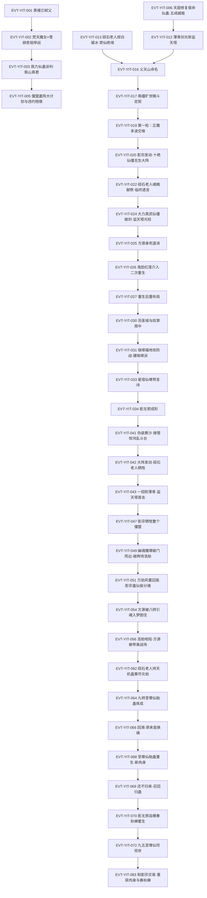

# 义天山大战

弧九枢纽页，覆盖段四 172002 行至段五 200000 行（第二百九十五节—第六十二节）。本页按 schema v2.1 组织 YIT 簇事件链，采信三段并行蒸馏（a9-01…a9-04）的逐行核对结果。

**核心定义**：义天山是南疆眉峰以南、离丘以东、石龙洞窟附近的一座无名山峰（175198），因萧山在此创建义天寨而得名（176290）；山地底埋藏仙蛊屋**惊鸿乱斗台**与八转大力真武仙僵（176294），被十多位南疆蛊仙当作赌斗场（175914、176324）。**影宗**在此设局，以**十绝仙僵无生大阵**困杀南疆众仙、炼出九转**至尊仙胎蛊**；方源在此身死（177608），经**鬼脸红莲**二次重生（177680–177716），并在重生后重走义天山、夺取至尊仙胎蛊获得新肉身（187780）。

**本页最重要的一条结构事实（务必先读）**：义天山事件在原文中发生**两度**，分属方源的两条命——笔记以"义天山一世／二世"称之（notes:00-覆盖总览与勘误）。本页按叙事顺序分列，**两轮不得合并**：

| 轮次 | 行域 | 状态 | 收束 |
|---|---|---|---|
| 第一轮（义天山一世） | 172002–177608 | 方源以散仙「盛鹰」身份旁观并混入，为棋子级参与者 | 方源被监天塔光柱余势所逼、催动春秋蝉失败，**身死道消**（177608） |
| 二次重生 | 177610–178912 | 鬼脸红莲修复春秋蝉，意志逆流至一年多前 | 落点＝正在炼制变形仙蛊（177828） |
| 第二轮（义天山二世） | 179001–187999 | 方源以「智多星陈道」「黄沙」等身份主导布局，接管惊鸿乱斗台 | 魂魄入至尊仙胎蛊，**得新肉身**（187780–187881） |
| 收束余波 | 188002–200000 | 影无邪自爆春秋蝉短程重生，方源转战北原/东海 | 三条待续线（原肉身、态度蛊、宝黄天） |

本页 `E:V4-` 覆盖段四（含 188001 前），`E:V5-` 覆盖段五（188002 起，段表见 [六段段表](../source/section-index.md)）；187777–188001 五行区间的段号归属见《待核对》。前情承接弧八末的北原僵盟线与中洲落天河线，后接弧十的[逆流河](reverse-flow-river.md)/[琅琊福地攻防战](langya-blessed-land-invasion.md)与本弧余波；宿命蛊线外接[宿命大战](fate-war.md)。

## 投影索引

本页只承载 L2（谁／何时／何地／因果）；实体状态与机制细节已外移，导航入口如下：

- 方源弧九状态线（仙僵躯·盛鹰／黄沙／陈道马甲·封印仙窍·换魂·九五至尊仙窍·主修变化道）→ [方源](../characters/fang-yuan.md)（ST-FANGYUAN 系列）
- 黑楼兰弧九状态线（弑父·态度蛊伪装黑月仙子·新盟约·被影无邪控制）→ [黑楼兰](../characters/he-lou-lan.md)
- 白凝冰（北冥冰魄体·砚石老人棋子）→ [白凝冰](../characters/bai-ning-bing.md)；砚石老人、影无邪、幽魂魔尊、薄青、七星子等影宗侧人物 → [敌对人物总表](../characters/enemy-roster.md)、[人物总表（续）](../characters/roster-2.md)
- 红莲魔尊（鬼脸红莲、红莲真传）→ [红莲魔尊](../characters/red-lotus.md)；星宿仙尊（预言诗、监天塔）→ [星宿仙尊](../characters/star-constellation.md)
- 春秋蝉与二次重生机制（含 ST-CICADA-07…09 影无邪劫持春秋蝉）→ [春秋蝉](../gu/spring-autumn-cicada.md)；宿命仙蛊（五成威能、绝代攻势）→ [宿命蛊](../gu/fate-gu.md)；智慧蛊（承认条件＝肉身魂魄归一）→ [智慧蛊](../gu/wisdom-gu.md)；态度蛊 → [月光蛊](../gu/moon-glow-gu.md) 所在蛊类目（蛊虫总表）
- 十绝仙僵无生大阵＝炼道大阵、吞魂之术、道痕布阵 → [炼道](../rules/refinement.md)、[道痕](../rules/dao-marks.md)、[杀招总表](../rules/killer-moves.md)
- 引魂入梦与梦道（纯梦求真体、梦道凡蛊×解谜仙蛊＝解梦）→ [梦道](../rules/dream-path.md)；浩劫与万劫（舍利金刚劫、天缘光鹿、绝刺雨、琴心劫、星流劫、灰忆、太清空宇、荆虬）→ [灾劫](../rules/tribulation.md)
- 影宗本体（幽魂魔尊分魂格局、五域下宗、生死福地）→ [影宗](../world/shadow-sect.md)；僵盟（影宗台面布置、被整宗献祭）→ [僵盟](../world/zangmeng.md)；监天塔、天庭动员与沙婆婆重建 → [天庭](../world/heavenly-court.md)
- 义天山地理与其他南疆设定 → [南疆](../world/south-jiang.md)；灵魂／魂魄相关设定 → [魂道](../world/soul-path.md)；中洲落天河线与灵缘斋 → [中洲](../world/central-plain.md)、[十大古派](../world/ten-ancient-sects.md)
- "天意"作为隐藏对手、寿蛊与灾劫为杀手锏 → [命运](../themes/fate.md)；至尊仙胎蛊与永生之蛊 → [永生](../themes/immortality.md)；人道造肉身与死路三关卡（荡魂山／落魄谷／逆流河）→ [人祖传](../themes/ren-zu-zhuan.md)
- 余波段的天意行动边界与能力（只在灾劫时才能亲自出手、平时只能布局；星宿仙尊之后转「狡诈」；覆盖五域两天；灾劫中可酿成人劫）→ [命运](../themes/fate.md)、[灾劫](../rules/tribulation.md)；已外移（2026-09-26 补录批）→ [灾劫](../rules/tribulation.md) TRIB-025（E:V5-200556、E:V5-200724、E:V5-203124）
- 余波段的天意生命与里应外合（天意充斥的生命不可奴役、被我用意冲刷即自爆；仙窍内天意与外界天意相互呼应）→ [命运](../themes/fate.md)；已外移（2026-09-26 补录批）→ [命运](../themes/fate.md)《原著明确内容》（E:V5-201058、E:V5-202314）
- 余波段的灾劫节律与平衡（六转十年一地灾／百年一天劫，三百年三次天劫晋升七转；方源因资质逆天增幅骇人、间隔仅两个月；拼凑灾劫仍受天道平衡约束）→ [灾劫](../rules/tribulation.md)；已外移（2026-09-26 补录批）→ [灾劫](../rules/tribulation.md) 既有条目 TRIB-002/007/008/018 承载（E:V5-202884、E:V5-203324）
- 上古战阵「四通八达」（以人为阵眼、对仙蛊需求低于常规手段，故可绕过定仙游型封锁）→ [杀招总表](../rules/killer-moves.md)；已外移（2026-09-26 补录批）→ [杀招总表](../rules/killer-moves.md)《弧七补录个案》（E:V5-201522）
- 悔池与天下三池（悔池为宙道仙蛊屋，凭成功印记＋光阴支流重炼仙蛊、成功率十之五六，但一经坐落不可移动）→ [天庭](../world/heavenly-court.md)；已外移（2026-09-26 补录批）→ [影宗](../world/shadow-sect.md)「乱流海域悔池」（影宗资产、语义落位）＋[炼蛊术语体系](../rules/refinement.md) REF-022（E:V5-204076）
- 魂道三方面（壮魂／炼魂／安魂）与我意蛊蛊方源自影宗 → [魂道](../world/soul-path.md)；已外移（2026-09-26 补录批）→ [魂道](../world/soul-path.md)《原著明确内容》（三方面本有载，新增我意蛊与生死门安魂湖条目）（E:V5-201820、E:V5-201872）
- 全派通修（方源因肉身道痕互不干扰而可全派通修，全书唯一）→ [修炼体系](../world/cultivation-system.md)、[道痕](../rules/dao-marks.md)；已外移（2026-09-26 补录批）→ [修炼体系](../world/cultivation-system.md)「全派通修」＋[道痕](../rules/dao-marks.md) 既有 DM-005/DM-025（E:V5-203214）
- 盟约约束与势力结构（九转不出、八转称雄；家族制超级势力的外姓太上家老极难得；琅琊派盟约在重大危机时不再豁免）→ [琅琊福地攻防战](langya-blessed-land-invasion.md)；已外移（2026-09-26 补录批）→ [琅琊福地攻防战](langya-blessed-land-invasion.md)《原著明确内容》（E:V5-202166、E:V5-205552）

段际钩子（不在本页展开）：琅琊福地主线→[琅琊福地攻防战](langya-blessed-land-invasion.md)；逆流河与生死门→[逆流河](reverse-flow-river.md)；宿命蛊与五域大战→[宿命大战](fate-war.md)；中洲炼蛊大会与帝君城→[中洲炼蛊大会](central-plain-refinement-conference.md)。弧位与覆盖度见[十三弧事件链总览](story-arc-overview.md)。

## 事件链

| 事件 ID | 事件 | 前因 | 参与者 | 后果 | 因果指向 | 主锚点 |
|---|---|---|---|---|---|---|
| EVT-YIT-001 | 黑城被擒·黑楼兰弑父 | 焚天魔女独擒黑城 | 黑楼兰、黑城、苏仙儿亲情、焚天魔女、黎山仙子 | 黑城丧命，黑家威名扫地 | 黑楼兰人物弧光支点；黑家情报线开 | E:V4-172310 |
| EVT-YIT-002 | 焚天魔女×雪胡老祖停战·黑家被算 | 僵盟与大雪山全面战争 | 焚天魔女、雪胡老祖、黑家四老 | 两方停战，炎煌雷泽仙僵归僵盟 | 该仙僵后成十绝阵阵眼 | E:V4-172566 |
| EVT-YIT-003 | 我力仙蛊谈判·「紫山真君」底牌 | 焚天魔女索要我力仙蛊 | 方源、焚天魔女、黎山仙子、黑楼兰 | 方源交出我力仙蛊、换新盟约与脱盟 | 「紫山真君」虚构身份确立并反复复用 | E:V4-172888 |
| EVT-YIT-004 | 焚天魔女示范涅槃火·仙僵↔活人 | 焚天魔女身负宙道伤势、已化仙僵 | 焚天魔女、方源 | 方源得摆脱仙僵的路径参照 | 影响其恢复人身的决策链 | E:V4-173040 |
| EVT-YIT-005 | 僵盟蛊阵大计划与违约赔偿 | 雪胡老祖盗墓致僵盟总部下令 | 僵盟总部、焚天魔女、黎山仙子、方源 | 焚天魔女违约、方源索赔得三只炎道仙蛊 | 方源筹齐涅槃火整套蛊虫 | E:V4-173592 |
| EVT-YIT-006 | 天庭修复宿命仙蛊·五成威能 | 红莲魔尊打坏宿命仙蛊 | 监天塔主、白沧水、碧晨天、炼九生 | 宿命仙蛊恢复五成威能、启动拨乱反正 | 支撑宿命大战底层设定；逼影宗提前启动 | E:V4-173166 |
| EVT-YIT-007 | 黑楼兰亮态度蛊·自称黑月仙子 | 黑楼兰决意重回黑家潜伏 | 黑楼兰、黎山仙子、方源 | 态度蛊现世；方源反推前世真相 | 成为方源后续交易核心筹码 | E:V4-173292 |
| EVT-YIT-008 | 赵怜云继承盗天真传「神不知」 | 灵缘斋倒凤派系欲对抗凤金煌 | 赵怜云、徐浩、李君影 | 神不知入手，「鬼不觉」线索指向落魄谷 | 引出凤九歌之死与鬼不觉 | E:V4-173404 |
| EVT-YIT-009 | 灵缘斋内斗·薄青血字线索 | 凤九歌失踪、门派威势一落千丈 | 太上大长老、白晴仙子、徐浩、凤金煌 | 白晴循血字查出墨瑶—落天河源头 | 引出剑纵中洲 | E:V4-174342 |
| EVT-YIT-010 | 凤九歌死于落魄谷大同风 | 盗天传承被敌人利用困住凤九歌 | 凤九歌、赵怜云、凤仙太子 | 凤九歌身陨、遗血书「薄青」 | 中洲十大古派平衡被打破 | E:V4-173848 |
| EVT-YIT-011 | 方源夺取落魄谷 | 黑楼兰拷问黑城得百日大战情报 | 方源、黑楼兰、黎山仙子 | 落魄谷整座拔起收入仙窍 | 成魂道修行圣地；三秘境在握 | E:V4-174162 |
| EVT-YIT-012 | 薄青剑光「剑纵中洲」·监天塔被斩 | 白晴赴落天河源头查墨瑶 | 白晴仙子、薄青剑光、天庭四仙 | 玄冰岛、蜈蚣峡谷被劈，监天塔断去半截 | 中洲蛊仙界震动；天庭警觉存亡之战 | E:V4-174976 |
| EVT-YIT-013 | 砚石老人授白凝冰·禁仙绝境与惊鸿乱斗台 | 影宗筹谋十万年、以天意为敌 | 砚石老人、白凝冰、黑袍蛊仙 | 义天山化为禁仙绝境，乱斗台幻影出世 | 生成旷世赌斗；白凝冰被影宗抛弃 | E:V4-175294 |
| EVT-YIT-014 | 薄青仙僵苏醒·白沧水殉·七星子被诛 | 落天河底群仙争夺薄青仙僵 | 薄青（墨瑶残魂）、白晴、白沧水、七星子 | 白沧水阵亡、七星子被劈成两半 | 天庭八仙结阵围杀月余，仙僵上天庭 | E:V4-175698 |
| EVT-YIT-015 | 萧家内斗与萧山受蛊 | 武家借萧吹儿之案闹事 | 萧山、萧自封、萧芒、太上长老 | 萧山逃亡、体内融入仙蛊 | 直通义天寨创建；二人皆棋子 | E:V4-176126 |
| EVT-YIT-016 | 义天山命名·义天寨创建 | 萧山走投无路、得心底呼唤考验 | 萧山、孙胖虎、周星星、方源（远观） | 义天寨立、无名山峰得名义天山 | 地底乱斗台＋大力真武仙僵真相点明 | E:V4-176290 |
| EVT-YIT-017 | 南疆「旷世赌斗」定契 | 八转不露面、正魔均势 | 南疆数十蛊仙、梅花婆婆、瓜老、方源（盛鹰） | 定契：胜者得地底机缘、他仙三年不得出手 | 参赌心理与外溢战意机制确立 | E:V4-176324 |
| EVT-YIT-018 | 方源封印仙窍·混入义天寨 | 禁仙绝境只针对仙窍 | 方源、焚天魔女（换空绝老仙传承） | 化身三转蛊师上山、持续转化战意 | 终局自保与图谋乱斗台的唯一凭仗 | E:V4-176860 |
| EVT-YIT-019 | 第一轮：义天山正魔多波交锋 | 禁仙绝境使蛊仙只能借凡人棋子 | 义天寨三人组、陆钻风、武神通、仇九、魔无天等 | 多波互有胜负、双方罢战休整 | 方源改变历史（王逍、丁浩、二代僵王缺席） | E:V4-176616 |
| EVT-YIT-020 | 影宗发动·十绝仙僵无生大阵 | 天庭已发觉影宗动向 | 砚石老人＋十余黑袍蛊仙、影无邪、四位南疆八转 | 南疆四八转、九七转、十余六转尽困死局 | 弧九正题事件；阵名首见 | E:V4-177188 |
| EVT-YIT-021 | 影无邪诞生机制与引魂入梦首战 | 砚石老人育出纯梦求真体 | 影无邪、砚石老人、四位南疆八转 | 八转「狂风」贾谊当场沉睡、被雷轰碎 | 梦道越阶战力成为终局悬念装置 | E:V4-177498 |
| EVT-YIT-022 | 砚石老人魂魄献祭·临终遗言 | 他耗尽余寿为影无邪推算 | 砚石老人、影无邪、数位影宗蛊仙 | 遗言「自己……人……小心……功亏一篑」 | 全弧最大悬置：背叛者未揭示 | E:V4-177226 |
| EVT-YIT-023 | 十绝体阵眼揭示 | 八转任海洋单挑阵眼蛊仙 | 炎煌雷泽、北冥冰魄体、逍遥智心体、彭世龙、任海洋 | 十绝体接连现身阵眼 | 方源排除僵盟、锁定影宗 | E:V4-177442 |
| EVT-YIT-024 | 大力真武仙僵破封·监天塔光柱 | 南疆七转六转死绝、义天山地震 | 八转大力真武仙僵、两位南疆八转、天庭监天塔 | 仙僵与二八转被光柱打成齑粉 | 光柱余势逼向方源 | E:V4-177602 |
| EVT-YIT-025 | 方源身死道消 | 监天塔全力一击无法阻挡 | 方源、春秋蝉 | 春秋蝉载意志入河即崩溃炸碎 | 与鬼脸红莲介入构成因果对 | E:V4-177608 |
| EVT-YIT-026 | 鬼脸红莲介入光阴长河·二次重生 | 方源意志即将被河水消融 | 方源、鬼脸、红莲 | 红光回溯使春秋蝉强行复原，意志逆流 | 二次重生：落点＝一年多前炼变形仙蛊时 | E:V4-177680 |
| EVT-YIT-027 | 重生后取宝失败与重布局 | 方源自以为可先取乱斗台 | 方源 | 地底空无一物（白凝冰未催动仙蛊）；拾得地沟十八块仙材 | 春梦果树、地沟仙材成本钱 | E:V4-178046 |
| EVT-YIT-028 | 与黑楼兰新盟约·借态度蛊 | 重生后需八转外力为仙蛊屋添动力 | 方源、黑楼兰、黎山仙子、太白云生 | 借得态度蛊一年、以我力仙蛊换奴隶仙蛊、两人连运 | 以连运抵消春秋蝉弊端 | E:V4-178580 |
| EVT-YIT-029 | 购得并改良「见面曾相识」 | 缺盗天招牌杀招 | 方源、琅琊地灵 | 五块八转仙材购得原版、改良版达六成威能 | 卷五伪装行动的前提 | E:V4-178892 |
| EVT-YIT-030 | 羽圣城攻防战与奴隶周中 | 白海沙陀率西漠蛊仙围羽圣城 | 白海沙陀、羽民太上大长老、郑灵、周中、方源 | 方源奴隶周中、接管羽圣城；羽民迁入星象福地 | 奴隶仙蛊重创其魂魄→求落魄谷 | E:V4-179120 |
| EVT-YIT-031 | 琅琊福地攻防战·创建琅琊派 | 琅琊福地再遭强敌入侵 | 琅琊地灵、秦百胜、姜钰、方源、黑楼兰、黎山仙子 | 秦百胜抢蛊后撤退；地灵创琅琊派、邀方源任客卿太上长老 | 方源索「危难时即时施救」承诺 | E:V4-179624 |
| EVT-YIT-032 | 玉露福地·「智多星陈道」扬名东海 | 鲨魔接僵盟任务、进度紧迫 | 方源、鲨魔、苏白曼、卜单、太白云生 | 连破冰雨冻土/战魂沙场/八门迷宫，掌三招战场杀招 | 名扬东海→引来推算→需星雾掩 | E:V4-180018 |
| EVT-YIT-033 | 繁星洞天·星宿仙尊预言诗 | 繁星洞天破碎、碎片洒落中洲 | 方源、凤金煌、白晴、星宿仙尊（梦中影像） | 得预言诗但事后记不住 | 诗后三次应验（落魄谷、影宗真面目） | E:V4-180274 |
| EVT-YIT-034 | 纯梦求真体孕育·影无邪成形 | 生死福地藏生死门与幽魂梦境 | 砚石老人、余木蠢（成真仙蛊）、幽魂魔尊（梦中） | 银白光茧炸碎、裸身青年成形；九时辰寿命、每时辰升一转 | 影宗最强战力替代薄青 | E:V4-183570 |
| EVT-YIT-035 | 活捉黑城·落魄谷百日大战结果 | 中洲蛊仙与影宗在落魄谷血战百日 | 凤九歌、秦百胜、炎煌雷泽、黑城、回风子、方源 | 影宗败、仅炎煌雷泽与黑城突围；方源以星魂战场活捉黑城 | 搜魂得百日大战与落魄谷情报 | E:V4-181468 |
| EVT-YIT-036 | 二探落魄谷·继承「鬼不觉」 | 中洲蛊仙已返、仅回风子看守 | 方源、回风子、凤九歌、盗天魔尊（本杰孙） | 凤九歌穿门而出、盗天留言赠「鬼不觉」 | 方源确认自身天外之魔身份 | E:V4-181760 |
| EVT-YIT-037 | 薄青仙僵出世·盗取六只剑道仙蛊 | 预言诗第二句指向剑仙薄青与落天河 | 方源、薄青仙僵（墨瑶残魂） | 得剑眉/浪剑/飞剑/剑遁等七转蛊与八转仙蛊 | 薄青战力打折、失慧剑蛊 | E:V4-182516 |
| EVT-YIT-038 | 天庭修复监天塔·三仙共感危机 | 剑光穿透天庭、监天塔被切成两半 | 监天塔主、碧晨天、炼九生、白沧水 | 抢修成功、塔主自述从炼蛊大会起即感危机 | 三仙共识「有事要发生」 | E:V4-182614 |
| EVT-YIT-039 | 修魂：荡魂山壮魂＋落魄谷炼魂 | 魂魄因奴隶羽民蛊仙而严重受损 | 方源、黎山仙子、黑楼兰、西漠萧家 | 魂魄凝实至少一倍、奴隶负担减三成 | 质变＋量变组合成其常态修炼法 | E:V4-182808 |
| EVT-YIT-040 | 薄青等强攻天莲派 | 薄青仙僵离落天河升空 | 薄青、七星子、宋紫星、余木蠢、天庭三仙、天莲派 | 八转级超级大战、影宗拖延后撤退 | 塔主算出「义天山」为关键、率十二八转赶来 | E:V4-182868 |
| EVT-YIT-041 | 伪装「黄沙」·提前加入并接管惊鸿乱斗台 | 乱斗台出世、大战在即 | 方源、萧山、周星星、孙胖虎、回风子 | 吞并南疆蛊仙战意、完成全面接管；以见面曾相识伪装「惨死」过关 | 乱斗台＝宙道仙蛊屋，可封印外来打击再用出 | E:V4-183680 |
| EVT-YIT-042 | 大阵发动·砚石老人牺牲 | 天劫地灾因重生蝴蝶效应提前降临 | 砚石老人、影无邪、南疆众蛊仙、方源 | 遗言「小心自己人」；影宗蛊仙献魂使大阵完善至九成 | 定仙游在此无效；笼方圆万里、禁宇禁音 | E:V4-183880 |
| EVT-YIT-043 | 一招败薄青·监天塔首击 | 薄青操纵羽圣城撞向义天山 | 方源、薄青、监天塔主、天庭十二八转 | 以巨阳仙尊九转黄杏仙元撞飞羽圣城；三座影宗仙蛊屋分崩 | 塔主未对方源下杀手 | E:V4-184082 |
| EVT-YIT-044 | 大阵真相与炼九生自曝 | 大力真武仙僵顶位使大阵达十成 | 影宗诸仙、监天塔主、炼九生 | 阵本质＝炼道大阵；炼九生自曝影宗内奸后自毁成大同一风 | 监天塔损毁四成、最强攻势不能再用 | E:V4-184434 |
| EVT-YIT-045 | 影无邪引魂入梦对方源 | 影无邪升至七转 | 影无邪、方源、星宿仙尊（梦中） | 方源以「解梦」连破三次；得星宿仙尊第三股信息 | 推出影宗真面目「幽夜漫漫魂梦长」 | E:V4-184566 |
| EVT-YIT-046 | 三场浩劫·仙蛊屋双双溃散 | 天劫升格为浩劫 | 方源、黑楼兰、黎山仙子、天庭、影宗、羽圣城 | 舍利金刚劫/天缘光鹿/绝刺雨过后，羽圣城与乱斗台双双分解 | 乱斗台吸劫后实力反增 | E:V4-185102 |
| EVT-YIT-047 | 影宗牺牲整个僵盟 | 阴云稀薄、仙僵再藏不住身形 | 七星子、五域仙僵、焚天魔女、黎山仙子、太白云生 | 仙僵无神智地自献入阵；僵盟在五域彻底毁灭 | 影宗此前「强制大炼蛊阵」任务实为暗算 | E:V4-185050 |
| EVT-YIT-048 | 监天塔主被梦困 | 影无邪升至八转 | 影无邪、监天塔主、天庭众仙 | 塔主梦中大笑后自省、现实中唤不醒 | 天庭改为轮流接手操纵监天塔 | E:V4-185216 |
| EVT-YIT-049 | 幽魂魔尊破门而出·连破两场浩劫 | 义天山废墟中影宗福地（生死福地）门户洞开 | 幽魂魔尊、监天塔主、方源一方 | 鬼手撕碎虚空导入星流劫海啸，琴心劫与星流劫被轻易破解 | 「生死门」与「天意之敌」写实登场 | E:V4-185362 |
| EVT-YIT-050 | 绣楼缝鬼手·千丈魔尊成形 | 天庭另结第二座仙蛊屋 | 天庭蛊仙、薄青、魔尊幽魂 | 绣楼以道痕为线缝鬼手；鬼手化黑水成三头千臂千丈巨怪 | 黑海泽国淹没方圆万里 | E:V4-185552 |
| EVT-YIT-051 | 万劫风雷囚笼·影宗蛊仙皆分魂 | 浩劫对幽魂无效、苍天升格为万劫 | 幽魂魔尊、影宗众蛊仙、影无邪、薄青 | 影宗蛊仙自投大阵；真相：皆为幽魂魔尊分魂 | 偌大影宗只是幽魂的独角戏 | E:V4-185750 |
| EVT-YIT-052 | 黎山仙子之死·影无邪点破天外之魔 | 大阵包裹、宇道被禁 | 仙僵薄青、黎山仙子、太白云生、黑楼兰、影无邪、方源 | 黎山仙子被剑气化为血沫；影无邪当面点破方源身份与春秋蝉已被算尽 | 天外之魔身份首次被影宗当面说出 | E:V4-185798 |
| EVT-YIT-053 | 十万年前·幽魂魔尊屠亲 | 插叙 | 青年「小幽」、家族高层、亲爷爷 | 以「只是不爽」为由斩亲爷爷为两截 | 交代杀道心性成因；十万年后化千丈魔怪 | E:V4-185828 |
| EVT-YIT-054 | 方源被八转引魂入梦困住·自认已败 | 影无邪决定先睡了方源 | 影无邪、方源、星宿仙尊、监天塔主 | 六次解梦无效、六转对八转相差太大 | 方源自知此次已败（185994） | E:V4-185986 |
| EVT-YIT-055 | 浩劫地陷·方源被带离战场 | 幽魂渡劫中、天庭欲再攻 | 魔尊幽魂、监天塔、影无邪、薄青、黑楼兰、太白云生 | 地陷吸摄众仙；黑楼兰、太白云生抢过沉睡的方源后撤 | 方源肉身被带离，成为换魂的物理前提 | E:V4-186002 |
| EVT-YIT-056 | 万劫灰忆·幽魂童年 | 第二场万劫为灰云 | 魔尊幽魂、天庭蛊仙 | 父亲奉族长命「大义灭亲」杀其母；偷听到爷爷决定暗杀其父 | 影无邪因「刚出生」而无此负担 | E:V4-186044 |
| EVT-YIT-057 | 食道传承试炼·魂道反制兽人 | 幽魂渡食道开创者之试炼 | 蛊仙幽魂、龙角鳄首兽人蛊仙、墨瑶残魂（旁观） | 幽魂以含魂血肉反制、兽人僵死 | 得食道真传，据以创「吞魂之术」 | E:V4-186336 |
| EVT-YIT-058 | 万劫太清空宇·幽魂往昔大幕 | 第三场万劫为宇道 | 魔尊幽魂、天庭蛊仙 | 灰雾连番呈现幽魂生平：羽圣城之战、盗天自陈本名、红莲鬼脸、读人祖传 | 幽魂死因（伤重不治或自伤）成悬念 | E:V4-186502 |
| EVT-YIT-059 | 影宗成立与分魂格局 | 幽魂以吞魂之术复原 | 幽魂、十个分魂（出七）、墨瑶、薄青 | 七人创影宗、分代号赤橙黄绿青蓝紫 | 揭出薄青／墨瑶悲剧根因 | E:V4-186710 |
| EVT-YIT-060 | 十尊仙胎蛊大阵因天意而毁 | 分魂「绿」在北原地沟布阵炼蛊 | 绿、黄 | 残存仙材「竟然都充斥天意」，绿被迫放弃 | 至尊仙胎蛊的前身与天意阻碍 | E:V4-186880 |
| EVT-YIT-061 | 影宗智囊大荔被镇压 | 红莲真传的宙道推算指向大荔 | 大荔、额有红莲刻痕的神秘蛊仙 | 大荔被惊鸿乱斗台镇压 | 方源推其为八转大力真武仙僵 | E:V4-186892 |
| EVT-YIT-062 | 砚石老人持天机蛊算尽灾劫·替方源遮掩 | 影宗历代智囊前仆后继的积累 | 砚石老人、秦百胜、姜钰、炎煌雷泽、凤九歌 | 算出方源身怀春秋蝉、是天外之魔且已逃脱宿命；用天机蛊一次损耗上百载寿元 | 天机蛊首见（乐土所创）；影宗得以布置万劫 | E:V4-186988 |
| EVT-YIT-063 | 监天塔主最后反扑·塔毁人亡 | 末场万劫「荆虬」缠身 | 监天塔主及留守八转、魔尊幽魂 | 以虚化操纵万劫转攻大阵；塔彻底崩解、塔主与留守者尽亡 | 塔碎片顺光柱回流白天，重中之重是宿命仙蛊 | E:V4-187056 |
| EVT-YIT-064 | 墨瑶残魂被吞·九转至尊仙胎蛊炼成 | 十绝仙僵已全部主动牺牲 | 仙僵薄青（墨瑶残魂）、魔尊幽魂、影无邪 | 墨瑶残魂被吞；幽魂抚九彩圆球自陈数万年筹谋功成 | 至尊仙胎蛊成型→方源夺蛊 | E:V4-187244 |
| EVT-YIT-065 | 方源赶到已迟·引魂入梦夺蛊 | 方源醒来、定仙游先失败一次 | 魔尊幽魂、影无邪（实为方源）、太白云生、黑楼兰、方源 | 方源赶到时只见面目全非的战场；「影无邪」扣住幽魂、道出引魂入梦 | 表层叙事，成果归属反转 | E:V4-187334 |
| EVT-YIT-066 | 回溯·原来是换魂 | 方源被骗得七转换魂仙蛊、得星宿诗末句提示 | 方源、影无邪、仙僵薄青、星宿仙尊、墨瑶 | 方源与影无邪调换魂魄；「影无邪」即方源、「方源」即影无邪 | 解释 186001–187351 全部叙述的视角真相 | E:V4-187356 |
| EVT-YIT-067 | 方源截取最大成果 | 诗句本意是趁幽魂虚弱时毁蛊 | 方源、梦境中的魔尊幽魂、墨瑶残魂、监天塔 | 毅然改为直取魔尊幽魂、以不完整的引魂入梦得手 | 脱离影无邪肉身、魂魄飘入至尊仙胎蛊 | E:V4-187558 |
| EVT-YIT-068 | 至尊仙胎蛊重生·得新肉身 | 魂魄入蛊即被「融化」 | 方源、至尊仙胎蛊 | 仙蛊经九九八十一种变化，元胎化婴孩、落地成十六岁少年 | 新肉身「无父无母」→可穿界壁 | E:V4-187780 |
| EVT-YIT-069 | 「还不归来」·召回归蛊制服影无邪 | 方源预设暗语与超时限自毁两手 | 方源、影无邪 | 原属方源的蛊虫尽数飞归，影无邪成孤家寡人（体内只剩春秋蝉） | 「自毁」手后被影无邪察觉并抢先镇压 | E:V4-187896 |
| EVT-YIT-070 | 影无邪自爆春秋蝉重生 | 影无邪魂魄与方源仙僵之身一同自爆 | 影无邪、幽魂魔尊意志、鬼脸红莲 | 春秋蝉被红莲救下；幽魂意志称春秋蝉一直受天意掌控、方源得蛊亦是天意安排 | 弧九「二次重生」收束；为影宗卧底线起点 | E:V5-188006 |
| EVT-YIT-071 | 影无邪撤离·千里超级梦境 | 方源久候影无邪不至 | 影无邪、方源 | 影无邪肉身自爆化作绚烂华光、形成幅员千里的超大梦境 | 方源原肉身、幽魂本体、战场仙窍尽封入梦境 | E:V5-188178 |
| EVT-YIT-072 | 方源借蛊·九五至尊仙窍现世 | 方源试用新肉身 | 方源、火崆峒 | 借得四只五转凡蛊；仙窍共十层、合计约五亿亩、地貌对应五域、时间流速约 1:60 | 资质超天才；「无本命蛊」成因未明 | E:V5-189086 |
| EVT-YIT-073 | 三宝移交琅琊福地·影无邪逼降黑楼兰 | 方源后方未定、影无邪急需仙蛊 | 方源、琅琊地灵、小狐仙、影无邪、黑楼兰、太白云生 | 荡魂山/落魄谷/智慧蛊移入琅琊福地；影无邪镇压自毁、逼降黑楼兰 | 黑楼兰转影宗助力；方源盟约网破裂 | E:V5-189380 |
| EVT-YIT-074 | 泥相线与戚家双仙·暗歧杀刺杀戚灾 | 巡天五相千年赌约、倪家被屠 | 方源、倪坤、倪健、戚灾、戚荷、气宗狮 | 方源屠尽倪家问出「非」；以暗歧杀百步内贯穿戚灾眉心 | 戚灾死、方源收纳其仙窍与气道道痕 | E:V5-192204 |
| EVT-YIT-075 | 穿越界壁验证 | 方源在五界山脉不受界壁排斥 | 方源、上古云兽 | 一头扎进南疆瘴气界壁畅通无阻；入东海后气息自动转换 | 定仙游不再是其必需 | E:V5-192550 |
| EVT-YIT-076 | 东海追逃战脱身 | 天庭蛊仙汤诵、刘青玉、周礼跨界壁追捕 | 方源、汤诵、刘青玉、周礼 | 方源虚张声势逼退合围，由甘草界壁入北原 | 借对方内讧逃脱；直达云盖大陆 | E:V5-193394 |
| EVT-YIT-077 | 三道无上真传与「仙劫锻窍」 | 琅琊福地收藏人族三道无上真传 | 方源、琅琊地灵 | 得狗屎运、血本、暗渡等蛊；习得仙劫锻窍（以福地洞天为炼制本体、限定利用灾劫炼窍） | 方源推断幽魂的至尊仙窍蛊脱胎于此 | E:V5-194410 |
| EVT-YIT-078 | 天庭推算归位·定策追剿 | 天庭查知方源活着但方位不明 | 紫薇仙子、万海龙流、威灵仰、狐仙（梦求真） | 推算出狐仙为逆组织成员、方源系天外之魔；威灵仰封印春秋蝉三个月 | 追剿转入定点作战；身份曝光链条成形 | E:V5-194106 |
| EVT-YIT-079 | 大冰原渡劫·霸仙楚度登场 | 方源仙窍新成、首次地灾规模超常 | 方源、霸仙楚度、铁冠鹰、上古墟蝠 | 受狂蛮真意灌体；断下半身化血补窍、三日后以血本仙蛊痊愈 | 楚度成北原长线对手；血道成渡劫标配 | E:V5-194412 |
| EVT-YIT-080 | 血漂流·主修变化道·双线炼蛊 | 需能在仙窍外用的血道手段 | 方源、楚度、影无邪、毛六、琅琊地灵 | 推演出舍命血印/血愈湖/血漂流并试出楚度杀招只能直行；宣布「从今以后我就是变化道蛊仙」；变形仙蛊一次炼成 | 影无邪第十次炼定仙游败 | E:V5-196464 |
| EVT-YIT-081 | 弃车保帅·宝黄天关闭·商家新族长 | 紫薇推算触发超级蛊阵自防御 | 影无邪、石奴、黑楼兰、太白云生、紫薇仙子、商心慈 | 石奴留下主持蛊阵吸引火力；天庭以黄天碎片策动宝黄天关闭；商心慈继位 | 影无邪财路断绝；南疆势力线承接后果 | E:V5-197898 |
| EVT-YIT-082 | 内奸毛六暴露·天意情报 | 方源排查琅琊福地内奸 | 方源、毛六、影无邪（隔界传音） | 毛六交出影宗口径：纯梦求真体有致命缺陷、春秋蝉内藏天意、天意安排方源重生又已放弃他 | 方源与影宗形成「一荣俱荣」绑定 | E:V5-198660 |
| EVT-YIT-083 | 和影宗交易·重获肉身与春秋蝉 | 方源必须要回原肉身（智慧蛊承认）与春秋蝉 | 方源、毛六、影无邪 | 三次交易被方源临时改价拖成十次；影无邪换上古力道仙僵尸躯 | 方源重获肉身与春秋蝉，但两者都有隐患 | E:V5-199122 |
| EVT-YIT-084 | 养仙蛊与三条待续线 | 仙蛊暴增需喂养 | 方源、琅琊地灵 | 以门派贡献换流光果、「以果蕴果」温养态度蛊 | 卡点全部指向原肉身与宝黄天重开 | E:V5-199968 |

### 余波段：义天山战后过渡（200,001–206,000，2026-09-26 补录）

本段承接上表 188002–200000 的收束余波，止于第三次地灾（春晓翠鹂）识破天意算计，采信 a9b-01 逐段实读蒸馏（200001–206000）。三条并行线：①方源渡劫与琅琊经营线（太丘传送阵—两次地灾—变化道宗师）；②北原黑家大战与百足家代立线；③影宗残部东逃与南疆正道瓜分超级梦境线。本段「逆流河」零命中，故不归弧十正段；归属裁定与跨页重叠登记见《待核对》。

| 事件 ID | 事件 | 前因 | 参与者 | 后果 | 因果指向 | 主锚点 |
|---|---|---|---|---|---|---|
| EVT-YIT-085 | 八转仙蛊喂养体系与智炼阵搁浅 | 与影宗交易后手握多只八转／七转仙蛊，喂养条件苛刻 | 方源、六头大蛇、楚度（代喂） | 慧剑需七转斑斓霸王花（光照／甜气／珍珠土）、态度蛊可心力催动、招灾蛊以六头大蛇黑血喂食 | 喂养需求成为此后一切行动的资源压力源 | E:V5-200026 |
| EVT-YIT-086 | 操纵凡命算地灵·方正大比与铁丝城暗手 | 黑毛国主不容人族方正在辖地大比夺冠 | 方源意志、方正、黑毛国主、铁丝城女城主 | 当场揭破魂道暗算并指点方正取胜；女城主小腹被布下暗手 | 方正夺冠损黑毛全族颜面；暗手为悬置伏笔 | E:V5-200204 |
| EVT-YIT-087 | 地沟被否·太丘定向 | 方源拟以十大凶地之一的「地沟」为传送蛊阵幌子 | 琅琊地灵、方源 | 地灵告知义天山之战后各域僵盟成空壳、北原僵盟几近死绝，地沟已成险地，改指太丘 | 传送阵选址落定太丘；琅琊派开发被引向方源预设方向 | E:V5-200252 |
| EVT-YIT-088 | 太丘地形图与出征托付 | 地灵需人勘察太丘、补全长毛老祖时代旧图 | 琅琊地灵、方源 | 地形图实为方源与影宗交易所得的一小部分；方源表面辞谢、实则请缨 | 取得出福地的合法理由；子阵位置确认为风伯崖与北原龙象原 | E:V5-200330 |
| EVT-YIT-089 | 出福地·以「快」绕天意 | 春秋蝉被封印、无法汲取光阴长河之水，且蝉中藏有天意 | 方源、天意、独角六翼天马、野生龙蜈 | 确立天意只在灾劫时才能亲自出手、平时只能布局；以改良血漂流＋剑遁仙蛊弯绕急行，以万我虚影脱身 | 成为方源此后一切行动的核心战术前提 | E:V5-200556 |
| EVT-YIT-090 | 羊探太丘·第一标注点落空 | 暗渡仙蛊护持有时间上限，须在其衰减前完成任务 | 方源、野生盘山羊群、黑血狼群 | 变盘山羊并催态度蛊混过羊群；第一标注点的气宗狮尸骨与狮群已不翼而飞，代之以三十多头荒兽黑血狼 | 三个标注点先废其一，任务失败风险上升 | E:V5-200912 |
| EVT-YIT-091 | 猴获功成·第三点亦废·兽潮中现荒象尸骸 | 第二标注点已彻底荒废，天意已感知其大体范围 | 方源、吞火猴、千蛇阴嬛树、天意兽潮 | 千蛇阴嬛树苟延三十多万年未死、同样不可用；兽潮绕行处现一具死去不久的太古荒象尸骨 | 三点全废却得布阵新址；天意围杀反成机会 | E:V5-201122 |
| EVT-YIT-092 | 阵道大宗师·太丘传送蛊阵落成 | 新址有太古荒象尸骸，其水道道痕足以支撑大阵 | 方源、六转阵盘蛊、侦查蛊 | 布阵持续三个多时辰，风格近阵道大宗师九华仙后；试启返回琅琊福地成功 | 琅琊福地—太丘通道建立；悟出母阵／子阵与仙蛊即钥匙 | E:V5-201266 |
| EVT-YIT-093 | 上古战阵「四通八达」·影无邪脱身 | 影无邪在中洲地渊被古魂门与天庭追索、仙蛊多已损毁 | 影无邪、石奴、太白云生、黑楼兰、古魂门三仙、紫薇仙子 | 佯败诱敌以超级蛊阵碾杀三仙；天庭追至后四仙以人为阵眼的战阵「四通八达」遁走，手法被紫薇当场道破 | 影宗残部逃入界壁并转往东海；太丘之行以六百门派贡献结算 | E:V5-201522 |
| EVT-YIT-094 | 打一炮换个地方·仙窍巡查与雪怪剿杀 | 宝黄天关闭使仙窍资源无法变现，小北原雪怪因第一次地灾冰雪道痕繁盛 | 方源、力道仙僵、雪怪群 | 查明幽火龙蟒等在六十倍时间流速下数量翻四倍；确认雪怪体内尽是天意，以剑浪三叠与游击法铲除 | 确立第二次地灾前的硬指标：杀尽雪怪、冲刷天意 | E:V5-201570 |
| EVT-YIT-095 | 我意蛊·对天意的耗材体系 | 方源需清除仙窍与战场内的天意残留 | 方源、毛十二及毛民蛊仙、毛六（内奸） | 魂道分壮魂／炼魂／安魂三方面；我意蛊蛊方源自影宗，外流毛民代炼、毛十二交货 | 我意蛊成为对抗天意的消耗品，单价与一次性消耗构成新成本 | E:V5-201854 |
| EVT-YIT-096 | 「我拒绝」·落星犬任务破裂 | 太丘营地为上古荒兽落星犬所扰，剿灭任务连番惨败 | 琅琊地灵、方源 | 地灵开价八百门派贡献；方源以「我最近很忙」为由答「我拒绝」，真实原因是第二次地灾将临 | 双方关系首次实质破裂，为地灵降奖、毛六挑唆孤立埋因 | E:V5-202134 |
| EVT-YIT-097 | 天大地大我最大·内心定位与奴兽仙蛊 | 拒绝任务后二人不欢而散，地灵意识到对方终究是外人 | 方源、琅琊地灵、毛十二及其血脉后裔、荒兽雪怪 | 确立自己是棋手、琅琊派是棋子的定位；以指点奴道为代价借得六转奴兽仙蛊；奴役天意生命失败 | 改以奴道挑衅＋力道大手印的高效猎杀法 | E:V5-202278 |
| EVT-YIT-098 | 充分准备·封印春秋蝉·抵押智慧蛊 | 距地灾不足十天，春秋蝉中的天意可能与灾劫勾连 | 方源、琅琊地灵、毛民蛊仙 | 以数百只我意蛊立阵彻底封印春秋蝉；拔山仙蛊将荡魂山塞入至尊仙窍；门派贡献耗空并抵押智慧蛊借蛊 | 隐患提前消除，但财政与信用同时被抽干 | E:V5-202446 |
| EVT-YIT-099 | 艰难渡劫·险成（第二次地灾＝风花雪月劫） | 天意吸纳第一次地灾教训，改以风花劫针对其速度与防护短板 | 方源、天意、荡魂山、荒兽刺脊星龙鱼 | 识破「风花雪月劫」为两两拼凑；以万我虚影＋见面曾相识＋暗渡＋毒气吐纳破局，末轮雪月由刺脊星龙鱼撞碎 | 确认天意须守天道平衡、灾劫增幅有上限；并确认人劫机制 | E:V5-203090 |
| EVT-YIT-100 | 雪民一族现身（冰原地下异族埋线） | 方源在北部冰原渡劫，损耗此地天地二气 | 两位雪民蛊仙（年长／年轻） | 自陈冰原地下为其最后的世外桃源、与世无争；年轻者主隐秘杀人，年长者主先报太上族老 | 埋下雪民与楚度、渡劫者之间的敌意线，本段未爆发 | E:V5-203110 |
| EVT-YIT-101 | 变化道宗师（实力增长与资源断流的对峙） | 以力道仙僵在小东海对练鱼翅狼、飞熊 | 方源、荒兽鱼翅狼、荒兽飞熊 | 变化道成为继血道、力道、智道、星道之后的第五个宗师境界，归功于三次狂蛮真意灌溉 | 实力有增但抵不过灾劫增幅，第三次地灾已是九死一生格局 | E:V5-203248 |
| EVT-YIT-102 | 黑家背锅（北原围攻的缘起） | 方源揭塌八十八角真阳楼、捣毁王庭福地，王庭大案真相被天庭公开 | 北原正道（黄金家族）、黑家、方源（远观） | 真凶与从犯皆寻不到，矛头转向黑家；方源作壁上观并锁定黑家最重资源黑凡真传 | 黑家成为北原正魔大战靶子；方源获得以逸待劳的窗口 | E:V5-203552 |
| EVT-YIT-103 | 两道真传·黑凡真传＝宙道延缓仙窍 | 方源核心痛点是灾劫间隔仅外界两个月 | 方源、黑城（俘虏信息源）、焚天魔女／苏仙儿（背景） | 黑凡修宙道达八转、其真传黑家后人无一能继承；焚天魔女布局让三妹苏仙儿潜入黑家谋取该真传 | 黑凡真传被确立为破局关键；方源暂不动身待局清 | E:V5-203594 |
| EVT-YIT-104 | 思谋·信道印记指向东海 | 楚度以飞剑仙蛊为线索，请田下心推算方源位置 | 楚度、田下心、黑家众仙 | 推算失败但解析出仙蛊上的印记是信道真传、位置在东海；楚度拒卖仙蛊 | 东海信道真传成悬置线索；黑家议事另提北原有一人可助黑家（名未揭） | E:V5-203742 |
| EVT-YIT-105 | 宝黄天开启·方源进退之间 | 北原争乱全面铺开，方源判断时机已到 | 方源、楚度（传讯）、北原各方蛊仙、影宗残部（并行线） | 方源以暗渡与见面曾相识遮掩赶路，行近黑家大本营时宝黄天陡然重启并传来楚度信息 | 方源放弃黑家之行、打道回府；并行插入影宗残部东海线 | E:V5-204288 |
| EVT-YIT-106 | 黑家大战（上／中）·廿二平之斩青玄子 | 黄地继承土道大能地老真传，联手魔道散修破入铁鹰福地 | 药家、蒙家、宫家、百足家三仙、廿二平之、廿二富、尸毒老怪等 | 正道旁观、魔道先入哄抢；廿二平之一剑斩青玄子并留下名号，廿二富收集战利品 | 黑家三道防线被逐层消耗；战场同时是情报场 | E:V5-204522 |
| EVT-YIT-107 | 悲壮·黑铁生之死 | 第一道防线铁冠鹰群被破，太上大长老仍主张等待外援 | 黑铁生、七八位黑家六转、乔冬、皮水寒、黄地、蒙疾、关丑、刘转身、自在书生 | 合鸣鹰来源被投靠刘家的乔冬叫破；黑铁生先杀乔冬，再以伤换伤连败六人，仙元耗尽后死于冲锋路上 | 黑家死志被点燃、太上大长老等七人亦出阵，败亡不可逆 | E:V5-205342 |
| EVT-YIT-108 | 第十三座鹰巢与百足天君定局 | 十二座鹰巢被哄抢一空（本身即八转级仙材） | 楚度、青城纵横、凡草屋、百足天君 | 楚度击飞青城纵横所化巨人、拍飞突袭的凡草屋，将第十三座鹰巢收入仙窍；百足天君宣告黑家大战了结、黑家残存者改姓百足 | 北原格局剧变：黑家灭、百足家立；楚度与风子拒不出席离场 | E:V5-205462 |
| EVT-YIT-109 | 八转蛊仙岂容算（收尾、敲打与两个内幕） | 黑家太上大长老当众叫破第十三座鹰巢藏黑凡真传，欲借天君之手除楚度 | 百足天君、黑家太上大长老、楚度、风子、宫迩、凤仙太子 | 天君答早已知之并公开表示已知黑凡洞天位置；对太上大长老施除他之外皆治愈的三日敲打；点明定仙游已被天庭掌控 | 黑家残余被彻底收编、青城纵横将被拆解；天君付巨代价换八转不插手 | E:V5-205666 |
| EVT-YIT-110 | 南疆瓜分超级梦境（正道联手排他） | 义天山成废墟，幽魂本体困于超级梦境持续被损耗 | 南疆各大正道超级势力（武家、罗家、池曲由等）、魔道与散修（被排除者） | 正道谈判后联手布阵九天九夜，大阵覆盖十数万里罩住光团并隐去实体；魔道散仙无机可乘退出 | 超级梦境利益被南疆正道垄断，但内部分赃未定、不欢而散 | E:V5-205756 |
| EVT-YIT-111 | 商青青告知商心慈（旧缘结清） | 商心慈任族长后先为黑白双煞洗去通缉令，商家遭南疆蛊仙施压 | 商青青、商心慈、商贪墨 | 商青青揭明黑煞方正实名古月方源、五域皆在追捕，命其一刀两断；以仙道杀招替代搜魂查明交集 | 方源在商家的旧缘被官方切断，商家转强硬姿态 | E:V5-205848 |
| EVT-YIT-112 | 第三次地灾·春晓翠鹂（本段内未渡完） | 距第二次地灾两个月，方源返程大力经营至尊仙窍 | 方源、天意、荒兽春晓翠鹂 | 翠鹂身负律道「生」道痕、寿命仅十几个呼吸，反而替方源建设小北原；方源以七转飞剑击毁一只、取得并吸纳狂蛮真意，随即识破天意的分灾算计 | 渡劫结论在窗外（206002 起）；方源与天意的信息战升级 | E:V5-205918 |

## 原著明确内容

### 一、序章：北原僵盟线与中洲落天河线（172002–176128）

- 焚天魔女独身擒下黑城带入僵盟，黑家四子皆非其敌手；黑楼兰出手踩死父亲黑城，黑家威名扫地，黑家四老趁危出手（E:V4-172310／172282–172310 行）[叙事|已核]。
- 僵盟与大雪山爆发全面战争（初代僵王、上古荒兽、地下城）；炎煌雷泽仙僵被雪胡老祖一箭所伤，黑城与雪胡老祖近身苦战（E:V4-172566／172544–172612 行）[叙事|已核]。
- 焚天魔女向方源索要我力仙蛊（欲从无神智仙僵复原），方源以未回原肉身为由约定下月归还（E:V4-172736／172680–172756 行）[对话|已核]。
- 黑城自陈与焚天魔女「先盟后叛」的历史与今日围局；苏仙儿（黑楼兰生母）亲情成为方源占上风的凭据（E:V4-172854／172854–172918 行）[叙事|已核]。
- 焚天魔女被方源胡编的「紫山真君」吓住而同意条件；方源自述「其实哪有什么紫山真君？」（E:V4-172888／172862–172920 行）[叙事|已核]。
- 焚天魔女先示范涅槃火摆脱仙僵，又自陈未达九转炎道境界，并展示大雪山中仙僵／活人两种模样（E:V4-173040／172996–173102 行）[叙事|已核]。
- 雪胡老祖盗大雪山祖墓得仙蛊，引僵盟总部下令；焚天魔女违约，方源索赔得三块炎道仙蛊、筹齐整套涅槃火（E:V4-173592／173570–173652 行）[叙事|已核]。
- 天庭救助组八人：监天塔主、白沧水、碧晨天、炼九生等；宿命仙蛊本为九转仙蛊（E:V4-173146／173122–173166 行）[叙事|已核]。
- 监天塔主宣布九转宿命仙蛊修复成功、恢复五成威能，可「启动拨乱反正」（E:V4-173166）[对话|已核]。
- 黑楼兰提出重回黑家潜伏，出示态度蛊并以其意志控制；自称黑月仙子（E:V4-173292／173262–173340 行）[对话|已核]。
- 凤九歌为盗天传承被反用者困于落魄谷，身陨；遗信为血书「薄青」（E:V4-173848／173718–173848 行）[叙事|已核]。
- 凤金煌富可敌国、蛊仙之下无敌；赵怜云幼时曾救凤金煌，故灵缘斋派系须让她成为八转蛊仙以对抗凤金煌（E:V4-173366／173344–173404 行）[叙事|已核]。
- 赵怜云继承盗天真传「神不知」，李君影提「鬼不觉」，线索指向落魄谷底（E:V4-173404）[叙事|已核]。
- 灵缘斋内斗：倒风派系买通内应、暗杀倒风逆派；薄青案与落天河源头挂上关系（E:V4-173700／173374–175106 行）[叙事|已核]。
- 方源挟黑楼兰拷问黑城，确认落魄谷百日大战为真；整座落魄谷被拔起收入仙窍（E:V4-174162／173956–174174 行）[叙事|已核]。
- 白晴循凤九歌血字查出墨瑶线索；薄青剑光穿过落天河底空洞，劈开玄冰岛、蜈蚣峡谷与监天塔半截（E:V4-174976／174640–174976 行）[叙事|已核]。
- 砚石老人（影宗蛊仙）传授白凝冰「禁仙绝境」并交予三只仙蛊，令她占据惊鸿乱斗台；乱斗台幻影与「红莲真传继承者」天地呼唤式入选机制出现（E:V4-175294／175144–175340 行）[叙事|已核]。
- 义天山地理：眉峰以南、离丘以东、石龙洞窟附近的无名山峰（E:V4-175198）[叙事|已核]。
- 白凝冰因被影宗利用而神情复杂、中途脱队，一只仙蛊被其呼来引路（E:V4-175398；禁仙绝境与其念头的矛盾见 175630–175660 行）[叙事|已核]。
- 白沧水一行到落天河底寻找薄青仙僵，墨瑶残魂霸占薄青之躯；白沧水阵亡、七星子被劈成两半；天庭八仙结阵与仙僵缠斗月余，并把仙僵带上天庭（E:V4-175698／175462–176028 行）[叙事|已核]。
- 萧家内斗：萧山得修行法门（默念九转智慧蛊之名、三百年问心的旧例），实为掩盖体内融蛊；萧芒暗杀与冯军传承线索并行（E:V4-176126／176038–176128 行）[叙事|已核]。

### 二、义天山命名、旷世赌斗与第一轮大战（176130–177608）

- 义天山得名：萧山立义天寨，无名山峰自此称义天山，塔式建筑与红川、鸢尾花海尚存（E:V4-176290／176172–176346 行）[叙事|已核]。
- 义天山真相：山地底埋藏仙蛊屋惊鸿乱斗台与八转大力真武仙僵，被十多位南疆蛊仙视为赌斗场（E:V4-176294）[叙事|已核]。
- 南疆「旷世赌斗」定契：八转不露面、正魔均势；胜者得地底机缘、他仙三年不得出手（E:V4-176324／175910–176602 行）[叙事|已核]。
- 参赌者不止求宝、更为「面子」；义天山成为热战场，战意外溢他处并度化入侵者（E:V4-176385／176418–176538 行）[叙事|已核]。
- 方源以三转蛊师身份上山，封印仙窍是他此局唯一自保与图谋乱斗台的凭仗（E:V4-176600／176566–176860 行）[叙事|已核]。
- 方源在义天山以三转之身多次出手，令武家与陆钻风等疑其为暗中棋子（E:V4-176642／176560–176722 行）[叙事|已核]。
- 陆钻风斩武神通、萧山觉醒血道战力斩萧自封、魔无天现身（E:V4-176953／176748–176953 行）[叙事|已核]。
- 影宗发动·十绝仙僵无生大阵：砚石老人率十几位黑袍蛊仙组成大阵，南疆四八转、九七转、十余六转尽困；八转「狂风」贾谊苏醒后冲出，被阵眼蛊仙轰碎（E:V4-177188／176946–177188 行）[叙事|已核]。
- 影宗宣言「天意是我们最大的敌人……酝酿十万年，以人谋胜天」（E:V4-177184／177182–177186 行）[对话|已核]。
- 影无邪诞生机制：九时辰寿命、每时辰升一转，砚石老人为之付出巨大代价（E:V4-177194／177178–177194 行）[叙事|已核]。
- 引魂入梦首战使八转「狂风」贾谊当场沉睡、被雷轰碎；影无邪在砚石老人辅助下专门对付南疆八转（E:V4-177498／177246–177544 行）[叙事|已核]。
- 砚石老人耗尽余寿为影无邪推算，临死遗言「自己……人……小心……功亏一篑」（E:V4-177226／177182–177232 行）[对话|已核]。
- 十绝体阵眼揭示：炎煌雷泽、北冥冰魄体、逍遥智心体接连现身阵眼位置（E:V4-177442／177246–177458 行）[叙事|已核]。
- 方源据此排除僵盟、锁定影宗（E:V4-177466／177462–177476 行）[信念|已核]。
- 南疆十多位七转六转全部战死，八转彭世龙与任海洋耗去大半底蕴；义天山剧烈地震，八转大力真武仙僵破封而出（E:V4-177578／177560–177586 行）[叙事|已核]。
- 八转大力真武仙僵与两位南疆八转被监天塔光柱打成齑粉，光柱余势逼向方源（E:V4-177602／177595–177606 行）[叙事|已核]。
- 方源身死道消：监天塔全力一击不可挡，春秋蝉载其意志入光阴长河途中崩溃炸碎（E:V4-177608／177606–177608 行）[叙事|已核]。

### 三、二次重生与重布局（177610–178912）

- 光阴长河冒出鬼脸、方源意志前现红影；红光回溯使春秋蝉被强行复原，其意志逆流至一年多前（E:V4-177680／177610–177716 行）[叙事|已核]。
- 重生后第一时间取宝失败：这一世的此一时刻白凝冰并未催动仙蛊，地底空无一物；随后拾得地沟十八块仙材（E:V4-178046／177732–178046 行）[叙事|已核]。
- 春梦果树被养在荡魂山、果实大增（E:V4-178124／178108–178160 行）[叙事|已核]。
- 方源判断黑城坐棺旁的女子即苏仙儿，全族以献祭演绎自我牺牲；黑楼兰自幼孤苦、被亡母捆绑（E:V4-178598／178566–178632 行）[信念|已核]。
- 与黑楼兰立新盟约：借态度蛊一年、以我力仙蛊换奴隶仙蛊、两人连运以抵消春秋蝉弊端（E:V4-178580／178390–178630 行）[叙事|已核]。
- 方源以失踪的焚天魔女为筹码向僵盟索要三只七转、一只八转（E:V4-178528／178390–178528 行）[叙事|已核]。
- 理念对话：「毁人与被毁是成长的主旋律」；黑楼兰回「我不会被你这样的人毁掉」（E:V4-178604／178468–178604 行）[对话|已核]。
- 至琅琊福地，以五块八转仙材购得并改良「见面曾相识」（原版约六成威能）（E:V4-178892／178750–178912 行）[叙事|已核]。

### 四、第二轮前段：重生后重走的年（179001–183853）

- 羽圣城攻防战：白海沙陀受姜钰三块八转蛊材调令率西漠蛊仙围攻；方源令太白云生解封、亲手拿下奴隶周中（E:V4-179120／179002–179120 行）[叙事|已核]。
- 方源接管羽圣城，羽民太上大长老被威逼臣服，羽民整体迁入星象福地（E:V4-179292／179232–179318 行）[叙事|已核]。
- 押着郑灵换回一具奴隶仙僵，奴隶仙蛊重创周中魂魄一事落定（E:V4-179336／179322–179352 行）[叙事|已核]。
- 琅琊福地攻防战中秦百胜抢蛊后撤退、姜钰被地灵赶走；地灵创琅琊派、邀方源任客卿太上长老（E:V4-179624／179386–179624 行）[叙事|已核]。
- 方源索要「危难时可即时施救」的承诺，并判断琅琊福地即前世异人势力与方源之死报应所在（E:V4-179688／179636–179692 行）[信念|已核]。
- 玉露福地攻略：因琅琊福地异动波及交易而提前赶赴，在冰雨冻土／战魂沙场／八门迷宫连破三地（E:V4-180018／179698–180018 行）[叙事|已核]。
- 「见面曾相识」的伪装令蛊仙误认他为「智多星陈道」，两人皆不知对方身份却各自暗中调查（E:V4-180034／179700–180034 行）[叙事|已核]。
- 方源连败三位七转蛊仙、掌三招卓绝战场杀招，扬名东海（E:V4-180086／179700–180086 行）[叙事|已核]。
- 羊头人身蛊仙卜单透露三仙岛；鲨魔暴露失去真传的事实（E:V4-180126／180090–180126 行）[叙事|已核]。
- 繁星洞天第三层得星宿仙尊预言诗：可浮上脑海、事后记不住，当日第二次应验（E:V4-180274／180052–180306 行）[叙事|已核]。
- 凤金煌受墨瑶临死求救触动，决定探索落天河底薄青仙僵（E:V4-180180／180150–180240 行）[叙事|已核]。
- 影无邪成形：裸身青年，九时辰寿命、每时辰升一转（前世为九转，此番自七转起返还）；砚石老人认为为他一人得道而死也值得（E:V4-183570／183512–183570 行）[叙事|已核]。
- 幽魂魔尊（梦中）以「可怜的小宝贝」等语流露对影无邪的关切（E:V4-183632／183624–183642 行）[对话|已核]。
- 影无邪在梦中与幽魂对谈后立志成为影宗领导者（E:V4-183746／183706–183746 行）[对话|已核]。
- 落魄谷百日大战结果：方源以星魂战场击杀回风子、活捉黑城（E:V4-181468／181162–181502 行）[叙事|已核]。
- 搜魂黑城，得中洲大败主因、薄青仙僵及其余参战情况（E:V4-181518／181492–181524 行）[叙事|已核]。
- 二探落魄谷继承「鬼不觉」：生门塔群顶端有一座七转仙蛊屋；盗天大阵留下留言「盗天魔尊便是本杰孙」，赠鬼不觉（E:V4-181680／181646–181734 行）[叙事|已核]。
- 方源确认自己即天外之魔；盗天真传先辈已谈论过方源是否天外之魔并认为其行为奇怪（E:V4-181880／181736–181890 行）[信念|已核]。
- 薄青仙僵出世带走与其共生的剑道仙蛊；方源取得剑眉、浪剑、飞剑、剑遁等五转蛊与一只八转仙蛊，薄青战力打折且失慧剑蛊（E:V4-182516／181952–182516 行）[叙事|已核]。
- 天庭修复监天塔：监天塔主、碧晨天、炼九生抢修成功；三仙共感「从炼蛊大会起就有事要发生」（E:V4-182614／182566–182626 行）[叙事|已核]。
- 修魂法：荡魂山壮魂＋落魄谷炼魂（一为魂道圣地、一者输出最多）使魂魄凝实至少一倍（E:V4-182808／182632–182810 行）[叙事|已核]。
- 薄青等强攻天莲派：七星子作诱饵身死、影宗遗憾撤退（E:V4-182868／182856–182878 行）[叙事|已核]。
- 监天塔主算出关键在义天山，率十二位八转赶来（E:V4-183290／182784–183300 行）[推断|已核]。
- 方源以见面曾相识伪装「黄沙」、接管惊鸿乱斗台，并吞并南疆蛊仙外溢战意（E:V4-183680／182924–183680 行）[叙事|已核]。
- 惊鸿乱斗台是宙道天地秘境、可封印外来打击再用出，其内里受红莲真传意志操纵（E:V4-183716／183700–183806 行）[叙事|已核]。

### 五、第二轮大战正面（183854–186000）

- 第二世十绝仙僵无生大阵成阵力量达九成，影宗蛊仙以献魂使其完善；阵名在此异写为「仙僵十绝无生大阵」（E:V4-183884／183854–183884 行）[叙事|已核]。
- 砚石老人吸收灵魂后实力拔高至八转，众人连破瓶颈；义天山方圆万里被阵包裹，禁宇、禁音（E:V4-183892／183802–183892 行）[叙事|已核]。
- 定仙游在义天山变得极克制：传送落点模糊、直接失败（E:V4-183922／183894–184002 行）[叙事|已核]。
- 方源以巨阳仙尊的九转黄杏仙元撞飞羽圣城；黄杏仙元堪比监天塔一击（E:V4-184082／183894–184082 行）[叙事|已核]。
- 方源一招败薄青、令其重伤（E:V4-184122／183894–184122 行）[叙事|已核]。
- 监天塔首次轰击义天山：塔光重创三座影宗仙蛊屋（白、灰、红）；塔主因方源未杀黑城等而心生疑心（E:V4-184174／184090–184174 行）[叙事|已核]。
- 大阵本质是炼道大阵：以道痕排列、道痕越多威力越大（E:V4-184304／184274–184314 行）[叙事|已核]。
- 炼九生自曝：六转时被影宗暗派入天庭、隐藏十年，并杀过星宿仙尊真传弟子（E:V4-184418／184364–184424 行）[叙事|已核]。
- 炼九生自毁成大同一风，重创监天塔（损毁四成），天庭最强攻势不能再用（E:V4-184434／184426–184442 行）[叙事|已核]。
- 影无邪升七转、以引魂入梦对方源；方源以「解梦」连破三次（E:V4-184514／184472–184514 行）[叙事|已核]。
- 方源得星宿仙尊第三股信息，推出影宗真面目是「幽夜漫漫魂梦长」（E:V4-184644／184606–184644 行）[叙事|已核]。
- 三场浩劫：方源先以乱斗台吸劫、再以「星火燎原」将三场浩劫叠加转嫁羽圣城，羽圣城与乱斗台双双分解（E:V4-185102／184728–185102 行）[叙事|已核]。
- 乱斗台吸劫后实力反增，能抗压并可吸浩劫为己用（E:V4-185298／185256–185300 行）[叙事|已核]。
- 影宗牺牲整个僵盟：五域仙僵无神智地自献入阵，僵盟在五域彻底毁灭；此前要求焚天魔女「强制大炼蛊阵」实为暗算（E:V4-185050／185020–185086 行）[叙事|已核]。
- 焚天魔女投入大阵（E:V4-185096）；方源拒绝营救，判断「保黎山仙子远比保焚天魔女划算」（E:V4-185160／185096–185160 行）[叙事|已核]。
- 影无邪升八转，以八转引魂入梦困住监天塔主；塔主梦中自省、现实中唤不醒（E:V4-185216／185136–185244 行）[叙事|已核]。
- 幽魂魔尊破门而出：鬼手撕碎虚空、导入星流劫海啸，琴心劫与星流劫被轻易破解（E:V4-185362／185260–185362 行）[叙事|已核]。
- 绣楼缝鬼手：以道痕为线耗时一个时辰驱动，鬼手化黑水成三头千臂千丈巨怪，黑海泽国淹没方圆万里（E:V4-185552／185364–185566 行）[叙事|已核]。
- 末场万劫为风雷囚笼之形；劫云因幽魂在场而升格；影宗蛊仙皆自投大阵，身份为幽魂魔尊分魂（E:V4-185750／185572–185750 行）[叙事|已核]。
- 黎山仙子被薄青剑气化为血沫；方源与太白云生、黑楼兰设阵反击（E:V4-185788／185770–185790 行）[叙事|已核]。
- 影无邪点破方源天外之魔身份与「春秋蝉已经算尽」（E:V4-185798／185792–185802 行）[对话|已核]。
- 十万年前插叙：幽魂以「只是不爽」为由将亲爷爷斩为两截（E:V4-185886／185804–185886 行）[叙事|已核]。
- 影无邪升八转后先睡了方源：方源六次解梦无效，六转对八转相差太大，自认此次已败（E:V4-185986／185952–185986 行）[叙事|已核]。

### 六、终局：万劫、天机蛊与至尊仙胎蛊易主（186001–187999）

- 浩劫地陷吸摄所有蛊仙；黑楼兰、太白云生顺势抢过沉睡的方源后撤（E:V4-186002／186001–186006 行）[叙事|已核]。
- 万劫灰忆呈现幽魂童年：父亲奉族长命「大义灭亲」杀害其母，幽魂渡劫时偷听到爷爷决定暗杀其父（E:V4-186044／186040–186044 行）[叙事|已核]。
- 食道传承试炼：幽魂以含魂血肉使兽人蛊仙僵死，得食道真传，据以创「吞魂之术」（E:V4-186336／186244–186338 行）[叙事|已核]。
- 墨瑶残魂以梦境方式旁观万劫（E:V4-186481／186460–186481 行）[叙事|已核]。
- 万劫太清空宇：灰雾连番呈现幽魂生平——羽圣城之战、盗天自陈本名本杰孙、红莲鬼脸、读人祖传；幽魂死因成悬念（E:V4-186502／186482–186502 行）[叙事|已核]。
- 红莲真传鬼脸现身，质问幽魂「你为何故意收手，留下残存的宿命仙蛊？」（E:V4-186662／186648–186668 行）[对话|已核]。
- 影宗成立：幽魂以吞魂之术复原、分出十个分魂（出七），七人各带福地、各创一宗、以分魂夺舍延续（E:V4-186710／186700–186790 行）[叙事|已核]。
- 分魂以颜色为代号；薄青与墨瑶本真身是幽魂数千年前结交的一对夫妻（E:V4-186806；186780–186830 行）[叙事|已核]。
- 「十尊仙胎蛊」凝聚成形时被天意一一摧毁，绿灰心泄气、黄出言调侃（E:V4-186876／186872–186880 行）[叙事|已核]。
- 影宗智囊大荔被红莲真传的宙道推算锁定，被惊鸿乱斗台镇压；红莲真传当初主动提议大荔（E:V4-186905／186890–186909 行）[信念|已核]。
- 砚石老人动用天机蛊一次损耗上百载寿元，算出方源身怀春秋蝉、是天外之魔且已逃脱宿命（E:V4-187044／187030–187051 行）[叙事|已核]。
- 末场万劫「荆虬」缠绕监天塔主；他以虚化操纵万劫转向大阵（E:V4-187106／187056–187106 行）[叙事|已核]。
- 监天塔彻底崩解、塔主与留守诸仙尽亡；塔碎片顺光柱回流天庭（E:V4-187193／187170–187216 行）[叙事|已核]。
- 天庭一侧抢修监天塔，重中之重是宿命仙蛊（E:V4-187220／187220–187256 行）[叙事|已核]。
- 墨瑶残魂被幽魂吞噬（E:V4-187204／187194–187210 行）[叙事|已核]。
- 九转至尊仙胎蛊炼成，幽魂自陈「超越历史诸尊」（E:V4-187244／187220–187255 行）[对话|已核]。
- 方源赶到时战斗已结束：战场成五色河道、面目全非（E:V4-187274／187220–187290 行）[叙事|已核]。
- 方源发射定仙游失败；幽魂在眼前，而幽魂本就得天独厚地克制定仙游（E:V4-187322／187300–187334 行）[叙事|已核]。
- 「影无邪」（实为方源）扣住幽魂，道出幽魂刚炼成九转仙蛊便再次渡劫（E:V4-187342／187334–187350 行）[对话|已核]。
- 星宿仙尊预言诗只给出起头的「悔」与尾声的「后路」，方源被骗取七转换魂仙蛊（E:V4-187430／187348–187440 行）[叙事|已核]。
- 「原来是换魂」：方源与影无邪调换魂魄；影无邪以「见面曾相识」闪避（E:V4-187460／187356–187482 行）[叙事|已核]。
- 方源自白：他抢先让太白云生解封时并未算清目的，实际已改变历史；星宿仙尊说他「已经改变历史了，不止一次」（E:V4-187586／187548–187586 行）[对话|已核]。
- 方源推断紫是影宗「以假为真」的产物、与「红莲魔尊的下一道真传」分不开，极可能就是他佯造的紫山真君（E:V4-187676／187660–187682 行）[信念|已核]。
- 诗句本意是趁幽魂虚弱时将他与九转仙蛊一同毁去；方源改为直取幽魂本身，后果不可预见（E:V4-187690／187662–187690 行）[叙事|已核]。
- 至尊仙胎蛊中元胎化婴孩、落地成十六岁少年「无父无母」；因无父母，方源可自由穿过界壁（E:V4-187836／187776–187836 行）[叙事|已核]。
- 仙蛊经历九九八十一种变化；方源魂魄飞入九转仙蛊（E:V4-187780／187776–187881 行）[叙事|已核]。
- 「还不归来？」召回归蛊：原属方源的蛊虫尽数飞归，方源成为最大成果得主，影无邪体内只剩春秋蝉（E:V4-187960／187944–187974 行）[叙事|已核]。

### 七、收束余波与段际接口（188002–200000）

- 「一切都是天意」：影无邪魂魄与方源仙僵之身一同自爆，幽魂魔尊意志对影无邪称春秋蝉一直被天意掌控、方源得蛊也是天意安排；此为影宗单源口径（E:V5-188006／188002–188010 行）[信念|未决]（主体：幽魂魔尊／影宗）。
- 影无邪自爆春秋蝉后重生，第一句「我重生了！」（E:V5-188178／188070–188180 行）[叙事|已核]。
- 影无邪肉身自爆化作绚烂华光、形成幅员千里的超大梦境，方源原肉身、幽魂本体与战场仙窍尽封入其中（E:V5-188178／188174–188367 行）[叙事|已核]。
- 九五至尊仙窍现世：方源借得四只五转凡蛊；仙窍共十层、合计约五亿亩、地貌对应五域、时间流速约 1:60（E:V5-189086／188368–189405 行）[叙事|已核]。
- 荡魂山、落魄谷与智慧蛊移交琅琊福地；影无邪先镇压方源预设的自毁、后逼降黑楼兰（E:V5-189380／189334–190121 行）[叙事|已核]。
- 影无邪逼降黑楼兰，黑楼兰换魂入影宗（E:V5-189700／189560–189925 行）[叙事|已核]。
- 泥相线与戚家双仙：方源屠尽倪家问出「非」，以暗歧杀百步内贯穿戚灾眉心（E:V5-192204／190334–192409 行）[叙事|已核]。
- 穿越界壁验证：方源在五界山脉不受界壁排斥，一头扎进南疆瘴气界壁畅通无阻（E:V5-192550／192486–192603 行）[叙事|已核]。
- 东海追逃战：方源虚张声势逼退汤诵、刘青玉、周礼的合围，由甘草界壁入北原（E:V5-193394／193001–193449 行）[叙事|已核]。
- 三道无上真传与「仙劫锻窍」：方源在琅琊福地习得狗屎运、血本、暗渡等蛊与仙劫锻窍（以福地洞天为炼制本体、限定利用灾劫炼窍）（E:V5-194410／193896–196456 行）[叙事|已核]。
- 天庭推算归位：紫薇仙子推算方源系天外之魔，威灵仰封印春秋蝉三个月（E:V5-194106／194072–194194 行）[叙事|已核]。
- 大冰原渡劫：方源受狂蛮真意灌体，断下半身化血补窍、三日后以血本仙蛊痊愈；霸仙楚度登场（E:V5-194412／194252–195440 行）[叙事|已核]。
- 血漂流与主修变化道：推演出舍命血印／血愈湖／血漂流，试出楚度杀招只能直行；方源宣布「从今以后我就是变化道蛊仙」（E:V5-196464／195910–196660 行）[对话|已核]。
- 双线炼蛊：方源一次炼成变形仙蛊，影无邪第十次炼定仙游失败（E:V5-197448／196660–197448 行）[叙事|已核]。
- 弃车保帅：影无邪方由石奴留下主持超级蛊阵吸引火力；天庭以黄天碎片策动宝黄天关闭；商心慈继位商家新族长（E:V5-197898／197588–198256 行）[叙事|已核]。
- 内奸毛六暴露，交出影宗口径的天意情报（纯梦求真体有致命缺陷、春秋蝉内藏天意、天意安排方源重生又已放弃他）（E:V5-198660／198336–198790 行）[信念|未决]（主体：影宗）。
- 和影宗交易：三次被方源临时改价拖成十次，影无邪换上古力道仙僵尸躯，方源重获原肉身与春秋蝉（E:V5-199122／198790–199335 行）[叙事|已核]。
- 养仙蛊：以门派贡献换流光果、「以果蕴果」温养态度蛊；态度蛊内是黑楼兰意志，黑楼兰背叛盟约（E:V5-199968／199336–200000 行）[叙事|已核]。
- 段际接口（不在本页展开）：琅琊福地／逆流河主线属后续弧，全窗口 193001–200000 检索「逆流河」「逆流」均零命中，只作钩子挂向 [琅琊福地攻防战](langya-blessed-land-invasion.md) 与 [逆流河](reverse-flow-river.md)；影无邪劫持春秋蝉之机制与 ST-CICADA-07…09 归属 [春秋蝉](../gu/spring-autumn-cicada.md)（本页不另立事件）；宿命蛊后续与五域大战接 [宿命大战](fate-war.md)[叙事|已核]。

## 资料整理

以下为读书笔记的转述与归档，**不作为原著事实**，只作交叉验证与线索索引。

- `notes:game/分支：六卷精编版/读书笔记/00-覆盖总览与勘误.md` 第 80 行「关键 12 点」给出本弧八条笔记锚点：175322–175334 惊鸿乱斗台幻影（红莲真传继承者）、175624–175636 天庭判词「红莲真传必须摧毁」→远征义天山、177610–177844 鬼脸红莲二次重生、186648–186668 幽魂侵蚀红莲留鬼脸、186892–186896「红莲魔尊的下一道真传落在你身上」、187656–187664 方源醒悟鬼脸红莲竟是幽魂出手助重生、188070–188180 幽魂意志寄生红莲真传／影无邪经红莲重生、198660–198728 毛六「红莲魔尊努力一辈子也只是打坏宿命蛊」＋天意棋局。
- 同文件第 90 行把本弧点结为「薄青之乱＋义天山决战＋二世」三段，其中「宿命修复逼影宗提前启动」（174440–174456）、「天意操纵薄青专杀逃脱宿命者」（175700–175712）、「二世：宿命蛊绝代攻势反噬」（184270–184438）、「幽魂出世被阻」（187192）、「监天塔主阵亡→紫薇接班」（196984、197556）为动机层转述。
- 同文件第 71、109 行明确勘误：「义天山大战落幕转化仙僵」**不成立**——仙僵化发生在卷三末（119930–121052，体系定名见 121052「仙僵半死已无寿」），义天山是**摆脱仙僵**（夺九转至尊仙胎蛊、魂魄入蛊重生，笔记作 187334–188386；旧八臂仙僵肉身留仙窍备用、271394 取出）。
- 同文件第 75 行：僵盟为五域超级势力、仙僵组织、总部东海（162380），「背后是影宗的台面布置」（185034–185070）；焚天魔女＝北原僵盟首领、八转、无神智傀儡（167058、185052–185056）；僵盟全底蕴用于炼至尊仙胎蛊（204144）。
- 同文件第 86、94 行：方源线在卷四仅有间接线索（"并不知道天庭中有宿命仙蛊"155586–155652→读「绿」日记 170802→目睹白光不知其名 184248–184270→毛六揭天意棋局 198660–198728）；卷四另有两条逆流河间接线索（185432–185436 据人祖传推测逆流河不在死路中；186730–186778 幽魂分魂渡逆流河出生死门、10 出 7、创建影宗）。
- `notes:game/分支：六卷精编版/读书笔记/E-180001-225000.md` 把本弧记为「义天山大战卷尾」，并记其后果链：方源暴露天外之魔身份被全五域通缉→借天意之手混入异人阵营（琅琊福地）→渡地灾→夺黑凡洞天真传→成立四族大联盟→参与疯魔之约与血原武斗大会→成就七转蛊仙；同期影宗（影无邪、黑楼兰、白凝冰）借五相赌约与幽魂残魂暗中布局。
- 同文件另记：南疆义天山遗址被正道十三家联合超级蛊阵封锁（池曲由阵道大宗师设计，三曲九池阵风格，阵中至少 13 名蛊仙镇守）；方源变猴子潜伏半月无头绪；超级梦境含幽魂魔尊残魂，方源以「解谜仙蛊＋梦道凡蛊＝解梦」吃梦境提境界。此段属 200000 行之后的余波，本页只作钩子。
- 同文件的人物线卡片：影无邪＝影宗残部领袖、成长惊人（「深得领导者造诣」）、察运＋连运、布局五相赌约（白凝冰棋子）与南疆超级梦境；黑楼兰换魂后加入影宗（十绝体）、吞并仙窍亏损极重；毛六＝影宗潜伏琅琊的内应。均属笔记转述。
- 两套行号体系的差异，亦可由本页与笔记对读看到：笔记记「十绝仙僵无生大阵困南疆众仙、砚石献祭、临终预言」（176946–177236）、「影无邪出世」（177178–177194），而本页的**第二世**对应件在 183854–187244——引用时请以本页 E:V 锚点为准。

## 分析与解读

以下为跨事实归纳，属分析而非原著事实。

1. **弧九是"同一因果链的二度执行"，不是重写。** 第一世（176130–177830）与第二世（182800–189000）是同一批事件在同一舞台上先后落地：阵名、参与者、目的相同，差异只来自方源的介入程度。故 EVT-YIT-020（177188）与 EVT-YIT-042（183854）同列一链而不去重；两世合并会丢掉"方源从棋子变成收局人"的全部信息。
2. **阵名异写是本弧的文本特征。** 「十绝仙僵无生大阵」（183854）与「仙僵十绝无生大阵」（183884）所指同物，说明镜头切换中文本重述了同一物体；wiki 以主名为主、别名并列，避免后来人误判为两座大阵。
3. **「紫山真君」是叙事层内被反复转述的伪造身份，后来被影宗"以假为真"地吸收。** 方源佯造的名号先成为黑家—焚天魔女间的情报筹码（172888），百年后又被证为幽魂分魂所扮的「紫」（187676）。这是本弧最典型的"以假为真"机制：虚构人物被现实势力认领。
4. **影宗在设定上等于一个人的多线程执行。** 既然影宗蛊仙皆为幽魂魔尊分魂（185750、186710），那么砚石老人的献祭、薄青与墨瑶的悲剧、黎山仙子的死就都收敛到同一主体的自我迭代上；"组织"在本弧中更多是修辞而非结构。
5. **天意作为隐藏玩家在本弧第一次成型。** 五条互相独立的线——监天塔光柱的定点清除、宿命仙蛊五成威能（173166）、浩劫因幽魂在场而升格（185572）、十尊仙胎蛊被天意摧毁（186876）、天机蛊的极限（187044）——共同指向"人谋与天意对立"这一弧级命题，并把宿命蛊设为弧十一~十二的引信。
6. **方源两次跃迁的本质是"借他人设计的局"。** 第一世他以三转散仙旁观，靠封印仙窍自保（176600）；第二世他靠伪装（智多星陈道／黄沙）接管乱斗台（183680），再靠换魂（187356）与至尊仙胎蛊（187780）完成收割。其手段不是更强的力量，而是对他人布局的截取。
7. **换魂把叙述者与角色的边界打乱，是本弧阅读的门槛。** 186001–187351 段中的「影无邪」实为方源（187356/187460 揭示），因此该段所有"影无邪"的言论须按方源口径重读；同理 177178–177252 的对话（"影无邪"与砚石老人）属于第一世，不可与本段合并。
8. **二次重生的机制代价被写实。** 春秋蝉弊端（运势）由连运抵消（178580）；「天意掌控春秋蝉」只由影宗单源说出（188006、198660），故本页一律标 [信念|未决]，不写成已核事实。
9. **收束段不是闭环，而是把资源锁进下一弧。** 原肉身（智慧蛊承认的前提）、态度蛊（内为黑楼兰意志）、宝黄天（关闭）三处卡点在 200000 行前全部悬置，构成弧十五域大战与后续的债务结构。
10. **幽魂魔尊的人物底色由插叙定型。** 「屠亲」（185804–185886）与食道传承（186244–186338）两处万劫插叙，把"杀"确立为不受利益驱动的偏好；这解释了整座影宗的行事风格，也解释了为何"以人谋胜天"会成为其十万年纲领。

## 待核对

1. **段界归属（高优先）**：本页把 187777–188001 一并记作 `E:V4`，依据是段四覆盖至卷四末；但并行蒸馏登记的实际章号重置点在**标题行 188002**（段五首节为 188002「一切都是天意」）。187777–188001 归段四还是段五，请以 [六段段表](../source/section-index.md) 复核后统一。
2. **「段」与「卷」两套划分**：段表为「段」，弧线定义为「卷」（弧十一~十二＝卷五 270001–360000）。本页不自行判定卷号归属，只给段号锚点；若两套划分的边界并不重合，需在协调方层面统一口径。
3. **行号体系**：笔记 00-覆盖总览作「义天山一世 176130–177830、二世 182800–189000」，旧稿材料作「176130–182800」；两者属不同编号体系。本页以并行蒸馏的 E:V 锚点为准，凡引用笔记行号处已标注 notes 来源。
4. **第一世与第二世的对应件**：第一世的大阵详写止于 177608（方源身死），第二世同批事件延展至 187244（仙胎蛊炼成）。两世并非严格同构（第二世多出浩劫升格、僵盟全灭、天机蛊等），本页按"二度执行"表述；若后续发现第一世亦有同批未录内容，须补。
5. **赵怜云失声／发声矛盾**（a9-01 登记）：同一事件序列中她既有失声的描写又有发声言论，须回原文复核。
6. **「本体」归属**（a9-01 登记）：义天山中身死并被光柱所逼的究竟是方源的仙僵本体还是分身，原文表述需复核。
7. **单源主张**：凡「春秋蝉一直受天意掌控」「天意安排方源重生又已放弃他」均出自影宗口径（幽魂魔尊意志 188006／毛六 198660），本页全部标 [信念|未决]（主体：影宗／幽魂魔尊），不得升级为已核事实。
8. **幽魂魔尊的死因**：万劫插叙只呈现其生平，未定"伤重不治"还是"自伤"，本页不裁决。
9. **方源的两处 [推断]**：「紫＝自己佯造的紫山真君」（187676）、「大荔＝被镇压的八转大力真武仙僵」（186905 前后）均为方源推理，非叙事层确认。
10. **十尊仙胎蛊 vs 九转至尊仙胎蛊**：186876 的「十尊仙胎蛊」与 187244 的「九转至尊仙胎蛊」是否同一物、抑或前者为后者的失败前身，原文表述需对齐。
11. **十绝体指认**：炎煌雷泽、北冥冰魄体、逍遥智心体三处阵眼是否分别对应已知人物（北冥冰魄体是否即白凝冰），未核实。
12. **焚天魔女的双重身份**：她既是可对话的谈判对象（172736 前后），又被笔记记为"八转无神智傀儡"（167058、185052–185056），两者关系需以原文复核。
13. **落天河成因两说**：白晴一线与盗天留言一线对落天河起源的说法不同，本页未合并。
14. **鬼脸红莲的本质**：186648–186668 是"红莲真传鬼脸质问幽魂"，187656–187664 却是"方源醒悟鬼脸红莲竟是幽魂出手助重生"，红莲本人意志与幽魂寄生两条线并存，谁主导 177680 的介入仍未定。
15. **至尊仙窍的两处反常**：十层共约五亿亩、时间流速 1:60 与既有仙窍设定如何对齐；「无本命蛊」的成因原文未给，仅记为未明。
16. **黑楼兰的行为归属**：「被影无邪镇压／逼降」（189700 前后）与笔记所记「换魂后加入影宗、隐忍」（notes:E）并存，主动与被动成分需复核。
17. **原文脱敏与噪声**：原文存在星号脱敏行（如 `**雾`（185000）、`掌握**成`（184420）、`*波。`（197582）等）及把「超级」删成「级」的脱敏处理，本页引用时原样保留，不代改；缩略号 `｜` 表示同一行的多个锚点。
18. **影无邪劫持春秋蝉的归属**：本窗口只承担影宗侧重生（188006／188178）；「劫持」一事与 ST-CICADA-07…09 的成品归属请与 [春秋蝉](../gu/spring-autumn-cicada.md) 页对齐，本页仅留接口，不立事件、不派发 ST-ID。
19. **「商量山」用字**（199702 前后）：与既有页面用字须比照统一。
20. **方源改变历史的清单**：文中明确"已经改变历史了，不止一次"（187586），本页只落实到具体可见三例（王逍、丁浩、二代僵王缺席／太白云生提前解封／换魂取蛊），完整清单待后续弧统一。
21. **余波段的归属裁定（2026-09-26 补录，高优先）**：a9b-01（200001–206000）蒸馏自评「以独立小页（过渡段）为主，若必须二选一则偏弧九战后余波」；本页按「弧九战后余波」纳入并编号 EVT-YIT-085…112，理由是黑家大战、影宗东逃、南疆瓜分超级梦境三条线均为义天山战后连锁，且本页正文已含 188002–200000 收束段作承接。若协调方判定应为独立过渡页，本段须整段迁出。另：a9b-02 把 206001–206590 亦判为「弧九战后余波」，故 206000 只是本批切分线、并非真实弧界，该区段已按 [逆流河与琅琊](reverse-flow-river.md)《标段前》处理。
22. **跨页重叠登记**：[逆流河与琅琊](reverse-flow-river.md) 的《标段〇：大战后余波域（200,001–225,037）》已含 200130–205748 的锚行粗目行（3 列），与本页余波段（200,001–206,000，7 列 L2）在 200130–205748 区间重复；两表粒度不同，合并去重方案待协调方裁定。
23. **本段三条并行线不得按单章标题串接**（a9b-01 §6.3）：方源渡劫与琅琊经营线／北原黑家线／影宗-南疆线并行推进，且本段「逆流河」零命中，不能归入弧十正段。
24. **人名与用字异写（a9b-01 登记）**：205004 作「回风子」、205514／205516 作「风子」，段内无明示等同句，疑同一人（本名回风子）；205514「北原公认的移第一」疑缺「速」字，不补；203598「周凹真传」疑「宙道真传」形近讹写，保持原文。
25. **文本异常（a9b-01 登记）**：200194／200206／201960／202284 等「大6」＝「大陆」；203362、204724 为重复或残断标题行（无「章节目录」前缀），下游分章须显式排除；205488–205502 为作者公告噪声块，未从其中提取任何事件。
26. **悬置线索（a9b-01 登记）**：黑柏口中「北原有一人可助黑家」姓名未揭（203908–203914）；影宗悔池是否随残部转移未交代（204076）；雪民一族是否已获族中批准动手无结论（203112）；铁丝城女城主身上的暗手（200204）本段未回收；黑凡洞天是否被百足天君强攻、楚度与风子是否与百足家生变，均待下游页承接。
27. **第三次地灾结论在窗外**：205996–206000 只写到识破天意算计，渡劫胜负与其后的「巨祸焚木」收束见 [逆流河与琅琊](reverse-flow-river.md)《标段前》（206172–206374 行），本页不对该场地灾下结论。
