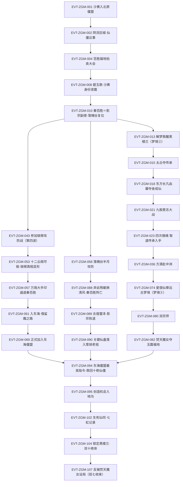

# 弧七·僵盟潜伏与梦境三层

弧七枢纽页，覆盖段四 135,001–172,000 行（§86 末至 §294），是 C 线剧情时间线在[真阳楼崩塌](true-yang-collapse.md)（弧六，止于 135,000 行）之后的第一簇；弧九自 172,002 行起，见[义天山大战](yitian-mountain.md)。原文行号口径为 1-based 含空行，证据锚点一律 `E:V4-六位行号`（段四行域 121,058–187,776，见[六段表](../source/section-index.md)）。

**核心定义**：本弧是方源以**仙僵身份**在五域僵盟内部潜伏、并借**梦境**而非战斗完成境界跃升的一整段；其叙事由三条并行线拧成——北原僵盟线（沙黄马甲＋秦百胜拍卖大会）、影宗／落魄谷线（秦百胜＝影宗副使、百日大战）、东海与梦境线（星象子马甲入僵盟＋三层梦境）。主线终点不是击败某个敌人，而是**方源为吞并八转仙窍而锁定黑楼兰**，并在最后一节被焚天魔女反设局。

**本页只承载 L2（谁／何时／何地／因果）**。实体状态、机制与规则细节已按三分流出页规则外移，导航入口见下节。

## 关键结构事实（读本页前须知）

1. **本页不含嵌于弧七行域内的弧八（中洲炼蛊大会）**：150,642–156,775 行归[中洲炼蛊大会](central-plain-refinement-conference.md)。事件链表在 EVT-ZGM-037（E:V4-150610）与 EVT-ZGM-038（E:V4-156906）之间因此存在一段**有意留空**，不是遗漏。
2. **拍卖会地点的口径（B 线遗留订正项）**：秦百胜办的「拍卖大会」在**百胜福地／绯红芦苇荡**（E:V4-136298 等），**不是阴流巨城**；阴流巨城是**北原僵盟大本营**、其会叫**「仙僵议事」**（E:V4-135806）。旧称「僵盟拍卖大会」已按此口径订正，详见《资料整理》。
3. **影宗副使＝秦百胜**（E:V4-140974）；**影无邪在本弧 135,001–172,000 行内零出现**（最早出现于约 177,252 行，属邻段），故本页不会把他列为出场角色。
4. **本弧的琅琊攻防战是第四波**（E:V4-158412，方源推算口径、叙述层未客观确认），攻方为秦百胜等 7 人；与卷五/弧十的[天庭入侵琅琊福地](langya-blessed-land-invasion.md)不是同一轮次，两份页面的同名战事须分开读。
5. **三层梦境**指三条互不相同的梦境线：①方源自炼梦道凡蛊时进入的自身梦境（E:V4-140700 起）；②黑楼兰的轮回之梦、由方源解梦唤醒（E:V4-141492）；③繁星洞天碎块内星宿仙尊的远古梦境、以「第一幕／第二幕」推进（E:V4-165466 起）。
6. **机制类明文一律不在此展开**：三层梦境梦道、东方长凡夺舍、万我一式大手印、血幕纯化炉、自然炼蛊法、生死仙窍、仙道连招等，本页只留「谁／何时／何地／因果」的 L2 一行，机制细节见《资料整理》与《分析与解读》并标注**机制待外移规则页**。

## 投影索引

本页只承载 L2（谁／何时／何地／因果）；实体状态与机制细节已外移，导航入口如下。

- 方源弧七状态线（沙黄／星象子双马甲、力道与智道大师、双宗师、星象福地搬迁、生死仙窍）→ [方源](../characters/fang-yuan.md)（ST-FANGYUAN 系列）
- 方源本弧波动的修为序列（七转仙僵→大师→宗师→准九转蜂翅同级战力）→ [流派境界](../rules/path-realms.md)（PR 系列）
- 黑楼兰弧七状态线（大力真武体、特等福地、被解梦唤醒、末段被方源锁定）→ [黑楼兰](../characters/he-lou-lan.md)
- 本弧登场的敌对／配角（秦百胜、姜钰仙子、雪松子、回风子、贺狼子、黑城、焚天魔女、鲨魔、凤九歌、东方长凡、宋亦诗、白海沙陀、黎山仙子）→ [敌对人物总表](../characters/enemy-roster.md)、[人物总表](../characters/roster.md)、[人物总表（续）](../characters/roster-2.md)
- 星宿仙尊（远古梦境第一幕、梦境女童疑指其旧影）→ [星宿仙尊](../characters/star-constellation.md)
- 红莲魔尊（春秋蝉＝其本命蛊，E:V4-149510）→ [红莲魔尊](../characters/red-lotus.md)
- 元莲仙尊（姚葛辟福地认主须以元莲仙尊鲜血为引）→ [元莲仙尊](../characters/yuan-lian-xian-zun.md)
- 春秋蝉（脱僵之法三件之一）→ [春秋蝉](../gu/spring-autumn-cicada.md)；智慧道痕迹（智慧光晕沿智慧道蔓延）→ [智慧蛊](../gu/wisdom-gu.md)；宿命蛊与修复（天庭修蛊秘辛）→ [宿命蛊](../gu/fate-gu.md)；月光蛊／态度蛊（睡莲绝蛊未成时的替代蛊）→ [月光蛊](../gu/moon-glow-gu.md)；其余仙蛊（拔山、挽澜、吃力、解谜、星念、星冰、净魂、全力以赴等）→ [蛊虫总表](../gu/index.md)
- 梦道机制（三层梦境、梦道凡蛊、解梦、梦翼、梦境缩减、梦道仙蛊）→ [梦道](../rules/dream-path.md)（DRM 系列，机制待外移规则页）
- 炼道机制（仙蛊方改良、自然炼蛊法、多重复合蛊阵、仙窍移植与搬迁、蛊阵痕迹）→ [炼蛊](../rules/refinement.md)（REF 系列，机制待外移规则页）
- 道痕机制（「人是万物之灵，蛊是天地真精」、福地攻防归根结底在道痕、智慧道痕迹）→ [道痕](../rules/dao-marks.md)（DM 系列）
- 杀招与连招（万我一式大手印、仙道连招、碧玉歌／天地歌／俯首歌、指流鲨三宙道仙蛊）→ [杀招与连招](../rules/killer-moves.md)、[世界·杀招总表](../world/kill-move-roster.md)（机制待外移规则页）
- 灾劫机制（天地双雷、摇光堕星雷、地灾、地灾与时间比、十绝体弊端）→ [灾劫](../rules/tribulation.md)（TRIB 系列）
- 僵盟（北原分部·阴流巨城仙僵议事／东海总部·黄泉海域不死国／入盟条件与盟约）→ [僵盟](../world/zangmeng.md)
- 影宗（副使制、魂魄改造、毛民内应、落魄谷大计、尚余一名内应）→ [影宗](../world/shadow-sect.md)
- 北原（大雪山、百胜福地·绯红芦苇荡、雪胡老祖线）→ [北原](../world/north-plain.md)
- 东海（黄泉海域·不死国、诗情海域、海底潜流与海底火山、鲨魔与鲨海）→ [东海](../world/east-sea.md)
- 中洲（十大古派、繁星洞天碎块禁区、仙鹤门方正线）→ [中洲](../world/central-plain.md)、[十大古派](../world/ten-ancient-sects.md)
- 天庭（监天塔、炼道蛊阵接引天意、修复宿命蛊）→ [天庭](../world/heavenly-court.md)
- 魂道（四次搜魂、魂压、魂魄改造与记忆封印）→ [魂道](../world/soul-path.md)
- 福地等级与仙窍（特等福地、仙窍移植与搬迁、生死仙窍）→ [空窍与资质](../world/aptitude-and-aperture.md)
- 经济活动（仙元石月收益、胆识蛊、萧家交易令、宝黄天）→ [经济总表](../world/economy-roster.md)
- 地理定位（北原→中洲→东海→北原的行军与传送路径）→ [地图总表](../world/map-roster.md)
- 《人祖传》引文（「痛哭的小人」，方源自省处）→ [人祖传](../themes/ren-zu-zhuan.md)
- 邻段页面：弧八炼蛊大会（150,642–156,775，本页不写）→ [中洲炼蛊大会](central-plain-refinement-conference.md)；弧九义天山与二次重生（172,002 起）→ [义天山大战](yitian-mountain.md)；弧十琅琊福地攻防战（另一轮次）→ [天庭入侵琅琊福地](langya-blessed-land-invasion.md)；弧六前情 → [真阳楼崩塌](true-yang-collapse.md)
- 弧级导航 → [十三弧总览](story-arc-overview.md)、[事件索引](index.md)

## 事件链

主线时序（按原文行号推进；节点内为事件ID＋事件名，编号连续 EVT-ZGM-001…107）：

| 事件ID | 事件 | 前因 | 参与者 | 后果 | 因果指向 | 主锚点 |
|---|---|---|---|---|---|---|
| EVT-ZGM-001 | 沙黄推开议事堂大门、入北原僵盟 | 马鸿运、赵怜云落于秦百胜之手，杀马赵已不可能 | 方源（沙黄）、古业、秦百胜、黎山仙子、阴六公、马鸿运、赵怜云 | 以凡道杀招「见面不相识」伪装孱弱仙僵；拒山盟蛊结拜，改以投名状试探 | EVT-ZGM-002 | E:V4-135202 |
| EVT-ZGM-002 | 阴流巨城仙僵议事，三事并列 | 方源正式入盟、需在僵盟体制内立足 | 方源、秦百胜、古业、阴六公、阴无邪等 | 会计论炎炉归属、地沟夜叉章鱼、赤煞神舟；方源在议事中刷取声望 | EVT-ZGM-003 | E:V4-135806 |
| EVT-ZGM-003 | 锁定地沟遗藏为入盟真正目的 | 方源本不为僵盟卖命，只为遗产 | 方源、弈星等 | 方源权重超古业成为第一人候选，但真目标是巨阳神所传地沟遗藏 | EVT-ZGM-095 | E:V4-136032 |
| EVT-ZGM-004 | 百胜福地拍卖大会开幕 | 秦百胜以散修身份办会，方源有解谜仙蛊可换 | 方源、秦百胜、姜钰仙子、宋亦诗、凤九歌、马鸿运、赵怜云、太白云生、林剑行等 | 会在绯红芦苇荡举行；「拍场里没有捡漏」成为本会场规 | EVT-ZGM-005 | E:V4-136298 |
| EVT-ZGM-005 | 幽兰剑师＝凤九歌，凤仙太子＝灵缘斋间谍 | 幽兰剑师修为声望与剑压不匹配，引方源生疑 | 方源、幽兰剑师（凤九歌）、老算子、凤仙太子 | 确认两者为同一人；凤仙太子已成灵缘斋间谍，方源抓住把柄 | EVT-ZGM-008 | E:V4-136334 |
| EVT-ZGM-006 | 太白云生带回脱僵之法 | 方源急需摆脱仙僵身份的束缚 | 方源、太白云生 | 得三件关键：宙锚、极往蛊、春秋蝉（春秋蝉＝红莲魔尊本命蛊） | EVT-ZGM-033 | E:V4-136620 |
| EVT-ZGM-007 | 拍场以蛊换蛊，数只仙蛊入手 | 方源持解谜仙蛊进拍场，需补足栈位 | 方源、秦百胜、宋亦诗、雪松子等 | 拔山、挽澜、吃力、解谜等仙蛊入手；马鸿运、赵怜云被摆上拍场 | EVT-ZGM-009 | E:V4-137954 |
| EVT-ZGM-008 | 碧玉歌一招制胜，沙黄身份泄露 | 秦百胜与凤九歌在拍场正面冲突 | 秦百胜、凤九歌、方源、姜钰仙子 | 秦百胜以连招「碧玉歌」一招败凤九歌；「沙黄」仙僵身份随之曝光 | EVT-ZGM-010 | E:V4-140434 |
| EVT-ZGM-009 | 炼成第一只梦道凡蛊（梦境线①） | 方源试仙蛊拔山、挽澜成功，转向自炼 | 方源、太白云生 | 以梦境为炉炼出梦道凡蛊，梦境线自此开启（机制待外移规则页） | EVT-ZGM-013 | E:V4-140700 |
| EVT-ZGM-010 | 秦百胜＝影宗副使，落魄谷复位 | 拍卖大会后秦百胜身份需收束 | 秦百胜、方源、姜钰仙子、影宗 | 秦百胜捏碎魂道仙蛊、暴露影宗副使身份；落魄谷重新落位为本弧主战场 | EVT-ZGM-013 | E:V4-140974 |
| EVT-ZGM-011 | 凤九歌推演「仙僵沙黄」并交老算子 | 沙黄身份已泄，各方开始溯源 | 凤九歌、老算子 | 凤九歌放弃直接追查、转托老算子推演方源根脚（存疑口径见待核对） | EVT-ZGM-026 | E:V4-141114 |
| EVT-ZGM-012 | 大雪山全力炼鸿运齐天蛊 | 大雪山需以运道仙蛊补齐根基 | 雪胡老祖、大雪山诸仙 | 以马鸿运为主材开炼鸿运齐天蛊，耗时耗力 | EVT-ZGM-027 | E:V4-141138 |
| EVT-ZGM-013 | 方源解梦救醒黑楼兰（梦境线②） | 黑楼兰陷于轮回之梦、无法自醒 | 方源、黑楼兰 | 以解梦之法唤醒黑楼兰；轮回之梦内容本身属黑楼兰私域 | EVT-ZGM-029 | E:V4-141492 |
| EVT-ZGM-014 | 落魄谷伏回风子，监天塔主定斩草名单 | 影宗与监天塔在落魄谷外围对峙 | 方源、回风子、监天塔主、影宗诸仙 | 方源伏杀回风子；监天塔主列斩草名单，双方进入长期消耗 | EVT-ZGM-058 | E:V4-142396 |
| EVT-ZGM-015 | 太丘夺传承，东方余亮传送遁走 | 太丘传承待夺，东方家先手 | 方源、东方余亮、东方长凡、陆青冥等 | 传承到手，东方余亮以传送遁走；太丘外围战线铺开 | EVT-ZGM-016 | E:V4-142732 |
| EVT-ZGM-016 | 太丘外围混战，万我一式大手印首现 | 太丘传承引群仙争夺 | 方源、秦百胜、凤九歌等 | 万我一式大手印首度施用（§133 章题 142746，机制待外移规则页） | EVT-ZGM-017 | E:V4-142918 |
| EVT-ZGM-017 | 陆青冥斩墟蝠，尸山现传承地 | 传承地藏于太丘深处 | 陆青冥、方源、太丘诸仙 | 斩墟蝠后现出太古荒兽级尸山，传承地自此暴露 | EVT-ZGM-018 | E:V4-143322 |
| EVT-ZGM-018 | 东方长凡设局，血幕纯化炉夺舍成仙 | 东方长凡谋夺舍重生、需以仙体为炉 | 东方长凡、方源、太丘战线诸仙 | 血幕作纯化炉、以魔道群仙攻势为锻打；东方长凡夺舍立地成仙 | EVT-ZGM-021 | E:V4-144666 |
| EVT-ZGM-019 | 内患乱战，八仙意志夺权 | 太丘战场外敌未退、内部先乱 | 方源、八仙意志、散文鲤 | 方源独吞散文鲤引众怒，八仙意志夺权，战线转入内耗 | EVT-ZGM-020 | E:V4-146442 |
| EVT-ZGM-020 | 东方长凡溃逃，方源追丢 | 东方长凡成仙后战力失控 | 方源、东方长凡、秦百胜 | 东方长凡脱身溃逃，方源追丢、本线暂悬 | EVT-ZGM-021 | E:V4-146952 |
| EVT-ZGM-021 | 九股意志大战，东方长凡重夺肉身 | 东方长凡溃逃后被多方意志围猎 | 东方长凡、方源、九股仙意志 | 九股意志混战，东方长凡凭意志再度夺回肉身 | EVT-ZGM-022 | E:V4-147308 |
| EVT-ZGM-022 | 东方晴雨逼杀，东方长凡伏诛 | 东方长凡旧部与方源达成默契 | 方源、东方晴雨、东方长凡 | 东方长凡身死；智道传承落入方源手中 | EVT-ZGM-023 | E:V4-147376 |
| EVT-ZGM-023 | 四次搜魂榨取 | 东方长凡已死、其秘密尚在人手 | 方源、东方长凡相关残魂 | 四次搜魂榨出智道传承与夺舍法门；方源智道根基确立 | EVT-ZGM-036 | E:V4-147750 |
| EVT-ZGM-024 | 改炼星念蛊，时间标尺显现 | 方源需以福地内时间换取炼蛊余量 | 方源、太白云生 | 星念蛊改炼推进；狐仙福地时间标尺约 1:5，成为本弧唯一硬标尺之一 | EVT-ZGM-078 | E:V4-147854 |
| EVT-ZGM-025 | 搜刮定论，白莲巨蚕蛊与「紫山真君」 | 搜魂所得需清点归仓 | 方源 | 白莲巨蚕蛊与「紫山真君」名号浮出，成为后续伏笔 | EVT-ZGM-030 | E:V4-148012 |
| EVT-ZGM-026 | 中洲埋伏，凤九歌放弃抢福地 | 凤九歌与方源在中洲方向互设埋伏 | 凤九歌、方源 | 凤九歌因凡草屋疑云放弃抢夺福地，方源避开一次正面冲突 | EVT-ZGM-043 | E:V4-148106 |
| EVT-ZGM-027 | 药皇＋百足天君攻大雪山，雪胡老祖以一敌二 | 大雪山在炼鸿运齐天蛊，攻方趁虚而入 | 雪胡老祖、药皇、百足天君 | 雪胡老祖以一敌二得胜；大雪山保住根基 | EVT-ZGM-093 | E:V4-148460 |
| EVT-ZGM-028 | 换福地情报，方寸山困局 | 方源需更优福地承载后续修行 | 方源、太白云生、黑楼兰 | 以情报换取福地线索；方寸山一线陷入困局 | EVT-ZGM-031 | E:V4-148568 |
| EVT-ZGM-029 | 与黑楼兰「力气交易」，索得时济运 | 方源需提升运道手段以对冲运势波动 | 方源、黑楼兰 | 以力气为对价索得时济运，运道被提升为可操作变量 | EVT-ZGM-034 | E:V4-148654 |
| EVT-ZGM-030 | 白莲巨蚕蛊喂养净魂仙蛊，拔山融入万我大手印 | 方源需同时强化魂道与力道杀招 | 方源 | 白莲巨蚕蛊改作喂养净魂仙蛊；拔山蛊融入万我大手印 | EVT-ZGM-080 | E:V4-148976 |
| EVT-ZGM-031 | 东海玉露福地攻略受挫 | 方源试探东海玉露福地、欲取资源 | 方源、太白云生、东海诸仙 | 遭遇消仙散元雨与玄冰残屋，首轮攻略失败 | EVT-ZGM-061 | E:V4-149106 |
| EVT-ZGM-032 | 万星飞萤与星雾掩，欲炼仙蛊而无财力 | 方源星道手段需蛊材支撑 | 方源 | 得万星飞萤、星雾掩等手段，但「要炼仙蛊无财力」，转入资源筹措 | EVT-ZGM-061 | E:V4-149458 |
| EVT-ZGM-033 | 墨瑶意志，春秋蝉＝红莲魔尊本命蛊 | 脱僵之法所需的春秋蝉来历不明 | 方源、墨瑶意志 | 确认春秋蝉为红莲魔尊本命蛊，脱僵路径获得关键解释 | EVT-ZGM-088 | E:V4-149510 |
| EVT-ZGM-034 | 时济运首施与残魂反噬 | 方源首次真正动用新得运道手段 | 方源 | 时济运生效但同时引发残魂反噬，运道助力与隐患并存 | EVT-ZGM-035 | E:V4-149816 |
| EVT-ZGM-035 | 第七次地灾＝血毒棠花海，狐仙福地重布局 | 狐仙福地进入第七次地灾周期 | 方源、黑楼兰 | 地灾以血毒棠花海形态落下；黑楼兰醒悟、福地格局重新布置 | EVT-ZGM-036 | E:V4-150142 |
| EVT-ZGM-036 | 太白云生告辞，方源赴中洲 | 狐仙福地事务收束、中洲方向有更大目标 | 方源、太白云生、黑楼兰 | 太白云生告辞；方源动身赴中洲，弧七前段主线在此收束 | EVT-ZGM-043 | E:V4-150524 |
| EVT-ZGM-037 | 方正苏醒，任仙鹤门长老 | 大陆格局变动、仙鹤门需补强 | 方正、仙鹤门 | 方正苏醒并获五转拔升，任仙鹤门长老；本页在此断流（弧八另页） | （线外）弧八 | E:V4-150610 |
| EVT-ZGM-038 | 羽圣城王位之争，羽飞成新王 | 羽圣城老王位空缺、内部争位 | 羽飞、白海沙陀、羽民诸族 | 羽飞夺位成新王，羽圣城内部先乱 | EVT-ZGM-039 | E:V4-156906 |
| EVT-ZGM-039 | 白海沙陀破羽圣城，羽民携城逃入太白福地 | 羽圣城新王未稳、外敌压境 | 白海沙陀、羽飞、羽民全族 | 羽圣城被破，羽民携城遁入太白福地求庇 | EVT-ZGM-040 | E:V4-157030 |
| EVT-ZGM-040 | 十场赌斗，捏爆七转郑灵 | 羽民以赌斗换庇护资格 | 方源、羽民、郑灵 | 方源十场赌斗全胜、捏爆七转郑灵，威压羽民 | EVT-ZGM-041 | E:V4-157488 |
| EVT-ZGM-041 | 羽民的自由，周中自裁与全族就义 | 羽民不愿沦为奴婢 | 羽民、周中、方源 | 周中自裁、羽民全族就义以换取族群自由，成为本弧民族性最强一笔 | EVT-ZGM-042 | E:V4-157896 |
| EVT-ZGM-042 | 石龙瞳、黎山仙子线，天庭修复宿命启动 | 天庭开始修复宿命蛊，宿命线重新加压 | 方源、黎山仙子、天庭 | 石龙瞳现身；黎山仙子线展开；天庭修复宿命正式启动 | EVT-ZGM-043 | E:V4-158266 |
| EVT-ZGM-043 | 参加琅琊攻防战（第四波） | 秦百胜征召、方源需借战事换取利益 | 方源（星象子）、秦百胜等 7 人、琅琊地灵 | 参战；十二波云迷澜阵下十二座云阁仅余五座（第四波为方源推算口径） | EVT-ZGM-044 | E:V4-158412 |
| EVT-ZGM-044 | 静待来敌，实力与阵法交底 | 攻方已入阵、需评估对手底牌 | 方源、秦百胜、地灵 | 双方互探实力与阵法结构，战事进入对峙 | EVT-ZGM-045 | E:V4-158596 |
| EVT-ZGM-045 | 一巴掌拍死雪松子 | 雪松子低估来敌、试图抢功 | 方源、雪松子 | 雪松子被一掌拍死；冰心仙蛊实为秦百胜所借 | EVT-ZGM-046 | E:V4-158776 |
| EVT-ZGM-046 | 星象子首战，星云磨盘与星蛇索 | 方源以星象子马甲首次正面出手 | 方源（星象子）、琅琊守方 | 星云磨盘、星蛇索等星道手段首度亮相 | EVT-ZGM-047 | E:V4-159200 |
| EVT-ZGM-047 | 六幻星身、位星移，回风子斩阁 | 方源需在云阁体系内取得战果 | 方源、回风子、秦百胜 | 回风子斩阁；云阁数目原文口径出现「八座／五座」矛盾（见待核对） | EVT-ZGM-048 | E:V4-159474 |
| EVT-ZGM-048 | 老墨被一招斩首，秦百胜战力跃升 | 秦百胜在攻防战中逐步升级手段 | 秦百胜、老墨、方源 | 老墨被一招斩首，方源据此重估秦百胜战力 | EVT-ZGM-049 | E:V4-159594 |
| EVT-ZGM-049 | 天庭修蛊秘辛，长毛老祖是毛民 | 天庭修蛊需要蛊方与人手 | 天庭、长毛老祖、方源 | 揭示天庭修蛊秘辛：长毛老祖实为毛民；瑶光一线锚定 | EVT-ZGM-050 | E:V4-159706 |
| EVT-ZGM-050 | 琅琊地灵人格更替，毛民种族执念觉醒 | 地灵在战事压迫下人格切换 | 琅琊地灵、秦百胜、方源 | 地灵人格更替、毛民种族执念觉醒，战局由此反转 | EVT-ZGM-051 | E:V4-159788 |
| EVT-ZGM-051 | 地灵对秦百胜：净空转灼魂太金逆转 | 秦百胜已破地灵常规手段 | 地灵、秦百胜 | 地灵以净空转灼魂太金完成逆转，暂时压制秦百胜 | EVT-ZGM-052 | E:V4-160074 |
| EVT-ZGM-052 | 五指拳心剑杀大毛 | 毛民战力层需被削平 | 方源、大毛 | 五指拳心剑（连招体系）杀大毛，方源战果累积 | EVT-ZGM-053 | E:V4-160166 |
| EVT-ZGM-053 | 十二云阁尽毁，真正琅琊福地显形 | 云阁只是外阵、真正福地藏在阵法之后 | 方源、秦百胜、地灵 | 十二云阁尽毁，真正琅琊福地显形为三大陆结构 | EVT-ZGM-054 | E:V4-160402 |
| EVT-ZGM-054 | 天婆梭罗战阵，破黑牢与歧牙猪 | 福地本体显露后守方布下战阵 | 方源、天婆梭罗战阵、歧牙猪 | 破黑牢与歧牙猪，攻方推进到福地核心层 | EVT-ZGM-055 | E:V4-160518 |
| EVT-ZGM-055 | 仙蛊被夺，方源勘破福地扩容之秘 | 双方在核心层争夺仙蛊与地脉 | 方源、琅琊地灵、秦百胜 | 仙蛊被夺；方源反手勘破福地扩容之秘（机制待外移规则页） | EVT-ZGM-057 | E:V4-160764 |
| EVT-ZGM-056 | 卧底暴露：毛十二、毛十三 | 攻方内部人员被地灵识破 | 毛十二、毛十三、琅琊地灵 | 两名卧底暴露，影宗在琅琊的多年布置被清出 | EVT-ZGM-057 | E:V4-160820 |
| EVT-ZGM-057 | 万我大手印逼退秦百胜，影宗撤退内情 | 攻方已无胜算、影宗需保落魄谷大计 | 方源、秦百胜、影宗 | 方源以万我大手印逼退秦百胜；影宗撤退，并透露落魄谷大计与「尚余一名内应」 | EVT-ZGM-058 | E:V4-160976 |
| EVT-ZGM-058 | 落魄谷半月攻防 | 影宗与监天塔在落魄谷长期对峙 | 秦百胜、方源、监天塔主、碧玉歌、俯首歌 | 攻防持续约半月：碧玉歌、俯首歌、亿万屠杀场手段轮番施用（机制待外移规则页） | EVT-ZGM-088 | E:V4-161054 |
| EVT-ZGM-059 | 方源复盘与《人祖传》「痛哭的小人」自省 | 战事告一段落、方源检视自身路线 | 方源 | 借《人祖传》「痛哭的小人」段落自省，人物弧光节点 | EVT-ZGM-060 | E:V4-161176 |
| EVT-ZGM-060 | 地灵授全力以赴蛊方与搬迁之法 | 地灵决意搬家、需外力协助 | 琅琊地灵、方源 | 方源获全力以赴蛊方与福地搬迁之法，为星象福地搬迁铺路 | EVT-ZGM-066 | E:V4-161364 |
| EVT-ZGM-061 | 入东海，借鲨魔之路，冰雨冻土与陷害卜单 | 中洲方向已无余利、东海玉露福地仍有可取 | 方源、鲨魔、卜单、太白云生 | 借鲨魔之路入东海；以冰雨冻土困敌并陷害卜单 | EVT-ZGM-062 | E:V4-161928 |
| EVT-ZGM-062 | 鲨海钓鲨宴，东海海域名录 | 方源需在东海建立身份与地缘认知 | 方源、鲨魔、东海诸仙 | 鲨海钓鲨宴上完成东海海域名录梳理，方源切入东海体系 | EVT-ZGM-063 | E:V4-162248 |
| EVT-ZGM-063 | 借宋家施压 | 方源欲以世家外力撬动东海局面 | 方源、宋家（宋亦诗） | 借宋家施压推进计划；宋家设定随之补全 | EVT-ZGM-064 | E:V4-162404 |
| EVT-ZGM-064 | 寻李逍遥旧径，故意暴露，杀姚葛辟 | 方源需引出目标、又须留痕以嫁祸 | 方源、李逍遥、姚葛辟 | 故意被发现、把局面闹大，杀姚葛辟；姚葛辟福地认主须以元莲仙尊鲜血为引 | EVT-ZGM-066 | E:V4-162788 |
| EVT-ZGM-065 | 二探玉露福地：冰消破冰雨冻土、战魂沙场、八门迷宫 | 首轮攻略失败、需以新手段强攻 | 方源、玉露福地守方 | 以冰消破解冰雨冻土，连破战魂沙场与八门迷宫 | EVT-ZGM-081 | E:V4-163196 |
| EVT-ZGM-066 | 星道六招完备，借蛊，仙窍移植搬迁星象福地 | 方源星道手段与承载地均需同步升级 | 方源、太白云生、琅琊地灵 | 星道六招完备、借蛊成事，以仙窍移植之法搬迁星象福地 | EVT-ZGM-068 | E:V4-163812 |
| EVT-ZGM-067 | 三智道蛊仙出场，「加入僵盟」公开化 | 方源需以公开身份进入僵盟体系 | 方源、三智道蛊仙 | 三位智道蛊仙出场，「方源要加入僵盟」由暗转明 | EVT-ZGM-069 | E:V4-164162 |
| EVT-ZGM-068 | 星念仙蛊：用途与三重障碍 | 方源欲炼星念仙蛊、但条件不齐 | 方源、四仙魂 | 明确星念仙蛊用途与三重障碍，并由四仙魂搜刮补齐部分条件；此时尚未开炼 | EVT-ZGM-091 | E:V4-164330 |
| EVT-ZGM-069 | 正式加入东海僵盟，黄泉海域不死国 | 星象子身份在东海铺陈完毕 | 方源、东海僵盟、焚天魔女等 | 正式入盟；东海僵盟总部为黄泉海域不死国，方源获得僵盟身份与盟约约束 | EVT-ZGM-094 | E:V4-164674 |
| EVT-ZGM-070 | 与宋家交涉，六百仙元石了事 | 方源在东海与宋家结怨 | 方源、宋家 | 以六百仙元石了结纠纷，宋家线暂收 | EVT-ZGM-071 | E:V4-164716 |
| EVT-ZGM-071 | 萧家交易令 | 方源需交易凭据以打通资源流向 | 方源、萧家 | 取得萧家交易令，为后续仙材与蛊材交易留出口 | EVT-ZGM-073 | E:V4-164836 |
| EVT-ZGM-072 | 玩坏之后：李逍遥消失与繁星洞天提前崩碎 | 李逍遥被方源以手段榨取、福地失去支撑 | 方源、李逍遥 | 李逍遥消失、繁星洞天提前崩碎，碎块成为梦境线③的入口 | EVT-ZGM-073 | E:V4-164906 |
| EVT-ZGM-073 | 鹤风扬邀探繁星洞天碎块 | 繁星洞天崩碎后碎块成禁区 | 方源、鹤风扬 | 鹤风扬邀方源共探碎块，方源借此进入星宿仙尊梦境 | EVT-ZGM-074 | E:V4-165000 |
| EVT-ZGM-074 | 独入碎片洞天，只手拿龙鱼 | 方源选择脱离队伍独自探索 | 方源 | 只手拿龙鱼等战果入手，碎块内资源被先行扫取 | EVT-ZGM-075 | E:V4-165324 |
| EVT-ZGM-075 | 梦境争夺，与凤金煌的交易 | 碎块梦境中另有竞争者 | 方源、凤金煌 | 与凤金煌达成交易（变化道永固重生法方向），梦境线获关键筹码 | EVT-ZGM-076 | E:V4-165466 |
| EVT-ZGM-076 | 兽人族、火焰庆典与风结草（梦境③第一幕） | 星宿仙尊梦境以幕次推进 | 方源、兽人族、梦境女童 | 火焰庆典与风结草段落展开；梦境女童疑指星宿仙尊旧影 | EVT-ZGM-077 | E:V4-165682 |
| EVT-ZGM-077 | 梦翼和解梦，两次被甩出 | 方源试图以梦道手段留在梦境 | 方源 | 以梦翼与解梦手段应对，两次被甩出梦境（机制待外移规则页） | EVT-ZGM-078 | E:V4-165876 |
| EVT-ZGM-078 | 境界暴涨，救尽所有人仍失败，收服藏经鼋 | 第一幕有隐藏通关条件 | 方源、藏经鼋 | 梦境中境界暴涨、救尽所有人仍判失败；收服藏经鼋 | EVT-ZGM-079 | E:V4-166132 |
| EVT-ZGM-079 | 最大赢家，通过第一幕，星盘棋重伤 | 方源改变策略、改走获利路线 | 方源、梦境诸方 | 成为最大赢家并通过第一幕；星盘棋一役重伤 | EVT-ZGM-080 | E:V4-166400 |
| EVT-ZGM-080 | 双宗师 | 智道传承与梦境历练叠加 | 方源 | 方源达成双宗师，本弧境界线最高点 | EVT-ZGM-081 | E:V4-166506 |
| EVT-ZGM-081 | 按兵不动，玉露福地真貌与仙蛊现身 | 东海各方均在等待时机 | 方源、焚天魔女、鲨魔 | 方源按兵不动；玉露福地真貌与其中仙蛊现身，引出后续争夺 | EVT-ZGM-082 | E:V4-166802 |
| EVT-ZGM-082 | 焚天魔女，卜单诬告「盗八转仙材药冰」 | 焚天魔女欲夺玉露福地资源 | 焚天魔女、卜单、方源 | 卜单以「盗八转仙材药冰」诬告方源，方源被拖入与焚天魔女的正面交涉 | EVT-ZGM-083 | E:V4-167106 |
| EVT-ZGM-083 | 愤怒的小鸟，三招之约 | 双方战力不明、以赌约降低冲突成本 | 方源、焚天魔女 | 以「愤怒的小鸟」与三招之约试出彼此底牌 | EVT-ZGM-084 | E:V4-167186 |
| EVT-ZGM-084 | 太古荒兽一指流鲨，三只宙道仙蛊 | 鲨海深处藏太古荒兽与宙道遗产 | 方源、一指流鲨、鲨魔 | 一指流鲨现世，伴三只宙道仙蛊；方源借势取利 | EVT-ZGM-085 | E:V4-167338 |
| EVT-ZGM-085 | 大鱼吃小鱼，鲨魔认输，焚天魔女征召方源北上 | 东海冲突需转向更大的战场 | 方源、鲨魔、焚天魔女 | 大鱼吃小鱼定胜负、鲨魔认输；焚天魔女征召方源北上参战 | EVT-ZGM-086 | E:V4-167688 |
| EVT-ZGM-086 | 百日大战落幕，凤九歌连胜七场 | 落魄谷与北原方向战事进入收官 | 凤九歌、影宗、监天塔 | 百日大战落幕，凤九歌连胜七场，僵盟／影宗格局重排 | EVT-ZGM-087 | E:V4-167782 |
| EVT-ZGM-087 | 突围战，碧玉歌，落魄谷奇光 | 影宗被围、需强行突围 | 秦百胜、方源、影宗诸仙 | 突围战以碧玉歌开路；落魄谷现出奇光 | EVT-ZGM-088 | E:V4-168100 |
| EVT-ZGM-088 | 弃此残躯换清风，秦百胜自绝仙窍，大同风 | 秦百胜突围无路、选择以命换局 | 秦百胜、方源、姜钰仙子 | 秦百胜自绝仙窍、身死，大同风成局；影宗在北原的台面人物终结 | EVT-ZGM-089 | E:V4-168296 |
| EVT-ZGM-089 | 炎煌雷泽，突围收束 | 秦百胜身死后战场尚需清收 | 方源、姜钰死、贺狼子、回风子、黑城 | 突围收束：姜钰死、贺狼子死、回风子降、黑城遁走 | EVT-ZGM-090 | E:V4-168504 |
| EVT-ZGM-090 | 仙僵藏蛊于地沟，撞见雪胡老祖 | 炎煌雷泽仙僵欲藏关键仙蛊 | 方源、雪胡老祖、仙僵 | 仙僵藏蛊时被方源撞见并遭雪胡老祖截取，关键仙蛊落入雪胡老祖之手 | EVT-ZGM-093 | E:V4-168540 |
| EVT-ZGM-091 | 炼制星念仙蛊三败，自创智慧蛊阵，欠焚天魔女债 | 方源缺资源、只能以自制手段顶上 | 方源、焚天魔女 | 星念仙蛊三度炼制失败；自创智慧蛊阵替代，并因此欠下焚天魔女人情债 | EVT-ZGM-092 | E:V4-168702 |
| EVT-ZGM-092 | 方源的转机，雪胡老祖盗墓曝光，焚天魔女回北原 | 雪胡老祖盗墓事发、北原格局松动 | 方源、雪胡老祖、焚天魔女 | 雪胡老祖盗墓曝光成为转机；焚天魔女回北原，方源行动空间被打开 | EVT-ZGM-093 | E:V4-168818 |
| EVT-ZGM-093 | 运道反噬 | 方源连续动用运道手段获利 | 方源 | 运道反噬发作：运道既是助力也是隐患，本弧第二次反噬 | EVT-ZGM-094 | E:V4-169096 |
| EVT-ZGM-094 | 谋算雪胡老祖，阴流巨城会议（东海僵盟最高指令） | 僵盟需处理北原炎炉与十绝仙僵 | 方源、东海僵盟、焚天魔女 | 在阴流巨城议定谋算雪胡老祖；东海僵盟下达最高指令——救回十绝仙僵 | EVT-ZGM-095 | E:V4-169194 |
| EVT-ZGM-095 | 创造机会入地沟，五位仙僵护卫 | 地沟遗藏须趁僵盟内乱进入 | 方源、五位仙僵 | 方源为自己创造入地沟的机会，并获五位仙僵护卫 | EVT-ZGM-096 | E:V4-169480 |
| EVT-ZGM-096 | 终入地沟，下潜四万余丈，十六场战斗 | 地沟入口开启、深度远超预期 | 方源、地沟守卫 | 下潜四万余丈、连打十六场，正式抵达地沟遗藏域 | EVT-ZGM-097 | E:V4-169636 |
| EVT-ZGM-097 | 夜叉章鱼和口蚯，定仙游脱身 | 地沟守卫层有两道强敌 | 方源、夜叉章鱼、口蚯 | 以定仙游脱身避开夜叉章鱼与口蚯 | EVT-ZGM-098 | E:V4-169810 |
| EVT-ZGM-098 | 野生仙蛊与蛊阵痕迹 | 地沟深处有前人布置 | 方源 | 发现野生仙蛊与蛊阵痕迹，确认遗藏与上古蛊阵体系相关 | EVT-ZGM-099 | E:V4-170082 |
| EVT-ZGM-099 | 仙材的尸海 | 外圈仙材实为死物陷阱 | 方源 | 识破「仙材的尸海」——外圈仙材全是死物，避开一次致命陷阱 | EVT-ZGM-100 | E:V4-170292 |
| EVT-ZGM-100 | 惊喜收获，准九转蜂翅 | 尸海之后才是真遗藏 | 方源 | 取得准九转蜂翅，方源战力层获得跳级式提升 | EVT-ZGM-101 | E:V4-170512 |
| EVT-ZGM-101 | 多重复合蛊阵，云凰碎片与十八块仙材 | 遗藏核心由复合蛊阵封闭 | 方源 | 破多重复合蛊阵，得云凰碎片与十八块仙材；至此已有可舍弃焚天魔女的资本 | EVT-ZGM-102 | E:V4-170610 |
| EVT-ZGM-102 | 生死仙窍！七虹与「绿」的重生法 | 遗藏核心记录着仙窍层级的秘密 | 方源、七虹、绿 | 获生死仙窍之法与七虹相关重生法门（机制待外移规则页） | EVT-ZGM-103 | E:V4-170854 |
| EVT-ZGM-103 | 顺利回城，编造「星冰」蒙混过关 | 方源须掩盖地沟真实所得 | 方源、焚天魔女、东海僵盟 | 以「星冰」为名编造收获，瞒过焚天魔女与僵盟 | EVT-ZGM-104 | E:V4-171012 |
| EVT-ZGM-104 | 双十绝体九转魔尊？锁定黑楼兰 | 方源亟需吞并一枚八转仙窍以实现跃升 | 方源、黑楼兰 | 推断黑楼兰为双十绝体、具九转魔尊资质，方源由此锁定其为吞并目标 | EVT-ZGM-105 | E:V4-171278 |
| EVT-ZGM-105 | 方源谋划，两手准备与信道请教 | 目标已定、但阻力尚未清点 | 方源、信道蛊仙 | 做两手准备并向信道请教，主动铺垫吞并方案 | EVT-ZGM-106 | E:V4-171398 |
| EVT-ZGM-106 | 三战黑城，黑家四老以青城纵横救走黑城 | 黑城为方源计划的干扰项 | 方源、黑城、黑家四老 | 三战黑城未果，黑家四老以青城纵横救走黑城 | EVT-ZGM-107 | E:V4-171736 |
| EVT-ZGM-107 | 小姨妈，大姨妈，焚天魔女现身，方源被设局 | 方源自以为可舍弃焚天魔女 | 方源、焚天魔女 | 焚天魔女早已知情并反设局；弧七在方源被反制的悬念中收束，接弧九 | （线外）弧九 | E:V4-171996 |

## 原著明确内容

以下条目均完成逐段原文核验，锚点为原文行号。认知标记两维行内并用：类型 [叙事]/[对话]/[信念]/[传闻]，状态 [已核]/[推断]/[未决]/[已修正]。

### 一、北原僵盟入盟与百胜福地拍卖大会（135,190–141,044）

1. [叙事|已核] 方源以北原「沙黄」身份推开僵盟议事堂大门入盟；会址为阴流巨城，其会称「仙僵议事」（E:V4-135202、E:V4-135806）。
2. [叙事|已核] 「拍卖大会」由秦百胜在百胜福地／绯红芦苇荡举办（E:V4-136298）；秦百胜为散修，兼影宗副使（E:V4-140974）。
3. [对话|已核] 幽兰剑师即凤九歌；凤仙太子为灵缘斋间谍（E:V4-136334）。
4. [叙事|已核] 拍场以蛊换蛊：拔山、挽澜、吃力、解谜等仙蛊入手；马鸿运、赵怜云被摆上拍场（E:V4-137954）。
5. [叙事|已核] 秦百胜以连招「碧玉歌」一招制胜，「沙黄」身份随之泄露（E:V4-140434）。
6. [叙事|已核] 方源以梦境炼出第一只梦道凡蛊，梦境线①开启（E:V4-140700，机制待外移规则页）。
7. [叙事|已核] 太白云生带回脱僵之法三件：宙锚、极往蛊、春秋蝉（E:V4-136620）。
8. [已修正] 「僵盟拍卖大会」旧表述作废——拍卖会是秦百胜的个人行为而非僵盟行为；阴流巨城办的是仙僵议事（E:V4-136298、E:V4-135806）。
9. [推断|已核] 方源的入盟动机自始是地沟遗藏，而非僵盟事务（E:V4-136032）。

### 二、影宗·落魄谷与太丘东方长凡线（141,046–147,000）

10. [叙事|已核] 大雪山以马鸿运为主材全力炼制鸿运齐天蛊（E:V4-141138）。
11. [叙事|已核] 方源以解梦之法唤醒陷于轮回之梦的黑楼兰（E:V4-141492，梦境线②）。
12. [叙事|已核] 方源伏杀回风子；监天塔主列出斩草名单（E:V4-142396）。
13. [叙事|已核] 太丘夺传承成功，东方余亮以传送遁走（E:V4-142732）。
14. [叙事|已核] 万我一式大手印首度施用（§133 章题 142746；E:V4-142918，机制待外移规则页）。
15. [叙事|已核] 陆青冥斩墟蝠，太古荒兽级尸山现出传承地（E:V4-143322）。
16. [叙事|已核] 东方长凡以血幕作纯化炉、以魔道群仙攻势为锻打，夺舍立地成仙（E:V4-144660、E:V4-145070，机制待外移规则页）。
17. [信念|已核] 影无邪在本弧 135,001–172,000 行内零出现，最早约 177,252 行（属邻段）；本页不列其为出场角色。
18. [叙事|已核] 内患乱战：方源独吞散文鲤引众怒、八仙意志夺权（E:V4-146442）；东方长凡溃逃、方源追丢（E:V4-146952）。

### 三、搜魂榨取与狐仙福地经营（147,008–150,641）

19. [叙事|已核] 九股意志大战；东方晴雨逼杀，东方长凡伏诛（E:V4-147308、E:V4-147376）。
20. [叙事|已核] 方源四次搜魂，榨出智道传承与夺舍法门（E:V4-147750）。
21. [叙事|已核] 星念蛊改炼推进；狐仙福地时间标尺约 1:5（E:V4-147854）。
22. [叙事|已核] 与黑楼兰「力气交易」索得时济运（E:V4-148654）；时济运首施即招残魂反噬（E:V4-149816）。
23. [叙事|已核] 药皇与百足天君攻大雪山，雪胡老祖以一敌二得胜（E:V4-148460）。
24. [叙事|已核] 春秋蝉即红莲魔尊本命蛊（E:V4-149510）。
25. [叙事|已核] 福地攻防归根结底在道痕（E:V4-149566，机制待外移规则页）。
26. [叙事|已核] 第七次地灾以血毒棠花海形态落下；太白云生告辞、方源赴中洲（E:V4-150142、E:V4-150524）；方正苏醒并任仙鹤门长老（E:V4-150610）。

### 四、羽圣城与琅琊攻防战第四波（156,776–159,474）

27. [叙事|已核] 羽圣城王位之争；白海沙陀破城，羽民携城逃入太白福地（E:V4-156906、E:V4-157030）。
28. [叙事|已核] 十场赌斗中捏爆七转郑灵（E:V4-157488）；周中自裁、羽民全族就义以换族群自由（E:V4-157896）。
29. [叙事|已核] 方源参加琅琊攻防战第四波，十二波云迷澜阵、十二云阁仅余五座（E:V4-158412）。
30. [未决] 「第四波」为方源推算口径，叙述层未作客观确认（E:V4-158412，见待核对）。
31. [已修正] 本页的琅琊战与卷五／弧十[天庭入侵琅琊福地](langya-blessed-land-invasion.md)不是同一轮次。
32. [叙事|已核] 一巴掌拍死雪松子；冰心仙蛊实为秦百胜所借（E:V4-158776）。
33. [叙事|已核] 星象子马甲首战：星云磨盘、星蛇索（E:V4-159200）。
34. [未决] 云阁数目原文矛盾：秦百胜「八座云阁」（E:V4-159008）与「五座云阁」（E:V4-159474、E:V4-159712、E:V4-160374）并存。

### 五、琅琊真相与影宗撤退（159,474–161,364）

35. [叙事|已核] 老墨被一招斩首，方源据此重估秦百胜战力（E:V4-159594）。
36. [叙事|已核] 天庭修蛊秘辛；长毛老祖实为毛民（E:V4-159706）。
37. [叙事|已核] 琅琊地灵人格更替，毛民种族执念觉醒（E:V4-159788）。
38. [叙事|已核] 地灵以净空转灼魂太金逆转秦百胜（E:V4-160074）；五指拳心剑杀大毛（E:V4-160166）。
39. [叙事|已核] 十二云阁尽毁，真正琅琊福地显形为三大陆结构（E:V4-160402）；仙蛊被夺，方源勘破福地扩容之秘（E:V4-160764，机制待外移规则页）。
40. [叙事|已核] 卧底暴露：毛十二、毛十三（E:V4-160820）。
41. [叙事|已核] 方源以万我大手印逼退秦百胜（E:V4-160976，机制待外移规则页）。
42. [已核] 影宗撤退并透露落魄谷大计与「尚余一名内应」；内应身份未明（E:V4-160976，见待核对）。
43. [叙事|已核] 地灵决意搬家，授全力以赴蛊方与福地搬迁之法（E:V4-161364）。

### 六、东海入盟与宋家线（161,376–165,000）

44. [叙事|已核] 落魄谷半月攻防：碧玉歌、俯首歌、亿万屠杀场轮番施用（E:V4-161054，机制待外移规则页）。
45. [叙事|已核] 借鲨魔之路入东海；以冰雨冻土困敌并陷害卜单（E:V4-161928）。
46. [叙事|已核] 鲨海钓鲨宴上梳理东海海域名录（E:V4-162248）。
47. [未决] 宋启元／沈启元异名并存（E:V4-162404、E:V4-162221 作「沈」，E:V4-162410、E:V4-162414 及后文作「宋」）。
48. [叙事|已核] 故意暴露、把局面闹大并杀姚葛辟；姚葛辟福地认主须以元莲仙尊鲜血为引（E:V4-162788）。
49. [叙事|已核] 二探玉露福地：以冰消破解冰雨冻土，连破战魂沙场与八门迷宫（E:V4-163196）。
50. [叙事|已核] 星道六招完备、借蛊成事，以仙窍移植之法搬迁星象福地（E:V4-163812）。
51. [叙事|已核] 三位智道蛊仙出场，「加入僵盟」由暗转明（E:V4-164162）。
52. [信念|已核] 星念仙蛊此时尚未开炼；六败之后仅余一次机会（E:V4-164330）。
53. [叙事|已核] 方源正式加入东海僵盟；僵盟东海总部为黄泉海域不死国（E:V4-164674）。
54. [叙事|已核] 以六百仙元石与宋家了结纠纷（E:V4-164716）；取得萧家交易令（E:V4-164836）。
55. [叙事|已核] 李逍遥消失、繁星洞天提前崩碎（E:V4-164906）；鹤风扬邀方源共探碎块（E:V4-165000）。
56. [未决] 「星象洞天」（E:V4-158776）与「繁星洞天」（E:V4-154640）名称不一致。

### 七、梦境线③：星宿仙尊远古梦境（165,001–166,878）

57. [叙事|已核] 方源独入碎片洞天，只手拿龙鱼（E:V4-165324）。
58. [叙事|已核] 与凤金煌达成交易，指向变化道永固重生法（E:V4-165466）。
59. [叙事|已核] 第一幕展开：兽人族火焰庆典与风结草；梦境女童疑指星宿仙尊旧影（E:V4-165682）。
60. [叙事|已核] 以梦翼与解梦手段应对，两次被甩出梦境（E:V4-165876）；梦境中境界暴涨、救尽所有人仍判失败，收服藏经鼋（E:V4-166132）。
61. [叙事|已核] 成为最大赢家并通过第一幕，星盘棋一役重伤（E:V4-166400）。
62. [叙事|已核] 方源达成双宗师，为本弧境界线最高点（E:V4-166506）。
63. [叙事|已核] 方源按兵不动；玉露福地真貌与其中仙蛊现身（E:V4-166802）。

### 八、焚天魔女、北原突围与地沟遗藏（166,880–172,001）

64. [叙事|已核] 卜单以「盗八转仙材药冰」诬告方源，方源被拖入与焚天魔女的正面交涉（E:V4-167106）；双方以三招之约试底牌（E:V4-167186）。
65. [叙事|已核] 太古荒兽一指流鲨现世，伴三只宙道仙蛊（E:V4-167338）；大鱼吃小鱼定胜负、鲨魔认输，焚天魔女征召方源北上（E:V4-167688）。
66. [叙事|已核] 百日大战落幕，凤九歌连胜七场（E:V4-167782）。
67. [叙事|已核] 突围战以碧玉歌开路，落魄谷现出奇光（E:V4-168100）。
68. [叙事|已核] 秦百胜自绝仙窍、身死，大同风成局（E:V4-168296）。
69. [叙事|已核] 突围收束：姜钰死、贺狼子死、回风子降、黑城遁走（E:V4-168504）。
70. [叙事|已核] 仙僵藏蛊于地沟时被撞见，关键仙蛊落入雪胡老祖之手（E:V4-168540）。
71. [叙事|已核] 星念仙蛊三度炼制失败；方源自创智慧蛊阵替代，并欠下焚天魔女人情债（E:V4-168702）。
72. [叙事|已核] 雪胡老祖盗墓曝光成为转机，焚天魔女回北原（E:V4-168818）。
73. [叙事|已核] 运道反噬发作（E:V4-169096）；阴流巨城会议议定谋算雪胡老祖，东海僵盟下达最高指令——救回十绝仙僵（E:V4-169194）。
74. [叙事|已核] 方源为自己创造入地沟的机会并获五位仙僵护卫（E:V4-169480）；终入地沟、下潜四万余丈、连打十六场（E:V4-169636）。
75. [叙事|已核] 以定仙游脱身避开夜叉章鱼与口蚯（E:V4-169810）；发现野生仙蛊与蛊阵痕迹（E:V4-170082）。
76. [叙事|已核] 识破「仙材的尸海」——外圈仙材全是死物（E:V4-170292）。
77. [叙事|已核] 惊喜收获：准九转蜂翅（E:V4-170512）。
78. [叙事|已核] 破多重复合蛊阵，得云凰碎片与十八块仙材；至此已有弃焚天魔女的资本（E:V4-170610，机制待外移规则页）。
79. [叙事|已核] 得生死仙窍之法与七虹／「绿」的重生法门（E:V4-170854，机制待外移规则页）。
80. [叙事|已核] 以「星冰」之名编造收获，瞒过焚天魔女与僵盟（E:V4-171012）。
81. [叙事|已核] 推断黑楼兰为双十绝体、具九转魔尊资质，方源由此锁定其为吞并目标（E:V4-171278）。
82. [叙事|已核] 三战黑城未果，黑家四老以青城纵横救走黑城（E:V4-171736）。
83. [叙事|已核] 焚天魔女反设局，弧七在方源被反制中收束（E:V4-171996）。

## 资料整理

以下为整理层记录（含订正、流程与来源说明），**不是原著事实本身**，不得当作原文陈述引用。

- **B 线遗留订正项已落实**：B 线经济加锚批裁定「『僵盟拍卖大会』订正为北原大会僵盟事件」，协调文件记「剧情页弧七表述待 C 线订正」。本页按原文口径落实为两条：①拍卖大会＝秦百胜在百胜福地／绯红芦苇荡办的会（E:V4-136298），性质是散修（兼影宗副使）的个人行为；②阴流巨城＝北原僵盟大本营，其会为「仙僵议事」（E:V4-135806）。据此，「僵盟拍卖大会」一语在原文中并不存在，本页不再使用该表述。
- **三分流出页执行记录（弧七起新簇按 SOP 的首簇）**：外移清单与落点见《投影索引》。本页保留「事件发生句＋机制待外移规则页」标注的位置为：三层梦境梦道、东方长凡夺舍（血幕纯化炉）、万我一式大手印、自然炼蛊法、生死仙窍、仙道连招（碧玉歌／俯首歌／亿万屠杀场）、福地扩容、地灵人格更替、运道反噬。
- **簇代码登记**：本页按任务指定使用 ZGM（EVT-ZGM-001…107）；交接文档 §5 对本弧的建议代码为 MLD。二者并存，待协调方裁决后统一（见待核对）。
- **前稿误植清除记录**：早前工作稿中的「石磊求救蛊」线索，经本次逐段回读未见原文支撑，按段工人口径登记为误植、不予采用；同类未获原文支撑的前稿专有名词一律不进本页正文。
- **本次缝合的来源与切分**：来源为六段蒸馏稿（段四 135,001–172,000 逐段回读产物，非 Git 资产），原文依据为 source/蛊真人-clean.txt，笔记载体见 frontmatter 的 D1／D2 两条 notes。本页不写弧八（150,642–156,775）与弧九（172,002 起），只挂邻页链接；影宗／僵盟／天庭等实体状态更新由各实体页承接。
- **与前稿／前簇口号的差异**：弧六 ZYL 簇以「方源放任人药蛊的动机」等悬项收尾，本次缝合未在本页口径内闭合这些项，仍按交接文档登记为随弧七回核的清偿清单（见待核对第 39 条）。

## 分析与解读

以下为跨事实归纳，属分析层，与《原著明确内容》的事实陈述分开。

1. **本弧的推进器是「身份差」而非「战力差」。** 双马甲（北原沙黄／东海星象子）让方源以远低于对手的正面战力获取资源：弧七的资源来源几乎没有一项出自正面对抗的胜利，而全部出自伪装、交易、搜魂与梦境认知差。风险亦同源——「沙黄」在拍场被一语泄露（E:V4-140434），而本弧最强的一次战力跃升（准九转蜂翅、E:V4-170512）恰恰发生在马甲未破之时。
2. **「梦境三层」是作者给方源开出的一条非战斗境界通道。** 本弧方源的全部境界跃升（力道与智道大师、双宗师）都不来自战斗，而来自搜魂（E:V4-147750）与梦境（E:V4-166506）。这与全书「以战养战」的常规修行路线形成结构性对照，也使「梦境」从一种手段升格为本弧的主舞台。
3. **「僵盟拍卖大会」的订正会改变对僵盟—影宗关系的理解。** 若把拍卖会当成僵盟行为，就会把「僵盟＝影宗台面」直接读成「僵盟替影宗办事」；订正后应看到两条线：僵盟是台面组织（其内部事务是仙僵议事，E:V4-135806），秦百胜是藏在台面背后的散修兼影宗副使（E:V4-140974）。台面与幕后不是同一层，本弧的许多误读都源于此。
4. **秦百胜与方源构成一组镜像。** 两人都靠「改造魂魄／自我欺骗」立足：秦百胜以记忆封印与副使身份双面行走，方源以马甲与骗术行走；秦百胜在落魄谷以自绝仙窍收场（E:V4-168296），是「先骗过自己才骗得过敌人」这一逻辑的终点，而方源在本弧末恰恰因为瞒过了自己（以为可弃焚天魔女）而被反设局（E:V4-171996）——同一逻辑的两种结局在同一弧内并置。
5. **弧七向弧九交接的伏笔是「仙蛊」而非「人物」。** 影宗在北原的台面人物（秦百胜）身死、组织撤退，但炎煌雷泽仙僵所携的关键仙蛊落入雪胡老祖之手（E:V4-168540），把影宗的大计转化为北原僵盟线的问题；弧九义天山事件正是在这一转化上展开。弧七末「东海僵盟最高指令——救回十绝仙僵」（E:V4-169194）又给方源补了一个必须参与的正当理由。
6. **目标确立即阻力翻倍，是本弧末段的结构。** 方源锁定黑楼兰（E:V4-171278）几乎与他自己的阻力同时曝光：焚天魔女的知情与反设局、盟约的约束、王庭福地真相、黎山仙子线，全在本弧最后十几节一并压上。这不是节奏失控，而是把「吞并八转仙窍」这一长期目标第一次摆到明面时必须付的报价。
7. **运道在弧七从背景设定升级为可操作变量。** 时济运入手（E:V4-148654）、首施即招残魂反噬（E:V4-149816）、运道反噬再次发作（E:V4-169096）——运道在本弧两次同时充当助力与隐患，使「运势」从抽象气象变成可被收割、也会被反噬的资源（机制待外移规则页）。
8. **本弧仍无法闭合成绝对年表。** 可用的硬标尺只有狐仙福地约 1:5（E:V4-147854）、星象福地 1:16、太白福地 1:33 后调整为 12 几个时间比，且均为局部口径；因此本页只写事件先后，不写年数。
9. **事件链表中的「有意留空」是行域切分而非剧情断层。** 弧八（中洲炼蛊大会）嵌在弧七行域之内（150,642–156,775），按三分流出页规则归另一页；EVT-ZGM-037 与 038 之间的空档即由此产生，读链时不应视为遗漏。

## 待核对

以下为缺口与冲突登记，一律按行号定位，**未获原文闭合前不建 ID、不擅改原文**。

### 段账与登记口径

1. 弧八边界：段工人口径为 150,642（§179）起，[十三弧总览](story-arc-overview.md)标 150,694–156,000；本页取 150,642–156,775。两口径待协调方裁决。
2. 簇代码：本页用 ZGM（任务指定），交接文档 §5 建议 MLD，待裁决后统一。
3. 本页尚未登记进[事件索引](index.md)——本次任务不得改动共享页（含 events/index.md），故门禁的分类索引收录检查会报本页未收录，需协调方补登一行。

### a7-01（135,001–141,000）

4. 凤九歌推演「仙僵沙黄」并交老算子的具体内容与后续用途（E:V4-141114 附近）。
5. 「炎炉」与「赤煞神舟」的最终归属（E:V4-135806 附近）。
6. 阴六公、古业的结局下落（E:V4-135806 起）。

### a7-02（141,001–147,000）

7. 东方长凡夺舍所用仙体的来历与血幕纯化炉的完整条件（E:V4-144660、E:V4-145070）——机制待外移规则页。
8. 万我一式大手印的完整式数与使用限定（§133 章题 142746、E:V4-142918）。
9. 方源战力口径在太丘混战前后不一致（E:V4-142918 与 E:V4-146442 两处自述不同）。
10. 「紫山真君」名号的归属与真假（E:V4-148012）。

### a7-03 A 组（147,001–150,641）

11. 东方晴雨与东方长凡的关系及其结局（E:V4-147376）。
12. 四次搜魂各自的对象与所得细分（E:V4-147750）。
13. 墨瑶意志的真实身份与立场（E:V4-149510）。
14. 方寸山线索的后续（E:V4-148568）。

### a7-04 B 组（156,776–159,000）

15. 琅琊攻防战「第四波」的轮次表述（E:V4-158412，方源推算口径，叙述层未客观确认）。
16. 云阁数矛盾：八座（E:V4-159008）与五座（E:V4-159474、E:V4-159712、E:V4-160374）并存。
17. 石龙瞳的作用与黎山仙子线的落点（E:V4-158266）。
18. 「星象洞天」（E:V4-158776）与「繁星洞天」（E:V4-154640）名称不一致。

### a7-05（159,001–165,000）

19. 影宗「尚余一名内应」的身份（E:V4-160976）；另确认影无邪本弧零出场（最早约 177,252 行）。
20. 宋启元／沈启元异名（E:V4-162404、E:V4-162221 作「沈」，E:V4-162410、E:V4-162414 及后文作「宋」）。
21. 李逍遥消失的原因与繁星洞天提前崩碎的因果（E:V4-164906）——叙述层未闭合。
22. 星念仙蛊最终是否炼成：本弧内三度失败，另有六败后仅余一次机会的口径（E:V4-168702、E:V4-164330）。
23. 164,770 附近的文字笔误（段工人登记）。
24. 三位智道蛊仙的身份与在入盟中的角色（E:V4-164162）。
25. 春梦果树与芙蓉石中乳线索的后续（E:V4-161264）。

### a7-06（165,001–172,000）

26. 梦境第一幕的完整通关条件与「救尽所有人仍判失败」的判定规则（E:V4-166132）——机制待外移规则页。
27. 梦境女童是否即星宿仙尊旧影（E:V4-165682）。
28. 与凤金煌「变化道永固重生法」交易的具体条款（E:V4-165466）。
29. 「七虹」的组织成员与结局（E:V4-170854）。
30. 生死仙窍之法的适用范围与代价（E:V4-170854）——机制待外移规则页。
31. 炎煌雷泽仙僵所携「关键仙蛊」的具体名目（E:V4-168540）。
32. 凤九歌在大同风中的生死（E:V4-168296）——原文未明。
33. 黑城的去向（E:V4-171736）。
34. 太白云生在弧七后段的行踪（E:V4-150524 告辞之后）。
35. 幽冥草／幽魂草用字不一致（E:V4-166708 附近）。
36. 炎煌雷泽／炎黄雷泽用字不一致（E:V4-168540 附近）。
37. 原文脱敏星号导致的人名不可复原（E:V4-161456、E:V4-161462 等）：按原样保留、不补全、不推测。
38. 准九转蜂翅的转数与战力换算口径（E:V4-170512）。

### 跨簇移交

39. 交接文档登记的弧六 ZYL 待核对清偿清单（方源放任人药蛊的动机、插翅刀「风幕新成未厚时」细节、万我核心仙蛊「饥饿」口径、伏杀鹤风扬三蛊仙身份与「主上」、魅蓝电影构陷案、星殿六井吞蛊机制、走肉树两截下落、黑楼兰本命蛊为何蛊等）未在本页口径内闭合，随弧七后续回核处理。
