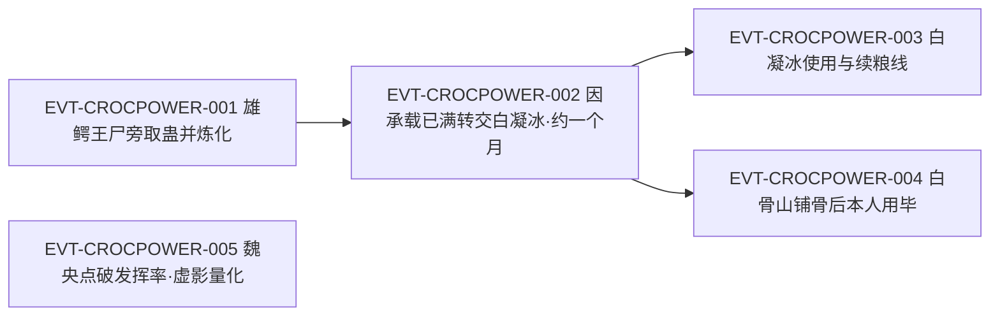

# 鳄力蛊

鳄力蛊是**二转**的**野生增力蛊**：与背甲蛊同出于雄鳄王尸身，一守一攻；它能**永久性**为蛊师增添一单位力量，原文给这个单位起的名字就是“一鳄之力”，落点在撕咬而不是冲撞；它凝出的虚影是“鳄力虚影”，和猪力、熊力、马力并列为同一类外显形态。它自用有一条硬闸门：**凡躯承载上限**，所以在铺好骨骼之前，原文的说法是“就是自杀行为”。它的食料是鳄肉，而新鲜的鳄血还能另走一路去喂血颅蛊、血月蛊。

**检索口径（必读）**：本页为 2026-09-28 GU 蛊虫专题 40 页规模化恢复第二批 S2-1 分片的**新建页**。全书穷举扫描 `鳄力蛊`：命中 **32 次 / 31 行**，**全部落在段二**（`E:V2-035334`–`E:V2-053860`），其余段域 0 命中；31 行中 `E:V2-035558` 一行出现 2 次。**锚点性质复核**：分片表把登记锚 `E:V2-035502` 标为“登记锚行为章节题名”，回原文打印后**该标注被证伪**——该行实为**正文行**，且**转数明文就在锚行本身**（该行逐字为「不管是背甲蛊，还是鳄力蛊，都是二转蛊虫。」），真正的题名行是 `E:V2-035334`（节标记总表 全局序 215／段二原节号 5／节题 `背甲蛊和鳄力蛊`／起始行 35,334），两者相差 168 行。这是本批同类标注的第 3 次证伪（前两例为血滴子、天妒仙蛊）。正文按“原著事实（逐字＋E-ID）→ 合理推导 →《问真》设计意义”三层组织；引文一律回根原文 `source/蛊真人-clean.txt`，行号即 `E:V{段}-{6 位行号}`。

## 主题档案

### 一、来源与身份：雄鳄王尸旁的一对二转野生蛊

#### 原著事实

- 取得场景：方源「蹲在雄鳄王的尸体旁，一阵摸索。」`E:V2-035484`；「当他收回手掌时，两只手中各拿了一只蛊。」`E:V2-035486`。
- 两只蛊的形态与辨识：先取出的一只「一只奄奄一息，仍旧微微挣扎。宛若龟壳，巴掌大小，只是凸起的表面，布满了鳄鱼般的鳞甲。」`E:V2-035492`、随即点名「这是背甲蛊。」`E:V2-035494`；后一只「还有一只，毫发无损，却静静的一动不动，任由方源用食指和拇指轻捏着。」`E:V2-035496`、「这是鳄力蛊。」`E:V2-035498`。
- **转数明文**：「不管是背甲蛊，还是鳄力蛊，都是二转蛊虫。」`E:V2-035502`。
- **野生蛊与兽王等级的对应规则**：「一般而言，百兽王的身上，寄生着二转野生蛊。千兽王的身上，是三转蛊。万兽王掌握着四转蛊。」`E:V2-035504`。
- 炼化条件与入窍形态：方源「泄露出一丝春秋蝉的气息，真元一吐，就将这两只蛊虫炼化。」`E:V2-035508`；背甲蛊「飞到方源的后背上，化为一大片鳞甲印记，宛若纹身，从方源的肩膀延至腰际。布满了后背。」`E:V2-035510`，「顾名思义，它是能增强蛊师后背防御的蛊虫。」`E:V2-035512`；鳄力蛊则「鳄力蛊则化作一道暗黄色的光，钻入到方源的空窍当中去。」`E:V2-035514`。
- 收取当场的旁证：白凝冰「看到这样一幕，白凝冰不顾上愤怒，瞳孔猛缩成针尖大小。」`E:V2-035518`。
- 题名行（**只作名称存在性证据，不作转数／机制证据**）：`E:V2-035334`，该行逐字为「第五节：背甲蛊和鳄力蛊」。

#### 合理推导

- **依据：**`E:V2-035502`＋`E:V2-035504`；**结论：**鳄力蛊的二转不是孤例，而与兽王等级决定野生蛊转数这条规则同构——它是一只随兽体被斩杀而脱离的**野生蛊**，转数与宿主的兽王档位绑定；**不确定性：**原文只给出规则与结论两端，**未点名雄鳄王属于哪一档兽王**，本页因此不把雄鳄王断定为百兽王。
- **依据：**`E:V2-035492`＋`E:V2-035496`＋`E:V2-035498`；**结论：**同一具兽体可以同时寄生**两种功能位不同**的蛊（防御件背甲蛊＋增力件鳄力蛊），且两蛊离体后的存活状态并不相同（一只奄奄一息、一只毫发无损），说明兽体寄生是**多蛊同宿**而非单蛊独占；**不确定性：**原文未写同宿数量上限，也未解释两蛊状态差异的成因。
- **依据：**`E:V2-035508`＋`E:V2-035514`；**结论：**取得与可用之间隔着一道**炼化**手续，且入窍时形态各异（暗黄色的光／后背鳞甲印记），即可见形态由功能位决定；**不确定性：**炼化的真元门槛本窗口只给“真元一吐”这一描述，**未给具体数额**，也未写野生成蛊能否被低转蛊师炼化。

#### 《问真》设计意义

- **一具兽体、多种功能蛊**（`E:V2-035492`、`E:V2-035496`）是可直接做成掉落表的结构：同一只兽王按功能位挂多只蛊，玩家可重复刷取不同功能件，而无需为每件蛊单独设计来源。
- 兽王档位决定野生蛊转数这条规则（`E:V2-035504`）是一条**可复用的掉落等级轴**：它把怪物强度与掉落蛊的转数显式挂钩，比按地图等级掉落更有原典依据。

### 二、核心效果：永久性增力，单位为“一鳄之力”

#### 原著事实

- **效果与定位明文**：「它和黑白豕蛊的作用，大致相同。能永久性的增强蛊师力量，一鳄之力！市价很高，平时是有价无市的珍稀蛊虫。」`E:V2-035516`。
- **效果的永久性被两次复述**：「鳄力蛊和黑白豕蛊相同，皆是永久性增加蛊师的力量。」`E:V2-041446`；并在玉骨蛊处被当作同类比照——「玉骨蛊能改造蛊师的骨骼，形成玉一般的质地，变得更坚硬，更柔韧。这种效果是永久性的，类似黑白豕蛊、鳄力蛊。」`E:V2-039726`。
- **落地表现（力量是被添进身躯的）**：「一丝丝新的力量，永久性的增添到他的身躯当中去。他浑身的骨骼，已经不再白皙，而是类似坚硬的黑铁。」`E:V2-042674`。
- **外显形态与法则依据**：「它们本身蕴藏着关于“气力”的一段大道法则碎片，附着在方源的体内，就成为兽力虚影潜伏起来。全力爆发之后，才会肉眼可见。」`E:V2-053862`；其主语并列里就含鳄力蛊——「同样的，棕熊本力蛊，黑白豕蛊、鳄力蛊也是如此。」`E:V2-053860`。
- **虚影的点名与专长**：「我身上有双猪一鳄之力，猪力擅长冲撞，鳄力长于撕咬，熊力还未养成。」`E:V2-051612`；催发例「方源抬腿侧踢，鳄力虚影！」`E:V2-053060`。

#### 合理推导

- **依据：**`E:V2-035516`＋`E:V2-041446`＋`E:V2-039726`；**结论：**永久性是这条增力谱系的**共同条款**（黑白豕蛊、鳄力蛊、玉骨蛊、棕熊本力蛊同列），因此鳄力蛊的效果不是状态增益而是**身躯改造**——一旦生效即写进基础属性，不可被驱散；**不确定性：**原文未写永久性增力能否被反向手段削去，也未写它是否与凡躯承载上限发生第二次冲突。
- **依据：**`E:V2-053862`；**结论：**兽力虚影不是美术特效而是**机制本体**——它是大道法则碎片在体内的潜伏态，爆发时才可见；因此虚影之间的形态差异（冲撞／撕咬／两栖）对应的是**法则差异的可见投影**；**可能反例：**原文只对气力一段法则作了这一表述，未逐一对每种兽力给出碎片描述，故不能据此推断每种虚影都是独立法则。
- **依据：**`E:V2-051612`＋`E:V2-053060`；**结论：**鳄力的**作用方式被限定**（长于撕咬），且可由持有者主动选择发射动作（抬腿侧踢）；**不确定性：**本窗口没有给出撕咬伤害的具体数值，也没有与其他兽力的直接对拼记录。

#### 《问真》设计意义

- **把永久性做成改造而不是 buff**（`E:V2-041446`、`E:V2-042674`）：这类效果一旦结算就进入角色基础值，能天然形成一次投资、长期回报的养蛊节奏，与消耗型蛊形成互补。
- **虚影即法则投影**（`E:V2-053862`）提供了一条低成本的差异化规则：不同兽力不必各写一套技能，只要把撕咬／冲撞／两栖这些行为标签与虚影形态绑定，玩家就能从形态读出用途——这正是 `E:V2-051612` 里敌方所做的事。

### 三、自用闸门：凡躯承载上限与“用了鳄力蛊，就是自杀行为”

#### 原著事实

- 方源自评两蛊都不顺手：「但不管是鳄力蛊，还是背甲蛊，都并不太理想啊。」`E:V2-035548`（同段另写其资质「虽然是一转初阶，但是甲等资质，再配合天元宝莲。真元恢复速度极快，因此让我能够使用二转蛊虫。」`E:V2-035548`）。
- **闸门的第一条陈述**：「鳄力蛊虽然珍贵，但是目前为止，方源的双猪之力，已经足够强悍。再增长力量，反而会危害他自身。」`E:V2-035552`。
- **闸门的规则层**：「六转以下，蛊师的身躯终究都是凡躯，有承受的极限，不可能一直增长力量。」`E:V2-035554`。
- **闸门的第二条陈述（针对本人已有改造）**：「方源先前利用黑白豕蛊，已经改造自身，在根本上提升了自己的力气。如今再用鳄力蛊，将超出他身体的承受，反而会危害他自己。」`E:V2-035556`。
- **闸门的最强表述**：「也就是说，除非他寻到其他辅助蛊虫，配合鳄力蛊使用。在此之前，他用了鳄力蛊，就是自杀行为。」`E:V2-035558`。
- **承载的机制比喻（另一处复述）**：「就好像是一个碗，它不能装载一片湖。蛊师的躯体承载能力是有限的。」`E:V2-041448`。
- **代价三方（本条自身的支付结构）**：**支付方**＝**使用者自己的身体**（凡躯承载额度，`E:V2-035554`、`E:V2-041448`）；**受益方**＝同一使用者（获得一单位增益，`E:V2-035516`）；**支付时点／生效条件**＝在**未铺骨**的前提下催动**当即**发生——原文写「他用了鳄力蛊，就是自杀行为。」`E:V2-035558`，即代价与使用同时，且**不可事后补偿**。

#### 合理推导

- **依据：**`E:V2-035552`＋`E:V2-035556`；**结论：**闸门**不是**这只蛊太强，而是**它叠加在本人已有改造之上后**超出承载——同一只蛊换到别人身上可以正常使用（见主题四），可见闸门是**持有者侧的条件**而不是蛊本身的缺陷；**不确定性：**原文未给承载额度的度量方式，也未写超出承载的具体后果（只写“危害”）。
- **依据：**`E:V2-035558`＋`E:V2-041448`；**结论：**原文把承载写成**容器容量**（碗／湖），把增力写成**注入**，两者一相乘就自动产生上限，不需要另立规则；**可能反例：**碗不能装湖是比喻，原文并未把它数值化，若据此外推精确上限会超出证据。

#### 《问真》设计意义

- 这是**代价等于使用前置条件**的标准样本：成本不体现为资源燃烧，而体现为**顺序约束**（先铺骨、后增力）。做成机制时，玩家面对的不是值不值而是排不排得开——这比单纯扣资源更能产生构筑决策。
- 闸门位于持有者侧，意味着同一件蛊可以在不同角色间流转以规避限制（`E:V2-035558`、`E:V2-035564`），这一点直接支持蛊的借出与归还类玩法。

### 四、解锁与生效：玉骨蛊铺骨、连续催用一个月

#### 原著事实

- 解锁条件的提出：「白骨山的传承中，有一只玉骨蛊，能增加蛊师的骨骼强度。」`E:V2-035560`；结论句「若是用了此蛊之后，再用鳄力蛊就没有问题了。」`E:V2-035562`。
- 实际取得与解禁：「因此，方源之前还用不了鳄力蛊。好在，从白骨山中他获得了铁骨蛊以及玉骨蛊。」`E:V2-041450`；随后重启修行——「那就是利用鳄力蛊，进行力量修行。」`E:V2-041438`。
- 催动的资源消耗：「将这股白银真元耗尽，方源紧接着催动空窍中的鳄力蛊。」`E:V2-042672`。
- **生效周期的明文**：「用此鳄力蛊可以让你的力量凭空增长一鳄之力。过程有些辛苦，连续催用一个月，大概就能完成了。」`E:V2-035568`。
- **使用权转移**：「方源遥望了东南方一眼，随后心念一转，唤出鳄力蛊。」`E:V2-035564`；「他将鳄力蛊交给白凝冰，同时召回自己的天元宝莲。」`E:V2-035566`。
- **受让方状态（进度可见未满）**：「有了鳄力蛊，她就能弥补自身的力量短板。」`E:V2-035572`；「自从得了鳄力蛊，都是她一直在使用。如今她力量大增，但离一鳄之力还有一段距离，没有圆满。」`E:V2-035950`。
- 受让方的使用记录：「对了，先用鳄力蛊，再休息吧…。」`E:V2-035690`。
- **本人用毕**：「当风尘仆仆的商队来到黄金山脚下时，他也将鳄力蛊用毕，永久性地增添了一鳄之力。」`E:V2-043166`。
- **代价三方（本条自身的支付结构）**：**支付方**分列两方——受让使用者（白凝冰）支付连续催用的辛苦成本（`E:V2-035568`、`E:V2-035950`），出借方（方源）支付**真元**与**在自身改造上让出该蛊一个月以上的时间**（`E:V2-042672`、`E:V2-035566`）；**受益方**＝受让使用者本人（补力量短板，`E:V2-035572`），出借方在其自身用时同样受益（`E:V2-043166`）；**支付时点**＝**生效前**一整月的持续催用（`E:V2-035568`），而**收益在周期满时一次性永久结算**（`E:V2-043166`）。

#### 合理推导

- **依据：**`E:V2-035560`＋`E:V2-035562`＋`E:V2-041450`；**结论：**解锁不是再加一只增力蛊，而是**加一件骨骼类前置件**（玉骨蛊／铁骨蛊）——`E:V2-039726` 说玉骨蛊本身就是永久改造骨骼的蛊，可见扩容与注入是两类不同的蛊在分工；**不确定性：**原文只写玉骨蛊可解禁，未写承载扩容是否可叠加（例如骨、皮、肌三系是否各贡献一部分额度）。
- **依据：**`E:V2-035568`＋`E:V2-042672`；**结论：**生效门是**时间**而不是次数——连续催用一个月是周期条件，真元是过程中的持续消耗，因此这笔投资存在**中途中断的风险**；**可能反例：**原文说“大概就能完成了”，措辞不确定，未写中断后进度是否清零。
- **依据：**`E:V2-035564`＋`E:V2-035572`＋`E:V2-043166`；**结论：**同一只蛊可跨使用者生效（先由白凝冰用、后由方源用毕），说明增益结算**绑定使用者**而非绑定蛊；**不确定性：**原文未写同一只蛊能否被同一人在不同时点重复用毕，也未写能否同时供两人共用。

#### 《问真》设计意义

- **先铺骨才能增力**（`E:V2-035562`）天然是一条**前置链**设计：把它写成装备槽位或改造前置，就能让玩家自发去搜集骨骼类蛊，而不必用任务指引。
- **连续催用一个月**（`E:V2-035568`）是很好的**长周期投资模板**：它让增力成为可规划的中期目标，且天然支持借出与代练这类社交或交易行为（`E:V2-035564`、`E:V2-035566`）。

### 五、饲养链与断粮压力：以鳄肉为食，鳄血另走一路

#### 原著事实

- **食性明文**：「鳄力蛊，是以鳄肉为食。新鲜的鳄血则可以用来喂养血颅蛊、血月蛊。」`E:V2-035582`。
- 离场时的备料：「不过在离开之时，方源尽量采集了一些鳄血鳄肉，收在兜率花中。」`E:V2-035580`。
- **断粮压力的第一次触发**：「富贵险中求！能在山林中，遇到一只鳄并不容易。鳄力蛊需要鳄鱼肉喂养，但是如今已经消耗大半了。先试探一番罢。」`E:V2-035944`；被试探的对象是「这头熔岩鳄，可是千兽王！要斩除它，风险太高。」`E:V2-035940`，且「千兽王的身上，寄居着野生的三转蛊虫。」`E:V2-035942`。
- **试探失败的结论**：「这些天我们把周围都探索遍了，你的主意虽好，却没有合适的对象。看来，我们只能放弃熔岩鳄王了。」`E:V2-036056`；方源的取舍是「原本还想养着鳄力蛊。」`E:V2-036058`。
- **补给到位**：「这些鳄鱼肉，足够再喂养鳄力蛊三个月的。」`E:V2-036132`（该批鳄肉的取得过程不在本次取证窗口内，本页不作推断）。
- **长期饲养的自述**：「说起来，鳄力蛊能养到现在，有点出乎方源的意料。」`E:V2-041440`；「最大的功臣，还得归功于百家。正是从百家得到了大量的鳄肉，方源才将鳄力蛊养到现在。」`E:V2-041442`；「否则，它早就因为缺食而亡了。」`E:V2-041444`。
- **代价三方（本条自身的支付结构）**：**支付方**＝**持有者**（持续提供鳄肉，`E:V2-035582`、`E:V2-041442`）；**受益方**＝**持有者**，但**兑现期被推迟**——只要不断粮，收益要等接着催用满一个月才落地（`E:V2-035568`），因此断粮的代价是**整只蛊死亡、前序投入全部沉没**（`E:V2-041444`）；**支付时点／生效条件**＝**全程持续**，风险在鳄肉消耗大半时即已逼近（`E:V2-035944`）。

#### 合理推导

- **依据：**`E:V2-035944`＋`E:V2-036058`；**结论：**饲养成本会**反过来驱动行动决策**——方源为续粮去试探风险过高的千兽王（`E:V2-035940`），又在评估后放弃；也就是说，养蛊本身会制造出**为粮而战的动机**；**不确定性：**原文未给鳄肉的消耗速率，只能从“三个月”“消耗大半”两个时点侧写。
- **依据：**`E:V2-035582`＋`E:V2-036130`；**结论：**同一份猎物同时供应两条线——鳄肉养鳄力蛊、鳄血喂血颅蛊与血月蛊，故猎鳄的收益是**多蛊共享**的一次性结算；**不确定性：**原文未写鳄血对血颅蛊／血月蛊的喂养效果与用量。

#### 《问真》设计意义

- **饲料与产线**（`E:V2-035582`）是这套系统里最像经济的一环：鳄肉对应增力线、鳄血对应血道线，一次狩猎喂三只蛊，天然形成**资源分配压力**，比单纯的养成计时器更有决策空间。
- **断粮即亡**（`E:V2-041444`）给长期养成加了**失败分支**：玩家不能用先放着不管来回避供养，这与永久性收益（`E:V2-041446`）构成一对此消彼长的设计张力。

### 六、量化与外评：虚影撞柱对比与发挥率批判

#### 原著事实

- **虚影的量化对比**：「动用鳄力虚影的话，能撞飞三根石柱，撞倒四根。」`E:V2-053006`（同句并列猪力「能撞飞五根石柱，撞倒八根」与熊力「平均撞飞七根，撞倒五根石柱」，同在 `E:V2-053006`）。
- **对比的解释**：「显然，山猪之力适合冲撞，冲锋的距离长，全程效果好。棕熊之力前半程力量强大，后半程就虚弱了。至于鳄鱼之力，不太适合冲撞这样的攻击方式。」`E:V2-053010`。
- **专长场景**：「方源抬腿侧踢，鳄力虚影！」`E:V2-053060`；「鳄鱼和山猪、棕熊不同，它是两栖生物，熟识水性。」`E:V2-053062`。
- **增力蛊的构成**：「一共用了三种蛊，黑白豕蛊，鳄力蛊，前几天刚买了一枚棕熊本力蛊，如今正在用着。」`E:V2-051284`；「黑白豕蛊给你增加了两猪之力，鳄力蛊带给你一鳄之力。」`E:V2-051286`。
- **外评（发挥率批判）**：「拳击脚踩，只能发挥出人体的一部分力量。老弟你身上虽有双猪一鳄之力，但真正能发挥出来的有几成呢？」`E:V2-051296`；「这些蛊能永久增加力量，都是价格不菲的蛊。你投入这么多的钱，结果发挥出来的效果。可能十分之一都不到。」`E:V2-051298`。
- **多兽力并列的外显**：「拳风在陡然间爆发，熊力虚影、猪力虚影、鳄力虚影、马力虚影在半空中轮番闪现。」`E:V2-055618`。
- **代价三方（本条自身的支付结构）**：**支付方**＝**购入并长期供养该蛊的蛊师本人**（原文点名「价格不菲」，`E:V2-051298`）；**受益方**＝同一使用者，但收益被换算成**发挥率**而非面板数值（`E:V2-051296`）；**支付时点**＝购蛊与饲养在前、**收益折损在实战中持续发生**（`E:V2-051296`），即成本已沉没、折损每次出手都重演。

#### 合理推导

- **依据：**`E:V2-053006`＋`E:V2-053010`；**结论：**原文给出的是一条**按攻击方式分化**的强弱关系，而不是一条总分排序——鳄力在撞这一项上弱于猪力与熊力，却被明确标注「至于鳄鱼之力，不太适合冲撞这样的攻击方式。」`E:V2-053010`，即它的优势在别处（撕咬，`E:V2-051612`）；**不确定性：**本窗口未给撕咬的量化值，故无法给出鳄力的总分排序。
- **依据：**`E:V2-051296`＋`E:V2-051298`；**结论：**原文对增力蛊的批判落在**发挥率**这一层——双猪一鳄之力是账面，真正出手“可能十分之一都不到”，这等于在机制上承认**面板值与实战值之间有一道折扣**；**可能反例：**该段是魏央对力道修行的**一般性**主张（对象是三种增力蛊共有的弊端），不是针对鳄力蛊的单独评价。
- **依据：**`E:V2-053060`＋`E:V2-053062`；**结论：**鳄力虚影的使用受**场景适配**支配（水域／两栖场景占优），这与不适合冲撞互为印证，形成一种兽力对应一类地形或攻击方式的分工；**不确定性：**本窗口只记录了一次破水球，不足以统计其适配面。

#### 《问真》设计意义

- **三种兽力的对比**（`E:V2-053006`、`E:V2-053010`）几乎可以直接落成一张**按攻击方式分列的性能表**：冲撞／撕咬／地形适配各自成列，玩家据此选择改造路线，而不必比较一个总分。
- **面板不等于出力**（`E:V2-051296`）是一条很有价值的设计约束：如果实现它，增力类改造就不会变成无脑堆数值，而会迫使玩家去解决怎么把力用出来的问题（例如选对动作与地形，`E:V2-053062`）。

## 状态时间线

| 状态 ID | 阶段 | 状态 | 证据 |
|---|---|---|---|
| ST-CROCPOWER-01 | 来源与转数 | [原著明确] 与背甲蛊同出于雄鳄王尸身，两只皆是二转蛊虫；野生蛊转数按兽王等级（百兽王→二转野生蛊） | E:V2-035484、E:V2-035486、E:V2-035496、E:V2-035498、E:V2-035502、E:V2-035504 |
| ST-CROCPOWER-02 | 炼化与寄居 | [原著明确] 真元一吐即炼化；鳄力蛊化作一道暗黄色光钻入空窍，背甲蛊则化为后背鳞甲印记 | E:V2-035508、E:V2-035510、E:V2-035514 |
| ST-CROCPOWER-03 | 核心效果 | [原著明确] 永久性增强蛊师力量，增益单位为「一鳄之力」；与黑白豕蛊作用「大致相同」；市价高、有价无市 | E:V2-035516、E:V2-041446 |
| ST-CROCPOWER-04 | 效果共性 | [原著明确] 与玉骨蛊同属「这种效果是永久性的」一类；与棕熊本力蛊、黑白豕蛊同属「关于“气力”的一段大道法则碎片」，爆发时凝为兽力虚影 | E:V2-039726、E:V2-053860、E:V2-053862 |
| ST-CROCPOWER-05 | 自用闸门 | [原著明确] 六转以下皆凡躯、有承受极限；方源已用黑白豕蛊，再用鳄力蛊会「将超出他身体的承受」；未铺骨前「他用了鳄力蛊，就是自杀行为。」 | E:V2-035552、E:V2-035554、E:V2-035556、E:V2-035558 |
| ST-CROCPOWER-06 | 解锁条件 | [原著明确] 须先取得并使用白骨山传承的玉骨蛊（增加骨骼强度）；「若是用了此蛊之后，再用鳄力蛊就没有问题了。」 | E:V2-035560、E:V2-035562 |
| ST-CROCPOWER-07 | 生效周期 | [原著明确] 非瞬时生效：须连续催用约一个月，「过程有些辛苦」；过程中耗尽白银真元 | E:V2-035568、E:V2-042672 |
| ST-CROCPOWER-08 | 使用权转移 | [原著明确] 方源唤出后交给白凝冰，同时召回天元宝莲；白凝冰用它弥补力量短板，力量大增但「但离一鳄之力还有一段距离，没有圆满。」 | E:V2-035564、E:V2-035566、E:V2-035572、E:V2-035950 |
| ST-CROCPOWER-09 | 食性与副产物 | [原著明确] 以鳄肉为食；新鲜鳄血可另喂血颅蛊、血月蛊 | E:V2-035580、E:V2-035582 |
| ST-CROCPOWER-10 | 断粮压力 | [原著明确] 鳄肉「但是如今已经消耗大半了」即须另寻兽源，方源为此试探熔岩鳄王（千兽王）而作罢；后得大批鳄肉，够再喂三个月 | E:V2-035940、E:V2-035944、E:V2-036056、E:V2-036058、E:V2-036132 |
| ST-CROCPOWER-11 | 长期饲养 | [原著明确] 能养到用毕「有点出乎方源的意料」；否则「它早就因为缺食而亡了。」；最大功臣是从百家得到的大量鳄肉 | E:V2-041440、E:V2-041442、E:V2-041444 |
| ST-CROCPOWER-12 | 本人用毕 | [原著明确] 取得铁骨蛊与玉骨蛊后重启力量修行；骨骼转为「类似坚硬的黑铁」；商队抵黄金山时「他也将鳄力蛊用毕，永久性地增添了一鳄之力。」 | E:V2-041438、E:V2-041450、E:V2-042674、E:V2-043166 |
| ST-CROCPOWER-13 | 外部评价 | [原著明确] 魏央直指增力蛊的发挥率弊端：「但真正能发挥出来的有几成呢？」「可能十分之一都不到。」 | E:V2-051296、E:V2-051298 |
| ST-CROCPOWER-14 | 虚影量化 | [原著明确] 鳄力虚影「能撞飞三根石柱，撞倒四根。」（猪力五／八、熊力七／五）；山猪之力适合冲撞而「至于鳄鱼之力，不太适合冲撞这样的攻击方式。」；鳄力「鳄力长于撕咬」、可侧踢破水球 | E:V2-051612、E:V2-053006、E:V2-053010、E:V2-053060、E:V2-053062 |
| ST-CROCPOWER-15 | 道属与数值 | [原著未明确] 全书 31 行未见任何道属表述；增力总量、催用时耗、鳄肉消耗速率、虚影持续时间均无数值 | E:V2-035502、E:V2-035516 |

## 原著明确内容（本批取证窗口登记）

本批对 `鳄力蛊` 在根原文全书穷举扫描：命中 **32 次 / 31 行**，全部落在段二。下表登记本批实际读取的窗口（含为取炼化、承载、饲养与虚影细节而额外读取的邻行窗口）。

| 窗口 | 内容要点 | 用途 |
|---|---|---|
| 35328–35340 | 白凝冰真元不继；节题 `背甲蛊和鳄力蛊`（题名行 `E:V2-035334`） | 锚点性质复核 |
| 35484–35518 | 雄鳄王尸旁取得两只蛊；背甲蛊寄后背、增防御，鳄力蛊化作暗黄色光入空窍；二转明文；野生蛊转数按兽王等级；白凝冰旁证 | 主题一 |
| 35548–35570 | 两蛊皆并不理想；凡躯承载上限；未铺骨即属自杀行为；玉骨蛊解锁方案；唤出并转交白凝冰；连续催用一个月 | 主题三、四 |
| 35580–35584 | 采集鳄血鳄肉；鳄力蛊以鳄肉为食、鳄血喂血颅蛊与血月蛊 | 主题五 |
| 35684–35694 | 白凝冰先用鳄力蛊再休息 | 主题四 |
| 35940–35950 | 熔岩鳄王为千兽王（寄居三转野生蛊）；鳄肉消耗大半即试探续粮；白凝冰力量大增但离一鳄之力未圆满 | 主题四、五 |
| 36054–36058 | 放弃熔岩鳄王、启程白骨山；原本还想养着鳄力蛊 | 主题五 |
| 36130–36132 | 大批鳄肉，够再喂三个月 | 主题五 |
| 39720–39730 | 玉骨蛊的效果是永久性的、与黑白豕蛊和鳄力蛊同类；玉骨与冰肌搭配最佳 | 主题二 |
| 41436–41450 | 以鳄力蛊做力量修行；养到今天的功臣是百家鳄肉，否则早就因缺食而亡；六转前凡躯承载；铁骨蛊与玉骨蛊解禁 | 主题二、三、五 |
| 42670–42674 | 耗尽白银真元催动；力量永久性增添；骨骼转为类似坚硬的黑铁 | 主题二、四 |
| 43164–43166 | 商队抵黄金山时将鳄力蛊用毕 | 主题四 |
| 51282–51298 | 魏央评点三种增力蛊：双猪一鳄之力；力道修行的最大弊端；发挥可能十分之一都不到 | 主题六 |
| 51610–51612 | 兽力虚影打开局面；猪力擅长冲撞、鳄力长于撕咬 | 主题二、六 |
| 53004–53010 | 三种兽力虚影撞柱量化对比；鳄鱼之力不太适合冲撞 | 主题六 |
| 53058–53066 | 鳄力虚影侧踢；两栖、熟识水性；破水球 | 主题六 |
| 53858–53862 | 棕熊本力蛊、黑白豕蛊、鳄力蛊同属关于气力的一段大道法则碎片 | 主题二 |
| 55616–55618 | 熊／猪／鳄／马力虚影轮番闪现 | 主题二 |

## 事件链

| 事件 ID | 事件 | 参与者 | 证据 | 因果 |
|---|---|---|---|---|
| EVT-CROCPOWER-001 | 方源斩杀雄鳄王后于其尸旁取得两只二转野生蛊（背甲蛊、鳄力蛊），当场炼化；鳄力蛊化作暗黄色光入空窍，因承载已满未敢催用 | 方源、白凝冰 | E:V2-035484、E:V2-035486、E:V2-035498、E:V2-035508、E:V2-035514、E:V2-035554 | evidences ST-CROCPOWER-01、ST-CROCPOWER-02 |
| EVT-CROCPOWER-002 | 方源以凡躯承载已满为由，唤出鳄力蛊交给白凝冰并交代须连续催用约一个月 | 方源、白凝冰 | E:V2-035552、E:V2-035556、E:V2-035558、E:V2-035564、E:V2-035566、E:V2-035568 | evidences ST-CROCPOWER-05、ST-CROCPOWER-07、ST-CROCPOWER-08 |
| EVT-CROCPOWER-003 | 白凝冰持续使用鳄力蛊、力量大增却未圆满；方源为续粮试探熔岩鳄王（千兽王）未果，暂作罢并启程白骨山 | 白凝冰、方源 | E:V2-035950、E:V2-035944、E:V2-036056、E:V2-036058 | evidences ST-CROCPOWER-08、ST-CROCPOWER-10 |
| EVT-CROCPOWER-004 | 白骨山取得铁骨蛊与玉骨蛊后，方源重启鳄力蛊力量修行，耗尽白银真元催动，抵黄金山时用毕、永久添一鳄之力 | 方源 | E:V2-041450、E:V2-041438、E:V2-042672、E:V2-043166 | evidences ST-CROCPOWER-06、ST-CROCPOWER-12 |
| EVT-CROCPOWER-005 | 商家城路上魏央以双猪一鳄之力为范例点破增力蛊的发挥率弊端；其后鳄力虚影在演武与实战中被量化（撞三飞四、侧踢破水球） | 魏央、方源 | E:V2-051296、E:V2-051298、E:V2-053006、E:V2-053010、E:V2-053060 | evidences ST-CROCPOWER-13、ST-CROCPOWER-14 |

事件口径：本页沿用实体簇号 `EVT-CROCPOWER-*`。事件节点 5 个（≥3），按模板配图。全图 3 条边，均有直接原文支撑：001→002（取得后因承载已满才转交）、002→003（白凝冰接手后才谈得上持续使用）、002→004（蛊回流、待铺骨条件满足后由本人用毕）。005 属体系评点与机制量化线，与前三者无因果，故并列**不连边**。

## 资料整理

本页为**新建页**，无旧版可对；本批来源只有根原文，未引入 `notes:`／`memory:` 层转述。派生记录处置（**本段内容不得当作原著事实**）：

- `roster-3.md` 把 `blood_atk_1_18_gu` 记为 1 转、后被裁定改为 2 转，与本页正文口径（`E:V2-035502` 二转明文）一致；`game/data/gu_lore.json` 同条 `lore_rank=2`、`status=ruling_applied`，仅作消费层核对，不据以改页。
- **锚点性质复核（本页最需要下游注意的一条）**：分片表（`ASSIGNMENTS.md` 第 36 行、第 67 行合成锚风险名单）把登记锚 `E:V2-035502` 标为登记锚行为章节题名。回原文打印后**该标注被证伪**：`E:V2-035502` 是含转数明文的**正文行**，真正的题名行是 `E:V2-035334`（节标记总表 全局序 215／节题 `背甲蛊和鳄力蛊`／起始行 35,334）。本页据此把题名行与转数证据行分开登记。
- **分类账（全书穷举，含重复块、未去重）**：`鳄力蛊` 命中 **32 次 / 31 行**，全部落在段二，段一／三／四／五／六均为 0 行。逐行枚举（31 行，与实测集合逐个相等）：E:V2-035334、E:V2-035498、E:V2-035502、E:V2-035514、E:V2-035548、E:V2-035552、E:V2-035556、E:V2-035558、E:V2-035562、E:V2-035564、E:V2-035566、E:V2-035568、E:V2-035572、E:V2-035582、E:V2-035690、E:V2-035944、E:V2-035950、E:V2-036058、E:V2-036132、E:V2-039726、E:V2-041438、E:V2-041440、E:V2-041442、E:V2-041446、E:V2-041450、E:V2-042672、E:V2-043166、E:V2-051284、E:V2-051286、E:V2-051298、E:V2-053860。其中 `E:V2-035558` 一行出现 2 次，故 31 行对应 32 次。
- **子串／误切复核**：31 行**均为独立成词**，无一处是被更长专名吞并的子串。左邻字符实测集合为 用／了／是／将／、／，／和／合／出／此／。／着／养／的／空格，其中没有任何一个可作为专名前置字；本书文本内 `力鳄力蛊`、`力鳄`、`鳄力蛊虫` 均 **0 次命中**，故不存在比 `鳄力蛊` 更长的包含它的专名。本实体**不属**疑似非实体，无需按 L0 口径登记为非实体。
- **桥接层命名碰撞（仅登记，不据以改 Canon）**：`game/data/gu_names.json` 另有 `force_atk_1_32_gu`＝“力鳄力蛊”，其名以 `鳄力蛊` 为后缀。该书文本内 `力鳄力蛊` **0 次命中**，故本页 31 行与它**无交集**；属游戏侧命名与原著文本的碰撞，写入《待核对》而不引入 aliases。`game/**` 本批只读，不在改动范围。
- **含遮蔽符的行（原文自身）**：本页所用行中 `E:V2-041448`（该行含 `**凡胎`）与 `E:V2-051288` 含 `**` 字符。本页**只引其未遮蔽片段**，不引用、不猜测被遮蔽内容。
- **本页引号规范（便于复核）**：角引号（U+300C／U+300D）只用于**可逐字回溯到原文行**的引文；分析用词、拼合名目与表格字段名一律用全角弯引号或反引号，不放进引文位置。

## 分析与解读

1. **鳄力蛊的证据强度集中在闸门而不是数值**：原文把机制写得很硬（`E:V2-035502`、`E:V2-035516`、`E:V2-035554`、`E:V2-041446`），却几乎不给数值——全书仅三个可量化点：一鳄之力这个单位、连续催用一个月、虚影撞柱飞三倒四。因此本页的可交付性主要在**条件与顺序**，而不是数值表。
2. **它展示了一种与消耗型完全不同的代价形态**：鳄力蛊的成本是**前置条件**（铺骨，`E:V2-035562`）＋**持续供养**（鳄肉，`E:V2-035582`、`E:V2-041444`），而不是一次性燃烧资源。对照同批的血滴子（以蛊师性命预喂养），两者构成条件型代价与献祭型代价的对照样本。
3. **同一只蛊可以跨使用者结算**（`E:V2-035564`、`E:V2-035950`、`E:V2-043166`）：先由白凝冰使用、后由方源用毕，说明增益绑定使用者而非蛊。这一条足以支撑蛊的借出、归还与代练这套玩法，而不必新造机制。
4. **原文对它的批判来自体系内部而非外部**：魏央的「但真正能发挥出来的有几成呢？」「可能十分之一都不到。」（`E:V2-051296`、`E:V2-051298`）把增力蛊的价值问题从加多少改写成用得出多少。这条外评是本页最有设计价值的一段，因为它把面板值与实战值显式分开。
5. **与[白豕蛊与肉身增力](white-boar-strength-gu.md)、[玉骨蛊](bone-def-3-05-gu.md)合看构成闭环**：白豕蛊给注入、玉骨蛊给扩容、鳄力蛊给追加注入，三页连起来才读得通「蛊师的躯体承载能力是有限的。」这句话（`E:V2-041448`）的含义。缺任一环，鳄力蛊用了即自杀的设定都会显得无因。

## 待核对

- `[原著未明确]` **道属**：全书 31 行未见任何道属表述，也未出现非二转的第二口径。id 前缀 `blood_atk_*` 与机制（增力）之间的归类张力，按 L0 本轮口径 ID 是稳定 opaque key、前缀不拥有 Canon 语义，**只登记、不改 id、不据此写原著事实**。
- `[原著未明确]` **增力上限与叠加**：原文只给「一鳄之力」这一单位（`E:V2-035516`），未写一只蛊能否把力量加到一鳄以上、多只同类能否叠加、以及叠加是否重新撞上承载上限。
- `[原著未明确]` **雄鳄王的兽王档位**：`E:V2-035504` 给出百兽王对应二转野生蛊的规则，`E:V2-035502` 给出二转明文，但原文**未点名**雄鳄王属于哪一档。本页只并列两条，不据此判定雄鳄王为百兽王。
- `[原著未明确]` “用毕”的确切含义：`E:V2-043166` 写「他也将鳄力蛊用毕，永久性地增添了一鳄之力。」，未写用毕后该蛊是否消亡、是否还能转移他人再用。
- `[待取证]` **数值类缺口（机制已确认、数值未知 → 拆条）**：机制 **[已确认]** ＝永久性增力（`E:V2-035516`）、按使用者结算（`E:V2-043166`）、可凝为鳄力虚影（`E:V2-053862`）、以鳄肉为食（`E:V2-035582`）、自用受凡躯承载闸门限制（`E:V2-035554`）；具体数值 **[待取证]** ＝「一鳄之力」的绝对量与换算、催用满一个月的时间成本与中断后果、鳄肉消耗速率、虚影的持续时间与撕咬伤害。
- `[原著未明确]` **超出承载的后果**：`E:V2-035552`、`E:V2-035556` 只写「反而会危害他自身。」「反而会危害他自己。」，`E:V2-035558` 用「就是自杀行为」作强表述，但**未写具体损伤形态**，也未写是否可逆。
- `[存在冲突]` **桥接层命名碰撞**：`game/data/gu_names.json` 的 `force_atk_1_32_gu`＝“力鳄力蛊”以 `鳄力蛊` 为后缀，而全书文本内 `力鳄力蛊` **0 次命中**。**当前状态**：不裁定，只登记为游戏侧命名与原著文本的碰撞（本页 31 行与它无交集）。
- `[原著未明确]` **体积**：本页实测 **40,906 字节**，已超 GOVERNANCE 十进制口径 40,000 B 上限，**按 GOVERNANCE 现有格式登记例外**（实测 40,906 字节 ≈ 39.95 KiB／40.91 KB 十进制）。超出部分来自本页必需的原著逐字引文与分类账枚举，删任一都会损伤机制、条件与反例的可核性，故不删有效知识。

## 模板扩展建议（只登记，不改核心模板）

1. **需要承载闸门的结构位**。鳄力蛊的成本不是消耗而是**顺序约束**（`E:V2-035554`、`E:V2-035562`），现有模板的代价段默认消耗资源，装不下先铺骨才能用这类前置条件。同批[玉骨蛊](bone-def-3-05-gu.md)也涉及同一约束的另一侧。
2. **需要同宿多蛊的表达位**。同一具兽体同时寄生防御件与增力件（`E:V2-035492`、`E:V2-035496`），属兽体侧的掉落表结构，不属于任一实体页；本页只能写进主题一。
3. **需要面板值与出力值二级指标的表达位**。`E:V2-051296`、`E:V2-051298` 把增力量与实战出力分开，而模板目前只有一个力量字段；若下游照抄单一字段，发挥率这条原文批判会直接丢失。
4. **需要跨使用者结算的表达位**。同一只蛊先由白凝冰使用、后由方源用毕（`E:V2-035564`、`E:V2-043166`），模板的持有关系是单人的，无法表达借出期间收益归借入方。

## 关联页面

[白豕蛊与肉身增力](white-boar-strength-gu.md)、[玉骨蛊](bone-def-3-05-gu.md)、[斤力蛊](force-atk-1-05-gu.md)、[血月蛊](blood-atk-3-11-gu.md)、[力道](../world/strength-path.md)、[血道](../world/blood-path.md)、[资质与空窍](../world/aptitude-and-aperture.md)、[道痕](../rules/dao-marks.md)、[蛊的饲养与炼化](../world/gu-care-and-refinement.md)、[真元](../world/primeval-essence.md)、[修炼体系](../world/cultivation-system.md)、[方源](../characters/fang-yuan.md)、[白凝冰](../characters/bai-ning-bing.md)、[蛊虫关系](gu-relations.md)、[蛊虫总表三期](roster-3.md)、[蛊虫总表](roster.md)、[经济名录](../world/economy-roster.md)。
