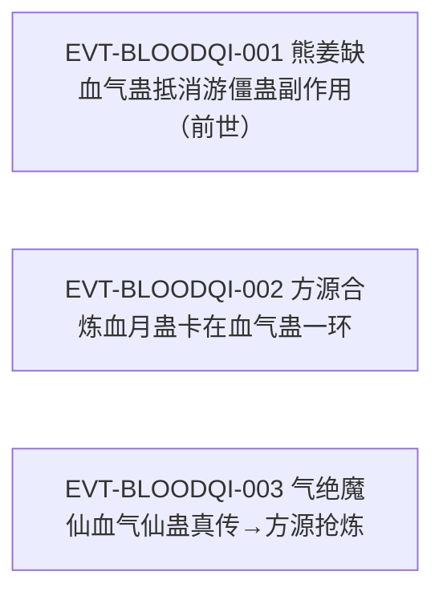

# 血气蛊

血道线上的**补给与搭配件**：原文只给了它两条功能——「补充蛊师的血气」，以及「和游僵蛊搭配时候，后者的后遗症将锐减至无」。它同时是三转[血月蛊](blood-atk-3-11-gu.md)合炼的第二种材料，而这一环正是方源眼中的「有些麻烦」。

本页是 2026-09-28 血道／骨道批次的**新建页**，也是本批要求**双边登记**的两页之一（另一页为[骨枪蛊](bone-def-3-01-gu.md)）。本页全书穷举扫描"血气蛊"：命中 **8 行**（21036、26840、26874、26876、26878、26880、75640、429250），另单独扫描其近名形式「血气仙蛊」（6 行）与"血气凡蛊"（**0 行**）。**本体转数原文未明确**，双口径见主题一；同名双写见主题四。

## 主题档案

### 一、名目核清：三处"转数"表述的归属与双口径登记

#### 原著事实

- 唯一给出转数位置的原句：「利用二转月芒蛊和血气蛊相互合炼，形成的三转蛊虫。」`E:V1-026840`——该句中"二转"紧邻并修饰"月芒蛊"，"三转"修饰产物（血月蛊）。
- 另两处转数表述均属**他物**：`E:V1-027270`「这是三转血月蛊。」、`E:V2-037096`「血月蛊虽然是三转蛊虫」。
- 全书 8 处"血气蛊"命中中，**没有一句陈述血气蛊自身的转数**（穷举口径，无单行可挂 E-ID；8 处出处书目见《原著明确内容（本批取证窗口登记）》）。
- 获取难度被写成障碍：「他手中已经有了月芒蛊。但另一种蛊虫血气蛊，却是有些麻烦。」`E:V1-026874`
- 渴求者修为可查：熊姜「他已经是二转蛊师中的佼佼者了，地位较高，但直到他战死。也没有得偿所愿。」`E:V1-026882`

#### 合理推导

- **口径A（句法读法）**：`E:V1-026840` 中"二转"是紧邻定语，只覆盖"月芒蛊"；"血气蛊"不带转数限定。→ **血气蛊本体转数 `[原著未明确]`**。
- **口径B（并列读法）**：若把"二转"理解为同时修饰并列的两种材料蛊（"二转的月芒蛊和血气蛊"），则血气蛊＝二转。旁证：渴求者熊姜是「二转蛊师中的佼佼者」`E:V1-026882`，其生前极度渴望此蛊 `E:V1-026878`；若血气蛊高达三转，与二转蛊师的持有动机不匹配（同类门槛可在同批[骨枪蛊](bone-def-3-01-gu.md)页查到：一转高阶空窍装载数百只骨枪蛊即「有不堪重负的危险」`E:V2-040946`、`E:V2-040958`）。→ 记为 `[合理推导]`。
- **当前状态**：**两读并存，本页不强行统一**。本页采用口径A作主表述（原文无直陈），口径B作为待核旁证保留；**不得**把"二转"写进本页的无条件事实区。
- **不确定性**：两句旁证（渴求者修为、空窍负担）都只能窄化范围，不能定值；原文未写"血气蛊是几转"这类句子。

#### 《问真》设计意义

- 这只蛊暴露了一个**数据模型问题**：原文大量使用的"二转Ｘ蛊和Ｙ蛊合炼成三转Ｚ蛊"句式，只给材料之一标转数。若把该句式整体解析为"材料转数＝前者转数"，就会给第二种材料凭空赋转。设计上宜允许"材料蛊转数未知"，而不是强制补全。
- 同时它是一条**正面样板**：材料蛊（血气蛊）本身是低阶件，却是三转成品的必需项——支持"成品强度不必然来自材料强度"的配方观。

### 二、功能明文：补充血气、抬高战场生存率

#### 原著事实

- 功能总述：「血气蛊珍贵，能补充蛊师的血气。」`E:V1-026876`
- 机制效果：「拥有血气蛊的蛊师。常常精力旺盛，就算是受伤，失血过多，也有血气蛊补充之。因此战场生存能力比寻常蛊师，都要高出一筹。」`E:V1-026876`
- 稀缺性同句并列：「血气蛊珍贵」`E:V1-026876`。
- 获取难度：「但另一种蛊虫血气蛊，却是有些麻烦。」`E:V1-026874`
- 欲求侧的强化：「熊姜曾经极度渴望，拥有一只血气蛊。」`E:V1-026878`；结局「直到他战死。也没有得偿所愿。」`E:V1-026882`。

#### 合理推导

- **依据**：`E:V1-026876`；**结论**：它的作用域是**恢复与续航**（补血气、抗失血），不是输出；收益的兑现前提是"受伤／失血过多"已经发生——即它是**受击后的补偿件**，对满血状态无正面作用；**不确定性**：补充速率、单次补充量、是否有使用次数上限，原文均未给。
- **依据**：`E:V1-026876`＋`E:V1-026882`；**结论**：功能明确而获取极难，构成"强效果＋高稀缺"的组合；**不确定性**：稀缺的成因（材料、产地、炼制难度）原文未写。

#### 《问真》设计意义

- "受击后补偿"是一条可直接实现的**触发式续航**机制，天然与"失血／流血"类效果（如[血月蛊](blood-atk-3-11-gu.md)的不可止血）形成体系内的互克与互配。
- "珍贵但功能朴素"是很干净的稀有度设计：它不改变输出上限，只改变**容错率**，因此可以在不破坏数值平衡的前提下作为稀缺奖励。

### 三、搭配收益：与游僵蛊组合，后遗症锐减至无

#### 原著事实

- 搭配明文：「若是血气蛊和游僵蛊搭配时候，后者的后遗症将锐减至无。使得他化身僵尸的时间大大延长，再无后顾之忧。」`E:V1-026880`
- 反面推导（游僵蛊単用）：「熊姜的游僵蛊，最好和血气蛊搭配使用。否则使用过多，自身的血液越来越少，真的就僵尸化了。」`E:V1-021036`
- 搭配的实例化欲求：「熊姜曾经极度渴望，拥有一只血气蛊。」`E:V1-026878`——他正是游僵蛊的持有者。

#### 资源与代价（支付方／受益方／时点）

- **受益方**：**游僵蛊的持有者**（本次为熊姜）——支付方不是血气蛊的使用者，而是**需要为另一只蛊的副作用买单的人**：`E:V1-021036` 明确「否则使用过多，自身的血液越来越少」，即副作用由**自身血液**支付。
- **支付时点**：**每次使用游僵蛊时累积**（「使用过多」），直至「真的就僵尸化了」`E:V1-021036`；血气蛊的作用是把这条累积曲线**削平到零**（「后遗症将锐减至无」`E:V1-026880`）。
- **效果三要素**：①副作用清零；②化身僵尸的**时间上限被延长**（「大大延长」`E:V1-026880`）；③心理层收益「再无后顾之忧」`E:V1-026880`。
- **缺口**：原文未写搭配的具体门槛（血气蛊转数、是否需同时催动、是否消耗血气蛊本身）。

#### 合理推导

- **依据**：`E:V1-021036`＋`E:V1-026880`；**结论**：这是一组**副作用抵消型搭配**（不是数值叠加），其设计价值在于把"高风险技能"转为"可长期使用的主力"；**不确定性**：「锐减至无」是否绝对为 0，原文用「锐减至无」表述，本页按字面记为清零，但保留不排除小说式夸张的可能。
- **依据**：`E:V1-026878`＋`E:V1-026882`；**结论**：搭配收益之高，可以从持有者的**行为**反推——熊姜身为二转佼佼者、地位较高，却把"得到血气蛊"当作执念，直到战死未成；**不确定性**：他的执念可能同时源于功能（补血气）与搭配，原文未拆权重。

#### 《问真》设计意义

- "副作用清零＋时长延长"是比"加数值"更可控的**体系语法**：它让游僵蛊这类高风险蛊从"一次性爆发"转为"长期主力"，同时把血气蛊的稀缺价值直接锚定在别人的副作用上。
- 由于受益方是**另一只蛊的持有者**、支付方是**自身血液**，这套机制天然带"借血换输出"的叙事质感，适合做代价可视化（血量曲线）。

### 四、名目双写：名录中的"血气蛊"与叙述中的「血气仙蛊」

#### 原著事实

- 名录写法（两处，均用通名"血气蛊"）：「据说血海有九道真传。分别有血颅蛊、血手印蛊、血气蛊、血汗蛊、经血蛊、血影蛊、血战蛊，」`E:V3-075640`；「以及上古荒兽戾血龙蝠，六转仙蛊血神子。」`E:V3-075640`
- 名录复述（第三处，仍用"血气蛊"）：「这九道中分别是血颅蛊、血手印蛊、血气蛊、血汗蛊、经血蛊、血影蛊、血战蛊、血神子蛊以及上古荒兽戾血龙蝠的豢养、奴役之法。」`E:V6-429250`
- 名录的性质（关键限定）：「但也有九道真传，乃是蛊仙层次」`E:V6-429248`；即名录整体属**蛊仙层次**。
- 叙述写法（改用「血气仙蛊」）：「西漠的血气仙蛊真传，被气绝魔仙所得。」`E:V6-429262`
- 同一实体的另一说法：「气绝魔仙曾在西漠中夺取的血气仙蛊，就是血海真传中的一道」`E:V6-385630`。
- 转数与流转：「至于血气仙蛊，也在方源手中。」`E:V6-430476`；「气绝魔仙得到血气仙蛊的真传，曾经和方源交易，令方源得到了相关的仙蛊方。」`E:V6-430478`；「目前转数也不高，只是六转而已。」`E:V6-430482`；「气绝魔仙死后，方源就将其抢炼出来。」`E:V6-430480`。
- **凡／仙对照的原文样板（用于类比，非血气蛊本身）**：血颅一路明写两形——「方源原本拥有四转的血颅凡蛊」`E:V6-430454`、`E:V6-430456`（血颅凡蛊之代价）；「血颅仙蛊也在方源的手中！」`E:V6-430452`；另一处「但血颅蛊只是凡蛊」`E:V4-155616`。
- **命名不对称（本批扫描结果）**：全书「血颅凡蛊」有明文（`E:V6-430454`），而**"血气凡蛊"0 处命中**；"血气蛊"8 处、「血气仙蛊」6 处。

#### 合理推导

- **口径A（同一实体、两名并用）**：名录以通名称"血气蛊"`E:V3-075640`、`E:V6-429250`，叙述以「血气仙蛊」`E:V6-429262`、`E:V6-385630` 称其仙蛊形态；二者同指血海九道真传之一，且「九道真传，乃是蛊仙层次」`E:V6-429248` 已限定名录层级。→ 名录中的"血气蛊"＝「血气仙蛊」。
- **口径B（两个实体、共享词干）**：`E:V1-026840`／`E:V1-026874`／`E:V1-026876` 所指的是一只**可作三转蛊合炼材料**、被**二转蛊师**渴求的低阶蛊；一只六转仙蛊 `E:V6-430482` 不可能充当三转成品的合炼材料，故二者非同物，只是名称共享词干。
- **旁证（支持口径B的存在）**：原文为血颅一路写出了"血颅凡蛊／血颅仙蛊"的完整对照（`E:V6-430454`、`E:V6-430452`），却**没有**为血气一路写出"血气凡蛊"；即原文并未把 26874–26880 的低阶血气蛊明确登记为同一道的凡蛊形态。
- **当前状态**：**两口径并存，本页不强行统一**；**不得**写成"血气蛊就是血气仙蛊的凡蛊形态"（口径A）或"血气蛊与血气仙蛊无关"（口径B）中的任一为唯一结论。按 L0 本轮口径，"原著本尊／《问真》同名实体"视为不同实体，禁止为同名强行 1:1 合并——本页据此对两个口径均只登记、不合并。
- **不确定性**：名录自身命名也不一致——`E:V3-075640` 中"血神子"写作「六转仙蛊血神子」，`E:V6-429250` 却写「血神子蛊」；因此"名录用通名"这一规律只在血气蛊一项上可观察到，样本太小。

#### 《问真》设计意义

- 这是一条**必须做数据边界**的素材：同名的高阶仙蛊与低阶材料件如果被合并成一个实体，会出现"六转仙蛊当三转合炼材料"的荒谬配方。建议以**段域＋层级**双维度区分同名条目，而不是只靠名字。
- "血颅凡蛊／血颅仙蛊"提供了一个可用的**命名范式**：同名两形显式带"凡／仙"后缀。若后续取证补出"血气凡蛊"，可直接落进该范式；在此之前应保持两读并存。

### 五、作为三转血月蛊的必需材料

#### 原著事实

- 材料必要性：「利用二转月芒蛊和血气蛊相互合炼，形成的三转蛊虫。」`E:V1-026840`
- 材料获取构成主要障碍：「他手中已经有了月芒蛊。但另一种蛊虫血气蛊，却是有些麻烦。」`E:V1-026874`
- 稀有度与功能的同段并列：`E:V1-026876`（珍贵／补血气）。
- 最终得手的旁证：方源炼成血月蛊（「这是三转血月蛊。」`E:V1-027270`），其素材来源为「压榨了古月赤练所得」`E:V1-027274`。

#### 合理推导

- **依据**：`E:V1-026840`＋`E:V1-026874`；**结论**：血气蛊在配方中是**不可替代的第二种材料**，且难度高于第一种（月芒蛊已有、血气蛊「有些麻烦」）；**不确定性**：原文未写合炼对血气蛊数量、成色或转数的要求（这正是主题一转数未明的后果）。
- **依据**：`E:V1-027274`；**结论**：血月蛊的两份材料最终都由古月赤练身上压榨取得，说明血气蛊在南疆可通过人体／血亲类来源获得；**不确定性**：该来源是否为常规途径，原文未评价。

#### 《问真》设计意义

- 一个"低成本主体＋高难辅料"的配方结构（月芒蛊易得、血气蛊麻烦），比"每样都难"更容易做出**阶段性目标感**：玩家能明确知道卡在哪一环。
- 材料转数口径未明时，配方解析应允许**材料要求留空**（见主题一），避免反向生成不存在的规则。

## 状态时间线

| 状态 ID | 阶段 | 状态 | 证据 |
|---|---|---|---|
| ST-BLOODQI-01 | 名目首次出现 | 在血月蛊配方中以第二种材料出现，句法上不带转数限定 | E:V1-026840 |
| ST-BLOODQI-02 | 本体转数口径 | 口径A：句中"二转"只修饰月芒蛊，血气蛊转数未明确；口径B：并列读法得二转（合理推导）；两读并存 | E:V1-026840、E:V1-026882 |
| ST-BLOODQI-03 | 功能明文 | 补充蛊师血气；持有者精力旺盛、失血过多可补，战场生存能力高出一筹；珍贵 | E:V1-026876 |
| ST-BLOODQI-04 | 获取难度 | 「却是有些麻烦」；熊姜极度渴望，身为二转佼佼者直到战死也未得偿 | E:V1-026874、E:V1-026878、E:V1-026882 |
| ST-BLOODQI-05 | 搭配收益 | 与游僵蛊搭配，后者后遗症锐减至无、化身僵尸时间大大延长；反面为血液渐少真成僵尸 | E:V1-021036、E:V1-026880 |
| ST-BLOODQI-06 | 名录登记（通名） | 列入血海九道真传名录，写作"血气蛊"；该名录整体为蛊仙层次 | E:V3-075640、E:V6-429248、E:V6-429250 |
| ST-BLOODQI-07 | 仙蛊形态与转数 | 叙述改称「血气仙蛊」，为血海真传一道，被气绝魔仙所得；方源持有，转数「只是六转」 | E:V6-385630、E:V6-429262、E:V6-430476、E:V6-430482 |
| ST-BLOODQI-08 | 名目双写待核 | 血量一路有"血颅凡蛊／血颅仙蛊"明文对照，血气一路无"血气凡蛊"（0 处）；双口径并存 | E:V6-430452、E:V6-430454、E:V4-155616 |

## 原著明确内容（本批取证窗口登记）

本批对"血气蛊"在根原文全书穷举扫描：命中 **8 行**——21036、26840、26874、26876、26878、26880、75640、429250。近名形式另扫：「血气仙蛊」6 行（385630、429262、430434、430476、430478、430482，其中两行同段连续）、"血气凡蛊"**0 行**、「血颅凡蛊」有明文。下表登记本批实际读取的窗口。

| 窗口 | 内容要点 | 用途 |
|---|---|---|
| 21030–21044 | 蛊虫弊端需搭配他蛊化解的通用规律；熊姜的游僵蛊若不搭配血气蛊，血液渐少真会僵尸化 | 主题三（反面口径） |
| 26836–26844 | 血月蛊配方与产物；血气蛊作为第二种材料首次出现 | 主题一、五 |
| 26872–26884 | 材料障碍「有些麻烦」；血气蛊功能与珍贵；熊姜极度渴望、二转佼佼者直至战死未得；与游僵蛊搭配后遗症锐减至无 | 主题一、二、三、五 |
| 75636–75646 | 血海九道真传名录（通名写法）；血海传承的世人口径 | 主题四 |
| 385626–385634 | 气潮致真传秘地显形；血气仙蛊即血海真传一道 | 主题四 |
| 429240–429266 | 血海老祖身份与血道开创；九道真传属蛊仙层次；西漠血气仙蛊真传被气绝魔仙所得 | 主题四 |
| 430450–430486 | 血颅仙蛊／血颅凡蛊对照；血气仙蛊在方源手中、由气绝魔仙交易得仙蛊方、死后被抢炼、转数六转 | 主题四 |
| 155612–155618 | 血颅蛊「只是凡蛊」；提升为仙蛊需推算仙蛊方、耗时耗力 | 主题四（凡／仙范式旁证） |

## 事件链

| 事件 ID | 事件 | 参与者 | 证据 | 因果 |
|---|---|---|---|---|
| EVT-BLOODQI-001 | 熊姜将游僵蛊列为依仗，却始终得不到血气蛊以抵消其副作用，直至战死 | 熊姜（前世） | E:V1-021036、E:V1-026878、E:V1-026880、E:V1-026882 | evidences ST-BLOODQI-04、ST-BLOODQI-05 |
| EVT-BLOODQI-002 | 方源为合炼血月蛊搜集材料，卡在血气蛊一环 | 方源 | E:V1-026840、E:V1-026874、E:V1-027274 | enables ST-BLOODQI-01 |
| EVT-BLOODQI-003 | 气绝魔仙于西漠夺得血气仙蛊真传，后与方源交易仙蛊方；气绝魔仙死后方源将其抢炼 | 气绝魔仙、方源 | E:V6-385630、E:V6-429262、E:V6-430478、E:V6-430480 | evidences ST-BLOODQI-07 |

事件口径：本页沿用实体簇号 `EVT-BLOODQI-*`。事件节点 3 个（≥3），按模板配图；但三条分属**前世熊姜线／方源合炼线／仙蛊流转线**，彼此不相接，故图中只并列节点、**不连边**——不为配图而虚构因果。若后续取到接线证据（如血气蛊的流通路径），应据实补边。

## 资料整理

本页为**新建页**，无旧版可对；本批来源只有根原文，未引入 `notes:`／`memory:` 层转述。派生记录处置（**本段内容不得当作原著事实**）：

- `roster-3.md` 的「命名碰撞待核」节把 `blood_atk_3_03_gu` 记为"血气蛊 | 3 | 命名碰撞待核"并注明"原句『二转月芒蛊和血气蛊合炼成三转』中的转数指**产物**、本体转数待核"。本页回原文复核后**确认该注解正确**：`E:V1-026840` 的"三转"确指产物；并补充其未写出的另一半——"二转"在句法上同样只修饰月芒蛊，故本体转数原文**未明确**（而非"二转"）。
- 本页新增登记 roster-3 未记的**第二重碰撞**：名录"血气蛊"`E:V3-075640`／`E:V6-429250` 与叙述「血气仙蛊」`E:V6-429262` 的同名双写；且名录整体属「蛊仙层次」`E:V6-429248`，与作三转合炼材料的低阶血气蛊不可合并。
- 误切／子串碰撞复核：**8 处"血气蛊"命中均为独立成词**，未见「合炼蛊虫」式为短语误切的情形；"血气蛊"不是任何更长专名的子串。近名「血气仙蛊」独立成词 6 处。
- 桥接层（`game/data/gu_lore.json`、`game/docs/lore/canon-index.md`）按 L0 本轮口径只作消费层。本页**不声明 `canon-index` 字段、不新建 CAN ID**，`game/**` 只读、不在本批改动范围；本页**不写任何第二份游戏数值**。
- 原文自身瑕疵登记：本页所用 8 行与近名 6 行**均无**站点水印或遮蔽符；`E:V1-026876` 存在句号误用（「拥有血气蛊的蛊师。常常精力旺盛」），引文时只截取不跨该标点的片段，不改原文。

- 本页引号规范（便于复核）：角引号（U+300C／U+300D）只用于**可逐字回溯到原文行**的引文；分析用词、拼合名目与表格字段名一律用 `"…"`，不放进引文位置。

## 分析与解读

1. **本页的真正价值是"不要让解析器替原文下结论"**。`E:V1-026840` 一句里两个转数、三个名词，原文只给其中两个词标了转数；把它整体读作"材料二转、产物三转"是**我们的补全**，不是原文的断言。本页把这一点显式登记为双口径，就是为了避免这个补全被后续页面当成事实继承。
2. **"搭配"在本书是一条独立机制线，而非附属注释**。`E:V1-026880`（后遗症锐减至无）与 `E:V1-021036`（否则血液越来越少真成僵尸）构成一组完整的**风险—对冲**关系；同类规律在别处也被抽象成通则：「一般强大的蛊虫，弊端也会很大，需要和其他的蛊虫搭配起来使用。」`E:V1-021034`。血气蛊因此不只是"补血件"，而是**风险对冲体系的一个标准零件**。
3. **稀缺度与功能强度不成比例，是刻意的**。功能朴素（补血气，`E:V1-026876`）却"珍贵"、令二转佼佼者毕生不得（`E:V1-026878`、`E:V1-026882`）。稀缺锚定在**获取途径**而不是效果上限，这与[血月蛊](blood-atk-3-11-gu.md)"攻击差强人意却好养活"恰成镜像：一个便宜而弱，一个稀有而稳。
4. **同名双写是本页最需要下游警惕的一点**。名录层级为蛊仙层次（`E:V6-429248`），而材料用法做的是三转合炼（`E:V1-026840`）；两条证据彼此排除对方的同物假设。凡／仙范式在血颅一路有明文样板（`E:V6-430454`、`E:V6-430452`）而在血气一路缺失，本页据此把两种解读都留在纸面上。
5. **血道体系的可视化收获**：与[血月蛊](blood-atk-3-11-gu.md)（攻击位）、血气蛊（续航／对冲位）合看，血道在这一阶段呈现的是**"输出＋续航"双件套**结构，而不是单点爆发；这与原文把血道写成"血海真传绝大多数只是凡蛊、凡道杀招之流"`E:V6-429248` 的整体层级印象一致。

## 待核对

- `[原著未明确]` **本体转数**（本页首要缺口）：全书 8 处命中无一句陈述血气蛊自身转数；`E:V1-026840` 的"二转"在句法上只覆盖月芒蛊。**口径A**：本体转数未明确（`E:V1-026840` 句法）；**口径B**：并列读法得二转，旁证为二转蛊师熊姜的持有动机（`E:V1-026882`、`E:V1-026878`），属 `[合理推导]`。**当前状态**：两读并存，不强行统一；**不得**以游戏侧"转 3"回填——该 3 已在 `E:V1-026840` 中被证明是**产物**转数。
- `[存在冲突]` **"血气蛊"与「血气仙蛊」是否同一实体**：**口径A（同名两面）**：名录以通名登记（`E:V3-075640`、`E:V6-429250`），叙述以"仙蛊"形称之（`E:V6-429262`、`E:V6-385630`），且名录整体属蛊仙层次（`E:V6-429248`）；**口径B（两个实体）**：低阶血气蛊可作三转成品合炼材料（`E:V1-026840`）并被二转蛊师渴求（`E:V1-026878`），与六转仙蛊（`E:V6-430482`）层级不相容；旁证为「血颅凡蛊」有明文（`E:V6-430454`）而"血气凡蛊"全书 0 处。**当前状态**：并存待核，本页不合并、不裁定；后续如取到"血气凡蛊"类字样即可归入血颅范式。
- `[待取证]` **是否为"血道蛊"的显式归类**：原文把血气蛊与血颅蛊等并列于血海真传名录（`E:V3-075640`、`E:V6-429250`），但未出现"血气蛊是血道蛊"这类直陈。本页只登记**名录归入血海真传**这一事实，不由名录反推道属定义。
- `[原著未明确]` **数值类缺口（机制已确认、数值未知 → 拆条）**：机制 **[已确认]** ＝补充血气、抗失血、与游僵蛊搭配使后遗症锐减至无（`E:V1-026876`、`E:V1-026880`）；具体数值 **[待取证]** ＝补充速率与单次上限、搭配门槛与消耗、稀缺数量级（原文只有"珍贵"二字）。
- `[原著未明确]` **搭配的具体条件**：`E:V1-026880` 只写「搭配时候」，未写是同持两蛊即可、还是需同时催动、是否消耗血气蛊本身；也未写「锐减至无」是否绝对为 0。
- `[原著未明确]` **获取途径**：`E:V1-026874`（有些麻烦）、`E:V1-026882`（毕生未得）只写难度，未写途径（何处产、如何炼、是否需要血亲类来源）。方源最终取得的两份材料「自然是压榨了古月赤练所得」`E:V1-027274`，但该句同时覆盖月芒蛊与血气蛊，**不能**据此断定血气蛊只能由此途取得。
- `[待取证]` **是否有其他持有者**：除方源与（若口径A成立的）方源持有的血气仙蛊外，原文未出现血气蛊的其他持有者；"熊姜曾得到过"明确为否（`E:V1-026882`）。
- 2026-09-28：本页原按 roster-3 行号引用，因 L0 落地使该文件行号位移，已改为按 id 引用（id 为稳定键，行号不再作为定位依据）。

## 模板扩展建议（只登记，不改核心模板）

1. **需要"多口径并列"的标准位**。本页被迫把口径A／口径B写进《待核对》与主题段落两处（本体转数、同名双写各一组）。现有骨架的 `## 待核对` 只能按行罗列状态，缺少"同一问题两读并存"的结构位；同批[骨枪蛊](bone-def-3-01-gu.md)遇到同样问题，两页各自临时约定，建议后续统一。
2. **需要"名称层"与"实体层"分离**。因为 `aliases` 默认断言同实体，本页**故意未**把「血气仙蛊」写入 `aliases`——在本页双口径未决时写进去，就等于先行合并。建议区分"同名异实"与"一实多名"两种登记，让前者有处可放。
3. **需要"搭配／对冲"关系位**。血气蛊↔游僵蛊的收益无法用现有数值化描述承载（它改的是**副作用**，不是属性和输出），本页只能写入主题三。

## 关联页面

[血月蛊](blood-atk-3-11-gu.md)、[月芒蛊](moon-glow-gu.md)、[月光蛊](moonlight-gu.md)、[骨枪蛊](bone-def-3-01-gu.md)、[鬼火蛊](fire-atk-2-01-gu.md)、[血道](../world/blood-path.md)、[蛊的饲养与炼化](../world/gu-care-and-refinement.md)、[炼蛊与杀招链](../world/gu-refine-killer-chain.md)、[真元](../world/primeval-essence.md)、[修炼体系](../world/cultivation-system.md)、[炼蛊](../rules/refinement.md)、[方源](../characters/fang-yuan.md)、[蛊虫关系](gu-relations.md)、[蛊虫总表三期](roster-3.md)。
