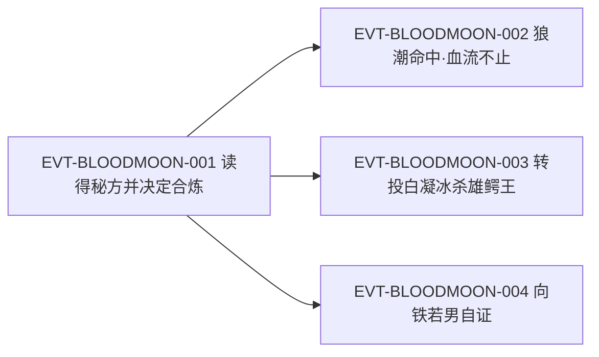

# 血月蛊

月系的**血道改线**：用二转[月芒蛊](moon-glow-gu.md)与[血气蛊](blood-atk-3-03-gu.md)合炼，得到三转血月蛊——月刃由幽蓝转血红，效果改为「血流不止」，射程十米、攻击力明文「差强人意」。它靠**新鲜血液（种类不限）**取代月兰花瓣，原文的一句评语是「它好养活」；它也是方源出古月山寨时配齐的"攻击位"。

本页为 2026-09-28 血道／骨道批次的**新建页**。所有引文回根原文 `source/蛊真人-clean.txt` 逐行复核，行号即 `E:V{段}-{6位行号}`；正文按"原著事实 → 合理推导 →《问真》设计意义"三层组织。本页对"血月蛊"在全书做了穷举扫描：命中 46 行，清单见《资料整理》。

## 主题档案

### 一、配方、产物与秘方体量

#### 原著事实

- 秘方呈现与点题：「彩光在白玉盘上聚焦，形成一篇秘方——」`E:V1-026836`，紧接一行即蛊名"血月蛊。"`E:V1-026838`。
- 配方与产物明文：「利用二转月芒蛊和血气蛊相互合炼，形成的三转蛊虫」`E:V1-026840`。
- 转数三处互证：`E:V1-026840`（「形成的三转蛊虫」）、`E:V1-027270`（「这是三转血月蛊。」）、`E:V2-037096`（「血月蛊虽然是三转蛊虫」）。故：**血月蛊＝三转 `[已确认]`**。
- 秘方体量：「在前三者的合炼秘方中，有洋洋洒洒近十万字的合炼心得和经验。但这血月蛊秘方里，只有数千字不到。」`E:V1-026848`
- 偏门度：「和黄金月、霜霖月、幻影月三大经典相比，这血月蛊就显得偏门许多了。」`E:V1-026846`；原文据此推断选择者少（概括）：「可见在过往的历史中，选择合炼血月蛊的蛊师，有多么的少了。」`E:V1-026850`
- 方源对秘方的处理：「又闭上双眼默默回忆，然后又睁开双眼对照之，如此反复三五次」`E:V1-026844`。
- 合炼结果与素材来源：「方源为了炼制这蛊，还失败了一次。直到第二次，才成功了。」`E:V1-027272`；「至于合炼的素材，自然是压榨了古月赤练所得。」`E:V1-027274`。

#### 合理推导

- **依据**：`E:V1-026846`、`E:V1-026848`、`E:V1-026850` 三句连读；**结论**：原文用**秘方体量**作为"历代选择者多寡"的代理指标（心得越多＝炼的人越多），本页只承认这个代理关系，不认为体量本身决定强弱；**不确定性**："近十万字／数千字不到"是量级表述，原文未给精确字数。
- **依据**：`E:V1-027272`（先失败一次）＋`E:V1-026844`（反复默记）；**结论**：血月蛊属**可失败但可重复的工艺**，秘方记熟是必要条件；**不确定性**：成功率数值与失败损失原文均未给。

#### 《问真》设计意义

- "冷门分支＝秘方短＝心得少"是一条可直接落地的**知识稀缺模型**：越是没人走的分支，秘方越薄、外部经验越少，玩家只能靠自己试错；这比单纯给冷门配方加隐藏更贴原文。
- 合炼允许失败且可重来（`E:V1-027272`），支持"保留材料、重试"的炼制体验，而不是一次性判定。

### 二、催发效果、射程与「差强人意」

#### 原著事实

- 效果明文：「一经催发，月刃通体血红，脸盆大小，若形成伤口，有血流不止之效。」`E:V1-026842`
- 总评明文：「血月蛊攻击能力差强人意，射程也只是十米，就算是攻击之后，形成血流不止的特效，真实效果也并不佳。」`E:V1-026852`
- 效果被低估的原因：「一转到五转的蛊师，因为真元有限，通常战斗并不长久，就能分出胜负。」`E:V1-026854`；「血流不止的效果，在真正的战场中，也只是一点小麻烦。」`E:V1-026854`；「碰到擅长治疗的蛊师，也会有克制的相应手段。」`E:V1-026854`
- 与源蛊的纵向比较：「血月蛊虽然在三转中，攻击力并不优秀。但绝对远远比二转的月芒蛊好多了。」`E:V1-027864`
- 实战（狼潮）：月刃「呈现血红之色，射中狂电狼的身躯，顿时造成一个伤口，血流不止」`E:V1-027386`；家老事后复盘「幸好有方源家老的血月蛊，将伤势积累上去，否则要杀了它，肯定更加艰难。」`E:V1-027448`
- 持久战口径：「血月蛊擅长持久战，造成的伤势无法止血。因此时间越长，敌方伤势就越重。」`E:V1-027474`；紧接着给出反制条件「但这也建立在对方没有治疗蛊虫克制的基础上。」`E:V1-027476`
- 他人使用的再评价（白凝冰）：「正是有了它血流不止的特效，才令雄鳄王死得这么轻易。」`E:V2-035478`
- 对手视角（巨开碑）：「但这种弱小的远程攻击，怎么能挡他前行？」`E:V2-059590`
- 赌斗落地：「当方源的血月蛊在汤雄的身上造成五六个伤口时，后者不得不主动认输。」`E:V2-051648`；原因是「他的治疗蛊并不出色，难以止住伤口处不停往外流的鲜血。」`E:V2-051650`
- 另有非战斗用途的催动（见主题六）：`E:V2-037096`。

#### 合理推导

- **口径登记（词义）**：「差强人意」在原文紧接「真实效果也并不佳」`E:V1-026852`，故此处取**贬义**读法（不太令人满意），不取今人常误用的褒义。三处独立评价方向一致——`E:V1-026852`（差强人意）、`E:V1-027864`（并不优秀）、`E:V2-051626`（攻击不足）——本页因此把"攻击力偏弱"记为有据结论。
- **依据**：`E:V1-027474`＋`E:V1-027476`；**结论**：血月蛊的收益不是爆发伤害而是**不可止的持续失血**，其价值随战斗时长上升，天然克制持久战、被治疗蛊克制；**不确定性**：失血速率、治疗否决的门槛，原文一律未给数值。
- **依据**：`E:V1-026852`（射程十米）＋`E:V1-026854`（一到五转战斗通常不长）；**结论**：射程十米与"战斗通常不长"共同解释了为什么它的 DoT 在同阶实战中收益有限——**不是效果弱，是时间不够**；**不确定性**：高转（战斗更久）场合是否反而更强，原文未展开。

#### 《问真》设计意义

- 这只蛊的定位由三条原文限定共同决定：**伤害低（差强人意）＋射程短（十米）＋效果为持续失血**。三者应被视为一个整体——它是**消耗件**，不是爆发件；削弱其中任一条都会破坏原文给它的辨识度。
- "血量型 DoT 被治疗硬克"是原文明确写出的反制关系（`E:V1-026854`、`E:V1-027476`），适合做成一组成对的正反克制，而不是单纯堆抗性。

### 三、最大弊端：外溢鲜血与攻击力暴降

#### 原著事实

- 弊端引入：「而且血月蛊，还有一个最大的弊端。」`E:V1-026856`
- 弊端明文：「在每个月的特定几天内，它就会向外渗出鲜血。鲜血不断地流淌出来，在这期间，它的攻击力暴降到平时的三分之一。」`E:V1-026858`
- 持有者自述复述：「血月蛊最大的弊端，还是每个月都会有那么几天，外溢鲜血。战斗力暴降。」`E:V1-027480`
- 弊端带来的是武器位空缺，而非可支付的代价：「它是我主要的进攻手段，这样看来，还是不稳定了些。不过，若是收服了花酒秘藏中的那只锯齿金蜈，就能弥补这个不足。」`E:V1-027480`
- 同在血道一族的喂养约束：「而血颅蛊、血月蛊，皆是需要鲜血，需要小心算计。」`E:V2-035068`

#### 资源与代价（支付方／受益方／时点）

- **支付方**：**持有者本人**——支付的不是真元或血亲，而是**周期性的战力真空**：每月特定几天攻击力降为平时三分之一，且该窗口由蛊自身生理驱动（`E:V1-026858`）。
- **受益方**：**使用者**——命中后不可止血的持续失血（`E:V1-027474`）；注意受益方不是蛊本身，蛊只是载体。
- **支付时点**：**周期性、按日历发生**，事前不可通过多付真元规避；原文给出的应对是**再备一只攻击蛊**（`E:V1-027480`），即用装备冗余换稳定，而不是治疗或压制弊端。
- **范围边界**：原文只写「它就会向外渗出鲜血」，未说明外溢的血是蛊自身还是宿主之血；本页不下推断（见《待核对》）。

#### 合理推导

- **依据**：`E:V1-026858`＋`E:V1-027480`；**结论**：这是**持有成本（持有期内的固定窗口损失）**，与"催动才付费"的**使用成本**是两种不同结构；因此"省着不用"不能规避它，只能靠备用蛊或换蛊；**不确定性**：周期长度（几天）、是否随转数或饲养状态变化，原文未写。

#### 《问真》设计意义

- 直接可做**周期性不可用窗口**：把"三分之一攻击力"与固定日历绑定，逼玩家为攻击位准备冗余（原文的解法正是"再收一只"）。这比随机 debuff 更贴原文，也可预期、可规划、可被玩家主动设计对策。
- 与主题四（好养活）并置后形成一个干净的**取舍轴**：后勤便宜 ⇄ 周期性掉线。这类"低维护成本＋定期不可用"的组合，适合做早期过渡件的标准模板。

### 四、最大优点：好养活，食料＝新鲜血液

#### 原著事实

- 优点引入与明文：「但它有个令方源看中的最大优点。」`E:V1-026860`「它好养活。」`E:V1-026862`「比黄金月、霜霖月、幻影月容易养活多了。」`E:V1-026864`
- 食料替换明文：「它需要的食料，不再是月兰花瓣。而是新鲜的血液。」`E:V1-026866`；供给宽松度「血液的量虽然多，但是种类不限。」`E:V1-026868`；「对于血月蛊来讲，它的食物遍布南疆各个地方。随处可见。」`E:V1-026870`
- 对照（同系三转支线的食料困境）：「皆因这些蛊虫，食用的都是大量的月兰花瓣。」`E:V1-026822`；「月兰花瓣极难存储，只能保质数天。」`E:V1-026824`
- 实例喂养：「新鲜的鳄血则可以用来喂养血颅蛊、血月蛊。」`E:V2-035582`
- "好养活"被当作**存活理由**对外使用：「我和白凝冰在流浪途中，许多蛊都饿死了，只留下这只血月蛊，因为它容易喂养。」`E:V2-056136`
- 换蛊取舍时它仍被承认好养活，但败在攻击力：「血月蛊尽管好养活，但攻击不足，无法配套。」`E:V2-049928`

#### 合理推导

- **依据**：`E:V1-026866`、`E:V1-026868`、`E:V1-026870` 对比 `E:V1-026822`、`E:V1-026824`；**结论**：这一支的设计动作是**把稀缺专食（月兰花瓣，短保质期）换成广域泛食（血液，种类与产地不限）**，即把"后勤依赖"从一处特产地改为全地图可得；**不确定性**：原文未写日食量、血液品类是否影响效果、以及断食多久会死（只写会饿死）。
- **依据**：`E:V2-056136`；**结论**：好养活不只在数据上成立，还被写成了**叙事上的存活解释**（流浪中只有它活下来）；**不确定性**：原文未给可携带的血液储备上限。

#### 《问真》设计意义

- "好养活"是**后勤参数**，不是战斗参数：它决定这只蛊能否支撑长途与长期作战。设计上宜把它拆成独立的"食料广度／储备压力"指标，而不是隐式战斗力加成。
- 与月兰花瓣（保质数天、产地受限）对照，可直接做两条**补给路线**的差异化：广域泛食＝随走随喂、上限低；稀缺专食＝短期更强、断供即死。

### 五、体系定位：三转三件套中的攻击位

#### 原著事实

- 目标口径：「倒是血月蛊之类的三转蛊虫，才是我最需要的。」`E:V1-026936`
- 三件套与分工：「我现在拥有雷翼蛊、天蓬蛊，血月蛊若合炼出来，就有三只三转蛊虫。」`E:V1-026940`；「攻击上，血月蛊勉强够格。防御方面，天蓬蛊可以胜任。移动上，雷翼蛊虽然消耗真元较多，但是能令方源短暂飞行。」`E:V1-026948`
- 六位需求框架：独行蛊师「至少需要六只蛊虫，才能勉强应付各个方面」`E:V1-026944`，即「攻击、防御、治疗、存储、侦察、移动」`E:V1-026946`。
- 存续判断（换蛊评估）：「血月蛊尽管好养活，但攻击不足，无法配套。」`E:V2-049928`

#### 合理推导

- **依据**：`E:V1-026948`＋`E:V1-026946`；**结论**：血月蛊在原文中的功能位是**六位中的攻击位**，且原文自评仅「勉强够格」——它是该位的**最低可接受解**，不是最优解；**不确定性**：六位框架是方源个人的经验口径（「依他的经验」`E:V1-026946`），原文未把它写成普适规则。
- **依据**：`E:V2-049928`；**结论**：一旦出现更强的攻击蛊，血月蛊就进入**被替换序列**，只保留后勤优势；这与主题三的周期弊端叠加，解释了它"好用但留不久"的定位。

#### 《问真》设计意义

- 原文给出的**攻击／防御／治疗／存储／侦察／移动六位**可直接作为配装位栏骨架（`E:V1-026946`）；血月蛊适合作"攻击位早期件"，与后续更强攻击股形成自然替换。
- "凑齐三件转"是比"单蛊强度"更贴原文的进度指标：原文的焦虑是「蛊虫还并非都是三转」，而非某一只不够强（`E:V1-026940`）。

### 六、实战、流转与非攻击用途

#### 原著事实

- 合炼成功与寄居：「这是三转血月蛊。」`E:V1-027270`；「至于刚刚炼成的血月蛊，外形和月光蛊类似，如今寄居在方源的右手掌心中，化为一个红色的月牙印记。」`E:V1-027302`；后续形态复述「化作红月牙印记，藏在方源的掌心中」`E:V2-035040`、「手掌心中，寄托着血月蛊。」`E:V2-049910`。
- 谱系明文：「血月蛊起源于月光蛊」`E:V2-035330`。
- 转借他人使用：方源「心念一动，血月蛊便从他掌心飞出，投向白凝冰。」`E:V2-035326`；接蛊者「上手就用，几记鲜红的月刃射出去，立即稳定了岌岌可危的局面。」`E:V2-035330`；但真元由接蛊者自付——「空窍中的真元却渐渐的不够用了。」`E:V2-035332`
- 非攻击用途：「血月蛊虽然是三转蛊虫，但方源此举却不是用来攻击，因此勉强能操纵起来。」`E:V2-037096`；实际用法是「如今则用血月蛊切猴头。」`E:V2-037104`；代价即时显现「方源空窍中的真元，就彻底见底了。」`E:V2-037106`
- 对外自证：方源「从空窍中取出血月蛊来，主动抛到铁若男的手中。」`E:V2-056134`，并以「容易喂养」解释其为何是族中唯一存留的蛊`E:V2-056136`。
- 借出与收回的闭环：对方持有时蛊在其空窍内——「当即，他手指一勾，从白凝冰的空窍中就飞出一道血光。」`E:V2-037088`「血光落在方源的手中，化成一片血月印记。」`E:V2-037090`，紧接一行点明「正是血月蛊。」`E:V2-037092`。
- 战斗中的战术复述：`E:V1-028886`（左手血光闪烁、血月蛊引而不发）、`E:V1-032496`（与锯齿金蜈轮流轰斩石壁）；密道突围时白凝冰「手掌往后一甩」`E:V2-040078`，一道血刃「正中后面的家老，使其冲势一滞」`E:V2-040082`。

#### 合理推导

- **依据**：`E:V2-037096`＋`E:V2-037106`；**结论**：三转蛊对修为/真元不足者仍可「勉强能操纵」，用于**非攻击动作**（切割），但**支付方是使用者自己的真元**，且一经使用即见底；**不确定性**：原文未给「勉强能操纵」的量化门槛。
- **依据**：`E:V2-035326`、`E:V2-035330`、`E:V2-035332`；**结论**：血月蛊**可外借**且外借者上手即用（同源于月光蛊），说明操作门槛低；但催动消耗由接蛊者承担；**不确定性**：原文未写外借期间蛊是否仍受原主控制。

#### 《问真》设计意义

- "可外借、上手快、可用于非战斗切割"三条合起来说明它是**工具型攻击蛊**：适合做"可转交"的机制，也适合承担破障、切割等工作用途，不必局限于战斗。
- 外借时消耗由接蛊者支付，是一条可直接实现的**资源归属规则**：装备可换手，燃料不跟人走。

## 状态时间线

| 状态 ID | 阶段 | 状态 | 证据 |
|---|---|---|---|
| ST-BLOODMOON-01 | 秘方在案 | 照影蛊读得血月蛊秘方：二转月芒蛊＋血气蛊合炼成三转蛊虫；月刃通体血红、脸盆大小、伤口血流不止 | E:V1-026836、E:V1-026838、E:V1-026840、E:V1-026842 |
| ST-BLOODMOON-02 | 评价明文 | 射程十米、攻击「差强人意」；血流不止在战场只是小麻烦，且被治疗蛊克制 | E:V1-026852、E:V1-026854 |
| ST-BLOODMOON-03 | 弊端明文 | 每月特定几天外溢鲜血，期间攻击力暴降到平时三分之一 | E:V1-026856、E:V1-026858 |
| ST-BLOODMOON-04 | 优点明文 | 好养活；食料由月兰花瓣改为新鲜血液，种类不限、南疆随处可见 | E:V1-026862、E:V1-026866、E:V1-026868、E:V1-026870 |
| ST-BLOODMOON-05 | 体系定位 | 方源按"攻击／防御／治疗／存储／侦察／移动"六位配装，血月蛊任攻击位（自评勉强够格） | E:V1-026936、E:V1-026946、E:V1-026948 |
| ST-BLOODMOON-06 | 合炼成功 | 失败一次后第二次炼成；外形类月光蛊，寄居右手掌心化为红色月牙印记 | E:V1-027270、E:V1-027272、E:V1-027302 |
| ST-BLOODMOON-07 | 实战（狼潮） | 血刃命中狂电狼造成不可止血伤口；家老复盘承认靠伤势积累 | E:V1-027386、E:V1-027448 |
| ST-BLOODMOON-08 | 持有者自述 | 自评「擅长持久战」但被治疗蛊克制；最大弊端为周期性外溢鲜血、战斗力暴降 | E:V1-027474、E:V1-027476、E:V1-027480 |
| ST-BLOODMOON-09 | 转借他人 | 转投白凝冰，对方上手即用；真元消耗由接蛊者承担 | E:V2-035326、E:V2-035330、E:V2-035332 |
| ST-BLOODMOON-10 | 非攻击用途 | 不用于攻击时可勉强操纵，用于切猴头；一用即真元见底 | E:V2-037096、E:V2-037104、E:V2-037106 |
| ST-BLOODMOON-11 | 对外自证 | 主动抛给铁若男检查；以「容易喂养」解释其为族中唯一存留之蛊 | E:V2-056134、E:V2-056136 |

## 原著明确内容（本批取证窗口登记）

本批对"血月蛊"在根原文全书扫描：命中 **46 行**（26830、26838、26846、26848、26850、26852、26856、26870、26872、26936、26940、26948、27270、27302、27382、27448、27452、27470、27474、27480、27864、28886、32496、33796、35040、35068、35326、35330、35478、35526、35582、35770、35990、37092、37096、37104、40080、45054、49910、49928、51626、51648、56134、56136、56140、59590）。下表登记本批实际读取的窗口。

| 窗口 | 内容要点 | 用途 |
|---|---|---|
| 26818–26824 | 三大经典（黄金月／霜霖月／幻影月）食料＝大量月兰花瓣，花瓣只保质数天 | 主题四（对照） |
| 26834–26858 | 秘方点题、配方与产物、月刃形态与血流不止、巧门度与秘方体量、射程与总评、弊端明文 | 主题一、二、三 |
| 26860–26882 | 好养活与食料改为新鲜血液；血气蛊「有些麻烦」、其功能与稀缺、搭配游僵蛊 | 主题四；另页（血气蛊） |
| 26934–26948 | 原文「血月蛊之类的三转蛊虫，才是我最需要的」；六位配装框架；攻击位自评勉强够格 | 主题五 |
| 27268–27302 | 「这是三转血月蛊」；失败一次后炼成；外形类月光蛊、寄居右手掌心 | 主题六 |
| 27382–27386、27442–27490 | 狼潮实战：血刃致伤、血流不止；家老复盘；持有者自述利弊 | 主题二、三 |
| 27860–27866 | 与二转月芒蛊的纵向比较：三转中不优秀但远胜月芒蛊 | 主题二 |
| 35036–35072 | 红月牙印记寄居掌心；血颅蛊、血月蛊皆需鲜血、需小心算计 | 主题三、六 |
| 35324–35332、35474–35482 | 转投白凝冰、上手即用、接蛊者自付真元；雄鳄王因血流不止而死 | 主题二、六 |
| 35580–35582 | 新鲜鳄血可喂养血颅蛊、血月蛊 | 主题四 |
| 37088–37106 | 收回后用于非攻击用途（切猴头）；真元见底 | 主题六 |
| 49906–49932 | 换蛊评估：好养活但攻击不足、无法配套 | 主题四、五 |
| 51622–51650 | 赌斗：造成五六个伤口致对手认输，对手治疗蛊止不住血 | 主题二 |
| 56130–56144 | 对外自证：主动抛蛊给铁若男检查；以「容易喂养」解释存活 | 主题四、六 |
| 59586–59596 | 巨开碑视角：「这种弱小的远程攻击」 | 主题二 |

## 事件链

| 事件 ID | 事件 | 参与者 | 证据 | 因果 |
|---|---|---|---|---|
| EVT-BLOODMOON-001 | 方源在密室以照影蛊读得血月蛊秘方并当场决定合炼 | 方源 | E:V1-026836、E:V1-026840、E:V1-026844、E:V1-026872 | enables ST-BLOODMOON-01、ST-BLOODMOON-06 |
| EVT-BLOODMOON-002 | 狼潮中血月蛊命中狂电狼造成不可止血伤势，家老复盘承认其价值 | 方源、古月家老 | E:V1-027386、E:V1-027448、E:V1-027452 | evidences ST-BLOODMOON-07 |
| EVT-BLOODMOON-003 | 方源把血月蛊转投白凝冰，对方上手即用并击杀雄鳄王 | 方源、白凝冰 | E:V2-035326、E:V2-035330、E:V2-035478 | evidences ST-BLOODMOON-09 |
| EVT-BLOODMOON-004 | 方源主动向铁若男出示血月蛊以自证未私藏血海传承 | 方源、铁若男 | E:V2-056134、E:V2-056136 | evidences ST-BLOODMOON-11 |

事件口径：本页沿用实体簇号 `EVT-BLOODMOON-*`。事件节点 4 个（≥3），按模板配图。图中唯一的因果是"001 合炼成功"作为共同前置（enables）：002 是它在狼潮中的实战后果，003 是持有权转移后的使用后果，004 是它作为物品被出示的后果；三者相互之间**无先后、无因果**，故不连边。

## 资料整理

本页为**新建页**，没有旧版；本批来源只有根原文，没有 `notes:`／`memory:` 层转述进入本页事实区。相关派生记录的处置登记如下（**本段内容不得当作原著事实**）：

- `roster-3.md` 第 108 行把 `blood_atk_3_11_gu` 记为"血月蛊 | 3 | 3 | E:V1-026936"，与本页结论一致（三转有明文，见主题一）；该行以 `E:V1-026936`（「血月蛊之类的三转蛊虫」）为锚点属可用证据，但更直接的转数明文是 `E:V1-026840`／`E:V1-027270`，本页以之为准。
- `roster-3.md` 未把血月蛊列入任何"命名碰撞待核"表，本页复核后同意：全书 46 处命中中，"血月蛊"均为独立成词，未发现子串碰撞（对照同批 `血颅蛊`／`血颅仙蛊`、`血气蛊`／`血气仙蛊` 的双写现象）。
- `game/data/gu_lore.json`、`game/docs/lore/canon-index.md` 属桥接消费层（L0 本轮口径：Canon 权威在 `lore/wiki`）。按硬约束本页**不声明 `canon-index` 字段、不新建 CAN ID**；`game/**` 只读，不在本批改动范围。
- 本页发现并登记的**原文自身**问题（不改原文、不改他页）：`E:V1-033796` 行内夹带站点水印「8 9 阅 读 网」；`E:V2-045054` 整行为 OCR 噪声（「方源怡然不惧，,撑起天蓬惠……弄螺旋骨枪冇……手血月蛊，脚下有跳跳草，和欧羊公厮杀在一起。」）。两行**均未作为引文或机制证据使用**，仅登记供后续清洗参考。

- 本页引号规范（便于复核）：角引号（U+300C／U+300D）只用于**可逐字回溯到原文行**的引文；分析用词、拼合名目与表格字段名一律用 `"…"`，不放进引文位置。

## 分析与解读

1. **血月蛊是"同源改线"而非"上位升级"**：配方用二转月芒蛊＋血气蛊，产物是三转。它保留了月系的月刃形态（外形类月光蛊，`E:V1-027302`），却把增量字段换成「血流不止」——与[月痕蛊](moon-ray-gu.md)（改射程）、[月旋蛊](light-atk-1-01-gu.md)（改弹道）并列，构成月系的第四条路线，而这条路线的代价是**攻击力**（`E:V1-026852`）。
2. **它的强度被战斗时长而非数值决定**：原文同时给出「擅长持久战」`E:V1-027474` 与「一转到五转的蛊师，因为真元有限，通常战斗并不长久」`E:V1-026854`。这两条并置后，才能解释为什么同一只蛊既被判「真实效果也并不佳」，又在独立战斗中「造成五六个伤口」即决胜（`E:V2-051648`）——差别在对手能不能止住血、战斗够不够长。
3. **这只蛊的最大信息量在"弊端"写法上**：`E:V1-026858` 把惩罚写成**日历型、与使用无关**，且原文给出的解法是**再备一件攻击装**（`E:V1-027480`）而不是治疗蛊。这是一个少见的"用装备冗余对冲持有成本"的设计，而不是常见的属性折扣。
4. **"好养活"被原文当作叙事资源使用**：`E:V2-056136` 里，血月蛊之所以存在于方源空窍，不是因为它强，而是因为「许多蛊都饿死了，只留下这只」——后勤属性直接生成了剧情可信度。
5. **可外借性是本页最容易被忽略的机制**：`E:V2-035326`–`E:V2-035332` 给出了完整的借出—上手—自付真元链条，这为"装备可转交但燃料不跟人走"提供了原文依据。

## 待核对

- `[原著未明确]` **外溢鲜血的来源与后果**：`E:V1-026858` 只写「它就会向外渗出鲜血」，未说明血出自蛊体还是宿主，也未写这段时间是否损耗宿主血量、蛊是否会因此虚弱或死亡。本页不推断，不得写成"消耗宿主生命"。
- `[原著未明确]` **周期长度与可否干预**：原文只说「每个月的特定几天」`E:V1-026858`、`E:V1-027480`，未给天数、是否固定日期、是否可用饲养或蛊方干预。
- `[原著未明确]` **数值类缺口（机制已确认、数值未知 → 拆条）**：机制 **[已确认]** ＝伤口不可止血、随战斗时长累积伤势（`E:V1-026842`、`E:V1-027474`）；具体数值 **[待取证]** ＝失血速率、治疗门槛、三转攻击力的绝对量级、催动一次的真元消耗。
- `[原著未明确]` **食量与断食后果**：只写血液「种类不限」`E:V1-026868` 与"好养活"`E:V1-026862`；日食量、断食至饿死的时长、血种对效果的影响均未见。注意原文另处写过其他蛊"饿死了"`E:V2-056136`，属他人复述，不等于血月蛊的断食阈值。
- `[原著未明确]` **射程十米与有效命中带的关系**：`E:V1-026852` 给「射程也只是十米」，未写十米外是否仍有杀伤衰减（月系另有「有效距离」表述，属他页取证范围）。
- `[待取证]` **血月蛊的道属归类**：原文只给「起源于月光蛊」`E:V2-035330` 与配方含[血气蛊](blood-atk-3-03-gu.md)；它是否被任何角色称作"血道蛊"或"月道蛊"，本页全书扫描未见明文。**不得由配方反推道属名称**。
- `[存在冲突]` **桥接层：roster-3 的血月蛊锚点选择（Wiki 内部，非原文冲突）**：`roster-3.md` 第 108 行以 `E:V1-026936` 作锚点，该行是"需要的类型"表述，并非转数明文；**口径A（roster-3）**：以 `E:V1-026936` 为证据行；**口径B（本页）**：转数明文应取 `E:V1-026840`、`E:V1-027270`、`E:V2-037096`。**当前状态**：两口径结论相同（三转），仅证据行选择不同；本批只登记，不改他页。
- `[存在冲突]` **原文自身：行内夹带站点水印与 OCR 噪声**：`E:V1-033796` 行尾夹带「8 9 阅 读 网」；`E:V2-045054` 整行为噪声（「方源怡然不惧，,撑起天蓬惠……弄螺旋骨枪冇……手血月蛊，脚下有跳跳草，和欧羊公厮杀在一起。」）。两行均不用于引文与机制判定。**当前状态**：登记备查，本页不修改原文。
- `[原著未明确]` **是否有其他持有者／其他炼成记录**：全书 46 处命中中，血月蛊的炼成记录只有方源一次（`E:V1-027272`），其余皆为持用、转借、展示与旁观评价；"前世百家是否炼过血月蛊"原文未见。

## 模板扩展建议（只登记，不改核心模板）

1. **需要"周期性持有成本"的表达位**。现有模板的代价区默认写成"催动时支付"（真元、痛楚、素材）；血月蛊的成本结构是"按日历支付、与是否使用无关"，塞进"原著事实"段落会与使用成本混淆。建议实体页允许为代价标注**支付时点类型**（使用时／持有期）而不新增状态词。
2. **需要"后勤参数"与"战斗参数"的分栏**。好养活（食料、供给广度）与攻击力（差强人意）在原文中始终成对出现（`E:V1-026862` 对 `E:V1-026852`），但模板没有中立的后勤字段，本页只能写入主题四。
3. **"可转借"宜有状态位**。血月蛊在 `E:V2-035326` 起转入他人之手并由他人付真元，随后又回到方源掌心（`E:V2-037092`）。`## 状态时间线` 只能以持有者为隐含主语，无法表达"同一状态 ID 下持有者变更"。本页以 ST-BLOODMOON-09 承载，建议后续批次统一规范。

## 关联页面

[月芒蛊](moon-glow-gu.md)、[月光蛊](moonlight-gu.md)、[月痕蛊](moon-ray-gu.md)、[月旋蛊](light-atk-1-01-gu.md)、[血气蛊](blood-atk-3-03-gu.md)、[骨枪蛊](bone-def-3-01-gu.md)、[鬼火蛊](fire-atk-2-01-gu.md)、[血道](../world/blood-path.md)、[光道](../world/light-path.md)、[蛊的饲养与炼化](../world/gu-care-and-refinement.md)、[炼蛊与杀招链](../world/gu-refine-killer-chain.md)、[真元](../world/primeval-essence.md)、[修炼体系](../world/cultivation-system.md)、[炼蛊](../rules/refinement.md)、[方源](../characters/fang-yuan.md)、[蛊虫关系](gu-relations.md)、[蛊虫总表三期](roster-3.md)。
