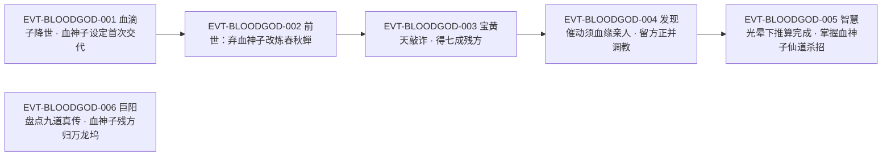

# 血神子

血神子是**五转血滴子的晋升终点**，也是**天下十大魔蛊第七**：「尤其是这血滴子再往后晋升，就是赫赫有名的六转魔蛊血神子。在天下十大魔蛊排位中，名列第七。」（`E:V1-028484`）它同时是**血海九道真传**之一，属蛊仙层次（`E:V3-075640`、`E:V6-429248`、`E:V6-429250`）。

本页为 2026-09-28 A 线恢复批**新建页**。它的证据厚度在本批里属中上：全书「血神子」字面命中 **91 次 / 73 个独立行**，跨段1至段6；但**这 91 次里没有一次是‘血神子出手’的战斗实写**——全部是**定位、排位、蛊方流转、催动条件、以及他物对它的借鉴**。因此本页的主线不是‘它打起来什么样’，而是‘它怎么被得到、被谁惦记、被什么条件锁住’。所有引文回根原文 `source/蛊真人-clean.txt` 逐行复核，行号即 `E:V{段}-{6位行号}`（段号由行号机械推导）；**引号口径**：凡「」内文字均为根原文逐字引文；本文自身的概括、释义与自拟术语一律用 ‘…’ 标记，二者不混用。正文按“原著事实 → 合理推导 →《问真》设计意义”三层组织。

## 主题档案

### 一、身份与品阶：六转魔蛊、十大魔蛊第七、血滴子系的晋升终点

#### 原著事实

- **晋升与排位（登记锚所在行，正文行）**：「尤其是这血滴子再往后晋升，就是赫赫有名的六转魔蛊血神子。在天下十大魔蛊排位中，名列第七。」`E:V1-028484`。
- 转数的第二处明文：「他这次写的，是血神子的六转秘方。」`E:V3-085486`；又以「六转仙蛊血神子」列入血海九道真传 `E:V3-075640`。
- **道属属实**：它被明确写作「六转仙蛊」`E:V3-075640`、被归入血道传承‘血道仙蛊真传’一类 `E:V6-429266`、`E:V6-429276`。
- 登记锚说明：本页 roster 登记锚 `E:V1-028484` **落在正文行**（非章节题名），六转与排位均可直接引证，无需另取正文；为稳妥起见本节另引 `E:V3-085486` 的「六转秘方」作第二处明文。
- id 归类：本页实体 id 为 `blood_atk_5_09_gu`（血系·攻击），原文的“血道”与 id 前缀一致。

#### 合理推导

- **依据**：`E:V1-028484`＋`E:V3-075640`；**结论**：血神子的**品阶与道属在本页是全确定字段**——六转、血道仙蛊、魔蛊体系内排第七；**不确定性**：「天下十大魔蛊」的完整十位名录，原文本页窗口内未给出（`E:V1-028484` 只写了它的位次），其余九位不在本页取证范围。
- **依据**：`E:V1-028484`；**结论**：血滴子与血神子的关系是‘**晋升**’，即同一蛊系内部的阶位跃迁，而非合炼出新异物；**不确定性**：晋升所需材料、是否消耗血滴子本体、晋升耗时，原文均未写（本页《待核对》登记）。
- **依据**：`E:V1-028484`＋`E:V1-028476`；**结论**：原文对血滴子写足了五转、食性、裂变、克制，却对**晋升后的血神子**只写「赫赫有名」与「名列第七」，即**名望与位次先于机制被交代**；**不确定性**：无（这是可数的文本事实）。

#### 《问真》设计意义

- 血神子在原文里的功能位是**血道仙蛊树的天花板节点**：一头连着玩家能理解的低阶形态（五转血滴子），另一头挂着最大的名声（十大魔蛊第七）。做血道构筑时，它天然适合当**终局目标 + 声望符号**，而不是一件上来就能用的装备——原文把「想炼」和「炼成」之间的距离拉得极长（主题六），这条距离本身就是玩法内容。
- ‘晋升终点’这一写法给了设计一个便宜：血滴子的所有既有规则（以精血为食、裂变、电流克制，`E:V1-028478`、`E:V1-028492`、`E:V1-028496`）都可以作为前置关卡的机制语汇，玩家在低阶就已经在学这套语言。

### 二、身份边界：血滴子是晋升线起点、「血神子蛊」是清单写法，二者都不是本页别名

#### 原著事实

**边界一：血滴子（独立实体）**

- 本阶与定位：「这血滴子，乃是五转蛊虫，养用合一，十分奇异。」`E:V1-028476`；它「专门以蛊师的本命精血为食，饱餐之后。就会裂变分化，从一变二，从二变四……」`E:V1-028478`；「若是饿了，暂时找不到食物，它们就会相互吞噬，减少族群规模，来维持自身生命活动的消耗。」`E:V1-028480`。
- 食性边界：「但这兽血，并不能让血滴子分化。唯有包含真元气息的蛊师精血，才有这作用。」`E:V1-028492`。
- 克制关系：「唯有豪电狼、狂电狼喷吐的电流，才能克制这血滴子。」`E:V1-028496`。
- 出处：「他探索出了刀翅血蝠、血滴子、血狂蛊的合炼秘方。」`E:V1-031898`；「血滴子则是血海老祖的最后成果。这蛊高达五转，比前两者无疑更加成熟。它养用合一，以战养战，吞噬蛊师鲜血来繁衍分化。已经完全不需要主人来提供真元。」`E:V1-031904`。
- 持有者的熟练度：「养炼合一的仙蛊，方源还没有见过。但养用合一的一种蛊虫，方源前世十分擅长，这便是恶名远播的五转蛊血滴子。」`E:V4-123248`。

**边界二：「血神子蛊」的全部字面命中（本页穷举分类账）**

- 全书「血神子蛊」命中 **3 处 / 3 行**，逐条分类如下：
  - 2 处为「血神子」＋「蛊方」的字面连写：`E:V5-217532`（「再推算血神子蛊方」）、`E:V5-217534`（「方源反不如直接推算血神子蛊方」）；
  - 1 处为血海九道真传清单中带「蛊」后缀的列名：「这九道中分别是血颅蛊、血手印蛊、血气蛊、血汗蛊、经血蛊、血影蛊、血战蛊、血神子蛊以及上古荒兽戾血龙蝠的豢养、奴役之法。」`E:V6-429250`——此为列名，`E:V6-429250` 的实际原文以「血神子蛊」与同列‘血颅蛊／血手印蛊／……’并列。
  - 无一处是以「血神子蛊」为主语描述独立机制的句子。

#### 合理推导

- **依据**：`E:V1-028476`＋`E:V1-028484`；**结论**：血滴子与血神子登记为**两个实体**（一个是五转蛊虫、一个是六转魔蛊，二者以晋升相连），因此本页 **`aliases` 不含「血滴子」**；**不确定性**：晋升是‘同一只蛊升阶’还是‘由血滴子炼出新蛊’，原文只有「再往后晋升」五字，两种读法都不能排除。
- **依据**：`E:V5-217532`、`E:V5-217534`、`E:V6-429250`＋`E:V3-075640`；**结论**：在**原文层面**，「血神子蛊」是同一个名称的清单写法（同名单在 `E:V3-075640` 写作「六转仙蛊血神子」），它不是另一只蛊；但 **roster-3 另有一行独立登记**「血神子蛊」（1 转名单位），故本页**也不把「血神子蛊」写进 `aliases`**，而在此处显式划界；**不确定性**：那一行 1 转登记的原文来源不在本页取证范围，本页不下判断。
- **依据**：`E:V1-031898`、`E:V1-031904`、`E:V4-123248`；**结论**：血滴子是血海老祖的成果、且方源前世「十分擅长」它——血神子这条线因此有**两代人的技术积累**垫底，不是凭空出现的仙蛊；**不确定性**：血海老祖是否也炼成过血神子，原文未写（`E:V1-031904` 只说他创造了血滴子）。

#### 《问真》设计意义

- 这条边界是**命名陷阱的反面教材**：血滴子／血神子／血神子蛊三个写法在同一段文本里紧邻出现，任何一处偷懒合并都会让「晋升」这条最有价值的机制被抹平成‘同物异名’。设计上应把血滴子做成**前置可玩形态**、血神子做成**晋升产物**，而「血神子蛊」只作为清单别名处理。
- 血滴子的食性规则（兽血无效、唯蛊师精血可促分化，`E:V1-028492`）与克制规则（电流，`E:V1-028496`）在原文里是**成对写出的**：一条给它资源压力，一条给它战术弱点。这种“成对”写法适合直接转成蛊虫的属性卡。

### 三、蛊方：秘方历为残篇，七成完善度是可交易的临界

#### 原著事实

- **首现即残篇**：「当年他拿到的这张血神子秘方，也是残篇。经过自己刻苦钻研，又请其他蛊仙共同修补，才有了这张秘方。」`E:V3-085494`；「他也知道这秘方并不十分正确。当年他之所以没有选择练就血神子，主要原因也有这个。」`E:V3-085496`。
- 残篇的相对优劣：「他所知的仙蛊秘方，也不过十几张。但绝大多数，都是残篇。血神子秘方已经是残篇中最好的情况。」`E:V3-085508`。
- 炼制用料：「黄金、紫晶舍利蛊广泛用于仙蛊秘方，方源炼制春秋蝉用过，炼制第二空窍蛊也用过。他说中血神子仙蛊残方中，也需要大量的舍利蛊。」`E:V3-086520`。
- **七成完善度的定级与成交**：方源压价的依据是「你掌握的血神子残方，可有七成的完善度，你是欺我无知，居然抛出一个四成的残方过来？」`E:V4-130270`；对方「说着，终究还是抛出了七成血神子残方。」`E:V4-130278`。
- 得手后的判断：「七成的血神子仙蛊残方，再结合前世的积累，借助智慧蛊的力量，应该能真正完善血神子仙蛊方了罢。」`E:V4-130288`。
- 残方的持续性：「但现在，方源手中的血神子仙蛊方虽然有，但只是七成的残方。」`E:V5-196822`。
- **推算完成**：「方源血道乃是宗师境界，又有智慧光晕辅助，早已经将血神子仙蛊方推算完成。」`E:V5-291314`。
- 成本面：「不过最后一点倒是比其他流派容易许多。血道蛊虫有个特点，就是炼制成本相当低廉。」`E:V5-196838`。
- 财力门槛：「能够推算出完整的血神子仙蛊方，但我现在的财富距离炼制仙蛊的标准还很远。」`E:V4-130758`。

#### 合理推导

- **依据**：`E:V4-130270`＋`E:V4-130278`＋`E:V4-130288`；**结论**：蛊方的**完善度是可谈判、可标价、可被识破虚报的属性**——「七成」与「四成」的差别在原文里是诈术与反诈术（方源先在 `E:V4-130266` 之后逼对方拿出真本）；**不确定性**：原文未给‘几成以上可炼’的阈值，也未把完善度与成功率挂钩，只能确认**七成仍属残方**（`E:V5-196822`）。
- **依据**：`E:V5-196822`＋`E:V5-291314`；**结论**：从‘七成残方’到「推算完成」之间的**门槛不是财力而是境界**（血道宗师＋智慧光晕），而财力卡在**炼制**这一步（`E:V4-130758`）；**不确定性**：推算耗时原文未给具体年数（只说「早已经」）。
- **依据**：`E:V3-086520`＋`E:V5-196838`；**结论**：血道蛊虫「炼制成本相当低廉」与血神子蛊方「需要大量的舍利蛊」**并不矛盾**——前者是**流派横向比较**（血道 vs 他道），后者是**单只仙蛊的用料清单**；**不确定性**：原文没有给出血神子所需的舍利蛊数量，也没有给出「大量」的换算口径。

#### 《问真》设计意义

- 「蛊方完善度」是原文给的一条**信息型资源**：它不是道具，而是**一个带小数的资产**，可以讨价还价、可以被骗、可以靠境界慢慢补全。做炼蛊系统时，把「残方」做成一条进度条（而不是一个布尔值），能直接复现 `E:V4-130270` 那种‘你手里的东西到底几成’的博弈。
- ‘境界决定能不能推算、财力决定能不能炼制’是**两道先后关卡**：这两个门槛在原文里由不同句子分别给出（`E:V5-291314` 与 `E:V4-130758`），设计上应分开结算，别合并成一个‘够强就能炼’。

### 四、催动条件与代价：以血缘亲人换取血神子分体

#### 原著事实

- **催动条件（明文）**：「他渐渐修复血神子，发现其中一些奥秘。就算血神子仙蛊炼制出来，想要催动它，还得需要血缘亲人。杀得一位亲人，在血神子仙蛊的力量下，就能得到一位血神子。」`E:V4-153742`。
- **两次顺序**：「这个计划的第一环节，就是先炼出血神子仙蛊。」`E:V5-196818`；「只有炼出血神子仙蛊之后，才能杀死血脉亲人，炼出一个个的血神子。」`E:V5-196820`。
- **亲人的态度决定结果**：「若是这位亲人不反抗，甘心奉献，那产生的血神子便会亲近蛊仙，如臂使指。反之，若引来亲人的仇恨愤怒，血神子便有可能反噬自己的主人。」`E:V4-153744`。
- 反噬的复述与延伸：「因为憎恨炼出来的血神子，会反噬主人，相当于双刃剑，能割伤别人，但稍不留神也会伤害自己。」`E:V5-196826`。
- **分体的性质**：「但要将方正炼成血神子，这些方法却不行。血神子相当于另一种生命，在转化的成功的那一刻，施加在方正原本身上的手段，都会失效。方正的本心本意，将决定血神子。」`E:V4-153758`。
- 被炼者的手段在转化后清空：「而当他被杀。炼成血神子的时候，动用这些智道手段刻印在他身上的智道道痕都会消除清空。只剩下最纯粹的血道道痕。」`E:V5-196832`。
- 「调教」的工期与目标：「方源只有慢慢调教。彻底改变方正的本心本意，方能炼出符合心中标准的血神子。」`E:V5-196836`；方源自陈的时点判断是「最后甚至会习惯我的存在，依赖我的帮助。那个时候，就是炼制血神子的合适时机了。」`E:V5-196804`。

#### 代价与收益（支付方／受益方／支付时点）

- **支付方**：**被选定的血缘亲人**——付出的是生命（「杀得一位亲人」`E:V4-153742`）；在方源这条线上具体是胞弟方正（`E:V5-196832`、`E:V5-198312`）。
- **受益方**：**蛊仙本人**——得到「一位血神子」作为战力（`E:V4-153742`、`E:V4-153764`）。这一条是本页最需要注意的地方：**受益方与支付方不是同一人**，蛊仙得到的是一个由亲人转化而来的分体。
- **支付时点**：**蛊已炼成、催动之时**——原文把顺序写死为「先炼出血神子仙蛊」`E:V5-196818` → 「才能杀死血脉亲人，炼出一个个的血神子」`E:V5-196820`。
- **生效条件（决定收益质量）**：亲人**甘心奉献且不反抗**时，分体「亲近蛊仙，如臂使指」；亲人**怀着仇恨愤怒**而死时，分体「有可能反噬自己的主人」（均为 `E:V4-153744`）。
- **被炼者一侧的隐性代价**：转化成功的一刻，先前施加在他身上的手段「都会失效」`E:V4-153758`，智道道痕被清空、只剩血道道痕 `E:V5-196832`——即**被炼者的人为干预会被重置，最终由本心本意决定产物**。

#### 合理推导

- **依据**：`E:V4-153744`＋`E:V5-196826`；**结论**：血神子是一条**带“情绪质检”的献祭机制**——献祭者的态度不是道德叙事，而是**决定产物是否可用的参数**；**不确定性**：原文说的是「有可能反噬」（概率口径），既没有给触发概率，也没有写反噬的具体形态；本页不替它定量。
- **依据**：`E:V5-196832`＋`E:V4-153758`；**结论**：‘先调教再杀’这种做法在原文里被明确判定为**不能生效**（智道手段会被清空），所以正确的操作方向是**改变本心本意**（`E:V5-196836`），而不是刻印服从；**不确定性**：把本心本意改到什么程度算「符合心中标准」，原文只说「彻底改变」，无量化。
- **依据**：`E:V5-196820`＋`E:V4-153764`；**结论**：血神子的**数量是线性可扩的**（每杀一位亲人得一位），因此它的上限由**血缘亲属的数量**决定，而不由蛊本身决定；**不确定性**：同一亲属能否被重复利用、分体是否会被毁后重生，原文未写。

#### 《问真》设计意义

- 这是一条**把社会关系直接折算成战力的机制**：成本不是资源，而是**族谱上的位置**。设计上它的天然张力是‘越强的玩家越不敢动亲人，越动亲人越被孤立’——比单纯的‘消耗材料’更能生成剧情选择。
- ‘献祭者态度决定产物质量’可以做成**双分支产物**：甘心奉献 → 可控分体；仇恨而死 → 带反噬风险的强攻击性分体。这条分支**完全由原文写定**（`E:V4-153744`），不需要额外发明。
- ‘转化的那一刻，先前手段全部失效’（`E:V4-153758`）是一条**强规则**：它禁止玩家用‘先控制再转化’的偷懒路线，把前置投入变成沉没成本。这条限制本身就是玩法深度。

### 五、战力定位与母本价值：蛊仙级战力，且是雷神子、阎罗子、血胎的母本

#### 原著事实

- **战力定性**：「血神子的强大，是完全可以预见的。」`E:V4-153760`；「血神子也类似，是蛊仙级的战力。多一个，就是二打一。多两个，就是三打一。数量再多一点，就是群殴了。」`E:V4-153764`。
- 借鉴品的战绩对照：「因为从血神子借鉴而得的雷神子，威能就极为不俗。凶雷恶人不过六转修为，如今依仗三头雷神子四处挑战，声望节节攀升，许多七转蛊仙都败在他的手中。」`E:V4-153762`。
- **雷神子的脱胎三处互证**：「凶雷恶人从血神子残方中，参悟出仙道杀招雷神子，耗费了数年的时间。期间一直闭关。足不出户。」`E:V4-135054`；「雷道蛊仙凶雷恶人，闭关数年，才从血神子仙蛊方中借鉴，创造出雷神子。」`E:V4-140652`；「中洲蛊仙凶雷恶人花了数年的时间闭关，这才推算出杀招雷神子。就这还是在他参考了血神子仙蛊方的基础上。」`E:V5-299506`。围杀宋紫星一节又以对话复述此关系：「凶雷师弟的雷神子脱胎于血神子，你一直觊觎这张仙蛊方。」`E:V4-154070`、`E:V5-231290`。
- **阎罗子的借鉴**：「阎罗子就是参考了血神子杀招，设计出来，但又不仅仅是血神子杀招，它还参考并融合了幽魂真传中的一些精粹内容。」`E:V5-291320`。
- **血胎的借鉴**：「虽然一直没有搜集到完整的血神子仙蛊方，但好歹也收录了一些血神子残方。这个血胎就是我依照血神子残方，还有北原那边的血道方法，再结合我的仙道杀招血魔解体形成的。」`E:V4-156692`。
- 方源自己那记杀招的来源：「这份功用，来源于血神子仙蛊方。」`E:V5-291312`；「所以，方源也就掌握了血神子的仙道杀招。」`E:V5-291318`。

#### 合理推导

- **依据**：`E:V4-135054`＋`E:V4-140652`＋`E:V5-299506`＋`E:V4-154070`；**结论**：血神子对全书战力的影响**主要经由“被借鉴”实现**——雷神子这一支的成名与流转，本身就是血神子强度的一条间接证明；**不确定性**：原文从未给出血神子本体的具体战果（本页 91 次命中内无一场血神子实战），因此「蛊仙级战力」是**定性**而非实测。
- **依据**：`E:V4-153764`；**结论**：血神子的强度模型是**数量叠乘**（每个分体=一个独立战力单位），而非单体属性叠加；**不确定性**：分体能否独立行动、是否共用蛊仙的仙元，原文未写。
- **依据**：`E:V5-291320`＋`E:V4-156692`；**结论**：血神子的**仙蛊方与仙道杀招都具备可外溢性**——只要拿到方子，他人即可派生出雷系（凶雷恶人）、魂系（阎罗子）、血道变体（血胎）；**不确定性**：这些派生品的强弱是否与母方完整度相关，原文只在雷神子一例上给了‘数年参悟’的耗时量级。

#### 《问真》设计意义

- 血神子是一条**“母本型”资产**的样板：它的价值不在自己出手，而在**能派生多少别的东西**。设计上可以把它做成一个‘技术源’节点——解锁它等于解锁一族杀招，而不是一件装备。
- ‘数量即战力’与‘派生即价值’两条同时成立，意味着血神子天然是**中枢而非尖兵**。原文没给它一场正面战，恰好说明它在叙事里的位置：它是被人惦记、被人借鉴、被人围着算计的东西（主题六）。

### 六、持有史：方源三次‘想炼而未炼’的落差

#### 原著事实

- **第一次（前世）**：「方源前世创建血翼魔教，曾经首先想炼的并非是春秋蝉，而是血神子。可惜世事多无奈，因为各种原因，只好退而求其次，合炼春秋蝉。」`E:V1-028486`；「方源前世首先想要炼的，便是仙蛊血神子。曾经想谋夺凶雷恶人手中的仙蛊残方，结果算计失败，被他打成重伤而逃。」`E:V4-130294`；「后来他机缘巧合，获得了春秋蝉的正确秘方。于是便舍弃血神子，改炼了春秋蝉。」`E:V3-085498`。
- **第二次（今生之初）**：「第二是完善仙蛊方血神子。也没有成功。浅尝辄止。」`E:V4-149016`；「至于血神子，更只是长远计划，甚至不是必须之物。毕竟方源现在走的力道。打算修行宙道或者智道，没想往血道的路上发展。」`E:V4-149030`；「方源虽然有血神子残方，但暂时也不想推算出完整蛊方，更没有财力炼制血神子仙蛊。」`E:V4-131018`。
- **第三次（重获新生之后）**：「血神子只是方源的一个长远计划。」`E:V5-196814`；「这几个因素，决定了血神子的炼制，暂时只能是一个长远的目标。」`E:V5-196840`；「哦，看来方正这边快要成了，反倒是血神子的蛊方还没有完善。我到底要不要分出一部分的精力，投注在这个方面呢？」`E:V5-217530`；「一方面。他有黑凡宙道真传，手段并不缺乏，血神子若是炼成，也只是锦上添花而已。」`E:V5-217538`。
- **终局状态**：推算已经完成（`E:V5-291314`），而「我的道痕当中，合我心意的也就血道道痕比较多。可惜我只有一只血本仙蛊，若是能炼出血神子的话……」`E:V5-217462`；段6 盘点血海九道真传时，「其余的七只仙蛊中，除了血神子仙蛊外，都已经尝试过，结果只是证实了这些仙蛊都存在于世间。」`E:V6-429276`。
- 相关人物线索：方正「还是炼成血神子的不二人选。方源怎么可能放手？」`E:V4-155574`；「对于方正，方源早些年时是想炼制血神子，后来因为天庭施压，种种缘由身不由己，让方正在琅琊福地中放养了许久。」`E:V5-341792`。

#### 合理推导

- **依据**：`E:V1-028486`＋`E:V4-130294`＋`E:V3-085498`；**结论**：血神子在前世是**首选**、春秋蝉是**退而求其次**——这与‘春秋蝉是方源本命蛊’的印象构成反差，是理解其价值排序的关键；**不确定性**：前世「各种原因」具体指什么，`E:V1-028486` 未展开。
- **依据**：`E:V5-196840`＋`E:V5-217538`＋`E:V6-429276`；**结论**：血神子在本批取证窗口内**始终是“计划”而非“资产”**——推算完成 ≠ 炼成，原文最后一次提到它时仍在别处（巨阳盘点真传）；**不确定性**：段6 之后是否另有炼成的记载，本页穷举口径下的 91 次命中内没有（见《待核对》的检索口径声明）。

#### 《问真》设计意义

- ‘三次想炼而未炼’给出一条罕见的**叙事型资源线**：一件被反复提起、始终没到手的东西，比一件已经拿到的装备更能拉动长线目标感。设计上适合做**长期悬置的支线**，而不是主线奖励。
- `E:V5-217538` 的自评（「锦上添花而已」）是设计者最该记住的一句：**当主角已经有替代手段时，旧目标会自然降权**。系统设计要么让它继续吊着，要么给它新的不可替代性。

## 状态时间线

| 状态 ID | 阶段 | 状态 | 证据 |
|---|---|---|---|
| ST-BLOODGOD-01 | 体系定位 | [原著明确] 六转魔蛊、天下十大魔蛊第七，由五转血滴子「再往后晋升」而来 | E:V1-028476、E:V1-028484 |
| ST-BLOODGOD-02 | 传承名录 | [原著明确] 列入血海九道真传（蛊仙层次、当时血道巅峰）；名目在对话中作「六转仙蛊血神子」、在真传盘点中作「血神子蛊」 | E:V3-075640、E:V6-429248、E:V6-429250 |
| ST-BLOODGOD-03 | 真传现状 | [原著明确] 中洲血神子仙蛊真传被十大古派争抢、破坏大半，残方归万龙坞；巨阳自身未得此蛊 | E:V6-429266、E:V6-429276 |
| ST-BLOODGOD-04 | 蛊方状态 | [原著明确] 秘方自始即为残篇（「残篇中最好的情况」）；交易场合被定级为七成完善度，且七成仍算残方；用料需大量舍利蛊 | E:V3-085494、E:V3-085508、E:V4-130270、E:V5-196822、E:V3-086520 |
| ST-BLOODGOD-05 | 蛊方完成 | [原著明确] 血道宗师境界＋智慧光晕辅助，血神子仙蛊方已被推算完成，血神子仙道杀招随之为方源掌握 | E:V5-291312、E:V5-291314、E:V5-291318 |
| ST-BLOODGOD-06 | 催动条件 | [原著明确] 催动须血缘亲人：杀得一位亲人得一位血神子；献身不反抗则如臂使指，仇恨愤怒则可能反噬主人 | E:V4-153742、E:V4-153744、E:V5-196820、E:V5-196826 |
| ST-BLOODGOD-07 | 分体性质 | [原著明确] 血神子相当于另一种生命；转化成功那刻，先前施加在被炼者身上的手段失效，智道道痕清空、只剩血道道痕 | E:V4-153758、E:V5-196832 |
| ST-BLOODGOD-08 | 战力定位 | [原著明确] 蛊仙级战力，数量可叠（多一个即二打一）；雷神子脱胎于它，阎罗子参考其杀招，血胎依其残方而成 | E:V4-153760、E:V4-153762、E:V4-153764、E:V5-291320、E:V4-156692 |
| ST-BLOODGOD-09 | 持有状态 | [待取证] 前两次尝试（前世改炼春秋蝉、今生浅尝辄止）均未炼成；第三次推算虽完成，本批取证窗口的 91 次命中内**未出现炼成的记载** | E:V4-149016、E:V5-196814、E:V5-196840、E:V5-217538 |
| ST-BLOODGOD-10 | 身份边界 | [存在冲突] 「血神子蛊」3 处全为‘血神子＋蛊方’连写或真传清单列名，不构成独立实体；roster-3 另设独立登记行「血神子蛊」，故两写法均不列入本页 aliases | E:V5-217532、E:V5-217534、E:V6-429250 |

## 原著明确内容（本批取证窗口登记）

本批对「血神子」在根原文全书扫描：字面命中 **91 次、73 个独立行**；另以「血神子蛊」扫描得 3 行（已在主题二分类账逐条列出）。下表登记本批实际读取的窗口。

| 窗口 | 内容要点 | 用途 |
|---|---|---|
| 28468–28498 | 血滴子降世：五转、养用合一、以蛊师本命精血为食、裂变分化、饿则互噬、电流克制；紧接给出‘再往后晋升……六转魔蛊血神子，十大魔蛊第七’ | 主题一、二 |
| 11784–12002（对照窗口） | 同卷另一只血系蛊（爱别离）的实战与配方；本页仅用于确认‘同卷近距命名混淆’的文本环境 | 主题二（背景） |
| 31898、31904–31918 | 血滴子为血海老祖最后成果；与刀翅血蝠、血狂蛊同为其创造；极容易豢养繁衍 | 主题二 |
| 75640 | 对话口径的血海九道真传名录（含「六转仙蛊血神子」） | 主题一 |
| 85486–85508、85584–85586 | 血神子六转秘方为残篇；方源前世弃之改炼春秋蝉；此残方在残篇中已属最好 | 主题三、六 |
| 86520、86542 | 血神子仙蛊残方需大量舍利蛊；方源盘点手中最珍贵秘方 | 主题三 |
| 123248 | 方源前世十分擅长血滴子（养用合一系列） | 主题二 |
| 130242–130294 | 宝黄天敲诈：以魅蓝电影分身杀招为筹码索要血神子残方；七成 vs 四成的虚报与识破；方源得手后的自陈 | 主题三、六 |
| 130758、131018 | 战力四要素自评（血神子残方足够，但财力不足）；暂时不想推算、更无财力炼制 | 主题三、六 |
| 135054、140652 | 凶雷恶人耗时数年从血神子蛊方参悟出雷神子 | 主题五 |
| 149016–149030 | 完善仙蛊方血神子「浅尝辄止」；血神子只是长远计划、甚至不是必须之物 | 主题六 |
| 153740–153772 | 修复蛊方时发现催动须血缘亲人；献身与仇恨的两种结果；血神子是蛊仙级战力、数量叠加；方源血道宗师身份下它可极大提升战力 | 主题四、五、六 |
| 154070 | 围杀宋紫星：对话复述雷神子脱胎于血神子 | 主题五 |
| 155574、161448 | 方正是炼成血神子的不二人选；不为此事也要为其安危处置方正 | 主题六 |
| 156692 | 宋紫星自陈血胎依血神子残方＋北原血道方法＋血魔解体而成 | 主题五 |
| 196804–196840 | 调教方正的时点判断；计划第一环节是先炼出仙蛊；七成残方；憎恨分体会反噬；智道道痕会被清空；血道炼制成本低廉；暂时只能是长远目标 | 主题三、四、六 |
| 198308–198316 | 用方正炼出的血神子可克制方源肉身，并可在此基础上改良 | 主题四、六 |
| 200212、217462–217538 | 蛊方仍未推算好；方源只有一只血本仙蛊；「锦上添花而已」的自评 | 主题六 |
| 231290、299506 | 雷神子由血神子残缺蛊方推算而来，耗时数年 | 主题五 |
| 291312–291320 | 血神子仙蛊方推算完成 → 掌握血神子仙道杀招；阎罗子参考其杀招 | 主题五 |
| 341792 | 早些年想炼制血神子，因天庭施压改为放养方正 | 主题六 |
| 429248–429292 | 血海老祖＝巨阳分身；九道真传为蛊仙层次；血神子真传被争抢破坏、残方归万龙坞；巨阳「除了血神子仙蛊外，都已经尝试过」 | 主题一、五、六 |

## 事件链

| 事件 ID | 事件 | 参与者 | 证据 | 因果 |
|---|---|---|---|---|
| EVT-BLOODGOD-001 | 狼潮中血滴子降世屠杀狼群，方源远在山坡辨认出它，叙述由此交代‘再往后晋升即六转魔蛊血神子’ | 古月一族、血滴子群、方源、雷冠头狼 | E:V1-028474、E:V1-028476、E:V1-028484、E:V1-028488 | enables ST-BLOODGOD-01 |
| EVT-BLOODGOD-002 | 方源前世创建血翼魔教，首选血神子而因残方之故舍弃，改炼春秋蝉 | 方源（前世） | E:V1-028486、E:V3-085494、E:V3-085498、E:V4-130294 | evidences ST-BLOODGOD-04 |
| EVT-BLOODGOD-003 | 方源在宝黄天以揭穿魅蓝电影分身杀招为筹码，逼凶雷恶人交出七成血神子残方 | 方源、凶雷恶人、黑楼兰、太白云生 | E:V4-130242、E:V4-130266、E:V4-130270、E:V4-130278、E:V4-130288 | evidences ST-BLOODGOD-04；enables EVT-BLOODGOD-004 |
| EVT-BLOODGOD-004 | 方源修复血神子蛊方时发现催动须血缘亲人，遂留方正之命并长期调教 | 方源、方正 | E:V4-153742、E:V4-153744、E:V5-196826、E:V5-196836、E:V5-341792 | evidences ST-BLOODGOD-06、ST-BLOODGOD-07 |
| EVT-BLOODGOD-005 | 血道宗师＋智慧光晕之下，血神子仙蛊方推算完成，方源由此掌握血神子仙道杀招 | 方源 | E:V5-291312、E:V5-291314、E:V5-291318 | evidences ST-BLOODGOD-05 |
| EVT-BLOODGOD-006 | 巨阳仙尊（血海老祖本体）盘点血道九道真传：血神子真传被争抢破坏、残方归万龙坞，自身未能得手 | 巨阳仙尊、十大古派、万龙坞 | E:V6-429246、E:V6-429266、E:V6-429276 | evidences ST-BLOODGOD-03 |

事件口径：本页沿用实体簇号 `EVT-BLOODGOD-*`。事件节点 6 个（≥3），按模板配图；其中 `EVT-BLOODGOD-006` 属**真传流转线**，与 A–E 的方源个人线**没有取到接线证据**，故图中只并列该节点、**不连边**——不为配图而虚构因果。

## 资料整理

本页为**新建页**，没有旧版；本批来源只有根原文，没有 `notes:`／`memory:` 层转述进入本页事实区。相关派生记录的处置登记如下（**本段内容不得当作原著事实**）：

- `roster-3.md` 第 51 行登记：`| blood_atk_5_09_gu | 血神子 | 5 | 6 | E:V1-028484 |  |`（状态类别‘品阶上限压缩’）。本页复核：该行的**原文转数 6** 与登记锚 `E:V1-028484` 一致，且该锚**落在正文行**（非章节题名），故本页无需另取正文锚即成立；游戏侧 `game_rank=5` 属‘原文六转以上 → game rank 5’的约定登记，本页只登记、不改该页、不改 `game/**`。
- `game/data/gu_lore.json` 的 `blood_atk_5_09_gu` 为 `game_rank=5`、`status=rank_cap`、`lore_rank=6`、`anchor=E:V1-028484`——投影与原文一致。`game/**` 只读，不在本批改动范围。
- **锚点复核（写作方自查，非独立校验）**：本页登记的**首现锚**为 `E:V1-028484`（第 28484 行，正文行，原文「六转魔蛊血神子。在天下十大魔蛊排位中，名列第七。」）。本批穷举未发现「血神子」出现在章节题名行上，故不存在‘合成锚’风险。
- **同名/近名册**：本页与 `blood_droplet_gu`（血滴子，另一个 id、另一分片）为**晋升线咬合**关系，与 roster-3 第 242 行的纯名单位「血神子蛊」（另有独立 id）为**同名清单写法**关系；二者均**不写入本页 `aliases`**，边界写在主题二与《待核对》。
- `game/data/gu_lore.json` 另有 `blood_atk_1_08_gu`（名「血神子蛊」）与 `blood_god_larva`（名「血神子」）等条目；本页不复核这些条目的桥接语义，仅在《待核对》登记其存在，避免跨页越界。
- 本页不声明桥接层 canon 字段、不新建桥接层 canon 编号（本轮口径：Canon 权威已在本 Wiki，桥接层文件只作消费层，本批不引用）。

## 分析与解读

以下为归纳，不是原文（须与上文“原著事实”区分）：

1. **91 次命中里没有一场血神子实战**，这是本页最重要的结构事实：它的强度全部经由**他物**呈现（雷神子的战绩 `E:V4-153762`、真传的抢夺 `E:V6-429266`、巨阳的惦记 `E:V6-429276`）。因此把血神子当作「战斗蛊」来写会立刻缺料，而当作‘技术源 + 声望符号’来写则料很足。
2. **代价结构是本页最硬的原著资产**：支付方（血缘亲人）、受益方（蛊仙）、支付时点（先炼出仙蛊、再杀亲人）三项在原文里**各自有独立句子**（`E:V4-153742`、`E:V5-196818`、`E:V5-196820`），不需要拼凑即可成条。
3. **‘七成完善度’是全书罕见的可量化残篇口径**：它与「四成」的对照（`E:V4-130270`）说明完善度能当谈判依据，而 `E:V5-196822` 又说明七成仍是残方——两个句子合起来才构成完整口径，单引任一句都会读偏。
4. **两条边界必须分开写**：血滴子是**不同品阶的相邻实体**（晋升关系），血神子蛊是**同一名称的清单写法**（形态差异）。前者若合并会毁掉晋升机制，后者若合并会与另一 id 的登记冲突。这两条在原文里都没有明写‘它们是两个东西’，所以本页的处理是**按证据分层说明 + 在《待核对》登记口径冲突**，而不是替原文下判断。
5. **‘先调教再杀’被原文明确否证**（`E:V5-196832`、`E:V4-153758`）：这是本页唯一一条“看似可行其实无效”的玩家直觉陷阱，值得在设计说明里显式标出。

## 待核对

- `[原著未明确]` **晋升的材料与代价**：`E:V1-028484` 只写「再往后晋升」，未写需要什么、是否消耗血滴子本体、耗时多久。
- `[原著未明确]` **分体是否可独立行动、是否共用仙元**：`E:V4-153764` 只给‘多一个就是二打一’的数量表述。
- `[原著未明确]` **反噬的具体形态与触发条件**：`E:V4-153744`、`E:V5-196826` 均为「有可能反噬」「稍不留神也会伤害自己」的概率/程度口径，无实例。
- `[原著未明确]` **「天下十大魔蛊」其余九位名录**：`E:V1-028484` 只写本蛊位次。
- `[待取证]` **血神子是否在后续窗口炼成**：本批穷举口径为「血神子」字面命中 91 次 / 73 个独立行（含重复块、未去重；去重后即 73 行），命中最末落在段6 的真传盘点（`E:V6-429276`）。**这是‘尚未找到’，不是‘原著没有’**：若后续扩窗或换检索词（如「血神」）另有发现，须回补本页。
- `[待取证]` **炼制血神子所需的舍利蛊数量**：`E:V3-086520` 只说「需要大量的舍利蛊」。
- `[待取证]` **「七成」对应的可炼性**：原文只把它当完善度定级（`E:V4-130270`），未与成功率挂钩。
- `[存在冲突]` **「血神子蛊」的口径 A / 口径 B**：
  - 口径 A（原文层面）：3 处命中全为‘血神子＋蛊方’连写（`E:V5-217532`、`E:V5-217534`）或真传清单列名（`E:V6-429250`），同名单在 `E:V3-075640` 写作「六转仙蛊血神子」——表现为**同一事物的两种写法**。
  - 口径 B（登记层面）：roster-3 第 242 行的 1 转名单位另列「血神子蛊」，`game/data/gu_lore.json` 亦有独立 id `blood_atk_1_08_gu`，表现为**两个登记实体**。
  - 当前状态：本页按闸门要求**分列 id、互不写入 `aliases`**，但该分裂**在原文层面没有直接证据支持**；本页不替原文裁定，登记待 L0 复核。
- `[存在冲突]` **桥接层存在两个「血神子」条目**：`game/data/gu_lore.json` 内既有 `blood_atk_5_09_gu`（血神子，rank_cap，lore_rank 6），也有 `blood_god_larva`（名「血神子」）。本页**只按 roster-3 的 id 归属取证**，不推断另一条目的语义，也不据游戏数据反推 Canon。
- `[合理推导]` **本页‘晋升 = 同系阶位跃迁’的读法**：依据 `E:V1-028484` 的五字表述，属推导；若后续取到‘血滴子合炼成血神子’一类明文，本页主题一须改写。
- `[原著明确]` **体积**：本页 41,461 字节，**已超 40 KB，按 GOVERNANCE 登记例外**（不为压体积删除有效知识；本批不设体积硬上限）。

## 模板扩展建议（只登记，不改核心模板）

1. **‘母本型实体’需要一个位置**。血神子的价值主要不体现在自身战果，而体现在它派生出的雷神子／阎罗子／血胎（`E:V4-140652`、`E:V5-291320`、`E:V4-156692`）。现有骨架只能把这些放进主题五的正文里；建议给实体页一个‘派生清单（本实体被哪些条目借鉴）’的固定位，便于跨页反查。
2. **‘代价三方’的时点字段值得单列**。本页的支付时点（先炼仙蛊、后杀亲人）由两句原文共同确定（`E:V5-196818`、`E:V5-196820`），在现有模板里只能写在正文；建议在实体页为代价类机制留‘支付方／受益方／支付时点’三格，减少跨行拼读。
3. **‘同名单与清单写法’需要一个登记位**。本页的「血神子蛊」与另一 id 的 1 转名目冲突（口径 A/B），属**登记层面**而非文本层面的分歧。建议模板在《资料整理》之外提供一个‘同名册互斥声明’位，供 check 与人工复核引用。

## 关联页面

[血道](../world/blood-path.md)、[春秋蝉](spring-autumn-cicada-gu.md)、[智慧蛊](wisdom-gu.md)、[血气蛊](blood-atk-3-03-gu.md)、[血月蛊](blood-atk-3-11-gu.md)、[蛊的饲养与炼化](../world/gu-care-and-refinement.md)、[炼蛊与杀招链](../world/gu-refine-killer-chain.md)、[杀招连招并招体系](../rules/killer-moves.md)、[真元](../world/primeval-essence.md)、[流派总表](../world/path-roster.md)、[雷道](../world/lightning-path.md)、[蛊虫关系](gu-relations.md)、[蛊虫总表](roster.md)、[蛊虫总表二期](roster-2.md)、[蛊虫总表三期](roster-3.md)、[方源](../characters/fang-yuan.md)、[狼潮](../events/wolf-tide.md)、[真阳楼倒塌](../events/true-yang-collapse.md)、[中洲炼蛊大会](../events/central-plain-refinement-conference.md)、[疯魔窟](../events/feng-mo-ku.md)。
