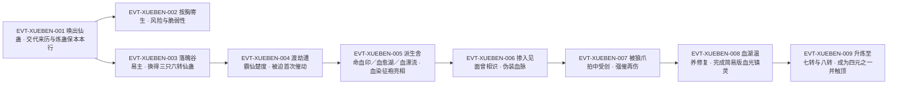

# 血本仙蛊

血本仙蛊是一只**六转血道仙蛊**，也是全书里罕见的**非战斗功能型仙蛊**：它的本行是**炼道**——「仙蛊血本的作用，是在炼蛊的过程中，护住一部分的仙材或者蛊虫。若是炼蛊失败。这些仙材或者蛊虫，在事后还可通过血本仙蛊，还原出来。」（`E:V5-195300`）它**不在方源的认知当中**，是上一任琅琊地灵结合宝黄天中的血道蛊方**独自创新**出来的（`E:V5-195298`）。

本页为 2026-09-28 A 线恢复批**新建页**。证据厚度在四页里最厚：全书「血本仙蛊」字面命中 **63 次 / 62 个独立行**，另以简称「血本」命中 86 次 / 84 行（分类账见主题七），命中共跨段5、段6 两段，且**有完整的使用史**——从入手的交易（`E:V5-196410`）、血湖疗伤（`E:V5-195314`–`E:V5-195342`）、被推成五个血道杀招的核心（`E:V5-196034`、`E:V5-226922`）、受创与修复（`E:V5-211142`–`E:V5-226918`）、直到升炼到八转并到顶（`E:V6-394278`、`E:V6-430450`、`E:V6-433562`）。因此本页能写“机制—代价—升转”三层闭环，而不像多数薄页只能写定位。

**引号口径**：凡「」内文字均为根原文逐字引文；本文自身的概括、释义与自拟术语一律用 ‘…’ 标记，二者不混用。正文按“原著事实 → 合理推导 →《问真》设计意义”三层组织。

## 主题档案

### 一、身份与来历：上一任琅琊地灵的独创蛊

#### 原著事实

- **初次亮相**（段5 第 195292–195296 行，正文行）：「一只六转仙蛊，从方源的身上飞出，徐徐上升。」`E:V5-195292`；外形「此蛊浑圆如珠，有鹅蛋大小，珠子上无数氤氲光纹，不断萦绕变化，似万莲盛开，又似流云翻涌。」`E:V5-195294`；报名「血道仙蛊血本！」`E:V5-195296`。
- **来历**：「这只仙蛊并不在方源的认知当中，这是上一任琅琊地灵，结合宝黄天中的一些血道蛊方，独自创新出来的蛊。」`E:V5-195298`。
- **段6 复述同一来历与机制**（说明该设定在后文仍被当作有效设定使用）：「正是血本仙蛊！」`E:V6-394272`；「血本仙蛊能够在蛊仙炼蛊的过程中，护住一部分的仙材或者蛊虫。若是炼蛊失败，这些仙材或者蛊虫，在事后还可通过血本仙蛊，还原出来。」`E:V6-394276`。
- **登记锚与题名的关系**：本页 roster 登记锚为 `E:V5-195948`（正文行，句为「剑遁仙蛊是七转仙蛊，这份血漂流仙道杀招，采用的唯一仙蛊，也就是六转的血本仙蛊，速度比不上剑遁，很正常。」），**转数六转由该正文行直接给出**。同章的题名行 `E:V5-195258`（「章节目录 第三十七节：仙蛊血本」）**只证明该名在全书出现，不作转数与机制证据**；本节另引 `E:V5-195292`、`E:V5-195298` 两处正文互证。
- **道属与 id 归类**：原文写作「血道仙蛊」（`E:V5-195296`）与「六转仙蛊」（`E:V5-195292`）；本页实体 id 为 `blood_atk_5_12_gu`（血系·攻击），其 game rank 5 / lore rank 6 登记见《资料整理》。

#### 合理推导

- **依据**：`E:V5-195298`＋`E:V5-195302`；**结论**：血本仙蛊是**孤本式创新**（一位地灵在既有血道蛊方基础上独自创制），而不是既有蛊系的成熟成员，因此它在原文中**没有“同族兄弟”**，页内也不需要给同族辨析留多节（对照：血神子有血滴子这条晋升线，梦蝶仙蛊有梦甲蛊等同族）；**不确定性**：琅琊地灵「结合宝黄天中的一些血道蛊方」具体借鉴了哪些方子，原文未写。
- **依据**：`E:V5-196038` 的独占限制＋`E:V5-270960`「毕竟仙蛊唯一。」；**结论**：血本仙蛊在叙事上是**全世界仅此一只**的个体，其数量极值恒为 1；**不确定性**：`E:V5-270960` 与 `E:V5-270962` 的「仙蛊唯一」是在**净魂仙蛊**的语境里写下的，本页把它当作通则引用，但原文没有在血本仙蛊名下明写这条通则——故本页只在正文引用，不写成该蛊的独立证据行。

#### 《问真》设计意义

- 血本仙蛊是**“功能型仙蛊”**的干净样板：它的价值不靠打，而靠把**炼蛊的失败成本**降下来。做炼蛊系统时，这类蛊最适合当**保险层**（失败可回滚一部分材料），而不该被做成输出装备——原文自己就是这么用的（`E:V5-270968`）。
- ‘上一任地灵独创、不在主角认知中’（`E:V5-195298`）是一条**可复用的获得叙事**：先给一只效果极好的成品，再补来历，让玩家在“这玩意儿为什么会存在”上获得探索动机。

### 二、核心机制：炼蛊保本——护住一部分仙材或蛊虫，失败可还原

#### 原著事实

- **机制原文（段5）**：「仙蛊血本的作用，是在炼蛊的过程中，护住一部分的仙材或者蛊虫。若是炼蛊失败。这些仙材或者蛊虫，在事后还可通过血本仙蛊，还原出来。」`E:V5-195300`。
- **机制原文（段6 同义复述）**：「血本仙蛊能够在蛊仙炼蛊的过程中，护住一部分的仙材或者蛊虫。若是炼蛊失败，这些仙材或者蛊虫，在事后还可通过血本仙蛊，还原出来。」`E:V6-394276`。
- **前任所有者的收益**：「自从有了这只仙蛊。上一任琅琊地灵不知节省了多少资源。对这只仙蛊，上一任琅琊地灵宝贝得很。可谓千金不换。」`E:V5-195302`。
- **易主的背景**：「但琅琊地灵转性之后，一门心思想要复兴毛民一族，对炼蛊毫无兴趣。」`E:V5-195304`——原本最能发挥它价值的持有者，恰恰因为兴趣转移而放手。
- **用法随持有者档次分化**：「此蛊在寻常蛊仙手中，只能用于炼道，发挥它的本来作用。但在方源这位血道宗师手中。却不只是物尽其用，而是能超常发挥，用途极广。」`E:V5-195310`。
- **保本机制的实际用例**（用于保护另一只仙蛊）：「当然，方源手中有着血本仙蛊，或许可以保本。在风险巨大的炼蛊过程中，保护住六转净魂仙蛊，也未可知。」`E:V5-270968`。
- **盘丝蛊阵中的增益用途**：「这个盘丝蛊阵，仍旧用到血本仙蛊，但增长效果只有一番。」`E:V5-248888`（同处列名见 `E:V5-248852`「正是六转仙蛊血本。」）。

**拆条登记（依契约要求）**

- 机制 `[已确认]`：炼蛊过程中可护住**一部分**仙材或蛊虫；炼蛊失败后，被护住的部分**可通过血本仙蛊还原出来**（`E:V5-195300`、`E:V6-394276` 双段互证）。
- 具体数值 `[待取证]`：能护住**几成**、还原是否**无损**、单次能保护**几件**、催动是否消耗仙元、可否**多次**连续保本——原文一句未写，见《待核对》。
- 机制 `[已确认]`：该作用**不是**战斗能力，原文把战斗归于它的衍生用法（`E:V5-195310`、`E:V5-216280`）。

#### 合理推导

- **依据**：`E:V5-195300`＋`E:V5-195302`；**结论**：这条机制的**收益方是蛊仙本人**（省下的仙材与蛊虫＝直接省资源），支付方在原文中**没有写明**——即原文没有交代催动它要付出什么；**不确定性**：因此不能推断它是“免费”的，只能说本批取证窗口内**未见成本描述**。
- **依据**：`E:V5-195302`＋`E:V5-195304`；**结论**：这只蛊的**价值与持有者的用途高度绑定**——前任用它省资源，转性后即弃；方源用它当杀招核心。同一只蛊的价值在不同人手里差别极大；**不确定性**：琅琊地灵交易它是否附带条件，原文未写（`E:V5-195306` 只说“落入魔爪”）。
- **依据**：`E:V5-195300`（「护住一部分」）；**结论**：机制自带**上限**（一部分 ≠ 全部），这使它与“无失败炼蛊”有本质区别；**不确定性**：比例词「一部分」在原文里没有量化。

#### 《问真》设计意义

- 这条机制是**风险对冲**而非**风险消除**：上限写明为“一部分”。做数值时若把保本做成 100%，原文的紧张感（`E:V5-270968` 的「风险巨大」语境）会立刻消失。建议保留“部分保本”的原始口径。
- ‘同一只蛊，在非同道者手里只发挥本行、在同道宗师手里用途极广’（`E:V5-195310`）是一条可直接照搬的**熟练度/境界加成规则**，比“装备等级上限”更能体现人物的路径身份。

### 三、衍生用法：血湖疗伤、伪装血脉、五个杀招的核心

#### 原著事实

**（1）血湖疗伤——第一次实际动用它的场景**

- 起爆与吸取：「血本仙蛊一出，整个血湖竟剧烈沸腾起来，好像是一座正在喷发的火山，在血湖底部灼烧喷涌。」`E:V5-195314`；「一股股的生机，像是乳燕归巢，齐齐朝血本仙蛊中灌注进去。」`E:V5-195320`；「血本仙蛊悬浮在方源的头顶上，飞速地自转。像是无尽的黑洞，将整个血湖中的生机全数汲取。」`E:V5-195322`。
- 纯化与注入：「随后，经过纯化之后。一股凝练到肉眼都可观察到的生机，仿佛半透明的流水一般，注入到方源的身体里面。」`E:V5-195324`。
- 效果与耗时：「眨眼间，方源重伤痊愈。肉身弥合如初，完整无缺！」`E:V5-195334`；续写身体状态「方源的骨骼发出清脆的响声，欢欣愉悦。干枯的血肉瞬间充盈起来，像是吹气球。皮肤上的伤痕，尽数消失不见。一头长发又生长了一截，黑得发亮，宛若涂了一层油。」`E:V5-195328`；「原本只是半透明血影的下半身。在庞大无比的生机的灌溉下，由内而外。转虚为实。」`E:V5-195332`。
- 时长的关键条件（**易被忽略**）：「神念扫视周身一番，他满意地点点头：“这至尊仙胎所化的肉身，真是玄奇奥妙。一身道痕涉及无数流派，但却偏偏互不干扰。正因此，我动用任何流派的治疗手段，都能百分百发挥疗效。若非如此，我怎可能只用三天，就将这恐怖的伤势直接治好？”」`E:V5-195340`——三天治好，原文把功劳同时归给**血本仙蛊**与**至尊仙胎肉身**，不是单归其一。
- 收回：「方源伸手一招，血本仙蛊宛若一颗流星，从血湖中射出，转眼间就飞到了他的手中。」`E:V5-195342`。

**（2）五个以它为核心的杀招**

- **首次被迫催动**：「直到不久前。他终于从琅琊地灵手中，意外地交易来了血本仙蛊。」`E:V5-195378`；「方源换来血本仙蛊的时候，就在想：能不用就不用，少用为妙。」`E:V5-195382`；「渡劫时，他遭遇霸仙楚度。生死悬于一线之际，他不得不催动血本仙蛊，酿成血道杀招，封住窍壁漏洞。」`E:V5-195386`。
- **移遁方向的设想**：「“我有剑遁仙蛊，但剑道的境界太低。血道方面着手，更有希望。接下来，还是从凡道杀招改良，推出仙级血道杀招，以血本仙蛊为核心，专用于移遁！”」`E:V5-195438`。
- **已推算出的三记**：「自从他得到血本仙蛊之后，他就以这只仙蛊为核心，凭借五百年前世的凡道杀招积累，顺利推算出了舍命血印、血愈湖、血漂流，这三个血道杀招。」`E:V5-196034`。
- **血漂流**：`E:V5-195924`（催动时「血本仙蛊就寄生在他的胸口，赤红的印记开始绽射光芒，同时发挥澎湃的热量。」）、`E:V5-195948`（六转血本的移速上限）、`E:V5-195950`（升到七转才可能在直线速度上超越剑遁）、`E:V5-200474`（「六转血本仙蛊！」）。
- **血染征袍**：「此刻，以血本仙蛊为核心，血染征袍在激战中，正式亮相！」`E:V5-208846`；方源自评其强度：「“我的血染征袍，虽然是仙级防御，但核心仙蛊只有一只六转的血本。面对上古荒兽，还是有点弱。”」`E:V5-211154`。
- **见面曾相识（掺入以伪装血脉）**：「如今的见面曾相识。已经超越了原版，新添了血本仙蛊，和其他种种凡蛊。」`E:V5-207298`；实战验证「方源心中却盘绕着一阵寒意，暗道：“好险！这光壁还是一道测验，刚刚就是测验了我的血液。幸亏我准备充分，不辞辛劳，将血本仙蛊等融汇到见面曾相识当中，改良了这个杀招，使得自己的血液都变化伪装。否则的话，就要功亏一篑了！这黑凡还真是难对付。”」`E:V5-209322`；事后复述战果「“幸好我的血本仙蛊修复好了，掺和进了见面曾相识之中，可以伪装血脉。上一次骗过黑凡真传中的布置，这一次又晃点了七转血道仙蛊血脉。”」`E:V5-227526`。
- **血光镇灵**：「一方面，他在等血本仙蛊修复完全，另一方面，他则开始改良一记仙道杀招血光镇灵。」`E:V5-226914`；「终于，他得到了他想要的，一个简易版本的，以血本仙蛊为核心的血光镇灵！」`E:V5-226922`。
- **本人对它的定位**：「“我作战时主要是力道、剑道、宙道手段。见面曾相识、血本仙蛊这些，只能算是补充。”」`E:V5-216280`。
- **前世视角的感慨**：「“五百年前世，我苦苦追寻一只血道仙蛊而不得，最终只能改炼了春秋蝉。若那时候有一只这样的血道仙蛊，我早就混得风生水起了，就算是十大古派围剿，我也有信心斗一斗。”」`E:V5-195356`。

#### 合理推导

- **依据**：`E:V5-195314`–`E:V5-195342`＋`E:V5-195340`；**结论**：血本仙蛊的**疗伤用法是“转生机”而非“治疗”**——它汲取血湖中的生机、纯化后注入宿主，故其效果**取决于血湖（或等价生机源）的存量**；**不确定性**：原文只写了一个血湖案例，未说明它能否直接从活体、蛊虫或其他资源中抽取生机。
- **依据**：`E:V5-209322`＋`E:V5-227526`；**结论**：它在本行之外最强的能力是**血脉伪装**（掺进见面曾相识后，可骗过黑凡真传的布置与七转血道仙蛊的血脉辨识）；这条用法**不是它自带的**，而是方源把它当**材料**嵌进别人的杀招里；**不确定性**：伪装对哪些层次的检测失效，原文未给边界。
- **依据**：`E:V5-195438`＋`E:V5-196034`＋`E:V5-226922`；**结论**：它参与的杀招至少五记（舍命血印、血愈湖、血漂流、血染征袍、血光镇灵），其中**移遁方向**（血漂流）明确受转数限制（六转比不上七转剑遁，`E:V5-195948`）；**不确定性**：五记杀招的完整清单可能有遗漏（本页只登记有正文命中者）。

#### 《问真》设计意义

- ‘以一只仙蛊为核心、派生一整套杀招’（`E:V5-196034`）是原文里最清晰的**中枢装备**范式：装备本身不输出，输出的是它解锁的招。做构筑系统时采用这一层结构，能让“换核心仙蛊 → 换整条构筑”成为天然的玩法循环。
- **代价与收益必须一起看**：血漂流的速度上限由**转数**卡住（`E:V5-195948`、`E:V5-195950`），这给“升炼”提供了**玩法动机**——不是数值膨胀，而是解锁一条已有构筑的上限。这正是主题六的意义所在。
- 疗伤用法（`E:V5-195314`）提醒设计者：**生机型资源**（血湖、荒兽血液、蛊仙血液）可以成为一只蛊的“燃料地图”，把地图探索与装备强度绑起来。

### 四、代价与硬限制：唯一性、独占、寄生风险、受创即废

#### 原著事实

- **同一时间只能支撑一记杀招（机会成本）**：「毕竟血本仙蛊只有一个，用了这个血道杀招，那个血道杀招就不能同时运用。」`E:V5-196038`。
- **仙蛊唯一（通则）**：「毕竟仙蛊唯一。」`E:V5-270960`；「六转净魂既然存在，世间就不会有七转、八转乃至九转的净魂仙蛊了。」`E:V5-270962`——此二句在**净魂仙蛊**语境中写出，本页仅作通则引用。
- **寄生（收纳方式）与随之而来的风险**：「将这只仙蛊举在眼前，观赏了一阵，方源这才满怀感慨，将其按在胸膛上。」`E:V5-195344`；「血本仙蛊寄生在方源体内，在方源的胸口处，化为一颗赤色圆珠的图案。」`E:V5-195346`；「这种寄生之法，并不安全。方源肉身毁掉，血本仙蛊也会随之遭殃。」`E:V5-195348`；「仙蛊本身是脆弱不堪的，几个月大的婴儿都能踩死九转仙蛊。」`E:V5-195350`；「收入仙窍，最是安稳。」`E:V5-195352`；「但方源此刻，至尊仙窍还落在地上呢。只能暂且如此，小心些，并不妨碍。」`E:V5-195354`。
- **受创即无法再用**：「方源猝不及防，被狼爪拍中，砸在地上，当场七窍喷血，浑身骨骼碎裂，身上的血染征袍杀招被破，就连血本仙蛊都受到伤害，无法再用。」`E:V5-211142`；「若是继续催用，血本仙蛊恐怕要不堪重负而毁灭。」`E:V5-211996`；「只有狂催血本仙蛊。勉强维持住血染征袍。」`E:V5-212000`；「交战开始，他已经身负轻伤。血本仙蛊受创，持续催动有毁灭的危险。」`E:V5-212030`；「血本仙蛊再受重创！」`E:V5-212204`；对方源战力的连带影响「方源虽然暂时失去了血本仙蛊，但有其他宙道防御手段。进退自如。从容不迫。」`E:V5-214258`、`E:V5-219702`（「“血本仙蛊还在修复，血染征袍是用不了。宙道的防护手段，也并非优异。”」）。
- **修复过程与环境**：「这座血湖中。方源掺杂了大量的荒兽血液、蛊仙血液，血本仙蛊就摆放其中，在血湖中载沉载浮。」`E:V5-217452`；「方源沟通神念。常看了一下，发现这只血本仙蛊距离修复完全，还需要比较长的一段时间。」`E:V5-217456`；「血本仙蛊自从损伤之后，一直被方源温养，悉心照料，本来就已经接近痊愈。」`E:V5-226916`；「几天后，方源果然收获一只状态完美的血本仙蛊。」`E:V5-226918`。
- **修复的遗留物**：「另外有一小片血湖，在这里掺杂了大量的荒兽血液、蛊仙血液，曾经方源就是将血本仙蛊，投入到这里修养。」`E:V5-240926`；「如今血本仙蛊状态全复，这片血湖却遗留了下来。」`E:V5-240928`；「除了两大海域之外，还有一片血湖，规模不大，是方源曾经修复血本仙蛊而设，一直保留下来，血湖中的湖水，掺杂了大量的荒兽、蛊仙的血液。」`E:V5-273722`。

**代价与收益（支付方／受益方／支付时点）**

| 代价项 | 支付方 | 受益方 | 支付时点或生效条件 | 证据 |
|---|---|---|---|---|
| 寄生风险：肉身毁则仙蛊随之遭殃（仙蛊脆弱、婴儿可踩死九转仙蛊） | 血本仙蛊本体 | 方源（可随身携行、隐蔽） | 寄生于方源胸口、化为赤色圆珠图案期间；因至尊仙窍未归位而无法收入仙窍，属权宜 | E:V5-195344、E:V5-195346、E:V5-195348、E:V5-195350、E:V5-195352、E:V5-195354 |
| 强催风险：持续催动可能不堪重负而毁灭 | 血本仙蛊本体 | 方源（维持血染征袍） | 受创状态下继续催用之时 | E:V5-211142、E:V5-211996、E:V5-212000、E:V5-212030、E:V5-212204 |
| 修复成本：一片掺入荒兽血液与蛊仙血液的血湖＋较长工期 | 方源（血湖与时间） | 血本仙蛊（复原，且“状态完美”） | 受创之后；直至 E:V5-226918 完全复原 | E:V5-217452、E:V5-217456、E:V5-226916、E:V5-226918 |
| 机会成本：唯一性导致同一时间只能支撑一记杀招 | 方源（放弃同时使用其他以它为核心的杀招） | 方源（当前启用的那一记） | 每次催动任一以它为核心的杀招时 | E:V5-196038、E:V5-270960 |

#### 合理推导

- **依据**：`E:V5-196038`＋`E:V5-270960`；**结论**：血本仙蛊的强度被**“一只蛊只能启用一记杀招”**这条规则封顶，所以它的成长方向是**升转（解锁既有构筑的上限）**而不是**多开**；**不确定性**：原文没有说明“斩时切换”是否有冷却或损耗。
- **依据**：`E:V5-195346`–`E:V5-195354`；**结论**：寄生的风险在原文里**有其具体成因**（至尊仙窍落在地上，无处安放，只能权宜），因此该风险**可能是一次性的、非通用的**；**不确定性**：仙窍归位后是否仍采用寄生方式，原文未写。
- **依据**：`E:V5-211142`＋`E:V5-212030`；**结论**：对本蛊而言，**“受伤 = 战力下降”的传导是双重的**——既丧失它本身的功能，也直接废掉以它为核心的杀招（血染征袍被破）；**不确定性**：修复到可用与修复到“状态完美”之间是否有档次差，原文只给了结果。

#### 《问真》设计意义

- ‘核心仙蛊受伤 → 整条构筑瘫痪’（`E:V5-211142`、`E:V5-219702`）是一条**强负面反馈**，它让“核心装备”的脆弱性成为真实的战术变量：对手不必杀掉持有者，只需打伤那只蛊。设计上应保留这一层，而不是让核心装备只增不减。
- 修复成本写成**环境建造**（造一片血湖、掺荒兽与蛊仙血液、养上一段时间，`E:V5-217452`）而不是“消耗药品”，更适合做成**长期工程**玩法，且天然产出可残留的地图要素（`E:V5-240928`、`E:V5-273722`）。

### 五、交易与归属

#### 原著事实

- **交易**：「和方源交易时，血本仙蛊就这样落入了方源的魔爪当中了。」`E:V5-195306`；「直到不久前。他终于从琅琊地灵手中，意外地交易来了血本仙蛊。」`E:V5-195378`。
- **交易内容（付出与所得）**：「方源将落魄谷正式卖给琅琊地灵，而得到狗屎运仙蛊、血本仙蛊、暗渡仙蛊这三只六转仙蛊，对琅琊派的所有欠款清零，同时借用大量凡蛊、仙蛊，弥补自身实力短板之外，重点就是用来组成仙灾锻窍杀招，和剑浪三叠。」`E:V5-196410`。
- **归属与被觊觎**：「其中令巨阳仙尊朝思暮想的，就有血本仙蛊、血颅仙蛊、血脉仙蛊、血缘仙蛊等等。」`E:V6-429292`；「这些仙蛊中就包含了血脉仙蛊、血本仙蛊、血颅仙蛊还有血气仙蛊。」`E:V6-430434`；「血本仙蛊也是方源的。」`E:V6-430444`。

**代价与收益（支付方／受益方／支付时点）**

| 代价项 | 支付方 | 受益方 | 支付时点或生效条件 | 证据 |
|---|---|---|---|---|
| 落魄谷（一处福地）所有权与长期收益 | 方源 | 琅琊地灵（获得落魄谷） | 交易当场；方源自述此事为「意外地」得手 | E:V5-196410、E:V5-195378 |
| 交易对价（三只六转仙蛊、欠款清零、借用大量凡蛊仙蛊） | 琅琊地灵 | 方源 | 交易当场 | E:V5-196410 |

#### 合理推导

- **依据**：`E:V5-196410`＋`E:V5-195378`；**结论**：血本仙蛊是**卖掉一处福地才换来的**，其取得成本在原文里是**显式且巨大**的；这与它后来被当“补充手段”（`E:V5-216280`）形成反差；**不确定性**：这笔交易中血本仙蛊本身作价多少，原文未拆分。
- **依据**：`E:V6-429292`＋`E:V6-430444`；**结论**：段6 的归属盘点把血本仙蛊列为**巨阳仙尊觊觎的对象**，说明它在后期已是**权力层面的标的物**，不只是方源的工具；**不确定性**：巨阳是否付诸行动，本页取证窗口内未见。

#### 《问真》设计意义

- ‘用一处福地换一只功能型仙蛊’（`E:V5-196410`）给出一条**高价值换地**的定价参照：功能型仙蛊的估值可与“领地级资产”挂钩，而不是与战斗道具挂钩。

### 六、升转史与四元格局：从六转到八转、以及“无法升炼成九转”

#### 原著事实

- **六转期的记载**：`E:V5-195292`、`E:V5-195948`、`E:V5-200474`（「六转血本仙蛊！」）、`E:V5-211154`（「核心仙蛊只有一只六转的血本」）；另在六转仙蛊清单中出现：`E:V5-240968`（「六转仙蛊有解谜、妇人心、血本、暗渡、****运、变形、力气、我力、飞熊之力、拔山、挽澜、江山如故、人如故、星眸、春秋蝉（天意寄存，存放在仙僵肉身之中）、骨刺、道可道。」）、`E:V5-273794`（「六转有我力、拔山、挽澜、力气、春秋蝉、江山如故、人如故、日、解谜、金刚念、运、气运、妇人心、血本、变形、星眸、道可道、黄沙、净魂、察运、连运、时运、星念等。」）。
- **升转的路径**：「血本仙蛊原本只是六转，但在不久前，方源努力之下，已经利用长毛炼道大阵，成功升炼到了七转。」`E:V6-394278`。
- **四元格局**：「整座四元方悔血炼池有四大核心，分别是八转仙蛊升炼、水炼、悔，以及七转仙蛊血本。所以称之为“四元”。辅助仙蛊规模直接突破二十，早秋、中秋、晚秋三只八转仙蛊首当其冲。至于其他凡道蛊虫，规模上亿，种类繁杂如星海，让人听了都匪夷所思。」`E:V6-394344`；「这座仙蛊屋仍旧是四大核心仙蛊，升炼仙蛊、水炼仙蛊、仙级悔蛊，以及血本仙蛊。」`E:V6-433558`。
- **七转期的限制（缺升炼材料）**：「方源不是不想升炼它，只是缺乏相应的八转食道仙材。四元方悔血炼池的血本仙蛊情况也是一样的，它仍旧是七转，缺乏八转血道仙材升炼。」`E:V6-394806`。
- **八转与到顶**：「如今这只血本仙蛊，已经从六转上升到八转，成为四元方悔血炼池中的核心仙蛊之一，也是四元之一，意义重大。」`E:V6-430450`；「其中，血本仙蛊目前已经到达极限，无法升炼成九转。天庭在压制血道发展方面，可谓功不可没。」`E:V6-433562`。
- **坐镇阵法**：「血本仙蛊缓缓飞落到亭子的屋尖，那里正好建有金座。」`E:V6-394280`；「一声轻响，血本仙蛊最终稳稳当当地落在金座上。」`E:V6-394286`；「旋即，方源仙元消耗，金座产生一股吸摄之力，将血本仙蛊牢牢固定。」`E:V6-394288`；运转时「血本仙蛊迸发出一股浓郁的血光。」`E:V6-394290`、`E:V6-394634`（血光消退后归位）、`E:V6-394690`（血光覆盖整个水池）。

**原文内部口径并列（勿强行统一）**

- **口径 A（分段升转）**：六转 → 七转（`E:V6-394278`「已经利用长毛炼道大阵，成功升炼到了七转」，并被 `E:V6-394344` 称为「七转仙蛊血本」）→ 八转（`E:V6-433558` 与 `E:V6-433562` 处的状态）。
- **口径 B（一句概括跨过七转）**：`E:V6-430450` 写作「已经从六转上升到八转」。
- **当前状态**：两处都在同一叙事线上，B 更近于概述性表述，A 有明确的升转手段与中间状态证据。本页**并列登记，不替原文统一**。
- **另记一处内部张力**：`E:V6-394806` 同行内先写「缺乏相应的八转食道仙材」，后写「缺乏八转血道仙材升炼」——同一只血道仙蛊的升炼材料，在同一句里出现两种道属写法，本页**照录并存**，不作取舍。

#### 合理推导

- **依据**：`E:V6-394278`＋`E:V6-394344`＋`E:V6-430450`＋`E:V6-433562`；**结论**：血本仙蛊的成长曲线是**六转→八转→触顶**，而触顶的成因**不是它自身不足，而是天庭压制血道**；**不确定性**：`E:V6-433562` 只说“到达极限，无法升炼成九转”，未说明限制是材料、天道还是人为封锁，原文把归因写在“天庭压制血道发展”上，但机制未展开。
- **依据**：`E:V6-394806`（缺八转材料）；**结论**：升转的**瓶颈是材料道属与阶位匹配**（要八转对应道属的仙材），这解释了为什么它一度卡在七转；**不确定性**：材料所需的道属到底是食道还是血道，原文自相矛盾（见上）。

#### 《问真》设计意义

- ‘六转 → 七转 → 八转 → 九转不可达’是一条**有上限的成长线**：上限来自**外部环境压制**而非道具层级。做长线养成时，把上限写成“世界规则不允许”，比写成“等级满了”更能生成剧情张力（`E:V6-433562` 的措辞本身就是一句世界观宣言）。
- 四元格局（`E:V6-394344`）说明它最终的角色是**阵法核心之一**：一只早期用于省材料的辅助蛊，后期成为国家级工程的四个支点之一——这条**职能跃迁**是很好的长线设计参照。

### 七、身份边界：血本蛊是另一实体登记；「血本」是简称；另有成语用法

#### 原著事实

**边界一：「血本蛊」的全部字面命中（穷举分类账）**

- 全书「血本蛊」命中 **1 次 / 1 行**：`E:V5-199800`「六转仙蛊解谜蛊、妇人心蛊、血本蛊、暗渡蛊、狗屎运蛊、变形蛊、力气蛊、我力蛊、飞熊之力蛊、拔山蛊、挽澜蛊、江山如故蛊、人如故蛊、星眸蛊。」——这是一段**库存盘点清单**（同段上文 `E:V5-199798` 为七转清单、`E:V5-199796` 为八转清单）。
- **同一清单在别处的两种写法**：`E:V5-240968` 写作「血本」，`E:V5-273794` 写作「血本」，均**不带「蛊」后缀**。
- **登记层面的分裂**：roster-3 另设独立 id `blood_atk_5_13_gu`（名「血本蛊」，转数登记 6，锚同为 `E:V5-199800`），与本页 `blood_atk_5_12_gu`（血本仙蛊）**是两个 id**。

**边界二：「血本」二字的全部命中（穷举分类账）**

- 「血本」全书 **86 次 / 84 行**；其中含母名「血本仙蛊」的 **62 行**、仅含「血本蛊」的 **1 行**（`E:V5-199800`，见边界一）；按行相减 84 − 62 − 1 = **21 行**，逐条分类如下：
  - **同一实体简称 7 行**：`E:V5-195296`（首现报名「血道仙蛊血本！」）、`E:V5-211154`（「核心仙蛊只有一只六转的血本」）、`E:V5-240968`（六转仙蛊清单）、`E:V5-248852`（「正是六转仙蛊血本。」）、`E:V5-248858`（「几乎是瞬间，绿光被仙蛊血本的色彩浸染，变成了鲜艳的红色。」）、`E:V5-273794`（六转仙蛊清单）、`E:V6-394344`（四元记法「七转仙蛊血本」）。
  - **题名 1 行**：`E:V5-195258`「章节目录 第三十七节：仙蛊血本」——**只证明该名在全书出现，不作任何转数或机制证据**。
  - **成语／泛称用法 13 行（与蛊虫实体无关）**：`E:V1-006464`（「不想你血本无归」）、`E:V1-017780`（「这次是下了血本」）、`E:V2-043476`、`E:V2-043930`、`E:V4-135906`、`E:V4-148794`（三处「血本无归」）、`E:V4-154814`（「耗费这么大的力气和血本」）、`E:V4-167728`（「血本无归」）、`E:V6-380012` 与 `E:V6-386980`（两处「方源不惜血本」）、`E:V6-399920`（「出了血本」）、`E:V6-403170`（「亏了血本」）、`E:V6-413990`（「下了血本」）。

#### 合理推导

- **依据**：`E:V5-199800` 的清单语境＋`E:V5-240968`、`E:V5-273794` 的同清单写法＋`E:V5-195298`（血本仙蛊为独创孤本）；**结论**：在**原文层面**，这三处清单里的‘血本蛊／血本’**极可能都指同一只血本仙蛊**（方源名下并没有第二只名为血本的蛊）；**不确定性**：原文没有一句话明确写“清单里的血本蛊＝血本仙蛊”，故这是推导而非原文事实。
- **依据**：roster-3 的两个 id 并立；**结论**：本页按闸门要求**不把「血本蛊」写入 `aliases`**（且本页 `aliases` 为空），只在此处划界；**不确定性**：该 id 分裂是否有下文依据，超出本页取证范围。
- **依据**：13 行成语用法；**结论**：命名预筛若只用「血本」检索，会引入约六分之一的噪声（13/84）——本页的处理方式是**逐条看上下文后分类**，而不是按字面并入实体；**不确定性**：无。

#### 《问真》设计意义

- 本条边界是**命名预筛的典型样本**：一个高频常用词（血本）恰好又是专名的前缀，导致检索噪声约 15%。做实体登记时，应把‘同名成语／泛称’明确登记在页内，供后续批次的校验脚本排除，而不是留成隐性坑。
- 「血本蛊」这一 id 与「血本仙蛊」的关系**在原文层面没有支持**，但在**登记层面**已成事实。这类“登记层分裂”最容易被误当成“原文矛盾”，本页因此分开写：文本层证据、登记层证据各归各的。

## 状态时间线

| 状态 ID | 阶段 | 状态 | 证据 |
|---|---|---|---|
| ST-XUEBEN-01 | 来历 | [原著明确] 六转血道仙蛊；不在方源认知中，为上一任琅琊地灵结合宝黄天血道蛊方独自创新 | E:V5-195292、E:V5-195294、E:V5-195296、E:V5-195298、E:V6-394272 |
| ST-XUEBEN-02 | 本行机制 | [原著明确] 炼蛊时护住一部分仙材或蛊虫，炼蛊失败后可经其还原；前任凭它节省大量资源、视为千金不换 | E:V5-195300、E:V5-195302、E:V6-394276 |
| ST-XUEBEN-03 | 机制数值 | [待取证] 护住的成数、还原是否无损、单次件数、是否需要仙元——原文均未写 | E:V5-195300、E:V6-394276 |
| ST-XUEBEN-04 | 易主 | [原著明确] 前任琅琊地灵转性后专注复兴毛民、对炼蛊无兴趣，遂在和方源交易时让出；方源自述为“意外”得手 | E:V5-195304、E:V5-195306、E:V5-195378、E:V5-196410 |
| ST-XUEBEN-05 | 首次动用 | [原著明确] 换得后本打算少用；渡劫遇霸仙楚度、生死一线之际不得不催动，酿成血道杀招封住窍壁漏洞 | E:V5-195382、E:V5-195386 |
| ST-XUEBEN-06 | 疗伤用法 | [原著明确] 一出即使血湖沸腾，汲取全湖生机、纯化后注入宿主；方源重伤三日痊愈（原文同时归因于至尊仙胎肉身） | E:V5-195314、E:V5-195320、E:V5-195322、E:V5-195324、E:V5-195334、E:V5-195340 |
| ST-XUEBEN-07 | 收纳与风险 | [原著明确] 寄生于胸口、化为赤色圆珠图案；寄生不安全（肉身毁则仙蛊遭殃），因至尊仙窍未归位而无法收入仙窍 | E:V5-195344、E:V5-195346、E:V5-195348、E:V5-195350、E:V5-195352、E:V5-195354 |
| ST-XUEBEN-08 | 杀招核心 | [原著明确] 至少五记杀招以它为核心：舍命血印、血愈湖、血漂流、血染征袍、血光镇灵；因唯有其一，同时只能启用一记 | E:V5-196034、E:V5-196038、E:V5-208846、E:V5-226922、E:V5-195948 |
| ST-XUEBEN-09 | 受创与修复 | [原著明确] 被狼爪拍中致其受伤、无法再用；持续催用有毁灭危险；送入掺荒兽与蛊仙血液的血湖温养，数日后恢复到“状态完美” | E:V5-211142、E:V5-211996、E:V5-212204、E:V5-217452、E:V5-217456、E:V5-226918 |
| ST-XUEBEN-10 | 升转 | [原著明确] 借长毛炼道大阵由六转升炼到七转；后成为四元方悔血炼池四元之一；再升到八转 | E:V6-394278、E:V6-394344、E:V6-430450 |
| ST-XUEBEN-11 | 上限 | [原著明确] 已达极限、无法升炼成九转（原文归因于天庭压制血道发展） | E:V6-433562 |
| ST-XUEBEN-12 | 身份边界 | [存在冲突] 「血本蛊」全书仅 1 行（六转仙蛊库存清单 `E:V5-199800`），同清单另两处写作「血本」；原文层面极可能同指本页实体，但 roster-3 另立独立 id，故本页 aliases 为空、只划界 | E:V5-199800、E:V5-240968、E:V5-273794、E:V5-195298 |

## 原著明确内容（本批取证窗口登记）

本批对「血本仙蛊」在根原文全书扫描：字面命中 **63 次 / 62 个独立行**（段5、段6）；另以「血本」扫描得 **86 次 / 84 行**、「血本蛊」得 **1 行**，变体分类账见主题七。下表登记本批实际读取的窗口。

| 窗口 | 内容要点 | 用途 |
|---|---|---|
| 195258（题名行） | 「章节目录 第三十七节：仙蛊血本」 | 仅登记“该名在全书出现”，不作证据 |
| 195286–195300 | 凡蛊照湖 → 一枚浑圆如珠的仙蛊自方源身上飞出 → 报名「血道仙蛊血本」→ 交代来历为琅琊地灵独创 → 交代本行机制 | 主题一、二 |
| 195302–195312 | 前任凭它省资源、千金不换；转性后与方源交易；方源得之极喜；‘寻常蛊仙只能用于炼道，血道宗师手中用途极广’ | 主题一、二、五 |
| 195314–195342 | 血湖疗伤全程：沸腾、生机灌注、自转汲取、纯化注入、肉身复原、三日痊愈之因、收回仙蛊 | 主题三 |
| 195344–195356 | 按在胸膛寄生、化为赤色圆珠图案、寄生不安全、仙蛊脆弱、应收收入仙窍、前世感慨 | 主题三、四 |
| 195378–195396 | 从琅琊地灵手中意外换得；本欲少用；渡劫遇霸仙楚度不得不催动；收蛊后思忖处境 | 主题五、三 |
| 195438–195438 | 定下方向：以血本仙蛊为核心推出专用于移遁的仙级血道杀招 | 主题三 |
| 195924–195950 | 催动时寄生处绽射光芒发热；血漂流的速度受六转限制，升到七转方能有望超越剑遁 | 主题三、六 |
| 196034–196038 | 已推算舍命血印、血愈湖、血漂流三记；因仙蛊唯一，同一时间只能启用一记 | 主题三、四 |
| 196410 | 落魄谷换得狗屎运仙蛊、血本仙蛊、暗渡仙蛊三只六转仙蛊＋欠款清零＋借用大量凡蛊仙蛊 | 主题五 |
| 199796–199800 | 八转／七转／六转仙蛊库存清单；「血本蛊」三字全书唯一一处 | 主题七 |
| 200474、207298、208846、209322 | 血漂流酝酿；见面曾相识掺入血本仙蛊；血染征袍首次亮相；伪装血脉骗过黑凡真传布置 | 主题三 |
| 211142–212204 | 被狼爪拍中致其受伤无法再用；继续催用有毁灭危险；狂催维持血染征袍；再受重创 | 主题四 |
| 214258–219702 | 失去它期间的战力替代与自评；仍在修复、血染征袍用不了 | 主题四 |
| 216280 | 本人定位：见面曾相识、血本仙蛊这些只能算是补充 | 主题三 |
| 217452–217462 | 掺荒兽血液、蛊仙血液的血湖中修复；距修复完全还需较长时间；自陈只有一只血本仙蛊 | 主题四、三 |
| 226914–226922 | 温养接近痊愈；数日后收获状态完美的一只；以它为核心的简易版血光镇灵成形 | 主题四、三 |
| 227526 | 修复后掺进见面曾相识可伪装血脉：骗过黑凡真传布置、晃点七转血道仙蛊血脉 | 主题三 |
| 240926–240928、248852–248888、273722 | 修复用血湖遗留；盘丝蛊阵仍用血本仙蛊但增益仅一番；修复血湖的规模与残留 | 主题四、二 |
| 270960–270968 | 仙蛊唯一通则；六转净魂存在则世间无更高转净魂；以血本仙蛊保本、保护六转净魂仙蛊的设想 | 主题四、二 |
| 394272–394290 | 段6 复述名与机制；由六转成功升炼到七转；落入四元阵法金座并被固定 | 主题六、二 |
| 394344、394634、394690、394806 | 四元格局（升炼、水炼、悔、七转仙蛊血本）；血光涨落归位；缺八转材料（同行食道／血道两种写法） | 主题六 |
| 429292、430434–430450、433558–433562 | 巨阳仙尊朝思暮想的名单；归属盘点；已从六转上升到八转；仍是四大核心之一；到达极限无法升九转 | 主题五、六 |

## 事件链

| 事件 ID | 事件 | 参与者 | 证据 | 因果 |
|---|---|---|---|---|
| EVT-XUEBEN-001 | 方源在血湖炼蛊场景中唤出血本仙蛊，交代其为上一任琅琊地灵独创、本行是炼蛊保本，随后以汲取全湖生机之法三日修复重伤之躯 | 方源、血本仙蛊 | E:V5-195292、E:V5-195298、E:V5-195300、E:V5-195314、E:V5-195340 | evidences ST-XUEBEN-01、ST-XUEBEN-02、ST-XUEBEN-06 |
| EVT-XUEBEN-002 | 方源把血本仙蛊按在胸膛寄生，化赤色圆珠图案；原文随之说明寄生不安全与仙蛊脆弱 | 方源、血本仙蛊 | E:V5-195344、E:V5-195346、E:V5-195348、E:V5-195350、E:V5-195354 | evidences ST-XUEBEN-07 |
| EVT-XUEBEN-003 | 以落魄谷为对价，方源从琅琊地灵手中换得血本仙蛊等三只六转仙蛊，欠款清零并借用大量蛊虫 | 方源、琅琊地灵 | E:V5-195306、E:V5-195378、E:V5-196410 | evidences ST-XUEBEN-04；enables EVT-XUEBEN-004 |
| EVT-XUEBEN-004 | 渡劫遭遇霸仙楚度、窍壁被破，方源被迫首次催动血本仙蛊酿成血道杀招封堵漏洞 | 方源、霸仙楚度 | E:V5-195382、E:V5-195386、E:V5-195396 | evidences ST-XUEBEN-05 |
| EVT-XUEBEN-005 | 以血本仙蛊为核心陆续推出舍命血印、血愈湖、血漂流，并在战中以血染征袍亮相 | 方源、血本仙蛊、敌方 | E:V5-196034、E:V5-195924、E:V5-208846 | evidences ST-XUEBEN-08 |
| EVT-XUEBEN-006 | 方源将血本仙蛊掺入见面曾相识以伪装血脉，骗过黑凡真传布置与七转血道仙蛊的血脉辨识 | 方源、黑凡真传布置 | E:V5-207298、E:V5-209322、E:V5-227526 | evidences ST-XUEBEN-08 |
| EVT-XUEBEN-007 | 被狼爪拍中致血本仙蛊受伤、无法再用；方源仍狂催维持血染征袍，致其再受重创 | 方源、上古荒兽 | E:V5-211142、E:V5-211996、E:V5-212000、E:V5-212204 | evidences ST-XUEBEN-09 |
| EVT-XUEBEN-008 | 方源在掺入荒兽与蛊仙血液的血湖中温养血本仙蛊，数日后收获“状态完美”的一只，并完成简易版血光镇灵 | 方源、血本仙蛊 | E:V5-217452、E:V5-217456、E:V5-226916、E:V5-226918、E:V5-226922 | evidences ST-XUEBEN-09 |
| EVT-XUEBEN-009 | 血本仙蛊经长毛炼道大阵升炼至七转，落座四元方悔血炼池金座、成为“四元”之一，后升至八转并停在极限 | 方源、血本仙蛊 | E:V6-394278、E:V6-394280、E:V6-394288、E:V6-394344、E:V6-430450、E:V6-433562 | evidences ST-XUEBEN-10、ST-XUEBEN-11 |

事件口径：本页沿用实体簇号 `EVT-XUEBEN-*`，节点 9 个（≥3），按模板配图；边只连有正文依据的推进关系，不虚构先后。

## 资料整理

本页为**新建页**，没有旧版；本批来源只有根原文，没有 `notes:`／`memory:` 层转述进入本页事实区。相关派生记录的处置登记如下（**本段内容不得当作原著事实**）：

- `roster-3.md` 第 52 行登记：`| blood_atk_5_12_gu | 血本仙蛊 | 5 | 6 | E:V5-195948 |  |`（状态类别‘品阶上限压缩’）。本页复核：登记锚 `E:V5-195948` 落在**正文行**（该行明写「六转的血本仙蛊」），转数六转可直接引证；游戏侧 `game_rank=5` 属该批约定登记，本页只登记、不改该页、不改 `game/**`。
- `game/data/gu_lore.json` 的 `blood_atk_5_12_gu` 为 `game_rank=5`、`status=rank_cap`、`lore_rank=6`、`anchor=E:V5-195948`——投影与原文一致。
- **锚点复核（写作方自查，非独立校验）**：本页登记的**首现锚**为 `E:V5-195948`（正文行）；**同章另有一行题名** `E:V5-195258`（「章节目录 第三十七节：仙蛊血本」），本页按契约把它当作**“该名在全书出现”的登记锚说明**，**转数另据正文 `E:V5-195948`／`E:V5-195292`**——即：题名不构成转数或机制证据。
- **近名册**：`blood_atk_5_13_gu`（血本蛊，锚同为 `E:V5-199800`）与本页为**近名同族、不同实体**的登记关系；本页与它**禁止互写 `aliases`**，边界写在主题七与《待核对》。同清单锚的还有 `dream_atk_5_06_gu`（解谜蛊，锚 `E:V5-199800`）与 `blood_atk_5_09_gu`（血神子，属另一分片），本页只登记“同锚”事实，不推断其语义。
- `lore/runtime/rules.json` 记载‘仙蛊极限八转……个案：……血本仙蛊由六转升炼至七转’一类归纳，另有四元方悔血炼池四核记法。本页**不引用** runtime 汇总作为原著事实：`E:V6-394278`、`E:V6-394344`、`E:V6-430450` 已给出原文依据，runtime 文件只作消费层。
- `gui/data/loot_tables.json` 的 rationale 写‘荒兽血液养血本仙蛊（原文 217452）’。回原文复核：`E:V5-217452` 的实际措辞是「这座血湖中。方源掺杂了大量的荒兽血液、蛊仙血液，血本仙蛊就摆放其中，在血湖中载沉载浮。」——**“血湖养蛊”成立，“荒兽血液专门养它”不成立**（原文并列了荒兽血液与蛊仙血液两种，且未说哪一种是必需）。本页只采信原文措辞；该 rationale 属桥接层表述，不在本页事实区使用。
- 本页不声明桥接层 canon 字段、不新建桥接层 canon 编号（本轮口径：Canon 权威已在本 Wiki，桥接层文件只作消费层，本批不引用）。

## 分析与解读

以下为归纳，不是原文（须与上文“原著事实”区分）：

1. **它是全书里少见的“辅助蛊拥有完整生命周期”的案例**：来历 → 机制 → 易主 → 首次被迫使用 → 派生五招 → 受伤瘫痪 → 修复 → 升转 → 触顶。91 行的证据密度让这条曲线完整可见，也因此它比“只强不弱”的战斗蛊更适合做长线玩法骨架。
2. **机制的收益方向写得非常明确，成本方向却几乎空白**：`E:V5-195300` 清楚写了护住什么、失败后怎么还原，但**没有一句写催动要付出什么**。因此本页把“机制已确认”与“数值未知”拆成 ST-XUEBEN-02 与 ST-XUEBEN-03 两条——不把“未见成本”写成“没有成本”。
3. **“唯一性”产生了三种不同的代价**：机会成本（一次只能撑一记杀招，`E:V5-196038`）、生存风险（寄生，肉身毁则蛊毁，`E:V5-195348`）、战力瘫痪（受伤即丧失以它为核心的全部手段，`E:V5-211142`、`E:V5-219702`）。这三条合起来，才是它作为“核心仙蛊”的真实价格。
4. **升转的意义是解锁上限而非堆数值**：`E:V5-195950` 明说升到七转才可能在直线速度上超越剑遁。这条写法把“升炼”从数值膨胀改成了**构筑补完**，是玩家能理解也愿意追的目标。
5. **两条原文内部口径必须并列**：升转记法（分段 `E:V6-394278`／`E:V6-394344` vs 概述 `E:V6-430450`）与升炼材料道属（同行「食道」vs「血道」，`E:V6-394806`）。本页不替原文统一，登记在主题六与《待核对》。

## 待核对

- `[原著未明确]` **保本机制的数值面**：护住的比例（原文只写「一部分」）、还原是否无损、单次保护的件数、催动是否消耗仙元、能否连续多次保本。
- `[原著未明确]` **保本机制的成本面**：本批取证窗口内**未见**任何关于催动代价的描述（既未见仙元消耗，也未见时限）。这是“尚未找到”，不是“原著没有”。
- `[原著未明确]` **疗伤用法的资源边界**：`E:V5-195314`–`E:V5-195342` 只给了一个血湖案例，未说明能否从活体、蛊虫或其他生机源汲取。
- `[原著未明确]` **血脉伪装的失效边界**：`E:V5-209322`、`E:V5-227526` 只给了两次成功案例（黑凡真传布置、七转血道仙蛊血脉）。
- `[原著未明确]` **升转所需材料的具体道属与数量**：`E:V6-394806` 同行内自相矛盾（先「八转食道仙材」、后「八转血道仙材」），本页照录并存。
- `[原著未明确]` **九转不可达的机制细节**：`E:V6-433562` 只把它归因于“天庭在压制血道发展”。
- `[待取证]` **本页检索口径**：本批对「血本仙蛊」的穷举为 **63 次 / 62 行**；对「血本」的穷举为 **86 次 / 84 行**（其中 62 行含母名、1 行仅含「血本蛊」、余 21 行＝同一实体简称 7＋题名 1＋成语／泛称 13）；对「血本蛊」为 **1 行**。三组口径的分母都已在主题七列明，**读者不应把「血本」的 84 行当作实体命中数**。
- `[待取证]` **桥接层两个「血本」登记的关系**：`blood_atk_5_12_gu`（血本仙蛊）与 `blood_atk_5_13_gu`（血本蛊）在原文层面**未取到互斥证据**（清单语境反而指向同一只蛊）。本页按 id 分立处理并登记待 L0 复核，**不替原文裁定**。
- `[存在冲突]` **升转记法的口径 A／口径 B**：
  - 口径 A（分段）：六转（`E:V5-195292` 等）→ 七转（`E:V6-394278` 明写经长毛炼道大阵升炼，`E:V6-394344` 称「七转仙蛊血本」）→ 八转（`E:V6-433558`、`E:V6-433562` 语境）。
  - 口径 B（概述）：`E:V6-430450` 写作「已经从六转上升到八转」，一句跨过七转。
  - 当前状态：两处同线并存，B 更像叙述性概述；本页不统一。
- `[原著明确]` **体积**：本页 52,456 字节，**已超 40 KB，按 GOVERNANCE 登记例外**（不为压体积删除有效知识；本批不设体积硬上限）。

## 模板扩展建议（只登记，不改核心模板）

1. **功能型仙蛊需要“本行／衍生”两栏**。本页的机制面被原文明确分成两层：本行（炼蛊保本，`E:V5-195300`）与衍生（疗伤、伪装血脉、杀招核心，`E:V5-195310`）。现有骨架能容纳，但读者容易把衍生误当本行；建议在实体页为功能型蛊留“本行”与“衍生用法”两个固定小标题。
2. **“唯一性三类代价”值得有固定位**。机会成本／生存风险／战力瘫痪在原文里分属三处（`E:V5-196038`、`E:V5-195348`、`E:V5-211142`），合并后才构成完整代价；建议模板为“核心仙蛊”类实体提供一张固定的代价汇总位（本页已用四行的代价表临时实现）。
3. **同名成语噪声应进入登记而非清洗**。本页 84 行「血本」里有 13 行是成语（血本无归／下了血本等）。建议命名预筛的结论位支持“噪声行分类账”，并要求写出分母，避免后续批次把噪声当命中统计。

## 关联页面

[血道](../world/blood-path.md)、[春秋蝉](spring-autumn-cicada-gu.md)、[血气蛊](blood-atk-3-03-gu.md)、[血月蛊](blood-atk-3-11-gu.md)、[炼蛊与杀招链](../world/gu-refine-killer-chain.md)、[蛊的饲养与炼化](../world/gu-care-and-refinement.md)、[杀招连招并招体系](../rules/killer-moves.md)、[真元](../world/primeval-essence.md)、[流派总表](../world/path-roster.md)、[蛊虫关系](gu-relations.md)、[蛊虫总表](roster.md)、[蛊虫总表二期](roster-2.md)、[蛊虫总表三期](roster-3.md)、[方源](../characters/fang-yuan.md)、[义天山大战](../events/yitian-mountain.md)、[疯魔窟](../events/feng-mo-ku.md)、[逆流河](../events/reverse-flow-river.md)、[琅琊福地遭袭](../events/langya-blessed-land-invasion.md)。
