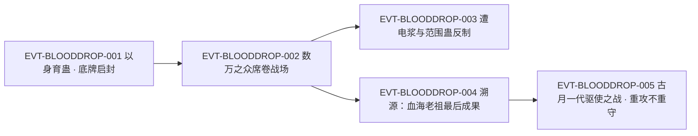

# 血滴子

血滴子是**五转**的**虫群型蛊虫**，原文给它的定性是“养用合一”四字：它**不需要主人提供真元**，靠吞噬**蛊师精血**来繁衍分化，越打越多，所以叫“以战养战”。它有三条硬规则：一、**兽血不能让它分化**，只有含真元气息的蛊师精血才有这作用；二、饱餐后**裂变分化**（一变二、二变四），饿时则**相互吞噬**减员；三、强盛时有“能灭村寨，比许多六转蛊虫还要恐怖”的评价，弱小时“连一只三转蛊都不如”。它出场的名场面是古月一族的最后底牌——一族蛊师“以身育蛊”把它喂饱，它才替家族御敌。它再往后晋升，就是六转魔蛊**血神子**，天下十大魔蛊名列第七。

**检索口径（必读）**：本页为 2026-09-28 GU 蛊虫专题 40 页规模化恢复第二批 S2-1 分片的**新建页**。全书穷举扫描 `血滴子`：命中 **34 次 / 32 行**（段一 31 行、段四 1 行，其余段域 0 命中），其中 `E:V1-028512`、`E:V1-028518` 两行各出现 2 次。**锚点性质复核**：分片表把登记锚 `E:V1-028476` 标为“登记锚为题名行”，回原文打印后**该标注被证伪**——该行实为**正文行**，且**转数与机制明文都在锚行本身**（该行逐字为「这血滴子，乃是五转蛊虫，养用合一，十分奇异。」），真正的题名行是 `E:V1-028418`（该行逐字为「第一百六十五节：血滴子」，与节标记总表 L194 的 全局序 165／起始行 28,418 一致）。同批第二位证伪案例是血神子页上游的天妒仙蛊（`E:V6-402772`）。正文按“原著事实（逐字＋E-ID）→ 合理推导 →《问真》设计意义”三层组织；引文一律回根原文 `source/蛊真人-clean.txt`，行号即 `E:V{段}-{6 位行号}`。

## 主题档案

### 一、来源与身份：古月一族的最后底牌＝血海老祖的最后成果

#### 原著事实

- **登记锚所在行（正文行）**：「这血滴子，乃是五转蛊虫，养用合一，十分奇异。」`E:V1-028476`。
- 题名行（**只作名称存在性证据，不作转数／机制证据**）：`E:V1-028418`，该行逐字为「第一百六十五节：血滴子」。
- 在场辨认：「果然是血滴子……」`E:V1-028474`（同句写方源「远在山坡。看着这一幕，心中暗道。」，同在 `E:V1-028474`）。
- 出场定位：它是家族压箱底的手段——「这是古月一族的最后底牌！」`E:V1-028416`；启用前提被写成一个未知数：「一代族长已经仙逝近千年，他留下的手段是否还有效？这是个未知数。」`E:V1-028430`。
- **血海老祖的成果**：「他探索出了刀翅血蝠、血滴子、血狂蛊的合炼秘方。」`E:V1-031898`；「血滴子则是血海老祖的最后成果。这蛊高达五转，比前两者无疑更加成熟。它养用合一，以战养战，吞噬蛊师鲜血来繁衍分化。已经完全不需要主人来提供真元。」`E:V1-031904`；创造者在同段即刻失势——「可惜的是，血海老祖创造出血滴子之后，终究在辗转乱战中，被正道围攻，力竭战败。」`E:V1-031906`。
- 传承归属之争（同一虫群的来历被两方认领）：「不管是血滴子、刀翅血蝠蛊，这本来都是他的。」`E:V1-033256`（天鹤上人的话，同在 `E:V1-033256`）。
- 遗毒天下的自述：「血道不孤，遗毒万世！」`E:V1-031914`；这些蛊的易得性被点明——「这些蛊，容易豢养，对真元需求不高，极容易被资质普通的蛊师所用。」`E:V1-031920`。
- 形态：「这些蛊虫。只有手指尖那么大小，形如飞蚊，长相狰狞，浑身赤红。」`E:V1-028454`（该行主语承接前句「离开祠堂，站在高楼走廊，众人便看到广场上，仿佛红色旋风刮起来，蛊虫在肆虐。」`E:V1-028452`）。
- **代价三方（本条自身的支付结构）**：**支付方**＝**以本体为载体的使用者一方**（血海老祖本人以“力竭战败”“无法治愈的致命伤”为代价创造并散播它，`E:V1-031906`）；**受益方**＝**后世资质普通的蛊师**（容易豢养、对真元需求不高，`E:V1-031918`、`E:V1-031920`）；**支付时点／生效条件**＝创造者**在被围攻致死之前**完成广布传承，此后受益方才成立（`E:V1-031906`、`E:V1-031914`）。

#### 合理推导

- **依据：**`E:V1-028476`＋`E:V1-031904`＋`E:V4-123248`；**结论：**血滴子的“五转”在全书有四处独立复述（`E:V1-028476`、`E:V1-028512`、`E:V1-031904`、`E:V4-123248`），是本页证据最硬的一项；而它的**位阶与它的强弱并不挂钩**——“五转”是品阶，“能灭村寨／不如三转”是同一只蛊在不同族群规模下的战力，两者不是一回事；**不确定性：**原文未给族群规模与战力之间的换算，也未写单只血滴子的战力基线。
- **依据：**`E:V1-031898`＋`E:V1-031904`；**结论：**血滴子在血海传承三成果里是**最后也最成熟的一件**（前两者分别是三转刀翅血蝠蛊与四转血狂蛊），成熟度的分界点写在“已经完全不需要主人来提供真元”——即这条技术路线追求的是**摆脱主人供养**；**不确定性：**原文未写血滴子的合炼用料与合炼过程，只写秘方被探索出来。
- **依据：**`E:V1-028416`＋`E:V1-028430`；**结论：**同一群蛊可以同时是**家族的底牌**与**千年前遗留的不确定项**——它的可靠性不由持有者当下决定，而由“上一次启用距今多久”决定，这使它天然带有**休眠后唤醒**的时间结构；**可能反例：**原文只写族老“心中惴惴不安”，未写时间间隔本身会削弱虫群的效力。

#### 《问真》设计意义

- **“底牌型实体”**（`E:V1-028416`、`E:V1-028430`）适合做成一次性的大型召唤：它平时不可用、不可养，只在特定危机下由一批自愿者启动，把“持有”与“可用”彻底分开，避免玩家把它当成日常战力。
- **“技术路线的成熟度＝摆脱供养”**（`E:V1-031904`）是一条可复用的升级轴：把刀翅血蝠蛊（仍需主人供元）、血狂蛊（会反噬失控）、血滴子（不需主人供元）排成一条线，玩家在同一传承里就能读到“技术演进”的叙事，而不必另写设定文本。

### 二、养用合一：完全不需主人提供真元

#### 原著事实

- **性质明文**：「这血滴子，乃是五转蛊虫，养用合一，十分奇异。」`E:V1-028476`。
- **不需主人供元**：「它养用合一，以战养战，吞噬蛊师鲜血来繁衍分化。已经完全不需要主人来提供真元。」`E:V1-031904`。
- **三系划分（用它给“养用合一”定位）**：「蛊虫分养、用、炼，三大方面。一般而言，三方面虽有牵扯，但相互独立。」`E:V4-123246`；对照项是「养炼合一」的仙蛊——「此蛊名为妇人心，和寻常仙蛊不同，它养炼合一。」`E:V4-123242`。
- **持有者的熟练度**：「养炼合一的仙蛊，方源还没有见过。但养用合一的一种蛊虫，方源前世十分擅长，这便是恶名远播的五转蛊血滴子。」`E:V4-123248`。
- **同门对照（供养差异被显式写出）**：「三转的刀翅血蝠蛊，是他最初的成果。极易豢养，但仍旧需要蛊师来提供真元。」`E:V1-031900`；血狂蛊则「但凡蛊虫沾染了它的气息，便能时不时的吸收自然元气。但它却有极大弊端，受到血狂蛊影响的蛊虫，都会渐渐的不受蛊师操控。一段时间之后，就会化为一滩血水。」`E:V1-031902`。
- **代价三方（本条自身的支付结构）**：**支付方**＝**被虫群吞噬精血的蛊师**（“以战养战”的“战”即其燃料，`E:V1-031904`、`E:V1-028492`）；**受益方**＝**血滴子的持有者与虫群自身**（持有者不必再付出真元，虫群获得繁衍，`E:V1-031904`）；**支付时点／生效条件**＝**使用中持续发生**——只要还有可吸食的蛊师精血，虫群就不需要主人补元（`E:V1-031904`、`E:V4-123248`）。

#### 合理推导

- **依据：**`E:V4-123246`＋`E:V4-123248`；**结论：**“养用合一”在原文的术语体系里是一个**精确的三分法坐标**（养、用、炼三项中两项合一），不是修辞。血滴子占的是“养＝用”这一格，即**它的饲养行为与使用行为是同一件事**：让它吸血既是喂它，也是拿它打仗；**不确定性：**原文未写“养用合一”是否还有第三种表现形式（例如同时兼有二转形态或兼有合炼功能）。
- **依据：**`E:V1-031900`＋`E:V1-031904`；**结论：**同一传承内，**越高级的成果越是把供养成本外推**——刀翅血蝠蛊需要主人供元，血滴子把成本外推给敌人（敌方蛊师的血），因此“不需主人真元”实质是**把饲养成本转嫁给对手**；**可能反例：**该读法以原文对刀翅血蝠蛊的供养描述为对照，原文并未把两蛊的供养差异归结为“技术演进”，而只是并置陈述。
- **依据：**`E:V4-123248`；**结论：**方源“前世十分擅长”它，说明血滴子在**低阶蛊师手里就可上手**（与 `E:V1-031920` 的“极容易被资质普通的蛊师所用”互证），它的门槛不在修为而在**敢不敢以人命饲养**；**不确定性：**原文未写方源前世用它时的修为与使用规模。

#### 《问真》设计意义

- **让“饲养行为＝战斗行为”**（`E:V4-123246`、`E:V4-123248`）是这套系统里少见的机制合一：喂养不再是一个独立的日常按钮，而是战斗过程本身，能天然消解“养蛊是维护负担”的单调感。
- **把供养成本外推给对手**（`E:V1-031904`）给设计提供了一个侵略性选项：持有者越打越强、越打越能打，代价落在敌方与战场上，适合做“滚雪球但需要持续开战”的构筑，与需要休养的常规蛊形成节奏差异。

### 三、裂变与自噬：一变二、二变四，以及饿时的相互吞噬

#### 原著事实

- **食性与裂变**：「它专门以蛊师的本命精血为食，饱餐之后。就会裂变分化，从一变二，从二变四……」`E:V1-028478`。
- **饿时的自噬**：「若是饿了，暂时找不到食物，它们就会相互吞噬，减少族群规模，来维持自身生命活动的消耗。」`E:V1-028480`。
- **现场例证（一场进食把数量顶上去）**：「它们钻入到坐在广场中的蛊师身体内，汲取他们的血液和真元，在短短几个呼吸之间，从一只繁衍成数只。」`E:V1-028456`；餐后结果——「须臾，这群飞蛊吃饱喝足。重新盘旋而起。它们声势更加浩大，在短短功夫，虫群数量暴涨了数十倍！」`E:V1-028470`。
- **虫群投入时的数量级**：「这群血滴子，数量足有数万。如飓风一般席卷战场，所到之处，群狼哀嚎。」`E:V1-028488`；另一处战役里是「成千上万的血滴子嗡嗡地飞射而出，密密麻麻。」`E:V1-033210`。
- **代价三方（本条自身的支付结构）**：**支付方**＝**族群自身**（断粮时以“相互吞噬”减少族群规模，`E:V1-028480`）；**受益方**＝**存活下来的个体**（用减员换取生命活动的消耗被维持，`E:V1-028480`）；**支付时点／生效条件**＝**找不到食物时立即触发**——即自噬是“暂时找不到食物”的默认兜底，不需要持有者作决定（`E:V1-028480`）。

#### 合理推导

- **依据：**`E:V1-028478`＋`E:V1-028480`；**结论：**血滴子是一套**自平衡的种群模型**——食物充足时按倍数裂变、缺食时按规模自噬，二者共用一个资源变量（精血），因此它的强弱**不需要另设规则**就自带上限与下限；**不确定性：**原文未给裂变倍率的完整表达式（只给“一变二、二变四……”的最大值示例），也未给自噬的减员比例。
- **依据：**`E:V1-028456`＋`E:V1-028470`；**结论：**它的扩张速度被写成**当场可见的过程**（几个呼吸从一只繁衍成数只；一顿饭的功夫暴涨数十倍），因此“数万只”这个量级并非长期积累的结果，而是**一次进食的产物**；**可能反例：**暴涨数十倍发生在广场上以整族蛊师为食的特殊场合，不能据此推断任何一次进食都能达到同量级。
- **依据：**`E:V1-028488`＋`E:V1-028490`；**结论：**虫群数量与它的输出方式绑定——它不靠单只杀伤，而靠“左右横扫、钻入体内、几个呼吸吸空”的**覆盖率**，所以规模就是杀伤力，规模掉了战力就掉；**不确定性：**原文未写单只血滴子吸干的耗时是否与目标体质相关。

#### 《问真》设计意义

- **把裂变与自噬做成同一资源的两端**（`E:V1-028478`、`E:V1-028480`）可以直接落成一个自洽的种群系统：玩家不需要额外设计“维持费”，只要设计好食物来源与断粮惩罚，虫口数自己会找平衡点。
- **“一顿饭决定量级”**（`E:V1-028456`、`E:V1-028470`）适合做成**一次性的规模跃迁**：战前准备一顿“饲料”就能把虫群从几十只顶到上万只，让玩家在开战前做一次高风险的资源决断，而不是靠长期养成。
- **规模即杀伤**（`E:V1-028488`、`E:V1-028490`）意味着 UI 上应该把“虫口数”直接做成战力条，而不是隐藏的中间变量。

### 四、血的门槛与以命启封：兽血无效，唯有蛊师精血

#### 原著事实

- **门槛明文**：「但这兽血，并不能让血滴子分化。唯有包含真元气息的蛊师精血，才有这作用。」`E:V1-028492`。
- 反面例证（吃兽血只能饱腹、不能增殖）：「它们左右横扫，钻入电狼体内，只是几个呼吸，电狼一身的血液就被血滴子吸摄一空。」`E:V1-028490`；「一只只电狼被抽成干尸，倒在地上，失去了生命气息。」`E:V1-028494`——而同场战役里虫群**只减不增**：「血滴子越来越少，先前浓郁如云，渐渐地成了薄雾，到后来只是成股飞舞，仿佛一团团旋风。」`E:V1-028534`。
- **以命启封的明文**：「这情形，和家族记载中的一模一样。一代先祖留下的这群蛊虫，必须事先用蛊师的性命去喂养，才得以满足，之后才会帮助家族抵抗外敌。」`E:V1-028468`。
- 供奉者的知情与自愿：「他们在来之前，就已经被家老们告知了此事。为了家族。他们愿意以身育蛊，用自己的牺牲来换取家族的长存。」`E:V1-028462`；家老的评语是「这些都是我族的好儿郎！」`E:V1-028464`。
- 相关性质（同段对“蛊师死后遗留的蛊虫”的一般陈述）：「蛊师死亡之后，遗留下来的蛊虫，仍旧残存着人的意志。不能算是野生蛊虫，更失去了直接运用大自然中元气的能力。」`E:V1-028424`；「这些蛊虫，可以认作为蛊师的生命，以另外一种方式的延续。」`E:V1-028426`。
- **代价三方（本条自身的支付结构）**：**支付方**＝**以身体育蛊的家族蛊师本人**（“用自己的牺牲来换取家族的长存”“用自己的生命来作为喂养”，`E:V1-028462`、`E:V1-028468`）；**受益方**＝**家族整体**（“之后才会帮助家族抵抗外敌”，`E:V1-028468`），而**不是**支付者本人；**支付时点／生效条件**＝**启封之前必须先行支付**——“必须事先用蛊师的性命去喂养，才得以满足，之后才会帮助家族抵抗外敌”，顺序不可颠倒、也不能事后补偿（`E:V1-028468`）。

#### 合理推导

- **依据：**`E:V1-028492`＋`E:V1-028468`；**结论：**血滴子的门槛不是“有没有食物”，而是**食物的种类**——兽血只维持存活、不促成扩张，蛊师精血才推动裂变；因此它在**没有蛊师参战的战场上会自动衰减**（`E:V1-028534` 正是此例），这条规则同时解释了它的强大与它的脆弱；**不确定性：**原文未写“真元气息”的最低量，也未写非蛊师修行者（如凡人、妖兽）的血是否有效。
- **依据：**`E:V1-028462`＋`E:V1-028468`；**结论：**这条成本的性质是**献祭型**而非消耗型：支付方与受益方**不是同一个人**（蛊师本人死，家族存续），因此它不能靠“多打几场”来摊销，只能在组织层面决策；对照同批的鳄力蛊（成本落在使用者自己的身体与资源上，`E:V2-035554`、`E:V2-035582`），两者构成“献祭型代价”与“条件型代价”的一组反面对照；**可能反例：**原文只说“必须事先用蛊师的性命去喂养”，并未排除用敌人或俘虏的性命替代。
- **依据：**`E:V1-028424`＋`E:V1-028426`；**结论：**原文在这一段的语境里，把这类“蛊师死后遗留的蛊虫”定义为**非野生蛊、且失去直接运用大自然元气的能力**，可视为其生命的延续；这为“以命育蛊”提供了设定依据——喂养不只是投食，而含有**意志延续**的意味；**不确定性：**该两句属同段的一般性陈述（主语不限于血滴子），本页不把它当作血滴子的专属机制。

#### 《问真》设计意义

- **食物分级的门槛**（`E:V1-028492`）是一组现成的克制关系：把“兽血→仅存活、蛊师精血→扩张”写成两层燃料，玩家自然会在开战前算“这仗打起来虫口是涨还是跌”，而不是无脑放出来。
- **支付方与受益方分离**（`E:V1-028462`、`E:V1-028468`）是这套系统里最锋利的一处设计：它要求玩家用**角色的永久死亡**换一次战术胜利，适合放在家族、门派一类集体叙事场景里，天然产生道德张力；对副本设计而言，它把“代价”从资源栏移到了名册上。
- **“事先支付、之后生效”**（`E:V1-028468`）可以直接转成一条前置条件：不先献祭，底牌就是一群不听话的飞虫；这也让“最后底牌”的启用本身成为一个需要剧情铺垫的事件。

### 五、规模即强弱与晋升位：数万灭村寨，一两只不如三转

#### 原著事实

- **强弱谱明文**：「血滴子强盛时，飞虫铺天盖地，能灭村寨，比许多六转蛊虫还要恐怖。弱小时，一只两只，孤苦伶仃，连一只三转蛊都不如。」`E:V1-028482`。
- **晋升位与排位**：「尤其是这血滴子再往后晋升，就是赫赫有名的六转魔蛊血神子。在天下十大魔蛊排位中，名列第七。」`E:V1-028484`。
- 同段交代方源对这条升级线的偏好：「方源前世创建血翼魔教，曾经首先想炼的并非是春秋蝉，而是血神子。」`E:V1-028486`。
- 战役中的实际表现：罩住万兽王——「血滴子有感，纷纷汇聚起来，凝聚成一朵数亩的大红云，结结实实地将雷冠头狼罩住。」`E:V1-028504`；反被克制——「雷冠头狼狼尾四甩，蓝色的电浆迸溅，成百上千的血滴子在瞬间被电成焦炭。」`E:V1-028506`。
- 战后的去向：「稀疏的血滴子虫群，遥遥飞向高空，在空中绕着古月山寨盘旋了一圈后。钻入云层中消失不见。」`E:V1-028550`。
- **代价三方（本条自身的支付结构）**：**支付方**＝**战场上的敌方有生力量与被波及的村寨**（“能灭村寨”，`E:V1-028482`）；**受益方**＝**持有者一方**（驱退狼潮、保住山寨，`E:V1-028534`–`E:V1-028550` 一段的战果）；**支付时点／生效条件**＝**虫口规模达标时**才成立——规模不足时该蛊“连一只三转蛊都不如”，同一只蛊在两端的战力评价完全相反（`E:V1-028482`）。

#### 合理推导

- **依据：**`E:V1-028482`；**结论：**原文对血滴子的战力给了**跨阶的浮动区间**（上限高于“许多六转”，下限低于“三转”），这意味着它的品阶（五转）与它的实际威胁**没有单调对应关系**，评价一只血滴子必须先问“现在有多少只”；**不确定性：**原文未写“强盛”的门槛虫口数，也未写达到该门槛需要多少精血。
- **依据：**`E:V1-028484`＋`E:V1-028486`；**结论：**血滴子在体系里的位置是**门槛形态**——它通往十大魔蛊第七的血神子，所以它自己也是被追逐的目标（连方源前世也首选这条线）；**可能反例：**“再往后晋升”的写法留有歧义（同一只蛊升阶，或由血滴子另行炼出血神子），原文未裁定，本页只在《待核对》并列登记。
- **依据：**`E:V1-028534`＋`E:V1-028550`；**结论：**虫群在消耗战之后**没有全灭**，而是“稀疏”→“飞向高空”→“钻入云层中消失不见”，说明它可以**自行撤离并被长期保存**，这与它“家族底牌、千年后仍可用”的定位一致；**不确定性：**原文未写它撤离后归谁控制、下一次如何取回。

#### 《问真》设计意义

- **同一只蛊两套战力数值**（`E:V1-028482`）是一条很有张力的设计：它让“虫口数”成为玩家唯一真正关心的变量，也让“驱散／清场”类手段对虫群有奇效——击杀不是在削血条，而是在削规模。
- **门檻形态＋可撤离**（`E:V1-028550`）使它适合做**跨阶段资产**：这一次用完让它飞走，下一次危机再召回，天然形成“沉睡—唤醒”的循环，而不是用完即消耗。

### 六、克制与操作：无人操纵只是硬打强攻

#### 原著事实

- **操纵与克制明文**：「血滴子的确是五转蛊虫，但却无人操纵，只是硬打强攻。雷冠头狼的身上，则寄居着好些四转蛊虫，有一些攻击范围广大，正克这血滴子。」`E:V1-028512`。
- **专属克制**：「唯有豪电狼、狂电狼喷吐的电流，才能克制这血滴子。」`E:V1-028496`；但克制关系是可被数量淹没的——「但它们往往只是电倒一小片飞虫后，就被其后密密麻麻的血滴子蜂拥而上，吸成干尸。」`E:V1-028498`。
- 被反制的代价：「雷冠头狼无奈之下，只好往自身身上挥洒电浆，将这些血滴子电死。」`E:V1-028520`；「这样一来，它表面上的肌肉也渐渐被烤熟，散发出一股浓郁的肉香。」`E:V1-028522`。
- 体型优势：「血滴子、刀翅血蝠蛊皆比铁喙飞鹤要小得多，战斗中占尽便宜。」`E:V1-033218`；对巨大目标则专打短板——「雷冠头狼巨大的身躯，此刻成了它最弱的短板，被指尖大小的血滴子针对。」`E:V1-028516`。
- **传承的战术偏向**：「天鹤上人哈哈大笑，血海传承重攻不重守，古月一代此举是舍弃自身长处，以短处来对付他。」`E:V1-033322`。
- 被高机动／高强度场面压制时的表现：可被驱使去**延缓**而非阻挡——「大量的血滴子、刀翅血蝠蛊，被他驾驭着，撞在冰川上，延缓一丝推进的速度。」`E:V1-033770`；也曾被用于斩断手段——「古月一代嘶吼一声，心念一动，招来血滴子，刀翅血蝠蛊，企图斩断白眉，却难有作为。」`E:V1-033282`；被迫改向的战术动作见 `E:V1-033284`、`E:V1-033320`（「刀翅血蝠蛊和血滴子都改了方向，飞下山寨，防卫天鹤上人的攻击。」`E:V1-033320`）。
- **代价三方（本条自身的支付结构）**：**支付方**＝**被虫群贴身的敌方个体**（挥洒电浆自救的代价是“表面上的肌肉也渐渐被烤熟”，`E:V1-028520`）；**受益方**＝**虫群持有者**（敌方被迫自伤以脱身，`E:V1-028520`）；**支付时点／生效条件**＝**自保动作当时**同时结算——敌方必须把伤害加在自己身上才能解围，因此这是一次**由虫群代为收取**的强制代价（`E:V1-028520`）。

#### 合理推导

- **依据：**`E:V1-028512`＋`E:V1-028496`；**结论：**原文给出的是**两条并列的克制条件**——范围型四转蛊（“攻击范围广大”）与电流（“唯有豪电狼、狂电狼喷吐的电流”），指向同一件事：血滴子怕**覆盖面**，不怕点杀；“无人操纵只是硬打强攻”则说明它的战术上限被操纵方式锁住，有主之虫与无主之虫不是同一种威胁；**不确定性：**原文未写有主操纵时能获得哪些额外动作，只写本场无人操纵。
- **依据：**`E:V1-028498`＋`E:V1-028520`；**结论：**对血滴子的克制**不成比例**——电倒一小片就要被后续虫群吸干，雷冠头狼最终靠自伤解围，说明在虫口优势下“克制手段”的有效性会被规模抵消；**可能反例：**这两条都出自同一场战役、同一只万兽王，不能据此推断克制手段在一般场景下的收益比。
- **依据：**`E:V1-033218`＋`E:V1-028516`；**结论：**它的战术身份是**反大型单位**——体型小使它“占尽便宜”，体型大的目标则“成了它最弱的短板”，两者互为条件；**不确定性：**原文未写它对同样小体型的敌人（如飞禽群）表现如何。

#### 《问真》设计意义

- **“无人操纵只是硬打强攻”**（`E:V1-028512`）给设计留了一个便宜的差异位：同一群虫，有主与无主分成两套 AI 与两套强度，玩家可以把“夺回控制权”当作一场战斗中的次级目标。
- **克制＝覆盖面而非点杀**（`E:V1-028496`、`E:V1-028512`）能让血滴子的对抗方案从“堆单体输出”转向“布置范围与地形”，与玩家通常的 Boss 打法形成互补。
- **强制自伤式解围**（`E:V1-028520`）是一条可复用的机制：虫群贴身时，脱身动作要把伤害结算回自己身上，把“被缠上”的代价做成玩家能感知的即时抉择。

## 状态时间线

| 状态 ID | 阶段 | 状态 | 证据 |
|---|---|---|---|
| ST-BLOODDROP-01 | 身份与转数 | [原著明确] 五转蛊虫，养用合一；登记锚 `E:V1-028476` 为正文行、明文转数即在其中；题名行 `E:V1-028418` | E:V1-028418、E:V1-028476 |
| ST-BLOODDROP-02 | 出处 | [原著明确] 血海老祖探索出刀翅血蝠、血滴子、血狂蛊的合炼秘方；血滴子是其最后成果、比前两者更成熟 | E:V1-031898、E:V1-031904 |
| ST-BLOODDROP-03 | 供养方式 | [原著明确] 养用合一、以战养战，吞噬蛊师鲜血繁衍分化；已完全不需要主人提供真元 | E:V1-028476、E:V1-031904、E:V4-123248 |
| ST-BLOODDROP-04 | 食性与门槛 | [原著明确] 以蛊师本命精血为食；兽血不能让它分化，唯有包含真元气息的蛊师精血才有此作用 | E:V1-028478、E:V1-028492 |
| ST-BLOODDROP-05 | 裂变 | [原著明确] 饱餐后裂变分化，从一变二、从二变四；现场「在短短几个呼吸之间，从一只繁衍成数只」，餐后「虫群数量暴涨了数十倍」 | E:V1-028478、E:V1-028456、E:V1-028470 |
| ST-BLOODDROP-06 | 自噬 | [原著明确] 饿了、暂时找不到食物时相互吞噬，减少族群规模以维持生命活动消耗 | E:V1-028480 |
| ST-BLOODDROP-07 | 以命启封 | [原著明确] 一代先祖留下的这群蛊虫「必须事先用蛊师的性命去喂养，才得以满足，之后才会帮助家族抵抗外敌」；供奉者知情自愿「以身育蛊」 | E:V1-028468、E:V1-028462 |
| ST-BLOODDROP-08 | 战力谱 | [原著明确] 强盛时飞虫铺天盖地、能灭村寨，「比许多六转蛊虫还要恐怖」；弱小时「连一只三转蛊都不如」 | E:V1-028482、E:V1-028512 |
| ST-BLOODDROP-09 | 晋升位 | [原著明确] 再往后晋升即六转魔蛊血神子，天下十大魔蛊排位名列第七 | E:V1-028484、E:V1-028486 |
| ST-BLOODDROP-10 | 操纵状态 | [原著明确] 本场战役中「无人操纵，只是硬打强攻」；有主操纵时的增益原文未写 | E:V1-028512 |
| ST-BLOODDROP-11 | 克制关系 | [原著明确] 「唯有豪电狼、狂电狼喷吐的电流，才能克制这血滴子」；四转蛊中「有一些攻击范围广大，正克这血滴子」；克制可被虫口淹没 | E:V1-028496、E:V1-028512、E:V1-028498 |
| ST-BLOODDROP-12 | 战术偏向 | [原著明确] 「血海传承重攻不重守」；被用于延缓冰川推进、斩断白眉均难有作为 | E:V1-033322、E:V1-033770、E:V1-033282 |
| ST-BLOODDROP-13 | 撤离与保存 | [原著明确] 消耗战后虫群由浓云转薄雾，稀疏虫群飞向高空、钻入云层中消失不见 | E:V1-028534、E:V1-028550 |
| ST-BLOODDROP-14 | 道属与数值 | [原著未明确] 全书 32 行未见直接称血滴子为血道蛊虫的表述；裂变倍率、虫口门槛、精血用量、晋升条件均无数值 | E:V1-028476、E:V1-028482 |

## 原著明确内容（本批取证窗口登记）

本批对 `血滴子` 在根原文全书穷举扫描：命中 **34 次 / 32 行**（段一 31 行、段四 1 行）。下表登记本批实际读取的窗口。

| 窗口 | 内容要点 | 用途 |
|---|---|---|
| 28416–28418 | 「这是古月一族的最后底牌！」`E:V1-028416`；题名行 `E:V1-028418` | 主题一、锚点复核 |
| 28424–28470 | 蛊师死后遗留蛊虫的一般性质；飞虫降世；形如飞蚊、浑身赤红；钻入蛊师体内汲取血液与真元、几个呼吸繁衍成数只；以身育蛊；「必须事先用蛊师的性命去喂养」`E:V1-028468`；餐后暴涨数十倍 | 主题一、三、四 |
| 28474–28498 | 方源辨认血滴子；五转、养用合一；以本命精血为食、一变二、二变四；饿则相互吞噬；强弱谱；晋升血神子、十大魔蛊第七；前世首选血神子；数千上万只席卷；吸摄狼血；兽血不促分化、唯蛊师精血有效；唯电流可克 | 主题一、二、三、四、五、六 |
| 28504–28522 | 聚成数亩大红云罩住万兽王；电浆电成焦炭；焦味；五转但无人操纵只是硬打强攻；四转范围蛊正克；巨躯成短板；鳞甲被冲破；挥洒电浆自救与肌肉被烤熟 | 主题三、五、六 |
| 28524–28570 | 消耗战；虫群由浓云转薄雾；稀疏虫群飞向高空消失；方源疑其来历蹊跷 | 主题三、五 |
| 31898–31920 | 血海老祖的合炼秘方；刀翅血蝠蛊（三转，仍需主人供元）与血狂蛊（四转，反噬失控）对照；血滴子为最后成果、高达五转、不需主人真元；创造者旋即力竭战败；「血道不孤，遗毒万世！」`E:V1-031914`；三蛊皆极易豢养 | 主题一、二 |
| 33210–33218 | 血水喷涌中成千上万血滴子飞射而出；比铁喙飞鹤小得多、战斗中占尽便宜 | 主题三、六 |
| 33256、33282、33284、33320 | 天鹤上人称血滴子与刀翅血蝠蛊「这本来都是他的」`E:V1-033256`；古月一代招来血滴子斩断白眉难有作为；真元不断消耗后改战术尽数招呼过去；被迫改向防卫 | 主题一、六 |
| 33770 | 大量血滴子、刀翅血蝠蛊被驾驭撞冰川、延缓推进 | 主题六 |
| 123242–123248 | 蛊虫分养、用、炼三大方面；妇人心为「养炼合一」`E:V4-123242`；血滴子为「养用合一」`E:V4-123248`、方源前世十分擅长 | 主题二 |

## 事件链

| 事件 ID | 事件 | 参与者 | 证据 | 因果 |
|---|---|---|---|---|
| EVT-BLOODDROP-001 | 危机中古月一族启用千年遗留的最后底牌：一族蛊师以身育蛊被吸食，虫群吃饱后数量暴涨数十倍，随即出寨迎击狼潮 | 古月一族（族长古月博、家老、赴死蛊师）、血滴子群 | E:V1-028416、E:V1-028462、E:V1-028468、E:V1-028470、E:V1-028456 | evidences ST-BLOODDROP-07、ST-BLOODDROP-05 |
| EVT-BLOODDROP-002 | 血滴子群以数万之众席卷战场，吸空电狼血；但对万兽王只吃兽血、虫口只减不增，最终稀疏飞走消失 | 血滴子群、电狼群、雷冠头狼 | E:V1-028488、E:V1-028490、E:V1-028534、E:V1-028550 | evidences ST-BLOODDROP-04、ST-BLOODDROP-13 |
| EVT-BLOODDROP-003 | 雷冠头狼与随行寄生的四转蛊以电浆与范围攻击反制血滴子，付出自伤代价后脱身 | 雷冠头狼、血滴子群 | E:V1-028506、E:V1-028512、E:V1-028518、E:V1-028520 | evidences ST-BLOODDROP-11、ST-BLOODDROP-08 |
| EVT-BLOODDROP-004 | 叙述交代血滴子的来历：血海老祖探索出三蛊合炼秘方，血滴子为其最后成果，创造者旋即被正道围攻力竭战败、死后广布传承 | 血海老祖（巨阳）、正道蛊师 | E:V1-031898、E:V1-031904、E:V1-031906、E:V1-031914、E:V1-031920 | evidences ST-BLOODDROP-02、ST-BLOODDROP-03 |
| EVT-BLOODDROP-005 | 古月一代驾驭血滴子与刀翅血蝠蛊对抗天鹤上人：先被用于斩断白眉无功、真元单向消耗，被迫改向防卫族人，终被冰川压住吞没 | 古月一代、天鹤上人、血滴子群、刀翅血蝠蛊群 | E:V1-033282、E:V1-033284、E:V1-033320、E:V1-033322、E:V1-033770 | evidences ST-BLOODDROP-12 |

事件口径：本页沿用实体簇号 `EVT-BLOODDROP-*`。事件节点 5 个（≥3），按模板配图。全图 4 条边，均有直接原文支撑：001→002（吃饱后虫口暴涨才谈得上席卷战场）、002→003（正因成规模才引来万兽王的反制）、002→004（叙述在狼潮战况中顺势交代来历）、004→005（同一虫群后为古月一代所驾驭）。

## 资料整理

本页为**新建页**，无旧版可对；本批来源只有根原文，未引入 `notes:`／`memory:` 层转述。派生记录处置（**本段内容不得当作原著事实**）：

- `roster-3.md` 第 187 行把 `blood_droplet_gu` 记为原文 5 转、原 game=1、L0 裁定 2026-09-25 依原文改 rank，与本页正文口径（`E:V1-028476` 五转明文）一致；`game/data/gu_lore.json` 同条 `lore_rank=5`、`status=ruling_applied`，仅作消费层核对，不据以改页。
- **锚点性质复核**：分片表把登记锚 `E:V1-028476` 标为“登记锚为题名行”。回原文打印后**该标注被证伪**：`E:V1-028476` 是含“五转蛊虫、养用合一”明文的**正文行**；题名行是 `E:V1-028418`（第一百六十五节：血滴子），与 `section-index.md` L194 的 `165 | 一 | 165 | 血滴子 | 28,418` 一行一致。本页据此把题名行与转数证据行分开登记。
- **分类账（全书穷举，含重复块、未去重）**：`血滴子` 命中 **34 次 / 32 行**（段一 31 行、段四 1 行；段二／三／五／六 0 行），其中 `E:V1-028512`、`E:V1-028518` 各出现 2 次，故 32 行对应 34 次。逐行枚举（32 行，与实测集合逐个相等）：E:V1-028418、E:V1-028474、E:V1-028476、E:V1-028482、E:V1-028484、E:V1-028488、E:V1-028490、E:V1-028492、E:V1-028496、E:V1-028498、E:V1-028504、E:V1-028506、E:V1-028510、E:V1-028512、E:V1-028516、E:V1-028518、E:V1-028520、E:V1-028534、E:V1-028550、E:V1-028564、E:V1-031898、E:V1-031904、E:V1-031906、E:V1-031918、E:V1-033210、E:V1-033218、E:V1-033256、E:V1-033282、E:V1-033284、E:V1-033320、E:V1-033770、E:V4-123248。
- **子串／误切复核**：32 行**均为独立成词**，无一处是被更长专名吞并的子串。`血滴子蛊` 全书 **0 次命中**；`滴子` 全书 34 次、其左邻字符集合恒为 血，即不存在“非血滴子”的滴子构词；`血滴` 全书 37 次 / 35 行，比 `血滴子` 多出的 3 行（`E:V1-008068`、`E:V5-343982`、`E:V5-362840`）均不构成含 `血滴子` 的更名专名。改用“前缀/后缀”视角看，本名只出现在两处组合表述中：`血滴子虫群`（`E:V1-028550`，本名＋虫群）与 `五转蛊血滴子`（`E:V4-123248`，蛊＋本名），二者都是本名的**附加描述**而非独立实体名。本实体**不属**疑似非实体。
- **桥接层视角（仅登记，不据以改 Canon）**：`game/data/gu_names.json`／`gu.json` 中与血滴子关联的是 `blood_droplet_gu` 本行与血神子的 `blood_atk_5_09_gu`；另有 `blood_bat_gu`（刀翅血蝠蛊）与本页同源同段（`E:V1-031898`、`E:V1-031900`），属血海传承三成果中的另一支，**不写入本页 aliases**。`game/**` 本批只读，不在改动范围。
- **本页引号规范（便于复核）**：角引号（U+300C／U+300D）只用于**可逐字回溯到原文行**的引文；分析用词、拼合名目与表格字段名一律用全角弯引号或反引号，不放进引文位置。

## 分析与解读

1. **血滴子的证据厚度集中在“机制”而不是“叙事”**：32 行里，机制与规则（养用合一、精血门槛、裂变与自噬、电流克制、强弱谱）占了绝大多数，且分散在两次出场（狼潮战、古月一代战）与一次溯源（血海老祖）中，因此本页能做到“规则可复述、出处可追溯”，但**几乎没有可用的数值**。
2. **它的代价形态是献祭型，且支付方与受益方分离**（`E:V1-028462`、`E:V1-028468`）：家族蛊师以身育蛊、本人不获收益；这与同批[鳄力蛊](blood-atk-1-18-gu.md)的“条件型代价”（先铺骨、持续供肉，成本落在使用者自己身上）正好构成一组对照，两者都值得作为代价设计的模板保留。
3. **“养用合一”与“养炼合一”是同一坐标系里的两个位置**（`E:V4-123246`、`E:V4-123242`、`E:V4-123248`）：原文把蛊虫明分为养、用、炼三方面，血滴子占“养＝用”，妇人心占“养＝炼”。这条划分比“蛊分几转”更能解释不同蛊的玩法差异，建议在下游作为分类轴使用。
4. **它是一条门檻形态而非终点**（`E:V1-028484`）：五转的血滴子往上还有六转的血神子，而血神子位列十大魔蛊第七，因此血滴子在设计上天然适合做“前置可玩形态＋终局目标的名望铺垫”，[血神子](blood-atk-5-09-gu.md)页已从对面登记了这条晋升线。
5. **原文对它的克制写得比它的强度更具体**（`E:V1-028496`、`E:V1-028512`、`E:V1-028520`）：电流、范围攻击、以及“贴身即被吸干”的连锁后果，三条都可直接落成机制；而“无人操纵只是硬打强攻”这句话反过来说明，**有主之虫与无主之虫应当被实现为两种不同的东西**。

## 待核对

- `[原著未明确]` **道属**：全书 32 行未见直接称血滴子为血道蛊虫的表述；本页据其出自血海老祖的血海传承（`E:V1-031898`、`E:V1-031904`、`E:V1-031914`）在 `tags` 中列为 `blood-path`，但**不作为原著事实断言**。id 前缀不对 Canon 生效，按 L0 本轮口径不改 id。
- `[原著未明确]` **晋升的确切含义**：`E:V1-028484` 只写“再往后晋升”，未写是否消耗血滴子本体、所需材料、耗时。本页只登记该表述，不裁定“同体升阶”或“另炼新蛊”。
- `[原著未明确]` **有主操纵时的增益**：`E:V1-028512` 只写本场“无人操纵，只是硬打强攻”，未写有主催动时能否获得额外动作或战力加成。
- `[原著未明确]` **“真元气息”的门槛量**：`E:V1-028492` 只写“唯有包含真元气息的蛊师精血”，未写最低用量，也未写凡人、妖兽等其他血源是否有效。
- `[原著未明确]` **数值类缺口（机制已确认、数值未知 → 拆条）**：机制 **[已确认]** ＝养用合一、不需主人供元、以蛊师精血促裂变、饱餐后分裂、饿则自噬、电流与范围攻击可克（`E:V1-028476`、`E:V1-031904`、`E:V1-028492`、`E:V1-028478`、`E:V1-028480`、`E:V1-028496`）；具体数值 **[待取证]** ＝裂变倍率的完整表达式、自噬减员比例、“强盛”的虫口门槛、消灭一个村寨所需虫口、精血消耗速率、撤离后虫群的归处与再取方式。
- `[存在冲突]` **同场真元消耗的归属未明说**：口径 A＝`E:V1-033278`、`E:V1-033284` 写古月一代“空窍中的真元不断消耗”“真元，却是用几分，少几分”，同场他在用血滴子与刀翅血蝠蛊；口径 B＝`E:V1-031900` 明说刀翅血蝠蛊“仍旧需要蛊师来提供真元”，而 `E:V1-031904` 明说血滴子“已经完全不需要主人来提供真元”。原文**未把该场消耗归到具体某只蛊**。**当前状态：不裁定**——两说分别对应两种实现选项（若归血滴子，则“不需主人供元”须加限定；若归刀翅血蝠蛊，则血滴子可保持零真元）。
- `[改编／张力]` **桥接层转数**：`roster-3.md` 第 187 行与 `game/data/gu_lore.json` 均记本实体原文 5 转、原 game=1 已裁定改为 5。游戏侧数值只作消费面登记，**不用以修正原著事实**。
- `[原著未明确]` **体积**：本页实测 **44,110 字节**，已超 GOVERNANCE 十进制口径 40,000 B 上限，**按 GOVERNANCE 现有格式登记例外**（实测 44,110 字节 ≈ 43.08 KiB／44.11 KB 十进制）。超出部分来自本页必需的原著逐字引文与分类账枚举，删任一都会损伤机制、条件与反例的可核性，故不删有效知识。

## 模板扩展建议（只登记，不改核心模板）

1. **需要“种群变量”的表达位**。血滴子的战力由虫口数决定（`E:V1-028482`），而模板只有单一强度字段，装不下“同一只蛊两套战力数值”。同批可用同一表达位的还有群体型蛊。
2. **需要“供养关系”的表达位**。本页的核心机制是“不需主人供元、改由敌方供血”（`E:V1-031904`、`E:V1-028492`），属**成本外推**结构，与模板默认的“主人持续供真元”相反，现有字段无法标注。
3. **需要“献祭型代价”的表达位**。`E:V1-028462`、`E:V1-028468` 的支付方与受益方**不是同一人**，模板的代价段默认代价由使用者承担，需要新增“由谁支付”的位置。
4. **需要“启动前置条件”的表达位**。“必须事先用蛊师的性命去喂养，才得以满足，之后才会帮助家族抵抗外敌”（`E:V1-028468`）是顺序约束，与[鳄力蛊](blood-atk-1-18-gu.md)的“先铺骨”同类，两页可共用同一表达位。

## 关联页面

[血神子](blood-atk-5-09-gu.md)、[血本仙蛊](blood-atk-5-12-gu.md)、[爱别离](blood-farewell-gu.md)、[血气蛊](blood-atk-3-03-gu.md)、[血月蛊](blood-atk-3-11-gu.md)、[鳄力蛊](blood-atk-1-18-gu.md)、[刀翅血蝠蛊](m0-six-gu.md)、[血道](../world/blood-path.md)、[蛊的饲养与炼化](../world/gu-care-and-refinement.md)、[真元](../world/primeval-essence.md)、[蛊虫关系](gu-relations.md)、[蛊虫总表三期](roster-3.md)、[蛊虫总表](roster.md)、[经济名录](../world/economy-roster.md)。
