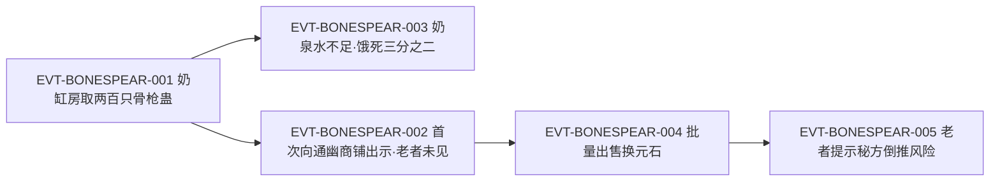

# 骨枪蛊

白骨山奶泉缸里的**量产基础件**：大小如食指、一头圆润一头尖锐、通体皆白，类似古月山寨的月刃蛊。原文一句把它钉死在一转——「此蛊虽是一转，但是架不住量多。」它的价值不在单只威力，而在**数量**；代价也来自数量：以奶水为食，一大缸的消耗要接泉眼活水才供得上。

本页是 2026-09-28 血道／骨道批次的**新建页**，也是本批要求**双边登记**的两页之一（另一页为[血气蛊](blood-atk-3-03-gu.md)）。全书穷举扫描"骨枪蛊"：命中 **42 行**（清单见《资料整理》）。本页的核心任务是把 `roster-3.md` 标记的"双口径"回原文裁清：**骨枪蛊＝一转 `[已确认]`**，两处"三转"证据均属他指。

## 主题档案

### 一、名目与转数裁清（本页首要任务）

#### 原著事实

- 形态与命名：「这些蛊，大小如常入食指，通体皆白。一头圆润，一头尖锐，如微型长枪。」`E:V2-038974`；「这便是骨枪蛊。」`E:V2-038976`。
- **转数明文**：「“此蛊虽是一转，但是架不住量多。这个大缸中，几乎盛满了这种蛊虫。”白凝冰有些兴奋地道。」`E:V2-038978`——紧邻 `E:V2-038976` 与 `E:V2-038980` 均以"骨枪蛊"为主语，指代唯一。
- 进阶件是二转，且为**独立一行点明**：「“你再翻翻看，这缸中应该还有二转的蛊。”方源站在一旁，神情平淡。」`E:V2-038984`；「白凝冰捞了几次，终于发现了二转蛊。」`E:V2-038986`；「此蛊和骨枪蛊类似，但是骨枪表面，有着螺旋刻纹——螺旋骨枪蛊。」`E:V2-038988`。
- **原文中"三转"字样的两处真实所指**：
  - 其一：白凝冰的遗憾——「“可惜没有三转蛊。”」`E:V2-039000`；紧接的复述把缸中最高只到二转写实：「不过这种二转的蛊，对她来讲，只图一个新奇。」`E:V2-039002`（「这种二转的蛊」指螺旋骨枪蛊）。
  - 其二：**骨刺蛊**（另一种蛊）——老者「取出骨刺蛊，接着介绍一番」`E:V2-047290`，随后「“此蛊是三转蛊，但伤敌一千自损八百……”」`E:V2-047292`。骨刺蛊另有独立名目与独立转数，见同批 `roster-3.md` 中 `bone_atk_3_03_gu | 骨刺蛊 | 3`。
- 被误读为"二转骨枪蛊"的那一句：「“这是二转蛊，似乎是骨枪蛊的……”老者脸色浮现出惊异的神色。」`E:V2-047276`——此句发生在老者端详**螺旋骨枪蛊**之时：「“不忙，且再看这只蛊。”方源微微一笑，唤出一只螺旋骨枪蛊。」`E:V2-047274`；老者的话由方源补完：「“不错，骨枪蛊合炼成功，就可得到螺旋骨枪蛊。它具有一股钻劲，威力较为可观。”」`E:V2-047278`。
- 进阶关系再述：「此蛊是骨枪蛊的进阶，激射出去，攻击更高，比骨枪蛊的直射多出一股钻劲。」`E:V2-038990`。
- 缸内构成：「大缸中，骨枪蛊占据绝大多数，只有少部分的螺旋骨枪。」`E:V2-038992`。
- **第二处一转明文（商业化段，独立于 `E:V2-038978`）**：商铺老者当场试演后评价——「这枚蛊，虽然只是一转，养的也不太好。但攻击不俗，又奇特，可值这个数。」`E:V2-047234`。

#### 合理推导

此为 `roster-3.md` 的「裁定已改」节 `bone_def_3_01_gu` 条目（2026-09-28 由「命名碰撞待核」移入，原文转＝1）登记的"命名碰撞待核（双口径）"的**裁定**，两口径与逐字证据如下。

- **口径A（转"三"读法）**：`roster-3` 与派发单把 `bone_def_3_01_gu` 的骨枪蛊记为**三转**，并在约 `E:V2-039000` 处取"三转"字样为据。**该读法不成立于本页**：`E:V2-039000` 的"三转蛊"是**缸中并不存在的那种蛊**（「可惜没有三转蛊」），`E:V2-047292` 的"三转蛊"则是**骨刺蛊**。两处都不是对骨枪蛊转数的陈述。
- **口径B（转"二"读法）**：把 `E:V2-047276` 的「这是二转蛊，似乎是骨枪蛊的……」读作"骨枪蛊是二转"。**该读法亦不成立于本页**：`E:V2-047274` 已先行交代方源唤出的是**螺旋骨枪蛊**，`E:V2-047276` 的"二转蛊"即指此物；且该句被原文自身在 `E:V2-047278` 补完为「骨枪蛊合炼成功，就可得到螺旋骨枪蛊」，明确把二转定位在**进阶件**上。
- **本页裁定（逐字证据）**：**骨枪蛊＝一转 `[已确认]`**，依据 `E:V2-038978`（「此蛊虽是一转」）；**螺旋骨枪蛊＝二转 `[已确认]`**，依据 `E:V2-038986`、`E:V2-047276`、`E:V2-039002`。
- **当前状态（2026-09-28 已落地）**：口径A／口径B 均为**指代错位**（分别错到"缸中不存在的三转蛊"与「螺旋骨枪蛊」），属**历史上的指代错位，已被更正**；本页保留两口径的原样登记以备复核，但页面事实区只采用"骨枪蛊一转／螺旋二转"。
- **不确定性**：`E:V2-039000` 的「可惜没有三转蛊」证明该缸最高只到二转，**不**证明整个白骨传承没有三转蛊——三转骨刺蛊即出现在同一段剧情后文（`E:V2-047290`、`E:V2-047292`）。

#### 《问真》设计意义

- 这是一次典型的**指代错位型数据污染**：两处"N 转"字样都出现在骨枪蛊的近邻句，但一句的主语是"没有的那种蛊"，另一句的主语是同族的骨刺蛊。凡是靠**关键词邻近**抽取转数的流程都会出错；必须回到句法主语。
- 配方台词「骨枪蛊合炼成功，就可得到螺旋骨枪蛊」`E:V2-047278` 是一句**可执行的升阶规则**，比属性描述更适合直接落成设计。

### 二、形态与传承定位：白骨传承的基础之物

#### 原著事实

- 形态：`E:V2-038974`（大小如食指、通体皆白、一头圆润一头尖锐如微型长枪）。
- 类比与定位：「骨枪蛊，就类似于古月山寨的月刃蛊。属于这道白骨传承的基础之物。」`E:V2-038980`
- 传承所在与供给条件：白骨山一带被前世百家「开发了五个奶泉眼」，「使得奶泉成为了百家的特产，不仅供应自身，而且还作为商品交易」`E:V2-038960`。
- 缸的供给结构：「别看这奶泉水满满一缸，其实消耗巨大。皆因缸底联通了一处泉眼活水，才至如此。」`E:V2-039032`；「方源若要养活这么多的蛊，除非自己拥有一口奶泉。」`E:V2-039034`。
- 族中人的识别：「“这应该是骨枪蛊……还有螺旋骨枪蛊。”旋即就有家老认出此蛊。」`E:V2-039296`。

#### 合理推导

- **依据**：`E:V2-038980`＋`E:V2-038960`；**结论**：白骨传承的**可复制性依赖奶泉这一地理资源**（前世百家开发五口奶泉眼，并把奶泉做成可自用、也可交易的特产），因此这套蛊的产出上限是**资源上限**而非工艺上限；类月刃蛊的定位说明它在传承里的角色就是"人手一只的制式件"；**不确定性**：一份奶泉能供养多少只、泉眼是否可再生，原文未给。
- **依据**：`E:V2-039032`＋`E:V2-039034`；**结论**：奶缸是**基础设施**（联通活水泉眼），不是容器；脱离奶泉则只能「舍弃一些，供应给剩下的蛊虫」`E:V2-042736`；**不确定性**：原文未写断奶致死时长（只写会饿死）。

#### 《问真》设计意义

- "基础件＋地理资源"是很好的**势力特征**设计：百家的辨识度不来自某只强力蛊，而来自**能供养一支骨枪蛊部队**的奶泉体系。势力差异宜由资源与后勤定义，而非只靠独有强力件。
- 类比月刃蛊（古月山寨）给出了**同生态位跨势力对照**：不同势力各有一套"制式基础件"，这是可直接复用的世界构建模板。

### 三、百家装备史：从传承物到族徽式标志

#### 原著事实

- 「前世百家发现了这处传承之后，族中大量的蛊师，都装备了此蛊。骨枪蛊也成了百家蛊师的一个特征。」`E:V2-038982`
- 量产与囤积：「方源和白凝冰冲刺途中，不约而同地催动螺旋骨枪蛊。」`E:V2-047924`；方源空窍「大量的骨枪蛊、螺旋骨枪蛊」`E:V2-040528`、`E:V2-040814`。
- 持有量级：「方源的空窍中多了两百只的骨枪蛊，二十多只的螺旋骨枪蛊。」`E:V2-039016`。
- 常规手段的自评：「“如此一来，我总算有一种常规稳定的进攻手段了。”方源捏着一只螺旋骨枪蛊，心道。」`E:V2-039894`
- **现世身份：商铺老者从未见过，判为「灰骨才子的独门蛊虫，从不在市场上流通」**——「言罢，唤出一枚骨枪蛊。」`E:V2-047218`；「他捏住骨枪蛊，只看了地一眼，脸上就不由地流露出一丝惊诧之色。」`E:V2-047222`；「骨枪蛊他从未见过。」`E:V2-047224`；「这是灰骨才子的独门蛊虫，从不在市场上流通。」`E:V2-047228`。
- 方源的自陈（对外口径）：「好说，这名为骨枪蛊，乃是一族蛊虫。我借给你用，你试试手便知。」`E:V2-047232`
- 传承主身份可查：白骨传承之主为灰骨才子，其「资质不高，一生修行都为此感到苦恼」`E:V2-039824`，「不过是四转蛊师」`E:V2-041048`；他「心志很大，想研炼出一种能够广泛运用的优良蛊虫」`E:V2-039830`，「于是这灰骨才子就有了一个奇妙的构想」`E:V2-039852`，但「在最关键的地方无奈止步」`E:V2-039862`，只留下「不妨尝试炼制，不管结果如何，请在我的坟前倾述一声。」`E:V2-039870`；且其成果「也只是理论上的研究，从未使用过的经验」`E:V2-040884`。

#### 合理推导

- **依据**：`E:V2-038982`；**结论**：骨枪蛊的"标志性"来自**装备率**而非单体强度；一个家族大量装备同一只一转蛊，说明其可量产、成本低、门槛低——三条都与"一转＋奶水饲养"自洽；**不确定性**：百家装备的是骨枪蛊还是螺旋骨枪蛊为主，原文用"此蛊"泛指，未分列数量。
- **依据**：`E:V2-039894`；**结论**：方源把螺旋骨枪蛊定义为「常规稳定」而非"强力"，说明这套体系的自我定位是**基底输出**，高阶输出另有其蛊；**不确定性**：原文未给「常规稳定」对应的量化强度。

#### 《问真》设计意义

- "族徽式量产件"允许做**势力专属基础装备**：同一转数下用外观与后勤差分化，而不是数值差分化。这种设计能解释为什么一个家族的蛊师看起来都像一家人，同时不破坏转数平衡。
- 一转可量产、二转需合炼、三转另有其蛊——这条**阶梯**给出了清晰的装备代际，宜按此建阶梯而非让一只蛊跨多等级通用。

### 四、进阶件：螺旋骨枪蛊

#### 原著事实

- 形制差异：「此蛊和骨枪蛊类似，但是骨枪表面，有着螺旋刻纹——螺旋骨枪蛊。」`E:V2-038988`
- 效果增量：「此蛊是骨枪蛊的进阶，激射出去，攻击更高，比骨枪蛊的直射多出一股钻劲。」`E:V2-038990`
- 升阶规则台词：「骨枪蛊合炼成功，就可得到螺旋骨枪蛊。」`E:V2-047278`
- 数量构成：缸中「骨枪蛊占据绝大多数，只有少部分的螺旋骨枪。」`E:V2-038992`；方源所得为 200 : 20 余（`E:V2-039016`）。
- 实战形态：「一只螺旋骨枪陡然射出，冲天而上。」`E:V2-044898`（独立成行点题于 `E:V2-044896`）。
- 复用为杀招件：「第三件，则是螺旋钻星枪。顾名思意，这是用于攻伐的杀招。需要少量的螺旋骨枪蛊，一些星河蛊，无数星镖蛊，大量的流星蛊等。」`E:V4-123804`

#### 合理推导

- **依据**：`E:V2-047278`＋`E:V2-038990`；**结论**：进阶是**属性增量＋机制增量**双给——攻击更高（数值）＋多一股钻劲（机制），且机制描述与形制（螺旋刻纹）一致；**不确定性**：钻劲对何种防御有效、是否穿透，原文未写。
- **依据**：`E:V4-123804`；**结论**：螺旋骨枪蛊从"单体装备"升格为**杀招的组成材料**，说明低阶量产件在后期仍有体系位（这正是它被大量囤积的原因之一）；**不确定性**：原文未给该杀招其它材料的具体数量配比（只给"少量／一些／无数／大量"的量级词）。

#### 《问真》设计意义

- "外形即机制"在这里成立了：螺旋刻纹→钻劲。设计上应让外观变化承载机制标签，而不是纯皮肤。
- 低阶件进入高阶杀招配方（`E:V4-123804`）是一条重要的**经济设计**：它让前期囤积的量产件在后期的材料需求中获得价格支撑，解释了原文里「卖也就卖了」与「留一只备用」的并置判断。

### 五、饲养成本与空窍负担

#### 原著事实

- 食料明文：「骨枪蛊、螺旋骨枪蛊，都是以奶水为食。因此被养在这处奶缸之中。」`E:V2-039030`
- 消耗规模：「别看这奶泉水满满一缸，其实消耗巨大。」`E:V2-039032`；「方源若要养活这么多的蛊，除非自己拥有一口奶泉。」`E:V2-039034`
- 断供即死：方源「只能舍弃一些，供应给剩下的蛊虫」`E:V2-042736`；「为了喂养空窍中的骨枪蛊，方源已经尽了全力。但即便如此，已经饿死了三分之二的骨枪蛊了。」`E:V2-043270`
- 空窍负担：「他的空窍只是一转高阶的程度，又装载了数百只的骨枪蛊，如今再装载雪银真元，就有不堪重负的危险了。」`E:V2-040946`；处置方式是「将空窍中的骨枪蛊，都移到白凝冰的空窍当中去」`E:V2-040958`。
- 持有规模的自我约束：「这些蛊，方源和白凝冰用一只就足够了，顶多再留一只备用吧。」`E:V2-042000`；「其他的如果不卖出去，只能烂在手中，甚至还要耗费大量的奶水来养活它们。」`E:V2-042000`

#### 资源与代价（支付方／受益方／时点）

- **支付方**：**持有者**。支付两种资源：①**奶水（后勤）**——每只蛊持续消耗，量级达「除非自己拥有一口奶泉」`E:V2-039034`，断供则"饿死"`E:V2-043270`；②**空窍容量（结构性）**——数百只即令一转高阶空窍「不堪重负」`E:V2-040946`。
- **受益方**：**持有者**。收益是「常规稳定的进攻手段」`E:V2-039894`，且以**数量**换效能（「此蛊虽是一转，但是架不住量多」`E:V2-038978`）。
- **支付时点**：**分两种性质**——奶水是**持续持有成本**（长期、按日发生，`E:V2-042000`）；空窍容量是**占用型成本**（只要装载就持续占用，`E:V2-040946`）。两者都与"是否使用"无关。
- **成本的可转移性**：容量成本**可转移**——把蛊「移到白凝冰的空窍当中去」`E:V2-040958`；奶水成本**不可转移**，仍需喂养。
- **额外成本项**：抛售虽回收元石（`E:V2-047252`），但「物以稀为贵，骨枪蛊、螺旋骨枪蛊、骨刺蛊，不仅他有，百家也有。卖也就卖了。」`E:V2-047308`——**独特性为零**，这是它作为商品的隐性代价。

#### 合理推导

- **依据**：`E:V2-043270`＋`E:V2-040946`；**结论**：这套蛊的**真实瓶颈是后勤与容量，不是强度**；"一架不起量"的悖论（单只一转、量多才强、量多又喂不起、装载又超容）是原文刻意写出的取舍；**不确定性**：饿死所需时长、空窍容量的计量单位（以何种单位承载多少只）原文均未给。
- **依据**：`E:V2-042000`；**结论**：原文给出的**最优保有量约 1–2 只**，其余应出清——这是对"量产件"的自我克制，理由明写为奶水消耗；**不确定性**：该结论出自方源个人算式，未写成普遍规律。

#### 《问真》设计意义

- 可直接实现为**双资源成本**：喂养（消耗型资源，持续）＋容量（占位型资源，占用）。两者分离后，玩家可以"把蛊挪到队友空窍"来腾容量，但仍要承担喂养——这条规则与原文完全对应（`E:V2-040958`、`E:V2-042000`）。
- "单只弱、量多强、量多养不起"是极适合做**阈值决策**的机制：最优保有量存在且可被玩家算出，而不是无脑堆量。

### 六、商品化：定价、批量出清与秘方倒推风险

#### 原著事实

- 市价锚点：「普通的一转蛊，大约在二百五十块元石左右。」`E:V2-047248`；珍稀一转蛊（酒虫等）「五百八十块元石」以上`E:V2-047246`。
- 定价与成交：「将骨枪蛊的卖价，定为三百一十，已经算是不错。通幽商铺的这个老者，没有胡乱压价。」`E:V2-047252`；「一枚骨枪蛊，三百二十块元石。」`E:V2-047260`。
- 批量与总额：「事实上，方源在白骨山时，足足取了两百只骨枪蛊。」`E:V2-047268`；「“五十六只蛊，那就是一万七千九百二十枚元石。”」`E:V2-047272`；螺旋骨枪蛊报价「七百八十块」`E:V2-047280`、「空窍中有二十只」`E:V2-047284`、「卖出了一万六千块元石的价」`E:V2-047286`。
- 倒推风险明写：「贵客，您卖了这么多的骨枪蛊，其实我们也可以雇佣秘方大师，来倒推您的秘方。」`E:V2-047344`
- 商铺侧的算盘：「对于通幽商铺来讲，有了秘方，就代表骨枪蛊等等，能不断地制造出来。」`E:V2-047330`
- 基础件地位被第三方确认：「商睚眦只知道骨枪蛊、螺旋骨枪蛊等，查看了秘方后，发现不少其他的秘方，都是以骨枪蛊为基础的……」`E:V2-048502`
- 出清结果：「原先一片惨白的骨枪蛊、螺旋骨枪蛊，已经被贩卖一空。」`E:V2-049868`

#### 合理推导

- **依据**：`E:V2-047252`＋`E:V2-047248`；**结论**：骨枪蛊定价（310–320）**高于普通一转蛊均价（约 250）**，介于普通与珍稀（580+）之间，落位与它的"一转但传承产物、可量产"身份一致；**不确定性**：报价含议价过程，未必等于全市场价格。
- **依据**：`E:V2-047344`＋`E:V2-047330`；**结论**：**秘方可被倒推**是原文明确的商业风险，且**批量出售本身加大暴露**（「您卖了这么多」）；因此"卖数量"与"保秘方"在原文内部构成对立面；**不确定性**：倒推所需成本（雇佣秘方大师的代价）原文未给。
- **依据**：`E:V2-048502`＋`E:V4-123804`；**结论**：以骨枪蛊为基础的其他秘方"不少"，即它是**多配方的公共前置件**——这正是它可以长期批量出货的支撑；**不确定性**：具体有多少条后续秘方依赖它，原文未列。

#### 《问真》设计意义

- "批量出货→秘方被倒推→稀缺性丧失"是一条少见的**经济反噬机制**，可直接落成：玩家卖得越多，外部仿制风险越高。它把"卖素材"从纯收益动作变成有对价的决策。
- "公共前置件"定位解释了这类基础蛊为何值得长期保留产线：它的需求来自**其他配方**，而不只是战斗。

## 状态时间线

| 状态 ID | 阶段 | 状态 | 证据 |
|---|---|---|---|
| ST-BONESPEAR-01 | 转数明文 | 白凝冰在奶缸前点明「此蛊虽是一转，但是架不住量多」，缸中几乎盛满；后市集老者亦称「虽然只是一转」 | E:V2-038974、E:V2-038976、E:V2-038978、E:V2-047234 |
| ST-BONESPEAR-02 | 传承定位 | 被定义为「这道白骨传承的基础之物」，类比古月山寨的月刃蛊 | E:V2-038980 |
| ST-BONESPEAR-03 | 装备史 | 前世百家发现传承后大量装备，骨枪蛊成为百家蛊师的一个特征 | E:V2-038982 |
| ST-BONESPEAR-04 | 进阶件 | 缸中另有二转蛊＝螺旋骨枪蛊，带螺旋刻纹；为骨枪蛊的进阶，多出一股钻劲 | E:V2-038984、E:V2-038986、E:V2-038988、E:V2-038990 |
| ST-BONESPEAR-05 | 缸内上限 | 白凝冰遗憾「可惜没有三转蛊」；缸中最高为「这种二转的蛊」（螺旋骨枪蛊） | E:V2-039000、E:V2-039002 |
| ST-BONESPEAR-06 | 取得 | 方源空窍中多了两百只骨枪蛊、二十多只螺旋骨枪蛊；自评「总算有一种常规稳定的进攻手段」 | E:V2-039016、E:V2-039894 |
| ST-BONESPEAR-07 | 饲养条件 | 以奶水为食、养在奶缸；缸底联通泉眼活水，消耗巨大；需自有奶泉方能养活 | E:V2-039030、E:V2-039032、E:V2-039034 |
| ST-BONESPEAR-08 | 空窍负担 | 一转高阶空窍装载数百只骨枪蛊后再接引真元「不堪重负」；处置为移入白凝冰空窍 | E:V2-040946、E:V2-040958 |
| ST-BONESPEAR-09 | 断供饿死 | 奶泉水不足只能舍弃部分；即便尽力喂养，已饿死三分之二 | E:V2-042736、E:V2-043270 |
| ST-BONESPEAR-10 | 最优保有量 | 用一只足够、顶多再留一只备用，其余不卖只能烂在手中并耗费奶水 | E:V2-042000 |
| ST-BONESPEAR-11 | 商业化 | 定价三百一十至三百二十元石（普通一转蛊约二百五十）；批量卖出五十六只；螺旋骨枪蛊报价七百八十 | E:V2-047248、E:V2-047252、E:V2-047260、E:V2-047272、E:V2-047280 |
| ST-BONESPEAR-12 | 二转指代行 | 老者端详螺旋骨枪蛊称「这是二转蛊，似乎是骨枪蛊的……」；方源补完升阶规则 | E:V2-047274、E:V2-047276、E:V2-047278 |
| ST-BONESPEAR-13 | 秘方倒推风险 | 商铺明言可雇佣秘方大师倒推秘方；他人查看秘方后确认「不少其他的秘方，都是以骨枪蛊为基础的」 | E:V2-047344、E:V2-048502 |
| ST-BONESPEAR-14 | 杀招复用与出清 | 螺旋钻星枪需少量螺旋骨枪蛊；空窍中的骨枪蛊与螺旋骨枪蛊被贩卖一空 | E:V4-123804、E:V2-049868 |

## 原著明确内容（本批取证窗口登记）

本批对"骨枪蛊"在根原文全书穷举扫描：命中 **42 行**——38976、38980、38982、38988、38990、38992、38994、39000、39016、39030、39296、40528、40814、40946、40958、41998、42736、43270、44896、47218、47222、47224、47232、47252、47260、47268、47272、47274、47276、47278、47284、47308、47318、47330、47344、47402、47924、47928、48502、48504、49868、123804。下表登记本批实际读取的窗口（含为裁定转数与后勤成本而额外读取的邻行窗口）。

| 窗口 | 内容要点 | 用途 |
|---|---|---|
| 38932–38962 | 白骨山与奶泉来历：泉水如奶、百家开发五个奶泉眼，奶泉成为百家特产与商品 | 主题二 |
| 38974–38994 | 形态、命名、转数明文（一转）、传承定位、百家装备史、螺旋进阶与缸内构成 | 主题一、二、三、四 |
| 39000–39002 | 「可惜没有三转蛊」；缸中最高为二转（螺旋骨枪蛊），不足以发挥三转蛊师实力 | 主题一 |
| 39012–39016 | 方源取得两百只骨枪蛊、二十多只螺旋骨枪蛊 | 主题三 |
| 39030–39034 | 以奶水为食、养在奶缸；缸底联通泉眼活水；需自有奶泉方能养活 | 主题五 |
| 39290–39300 | 家老认出骨枪蛊、螺旋骨枪蛊；灰骨才子传承被家老确认为正道传承 | 主题二、三 |
| 39824–39872、40882–40884、41048 | 灰骨才子的资质、执念、构想与"只是理论上研究"的自认 | 主题三（身份侧） |
| 40524–40528、40810–40814 | 空窍中囤积大量骨枪蛊与螺旋骨枪蛊 | 主题三 |
| 40940–40962 | 一转高阶空窍装载数百只骨枪蛊后接引真元「不堪重负」；移入白凝冰空窍 | 主题五 |
| 41994–42000 | 保有量判断：用一只足够、顶多留一只备用；不卖则烂在手中且耗奶水 | 主题五（代价三要素） |
| 42730–42736、43266–43274 | 奶泉水不足只能舍弃；已饿死三分之二的骨枪蛊 | 主题五 |
| 44896–44898、47918–47932 | 螺旋骨枪蛊实战射出；冲刺途中不约而同催动 | 主题四 |
| 47216–47236 | 老者首次见到骨枪蛊：从未见过、判为灰骨才子独门且不流通；第二处一转明文与「养的也不太好」 | 主题一、三 |
| 47246–47292 | 市价锚点与定价、批量成交、螺旋骨枪蛊报价、骨刺蛊（三转）登场 | 主题一、六 |
| 47308–47344、47398–47406 | 独特性为零（百家也有）；秘方倒推风险明写；到商家城不愁食料、可「多养几天这些骨枪蛊」 | 主题五、六 |
| 48502–48504 | 不少其他秘方以骨枪蛊为基础；一并抛售骨枪蛊、螺旋骨枪蛊、骨刺蛊 | 主题六 |
| 49864–49868 | 骨枪蛊、螺旋骨枪蛊被贩卖一空 | 主题六 |
| 123804 | 螺旋钻星枪杀招需少量螺旋骨枪蛊 | 主题四、六 |

## 事件链

| 事件 ID | 事件 | 参与者 | 证据 | 因果 |
|---|---|---|---|---|
| EVT-BONESPEAR-001 | 方源与白凝冰进入白骨山奶缸房，取走两百只骨枪蛊与二十余只螺旋骨枪蛊 | 方源、白凝冰 | E:V2-038974、E:V2-038978、E:V2-039016 | enables ST-BONESPEAR-06 |
| EVT-BONESPEAR-002 | 方源初次向通幽商铺出示骨枪蛊，老者从未见过、判其为灰骨才子独门且不流通，当场议价 | 方源、通幽商铺老者 | E:V2-047218、E:V2-047224、E:V2-047228、E:V2-047232、E:V2-047234 | evidences ST-BONESPEAR-01、ST-BONESPEAR-11 |
| EVT-BONESPEAR-003 | 奶泉水不足，方源舍弃部分蛊以保其余，仍饿死三分之二 | 方源 | E:V2-042736、E:V2-043270 | evidences ST-BONESPEAR-09 |
| EVT-BONESPEAR-004 | 方源在通幽商铺向老者批量出售骨枪蛊与螺旋骨枪蛊，换得元石 | 方源、通幽商铺老者 | E:V2-047252、E:V2-047272、E:V2-047286 | evidences ST-BONESPEAR-11 |
| EVT-BONESPEAR-005 | 老者提示雇佣秘方大师倒推秘方的风险 | 通幽商铺老者 | E:V2-047344 | evidences ST-BONESPEAR-13 |

事件口径：本页沿用实体簇号 `EVT-BONESPEAR-*`。事件节点 5 个（≥3），按模板配图。图分两支：**取蛊线**（001→003，同一趟携带中的损耗）与**经商线**（001→002→004→005，持有是出示与出售的前提，002→004 为同一笔议价的先后，004→005 为成交后老者的提示）。两支之间只共享"持有骨枪蛊"这一条件，不构成跨线因果。

## 资料整理

本页为**新建页**，无旧版可对；本批来源只有根原文，未引入 `notes:`／`memory:` 层转述。派生记录处置（**本段内容不得当作原著事实**）：

- `roster-3.md` 的「裁定已改」节 `bone_def_3_01_gu` 条目（2026-09-28 由「命名碰撞待核」移入，原文转＝1）登记为"骨枪蛊……命名碰撞待核（双口径）"，并给出"三转（约 39000 处）""二转蛊疑似骨枪蛊（47276）"两条口径。本页复核结论：**两条口径均为指代错位**——39000 处的"三转蛊"是缸中不存在者，47276 处的"二转蛊"是螺旋骨枪蛊；逐字裁定见主题一。**2026-09-28 复核（已落地）**：原记"三转／二转双口径"更正为**指代错位**——骨枪蛊＝一转（`E:V2-038978`），螺旋骨枪蛊＝二转（`E:V2-038986`、`E:V2-047276`）；原两条口径按标注式保留、不删除。
- 派发单给 `bone_def_3_01_gu` 的**首现锚点写作 `E:V2-047276`**，与原文不符：骨枪蛊的**首次出现是 `E:V2-038974`–`E:V2-038978`**（白骨山奶缸房），47276 只是商业化段的二转指代行。本页登记该差异，不改他页。
- `roster-3.md` 的「一致」节另有 `bone_atk_3_03_gu | 骨刺蛊 | 3`，其独立首现锚点在该表为 `E:V2-039150`（「方源从颅中取出一蛊，是一只三转的骨刺蛊。」`E:V2-039150`）。本页据此把 `E:V2-047292` 的「此蛊是三转蛊」判归**骨刺蛊**，与骨枪蛊区分。
- `roster-3.md` 的「转数未核」节 `2转` 清单列有**螺旋骨枪蛊**（2026-09-28 由 3转 移入，二转明文 `E:V2-047276`）。本页复核认为该条同样需要修正：原文三处（`E:V2-038986`、`E:V2-039002`、`E:V2-047276`）均把螺旋骨枪蛊写作**二转**。螺旋骨枪蛊在本批**没有分配页面 id**，故此处只登记、不越界处理。
- 子串／误切复核：42 处"骨枪蛊"命中**含子串情形**（"螺旋骨枪蛊"即含"骨枪蛊"子串，如 `E:V2-047924`、`E:V4-123804`），本页已与螺旋骨枪蛊**分列**、未合并计数；未见「合炼蛊虫」式为短语误切的情形；`E:V2-047264` 为一处**错字行**（写成"官枪蛊"），本页不据其立论，仅登记备查。
- 桥接层（`game/data/gu_lore.json`、`game/docs/lore/canon-index.md`）按 L0 本轮口径只作消费层。本页**不声明 `canon-index` 字段、不新建 CAN ID**，`game/**` 只读、不在本批改动范围；本页**不写任何第二份游戏数值**。

- 本页引号规范（便于复核）：角引号（U+300C／U+300D）只用于**可逐字回溯到原文行**的引文；分析用词、拼合名目与表格字段名一律用 `"…"`，不放进引文位置。

## 分析与解读

1. **骨枪蛊是"数量型装备"的教科书样本**：原文把它的强弱直接写成数量的函数（`E:V2-038978`），而不是单只属性。因此它的三件套——**一转底子、奶水后勤、空窍容量**——必须一起看：任何一条被放宽，它都会从"量多成灾"变成"便宜好用无代价"。
2. **两处"三转"恰是全书最容易污染数据的两类错位**：一类是**否定语境下的词**（「可惜没有三转蛊」，`E:V2-039000`），另一类是**同族近邻的另一种蛊**（骨刺蛊，`E:V2-047292`）。抽取流程若只做关键词邻近匹配，就会把这两类词都记到骨枪蛊头上——这正是 `roster-3` 双口径的来源。
3. **"螺旋刻纹→钻劲"是外形携带机制的范例**（`E:V2-038988`、`E:V2-038990`）：进阶件的差异被写成可见的形制差异，而不是只在说明文里的属性差。这类写法天然适合可视化。
4. **这套蛊在后期的价值来自配方而非战斗**：它出现在「不少其他的秘方」里（`E:V2-048502`）并成为杀招组成件（`E:V4-123804`）。因此原文让方源「卖也就卖了」（`E:V2-047308`）的底气不是强度，而是**它的需求方很多、独特性为零**。
5. **秘方倒推是本页最硬的经济机制**：`E:V2-047344` 直接写出"卖了这么多 → 可以雇佣秘方大师倒推"。它把"出货量"与"知识稀缺"绑成一条负相关曲线，比常见的固定售价更有设计张力。
6. **与[血气蛊](blood-atk-3-03-gu.md)对照**：两页各自撞上同一种病——**名称／指代层与实体层混用**。血气蛊是"同名双写（血气蛊／血气仙蛊）"，骨枪蛊是"近邻指代（三转/二转）"。两页都只能页级登记，不足以提全局升级（本批同类结构问题需 ≥5 页才升级）。
7. **"独门"与"成为一族特征"构成一条完整的传播弧**：此蛊出自灰骨才子的白骨传承，市集老者初判「从不在市场上流通」`E:V2-047228`；而前世百家发现该传承后「族中大量的蛊师，都装备了此蛊。骨枪蛊也成了百家蛊师的一个特征。」`E:V2-038982`——一只**从未流通的独门蛊**，最终变成**一个家族的外观标记**。而传承主生前的执念恰是「想研炼出一种能够广泛运用的优良蛊虫」`E:V2-039830`：他的遗藏以他自己未能实践的方式达成了他的心愿。这条弧是骨枪蛊最有叙事价值的部分，纯数值化的页面会完全丢失它。
8. **第二处一转明文的措辞值得注意**：老者说「虽然只是一转，养的也不太好。但攻击不俗，又奇特」`E:V2-047234`——同一只蛊，白凝冰的评价是「架不住量多」`E:V2-038978`，老者的评价是「攻击不俗，又奇特」。两者不冲突：前者讲**阵容效应**，后者讲**单只品相**；而「养的也不太好」还说明**饲养状态会进入交易定价**，与主题五的双资源成本互为印证。

## 待核对

- **已落地 2026-09-28**：本页转数裁定"骨枪蛊＝一转／螺旋骨枪蛊＝二转"已落地（`E:V2-038978`；`E:V2-038986`、`E:V2-047276`）；`roster-3.md` 的「裁定已改」节 `bone_def_3_01_gu` 条目（2026-09-28 由「命名碰撞待核」移入，原文转＝1）的"三转／二转双口径"经复核为**指代错位**，原记按标注式保留。
- `[已确认]` **骨枪蛊本体转数＝一转**：`E:V2-038978`（「此蛊虽是一转」）。**口径A（三转读法）**：据约 `E:V2-039000` 邻域的"三转"字样（`roster-3` 采此）；**口径B（二转读法）**：据 `E:V2-047276`「这是二转蛊，似乎是骨枪蛊的……」；**本页裁定**：A 的主语是"缸中没有的那种蛊"`E:V2-039000`，B 的主语是螺旋骨枪蛊 `E:V2-047274`、`E:V2-047276`、`E:V2-047278`，**两口径均不成立**。**当前状态**：已裁定为一转，两口径原样留档备核。
- `[已确认]` **螺旋骨枪蛊＝二转**：`E:V2-038986`、`E:V2-039002`、`E:V2-047276`。与 `roster-3.md` 原 `3转` 清单"螺旋骨枪蛊｜3 转"的旧记冲突（2026-09-28 该条目已移入「转数未核」节 `2转` 清单，二转明文 `E:V2-047276`），本页只登记（螺旋骨枪蛊本批无页面 id）。
- `[原著未明确]` **数值类缺口（机制已确认、数值未知 → 拆条）**：机制 **[已确认]** ＝一转骨枪蛊为基础件、可合炼升为二转螺旋骨枪蛊、以奶水为食、量多则战力可观（`E:V2-038978`、`E:V2-039030`、`E:V2-047278`）；具体数值 **[待取证]** ＝单只攻击力、射程、破防方式、每只日耗奶水量、空窍容量与只数的换算单位。
- `[原著未明确]` **断食阈值**：只写会"饿死"`E:V2-043270`、需舍弃部分以保其余`E:V2-042736`，未写断奶多久致死、饿死是否有过程征兆。
- `[原著未明确]` **「架不住量多」的机制**：`E:V2-038978` 是修辞性表述，`E:V2-039894` 只给「常规稳定的进攻手段」的自评；数量与总输出之间是线性还是阈值关系，原文未给。
- `[原著未明确]` **钻劲的作用对象**：`E:V2-038990` 只写「攻击更高，比骨枪蛊的直射多出一股钻劲」；钻劲是否破防、对何种蛊或护体有效，未见。
- `[原著未明确]` **百家装备的具体构成**：`E:V2-038982` 用"此蛊"泛指，未区分骨枪蛊与螺旋骨枪蛊各自的装备量。
- `[待取证]` **骨枪蛊与白骨传承其他蛊的层级关系**：原文称其为「基础之物」`E:V2-038980`，同传承另有骨刺蛊（三转，`E:V2-047292`、`E:V2-039150`）；传承是否另有更高层蛊，本页扫描范围内未见系统清单。
- `[存在冲突]` **"独门蛊虫"与「百家也有」两个口径**：**口径A**：市集老者初见此蛊时判为「这是灰骨才子的独门蛊虫，从不在市场上流通。」`E:V2-047228`（同段另写「骨枪蛊他从未见过。」`E:V2-047224`）；**口径B**：方源出售时的自述是「物以稀为贵，骨枪蛊、螺旋骨枪蛊、骨刺蛊，不仅他有，百家也有。卖也就卖了。」`E:V2-047308`，且前世百家「族中大量的蛊师，都装备了此蛊」`E:V2-038982`。**当前状态**：两口径**可兼容**（「百家也有」与"不在市场上流通"不互斥），但原文两处措辞方向相反（独门／百家也有），本页按原样分别登记、不合并为单句结论，也不据此判断骨枪蛊的稀有权归属。
- `[原著未明确]` **骨枪蛊与灰骨才子传承的产出关系**：传承主生前「想研炼出一种能够广泛运用的优良蛊虫」`E:V2-039830`，但其构想被原文引向另一个目标（`E:V2-039892`「骨肉团圆蛊，是方源最重要的目标」）。骨枪蛊是其传承中的既有蛊还是其研究成果，原文未在骨枪蛊段落交代；本页**不推断**。
- `[存在冲突]` **原文自身错字**：`E:V2-047264` 写作"官枪蛊"（据上下文应为骨枪蛊：同行正在数「五十六只蛊」并结算元石，且紧邻 `E:V2-047268` 明写「足足取了两百只骨枪蛊」）。本页登记不改原文，亦不据该行立论。
- 2026-09-28：本页原按 roster-3 行号引用，因 L0 落地使该文件行号位移，已改为按 id 引用（id 为稳定键，行号不再作为定位依据）。

## 模板扩展建议（只登记，不改核心模板）

1. **需要"指代错位"的标准登记位**。`roster-3` 把"近邻句里的转数词"当成了实体属性，产生了整条双口径；本页只能在主题一里自建"口径A／口径B／本页裁定／当前状态"四段式。同批[血气蛊](blood-atk-3-03-gu.md)遇到同构问题，两页各自临时约定，建议后续统一为一个可选小节。
2. **需要"数量型装备"的表达位**。骨枪蛊的关键属性全在数量、后勤与容量上（`E:V2-038978`、`E:V2-039034`、`E:V2-040946`），现有主题三层的"原著事实"无法自然容纳"成本随数量变化"这一层，本页只能拆进主题五。
3. **`aliases` 需要能标注"进阶关系"**。螺旋骨枪蛊是**另一种蛊（二转）**而非别名，故本页**未**将其写入 `aliases`（写进去会把一转／二转差异与 200:20 的数量关系一并抹掉）。建议在 frontmatter 里允许区分"别名"与"进阶件"。

## 关联页面

[骨蛊](bone-atk-1-08-gu.md)、[血月蛊](blood-atk-3-11-gu.md)、[血气蛊](blood-atk-3-03-gu.md)、[鬼火蛊](fire-atk-2-01-gu.md)、[月芒蛊](moon-glow-gu.md)、[月光蛊](moonlight-gu.md)、[月痕蛊](moon-ray-gu.md)、[月旋蛊](light-atk-1-01-gu.md)、[骨道](../world/bone-path.md)、[蛊的饲养与炼化](../world/gu-care-and-refinement.md)、[炼蛊与杀招链](../world/gu-refine-killer-chain.md)、[真元](../world/primeval-essence.md)、[修炼体系](../world/cultivation-system.md)、[炼蛊](../rules/refinement.md)、[方源](../characters/fang-yuan.md)、[骨蛊](bone-atk-1-08-gu.md)、[蛊虫关系](gu-relations.md)、[蛊虫总表三期](roster-3.md)。
