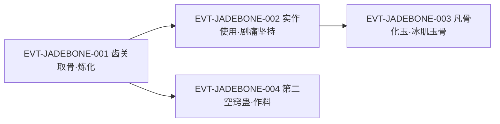

# 玉骨蛊

引文口径：`「」` 全书仅用于逐字原文引文；自造标签不用 `「」`（标有 `（概括）`／`（释义）`／`（合理推导）` 者为本批归纳，非原文）。

玉骨蛊是白骨山传承中的**骨系永久改造蛊**：把蛊师全身骨骼改造成玉一般的质地，使其更坚硬、更柔韧，并直接抬高身体对兽力的承载上限。它是一只**一次性消耗蛊**，使用时带来极剧烈的疼痛，意志不坚者会被疼死；与冰肌蛊搭配使用时效果最佳，合称「冰肌玉骨」。

本页为 2026-09-28 A 线 20 页恢复批**新建页**。全书「玉骨蛊」命中 12 处，全部落在段二（行号 35560–70252）；所有引文回根原文 `source/蛊真人-clean.txt` 逐行复核，行号即 `E:V{段}-{6位行号}`；正文按“原著事实 → 合理推导 →《问真》设计意义”三层组织。同名条目「骨蛊」是泛称、另有专页（见《资料整理》），本页只写玉骨蛊这一具体蛊。

## 主题档案

### 一、来源与形态：白骨山传承中的骨系改造蛊

#### 原著事实

- 传承内清单点名：「白骨山的传承中，有一只玉骨蛊，能增加蛊师的骨骼强度。」`E:V2-035560`；直接用途：「若是用了此蛊之后，再用鳄力蛊就没有问题了。」`E:V2-035562`
- 取出过程：「他敲开牙关，舌头吐露，现出一根骨头。」`E:V2-039716`；形态：「这根骨头，两端圆润，中间修长，通体泛绿，好似碧光玉石。」`E:V2-039718`；辨认与炼化：「玉骨蛊！」`E:V2-039720`、`E:V2-039722`
- 白骨山收获清单：「三转级数的飞骨盾，玉骨蛊、铁骨蛊，用于治疗的肉白骨，以及记载着各种合炼秘方的几本骨书。」`E:V2-040530`
- 获取机制的运气性：「但这种行为，纯粹是撞运气。齿关上下各有十颗牙齿，至少依次敲动五颗，顺序正确了，才能令牙齿尽数脱落。」`E:V2-039738`
- 同批同族的铁骨蛊（对照）：「如一根骨头，两端圆头，中段细长。通体乌黑，如同钢铁所制」`E:V2-041280`；其转数有直接明文：「这蛊还是三转蛊」`E:V2-041282`

#### 合理推导

- **依据**：`E:V2-035560`、`E:V2-035562`、`E:V2-037452`；**结论**：玉骨蛊的功能是**提高骨骼强度**，其直接的战术用途是解锁更高兽力的承载，而不是直接提高力量；**不确定性**：为何骨骼强度决定兽力承载，原文只给比喻（碗与湖，见主题二），未给换算。
- **依据**：`E:V2-039716`、`E:V2-039738`；**结论**：它的获取是“传承清单点名 + 齿关运气开箱”的组合，不是稳定掉落；**不确定性**：玉骨蛊在齿关中的位置是否固定，原文未明。

#### 《问真》设计意义

- “清单点名 + 运气开箱”是可复用的秘境结构：玩家知道目标存在（可规划），但产出不确定（有重复挑战动机）。

### 二、效果：永久性骨骼改造，并解锁兽力承载

#### 原著事实

- 效果与永久性：「玉骨蛊能改造蛊师的骨骼，形成玉一般的质地，变得更坚硬，更柔韧。这种效果是永久性的，类似黑白豕蛊、鳄力蛊。」`E:V2-039726`
- 改造前后的对比：「得了此蛊，就能令他浑身骨骼，摆脱凡胎俗骨的脆弱，使骨骼更坚硬，更坚韧。」`E:V2-037452`
- 承载的上限表述（「六转之前」皆凡胎一句系本页概括）：「就好像是一个碗，它不能装载一片湖。蛊师的躯体承载能力是有限的。」`E:V2-041448`
- 承载与增力的先后：「他现在的身子，只能承担双猪之力。用了玉骨蛊，就能在这基础上，再增添一鳄之力。」`E:V2-037452`
- 实际改造结果：「而她用了玉骨蛊之后，原先的凡骨都成了玉骨。」`E:V2-041460`
- 与铁骨蛊的同族定位：「这两只蛊，都是消耗类的蛊。各有千秋，价值不分伯仲，都能够永久地提升蛊师的身体素质。」`E:V2-041452`
- 机制 [已确认]：本蛊是一次性改造身体、收益永久的体质类蛊，可抬高兽力承载上限（`E:V2-039726`、`E:V2-037452`）。

#### 合理推导

- **依据**：`E:V2-039726`、`E:V2-041446`、`E:V2-041452`；**结论**：玉骨蛊与鳄力蛊、黑白豕蛊同属“永久性体质改造”族，分工是玉骨蛊改**承载**（骨），猪/鳄类蛊改**输出**（力）；**不确定性**：原文未给承载上限的单位或换算表，只有“双猪之力 → 再增一鳄之力”这一个定性点。
- **具体数值 [待取证]**：改造后的骨骼强度、承载上限的换算、可否叠加第二只玉骨蛊，原文均无数字或明文。

#### 《问真》设计意义

- “承载上限”比“+力量”更有结构：它能自然抑制“堆力量无成本”，也让体质类蛊拥有独立价值，而不是力量的附属。
- “先改承载、再加力量”的两段式可以直接建模为构筑前置条件（`E:V2-041448` 的“碗与湖”是现成表述资源）。

### 三、代价：一次性消耗蛊，剧痛可致人死亡

#### 原著事实

- 代价明文：「不过这玉骨蛊，却是一次性的消耗蛊。」`E:V2-039732`；「还有缺点，便是使用时会带给蛊师极其剧烈的疼痛。」`E:V2-039732`；致死记录：「很多蛊师意志力不强大，用了玉骨蛊之后，硬生生地被疼死。」`E:V2-039732`
- 事前判断：「少年，你是无知无畏，不知道这其中的痛楚。」`E:V2-041272`；安排顺序：「今晚我们就不双修了，好好养足精神，明晚我先用了那铁骨蛊。」`E:V2-041272`
- 使用现场（白凝冰）：「她这才知道，方源承受的何等剧痛！」`E:V2-041342`；「骄傲如她，也不禁痛得呻吟起来，甚至抓破了床单。」`E:V2-041344`；「但最终，她浑身颤抖地坚持到了最后。」`E:V2-041346`
- 方源代价的旁证：「白凝冰这才意识到，昨晚方源是强撑门面。」`E:V2-041336`

#### 资源与代价（支付方／受益方／时点）

- **支付方**：使用者本人——蛊本体一次性消耗（`E:V2-039732`）+ 全程剧痛耐受（`E:V2-041344`），极端情况为性命（`E:V2-039732`）。
- **受益方**：同一位使用者——永久的骨骼强度与更高的兽力承载上限（`E:V2-039726`、`E:V2-037452`）。
- **时点**：蛊在催用瞬间即消耗；痛楚贯穿改造全程且不可中断；收益在改造完成后永久生效，不因蛊亡而失（`E:V2-039726`）。

#### 合理推导

- **依据**：`E:V2-039732`、`E:V2-041452`、`E:V2-041456`；**结论**：这类蛊的代价结构是“一次性入场 + 不可中断的痛楚过程 + 完成即永久”；**不确定性**：原文未写中途放弃是否算失败、能否重来，也未写它可否与铁骨蛊先后叠用。

#### 《问真》设计意义

- “镇痛／意志”可做成可投入的资源，风险越高收益越硬（永久体质），「被疼死」则是这类蛊稀缺性的解释——稀有不是产量问题，而是存活率问题。

### 四、搭配：与冰肌蛊组成「冰肌玉骨」

#### 原著事实

- 最佳搭配：「更关键的是，玉骨蛊和冰肌蛊用来搭配使用，效果最佳。」`E:V2-039728`
- 叠加机制：「白凝冰已经有了冰肌，若是再拥有玉骨，就是“冰肌玉骨”，两者效果相互影响，有叠加之效用。」`E:V2-039730`
- 实战评定：「而她用了玉骨蛊之后，原先的凡骨都成了玉骨。冰肌、玉骨，两者交相辉映，是一种上佳的使用搭配。」`E:V2-041460`
- 同源的互斥代价：「比方白凝冰曾经用过冰肌蛊，因此浑身肌肤都是“冰肌”。冰肌止汗止血，因此白凝冰今后就不能再用“血汗蛊”这类的蛊虫了。」`E:V2-041458`
- 路线取向差异：「每个人的需求不一样，冰肌玉骨适合白凝冰，但却不适合方源。」`E:V2-041462`；方源的取向：「考虑到商家城的那只传奇蛊虫，在方源的计划中，他最想要的组合效果是“钢筋铁骨”。」`E:V2-041464`
- 兑换未成：「“想要么？可以拿肉白骨来换嘛。”方源笑了笑。」`E:V2-039734`

#### 合理推导

- **依据**：`E:V2-039728`、`E:V2-039730`、`E:V2-041460`；**结论**：「冰肌玉骨」是两只独立的一次性改造蛊**叠加**后的结果，不是一只蛊；二者分工互补（改肤 / 改骨）；**不确定性**：原文未给叠加后的具体数值。
- **依据**：`E:V2-041456`、`E:V2-041462`、`E:V2-041464`；**结论**：改造类蛊具有**定向性**——用下某一只会锁定后续路线，「冰肌玉骨」与「钢筋铁骨」是两条互斥取向；**不确定性**：原文用「每个人的需求不一样」解释取向，但未说明用错后能否补救。

#### 《问真》设计意义

- “双改造蛊叠加成套装”与“路线互斥”可以同时成立：既给组合奖励，也让选择不可逆，天然产生构筑分叉。

### 五、作为炼蛊材料：第二空窍蛊秘方里的「玉骨成瓣」

#### 原著事实

- 秘方原文（局部）：「腐土血粉，地中藏花。玉骨成瓣，冰肌化茎，花心金舍利。」`E:V2-070124`
- 步骤说明：「接下来，则是“玉骨成瓣，冰肌化茎，花心金舍利”，需要动用玉骨蛊，冰肌蛊，还有黄金舍利蛊。需要蛊师娴熟的炼蛊技艺。」`E:V2-070252`
- 秘方来源：地灵霸龟受请托告知「第二空窍蛊」的炼制秘方 `E:V2-070120`、`E:V2-070122`
- 体系规模：「炼这第二空窍蛊，需要上千个步骤。」`E:V2-070130`；并称「前期就涉及到上百种的材料，中期大量消耗四转、五转的蛊虫」，直到「竟然要动用到另一枚六转仙蛊！」`E:V2-070130`

#### 合理推导

- **依据**：`E:V2-070124`、`E:V2-070252`、`E:V2-070130`；**结论**：玉骨蛊在体系中不止有“改造使用者身体”一种消费方式，还能作为高阶炼蛊产线的**中间材料**；**不确定性**：此处玉骨蛊是被消耗掉还是仅作引子，原文未明写；「玉骨成瓣」对应哪一具体步骤也未展开。

#### 《问真》设计意义

- 同一件物品同时是“身体改造件”与“高阶配方材料”，会天然形成资源竞争（该用在身上还是投进产线），不需要额外造材料。

### 六、转数与图鉴口径（原文无直接句，并列清单两读）

#### 原著事实

- 唯一带转数信息的并列句：「三转级数的飞骨盾，玉骨蛊、铁骨蛊，用于治疗的肉白骨，以及记载着各种合炼秘方的几本骨书。」`E:V2-040530`
- 全书 12 处「玉骨蛊」（35560、37452、39720、39726、39728、39732、40530、41268、41340、41450、41460、70252）**均无“玉骨蛊是某转”的直接句**；旁证只有使用者的修为对照：「好了。七夭之后，我必能突破到二转初阶。不过除此之外，我想是时候用了铁骨蛊、玉骨蛊了。」`E:V2-041268`

#### 合理推导

- **依据**：`E:V2-040530` 的句法；**口径A**：「三转级数」覆盖其后并列的飞骨盾、玉骨蛊、铁骨蛊、肉白骨四者 → 玉骨蛊为三转；**口径B**：「三转级数」只确定修饰最前面的飞骨盾，其余转数须靠别处明文（铁骨蛊有三转明文，玉骨蛊没有）→ 玉骨蛊转数 `[原著未明确]`；**当前状态**：两读并存，本页不裁定。
- **判定记录**：本页**不写**“玉骨蛊三转 `[已确认]`”。`roster-3.md` 与 `game/data/gu_lore.json` 均按口径A 落位为三转（见《资料整理》），本页登记该落位与口径B 的对立，冲突留给上游裁定。

#### 《问真》设计意义

- 图鉴口径上，“由并列清单推定”与“由明文确证”应分列标注：前者是用户可理解的合理推断，后者才是原著断言。

## 状态时间线

| 状态 ID | 阶段 | 状态 | 证据 |
|---|---|---|---|
| ST-JADEBONE-01 | 名目与来源 | 白骨山传承中的骨系改造蛊，能增加蛊师的骨骼强度；用后可再用鳄力蛊 | E:V2-035560、E:V2-035562 |
| ST-JADEBONE-02 | 入手 | 方源敲齿关取出一根通体泛绿、形似碧光玉石的骨头并炼化；白凝冰求换未成 | E:V2-039716、E:V2-039718、E:V2-039734 |
| ST-JADEBONE-03 | 效果 | 永久把骨骼改成玉质，更坚硬更柔韧；与黑白豕蛊、鳄力蛊同属永久改造 | E:V2-039726、E:V2-037452 |
| ST-JADEBONE-04 | 承载解锁 | 改造前只能承担双猪之力；用后可在其基础上再增添一鳄之力 | E:V2-037452、E:V2-041448 |
| ST-JADEBONE-05 | 代价 | 一次性消耗蛊；使用时极剧疼痛，多名蛊师被硬生生疼死 | E:V2-039732 |
| ST-JADEBONE-06 | 实测使用 | 白凝冰使用玉骨蛊，痛到抓破床单但坚持到最后；方源先用了铁骨蛊 | E:V2-041340、E:V2-041344、E:V2-041346 |
| ST-JADEBONE-07 | 搭配 | 与冰肌蛊搭配效果最佳，叠加为「冰肌玉骨」；方源另择「钢筋铁骨」 | E:V2-039728、E:V2-039730、E:V2-041464 |
| ST-JADEBONE-08 | 作料 | 第二空窍蛊秘方需动用玉骨蛊、冰肌蛊与黄金舍利蛊 | E:V2-070124、E:V2-070252 |
| ST-JADEBONE-09 | 转数 | 无直接句；「三转级数」并列清单可两读（口径A 三转／口径B 未明确） | E:V2-040530、E:V2-041268 |

## 原著明确内容（本批取证窗口登记）

本批对「玉骨蛊」在根原文全书扫描：命中 12 处，全部落在段二（35560–70252）；另对「玉骨」一词扫描（26 处），其中除齿关取骨与蛊名本身之外的命中多为「冰肌玉骨」修辞或野兽骨名，已剔除、不计入本实体。下表登记本批实际读取的窗口。

| 窗口 | 内容要点 | 用途 |
|---|---|---|
| 35555–35566 | 黑白豕蛊已改造身体、承载不足；传承中的玉骨蛊能增骨骼强度、解锁鳄力蛊 | 主题一、二 |
| 37442–37456 | 玉骨蛊在方源愿望清单之首；双猪之力→再添一鳄之力；同传承的肉白骨 | 主题二 |
| 39554–39560 | 章节题名「玉骨铁骨」 | 主题一 |
| 39715–39740 | 齿关取骨、外形、炼化；永久改造；与冰肌蛊最佳搭配；一次性消耗蛊＋剧痛致死；索取肉白骨未成 | 主题一、二、三、四、六 |
| 40526–40534 | 白骨山收获清单：飞骨盾、玉骨蛊、铁骨蛊、肉白骨、骨书 | 主题一、六 |
| 41260–41274 | 何时动用铁骨蛊与玉骨蛊；「不知道这其中的痛楚」 | 主题三 |
| 41336–41346 | 白凝冰使用玉骨蛊的剧痛实写 | 主题三 |
| 41446–41470 | 六转之前皆凡胎（碗与湖）；两蛊皆为消耗类、都能永久提升素质；冰肌玉骨 vs 钢筋铁骨 | 主题二、三、四 |
| 70118–70130 | 第二空窍蛊秘方原文与规模；玉骨成瓣 | 主题五 |
| 70246–70258 | 秘方步骤实作：需要动用玉骨蛊、冰肌蛊、黄金舍利蛊 | 主题五 |

## 事件链

| 事件 ID | 事件 | 参与者 | 证据 | 因果 |
|---|---|---|---|---|
| EVT-JADEBONE-001 | 方源在白骨山敲齿关取到玉骨蛊并当场炼化，白凝冰求换未成 | 方源、白凝冰 | E:V2-039716、E:V2-039722、E:V2-039734 | causes ST-JADEBONE-02 |
| EVT-JADEBONE-002 | 方源先使用铁骨蛊，白凝冰随后使用玉骨蛊，痛到抓破床单并坚持到底 | 方源、白凝冰 | E:V2-041268、E:V2-041340、E:V2-041344 | causes ST-JADEBONE-06；evidences ST-JADEBONE-05 |
| EVT-JADEBONE-003 | 白凝冰的凡骨化为玉骨，与既有的冰肌叠加成「冰肌玉骨」 | 白凝冰 | E:V2-041460、E:V2-039730 | evidences ST-JADEBONE-07 |
| EVT-JADEBONE-004 | 方源炼制第二空窍蛊，在「玉骨成瓣，冰肌化茎」一步动用玉骨蛊与冰肌蛊 | 方源 | E:V2-070252、E:V2-070124 | evidences ST-JADEBONE-08 |

事件口径：本页沿用分配簇号 `ST-JADEBONE-*`；分配表只给出 `ST-` 形式，事件 ID 同簇沿用 `EVT-JADEBONE-*`（与白玉蛊页拿到的 `EVT-WHITEJADE-*` 写法一致），未占用他人前缀。事件节点 4 个，达到“≥3 节点应配图”的阈值，故附 mermaid。

## 资料整理

本页为**新建页**，没有旧版；本批来源只有根原文，没有 `notes:`／`memory:` 层转述进入本页事实区。相关派生记录的处置登记如下（**本段内容不得当作原著事实**）：

- `roster-3.md` 的「一致」节把 `bone_def_3_05_gu`（玉骨蛊）记为转数 3，锚点 `E:V2-040530`。本页复核：`E:V2-040530` 的「三转级数」是一句并列清单，存在口径A／口径B 两读（见主题六）；roster-3 取口径A。本页只登记，不改该页。
- `game/data/gu_lore.json` 的 `bone_def_3_05_gu` 为 `status=match`、`game_rank=3`、`lore_rank=3`、`anchor=E:V2-040530`，同样取口径A。“match”的判定依据是同窗邻近“N转”明文检索＋人工复核，即已计入「三转级数」覆盖全列的读法。本页如实登记两读，不据此反推 Canon。
- **同名条目分列**：`lore/wiki/gu/bone-atk-1-08-gu.md` 记录的是「骨蛊」——原文里它是白骨山骨系野生蛊的**泛称**（全书仅 1 处独立成词），并把玉骨蛊列为骨系成员之一。两页分工：泛称与骨系蛊群见该页，玉骨蛊自身机制见本页；两页对 `E:V2-040530` 的转数读法不同（该页记 `[原著未明确]`，本页登记两读），属**同批内的口径不一致**，已列入《待核对》并上报。
- `game/docs/lore/canon-index.md` 的 `CAN-GU-BONE-001` 明确要求“不得把玉骨蛊／铁骨蛊／精铁骨蛊等子串读成骨蛊的同系晋升”，与本页“玉骨蛊是独立实体、不与泛称合并”的处理一致。按本轮 L0 口径 Canon 权威在 `lore/wiki`，本页不声明 `canon-index` 字段、不新建 CAN ID。

## 分析与解读

以下为本批归纳（分析，非原著事实）：

1. **玉骨蛊卖的是「承载」而不是「力量」**（术语标记，非引文）。原文把它的效果写成「摆脱凡胎俗骨的脆弱」（`E:V2-037452`）与「更坚硬，更柔韧」（`E:V2-039726`），再落到「就能在这基础上，再增添一鳄之力」（`E:V2-037452`）。这意味着它是一只**前置型**体质蛊：不直接提升输出，而是把输出蛊的上限打开。
2. **它的代价集中在「过程」而非「数值」**。蛊是一次性的、收益是永久的（`E:V2-039732`、`E:V2-039726`），真正的门槛是能否忍过全程剧痛；原文甚至写明「很多蛊师意志力不强大，用了玉骨蛊之后，硬生生地被疼死」（`E:V2-039732`），把它写成一道存活率筛选。
3. **「冰肌玉骨」是跨页机制**。它由玉骨蛊与冰肌蛊叠加而成（`E:V2-039728`、`E:V2-039730`），其中冰肌一侧的细节（免汗止血、无需真元维持）在冰肌蛊专页；本页只保证骨一侧。
4. **同一蛊在体系中有两种消费方式**：改身体（`E:V2-039726`）与当材料（`E:V2-070252`）。后者把一只三转级的稀有蛊投入到「上千个步骤」的产线里（`E:V2-070130`），是资源竞争的现成来源。
5. **转数是本页最需要小心的字段**。原文没有一句“玉骨蛊是X转”，只有一句可两读的并列清单（`E:V2-040530`）；把它写成 `[已确认]` 会掩盖这一事实。

## 待核对

- `[存在冲突]` **转数双口径（原文内部）**：`E:V2-040530`「三转级数的飞骨盾，玉骨蛊、铁骨蛊，用于治疗的肉白骨，以及记载着各种合炼秘方的几本骨书。」——**口径A**：「三转级数」覆盖全列，玉骨蛊为三转（roster-3 与 gu_lore 采用）；**口径B**：只修饰飞骨盾，玉骨蛊转数 `[原著未明确]`（`bone-atk-1-08-gu.md` 采用）。**当前状态**：两读并存，本页不裁定，已上报主持人。
- `[原著未明确]` **玉骨蛊的直接转数句**：全书 12 处命中均无“玉骨蛊X转”的表述。
- `[原著未明确]` **改造数值**：骨骼强度、承载上限的换算、能否叠用第二只玉骨蛊，原文均无数字。
- `[原著未明确]` **失败与重来规则**：只写「被疼死」（`E:V2-039732`），未写中途放弃是否算失败、改造能否重来。
- `[原著未明确]` **冰肌玉骨的叠加数值**：只写「有叠加之效用」（`E:V2-039730`），无具体效果量。
- `[待取证]` **玉骨蛊的食用/饲养条件**：原文未写它的食物、喂养周期与价格（对比白玉蛊有明文，见 [白玉蛊](white-jade-gu.md)）。
- `[待取证]` **作料是否被消耗**：`E:V2-070252` 只说「需要动用」，未写玉骨蛊在第二空窍蛊产线中是否被消耗掉。
- `[现名缺口]` **CAN ID**：`canon-index.md` 只有骨系泛称条目 `CAN-GU-BONE-001`，无玉骨蛊条目；本页只登记缺口，不新建 CAN ID。
- 2026-09-28：本页原按 roster-3 行号引用，因 L0 落地使该文件行号位移，已改为按 id 引用（id 为稳定键，行号不再作为定位依据）。

## 模板扩展建议（只登记，不改核心模板）

1. **需要“并列清单两读”的固定登记位**。本页遇到的 `E:V2-040530` 属“N转级数的 A、B、C”并列句，存在两读；本页只能自拟“口径A／口径B”写法，建议模板层给出统一的登记格式，避免各页各写一套（本页范围内只确证这一处，是否普遍未核）。
2. **需要“同批内跨页口径一致性”提示位**。本页与 `bone-atk-1-08-gu.md` 对同一行的转数读法不同，模板没有地方提示“该结论另有他页持相反读法”。
3. **需要“一物两用”字段**。玉骨蛊既是身体改造件又是高阶配方材料（`E:V2-039726`、`E:V2-070252`），当前模板只能写进主题。

## 关联页面

[冰肌蛊](water-atk-3-06-gu.md)、[骨蛊](bone-atk-1-08-gu.md)、[白玉蛊](white-jade-gu.md)、[石窍蛊](earth-def-3-01-gu.md)、[白豕蛊与肉身增力](white-boar-strength-gu.md)、[玉皮蛊](jade-skin-gu.md)、[春秋蝉](spring-autumn-cicada-gu.md)、[骨道](../world/bone-path.md)、[力道](../world/strength-path.md)、[炼蛊与杀招链](../world/gu-refine-killer-chain.md)、[蛊的饲养与炼化](../world/gu-care-and-refinement.md)、[空窍与资质](../world/aptitude-and-aperture.md)、[真元](../world/primeval-essence.md)、[修炼体系](../world/cultivation-system.md)、[炼蛊](../rules/refinement.md)、[蛊虫关系](gu-relations.md)、[蛊虫总表三期](roster-3.md)、[方源](../characters/fang-yuan.md)
