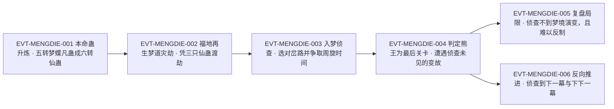

# 梦蝶仙蛊

梦蝶仙蛊是一只**六转梦道侦查仙蛊**，由**纯梦分身的本命蛊——五转梦蝶凡蛊**升炼而来（`E:V6-396898`、`E:V6-396902`）。它的能力边界在原文里写得非常清楚：**能侦查到接下来的梦境中的场景、事物，却不能侦查到梦蝶之主会在梦境中遭遇到什么**（`E:V6-407558`）——即“**看得见景，看不见事**”。正是这条限制，让它在梦道探索里的实用性反而「远超梦甲、造梦两大仙蛊」（`E:V6-397948`）。

本页为 2026-09-28 A 线恢复批**新建页**。证据厚度中等偏厚：全书「梦蝶仙蛊」字面命中 **26 次 / 25 个独立行**（全部落在段6），另以简称「梦蝶」命中 30 次 / 28 行（分类账见主题六）。它的证据结构有一个显著特点：**25 行里绝大多数是“使用过程”而非“设定陈述”**——升炼只有 3 行、机制陈述集中在 3–4 行，其余全是实战场合用它侦查、以及**它侦查失败**的两次记录。因此本页的主线是“一只侦查蛊如何被用于探索梦境，以及它在什么情况下会失效”。凡引文均回根原文逐行复核。

**引号口径**：凡「」内文字均为根原文逐字引文；本文自身的概括、释义与自拟术语一律用 ‘…’ 标记，二者不混用。正文按“原著事实 → 合理推导 →《问真》设计意义”三层组织。

## 主题档案

### 一、身份与升炼：由纯梦分身的本命蛊升炼而来

#### 原著事实

- **升炼前的形态是纯梦分身的本命蛊**：「他之前投放了梦蝶凡蛊，就是他的本命蛊。」`E:V6-396898`；投入的是一只五转蛊：「纯梦分身调动一只五转梦蝶凡蛊，投入其中。」`E:V6-396882`。
- **升炼的时机与条件**：「福地中，天地二气残留许多。」`E:V6-396894`；「纯梦分身乘机借此升炼本命蛊。」`E:V6-396896`。
- **仙蛊方的来源**：「之前天地交感，师法自然则令他获悉了三份梦道仙蛊方，梦蝶仙蛊方正是其中之一。」`E:V6-396900`。
- **结果与转数（登记锚所在行，正文行）**：「梦蝶仙蛊顺利地升炼成六转，至此方源手中拥有的梦道仙蛊达到了四只！」`E:V6-396902`。
- **炼成后的灾劫与渡劫方式**：「仙蛊炼成，福地中再度生出梦道灾劫，威能远远逊色于之前的升仙劫。」`E:V6-396904`；「而这一次，已经不需要方源本体出手了。」`E:V6-396906`；「方源将做梦仙蛊也借给纯梦分身，后者凭借三只仙蛊，成功渡劫。」`E:V6-396908`。
- **登记锚说明**：本页 roster 登记锚 `E:V6-396902` **落在正文行**，该行直接给出「顺利地升炼成六转」，故转数六转**无需另取正文补证**；本页核对了该窗口附近未出现含「梦蝶仙蛊」的章节题名行，故不存在“题名被当作转数证据”的情形。

#### 合理推导

- **依据**：`E:V6-396898`＋`E:V6-396902`＋`E:V6-396900`；**结论**：梦蝶仙蛊的取得路径是**“本命凡蛊＋仙蛊方＋天地交感时机”**三件齐备才能完成，属**同一条蛊的升格**而不是另炼一只新蛊；**不确定性**：原文未写明升炼是否消耗了那只五转梦蝶凡蛊本体（只说“投入其中”与“升炼成六转”）。
- **依据**：`E:V6-396902`＋`E:V6-396908`；**结论**：升炼完成后方源手中梦道仙蛊达四只，但纯梦分身渡劫时实际动用的是**三只**；**不确定性**：第四只未参与的原因，原文未写（本页不做推断）。

#### 《问真》设计意义

- ‘本命凡蛊 → 本命仙蛊’是一条**干净的可复现路径**：玩家的本命蛊可以随剧情升格，而不是换一件新装备。设计上这条路最适合用来做**角色成长的锚点**（装备换代会让身份感断裂，升格不会）。
- 升炼与渡劫**绑定**（`E:V6-396904`、`E:V6-396908`）意味着“提升装备”本身就是一次**风险事件**；这是可复用的节奏设计：让成长伴随代价，而不是纯粹的数值提升。

### 二、核心机制：看得见景，看不见事

#### 原著事实

- **施用方式**：需要灌注仙元，且催动后蛊入仙窍——「梦求真便暗暗催动梦蝶仙蛊。」`E:V6-397880`；「梦蝶仙蛊被灌注了仙元之后，瞬间消失在了梦求真的仙窍中。」`E:V6-397884`。
- **梦境内的施展特权**：「其他所有流派的蛊虫几乎都无法在梦境中自由施展，但梦道蛊虫当然可以。」`E:V6-397882`。
- **能力正面的完整陈述**：「梦蝶仙蛊能侦查到接下来的梦境中的场景、事物，但却不能侦查到梦蝶之主会在梦境中遭遇到什么。」`E:V6-407558`（「梦蝶之主」为原文用语，指以小梦蝶为手段的那位入梦者，即梦求真）。
- **限制的成因（原文紧随其后）**：「因为梦境的变化，必然是当蛊修真正进入到了梦境之中后，这才会产生互动，产生变化。」`E:V6-407560`；「梦求真来此之前，早就在前一幕的梦境中，侦查到了光头青年，还有土家寨的这个集市。但是具体的遭遇，他是无法提前预知的。」`E:V6-407562`。
- **它的定位（与其他梦道仙蛊对比）**：「梦求真拥有梦甲仙蛊护身，又有造梦仙蛊、梦蝶仙蛊作为手段。尤其是梦蝶仙蛊，别看只是侦查蛊虫，但在梦境的探索上实用性甚至远超梦甲、造梦两大仙蛊。」`E:V6-397948`。
- **侦查的距离：可跨幕**：「因为，他已经利用梦蝶仙蛊侦查到了下一幕梦境。」`E:V6-408376`；「他在刚刚这段时间，动用梦蝶仙蛊侦查到了下一幕，甚至下下一幕，掌握了关键情报。」`E:V6-408508`。
- **侦查的完成度**：「这个时候，梦蝶仙蛊终于将整个梦境侦查完毕。」`E:V6-402226`。

#### 合理推导

- **依据**：`E:V6-407558`＋`E:V6-407560`；**结论**：这条机制的设计内核是**“场景可预知、互动不可预知”**——可侦查的是**静态布景与人物**，不可侦查的是**进入后产生的互动与变化**；**不确定性**：原文只给了两例失败（光头青年、地牢来袭），未系统给出“哪些算场景、哪些算遭遇”的判定线。
- **依据**：`E:V6-408376`＋`E:V6-408508`；**结论**：侦查范围可达**下下一幕**，说明它并非只在当前幕内有效；**不确定性**：能否侦查更远（三幕以上）原文未写，也未写侦查代价是否随幕数变化。
- **依据**：`E:V6-397882`＋`E:V6-397884`；**结论**：它的施展前提是**梦道身份**（其他流派蛊虫在梦境中无法自由施展）与**仙元**；**不确定性**：单次侦查消耗多少仙元，原文未写。

#### 《问真》设计意义

- ‘看得见景、看不见事’（`E:V6-407558`）是一条**可精确量化的情报设计**：给玩家地图与人物，但不给遭遇结果。这比“全知侦查”更有玩法——玩家仍要承担进入后的风险，只是把盲猜变成有根据的下注。
- 与‘其他流派蛊虫在梦境中无法自由施展’（`E:V6-397882`）配合，梦道蛊虫在梦境里形成**流派专属舞台**：这是把“流派身份”做成可玩特权的最简方式，无需额外系统。

### 三、战术价值：以情报替代“以身试法”

#### 原著事实

- **价值定性**：「梦蝶仙蛊虽然只能侦查，但关键的情报其价值往往是最难以估量的。」`E:V6-402250`。
- **替代试错的对照**：「没有梦蝶仙蛊的话，他只能以身试法，按照常规来算，他第一次肯定过不了，魂魄受伤。」`E:V6-402244`；「但现在有了梦蝶仙蛊，他就占据了主动，不再那么被动了。」`E:V6-402248`；「换做以前，方源只有以身试探。但现在梦求真手中却有梦道仙蛊——梦蝶！」`E:V6-402206`。
- **选择正确的岔路**：「就像方才在诡心老人面前调动梦蝶仙蛊侦查，直接让梦求真选择了最正确的一条路。若换做以前，方源肯定要一个个的尝试。选择错误，不仅是魂魄受伤，更关键的是耽误功夫疗伤，还要重新探索梦境。」`E:V6-397956`；「当直觉不起作用的时候，梦求真就利用梦蝶仙蛊探索梦境接下来的演变之路，趋利避害，迅速找到最适合的方法。」`E:V6-397954`。
- **侦查换取周旋时间（一边侦查一边拖延）**：「他当即一边暗催梦蝶仙蛊进行侦查，一边口中敷衍拖延：“你区区一届凡人，既然能费尽周折，千辛万苦地来我面前，当是有缘。我有法门三道，可传授你其中一道。”」`E:V6-402208`。
- **实战中的连续侦查**：「梦求真一边仔细辨析眼前的蛊虫，一边暗中催动梦蝶仙蛊进行侦查。」`E:V6-407262`；「在梦蝶仙蛊的帮助下，梦求真很快就观察到了第二幕梦境中的种种事物。」`E:V6-407264`；「根据梦蝶仙蛊的侦查，梦求真在第一幕梦境中，就已经得知熊王是最后一道关卡，也是最难的一道关卡。」`E:V6-407316`。
- **效率结论**：原文直接点出沿用侦查之后探索效率的跃升（`E:V6-397948` 语境下的“实用性远超”）。

#### 合理推导

- **依据**：`E:V6-402244`＋`E:V6-402248`；**结论**：梦蝶仙蛊的价值可以被**精确表述为“把首次失败换成首次成功”**——没有它，常规推算下第一次必定失败并伤魂；有它则占先手；**不确定性**：原文用的是“按照常规来算”，说明这是**概率性表述**而非保证。
- **依据**：`E:V6-397956`＋`E:V6-402208`；**结论**：这项能力在叙事上被用来**把“试错”改写为“选择”**——同一段梦境，没有它就得逐个试；有了它，人物可以直接挑对路，还能靠它**争取周旋时间**；**不确定性**：侦查耗时长短原文未给（只写“一边……一边……”的并行关系）。

#### 《问真》设计意义

- ‘首次失败换成首次成功’（`E:V6-402244`、`E:V6-402248`）是一句可以直接写成数值说明的设计语言：**侦查蛊的价值 = 减少一次必然失败的成本**。做平衡时，它的强度应当与“一次失败代价”挂钩，而不是与伤害挂钩。
- 侦查与行动**可并行**（`E:V6-402208`、`E:V6-407262`）说明它是**非占位型能力**：玩家不必牺牲行动去侦查。这类设计对探索玩法非常友好，因为它降低的是“尝试成本”，不占用战斗回合。

### 四、代价与限制：并非全知，也有时机门槛

#### 原著事实

- **限制一：看不到将发生的事**：「梦蝶仙蛊能侦查到接下来的梦境中的场景、事物，但却不能侦查到梦蝶之主会在梦境中遭遇到什么。」`E:V6-407558`。
- **限制二：看不到因探索而演变出的新人物**：「“我之前动用梦蝶仙蛊，侦查这一幕梦境，并未发现光头青年。没想到，当我在这一幕中探索到了一定阶段，梦境就会演变，形成新的人物。”」`E:V6-407902`；「因为通过梦蝶仙蛊，他还查探不到这一幕的情景。毕竟光头青年不是事先就存在，而是当梦求真成功营救了黄小米后，梦境演变，这才有光头青年的登场。」`E:V6-408010`；「梦蝶仙蛊侦查不到这种变化。」`E:V6-408108`。
- **限制三：即便侦查到也未必能反制**：「事实上，就算侦查到了这种变化，梦求真也难有反制手段。」`E:V6-408110`——侦查的价值有上限。
- **限制四：侦查并不等于结果**：「“难道还有难关？不可能啊。梦蝶仙蛊已经侦查得很全面了。”」`E:V6-407330`——人物自己都曾误判侦查的完备程度。
- **限制五：时机与注意力门槛**：「于是，梦求真也顾不得再用梦蝶仙蛊，连忙开口，选择了最后第三只蛊虫。」`E:V6-397912`；「之前一直在寻找黄小米，梦求真也没有机会催动梦蝶仙蛊，因此对接下来的梦境并不知晓。」`E:V6-407868`。
- **限制六：施展前提**：需灌注仙元（`E:V6-397884`），且只在梦道语境下有效（`E:V6-397882`）。

**代价与收益（支付方／受益方／支付时点或生效条件）**

| 要素 | 内容 | 证据 |
|---|---|---|
| 支付方 | 使用者**梦求真**（纯梦分身）——付出仙元、并占用注意力与时机（忙时“顾不得再用”、寻找队友期间“没有机会催动”） | E:V6-397884、E:V6-397912、E:V6-407868 |
| 受益方 | 使用者**本身**——获得情报优势（选择正确路径、掌握下一幕与下下一幕的关键情报）；并间接惠及方源本体的探索进程 | E:V6-397956、E:V6-402248、E:V6-408508 |
| 支付时点／生效条件 | 催动时灌注仙元；须身处梦道语境（其他流派蛊虫在梦境中无法自由施展）；侦查在探索**之前或并行**进行，侦查范围可达下下一幕 | E:V6-397882、E:V6-397884、E:V6-408376、E:V6-408508 |
| 收益上限（反向代价） | 侦查**不保证结果**：场景可见、遭遇不可见；演变出的人物侦查不到；即便侦查到也未必能反制 | E:V6-407558、E:V6-408108、E:V6-408110 |

#### 合理推导

- **依据**：`E:V6-407558`＋`E:V6-408108`＋`E:V6-408110`；**结论**：梦蝶仙蛊的**信息能力有明确天花板**，且天花板由两条不同的机制共同决定——**动态事件不可预测**（梦境随进入而变）与**信息≠能力**（知道了也未必能反制）；**不确定性**：这两条是否为作者刻意的设计约束，无外部证据，本页只按文本并存登记。
- **依据**：`E:V6-397912`＋`E:V6-407868`；**结论**：它并非“随时可用”的工具——**使用时机的稀缺性构成隐性成本**；**不确定性**：是仙元耗尽、时间不足还是注意力有限，原文未给原因（本页不猜）。

#### 《问真》设计意义

- ‘侦查到也未必能反制’（`E:V6-408110`）是一条**防止信息能力破坏平衡**的阀门：情报型能力最容易失控，原文用“动态事件不可预测＋知而不能制”双重限制把它压住。做探索玩法时可照此设限：**给信息，不给确定性**。
- ‘使用时机的稀缺’（`E:V6-397912`、`E:V6-407868`）说明即使是强侦查也应该服从**场景节奏**——这比加冷却时间更自然。

### 五、身份边界：梦道同族的逐条辨别

#### 原著事实

**（1）梦甲蛊（`dream_def_5_01_gu`，另一实体，七转防御）**

- 「这是梦道七转仙蛊——梦甲蛊。」`E:V6-396296`；「它是防御性的梦道仙蛊！」`E:V6-396298`；「因为梦甲蛊乃是防御仙蛊。」`E:V6-396330`。
- 其战略地位与梦蝶相反：「对于方源而言，做梦蛊、如梦令的重要性，都要小于梦甲蛊。」`E:V6-396328`；「有了这只仙蛊，他就有了资本，可以抵抗梦道灾劫，从而帮助纯梦求真分身成功升仙！」`E:V6-396332`。

**（2）造梦仙蛊**

- 与梦蝶并列为其手段之一（`E:V6-397948` 同句）。全书「造梦仙蛊」命中 2 行，本页只登记其作为梦道仙蛊的并列关系。

**（3）做梦仙蛊／做梦蛊**

- 与如梦令同列于“重要性小于梦甲蛊”的比较中：「对于方源而言，做梦蛊、如梦令的重要性，都要小于梦甲蛊。」`E:V6-396328`；渡劫时出借的是做梦仙蛊：「方源将做梦仙蛊也借给纯梦分身，后者凭借三只仙蛊，成功渡劫。」`E:V6-396908`。全书「做梦仙蛊」4 行、「做梦蛊」2 行（后者不含“仙”字）。

**（4）如梦令（八转，龙宫核心）**

- 「方源手中的仙蛊有很多，但梦道仙蛊只有一只，就是八转如梦令，龙宫的核心仙蛊。」`E:V6-396300`；外形「如梦令形如蜻蜓，圆脑袋，长身躯，一对粉红宝石般的复眼，有四对透明的翼翅。轻盈的翅膀上细细查看，还会发现有着一层淡淡的七彩斑斓的光晕。」`E:V6-396302`。
- 名录上的并存：「两者结合来看，方源发现了一点，似乎梦道仙蛊都十分漂亮。」`E:V6-396304`；「“不知道梦翼仙蛊，入梦游又是何等模样？”方源不禁遐想。」`E:V6-396306`。

**（5）梦翼仙蛊、入梦游（他人持有，非本页实体）**

- 「他带着前世五百年的记忆，知道眼下梦翼仙蛊是在凤金煌手中，入梦游仙蛊则在毒蝎娘子那里。」`E:V6-396308`；「五百年前世，入梦游和定仙游、酒神游、逍遥游，并公认为天下四大移动仙蛊。方源虽然强大，但毒蝎娘子却可依仗入梦游，转瞬穿梭到任何一处梦境之中。」`E:V6-396314`。

**（6）解谜蛊（`dream_atk_5_06_gu`，另一实体；原文口径为智道）**

- 原文把它的道属写成**智道**：「这记梦道杀招也是如此，核心仙蛊是智道解谜，但使用出来，却是梦道的杀招。」`E:V4-139584`。
- 它与妇人心蛊在炼道场景中同为蛊阵组成部分：「其中妇人心蛊，因为义天山大战前，方源为了炼化薄青的剑道蛊虫，留在了狐仙福地里。他利用智慧光晕，搭建了一套蛊阵，解谜蛊、妇人心蛊就是其中的组成部分。但是解谜蛊只在搭建的初期运用一番后，就功成身退，被方源带在身上。妇人心蛊却需要一直保留在蛊阵中，直到薄青的剑道仙蛊被炼化成功，才能撤销。」`E:V5-199802`。

**（7）梦蝶凡蛊（升炼前的同一只蛊）**

- 五转、纯梦分身的本命蛊（`E:V6-396898`、`E:V6-396882`）；升炼后即成为梦蝶仙蛊本身（`E:V6-396902`）。

#### 合理推导

- **依据**：`E:V6-396296`–`E:V6-396304`＋`E:V6-397948`；**结论**：梦道仙蛊在原文中**至少六种**（梦甲、造梦、做梦、如梦令、梦蝶、梦翼，另有他人手中的入梦游），彼此的职能明确分工：梦甲＝防御、如梦令＝八转核心、入梦游＝移动、梦蝶＝侦查；因此**绝不能互相并入 `aliases`**；**不确定性**：入梦游是否属“梦道仙蛊”的正式成员（原文把梦翼仙蛊与入梦游并列遐想，未给道属句），本页只登记并列关系，不做道属断言。
- **依据**：`E:V4-139584`＋`E:V5-199802`；**结论**：解谜蛊在**原文口径上是智道**（“核心仙蛊是智道解谜”），但它与梦道关系密切（可构成梦道杀招、与梦道探索剧情同段）；**不确定性**：本页按 roster-3 的口径**分列 id、不并入 aliases**，并把“原文称智道／登记归入 dream 前缀”这一差异登记在《待核对》。
- **依据**：`E:V6-396898`＋`E:V6-396902`；**结论**：梦蝶凡蛊与梦蝶仙蛊是**同一只蛊的先后形态**（五转→六转），而非两只；但按本批口径，`aliases` 只放**同一实体的别名**，形态差异写正文——故本页 `aliases` 为空，两者的关系在此节说明；**不确定性**：升炼后“梦蝶凡蛊”是否还能被单独提及，本批命中内未见。

#### 《问真》设计意义

- 梦道是原文里**仙蛊分工最清楚**的流派之一（防御／核心／移动／侦查各有其蛊）。做流派设计时，这种“一职能一蛊”的结构天然产生**构筑组合空间**：玩家不是选最强的一只，而是选要哪几种职能。
- 解谜蛊的**跨属性身份**（原文智道、构成梦道杀招）说明流派系统中存在**交叉条目**：这类条目若并进单一流派的别名，会同时破坏两个流派的检索完整性。本页因此坚持分列。

### 六、命名预筛分类账

#### 原著事实

- 「梦蝶仙蛊」：**26 次 / 25 行**，全部为蛊名。
- 「梦蝶」：**30 次 / 28 行**，扣除母名 25 行后余 **3 行**：
  - **同一实体的简称 1 行**：`E:V6-402206`（「换做以前，方源只有以身试探。但现在梦求真手中却有梦道仙蛊——梦蝶！」）。
  - **升炼前形态（梦蝶凡蛊）2 行**：`E:V6-396882`、`E:V6-396898`。
- 本书未出现‘梦蝶蛊’这一写法；「梦蝶凡蛊」全书 **2 行**、与上列 2 行一致。
- 与「梦蝶仙蛊」形体最近的其他梦道蛊名（梦甲蛊、造梦仙蛊、做梦仙蛊、如梦令、梦翼仙蛊、入梦游、解谜蛊）的命中量级见主题五，**无一处**可与「梦蝶仙蛊」混淆为同一实体。

#### 合理推导

- **依据**：「梦蝶」30 行中仅 3 行不是本页实体，且其中 2 行是其**自身升炼前形态**；**结论**：本页的命名噪声率极低（10%），远低于「血本」（15%）与「别离」（42%）；**不确定性**：无（属可数事实）。
- **依据**：`E:V6-396902`＋`E:V6-396898`；**结论**：若后续批次以「梦蝶」为检索词，**必须把这 2 行凡蛊行单独标注**，否则会把“升炼前形态”误并入仙蛊实体；**不确定性**：无。

#### 《问真》设计意义

- 同一只蛊的**凡蛊形态与仙蛊形态同名**（只差一个“凡／仙”字），是命名预筛最容易踩的坑之一：它既不是别名、也不是异物，而是**同一实体的时间前段**。建议登记规范为这类情况保留“形态链”字段（本页已用主题一的升炼链与本节分类账表达）。

## 状态时间线

| 状态 ID | 阶段 | 状态 | 证据 |
|---|---|---|---|
| ST-MENGDIE-01 | 升炼前 | [原著明确] 前身为五转梦蝶凡蛊，是纯梦分身的本命蛊 | E:V6-396882、E:V6-396898 |
| ST-MENGDIE-02 | 升炼 | [原著明确] 趁福地残留天地二气，借天地交感／师法自然所获三份梦道仙蛊方中的梦蝶仙蛊方，顺利升炼成六转 | E:V6-396894、E:V6-396896、E:V6-396900、E:V6-396902 |
| ST-MENGDIE-03 | 升炼后灾劫 | [原著明确] 仙蛊炼成后福地再生梦道灾劫，威能远逊之前升仙劫；方源借出做梦仙蛊，纯梦分身凭三只仙蛊渡劫成功 | E:V6-396904、E:V6-396906、E:V6-396908 |
| ST-MENGDIE-04 | 施用方式 | [原著明确] 暗中催动、灌注仙元后蛊入仙窍；其他流派蛊虫几乎无法在梦境中自由施展，梦道蛊虫可以 | E:V6-397880、E:V6-397882、E:V6-397884 |
| ST-MENGDIE-05 | 侦查能力 | [原著明确] 可侦查接下来梦境的场景与事物，跨越下一幕乃至下下一幕；完成度可达“整个梦境侦查完毕” | E:V6-407558、E:V6-408376、E:V6-408508、E:V6-402226 |
| ST-MENGDIE-06 | 能力局限 | [原著明确] 侦查不到梦主会遭遇什么（因变化须进入后才产生）；侦查不到因探索演变而出现的新人物；即便侦查到也难有反制 | E:V6-407558、E:V6-407560、E:V6-408108、E:V6-408110 |
| ST-MENGDIE-07 | 定位 | [原著明确] 虽只是侦查蛊虫，在梦境探索上的实用性远超梦甲、造梦两大仙蛊；关键情报价值难以估量 | E:V6-397948、E:V6-402250 |
| ST-MENGDIE-08 | 实战效用 | [原著明确] 使人物能选对岔路、掌握下一幕与下下一幕情报；无它则只能以身试探、首次多半失败并伤魂 | E:V6-397956、E:V6-402244、E:V6-402248、E:V6-402206 |
| ST-MENGDIE-09 | 使用门槛 | [原著明确] 存在“顾不得再用”“没有机会催动”的时机限制；侦查可与行动或交谈并行 | E:V6-397912、E:V6-407868、E:V6-402208、E:V6-407262 |
| ST-MENGDIE-10 | 同族辨析 | [原著明确] 与梦甲蛊（七转防御）、造梦仙蛊、做梦仙蛊、如梦令（八转）、梦翼仙蛊、入梦游以及解谜蛊均为不同实体，互不并入 aliases | E:V6-396296、E:V6-396298、E:V6-396300、E:V6-396308、E:V4-139584、E:V6-397948 |
| ST-MENGDIE-11 | 形态与别名 | [存在冲突] 升炼前形态“梦蝶凡蛊”与本实体是同一只蛊的先后形态（五转→六转），但按本批口径形态差异不入 aliases；全书无“梦蝶蛊”写法，故本页 aliases 为空 | E:V6-396882、E:V6-396898、E:V6-396902 |

## 原著明确内容（本批取证窗口登记）

本批对「梦蝶仙蛊」在根原文全书扫描：字面命中 **26 次 / 25 个独立行**（全部段6）；变体扫描「梦蝶」**30 次 / 28 行**、「梦蝶凡蛊」**2 行**（分类账见主题六）。下表登记本批实际读取的窗口。

| 窗口 | 内容要点 | 用途 |
|---|---|---|
| 396296–396332 | 同族密集窗口：梦甲蛊（七转、防御性）、八转如梦令为龙宫核心且形如蜻蜓、梦翼仙蛊与入梦游在他人手中、入梦游为天下四大移动仙蛊之一、梦道仙蛊“都十分漂亮”、做梦蛊与如梦令重要性小于梦甲蛊、梦甲蛊用于抵抗梦道灾劫助纯梦分身升仙 | 主题五 |
| 396882、396894–396910 | 升炼全程：投入五转梦蝶凡蛊（本命蛊）→ 福地残留天地二气 → 借三份梦道仙蛊方之一升炼 → 成六转、梦道仙蛊达四只 → 福地再生梦道灾劫 → 借做梦仙蛊、凭三只仙蛊渡劫 | 主题一、三 |
| 397880–397884 | 催动方式（灌注仙元后入仙窍）；其他流派蛊虫在梦境中无法自由施展而梦道蛊虫可以 | 主题二、四 |
| 397912 | 忙乱之际“顾不得再用梦蝶仙蛊”，只能改选第三只蛊虫 | 主题四 |
| 397948–397958 | 定位：侦查蛊却在梦境探索上实用性远超梦甲与造梦；直觉失效时以它探路；诡心老人面前靠它选对正确一条路；与“逐个尝试、选错伤魂兼耽误疗伤”的对照 | 主题二、三 |
| 402206–402250 | 以侦查争取周旋时间（一边暗催一边敷衍拖延）；侦查完毕整个梦境；无它则首次必败伤魂；有它则占据主动；情报价值最难以估量 | 主题三 |
| 407262–407330 | 一边辨析蛊虫一边暗催侦查；观察到第二幕种种事物；据侦查得知熊王是最后也最难的一道关卡；人物误以为“侦查得很全面” | 主题三、四 |
| 407556–407562 | 局限的正面陈述：场景事物可见、梦主遭遇不可见；成因是变化须进入后才产生；前一幕侦查到光头青年与集市，但具体遭遇无法预知 | 主题二、四 |
| 407868–407902 | 寻找黄小米期间没有机会催动；侦查未发现光头青年而梦境演变出新人物 | 主题四 |
| 408006–408110 | 复查该次失误：因查探不到、且光头青年非事先存在而是营救后才登场；梦蝶仙蛊侦查不到这种变化；即便侦查到也难有反制 | 主题四 |
| 408374–408380、408504–408510 | 反向证据：利用梦蝶仙蛊侦查到下一幕顺利推进；并侦查到下一幕乃至下下一幕、掌握关键情报 | 主题二、三 |
| 139584（同族窗口，段4） | 梦道杀招的核心仙蛊是智道解谜，用出来却是梦道杀招（用于辨别 `dream_atk_5_06_gu`） | 主题五 |
| 199800、199802（同族窗口，段5） | 六转仙蛊库存清单；解谜蛊与妇人心蛊组成蛊阵、以智慧光晕炼化薄青剑道仙蛊期间的用法 | 主题五 |

## 事件链

| 事件 ID | 事件 | 参与者 | 证据 | 因果 |
|---|---|---|---|---|
| EVT-MENGDIE-001 | 纯梦分身趁福地残留天地二气升炼本命蛊，借梦蝶仙蛊方把五转梦蝶凡蛊升炼成六转梦蝶仙蛊 | 纯梦分身（梦求真）、方源、梦蝶凡蛊 | E:V6-396882、E:V6-396894、E:V6-396898、E:V6-396900、E:V6-396902 | evidences ST-MENGDIE-01、ST-MENGDIE-02 |
| EVT-MENGDIE-002 | 仙蛊炼成后福地再生梦道灾劫，方源借出做梦仙蛊，纯梦分身凭三只仙蛊渡劫成功 | 纯梦分身、方源 | E:V6-396904、E:V6-396906、E:V6-396908 | evidenced by ST-MENGDIE-03 |
| EVT-MENGDIE-003 | 梦求真入梦后靠梦蝶仙蛊侦查，在诡心老人面前选对唯一正确的路，并以“一边暗催侦查、一边敷衍拖延”争取周旋时间 | 梦求真、诡心老人 | E:V6-397880、E:V6-397956、E:V6-402208、E:V6-402226 | evidences ST-MENGDIE-08 |
| EVT-MENGDIE-004 | 梦求真据侦查判定熊王为最后也最难的关卡，随后遭遇未在侦查中出现的光头青年 | 梦求真、熊王、光头青年 | E:V6-407316、E:V6-407330、E:V6-407902 | evidences ST-MENGDIE-06 |
| EVT-MENGDIE-005 | 复盘该次失误：光头青年并非事先存在，而是营救黄小米后梦境演变才登场；梦蝶仙蛊侦查不到这种变化，且即便侦查到也难有反制 | 梦求真 | E:V6-408010、E:V6-408108、E:V6-408110 | evidences ST-MENGDIE-06 |
| EVT-MENGDIE-006 | 反向推进：梦求真利用梦蝶仙蛊侦查到下一幕乃至下下一幕，掌握关键情报后顺利进入下一幕 | 梦求真 | E:V6-408376、E:V6-408508 | evidences ST-MENGDIE-05 |

事件口径：本页沿用实体簇号 `EVT-MENGDIE-*`，节点 6 个（≥3），按模板配图；`EVT-MENGDIE-005` 与 `006` 分别为同一能力**失败与成功**的两侧，故并列挂于同一前置节点，不虚构先后。

## 资料整理

本页为**新建页**，没有旧版；本批来源只有根原文，没有 `notes:`／`memory:` 层转述进入本页事实区。相关派生记录的处置登记如下（**本段内容不得当作原著事实**）：

- `roster-3.md` 第 56 行登记：`| dream_atk_5_02_gu | 梦蝶仙蛊 | 5 | 6 | E:V6-396902 |  |`（状态类别‘品阶上限压缩’）。本页复核：登记锚 `E:V6-396902` 为**正文行**，该行明写「顺利地升炼成六转」，转数六转可直接引证；游戏侧 `game_rank=5` 属该批约定登记，本页只登记、不改该页、不改 `game/**`。
- `game/data/gu_lore.json` 的 `dream_atk_5_02_gu` 为 `game_rank=5`、`status=rank_cap`、`lore_rank=6`、`anchor=E:V6-396902`——投影与原文一致。
- **锚点复核（写作方自查，非独立校验）**：本页登记的**首现锚**为 `E:V6-396902`（正文行）。本批在 25 行命中内**未发现**含「梦蝶仙蛊」的章节题名行，故不存在“题名被当作转数证据”的情形。
- **同族 id 目录（登记层，只登记不改）**：`dream_def_5_01_gu`（梦甲蛊，七转防御）、`dream_atk_5_06_gu`（解谜蛊，原文口径为智道）。本页与二者**互不写入 `aliases`**，边界写在主题五。
- **跨页口径差异（不越界处理）**：既有 Wiki 页 `rules/dream-path.md` 的 DRM-004 依据 `E:V4-139584` 记录“智道解谜仙蛊为核心＋梦道手段＝梦道仙级杀招”。本页独立复核了 `E:V4-139584` 的原文（「这记梦道杀招也是如此，核心仙蛊是智道解谜，但使用出来，却是梦道的杀招。」），确认**原文口径为智道**；至于该实体 id 被归入 `dream_*` 前缀，属**登记层归类**，本页只登记该差异，不改动任何 id 与既有页面。
- 本页不声明桥接层 canon 字段、不新建桥接层 canon 编号（本轮口径：Canon 权威已在本 Wiki，桥接层文件只作消费层，本批不引用）。

## 分析与解读

以下为归纳，不是原文（须与上文“原著事实”区分）：

1. **25 行里“设定陈述”只有三四处，其余全是使用记录**：`E:V6-407558`（能力与局限）、`E:V6-397948`（定位）、`E:V6-397882`（梦境施展特权）是设定；其余都是“用了它、它灵了、它没灵”。这使得本页的机制描述**由实战场合反推**，也解释了为什么它的边界如此具体（两次失败案例都被完整写出）。
2. **它的强度被写成“替代一次必然失败”**：`E:V6-402244` 与 `E:V6-402248` 合起来把价值量化得极清楚——没有它，常规推算下首次必败且伤魂；有它则占先手。这比“增加侦查范围”之类的描述更有设计含义。
3. **原文主动给它设了两道天花板**：一是**动态事件不可预测**（`E:V6-407560`、`E:V6-408108`），二是**知而不能制**（`E:V6-408110`）。一个侦查型能力如果在文本里只写强不写弱，很快就会变成万能钥匙；原文没有这么做。
4. **它是“梦道流派特权”的载体**：`E:V6-397882` 说明梦境对其他流派不友好、对梦道友好。这条规则把流派身份变成了**地图级特权**，比单点数值加成更有分量。
5. **同族条目必须分列**：本页 25 行之外，梦道还有梦甲蛊、造梦仙蛊、做梦仙蛊、如梦令、梦翼仙蛊、入梦游、解谜蛊等条目，职能各不相同（`E:V6-396296`–`E:V6-396314`）。任何合并都会同时破坏梦道与智道两个流派的检索完整性。

## 待核对

- `[原著未明确]` **侦查的仙元消耗**：`E:V6-397884` 只说“灌注了仙元之后”，未写量级。
- `[原著未明确]` **侦查的最远跨度**：已证可达下下一幕（`E:V6-408508`），更远是否可行、代价是否随幕数上升，均未写。
- `[原著未明确]` **“场景／事物”与“遭遇”的判定线**：`E:V6-407558` 给出能力边界，但原文未系统说明哪些信息属前者、哪些属后者（现有两例为光头青年与地牢来袭）。
- `[原著未明确]` **时机限制的成因**：`E:V6-397912`、`E:V6-407868` 只写“顾不得再用”“没有机会催动”，未写是仙元、时间还是注意力所限。本页不猜。
- `[原著未明确]` **升炼后五转梦蝶凡蛊本体的去向**：`E:V6-396882` 写“投入其中”、`E:V6-396902` 写“升炼成六转”，未写是否消耗。
- `[待取证]` **本页检索口径**：本批穷举为「梦蝶仙蛊」26 次 / 25 行、「梦蝶」30 次 / 28 行、「梦蝶凡蛊」2 行。**以「梦蝶」检索时必须扣除 2 行凡蛊行与 1 行简称行**（分类账见主题六），否则会把升炼前形态误并入本实体。
- `[存在冲突]` **形态链与 aliases 的口径**：升炼前形态「梦蝶凡蛊」与本实体是同一只蛊的先后形态（`E:V6-396898`、`E:V6-396902`），按本批口径**形态差异不写入 `aliases`**（故本页 aliases 为空）；若后续批次认为凡蛊形态应作为别名，需由 L0 统一口径，本页不自行变更。
- `[存在冲突]` **解谜蛊的道属口径 A／口径 B**：
  - 口径 A（原文）：**智道**——`E:V4-139584`「核心仙蛊是智道解谜，但使用出来，却是梦道的杀招。」
  - 口径 B（登记）：id 为 `dream_atk_5_06_gu`，即按 `dream_*`（梦道）前缀登记。
  - 当前状态：本页按契约**分列 id、不并入 aliases**，并把该差异登记待 L0 复核；本页不修改 roster-3 与 `game/**`。
- `[原著明确]` **体积**：本页 37,535 字节，**未超 40 KB**，无需登记例外。

## 模板扩展建议（只登记，不改核心模板）

1. **“形态链”值得有固定位**。本页的核心身份是**同一只蛊的升格**（五转梦蝶凡蛊 → 六转梦蝶仙蛊），既不是别名也不是异物。建议实体页为这类条目提供“形态链”字段（本页用主题一＋ST-MENGDIE-11 表达），以便校验脚本区分“形态前段”与“同名异物”。
2. **侦查型实体应固定写出“能力上限”**。本页的机制价值有一半来自它的**失效条件**（`E:V6-407558`、`E:V6-408108`、`E:V6-408110`）。建议模板在功能型条目中提供“能力边界／失效条件”小标题，避免只登记正面能力。
3. **跨流派条目要允许双口径并列**。解谜蛊在原文为智道、在登记为梦道前缀，两者都真实存在。建议模板的《待核对》支持“原文口径／登记口径”成对登记（本页已按此写法执行），避免下一位作者被迫二选一。

## 关联页面

[梦道机制](../rules/dream-path.md)、[玉皮蛊](jade-skin-gu.md)、[蛊的饲养与炼化](../world/gu-care-and-refinement.md)、[炼蛊与杀招链](../world/gu-refine-killer-chain.md)、[渡劫与灾劫](../rules/tribulation.md)、[杀招连招并招体系](../rules/killer-moves.md)、[真元](../world/primeval-essence.md)、[流派总表](../world/path-roster.md)、[蛊虫关系](gu-relations.md)、[蛊虫总表](roster.md)、[蛊虫总表二期](roster-2.md)、[蛊虫总表三期](roster-3.md)、[方源](../characters/fang-yuan.md)、[疯魔窟](../events/feng-mo-ku.md)、[逆流河](../events/reverse-flow-river.md)、[义天山大战](../events/yitian-mountain.md)。
