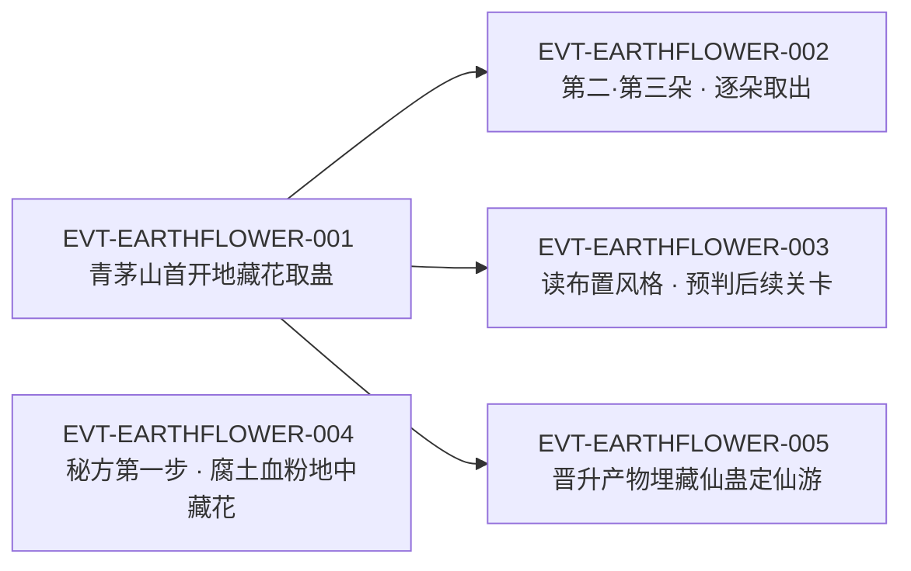

# 地藏花蛊

地藏花蛊是**二转**的**储藏之蛊**：它自己不动、不攻、不守，唯一的作用是“把其他蛊虫包养在花心当中”，让它们泡在黄金色的花液里**沉眠**。它的食物简单到只有一样——**地气**，种在地下、有地气就能活；代价是它“是一次性的消耗蛊，一旦种植在地上，就不能再移动了”。取蛊要一层层揭开它的暗金色花瓣，花瓣一旦离体就迅速消散，最后剩下一个拳头大小的圆球，里面就是沉睡的蛊虫。它往上晋升，即得**五转的地藏花王**。

**检索口径（必读）**：本页为 2026-09-28 GU 蛊虫专题 40 页规模化恢复第二批 S2-1 分片的**新建页**。全书穷举扫描 `地藏花蛊`：命中 **16 次 / 16 行**（段一 7 行、段二 5 行、段三 2 行、段四 2 行），**无一行出现 2 次**。**锚点性质复核**：登记锚 `E:V3-080158` 经回原文打印确认为**正文行**（该行逐字为「地藏花蛊只是二转蛊，一路往上晋升，就能得到五转的地藏花王。」），**二转明文与晋升关系都在这条锚行上**；它既不是题名行，也不依赖任何题名行来成立。**近名同族分离计数**（避免子串误切）：`地藏花` 全书 37 次 / 34 行，其中本实体 16 行、`地藏花王蛊` 4 行、`地藏花王` 8 行，余 **11 行**为不带“蛊”的泛称或植物本体指称（如「比地藏花还要庞大十倍」`E:V3-080160`）。正文按“原著事实（逐字＋E-ID）→ 合理推导 →《问真》设计意义”三层组织；引文一律回根原文 `source/蛊真人-clean.txt`，行号即 `E:V{段}-{6 位行号}`。

## 主题档案

### 一、取得与身份：二转的储藏之蛊，转数明文就在锚行上

#### 原著事实

- **转数与晋升（登记锚所在行，正文行）**：「地藏花蛊只是二转蛊，一路往上晋升，就能得到五转的地藏花王。」`E:V3-080158`。
- **类别定位**：「地藏花，乃是储藏之蛊。花酒行者栽种在山洞内，储藏了数只蛊虫，最终都被方源得到。」`E:V2-070232`；同类并置——「这种存储蛊虫也十分常见，就比如地藏花，就是同一类型。」`E:V4-129450`，另一处作「这是肉笑蛊的效果，和地藏花一般，用来存储蛊虫，无需太多担忧。」`E:V2-039396`。
- **埋藏者是花酒行者**：「方源曾经在青茅山时，开辟花酒行者遗藏。后者就是埋下地藏花蛊，藏下蛊虫。」`E:V3-080156`；现场旁证「花酒行者在这里种下了地藏花蛊，这花心里面的蛊虫，应该就是留给继承者的。」`E:V1-009904`。
- 为什么需要它（设定前提）：「蛊虫没有食物就会饿死，只有极少数的蛊虫身上，能出现自我封印的情形。为了保养蛊虫，蛊师们想出了许多的方法。」`E:V1-009892`；「地藏花蛊就是其中一种。」`E:V1-009894`。
- **代价三方（本条自身的支付结构）**：**支付方**＝**种植它的蛊师**（把一块永久不能移动的土地、一株一次性的蛊、以及一次性的传承点交出去，`E:V1-009896`、`E:V2-070232`）；**受益方**＝**被保藏的蛊虫与其最终继承者**（“这花心里面的蛊虫，应该就是留给继承者的”，`E:V1-009904`、`E:V3-080156`）；**支付时点／生效条件**＝**种植当时即不可逆**——“一旦种植在地上，就不能再移动了”，此后受益方要到开启时点才出现（`E:V1-009896`）。

#### 合理推导

- **依据：**`E:V1-009892`＋`E:V1-009894`；**结论：**地藏花蛊不是一件“给人用的蛊”，而是**为别的蛊解决保存问题**的蛊——它的存在理由来自“蛊虫没有食物就会饿死”这条普遍约束，所以它的价值随被保存物的价值浮动；**不确定性：**原文未写它能同时保藏几只蛊、保藏上限与花体大小是否相关。
- **依据：**`E:V2-070232`＋`E:V4-129450`；**结论：**它是**“储藏类”的常见解**之一（同段把肉笑蛊、三转凡蛊类的存储蛊都归为同一用途），因此这一类在原著里不是奇珍而是**基础设施**——这也解释了为什么它会出现在传承布置、合炼材料、炼蛊试题三种完全不同的场合；**可能反例：**原文只说“同一类型”，未写这些储藏蛊之间在容量、时限、成活条件上是否等价。

#### 《问真》设计意义

- **把“保存”做成一件独立的蛊**（`E:V1-009892`、`E:V1-009894`）对设计很有用：它把“背包／仓库”这类系统能力落成可丢失、可被摧毁的世界物件，而不是玩家面板上的抽象格子。
- **不可逆的一次性**（`E:V1-009896`）让它天然适合做**埋点式玩法**：玩家在某个地点埋下一株，此后这个地点的价值由时间而非操作决定——这是廉价的长期目标生成器。

### 二、唯一功能与形态：花心包养、黄金花液模拟封印

#### 原著事实

- **功能唯一性明文**：「它的作用也只有一个，那就是把其他蛊虫包养在花心当中，浸泡在黄金色的花液里。」`E:V1-009900`。
- **机制（模拟封印）**：「这种黄金花液能在一定程度上，模拟封印状态，让浸泡在其中的蛊虫陷入沉眠。」`E:V1-009902`。
- 形态与揭取工序（同一场景连写）：花苞「一朵埋藏在地中的，暗金色的花苞呈现在他的面前。」`E:V1-009862`；「它深入地面两寸，体积有寻常石磨大小，花苞表面细腻如绸，暗金作色，显得幽静神秘而又高贵典雅。」`E:V1-009864`；辨识句「果然是地藏花蛊！」`E:V1-009866`；结构「地藏花蛊，就像是荷花和卷心菜的结合体。它的花瓣一片又一片，紧紧地贴在一起，厚厚的，手感滑润。」`E:V1-009870`。
- **不可带走的花瓣**：「而这暗金色的巨大花瓣，一旦脱离了本体，就迅速消散。好像是一片片的雪花，融化在空气当中。」`E:V1-009872`。
- 逐层剥到核心：「方源揭开外围五六十片的花瓣后，花苞的体积削减了一大半，露出里面的花心。」`E:V1-009874`；「此时地藏花蛊，只剩下了最中心的薄薄一层花瓣。」`E:V1-009882`；「这些花瓣相互叠加，包裹成一个拳头大小的圆球形状。」`E:V1-009884`；「花瓣半透明，轻薄如宣纸。花瓣的里面充斥着一股黄金色的液体。在这黄金的花液中央，一只蛊虫在里面沉睡着。」`E:V1-009886`；**被保存者不可辨识**——「方源凝神细看，却只能看到这蛊虫的模糊影像，不能辨认究竟是何种蛊虫。」`E:V1-009888`。
- 取出与取出后的状态：「小心翼翼地拨开花瓣，他从花心中取出一只蛊虫。」`E:V1-021328`；取出时的品相「刚从地藏花中取出时，它色泽暗哑且干瘪，如今却是温润肉呼，又肥又大，涨到成年人的巴掌大小。」`E:V1-021440`。
- 同类比照（休眠态的可比性）：「这坚硬的石壁，其实是千里地狼蛛陷入休眠沉睡，自我包裹的石茧。它虚弱至极，如同方源从地藏花中取出酒虫。」`E:V1-032524`。
- **代价三方（本条自身的支付结构）**：**支付方**＝**花体自身**（外围五六十片花瓣在开启时被逐片揭开并消散，`E:V1-009874`、`E:V1-009872`）；**受益方**＝**取蛊者**（得到一只仍在沉眠、随即可炼化的蛊虫，`E:V1-021328`、`E:V1-012396`、`E:V1-012398`）；**支付时点／生效条件**＝**开启当时**——花瓣离体即消散，因此花体只在“未开封”状态下保有价值，一旦开过一次就不可复原（`E:V1-009872`、`E:V1-009874`）。

#### 合理推导

- **依据：**`E:V1-009900`＋`E:V1-009902`；**结论：**它的机制是**用花液临时替代封印**——“能在一定程度上，模拟封印状态”，用词保留余地，说明效果低于真封印；因此可推断被保存的蛊**不会自然饿死，但也不会变强**，只是被冻在存放那一刻的状态；**不确定性：**原文未写可保存多久、是否有上限，也未写它对已受封印的蛊是否叠加。
- **依据：**`E:V1-009874`＋`E:V1-009872`；**结论：**取蛊是**一次性开箱**：外围五六十片花瓣先耗掉，剩下的才是有价值的花心；这意味着“提前偷看”的成本极高，玩家不能既验货又保留；**可能反例：**本场景中方源是逐片揭开而非一次破坏，原文未写粗暴破坏花体是否会导致内部蛊虫一同损毁。
- **依据：**`E:V1-009888`（同场景连句可证其为取出前状态）；**结论：**被保存的蛊在开箱前**不可辨识**（“只能看到这蛊虫的模糊影像”），所以地藏花蛊天然是**盲盒**：埋宝的人知道内容，取宝的人只能赌；**不确定性：**原文未写是否有手段能在不破坏花体的前提下辨识内容。

#### 《问真》设计意义

- **盲盒式储藏**（`E:V1-009888`）是这套系统里最好用的一处不对称信息：同一株地藏花蛊对不同玩家意味着不同价值，天然支持探索与交易，而不需要额外设计随机掉落。
- **“模拟封印”而非真封印**（`E:V1-009902`）留出了一个可调档位：同一个功能可以按等级给出不同保真度（能存放但不能延寿、能延寿但会损坏），比“仓库”这种二值能力更好平衡。
- **取出即毁花**（`E:V1-009872`、`E:V1-009874`）使每一次取用都是一次**不可撤销的决断**，适合做成需要玩家登记“何时开哪一株”的资源管理。

### 三、食性与一次性：以地气为食，种下即不能移动

#### 原著事实

- **食性与存活条件**：「它的食物来源十分简单，就是地气。只要种植在地面下，有着充足的地气，就能存活。」`E:V1-009898`。
- **一次性消耗蛊**：「地藏花蛊，是一次性的消耗蛊，一旦种植在地上，就不能再移动了。」`E:V1-009896`。
- 种植即不可取回：现场例证——「一切都没有变化，巨石仍旧在那里，静静地横亘在前方。至于挖出地藏花的那个坑，已经被方源重新填上了。」`E:V1-011086`（挖出的是花体，留下的坑被回填，说明位置一次性）。
- 变体条件下的不吃（见主题五）：在剧毒与凶猛血力的土中会直接死掉——「地藏花蛊，一进入其中，便衰败而死。不管是青泽腐土中的剧毒，还是八荒血粉的凶猛血力，都是地藏花难以承受的。」`E:V2-070238`。
- **代价三方（本条自身的支付结构）**：**支付方**＝**种植者**（永久放弃该处地面与这株蛊的再次调度权，`E:V1-009896`）；**受益方**＝**被保藏的蛊虫**（获得一个不必投喂的长期保存点，`E:V1-009898`、`E:V1-009900`）；**支付时点／生效条件**＝**种下的那一刻**——此后它既不能移动也不能回收，收益从种下到开启之间长期持续（`E:V1-009896`、`E:V1-009898`）。

#### 合理推导

- **依据：**`E:V1-009896`＋`E:V1-009898`；**结论：**它是一套**零维护但零机动**的储藏方案——食物是最普遍的地气，因此不需要看守；代价是把“位置”从可变转成不可变，这让它适合藏宝、不适合随军；**不确定性：**原文未写地气稀薄之地（如石地、沙漠）会如何影响存活，只说“有着充足的地气”即可存活。
- **依据：**`E:V2-070238`；**结论：**它对土壤条件是**挑剔**的——普通地气即可活，但剧毒与凶猛血力会当场致死；可推断“地气”是一个可被其他力量污染或压制的环境量；**可能反例：**原文未在一般场景中讨论地气质量差异，本条只来自秘方试验这一特殊场面。
- **依据：**`E:V1-011086`；**结论：**可挖出的是**花体与内容**，而“坑”要回填，说明种植位点一旦暴露就要处理痕迹；这与页内另有“销毁痕迹”的做法（`E:V3-080166`）互证，可见这类储藏的核心风险是**被找到**而不是被破解；**不确定性：**原文未写花体被强行挖出时内部蛊虫是否受损。

#### 《问真》设计意义

- **零维护储藏**（`E:V1-009898`）适合作为“离线资产”机制：玩家不必每日登录照料，埋下即长期有效，但一旦选择就锁死了地点，天然形成地图上的长期记号。
- **土壤质量成为变量**（`E:V2-070238`）可以让同一件蛊在不同地点有不同存活率，把“选点”做成一次判断，而不是把玩法压缩成一个交互按钮。

### 四、作为微型传承的关卡：花酒行者的布置与多次取蛊

#### 原著事实

- 布置风格被当作可预测规律：「按照花酒行者的布置风格，石林中央的地洞，就是下一道关卡。在关卡之前，极有可能种下地藏花蛊。」`E:V1-020182`。
- 该传承的规模与剩余量：「花酒行者的这道传承，属于微型传承。」`E:V1-020194`；同一段列出已得之物与预期——「我从这道传承中，先后得到了白豕蛊、玉皮蛊、酒虫。隐石蛊勉强也能算上。接下来剩下的，恐怕只有一两朵地藏花了。」`E:V1-020194`。
- 第一次取蛊：「果然是地藏花蛊！」`E:V1-009866`；开箱过程见主题二（`E:V1-009870`–`E:V1-009888`）。
- 第二次取蛊：「第二朵地藏花！」`E:V1-012394`；「方源朗声一笑，小心翼翼地拨开花瓣，取出浸泡在黄金花液中的蛊虫。」`E:V1-012396`。
- 第三次取蛊：「用手挖开这片泥土，果真发现了一朵地藏花。」`E:V1-021326`；「小心翼翼地拨开花瓣，他从花心中取出一只蛊虫。」`E:V1-021328`。
- 取蛊收益被折算成修行成本：「幸好他有春秋蝉，又两次从地藏花中取蛊，因此炼化蛊虫不需要耗费大量元石。」`E:V1-012760`。
- **代价三方（本条自身的支付结构）**：**支付方**＝**花酒行者**（身受重伤、仓促设下这道传承并把蛊虫封入花中，`E:V1-020186`、`E:V1-009904`）；**受益方**＝**继承者方源**（先后取得白豕蛊、玉皮蛊、酒虫、隐石蛊及数只花中蛊虫，`E:V1-020194`、`E:V3-080156`）；**支付时点／生效条件**＝**布置者支付在前、继承者受益在后**，两者相隔不知多少年，因此这是一次纯粹的**跨代支付**（`E:V1-009904`、`E:V3-080156`）。

#### 合理推导

- **依据：**`E:V1-020182`＋`E:V1-020194`；**结论：**地藏花蛊在这道传承里的角色是**“关底的首饰盒”**——关卡之前种下花、花心藏着下一件奖励，因此它既是奖励容器也是**关卡即将结束的信号**；正因它可被规律化预测，探索才能从“碰运气”变成“读设计”；**不确定性：**原文写“极有可能”“接着剩下的，恐怕只有一两朵”，用词都是概率判断，不能据此断定该传承中花的总数。
- **依据：**`E:V1-012760`；**结论：**花中取出的蛊是**已可用、可立即炼化**的（不需要额外保活），所以它的实际价值＝“省下一次保活与炼化的成本”；**可能反例：**原文写“两次从地藏花中取蛊”是为了说明他省了元石，不排除其他场合取出的蛊需要额外处理。
- **依据：**`E:V1-020194`＋`E:V1-020186`；**结论：**微型传承的优点被原文写成**因地制宜、相对简单**，缺点是比较稀少——这解释了为什么布置者用“一次性、不可移动”的地藏花蛊作为载体：它便宜、可靠、不需要看守；**不确定性：**原文未写布置者选择地藏花蛊是否还有别的动机（如隐匿气息）。

#### 《问真》设计意义

- **把奖励容器做成实体蛊**（`E:V1-020182`、`E:V1-009904`）能让“藏宝”变成可交互的对象：玩家可以提前发现花体却打不开（缺工序）、也可以带着工具回来开——探索因此获得层次，而不是一次拾取。
- **布置风格可被阅读**（`E:V1-020182`、`E:V1-020194`）是一条很值钱的设计原则：同一个设计者留下的多处布置应共享可推导的规律，让老玩家能凭经验预测，这比随机化更能产生“我读懂了这个世界”的成就感。

### 五、在他人工程里的位置：合炼材料、异变与炼蛊试题

#### 原著事实

- 作为秘方材料出场：「而那只蛊虫，却是常见，方源在青茅山时，就接触过。」`E:V2-070228`；「乃是一株地藏花蛊。」`E:V2-070230`。
- **失败与成功被连续写出**：「地藏花蛊，一进入其中，便衰败而死。不管是青泽腐土中的剧毒，还是八荒血粉的凶猛血力，都是地藏花难以承受的。」`E:V2-070238`；「那位上古时代的力道蛊仙，早已经料到每个步骤中出现的失败可能，因此备份充足。」`E:V2-070244`；「地灵又取出一株地藏花蛊，他信手种下。」`E:V2-070242`；「接连几次失败之后，方源终于成功地种下地藏花蛊。」`E:V2-070246`；异变结果——「青泽腐土中的剧毒和八荒血粉的血力，形成一种微妙的平衡，从而让地藏花蛊发生异变。」`E:V2-070248`；该步的命名——「这就是秘方的第一步腐土血粉，地中藏花。」`E:V2-070250`。
- 作为考核内容的难度明文：炼蛊大会「有一题是要炼制地藏花蛊。而炼制此蛊，倒数第三步，是需要动用上游草，搭配禅狮的鬃毛，再辅以炼蛊手法。」`E:V4-150652`；手法要求——「要炼制地藏花蛊，须得在三十个呼吸内内，将上百根草毛编织好。一旦超过这个时间，炼蛊的火焰就会将这些草、毛烤焦。」`E:V4-150658`。
- 作为可炼得的成品（近名同族，见主题六）：「又先后炼得蒙尘蛊，皓珠蛊，暗投蛊，地藏花王蛊。」`E:V3-078798`。
- **代价三方（本条自身的支付结构）**：**支付方**＝**出资炼蛊者**（材料含八种太古荒兽之血磨成的血粉等珍稀物，且要接受“接连几次失败”的耗损，`E:V2-070226`、`E:V2-070244`、`E:V2-070246`）；**受益方**＝**同一炼蛊者**（该步成功后才有下一步，`E:V2-070250`）；**支付时点／生效条件**＝**每次尝试都是即刻结算**——一株入土即定生死（“一进入其中，便衰败而死”），失败与成功之间没有中间态（`E:V2-070238`、`E:V2-070248`）。

#### 合理推导

- **依据：**`E:V2-070238`＋`E:V2-070248`；**结论：**地藏花蛊在合炼里是**可被“标准件”化的一次性耗材**——它能被量产、能被备份、失败可重来，所以它在这条秘方里的地位与它在传承里的地位完全不同（前者是耗材，后者是容器）；**不确定性：**原文未写每株的成本，也未写炼蛊者一共用掉几株。
- **依据：**`E:V4-150652`＋`E:V4-150658`；**结论：**炼制地藏花蛊被列为**入会试题**，说明它有公认的工序与手法门槛（`纷纷手`），即它是**可教、可考、可复现**的技术，而不是奇遇产物；这条与主题一的“储藏类基础设施”定位互相印证；**可能反例：**原文只说试题要求炼制地藏花蛊，未写炼成的成品与野生株在功能上是否相同。

#### 《问真》设计意义

- **同一件蛊既是容器又是耗材**（`E:V3-080156`、`E:V2-070246`）是很有价值的复用方式：美术与规则只需做一次，就能同时支撑“藏宝”与“合炼材料”两种玩法，降低内容成本。
- **失败可备份、尝试可重复**（`E:V2-070244`、`E:V2-070246`）提示这类消耗蛊应当**允许批量产出**，否则高失败率的合炼会变成读档行为，而不是资源规划。

### 六、晋升位与近名同族边界：二转往上得到五转的地藏花王

#### 原著事实

- **晋升关系（登记锚所在行）**：「地藏花蛊只是二转蛊，一路往上晋升，就能得到五转的地藏花王。」`E:V3-080158`。
- 晋升产物的转数与代价：「此蛊高达五转，方源种得很是辛苦。他的真元效用不足，期间只好一边汲取元石，一边缓慢灌注真元。」`E:V3-080152`；「足足耗费了两个多时辰，才大功告成。」`E:V3-080154`。
- 晋升产物的两种形态：「地藏花王，完全盛开时，比地藏花还要庞大十倍。暗金色的巨大花瓣，柔软如丝绸，花心处是暗金色的花液。」`E:V3-080160`；「但是当地藏花王花蕾完全闭合时，它的整个身躯，比一个婴孩的拳头还要小。」`E:V3-080162`；「完全缩在地里深处，不显露丝毫气息。」`E:V3-080164`。
- 晋升产物的实际用途（承接同一功能位）：「走了两三百里，方源停下脚步，取出地藏花王蛊，将铁柜放入花心，种到地底深处。」`E:V3-080150`；「方源将地藏花王种下，又细心地销毁了地上相关的一切痕迹。」`E:V3-080166`；埋的是仙蛊——「方源的空窍，不能存下定仙游，他只能出此下策，将仙蛊就地埋藏起来，以待曰后取用。」`E:V3-080168`。
- **称谓两说（同一对象）**：晋升产物在叙述里既写作`地藏花王`（`E:V3-080158`、`E:V3-080160`、`E:V3-080162`、`E:V3-080166`），也写作`地藏花王蛊`（`E:V3-080150`、`E:V3-078798`、`E:V3-080182`、`E:V3-080772`）。
- 旁及：另一处功能延续——「随着葛谣和他一起闯过鬼脸葵海、钻地鼠群、影鸦拦截，之后寻到常山阴，换了皮肤，找到雪洗蛊，埋下地藏花王蛊，她的利用价值就在一步步的缩小。」`E:V3-080772`。
- **代价三方（本条自身的支付结构）**：**支付方**＝**种植者**（五转之躯难以种下，须边汲元石边灌注真元，耗时两个多时辰，`E:V3-080152`、`E:V3-080154`）；**受益方**＝**种植者本人**（自用的仙蛊因此得以就地埋藏，`E:V3-080168`）；**支付时点／生效条件**＝**种下当时一次付清**，收益在日后取用时才兑现（`E:V3-080154`、`E:V3-080168`）。

#### 合理推导

- **依据：**`E:V3-080158`＋`E:V3-080150`；**结论：**晋升前后**功能位不变**——两阶都以“花心藏物”为唯一用途，晋升带来的是**容积与隐蔽性的跃升**（花王盛开时比地藏花庞大十倍、闭合时比婴孩拳头还小且不显气息，`E:V3-080160`、`E:V3-080162`、`E:V3-080164`），而不是换一种能力；**不确定性：**原文未写晋升所需材料、是否消耗原地藏花蛊本体、以及晋升耗时。
- **依据：**`E:V3-080150`＋`E:V3-080152`；**结论：**高容量是有代价的——五转的花王蛊种植消耗真元与时间远高于二转株（“种得很是辛苦”“两个多时辰”），因此高阶储藏位是**需要准备的工程行为**而非随手一插；**可能反例：**该耗时发生在方源真元效用不足的特定时期，原文未给标准耗时。
- **依据：**`E:V3-078798`＋`E:V3-080166`；**结论：**花王蛊**可炼得、可埋藏、可销毁痕迹**，是完整可控的资产；而它与本页实体之间是**同一蛊系的相邻阶位**，不是同物异名——两者各有独立 id 与独立转数（二转／五转），因此 `地藏花王蛊` 与 `地藏花王` 都不进入本页 `aliases`；**不确定性：**`地藏花王` 与 `地藏花王蛊` 是否严格同指，原文未作说明，本页在《待核对》并列登记两说。

#### 《问真》设计意义

- **晋升只改参数、不改功能**（`E:V3-080158`、`E:V3-080160`）是一种省成本的成长设计：玩家学会一次“埋藏”的玩法，晋升只改变容量与隐蔽性，学习曲线不会被重置。
- **高阶储藏位需要工程化准备**（`E:V3-080152`、`E:V3-080154`）给玩法留出了“布置期”：埋藏仙蛊这种大动作应当占用一段时间并在开始时暴露风险，而不是瞬发，这样“被找到”才构成真实威胁（`E:V3-080166`、`E:V3-080172`）。

## 状态时间线

| 状态 ID | 阶段 | 状态 | 证据 |
|---|---|---|---|
| ST-EARTHFLOWER-01 | 身份与转数 | [原著明确] 二转蛊，一路往上晋升可得五转的地藏花王；登记锚 `E:V3-080158` 为正文行，二转明文与晋升关系均在其中 | E:V3-080158 |
| ST-EARTHFLOWER-02 | 类别 | [原著明确] 储藏之蛊；同为存储类的还有肉笑蛊与一只三转凡蛊，被并称为同一类型 | E:V2-070232、E:V2-039396、E:V4-129450 |
| ST-EARTHFLOWER-03 | 唯一功能 | [原著明确] 「它的作用也只有一个，那就是把其他蛊虫包养在花心当中，浸泡在黄金色的花液里。」 | E:V1-009900 |
| ST-EARTHFLOWER-04 | 机制 | [原著明确] 黄金花液「能在一定程度上，模拟封印状态」，使其中蛊虫陷入沉眠 | E:V1-009902 |
| ST-EARTHFLOWER-05 | 食性 | [原著明确] 食物来源就是地气；种在地面下、有充足地气即可存活 | E:V1-009898 |
| ST-EARTHFLOWER-06 | 一次性 | [原著明确] 一次性的消耗蛊，一旦种植在地上就不能再移动 | E:V1-009896 |
| ST-EARTHFLOWER-07 | 形态 | [原著明确] 埋于地下、深入地面两寸、体积有寻常石磨大小；花瓣暗金色、如荷花与卷心菜的结合体 | E:V1-009864、E:V1-009870 |
| ST-EARTHFLOWER-08 | 开箱工序 | [原著明确] 逐片揭开花瓣；花瓣一旦脱离本体就迅速消散；揭去外围五六十片后露花心，最终剩拳头大小圆球、内含黄金花液与沉睡蛊虫 | E:V1-009872、E:V1-009874、E:V1-009884、E:V1-009886 |
| ST-EARTHFLOWER-09 | 内容不可辨识 | [原著明确] 开启前只能看到其中蛊虫的模糊影像，不能辨认究竟是何种蛊虫 | E:V1-009888 |
| ST-EARTHFLOWER-10 | 被取出后的状态 | [原著明确] 取出的蛊虫取出时色泽暗哑且干瘪，养后可涨到成年人巴掌大小；同段以千里地狼蛛石茧休眠作比 | E:V1-021440、E:V1-032524 |
| ST-EARTHFLOWER-11 | 传承用法 | [原著明确] 花酒行者埋下地藏花蛊藏下蛊虫；方源据其布置风格推断关卡前可能再种；该传承属微型传承 | E:V3-080156、E:V1-020182、E:V1-020194 |
| ST-EARTHFLOWER-12 | 合炼用法 | [原著明确] 作秘方材料时可被多次备份；一进入青泽腐土与八荒血粉中便衰败而死，接连失败后成功种下并发生异变 | E:V2-070230、E:V2-070238、E:V2-070246、E:V2-070248 |
| ST-EARTHFLOWER-13 | 工艺门槛 | [原著明确] 炼蛊大会四大入会试题之一为炼制地藏花蛊；须用手法`纷纷手`在三十个呼吸内把上百根草毛编织好 | E:V4-150652、E:V4-150658 |
| ST-EARTHFLOWER-14 | 晋升产物 | [原著明确] 五转地藏花王：盛开时比地藏花庞大十倍、闭合时比婴孩拳头还小、缩在地里不显气息；被用于埋藏仙蛊定仙游 | E:V3-080150、E:V3-080152、E:V3-080160、E:V3-080162、E:V3-080164、E:V3-080168 |
| ST-EARTHFLOWER-15 | 存续与上限 | [原著未明确] 可保藏几只蛊、可保存多久、地气稀薄处能否存活、晋升所需材料与耗时，均未写 | E:V1-009896、E:V1-009898、E:V1-009900 |

## 原著明确内容（本批取证窗口登记）

本批对 `地藏花蛊` 在根原文全书穷举扫描：命中 **16 次 / 16 行**（段一 7 行、段二 5 行、段三 2 行、段四 2 行）。下表登记本批实际读取的窗口。

| 窗口 | 内容要点 | 用途 |
|---|---|---|
| 9860–9910 | 第一朵地藏花蛊的挖掘与揭取全工序：暗金色花苞、石磨大小、深入地面两寸；花瓣离体即消散；揭去五六十片露出花心；拳头圆球与黄金花液；花中蛊虫沉睡；「地藏花蛊就是其中一种」`E:V1-009894`；一次性消耗蛊；以地气为食；作用唯一；花液模拟封印；花酒行者留给继承者 | 主题一、二、三、四 |
| 11086 | 挖出地藏花的坑已被重新填上 | 主题三 |
| 12394–12396、12760 | 第二朵地藏花；取出浸泡在黄金花液中的蛊虫；两次取蛊使炼化不必耗费大量元石 | 主题四 |
| 20182、20194 | 依花酒行者的布置风格推断石林中央关卡前可能再种地藏花蛊；该传承属微型传承，余下一两朵地藏花 | 主题四 |
| 21326–21328、21440 | 第三朵地藏花与取蛊；取出的蛊虫取出时干瘪、养后涨到成年人巴掌大小 | 主题二、四 |
| 32524 | 千里地狼蛛石茧休眠类比方源从地藏花中取出酒虫 | 主题二 |
| 39396、129450 | 肉笑蛊「和地藏花一般，用来存储蛊虫」`E:V2-039396`；存储蛊虫类「就比如地藏花，就是同一类型」`E:V4-129450` | 主题二 |
| 70228–70250 | 秘方第一步：地藏花蛊作材料；入青泽腐土＋八荒血粉即衰败而死；备份充足、接连失败后成功种下并发生异变；该步命名腐土血粉、地中藏花 | 主题五 |
| 78798、80150–80166、80182、80772 | 炼得地藏花王蛊（五转）；取出后置铁柜于花心、种入地底、销毁痕迹；盛开与闭合两种形态；埋藏仙蛊定仙游 | 主题六 |
| 80156–80158 | 花酒行者埋下地藏花蛊藏下蛊虫；地藏花蛊只是二转蛊、往上晋升得五转地藏花王 | 主题一、六 |
| 150648–150660 | 炼蛊大会入会试题之一为炼制地藏花蛊；手法`纷纷手`须在三十个呼吸内编织上百根草毛 | 主题五 |

## 事件链

| 事件 ID | 事件 | 参与者 | 证据 | 因果 |
|---|---|---|---|---|
| EVT-EARTHFLOWER-001 | 方源在青茅山挖开泥土，认出地藏花蛊并逐层揭开花瓣，从花心中取出一只沉眠的蛊虫 | 方源、花酒行者（布置者） | E:V1-009866、E:V1-009870、E:V1-009882、E:V1-009886、E:V1-009904 | evidences ST-EARTHFLOWER-03、ST-EARTHFLOWER-08 |
| EVT-EARTHFLOWER-002 | 在石门与石柱处又先后发现第二朵、第三朵地藏花并取出其中蛊虫 | 方源 | E:V1-012394、E:V1-012396、E:V1-021326、E:V1-021328、E:V1-021440 | evidences ST-EARTHFLOWER-10 |
| EVT-EARTHFLOWER-003 | 方源据花酒行者的布置风格预判后续关卡仍会种下地藏花蛊，并把这道传承定性为微型传承、余量只有一两朵 | 方源 | E:V1-020182、E:V1-020194、E:V1-020186 | evidences ST-EARTHFLOWER-11 |
| EVT-EARTHFLOWER-004 | 方源按上古力道蛊仙秘方种下地藏花蛊：先在青泽腐土与八荒血粉中接连失败，多次之后成功，蛊体发生异变，秘方第一步达成 | 方源、地灵 | E:V2-070230、E:V2-070238、E:V2-070242、E:V2-070246、E:V2-070248、E:V2-070250 | evidences ST-EARTHFLOWER-12 |
| EVT-EARTHFLOWER-005 | 晋升产物承接同一功能位：方源取出五转地藏花王蛊，把藏有仙蛊定仙游的铁柜放入花心、种入地底并销毁痕迹 | 方源、葛谣 | E:V3-080150、E:V3-080152、E:V3-080166、E:V3-080168、E:V3-080182 | evidences ST-EARTHFLOWER-14 |

事件口径：本页沿用实体簇号 `EVT-EARTHFLOWER-*`。事件节点 5 个（≥3），按模板配图。全图 4 条边，均有直接原文支撑：001→002（同一道传承里逐朵发现）、001→003（据第一次的布置风格反推后续关卡）、001→005（同一功能位由晋升产物承接）、004 属合炼/工艺线，两处都用到地藏花蛊但因果不同，故并列**不与他者连边**。

## 资料整理

本页为**新建页**，无旧版可对；本批来源只有根原文，未引入 `notes:`／`memory:` 层转述。派生记录处置（**本段内容不得当作原著事实**）：

- `roster-3.md` 第 189 行把 `earth_atk_5_03_gu` 记为原文 2 转、原 game=5、备注“五转者为晋升产物地藏花王”与 L0 裁定 2026-09-25 依原文改 rank，与本页正文口径（`E:V3-080158` 二转明文）一致；`game/data/gu_lore.json` 同条 `lore_rank=2`、`status=ruling_applied`，仅作消费层核对，不据以改页。
- **锚点性质复核**：登记锚 `E:V3-080158` 回原文打印后确认为**正文行**（逐字：「地藏花蛊只是二转蛊，一路往上晋升，就能得到五转的地藏花王。」），不属于“题名行”情形；本页因此不需要另设题名行来作存在性证据。
- **分类账（全书穷举，含重复块、未去重）**：`地藏花蛊` 命中 **16 次 / 16 行**（段一 7 行、段二 5 行、段三 2 行、段四 2 行，均无重复计数）。逐行枚举（16 行，与实测集合逐个相等）：E:V1-009866、E:V1-009870、E:V1-009882、E:V1-009894、E:V1-009896、E:V1-009904、E:V1-020182、E:V2-070230、E:V2-070238、E:V2-070242、E:V2-070246、E:V2-070248、E:V3-080156、E:V3-080158、E:V4-150652、E:V4-150658。
- **近名同族分离计数（避免子串误切）**：`地藏花` 全书 **37 次 / 34 行**，逐行分布＝本实体 16 行＋`地藏花王蛊` 4 行（E:V3-078798、E:V3-080150、E:V3-080182、E:V3-080772）＋`地藏花王` 8 行（E:V3-078798、E:V3-080150、E:V3-080158、E:V3-080160、E:V3-080162、E:V3-080166、E:V3-080182、E:V3-080772）＋**纯泛称 11 行**（E:V1-011086、E:V1-012394、E:V1-012760、E:V1-020194、E:V1-021326、E:V1-021440、E:V1-032524、E:V2-039396、E:V2-070232、E:V2-070236、E:V4-129450）。三者行集合存在重叠（`地藏花王` 与 `地藏花王蛊` 行内亦含 `地藏花`），故此处分列的是**含该串的行集合**，不是互斥分区。`地藏花蛊虫` 全书 **0 次命中**；本实体 16 行均非“被更长专名吞并的子串”（左邻字符实测集合为 空／下／了／制／时／是／株／让，无一为专名前置字）。
- **头衔与专名（不引入 aliases）**：`地藏花王蛊` 另有独立 id `earth_atk_1_04_gu`（见 `game/data/gu_names.json`），`地藏花王` 与 `地藏花王蛊` 两写法同指**晋升产物**（两说并列登记见《待核对》）；`地藏花` 是包含本实体在内的**泛称**。以上三者一律不进本页 `aliases`，边界写在主题六与《待核对》。
- **桥接层视角（仅登记，不据以改 Canon）**：`game/**` 本批只读，不在改动范围；本页不据游戏侧数值回改原著口径。
- **原文自身的录入噪音**：根原文（clean 版）含少量遮蔽符与讹字（如「三十个呼吸内内」`E:V4-150658`、「以待曰后取用」`E:V3-080168`）。本页引文一律**照录**原文，不改字、不补全、不做静默修正，以便逐字回溯。
- **本页引号规范（便于复核）**：角引号（U+300C／U+300D）只用于**可逐字回溯到原文行**的引文；分析用词、拼合名目与表格字段名一律用全角弯引号或反引号，不放进引文位置。

## 分析与解读

1. **地藏花蛊是这套系统里最“不像蛊”的蛊**：它没有攻击、没有防御、没有增益，只有保存（`E:V1-009900`）；而正因为功能单一，它才能同时出现在传承布置（`E:V3-080156`）、合炼材料（`E:V2-070230`）、炼蛊试题（`E:V4-150652`）三个互不相干的场合——**单一功能的可复用性**在这里体现得最清楚。
2. **它的全部成本都压在“位置与不可逆”上**：食物是白给的地气（`E:V1-009898`），但种下即不能移动（`E:V1-009896`）、开一次就毁掉外围花瓣（`E:V1-009872`、`E:V1-009874`）。这让它成为一件**以机动性换可靠性的工具**，与同批[鳄力蛊](blood-atk-1-18-gu.md)以“前置条件＋持续供养”为核心的代价形态形成对照。
3. **“盲盒”属性来自机制而非叙事**：内容不可辨识（`E:V1-009888`）＋开箱即毁花（`E:V1-009872`）＝玩家无法既验货又保留，因此每一株花的价值都是主观的。这是原文提供的最便宜的信息不对称。
4. **晋升不换功能、只换容积**（`E:V3-080158`、`E:V3-080160`、`E:V3-080164`）：从二转到五转，地藏花蛊一系始终是“藏东西的花”，变的是能藏多大、藏得多不显眼；这种成长方式让玩家只需学一次玩法，适合做成长期复用系统。
5. **两处独立证据把“存储类”确认为常见物**（`E:V2-039396`、`E:V4-129450`）：原文明确说存储蛊虫“也十分常见”，并把肉笑蛊、一只三转凡蛊与地藏花并列为同一类型。这意味着下游做世界构建时，不应把它当成孤例奇物，而应按一类基础设施来配置数量与获取渠道。

## 待核对

- `[存在冲突]` **晋升产物的两种称谓**：口径 A＝写作`地藏花王`（`E:V3-080158`、`E:V3-080160`、`E:V3-080162`、`E:V3-080166`）；口径 B＝写作`地藏花王蛊`（`E:V3-080150`、`E:V3-078798`、`E:V3-080182`、`E:V3-080772`）。原文未说明二者是否严格同指、也未说明哪一种为正式名。**当前状态：不裁定**——两说分别对应两种实现选项（同物两写法／“蛊”为后缀的两个条目）；`game/data/gu_names.json` 另有独立 id `earth_atk_1_04_gu`＝地藏花王蛊，故两者均不进入本页 `aliases`。
- `[原著未明确]` **道属**：全书 16 行未见任何道属表述；本页据其以地气为食（`E:V1-009898`）在 `tags` 中列为 `earth-path`，但**不作为原著事实断言**。id 前缀不对 Canon 生效，按 L0 本轮口径不改 id。
- `[原著未明确]` **容量与时限**：`E:V1-009900` 只写“把其他蛊虫包养在花心当中”，未写可同时保藏几只、可保存多久、超过时限会怎样。
- `[原著未明确]` **晋升条件**：`E:V3-080158` 只写“一路往上晋升”，未写所需材料、是否消耗原地藏花蛊本体、耗时多久。
- `[原著未明确]` **数值类缺口（机制已确认、数值未知 → 拆条）**：机制 **[已确认]** ＝储藏之蛊、花液模拟封印使其沉眠、以地气为食、一次性且不可移动、开箱即逐片散花、内容不可辨识（`E:V1-009900`、`E:V1-009902`、`E:V1-009898`、`E:V1-009896`、`E:V1-009872`、`E:V1-009888`）；具体数值 **[待取证]** ＝可保藏蛊数上限、保存时限、地气稀薄/受污土壤下的存活差异、晋升五转所需材料与耗时、炼制一株所需成本。
- `[原著未明确]` **可保存对象是否有限制**：原文只说“其他蛊虫”，未写是否排除仙蛊、是否可用于保存非蛊对象。
- `[改编／张力]` **桥接层转数**：`roster-3.md` 第 189 行与 `game/data/gu_lore.json` 记本实体原文 2 转、原 game=5 已裁定改为 2，并备注五转者为晋升产物。游戏侧数值只作消费面登记，**不用以修正原著事实**。
- `[原著未明确]` **体积**：本页实测 **41,887 字节**，已超 GOVERNANCE 十进制口径 40,000 B 上限，**按 GOVERNANCE 现有格式登记例外**（实测 41,887 字节 ≈ 40.91 KiB／41.89 KB 十进制）。超出部分来自本页必需的原著逐字引文与分类账枚举，删任一都会损伤机制、条件与反例的可核性，故不删有效知识。

## 模板扩展建议（只登记，不改核心模板）

1. **需要“容器／被保存物”的表达位**。本页实体的本体价值在于“里面装着什么”（`E:V1-009900`、`E:V1-009888`），模板按“一只蛊＝一组效果”组织，装不下“同一只蛊因内容不同而价值不同”的实例。
2. **需要“不可逆部署”的表达位**。“一旦种植在地上，就不能再移动了”（`E:V1-009896`）是部署型代价，与[鳄力蛊](blood-atk-1-18-gu.md)、[血滴子](blood-droplet-gu.md)两页的“前置条件”“献祭支付”同属“代价不在资源栏”的一类，建议合并设计同一表达位。
3. **需要“开启即毁”的表达位**。花瓣离体即消散、开箱后花体不再复存（`E:V1-009872`、`E:V1-009874`），模板没有“首次使用后状态改变且不可回退”的字段。
4. **需要“同系相邻阶位”的表达位**。二转地藏花蛊与五转地藏花王（蛊）是同一功能位的相邻阶位（`E:V3-080158`、`E:V3-080160`），模板只有实体间“关联”，没有“同系阶位”这一语义，导致晋升关系只能写进正文。

## 关联页面

地藏花王蛊（`earth_atk_1_04_gu`，本批 40 页中未建页，故不设链接）、[石窍蛊](earth-def-3-01-gu.md)、[玉皮蛊](jade-skin-gu.md)、[白豕蛊](white-boar-strength-gu.md)、[酒虫](wine-insect-gu.md)、[血滴子](blood-droplet-gu.md)、[鳄力蛊](blood-atk-1-18-gu.md)、[土道](../world/earth-path.md)、[蛊的饲养与炼化](../world/gu-care-and-refinement.md)、[真元](../world/primeval-essence.md)、[修行体系](../world/cultivation-system.md)、[蛊虫关系](gu-relations.md)、[蛊虫总表三期](roster-3.md)、[蛊虫总表](roster.md)、[经济名录](../world/economy-roster.md)。
