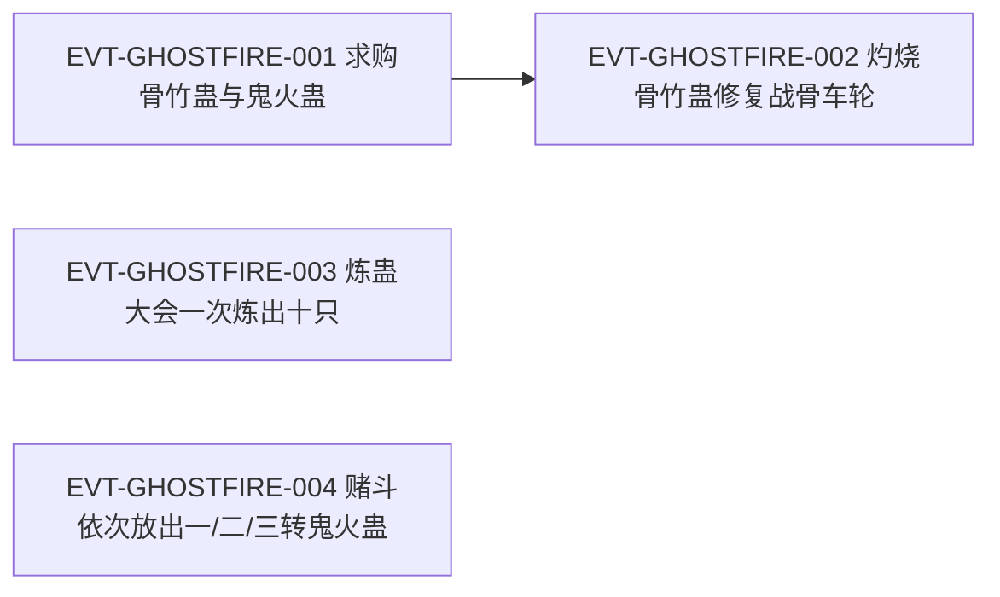

# 鬼火蛊

鬼系谱系里的**攻杀件兼修复件**：原文两处把它的定位说得很清楚——它属于鬼系「用作攻杀」的那一类（`E:V3-081800`），同时「是二转魂道蛊虫」（`E:V3-084408`）。它的形态是持有者**舌底的一个蓝色火焰团**，吐出的鬼火「散发出阵阵冷意，阴寒刺骨」；而与一转**骨竹蛊**配合，能把五转战骨车轮的裂痕一点点烧补回来。

本页是 2026-09-28 血道／骨道批次的**新建页**。全书穷举扫描"鬼火蛊"：命中 **31 行**。本页对转数与道属采用**多口径并列登记**（见主题一）：原文既写「二转魂道蛊虫」，又写「隶属炎道、魂道」，并且在赌斗中连续出现"一转／二转／三转鬼火蛊"三只个体。

## 主题档案

### 一、转数与道属：原文三处口径并列登记

#### 原著事实

- **二转明文**（书店段，关于可获得性）：「结果二转的鬼火蛊，店中有许多。反而一转的骨竹蛊，却没有一只。」`E:V3-081722`
- **二转＋道属明文（魂道）**：「鬼火蛊，是二转魂道蛊虫。往上晋升，有条路线，是三转鬼炎蛊。」`E:V3-084408`
- **道属明文（炎道＋魂道）**：「鬼火蛊隶属炎道、魂道，炼制颇为细琐繁杂，对心神消耗很大。长久炼制，很容易就要造成魂魄虚弱。这是魂道蛊虫的炼制特征之一。」`E:V4-151206`
- **试题口径（二转）**：「这次的试题，是要炼制二转的鬼火蛊。」`E:V4-151198`
- **赌斗中的三个个体（同一场战斗内依次出现）**：`E:V4-155278`（「我的这只蛊虫是一转鬼火蛊。」）、`E:V4-155328`（「这是二转鬼火蛊。」）、`E:V4-155398`（「你看好了，这是一只三转鬼火蛊。」）；且原文写实为**三只不同的个体**：「方源又取出第二只鬼火蛊。」`E:V4-155326`、「方源取出第三只蛊虫」`E:V4-155398`。
- 赌斗的规则背景（解释了"一转"从何而来）：「一转蛊虫是肯定的，按照规矩这是方源第一次出手进攻，只能是一转手段。」`E:V4-155280`
- 上位品种的层级：三转**鬼炎蛊**`E:V3-084408`、四转**鬼焱蛊**（「而此时发威的，却是寄居夜狼王身上的四转鬼焱蛊。」`E:V3-084408`）。
- 晋级件实战形态：「两三团惨蓝色的鬼火，喷到城墙上，一片蛊师因此遭殃，浑身都被阴冷的鬼火笼罩着。」`E:V3-088746`（前一行独立点题"鬼炎蛊！"`E:V3-088744`）。

#### 合理推导

- **道属口径**：**口径A**：鬼火蛊＝**魂道**蛊虫（`E:V3-084408` 直陈）；**口径B**：鬼火蛊**隶属炎道、魂道**（`E:V4-151206` 直陈，且同段解释其炼制契合「魂道蛊虫的炼制特征」）。两口径并存，本页**不合并**：口径B 可读作对口径A 的补充（魂道为主、兼涉炎道），但原文未给出主次。`[存在冲突]`
- **转数口径**：**口径A**：**二转**（`E:V3-081722`、`E:V3-084408`、`E:V4-151198` 三处明文）；**口径B**：同名个体覆盖**一转／二转／三转**（`E:V4-155278`、`E:V4-155328`、`E:V4-155398` 为三只不同个体）。**旁证倾向于 B 是特殊场景口径**：`E:V4-155280` 明写「按照规矩……只能是一转手段」，即赌斗按**手段等级**逐次出手；但 `E:V4-155278`、`E:V4-155398` 在字面上称的是**蛊虫本身**的转数，故不能排除同名蛊存在多个转数个体。**当前状态**：两口径并存，不强行统一；本页在事实区同时保留"二转（三处明文）"与"同名个体存在一转／二转／三转三例"两条。
- **与晋升命名规则的张力**：`E:V3-084408` 把鬼火蛊的上位路线命名为**三转鬼炎蛊**；若「三转鬼火蛊」`E:V4-155398` 是同一只蛊的正式转数，则与上述晋升命名冲突。本页只登记张力，不裁定。`[存在冲突]`
- **不确定性**：`E:V4-155280` 的"规矩"是赌斗规则，不是蛊虫规则；原文未在任何一处对"鬼火蛊为何有多个转数"做出解释。

#### 《问真》设计意义

- 这是一个**必须显式建模**的样本：如果按单实体单转数建模，`E:V4-155278`／`E:V4-155398` 会导致数据自相矛盾；如果按"同名多转数个体"建模，又会与 `E:V3-084408` 的「往上晋升，有条路线，是三转鬼炎蛊」撞车。建议把"同名多转数个体"与"晋升改名"两种机制**分别实现并互斥**，而不是折中。
- 道属写两位（炎道＋魂道，`E:V4-151206`）在炼制侧是有意义的：原文随即写方源采用「魂道、炎道相互结合的炼制手法」`E:V4-151208`，说明**多道属直接改变炼制方式**，而不是只改标签。

### 二、鬼系谱系中的位置：用作攻杀的那一类

#### 原著事实

- 分文明文（攻杀类）：「有鬼火蛊、鬼叫蛊、鬼脸蛊、鬼斧蛊等等，用作攻杀。有鬼笼蛊、鬼手蛊、鬼打墙，用作禁锢迷惑。」`E:V3-081800`
- 同段的其他分科：「防御方面，有鬼卦衣蛊、魂盾蛊等。治疗方面，有鬼气蛊、鬼泣蛊等。侦察方面，有鬼眼蛊。移动方面，有魂飞蛊、神出鬼没蛊。」`E:V3-081802`
- 鬼系商品的可得性差异：鬼火蛊「店中有许多」`E:V3-081722`，而骨竹蛊缺货——「整个市集上所有的骨竹蛊，都被蛮家新近招揽的外姓家老买下了」`E:V3-081724`；买断者的身份是「他是骨道蛊师，就是他买断了市集所有骨竹蛊，据说是要研发新的骨道秘方。」`E:V3-081742`。

#### 合理推导

- **依据**：`E:V3-081800`＋`E:V3-081802`；**结论**：原文对鬼系给了一份**按功能分科的清单**（攻杀／禁锢迷惑／防御／治疗／侦察／移动），鬼火蛊是其中**攻杀科的一种**，且与鬼叫蛊、鬼脸蛊、鬼斧蛊同科；**不确定性**：清单用"等等"，故非穷举；原文未给各科之间的强弱或互斥关系。
- **依据**：`E:V3-081722`＋`E:V3-081724`；**结论**：同一份采购清单里两件蛊的可得性完全相反，说明**鬼火蛊在市面上是常规货、骨竹蛊才是稀缺件**；稀缺由**买断行为**造成，而非产能不足（`E:V3-081742` 明写买断者目的是研发新秘方）；**不确定性**：原文未写鬼火蛊的产地与产能，只写「店中有许多」。

#### 《问真》设计意义

- 鬼系的**六科清单**（`E:V3-081800`、`E:V3-081802`）可直接落成一条**派系内分工轴**：同派系蛊虫按功能分科，而不是按强弱分级。这与[血月蛊](blood-atk-3-11-gu.md)页的"六位配装"框架（`E:V1-026946`）互为印证——原文在两处独立给出了同一套功能位。
- "常规货被买断"是很好的**价格冲击事件模板**：稀缺由他人行为制造，可回收为可交互的世界事件。

### 三、寄居形态与催发：舌底的蓝色火焰团

#### 原著事实

- 寄居位置：「鬼火蛊就寄托在他的舌底，已然化为一个蓝色的火焰团。」`E:V3-082266`；另一处复述「舌头底下寄居着鬼火蛊。」`E:V3-084786`。
- 催发形态：「呼的一声，他吐出一团幽蓝色的鬼火。」`E:V3-082270`
- 附着与持续燃烧：「鬼火准确地落在骨竹蛊上，附着在上端，静静地燃烧这。」`E:V3-082272`
- 燃烧的体感：「鬼火不断地燃烧着，散发出阵阵冷意，阴寒刺骨。」`E:V3-082276`
- 催动路径：真元「一路往上，流到舌底处」`E:V3-082264`，即由持有者体内真元直达寄居点。
- 特效对象（烧灼致融化）：「骨竹蛊的上端在鬼火的烧灼之下，慢慢融化，形成一缕白骨烟气，漂浮而出。」`E:V3-082276`
- 上位鬼炎蛊的颜色与效果差异：「两三团惨蓝色的鬼火」`E:V3-088746`（鬼火蛊本体为「幽蓝色的鬼火」`E:V3-082270`）。

#### 合理推导

- **依据**：`E:V3-082266`＋`E:V3-082270`；**结论**：鬼火蛊是**体内寄居型、以吐息方式催发**的蛊，形态为"火焰团"而非实体虫；颜色从幽蓝（本体）到惨蓝（上位鬼炎蛊）有可辨差异；**不确定性**：寄居是否改变宿主味觉／声音，原文未写（对照他页：另有一种寄居舌苔的蛊 `E:V2-049912`）。
- **依据**：`E:V3-082276`；**结论**：鬼火的属性是**冷**（「散发出阵阵冷意，阴寒刺骨」），与"火烧"的常识相反——它烧灼骨竹蛊却不给人灼热感；**不确定性**：该冷意是否对活体造成伤害、是否为灵魂层面的表现，本节证据不足以判定（上位鬼炎蛊另有「浑身都被阴冷的鬼火笼罩着」`E:V3-088746` 的描写）。

#### 《问真》设计意义

- "冷焰"是可直接做的**属性反直觉**设计：伤害类型与体感相反，便于在 UI／特效层做高辨识度。
- 寄居位置（舌底）决定了它的**催发动作**（吐出），这在动作层比"召唤"更有叙事质感，也解释了为何它的使用与"说话／张口"这类行为天然耦合。

### 四、炼制：复投手法、心神消耗与失败概率

#### 原著事实

- 试题与量产难度：「这次的试题，是要炼制二转的鬼火蛊。」`E:V4-151198`；「要求蛊师同时炼制出十只鬼火蛊，用时越短的蛊师，成绩便越高。」`E:V4-151200`。
- 奖励层级：「这一次，头名的奖励是五张三转冰道蛊虫的蛊方。」`E:V4-151202`
- 难点与道属：「十只鬼火蛊一只只炼制，并不难，用时很容易就少于半炷香。」`E:V4-151206`；「但难就难在同时炼制十只鬼火蛊。」`E:V4-151206`；「鬼火蛊隶属炎道、魂道，炼制颇为细琐繁杂，对心神消耗很大。」`E:V4-151206`；「长久炼制，很容易就要造成魂魄虚弱。」`E:V4-151206`
- 手法（自报）：「方源思考片刻，决定采用魂道、炎道相互结合的炼制手法，焚烧幽魂，形成假鬼火，用来炼制真鬼火。」`E:V4-151208`
- 材料须自备：「飞霜阁是名门正派，方源焚烧的幽魂，当然得自己准备。飞霜阁是不会提供这种炼蛊材料的。」`E:V4-151210`
- 关键一步（复投）：方源「到了中间的关键一步，他向火中闪电般抛入一只丹火蛊，一只魂球蛊。」`E:V4-151272`；「两只蛊虫在火中相互交融，旋即合二为一，成为鬼火蛊的雏形。」`E:V4-151274`；旁白点明手法名「连续投入两只蛊虫，这是炼道手法——复投。」`E:V4-151278`
- **失败概率明文**：「刚刚那只鬼火蛊爆炸，并非他的失误，而是炼蛊本身就有失败概率。」`E:V4-151254`；「虽然二转蛊的失败概率并不高，方源也已经做到了尽善尽美，」`E:V4-151254`；「但碰到了这个概率，也是无可奈何。」`E:V4-151254`；后文复述「他没有任何失误，但其中一只鬼火蛊就无故毁灭了。」`E:V4-153822`
- 结果与手法评价：「最终鬼火哗的一声，骤然散去，十只鬼火蛊齐飞而出。」`E:V4-151298`；观者评价「居然一心二用，将之前的九只鬼火蛊雏形放缓炼制速度，又重新炼制最后一只鬼火蛊，速度极快。」`E:V4-151314`

#### 资源与代价（支付方／受益方／时点）

- **支付方**：**炼蛊者本人**。支付三类资源：①**心神／魂魄**——「对心神消耗很大。长久炼制，很容易就要造成魂魄虚弱」`E:V4-151206`；②**材料与前置蛊**——丹火蛊、魂球蛊（`E:V4-151272`）与**自备的幽魂**（`E:V4-151210`）；③**失败风险**——「炼蛊本身就有失败概率」`E:V4-151254`。
- **受益方**：**炼蛊者**（得到鬼火蛊本体）；在大会场景中，收益同时归属**参赛者**（用时排名换蛊方奖励，`E:V4-151200`、`E:V4-151202`）。
- **支付时点**：**炼制过程中持续发生**——心神在整炉期间被消耗（`E:V4-151206`），材料在「中间的关键一步」一次性投入（`E:V4-151272`），失败则在该炉中随时可能发生且无补偿（`E:V4-153822`）。
- **注意**：此处的代价**与是否在战斗中使用无关**，属炼制侧成本；使用侧的代价在本批证据中未见明文。

#### 合理推导

- **依据**：`E:V4-151254`＋`E:V4-153822`；**结论**：失败是**与操作水平无关的独立随机项**（「做到了尽善尽美」仍会炸），因此它不能被玩家的操作完全消除，只能被概率管理；**不确定性**：原文只说「二转蛊的失败概率并不高」，未给数值；也未写失败是否损耗全部材料。
- **依据**：`E:V4-151272`＋`E:V4-151278`；**结论**：**复投**是鬼火蛊炼制的关键机制——在中间步骤连续投入两只蛊（丹火蛊＋魂球蛊）使其交融为雏形；这是"用前置蛊换产物"的典型工序；**不确定性**：复投是否为鬼火蛊独有、是否有更高阶复投形式，原文未在本段说明。
- **依据**：`E:V4-151208`＋`E:V4-151206`；**结论**：道属（炎道＋魂道）**直接决定可行手法**——用"焚烧幽魂→假鬼火→真鬼火"的路径，而这条路径要求自备幽魂（`E:V4-151210`）；**不确定性**：是否存在不吃幽魂的替代手法，原文未提。

#### 《问真》设计意义

- "操作满分也会失败"是一条**必须显式建模的随机项**（`E:V4-151254`、`E:V4-153822`），它的价值在于把"炼制"从技术检定变成**风险管理**；配"复投"（`E:V4-151272`、`E:V4-151278`）后，玩家能算的是**期望成本**而不是成败判定。
- **魂魄／心神作为炼制货币**（`E:V4-151206`）与常见的真元消耗是两种不同资源；由于原文写「长久炼制，很容易就要造成魂魄虚弱」，适合做成**不可快速回复、按批结算**的资源，从而自然限制玩家的量产节奏。
- 「同时炼制十只」的时限试题（`E:V4-151200`）是很好的**批量化考核模板**：把难度放在并发而非单件质量上。

### 五、修复件角色：与骨竹蛊配合修复五转战骨车轮

#### 原著事实

- 需求与方案提出：「这只白骨车轮，已经濒临破碎，不能再用。除非我接下来能寻到骨竹蛊，再结合鬼火蛊，将它修复治疗。」`E:V3-079740`
- 机制复述：「骨竹蛊，再结合鬼火蛊，才能修复好白骨车轮的损伤，使之具备再战之能。」`E:V3-079746`
- 修复对象的来历：「这白骨车轮蛊也是大名鼎鼎，出自八转魔道蛊仙沈桀骜之手……白骨战车由白骨车轮等许多五转蛊组成，威力强悍，可媲美六转仙蛊！」`E:V3-079748`
- 采购与阻碍：「买下一只鹰翼蛊，方源便问及骨竹蛊和鬼火蛊。」`E:V3-081718`；「他需要这两样蛊虫，来修复五转蛊战骨车轮。」`E:V3-081720`；鬼火蛊货源充足、骨竹蛊缺货`E:V3-081722`。
- 材料到位：「礼盒中，是上百只的骨竹蛊。」`E:V3-082232`
- 修复操作链：真元上行至舌底`E:V3-082264`→吐出鬼火`E:V3-082270`→鬼火附着骨竹蛊上端燃烧`E:V3-082272`→骨竹蛊融化出白骨烟气`E:V3-082276`→「白骨烟气像是受到吸引一般，自发地飘向战骨车轮的裂痕处。战骨车轮微微颤抖起来，裂痕开始一点点的修复。」`E:V3-082278`
- 消耗与成果：「半盏茶的功夫过后，这只骨竹蛊燃烧殆尽。方源便又从礼盒中取出第二只骨竹蛊，继续用鬼火灼烧，形成白骨烟气。」`E:V3-082282`；「用了三十多根的骨竹蛊后，方源已将战骨车轮上的那道最深的裂痕，彻底修复。」`E:V3-082284`

#### 资源与代价（支付方／受益方／时点）

- **支付方**：**持有者（方源）**。支付两类资源：①**耗材骨竹蛊**——逐根燃烧殆尽，最深一道裂痕用掉「三十多根」`E:V3-082282`、`E:V3-082284`；②**持续催动真元**——真元须上行至舌底并维持鬼火（`E:V3-082264`、`E:V3-082276`）。
- **受益方**：**同一人**。收益是修复件「具备再战之能」`E:V3-079746`，修复对象为五转蛊战骨车轮`E:V3-081720`。
- **支付时点**：**逐根支付、过程持续**——每根骨竹蛊「燃烧殆尽」后立即换下一根`E:V3-082282`；代价与进度同步发生，不存在"先付后修"。
- **隐性必要条件**：鬼火蛊**自身不消耗**（本段未见其受损或减少），真正被消耗的是搭档骨竹蛊；因此鬼火蛊在此是**工具**而非耗材。

#### 合理推导

- **依据**：`E:V3-079746`＋`E:V3-082278`；**结论**：修复能力**不属于鬼火蛊单独所有**，而是"鬼火灼烧骨竹→白骨烟气补裂痕"这一**固定组合**的效果；鬼火蛊单用只能造成"冷意阴寒"的燃烧（`E:V3-082276`），补裂痕靠的是骨竹蛊产物；**不确定性**：该组合能否修复非骨质材料、能否修复他人之蛊，原文未写。
- **依据**：`E:V3-082282`＋`E:V3-082284`；**结论**：修复是**可计量、可定价的工序**（每根耗材对应固定进度），因此它是很适合做数值化的机制；**不确定性**：不同损伤程度对应的耗材量原文只说「最深的裂痕」用三十多根，未给换算率。

#### 《问真》设计意义

- "**两只蛊组合出一件新功能**"比"一只蛊多一个技能"更贴原文：鬼火蛊的价值一半在输出，一半在**作为修复工序的工具**。设计上宜把该组合做成**显式配方**（鬼火＋骨竹蛊→白骨烟气→修复），让玩家自行发现搭配。
- 逐根消耗＋过程持续（`E:V3-082282`）天然支持**进度可见的修复玩法**：每一根耗材推进一段进度，玩家可随时中断，成本与进度都可预期。

### 六、上位品种与实战切片

#### 原著事实

- 晋升路线与层级：「鬼火蛊，是二转魂道蛊虫。往上晋升，有条路线，是三转鬼炎蛊。而此时发威的，却是寄居夜狼王身上的四转鬼焱蛊。」`E:V3-084408`
- 鬼炎蛊的实战颜色与杀伤：「两三团惨蓝色的鬼火，喷到城墙上，一片蛊师因此遭殃，浑身都被阴冷的鬼火笼罩着。」`E:V3-088746`（点题行`E:V3-088744`）。
- 赌斗三连（同一场战斗内）：第一只「我的这只蛊虫是一转鬼火蛊。」`E:V4-155278`，催发后「化作一小团的幽幽鬼火，缓缓地飘向凤金煌」`E:V4-155284`；对手判断「区区一转的鬼火蛊」`E:V4-155290`；随后「然而就在鬼火蛊，很接近凤金煌的那一刻，忽然间停滞住了。」`E:V4-155294`。第二只「这是二转鬼火蛊。」`E:V4-155328`，且「比刚刚的第一团体型要大了一倍」`E:V4-155338`。第三只「你看好了，这是一只三转鬼火蛊。」`E:V4-155398`。
- 战术特征（弹道慢、可停滞）：`E:V4-155284`、`E:V4-155294`。

#### 合理推导

- **依据**：`E:V3-084408`；**结论**：上位链路为**二转鬼火蛊→三转鬼炎蛊→四转鬼焱蛊**，且四转形态可以**寄居在凶兽（夜狼王）身上**，说明该系蛊虫的寄居对象不限于人类；**不确定性**：寄居夜狼王是由谁布置、鬼焱蛊是否可人为炼制，原文未写。
- **依据**：`E:V4-155284`＋`E:V4-155294`；**结论**：鬼火蛊的实战特征是**慢速浮动弹道＋可中途停滞**，因此在赌斗中它被用作**节奏控制与心理施压**的手段，而不是终结点；**不确定性**：停滞是其自身机制还是方源另用他蛊所致，本段未交代。
- **依据**：`E:V4-155338`；**结论**：同一招式的不同转数版本以**火焰团体积**区分（二转「比刚刚的第一团体型要大了一倍」），这是原文给出的可视觉化差异；**不确定性**：本体（一转）与三转的体量差，原文未给。

#### 《问真》设计意义

- **同一招式按转数分级**（体量翻倍、颜色变化）是一条低成本的**分级可视化规则**：玩家无需读数值即可判断对手手段等级——这正是原文赌斗场景里对手所做的事（`E:V4-155290`）。
- "寄居凶兽"的上位形态（`E:V3-084408`）提示鬼系蛊虫的**寄居对象可扩展**，适合做区域／野外遭遇的设计素材，而不必限定为玩家装备。

## 状态时间线

| 状态 ID | 阶段 | 状态 | 证据 |
|---|---|---|---|
| ST-GHOSTFIRE-01 | 转数（口径A） | 明文「是二转魂道蛊虫」；书店段亦写「二转的鬼火蛊，店中有许多」；大会试题为「炼制二转的鬼火蛊」 | E:V3-081722、E:V3-084408、E:V4-151198 |
| ST-GHOSTFIRE-02 | 道属（两口径） | 口径A：二转魂道蛊虫；口径B：隶属炎道、魂道，炼制合于魂道蛊虫特征；两口径并存 | E:V3-084408、E:V4-151206 |
| ST-GHOSTFIRE-03 | 转数（口径B） | 赌斗中依次出现三只不同个体：一转鬼火蛊、二转鬼火蛊、三转鬼火蛊；规则背景为「只能是一转手段」 | E:V4-155278、E:V4-155280、E:V4-155326、E:V4-155328、E:V4-155398 |
| ST-GHOSTFIRE-04 | 谱系分科 | 鬼系按功能分科，鬼火蛊与鬼叫蛊、鬼脸蛊、鬼斧蛊同属「用作攻杀」一类 | E:V3-081800 |
| ST-GHOSTFIRE-05 | 寄居形态 | 寄托舌底，化为蓝色火焰团；另有旁述「舌头底下寄居着鬼火蛊」 | E:V3-082266、E:V3-084786 |
| ST-GHOSTFIRE-06 | 催发表现 | 吐出幽蓝色鬼火，附着目标静燃，散发出阵阵冷意、阴寒刺骨 | E:V3-082270、E:V3-082272、E:V3-082276 |
| ST-GHOSTFIRE-07 | 修复用途（需求） | 白骨车轮濒临破碎，需骨竹蛊结合鬼火蛊方能修复，使之具备再战之能 | E:V3-079740、E:V3-079746、E:V3-081720 |
| ST-GHOSTFIRE-08 | 修复实操（支付） | 逐根灼烧骨竹蛊成白骨烟气补裂痕；最深裂痕耗三十多根 | E:V3-082278、E:V3-082282、E:V3-082284 |
| ST-GHOSTFIRE-09 | 炼制难度 | 大会试题须同时炼十只、以用时排名；奖励为五张三转冰道蛊方；对心神消耗大、易致魂魄虚弱 | E:V4-151200、E:V4-151202、E:V4-151206 |
| ST-GHOSTFIRE-10 | 炼制手法 | 魂道＋炎道结合，焚烧幽魂作假鬼火炼真鬼火；幽魂须自备 | E:V4-151208、E:V4-151210 |
| ST-GHOSTFIRE-11 | 复投工序 | 关键步骤投入丹火蛊与魂球蛊各一，二者交融为鬼火蛊雏形；旁白点名"复投" | E:V4-151272、E:V4-151274、E:V4-151278 |
| ST-GHOSTFIRE-12 | 失败概率 | 蛊在生产中爆炸并非操作失误，而是炼制本身存在失败概率；另处复述一只无故毁灭 | E:V4-151254、E:V4-153822 |
| ST-GHOSTFIRE-13 | 成型与并发 | 十只鬼火蛊齐飞而出；观者评为「一心二用」、速度极快 | E:V4-151298、E:V4-151314 |
| ST-GHOSTFIRE-14 | 上位品种 | 晋升路线为三转鬼炎蛊；四转鬼焱蛊寄居夜狼王；鬼炎蛊为惨蓝色鬼火 | E:V3-084408、E:V3-088744、E:V3-088746 |

## 原著明确内容（本批取证窗口登记）

本批对"鬼火蛊"在根原文全书穷举扫描：命中 **31 行**。下表登记本批实际读取的窗口（含为取炼制与赌斗细节而额外读取的邻行窗口）。

| 窗口 | 内容要点 | 用途 |
|---|---|---|
| 79732–79760 | 白骨车轮濒临破碎，须骨竹蛊结合鬼火蛊修复；该车轮出自沈桀骜的白骨战车体系 | 主题五 |
| 81704–81742 | 采购：鬼火蛊店中有许多、骨竹蛊被骨道蛊师买断缺货 | 主题二、五 |
| 81790–81810 | 鬼系六科清单：鬼火蛊属「用作攻杀」类 | 主题二 |
| 82228–82236 | 上百只骨竹蛊到手 | 主题五 |
| 82256–82284 | 真元上行舌底、鬼火蛊化为蓝色火焰团、吐幽蓝鬼火、灼骨竹蛊成白骨烟气、逐根消耗修复 | 主题三、五 |
| 84396–84416 | 「鬼火蛊，是二转魂道蛊虫」；晋升为三转鬼炎蛊；四转鬼焱蛊寄居夜狼王 | 主题一、六 |
| 84778–84796 | 舌底寄居鬼火蛊的复述 | 主题三 |
| 88740–88752 | 鬼炎蛊实战：惨蓝色鬼火笼罩蛊师 | 主题六 |
| 151190–151216 | 大会第二场：炼制二转鬼火蛊、同时十只、以用时排名；道属与炼制代价；幽魂须自备 | 主题四 |
| 151248–151258 | 一只鬼火蛊爆炸源于炼制本身的失败概率 | 主题四 |
| 151270–151302 | 复投工序：丹火蛊＋魂球蛊交融成雏形；十只齐飞 | 主题四 |
| 151310–151318 | 观者评「一心二用」，炼制极快 | 主题四 |
| 153816–153828 | 无失误仍有一只鬼火蛊无故毁灭 | 主题四 |
| 155240–155300、155320–155345、155390–155410 | 赌斗三连：一转／二转／三转鬼火蛊，体量翻倍，弹道可停滞；规则限定首击为一转手段 | 主题一、六 |

## 事件链

| 事件 ID | 事件 | 参与者 | 证据 | 因果 |
|---|---|---|---|---|
| EVT-GHOSTFIRE-001 | 方源为修复白骨（战骨）车轮四处求购骨竹蛊与鬼火蛊，发现鬼火蛊货源充足而骨竹蛊被买断 | 方源、店家 | E:V3-081718、E:V3-081720、E:V3-081722 | enables ST-GHOSTFIRE-07 |
| EVT-GHOSTFIRE-002 | 方源以鬼火灼烧三十多根骨竹蛊产生白骨烟气，修复战骨车轮最深的一道裂痕 | 方源 | E:V3-082276、E:V3-082278、E:V3-082282、E:V3-082284 | evidences ST-GHOSTFIRE-08 |
| EVT-GHOSTFIRE-003 | 炼蛊大会第二场：方源以复投手法同时炼出十只鬼火蛊，期间一只爆炸、一只无故毁灭 | 方源、安寒、飞霜阁 | E:V4-151254、E:V4-151272、E:V4-151298、E:V4-153822 | evidences ST-GHOSTFIRE-09、ST-GHOSTFIRE-11、ST-GHOSTFIRE-12 |
| EVT-GHOSTFIRE-004 | 赌斗中方源依次放出一转、二转、三转鬼火蛊施压凤金煌 | 方源、凤金煌 | E:V4-155278、E:V4-155294、E:V4-155328、E:V4-155338、E:V4-155398 | evidences ST-GHOSTFIRE-03、ST-GHOSTFIRE-06 |

事件口径：本页沿用实体簇号 `EVT-GHOSTFIRE-*`。事件节点 4 个（≥3），按模板配图。全图只有一条因果边 001→002（买到鬼火蛊才谈得上用它做修复工序）；003 属炼蛊大会线、004 属赌斗线，两线与采购修复线无因果，故并列**不连边**。

## 资料整理

本页为**新建页**，无旧版可对；本批来源只有根原文，未引入 `notes:`／`memory:` 层转述。派生记录处置（**本段内容不得当作原著事实**）：

- `roster-3.md` 把 `fire_atk_2_01_gu` 记为"鬼火蛊 | 2 | 一致"，与本页口径A（3 处二转明文）一致。但本页复核新增两条**手册未记的口径**：道属两读（魂道／炎道＋魂道）、赌斗中同名的三个转数个体；两者见主题一与《待核对》。
- `roster-3.md` 另记有 `fire_atk_4_07_gu | 炎蛊 | 4`，并标注"『炎蛊』与鬼炎蛊(三转)/鬼焱蛊(四转)碰撞"。该条目属他分片/他页范围，本页**只作交叉引用**（`E:V3-084408` 的鬼炎蛊三转、鬼焱蛊四转可为其提供证据），不越界处理。
- 子串／误切复核：31 处"鬼火蛊"命中**均为独立成词**，未发现比"鬼火蛊"更长的专名将其吞并的情形；亦未见与"鬼炎蛊""鬼焱蛊"互串（二者独立成词，本页分别扫描）。
- 命名变体登记（原文自身）：修复对象在同一段内出现三种写法——「白骨车轮」`E:V3-079740`、「白骨车轮蛊」`E:V3-079748`、「五转蛊战骨车轮」`E:V3-081720`／`E:V3-082278`。本页按原文分别引用，**不统一改写**。
- 桥接层（`game/data/gu_lore.json`、`game/docs/lore/canon-index.md`）按 L0 本轮口径只作消费层。本页**不声明 `canon-index` 字段、不新建 CAN ID**，`game/**` 只读、不在本批改动范围；本页**不写任何第二份游戏数值**。
- 本页所用 31 行中，`E:V3-088742` 与 `E:V3-088748` 两行含遮蔽符（`**`），故本页**只取 `E:V3-088744`、`E:V3-088746` 两行**作为鬼炎蛊证据，不引用含遮蔽符的行。

- 本页引号规范（便于复核）：角引号（U+300C／U+300D）只用于**可逐字回溯到原文行**的引文；分析用词、拼合名目与表格字段名一律用 `"…"`，不放进引文位置。

## 分析与解读

1. **鬼火蛊是"一只蛊、两个岗位"的典型**：在战斗中它是攻杀科的成员（`E:V3-081800`），在后勤中它是修复工序的工具（`E:V3-079746`、`E:V3-082278`）。原文从未把它写成纯战斗件，因此按纯战斗蛊建模会直接丢掉它一半的用途。
2. **它的上位链路是一条完整的可读阶梯**：二转鬼火蛊→三转鬼炎蛊→四转鬼焱蛊，且四转形态寄居夜狼王（`E:V3-084408`）。颜色也随之变化——本体幽蓝（`E:V3-082270`）、鬼炎蛊惨蓝（`E:V3-088746`）。在只有一条证据链的情况下，这条阶梯是本页最硬的结构信息。
3. **炼制侧的信息密度高于战斗侧**：三档明文（试题、难度、奖励）、复投工序、失败概率、魂魄代价（`E:V4-151198`、`E:V4-151206`、`E:V4-151254`、`E:V4-151272`）全部来自大会一节。这一节是全书对"鬼系／魂系蛊虫工业化"描写最细的地方，也是本页可交付性最高的一段。
4. **失败概率被写成机制而非趣味**：「并非他的失误，而是炼蛊本身就有失败概率」`E:V4-151254`，且后文以同一事件复述「他没有任何失误，但其中一只鬼火蛊就无故毁灭了」`E:V4-153822`。两次强调说明作者有意把它建立为**与技能无关的系统性随机**。
5. **转数与道属两组口径是本页最需要下游警惕的**：如果下游按单一转数建模，`E:V4-155278`／`E:V4-155398` 会成为噪声；如果下游按单一"魂道"建模，`E:V4-151206` 的「炎道、魂道」与随之而来的炼制手法（`E:V4-151208`）会失去依据。两组都已按页级登记，未上升为全局问题（本批同类结构问题需 ≥5 页才升级）。
6. **与[骨枪蛊](bone-def-3-01-gu.md)、[血气蛊](blood-atk-3-03-gu.md)、[血月蛊](blood-atk-3-11-gu.md)合看**：四页都出现了"引用行与被指对象错位"或"同名多口径"的问题，但成因各不相同（近邻指代／同名双写／词义误读／同场多口径），**尚不足以主张共用一个全局规范**，故四页均只作页级登记。

## 待核对

- `[存在冲突]` **道属两读**：**口径A**：鬼火蛊是「二转魂道蛊虫」`E:V3-084408`（只给魂道）；**口径B**：鬼火蛊「隶属炎道、魂道」`E:V4-151206`（两道并属，且同段以其炼制特征归入「魂道蛊虫的炼制特征」）。**当前状态**：两读并存，本页不合并、不判主次；若后续取到"鬼火蛊道属"的系统表述，应据此修正本页。
- `[存在冲突]` **转数三口径**：**口径A**：二转（`E:V3-081722`、`E:V3-084408`、`E:V4-151198` 三处明文）；**口径B**：同名个体分别为一转、二转、三转（`E:V4-155278`、`E:V4-155328`、`E:V4-155398`，且原文写明是**三只不同个体**：`E:V4-155326`、`E:V4-155398`）；**口径C（背景解释）**：赌斗规则限定「第一次出手进攻，只能是一转手段」`E:V4-155280`，故口径B 可能只是**手段等级**而非蛊的转数。**当前状态**：三读并存，本页不裁定。**特别注意**：`E:V4-155398` 的三转若成立，将与 `E:V3-084408`「往上晋升，有条路线，是三转鬼炎蛊」的命名规则冲突——本页只登记张力，不据此否定任一方。
- `[原著未明确]` **数值类缺口（机制已确认、数值未知 → 拆条）**：机制 **[已确认]** ＝鬼系攻杀类蛊、寄居舌底化蓝色火焰团、可辅骨竹蛊修复骨质蛊、炼制存在独立失败概率、复投工序成立（`E:V3-081800`、`E:V3-082266`、`E:V3-079746`、`E:V4-151254`、`E:V4-151272`）；具体数值 **[待取证]** ＝鬼火伤害量级、火焰持续时间与射程、炼制失败概率、魂魄消耗量与恢复方式、修复一根骨竹蛊对应的裂痕进度。
- `[原著未明确]` **鬼火的"冷"是否伤及活体／灵魂**：`E:V3-082276` 只写燃烧时「散发出阵阵冷意，阴寒刺骨」，灼烧对象是骨竹蛊；上位鬼炎蛊则「浑身都被阴冷的鬼火笼罩着」`E:V3-088746`。冷意是否为灵魂层面的杀伤，本页证据不足以判定。
- `[原著未明确]` **寄居对宿主的影响**：`E:V3-082266`、`E:V3-084786` 只写位置（舌底）与形态（蓝色火焰团），未写是否影响说话、味觉或身体。
- `[原著未明确]` **修复能力的作用域**：`E:V3-079746` 限定对象为白骨车轮（骨质蛊），未写能否修复非骨质材料、能否修复他人之蛊、能否修复非蛊之骨。
- `[待取证]` **鬼火蛊自身的产地与产能**：`E:V3-081722` 只说「店中有许多」，未写由谁炼制、产地在何处。对照同段的骨竹蛊（被买断，`E:V3-081724`）可知其稀缺性成因不同。
- `[待取证]` **赌斗中"停滞"的成因**：`E:V4-155294` 写鬼火蛊在接近对手时「忽然间停滞住了」，是鬼火蛊自身机制还是方源另用他蛊，本段未交代。
- `[存在冲突]` **修复对象的名称变体（原文自身）**：同一物在不同段落写作「白骨车轮」`E:V3-079740`、「白骨车轮蛊」`E:V3-079748`、「战骨车轮」`E:V3-081720`、`E:V3-082278`；"五转蛊"的层级亦只在 `E:V3-081720` 明写。**当前状态**：本页按原文分别引用，不统一名称、不合并为单一名；名称是否同指一物，需另有遗宝/装备类取证配合才能裁定。
- `[存在冲突]` **原文自身遮蔽符**：`E:V3-088742`、`E:V3-088748` 两行含 `**` 遮蔽（疑为敏感词遮蔽），本页不引用、不猜测被遮蔽内容，仅登记备查。

## 模板扩展建议（只登记，不改核心模板）

1. **需要"同名多转数个体"与"晋升改名"并存时的表达位**。`E:V4-155278`／`E:V4-155398` 与 `E:V3-084408` 的组合无法塞进现有单实体单转数模型；本页只能把两者都写进主题一与《待核对》。同批[骨枪蛊](bone-def-3-01-gu.md)、[血气蛊](blood-atk-3-03-gu.md)也各自临时约定，三页结构相似但成因不同。
2. **需要「炼制工序」的结构位**。复投（`E:V4-151272`、`E:V4-151278`）是**关键步骤 + 前置蛊**的组合，既不是配方（材料清单），也不是杀招（战斗组合）；本页只能写入主题四。
3. **需要"工具／耗材分离"的表达**。修复工序中鬼火蛊是工具、骨竹蛊是耗材（`E:V3-082282`、`E:V3-082284`），而模板的代价段默认把"被消耗的东西"写成持有者资源，无法区分"消耗这只蛊"与"消耗它的搭档"。
4. **需要"分科谱系"的表达位**。`E:V3-081800`、`E:V3-081802` 给出的鬼系六科清单是**派系级结构**，不属于任一实体页的机制，本页只能塞进主题二。

## 关联页面

[骨枪蛊](bone-def-3-01-gu.md)、[血月蛊](blood-atk-3-11-gu.md)、[血气蛊](blood-atk-3-03-gu.md)、[骨蛊](bone-atk-1-08-gu.md)、[月光蛊](moonlight-gu.md)、[月芒蛊](moon-glow-gu.md)、[骨道](../world/bone-path.md)、[火道](../world/fire-path.md)、[魂道](../world/soul-path.md)、[蛊的饲养与炼化](../world/gu-care-and-refinement.md)、[炼蛊与杀招链](../world/gu-refine-killer-chain.md)、[真元](../world/primeval-essence.md)、[修炼体系](../world/cultivation-system.md)、[炼蛊](../rules/refinement.md)、[方源](../characters/fang-yuan.md)、[蛊虫关系](gu-relations.md)、[蛊虫总表三期](roster-3.md)。
