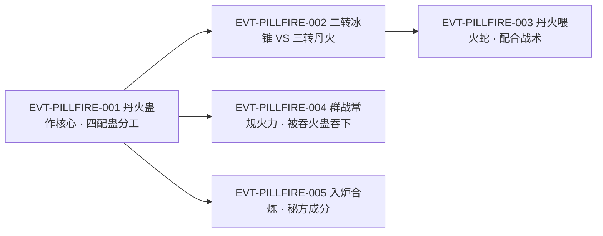

# 丹火蛊

丹火蛊是**三转**的**攻击类蛊虫**：一团橘红色的火球或一道火焰从使用者手中飞射而出，未中之前先有灼热；食指连点，就能连成一团团的密集攻势。它与二转的冰锥蛊对拼时**略胜一筹**——半空相撞，冰锥消融，而丹火虽然威势大减却依旧继续飞行。它便宜、常见、能批量上场，所以被当作**核心攻击蛊**来配置：用一分为二蛊让丹火数量增多，用巨大蛊让丹火变大增威，用火源蛊减少真元损耗，用走火蛊解决机动；与火蛇蛊同场时，丹火还能融入火蛇躯体，把萎靡的火蛇重新喂精神。它的代价不昂贵但持续——**每放一发都在烧真元**。

**检索口径（必读）**：本页为 2026-09-28 GU 蛊虫专题 40 页规模化恢复第二批 S2-1 分片的**新建页**。全书穷举扫描 `丹火蛊`：命中 **12 次 / 12 行**（段二 6 行、段三 4 行、段四 2 行），**无一行出现 2 次**。**锚点性质复核**：登记锚 `E:V2-057866` 经回原文打印确认为**正文行**（逐字：「白凝冰的冰锥蛊，只是二转。但是炎突的丹火蛊，却有三转级数。」），**三转明文就在这条锚行上**，该行不是题名行。**名字子串碰撞预筛（必做）**：`巨型丹火蛊`、`丹火蛊虫`、`丹火蛊王` 全书**均 0 次命中**；`丹火蛊` 全部 12 行的左邻字符实测集合为 空／了／到／只／是／有／用／的／着，**无一为 CJK 专名内字**，故 12 行全部为真实体命中，无子串误切。**同源名目分离计数**：`丹火`（去“蛊”）全书 **37 次 / 33 行** ＝ 本实体 12 行 ＋ 火焰本体（本蛊的输出物）**16 行** ＋ `丹火山`（地名）**2 行** ＋ `丹火鹤`（飞鹤种类）**3 行**；三者与本实体同名不同物，正文按《身份边界》并列，**一律不进 `aliases`**。正文按“原著事实（逐字＋E-ID）→ 合理推导 →《问真》设计意义”三层组织；引文一律回根原文 `source/蛊真人-clean.txt`，行号即 `E:V{段}-{6 位行号}`。

## 主题档案

### 一、身份与转数：三转的攻击核心蛊

#### 原著事实

- **转数与定位（登记锚所在行，正文行）**：「白凝冰的冰锥蛊，只是二转。但是炎突的丹火蛊，却有三转级数。」`E:V2-057866`。
- **被选为核心攻击蛊的完整配置**：「就拿小萧来说吧，他选择了丹火蛊为主要攻击手段，那么我就建议他，选用一分为二蛊，来使得丹火数量增多。又选了巨大蛊，使丹火变大，增长威力。还选了火源蛊，较少真元损耗。又用了走火蛊，当做他的移动蛊虫。」`E:V2-050232`。
- **被当作“最普通”的示例**：「就好像是用最普通的丹火蛊，发出一道火球。」`E:V4-142960`——即它的低门槛与高普及度在原文里是明写的。
- **群战中的常规火力**：「丹火蛊、金蚕蛊、霜息蛊、雪球蛊、龙卷蛊、炸雷蛊、火爪蛊等等，纷纷催动起来。」`E:V3-087128`；大会战场面亦以它为齐射主力之一——「一时间，大量的丹火、冰锥、骨矛、风刃，向着对方飞射过去。」`E:V3-097618`。
- **代价三方（本条自身的支付结构）**：**支付方**＝**使用者**（为它配齐一分为二蛊、巨大蛊、火源蛊、走火蛊四只辅助蛊，`E:V2-050232`）；**受益方**＝**使用者**（获得一套以丹火为输出核心、可持续输出的攻击组合，`E:V2-050232`、`E:V3-087128`）；**支付时点／生效条件**＝**配置先行、单发即时结算**——辅助蛊要先期配齐，而每一发的真元在“真元调动，灌输到丹火蛊中”的那一刻即被扣走（`E:V2-050232`、`E:V3-093786`）。

#### 合理推导

- **依据：**`E:V2-057866`＋`E:V4-142960`；**结论：**丹火蛊是**三转档的“制式输出”**——转数不高（三转）却被当作最普通的例子，说明它处在“人人可得、随时可用”的档位；因此它的强度不应被写成稀有蛊，而应被写成**基准伤害**；**不确定性：**原文未给单发威力数值，也未写它是否有使用门槛（如资质、真元属性）。
- **依据：**`E:V2-050232`；**结论：**它的实际战力**不由它自己决定**，而由围绕它配置的辅助蛊决定（数量、体积、损耗、机动四项各由一只蛊负责）——这使它成为**一个可被优化而非可被替换的核心**；**可能反例：**原文给出的这组配置来自魏央针对萧炎的个体建议，不能断言这是唯一或最优组合。

#### 《问真》设计意义

- **把“基准输出”做成一件平常蛊**（`E:V4-142960`、`E:V3-087128`）对数值设计很有价值：先定一条所有人都会用的输出线，再把稀奇蛊的价值定义成“相对这条线的增益”，平衡工作就有了参照点。
- **核心蛊＋四只辅助蛊的配置范式**（`E:V2-050232`）提示应当把强化拆成**互不重叠的四个维度**（数量／体积／成本／机动），让玩家在有限槽位里做取舍，而不是叠同一类增益。

### 二、攻击形态与射程手感：橘红色火球、连点连发

#### 原著事实

- 出场宣言式的发动：「丹火蛊！」`E:V2-057856`；同段双方同时出手——「四根白色的冰锥和三团橘红色的丹火，同时射向双方。」`E:V2-057860`。
- 连发成面：「他食指连点，一团团的丹火，组成密集的攻势，向白凝冰罩去。」`E:V2-057884`；缠斗中冰锥与丹火齐飞，二人持续闪躲、攻击 `E:V2-057888`。
- **灌输真元后成形的实物形态**：「面对扑上来的夜狼，唐方怒吼一声，空窍中真元调动，灌输到丹火蛊中。」`E:V3-093786`；「一团拳头大小的火球，飞射而出，激起一阵急风。」`E:V3-093790`。
- 另一种出手方式与飞行轨迹：「他右掌一推，一道橘红色的火焰，对准汪疆飞射而去。」`E:V3-093836`；「火焰在空中划过一道光弧，迅速接近汪疆的脸面。还未射中，汪疆就感到一阵灼热之意。」`E:V3-093838`。
- 可被合炼工序改造为稳定的“圆球丹火”：方源在秘方第四步「先是运用阳云蛊，并用丹火蛊」`E:V2-070260`，随后「但见阴阳二云，一上一下，混杂了前面步骤所得的烟气。橘黄色的圆球丹火，一颗颗的，从阳云中接连上升。」`E:V2-070262`。
- **代价三方（本条自身的支付结构）**：**支付方**＝**施术者的真元**（每发都要先把真元灌输进蛊中，`E:V3-093786`）；**受益方**＝**施术者**（换来可连发、可覆盖的投射攻势，`E:V2-057884`）；**支付时点／生效条件**＝**发射前一刻**——真元先入蛊、火球再飞出，中间没有延迟补偿（`E:V3-093786`、`E:V3-093790`）。

#### 合理推导

- **依据：**`E:V2-057860`＋`E:V3-093790`；**结论：**它的表现形态是**投射型（远程单体→可密集成面）**，同一只蛊能出“三团”“一团团”“一道火焰”多种形态，说明**发数与形态由使用者操控而非蛊体上限**；**不确定性：**原文未写单次最多可同时操控几发，也未写连点之间的最小间隔。
- **依据：**`E:V3-093838`；**结论：**伤害判定的“前置感”被明写（未射中先觉灼热），可作为**预警窗口**——目标在命中前已有感知余地，这与下文“可闪避”互证；**可能反例：**该场面中汪疆并未闪避而是主动吞火（`E:V3-093844`），故“可预警”不等于“可躲开”。
- **依据：**`E:V2-070262`；**结论：**丹火蛊的输出物能被合炼工序的场域**整形并稳定下来**（成一颗颗圆球上升），说明“丹火”是可控、可叠加的实体而非纯特效；**不确定性：**这是秘方工序中的特殊表现，原文未写常规战斗能否达到同样稳定的球形态。

#### 《问真》设计意义

- **同一蛊多种弹道形态**（`E:V2-057860`、`E:V2-057884`）可以省掉大量美术与规则成本：一个“火球”素材靠发数与排列就能支撑单人决斗到万人齐射的所有场面。
- **命中前的灼热预警**（`E:V3-093838`）是很好的可读性设计：让远程攻击在视觉与体感上先于数值结算出现，玩家凭感觉就能预判，降低对读条的依赖。

### 三、强度对照与克制：压得过二转、躲得开、吞得下

#### 原著事实

- **相撞结果（对拼判定）**：「一根冰锥和一团丹火，在半空中相撞，冰锥消融，但是丹火却依1日向白凝冰飞去，只是威势大减。」`E:V2-057864`；结论句——「对拼的话，自然是丹火略胜冰锥一筹。」`E:V2-057868`。
- **被机动性克制**：「丹火飞来，她敏捷地一跃，闪避开去，让所有的丹火都无功而返。」`E:V2-057874`。
- **被吞火类蛊吞掉**：「他张开嘴巴，一口就将丹火吞入肚中。」`E:V3-093844`；「这是——四转吞火蛊！」`E:V3-093846`；紧接的机制说明——「吞火蛊并非攻击蛊，而是存储蛊。但蛊师用蛊，向来存乎一心。谁说存储蛊，就不能用于战斗了？」`E:V3-093848`。
- **射程优势（与同门火属攻击蛊对比）**：「她事先有所准备，打听过炎突的底细。知道这火爪的攻击范围。并不如丹火，只能以炎突为中心，方圆数丈的空间活动。」`E:V2-057936`。
- **代价三方（本条自身的支付结构）**：**支付方**＝**被命中的一方或其防守资源**（以冰锥蛊对拼者付出“冰锥消融”的代价，`E:V2-057864`）；**受益方**＝**丹火蛊的使用者**（同一次相撞中占据优势，`E:V2-057868`）；**支付时点／生效条件**＝**双方攻击在半空相撞的那一刻同时结算**，因此“压过一筹”只在**对拼**这一条件成立时兑现，被闪避时该收益不发生（`E:V2-057864`、`E:V2-057868`、`E:V2-057874`）。

#### 合理推导

- **依据：**`E:V2-057864`＋`E:V2-057868`；**结论：**丹火的优势是**穿透性对拼**——同等对撞后它不消失只减威，因此对“以量取胜的低阶投射物”天然占优；但它减威后续飞，说明优势并非无损，**转数差带来的是“对拼后仍在场”而不是“对拼后可满威命中”**；**不确定性：**原文只给二转冰锥这一种对撞对象，无法据此推算它与同阶或更高阶投射物的对拼结果。
- **依据：**`E:V2-057874`＋`E:V3-093844`；**结论：**它的克制面是**速度与吞食**两类——“躲”消耗对方的机动资源，“吞”需要专门的高转存储蛊（四转吞火蛊），两者都不是通用解法，所以它在常规三、四转凡俗蛊师之间的战场上几乎无解（`E:V3-087128`、`E:V3-097618`）；**可能反例：**原文未写能否被水／冰／土类防御蛊挡下，只说冰锥对拼不占优。
- **依据：**`E:V2-057936`；**结论：**原文以同属火焰攻击的火爪蛊作参照，把丹火的攻击范围写成**更优的一方**；可推断丹火是“范围型投射”，而火爪是“贴身型近战火”；**不确定性：**原文只写火爪“只能以炎突为中心，方圆数丈”，未给丹火的具体射程。

#### 《问真》设计意义

- **“减威但续飞”比“直接消失”更好用**（`E:V2-057864`）：它让一次成功的对撞仍然留下后果，玩家因此更愿意主动拦截，而不是放任穿透后各自结算。
- **克制面刻意做窄**（`E:V2-057874`、`E:V3-093846`）是低阶核心蛊该有的样子：解法存在但需要专门资源（高转存储蛊）或成体系的机动，而不是人人具备的通用反制——否则基准输出会失去意义。

### 四、成本与强化配置：真元持续消耗，四只配蛊各管一项

#### 原著事实

- **持续消耗被明写**：「不过炎突同样在用着丹火蛊，对他而言，真元也在不断消耗。炎突虽然是四转，但却只是乙等资质。」`E:V2-057914`；同一场战斗里与其对抗者要付出的代价——「除非我动用冰雹蛊，引爆冰锥，才可压过丹火。但是如此一来，我的真元消耗就多了。」`E:V2-057870`。
- **配蛊四项分工**（同一条建议内逐项写明）：「选用一分为二蛊，来使得丹火数量增多。又选了巨大蛊，使丹火变大，增长威力。还选了火源蛊，较少真元损耗。又用了走火蛊，当做他的移动蛊虫。」`E:V2-050232`。
- **群战中的持续齐射**（消耗被结果侧写）：「在严家众人猛烈的攻势下，方源的狼群死伤惨重，但前仆后继，源源不断，舍身忘死。」`E:V3-087130`；「但这样疯狂的进攻，让她的真元消耗骤然增加。」`E:V2-058030`。
- **代价三方（本条自身的支付结构）**：**支付方**＝**使用者本人**（真元按发扣减、并以乙等资质的恢复速度被动承受，`E:V2-057914`）；**受益方**＝**使用者本人**（在长时间对攻中维持输出压力，`E:V2-058030`、`E:V3-087130`）；**支付时点／生效条件**＝**使用当时持续结算**——只要还在连点发射，成本就不断累积，因此它考验的是续航而不是单次爆发（`E:V2-057914`、`E:V2-058030`）。

#### 合理推导

- **依据：**`E:V2-057914`＋`E:V2-057870`；**结论：**丹火蛊的战斗是**真元对耗战**，胜负常用资质与恢复速度决定（原文以“三转和四转，毕竟真元是有差距”为白凝冰的战术依据）；**不确定性：**原文未给单发真元量或可用发数，无法换算续航。
- **依据：**`E:V2-050232`；**结论：**四项配蛊里唯一直接作用于成本的是火源蛊（减少真元损耗），其余三项作用于数量、体积与机动——说明“强化输出”与“削减成本”在原文里被明确分成**两条不同的配蛊路线**；**可能反例：**原文只写“较少真元损耗”，未写削减比例。
- **依据：**`E:V2-058030`；**结论：**疯狂进攻会让真元消耗“骤然增加”，即**攻击强度与消耗同步上升**，不存在“低消耗高输出”的用法；**不确定性：**该句主语是处于守势的一方，原文未把它直接归因于丹火蛊。

#### 《问真》设计意义

- **以续航为代价的持续输出**（`E:V2-057914`）适合做长线决斗：战斗的重点从“一发必杀”转成“谁先没真元”，让资质、恢复与配蛊都有发挥空间。
- **数量／体积／成本／机动四分法**（`E:V2-050232`）可以直接作为配装 UI 的信息架构：四类增益不重叠，玩家一眼就能看出取舍，减少“看起来都差不多”的构筑困惑。

### 五、战术与技术：与火蛇蛊的配合、屯球一次爆发

#### 原著事实

- **与火蛇蛊的配合战术（原文直接点名）**：「这丹火有的射向白凝冰，让她疲于躲闪。有的则射中火蛇。融入火蛇的躯体，萎靡的火蛇又变得精神奕奕。」`E:V2-058034`；「这是丹火蛊和火蛇蛊的配合战术。」`E:V2-058036`。
- 同一名使用者还在用它做压制：「“小丫头。别垂死挣扎了。”炎突哈哈一笑，打出一团团的丹火。」`E:V2-058032`。
- **“屯球一次爆发”的战术思路**：「就好像是用最普通的丹火蛊，发出一道火球。怎么样才能威力更大？绝大多数的正常人，都会这样想：将一颗颗火球积累起来，等到对战的时候，一同发出。」`E:V4-142960`；「如此，数量增多，招数的威力就得到的增长。」`E:V4-142962`。
- 该思路在原著中被判定为**寻常**：「事实上，这种囤积数量，再一次爆发的杀招设计思路，十分普遍常见。」`E:V4-142958`；「这是最平常，最简单不过的思路。」`E:V4-142964`。
- **代价三方（本条自身的支付结构）**：**支付方**＝**配合中的另一只蛊**（火蛇被打到萎靡，须靠丹火回补才能恢复状态，`E:V2-058032`、`E:V2-058034`）；**受益方**＝**同一使用者的整套攻势**（火蛇被喂回状态后继续牵制，`E:V2-058034`、`E:V2-058036`）；**支付时点／生效条件**＝**火蛇萎靡之后**，须在同场战斗中把丹火射向火蛇本体而非敌人——即用一次攻击机会换取一次状态回复（`E:V2-058034`）。

#### 合理推导

- **依据：**`E:V2-058034`＋`E:V2-058036`；**结论：**丹火蛊是**同一体系内的“燃料供给者”**：火属攻击蛊的损耗可以用它来补，因此它同时承担“输出”和“支援”两个功能；这也解释了为什么它会被当核心——核心蛊能喂周边蛊；**不确定性：**原文只说火蛇“变得精神奕奕”，未写回补是否会消耗额外真元、是否只对火属蛊有效。
- **依据：**`E:V4-142958`＋`E:V4-142960`＋`E:V4-142964`；**结论：**原文把“囤积后一次放”定性为**最普通不过的思路**，可见这在世界内是公认常识——因此评估一个蛊师强弱不能只看他的蛊，还要看他是否懂得这种上限抬升法；**可能反例：**该段用于解释一个更强杀招的设计原理，并非专评丹火蛊，故只作为“同类思路可套用”的旁证。
- **依据：**`E:V2-058032`＋`E:V2-058034`；**结论：**丹火可被**定向打到自己一方身上**（射中火蛇）并产生正面效果，说明它的判定是“火焰实体接触”而非“只对敌人生效”；**不确定性：**原文未写对非火属的己方目标使用会有什么后果。

#### 《问真》设计意义

- **核心蛊兼支援位**（`E:V2-058034`）能显著提高配装密度：玩家在“打输出”与“喂队友”之间做即时取舍，同一按键承担两种意图，操作深度上升而键位不增。
- **把“屯一波再放”写成世界常识**（`E:V4-142958`、`E:V4-142964`）可以让教学更自然：它不必做成隐藏技巧，而可以作为 NPC 会主动提醒的基础战术，玩家的成长体现在执行精度而非发现秘密。

### 六、在他人工程里的位置与同源名目边界

#### 原著事实

- **作秘方成分（被一眼识出）**：「嗯……是用了人皮，还有愧梅子、秋声草。嗯，还有丹火蛊，药力蛊。」`E:V3-085188`。
- **作合炼复投材料**：「到了中间的关键一步，他向火中闪电般抛入一只丹火蛊，一只魂球蛊。」`E:V4-151272`；「两只蛊虫在火中相互交融，旋即合二为一，成为鬼火蛊的雏形。」`E:V4-151274`；该手法被点名为「连续投入两只蛊虫，这是炼道手法——复投。」`E:V4-151278`。
- **作为战场上的通用火力**（见主题一）：严家众人齐出`丹火蛊`等七种蛊（`E:V3-087128`）；刘家与对方交战亦以丹火齐射（`E:V3-097618`）。
- **同源名目边界（同名不同物，逐项举原文）**：
  - `丹火山`＝**地名**：「将来若有什么难处，可去丹火山鬼哭洞，寻找自己的帮助。」`E:V2-061152`；后续「但只过了不到五十年，丹火山就发生大战，火山喷发，鬼哭洞湮灭。」`E:V2-061154`。
  - `丹火鹤`＝**飞鹤种类**：「铁喙飞鹤，丹火鹤，凤尾鹤，云烟飘渺鹤，星辰极光鹤……数万种飞鹤，或是盘旋，或是栖息在松树上」`E:V2-062130`；蛊仙鹤群阵中亦见——「鹤群乌压压一片，铁喙飞鹤，丹火鹤，凤尾鹤，云烟飘渺鹤，星辰极光鹤，幻电鹤混杂在一起」`E:V4-129646`；其战场用途「又有一群丹火鹤飞出，浑身燃起火焰，伤敌不伤身。」`E:V4-129658`。
  - `丹火`（不带“蛊”）＝**本蛊射出的火焰本体**（见主题二、三），如「让所有的丹火都无功而返。」`E:V2-057874`、「橘黄色的圆球丹火，一颗颗的，从阳云中接连上升。」`E:V2-070262`。
- **代价三方（本条自身的支付结构）**：**支付方**＝**投入材料的人**（把一只三转的成蛊连同一只魂球蛊一并投入火中销毁，`E:V4-151272`、`E:V4-151274`）；**受益方**＝**同一炼蛊者**（得到鬼火蛊雏形；此外它还是人皮蛊秘方的组成之一，`E:V4-151274`、`E:V3-085188`）；**支付时点／生效条件**＝**入火当时即不可回收**——两只蛊“合二为一”后原蛊不再存在（`E:V4-151274`）。

#### 合理推导

- **依据：**`E:V3-085188`＋`E:V4-151272`；**结论：**丹火蛊在这类场合里是**可被消耗掉的“零件”**：既可作为秘方里被识出的成分，也可整只投入火中参与合炼，其价值在于**便宜且常见**（`E:V4-142960`），因此适合做耗材；**不确定性：**原文未写替代它是否可行、也未写它在秘方中承担什么具体作用。
- **依据：**`E:V2-061152`＋`E:V4-129646`；**结论：**`丹火山` 与 `丹火鹤` 是与本实体仅共享词头的**其他对象**（一为地名、一为飞鹤），故本页把它们写成身份边界而非别名，以避免检索时把地名或飞鹤的记载误算进蛊的账上；**可能反例：**`丹火鹤` 名中带“丹火”或与其火属特性有关，但原文未说明二者的来源关系。
- **依据：**`E:V3-097618`＋`E:V3-087128`；**结论：**作为火力线的一端，丹火蛊在群战场面上被“大量”使用，说明其产出规模不受蛊师个体资质限制——这是它与[血滴子](blood-droplet-gu.md)、[鳄力蛊](blood-atk-1-18-gu.md)那种“个体化底牌”完全相反的定位；**不确定性：**原文只写众人齐射，未写单场可投入的数量上限。

#### 《问真》设计意义

- **同一只蛊既可上阵也可下炉**（`E:V4-151272`、`E:V3-085188`）让经济系统更紧凑：前线的常规输出蛊同时是后方的合炼耗材，价格与需求会因为战场消耗而自然联动，不需要额外的设计去制造循环。
- **同名不同物的边界必须写清**（`E:V2-061152`、`E:V2-062130`）是内容库的基本卫生：`丹火山` 是地名、`丹火鹤` 是飞鹤，下游若按词头聚合就会把三者混成一个实体，导致数值与文案自相矛盾。

## 状态时间线

| 状态 ID | 阶段 | 状态 | 证据 |
|---|---|---|---|
| ST-PILLFIRE-01 | 身份与转数 | [原著明确] 攻击类蛊虫，三转级数；登记锚 `E:V2-057866` 为正文行，三转明文即在该行 | E:V2-057866 |
| ST-PILLFIRE-02 | 定位 | [原著明确] 被当作核心攻击蛊配置；原文另以“最普通的丹火蛊”作为通用示例 | E:V2-050232、E:V4-142960 |
| ST-PILLFIRE-03 | 攻击形态 | [原著明确] 射出橘红色火焰／火球；可为一团拳头大小的火球，也可为一道划过光弧的火焰；未射中先有灼热 | E:V3-093790、E:V3-093836、E:V3-093838 |
| ST-PILLFIRE-04 | 连发 | [原著明确] 食指连点，一团团丹火组成密集攻势；缠斗中可持续齐飞不断 | E:V2-057884、E:V2-057888 |
| ST-PILLFIRE-05 | 对拼判定 | [原著明确] 与二转冰锥蛊半空相撞，冰锥消融而丹火继续飞行、威势大减；结论为丹火略胜一筹 | E:V2-057864、E:V2-057868 |
| ST-PILLFIRE-06 | 克制：机动 | [原著明确] 被闪避后“所有的丹火都无功而返” | E:V2-057874 |
| ST-PILLFIRE-07 | 克制：吞食 | [原著明确] 被四转吞火蛊一口吞入肚中；吞火蛊本为存储蛊而非攻击蛊 | E:V3-093844、E:V3-093846、E:V3-093848 |
| ST-PILLFIRE-08 | 射程 | [原著明确] 火爪蛊的攻击范围不如丹火，只能以使用者为中心、方圆数丈 | E:V2-057936 |
| ST-PILLFIRE-09 | 真元成本 | [原著明确] 使用中真元不断消耗；战斗胜负以真元差距与资质恢复为战术依据 | E:V2-057914、E:V2-057870、E:V2-058030 |
| ST-PILLFIRE-10 | 强化配置 | [原著明确] 一分为二蛊使丹火数量增多；巨大蛊使丹火变大增长威力；火源蛊减少真元损耗；走火蛊充当移动蛊 | E:V2-050232 |
| ST-PILLFIRE-11 | 协同 | [原著明确] 丹火射中火蛇并融入其躯体，使萎靡的火蛇重新精神；原文点名这是丹火蛊与火蛇蛊的配合战术 | E:V2-058034、E:V2-058036 |
| ST-PILLFIRE-12 | 战术常识 | [原著明确] “囤积数量、一次爆发”被原文判定为十分普遍常见的思路，并被称为最平常简单的思路 | E:V4-142958、E:V4-142960、E:V4-142962、E:V4-142964 |
| ST-PILLFIRE-13 | 群战用途 | [原著明确] 严家众人与刘家等大规模交战中均以丹火齐射，作为常规远程火力之一 | E:V3-087128、E:V3-097618 |
| ST-PILLFIRE-14 | 合炼用途 | [原著明确] 作人皮蛊秘方成分被地灵一眼识出；作鬼火蛊合炼的复投材料，投入后与魂球蛊交融成雏形 | E:V3-085188、E:V4-151272、E:V4-151274 |
| ST-PILLFIRE-15 | 同源边界与上限 | [原著未明确] `丹火山` 为地名、`丹火鹤` 为飞鹤种类、`丹火` 为本蛊输出物，三者非同物；单发威力数值、最大射程、可否同时操控多发、是否需火属真元，均未写 | E:V2-061152、E:V2-062130、E:V2-057874 |

## 原著明确内容（本批取证窗口登记）

本批对 `丹火蛊` 在根原文全书穷举扫描：命中 **12 次 / 12 行**（段二 6 行、段三 4 行、段四 2 行）。子串预筛 `巨型丹火蛊`／`丹火蛊虫`／`丹火蛊王` 均 0 命中。下表登记本批实际读取的窗口。

| 窗口 | 内容要点 | 用途 |
|---|---|---|
| 50228–50240 | 以丹火蛊为主要攻击手段的完整配置：一分为二蛊增数量、巨大蛊增威力、火源蛊省真元、走火蛊供移动；同段亦述蛊虫搭配与合炼择近的原则 | 主题一、四 |
| 57848–57940 | 白凝冰VS炎突：丹火蛊与冰锥蛊对射；三团橘红色丹火；相撞后冰锥消融而丹火续飞、威势大减；二转对三转略胜一筹；连点连发成密集攻势；闪避使丹火无功而返；真元持续消耗 | 主题二、三、四 |
| 58028–58045 | 炎突以一团团丹火压制；丹火射中火蛇并融入其躯体使其精神奕奕；原文点名这是丹火蛊与火蛇蛊的配合战术 | 主题五 |
| 61148–61158 | `丹火山`（地名）与鬼哭洞；火山大战后湮灭 | 主题六（边界） |
| 62124–62134 | `丹火鹤`（飞鹤种类）与仙鹤门万鹤并列 | 主题六（边界） |
| 70254–70284 | 秘方第四步：先用阳云蛊并用丹火蛊；橘黄色圆球丹火自阳云接连上升；丹火与金沙磨搓兽影 | 主题二 |
| 85184–85195 | 人皮蛊秘方成分被地灵一眼识出，其中包含丹火蛊 | 主题六 |
| 87124–87135 | 严家众人齐出丹火蛊等七种蛊冲锋 | 主题一、六 |
| 93780–93848 | 唐方灌输真元，一团拳头大小的火球飞射；右掌推出橘红色火焰、划出光弧、未中先觉灼热；被四转吞火蛊一口吞下 | 主题二、三 |
| 97614–97622 | 两军对射中大量丹火与冰锥、骨矛、风刃齐发 | 主题一、六 |
| 129642–129662 | `丹火鹤` 群“浑身燃起火焰，伤敌不伤身” | 主题六（边界） |
| 142955–142965 | “囤积数量再爆发”被判定为十分普遍常见的思路，并以最普通的丹火蛊放火球为例 | 主题五 |
| 151268–151278 | 炼蛊大会鬼火蛊合炼：向火中投入一只丹火蛊与一只魂球蛊，交融成雏形；点名炼道手法`复投` | 主题六 |

## 事件链

| 事件 ID | 事件 | 参与者 | 证据 | 因果 |
|---|---|---|---|---|
| EVT-PILLFIRE-001 | 萧炎以丹火蛊为核心攻击手段，魏央为其配齐一分为二蛊、巨大蛊、火源蛊、走火蛊四只辅助蛊 | 萧炎、魏央 | E:V2-050232 | evidences ST-PILLFIRE-02、ST-PILLFIRE-10 |
| EVT-PILLFIRE-002 | 白凝冰以二转冰锥蛊对炎突三转丹火蛊：半空相撞冰锥消融而丹火续飞、威势大减，丹火略胜一筹；白凝冰以甲等资质的恢复优势对抗炎突的四转修为 | 白凝冰、炎突、方源（旁观判读） | E:V2-057856、E:V2-057864、E:V2-057866、E:V2-057868、E:V2-057914 | evidences ST-PILLFIRE-01、ST-PILLFIRE-05、ST-PILLFIRE-09 |
| EVT-PILLFIRE-003 | 炎突以丹火蛊与火蛇蛊配合：丹火既射向白凝冰压制，又射中火蛇使其由萎靡转为精神奕奕 | 炎突、白凝冰 | E:V2-058032、E:V2-058034、E:V2-058036 | evidences ST-PILLFIRE-11 |
| EVT-PILLFIRE-004 | 丹火蛊作为常规火力大规模上场：严家众人齐出；唐方火球被汪疆以四转吞火蛊吞下；两军对射时大量丹火与冰锥、骨矛、风刃齐发 | 唐方、汪疆、严家众人、刘家与对方军阵 | E:V3-087128、E:V3-093790、E:V3-093844、E:V3-093846、E:V3-097618 | evidences ST-PILLFIRE-03、ST-PILLFIRE-07、ST-PILLFIRE-13 |
| EVT-PILLFIRE-005 | 方源把丹火蛊用作合炼材料：它既是人皮蛊秘方被识出的成分，又被整只抛入火中与魂球蛊交融，成为鬼火蛊雏形 | 方源、地灵、飞霜阁旁观者 | E:V3-085188、E:V4-151272、E:V4-151274、E:V4-151278 | evidences ST-PILLFIRE-14 |

事件口径：本页沿用实体簇号 `EVT-PILLFIRE-*`。事件节点 5 个（≥3），按模板配图。全图 4 条边，均有直接原文支撑：001→002 与 001→004（同一套配置分别在单挑与群战中兑现）、002→003（同一场战斗中由对射转入配合）、001→005（同一只蛊从战场转为炉内材料）。005 与其余四者虽同属本实体，但因果落在合炼线，故只与配置源头相连、不与他者连边。

## 资料整理

本页为**新建页**，无旧版可对；本批来源只有根原文，未引入 `notes:`／`memory:` 层转述。派生记录处置（**本段内容不得当作原著事实**）：

- `roster-3.md` 第 190 行把 `fire_atk_4_02_gu` 记为原文 3 转、原 game=4、并标注 L0 裁定 2026-09-25 依原文改 rank，与本页正文口径（`E:V2-057866` 三转明文）一致；`game/data/gu_lore.json` 同条 `lore_rank=3`、`status=ruling_applied`，仅作消费层核对，不据以改页。
- **锚点性质复核**：登记锚 `E:V2-057866` 回原文打印后确认为**正文行**（逐字：「白凝冰的冰锥蛊，只是二转。但是炎突的丹火蛊，却有三转级数。」），不是题名行；本页因此不需要另设题名行来作存在性证据。
- **分类账（全书穷举，含重复块、未去重）**：`丹火蛊` 命中 **12 次 / 12 行**（段二 6 行、段三 4 行、段四 2 行，均无重复计数）。逐行枚举（12 行，与实测集合逐个相等）：E:V2-050232、E:V2-057856、E:V2-057866、E:V2-057914、E:V2-058036、E:V2-070260、E:V3-085188、E:V3-087128、E:V3-093786、E:V3-093834、E:V4-142960、E:V4-151272。
- **同源名目分离计数（避免子串误切）**：`丹火` 全书 **37 次 / 33 行**，逐行分布＝本实体 **12 行**＋`丹火`（火焰本体，本蛊输出物）**16 行**（E:V2-057860、E:V2-057864、E:V2-057868、E:V2-057870、E:V2-057874、E:V2-057884、E:V2-057888、E:V2-057936、E:V2-058032、E:V2-058034、E:V2-070262、E:V2-070266、E:V2-070280、E:V3-093792、E:V3-093844、E:V3-097618）＋`丹火山`（地名）**2 行**（E:V2-061152、E:V2-061154）＋`丹火鹤`（飞鹤种类）**3 行**（E:V2-062130、E:V4-129646、E:V4-129658）。子串预筛 `巨型丹火蛊`、`丹火蛊虫`、`丹火蛊王` 全书 **0 次命中**；本实体 12 行左邻字符实测集合为 空／了／到／只／是／有／用／的／着，无一为专名内字。
- **头衔与专名（不引入 aliases）**：`丹火`（输出物）、`丹火山`（地名）、`丹火鹤`（飞鹤）与本实体同名不同物，一律不进 `aliases`；边界写在主题六与《待核对》。
- **桥接层视角（仅登记，不据以改 Canon）**：`game/**` 本批只读，不在改动范围；本页不据游戏侧数值回改原著口径。
- **原文自身的录入噪音**：根原文（clean 版）含少量讹字（如「丹火却依1日向白凝冰飞去」`E:V2-057864` 的“1”、以及“众入”“二入”一类误录）。本页引文一律**照录**原文，不改字、不补全、不做静默修正，以便逐字回溯。
- **本页引号规范（便于复核）**：角引号（U+300C／U+300D）只用于**可逐字回溯到原文行**的引文；分析用词、拼合名目与表格字段名一律用全角弯引号或反引号，不放进引文位置。

## 分析与解读

1. **丹火蛊是这套系统里的“基准线”**：原文用“最普通的丹火蛊”来举例（`E:V4-142960`），又让它在万人战场上成批出现（`E:V3-087128`、`E:V3-097618`）；它的价值不在于强，而在于**人人可得的稳定输出**——高阶蛊的强度只有在与它对照时才有意义。
2. **它的战力其实是配置的函数**：一只三转蛊能被四只辅助蛊分别改数量、改体积、改成本、改机动（`E:V2-050232`），说明原文把“变强”理解为**组合优化**而非单点升级；这与[地藏花蛊](earth-atk-5-03-gu.md)那种“功能唯一、只能换容积”的成长路径正好互为反面。
3. **它是少数能给自己人用的攻击蛊**：丹火射中火蛇、融入其躯体后让火蛇重新精神（`E:V2-058034`、`E:V2-058036`）——一次攻击同时是输出与补给，这种双重语义让它在同门体系里天然占据核心位。
4. **成本结构决定了它的战斗节奏**：真元按发消耗（`E:V3-093786`、`E:V2-057914`），使丹火战变成对耗战，胜负常取决于资质恢复而非单发威力（`E:V2-057870`、`E:V2-058030`）。
5. **两种被克制的方式都不便宜**：闪避要消耗机动资源（`E:V2-057874`），吞火要一只四转存储蛊（`E:V3-093846`、`E:V3-093848`）；因此它在三、四转蛊师的常规战场上接近无解（`E:V3-087128`）。
6. **它同时是炉料**：既作为人皮蛊秘方成分被识出（`E:V3-085188`），又被整只投入鬼火蛊的合炼（`E:V4-151272`、`E:V4-151274`）；便宜常见使它成为最顺手的耗材，这一点与它在战场上的普及度互相解释。

## 待核对

- `[存在冲突]` **同源名目的词头共用**：口径 A＝`丹火` 指本蛊射出的火焰本体（`E:V2-057874`、`E:V2-070262`）；口径 B＝`丹火山` 为地名（`E:V2-061152`）；口径 C＝`丹火鹤` 为飞鹤种类（`E:V2-062130`、`E:V4-129658`）。三者与本实体共享词头但原文未说明彼此关系（`丹火鹤` 是否因火焰特性命名，原文未写）。**当前状态：不裁定**——本页按三个独立身份登记，均不进 `aliases`。
- `[原著未明确]` **道属**：全书 12 行未见道属表述；本页据其火焰形态与火属配蛊（`E:V2-050232`、`E:V2-057860`）在 `tags` 中列为 `fire-path`，但**不作为原著事实断言**。id 前缀不对 Canon 生效，按 L0 本轮口径不改 id。
- `[原著未明确]` **数值类缺口（机制已确认、数值未知 → 拆条）**：机制 **[已确认]** ＝三转攻击蛊、射出橘红火球／火焰、可连点连发、对拼二转冰锥略胜一筹且衰威续飞、可被闪避与被吞火蛊吞下、真元按使用持续消耗、可配四只辅助蛊强化、可与火蛇蛊配合回补（`E:V2-057866`、`E:V2-057884`、`E:V2-057864`、`E:V2-057874`、`E:V3-093844`、`E:V2-057914`、`E:V2-050232`、`E:V2-058034`）；具体数值 **[待取证]** ＝单发真元消耗与可用发数、最大射程、可同时操控的发数上限、是否要求火属真元或特定资质。
- `[原著未明确]` **对同阶与更高阶投射物的对拼结果**：`E:V2-057864`、`E:V2-057868` 只给出对二转冰锥的比较，未写与其他转数投射蛊对撞会如何。
- `[原著未明确]` **可否被非吞食类防御挡下**：原文未写水罩、骨盾等防御对丹火的抵挡效果（`E:V3-097618` 只列双方同时升起的多种防御，未逐一交代结果）。
- `[原著未明确]` **回补火蛇的代价**：`E:V2-058034` 只写火蛇“又变得精神奕奕”，未写是否消耗额外真元、是否只对火属目标有效。
- `[改编／张力]` **桥接层转数**：`roster-3.md` 第 190 行与 `game/data/gu_lore.json` 记本实体原文 3 转、原 game=4 已裁定改为 3。游戏侧数值只作消费面登记，**不用以修正原著事实**。
- `[原著未明确]` **体积**：本页实测 **39,608 字节**，未超 GOVERNANCE 十进制口径 40,000 B 上限，无需登记例外（实测 39,608 字节 ≈ 38.68 KiB／39.61 KB 十进制）。

## 模板扩展建议（只登记，不改核心模板）

1. **需要“配蛊关系”的表达位**。丹火蛊的价值由围绕它的四只辅助蛊决定（`E:V2-050232`），模板只有实体间的“关联”，无法表达“某蛊为某蛊提供数量／体积／成本／机动”这种定向分工。
2. **需要“可对己方生效”的表达位**。它射中火蛇使其回状态（`E:V2-058034`、`E:V2-058036`），即攻击蛊兼支援蛊，模板默认攻击蛊只对敌生效。
3. **需要“同一只蛊的弹道形态可变”的表达位**。同一只丹火蛊能发出三团、一团团、一道火焰三种形态（`E:V2-057860`、`E:V2-057884`、`E:V3-093836`），模板按“一蛊一效果”写入会丢掉这个层次。
4. **需要“基准蛊”的表达位**。原文以“最普通的丹火蛊”作全书的强度参照（`E:V4-142960`），这属于跨实体的度量语义，模板没有任何位置可以声明“本页实体是基准”。
5. **需要“同名不同物”的表达位**。`丹火山`、`丹火鹤` 与 `丹火`（输出物）只能靠正文《身份边界》说明（`E:V2-061152`、`E:V2-062130`），建议模板给出并列登记的固定位，避免下游按词头聚合出错。

## 关联页面

[鬼火蛊](fire-atk-2-01-gu.md)、[火炭蛊](fire-mov-4-39-gu.md)、[地藏花蛊](earth-atk-5-03-gu.md)、[鳄力蛊](blood-atk-1-18-gu.md)、[血滴子](blood-droplet-gu.md)、[蛊虫关系](gu-relations.md)、[火道](../world/fire-path.md)、[真元](../world/primeval-essence.md)、[蛊的饲养与炼化](../world/gu-care-and-refinement.md)、[修行体系](../world/cultivation-system.md)、[经济名录](../world/economy-roster.md)、[蛊虫总表三期](roster-3.md)、[蛊虫总表](roster.md)。
