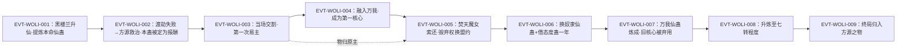

# 我力仙蛊

力道系仙蛊，**黑楼兰的本命仙蛊**：它由黑楼兰生母苏仙儿炼制、作为遗物留给黑楼兰，黑楼兰升仙后将其提炼为本命仙蛊（`E:V4-141926`）；全书的功能定位不是独立输出，而是**仙道杀招「万我」的第一核心**（`E:V4-143014`），核心位前身为净魂仙蛊（`E:V4-149774`）、后被万我仙蛊取代（`E:V5-292358`）。它在王庭时期成为**方源救醒黑楼兰的报酬**，由此在两方之间两度易主（`E:V4-142206`、`E:V4-178580`），终局归入方源之物（`E:V6-375902`）。

本页为 2026-09-28 A 线恢复批**新建页**。本实体有两个必须先声明的取证特征：**其一**，原文对「我力仙蛊」与近名的「我力蛊」存在**指代交叠段**，而两者在本库是**两个独立登记实体**（本页 id `force_atk_5_20_gu`，另一 id `force_atk_5_19_gu`），故正文设《身份边界》专节并给全部命中分类账（主题四）；**其二**，roster-3／`gu_lore.json` 所登记的锚点行里出现的「七转」**不是本蛊的转数**（主题一、主题三）。所有引文回根原文 `source/蛊真人-clean.txt`，行号即 `E:V{段}-{6位行号}`；正文按“原著事实 → 合理推导 →《问真》设计意义”三层组织。

## 主题档案

### 一、转数口径：段4两处明文六转，段5明记被升炼至七转

#### 原著事实

- **段4明文六转（两处独立）**：`E:V4-172800`「我力仙蛊是苏仙儿留给黑楼兰的遗物，对于黑楼兰而言，不仅仅只是一只六转仙蛊那么简单」；`E:V4-178490`「你居然想要一只区区六转的我力仙蛊，来换取我的态度蛊。」同段另有内心独白复述同一口径：`E:V4-178488`「就算我力仙蛊再重要，也不过区区六转」。
- **品阶与流派归属**：`E:V4-172798`「我力仙蛊是力道仙蛊」；`E:V4-178402`「我力仙蛊最适合黑楼兰」。
- **登记锚所指的「七转」不是本蛊的转数**：roster-3 与 `gu_lore.json` 均以 `E:V4-177370` 为锚，该行全文为「就算我力仙蛊还在我手，七转的战力根本不够看。」——「七转」是**持有者（方源）的战力**，不是蛊的品阶。
- **同构句旁证（「战力」层）**：`E:V4-143286`「敲诈出我力仙蛊，真是做对了。我的战力重新达到七转」；`E:V4-178632`「我力仙蛊在手，不过是增添了杀招万我的一式变招，充其量战力不过七转而已。」三处（含锚点行）一致把「七转」放在**战力**层。
- **段5中期仍记六转**：`E:V5-304194`「方源依赖的很多仙蛊中，有许多都还是六转层次。」紧接一句逐名点出本实体「比如我力仙蛊、拔山仙蛊、挽澜仙蛊、力气仙蛊、解谜仙蛊」`E:V5-304196`；两份仙蛊清单同样把它列在六转档：`E:V5-240968`「六转仙蛊有解谜、妇人心、血本、暗渡、****运、变形、力气、我力、飞熊之力、拔山、挽澜」、`E:V5-273794`「六转有我力、拔山、挽澜、力气」。
- **段5明记升炼至七转**：`E:V5-310474`「人如故、江山如故、我力、拔山、挽澜、狗屎运、时运等等，都已经被他提升到了七转程度。」此处「我力」为简称（分类账见主题四）；该行的升炼者与前句的炼蛊场景同属方源（`E:V5-310472`「方源炼蛊得到了巨大的成果！」）。

#### 合理推导

- **时点序列推断**。结论：本实体存在**至少两个转数时点**——黑楼兰持有期明文六转（`E:V4-172800`、`E:V4-178490`），方源升炼后为七转（`E:V5-310474`）。依据：段4两处独立六转明文＋段5的完成态升炼句（「都已经被他提升到了七转程度」）；且段5的六转清单（`E:V5-240968`、`E:V5-273794`、`E:V5-304196`）**行号均早于**升炼行 `E:V5-310474`，构成顺序自洽。不确定性／可能反例：清单的**叙述时点**未必等于其所在行的时点，若某份清单是"追述更早期状态"，则"六转→七转"的分界需要重排；原文未给清单加时点标注，本页不裁定。
- **锚点错位推断**。结论：roster-3 的 `lore_rank=7` 若取自 `E:V4-177370`，属**指代层级误读**（把"战力七转"当成"蛊七转"），而非把某个字看错。依据：该行主语链是「我力仙蛊还在我手」→「七转的战力」，「战力」是被持有者的属性；另有两处同构句（`E:V4-143286`、`E:V4-178632`）可互证。不确定性：若全书另有直接写作"七转的我力仙蛊"的行，则七转另有正文依据；本批按全量命中检索（命名预筛见主题四）**未见**这种行。

#### 《问真》设计意义

- 桥接层 `gu_lore.json` 记 `game_rank=5`（`status=rank_cap`）＋`lore_rank=7`，原文却是**六转→七转两段口径**。若 runtime 只承认一个转数，则"黑楼兰本命期"与"方源升炼后"两种强度无法同时表达；建议按持有者／时点设条件位，而不是在单一 `rank` 上加权。
- **"战力转数"与"蛊转数"同形不同义**：同一节内可以并排出现「六转的我力仙蛊」（`E:V4-178488`）与「我的战力重新达到七转」（`E:V4-143286`）。凡从行文里机械抽转数的流程，都必须先判定被修饰语是"蛊"还是"战力"，否则会稳定地产出本页登记的锚点错位型错误。

### 二、机制：它是「万我」的核心件，而非独立攻伐手段

#### 原著事实

- **功能定位（本命＋核心）**：`E:V4-141900`「我力仙蛊乃是她的本命仙蛊，更是她的杀招我力虚影的第一核心！」`E:V4-141922`「我力仙蛊对于黑楼兰而言是第一核心，对于方源而言，几乎同样如此。」
- **核心位的由来与替换链**：`E:V4-149774`「原本万我核心，是净魂仙蛊。而后净魂饥饿，不堪催用，便用我力代替。如今万我杀招的核心。已经有两个，一个是我力，一个是拔山。」据此**核心里既有本实体也有拔山蛊，并非唯一**；三核心并存另见 `E:V4-159038`「核心净魂仙蛊虽然不堪催用，但还有我力仙蛊、拔山仙蛊、挽澜仙蛊这三只力道核心。」
- **可否被替代**：`E:V4-148056`「我有我力仙蛊，充当核心，净魂就是毁灭，也不会令我伤筋动骨。」同句给出**带条件收益**：「当然，它若能再用，和我力一起，必能令万我杀招威力上涨一倍左右」——即"双核心"相对"单核心"有约一倍量级的增益，原文只给"一倍左右"这一模糊量。**代价／收益三要素登记**：**本条为纯收益条目，无支付方**（所挂行通篇是收益陈述，原文未写任何支付行为；成本面见下一条"融入时的微调工序"）；**受益方＝使用者本人**（增益只落在他自己的"万我杀招"威力上，未涉他人）；**支付时点或生效条件＝"净魂若能再用"且与我力并为核心之时**——原文用的是条件句（"它若能再用"），故该增益**并非常态在位**，须满足条件才成立。
- **融合成本**：`E:V4-140648`「不像是我力、力气仙蛊，拿到手中，几乎直接就可以和万我融合一体。因为万我的理念，本来就和后两者一致。」；`E:V4-141924`「我力仙蛊也是最为契合的，不像是拔山、挽澜还需要推算改善仙道杀招。」；但融入仍需微调：`E:V4-142298`「我力仙蛊虽然极为契合万我杀招，但方源还是历经数天，微微调整了一些辅助凡蛊。」**成本三要素登记**：**支付方＝融入者本人（方源）**（付出的是"历经数天"微调辅助凡蛊的时间与工序，不是资源对价）；**受益方＝融入者本人**（省去拔山／挽澜那种"还需要推算改善仙道杀招"的前置工作量）；**支付时点＝融入之时**——原文把它写成**一次性微调**（数天），而非持续消耗。
- **它所支撑的具体式样**：`E:V4-132422`「黑楼兰拥有仙蛊我力，用它催动之前的凡道杀招，形成力道虚影巨人」；`E:V4-143008`「黑楼兰曾经掌握我力仙蛊，她的杀招最强变化，便是一位力道巨人虚影。」；`E:V4-143004`「若换做之前的净魂仙蛊，是无法催出大手印来的。」；`E:V4-143014`「真正做到了奴力两道之间的相互转化支撑。」（即「大手印」这一式的关键件之一，`E:V4-143002`「还有一个关键，便是我力仙蛊。」）
- **量级旁证**：`E:V4-139886`「充当核心，就能将仙道杀招万我的威力，直接提升好几个档次！」；`E:V4-156768`「若是能将全力以赴蛊提炼到六转，那对杀招万我的提升，将是巨大的，仅次于我力仙蛊。」（此处把本实体列为**仅次于**某一升级收益的标杆，说明原文自己拿它当量级尺）。
- **失去它的即时后果**：`E:V4-142300`「缺少了净魂，但有了我力，如此一来，我的战力就回归到六转一流的程度。」；`E:V4-143364`「她失去了我力仙蛊，战力暴降。」；`E:V4-173922`「尽管他失去了我力仙蛊，导致战力骤降一大块。」；`E:V4-144884`「黑楼兰失去了我力仙蛊，战力较原先还稍弱一筹。」；`E:V4-180100`「我现在失去了我力仙蛊，不能催动力道大手印。」
- **后期被取代**：`E:V5-292352`「以前，单单用万我杀招，就要涉及我力仙蛊」／同句后半「现在却是只需催动万我仙蛊即可。」；`E:V5-292358`「在万我仙蛊炼成之后，方源就又改良了万我大手印，形成全新的版本，以万我仙蛊为核心。之前的核心我力仙蛊，却是被方源抛弃。」；但**被抛弃不等于报废**：`E:V5-292360`「如此一来，我力仙蛊就可以用在其他方面。」
- **存量形态**：`E:V5-209130`「就算他不再催动万我仙道杀招，他的仙窍中也提前储备了数十万的我力虚影。」

#### 合理推导

- **"核心件而非独立武器"推断**。结论：本实体的战场价值几乎全部经由杀招兑现。依据：五处独立表述都把它的作用写成"充当核心"（`E:V4-139886`、`E:V4-142296`、`E:V4-143014`、`E:V4-149774`、`E:V5-290832`），且失去它时原文一致用"战力下降／不能催动某式"来写后果（`E:V4-180100`、`E:V4-173922`），而不是"失去某种攻击"。不确定性／可能反例：`E:V4-142300` 说明它同时构成可量化的战力基数，故"不可独立作战"只是**用途形态**层面的推断，不等于"没有直接战力贡献"。

- **"核心位可热插拔"推断**。结论：原文给出了至少三次核心位变更（净魂 → 我力 → 万我仙蛊；另一路 拔山／挽澜加入形成多核心）。依据：`E:V4-149774`、`E:V5-292358`、`E:V4-159038`。不确定性：原文未说明核心位是否有**同时并存上限**，"三个力道核心并存"（`E:V4-159038`）与"以万我仙蛊单一核心"（`E:V5-292358`）之间是能力差异还是纯粹优化，未交代。

#### 《问真》设计意义

- 适合实现为**装备位／增幅器**而不是独立法宝：装上→杀招成形且威力档位上浮（`E:V4-139886`）；核心位被替换→退居储备但仍可挪作他用（`E:V5-292360`）。原文已自带"核心可替换＋被替换后不贬值"的完整样例，可直接当装备位系统的设计依据。
- 数值层建议把"核心件贡献"写成**可缺省的乘区**：`E:V4-142300`（缺净魂但换我力→战力回到六转一流）与 `E:V4-148056`（双核心→威力上涨"一倍左右"）说明同一杀招在不同核心组合下有离散档位，而不是线性叠加。

### 三、归属流转：苏仙儿遗物 → 黑楼兰本命 → 方源两度交割

#### 原著事实

- **来历**：`E:V4-178400`「这只我力仙蛊，对黑楼兰非常重要。」所指的来历见同段本句：`E:V4-178402`「这只我力仙蛊是黑楼兰的亲生母亲苏仙儿炼制，是其母留给黑楼兰的遗物。」；另有 `E:V4-172796`「毫无疑问，是我力仙蛊。」（回答"对黑楼兰而言什么最重要"）与 `E:V4-172800`「有着极其重要的纪念意义」。
- **第一次易主（黑楼兰 → 方源）**：
  - 交易标的与对价：`E:V4-141898`「方源救醒她的报酬，便是我力仙蛊。」——**支付方＝黑楼兰，受益方＝方源，时点＝方源将其救醒（以仙道杀招收尾）之后**。
  - 黑楼兰的抵抗与本钱：`E:V4-141918`「十数次和方源谈判，威逼咆哮、软语请求、陈说利弊，以及拿大局要挟。用尽种种手段，都是想挽回我力仙蛊。」；她的扣留手段见 `E:V4-141936`「气极之下，便故意扣着方源的我力仙蛊不给」；她本可赖账却不敢，因为"违约则黎山仙子应誓而亡"（`E:V4-142192`「一旦违背协约，黎山仙子就会应誓而亡。」）。
  - 交割现场：`E:V4-142140`「如今终于熬不过，将本命仙蛊我力送了过来。」；她先试图以另一只顶替——`E:V4-142158`「黑楼兰是想用力气仙蛊，替代我力，当做报酬交给方源。但方源绝不会答应。」；最终 `E:V4-142204`「吃到一半，黑楼兰深深地叹口气，将我力仙蛊交到了方源手中。」、`E:V4-142206`「两人当场完成交割，我力仙蛊至此易主！」
  - **方源侧的对价与让利**：交接后他反手把吃力仙蛊借给黑楼兰，代价是力道仙材——`E:V4-142214`「今后楼兰仙子若要借吃力仙蛊修行，就拿相应的一份力道仙材作为报酬罢。」原文对这轮交换的定性是双面的：`E:V4-142222`「方源强索我力仙蛊，简直就是在两人的联盟上，深深地割开一道血口」／`E:V4-142224`「不过，对比珍贵唯一的我力仙蛊而言，方源借出吃力仙蛊，更像是给黑楼兰一个台阶下。」**三要素登记**：**支付方＝黑楼兰**（每次借用须付"相应的一份力道仙材"）；**受益方＝黑楼兰**（借到吃力仙蛊修行；方源侧收到仙材属对价，不列为受益方）；**支付时点或生效条件＝每次借用之时**（原文写作"若要借……就拿……作为报酬"，按次计价，非一次性）。
- **第一次归还（方源 → 黑楼兰，经文道盟约）**：方源握有**毁弃权**作为筹码——`E:V4-172744`「我力仙蛊已经被方源炼化，只需要一个念头，就会毁掉。」；索还方向为焚天魔女（`E:V4-172824`「不错，我想要的就是你手中的我力仙蛊。」），方源的立场是"取得方式正当"（`E:V4-172850`「方源获得我力仙蛊的方式，十分恰当。」）；换取的回报包括**勾销仙材欠款并解除僵盟盟约**（`E:V4-172926`「只要你归还我力仙蛊，这点也没有问题。」、`E:V4-172946`「我力仙蛊给了你们，我手中就没有趁手的力道仙蛊了。」）；交割按约即时执行——`E:V4-172988`「盟约一旦订下，我就当场将我力仙蛊归还给你们。」、`E:V4-173188`「他便依约而行。当着两位姨妈的面，将我力仙蛊交还给黑楼兰。」、接收方重新炼化——`E:V4-173210`「黑楼兰接过我力仙蛊，在方源意识的主动退让下，她很快就顺利地将其炼化。」**三要素登记**：**支付方＝方源**（交出本蛊）；**受益方＝黑楼兰**（重获本命蛊并当场重新炼化）；**支付时点或生效条件＝新盟约订立之时**（原文写"盟约一旦订下，我就当场将我力仙蛊归还给你们"；方源一侧的对价为勾销仙材欠款＋解除僵盟盟约）。
- **第二次交割（方源 → 黑楼兰，换奴隶仙蛊＋借态度蛊一年）**：方源先抛出该蛊作为议价筹码——`E:V4-178386`「于是下一刻，方源掏出了我力仙蛊，放在手心，递给黑楼兰。」；对方压价（六转换八转不划算）——`E:V4-178442`「我愿意用这只我力仙蛊，换取你手中的态度蛊。」被否（`E:V4-178490`）；改价——`E:V4-178518`「那么我就退一步，用这只我力仙蛊。换取你手中的奴隶仙蛊。」；成交——`E:V4-178580`「方源交还我力仙蛊，换取黑楼兰的奴隶仙蛊，同时借用态度蛊一年时间。」明知吃亏仍要做，因为真实目标是仙蛊屋——`E:V4-178630`「方源不惜付出我力仙蛊，仍旧是为了仙蛊屋惊鸿乱斗台」、`E:V4-178632`「我力仙蛊在手，不过是增添了杀招万我的一式变招，充其量战力不过七转而已。」；相对价格判断见 `E:V4-178526`「对于她而言，我力仙蛊的价值，当然比奴隶仙蛊要大得多。」**三要素登记**：**支付方＝方源**（交出本蛊，原文明写他"不惜付出"）；**受益方＝黑楼兰**（得本蛊）；**支付时点或生效条件＝该次谈判成交之时**（同一句记方源换得奴隶仙蛊＋借用态度蛊一年，且其真实目标是仙蛊屋惊鸿乱斗台）。
- **终局归属**：`E:V6-375902`「黑楼兰原本拥有力气仙蛊、飞熊之力仙蛊、我力仙蛊，都成了方源之物。」中间层的旁证：宝黄天交易清单里它曾被列为目标（`E:V5-198862`「这三只仙蛊，我也要纳入交易的清单之中。」），义天山大战后归入方源却落入宝黄天（`E:V5-199306`「其中就有原本属于黑楼兰的力气仙蛊、我力仙蛊、飞熊之力仙蛊。」）；另有一次它**没有被喂饱**的记录（`E:V4-178118`「将自己手中的仙蛊都统统喂饱，除了我力仙蛊和智慧蛊。」）。

#### 合理推导

- **"它被反复用作支付手段"的推断**。结论：原文至少四次把本实体放在**对价位置**（救命的报酬 `E:V4-141898`、解除僵盟的条件 `E:V4-172926`、换奴隶仙蛊 `E:V4-178580`、宝黄天交易标的 `E:V5-198862`）。依据是四处的句式都把它写成"交出／归还／纳入清单"而非"使用"。不确定性：这不能推出它"容易获得"——`E:V4-173210` 的"顺利炼化"依赖方源**意识的主动退让**，即易主成本被人为压低了，正常情形下仙蛊炼化难度原文另有交代（`E:V4-178488` 对方宁可拒绝交换）。
- **"善意的两面性"推断**。依据：`E:V4-142224` 把借出吃力仙蛊读作"给台阶"，而 `E:V4-142222` 又把强索读作"割开血口"；两句相邻而立场相反，说明原文对同一动作**故意不给单一评价**。结论：同一动作在原文内部被给出两种评价，"善意／恶意"因此不能作为本实体的属性登记。**不确定性**：两句的立场限定不同（"给台阶"是对黑楼兰而言、"割开血口"是对两人联盟而言），原文未裁定哪一面为主，本页只并列两面。当前状态：本页并列登记，不统一（参见《待核对》）。

#### 《问真》设计意义

- 本页给出的是**同一条道具在两方手里反复易主的完整链**，适合直接做剧情驱动的**归属状态机**：`黑楼兰本命 → 方源（报酬） → 黑楼兰（盟约） → 方源（换蛊） → 方源（终局）`。每一步都自带条件（盟约、毁弃权、对价物），可直接写成触发条件而不必虚构。
- 注意**毁弃权**这一稀有字段（`E:V4-172744`）：持有者已炼化即有"一个念头毁掉"的处置能力，这使它在谈判中是威慑物而非单纯资产。若 runtime 只把它当装备，会丢掉剧情层最关键的一环。

### 四、身份边界：本页不是「我力蛊」；近名与子串的判别

#### 原著事实（分类账）

本实体在全书的名字字面命中，按**逐行看上下文**分类如下（检索口径：以 `split('\r\n')` 逐行读 `source/蛊真人-clean.txt`，行号即 `E:V{段}-{行号}`；统计单位为**行**，含重复出现的行只计一次）：

| 类 | 内容 | 行数 | 代表 E-ID |
|---|---|---|---|
| A | **本实体全名「我力仙蛊」** | 83 | `E:V4-172800`、`E:V4-177370`、`E:V5-292358` |
| B | 另一实体的名字「我力蛊」（库内 id `force_atk_5_19_gu`） | 6 | `E:V4-128088`、`E:V4-140172`、`E:V4-141902`、`E:V5-199800`、`E:V5-290820`、`E:V5-290822` |
| C | **裸「我力」但确指本实体（原文简称）** | 24 | `E:V4-142140`、`E:V4-142918`、`E:V5-292352`、`E:V5-310474` |
| D | 杀招／虚影名（「我力虚影」「我力杀招」「凡道杀招我力」「我力巨人虚影」） | 9 | `E:V4-135058`、`E:V4-140654`、`E:V4-159386`、`E:V5-290810`、`E:V5-290820` |
| E | **非本实体**：普通短语或它词子串（「我力气」「我力量」「我力所能及」「我力道」「我力挽狂澜」「本我力道虚影」「万我力道虚影」等） | 14 | `E:V1-020366`、`E:V2-042992`、`E:V2-062072`、`E:V4-123196`、`E:V5-322842`、`E:V6-425630` |

- 该组词根「我力」的全部命中为 **132 行**，上表五类**无遗漏**（A∪B∪C∪D∪E 覆盖全部命中；四行因同时含 A 与 C／B 而跨类：`E:V4-141900`、`E:V4-141902`、`E:V4-148056`、`E:V5-290820`）。
- **E 类的样板**：`E:V1-020366`「你我力气相差并不大」、`E:V2-042992`「我从小力气就超出常人」、`E:V2-062072`「只要我力所能及」、`E:V4-123196`「本我力道虚影」、`E:V5-322842`「看我力挽狂澜啊」、`E:V6-425630`「这是我力所能及的事情」。**这些行与蛊虫无关**，是"我"＋"力气／力量／力挽狂澜／力所能及／本我／万我"的切分假象。
- **D 类的样板**：`E:V4-135058`「黑楼兰目前正在努力地将凡道杀招我力虚影，推到仙级程度。」——「我力虚影」是**杀招名**，不是蛊名。
- 「我力仙蛊」与「我力蛊」的**指代交叠**（原文层面的两名混用，逐处列出）：
  - `E:V4-128088`（同一句交替使用两名；该句同时含「她是用飞熊之力仙蛊炸出的仙窍」与「她还将原来的核心我力蛊，提升到六转层次。」）
  - `E:V4-140172`（方源索酬时用「我力蛊」称它）「我不要别的，却看中了黑楼兰手中的我力蛊、力气蛊。两条命，两只蛊。」
  - `E:V4-141902`（前句写「失去我力仙蛊」，后句改称「涉及我力蛊」并说它是苏仙儿留下的纪念物）
  - `E:V5-199800`（**把「我力蛊」列入六转仙蛊清单**，与 `E:V5-240968`／`E:V5-273794` 的「我力」并列）
  - `E:V5-290820`／`E:V5-290822`（讲「凡道杀招我力」浓缩成「我力蛊」的蛊方）
- **本实体与「我力蛊」的边界（本页态度）**：两者在本库是**两个登记实体、两个 id、两行登记、两条转数记录**（`force_atk_5_19_gu` 记 6／锚 `E:V4-128088`；`force_atk_5_20_gu` 即本页记 7／锚 `E:V4-177370`）。原文对两名的指代**确有交叠**（上列五处），本页**不据此合并**，也不把「我力蛊」写进本页 aliases；同一句内两名并用者（`E:V4-128088`、`E:V4-141902`）按"口径 A（两名为同一对象的不同写法）／口径 B（两名各指一物，凡蛊 vs 仙蛊）"并列登记，当前状态**不裁定**（见《待核对》）。
- **与其它近名者**：`E:V5-209130`「他的仙窍中也提前储备了数十万的我力虚影」中的「我力虚影」是量词化的产物名，与蛊区分；`E:V5-290832`「核心仙蛊是我力、拔山、挽澜、净魂。」中的「我力」是**核心位清单里的简称**，指本实体。

#### 合理推导

- **"混用段是原文自身的写法问题，不是本页的分类问题"推断**。结论：`E:V4-128088` 在一句之内先用「飞熊之力仙蛊」、再用「我力蛊」描述同一批本命级物件，且该句的**六转层次**结论与段4两处「我力仙蛊」明文六转（`E:V4-172800`、`E:V4-178490`）方向一致。依据：三处六转口径互相吻合。不确定性：本推断只说明"该处两名可读作同一对象"，**不足以**证明全书两名恒等——`E:V5-290820`／`E:V5-290822` 把「我力蛊」当作**可炼制的成品蛊**（有蛊方），与"苏仙儿遗物、仙蛊唯一"（`E:V4-141928`「仙蛊唯一。」）之间存在张力。
- **"E 类占比高"推断**。结论：在 132 行命中里，真正指本实体的 A＋C 为 107 行（含跨类重复），而非实体的 E 有 14 行、属别实体的 B 有 6 行、属杀招名的 D 有 9 行。依据：上表逐行分类。不确定性：D 类中 `E:V4-131428`「我力！」一处是**杀招呼喝**，若按"催动即用到蛊"读法也可归入 C 类，本页按"文本表面是招名"归 D 并在此说明。

#### 《问真》设计意义

- 命名检索必须**先做子串切分**：把「我力」当关键词做全局匹配，会稳定地捞进"我力气／我力量／力所能及／力挽狂澜"等 14 行杂质。建议数据层对这类"短名＋高同形率"的实体（本页、我力蛊、飞熊之力蛊同属此列）统一要求**全名优先、简称白名单**，而不是任意子串命中。
- "仙蛊唯一"与"同名可炼制"在桥接层是**两条互斥规则**（`E:V4-141928`「仙蛊唯一。」vs `E:V5-290822` 可炼制的我力蛊）。runtime 若要落地唯一性校验，必须先决定这两个 id 是否共享唯一性域，否则会出现"同一域内两只同名唯一蛊"的非法态。

## 状态时间线

| 状态 ID | 阶段 | 状态 | 证据 |
|---|---|---|---|
| ST-WOLI-01 | 本命期（黑楼兰持有） | 力道系六转仙蛊、黑楼兰本命仙蛊、杀招「我力虚影」第一核心；系其母苏仙儿所炼遗物 | E:V4-172800、E:V4-141900、E:V4-178402、E:V4-141926 |
| ST-WOLI-02 | 议价期（渡劫失败后） | 被定为方源救醒黑楼兰的报酬；黑楼兰十余次交涉索回未果，改用扣留手段施压 | E:V4-141898、E:V4-141918、E:V4-141936 |
| ST-WOLI-03 | 第一次易主（交割） | 黑楼兰当场交出，方源持有；易主瞬间完成 | E:V4-142204、E:V4-142206 |
| ST-WOLI-04 | 方源核心期 | 被融入仙道杀招「万我」，成为第一核心；与拔山等并列构成力道核心组 | E:V4-142296、E:V4-143014、E:V4-159038 |
| ST-WOLI-05 | 威慑/索还期 | 已被方源炼化，握有"一个念头即毁"的毁弃权；焚天魔女出面索还 | E:V4-172744、E:V4-172824、E:V4-172850 |
| ST-WOLI-06 | 第一次归还（物归原主） | 新盟约订立后当场交还；黑楼兰借方源意识退让顺利重新炼化 | E:V4-172988、E:V4-173188、E:V4-173210 |
| ST-WOLI-07 | 第二次交割（换蛊与借物） | 方源以本蛊换黑楼兰的奴隶仙蛊，并借用态度蛊一年 | E:V4-178518、E:V4-178580 |
| ST-WOLI-08 | 中期（六转维持期） | 义天山大战后归入方源；同期原文仍把它列在六转档 | E:V5-199306、E:V5-240968、E:V5-273794、E:V5-304196 |
| ST-WOLI-09 | 升炼期 | 与同批仙蛊一并被方源提升到七转程度 | E:V5-310474 |
| ST-WOLI-10 | 被取代期 | 万我仙蛊炼成后成为新核心，本蛊被方源抛弃，可改作他用 | E:V5-292352、E:V5-292358、E:V5-292360 |
| ST-WOLI-11 | 终局 | 黑楼兰原有的力气、飞熊之力、我力三蛊皆成方源之物 | E:V6-375902 |

## 原著明确内容（本批取证窗口登记）

| 窗口 | 内容要点 | 对应主题 |
|---|---|---|
| 128088–128100 | 黑楼兰渡劫升仙第三步炼出仙蛊；本命蛊为飞熊之力蛊；「原来的核心我力蛊」被提升到六转层次；方源清点其家底为「飞熊之力、我力、力气以及奴隶仙蛊」四只 | 主题一、四 |
| 131540 | 黑楼兰在对敌时以本蛊为手段的意愿表达（「那就让我动用我力仙蛊罢」） | 主题二 |
| 132418–132426 | 以本蛊驱动凡道杀招形成「力道虚影巨人」，仅"勉勉强强"够仙道杀招水准 | 主题二 |
| 139884–139886 | 方源评估杀黑楼兰的收益；本蛊被评为"充当核心即可让万我威力提升好几档次" | 主题二 |
| 140172–140224 | 方源向黎山仙子索要本蛊与力气蛊为报酬；黎山仙子以"只能二选一"还价；最终方源改取山盟蛊，索要未成 | 主题三 |
| 140644–140658 | 「我力、力气仙蛊」几乎可直接与万我融合，但融入仍需推算 | 主题二 |
| 141896–141970 | 本蛊被定为救治报酬引发冲突；黑楼兰本命/第一核心的双重地位；扣留施压与协约约束 | 主题二、三 |
| 142136–142224 | 交割现场全过程：以力气蛊顶替被拒→当场交出→易主→反手借出吃力仙蛊收力道仙材报酬→原文对其给出双面评价 | 主题三 |
| 142290–142302 | 融入万我成功；原文自评"战力回归六转一流"、"万我杀招比之前还要更强一点" | 主题二 |
| 142910–143020 | 「万我——第一式——大手印」的催动全景：凡蛊＋本蛊形成光团，数十万力道虚影参与；净魂仙蛊无法催出大手印 | 主题二 |
| 143284–143288 | 方源自评"敲诈出我力仙蛊，真是做对了"、"我的战力重新达到七转" | 主题一、三 |
| 143362–143366、144884、145138 | 黑楼兰失蛊后战力下降的三处复述 | 主题二 |
| 148052–148058 | 双核心增益："和它一起"可使万我杀招威力上涨"一倍左右" | 主题二 |
| 149770–149780 | 核心位替换链明写：净魂→我力；当前核心已为两个（我力、拔山） | 主题二 |
| 151984–151992 | 「见面似相识」因境界不足无法用本蛊当核心（"我力……都不适合"） | 主题二 |
| 156766–156770 | 本蛊被原文当作杀招提升的**量级标杆**（全力以赴蛊升到六转"仅次于我力仙蛊"） | 主题二 |
| 159036–159040 | 三个力道核心（我力、拔山、挽澜）并存 | 主题二 |
| 172736–172750 | "一个念头即毁"的毁弃权成立；索还方为焚天魔女 | 主题三 |
| 172794–172852 | 焚天魔女视角：本蛊是夺回目标、方源的取得方式"十分恰当" | 主题三 |
| 172910–172950 | 归还条件：勾销欠款、解盟；方源以"需另炼力道仙蛊"为由索要仙僵尸躯 | 主题三 |
| 172984–172992 | 盟约订立即当场归还的承诺 | 主题三 |
| 173184–173214 | 归还执行完毕、黑楼兰重新炼化、物归原主 | 主题三 |
| 173920–173924 | 失蛊后战力骤降一大块 | 主题二 |
| 177364–177376 | **登记锚所在窗口**：方源权衡"就算本蛊在手，七转战力也不够看"，转向争夺仙蛊屋惊鸿乱斗台 | 主题一、三 |
| 178024–178028 | 本蛊相对仙蛊屋的价值排序（"都显得不那么重要了"） | 主题三 |
| 178116–178124 | 方源的仙蛊盘点：力道方面列有我力仙蛊；本蛊与智慧蛊是当时未被喂饱的两只 | 主题三 |
| 178380–178444 | 第二次交割谈判：交蛊姿态、六转换八转被拒、改换奴隶仙蛊 | 主题三 |
| 178480–178534 | 价格认知：对方认定本蛊"也不过区区六转"；方源一方认为其价值高于奴隶仙蛊 | 主题一、三 |
| 178574–178584 | 成交条款：换奴隶仙蛊＋借态度蛊一年＋协助斩杀黑城 | 主题三 |
| 180098–180102 | 失去本蛊导致不能催动力道大手印 | 主题二 |
| 195388–195396 | 黑楼兰当年把「我力虚影」提升到仙级极为困难（对照方源改杀招之易） | 主题二、四 |
| 198860–198864 | 宝黄天交易清单纳入本蛊 | 主题三 |
| 199304–199312 | 义天山大战后的去向（"原本属于黑楼兰的……我力仙蛊"） | 主题三 |
| 199796–199804 | 六转仙蛊清单（此处写作「我力蛊」） | 主题一、四 |
| 209126–209134 | 万我催动的存量形态：仙窍中预储数十万我力虚影 | 主题二 |
| 240964–240972、273790–273798 | 两份仙蛊分档清单把本实体列于六转（写作「我力」） | 主题一、四 |
| 290804–290836 | 炼道至理：杀招可浓缩为蛊；「凡道杀招我力」→「我力蛊」蛊方；万我核心仙蛊清单含「我力」 | 主题二、四 |
| 292348–292364 | 万我仙蛊炼成，核心换代；旧核心被抛弃但可他用 | 主题二 |
| 304194–304198 | 期末盘点：本实体当时仍属"六转层次" | 主题一 |
| 310468–310478 | 升炼成果：与同批仙蛊一并"提升到了七转程度" | 主题一 |
| 328506–328514 | 追述杀招源流：北原王庭时期"结合六臂天尸王、我力"开创奴力合流之招 | 主题二 |
| 375898–375906 | 宿命大阵期间的对局收束；三蛊皆成方源之物 | 主题三 |

## 事件链

| 事件 ID | 事件 | 参与者 | 证据 | 因果 |
|---|---|---|---|---|
| EVT-WOLI-001 | 黑楼兰渡劫升仙、第三步炼出仙蛊，并将核心我力蛊提升到六转层次、提炼为本命仙蛊 | 黑楼兰、太白云生（转述） | E:V4-128088、E:V4-141926 | evidences ST-WOLI-01 |
| EVT-WOLI-002 | 黑楼兰渡劫失败陷梦境，方源以解梦救醒；报酬被定为该蛊，黑楼兰十余次交涉索回未果 | 方源、黑楼兰、黎山仙子、太白云生 | E:V4-141898、E:V4-141918、E:V4-141936 | evidences ST-WOLI-02 |
| EVT-WOLI-003 | 黑楼兰以力气仙蛊顶替被拒，卡最后时限当场交出，本蛊第一次易主 | 黑楼兰、方源 | E:V4-142158、E:V4-142204、E:V4-142206 | evidences ST-WOLI-03 |
| EVT-WOLI-004 | 方源把本蛊融入仙道杀招万我，成为第一核心；「大手印」一式由此成立 | 方源 | E:V4-142296、E:V4-142298、E:V4-143004、E:V4-143014 | evidences ST-WOLI-04 |
| EVT-WOLI-005 | 焚天魔女出面索还；方源以"一个念头即毁"为筹码，以新盟约换归还 | 焚天魔女、方源、黎山仙子、黑楼兰 | E:V4-172744、E:V4-172824、E:V4-172988、E:V4-173188 | evidences ST-WOLI-05、ST-WOLI-06 |
| EVT-WOLI-006 | 方源以本蛊换奴隶仙蛊，并借用态度蛊一年；真实目标是仙蛊屋惊鸿乱斗台 | 方源、黑楼兰、黎山仙子、太白云生 | E:V4-178442、E:V4-178518、E:V4-178580、E:V4-178630 | evidences ST-WOLI-07 |
| EVT-WOLI-007 | 万我仙蛊炼成，方源改以它为新核心，本蛊被弃用（可挪作他用） | 方源 | E:V5-292352、E:V5-292358、E:V5-292360 | evidences ST-WOLI-10 |
| EVT-WOLI-008 | 方源升炼本蛊等一批仙蛊至七转程度 | 方源 | E:V5-310474 | evidences ST-WOLI-09 |
| EVT-WOLI-009 | 宿命大阵期间黑楼兰落败；其原本持有的力气、飞熊之力、我力三蛊尽归方源 | 方源、黑楼兰 | E:V6-375902 | evidences ST-WOLI-11 |

事件口径：本页沿用实体簇号 `EVT-WOLI-*`（与分配前缀 `ST-WOLI-` 同簇，未与既有 EVT 前缀冲突）。事件节点 9 个，已达"≥3 节点应配 mermaid"的阈值，故配 mermaid 主干；其中 `EVT-WOLI-005` 同时收束 EVT-WOLI-003 的易主与随后归还，故以虚线回指。事件时序按原文行号推定，`EVT-WOLI-006` 与 `EVT-WOLI-005` 之间另有一次"宝黄天未喂饱"的中间状态（`E:V4-178118`），未单列节点。

## 资料整理

本页为**新建页**，没有旧版；本批来源只有根原文，没有 `notes:`／`memory:` 层转述进入本页事实区。相关派生记录的处置登记如下（本段内容不得当作原著事实）：

- `roster-3.md` 第 58–59 行同区块并列两条：`| force_atk_5_19_gu | 我力蛊 | 5 | 6 | E:V4-128088 |  |` 与 `| force_atk_5_20_gu | 我力仙蛊 | 5 | 7 | E:V4-177370 |  |`。本页复核：**两个 id 的分立是正确的**（原文两名确有交叠指代，但本库把它登记为两个实体，本页不合并）；**本页的第 9 条（我力仙蛊 记 7）锚点有误**——`E:V4-177370` 的「七转」修饰"战力"，见主题一。原文支持本实体的七转依据在 `E:V5-310474`（且该行写作简称「我力」）。本页不改 roster／不改 game，仅登记。
- `game/data/gu_lore.json` 的 `force_atk_5_20_gu` 为 `game_rank=5`、`status=rank_cap`、`lore_rank=7`、`anchor=E:V4-177370`；`game/data/gu_names.json` 第 231 行为 `"force_atk_5_20_gu": "我力仙蛊"`。与本页结论的差异只在**锚点与 `lore_rank` 的取证依据**（同上）；`game/**` 只读，不在本批改动范围。
- **id 归类张力（派生层）**：id 前缀为 `force_atk_*`（力道·攻击），而原文中本实体的作用形态是**杀招核心件**（主题二），"攻击"只是它经杀招兑现后的表现，不是它自身的直接功能。本轮不改 id，仅登记。
- **既有页交叉**：[斤力蛊](force-atk-1-05-gu.md) 属同一 `force_*` 力道序列表（一转档）；[蛊虫关系](gu-relations.md) 是合炼／升炼／本命／替代协同四条规则的图谱入口，本页主题二涉及的"核心位替换"属其中"替代协同"一类的实例；[宿命蛊](fate-gu.md) 的《资料整理》已声明「命运蛊」不是宿命蛊的别名，与同批页 [命运蛊](heaven-atk-5-02-gu.md) 互为边界，本页不复制其结论。
- **同批姊妹页**：本页与"我力蛊"（`force_atk_5_19_gu`，roster-3 已登记、尚无独立页；同批由其他分片负责）是**近名同族的两页**。本页只陈述 `force_atk_5_20_gu`，不代写对方；两页的《身份边界》专节应互相指向，若对方页尚未落地，本页的边界结论以本页分类账为准，且**不把对方的名字写入本页 aliases**。
- **重复文本块检查**：本批对本实体命中行做了相邻行比对，**未见** `heaven-atk-5-07-gu.md`《资料整理》登记过的那种"逐行重复文本块"；本页"83 行／132 行"等计数为去重到行的口径（同一行内多次出现只计一行）。

## 分析与解读

1. **本实体最容易被写错的地方不是机制，而是转数**：全书对它的直接品阶明文是"六转"（`E:V4-172800`、`E:V4-178490`、`E:V4-178488`），而"七转"在它身边出现三次全部修饰**战力**（`E:V4-177370`、`E:V4-143286`、`E:V4-178632`）。登记表取的恰好是后者。任何后续页面引用本实体转数时，应区分"蛊六转（段4）／蛊七转（`E:V5-310474`，段5升炼后）"与"持有者战力七转"三层，不要合并。
2. **它的价值是被"理念契合"定价的，而不是输出**：`E:V4-140648` 与 `E:V4-141924` 两句都把"契合"当作免推算的理由，`E:V4-142298` 又给出"仍需数天微调"的反向限定。三句合起来说明原文把"核心件"的强度建模为**契合度**，而不是战力数值——这正是它从黑楼兰手里进到方源手里能做到"几乎直接融合"的原因。
3. **它是一条完整的长链道具，且每一步都有对价**：报酬（`E:V4-141898`）→ 盟约（`E:V4-172926`）→ 换蛊（`E:V4-178580`）→ 升炼（`E:V5-310474`）→ 取代（`E:V5-292358`）→ 终局（`E:V6-375902`）。本页《事件链》9 节点的价值在于可直接当状态机，无需虚构过渡；而两次"归还"都不是善意行为，各自有强制条件（黎山仙子应誓／仙蛊屋需求），这一点若抹平，剧情张力会整段消失。
4. **"六转维持期"与"升炼期"并存并不矛盾，但它要求清单带时点**：`E:V5-240968`、`E:V5-273794`、`E:V5-304196` 三处仍记六转，且行号均早于 `E:V5-310474`。本页按顺序读通；但**任何跨页引用这些清单的页面都应知道它们描述的是升炼之前的状态**。
5. **两名混用是被原文自己承认的现象**：`E:V4-128088` 一句之内两名并用，说明这不是检索噪声；而 `E:V5-199800` 把「我力蛊」写进六转仙蛊清单，进一步表明**混用出现在作者的系统性清点段落里**。因此本页把它列为"需要并列口径的高杠杆事实"，而不是可忽略的笔误。
6. **同批次页面的互链不可省**：本页与"我力蛊"（`force_atk_5_19_gu`，roster-3 已登记、尚无独立页）、[飞熊之力蛊](force-mov-5-21-gu.md) 共享同一段原文（`E:V4-128088` 一句内同时出现"飞熊之力仙蛊／飞熊之力蛊／我力蛊"三名），三页任一侧缺链，读者都会看不到自己那一半。

## 待核对

- `[存在冲突]` **桥接层：`lore_rank=7` 的锚点行指代错位**。`roster-3.md:59` 与 `game/data/gu_lore.json`（`force_atk_5_20_gu`）都以 `E:V4-177370` 为锚并记 "7"，而该行全文是「就算我力仙蛊还在我手，七转的战力根本不够看。」——「七转」修饰"战力"。原文支持本实体七转的唯一依据是段5升炼行 `E:V5-310474`（写作简称「我力」）。**证据**：`E:V4-177370`、`E:V4-143286`、`E:V4-178632` 三处同构句一律把七转放在"战力"层；本实体的直接品阶明文为六转（`E:V4-172800`、`E:V4-178490`）。**当前状态**：本页按"四段六转／五段升炼七转"陈述，不代改 roster／game；`lore_rank=7` 的**数值结论**与原文不冲突，**取证依据**需由主持人改挂到 `E:V5-310474`（或补注"七转系升炼后口径"）。
- `[存在冲突]` **原文内部：两名（我力仙蛊／我力蛊）的指代交叠**。口径 A（两名为同一对象的不同写法）＋证据：`E:V4-128088`（一句内并用）、`E:V4-141902`（前句"失去我力仙蛊"、后句"涉及我力蛊"并同指苏仙儿纪念物）、`E:V4-140172`（索酬时用"我力蛊"）。口径 B（两名各指一物，蛊分凡／仙两级）＋证据：`E:V5-290820`／`E:V5-290822`（"我力蛊"是有蛊方、可炼制的成品蛊）、`E:V4-141928`（"仙蛊唯一。"）与 `E:V5-199800`（"我力蛊"被列入六转仙蛊清单）。**当前状态**：不裁定；本库按两个 id 分立登记，本页只陈述 `force_atk_5_20_gu` 并给全部命中分类账（主题四），不合并、不互相写 aliases。
- `[待取证]` **"段4两处六转"与"段5升炼七转"之间的具体时点**：原文只给"都已经被他提升到了七转程度"（`E:V5-310474`）这一完成态，未写升炼发生在哪一具体情节节点。**当前状态**：本页以"清单行号早于升炼行"作为顺序依据（`E:V5-304196` < `E:V5-310474`），属**推定**，非原文明文。
- `[待取证]` **核心位是否允许三核心以上并存**：`E:V4-159038`（我力／拔山／挽澜三只力道核心）与 `E:V5-292358`（改以万我仙蛊单核心）之间缺中间说明；原文未给核心位上限。
- `[待取证]` **"威力上涨一倍左右"的口径**：`E:V4-148056` 的"一倍左右"是模糊量，原文未给基准（相对单核心？相对净魂期？）。本页不作数值化。
- `[原著未明确]` **升炼至七转所需的材料与代价**：`E:V5-310474` 只记结果，未写升炼消耗。**三要素登记**：**支付方＝升炼者（方源）**（承担材料与工序，原文未记明细）；**受益方＝升炼者本人**（本蛊转数上浮直接增强其实力）；**支付时点或生效条件＝升炼发生之时**（原文只给完成态）。
- `[原著未明确]` **它与「我力蛊」（`force_atk_5_19_gu`）在唯一性规则上是否同一域**：`E:V4-141928`「仙蛊唯一。」是对仙蛊的一般规则，原文未就该两名是否同域作出任何说明。本页不裁定，改由《问真》侧决定（见主题四设计意义）。
- **锚点性质与批次提示不符（需上抛）**：本批任务提示另列 [天妒仙蛊](heaven-atk-5-03-gu.md) 的登记锚 `E:V6-402772` 为"章节题名行"；本页所辖四页中，**本页锚点 `E:V4-177370` 经核实为正文行**（其上一章节目录行在第 177366 行），故本页按"正文行锚点"处理。该提示涉及的是同批另一页，本页仅记录本页的核实结果，不对他页下结论。
- **体积**：本页已超 40 KB，按 GOVERNANCE 登记例外；未为压到 40 KB 删除有效知识（超标原因是本实体跨段 4／5／6 共 83 行全名命中，且承担"我力仙蛊 vs 我力蛊"的身份边界分类账）。
- 本页**不自证**：以上 `[已确认]`／`[待取证]`／`[原著未明确]` 均按本页可见证据标注，最终由独立只读校验组复核。

## 模板扩展建议（只登记，不改核心模板）

1. **"锚点行中同名词的修饰对象"应成为固定校验项**。本页的错位（"七转的战力"被当成"七转的蛊"）不是孤例风险：凡实体页的登记锚都可能是"含关键数字的正文句子"，而数字的修饰对象未必是实体本身。建议在《待核对》模板里预置"锚点行修饰对象核对"一行。
2. **"同族两名"需要成对登记位**。本页与 `force_atk_5_19_gu` 的关系是"近名同族、指代交叠"，现有骨架只能在《身份边界》里用散文写；建议给同批成对实体一个成对锚（pair anchor）字段，使两页互相可跳转，且不允许任一侧把对方名字塞进 aliases。
3. **"清单类证据"需要时点字段**。本页主题一依赖三份仙蛊分档清单（`E:V5-240968`、`E:V5-273794`、`E:V5-304196`），它们的效力完全取决于时点；现有《取证窗口登记》只有行号与内容要点，建议加一列"时点／叙述层"。
4. **"归宿链"宜有专用小节**。本页的三次易主（易主—归还—再交割）在《状态时间线》里可读，但缺一个把"对价物"并列的可视化位；事件链表的"因果"列目前只能写 `evidences ST-*`，无法表达"以 X 换 Y"。

## 关联页面

我力蛊（`force_atk_5_19_gu`，roster-3 已登记、尚无独立页）、[飞熊之力蛊](force-mov-5-21-gu.md)、[斤力蛊](force-atk-1-05-gu.md)、[蛊虫关系](gu-relations.md)、[蛊虫总表三期·游戏映射蛊精蒸馏](roster-3.md)、[蛊虫总表](roster.md)、[蛊虫总表二期](roster-2.md)、[力道](../world/strength-path.md)、[炼蛊与杀招链](../world/gu-refine-killer-chain.md)、[蛊的饲养与炼化](../world/gu-care-and-refinement.md)、[杀招](../rules/killer-moves.md)、[道痕](../rules/dao-marks.md)、[真元](../world/primeval-essence.md)、[黑楼兰](../characters/he-lou-lan.md)、[方源](../characters/fang-yuan.md)、[蛊虫与蛊师能力来源](cultivator-effects-and-scouting.md)
