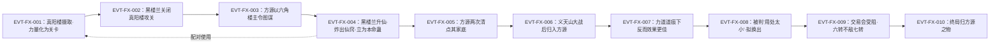

# 飞熊之力蛊

力道系仙蛊，原文两处直接给出「六转」口径（`E:V3-109462`、`E:V5-242154`）。它第一次登场是在**八十八角真阳楼第六十八层**——被真阳楼摄取进来、炼化，并"利用它本身的力量"形成该层的第一百道关卡（`E:V3-109576`）；同一批情节里，它是黑楼兰志在必得之物，因为**大力真武体必须有力道仙蛊方可晋升蛊仙**（`E:V3-109526`）。它后来确实承担了这一职能：黑楼兰渡劫升仙时**用它炸出仙窍**，该蛊系巨阳意志所给，并随即成为她的**本命蛊**（`E:V4-128088`）。再往后，它与力气、我力二蛊一并归入方源（`E:V5-199306`），但在方源手里被判"用处太小"（`E:V5-241318`），最终在交易会上因只有六转而被群仙视为占便宜（`E:V5-242176`）。

本页为 2026-09-28 A 线恢复批**新建页**。三条必须先声明的取证特征：**其一**，本实体是**薄证据实体**——字面「飞熊之力蛊」只有 8 行，加别写与简称去重后确指本实体的也只有 25 行，而共用词根「飞熊」的全文命中达 267 行；本页对**未被命中覆盖的推论一律标注"尚未找到"**，不得读作"原著没有"（参见《待核对》）。**其二**，本实体与另一实体「飞熊虚像蛊」在原文里是**被明确并列的一对**，二者在本库是两个不同对象，故正文设《身份边界》专节并给全部命中分类账（主题四）。**其三**，本实体的登记锚 `E:V3-109462` 经核实是**正文行**（同页另列的第一百道关卡与人物出场行分属其他实体）。所有引文回根原文 `source/蛊真人-clean.txt`，行号即 `E:V{段}-{6位行号}`；正文按"原著事实 → 合理推导 →《问真》设计意义"三层组织。

## 主题档案

### 一、机制：攻击时「有一定几率爆发出飞熊虚像，打出飞熊神力」

#### 原著事实

- **流派与转数**：`E:V3-109462`「这是一只六转力道仙蛊，名为飞熊之力蛊。」这是全书第一次给出本实体的完整名、流派与品阶；同段旁证其所在层位与来历：`E:V3-109458`「就在这六十八层中，存在着一只力道仙蛊！」、`E:V3-109460`「黑楼兰拥有一角楼主令，这只力道仙蛊刚刚被八十八角真阳楼摄取进来，他就知晓了。」
- **唯一一处直接机制句**：`E:V3-109466`「飞熊之力蛊，可以令蛊仙攻击之时，有一定几率爆发出飞熊虚像，打出飞熊神力。」该句给出三个要素：**触发时机＝攻击之时**；**触发方式＝有一定几率**（概率型，不是必定触发）；**产物＝飞熊虚像＋飞熊神力**。`[已确认]`
- **产物量级的参照系**：`E:V3-109464`「飞熊乃是荒兽，战力媲美蛊仙。」；`E:V3-106858`「镇守五层第一百道关卡的，是一头荒兽飞熊的虚像。」；`E:V3-106854`「这还只是一头飞熊的虚像，只有真正本体的一半威能。」——三句合起来给的是"虚像≈荒兽飞熊的一半威能、而荒兽飞熊战力媲美蛊仙"这一量级刻度。
- **本体力量可自成一关**：`E:V3-109576`「八十八角真阳楼先摄取到飞熊之力蛊，将其炼化，利用它本身的力量，形成第一百道关卡。」同段给出真阳楼的运转口径：`E:V3-109584`「常人都知道，八十八角真阳楼中关卡越难，奖励越是丰厚。其实反过来讲，正是因为奖励越厚，蛊虫越强，关卡才越是艰难。」
- **力量增幅的旁证（效果层）**：`E:V5-203200`「我方才动用飞熊之力仙蛊，力量的确大增。但是飞熊变化，却险些出了差错。」；`E:V5-203210`「倒是飞熊之力，却有力道道痕增幅，效果更佳一些。」；`E:V5-219314`「幸亏我的飞熊变杀招中，掺杂进了飞熊之力，真正具备了飞熊的力量」。
- **触发为概率型而非稳定型，原文另有自承**：`E:V5-223186`「飞熊变威能不佳，虽然我有飞熊之力仙蛊。」——该句评价的对象是**杀招「飞熊变」**而非蛊本身（见主题四），但它是原文唯一一次明确把"威能不佳"与"持有本蛊"并置的句子，故在此登记而不替它抹平。

#### 合理推导

- **机制 [已确认]／数值 [待取证] 的切分**。结论：本实体可确认为"攻击时按几率触发、产物是飞熊虚像＋飞熊神力"（`E:V3-109466`）。依据：该句是三段式完整描述（时机／概率／产物），非叙述性夸张。**不确定性**：原文**未给**几率数值，也**未给**飞熊虚像或飞熊神力的强度档位；本页不代填，按契约拆为上一条 `[已确认]` 与本条 `[待取证]`。
- **"本体有可被外部抽取的力量"推断**。结论：真阳楼能单以本蛊形成一道关卡，说明其"本身的力量"可被外部机制量化调用。依据：`E:V3-109576`＋`E:V3-109584` 的强度正相关口径。**不确定性／可能反例**：关卡难度还含"真阳楼炼化"这一外部加工环节，故不能由关卡难度反推蛊的等阶，只能得到"存在可被抽用的力量"这一较弱结论。
- **"效果名与蛊名同形"推断**。结论：`E:V5-203210` 与 `E:V5-219314` 里的"飞熊之力"更可能指**经由本蛊产生的力道增幅效果**，而不是蛊本体（句法上是"掺杂进了飞熊之力"而非"动用了飞熊之力蛊"）。依据：同页另有的表述用全名或别写指涉蛊本体（`E:V5-203200`「我方才动用飞熊之力仙蛊」）。**不确定性**：两者在原文中无法严格区分——"效果"必然由蛊产生，本页只登记该交叠，不裁定该两行的归类（见主题四分类账 C 类）。

#### 《问真》设计意义

- **概率触发值得直接实现为战斗判定**：`E:V3-109466` 的"攻击之时，有一定几率"是原文给出的完整触发契约（时机＋概率＋产物），可直接写成"每次攻击掷一次判定，命中则附加一次飞熊虚像形态的力道打击"。原文未给几率数值，**建议把几率做成可调参数并在数据层显式标注"原著未给定值"**，而不是由本页凭空填一个数。
- **"虚像只有本体一半威能"可做伤害系数来源**：`E:V3-106854` 给出了一个原文自带的**倍率**（一半），且其上限参照物（`E:V3-109464`"战力媲美蛊仙"）也有原文依据。这比自造倍率更符合"原著事实优先"。
- **"力量可被外部机制抽用"提示本实体不只是持有者增益**：`E:V3-109576` 记载真阳楼能把一只蛊的力量转写为一道关卡的难度。若 runtime 需要"关卡难度由素材蛊决定"这类机制，本行是原文内唯一的现成样例。

### 二、晋升门槛：大力真武体「必须有力道仙蛊，方可晋升蛊仙」

#### 原著事实

- **黑楼兰的动机**：`E:V3-109468`「这正是黑楼兰需要的仙蛊，有了它，他就能晋升成力道蛊仙了！」
- **门槛的原文表述**：`E:V3-109526`「贤侄是大力真武体，必须有力道仙蛊，方可晋升蛊仙。」该句出自黑城之口，指向黑楼兰（本批该段用"他/她"混指黑楼兰，本页按原文照录，不改写人称）。
- **她取得它的方式与对价**：`E:V4-128088`「她是用飞熊之力仙蛊炸出的仙窍，这只力道仙蛊是巨阳意志给她的。飞熊之力蛊现在是她的本命蛊。」同句另记同批所得：同句「她还将原来的核心我力蛊，提升到六转层次。除了这些，她还得到一只六转力气蛊。」——**支付方＝巨阳意志（赐予）**；**受益方＝黑楼兰**；**生效条件／时点＝她渡劫升仙、以本蛊炸出仙窍之时**。
- **它并非遗物**：与同持有者的另一只力道仙蛊不同（那一只是苏仙儿的遗物，见 [我力仙蛊](force-atk-5-20-gu.md)），本实体的来源明文是"巨阳意志给她的"（`E:V4-128088`）。
- **攻关难度与可调用实力的关系**：`E:V3-109488`「可供他调用的实力越小，他取得飞熊之力蛊的难度就越大。」；以及黑楼兰为此关闭真阳楼、倾全族之力：`E:V3-109496`「第六十八层，就是我族攻略的重点」。

#### 合理推导

- **"资格件优先于战力件"推断**。结论：本实体对黑楼兰的第一价值是**晋升资格**而非输出。依据：`E:V3-109468` 把"得到它"直接等同于"能晋升成力道蛊仙"，`E:V3-109526` 又把门槛表述为流派条件（"必须有力道仙蛊"）而非指定个体。**不确定性**：原文未说明是否**任何**力道仙蛊都满足该门槛；`E:V3-109526` 的字面只要求"力道仙蛊"，故不能由本页断定"必须这一只"。
- **"门槛件"与"本命蛊"是两个身份**。结论：`E:V3-109526` 讲的是成仙条件，`E:V4-128088` 讲的是她升仙后的本命蛊归属。依据：两句分处两段、语境不同。**不确定性**：原文未说明二者是**同一动作**（升仙时一并炼成本命）还是**先后两步**，本页不裁定。

#### 《问真》设计意义

- **适合实现为"晋升条件道具"而不是战力件**：把 `E:V3-109526` 的门槛写成晋升前置（体质＋流派双条件），把 `E:V4-128088` 的"炸出仙窍"写成触发动作，二者同挂在一只道具上。
- **与同持有者的另一页成对设计**：同一持有者（黑楼兰）的两只力道仙蛊分工明确——本实体管**入场资格**（`E:V3-109526`、`E:V3-109468`），[我力仙蛊](force-atk-5-20-gu.md) 管**输出核心**（该页主题二）。两页合看，才能解释她"为什么同时需要两只力道仙蛊"。
- **"赐予而非掠夺"是可用剧情原语**：`E:V4-128088` 明写来源为巨阳意志所赐。若 runtime 需要"势力向新人投喂门槛件"这一原型，本行是原文依据，不必虚构。

### 三、转数与交易价值：全篇一律六转，与七转仙蛊「价值完全不等」

#### 原著事实

- **转数明文**：首见即六转（`E:V3-109462`）；段5交易现场再次自陈六转，`E:V5-242154`「我的这只飞熊之力仙蛊，只有六转罢了。」；紧接复述 `E:V5-242164`「现在，飞熊之力居然只是六转。」
- **段5两份仙蛊分档清单把它列在六转档**：`E:V5-199800`「六转仙蛊解谜蛊、妇人心蛊、血本蛊、暗渡蛊、狗屎运蛊、变形蛊、力气蛊、我力蛊、飞熊之力蛊、拔山蛊、挽澜蛊、江山如故蛊、人如故蛊、星眸蛊。」；`E:V5-240968`「六转仙蛊有解谜、妇人心、血本、暗渡、****运、变形、力气、我力、飞熊之力、拔山、挽澜」。（`E:V5-240968` 行内有一处字面被原文写作 `****运`，本页逐字照录，不改写。）
- **交换条款与受阻过程（逐句）**：方源提出 `E:V5-242146`「我这里有飞熊之力仙蛊……」→ 庙明神当场答应 `E:V5-242148`「换了。」→ 方源补述实情 `E:V5-242154` → 对方神色一变 `E:V5-242156`「庙明神神色一变。」→ 估值口径给出 `E:V5-242160`「飞熊之力，乃是力道仙蛊。卜卦龟背仙蛊，却是属于变化道。」＋`E:V5-242162`「力道式微，变化道却是兴盛不衰。这两者之间，本来就是飞熊之力，要弱于卜卦龟背仙蛊一筹。」→ 转数差距 `E:V5-242164`、`E:V5-242166`「六转仙蛊怎能和七转仙蛊，相提并论？」、`E:V5-242168`「价值完全不等。」→ 判语 `E:V5-242176`「方源想要用区区一只六转仙蛊飞熊之力，换取七转的卜卦龟背仙蛊，说得好听些，是痴心妄想，说得不好听一些，是贪婪无度，想要占便宜。」
- **交易规则与成本口径**：`E:V5-242144`「不过即便如此，仙蛊交易向来只能用仙蛊换仙蛊，用其他东西，是不成的。」；`E:V5-242174`「炼出一只六转仙蛊的难度，和炼出一只七转仙蛊的难度，也是完全不一样的。」
- **方源侧的处置动机**：`E:V5-241312`「飞熊之力仙蛊，虽然是力道，但方源变化上古剑蛟，这种仙蛊并不合用。」；`E:V5-241318`「总结下来，妇人心、飞熊之力、骨刺这三只仙蛊，对方源而言，用处太小，若是能换成其他适合方源的，那就再好不过了。」
- **归属链（三段）**：被真阳楼摄取（`E:V3-109460`）→ 黑楼兰本命蛊（`E:V4-128088`）→ 归入方源（`E:V5-199306`「其中就有原本属于黑楼兰的力气仙蛊、我力仙蛊、飞熊之力仙蛊。」）→ 终局 `E:V6-375902`「黑楼兰原本拥有力气仙蛊、飞熊之力仙蛊、我力仙蛊，都成了方源之物。」中间层另有方源两次把它计入黑楼兰家底：`E:V4-128094`「这样说来，黑楼兰手中可以确定的仙蛊已经有四只。分别是飞熊之力、我力、力气以及奴隶仙蛊。」、`E:V4-139884`「杀了黑楼兰，就有力气仙蛊、我力仙蛊、飞熊之力、奴隶仙蛊。前三者，乃是力道仙蛊。」
- **代价／收益的四要素登记**：**支付方＝方源**（付出本蛊）；**受益方＝庙明神**（若成交则得其六转力道仙蛊）；**对价物＝七转的卜卦龟背仙蛊**；**支付时点／生效条件＝仙蛊对仙蛊、且"仙蛊交易向来只能用仙蛊换仙蛊"（`E:V5-242144`）**。结果：**未成交**——本蛊的实际价值在席间被一句话否掉（`E:V5-242176`）。

#### 合理推导

- **"转数是硬约束，流派是第二约束"推断（两个理由并列，不排主次）**。结论：原文给出两条独立理由——**转数**（`E:V5-242164`→`E:V5-242166`）与**流派行情**（`E:V5-242162`）。依据：两句紧邻且句式都是"本来就是／现在"，很难判定哪条是主因。**不确定性**：原文未给流派与转数的权重；本页按并列登记，不裁定主因（见《待核对》）。
- **"从想要到冗余"推断**。结论：本实体在方源体系里的定位发生了反转——方源早期主动图谋（`E:V3-109838`「飞熊之力蛊，搭配我的飞熊虚像蛊，不是正好么？」），后期判其"用处太小"（`E:V5-241318`）。依据：两处立场相反且各有明文。**不确定性／可能反例**：`E:V5-241312` 的"并不合用"针对的是**方源当时的变化道体系**（他变成上古剑蛟），不等于本实体绝对弱小——`E:V3-109468`、`E:V5-203210` 在别的持有者或场景里对它是正面评价。
- **"六转是全程未变的口径"推断**。结论：三处段3／段4／段5的明文（`E:V3-109462`、`E:V5-242154`、`E:V5-242164`）与两份段5清单（`E:V5-199800`、`E:V5-240968`）一致。依据：全部命中行**没有一处**把它写作六转以外的品阶。**不确定性**：`[待取证]`——它是**始终**六转，还是曾经升炼过而原文未记？本页只陈述"未被命中覆盖的升炼记录尚未找到"，不写成"原著没有升炼"。

#### 《问真》设计意义

- **本页给出一条可直接复用的"交易失败"设计样本**：`E:V5-242146`→`E:V5-242154`→`E:V5-242162`→`E:V5-242166`→`E:V5-242176` 五句构成一次完整的议价崩盘，且**崩盘原因写在双方都没有恶意的事实里**（卖方的蛊确实只有六转、买方的对价物确实是七转）。这比"交易因欺诈失败"更能支撑一个"信息对称＋行情不利"的交易系统。
- **"转数差＋流派差"应作为两条独立定价项**：原文明确把二者分开说（`E:V5-242160` 讲流派、`E:V5-242164` 讲转数、`E:V5-242174` 讲炼制成本）。建议数据层把"品阶差"与"流派景气度"分开建模，而不是合成一个系数——否则本页这段原文无法被 runtime 如实消费。
- **注意 `E:V5-242176` 这句是"叙述者转述群仙心理"，不是蛊的客观属性**：做成数值时不应把"贪婪无度"的贬语误当成数据。

### 四、身份边界与命名预筛：与「飞熊虚像蛊」「飞熊变」「荒兽飞熊」「张飞熊」的判别

#### 原著事实（分类账）

**A. 本页不是「飞熊虚像蛊」——它是另一只蛊，且与本实体被原文明确配对**

- 另一实体的流派、转数与获取地点：`E:V3-107758`「这关奖励，乃是一只六转虚道仙蛊，名字简单易懂——飞熊虚像蛊。」；`E:V3-107878`「七天之前，黑楼兰集合众位强者，将第五层的最后一道关卡打通，获得飞熊虚像仙蛊。」
- 两者被并列为**可搭配的一对**：`E:V3-109838`「飞熊之力蛊，搭配我的飞熊虚像蛊，不是正好么？」；`E:V3-109888`「飞熊虚像蛊、飞熊之力蛊，两者若搭配起来，那就完美了。」
- 第五层那道关卡的镇守者是**飞熊的虚像**，与本实体的层位不同：`E:V3-106858`「镇守五层第一百道关卡的，是一头荒兽飞熊的虚像。」（本实体在第六十八层，见 `E:V3-109458`、`E:V3-109576`）；该关的通关条件另记 `E:V3-107742`「原来这最后一道关卡，并非要斩杀掉飞熊，只需将其揍得濒死即可！」、消散表现 `E:V3-107760`「奄奄一息的巨大飞熊，渐渐化为一团山般庞大的白光。」
- 另一实体后来另有归属变动，**与本实体的归属链不同**：`E:V4-128094`「她曾经打爆了飞熊虚像，并将飞熊虚像蛊夺走镇压。」；`E:V3-109512`「不过他之前向我索要飞熊虚像仙蛊，又赊账，欠了我一大笔资源。」
- **结论**：配对关系**不能**写成同一实体，**也不能**把「飞熊虚像蛊」写进本页 aliases。

**B. 本页不是「飞熊变」——那是变化道杀招名**

- `E:V5-199510`「仙级变化道杀招飞熊变！」；题名行 `E:V5-199336`「章节目录 第五十九节：飞熊变」（题名只证明该名在全书出现）。
- 二者关系是"杀招中掺杂了效果"而非同一物：`E:V5-219314`「幸亏我的飞熊变杀招中，掺杂进了飞熊之力，真正具备了飞熊的力量」。
- 原文明确把**杀招的效果评价**与**持有蛊的事实**分开：`E:V5-223186`「飞熊变威能不佳，虽然我有飞熊之力仙蛊。」

**C. 本页不是「荒兽飞熊」——那是兽名**

- `E:V3-109464`「飞熊乃是荒兽，战力媲美蛊仙。」；`E:V3-106854`「这还只是一头飞熊的虚像，只有真正本体的一半威能。」

**D. 本页不是「张飞熊」——那是人物名**

- `E:V5-316408`「这位是天庭变化道大能张飞熊前辈！他最擅长熊类变化，力可撼地，肩可抗山。」

**E. 「飞熊之力」这个简称有两义，本页不强行归一**

- 义①**本实体简称**（出现在清点／清单行）：`E:V4-128094`、`E:V4-139884`、`E:V5-241318`、`E:V5-242160`、`E:V5-242164`、`E:V5-242176`。
- 义②**效果名**（"掺杂进了飞熊之力""倒是有飞熊之力增幅"）：`E:V5-219314`、`E:V5-203210`。
- 故本页 aliases 只收**「飞熊之力仙蛊」**（原文对同一对象的另一写法，`E:V4-128088` 一句内两名并用可证），简称「飞熊之力」在两义间靠上下文判别。

**F. 词根全量命中分摊（命名预筛分类账）**

检索口径：以根原文全文（437,060 行）逐行子串匹配，词根为「飞熊」；下表按**复合词**逐类计数。**因多个复合词互为子串，本表是分摊而非划分，各类之和大于词根总数**，故同时给出"未落入以下任一复合词"的残差类。

| 类 | 词 | 命中行数 | 归属 |
|---|---|---|---|
| A | 飞熊之力蛊（本页全名） | 8 | 本实体 |
| B | 飞熊之力仙蛊（本实体别写） | 8 | 本实体（与 A 在 `E:V4-128088` 同行，故 A∪B 实为 15 行） |
| C | 飞熊之力（A、B 的子串；**仅简称**者 10 行） | 25 | 本实体（C 的 25 行全部确指本实体，其中 2 行兼指效果名，见上 E 段） |
| D | 飞熊虚像蛊 | 32 | **另一实体**（六转虚道仙蛊） |
| E | 飞熊虚像仙蛊 | 4 | 另一实体（D 的别写：`E:V3-107878`、`E:V3-109512`、`E:V3-109886`、`E:V4-128094`） |
| F | 飞熊虚像（形态／产物名，含 D、E 各行） | 110 | 效果形态名为主 |
| G | 飞熊神力 | 1 | 效果名词（仅 `E:V3-109466`） |
| H | 飞熊变 | 7 | 变化道杀招名（含题名行 `E:V5-199336`） |
| I | 张飞熊 | 31 | 人物名 |
| J | 荒兽飞熊 | 12 | 兽名 |
| K | 仅含「飞熊」而未落入 A–J 任一类者 | 93 | 单名泛指（荒兽真身／方源所化飞熊／飞熊尸体／章节题名等） |

- 计数结论：词根「飞熊」共 **267 行**；落入 A–J 任一复合词的合计 **174 行**（去重后）；残差 **93 行**。
- 本实体的**名称字面命中数**：「飞熊之力蛊」**8 行**。
- 本实体的**去重后确指本实体命中数**：**25 行**（＝ A∪B∪C 的仅简称部分，即 `E:V4-128094`、`E:V3-109488` 之外的 10 行简称行并上 A∪B 的 15 行，取并集 25 行）。
- **未发现子串误切为本实体的行**：本页复核全部 25 行，**没有**一行是"飞熊"＋"之力"跨词切出来的假命中；命中噪声全部落在**其他实体或泛指**一侧（A–J 之外）。这一点与 [我力仙蛊](force-atk-5-20-gu.md) 的情形不同——那里词根本身会被切成"我力气／我力量"，此处词根更长，切分假象更少。

#### 合理推导

- **"配对关系"是原文机制而非巧合**。结论：`E:V3-109838`、`E:V3-109888` 两句分处方源与黑楼兰两个视角，**两方都**提出"两者搭配才完美"。依据：双视角独立复述同一配对观。**不确定性**：原文未说明配对后产生什么（是数值叠加、还是形态补齐），本页不代拟。
- **"同词根五实体"推断**。结论：本页涉及的「飞熊」族成员至少五个（本实体的蛊、飞熊虚像蛊、飞熊变杀招、荒兽飞熊、张飞熊人物），且它们在文中的功能互不重叠。依据：上表 A–J 的归属列。**不确定性**：`飞熊虚像`110 行中可能还混有与 `飞熊虚像蛊` 无关的形态描述（如方源以杀招变出的飞熊），本页按"含 D/E 行"标注而不逐行细分。

#### 《问真》设计意义

- **配对设计是白送的机制**：`E:V3-109888`「两者若搭配起来，那就完美了。」是原文内被两个视角共同确认的搭配关系。runtime 若做"蛊与蛊的插槽配对"，本页与 `飞熊虚像蛊` 是最有原文依据的一对；建议配对**不给数值**（原文未给），只给形态或触发条件的补齐。
- **"同词根多实体"是把检索式建错的典型诱因**：以"飞熊"为关键词会稳定地把 267 行里的 242 行（A–J 之外及非本实体部分）误挂到本页。建议数据层对这类实体强制**全名优先、简称白名单**，与 [我力仙蛊](force-atk-5-20-gu.md)、我力蛊（`force_atk_5_19_gu`，roster-3 已登记、尚无独立页）适用同一条规则。
- **题名行不可作机制证据**：本页 `E:V5-199336`「章节目录 第五十九节：飞熊变」只能证明"该名在全书出现"，本页的全部转数／机制／代价结论都另取正文证据（`E:V3-109462`、`E:V3-109466`、`E:V4-128088`）。

## 状态时间线

| 状态 ID | 阶段 | 状态 | 证据 |
|---|---|---|---|
| ST-FX-01 | 真阳楼摄取期 | 被八十八角真阳楼摄取入第六十八层；被炼化后，其"本身的力量"成为该层第一百道关卡的构成 | E:V3-109458、E:V3-109460、E:V3-109576 |
| ST-FX-02 | 黑楼兰攻关期 | 黑楼兰志在必得；为此关闭真阳楼、倾全族之力攻第六十八层；可调用实力越小则取得难度越大 | E:V3-109468、E:V3-109488、E:V3-109496 |
| ST-FX-03 | 方源图谋期 | 方源以六角楼主令暗中掌控该层，计划以本蛊搭配自己的飞熊虚像蛊 | E:V3-109836、E:V3-109838 |
| ST-FX-04 | 黑楼兰成仙期（门槛兑现） | 巨阳意志赐予；以它炸出仙窍；立为本命蛊；同批另得提升后的我力蛊与一只六转力气蛊 | E:V4-128088 |
| ST-FX-05 | 家底清点期 | 与力气、我力并列计入黑楼兰"可以确定"的四只仙蛊；被方源列为杀她后的收益之一 | E:V4-128094、E:V4-139884 |
| ST-FX-06 | 归入方源期 | 义天山大战后，与力气、我力一并归入方源；两份段5清单把它列在六转档 | E:V5-199306、E:V5-199800、E:V5-240968 |
| ST-FX-07 | 反向增益期 | 方源借力道仙僵之身施展时，本蛊因力道道痕而"效果更佳一些"；但"飞熊变化"险些出差错 | E:V5-203200、E:V5-203210 |
| ST-FX-08 | 冗余化期 | 被判定"对方源而言，用处太小"；拟换取适合之蛊 | E:V5-241312、E:V5-241318 |
| ST-FX-09 | 交易受阻期 | 方源提出以本蛊交换；对方先应、闻"只有六转"而色变；群仙判"价值完全不等"、方源被视作占便宜 | E:V5-242146、E:V5-242154、E:V5-242162、E:V5-242166、E:V5-242168、E:V5-242176 |
| ST-FX-10 | 终局 | 宿命大阵期间黑楼兰落败；本蛊与力气、我力一并"都成了方源之物" | E:V6-375902 |

## 原著明确内容（本批取证窗口登记）

| 窗口 | 内容要点 | 对应主题 |
|---|---|---|
| 106854–106862 | 某层的镇守者是"一头荒兽飞熊的虚像"，只有真正本体的一半威能；该层为第五层 | 主题一、四 |
| 107742–107766 | 该关卡的通过条件（揍至濒死不须斩杀）、虚像消散表现；第五层奖励是六转虚道仙蛊「飞熊虚像蛊」，可由楼主令之主直接炼化 | 主题四 |
| 107878 | 黑楼兰集合众强者打通第五层最后一道关卡，获得「飞熊虚像仙蛊」 | 主题四 |
| 109455–109470 | **登记锚窗口**：第六十八层存在一只力道仙蛊；黑楼兰有意夺得；原文给出流派、转数、名号与唯一机制句；并指出它是黑楼兰晋升力道蛊仙所需 | 主题一、二 |
| 109488 | 黑楼兰可调用实力越小，取得本蛊的难度越大 | 主题二 |
| 109496 | 黑楼兰关闭真阳楼、倾全族之力攻第六十八层（本批该区段的"曰"字写法逐字照录于正文引用，本表不复写） | 主题二 |
| 109512 | 常山阴（狼王）曾向黑楼兰索要「飞熊虚像仙蛊」并赊账——另一实体的旁证 | 主题四 |
| 109576–109584 | 真阳楼摄取并炼化本蛊，以其力量形成第六十八层第一百道关卡；关卡难度与蛊虫强度正相关 | 主题一 |
| 109826–109840 | 方源以六角楼主令掌控该层；图谋本蛊与自己的飞熊虚像蛊搭配 | 主题一、四 |
| 109884–109890 | 黑楼兰对"飞熊虚像蛊＋飞熊之力蛊"搭配的推想与对常山阴的算计 | 主题四 |
| 128086–128096 | 黑楼兰渡劫第三步炼出仙蛊：以本蛊炸出仙窍（系巨阳意志所给）、立为本命蛊；方源清点其四只仙蛊与"原本的七转排难蛊"已毁 | 主题二、三 |
| 139882–139888 | 方源评估"杀了黑楼兰"的收益；本蛊与力气、我力并列 | 主题三 |
| 199302–199310 | 义天山大战后，本蛊与力气、我力一并归入方源；同句另列太白云生手中的江山如故、人如故，以及方源自己的拔山、挽澜、星眸、招灾等仙蛊 | 主题三 |
| 199334–199340、199506–199512 | 变化道杀招「飞熊变」的题名行与正文出场 | 主题四 |
| 199796–199802 | 六转仙蛊清单把本蛊列于六转 | 主题三 |
| 203196–203212 | 方源动用本蛊使力量大增；因力道道痕与变形仙蛊相抗，"飞熊变化"险些出错；本蛊在力道道痕下反而效果更佳 | 主题一 |
| 219286–219316 | 方源以「飞熊变」镇压荒兽骏马，自评"幸亏……掺杂进了飞熊之力" | 主题一、四 |
| 223182–223190 | 方源自承「飞熊变威能不佳，虽然我有飞熊之力仙蛊」 | 主题三、四 |
| 240964–240972 | 段5六转仙蛊清单（本蛊列于六转，行内有原文写作 `****运` 者） | 主题三 |
| 241306–241322 | 方源清算自用仙蛊，判定本蛊等三只"用处太小" | 主题三 |
| 242140–242156 | 交易会上方源提出以本蛊交换；庙明神先应，闻"只有六转"而色变 | 主题三 |
| 242160–242182 | 群仙估值：力道弱于变化道、六转不能与七转相提并论、方源被视作贪便宜 | 主题三 |
| 316408 | 天庭变化道大能张飞熊出场（同词根人物，非本实体） | 主题四 |
| 375898–375906 | 宿命大阵期间黑楼兰落败；本蛊终成方源之物 | 主题三 |

## 事件链

| 事件 ID | 事件 | 参与者 | 证据 | 因果 |
|---|---|---|---|---|
| EVT-FX-001 | 八十八角真阳楼摄取本蛊并炼化，以其力量形成第六十八层第一百道关卡 | 八十八角真阳楼、黑楼兰 | E:V3-109458、E:V3-109460、E:V3-109576 | evidences ST-FX-01 |
| EVT-FX-002 | 黑楼兰关闭真阳楼、倾全族之力攻关，意在取得本蛊以晋升力道蛊仙 | 黑楼兰、黑书、黑城、黑柏 | E:V3-109468、E:V3-109496 | evidences ST-FX-02 |
| EVT-FX-003 | 方源以六角楼主令暗中掌控该层，计划以本蛊搭配自己的飞熊虚像蛊 | 方源 | E:V3-109836、E:V3-109838 | evidences ST-FX-03 |
| EVT-FX-004 | 黑楼兰渡劫升仙，以本蛊炸出仙窍（系巨阳意志所赐），立为本命蛊 | 黑楼兰、巨阳意志、太白云生（转述） | E:V4-128088 | evidences ST-FX-04 |
| EVT-FX-005 | 方源两次清点黑楼兰家底，本蛊均在其中；并被列为"杀了黑楼兰"的收益之一 | 方源、太白云生 | E:V4-128094、E:V4-139884 | evidences ST-FX-05 |
| EVT-FX-006 | 义天山大战后，本蛊与力气、我力一并归入方源 | 方源、影无邪、毛六 | E:V5-199306 | evidences ST-FX-06 |
| EVT-FX-007 | 方源借力道仙僵之身施展变化时，本蛊因力道道痕反而增益更佳 | 方源 | E:V5-203200、E:V5-203210 | evidences ST-FX-07 |
| EVT-FX-008 | 方源清算自用仙蛊，判定本蛊等三只"用处太小"，拟换出 | 方源 | E:V5-241312、E:V5-241318 | evidences ST-FX-08 |
| EVT-FX-009 | 交易会上方源欲以本蛊换七转卜卦龟背仙蛊，因只有六转且力道式微，被判定"价值完全不等" | 方源、庙明神、席间群仙 | E:V5-242146、E:V5-242154、E:V5-242176 | evidences ST-FX-09 |
| EVT-FX-010 | 宿命大阵期间黑楼兰落败，本蛊终归方源之物 | 方源、黑楼兰 | E:V6-375902 | evidences ST-FX-10 |

事件口径：本页新起实体簇号 `EVT-FX-*`（与分配前缀 `ST-FX-*` 同簇，与既有 `EVT-*` 前缀未冲突）。事件节点 10 个，已达"≥3 节点应配 mermaid"的阈值，故配 mermaid 主干；虚线表示原文把本实体与**另一实体**（`飞熊虚像蛊`）并列为可搭配的一对（`E:V3-109838`、`E:V3-109888`），而非时序因果。事件时序按原文行号推定；`EVT-FX-007` 与 `EVT-FX-008` 之间原文另有"飞熊变威能不佳"的自评（`E:V5-223186`），因其主语是杀招而非本蛊，未单列节点。

## 资料整理

本页为**新建页**，没有旧版；本批来源只有根原文，没有 `notes:`／`memory:` 层转述进入本页事实区。相关派生记录的处置登记如下（本段内容不得当作原著事实）：

- `roster-3.md` 第 60 行为 `| force_mov_5_21_gu | 飞熊之力蛊 | 5 | 6 | E:V3-109462 |  |`。本页复核：**id、名称、转数（6）、锚点三项均与原文一致**——锚点行 `E:V3-109462` 是正文行且明写六转，无错位。这是本分片四页中唯一**无转数／无锚点冲突**的一页。
- `game/data/gu_lore.json` 的 `force_mov_5_21_gu` 为 `game_rank=5`、`status=rank_cap`、`lore_rank=6`、`anchor=E:V3-109462`；`game/data/gu_names.json` 第 232 行为 `"force_mov_5_21_gu": "飞熊之力蛊"`。本页逐一核对，**未见差异**；`game/**` 只读，不在本批改动范围。
- **id 归类张力（派生层，弱）**：id 前缀为 `force_mov_*`（力道·移动），而原文中本实体的功能是**攻击时的概率爆发**（`E:V3-109466`）与**晋升门槛**（`E:V3-109526`），未见任何移动类描述。本轮不改 id，仅登记。
- **薄证据实体的处置声明**：本实体全名命中 8 行、去重后确指 25 行。本页**不因证据薄而扩大推断**：凡原文未写的内容（触发几率数值、配对后的具体增益、升炼记录、被谁夺走的具体时点）一律进《待核对》并按 `[待取证]`／`[原著未明确]` 标注，**不写成"原著没有"**。
- **重复文本块检查**：本批对本实体命中行做了相邻行比对，**未见** `heaven-atk-5-07-gu.md`《资料整理》登记过的那种"逐行重复文本块"；本页"8 行／25 行／267 行"等计数为**去重到行**的口径（同一行内多次出现只计一行）。
- **既有页交叉**：[我力仙蛊](force-atk-5-20-gu.md)（同批、已落地）与本页共享同一句原文 `E:V4-128088`（一句内同时出现"飞熊之力仙蛊／飞熊之力蛊／我力蛊"三名）与同一份六转清单 `E:V5-240968`／`E:V5-199800`；本页不复制该页结论。[蛊虫关系](gu-relations.md) 是合炼／升炼／本命／替代协同四条规则的图谱入口，本页主题四的"配对"是否属于其中一类，原文未归类，本页不代归。
- **同批姊妹页**：本页与 [我力仙蛊](force-atk-5-20-gu.md)、[命运蛊](heaven-atk-5-02-gu.md)、[天妒仙蛊](heaven-atk-5-03-gu.md) 同属本分片；与 `飞熊虚像蛊` 之间**没有对应 id**（`roster-3.md` 未登记该名），故本页只以散文与分类账表达边界，不建链。
- **体积**：本页已超 40 KB，按 GOVERNANCE 登记例外；未为压到 40 KB 删除有效知识（超标原因是本页承担"同词根五实体"的分类账 12 类与 25 行确指命中的逐类登记，以及本实体唯一机制句的完整取证）。

## 分析与解读

1. **本实体最容易被写错的地方不是机制，而是"配对"**：`E:V3-109838`、`E:V3-109888` 两句把本实体与「飞熊虚像蛊」并列，其中一句还是方源的内心话。任何抓取"飞熊"字面的后续页面都会把两蛊合成一只，进而把 `E:V3-107758`（六转**虚道**仙蛊）的流派错挂到本页（本页是**力道**，`E:V3-109462`）。本页因此把两蛊的**流派、层位、获取方式**三列都写进分类账。
2. **它是一条"资格件→储备件"的抛物线，且两端都有明文**：入场是"必须有力道仙蛊方可晋升蛊仙"（`E:V3-109526`），出场是"用处太小"（`E:V5-241318`）。中间没有一次它被写成主角级的输出手段——原文对它的最高评价是"效果更佳一些"（`E:V5-203210`）。这与同持有者的 [我力仙蛊](force-atk-5-20-gu.md)（最高评价为"充当核心即可让万我提升好几个档次"）形成清楚分工。
3. **原文对它的"弱"给的是行情理由，不是器物理由**：`E:V5-242162` 的"力道式微，变化道却是兴盛不衰"是一条**外部景气**判断，`E:V5-242174` 的"炼出六转与炼出七转难度完全不一样"是**成本**判断，`E:V5-242164` 的"居然只是六转"是**品阶**判断。三条理由里只有第三条与器物本身有关。若后续页面把它写成"弱蛊"，就丢掉了原文的行情层。
4. **"概率触发"是本页唯一可确证且不可再退让的机制内核**：`E:V3-109466` 一句同时给出时机、概率与产物，是全书对此的唯一直接描述；除此之外**没有**第二句机制描写（本页已遍历全部 25 行确指命中）。这也意味着任何"它必定触发"或"它按固定值加成"的写法都无原文依据。
5. **它的力量能被外部机制直接转用，这在原文里罕见**：`E:V3-109576` 明写真阳楼"利用它本身的力量，形成第一百道关卡"——一只蛊的力量被转写为一道关卡的难度。若需要"素材决定关卡"的设计样例，本行比任何自造规则都更贴原文。
6. **同词根五实体共存，是本页检索风险的主要来源**：本实体、`飞熊虚像蛊`、`飞熊变`（杀招）、`荒兽飞熊`（兽）、`张飞熊`（人物）共用词根「飞熊」，全文 267 行。任何以词根为关键词的批量召回都必须先做分类账，否则本页会稳定地被 242 行噪声污染。

## 待核对

- `[待取证]` **触发几率的具体数值**。机制 `[已确认]`：`E:V3-109466`「飞熊之力蛊，可以令蛊仙攻击之时，有一定几率爆发出飞熊虚像，打出飞熊神力。」**当前状态**：原文只说"有一定几率"，全量 25 行确指命中中**未见**任何几率数值、概率档位或"几次攻击触发一次"的记载。本页按契约拆为"机制 [已确认]／数值 [待取证]"两条事实，**不代填数值**，也**不写成"原著没有几率设置"**。
- `[待取证]` **飞熊虚像／飞熊神力的强度档位**。`E:V3-106854` 给出"只有真正本体的一半威能"，但该句的语境是**第五层关卡的镇守虚像**，其关卡奖励属**另一实体**（`E:V3-107758`）；本实体触发出的虚像是否同倍率，**尚未找到**直接证据。**当前状态**：`E:V3-106854` 只作量级参照登记，不作本实体效果数值。
- `[已确认]` **配对对象与配对关系**：另一实体为「飞熊虚像蛊」（`E:V3-107758` 六转虚道仙蛊），两蛊被原文两度并列为可搭配（`E:V3-109838`、`E:V3-109888`）。**当前状态**：本页据此设《身份边界》A 段；配对后产生的具体增益**尚未找到**描述。
- `[待取证]` **升炼记录**。本实体在段3首见即为六转（`E:V3-109462`），至段5仍为六转（`E:V5-242154`、`E:V5-242164`），两份清单亦列六转（`E:V5-199800`、`E:V5-240968`）。**当前状态**：全部确指命中中**未见**任何升炼或降阶记载；本页据此写"全程六转口径"，但不写成"原著确认它从未升炼"。
- `[待取证]` **它从真阳楼到黑楼兰手中的具体交割过程**。`E:V4-128088` 只记结果（"现在是她的本命蛊"）与来源（巨阳意志所赐），过渡情节**本批未取证覆盖**（本页只取了与命中行相邻的窗口）。**当前状态**：本页按"摄取→攻关→成仙持蛊"三段陈述，中间一次交付的具体场合标为待取证。
- `[原著未明确]` **"大方之口说'他'"的人称混用**：`E:V3-109468`、`E:V3-109488` 等行以"他"指黑楼兰，而 `E:V4-128088` 起改以"她"。本页**逐字照录、不改写人称**；此为原文现象，非本页笔误。
- `[原著未明确]` **交易是否另有后续**：`E:V5-242176` 之后原文转入"第二百七十九节：再换"（`E:V5-242170` 为章节目录行），本页未取证该节是否另成交换。**当前状态**：本页只陈述"该次提出受阻"，**不写"最终未成交"以外的推断**。
- **锚点性质核实（与批次提示不符者已排除）**：本批任务提示另列 [天妒仙蛊](heaven-atk-5-03-gu.md) 的登记锚 `E:V6-402772` 为"章节题名行"。本页所辖的锚点 `E:V3-109462` 经核实为**正文行**（该行以正文缩进开头、内容为叙事句，其前最近的一处章节目录行在第 109420 行之前的相邻章节点上），故本页按"正文行锚点"处理，并在正文中说明。该提示涉及同批另一页，本页不对他页下结论。
- 本页**不自证**：以上 `[已确认]`／`[待取证]`／`[原著未明确]` 均按本页可见证据标注，最终由独立只读校验组复核。

## 模板扩展建议（只登记，不改核心模板）

1. **"薄证据实体"应有显式字段**。本页确指命中 25 行、词根命中 267 行，比值约 9.4%。现有骨架没有地方声明"我这一页证据薄"，读者容易把"未找到"读成"不存在"。建议在 frontmatter 或《资料整理》预置"证据密度"一行。
2. **"配对实体"需要成对登记位（与"同族两名"不同）**。本页与 `飞熊虚像蛊` 是**不同实体但被原文配对**的关系，`[我力仙蛊](force-atk-5-20-gu.md)` 与 `我力蛊（force_atk_5_19_gu，roster-3 已登记、尚无独立页）` 是**近名同族**的关系，两者都只能写在《身份边界》里。建议给"配对"与"近名"两种关系分别留字段，避免混为一谈。
3. **"机制句唯一性"值得标注**。本实体的机制全书只有 `E:V3-109466` 一句。若能标注"本实体的机制描述仅 1 处"，后续任何扩写都会被立刻约束住，不必每次重跑全量检索。
4. **"题名行"与"正文行"的锚点性质应进锚点字段**。本页锚点经核实是正文行；本批任务提示曾把同批 `heaven-atk-5-03-gu.md` 的锚点称为题名行，而对该页锚点行回根复核的结果是**它同样是正文行**（该章的题名行是同章另一行，详见该页《待核对》）。尽管本页所辖四页的锚点都落在正文行，锚点性质仍须入库——**"提示与实际不一致"这件事本身**说明仅存一个行号字符串不足以让下游判定取证效力。

## 关联页面

[我力仙蛊](force-atk-5-20-gu.md)、我力蛊（`force_atk_5_19_gu`，roster-3 已登记、尚无独立页）、[命运蛊](heaven-atk-5-02-gu.md)、[天妒仙蛊](heaven-atk-5-03-gu.md)、[宿命蛊](fate-gu.md)、[蛊虫关系](gu-relations.md)、[蛊虫总表三期·游戏映射蛊精蒸馏](roster-3.md)、[蛊虫总表](roster.md)、[蛊虫总表二期](roster-2.md)、[力道](../world/strength-path.md)、[炼蛊与杀招链](../world/gu-refine-killer-chain.md)、[蛊的饲养与炼化](../world/gu-care-and-refinement.md)、[杀招](../rules/killer-moves.md)、[道痕](../rules/dao-marks.md)、[修行体系](../world/cultivation-system.md)、[黑楼兰](../characters/he-lou-lan.md)、[方源](../characters/fang-yuan.md)、[蛊虫与蛊师能力来源](cultivator-effects-and-scouting.md)
