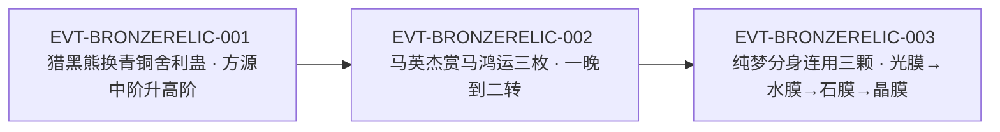

# 青铜舍利蛊

青铜舍利蛊是**舍利蛊系列的第一档**：「一转的是青铜舍利蛊，专门针对一转蛊师。」（`E:V1-018066`）它的作用是把蛊师"水磨工夫"的时间直接买断——「可以升华窍壁，助推蛊师修为，直接升上一阶小境界」（`E:V5-333188`）。

它在原著里的地位比较特殊：**它自己是一个条目，但几乎所有的关键性质都写在"舍利蛊系列"这一层**——五档阶梯（`E:V1-018066`、`E:V1-018068`、`E:V5-333192`）、生成方式（`E:V2-050912`、`E:V5-333206`）、道属与人群分布（`E:V5-333214`、`E:V5-333216`）、价格体系（`E:V2-050908`）都是系列级叙述。因此本页必须**先交代整个系列，再收到青铜这一档**，否则读不出它的价差位置与作用对象。

本页为 2026-09-28 A 线恢复批**新建页**。所有引文回根原文 `source/蛊真人-clean.txt` 逐行复核，行号即 `E:V{段}-{6位行号}`；正文按“原著事实 → 合理推导 →《问真》设计意义”三层组织。

## 主题档案

### 一、名称与系列定位：五档阶梯里的第一档

#### 原著事实

- 作用对象（明文）：「一转的是青铜舍利蛊，专门针对一转蛊师。」`E:V1-018066`；同句续写二转、三转档。
- 系列开篇：「舍利蛊，也是一个系列的蛊虫。」`E:V1-018064`。
- 第四档的补足：「到了四转，还有黄金舍利蛊。」`E:V1-018068`。
- 五档完整阶梯：「一转的青铜舍利蛊，二转赤铁舍利蛊，三转白银舍利蛊，四转黄金舍利蛊，五转紫晶舍利蛊。」`E:V5-333192`；「从一转到五转，分别有青铜、赤铁、白银、黄金、紫晶舍利蛊。舍利蛊都是凡蛊，没有六转及其以上的仙蛊。」`E:V3-086506`。
- 定位评价：「不管哪一转的舍利蛊，都是该转中的极珍！价值远超同转蛊虫。」`E:V5-333194`。

#### 合理推导

- **依据**：`E:V1-018066`、`E:V1-018068`、`E:V5-333192`；**结论**：五档是**一一对应**关系——第 N 档只对第 N 转蛊师有效；因此青铜舍利蛊的作用对象是**且只是**一转蛊师，**对二转及以上无效**（"只对二转蛊师有效"是对赤铁的表述，反向支持了对应关系）；**不确定性**：原文未直写"青铜对二转及以上无效"这一负向命题，本页由系列规则推出，标注为推导。
- **依据**：`E:V1-018066`、`E:V2-038024`；**结论**：**这里的档位（转数）是"作用对象的转数"，不是"蛊自身的成长等级"**——青铜舍利蛊由一转蛊师使用并作用于其空窍；**不确定性**：舍利蛊是否有"晋升"一说，原文未见（五档是并列的种类，不是同一只蛊的进阶形态），属未找到。
- 修正一处易混：`E:V1-018062` 的「只能使用一次」讲的是**白银**舍利蛊，不是青铜；本页不把它直接挪用为青铜的明文（见主题二）。

#### 《问真》设计意义

- “第 N 档只对第 N 转有效”是一条**硬性匹配规则**，比"等级不够不能用"更严：高转者拿低档舍利蛊是**完全无效**，不是效果打折。这条直接来自原文的对应关系，可直接落地。
- “容量型消耗品”的定位（一次性买断一个小境界）适合做成**不可囤积的稀有资源**：它不提供战力，只提供进度，与主题五的"形成条件"配合即成为路线规划问题。

### 二、机制：升华窍壁、直接升一阶小境界；但只管小境界

#### 原著事实

- 外形与作用：「舍利蛊是一种圆球状的凡蛊，只有拇指大小，外形普通毫不起眼。」但它作用却很大，「可以升华窍壁，助推蛊师修为，直接升上一阶小境界」`E:V5-333188`。
- 外形复述（另一窗口）：「一只圆球状的蛊虫，只有拇指大小。被细小的树枝缠绕着，在翠绿的树叶掩映下，散发着银白色的光。」`E:V1-018060`（该处描写的是白银舍利蛊）。
- 机制机制总述：「舍利蛊是能够直接增加空窍底蕴，拔升蛊师境界的蛊虫。」`E:V3-086504`。
- **上限（明文）**：「舍利蛊只能推升蛊师的小境界，每转的大境界都需要蛊师自己突破。」`E:V3-087604`。
- 同义的机理句：「蛊师的小境界，容易突破，是水磨工夫。但大境界却需要资质支撑。」`E:V2-038026`。
- 无后遗症：「舍利蛊系列，价格都极为高昂。毕竞用了之后，能提升蛊师一个小境界，节省大量的时间和精力。同时根基稳固，没有任何的后遗症。」`E:V2-057786`。
- 消耗性（讲白银、赤铁两只）：白银「只能使用一次」`E:V1-018062`；赤铁「彻底消耗了所有的底蕴，它的身躯变得透明」`E:V1-018828`。

#### 代价与收益（支付方／受益方／支付时点）

- **支付方**：获得者——两千元石左右的市价（`E:V2-050908`），或等价的**劳役**（方源以"猎到一头成年黑熊"换取，`E:V2-037946`）；**受益方**：使用者本人——一个小境界（`E:V5-333188`）；**支付时点**：**使用瞬间蛊被消耗**（"当即就在营帐中用掉"，`E:V2-038024`）。
- **消耗性的一手证据分层**：白银有"只能使用一次"明文（`E:V1-018062`），赤铁有"彻底消耗所有的底蕴……身躯变得透明"明文（`E:V1-018828`）；**青铜没有同型明文**，其消耗性由 `E:V2-038024`（"用掉"）与 `E:V5-333232`（同一次连续推进需"又用一颗"）间接支持。
- **收益的隐性成本（明文列出，主语是系列）**：「用多了舍利蛊，修为得来的太容易，反而令寻常的蛊师认知偏颇，突破大境界更难。」`E:V3-087604`。

#### 合理推导

- **依据**：`E:V3-087604`、`E:V2-038026`；**结论**：舍利蛊是**只在"小境界"这一轴上有收益**的道具，主境界（转）不受影响——因此它的价值评估必须绑定"当前处于哪一转的哪一小境界"；**不确定性**：一转有几个小境界（初阶／中阶／高阶，是否还有巅峰），本页未在原文中找到完整枚举，属未找到。
- **依据**：`E:V1-018062`、`E:V1-018828`、`E:V2-038024`、`E:V5-333232`；**结论**：舍利蛊是**一次性消耗品**（用掉即无），不是可反复使用的器物；**不确定性**：青铜单颗是否"必定"推进一个小境界（有无失败率），原文未写。
- **依据**：`E:V2-057786`（"根基稳固，没有任何的后遗症"）对 `E:V3-087604`（"用多了……突破大境界更难"）；**结论**：两处口径不冲突但必须并读——**单次使用无后遗症**，**长期堆用则有认知层面的副作用**；**不确定性**：副作用是"认知偏差"还是"气机层面"的损伤，原文用的是后者之外的表述，本页不替它定性。

#### 《问真》设计意义

- “只买小境界、不买大境界”让舍利蛊天然带有**通胀控制**：它可以加快前期节奏，但不会跳过突破门槛（突破仍需资质与机缘）。
- “一次性＋绑定小境界”使它成为**位置敏感的消耗品**：在正确的阶位用掉才是最优，囤积无意义（且高转后用低档无效）。

### 三、使用个案：三条不同用途的实例

#### 原著事实

**个案一：方源以猎熊换蛊（百家赠礼）**

- 条件与赠礼：「只要贤侄能猎到一头成年黑熊，那么这只青铜舍利蛊，就是你的奖励了。」`E:V2-037946`。
- 履约与交付：「短短工夫，贤侄就杀了一只成年黑熊」`E:V2-038014`；「贤侄不妨回去休整一下，青铜舍利蛊稍后就送到。」`E:V2-038016`；「片刻之后，便有蛊师送来青铜舍利蛊。」`E:V2-038022`。
- 使用效果：「方源取了，当即就在营帐中用掉，修为从中阶晋升到高阶。」`E:V2-038024`。
- 旁观者侧写：「尤其是方源用了青铜舍利蛊，修为一下子突破到了一转高阶后，更加强烈了。」`E:V2-039504`。
- 赠礼的政治含义：「青铜舍利蛊是个好兆头，这表明百家忌惮那支不存在的古月大部队。」`E:V2-038074`。

**个案二：纯梦分身连用三颗（推进空窍膜）**

- 起点：「这层光膜，就是一转初阶的特征。」`E:V5-333228`。
- 第一颗：「一颗青铜舍利蛊下去后，光膜顿时变厚，上面波光流转，晃晃而动，成为了水膜。」`E:V5-333230`。
- 第二颗：「纯梦分身又用一颗青铜舍利蛊。」`E:V5-333232`；「于是，水膜固定，变厚变硬，变成了石膜。」`E:V5-333234`。
- 第三颗：「再用第三颗后，纯梦分身的空窍中，石膜化成了晶膜。」`E:V5-333236`。

**个案三：马鸿运获赏三枚，一晚到二转**

- 赏赐：「马英杰当即赏了他三枚青铜舍利蛊，奖励他的忠心耿耿」`E:V3-105988`。
- 效果：「马鸿运得了他最需要的青铜舍利蛊，一个晚上就将修为冲刺到二转，速度之快，连我都比不上呢。」`E:V3-105992`。
- 稀缺性理由：「皆因青铜舍利蛊自然生长，极其稀少，且又产地各异。」`E:V3-105998`。

#### 合理推导

- **依据**：`E:V2-038024`、`E:V5-333228`、`E:V5-333230`、`E:V5-333234`、`E:V5-333236`；**结论**：青铜舍利蛊**一颗推进一个小境界**，三颗可从"一转初阶"推到"晶膜"一档；个案一（中阶→高阶）与个案二（连续三颗）**互相支持"一颗一阶"的粒度**；**不确定性**：晶膜对应一转的哪一档（巅峰？）原文未点名，只以"光膜→水膜→石膜→晶膜"的顺序呈现。
- **依据**：`E:V3-105992`、`E:V3-105998`；**结论**：马鸿运的个案是**从零加速**（一晚二转）——这说明连续使用多颗是小境界的线性推进，也说明"转"的门槛（大境界）仍需自行突破（与 `E:V3-087604` 一致）；**不确定性**：马鸿运是否另有大境界突破条件原文未展开（同段只说"运气真不错"）。
- **依据**：`E:V2-038074`；**结论**：青铜舍利蛊在原文里**同时是货币与信号**——百家用它表达"不想硬来"，方源用它判断对方底细；**不确定性**：这类政治读法出自角色判断，不是叙述者结论。

#### 《问真》设计意义

- 三条个案给出三种用途语法：**交易物**（劳役换蛊）、**推进器**（连续使用）、**赏赐／忠诚信号**（上位者发放）。同一件道具承担三种社会功能，是做"资源即关系"的好素材。
- “猎一头成年黑熊 ＝ 一只青铜舍利蛊”是原文给出的**明确兑换率**（`E:V2-037946`），可直接作为任务奖励设计的锚点。

### 四、价值与流通：两千元石，天然生成，有钱未必买得到

#### 原著事实

- 价格阶梯：「青铜舍利蛊的价格一般在两千元石左右，赤铁舍利蛊上升到八千，白银舍利蛊暴涨到五万，黄金舍利蛊接近三十万！」`E:V2-050908`。
- 单件对比价位：「比如赤铁舍利蛊，在凡间就要价值八千块元石，这价位还要超过普通的三转蛊。」`E:V5-333196`；「而白银舍利蛊是三转极珍，价位直接飙升到五万！」`E:V5-333198`。
- 供给机制：「舍利蛊都是天然蛊，无法通过蛊师合炼而得。很多时候，有钱还买不到。」`E:V2-050912`；「舍利蛊目前只能自然形成，还未有蛊仙能够炼制。」`E:V5-333206`。
- 流通分层：「这其中青铜、赤铁、白银舍利蛊，都在凡间大量流通。」`E:V3-086508`；而「黄金舍利蛊即便在商家城，也要受到管制。」`E:V2-065440`；「市场上，白银舍利蛊流通着，黄金舍利蛊则非常稀有。」`E:V2-065444`。
- 高端市场的例外：「在宝黄天中，一到三转的舍利蛊成打卖，四转黄金舍利蛊就少了些，紫晶舍利蛊数量更少。」`E:V3-086518`。
- 门派与商业渠道：「而门派也会将青铜到紫晶舍利蛊，作为师门任务的奖励，发放下去。」`E:V3-078006`；方源「只买下青铜、赤铁、白银、黄金舍利蛊」`E:V3-090798`。
- 贵族圈的口径：「舍利蛊系列，价格都极为高昂。」`E:V2-057786`。
- 白银层的标价／成交价并存：树屋「标价就要三万块元石」`E:V1-018070`，而同一场景的判断是「这只蛊最后至少能卖到五万块元石」`E:V1-018072`。

#### 合理推导

- **依据**：`E:V2-050908`、`E:V5-333196`、`E:V5-333198`；**结论**：四档价格呈**阶梯跃迁**（2 千 → 8 千 → 5 万 → 近 30 万），且原文用"极珍"「价值远超同转蛊虫」（`E:V5-333194`）来解释高位档；**不确定性**：青铜舍利蛊"两千左右"的区间上限与下限原文未给，`E:V1-018070`／`E:V1-018072` 的"标价／可卖价"差异说明原文的报价有**标价与成交价两套口径**，引用价格时必须写明是哪一种。
- **依据**：`E:V2-050912`、`E:V5-333206`；**结论**：舍利蛊的稀缺**不是管制造成的，而是"不能炼"造成的**——`E:V5-333206` 明确把宝黄天也缺货的原因归到"只能自然形成"；**不确定性**：原文说"目前"只能自然形成，是否留有"将来可炼"的口子，未明。
- **依据**：`E:V3-086508`、`E:V2-065440`、`E:V2-065444`、`E:V3-086518`；**结论**：**流通分层与档位一致**：一至三转在凡间大量流通（青铜属此列），四转以上被严苛管禁，蛊仙市场（宝黄天）才成打卖；**不确定性**：管制方与管制强度，不同章节给出的主体不同（商家城、各大组织、门派），本页只登记现象。

#### 《问真》设计意义

- “只能自然形成、无法合炼”是**供给侧的硬约束**，天然的稀缺性来源；它把青铜舍利蛊变成"可交易但不可生产"的资源，适合做经济系统的锚。
- “青铜、赤铁、白银在凡间大量流通”意味着**低档不稀缺**——稀缺的是档位，不是品类。设计上宜按档位分市场，而不是给舍利蛊统一的稀有度。

### 五、性质与形成条件：人道蛊虫

#### 原著事实

- 道属明文：「因为舍利蛊也是人道蛊虫！」`E:V5-333214`。
- 人群分布：「它对异人、人族有着本质上的效用，在异人、人族规模众多的地方，舍利蛊才会形成更多。」`E:V5-333216`。
- 凡蛊边界：「舍利蛊都是凡蛊，没有六转及其以上的仙蛊。」`E:V3-086506`。
- 与"炼仙蛊"的关系（易混点）：「因为黄金、紫晶舍利蛊，除了增长修为之外，本身也大量地用作炼制仙蛊。」`E:V3-086514`。
- 高转无效的口径：「蛊仙用再多的紫晶舍利蛊，也不会增长修为。」`E:V3-086512`。
- 山寨层的传闻口径：「就比如说是舍利蛊。此蛊一用，就能升华窍壁，助推修为，升上一阶小境界，是小菜一碟的事情。」`E:V1-008308`。
- 小境界的定语：「舍利蛊、石窍蛊等等，很多的蛊虫均能让蛊师舍掉水磨工夫的时间，在短时间内拔高修为。」`E:V2-038028`。

#### 合理推导

- **依据**：`E:V3-086506` 对 `E:V3-086514`；**结论**：两处必须并读——**舍利蛊本身全是凡蛊（不存在六转舍利蛊）**，而黄金、紫晶的是**作为炼仙蛊的催化剂材料**被使用；"用作炼仙蛊"不等于"舍利蛊有仙蛊档"；**不确定性**：青铜是否也用于炼蛊（原文点名的是黄金、紫晶），属未找到。
- **依据**：`E:V5-333214`、`E:V5-333216`；**结论**：青铜舍利蛊作为人道蛊虫，其**产出量与"异人、人族聚集度"正相关**——这解释了 `E:V3-105998`"产地各异"的原因；**不确定性**：原文未给任何具体产地或产出周期，也未说明异人、人族之外的种群是否影响产出。
- **依据**：`E:V1-008308`；**结论**：舍利蛊在小圈子里是**公开的常识**（山寨流言即点名它作为"以丙等资质率先晋升中阶"的解释），说明其存在与效果在低转层面广为人知；**不确定性**：这是闲谈中的举例，不是机制说明，本页只作文本证据引用。

#### 《问真》设计意义

- **人道蛊虫＋与人群规模正相关**是一条可以直接转成世界规则的原著设定：舍利蛊的分布图＝人族聚落分布图，天然形成"文明区更富、荒野更穷"的资源地理。
- “凡蛊但可用于炼仙蛊”则给了一条**跨层用途**：低档道具在高阶玩法里仍有位置（作为材料），避免道具随进度彻底失效。

### 六、桥接层与命名边界

#### 原著事实

（本节为桥接层：原著侧无可挂 E-ID 的事实条目；roster-3 与游戏侧文档记录见 `## 资料整理`。）

#### 合理推导

- **依据**：`roster-3.md` 中 `gold_atk_2_12_gu` 条目；**结论**：本 id 的**原文转数（1）已经 L0 裁定并落地到 Wiki**，与原文 `E:V1-018066` 完全一致；**不确定性**：无（本项是本页证据最强的一条）。
- **依据**：`roster-3.md` 中 `gold_atk_2_16_gu` 条目；**结论**：必须把两个 id **严格分开**——`gold_atk_2_12_gu`＝青铜舍利蛊（一转、具体档位），`gold_atk_2_16_gu`＝舍利蛊（泛称、game 转 2）；**不得**用泛称条目的 game 转数（2）回填到青铜舍利蛊，也**不得**用舍利蛊系列的性质去覆盖青铜的档位明文；**不确定性**：泛称条目在桥接层的用途原文没有对应物，属产品侧决定。
- **依据**：`docs/superpowers/specs/2026-09-20-...-design.md` 第 116 行；**结论**：游戏把本 id 用作"金色 1→5 进阶链"的第 2 级，而原文的青铜舍利蛊是**一转蛊**且**不构成进阶链**（五档是并列种类，不是同一只蛊的成长形态）；这是**改编／张力**，本页只登记，**不改游戏数据**、也不据游戏数据反推 Canon。
- **依据**：本 id 前缀 `gold_`（在 roster-3 中与其它 `gold_*` 条目同组）对 `E:V5-333214` 的原文道属「因为舍利蛊也是人道蛊虫！」；**结论**：**id 前缀（gold）与原文道属（人道）不一致**——本页不推断 `gold_` 在桥接层的确切含义（是金道还是分组标签），只登记这处不一致；**不确定性**：桥接层前缀语义由游戏侧定义，不在本批读取范围。

#### 《问真》设计意义

- 本条是"**命名即契约**"的反例：`gold_atk_2_...` 这个 id 前缀把 2 写进了名字里，而原文是一转——数值一旦固化进 id，语义修正就会牵动测试断言。这属于登记层面的教训，本页只记录现象，不提出改名方案。

## 状态时间线

| 状态 ID | 阶段 | 状态 | 证据 |
|---|---|---|---|
| ST-BRONZERELIC-01 | 体系定位 | 舍利蛊系列五档一一对应：一转青铜、二转赤铁、三转白银、四转黄金、五转紫晶；青铜专门针对一转蛊师 | E:V1-018064、E:V1-018066、E:V1-018068、E:V5-333192 |
| ST-BRONZERELIC-02 | 机制 | 圆球状凡蛊、拇指大小、外形毫不起眼；可升华窍壁、助推修为，直接升上一阶小境界 | E:V1-018060、E:V5-333188、E:V3-086504 |
| ST-BRONZERELIC-03 | 上限与代价 | 只推升小境界，每转的大境界需蛊师自己突破；单次无后遗症，但堆用会令突破大境界更难 | E:V2-038026、E:V3-087604、E:V2-057786 |
| ST-BRONZERELIC-04 | 使用个案·交易 | 百家以"猎到一头成年黑熊"为条件赠方源一只青铜舍利蛊；方源当即用掉，修为由一转中阶升到一转高阶 | E:V2-037946、E:V2-038016、E:V2-038022、E:V2-038024、E:V2-039504 |
| ST-BRONZERELIC-05 | 使用个案·连用 | 纯梦分身连用三颗青铜舍利蛊：光膜→水膜→石膜→晶膜 | E:V5-333228、E:V5-333230、E:V5-333232、E:V5-333234、E:V5-333236 |
| ST-BRONZERELIC-06 | 使用个案·赏赐 | 马英杰赏马鸿运三枚青铜舍利蛊；马鸿运一晚将修为冲刺到二转 | E:V3-105988、E:V3-105992 |
| ST-BRONZERELIC-07 | 行市与稀缺 | 青铜舍利蛊价格一般两千元石左右；舍利蛊均为天然蛊、无法合炼，"有钱还买不到" | E:V2-050908、E:V2-050912、E:V5-333206 |
| ST-BRONZERELIC-08 | 流通分层 | 青铜、赤铁、白银在凡间大量流通；黄金、紫晶受严苛管禁，仅在宝黄天等蛊仙市场可成打买 | E:V3-086508、E:V2-065440、E:V3-086518 |
| ST-BRONZERELIC-09 | 性质与形成 | 舍利蛊是人道蛊虫，对异人、人族有本质效用，在异人、人族规模众多处形成更多 | E:V5-333214、E:V5-333216、E:V3-105998 |

## 原著明确内容（本批取证窗口登记）

本批对「青铜舍利蛊」在根原文全书扫描：命中 **17 行**。下表登记本批实际读取的窗口（含以「舍利蛊」为词干、用于交代系列与梯度的窗口）。

| 窗口 | 内容要点 | 用途 |
|---|---|---|
| 18056–18072 | 树屋中的圆球状舍利蛊；「只能使用一次」「提升一个小境界」；一转青铜／二转赤铁／三转白银／四转黄金；标价三万 vs 可卖五万 | 主题一、二、四 |
| 37784–37788 | 「第十七节：青铜舍利蛊」为节题行（**不作 E-ID 锚点**，仅定位） | 主题一 |
| 37944–37948 | 百家以"猎一头成年黑熊"为条件赏赐青铜舍利蛊 | 主题三 |
| 38012–38030 | 交熊皮、承诺送到、蛊师送来、方源当即用掉（中阶→高阶）；小境界是水磨工夫、大境界需资质；舍利蛊能舍掉水磨工夫的时间 | 主题二、三 |
| 38072–38076 | 方源解读：青铜舍利蛊是好兆头，说明百家忌惮"古月大部队" | 主题三 |
| 39502–39506 | 白凝冰的焦虑：方源用青铜舍利蛊一举突破到一转高阶 | 主题三 |
| 50906–50914 | 价格阶梯（青铜两千／赤铁八千／白银五万／黄金近三十万）；天然蛊不可合炼、有钱未必买到 | 主题四 |
| 57784–57788 | 舍利蛊系列价格高昂；提升一个小境界且根基稳固、无后遗症 | 主题二、四 |
| 65434–65448 | 商家城：白银流通、黄金受管制；腐尸犬群任务的奖励是白银舍利蛊 | 主题四 |
| 78004–78008 | 仙鹤门把青铜到紫晶舍利蛊作为师门任务奖励发放 | 主题四 |
| 8306–8310 | 山寨流言把"舍利蛊"当作方源丙等资质晋升中阶的解释（传闻口径） | 主题五 |
| 86502–86520 | 舍利蛊直接增加空窍底蕴；五档皆为凡蛊无仙蛊；青铜赤铁白银凡间大量流通、黄金紫晶受管禁；宝黄天可成打买；紫晶对蛊仙无效；黄金紫晶用作炼仙蛊材料 | 主题一、四、五 |
| 87602–87612 | 理论上可堆出修为，实际极少人做：只推小境界、境界非一切、价值高昂、资质更重要 | 主题二 |
| 90796–90800 | 方源退而求其次，只买下青铜、赤铁、白银、黄金舍利蛊 | 主题四 |
| 105986–106000 | 马英杰赏马鸿运三枚青铜舍利蛊，一晚到二转；青铜舍利蛊自然生长、极其稀少、产地各异 | 主题三、五 |
| 18826–18830 | 赤铁舍利蛊耗尽底蕴后身躯透明、消失（消耗性的一手证据，**主语为赤铁**） | 主题二 |
| 333186–333236 | 舍利蛊总述（圆球状凡蛊／升华窍壁／直接升一阶小境界）；五档对应；该转极珍；价格与管制；只能自然形成、未有蛊仙能炼；为人道蛊虫、随异人与人族聚集而形成；纯梦分身连用三颗（光→水→石→晶） | 主题一、二、四、五 |

## 事件链

| 事件 ID | 事件 | 参与者 | 证据 | 因果 |
|---|---|---|---|---|
| EVT-BRONZERELIC-001 | 百家以"猎到一头成年黑熊"为条件许以一只青铜舍利蛊；方源半柱香内交上熊皮，获蛊后当即用掉，修为由一转中阶升到一转高阶 | 方源、百家族长、白凝冰 | E:V2-037946、E:V2-038014、E:V2-038022、E:V2-038024 | evidences ST-BRONZERELIC-04 |
| EVT-BRONZERELIC-002 | 马英杰赏马鸿运三枚青铜舍利蛊以奖其忠心；马鸿运一晚将修为冲刺到二转 | 马英杰、马鸿运 | E:V3-105988、E:V3-105992 | evidences ST-BRONZERELIC-06 |
| EVT-BRONZERELIC-003 | 方源的纯梦分身连用三颗青铜舍利蛊，把空窍膜由光膜推成水膜、石膜、晶膜 | 方源（纯梦分身） | E:V5-333228、E:V5-333230、E:V5-333234、E:V5-333236 | evidences ST-BRONZERELIC-05 |

事件口径：本页沿用实体簇号 `EVT-BRONZERELIC-*`（与分配前缀 `ST-BRONZERELIC-` 同簇，未与既有 EVT 前缀冲突）。事件节点 3 个，已达"≥3 节点应配图"的阈值，故配 mermaid 主干。

## 资料整理

本页为**新建页**，没有旧版；本批来源只有根原文，没有 `notes:`／`memory:` 层转述进入本页事实区。相关派生记录的处置登记如下（**本段内容不得当作原著事实**）：

- 取证口径（目录行，无单行可挂 E-ID）：本卷第十七节的节题即「第十七节：青铜舍利蛊」（第 37786 行）。该行为章节目录标记行，本页不以其作 E-ID 锚点，只在正文中说明该节以本蛊为名。
- `roster-3.md` 的「裁定已改」节 `gold_atk_2_12_gu` 条目记：`| gold_atk_2_12_gu | 青铜舍利蛊 | 1 | E:V1-018066 | L0 裁定 2026-09-25 依原文改 rank（原 game=2） |`。本页复核：**原文一转成立**（`E:V1-018066` 明文"一转的是青铜舍利蛊"），锚点即首现行，裁定结论与本页一致；本页只登记，不改该页。
- `roster-3.md` 的「命名碰撞待核」节 `gold_atk_2_16_gu` 条目记：`| gold_atk_2_16_gu | 舍利蛊 | 2 | 「舍利蛊」为舍利蛊系列泛称 |`。本页**严格区分**这两个 id：本页只写一转的青铜档，泛称条目不在本分片范围，**不合并、不互改**。
- `game/data/gu_lore.json` 的 `gold_atk_2_12_gu` 为 `status=adjusted`、`lore_rank=1`、`game_rank=2`、`anchor=E:V1-018066`（L0 裁定后状态）。`game/**` 只读，不在本批改动范围。
- 游戏侧旧阶梯仍在运行：`docs/superpowers/specs/2026-09-20-wenzhen-web-run-flow-convergence-design.md` 第 116 行把 `gold_atk_2_12_gu` 用作"金色 1→5 进阶链"第 2 级，并自述该项"已登记为数据命名缺陷""Godot 数据一字未动"。本页按“改编／张力”登记，**不据游戏数据反推 Canon**，也不改游戏数据。
- 本页不声明桥接层 canon 字段、不新建桥接层 canon 编号（本轮口径：Canon 权威已在本 Wiki，桥接层文件只作消费层，本批不引用）。

## 分析与解读

以下为归纳，不是原文（须与上文“原著事实”区分）：

1. **本页的难点不是"青铜"，而是"系列"**：17 处命中里，直接写青铜舍利蛊本身的句子很少，绝大多数关键性质（五档阶梯、不能合炼、人道蛊虫、价格体系）都以"舍利蛊"或"舍利蛊系列"为主语。把这些系列级事实**只写在青铜页而不标注层级**，会让读者以为它们是青铜独有的——本页的处理办法是逐条写明"主语是系列"。
2. **"一颗一阶"的粒度有三条独立证据**：方源中阶→高阶用一颗（`E:V2-038024`）、纯梦分身连用三颗对应光→水→石→晶（`E:V5-333230`–`E:V5-333236`）、马鸿运三枚一晚到二转（`E:V3-105992`）。三处互证，是本页最稳的机制结论。
3. **消耗性在青铜上是推导，不在明文**：明文属于白银（`E:V1-018062`）与赤铁（`E:V1-018828`）。本页据此把青铜的消耗性标注为推导（`E:V2-038024`＋`E:V5-333232`），而不是照抄"只能使用一次"。
4. **价格引用必须区分标价与成交价**：同一场景里白银的"标价三万"（`E:V1-018070`）与"至少能卖到五万"（`E:V1-018072`）并存，而市场口径给的是五万（`E:V2-050908`）。因此本页对青铜只引"一般两千元石左右"，不推导区间。
5. **"凡蛊"与"用来炼仙蛊"是两个层级**：`E:V3-086506` 说舍利蛊全是凡蛊、没有六转及以上仙蛊，`E:V3-086514` 说黄金、紫晶"大量地用作炼制仙蛊"。二者并读才是完整口径，单引任一句都会被读偏。

## 待核对

- `[原著未明确]` **青铜舍利蛊是否一次性消耗**：明文只见于白银「只能使用一次」（`E:V1-018062`）与赤铁「彻底消耗了所有的底蕴，它的身躯变得透明」（`E:V1-018828`）；青铜侧只有"用掉"（`E:V2-038024`）与"又用一颗"（`E:V5-333232`）的间接证据。
- `[原著未明确]` **青铜对二转及以上是否完全无效**：`E:V1-018066` 只写"专门针对一转蛊师"（正向），没有写出负向命题；系列规则（赤铁"只对二转蛊师有效"）支持对应关系，但这是推导而非明文。
- `[原著未明确]` **一转的小境界枚举**：原文出现"初阶／中阶／高阶"（`E:V5-333228`、`E:V2-038024`）与"晶膜"一档（`E:V5-333236`）的顺序，但**未给出完整枚举**（晶膜究竟对应哪一档未点名）。属未找到。
- `[原著未明确]` **单颗的失败率与副作用**：原文给了"根基稳固，没有任何的后遗症"（`E:V2-057786`）与"用多了……突破大境界更难"（`E:V3-087604`）两条口径，但**没有单颗失败率**的表述。
- `[待取证]` **青铜舍利蛊的产地与产出周期**：`E:V3-105998` 说"自然生长，极其稀少，且又产地各异"，`E:V5-333216` 说"在异人、人族规模众多的地方……形成更多"，但均无具体产地与周期。
- `[待取证]` **两千元石价位的上下限**：`E:V2-050908` 用的是"一般在……左右"，未给区间；`E:V2-037946` 给出的对价是劳役（一头成年黑熊），未折算成元石。
- `[存在冲突]` **命名碰撞：`青铜舍利蛊`（`gold_atk_2_12_gu`）对 `舍利蛊`（`gold_atk_2_16_gu`）**：前者是具体档位（一转），后者在 roster-3 记为"系列泛称"（game 转 2）。当前状态：本页只写具体档位，**两点不合并、不互改**，也不允许用泛称条目的 game 转数回填具体档位。
- `[存在冲突]` **桥接层：游戏把 1 转的青铜舍利蛊用作"金色 1→5 进阶链"第 2 级（游戏数据 × 原著）**：原文的五档是**并列种类**（`E:V5-333192`），不存在"青铜→赤铁→……"的同一只蛊晋升链；游戏侧另有自述"已登记为数据命名缺陷"（`docs/superpowers/specs/2026-09-20-wenzhen-web-run-flow-convergence-design.md` 第 116 行）。当前状态：不改游戏数据，按“改编／张力”登记。
- `[存在冲突]` **别名位审计（2026-09-28 L0 口径）**：本页 frontmatter `aliases` 只有 `青铜舍利蛊` 一项，**不含**泛称 `舍利蛊`；二者是泛称与具体实体的关系——原文「舍利蛊，也是一个系列的蛊虫」`E:V1-018064`、「一转的青铜舍利蛊，二转赤铁舍利蛊，三转白银舍利蛊，四转黄金舍利蛊，五转紫晶舍利蛊」`E:V5-333192`、「一转的是青铜舍利蛊，专门针对一转蛊师」`E:V1-018066`。roster-3 亦分列两 id：`gold_atk_2_12_gu`（青铜舍利蛊，原文转 1）与 `gold_atk_2_16_gu`（舍利蛊，系列泛称）。故泛称不列 `aliases`，边界由主题六与本节表达。
- 2026-09-28：本页原按 roster-3 行号引用，因 L0 落地使该文件行号位移，已改为按 id 引用（id 为稳定键，行号不再作为定位依据）。

## 模板扩展建议（只登记，不改核心模板）

1. **"系列级事实"与"档级事实"需要分栏**。本页大部分性质的主语是"舍利蛊系列"而非青铜档（`E:V1-018064`、`E:V2-050912`、`E:V5-333188`、`E:V5-333214`），现有骨架只能把它们平铺进主题里。建议在实体页提供一个"系列级事实（适用范围＝整个系列）"的位置，避免被误读为档级独有。
2. **"并列种类"与"成长阶梯"在 frontmatter 层无法区分**。舍利蛊五档是并列的五个种类（`E:V1-018066`、`E:V5-333192`），但桥接层将其读成了 1→5 的成长链。建议在实体页显式声明"本条目所属系列是并列种类／成长形态"，这一字段能直接拦下这类跨层误读。
3. **近名 id 的互斥声明位**。`gold_atk_2_12_gu`（青铜舍利蛊，1 转）与 `gold_atk_2_16_gu`（舍利蛊，泛称）在 id 前缀与转数上都不同，但名称是子串关系；建议模板要求同簇条目互相列出"不含本名字串"的写法，供 check 与人工复核使用。

## 关联页面

[流派总表](../world/path-roster.md)、[金道](../world/metal-path.md)、[经济与资源总表](../world/economy-roster.md)、[真元](../world/primeval-essence.md)、[资质与空窍](../world/aptitude-and-aperture.md)、[修炼体系](../world/cultivation-system.md)、[蛊的饲养与炼化](../world/gu-care-and-refinement.md)、[炼蛊与杀招链](../world/gu-refine-killer-chain.md)、[蛊虫关系](gu-relations.md)、[蛊虫总表](roster.md)、[蛊虫总表三期](roster-3.md)、[春秋蝉](spring-autumn-cicada-gu.md)
