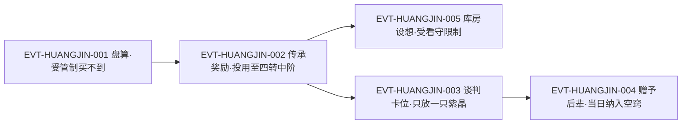

# 黄金舍利蛊

黄金舍利蛊是**舍利蛊系列的第四档**，转数有同段明文：「到了四转，还有黄金舍利蛊。」（`E:V1-018068`），另有独段指认句「这是黄金舍利蛊，四转蛊虫！」（`E:V2-066720`）。它与 `gold_atk_2_11_gu` 赤铁舍利蛊是**同一系列的不同档位**，两档在原著里几乎总是并列出现（系列列举句、价格阶梯句、流通与管制句都同时覆盖两档），因此本页把《身份边界》与 `黄金` 全量分类账并成独立主题（主题七）。本页证据厚度：全书精确命中 **34 行**，但 `黄金` 探针高达 **468 行**，是本批四个实体里子串碰撞最严重的一个；本页因此把"分类账 + 逐类交代"当作硬性交付物，而不是附注。

**检索口径（必读）**：本页所有"命中数"均为根原文 `source/蛊真人-clean.txt`（437,060 行）**逐行子串匹配、未去重**口径；`黄金舍利蛊` 命中 34 行 / 36 次（`E:V2-066732`、`E:V5-333200` 各含两次）、`黄金` 探针 468 行 / 503 次；行数与次数并列登记，分类账与断言见《资料整理》。段域取 `lore/wiki/source/section-index.md` L18-23；登记锚性质见《原著明确内容》。**本批不声明 `canon-index:`**。

## 主题档案

### 一、四转档的定位：只对四转蛊师有效，一只即可改变高层战力格局
#### 原著事实
- 系列归属：「舍利蛊，也是一个系列的蛊虫。」（`E:V1-018064`）
- 本档转数明文：「到了四转，还有黄金舍利蛊。」（`E:V1-018068`）；独段指认「这是黄金舍利蛊，四转蛊虫！」（`E:V2-066720`）
- 五档阶梯：「一转的青铜舍利蛊，二转赤铁舍利蛊，三转白银舍利蛊，四转黄金舍利蛊，五转紫晶舍利蛊。」（`E:V5-333192`）
- 档数与修为档对应：「蛊师修为一到五转，舍利蛊也有相对应的五转。」（`E:V5-333190`）
- 系列上限：「舍利蛊都是凡蛊，没有六转及其以上的仙蛊。」（`E:V3-086506`）
- 系列通用外形与效果：「舍利蛊是一种圆球状的凡蛊，只有拇指大小，外形普通毫不起眼。」＋「可以升华窍壁，助推蛊师修为，直接升上一阶小境界。」（`E:V5-333188`、`E:V5-333188`）
- 本档外形：「它通体金黄，只有拇指大小，在山洞昏暗的光线中，散发着幽幽的金属光辉。」（`E:V2-066718`）
- 本档效果两处独立明写：「皆因此蛊，能直接提升四转蛊师一个小境界。」（`E:V2-066724`）；「一只黄金舍利蛊，就能影响甚至改变。四转蛊师之间的战力差异。」（`E:V2-065442`）
- 作用层级：「四转、五转，已经是家族高层，一只黄金舍利蛊就能改变高层战力的对峙格局。」（`E:V2-066724`）
- 档位保值（系列通例）：「不管哪一转的舍利蛊，都是该转中的极珍！价值远超同转蛊虫。」（`E:V5-333194`）

#### 合理推导
- 依据：`E:V2-066724` 与 `E:V2-066724` 是同一行内的相邻两句，前者写"提升一个小境界"（个体幅度），后者写"改变高层战力的对峙格局"（格局幅度）；结论：本档的规格标的是**四转这一战场层级**而非单纯的一方数值——单只只推一小阶，但在四转这个"家族高层"密度极高的层级上，一小阶足以翻转对峙；不确定性：原文没有给出"高层战力对峙格局"的量化门槛，也未说明需要几方、几只才能触发格局改变。
- 依据：`E:V5-333190` 把"一到五转"与"五档"一一对齐、`E:V1-018068` 与 `E:V2-066720` 把本档钉在四转；结论：本档的作用对象被限定为**四转蛊师**，与赤铁档"只对二转蛊师有效"（`E:V1-018066`）是同构规则；可能反例：原文未见"只对四转有效"的逐字句，只有"能直接提升四转蛊师一个小境界"的正面表述与"四转蛊虫"的档位指认，故本条为正向限定而非负向排除。
- 依据：`E:V2-066734`＋`E:V2-066738`（本主题已逐字取证的原文行）；结论：代价与收益三方（本条自身）——支付方＝使用者（一次性消耗整只四转档蛊）；受益方＝使用者本人（四转内升一小阶，进而可能改变本方在高层对峙中的位势）；支付时点/生效条件＝蛊入空窍并被催动，收益在约一夜之后落地（`E:V2-066734`、`E:V2-066738`）；不确定性："约一夜"是原文对本档生效时长的一次表述，是否恒为固定时长原文未说明。

#### 《问真》设计意义
- 这一档是本系列的"**高层博弈道具**"：它的价值不能只用"升一小阶"评估，而要按"能翻转多大的对峙"评估。若《问真》要为四转段设计一件能撬动势力格局的消耗品，黄金档提供了现成的形态——用量小、不可回收、直接作用于战力对比。
- 与低档的关键差异不只在数值：低档是"个人成长件"，本档是"**势力工具**"，因此它的获取渠道应该是势力、传承、交易席位（见主题二、五），而不是商店货架。

### 二、管制与流通：凡人市场见不到，宝黄天才有货
#### 原著事实
- 家族级管制：「可惜的是，黄金舍利蛊即便在商家城，也要受到管制。」（`E:V2-065440`）；「这种蛊，在市场上都要受到各大家族的严格控制。就算是李闲，也难以搞到手。」（`E:V2-066722`）
- 管制对象与理由：「但到了黄金舍利蛊、紫晶舍利蛊，因为能够直接影响四转、五转的蛊师战力，间接地影响势力格局，所以受到各大组织的严苛管禁，极少能在市面上流通。」（`E:V3-086508`、`E:V3-086508`）
- 凡人市场对照：「黄金舍利蛊直接受到管制，凡人市场中，顶多流通白银舍利蛊，黄金舍利蛊非常稀有，常常被死死扣在手中。」（`E:V5-333200`）
- 价格与稀有并列：「市场上，白银舍利蛊流通着，黄金舍利蛊则非常稀有。常常被严格地控制在手里。」（`E:V2-065444`）
- 令牌也买不到：「但他就算是有紫荆令牌，也买不到。」（`E:V2-065446`）；「商燕飞将这些黄金舍利蛊，都捏在自己的手心里，就是不流到市面上去。」（`E:V2-065448`）
- 蛊仙市场才流通：「但到了宝黄天，黄金舍利蛊、紫晶舍利蛊都是有的。」（`E:V3-086510`）；「这种情况，在宝黄天中有所好转」（`E:V5-333202`）——原文随即写明即便是琅琊福地或天庭同样如此（`E:V5-333208`）。
- 宝黄天的结构差异：「在宝黄天中，一转到三转的舍利蛊成打卖，四转的黄金舍利蛊少许多，而五转的紫晶舍利蛊要更少得多。」（`E:V5-333204`）；同章另一处复述「因此在宝黄天中，一到三转的舍利蛊成打卖，四转黄金舍利蛊就少了些，紫晶舍利蛊数量更少。」（`E:V3-086518`）
- 交易市场另有可用性描述：「在宝黄天中，一转到三转的舍利蛊成打卖，四转的黄金舍利蛊少许多」（`E:V5-333204`）；蛊仙也会收藏留给后辈：「除去炼蛊，蛊仙若有后辈的话，也会收藏许多舍利蛊，留给后辈或者家族使用。」（`E:V3-086516`）

#### 合理推导
- 依据：`E:V5-333200` 与 `E:V3-086510` 是同一主题下的两处表述，前者写"凡人市场中顶多流通白银"，后者写"到了宝黄天都是有的"；结论：**管制不是"总量禁令"而是"渠道切割"**——同一只蛊被从凡人市场移到蛊仙市场，稀缺性随渠道改变；不确定性：原文未给出渠道间的价格差，也未给出每个渠道的具体供给量。
- 依据：`E:V3-086508`／`E:V3-086508` 把管制理由明写为"直接影响四转、五转战力并间接影响势力格局"，而系列前三档的流通句（`E:V3-086508` 前半）把青铜、赤铁、白银列为"凡间大量流通"；结论：管制的分界线是**"是否影响势力格局"**，不是"是否稀有"（白银档也被写作"稀有"`E:V2-065444` 却仍允许流通）；可能反例：`E:V3-086518` 与 `E:V5-333204` 是同一章内的两处复述、措辞略有出入，若严格并读会出现"少许多"与"少了些"的强度差异，本页只登记不裁定。
- 依据：`E:V2-065448`＋`E:V3-086516`（本主题已逐字取证的原文行）；结论：代价与收益三方（本条自身）——支付方＝购买方（在蛊仙市场付出更高代价，且需有进入宝黄天的资格）；受益方＝持蛊的势力/家族（把本档当作奖赏与筹码，`E:V2-065448`、`E:V3-086516`）；支付时点/生效条件＝进入蛊仙市场或在势力内部获得分配，而非在凡人市场成交；不确定性："需有进入宝黄天的资格"是原文对渠道的限定，具体资格条件原文未逐条写明。

#### 《问真》设计意义
- "渠道切割"比"掉率降低"更有设计价值：同一件道具在凡人市场不可见、在蛊仙市场可见，可以让**玩家的地位升级**直接兑换成新的供给面。这比单纯调低掉率更能制造阶段感。
- 原文反复把本档写成"被捏在手里、当作奖赏手段"的东西（`E:V2-065448`、`E:V3-086516`、`E:V2-066726`）——对《问真》而言，这意味着它天然适合做**势力奖励池**的头部条目，而不是交易行常驻商品。

### 三、双重用途：增长修为，同时是炼制仙蛊的催化材料
#### 原著事实
- 定位句：「舍利蛊是能够直接增加空窍底蕴，拔升蛊师境界的蛊虫。」（`E:V3-086504`）
- 材料用途：「因为黄金、紫晶舍利蛊，除了增长修为之外，本身也大量地用作炼制仙蛊。」（`E:V3-086514`）；「在仙蛊秘方当中有重要的催化效用。」（同段，`E:V3-086514` 所在段）
- 具体消费方（本档与紫晶档并提）：「黄金、紫晶舍利蛊广泛用于仙蛊秘方，方源炼制春秋蝉用过，炼制第二空窍蛊也用过。」（`E:V3-086520`）
- 秘方文本实证：「需要动用玉骨蛊，冰肌蛊，还有黄金舍利蛊。」（`E:V2-070252`）——即第二空窍蛊秘方的一环。
- 蛊仙侧的无效性：「蛊仙用再多的紫晶舍利蛊，也不会增长修为。」（`E:V3-086512`）
- 生成方式与炼制上限：「舍利蛊都是天然蛊，无法通过蛊师合炼而得。很多时候，有钱还买不到。」（`E:V2-050912`）；「舍利蛊目前只能自然形成，还未有蛊仙能够炼制。」（`E:V5-333206`）
- 官方与门派侧的分配机制：「而门派也会将青铜到紫晶舍利蛊，作为师门任务的奖励，发放下去。」（`E:V3-078006`）——一句之内把本档划进了门派奖励池。

#### 合理推导
- 依据：`E:V3-086514` 与 `E:V3-086520` 都把本档的用途分列为"增长修为"与"炼蛊材料"两支，而前三档的用途记载中未检得同类材料用途；结论：**双重用途是本档区别于前三档的结构性差异**，这解释了管制为何在这一档骤然收紧（主题二）；不确定性：原文没有说两支用途的相对占比，也未说明仙蛊秘方对外需求的量级。
- 依据：`E:V5-333206` 明写"只能自然形成、未有蛊仙能够炼制"，而 `E:V3-086514`／`E:V3-086520` 明写它被大量投入仙蛊炼制；结论：**供给端不可人工生产、需求端却有一支工业级消耗**，这构成一条独立的价格支撑（与"个人修为需求"叠加）；可能反例：`E:V3-086514` 的用量描述是"大量地用作"，属定性表述，不能据此断言本档的稀缺主要由炼蛊需求造成。
- 依据：`E:V3-086504`＋`E:V3-086514`（本主题已逐字取证的原文行）；结论：代价与收益三方（本条自身）——支付方＝炼蛊方（把一只四转档舍利蛊当作催化材料烧掉，等于放弃一次四转小境界提升）；受益方＝炼蛊方（仙蛊秘方得以成立）；支付时点/生效条件＝按秘方投料时即消耗，且这一支用途与"个人修为"用途互斥；不确定性：原文未给"当作催化材料烧掉"的数量与成功率；两支用途互斥是本页推出的，原文未明文并置。

#### 《问真》设计意义
- 一件道具同时是"成长件"与"材料"，会产生真实的**机会成本抉择**：玩家拿到它必须决定"自己吃掉"还是"投进生产线"。这比只能吃的消耗品有更长的决策寿命，也为《问真》提供了做**秘方驱动的产业链**的锚点。
- 须同时遵守两条约束才不破坏原著逻辑：它**不能被玩家炼制**（`E:V5-333206`），但**可以被玩家消耗在别的秘方里**（`E:V3-086520`）。这正好可以用来限制玩家进行无限再生产的冲动。

### 四、价格与购买力：接近三十万，四十二万石买不起两只
#### 原著事实
- 价格阶梯（本档同句并列）：「青铜舍利蛊的价格一般在两千元石左右，赤铁舍利蛊上升到八千，白银舍利蛊暴涨到五万，黄金舍利蛊接近三十万！」（`E:V2-050908`）
- 强调句：「黄金舍利蛊接近三十万！」（`E:V2-050908`）
- 购买力换算：「方源手中有四十二万元石，还买不起两只黄金舍利蛊的。」（`E:V2-050910`）
- 供给与价格的另一面：「舍利蛊都是天然蛊，无法通过蛊师合炼而得。很多时候，有钱还买不到。」（`E:V2-050912`）
- 语境备注：上述阶梯出现在"商队价格表"式的叙述段（`E:V2-050908` 所在段），随后方源在独白中重新盘算了自己的财力。

#### 合理推导
- 依据：`E:V2-050908` 分别给出四个档位的价位，`E:V2-050910` 给出"四十二万不够买两只"的硬约束；结论：本档名义单价约三十万元石，且 2 × 30 万 = 60 万 与"42 万买不起两只"相容（下界成立）；同时可算出本档约为赤铁档的 **37.5 倍**、白银档的 6 倍；不确定性：原文用的是"接近三十万"，非精确值，故所有倍数均为近似。
- 依据：`E:V2-050912` 明写"无法合炼、有钱还买不到"，而 `E:V2-050908` 是以"价格"给出的定价；结论：**标价不是可得性**——"接近三十万"只说明它在少数流通场合的价位，不等于任何时刻都能以该价买到；可能反例：宝黄天被明写为"都是有的"（`E:V3-086510`），在这一渠道内可得性高于凡人市场，因此不能把"有钱还买不到"套用到所有渠道。
- 依据：`E:V3-086516`＋`E:V3-078006`（本主题已逐字取证的原文行）；结论：代价与收益三方（本条自身）——支付方＝买方（≥30 万元石，且用掉一次四转小境界的机会）；受益方＝卖方/持蛊势力（元石与筹码双重收益）；支付时点/生效条件＝成交即时；原文另给出上游用法：势力把本档当奖赏发给部下与后辈（`E:V3-086516`、`E:V3-078006`），此时支付方变成势力本身；不确定性：≥30 万元石是原文给的价格下限表述，不同场景成交价是否一致尚未找到对照。

#### 《问真》设计意义
- 三十万这一档位让本档同时"贵"且"小": 它只是一小阶修为，却值一个四转段玩家的全部身家级别。这种"高单价 × 小幅度"的组合最适合做成**抉择型商品**（把资源压在一次性小跃升上，还是投入长期养成）。
- 四十二万买不起两只（`E:V2-050910`）是一个可直接复用的**预算锚点**：写世界观经济时，用"某角色的全部现金 < N 只某道具"来表达该道具的量级，比写绝对价格更有说服力。

### 五、入手与投使用例：传承奖励、赠予后辈与交易卡位
#### 原著事实
- 传承侧的可得性：「三王传承中。就有黄金舍利蛊。不过是在四十轮之后了。」（`E:V2-065456`）；方源对此的自我限定——「能否得到黄金舍利蛊。还得看自身的运道。」（`E:V2-065460`，与 `E:V2-065456` 同段）
- 实际入手：「我这次也算是运气，在信王传承中，居然得到一只黄金舍利蛊作为奖励。」（`E:V2-066726`）
- 投用过程：「黄金舍利蛊顿时化作一道金芒，遁入到方源的空窍当中去。」（`E:V2-066728`）
- 空窍内的相互作用（关键事实）：「黄金舍利蛊一进来，就被春秋蝉若有若无的气息死死压制。方源只好让春秋蝉隐没，然后再操纵黄金舍利蛊。」（`E:V2-066732`）
- 生效画面：「一团金色的霞光，顿时弥漫开来，笼罩整个空窍。和亮金色的真元海，交汇在一起。而空窍四壁，也受着温养。」（`E:V2-066734`）
- 结果：「四转中阶了！」（`E:V2-066738`）
- 另一处用量结论：「方源用了一只黄金舍利蛊，就是四转巅峰。」（`E:V3-078004`）
- 方源的自我盘算：「待我用了黄金舍利蛊后，成就四转巅峰，那就更妙了。」（`E:V3-090844`）
- 数量与结果的极端例：「还有十多颗的黄金舍利蛊，八颗紫晶舍利蛊！我用了它们，顷刻之间就修成五转巅峰啊！」（`E:V2-070148`）——此句为方源面对库房时的设想，且场馆有看守、不得私用（`E:V2-070154`）。
- 交易卡位（段3 个案）：「一只黄金舍利蛊，三只紫晶舍利蛊？」（`E:V3-078000`）为谈判诉求；答复是「但是，让方源这么快就晋升五转，实在不符合仙鹤门的利益！」（`E:V3-078008`）与「这些舍利蛊是他最想得到的东西，得卡住他」（`E:V3-078010`）；对方的替代句「你不是想要黄金舍利蛊、紫晶舍利蛊么？没门！」（`E:V3-078372`）。
- 赠予后辈（段3 个案）：「这里是黄金舍利蛊，足够你攀上四转巅峰。还有紫晶舍利蛊，能令你在五转上突飞猛进。」（`E:V3-108348`）——受赠者反应：「常极右呆呆地接住，旋即澎湃的感激之情，充斥他的心野。」（`E:V3-108350`）；随后「他当场就盘坐在地，取出一只黄金舍利蛊，纳入自身空窍。」（`E:V3-108408`）。
- 数量对照（紫晶档旁证）：「这些紫晶舍利蛊，共有六颗。」（`E:V3-087576`）；「紫晶舍利蛊能够拔升五转蛊师，足足一层的修为境界！」（`E:V3-087578`）；「方源只需三颗紫晶舍利蛊，便能将修为提升到巅峰境界。」（`E:V3-087580`）

#### 合理推导
- 依据：`E:V2-066738`（一夜之后"四转中阶"）与 `E:V3-078004`（"用了一只黄金舍利蛊，就是四转巅峰"）分属段2 与段3 两处，且段3 明写他"有四转高阶的修为"（`E:V3-078004` 上一行，`E:V3-078002`）；结论：**两处是两次不同的使用**（一次把他推到四转中阶，一次把它从四转高阶推到巅峰），两次都只推一小阶，与主题一的"一小境界"规则一致；不确定性：原文未写这两次之间是否还有其他提升手段，也未写明第二次的确切起点。
- 依据：`E:V3-078000`／`E:V3-078008`／`E:V3-078010` 三句连读可见，卖方（仙鹤门）**明知对方想要、也有能力给，却故意只放一小部分**；结论：本档在势力博弈中是**被主动用作筹码**的，供给节奏由势力利益而非库存决定；可能反例：这不是"没有货"，`E:V3-078008` 明写"这些舍利蛊，鹤风扬完全拿得出来"，所以主题二的"稀有"需要区分为"总量稀缺"与"人为扣留"两种成因——原文两种都出现过（`E:V2-065448` 是后者）。
- 依据：`E:V3-108348`＋`E:V3-108408`（本主题已逐字取证的原文行）；结论：代价与收益三方（本条自身）——支付方＝给予方（势力或人物付出四转档蛊；`E:V3-108348` 的场景里方源同时付出的是对受赠者的操纵意图）；受益方＝受赠者（一次性小境界）；支付时点/生效条件＝赠予或奖励当场交付，收益在受赠者投蛊之后生效（`E:V3-108408`）；不确定性：赠予场景只取到一例，是否所有赠予都附带操纵意图原文未说明。

#### 《问真》设计意义
- 本档的几种到手途径本身就是一套完整的**投放设计范式**：传承奖励（限时、看运道）、势力内部奖赏（关系绑定）、交易卡位（对方可给而不给）。三条路径对应三种不同的玩家体验，比单一掉落表更能支撑长线运营。
- `E:V2-066732` 是一条少见的"**道具被体内已有更高存在压制**"的机制事实：它给《问真》提供了一种不用改数值就能制造张力的写法——同一件道具在不同持有者身上的可用性不同。

### 六、克制关系：被春秋蝉的气息死死压制
#### 原著事实
- 「黄金舍利蛊一进来，就被春秋蝉若有若无的气息死死压制。方源只好让春秋蝉隐没，然后再操纵黄金舍利蛊。」（`E:V2-066732`）
- 该蛊随后仍正常生效：化作金芒入窍（`E:V2-066728`）、金霞弥漫笼罩空窍、空窍四壁受温养（`E:V2-066734`）、一夜之后到达四转中阶（`E:V2-066738`）。
- 春秋蝉在其空窍中的常态位置：「方源的空窍中，九成真元海潮起潮落。在最中央处，春秋蝉时隐时现。」（`E:V2-066732` 上两行，`E:V2-066730`）

#### 合理推导
- 依据：`E:V2-066732` 的因果词是"一进来，就被……死死压制"，紧接着的处理是"让春秋蝉隐没，然后再操纵"；结论：这是**同窍内的优先级冲突**——高转位存在（六转春秋蝉）在空窍中天然压制低转凡蛊，解决方式不是削弱前者而是"暂时退让"；不确定性：原文未说明这种压制是否会造成本档的效果折损（实际结果似乎无损，`E:V2-066738` 表明仍升到四转中阶）。
- 依据：− 上述两处并存，一处写"死死压制"（程度烈），一处写最终仍正常晋级（结果无碍）；结论：本条目**不裁定**压制是否带来隐性代价；可能反例：若压制会折损效果，则 `E:V2-066738` 的"四转中阶"应当低于预期，但原文未给出预期起点，因此无法证伪。
- 依据：`E:V2-066732`＋`E:V2-066728`＋`E:V2-066734`（本主题已逐字取证的原文行）；结论：代价与收益三方（本条自身）——支付方＝持有者（须临时关闭体内更高位存在的运作，承担在此期间该存在不可用的风险）；受益方＝持有者（本档得以被操纵，收益照常落地）；支付时点/生效条件＝本档进入空窍的瞬间触发，处理完毕后解除；不确定性：原文未说明关闭更高位存在的时间代价是否会造成不可逆影响。

#### 《问真》设计意义
- 这条事实是"**养成位阶冲突**"的现成模板：玩家体内越强的存在，越会挤占低阶道具的运作空间。若《问真》需要阻止"无限叠挂低阶增益"，这比硬性禁用更自然。
- 它同时提示一个落地细节：解决方式是"暂时让位"而非"永久移除"，因此该冲突天然是**暂时的、可恢复的**——适合做成有前后摇的状态，而不是永久惩罚。

### 七、命名预筛与身份边界：`黄金` 全量 468 行的分类账
#### 原著事实
- 泛称独立存在：「舍利蛊，也是一个系列的蛊虫。」（`E:V1-018064`）
- 近名同族与本档同段并列：本档定义句紧接赤铁与白银档（`E:V1-018066`、`E:V1-018068`）；五档列举句（`E:V5-333192`）；价格阶梯句（`E:V2-050908`）；凡人市场管制句（`E:V5-333200`）；系列流通与管制句（`E:V3-086508`、`E:V3-086508`）；兑换句把五档并列（`E:V3-090798`）。
- 本档与紫晶档成对出现的固定搭配：「黄金舍利蛊、紫晶舍利蛊」在管制句、宝黄天句、秘方句、谈判句四处成对（`E:V3-086508`、`E:V3-086510`、`E:V3-086514`、`E:V3-078372`）。
- `黄金` 另有大量与蛊无关的用法（分类账见《资料整理》），其中最易误命中的是北原的黄金血脉/家族类专名与"黄金真元"类真元色词。

#### 合理推导
- 依据：`E:V1-018064` 定义"系列"、`E:V5-333192` 列举五档、`E:V1-018066`／`E:V1-018068` 分别指名赤铁与黄金；结论：`黄金` 与 `舍利蛊` 都是**上位/构成性称谓**，不得写入本实体的 aliases（aliases 只放同一实体的别名，本实体无别名）；不确定性：无（多处并列句可交叉验证）。
- 依据：本页《资料整理》的分类账把 `黄金` 的 468 行拆成"含本实体名 34 行 + 残差 434 行"，残差再按互斥主题分类；结论：本实体的**实体级检索是安全的**（用全名 `黄金舍利蛊` 精确匹配即可），但**探针级检索必须分类**，否则会把北原血统、真元色、地名与荒兽名全都卷进来；可能反例：残差分类的边界由我选择的主题词决定，换一套词会得到不同的分布，故本页同时给出残差全量行号以保证可复核。

#### 《问真》设计意义
- id `gold_atk_4_14_gu` 的前级 `gold` 指向金道，而原文把舍利蛊整族归为**人道**（`E:V5-333214`）。这不是错误而是游戏侧分类与原著道属的**张力**：id 是稳定 opaque key，不拥有 Canon 语义（本批 L0 口径）。本页只登记，不改 id、不改 roster。
- 对《问真》的落点：《黄金》相关素材极易与北原黄金血脉、金道真元混淆，做素材库时必须用全名而不是色彩词做键，否则会在世界观的"金道 vs 人道"之间造成串味。

## 状态时间线

| 状态 ID | 阶段 | 状态 | 证据 |
|---|---|---|---|
| ST-HUANGJIN-01 | 系列定位 | [原著明确] 第四档：四转；凡蛊，无六转及以上；与赤铁档同系列 | E:V1-018068、E:V2-066720、E:V3-086506 |
| ST-HUANGJIN-02 | 外形 | [原著明确] 通体金黄、拇指大小的圆珠，散发金属光辉 | E:V2-066718、E:V5-333188 |
| ST-HUANGJIN-03 | 效果 | [原著明确] 直接提升四转蛊师一个小境界；能影响甚至改变四转蛊师间战力差异与高层对峙格局 | E:V2-066724、E:V2-065442、E:V3-086508 |
| ST-HUANGJIN-04 | 市场价位 | [原著明确] 接近三十万元石；方源四十二万元石买不起两只 | E:V2-050908、E:V2-050910 |
| ST-HUANGJIN-05 | 管制（凡人市场） | [原著明确] 受各大家族与组织严格控制；凡人市场顶多流通白银档，本档常被捏在手中，持紫荆令牌也买不到 | E:V2-065440、E:V2-066722、E:V5-333200、E:V2-065446 |
| ST-HUANGJIN-06 | 流通（蛊仙市场） | [原著明确] 宝黄天有货，但四转黄金"少许多"；一到三转成打卖 | E:V3-086510、E:V5-333204、E:V3-086518 |
| ST-HUANGJIN-07 | 双重用途 | [原著明确] 除增长修为外，大量用作炼制仙蛊的催化材料；方源炼春秋蝉、第二空窍蛊均用过 | E:V3-086514、E:V3-086520、E:V2-070252 |
| ST-HUANGJIN-08 | 生成方式 | [原著明确] 天然蛊、无法合炼；只能自然形成，未有蛊仙能炼制 | E:V2-050912、E:V5-333206 |
| ST-HUANGJIN-09 | 入手（段2） | [原著明确] 在信王传承中得到一只作为奖励；入空窍时被春秋蝉气息死死压制 | E:V2-066726、E:V2-066728、E:V2-066732 |
| ST-HUANGJIN-10 | 投用结果（段2） | [原著明确] 一夜之后到达四转中阶 | E:V2-066734、E:V2-066738 |
| ST-HUANGJIN-11 | 再次投用（段3） | [原著明确] 一只即成四转巅峰；方源自述"待我用了黄金舍利蛊后，成就四转巅峰" | E:V3-078004、E:V3-090844 |
| ST-HUANGJIN-12 | 赠予后辈（段3） | [原著明确] 赠常极右一只，称"足够你攀上四转巅峰"；对方当场纳入空窍 | E:V3-108348、E:V3-108408、E:V3-108350 |

## 原著明确内容（本批取证窗口登记）

**登记锚确认（回原文打印）**：本实体在 `roster-3.md` 的登记锚为 `E:V1-018068`。回原文打印该行，得到「到了四转，还有黄金舍利蛊。」——该行为**正文行**（非章节题名行），是本档转数的直接明文，且与赤铁档的登记锚 `E:V1-018066` 相邻两行。另有一处独立指认句「这是黄金舍利蛊，四转蛊虫！」（E:V2-066720）可交叉验证转数，因此本页转数证据不依赖题名（契约 §5）。

| 窗口 | 行号区间 | 内容 | 证据 |
|---|---|---|---|
| W1 | 18064–18068 | 系列定义句；赤铁档与本档相邻两行（含登记锚） | E:V1-018064、E:V1-018066、E:V1-018068 |
| W2 | 50904–50914 | 五档价格阶梯与"天然蛊、无法合炼"；方源四十二万元石的购买力 | E:V2-050908、E:V2-050910、E:V2-050912 |
| W3 | 65430–65466 | 段2 方源的稀缺性盘算：白银无用、商家城也受管制、紫荆令牌买不到、三王传承四十轮后可得 | E:V2-065438、E:V2-065440、E:V2-065446、E:V2-065456 |
| W4 | 66714–66738 | 段2 入手与投用全过程：外形、四转指认、春秋蝉压制、一夜后四转中阶 | E:V2-066718、E:V2-066720、E:V2-066732、E:V2-066738 |
| W5 | 70146–70154 | 段2 库房个案：十多颗黄金与八颗紫晶的设想，但有看守不可私用 | E:V2-070148、E:V2-070154 |
| W6 | 70146–70154 | 同窗对上位蛊虫"烂大街"的描述 | E:V2-070146 |
| W7 | 77998–78014 | 段3 谈判：诉求一只黄金＋三只紫晶；仙鹤门以门派利益为由卡住他 | E:V3-078000、E:V3-078008、E:V3-078010 |
| W8 | 86502–86530 | 系列总述的加密段：凡蛊上限、凡人市场管制、宝黄天成打卖、秘方催化、方源实际用过 | E:V3-086506、E:V5-333200、E:V5-333204、E:V3-086514、E:V3-086520 |
| W9 | 87572–87580 | 紫晶档的存量与功效对照（六颗、一层境界、三颗到巅峰） | E:V3-087576、E:V3-087578、E:V3-087580 |
| W10 | 90794–90800 | "直接用舍利蛊堆出修为"的动机，以及只买下青铜到黄金四档的取舍 | E:V3-090796、E:V3-090798 |
| W11 | 108346–108352 | 段3 赠予后辈：一只黄金"足够你攀上四转巅峰" | E:V3-108348、E:V3-108350 |
| W12 | 108402–108414 | 受赠者当场投用，纳入自身空窍 | E:V3-108408 |
| W13 | 333188–333242 | 系列总述：通用外形与效果、五档阶梯、极珍、本档受管制、宝黄天成打卖、人道归属 | E:V5-333188、E:V5-333194、E:V5-333200、E:V5-333214 |

## 事件链

| 事件 ID | 事件 | 参与者 | 证据 | 因果 |
|---|---|---|---|---|
| EVT-HUANGJIN-001 | 方源盘算：白银档对他无用，本档才有吸引力；但商家城受管制、持紫荆令牌也买不到，三王传承四十轮后才可能有 | 方源、商家、商燕飞 | E:V2-065438、E:V2-065440、E:V2-065446、E:V2-065448、E:V2-065456 | evidences ST-HUANGJIN-05、ST-HUANGJIN-06 |
| EVT-HUANGJIN-002 | 在信王传承中获一只作为奖励，投蛊入空窍；入窍即被春秋蝉气息死死压制，处理后金霞弥漫，一夜后达四转中阶 | 方源、黄金舍利蛊、春秋蝉 | E:V2-066726、E:V2-066728、E:V2-066732、E:V2-066734、E:V2-066738 | evidences ST-HUANGJIN-09、ST-HUANGJIN-10 |
| EVT-HUANGJIN-003 | 方源向仙鹤门索要一只黄金＋三只紫晶；鹤风扬以"让方源这么快晋升五转不符合门派利益"为由只放一只紫晶，卡住他 | 方源、鹤风扬、仙鹤门 | E:V3-078000、E:V3-078008、E:V3-078010、E:V3-078372 | evidences ST-HUANGJIN-05、ST-HUANGJIN-11 |
| EVT-HUANGJIN-004 | 方源赠常极右一只本档蛊，称足够攀上四转巅峰；常极右感激并当场纳入自身空窍 | 方源、常极右 | E:V3-108348、E:V3-108350、E:V3-108408 | evidences ST-HUANGJIN-12 |
| EVT-HUANGJIN-005 | 库房个案：方源设想用十多颗黄金与八颗紫晶顷刻修成五转巅峰，但此馆有地灵看守、这些蛊只能用于炼制第二空窍蛊 | 方源、地灵 | E:V2-070148、E:V2-070154 | evidences ST-HUANGJIN-07 |

事件口径：本页沿用实体簇号 `EVT-HUANGJIN-*`，事件节点 5 个，已达"≥3 节点应配 mermaid"的阈值，故配图。五事件分属段2 与段3：EVT-001/002/005 在段2（商家城与三叉山一线），EVT-003/004 在段3（中洲十派一线）。EVT-003 与 EVT-004 是同一段内、同一"方源手握本档蛊作为筹码"的两种用法（对外交换与对内赠予），因此在本页并列登记而不做先后裁定。

## 资料整理

**体积登记**：本页实测 45250 B，超过十进制口径 40,000 B 预算，按 GOVERNANCE 的 `超限现况` 小节**已登记例外**（2026-09-28 GU 蛊虫专题 40 页规模化恢复第二批）；依 L0"40 KB 是预算、不以体积删除有效知识"的表态，按知识完整优先保留，未做体积驱动的删减。**若日后需要回收预算，优先按三分流把 `原著明确内容（本批取证窗口登记）` 与 `资料整理` 的残差全量枚举外移，不得删事实。**

**分类账（脚本断言通过）**。口径：根原文逐行子串匹配、未去重；断言式为 `枚举集合 == 实测集合`。

| 探针 | 实测行数 | 实测次数 | 分类与集合 |
|---|---|---|---|
| `黄金舍利蛊` | 34 | 36 | 单一类：全部指本实体；全量行号见下方枚举 |
| `黄金` | 468 | 503 | 含 `黄金舍利蛊` 34 行 + 余 434 行他指。他指按互斥主题分类（脚本断言合计等于残差）：血统与势力 233 行；真元与液态金 39 行；地名与场景 23 行；意志与巨象 25 行；物产与器具 10 行；荒兽 9 行；其余 95 行 |
| `舍利蛊` | 198 | 243 | 五档档名（青铜／赤铁／白银／黄金／紫晶舍利蛊）任一出现在的并集 143 行 + 仅含泛称的 55 行；两集合不交，143 + 55 = 198，与实测集相等（脚本断言通过） |

`黄金` 残差 434 行的全量行号（脚本生成；枚举集合 == 实测集合）：

1518、1520、8536、9234、9886、9890、9900、9902、9906、9908、12396、15686、16154、16380、18148、20024、20038、23678、23688、26786、26822、26846、26864、27840、36072、43006、43166、43168、43170、43172、43174、43252、43256、43264、43376、43504、43676、43682、43700、44014、50312、56332、58246、58380、58878、59552、59682、59688、60664、60706、60722、60724、60738、61620、61624、61644、63860、66450、70262、70364、70372、70374、70376、70450、72740、72750、73884、74912、74932、75014、81464、81480、81630、83868、86506、86514、86520、86896、87532、87568、87742、87784、87786、87790、88406、88806、89828、89928、90078、91336、91556、91558、92328、92492、94658、94660、96000、96986、97080、97824、98680、98948、98950、98952、99964、100108、100226、100232、100234、100336、100652、101034、101436、101442、101452、101500、101666、102540、102542、102654、102750、102804、102876、103130、103298、103308、103320、103672、104984、104988、105900、105906、108176、108872、108942、108948、109044、112126、112236、112252、112438、112440、114362、116030、116054、116106、116138、116370、116464、116582、117088、117162、118232、118294、118346、118382、118398、118958、119198、119204、119228、119296、119336、119394、119448、119500、120688、120864、120870、120874、120884、120888、120892、120912、121690、122272、123100、124692、124694、124744、125620、126098、126742、127648、127754、130070、132526、133592、134788、137088、137130、139312、139316、139322、139716、139718、139808、144344、144362、147910、148514、156806、160132、160160、166716、166718、166772、170500、173728、186720、195084、196360、196524、200264、203544、203546、203564、203584、203906、203908、203924、203930、203934、203956、204024、204218、204232、204328、204380、204400、204404、204422、204688、204720、204754、204978、205126、205564、205624、205630、206516、206658、209954、211918、213002、215004、216660、216666、217674、217772、217938、218408、219810、219812、219824、219866、219972、219986、219988、219994、220000、220012、220020、220022、220026、220030、220052、220060、220062、220070、220072、220076、220104、220168、221564、221580、221736、221740、221748、221764、221766、221848、221856、221916、222280、222322、222326、222334、222344、222402、222858、223578、223932、224316、224602、224838、225128、225166、225216、225222、225234、225236、225304、225308、225360、225390、225438、230314、230318、230464、230486、230490、230634、231674、231678、231684、231690、231706、231708、231892、231934、232438、232702、233956、235340、236478、239268、240054、241924、243336、245922、267972、271016、271054、271064、271200、276128、277112、291568、291746、291944、291946、291952、299002、299872、303854、304332、305136、306198、312404、312920、316866、317738、317844、317846、317902、320638、332712、336778、336824、336846、336860、337828、337836、337838、337842、339356、339414、344426、344430、344440、344490、344504、344508、344526、344536、344552、344560、344616、344642、344648、344650、344656、351612、356096、360476、362598、369736、379786、379796、382752、385354、386748、386758、389718、392316、394356、394640、396138、400424、412374、413020、413080、413104、413106、413112、413114、417046、417142、417148、420028、420040、420044、420070、420150、420174、420196、420204、423638、423644、423754、424950、424956、426134、426198、426248、429270、430370、430372、430394、430550、430552、435452、435544

`黄金舍利蛊` 全量枚举（脚本生成；34 行）：

18068、50908、50910、65438、65440、65442、65444、65446、65448、65452、65454、65456、65458、65460、66720、66724、66726、66728、66732、70148、70252、78000、78004、78372、86508、86510、86518、90798、90844、108348、108408、333192、333200、333204

**逐类交代（残差为何与本实体无关）**：

- **北原血统与势力类**占残差最大一档：`黄金血脉`／`黄金家族`／`黄金部族`／`黄金一族`／`黄金后裔`／`黄金势力` 等，指北原的族群与势力专名，与舍利蛊无关。
- **真元与液态金类**：`黄金真元` 等属真元色/金道物质表述（与 `赤铁真元` 同构，见 `gold-atk-2-11-gu.md` 的《身份边界》）。
- **地名与场景类**：`黄金山`／`黄金沙漠`／`黄金沙丘`／`黄金麦` 等为地形与物产名。
- **意志与巨象类**：`黄金长龙`／`黄金巨龙`／`黄金大手`／`黄金意志`／`黄金念头`／`黄金光辉` 等，多为人物的气劲、意志或巨型形象，非蛊。
- **物产与器具类**：`黄金蜜酒`／`黄金油灯`／`黄金锁链`／`黄金甲`／`黄金花生壳` 等。
- **荒兽类**：`黄金锦鲤`／`黄金年鼠`／`黄金小牛`／`黄金穿山甲` 等，是生物名而不是蛊名。
- **其余（未归入以上六类）**：为分类词未覆盖的少量行，其行号已包含在上方残差全量枚举中，可逐行复核。

**同族对照（仅列原文明文，供划界）**：

| 档位 | 蛊名 | 原文转数明文 | 本页关系 |
|---|---|---|---|
| 第一档 | 青铜舍利蛊 | 一转（`E:V1-018066`） | 上位系列的同族 |
| 第二档 | 赤铁舍利蛊 | 二转（`E:V1-018066`） | 近名同族，另有独立页 `gold-atk-2-11-gu.md` |
| 第三档 | 白银舍利蛊 | 三转（`E:V1-018066`） | 同族；凡人市场"顶多流通"此档（E:V5-333200） |
| 第四档 | 黄金舍利蛊 | 四转（E:V1-018068、E:V2-066720） | **本页实体** |
| 第五档 | 紫晶舍利蛊 | 五转（E:V5-333192） | 同族；与本档在管制句、宝黄天句、秘方句、谈判句四处成对出现 |
| 泛称 | 舍利蛊 | 一到五转（E:V5-333190） | 上位泛称，非别名，不并入 aliases |

**派生层登记（只读、不改）**：`roster-3.md` 记 `gold_atk_4_14_gu | 黄金舍利蛊 | 4 | 4 | E:V1-018068`，本页复核**一致**。分片表 ASSIGNMENTS 该行记"名命中 36"，本页实测 **34 行 / 36 次**——两者一致：该列计的是**出现次数**，其中 `E:V2-066732` 与 `E:V5-333200` 两行各含两次，故本页在《资料整理》同时登记行数与次数。`game/**` 为消费层，本批只读不改。

## 分析与解读

1. **本档的真正特殊性不在"四转"而在"双重用途"**：转数与效果只是档位的自然延伸（与赤铁档同构），而"大量用作炼制仙蛊的催化材料"（E:V3-086514）是前三档看不到的结构差异，它同时解释了管制为何在这一档骤然收紧。
2. **"稀有"必须拆成两种成因**：北原是总量稀缺（E:V3-078372 的语境），商家/仙鹤门是人为扣留（E:V2-065448、E:V3-078008 明写"完全拿得出来"却不给）。这两种成因在设计上截然不同。
3. **它的价值尺度是"格局级"而不是"个人级"**：文献反复用"影响甚至改变四转蛊师之间的战力差异"（E:V2-065442）与"改变高层战力的对峙格局"（E:V2-066724）来描述它，而不是"变强了一点"。
4. **"黄金"探针的噪音量（468 行中 434 行他指）是本页最重要的工程事实**：本实体的检索必须用全名，绝不能用色彩词；否则会把北原血统与金道真元全部卷进实体页。

## 待核对

- [待取证] 段2 与段3 的两次使用是否为同一只蛊：段2 明写"在信王传承中……得到一只"并在一夜后到四转中阶（E:V2-066726、E:V2-066738）；段3 又写他"用了一只黄金舍利蛊，就是四转巅峰"（E:V3-078004）。两者之间是否有其他提升手段，原文未明。当前状态：不裁定。
- [待取证] "只对四转蛊师有效"的负向表述：本页只检得正向限定（E:V2-066724）与档位指认（E:V2-066720），尚未找到与赤铁档 `E:V1-018066` 同构的"只对四转有效"逐字句。
- [待取证] 渠道价格差：宝黄天与凡人市场之间的本档价差，原文未给数字。
- [原著未明确] 春秋蝉压制是否造成隐性折损：E:V2-066732 写"死死压制"，但 E:V2-066738 显示最终仍达四转中阶，无预期起点可比，故无法判定。
- [存在冲突] 宝黄天存量描述两处措辞强度不同：口径 A "四转的黄金舍利蛊少许多"（E:V5-333204）；口径 B "四转黄金舍利蛊就少了些"（E:V3-086518）。两处同章复述，当前状态：不裁定。
- 检索口径备注：本页命中数一律为"逐行子串匹配、未去重"口径，并**同时**登记**行数**与**次数**（`E:V2-066732`、`E:V5-333200` 两行各含两次，故 34 行 / 36 次）；若改为去重或以"独立处"统计，本页数字需重算（不影响主题判定）。
- 体量例外（契约 §5）：本页实测 45250 B，**超过十进制口径 40,000 B 预算**，按 GOVERNANCE 的 `超限现况` 小节**登记例外**并括注实测字节数（口径：十进制 40,000 B）；本页未做体积驱动的删事实，若日后回收预算，优先按三分流外移《原著明确内容（本批取证窗口登记）》与《资料整理》的残差全量枚举。

## 模板扩展建议（只登记，不改核心模板）

- 建议为"**探针与实体名不同形**"的实体（如本档：实体名 `黄金舍利蛊`，日常探针 `黄金`）在《资料整理》中固化"探针残差分类账"小节，避免后续复核者用短名复核而误判。
- 建议将"**双重用途（成长件／材料）**"纳入状态表的标准阶段名，因为它对本档是结构性事实而非附注。

## 关联页面

- [流派总表](../world/path-roster.md)、[金系](../world/metal-path.md)、[元石经济](../world/economy-roster.md)
- [修行体统](../world/cultivation-system.md)、[资质与空窍](../world/aptitude-and-aperture.md)
- [蛊虫培育与合炼](../world/gu-care-and-refinement.md)、[蛊虫关系总表](gu-relations.md)
- [赤铁舍利蛊](gold-atk-2-11-gu.md)（同系列第二档）、[青铜舍利蛊](gold-atk-2-12-gu.md)（同系列第一档）
- [春秋蝉](spring-autumn-cicada-gu.md)（同窍内压制本档的六转蛊）、[金龙蛊](gold-atk-4-02-gu.md)（同为四转金道精品，见 E:V2-070406）
- [实体名册](roster.md)、[第三批名册](roster-3.md)
