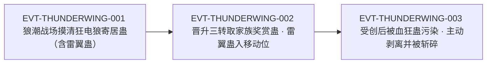

# 雷翼蛊

雷翼蛊是**移动位**的三转蛊：能「凝聚出一对雷光羽翼，令蛊师在短时间内拥有飞翔之能」（`E:V1-026674`）。原文对它的评价是双面的——机动性最强（`E:V1-025626`），但「消耗真元较多」（`E:V1-026948`）、「速度有之，但并不灵活」（`E:V1-028956`）。

它的知识价值不在单句定义，而在**有一条完整到少见的使用链**：从野外目击（狂电狼身上寄居）→ 入手（家族三转奖赏，取自被斩杀狂电狼的战利品）→ 编入六方面配置 → 实战受创 → 被血狂蛊污染而弃养（`E:V1-032388`–`E:V1-032394`）。一只蛊被写全了"得到、用、坏、舍"四步，这在本书里并不多见。

本页为 2026-09-28 A 线恢复批**新建页**。所有引文回根原文 `source/蛊真人-clean.txt` 逐行复核，行号即 `E:V{段}-{6位行号}`；正文按“原著事实 → 合理推导 →《问真》设计意义”三层组织。

## 主题档案

### 一、机制与形态：三转、一对雷光羽翼、短暂飞翔

#### 原著事实

- 能力明文：「能凝聚出一对雷光羽翼，令蛊师在短时间内拥有飞翔之能。」`E:V1-026674`。
- 转数明文：与天蓬蛊、血月蛊并列时明写「我现在拥有雷翼蛊、天蓬蛊，血月蛊若合炼出来，就有三只三转蛊虫」`E:V1-026940`；「至于三转的雷翼蛊，则寄居在方源的后背」`E:V1-027304`；「雷翼蛊是三转蛊虫」`E:V1-028568`。
- 形态：寄居后背，「如同两道闪电纹身」`E:V1-027304`；成形时为「一对幽蓝雷翼噗的一声，在身后瞬间成形」`E:V1-028708`；民间描述为"一双雷翼"`E:V1-028568`。
- 飞行与机动表现：「雷翼一振，带动他如电般射出」`E:V1-028712`；「身后雷翼一展，顿时电般倒射」`E:V1-028858`；危急时「方源一振雷翼，立即飞上半空」`E:V1-029100`。
- **不灵活**（明文限制）：「雷翼乃是电流凝聚，速度有之，但并不灵活。」`E:V1-028956`——同一句写方源「靠着天蓬蛊，硬吃这一记电流」。
- 野外同类（另一持有者）：狂电狼群体中「一只有雷翼蛊，可以短暂飞翔，机动性最强」`E:V1-025626`；千兽王身上「大多寄居着三四只二转的，三转的野生蛊虫」`E:V1-025628`。

#### 合理推导

- **依据**：`E:V1-026674`（短时间内拥有飞翔之能）＋`E:V1-028956`（不灵活）＋`E:V1-028568`（同一只蛊在催动状态下形成的雷翼会被另一只蛊"遮掩不住"）；**结论**：雷翼蛊给的是**直线高速位移**，不是灵活机动——转不了急弯、改不了姿势，因此它以"冲、逃、拉开距离"为主，`E:V1-028858`（拉开老大距离）与 `E:V1-029100`（飞上半空）都是这一用法；**不确定性**：原文没有给出飞行时长的秒数、最大高度或速度量级，"短暂"是唯一的时长表述。
- **依据**：`E:V1-027304`、`E:V1-028708`；**结论**：寄居位置（后背）与显形位置（身后一对翼）一致，属**外显型**移动蛊（不像隐鳞蛊那样把身形隐去）；**不确定性**：原文未说雷翼被斩断后蛊是否立刻死亡（`E:V1-032394` 是被外物斩碎即失）。

#### 《问真》设计意义

- “高速但不灵活”是一个可直接落地的移动机制：位移距离高、转向／闪避收益低。它天然把雷翼蛊与"灵巧型位移"区分开，且区分依据来自原文一句话（`E:V1-028956`），不需要另设数值理由。
- 「短暂飞翔」的"短暂"宜**显式建模为持续时间**，而不是无限飞行；原文三次提到"短时间内"（`E:V1-026674`、`E:V1-026948`）却未给秒数，时长数值属改编，应标注。

### 二、入手来源：狂电狼的寄居蛊，与家族的三转奖赏

#### 原著事实

- 制度来源：「晋升三转成了家老之后，家族就会免费地奖赏一只三转蛊虫。」`E:V1-026670`；「他的第一只三转蛊虫，是直接从家族中取来。」`E:V1-026668`。
- 方源的选择：「于是，方源就选取了雷翼蛊。」`E:V1-026672`。
- 这只蛊的来历：「这蛊还是家老们斩杀了一只狂电狼后，得到的战利品。」`E:V1-026674`。
- 选择动机：「有了雷翼蛊辅助移动，方源最后一块的战力短板也就被补齐了。」`E:V1-026676`。

#### 合理推导

- **依据**：`E:V1-025626`（狂电狼寄居雷翼蛊）＋`E:V1-026674`（家族战利品来自被斩杀的狂电狼）；**结论**：本页所述的这只雷翼蛊，其**来源可一路追溯到狼潮战场**——野生蛊被斩杀后成为家族战利品，再按制度配发给新晋家老；**不确定性**：原文未说明野生雷翼蛊被收取后是否需要额外炼化，也未说这类"战利品蛊"是否可流通买卖。
- **依据**：`E:V1-026668`、`E:V1-026670`；**结论**：三转蛊在家族制度里是**配给位**而非购买位（"免费地奖赏一只"），与斤力蛊一类可在店铺标价的力道蛊形成两种获取通道；**不确定性**：配给是否限品类（可选任意三转蛊，还是限库存）原文只说"选取"，未写范围。

#### 《问真》设计意义

- “野生蛊 → 战利品 → 家族配给”是一条**三级流转链**，且每一级都有原文依据。做成系统时，同一种蛊可以既有野生掉落（狂电狼），又有制度配发（晋升奖励），不必二选一。
- 这条链还给出了**"凑配置"的动机**：方源选雷翼蛊不是因为喜欢，而是为了补齐六方面里的移动位（`E:V1-026676`）。这是"以缺口选蛊"的现成剧本。

### 三、代价与使用约束：真元、互斥、不灵活

#### 原著事实

- 消耗偏高：「移动上，雷翼蛊虽然消耗真元较多，但是能令方源短暂飞行。十分强大。」`E:V1-026948`。
- 消耗与资质的关系：「雷翼蛊速度挺快，但消耗真元的速度也不慢。方源是丙等资质，在三转蛊师中，单论真元储备的话，他是最低的那个层次」。`E:V1-027380`。
- **与隐鳞蛊互斥**：「隐鳞蛊和雷翼蛊不能同时使用，雷翼蛊是三转蛊虫，一经催动起来，形成的一双雷翼，凭二转的隐鳞蛊还遮掩不住。」`E:V1-028568`；紧接着「面对三转家老，隐鳞蛊的隐形能力，并不可靠。」`E:V1-028570`。
- 隐身蛊的对标参数：隐石蛊「只是一转蛊虫，当它晋升到二转的隐鳞蛊时」`E:V1-020112`（即隐鳞蛊为二转）。

#### 资源与代价（支付方／受益方／支付时点）

- **支付方**：使用者本人——真元（催动期间持续消耗，`E:V1-027380`）；**收益方**：使用者本人——飞翔带来的机动、逃逸与拉开距离（`E:V1-026948`、`E:V1-028858`）；**支付时点**：每次催动期间持续支付，不是一次性。
- **机会成本（原文独有的一层）**：使用者在"隐身"与"飞行"之间**只能二选一**——雷翼成形后隐鳞蛊遮掩不住（`E:V1-028568`）。此时被放弃的那一项（隐身）是**同一使用者的另一份收益**，不是外部单位受损。
- **第三类支付方（蛊本身）**：雷翼蛊会在战斗中被殃及（`E:V1-029174`）乃至被外物斩碎（`E:V1-032394`）——损耗直接落在蛊身上。

#### 合理推导

- **依据**：`E:V1-026948`、`E:V1-027380`；**结论**：雷翼蛊的成本结构与宿主资质**强耦合**——同一只蛊在丙等资质手里是"必须省着用"，在真元储备更高者手里约束会更松；**不确定性**：原文只给了丙等资质这一个观测点，没有给出其它资质下的对比。
- **依据**：`E:V1-028568`、`E:V1-028570`；**结论**：互斥的根因是**可视化冲突**（雷翼现形破坏隐蔽），而不是真元不足或蛊虫反噬——这是一条"因为显眼所以不能隐身"的机制，而不是资源冲突；**不确定性**：原文未说隐鳞蛊与其它无显形特征的移动蛊是否也能并用（该窗口只说雷翼蛊）。
- **依据**：`E:V1-020112`；**结论**：互斥的另一半（隐鳞蛊）是二转，跨转强度的差距是该句给出的解释方向（"二转的隐鳞蛊还遮掩不住"）；**不确定性**：若宿主使用三转级隐身蛊，是否仍互斥，原文未写。

#### 《问真》设计意义

- “隐身与飞行不可兼得”是一条**无需新数值即可实现**的构筑约束，依据是原文的两句连贯描写。它让玩家在"被发现"与"跑得掉"之间做真实取舍。
- “消耗随宿主资质变化”提示：移动蛊的成本不宜写成绝对值，宜写成**占真元储备的比例**，这样丙等资质下的"必须省着用"才自然出现。

### 四、编入六方面配置：移动位的一格

#### 原著事实

- 六方面明文：「依他的经验，这六只蛊虫要在攻击、防御、治疗、存储、侦察、移动，这六个方面给他提供帮助。」`E:V1-026946`。
- 移动位的归属：「移动上，雷翼蛊虽然消耗真元较多，但是能令方源短暂飞行。」`E:V1-026948`。
- 配置总览：「如今六大方面，攻防有血月天蓬，有雷翼蛊辅助移动，存储有兜率花，地听肉耳草用来侦察。唯独缺少了治疗。」`E:V1-027804`。
- 家老级别不作战时的用法（机动而非交通）：「这边战场危险。你退到远处去吧。」随后方源「雷翼一振，落到地面，将怀中的少女放下」`E:V1-027374`。

#### 合理推导

- **依据**：`E:V1-026946`、`E:V1-026948`、`E:V1-027804`；**结论**：雷翼蛊在方源的配置里占**移动位**；六方面是**互不重叠的槽位**——`E:V1-027804` 逐项点名攻（血月）、防（天蓬）、移动（雷翼）、存储（兜率花）、侦察（地听肉耳草），并明说"唯独缺少了治疗"，说明一格一蛊；**不确定性**：原文未说一格里能否放两只蛊或临时替换；且该配置随剧情变动（`E:V1-017342` 的早期配置与 `E:V1-027804` 不同，见《待核对》）。
- **依据**：`E:V1-027374`、`E:V1-029100`；**结论**：雷翼蛊的日常用途不止战斗位移，还包括**把非战斗人员送到安全区**与**脱离范围伤害**；**不确定性**：载人飞行的限制（能否带人、带几人）原文只写了"落到地面，将怀中的少女放下"这一处。

#### 《问真》设计意义

- “六方面槽位”是原文自己给的**配置骨架**，可直接用作队伍／角色的构筑框架；"填满一格即转攻下一格"的动机链（缺少治疗）也是现成的任务引导。
- 把同一只蛊同时用于战斗位移与救援，有助于避免"移动蛊只在战斗中有用"的扁平设计。

### 五、个体的损毁与弃养：一场写全的"失去"

#### 原著事实

- 受创：「雷盾蛊已经死亡了，雷翼蛊亦是被殃及，奄奄一息，难堪再用。」`E:V1-029174`；此后「雷翼蛊暂时不能用了，方源便在山林中奔驰。」`E:V1-029546`。
- 状态不可靠：「雷翼蛊这状态很不可靠，极可能在飞行中掉链子，令方源从空中坠落。」`E:V1-031836`。
- 污染与失控：「雷翼蛊被血狂蛊污染，已经达到某种的极限，开始出现不受操纵的迹象。」`E:V1-032388`；「过不了多久，雷翼蛊就会化为一滩血水，成为新的污染源头了。」`E:V1-032390`。
- 主动舍弃：「去吧。」随后方源「毅然舍掉雷翼蛊，抛向身后」`E:V1-032392`；「身后的刀翅血蝠群，旋即将雷翼蛊团团包围，然后一拥而上，将雷翼蛊斩碎。」`E:V1-032394`。
- 事后接替：「方源丢了雷翼蛊，正犯愁自身移动方面，又有短板。此刻，却得到了千里地狼蛛，堪称柳暗花明。」`E:V1-032528`；千里地狼蛛「属于坐骑之类的巨型蛊。本身以土为食，容易养活」`E:V1-032530`。
- 接替者自身后患（交叉引用，检索词：千里地狼蛛、血狂、失控、发狂、骑乘、地底脱困）：千里地狼蛛亦被血狂蛊污染，复苏后**失控/发狂**（不受操纵）；「方源身处地底深处，单靠他自己的力量，根本不能逃到地面上去，必须借助千里地狼蛛的能力。」——故只得继续骑乘钻地脱困，抵三族大比武后因将化血水而弃养（EPUB `chapter_0190` `para_055`–`para_061`、`chapter_0191` `para_077`，源 `source/蛊真人-epub-canon.txt`）。详见[蛊虫总表](roster.md)血狂蛊条与[青茅山狼潮](../events/wolf-tide.md)标段二。
- 损失的分量（后文回望）：「他此刻失了雷翼蛊，千里地狼蛛，就算是有，也未必能逃得过两位五转强者的追杀。」`E:V1-033824`。

#### 合理推导

- **依据**：`E:V1-032388`、`E:V1-032390`、`E:V1-032394`；**结论**：这次弃养是**路线选择而非战力损失**——污染的终局是"化为血水、成为新的污染源头"，即蛊会**变成敌对方的污染源**，所以必须在它彻底失控前主动剥离；**不确定性**：原文未写污染是否有可逆手段（本页未在全书范围内找到"净化血狂蛊污染"的写法），属"未找到"，不是"原著没有"。
- **依据**：`E:V1-032528`、`E:V1-032530`、`E:V1-033824`；**结论**：移动位的更替是**同槽换蛊**（雷翼蛊→千里地狼蛛），代价从"真元贵"变成"战力低"（坐骑类、五转但虚弱）；**不确定性**：原文没有给出"哪个更强"的对比结论，`E:V1-033824` 只表达"有也可能逃不掉"。
- **依据**：`roster.md` 的血狂蛊条目（受染个案含雷翼蛊、千里地狼蛛、镇魔铁索蛊）；**结论**：本页的雷翼蛊是**受染三例中的第一例**，与千里地狼蛛同为方源侧个案；**该依据是 Wiki 派生记录，不是原文**（原文位置见 `E:V1-032388`、`E:V1-032892`）。

#### 《问真》设计意义

- “必须亲手放弃一只蛊，否则它会变成敌方的污染源”是一条**高张力的资源决策**：支付方是使用者（失去移动位），受益方是使用者本人（避免污染扩散）——受益者就是支付者，取舍感来自**时机**（早了浪费、晚了失控）。
- “同槽换蛊”的写法（雷翼蛊→千里地狼蛛）说明移动位可被不同类型替换（飞行↔坐骑），槽位与蛊类不必一一对应。

## 状态时间线

| 状态 ID | 阶段 | 状态 | 证据 |
|---|---|---|---|
| ST-THUNDERWING-01 | 野外目击 | 方源摸清三只狂电狼底细：其一寄居雷翼蛊，可短暂飞翔、机动性最强；千兽王身上多寄居二至三转野生蛊 | E:V1-025626、E:V1-025628 |
| ST-THUNDERWING-02 | 入手 | 方源晋升三转后依制从家族选取三转蛊；选中雷翼蛊——家老斩杀狂电狼所得的战利品，能凝雷光羽翼 | E:V1-026668、E:V1-026670、E:V1-026672、E:V1-026674 |
| ST-THUNDERWING-03 | 配置定位 | 六方面配置中雷翼蛊占移动位、补齐移动短板；至 27804 时该配置的治疗位为空 | E:V1-026676、E:V1-026946、E:V1-026948、E:V1-027804 |
| ST-THUNDERWING-04 | 寄居形态 | 三转雷翼蛊寄居方源后背、如同两道闪电纹身；催动时一对幽蓝雷翼在身后瞬间成形 | E:V1-027304、E:V1-028708 |
| ST-THUNDERWING-05 | 使用约束 | 消耗真元较多且丙等资质真元储备最低，须珍惜使用；与隐鳞蛊不能同时使用；雷翼乃电流凝聚，速度有之但不灵活 | E:V1-027380、E:V1-028568、E:V1-028956 |
| ST-THUNDERWING-06 | 受创 | 雷盾蛊死亡殃及，雷翼蛊奄奄一息、难堪再用；此后状态不可靠，可能在飞行中掉链子 | E:V1-029174、E:V1-029546、E:V1-031836 |
| ST-THUNDERWING-07 | 弃养 | 被血狂蛊污染、出现不受操纵迹象且将化血水成为污染源；方源连催三次令其脱离后背并抛出，被刀翅血蝠群斩碎 | E:V1-032388、E:V1-032390、E:V1-032392、E:V1-032394 |
| ST-THUNDERWING-08 | 更替 | 丢蛊后移动位成为短板，随即得到千里地狼蛛（坐骑类巨型蛊、以土为食）接替 | E:V1-032528、E:V1-032530 |

## 原著明确内容（本批取证窗口登记）

本批对「雷翼蛊」在根原文全书扫描：命中 **22 行**（25626、26672、26676、26940、26948、27304、27380、27804、28568、28706、29140、29174、29546、31734、31748、31836、32388、32390、32392、32394、32528、33824）。下表登记本批实际读取的窗口（含以"雷翼"为词干的描写行）。

| 窗口 | 内容要点 | 用途 |
|---|---|---|
| 25622–25630 | 三只狂电狼的寄居蛊底细；千兽王寄居二至三转野生蛊 | 主题一、二 |
| 26664–26680 | 三转奖赏制度；方源选取雷翼蛊；来源为狂电狼战利品；补齐移动短板 | 主题二 |
| 26934–26952 | 三转蛊虫清单（雷翼／天蓬／血月）；六方面配置；移动位评语 | 主题一、三、四 |
| 27298–27312 | 空窍内各蛊寄居位；雷翼蛊寄居后背如两道闪电纹身 | 主题一 |
| 27374–27384 | 以雷翼送少女落地；"速度挺快，消耗真元也不慢"；丙等资质语境 | 主题三、四 |
| 27800–27810 | 六大方面总览；雷翼蛊辅助移动；唯独缺治疗 | 主题四 |
| 28560–28572 | 隐鳞蛊与雷翼蛊互斥（雷翼现形遮掩不住） | 主题三 |
| 28700–28714 | 一对幽蓝雷翼成形；雷翼一振如电射出 | 主题一 |
| 28946–28960 | 雷翼一展拉开距离；"雷翼乃是电流凝聚，速度有之，但并不灵活" | 主题一、三 |
| 29136–29140 | 靠雷翼顺上方直飞脱离狼烟 | 主题四 |
| 29168–29178 | 雷盾蛊死亡、雷翼蛊被殃及奄奄一息 | 主题五 |
| 29540–29546 | 雷翼蛊暂时不能用，改在山林中奔驰 | 主题五 |
| 31728–31752 | 血水中强振雷翼失败；雷翼蛊极其萎靡 | 主题五 |
| 31830–31840 | 状态不可靠，可能飞行中掉链子 | 主题五 |
| 32384–32398 | 血狂蛊污染、不受操纵、将化血水；连催三次脱离后背并抛出；被刀翅血蝠群斩碎 | 主题五 |
| 32524–32532 | 得千里地狼蛛接替移动位 | 主题五 |
| 33818–33828 | 失雷翼蛊后自评：有千里地狼蛛也未必逃得过两位五转强者 | 主题五 |

## 事件链

| 事件 ID | 事件 | 参与者 | 证据 | 因果 |
|---|---|---|---|---|
| EVT-THUNDERWING-001 | 狼潮中，方源在战场角落观察三只狂电狼，摸清其寄居蛊（炸雷蛊／雷翼蛊／雷啸蛊） | 方源、狂电狼 | E:V1-025626、E:V1-025628 | enables EVT-THUNDERWING-002 |
| EVT-THUNDERWING-002 | 方源晋升三转成为家老，依制选取家族配发的三转蛊——雷翼蛊（取自被斩杀狂电狼的战利品），补齐移动短板 | 方源、古月家族家老 | E:V1-026668、E:V1-026670、E:V1-026674、E:V1-026676 | causes EVT-THUNDERWING-003 |
| EVT-THUNDERWING-003 | 雷翼蛊受创（雷盾蛊死亡殃及）后又被血狂蛊污染失控；方源连催三次令其脱离后背并抛出，蛊被刀翅血蝠群斩碎 | 方源、血狂蛊、刀翅血蝠群 | E:V1-029174、E:V1-032388、E:V1-032390、E:V1-032394 | evidences ST-THUNDERWING-07 |

事件口径：本页沿用实体簇号 `EVT-THUNDERWING-*`（与分配前缀 `ST-THUNDERWING-` 同簇，未与既有 EVT 前缀冲突）。事件节点 3 个，已达"≥3 节点应配图"的阈值，故配 mermaid 主干。

## 资料整理

本页为**新建页**，没有旧版；本批来源只有根原文，没有 `notes:`／`memory:` 层转述进入本页事实区。相关派生记录的处置登记如下（**本段内容不得当作原著事实**）：

- `roster-3.md` 的「一致」节 `heaven_atk_3_10_gu` 条目记：`| heaven_atk_3_10_gu | 雷翼蛊 | 3 | 3 | E:V1-027304 |  |`。本页复核：三转成立且有**三处**独立明文（`E:V1-026940`、`E:V1-027304`、`E:V1-028568`），比该页登记的单锚点更强；锚点 `E:V1-027304` 并非全书首现（首现为 `E:V1-025626`）。本页只登记，不改该页。
- `game/data/gu_lore.json` 的 `heaven_atk_3_10_gu` 为 `status=match`、`game_rank=3`、`lore_rank=3`、`anchor=E:V1-027304`，与本页口径一致，无新增信息。`game/**` 只读，不在本批改动范围。
- `roster.md` 的血狂蛊条目已把雷翼蛊列为受染个案之一（同条目另含千里地狼蛛、镇魔铁索蛊）。本页与之**同源不冲突**：该条目的原文位置见 `E:V1-032388`；本页不重复其内容，只作交叉引用。
- `vitality-grass-gu.md` 第 108 行把雷翼蛊记作方源六方面配置中的"移动位"（锚点 `E:V1-017342`、`E:V1-027804`）。本页复核该定位成立（`E:V1-027804`）；其中 `E:V1-017342` 属该页自有的配置窗口，本页不据它补内容。
- 本页不声明桥接层 canon 字段、不新建桥接层 canon 编号（本轮口径：Canon 权威已在本 Wiki，桥接层文件只作消费层，本批不引用）。

## 分析与解读

以下为归纳，不是原文（须与上文“原著事实”区分）：

1. **雷翼蛊是"完整生命周期"样本**：全书 22 处命中里，它是少数把"野生来源→家族配给→编入配置→受创→失控→弃养→被替换"全链写出的蛊。它因此比"只有配方没有战例"的蛊（如本批多只）更适合做**系统级样例**，而不是单条图鉴。
2. **它的两个缺点都被明文写出，不是推导**："消耗真元较多"（`E:V1-026948`）与"并不灵活"（`E:V1-028956`）都是作者原话；这使它在平衡设计上**不需要编造代价**。
3. **互斥规则的根因是"显形"而非"资源"**：`E:V1-028568` 给出的理由是二转隐鳞蛊遮掩不住一双雷翼——即视觉暴露，而不是真元冲突或蛊虫相冲。把这条写成"真元不足所以不能同时用"会偏离原文。
4. **弃养是主动且即时的，不是被动丢失**：`E:V1-032390` 明写"过不了多久就会化为血水，成为新的污染源头"，`E:V1-032392` 随即写"毅然舍掉"。原文没有给"救治"选项，因此这条应作为**必须执行**的风险处置来读。
5. **它与本批的血月蛊页构成互证**：`E:V1-026940`、`E:V1-026948` 把雷翼蛊、天蓬蛊、血月蛊三种三转蛊并列成"攻／防／移动"三件套，是同一窗口的三方互证；本页与血月蛊页（`blood-atk-3-11-gu.md`，同批另分片产出）应保持该窗口口径一致。

## 待核对

- `[原著未明确]` **飞行时长、高度、速度**：原文只有"短时间内拥有飞翔之能"（`E:V1-026674`）与"暂时"一类定性表述，未给秒数、高度与速度量级；"短暂"是唯一的时长表述。
- `[原著未明确]` **消耗的绝对量**：`E:V1-026948`、`E:V1-027380` 只作相对判断（"较多"、"不慢"），未给出单次催动的真元数值或占储备的比例。
- `[原著未明确]` **转数之外的品阶档位**：全书只出现三转个体（`E:V1-026940`、`E:V1-027304`、`E:V1-028568`），**未见**其它转数的雷翼蛊，属"未找到"，**不得写成"原著没有"**。
- `[原著未明确]` **血狂蛊污染可否逆转**：本页在全书范围内未检得"净化／救回被血狂蛊污染的蛊"的写法；`E:V1-032390` 只给出不可逆的终局描写。缺口记为未找到。
- `[待取证]` **狂电狼身上雷翼蛊的转数与获取条件**：`E:V1-025626` 只说狂电狼"一只有雷翼蛊"，未说该野生个体的转数；`E:V1-026674` 的战利品说也未复述转数（三转见 `E:V1-026940`）。
- `[待取证]` **家族三转配给的选择范围**：`E:V1-026670` 说"免费地奖赏一只三转蛊虫"，`E:V1-026672` 说方源"选取"，但可选清单、是否限品质原文未展开。
- `[存在冲突]` **六方面配置的时序口径（原文内部，非跨源冲突）**：`E:V1-017342` 的配置为「防御有白玉蛊，进攻有月芒蛊，治疗有九叶生机草。还缺侦测类以及移动类的蛊虫」，而 `E:V1-027804` 的配置为攻血月／防天蓬／移动雷翼／存储兜率花／侦察地听肉耳草、「唯独缺少了治疗」。两处相隔万余行，**蛊位成员已换（白玉→天蓬、月芒→血月），且治疗位由"有"变"缺"**。当前状态：本页**分别登记两处口径、不强行统一**，也不改写 `vitality-grass-gu.md`（该页第 108 行引用的是 `E:V1-017342` 这一早期口径）；中间发生了什么（九叶生机草是否离队）本页未找到明写，属"未找到"。
- `[存在冲突]` **roster-3 的锚点口径（Wiki 内部，非原文冲突）**：`roster-3.md` 的「一致」节 `heaven_atk_3_10_gu` 条目把 `E:V1-027304` 记为锚点，但该行并非全书首次出现（首次为 `E:V1-025626`）。当前状态：本页同时登记两行，不强行统一，也不改他页。
- 2026-09-28：本页原按 roster-3 行号引用，因 L0 落地使该文件行号位移，已改为按 id 引用（id 为稳定键，行号不再作为定位依据）。

## 模板扩展建议（只登记，不改核心模板）

1. **"蛊的结局"需要一个表达位**。现有模板有《状态时间线》与《事件链》，但没有"这只蛊最终怎样了"的落点；雷翼蛊的结局是被主动剥离并斩碎（`E:V1-032392`、`E:V1-032394`），本页只能写进主题五。建议允许在实体页给出终局状态行。
2. **"互斥关系"需要有别于"代价"的字段**。雷翼蛊与隐鳞蛊互斥的根因是显形冲突（`E:V1-028568`），既不是消耗也不是副作用；若只允许写"代价／收益"，这条会被塞进错误的位置。
3. **同一只蛊的"坑位"信息（六方面配置）跨实体页重复**。雷翼蛊、血月蛊、兜率花、地听肉耳草、九叶生机草都出现在同一张六方面配置表里（`E:V1-026946`、`E:V1-027804`），各页各写一遍会漂移；建议簇内页统一引用同一张配置表。

## 关联页面

[血月蛊](blood-atk-3-11-gu.md)、[九叶生机草与生机叶](vitality-grass-gu.md)、[蛊虫关系](gu-relations.md)、[蛊虫总表](roster.md)、[蛊虫总表三期](roster-3.md)、[方源](../characters/fang-yuan.md)、[真元](../world/primeval-essence.md)、[资质与空窍](../world/aptitude-and-aperture.md)、[蛊的饲养与炼化](../world/gu-care-and-refinement.md)、[狼潮](../events/wolf-tide.md)、[兽潮](../world/beast-tide.md)、[蛊虫与蛊师能力来源](cultivator-effects-and-scouting.md)
