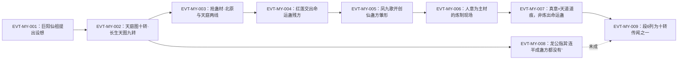

# 命运蛊

**一只没有既成品的仙蛊**——这是本页必须先说清的取证前提。全书对它的全部直接描述都落在"怎么炼、炼到几转、蛊方存不存在"上，而**没有一句**写它已经被炼成（本批命中覆盖范围内未见；见《待核对》）。它的配方在原文里高度一致：`E:V5-316318`「天庭还有一个方法，那就是将宿命蛊当做一份蛊材，与运道仙蛊一起合练，成就命运蛊！」；`E:V5-230276`「若是有机会更进一步，将运道仙蛊和宿命蛊一起合练，甚至能炼出传说中的十转仙蛊命运！」

它的名字来源也在原文里被拆解过：`E:V5-202106`「前者宿命，命是定好的，不能更改。」＋`E:V5-202108`「后者运气，运是变化的，可以借助。」——"命运"＝宿命＋运气，正好对应它的两味来源（宿命蛊＋运道仙蛊）。

本页为 2026-09-28 A 线恢复批**新建页**。三条必须先声明的取证特征：**其一**，本实体与 [宿命蛊](fate-gu.md) 是**两个不同对象**（宿命蛊是它的**蛊材／主材**，不是它的别名），故正文设《身份边界》专节；**其二**，原文对它的转数给出**两个口径**（九转／十转），二者**都是各势力的目标**而非既成事实，本库 `lore_rank=9` 与长生天口径一致（主题二）；**其三**，本实体有 **5 行命中落在段域空隙**（367185–367633 之间无合法 E-ID），本页对这些行**只标原始行号**并在《待核对》登记上抛。所有引文回根原文 `source/蛊真人-clean.txt`；正文按"原著事实 → 合理推导 →《问真》设计意义"三层组织。

## 主题档案

### 一、机制与配方：以宿命蛊为蛊材，与运道仙蛊「一起合练」

#### 原著事实

- **配方（两处独立复述，用词一致）**：`E:V5-316318`「天庭还有一个方法，那就是将宿命蛊当做一份蛊材，与运道仙蛊一起合练，成就命运蛊！」；`E:V5-230276`「若是有机会更进一步，将运道仙蛊和宿命蛊一起合练，甚至能炼出传说中的十转仙蛊命运！」
- **它在机制上要解决的正是宿命蛊的"不可催动"**：`E:V5-366284`「就算我们无法催用宿命蛊，但我们可以用它为一桩炼蛊材料，炼制出命运蛊！宿命蛊是无法被人操纵，但命运蛊却是可以。」；同段先例是宿命蛊的一般处境：`E:V5-316310`「彻底修复好的宿命蛊，任何人都无法直接利用。即便是天庭，也只能旁敲侧击，借助仙蛊屋监天塔，观察世间万物的生命轨迹。」
- **蛊材状态的弹性**：`E:V5-316326`「所以充当蛊材的宿命蛊，无须彻底修复。」（配合同句「天庭想要直接炼制出十转的命运蛊，心气太大了。我们却不一样，只想炼制出九转的命运蛊来。」）
- **炼制主材的明文（段6）**：`E:V6-406726`「一只是命运蛊，十转的命运蛊其中的炼制主材之一，便是九转宿命蛊。」
- **已知的炼制现场（人意为主材）**：第 367250 行「将这些人意充当主要蛊材，来炼制命运蛊，着实是异想天开！」；第 367254 行「在命运歌的作用下，这些人意和火焰相互交汇，炼成一种无形无质的奇妙蛊材。」
- **代价／风险（支付方登记）**：第 367256 行「而方源主持这场炼蛊，却是要承受人意的恐怖冲击。他要将人意都安抚住，就像是制服汹涌的洪水，让它们按照条条沟渠而流淌。」——**支付方＝方源**（承受人意冲击）；**受益方（直接）＝炼蛊进程**；**支付时点＝炼制进行中**。另有一条涉及宿命蛊的**被消耗**：`E:V5-366290`「宿命蛊若是充作蛊材，即便长生天一方炼出了命运蛊，那么宿命蛊就算是毁掉了。」

#### 合理推导

- **"合练"是本实体成立的唯一机制，且配方固定**。结论：三处独立表述（`E:V5-316318`、`E:V5-230276`、`E:V6-406726`）都以"宿命蛊＋运道仙蛊"为原料，用词分别为"当做一份蛊材／一起合练""炼制主材之一"。依据：三处出自不同势力、不同卷段，却指向同一配方。**不确定性**：原文未说明运道仙蛊具体是哪一只——`E:V5-316322`「这也就是天庭之前，进犯北原，出手抢夺鸿运齐天蛊的原因了。」暗示天庭用的是鸿运齐天蛊，但长生天用的是否同一只**尚未找到**明文。
- **"命运蛊是可被操纵的，宿命蛊不是"这个差别是本实体的唯一功能定义**。结论：`E:V5-366284` 把两者的可控性写成对立（"宿命蛊是无法被人操纵，但命运蛊却是可以"）。依据：该句是原文对该差别唯一的直接表述。**不确定性**：原文未说明"可以被操纵"如何实现（是否需要额外手段）、也未给操纵层级。
- **"炼制主材之一"意味着不止一味**。结论：`E:V6-406726` 用的是"主材之一"。依据：该措辞本身。**不确定性**：其余主材**尚未找到**明文；本页不把"宿命蛊＋运道仙蛊"写成完整配方表。

#### 《问真》设计意义

- **本实体天然适合做"合成品"而不是"掉落品"**：配方、蛊材两种、以及"需要蛊方"三项条件在原文里齐备（`E:V5-316318`、`E:V5-366284`、`E:V5-367170`），可直接实现为合成图谱；且原文明确宿命蛊在合成中**会被消耗**（`E:V5-366290`），这条比自造的"消耗规则"更贴原文。
- **"宿命蛊不可控／命运蛊可控"是一条可直接消费的机制对立**：建议 runtime 把两者做成同一系统的两级——原料不可操作、产物可操作；原文的原话（`E:V5-366284`）可原样作为规则描述。
- **注意代价的支付方是"主持炼制者"而非"持有者"**：第 367256 行把冲击明确落在主持者（方源）身上。做代价设计时不要默认记在持有者名下。

### 二、转数双口径：九转（长生天目标／本库 lore_rank＝9）与十转（天庭目标／传说）

#### 原著事实

- **登记锚所在行给出九转口径**：`E:V5-316328`「只要拥有了九转命运蛊，我长生天便能够和天庭抗衡，在接下来的大时代中制霸，取天庭而代之，乃至统治五域，成为天下地上万物主宰，也是有可能的！」——该行是**正文行**（说话人为长生天一方冰塞川），且与本库 `lore_rank=9` 一致。
- **九转口径另有四处独立复述**：`E:V5-361798`「就让他们打去。眼下正是最好的时机，让我们夺走宿命蛊，回到长生天，炼出九转的命运蛊！」；`E:V5-361800`「他本来的目的就是这个，有了九转命运蛊，长生天就能取代天庭的位置，从而统治整个五域。」；`E:V5-316326`「只想炼制出九转的命运蛊来」；`E:V5-366994`「所以，我转变另一种方法，将其凝聚成这份九转命运蛊残方」。
- **十转口径同样有独立证据，且明确归给天庭**：`E:V5-362382`「天庭想要修复九转宿命蛊，抢夺鸿运齐全蛊，企图炼制会出十转的命运蛊来。长生天也同样有这样的打算，只不过他们目标定得低了一点，想要用不完整的宿命蛊炼出九转命运蛊。」——**这一句同时把两个口径并置，并给出相对关系**（长生天"定得低了一点"）。
- **十转口径另有传说级证据**：`E:V5-230276`「甚至能炼出传说中的十转仙蛊命运！」；`E:V6-406726`「一只是命运蛊，十转的命运蛊其中的炼制主材之一，便是九转宿命蛊。」（该行把十转命运蛊列入全书**只听闻过两只**的十转仙蛊传闻之一，见同段 `E:V6-406724`「方源活了大几百年，也只听闻过两只十转仙蛊的传闻。」）
- **两口径的输入材料不同**：天庭口径要求"修复九转宿命蛊"（`E:V5-362382`「天庭想要修复九转宿命蛊」），长生天口径"无须彻底修复"（`E:V5-316326`）。**支付方／受益方**：支付方＝两势力各自的资源与战力（天庭为抢鸿运齐天蛊进犯北原 `E:V5-316322`；长生天为夺宿命蛊攻入天庭 `E:V5-358096`）；受益方＝势力本身（`E:V5-361800` 明写目的是"取天庭而代之…统治整个五域"）。

#### 合理推导

- **两个口径不是矛盾，而是"目标高度"之差**。结论：`E:V5-362382` 一句之内同时陈述两者，并用"目标定得低了一点"给出关系。依据：该句的对照结构完整。**不确定性**：原文未说明九转命运蛊与十转命运蛊在威能上的差别，也未说明长生天是否在条件具备后会改追十转。
- **"均非既成"这一点是高杠杆事实**。结论：所有九转／十转陈述都在条件句或计划句中（"只要拥有了""企图炼制""甚至能炼出"）。依据：逐行核对本批全部 26 行确指命中，**没有一行**是叙述既成产物的完成态。**不确定性**：本批取证窗口未覆盖全书所有章节，故本页一律写作"尚未找到既成记录"，**不写"原著没有"**。
- **本库 `lore_rank=9` 的取值有直接正文依据**：锚点行 `E:V5-316328` 本身即"九转"（且非题名行）。依据：该行文本身份＋与 `E:V5-362382` 的相对关系。结论：本页与 roster／game 的 `lore_rank=9` **无冲突**；若 runtime 需要单一转数，取 9（长生天目标）比取 10（天庭目标／传说）更贴合"本库登记口径"。**不确定性**：原文把两个口径都写成"目标"，**未规定**哪一个是本实体的"真值"；取 9 是与本库登记值对齐的结果，不等于原文给出唯一值（两口径并列见主题二）。

#### 《问真》设计意义

- **双口径应做成"两条合成路线"而不是一个 rank 上的两档**：原文的差别不只是转数，还包括输入材料（宿命蛊是否修复）与目标势力（天庭／长生天）。建议实现为 `路线A（九转）／路线B（十转）`，条件分别为"不彻底修复的宿命蛊"与"修复的九转宿命蛊"（`E:V5-316326`、`E:V5-362382`）。
- **"传说级"标签有原文依据**：`E:V6-406724`「方源活了大几百年，也只听闻过两只十转仙蛊的传闻。」给了十转命运蛊"传闻"的位阶，可直接用作稀有度语义。
- **不要把 `lore_rank=9` 升级成"已炼成九转"**：原文的 9 是目标值。若 runtime 需要"成品属性"，应先补一条"已炼成"的原文依据（当前尚未找到）。

### 三、蛊方链与计划真相：设想 → 残方 → 仙蛊方雏形；以及《并非真要炼出它》

#### 原著事实

- **设想的提出者**：`E:V5-316326`「他们却不知晓，所谓命运蛊的设想，最早就是巨阳仙祖提出来的。」
- **设想被承认与传承**：`E:V5-318638`「天庭的命运蛊大计，紫薇仙子是知道的。长生天也对命运蛊有着野心。」；`E:V5-359138`「长生天本来的计划是炼制命运蛊，这就需要抢夺宿命蛊。」；`E:V5-358096`「终于，他终于攻进了这里，履行巨阳仙尊交代他的大计——夺取宿命蛊，炼制命运蛊！」
- **蛊方（残缺）的存在与交托**：`E:V5-366986`「一份是八转杀招未来身，另一份则是命运蛊的仙蛊方。」；`E:V5-366990`「至于命运蛊的仙蛊方，虽然只是一件残缺的蛊方，但它本就是依照你未来开创的命运歌所创。它和你的命运歌是一脉相承。」；`E:V5-366994`「所以，我转变另一种方法，将其凝聚成这份九转命运蛊残方」
- **同一份残方另有受赠者（巨阳仙祖）与约定**：第 367328 行「这就是命运蛊的仙蛊残方？」；第 367330 行「红莲，是你损坏了宿命蛊，方才有我开创运道的空间。现在你又将这份命运蛊残方赠与我，我欠你一个天大的人情！」；第 367334 行「但如果我的图谋失败了，还请你按照我们的约定，自行出手，努力炼制出命运蛊吧。」
- **仙蛊方雏形的开创者与来源**：`E:V5-362384`「但两方都没想到，在他们之前，竟然有一位蛊仙已然提前开创了命运蛊的仙蛊方雏形！」；其灵感与素材来自杀招"命运歌"：`E:V5-362380`「八转仙道杀招命运歌，单凭此招，凤九歌的战力就一跃而上，成为天底下最强的数人之一。」、`E:V5-349680`「这对他参悟命运蛊具有极大的帮助。」、`E:V5-333748`「若再结合运道的奥义……命运么……」
- **两方连蛊方都没有**：`E:V5-366298`「你们用不了宿命蛊，你们何时能炼出命运蛊？你们甚至连命运蛊的半成蛊方都没有！」
- **"炼蛊"并非真意**：第 367386 行「红莲魔尊的确是要炼制命运蛊，但也不是真正的想要炼制它出来。」；紧随其后给出真意的指向：第 367388 行「方源抓紧一切机会，开始全力收集这些天道道痕。」

#### 合理推导

- **本实体的实际流传形态是"文档"而非"器物"**。结论：本批命中共出现三种文本形态——"设想"（`E:V5-316326`）、"仙蛊方／残方"（`E:V5-366986`、第 367328 行）、"仙蛊方雏形"（`E:V5-362384`）。依据：三者措辞不同且各自有出处。**不确定性**：三者的关系（残方是不是雏形的前身？两者是同一份还是两份）**尚未找到**明文；本页只并列登记。
- **"烘托型道具"推断**。结论：它的设定功能偏向给势力目标与人物弧光当支点，而不是被使用的道具。依据：三大势力／两位天才的行动都围绕"得到蛊方"或"抢到蛊材"（`E:V5-358096`、`E:V5-361798`、`E:V5-366986`），而没有一处写到"用命运蛊做了某事"。**不确定性／可能反例**：第 367386 行明写"的确是要炼制命运蛊"，说明炼制动作真实发生；故"从不被使用"只能作为**叙述重心**判断，不是存在性判断。
- **"真意在于天道道痕"这条改变了代价的记账方式**。依据：第 367388 行把真意指向收集天道道痕，且第 367390 行紧接着写「每一根天道道痕纠缠、烙印到他的身上，就会令他的至尊仙窍积累更深一层。」结论：这场炼制的**实际受益方**偏向"主持者自身的天道积累"，而"炼出命运蛊"更接近手段。**不确定性**：原文用的是方源的推断视角（"这一刻，方源终于彻底确定红莲魔尊的打算"），不等于红莲本人的自陈；本页并列登记两说（见《待核对》）。

#### 《问真》设计意义

- **"永远差一步的合成品"是一种可用的叙事装置**：本实体从设想到处方再到雏形，链条完整却始终没有成品（`E:V5-366298`、`E:V5-362384`）。若 runtime 需要"高阶合成品的钩子"，本实体比虚构一件成品更好用——它自带"缺最后一步"的原文依据。
- **蛊方本身可以做成独立可拾取物**：`E:V5-366986` 与第 367328 行把蛊方当作可交托、可馈赠的物件（红莲意志交给凤九歌、巨阳接过残方）。建议把"蛊方／残方／雏形"做成三种不同品阶的知识道具，而不是一个布尔标记。
- **"炼制的真意不是炼出它"提示了双目标设计**：同一次炼制可以同时挂"产物目标"与"旁收目标"（第 367386 行＋第 367388 行）。这在原文里是明写的，不需要发明。

### 四、身份边界与命名预筛：不是宿命蛊；「命运歌」是杀招；「命运」是常用词

#### 原著事实（分类账）

**A. 本页不是「宿命蛊」——两名两物，且宿命蛊是本实体的蛊材**

- 两者在本库是**两个登记实体**：本页 `heaven_atk_5_02_gu`（`E:V5-316328` 为锚），宿命蛊另有 `heaven_atk_5_01_gu` 与 `fate_gu` 两条 id（专页 [宿命蛊](fate-gu.md)）。
- 关系是**原料与产物**，不是别名：`E:V5-316318`「将宿命蛊当做一份蛊材，与运道仙蛊一起合练，成就命运蛊！」；`E:V6-406726`「十转的命运蛊其中的炼制主材之一，便是九转宿命蛊。」
- 两者的可控性被原文写成对立：`E:V5-366284`「宿命蛊是无法被人操纵，但命运蛊却是可以。」
- **结论**：不得把「宿命蛊」写进本页 aliases，反之亦然；本页与 [宿命蛊](fate-gu.md) 互为边界页。

**B. 本页不是「命运歌」——那是八转仙道杀招**

- `E:V5-362380`「八转仙道杀招命运歌，单凭此招，凤九歌的战力就一跃而上，成为天底下最强的数人之一。」；同段另有对同一杀招的赞叹：`E:V5-318636`「好一个凤九歌，好一首命运歌！」（后者只作存在性佐证，不作机制证据）。
- 二者关系是"杀招→蛊方"：`E:V5-366990`「它本就是依照你未来开创的命运歌所创。它和你的命运歌是一脉相承。」
- 词根量级：全书「命运歌」命中 73 行，**远多于**「命运蛊」的 26 行。以词根检索极易把杀招误挂到本页。

**C. 本页不是「命运」这个词／概念**

- 原文多处「命运」是普通名词或哲学话题，**与本实体无关**：`E:V3-100304`「这个眼前的事理，让方源沉思，让他不由自主地联想起一个词，那就是——命运！」；`E:V3-100320`「这个世界上，真的有一条命运的丝线，将所有的苍生都紧紧联系么？」；`E:V5-200208`「这种操纵凡人命运的感觉，的确有仙家气象。」；`E:V5-283390`「众生百态，就有树木千万万万，形成命运迷森。」
- 题名行同类：`E:V5-333540`「章节目录 第七百八十二节：感触命运」（题名只证明该名在全书出现）。
- 语义拆解行（与本实体的名字构成直接相关，但不指蛊）：`E:V5-202104`「命运。命运。」＋`E:V5-202106`「前者宿命，命是定好的，不能更改。」＋`E:V5-202108`「后者运气，运是变化的，可以借助。」
- 词根量级：「命运」命中 **267 行**，是「命运蛊」26 行的十倍；**确指本实体的只有 26 行**。

**D. 命中的段域状况（本页特有的分类账）**

- 本实体 26 行命中中，**21 行**可生成合法 E-ID（全部落在段 5／6），另 **5 行**落在段域空隙 367185–367633 内（第 367250、367328、367330、367334、367386 行），**无合法 E-ID 可挂**。本页对这 5 行只标原始行号，并在《待核对》登记上抛。

**E. 分类账（词根「命运」的归口）**

| 类 | 词 | 命中行数 | 归属 |
|---|---|---|---|
| A | 命运蛊（本页全名） | 26 | 本实体（其中 21 行可挂 E-ID，5 行落隙） |
| B | 命运歌（杀招名） | 73 | 另一对象（杀招） |
| C | 命运迷森（原文用语） | 1 | 比喻用语（`E:V5-283390`） |
| D | 命运（常用词／概念，含题名行） | 267 | 非实体；与 A 的关系是**词根包含**，非同一对象 |

- 计数口径：以上均为**去重到行**的子串命中；因「命运蛊」「命运歌」互为「命运」的子串，本表是**分摊而非划分**，各类之和大于词根 267。
- **未发现子串误切为本实体的行**：逐条复核 26 行后，**没有**一行是跨词切分产生的假命中；噪声（241 行）全部落在常用词与杀招一侧。

#### 合理推导

- **"命运蛊 vs 宿命蛊"这组边界在高杠杆度上高于本页其他结论**。结论：本实体全书 26 行里有 **13 行**同时出现「宿命蛊」（本页据命中行逐行核对，行号为 316318／316326／318638／358096／359138／361798／362382／366284／366286／366290／366298／367330／406726），共现率恰为 50%，任何以共现为依据的抽取都会把两者合并。依据：`E:V5-316318`、`E:V5-366284`、`E:V6-406726` 等均为同句共现。**不确定性**：共现率高不等于指代同一对象——原文用"蛊材／产物"的句法明确区分了二者。
- **"命运歌"是最大的检索噪声源**。结论：73 行 vs 26 行。依据：两词共享词根「命运」。**不确定性**：命运歌与命运蛊确有**派生关系**（`E:V5-366990`"一脉相承"），故不能简单当作无关项剔除；本页把它单列为 B 类并注明派生关系。

#### 《问真》设计意义

- **两名两物必须靠"角色"而非"名字"区分**：本页与 [宿命蛊](fate-gu.md) 的差别写在句子结构里（蛊材 vs 产物、不可控 vs 可控）。建议 runtime 侧以 `role: material / product` 建关系，而不是靠名称相似度。
- **段域空隙会静默吃掉 19% 的命中**：本实体 26 行里 5 行无合法 E-ID（19.2%）。建议数据层对"落隙行"给出显式标记位，否则这 5 行在机器可读层面等同于不存在。
- **词根共享的实体应强制全名优先**：`命运`267／`命运歌`73／`命运蛊`26 的三级递减，说明只做子串召回会把本页放大十倍以上。

## 状态时间线

| 状态 ID | 阶段 | 状态 | 证据 |
|---|---|---|---|
| ST-MY-01 | 设想期 | 「命运蛊」的最早设想由巨阳仙祖提出；天庭想要十转、长生天只要九转 | E:V5-316326 |
| ST-MY-02 | 传播期 | 天庭的"命运蛊大计"紫薇仙子知情；长生天同样有野心；两方各定目标高度 | E:V5-318638、E:V5-362382 |
| ST-MY-03 | 抢材期 | 计划需先夺取宿命蛊；天庭为此进犯北原抢夺鸿运齐天蛊，长生天为此攻入天庭 | E:V5-316322、E:V5-358096、E:V5-359138 |
| ST-MY-04 | 交托期 | 红莲意志把残缺的命运蛊仙蛊方交托凤九歌；同一份残方另曾赠与巨阳仙祖并附约定 | E:V5-366986、E:V5-366990、E:V5-366994、第367328–367334行 |
| ST-MY-05 | 雏形期 | 凤九歌以八转杀招命运歌为基，提前开创出命运蛊的仙蛊方雏形 | E:V5-362380、E:V5-362384、E:V5-349680 |
| ST-MY-06 | 炼制现场期 | 以人意充当主要蛊材、在命运歌作用下与火焰交汇成蛊材；主持者须承受人意冲击 | 第367250–367256行 |
| ST-MY-07 | 真意揭晓期 | 红莲"的确是要炼制命运蛊，但也不是真正的想要炼制它出来"；真意指向天道道痕 | 第367386–367390行 |
| ST-MY-08 | 未成期 | 天庭一方被龙公当面指出"连命运蛊的半成蛊方都没有"；本批未见既成记录 | E:V5-366298、E:V5-366286、E:V5-366290 |
| ST-MY-09 | 后世定位期 | 被列为全书只闻两例的十转仙蛊传闻之一，主材之一为九转宿命蛊 | E:V6-406724、E:V6-406726 |

## 原著明确内容（本批取证窗口登记）

| 窗口 | 内容要点 | 对应主题 |
|---|---|---|
| 100300–100324 | 「命运」作为**词／概念**的整段遐想（非本实体）；同段提到《人祖传》记载宿命蛊、红莲魔尊打坏宿命的束缚 | 主题四 |
| 200202–200212 | 「操纵凡人命运」句——「命运」为常用词，非本实体 | 主题四 |
| 202098–202110 | 命运的语义拆解：前者宿命（定好不可改）、后者运气（可变可借） | 主题一、四 |
| 230268–230282 | 龙公陈述天庭大计：运道仙蛊＋宿命蛊一起合练→传说中的**十转**仙蛊命运；紫薇仙子对"十转"的反应 | 主题二、三 |
| 283386–283396 | 「命运迷森」比喻（元莲仙尊视角）——非本实体 | 主题四 |
| 316310–316336 | **登记锚窗口**：宿命蛊"任何人都无法直接利用"，唯有天意方可运转；天庭借助仙蛊屋监天塔利用；长生天的办法是"将宿命蛊当做一份蛊材，与运道仙蛊一起合练，成就命运蛊"；九转口径与"无须彻底修复"；长生天的建国野心 | 主题一、二、三 |
| 318632–318646 | 「天庭的命运蛊大计」被明写；同期出现杀招「命运歌」（词根噪声源） | 主题三、四 |
| 333536–333544 | 题名行「感触命运」（概念，非本实体） | 主题四 |
| 333744–333750 | 方源设想"宿命效果的凡道杀招"并结合运道奥义→「命运么……」 | 主题一、四 |
| 349672–349686 | 凤九歌参悟命运蛊（命运歌已完成六成） | 主题三 |
| 358090–358100 | 长生天攻入天庭，履行"夺取宿命蛊，炼制命运蛊"的大计 | 主题三 |
| 359130–359144 | 长生天原计划＝炼制命运蛊→需抢宿命蛊；因受挫转而向方源求援 | 主题三 |
| 361792–361806 | 冰塞川的真实目的：夺宿命蛊回长生天，炼出九转的命运蛊以取代天庭 | 主题二、三 |
| 362376–362390 | 天庭图十转、长生天图九转；两方之前已有一位蛊仙提前开创**命运蛊的仙蛊方雏形**；仙蛊方的一般原理（杀招浓缩） | 主题二、三 |
| 366278–366302 | 龙公与冰塞川的当面辩论：命运蛊可被操纵；宿命蛊充作蛊材即等于毁掉、将来会重新出现；批评长生天"连命运蛊的半成蛊方都没有" | 主题一、二、三 |
| 366980–367000 | 红莲意志交托：八转杀招未来身＋**命运蛊的仙蛊方**（残缺，依凤九歌未来开创的命运歌所创）；凝聚为「九转命运蛊残方」 | 主题三 |
| 367166–367176 | 方源索要命运蛊方时凤九歌出手相助 | 主题三 |
| 367244–367392（**落隙**） | 炼制现场：人意充当主要蛊材；光丝即天道道痕；红莲真意在于收集天道道痕而非炼出命运蛊；巨阳受赠残方与约定 | 主题一、三 |
| 406720–406730 | 十转仙蛊传闻只两例，其一为命运蛊；十转命运蛊主材之一为九转宿命蛊 | 主题二、四 |

## 事件链

| 事件 ID | 事件 | 参与者 | 证据 | 因果 |
|---|---|---|---|---|
| EVT-MY-001 | 巨阳仙祖提出「命运蛊」的设想：宿命蛊当蛊材＋运道仙蛊一起合练 | 巨阳仙祖 | E:V5-316326 | evidences ST-MY-01 |
| EVT-MY-002 | 天庭按十转口径、长生天按九转口径各自立项，两方皆需先夺蛊材 | 天庭、长生天、紫薇仙子、冰塞川 | E:V5-318638、E:V5-362382 | evidences ST-MY-02 |
| EVT-MY-003 | 天庭进犯北原抢夺鸿运齐天蛊；长生天攻入天庭夺取宿命蛊 | 天庭、长生天、冰塞川、五行大法师、牛魔 | E:V5-316322、E:V5-358096 | evidences ST-MY-03 |
| EVT-MY-004 | 红莲意志把命运蛊仙蛊残方交托凤九歌（另曾赠与巨阳仙祖并附约定） | 红莲意志（红莲魔尊）、凤九歌、巨阳仙祖 | E:V5-366986、E:V5-366994、第367328行 | evidences ST-MY-04 |
| EVT-MY-005 | 凤九歌以命运歌开创命运蛊的仙蛊方雏形 | 凤九歌 | E:V5-362384、E:V5-349680 | evidences ST-MY-05 |
| EVT-MY-006 | 以人意为主材的炼制现场；方源主持并承受人意冲击 | 方源、凤九歌、巨阳仙僵 | 第367250行、第367256行 | evidences ST-MY-06 |
| EVT-MY-007 | 真意揭晓：红莲并非真要炼出它，而在于天道道痕的收集 | 红莲魔尊、方源 | 第367386行、第367388行 | evidences ST-MY-07 |
| EVT-MY-008 | 辩论收束：宿命蛊作蛊材即毁但将来会重现；长生天连半成蛊方都没有 | 龙公、冰塞川 | E:V5-366286、E:V5-366290、E:V5-366298 | evidences ST-MY-08 |
| EVT-MY-009 | 段6将其列为十转仙蛊传闻之一（主材之一为九转宿命蛊） | 方源（追述） | E:V6-406726 | evidences ST-MY-09 |

事件口径：本页新起实体簇号 `EVT-MY-*`（与分配前缀 `ST-MY-*` 同簇，与既有 `EVT-*` 前缀未冲突）。事件节点 9 个，已达"≥3 节点应配 mermaid"的阈值；虚线表示"未炼成"这一贯穿状态在段6的追述中仍成立。事件时序按原文行号推定；`EVT-MY-003` 是**两条并行的战线**（天庭抢鸿运齐天蛊、长生天夺宿命蛊），图中并为一点，正文表格已分列两名。

## 资料整理

本页为**新建页**，没有旧版；本批来源只有根原文，没有 `notes:`／`memory:` 层转述进入本页事实区。相关派生记录的处置登记如下（本段内容不得当作原著事实）：

- `roster-3.md` 第 62 行为 `| heaven_atk_5_02_gu | 命运蛊 | 5 | 9 | E:V5-316328 |  |`。本页复核：**id、名称、转数（9）、锚点四项均与原文一致**——锚点行 `E:V5-316328` 是正文行且明写"九转命运蛊"，与 `lore_rank=9` 相符。
- `game/data/gu_lore.json` 的 `heaven_atk_5_02_gu` 为 `game_rank=5`、`status=rank_cap`、`lore_rank=9`、`anchor=E:V5-316328`；`game/data/gu_names.json` 第 290 行为 `"heaven_atk_5_02_gu": "命运蛊"`。本页逐一核对，**未见差异**；`game/**` 只读，不在本批改动范围。
- **"两名两物"的边界处置**：既有编译警告把"宿命蛊／命运蛊"列为疑似混淆项。本页结论：**两者确为两物**（`E:V6-406726`"炼制主材之一，便是九转宿命蛊"；`E:V5-366284`"宿命蛊是无法被人操纵，但命运蛊却是可以"），本页因此设《身份边界》A 段，并**不把对方名字写入本页 aliases**。既有页 [宿命蛊](fate-gu.md) 的《资料整理》已声明「命运蛊」不是宿命蛊的别名，与本页互为边界，本页不复制其结论。
- **段域空隙的 5 行**：本实体 26 行命中中有 5 行（第 367250、367328、367330、367334、367386 行）落在段域空隙 367185–367633，经实测（以临时页跑 `page_selfcheck.py`，脚本对 367250 行判出的段号为 `None`）确认**无法生成合法 E-ID**。本页对这 5 行统一只标原始行号，并在《待核对》上抛。这 5 行占本实体命中的 19.2%，不登记会造成静默丢失。
- **重复文本块检查**：本批对本实体命中行做了相邻行比对，**未见** `heaven-atk-5-07-gu.md`《资料整理》登记过的那种"逐行重复文本块"；本页"26 行／21 行／5 行"等计数为**去重到行**的口径。
- **同批姊妹页**：本页与 [我力仙蛊](force-atk-5-20-gu.md)、[飞熊之力蛊](force-mov-5-21-gu.md)、[天妒仙蛊](heaven-atk-5-03-gu.md) 同属本分片。与 [天妒仙蛊](heaven-atk-5-03-gu.md) 有一处共同点值得互链：两者**同为高目标而未成器**（本页九转／十转目标皆未成；该页七转→八转有明文升炼计划）；但两者的机制与代价完全不同，**不得合并**。
- **转述层**：本页事实区只引根原文，未引用 `notes:`／`memory:` 文件的转述；《人祖传》相关内容取自原文正文的引用句（`E:V3-100312`），不另立来源。

## 分析与解读

1. **本实体最容易被写错的地方是"把它当成一件已经存在的仙蛊"**。26 行命中里，所有转数与威能陈述都在条件句或计划句中（`E:V5-316328`「只要拥有了九转命运蛊」、`E:V5-362382`「企图炼制会出十转的命运蛊来」、`E:V5-230276`「甚至能炼出传说中的十转仙蛊命运」）。正确读法是：**它是一条被反复图谋的路线，不是一件可被使用的器物**。
2. **"宿命蛊是蛊材"这一点在原文里被写死了三次**：`E:V5-316318`（当做一份蛊材）、`E:V6-406726`（炼制主材之一）、`E:V5-366290`（充作蛊材即等于毁掉）。三次来自不同势力与卷段，构成足以对抗"两名混淆"的证据强度。
3. **九转与十转不是矛盾而是目标差**，而且原文自己给了相对关系（`E:V5-362382`「目标定得低了一点」）。本库取 9 与长生天口径一致；若后续页面取 10，应同时注明那是天庭口径／传说口径，而不是本实体"更高一档"的属性。
4. **它的名字来源被原文拆解过**：`E:V5-202106`「前者宿命，命是定好的，不能更改。」＋`E:V5-202108`「后者运气，运是变化的，可以借助。」这两句虽然不是对本实体的定义，但**恰好解释了它的两味原料**，是本页最有解释力的一对句子。
5. **真意揭晓把它从"终极兵器"变成"炼材"**：第 367386 行＋第 367388 行把这场炼制的实际收益指向天道道痕的收集。若只看前半部（三大势力争抢），会把本实体读得过重；若只看这一段，又会忽略它作为**势力目标**的真实功能。两半都要。
6. **段域空隙是本页独有的机器可读性缺口**：5 行（其中包含"真意揭晓"这一主题的关键句）没有合法 E-ID。这意味着**依赖 E-ID 的下游流程读不到本页最关键的转折**，必须在数据层显式处理（见《待核对》）。

## 待核对

- `[存在缺口]` **5 行命中落在段域空隙，无合法 E-ID**。证据：第 367250、367328、367330、367334、367386 行；实测以临时页跑 `page_selfcheck.py`，脚本对该两行（367250／367386）各返回一行 `[SEG]`，段号判定为 `None`（即落隙）。段域表（`lore/wiki/source/section-index.md` 的段级摘要表，亦即 `compile_runtime.py` 的 `load_segment_ranges()` 读的同一张表）白纸黑字为 `5=188002–367184 / 6=367634–436638`，367185–367633 为落隙区。**注（2026-09-28 返修）**：437060 是原文**全文总行数**，与段域上界不是一回事——段6 的权威上界是 **436638**，**436639–437060 是尾部无节区**，同样没有合法 E-ID 空间（本节原把 437060 写作段6 上界，已改正；写法参见同批 `heaven-atk-5-06-gu.md` 的"尾部无节区登记"）。**当前状态**：本页对这 5 行只标原始行号，**不伪造 E-ID**；是否扩段落域、或以"最近合法段＋原行号"方式补锚，**需主持人裁定**。这 5 行含主题三的关键转折句（第 367386 行），故不能简单丢弃。
- `[待取证]` **命运蛊是否曾被炼成**。本批 26 行确指命中中**未见**任何完成态叙述；但本批取证窗口未覆盖全书所有章节。**当前状态**：一律写作"本批命中覆盖范围内未见既成记录"，**不写"原著没有命运蛊成品"**。
- `[待取证]` **十二转口径各自对应的运道仙蛊是不是同一只**。天庭方面的指向较明确：`E:V5-316322`「这也就是天庭之前，进犯北原，出手抢夺鸿运齐天蛊的原因了。」；长生天方面用的运道仙蛊**尚未找到**明文。
- `[待取证]` **"仙蛊方""残方""雏形"三者的关系**。`E:V5-366986`（仙蛊方）、`E:V5-366994`（九转命运蛊残方）、第 367328 行（仙蛊残方）、`E:V5-362384`（仙蛊方雏形）四处措辞不同；原文未说明它们是同一份的不同阶段、还是并存的多份。**当前状态**：本页并列登记，不合并。
- `[原著未明确]` **运道仙蛊之外是否还有其他主材**。`E:V6-406726` 用的是"炼制主材**之一**"，暗示不止一味；其余主材未给出。
- `[原著未明确]` **炼成后的威能／可实现何种操作**。原文只给"命运蛊却是可以（被操纵）"（`E:V5-366284`）与"洞悉天意的完整奥妙"（`E:V5-230276`，属龙公的期许语）两处，均无具体能力清单。
- `[原文内部：并列两说，不裁定]` **这场炼制的真实目的**。口径 A（明面）＋证据：第 367386 行「红莲魔尊的确是要炼制命运蛊」、第 367334 行「努力炼制出命运蛊吧」。口径 B（真意）＋证据：第 367386 行后半「但也不是真正的想要炼制它出来」、第 367388 行「开始全力收集这些天道道痕」、第 367390 行「每一根天道道痕纠缠、烙印到他的身上，就会令他的至尊仙窍积累更深一层。」**当前状态**：本页在主题三并列登记，不裁定；注意口径 B 出自**方源的推断**（第 367384 行「这一刻，方源终于彻底确定红莲魔尊的打算。」），不是红莲的自陈。
- `[原著未明确]` **`heaven_atk_5_01_gu` 与 `fate_gu` 在宿命蛊一物上并存两条 id 的原因**。本页只陈述边界（两物分立），不评论宿命蛊侧的 id 重复；该问题属 [宿命蛊](fate-gu.md) 的辖区。
- **体积**：本页实测低于 40 KB（不足 40,000 字节），故**不登记例外**；亦未为控制体积删减有效知识。
- 本页**不自证**：以上 `[已确认]`／`[待取证]`／`[原著未明确]` 均按本页可见证据标注，最终由独立只读校验组复核。

## 模板扩展建议（只登记，不改核心模板）

1. **"段域空隙命中"需要通用处置位**。本页 5 行命中落在 367185–367633，任何依赖 E-ID 的流程都读不到它们。这不是本页独有的问题——只要某实体在空隙区有命中就会发生。建议在《取证窗口登记》表预置一列"锚定状态（可锚／落隙）"。
2. **"未成器实体"应有类型标签**。本页是一只**没有成品、只有蛊方链**的仙蛊；现有骨架默认实体是"存在物"，故《状态时间线》不得不用"未成期""真意揭晓期"这类阶段名来表达。建议给 `status` 增加"计划态／文档态"一类值。
3. **"两名两物"的成对页应强制互链并互斥 aliases**。本页与 [宿命蛊](fate-gu.md) 的关系既非近名同族、也非近名异族，而是**原料—产物**。建议边界关系字段至少能区分三类：同族近名／异族同名／原料产物。
4. **"词根三级递减"可作为检索风险的量化指标**。本页 `命运`267 › `命运歌`73 › `命运蛊`26，比值 10.3：1。建议在《资料整理》里要求给出忠实比率，便于下游判断召回质量。

## 关联页面

[宿命蛊](fate-gu.md)、[我力仙蛊](force-atk-5-20-gu.md)、[飞熊之力蛊](force-mov-5-21-gu.md)、[天妒仙蛊](heaven-atk-5-03-gu.md)、[蛊虫关系](gu-relations.md)、[蛊虫总表三期·游戏映射蛊精蒸馏](roster-3.md)、[蛊虫总表](roster.md)、[蛊虫总表二期](roster-2.md)、[炼蛊与杀招链](../world/gu-refine-killer-chain.md)、[蛊的饲养与炼化](../world/gu-care-and-refinement.md)、[杀招](../rules/killer-moves.md)、[道痕](../rules/dao-marks.md)、[修行体系](../world/cultivation-system.md)、[方源](../characters/fang-yuan.md)、[蛊虫与蛊师能力来源](cultivator-effects-and-scouting.md)
