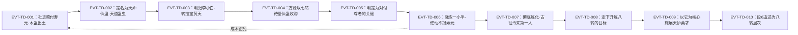

# 天妒仙蛊

天道系仙蛊，首次现身于**杜志晓的尸体胸口**——原文对它形制的描写固定不变：`E:V6-402734`「这只仙蛊仿佛水晶所制，形如跳蚤，大如拳头，团成一团，也不发声，十分静默。」它被原文同时贴上两个看似相反的标签：`E:V6-402752`「天妒仙蛊乃是天道蛊虫，和它类似的还有天怒仙蛊、天悲仙蛊等。这类天道仙蛊，即便是九转蛊尊都无法催动。」与 `E:V6-402756`「天妒这类的仙蛊比较特殊，能够和嫉妒的情感共鸣，自己发动起来。但代价巨大，需要折损蛊修的寿元。」——**不可催动是通则，靠情感共鸣自行发动是它的例外**，而这份例外的代价落在持有者的寿元上。

原文三处独立给它的转数是**七转**（`E:V6-402772`、`E:V6-405548`、`E:V6-405612`）；方源后来自陈目标是 `E:V6-405614`「需要将天妒仙蛊升炼成八转！」，至段6追述时它已被写作 `E:V6-425508`「八转层次的天机蛊、天妒蛊」。

本页为 2026-09-28 A 线恢复批**新建页**。三条必须先声明的取证要点：**其一**，本批任务提示称"登记锚 `E:V6-402772` 所在行是章节题名行"，**实测不符**——该行是正文行且正含转数明文「我们这只天妒仙蛊可是高达七转」；真正的题名行是 `E:V6-402728`「章节目录 第一百五十五节：天妒仙蛊」（两者数字形近，疑似转写讹误）。本页按"锚点为正文行"处理，并在《待核对》上抛（主题三）。**其二**，本页**仍然**执行"题名行不作转数／机制证据"这一纪律：全部转数、机制、代价结论都另取正文行，题名行只用于证明"该名在全书出现"。**其三**，本实体与「宿命蛊」同类而不同物，且「天妒」二字在全书大量作常用词出现，故正文设《身份边界》专节并给全部命中分类账（主题四）。所有引文回根原文；正文按"原著事实 → 合理推导 →《问真》设计意义"三层组织。

## 主题档案

### 一、身世与流派：天道蛊虫，「即便是九转蛊尊都无法催动」，却有一个凡人可催动的特例

#### 原著事实

- **出土**：`E:V6-402732`「在杜志晓的尸体上，一只仙蛊逐渐在其胸口浮现而出。」；形制 `E:V6-402734`「这只仙蛊仿佛水晶所制，形如跳蚤，大如拳头，团成一团，也不发声，十分静默。」
- **"凡人也能催动"这一反常被原文先点出、后解释**：`E:V6-402736`「就是因为这只仙蛊，所以杜志晓一届凡人，才能影响到了灾劫？」；通例 `E:V6-402738`「要催动仙蛊，通常是需要仙元的。但也有一些特例，不受此项约束。」；判断 `E:V6-402740`「看来这只奇妙的仙蛊，即便凡人也能催动。」
- **定名与流派**：`E:V6-402748`「这只仙蛊竟然是天妒仙蛊！」；`E:V6-402752`「天妒仙蛊乃是天道蛊虫，和它类似的还有天怒仙蛊、天悲仙蛊等。这类天道仙蛊，即便是九转蛊尊都无法催动。」——**同类不同物者**：天怒仙蛊、天悲仙蛊（各命中 1 行）。
- **"天道蛊虫不可运用"的通则**：`E:V6-402760`「但天道蛊虫是蛊修无法运用的，最著名的例子便是宿命蛊。」（该句把宿命蛊立为最著名的例子，正因为此，本实体极易被与宿命蛊混为一谈，见主题四）
- **归属**：苏尚书当场判定 `E:V6-402764`「小白，这只天妒仙蛊是你的。你如何处置，是你的事情。」——**支付方／受益方的第一层**：杜志晓付出了寿元（主题二），本实体作为战利品归李小白。

#### 合理推导

- **"天道蛊虫"是流派标签，"不可催动"是通则而非本实体的绝对限制**。结论：`E:V6-402752` 与 `E:V6-402756` 分处相邻两段，后者用"比较特殊"明确提出例外。依据：两段是同一场对话的**连续追问结构**（苏琪涵先反驳"我们明明刚刚就看到了杜志晓催动这只仙蛊"，苏尚书才补充例外）。**不确定性**：原文未给出"哪些天道仙蛊有例外"的完整清单；`E:V6-402758` 把问题延伸到力量蛊、智慧蛊，而 `E:V6-402760` 的回答是"这我也不能确定"——**原文自承不确定**。
- **形制描写的稳定性可当作同一实体的识别依据**。结论：`E:V6-402734` 与 `E:V6-405544`（"这只仙蛊本身就仿佛是水晶所制的跳蚤，拳头大小，一直团成一团"）在相隔两千余行后仍用同一套措辞。依据：两处独立描写高度一致。**不确定性**：形制相似不等于同一只——原文未给唯一性编号，本页只能依上下文（均为方源／李小白线索）判断为同一只。

#### 《问真》设计意义

- **"通则＋例外"是现成的两条规则文本**：`E:V6-402752` 可作"天道类道具不可主动使用"的通则，`E:V6-402756` 可作本实体独有的例外条款。两条都在原文里，不需要发明。
- **"凡人亦可催动"是原文自带的稀有度反直觉点**：`E:V6-402736`→`E:V6-402740` 把"凡人催动仙蛊"当作反常事件处理。建议在数据层把它记为**触发条件豁免**，而不是简单的等级门槛。
- **同类不同物的三件套可直接成组**：天妒仙蛊／天怒仙蛊／天悲仙蛊在原文里被并列（`E:V6-402752`），可做一组"情绪型天道蛊"的家族设计，各自绑定一种情感——本实体绑定的是嫉妒（`E:V6-402756`）。

### 二、触发机制与代价：与嫉妒「共鸣，自己发动起来」，代价是「折损蛊修的寿元」

#### 原著事实

- **机制句（唯一直接机制句）**：`E:V6-402756`「天妒这类的仙蛊比较特殊，能够和嫉妒的情感共鸣，自己发动起来。但代价巨大，需要折损蛊修的寿元。正是因为这点，杜志晓才从青年变成中年，又从中年转变成老年。」三个要素：**触发条件＝嫉妒的情感**；**发动方式＝自己发动**（不靠催动者）；**代价＝折损寿元**。
- **代价的现场样本**：`E:V6-402756` 后半句即杜志晓的衰老过程（青年→中年→老年）；旁证 `E:V6-402762`「况且引发天妒仙蛊的代价也太大了，折损的寿元太多！」
- **代价四要素登记**：**支付方＝持有／使用者（蛊修）**；**受益方＝未指定**（原文写"自己发动起来"，未给受益对象；对杜志晓而言其效果是用于"为难"他人，见 `E:V6-402736` 的灾劫语境）；**支付时点＝发动之时**；**生效条件＝存在嫉妒情感**（`E:V6-402762`「这只仙蛊需要有嫉妒情感，才会自己发动。」）。
- **代价的反例——方源催动它却没付寿元**：`E:V6-402858`「然后尝试催动天妒仙蛊，竟真的有效了！」；紧接一行 `E:V6-402860`「并没有损耗方源的寿元。」其前置条件与手段另记：`E:V6-402856`「他刚刚先是利用八转仙蛊强炼天妒仙蛊，居然真的成功了一小半。」、`E:V6-402852`「我竟然炼化了一小半的天妒仙蛊！并且，我居然真的能催动天道仙蛊！！是因为那些自在天痕的缘故吗？」
- **不完整炼化的限制**：`E:V6-402862`「我虽然能催动天妒仙蛊，但却非完全催动。天妒仙蛊只被我炼化了一小半，只能算是勉强认可我的资格。所以，它的全部威能我是无法发挥出来的。」
- **完全炼化与其依据**：`E:V6-405548`「这只七转的天妒仙蛊赫然是被他彻底炼化。」；`E:V6-405552`「我恐怕是古往今来第一个，完整炼化天妒仙蛊的人。」；`E:V6-405562`「这些天道道痕加身，终于令我彻底炼化了天妒仙蛊，打破了之前的极限。」；一般化结论 `E:V6-405566`「只要自在天痕多到一定程度，就能炼化天道仙蛊。」

#### 合理推导

- **机制 [已确认]／数值 [待取证] 的切分**。依据：`E:V6-402756` 对该机制给出完整三段式描述（触发条件＝嫉妒情感、发动方式＝自行发动、代价＝折损寿元）。结论：机制层判 `[已确认]`，数值层判 `[待取证]`——原文未给"发动一次折损多少寿元"的量化，也未给触发阈值。**不确定性**：本批 44 行确指命中中**未见**任何量化表述，但取证窗口未覆盖全书，故只写"尚未找到"，**不写"原著没有代价量级"**。本页按契约拆条，**不代填**。
- **"代价可被条件豁免"是本实体最关键的一条推断**。结论：同一实体的代价在杜志晓身上成立（`E:V6-402756`），在方源身上**明写不成立**（`E:V6-402860`）。依据：两处均为正文明确陈述，且方源那条紧跟"催动有效"之后，是刻意对照。**不确定性**：原文把豁免归因于"自在天痕"（`E:V6-402852` 为方源自问，`E:V6-405566` 才把它上升为一般结论），但"自在天痕"与"嫉妒情感"的关系（是替代了情感条件？还是只豁免了寿元支付？）**尚未找到**明文。本页不裁定该机制细节。
- **"不可催动"的通则与方源的做法并不冲突**。结论：通则说"蛊修无法运用"（`E:V6-402760`），方源靠"先强炼、再催动"绕开（`E:V6-402856`→`E:V6-402858`）。依据：原文自己把这条路径写成"居然真的成功了一小半"的意外语气。**不确定性**：原文未说明**他人**能否复制该路径（`E:V6-405552` 只说方源是第一个"完整炼化"的人）。

#### 《问真》设计意义

- **"情绪触发＋寿元代价"可以直接落成一条状态机**：条件（嫉妒情感存在）→ 自行发动 → 扣减持有者寿元（`E:V6-402756`）。三个环节都有原文依据，且**代价落在持有者而非施法目标**——这一点常被写反，本页据此登记支付方。
- **豁免条件同样有原文依据，且属于"高价值信息"**：`E:V6-402860`「并没有损耗方源的寿元。」是原文对代价规则唯一的破例记录。建议把它实现为一条**显式的豁免规则**（凭自在天痕／天道道痕积累），而不是把寿元代价直接调成 0。
- **"自行发动"意味着玩家不可控**：`E:V6-402756` 写的是蛊自己发动。若 runtime 需要"持有风险型道具"，本实体比任何自造的诅咒道具都更贴原文——风险由持有条件（情绪）触发，与持有者的意愿无关。

### 三、转数两阶段：正文三处「七转」→ 拟升炼八转 → 段6「八转层次」口径

#### 原著事实

- **登记锚所在行给出七转，且为正文行**：`E:V6-402772`「我们这只天妒仙蛊可是高达七转，我们吃亏一些，换取一只六转信道仙蛊就可以啦。」——该行是苏琪涵抓住苏尚书袖口时的撒娇话，「高达七转」出自持有方（李小白一方）之口。
- **另两处独立七转**：`E:V6-405548`「这只七转的天妒仙蛊赫然是被他彻底炼化。」；`E:V6-405612`「即便我现在将天妒仙蛊彻底炼化了，它也只是七转。」
- **题名行与转数无关**：`E:V6-402728`「章节目录 第一百五十五节：天妒仙蛊」——题名只能证明"该名在全书出现"；本页的转数结论全部取自 `E:V6-402772`、`E:V6-405548`、`E:V6-405612` 三处正文。**并请注意**：本批提示把登记锚说成题名行，与其相伴的结论"转数必须另取正文证据"方向正确，但**锚点认定有误**（见《待核对》）。
- **升炼的目标与其阻力**：`E:V6-405614`「需要将天妒仙蛊升炼成八转！」；`E:V6-405620`「但是，方源的天道境界相当普通，连大师级境界都不是。虽然方源的炼道境界高达准无上，但要研发出天妒仙蛊的八转仙蛊方，还是很困难的。」；预计周期 `E:V6-405624`「初步估计，至少得有两三年的推算时间。」
- **八转仙蛊方的取得路径**：`E:V6-405634`「天地乾坤既然能自然产生天妒仙蛊，那么，必然是掌握了天妒仙蛊方的。」；`E:V6-405636`「方源也不多要，只要一份正确的天妒仙蛊方，他就能凭借炼道造诣，去不断改良出适合自己的。」
- **段6追述口径（另一种写法）**：`E:V6-425508`「方源原本就有天道积累：八转层次的天机蛊、天妒蛊，以及方源在疯魔窟中施展出来的天妒英才杀招，还有如今力保的天相杀招。」

#### 合理推导

- **时点序列推断**。结论：本实体存在**至少两个转数时点**——首见至彻底炼化均为七转（`E:V6-402772`、`E:V6-405548`、`E:V6-405612`），段6追述记为"八转层次"（`E:V6-425508`）。依据：三处七转的行号（402772／405548／405612）**全部早于**升炼意向句（405614）与段6追述（425508），顺序自洽。**不确定性**：`E:V6-425508` 的"八转层次"在句中共列两物（天机蛊、天妒蛊），**原文未逐项标注转数归属**，故"八转修饰两者"是**句法推断**而非明文；若"八转"只修饰天机蛊，则本实体在段6仍为七转（升炼未见明文完成）。本页并列两说，不裁定（见《待核对》）。
- **"升炼目标"与"升炼完成"是两个不同事实**。结论：`E:V6-405614` 是意向句（"需要……"），本批命中覆盖范围内**尚未找到**"升炼完成"的明文。依据：逐条核对 44 行确指命中，`E:V6-425508` 是唯一出现"八转"与其并列的行。**不确定性**：本批取证窗口未覆盖段6全部章节，故只写"尚未找到"，**不写"原著没有升炼完成"**。
- **本库 `lore_rank=7` 与原文首见口径一致**：锚点行 `E:V6-402772` 明写七转，且 `E:V6-405612` 在较后行仍确认"它也只是七转"。依据：两处均为独立正文明文，且后者时点晚于首见。结论：`lore_rank=7` **无冲突**；段6的八转属"追述更高转数"的另一时点。**不确定性**：本条只覆盖"7 与首见口径一致"；段6是否已升炼为八转，原文未逐项标注（两说并列见《待核对》），故本页不据此断言八转已达成。

#### 《问真》设计意义

- **"七转起点＋可升炼至八转"是一组可直接落地的两段式数值**：起点有锚点行明文（`E:V6-402772`），终点有段6口径（`E:V6-425508`）与升炼意向（`E:V6-405614`）。建议数据层显式区分 `lore_rank_initial=7` 与 `lore_rank_later=8`，避免把两个时点压成一个数。
- **升炼路径本身就是一段可玩内容**：`E:V6-405620`（天道境界不足）＋`E:V6-405624`（需两三年推算）＋`E:V6-405634`（向天地索取蛊方）三句合起来给出了"想升炼但被境界卡住→用师法自然换蛊方"的完整解法。这是原文内现成的任务设计。
- **`E:V6-425508` 的句法歧义应被显式标注**：它同时列了天机蛊与天妒蛊，"八转"归属未逐项写明。下游若直接采信"本实体八转已达成"，属于超出原文的读法。

### 四、身份边界与命名预筛：不是宿命蛊；「天妒英才」是杀招；「天妒」是常用词

#### 原著事实（分类账）

**A. 本页不是「宿命蛊」——同类不同物**

- 两者同属天道蛊虫，但被原文并列而非等同：`E:V6-402752`（天道蛊虫，"和它类似的还有……"）；`E:V6-402760`（"天道蛊虫是蛊修无法运用的，最著名的例子便是宿命蛊"）。
- 两者在方源手上被**分开处理**，且本实体是**摸着它去推想宿命蛊**：`E:V6-402870`「天妒仙蛊乃是天道仙蛊，宿命蛊也同样如此。我既然能炼化天妒仙蛊，是不是也就意味着，我也能炼化宿命蛊，掌控宿命？」——该句是假设句，**不表示宿命蛊已被炼化**。
- **结论**：不得把「宿命蛊」写进本页 aliases；本页与 [宿命蛊](fate-gu.md) 互为边界页。宿命蛊另有 id `heaven_atk_5_01_gu` 与 `fate_gu`，本页不评论其 id 重复问题。

**B. 本页不是「天妒英才」——那是方源的杀招名**

- 题名行：`E:V6-412086`「章节目录 第二百节：天妒英才」（题名只证明该名在全书出现）。
- 正文：`E:V6-412290`「方源催动的这一招，名为天妒英才，乃是以天妒仙蛊为核心，专门打击那些天资卓越之辈。」——**关系是"杀招以本蛊为核心"**，不是同一物；`E:V6-412082`「方源开始调度天妒仙蛊！」是其前置动作。
- 另有引用式提及：`E:V6-425508` 同句并列了「疯魔窟中施展出来的天妒英才杀招」与「天妒蛊」。

**C. 本页不是「天妒」这个常用词**

- `E:V4-123576`「我的才华已经惹来了天妒！」；`E:V4-150396`「惹来天妒，天劫地灾就会来削弱你。」；`E:V6-432208`「九转的存在，不管是蛊仙还是仙蛊，都遭受着天妒，难以保存。」——三处均为**普通名词用法**，与蛊无关。
- 词根量级：「天妒」命中 **87 行**，而确指本实体的只有 **44 行**（全名 43 ＋ 别写「天妒蛊」1）。

**D. 本页不是「天妒楼」——那是门派名**

- 「天妒楼」命中 **35 行**，分属段 2／4／5／6（段4 最密，24 行），是**门派名**而非蛊名；本页不展开该门派内容，仅登记为同词根异物。

**E. 「天妒蛊」是本实体的另一种写法（别名成立）**

- `E:V6-425508` 把同一批天道积累写作「八转层次的天机蛊、天妒蛊」；该行语境（方源的天道积累清单）与 `E:V6-405618`「天道仙材这个方面，方源还是有一批的。」＋「但是只在天妒仙蛊这一点上用力，还是足够的。」完全对应，故判为**同一实体的简称／别写**。全书仅此 1 行使用该写法。

**F. 分类账（词根「天妒」的归口）**

| 类 | 词 | 命中行数 | 归属 |
|---|---|---|---|
| A | 天妒仙蛊 | 43 | 本实体（全部落在段6） |
| B | 天妒蛊 | 1 | 本实体（别写，仅 `E:V6-425508`） |
| C | 天妒英才 | 6 | **另一对象**（杀招，含题名行 `E:V6-412086`） |
| D | 天妒楼 | 35 | **另一对象**（门派名，跨段 2／4／5／6） |
| E | 天妒（常用词／概念，含题名行等） | 87 | 非实体 |
| F | 天怒仙蛊 / 天悲仙蛊 | 各 1 | 同类不同实体（`E:V6-402752`） |

- 计数口径：以上为**去重到行**的子串命中；因 A／B／C／D 均为「天妒」的子串，本表是**分摊而非划分**，各类之和大于词根 87。
- 本实体的**名称字面命中数**：「天妒仙蛊」**43 行**；加别写「天妒蛊」1 行，**去重后确指本实体 44 行**。
- **未发现子串误切为本实体的行**：逐条复核 44 行后，**没有**跨词切分造成的假命中；噪声（43 行）全部落在杀招、门派名与常用词一侧。

#### 合理推导

- **"天道蛊虫"这一族里，本实体是少数被写"能催动"的**：结论：`E:V6-402756`（本实体可自行发动）与 `E:V6-402760`（天道蛊虫蛊修无法运用，最著名例子是宿命蛊）构成对照。依据：两段紧邻且互为补足。**不确定性**：原文未给出该族成员的完整名单，`E:V6-402752` 的"和它类似的还有天怒仙蛊、天悲仙蛊等"用了"等"字，说明不完整。
- **"天妒"词根里非实体的占比极高**。结论：44／87＝50.6% 是真命中，另外 49.4% 是常用词、杀招与门派名。依据：上表。**不确定性**：无法保证"天妒"作为常用词的行内没有同时提到本实体（本页已逐行核对，未发现这类叠加行；若有遗漏，属分类账精度问题而非事实错误）。

#### 《问真》设计意义

- **"天妒"是本批四个实体里同根率最高的一例**：50.6%。以词根做召回会把本页放大近一倍。建议数据层对本实体同样强制全名优先、简称白名单（白名单至少含 `天妒蛊`）。
- **与宿命蛊的边界应靠"可行性"而非"名字"区分**：`E:V6-402870` 的假设句是**因果起点**（能炼化本实体→也许能炼化宿命蛊），正好适合做一条解锁链：炼化本实体 → 解锁对宿命蛊的可炼化判定。这条链完全由原文支撑。
- **杀招与本蛊的"核心—要素"关系值得显式建模**：`E:V6-412290` 明写杀招以本蛊为核心，可直接做成 `killer_move.requires` 指向本实体的引用，而不是写在描述文字里。

## 状态时间线

| 状态 ID | 阶段 | 状态 | 证据 |
|---|---|---|---|
| ST-TD-01 | 出土期 | 自杜志晓尸身胸口浮现；水晶跳蚤状、大如拳头、团成一团、静默无声；凡人亦可催动 | E:V6-402732、E:V6-402734、E:V6-402736、E:V6-402740 |
| ST-TD-02 | 定名与流派登记期 | 查知为天妒仙蛊；天道蛊虫；同类有天怒仙蛊、天悲仙蛊；"即便是九转蛊尊都无法催动" | E:V6-402748、E:V6-402752 |
| ST-TD-03 | 代价揭示期 | 与嫉妒情感共鸣、自行发动；代价巨大＝折损蛊修寿元；杜志晓因此由青年变中年再变老年 | E:V6-402756、E:V6-402762 |
| ST-TD-04 | 归属期（李小白） | 苏尚书判归李小白；李小白未上缴，改挂宝黄天寄卖 | E:V6-402764、E:V6-402788 |
| ST-TD-05 | 转数确认期 | 持有方自陈「我们这只天妒仙蛊可是高达七转」 | E:V6-402772 |
| ST-TD-06 | 行情受挫期 | 苏尚书判"天道仙蛊就算高达八转，实用价值也很低"；且无人可直接催用 | E:V6-402774、E:V6-402790 |
| ST-TD-07 | 交易期 | 方源以七转诗壁仙蛊收购，李小白当日成交；苏尚书嘲其买家为"蠢货" | E:V6-402798、E:V6-402804、E:V6-402812、E:V6-402814 |
| ST-TD-08 | 部分炼化期 | 方源以八转仙蛊强炼，成功一小半；催动生效且**未损寿元**；但未能发挥全部威能 | E:V6-402856、E:V6-402858、E:V6-402860、E:V6-402862 |
| ST-TD-09 | 完全炼化期 | 天道道痕积累后彻底炼化；自承"古往今来第一个，完整炼化天妒仙蛊的人" | E:V6-405548、E:V6-405552、E:V6-405562、E:V6-405566 |
| ST-TD-10 | 升炼意向期 | 自陈"需要将天妒仙蛊升炼成八转"；受天道境界与蛊方所限，预计两三年推算 | E:V6-405612、E:V6-405614、E:V6-405620、E:V6-405624 |
| ST-TD-11 | 段6追述期 | 被列入「八转层次的天机蛊、天妒蛊」；并作为杀招「天妒英才」的核心 | E:V6-412290、E:V6-425508 |

## 原著明确内容（本批取证窗口登记）

| 窗口 | 内容要点 | 对应主题 |
|---|---|---|
| 123570–123580 | 「天妒」作**常用词**出现（"我的才华已经惹来了天妒"）——非本实体 | 主题四 |
| 150390–150400 | 「天妒」作常用词（"惹来天妒，天劫地灾就会来削弱你"）——非本实体 | 主题四 |
| 402720–402730 | **题名行窗口**：`E:V6-402728`「章节目录 第一百五十五节：天妒仙蛊」（题名只证明该名在全书出现） | 主题三 |
| 402732–402744 | 出土现场：胸口浮现、水晶跳蚤状；凡人亦可催动；苏尚书以信道手段查证 | 主题一 |
| 402748–402752 | 定名与流派：天妒仙蛊；天道蛊虫；同类天怒／天悲；九转蛊尊都无法催动 | 主题一、四 |
| 402754–402764 | 例外与代价：与嫉妒共鸣、自行发动；折损寿元；杜志晓的衰老；苏尚书判归李小白 | 主题二、一 |
| 402766–402782 | 李小白与苏琪涵商议换取信道仙蛊；苏尚书以"天道仙蛊就算高达八转，实用价值也很低"回绝其估价 | 主题三、四 |
| 402786–402798 | 李小白改挂宝黄天寄卖；随即出现买家 | 主题一、四 |
| 402798–402834 | 交易全程：买家出七转诗壁仙蛊；买家即古月方源；方源本有意扶助李小白 | 主题一、四 |
| 402836–402844 | 方源发现本蛊与煮运锅／银光气柱的关联，判断它"似乎是我对付尊者的关键" | 主题二 |
| 402844–402864 | 强炼与部分炼化：吞吸一小半仙元、催出灰色烟雾；催动有效且未损寿元；限制＝未能发挥全部威能 | 主题二 |
| 402864–402870 | 由本实体推及宿命蛊的可行性假设（"是不是也就意味着，我也能炼化宿命蛊"） | 主题四 |
| 404378–404388 | 银光气柱的云团对应本实体（追述性确认） | 主题二 |
| 405534–405552 | 完全炼化：八转白荔仙元灌注、水晶光辉爆散；自承"古往今来第一个，完整炼化天妒仙蛊的人" | 主题二 |
| 405560–405566 | 归因：天道道痕加身→彻底炼化；一般化结论"只要自在天痕多到一定程度，就能炼化天道仙蛊" | 主题二 |
| 405600–405624 | 升炼意向与阻力：需升炼成八转；天道境界不足；预计至少两三年推算时间 | 主题三 |
| 405628–405646 | 解法：培养蛊仙种子渡劫→师法自然→向天地索取天妒仙蛊方 | 主题三 |
| 406590–406600 | 天道境界的提升路径（炼化天道道痕→自在天痕；运用本实体带来的感悟） | 主题二 |
| 412078–412092 | 方源"开始调度天妒仙蛊"；随后为杀招题名行「第二百节：天妒英才」 | 主题四 |
| 412284–412292 | 杀招「天妒英才」明写以本蛊为核心，专打天资卓越之辈 | 主题四 |
| 425500–425514 | 段6天道积累清单：八转层次的天机蛊、天妒蛊；天妒英才杀招；天相杀招 | 主题三、四 |
| 432200–432214 | 「天妒」作**常用词**（"九转的存在……都遭受着天妒，难以保存"）——非本实体 | 主题四 |

## 事件链

| 事件 ID | 事件 | 参与者 | 证据 | 因果 |
|---|---|---|---|---|
| EVT-TD-001 | 杜志晓以凡人之身借本蛊影响灾劫，寿元被折损（青年→中年→老年）后死亡，本蛊自其胸口浮现 | 杜志晓 | E:V6-402732、E:V6-402756 | evidences ST-TD-01、ST-TD-03 |
| EVT-TD-002 | 苏尚书以信道手段查明此蛊为「天妒仙蛊」，并说明天道蛊虫通则与例外 | 苏尚书、苏琪涵、李小白 | E:V6-402748、E:V6-402752、E:V6-402756 | evidences ST-TD-02、ST-TD-03 |
| EVT-TD-003 | 本蛊判归李小白；李小白放弃上缴朝廷，改挂宝黄天寄卖 | 苏尚书、李小白、苏琪涵 | E:V6-402764、E:V6-402788 | evidences ST-TD-04 |
| EVT-TD-004 | 方源以七转诗壁仙蛊收购本蛊，交易即时完成 | 方源、李小白、苏尚书 | E:V6-402798、E:V6-402804、E:V6-402812 | evidences ST-TD-07 |
| EVT-TD-005 | 方源发现本蛊与自家气运／煮运锅的关联，判断它可能是对付尊者的关键 | 方源 | E:V6-402836、E:V6-402842 | evidences ST-TD-08 |
| EVT-TD-006 | 方源以八转仙蛊强炼本蛊，成功一小半；尝试催动有效，且未损耗其寿元 | 方源 | E:V6-402844、E:V6-402856、E:V6-402860 | evidences ST-TD-08 |
| EVT-TD-007 | 天道道痕积累后，方源彻底炼化本蛊，自承古往今来第一人 | 方源 | E:V6-405548、E:V6-405552、E:V6-405562 | evidences ST-TD-09 |
| EVT-TD-008 | 方源定下把本蛊升炼成八转的目标，因天道境界不足转而培养蛊仙种子以换取蛊方 | 方源 | E:V6-405614、E:V6-405620、E:V6-405634 | evidences ST-TD-10 |
| EVT-TD-009 | 方源以本蛊为核心施展杀招「天妒英才」，打击天资卓越之辈 | 方源 | E:V6-412082、E:V6-412290 | evidences ST-TD-11 |
| EVT-TD-010 | 段6追述：本蛊被列入「八转层次的天机蛊、天妒蛊」 | 方源（追述） | E:V6-425508 | evidences ST-TD-11 |

事件口径：本页新起实体簇号 `EVT-TD-*`（与分配前缀 `ST-TD-*` 同簇，与既有 `EVT-*` 前缀未冲突）。事件节点 10 个，已达"≥3 节点应配 mermaid"的阈值；虚线回指 EVT-TD-001，表示**同一条代价规则在两名持有者身上结果相反**（杜志晓付寿元／方源不付），这是本页最值得保留的对照。事件时序按原文行号推定。

## 资料整理

本页为**新建页**，没有旧版；本批来源只有根原文，没有 `notes:`／`memory:` 层转述进入本页事实区。相关派生记录的处置登记如下（本段内容不得当作原著事实）：

- `roster-3.md` 第 63 行为 `| heaven_atk_5_03_gu | 天妒仙蛊 | 5 | 7 | E:V6-402772 |  |`。本页复核：**id、名称、转数（7）、锚点四项均与原文一致**——锚点行是正文行且明写「我们这只天妒仙蛊可是高达七转」，与 `lore_rank=7` 相符。**注意**：本批任务提示称该锚点是"章节题名行 / 转数须另取正文证据"，实测不符（题名行是 `E:V6-402728`）。该提示所要求的纪律（题名不作证据）本页照办，但其**锚点认定**需上抛更正（见《待核对》）。
- `game/data/gu_lore.json` 的 `heaven_atk_5_03_gu` 为 `game_rank=5`、`status=rank_cap`、`lore_rank=7`、`anchor=E:V6-402772`；`game/data/gu_names.json` 第 291 行为 `"heaven_atk_5_03_gu": "天妒仙蛊"`。本页逐一核对，**未见差异**；`game/**` 只读，不在本批改动范围。
- **id 归类张力（派生层，弱）**：id 前缀为 `heaven_atk_*`（天道·攻击），与本实体的流派（天道蛊虫，`E:V6-402752`）一致；其"攻击"属性有明文支撑（杀招「天妒英才」以它为核心、专打天资卓越之辈，`E:V6-412290`）。本轮不改 id。
- **别写的收录决定**：「天妒蛊」（1 行，`E:V6-425508`）本页判为**同一实体的别写**并收入 aliases；判据是该行语境（方源天道积累清单）与 `E:V6-405618` 的天道仙材语境对应，且命名构词与前文一致（天妒＋蛊）。该项为**推定**，已在《待核对》登记。
- **重复文本块检查**：本批对本实体命中行做了相邻行比对，**未见** `heaven-atk-5-07-gu.md`《资料整理》登记过的那种"逐行重复文本块"；本页"43 行／44 行／87 行"等计数为**去重到行**的口径。
- **同批姊妹页**：本页与 [我力仙蛊](force-atk-5-20-gu.md)、[飞熊之力蛊](force-mov-5-21-gu.md)、[命运蛊](heaven-atk-5-02-gu.md) 同属本分片。其中 [命运蛊](heaven-atk-5-02-gu.md) 的原料之一即 [宿命蛊](fate-gu.md)，与本页的边界对象相同但关系不同（命运蛊是**产物**、本页是**同类**），两页不互相套用结论。
- **体积**：本页实测低于 40 KB（不足 40,000 字节），故**不登记例外**；亦未为控制体积删减有效知识。

## 分析与解读

1. **本实体最容易被写错的地方是"代价"的记账方**。代价的支付方是**持有／使用者**（`E:V6-402756` 的杜志晓、"折损蛊修的寿元"），不是被打击的目标；而同一规则在方源身上被明文豁免（`E:V6-402860`「并没有损耗方源的寿元。」）。任何把"寿元代价"简化成固定数值的实现都会同时丢掉这两半。
2. **"不可催动"与"自行发动"并非矛盾，而是通则与例外**：`E:V6-402760` 给出通则（天道蛊虫蛊修无法运用，最著名的例子是宿命蛊），`E:V6-402756` 给出本实体的例外（与嫉妒共鸣、自己发动）。原文把例外归在情绪条件上，而把方源的豁免归在**自在天痕**上（`E:V6-402852`、`E:V6-405566`）——这是两条不同的路径，不应合并成一句"天妒仙蛊可以催动"。
3. **转数是两段式，不是单一值**：三处七转（`E:V6-402772`、`E:V6-405548`、`E:V6-405612`）全部早于升炼意向（`E:V6-405614`）与段6追述（`E:V6-425508`）。本库 `lore_rank=7` 取的是首见口径，正确；但若下游只读这一个数，就看不出"它后来被记为八转层次"这条变化。
4. **本页的题名行与锚点形近而实异**：`E:V6-402728`（题名）与 `E:V6-402772`（正文·七转）相差 44 行、数字形近。这不是本页的局部问题——它说明**锚点核对必须以行的实际内容为准**，而不是以行号形近为准。
5. **"天妒"是本批同根率最高的词根**：确指本实体 44 行 vs 词根 87 行（50.6%），其余落在常用词（多处）、杀招「天妒英才」（6 行）与门派名「天妒楼」（35 行）。以词根召回的噪声主要来自"常用词"这一档，而不是来自其他实体。
6. **与宿命蛊的关系值得单独立链**：`E:V6-402870` 明写"我既然能炼化天妒仙蛊，是不是也就意味着，我也能炼化宿命蛊"——本实体是通往宿命蛊的**可行性样本**。这层关系在 [命运蛊](heaven-atk-5-02-gu.md) 页（宿命蛊是它的蛊材）与 [宿命蛊](fate-gu.md) 页里都不会出现，只有本页有。

## 待核对

- `[存在冲突]` **批次提示与实测不符：登记锚 `E:V6-402772` 不是章节题名行**。实测：`E:V6-402772` 是正文行，含「我们这只天妒仙蛊可是高达七转，我们吃亏一些，换取一只六转信道仙蛊就可以啦。」一句——**正含转数明文**；真正的题名行是 `E:V6-402728`「章节目录 第一百五十五节：天妒仙蛊」（两行相差 44 行，数字形近）。**当前状态**：本页按"锚点为正文行、且该行自身即转数证据"处理；同时仍执行"题名行不作转数／机制证据"的纪律（本页全部转数取自 `E:V6-402772`、`E:V6-405548`、`E:V6-405612` 三处正文）。**需主持人裁定**：批次提示中的"题名行"是否本意指 `E:V6-402728`；若 roster／`gu_lore.json` 需改锚，本页不改。
- `[待取证]` **段6「八转层次」是否修饰本实体**。`E:V6-425508` 同句并列「八转层次的天机蛊、天妒蛊」，原文**未逐项标注转数归属**。口径 A（"八转"同时修饰两者）＋证据：该句以顿号并列两物、共用前置定语；口径 B（"八转"只修饰天机蛊，本实体仍为七转）＋证据：`E:V6-405612` 在较后行仍写"它也只是七转"，而本批 44 行确指命中中**未见**"升炼完成"的明文。**当前状态**：本页并列两说，不裁定。
- `[待取证]` **寿元代价的具体数值**。机制 `[已确认]`：`E:V6-402756` 给出触发（嫉妒情感）、方式（自行发动）、代价（折损寿元）三段式。**当前状态**：原文未给单次扣减量、触发阈值或"折损多少年"；全部 44 行确指命中中**未见**量化表述。本页不代填，也**不写成"原著没有代价量级"**。
- `[待取证]` **"天妒蛊"（`E:V6-425508`）是否确为本实体的别写**。判据：该行语境为方源的天道积累清单，与 `E:V6-405618`「只在天妒仙蛊这一点上用力」对应；构词为"天妒＋蛊"，与前文"天妒仙蛊"同根。**不确定性**：全书仅此 1 行使用该写法，无第二处可互证；不排除它是"天妒仙蛊"的省写或另指。**当前状态**：本页收入 aliases 并在此登记推定性质。
- `[待取证]` **"凡人亦可催动"的成立机制**。`E:V6-402736`→`E:V6-402740` 只描述现象（杜志晓一届凡人却能影响灾劫）与苏尚书的判断（"看来这只奇妙的仙蛊，即便凡人也能催动"），**未给原因**。同段 `E:V6-402738` 也只说"也有一些特例，不受此项约束"。**当前状态**：本页按现象登记，不推原因。
- `[待取证]` **`E:V6-402762` 与 `E:V6-402752` 的关系**：苏琪涵的思量句把"需要有嫉妒情感才会自己发动"与"折损的寿元太多"并列，与苏尚书的原话一致；但苏琪涵是**转述者**，本页不把它当作独立第二证据，仅作旁证。
- `[原著未明确]` **除天怒仙蛊、天悲仙蛊之外，"天道仙蛊"还有哪些成员**。`E:V6-402752` 用的是"和它类似的还有……等"，`E:V6-402758` 又问及力量蛊、智慧蛊，而 `E:V6-402760` 的回答是"这我也不能确定"——**原文自承不确定**。
- `[原著未明确]` **本实体被击败／夺走的经过**。本批命中只记它自杜志晓尸身浮现，其"如何落到杜志晓手中"**尚未找到**；`E:V6-402816` 只说"杜志晓和天妒仙蛊是在方源的意料之外"。
- **体积**：本页实测低于 40 KB（同上一条）。
- 本页**不自证**：以上 `[已确认]`／`[待取证]`／`[原著未明确]` 均按本页可见证据标注，最终由独立只读校验组复核。

## 模板扩展建议（只登记，不改核心模板）

1. **"锚点行内容核对"应成为固定校验项，且要比对形近行号**。本页的题名行（402728）与锚点行（402772）形近而性质完全不同。建议在锚点字段旁加一列"锚点行性质（正文／题名／其他）"，并把"与形近行号的对照"列入校验清单。
2. **"代价可被豁免"需要专门字段**。本页的寿元代价在两人身上结果相反（`E:V6-402756` vs `E:V6-402860`），现有《状态时间线》只能靠阶段名表达。建议给代价类事实加"豁免条件"一栏。
3. **"别写仅 1 行"的收录需要标注推定等级**。本页 `天妒蛊` 只出现 1 次，收进 aliases 属推定。建议 aliases 支持置信度或来源行标注，避免下游把推定别名当作勘定别名使用。
4. **同族实体的成组登记位**。天妒／天怒／天悲三蛊在 `E:V6-402752` 被并列，但三者没有共同的登记结构。若后续要为它们成组建页，现有骨架缺一个"家族"字段。

## 关联页面

[宿命蛊](fate-gu.md)、[命运蛊](heaven-atk-5-02-gu.md)、[我力仙蛊](force-atk-5-20-gu.md)、[飞熊之力蛊](force-mov-5-21-gu.md)、[蛊虫关系](gu-relations.md)、[蛊虫总表三期·游戏映射蛊精蒸馏](roster-3.md)、[蛊虫总表](roster.md)、[蛊虫总表二期](roster-2.md)、[炼蛊与杀招链](../world/gu-refine-killer-chain.md)、[蛊的饲养与炼化](../world/gu-care-and-refinement.md)、[杀招](../rules/killer-moves.md)、[道痕](../rules/dao-marks.md)、[修行体系](../world/cultivation-system.md)、[方源](../characters/fang-yuan.md)、[蛊虫与蛊师能力来源](cultivator-effects-and-scouting.md)
